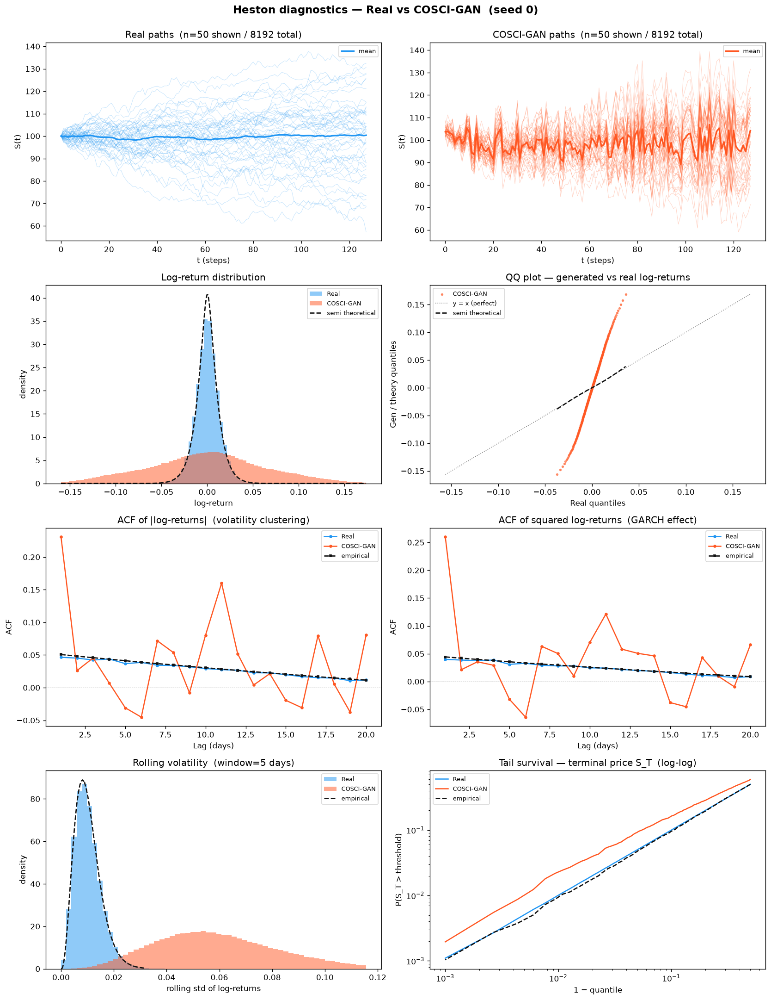
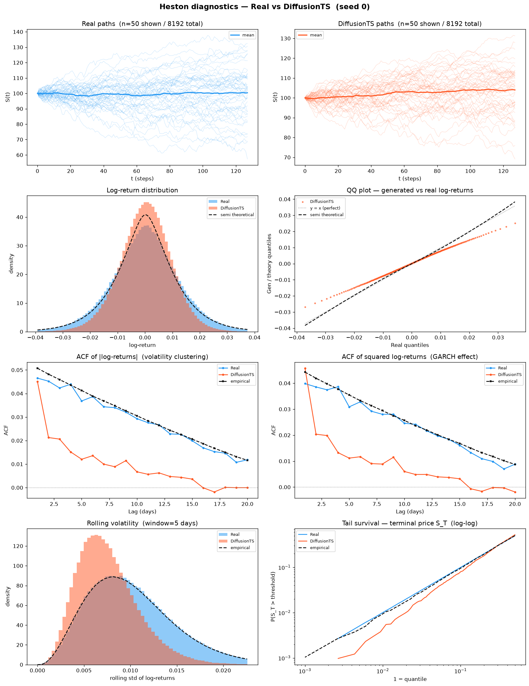
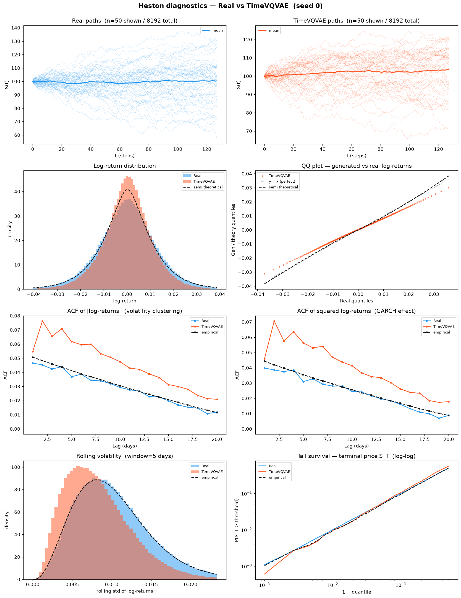
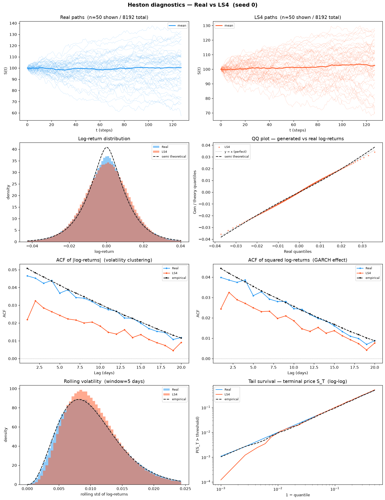
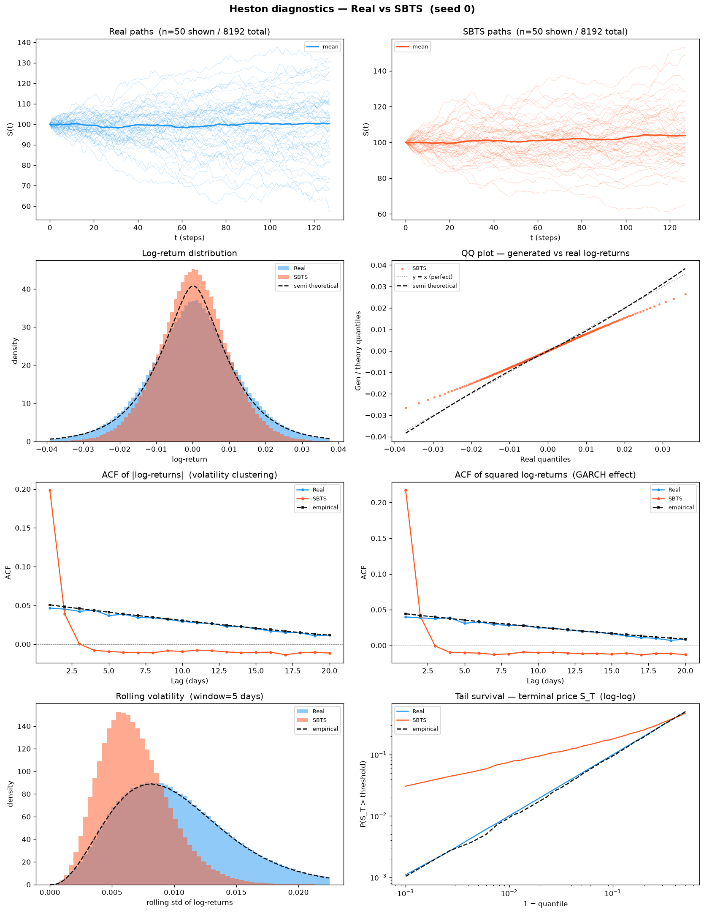

# Time-Series Generation Benchmark

A public benchmark for evaluating **generative models of financial time series**.

Each method is trained on the same target dataset and evaluated with **34 metrics (A1–A34)**
plus **6 curve-shape diagnostics (B)** — each scored by **MSE**, a scale-aware **% error** and **NRMSE** —
across 5 random seeds. Every table carries a **Perfect floor** column: the score a *perfect* generator
still incurs from finite-sample noise, measured by drawing an **independent Heston simulation** (a fresh
8 192-path draw, seeds 1000+) and scoring it against the **held-out test set** exactly as every method is
scored (see [`methods/perfect_recovery/`](methods/perfect_recovery/)). The floor is therefore **non-zero**
and identical in construction across methods — it is the noise a genuine Heston sample cannot avoid, not a
degenerate zero.

---

## Results — Heston (mean ± std, 5 seeds)

Cross-method comparison on 8 192 Heston price paths (seq\_len=128).
↓ = lower is better. ↑ = higher is better. **Bold** = best across methods.

### A1–A34 — Metrics by category

Methods are grouped by model family. ↓ = lower is better, ↑ = higher is better, A28 target = 1.0.
**Bold** = best across methods. Every method is scored against the **held-out test set** (an 8 192-path
Heston draw, seed 1); the *Perfect* floor is an independent Heston draw scored the same way.

<table>
<thead>
  <tr>
    <th rowspan="2">Metric</th>
    <th colspan="2">GAN</th>
    <th colspan="2">Diffusion</th>
    <th colspan="3">VAE</th>
    <th>Schrödinger Bridge</th>
    <th>Fourier Flow</th>
    <th rowspan="2">Winner</th>
  </tr>
  <tr>
    <th>TimeGAN</th>
    <th>COSCI-GAN</th>
    <th>Diffusion-TS</th>
    <th>CSDI</th>
    <th>TimeVAE</th>
    <th>TimeVQVAE</th>
    <th>LS4</th>
    <th>SBTS</th>
    <th>Fourier Flow</th>
  </tr>
</thead>
<tbody>
  <tr><td colspan="11"><b>— Fat Tail —</b></td></tr>
  <tr><td>A1 Kurtosis Error ↓</td><td>2.954 ± 2.098</td><td>0.5615 ± 0.1128</td><td>0.4242 ± 0.02303</td><td><b>0.09543 ± 0.02623</b></td><td>2.257 ± 0.5719</td><td>0.1363 ± 0.09243</td><td>0.3684 ± 0.01609</td><td>0.1183 ± 0.006001</td><td>0.5761 ± 0.008273</td><td><b>CSDI</b></td></tr>
  <tr><td>A2 \|r\| q95 Error ↓</td><td>0.003196 ± 0.001907</td><td>0.09711 ± 0.003466</td><td>0.006902 ± 1.57e-04</td><td>0.005393 ± 1.50e-04</td><td>0.02227 ± 1.22e-04</td><td>0.004515 ± 2.54e-04</td><td><b>3.99e-04 ± 1.13e-04</b></td><td>0.006390 ± 2.97e-05</td><td>7.21e-04 ± 2.10e-04</td><td><b>LS4</b></td></tr>
  <tr><td>A3 \|r\| q99 Error ↓</td><td>0.004342 ± 0.002767</td><td>0.1240 ± 0.005959</td><td>0.01032 ± 1.75e-04</td><td>0.007327 ± 2.29e-04</td><td>0.03082 ± 1.05e-04</td><td>0.006058 ± 3.03e-04</td><td><b>0.001156 ± 1.66e-04</b></td><td>0.009803 ± 4.84e-05</td><td>0.002325 ± 5.06e-04</td><td><b>LS4</b></td></tr>
  <tr><td>A4 Tail QQ Error ↓</td><td>0.003401 ± 0.001522</td><td>0.09566 ± 0.003535</td><td>0.006781 ± 1.50e-04</td><td>0.005296 ± 1.50e-04</td><td>0.02191 ± 1.17e-04</td><td>0.004444 ± 2.48e-04</td><td><b>4.05e-04 ± 8.23e-05</b></td><td>0.006290 ± 2.63e-05</td><td>7.42e-04 ± 1.38e-04</td><td><b>LS4</b></td></tr>
  <tr><td>A5 Hill Tail Index Error ↓</td><td>36.32 ± 17.05</td><td>1.614 ± 1.128</td><td>3.047 ± 0.2789</td><td>1.426 ± 0.5856</td><td>1.831 ± 0.6794</td><td>3.777 ± 1.193</td><td><b>1.225 ± 0.4268</b></td><td>10.06 ± 0.3457</td><td>5.802 ± 2.000</td><td><b>LS4</b></td></tr>
  <tr><td colspan="11"><b>— Distribution —</b></td></tr>
  <tr><td>A6 Path MMD² ↓</td><td>0.01866 ± 0.01472</td><td>0.04686 ± 0.004162</td><td>0.004476 ± 8.48e-04</td><td>0.003646 ± 4.16e-04</td><td>0.01914 ± 0.001334</td><td>0.003433 ± 7.97e-04</td><td><b>0.001926 ± 2.51e-04</b></td><td>0.01106 ± 8.13e-04</td><td>0.005527 ± 0.002289</td><td><b>LS4</b></td></tr>
  <tr><td>A7 Terminal MMD² ↓</td><td>0.03072 ± 0.02472</td><td>0.01623 ± 0.01333</td><td>0.003676 ± 0.001070</td><td>0.003605 ± 8.41e-04</td><td>0.004951 ± 0.001715</td><td>0.003838 ± 0.001368</td><td><b>0.001520 ± 3.61e-04</b></td><td>0.009545 ± 0.001668</td><td>0.01105 ± 0.006414</td><td><b>LS4</b></td></tr>
  <tr><td>A8 Increment MMD² ↓</td><td>0.008280 ± 0.004303</td><td>0.4788 ± 0.01185</td><td>0.01109 ± 7.52e-04</td><td>0.008062 ± 7.11e-04</td><td>0.2130 ± 0.001204</td><td>0.007018 ± 0.001054</td><td><b>9.63e-04 ± 3.76e-05</b></td><td>0.007378 ± 3.39e-04</td><td>0.001124 ± 6.46e-05</td><td><b>LS4</b></td></tr>
  <tr><td>A9 Volatility MMD ↓</td><td>0.3975 ± 0.2486</td><td>3.955 ± 0.04883</td><td>0.3846 ± 0.02464</td><td>0.2498 ± 0.01607</td><td>3.575 ± 0.4476</td><td>0.1932 ± 0.02799</td><td><b>0.01447 ± 0.001550</b></td><td>0.3139 ± 0.01207</td><td>0.05871 ± 0.007003</td><td><b>LS4</b></td></tr>
  <tr><td>A10 Terminal SWD ↓</td><td>2.917 ± 1.131</td><td>4.756 ± 3.118</td><td>1.684 ± 0.3010</td><td>1.618 ± 0.2760</td><td>1.947 ± 0.3598</td><td>1.356 ± 0.2690</td><td><b>0.7480 ± 0.3255</b></td><td>3.710 ± 0.2944</td><td>2.710 ± 1.034</td><td><b>LS4</b></td></tr>
  <tr><td>A11 Path SWD ↓</td><td>1.678 ± 0.5770</td><td>3.505 ± 0.1711</td><td>1.212 ± 0.1556</td><td>1.069 ± 0.1305</td><td>1.167 ± 0.1135</td><td>0.8781 ± 0.2081</td><td><b>0.5744 ± 0.1246</b></td><td>2.498 ± 0.1451</td><td>1.334 ± 0.3806</td><td><b>LS4</b></td></tr>
  <tr><td>A12 RV Law Loss ↓</td><td>1.558 ± 0.3879</td><td>118.7 ± 7.929</td><td>2.274 ± 0.04910</td><td>1.920 ± 0.05633</td><td>5.010 ± 0.008395</td><td>1.706 ± 0.08942</td><td><b>0.2415 ± 0.01757</b></td><td>2.175 ± 0.007357</td><td>0.5397 ± 0.1300</td><td><b>LS4</b></td></tr>
  <tr><td>A13 Mean Path RMSE ↓</td><td>0.5356 ± 0.2514</td><td>3.995 ± 0.1803</td><td>0.4399 ± 0.2584</td><td>0.3654 ± 0.3226</td><td>0.3196 ± 0.2225</td><td>0.7593 ± 0.1340</td><td><b>0.1722 ± 0.1200</b></td><td>0.8477 ± 0.1819</td><td>0.4336 ± 0.3651</td><td><b>LS4</b></td></tr>
  <tr><td>A14 KS Log-returns ↓</td><td>0.08474 ± 0.03769</td><td>0.3206 ± 0.007269</td><td>0.06048 ± 0.001904</td><td>0.05391 ± 0.001972</td><td>0.3670 ± 0.004602</td><td>0.05084 ± 0.003747</td><td><b>0.01258 ± 6.74e-04</b></td><td>0.05413 ± 3.75e-04</td><td>0.01895 ± 0.002028</td><td><b>LS4</b></td></tr>
  <tr><td>A15 Skewness Error ↓</td><td>0.3412 ± 0.3279</td><td>0.04981 ± 0.04124</td><td>0.06445 ± 0.03230</td><td>0.03681 ± 0.002124</td><td>0.5479 ± 0.09837</td><td>0.03079 ± 0.008248</td><td>0.02998 ± 0.01249</td><td>0.03158 ± 0.003742</td><td><b>0.02288 ± 0.01115</b></td><td><b>Fourier Flow</b></td></tr>
  <tr><td>A16 QQ RMSE (300-pt) ↓</td><td>0.002506 ± 6.49e-04</td><td>0.04857 ± 0.001967</td><td>0.003073 ± 8.32e-05</td><td>0.002576 ± 8.57e-05</td><td>0.01057 ± 8.40e-05</td><td>0.002268 ± 1.38e-04</td><td><b>3.41e-04 ± 9.53e-06</b></td><td>0.002853 ± 1.15e-05</td><td>5.81e-04 ± 4.14e-05</td><td><b>LS4</b></td></tr>
  <tr><td>A17 Terminal Price KS ↓</td><td>0.1109 ± 0.05875</td><td>0.1473 ± 0.09804</td><td>0.04436 ± 0.007030</td><td>0.03667 ± 0.004476</td><td>0.05127 ± 0.007848</td><td>0.05522 ± 0.009093</td><td><b>0.01584 ± 0.005488</b></td><td>0.09102 ± 0.005462</td><td>0.08098 ± 0.01617</td><td><b>LS4</b></td></tr>
  <tr><td colspan="11"><b>— Adversarial —</b></td></tr>
  <tr><td>A18 Disc Score GRU ↓</td><td>0.03305 ± 0.05328</td><td>0.4999 ± 1.22e-04</td><td>0.08987 ± 0.1524</td><td>0.06302 ± 0.1056</td><td>0.4272 ± 0.08815</td><td>0.07174 ± 0.06503</td><td><b>0.005890 ± 0.001676</b></td><td>0.1246 ± 0.1517</td><td>0.009185 ± 0.009209</td><td><b>LS4</b></td></tr>
  <tr><td>A18 Disc Score MLP ↓</td><td>0.08792 ± 0.04703</td><td>0.5000 ± 0</td><td>0.02426 ± 0.03140</td><td>0.01138 ± 0.002541</td><td>0.1358 ± 0.1503</td><td>0.009002 ± 0.003393</td><td>0.006256 ± 0.002539</td><td>0.008331 ± 0.004230</td><td><b>0.005951 ± 0.002921</b></td><td><b>Fourier Flow</b></td></tr>
  <tr><td colspan="11"><b>— Predictive —</b></td></tr>
  <tr><td>A19 Pred Score GRU ↓</td><td>0.05277 ± 0.001115</td><td>0.1331 ± 0.01808</td><td>0.05112 ± 1.22e-04</td><td>0.05024 ± 1.88e-05</td><td>0.05385 ± 7.71e-04</td><td>0.05014 ± 2.87e-05</td><td><b>0.05001 ± 3.66e-06</b></td><td>0.05453 ± 3.55e-05</td><td>0.05004 ± 2.00e-05</td><td><b>LS4</b></td></tr>
  <tr><td>A19 Pred Score MLP ↓</td><td>0.05322 ± 0.001031</td><td>0.09591 ± 0.006992</td><td>0.05112 ± 1.21e-04</td><td>0.05025 ± 1.43e-04</td><td>0.05243 ± 1.91e-04</td><td>0.05018 ± 6.79e-05</td><td><b>0.05006 ± 1.23e-04</b></td><td>0.05428 ± 3.54e-04</td><td>0.05032 ± 3.48e-04</td><td><b>LS4</b></td></tr>
  <tr><td colspan="11"><b>— Temporal —</b></td></tr>
  <tr><td>A20 Covariance Error ↓</td><td>21.36 ± 9.068</td><td>30.59 ± 29.16</td><td>44.18 ± 10.64</td><td>41.55 ± 5.776</td><td>57.28 ± 1.758</td><td>22.61 ± 14.72</td><td><b>13.63 ± 6.662</b></td><td>139.3 ± 4.886</td><td>60.80 ± 36.58</td><td><b>LS4</b></td></tr>
  <tr><td>A21 ACF \|r\| Error (lags) ↓</td><td>0.1278 ± 0.06738</td><td>0.08056 ± 0.02054</td><td>0.01812 ± 0.002352</td><td><b>0.01126 ± 0.003095</b></td><td>0.3890 ± 0.1057</td><td>0.01979 ± 0.004246</td><td>0.01294 ± 0.001791</td><td>0.05886 ± 4.70e-04</td><td>0.04095 ± 5.50e-04</td><td><b>CSDI</b></td></tr>
  <tr><td>A22 ACF r² Error (lags) ↓</td><td>0.08676 ± 0.03470</td><td>0.09004 ± 0.02156</td><td>0.01587 ± 0.002662</td><td>0.01124 ± 0.002605</td><td>0.3609 ± 0.08849</td><td>0.01817 ± 0.003251</td><td><b>0.006752 ± 0.001737</b></td><td>0.06136 ± 5.71e-04</td><td>0.03498 ± 5.56e-04</td><td><b>LS4</b></td></tr>
  <tr><td>A23 ACF \|r\| Lag-1 Error ↓</td><td>0.2301 ± 0.1034</td><td>0.1700 ± 0.04930</td><td><b>0.002410 ± 0.001465</b></td><td>0.02252 ± 0.004755</td><td>0.4674 ± 0.1346</td><td>0.01523 ± 0.008014</td><td>0.01743 ± 0.005532</td><td>0.1474 ± 0.001169</td><td>0.04897 ± 7.04e-04</td><td><b>Diffusion-TS</b></td></tr>
  <tr><td>A24 ACF r² Lag-1 Error ↓</td><td>0.1760 ± 0.06259</td><td>0.1957 ± 0.05105</td><td><b>0.007895 ± 0.002645</b></td><td>0.02168 ± 0.003561</td><td>0.4630 ± 0.1189</td><td>0.01323 ± 0.007254</td><td>0.009068 ± 0.005290</td><td>0.1706 ± 0.001690</td><td>0.04195 ± 7.01e-04</td><td><b>Diffusion-TS</b></td></tr>
  <tr><td colspan="11"><b>— Vol —</b></td></tr>
  <tr><td>A25 Mean RMSE ↓</td><td>0.7781 ± 0.3669</td><td>4.539 ± 3.359</td><td>0.7610 ± 0.4617</td><td>0.5139 ± 0.4595</td><td>0.3883 ± 0.2340</td><td>1.033 ± 0.1905</td><td><b>0.3270 ± 0.2333</b></td><td>1.499 ± 0.2776</td><td>0.7990 ± 0.7970</td><td><b>LS4</b></td></tr>
  <tr><td>A26 Return Std Error ↓</td><td>0.1525 ± 0.08911</td><td>5.032 ± 0.2229</td><td>0.3107 ± 0.009292</td><td>0.2580 ± 0.009849</td><td>1.074 ± 0.007809</td><td>0.2316 ± 0.01420</td><td>0.004853 ± 0.003540</td><td>0.2501 ± 0.001833</td><td><b>0.004832 ± 0.002757</b></td><td><b>Fourier Flow</b></td></tr>
  <tr><td>A27 Log-Return Std Error ↓</td><td>0.001703 ± 7.89e-04</td><td>0.04975 ± 0.002001</td><td>0.003240 ± 8.19e-05</td><td>0.002667 ± 8.89e-05</td><td>0.01098 ± 7.75e-05</td><td>0.002336 ± 1.37e-04</td><td><b>4.63e-05 ± 2.22e-05</b></td><td>0.003028 ± 1.23e-05</td><td>7.64e-05 ± 5.51e-05</td><td><b>LS4</b></td></tr>
  <tr><td>A28 Kurtosis Ratio (→ 1)</td><td>-1.116 ± 3.593</td><td>-8.150 ± 12.11</td><td>1.903 ± 0.2558</td><td><b>0.8706 ± 0.03043</b></td><td>0.2834 ± 0.04765</td><td>0.8410 ± 0.06953</td><td>1.565 ± 0.07840</td><td>2.028 ± 0.01851</td><td>3.098 ± 0.7754</td><td><b>CSDI</b></td></tr>
  <tr><td>A29 Sigma Mean Error ↓</td><td>0.03089 ± 0.009106</td><td>0.7871 ± 0.03094</td><td>0.04883 ± 0.001266</td><td>0.04078 ± 0.001489</td><td>0.1745 ± 0.001776</td><td>0.03743 ± 0.002059</td><td><b>0.001445 ± 6.99e-04</b></td><td>0.04432 ± 1.84e-04</td><td>0.002245 ± 8.77e-04</td><td><b>LS4</b></td></tr>
  <tr><td>A30 Cross-Sect. Vol Path RMSE ↓</td><td>0.4742 ± 0.2079</td><td>1.155 ± 0.3231</td><td>1.365 ± 0.2012</td><td>1.134 ± 0.1303</td><td>1.325 ± 0.04564</td><td>0.5701 ± 0.3404</td><td><b>0.3372 ± 0.1171</b></td><td>3.066 ± 0.06387</td><td>1.381 ± 0.4336</td><td><b>LS4</b></td></tr>
  <tr><td>A31 Rolling Vol KS (w=5) ↓</td><td>0.2552 ± 0.1101</td><td>0.9371 ± 0.007667</td><td>0.2576 ± 0.007919</td><td>0.2202 ± 0.008329</td><td>0.9869 ± 0.004527</td><td>0.1850 ± 0.01013</td><td><b>0.03798 ± 0.001391</b></td><td>0.3456 ± 6.49e-04</td><td>0.07213 ± 0.001372</td><td><b>LS4</b></td></tr>
  <tr><td>A32 Vol-of-Vol Error ↓</td><td>8.96e-04 ± 8.69e-04</td><td>0.01806 ± 0.001147</td><td>0.001587 ± 3.82e-05</td><td>0.001048 ± 2.14e-05</td><td>0.004576 ± 5.62e-05</td><td>6.76e-04 ± 5.79e-05</td><td><b>3.21e-04 ± 4.23e-05</b></td><td>0.002109 ± 5.57e-06</td><td>6.89e-04 ± 9.20e-05</td><td><b>LS4</b></td></tr>
  <tr><td colspan="11"><b>— Heston Spec —</b></td></tr>
  <tr><td>A33 Teacher-Sigma Corr ↑</td><td>0.002745 ± 0.01354</td><td>-0.005511 ± 0.008042</td><td>0.001823 ± 0.004419</td><td>0.003948 ± 0.003596</td><td><b>0.02254 ± 0.003796</b></td><td>7.04e-04 ± 0.005837</td><td>-3.94e-04 ± 0.006577</td><td>0.002758 ± 0.002975</td><td>-0.002564 ± 0.002730</td><td><b>TimeVAE</b></td></tr>
  <tr><td>A34 Teacher-Sigma RMSE ↓</td><td>0.1186 ± 0.01863</td><td>0.8087 ± 0.02874</td><td>0.09645 ± 9.09e-04</td><td>0.09917 ± 6.44e-04</td><td>0.1803 ± 0.001643</td><td>0.1014 ± 9.08e-04</td><td>0.09513 ± 7.87e-04</td><td>0.09615 ± 1.38e-04</td><td><b>0.08963 ± 0.001225</b></td><td><b>Fourier Flow</b></td></tr>
</tbody>
</table>

**LS4 wins 26 of 36 A-metrics; Fourier Flow 4; CSDI 3; Diffusion-TS 2; TimeVAE 1.** SBTS, TimeGAN,
COSCI-GAN and TimeVQVAE win none outright. (36 = the 34 metrics with A18 and A19 each split into a GRU and
an MLP variant.) With every method now scored against the held-out **test set**, **LS4**'s latent-S4
state-space prior dominates the benchmark: it sweeps the tail quantiles (A2–A4) and Hill index (A5), the
entire distributional family (A6–A14, A16, A17), **both** adversarial-GRU and predictive scores (A18-GRU
**0.005890**, A19-GRU **0.05001** / A19-MLP **0.05006**, all at or under the finite-sample floor), and most
of the temporal/vol family (A20, A22, A25, A27, A29–A32). Two structural weaknesses remain real: LS4
carries **no latent-volatility recovery** (A33 σ-corr ≈ −4e-4, at the zero all single-factor generators
share) and its return tails run slightly thin (A28 kurtosis ratio 1.57 vs the ideal 1.0, A1 kurtosis error
0.368 mid-pack).

The other families defend narrow, interpretable niches. **CSDI**'s score-based diffusion keeps the three
metrics that reward its faithful vol-clustering autocorrelation and heaviest tails: the **kurtosis error**
(A1 **0.09543**, best of any method), the **ACF |r| lag-average** (A21 **0.01126**) and the **kurtosis
ratio** (A28 **0.8706**, the only method within 0.13 of 1.0). **Fourier Flow** takes four moment/near-Gaussian
metrics — **skewness** (A15 **0.02288**), the **MLP discriminative score** (A18-MLP **0.005951**, edging LS4),
the **return-std error** (A26 **0.004832**) and the **teacher-sigma RMSE** (A34 **0.08963**). **Diffusion-TS**
owns the two **lag-1 ACF** metrics (A23 **0.002410**, A24 **0.007895**) where its interpretable
seasonal-trend decoder is sharpest. **TimeVAE** keeps the single metric its posterior-mean vol
reconstruction is built for — the **teacher-sigma correlation** (A33 **0.02254**), though even this is a
near-zero recovery far below the 0.6163 floor. **SBTS, TimeGAN, COSCI-GAN and TimeVQVAE** win no A-metric
outright: each is a competent second on a handful of axes but is edged everywhere by the four family
leaders above.

### B — Curve-shape metrics (6 diagnostic plots)

Each of the 6 diagnostic plots yields a **curve** L (a list of values), not a scalar. For each plot we build three lists — the curve L, its first finite difference (der), and its second finite difference (sec\_der) — then combine them into **one number per plot** under three measures (each the mean of the three sub-scores unless noted):

- **MSE**: dᵢ = mean((L_gen − L_real)²), averaged over curve / der / sec\_der. Combined std = quadrature of the three seed-std.
- **% err** (scale-aware ε-floor MAPE): dᵢ = mean(|L_gen − L_real| / (|L_real| + ε)) × 100 with ε = 1e-3·(max|L_real| + 1e-12), so near-zero reference points cannot make the relative error explode.
- **NRMSE**: sqrt(mean((L_gen − L_real)²)) / (max|L_real| − min|L_real| + 1e-12) × 100 — RMSE normalised by the reference curve's range.

For **Tail survival** the % err and NRMSE use the curve L only (funct-only); its finite differences are near-zero and ill-posed, so only the MSE averages all three. ↓ lower is better. Histogram bin edges use [0.5th, 99.5th]-percentile of **real data only**, so the reference curve is fixed. The **Perfect** column is an independent Heston draw (seeds 1000+) scored against the test set the same way — a **non-zero** finite-sample floor, not a degenerate zero. Winner is by MSE.

<table>
<thead>
  <tr>
    <th rowspan="2">Plot</th>
    <th rowspan="2">Measure</th>
    <th colspan="2">GAN</th>
    <th colspan="2">Diffusion</th>
    <th colspan="3">VAE</th>
    <th>Schrödinger Bridge</th>
    <th>Fourier Flow</th>
    <th rowspan="2">Perfect</th>
    <th rowspan="2">Winner</th>
  </tr>
  <tr>
    <th>TimeGAN</th>
    <th>COSCI-GAN</th>
    <th>Diffusion-TS</th>
    <th>CSDI</th>
    <th>TimeVAE</th>
    <th>TimeVQVAE</th>
    <th>LS4</th>
    <th>SBTS</th>
    <th>Fourier Flow</th>
  </tr>
</thead>
<tbody>
  <tr><td rowspan="3"><b>Log-return histogram</b></td><td>MSE</td><td>45.40 ± 57.91</td><td>42.66 ± 1.999</td><td>4.883 ± 0.5079</td><td>4.644 ± 0.4940</td><td>968.0 ± 183.1</td><td>4.386 ± 0.8335</td><td><b>0.4517 ± 0.02799</b></td><td>4.082 ± 0.04782</td><td>0.9211 ± 0.02370</td><td>0.1098</td><td rowspan="3"><b>LS4</b></td></tr>
  <tr><td>% err</td><td>419.7% ± 221.5%</td><td>467.7% ± 171.8%</td><td>313.8% ± 111.7%</td><td>173.1% ± 52.65%</td><td>2019% ± 124.3%</td><td>308.5% ± 111.1%</td><td>268.8% ± 57.81%</td><td>227.7% ± 114.1%</td><td>201.4% ± 70.21%</td><td>290.3</td></tr>
  <tr><td>NRMSE</td><td>157.7% ± 170.7%</td><td>43.07% ± 1.920%</td><td>26.20% ± 2.004%</td><td>26.96% ± 1.822%</td><td>945.0% ± 211.7%</td><td>25.66% ± 2.898%</td><td>19.64% ± 1.129%</td><td>26.80% ± 1.320%</td><td>22.66% ± 2.236%</td><td>17.81</td></tr>
  <tr><td rowspan="3"><b>QQ plot</b></td><td>MSE</td><td>2.38e-06 ± 1.14e-06</td><td>8.25e-04 ± 6.60e-05</td><td>3.48e-06 ± 1.75e-07</td><td>2.36e-06 ± 1.57e-07</td><td>3.99e-05 ± 5.99e-07</td><td>1.82e-06 ± 2.20e-07</td><td><b>4.59e-08 ± 2.12e-09</b></td><td>3.01e-06 ± 2.28e-08</td><td>1.45e-07 ± 2.63e-08</td><td>1.09e-09</td><td rowspan="3"><b>LS4</b></td></tr>
  <tr><td>% err</td><td>41.04% ± 12.07%</td><td>377.1% ± 18.26%</td><td>31.90% ± 0.7667%</td><td>29.51% ± 1.432%</td><td>77.68% ± 0.6153%</td><td>27.65% ± 0.8494%</td><td>18.79% ± 0.3859%</td><td>29.61% ± 1.136%</td><td>21.35% ± 0.9706%</td><td>16.51</td></tr>
  <tr><td>NRMSE</td><td>5.480% ± 1.004%</td><td>72.79% ± 4.557%</td><td>6.488% ± 0.1372%</td><td>4.411% ± 0.1584%</td><td>18.72% ± 0.06454%</td><td>3.764% ± 0.2117%</td><td>1.132% ± 0.08232%</td><td>6.253% ± 0.05502%</td><td>2.310% ± 0.3375%</td><td>0.3436</td></tr>
  <tr><td rowspan="3"><b>ACF \|r\| lags 1–20</b></td><td>MSE</td><td>0.003597 ± 0.003199</td><td>0.008548 ± 0.003519</td><td>1.72e-04 ± 4.79e-05</td><td><b>3.02e-05 ± 1.61e-05</b></td><td>0.03390 ± 0.01422</td><td>1.22e-04 ± 3.84e-05</td><td>5.14e-05 ± 1.08e-05</td><td>0.001512 ± 1.42e-05</td><td>3.83e-04 ± 1.20e-05</td><td>9.61e-06</td><td rowspan="3"><b>CSDI</b></td></tr>
  <tr><td>% err</td><td>800.5% ± 427.8%</td><td>3831% ± 1214%</td><td>215.5% ± 57.66%</td><td>150.8% ± 32.96%</td><td>2097% ± 543.3%</td><td>206.9% ± 30.30%</td><td>140.8% ± 27.27%</td><td>624.4% ± 17.17%</td><td>147.4% ± 19.81%</td><td>114.3</td></tr>
  <tr><td>NRMSE</td><td>391.2% ± 182.9%</td><td>1340% ± 296.1%</td><td>117.1% ± 20.99%</td><td>58.94% ± 13.42%</td><td>845.1% ± 120.6%</td><td>81.22% ± 16.03%</td><td>56.86% ± 12.25%</td><td>489.4% ± 2.377%</td><td>74.72% ± 7.928%</td><td>43.89</td></tr>
  <tr><td rowspan="3"><b>ACF r² lags 1–20</b></td><td>MSE</td><td>0.001982 ± 0.001602</td><td>0.008781 ± 0.003516</td><td>1.32e-04 ± 4.43e-05</td><td>2.71e-05 ± 1.16e-05</td><td>0.02694 ± 0.01034</td><td>1.05e-04 ± 3.00e-05</td><td><b>2.48e-05 ± 6.52e-06</b></td><td>0.001723 ± 2.85e-05</td><td>2.80e-04 ± 1.13e-05</td><td>9.17e-06</td><td rowspan="3"><b>LS4</b></td></tr>
  <tr><td>% err</td><td>1771% ± 1635%</td><td>11227% ± 3842%</td><td>365.5% ± 60.60%</td><td>362.4% ± 86.75%</td><td>4568% ± 1771%</td><td>463.3% ± 82.83%</td><td>377.7% ± 66.31%</td><td>759.0% ± 46.45%</td><td>310.9% ± 63.75%</td><td>381.5</td></tr>
  <tr><td>NRMSE</td><td>346.3% ± 170.2%</td><td>1082% ± 235.1%</td><td>97.45% ± 20.23%</td><td>45.48% ± 7.131%</td><td>706.9% ± 56.85%</td><td>69.61% ± 14.32%</td><td>44.12% ± 7.818%</td><td>436.0% ± 4.231%</td><td>63.28% ± 6.029%</td><td>34.19</td></tr>
  <tr><td rowspan="3"><b>Rolling vol histogram</b></td><td>MSE</td><td>150.2 ± 75.22</td><td>1398 ± 34.29</td><td>220.2 ± 15.36</td><td>157.5 ± 12.45</td><td>16019 ± 2352</td><td>113.9 ± 13.91</td><td><b>8.514 ± 0.7580</b></td><td>412.9 ± 1.772</td><td>29.88 ± 2.639</td><td>1.372</td><td rowspan="3"><b>LS4</b></td></tr>
  <tr><td>% err</td><td>201.4% ± 54.37%</td><td>1160% ± 134.2%</td><td>167.1% ± 16.21%</td><td>157.3% ± 11.64%</td><td>2765% ± 431.0%</td><td>157.5% ± 5.259%</td><td>113.0% ± 12.88%</td><td>203.1% ± 11.46%</td><td>120.6% ± 8.620%</td><td>127.9</td></tr>
  <tr><td>NRMSE</td><td>34.40% ± 8.778%</td><td>70.04% ± 2.551%</td><td>35.77% ± 1.403%</td><td>32.04% ± 0.9269%</td><td>897.3% ± 133.3%</td><td>30.01% ± 1.265%</td><td>18.81% ± 0.7513%</td><td>45.41% ± 0.7118%</td><td>22.49% ± 1.051%</td><td>16.66</td></tr>
  <tr><td rowspan="3"><b>Tail survival</b></td><td>MSE</td><td>0.003912 ± 0.003064</td><td>0.05973 ± 0.001991</td><td>0.002258 ± 2.00e-04</td><td>0.001960 ± 1.85e-04</td><td>0.07224 ± 0.001903</td><td>0.001709 ± 2.78e-04</td><td><b>6.90e-05 ± 8.10e-06</b></td><td>0.001937 ± 2.20e-05</td><td>1.71e-04 ± 1.49e-05</td><td>5.22e-07</td><td rowspan="3"><b>LS4</b></td></tr>
  <tr><td>% err</td><td>23.39% ± 6.106%</td><td>320.6% ± 7.644%</td><td>27.97% ± 0.8384%</td><td>24.44% ± 0.8699%</td><td>89.46% ± 0.6378%</td><td>22.03% ± 1.364%</td><td>3.280% ± 0.1161%</td><td>26.22% ± 0.1121%</td><td>5.585% ± 0.2282%</td><td>0.3256</td></tr>
  <tr><td>NRMSE</td><td>10.02% ± 4.365%</td><td>42.74% ± 0.7148%</td><td>8.301% ± 0.3648%</td><td>7.733% ± 0.3598%</td><td>46.97% ± 0.6196%</td><td>7.206% ± 0.5711%</td><td>1.449% ± 0.08321%</td><td>7.694% ± 0.04378%</td><td>2.287% ± 0.09795%</td><td>0.1050</td></tr>
</tbody>
</table>

**LS4 wins B: 5/6 plots on MSE (log-return histogram, QQ, ACF r², rolling-vol, tail survival); CSDI keeps
ACF \|r\|.** LS4's latent-S4 decoder fits the marginal-shape diagnostics tighter than any method — its
log-return histogram MSE (0.4517) is 2× tighter than Fourier Flow (0.9211, second best) and its QQ MSE
(4.59e-08) is 3× tighter (vs FF 1.45e-07), leading on all three measures. **CSDI** wins the **ACF \|r\|**
curve (MSE 3.02e-05 vs LS4's 5.14e-05) — its score-based diffusion reproduces Heston's weak vol-clustering
autocorrelation that LS4's smooth prior slightly over-damps, the same axis on which CSDI keeps A21 in the
A-table; on **ACF r²** LS4 edges back ahead (2.48e-05 vs CSDI 2.71e-05). **Fourier Flow** is the clear
second on the four marginal-shape curves. **TimeVAE loses all six B plots** by one-to-three orders of
magnitude — its posterior-mean decoder collapses the marginal shape (log-return histogram MSE 968 vs LS4
0.45, rolling-vol MSE 16019 vs 8.51), consistent with its heavily under-dispersed samples. **TimeVQVAE**
and **COSCI-GAN** win no B plot; COSCI-GAN ranks near the bottom of every one (worst QQ MSE at 8.25e-04),
its near-Gaussian marginal matching the low-order *scalar* moments (A5) but not the full-density *curves*.
No method reaches the non-zero Perfect floor on any curve, but LS4 is within ~4× of it on the log-return
histogram (0.4517 vs 0.1098) and tail survival (6.90e-05 vs 5.22e-07 — the widest gap). Each value is
computed over the same **5 seeds** per method.

Detailed per-seed results and plots:
→ [`results/Heston/SBTS/`](results/Heston/SBTS/) — SBTS metrics, diagnostics, PS-MC
→ [`results/Heston/TimeGAN/`](results/Heston/TimeGAN/) — TimeGAN metrics, diagnostics, PS-MC
→ [`results/Heston/FourierFlow/`](results/Heston/FourierFlow/) — Fourier Flow metrics, diagnostics, PS-MC
→ [`results/Heston/DiffusionTS/`](results/Heston/DiffusionTS/) — Diffusion-TS metrics, diagnostics, PS-MC
→ [`results/Heston/CSDI/`](results/Heston/CSDI/) — CSDI metrics, diagnostics, PS-MC
→ [`results/Heston/TimeVAE/`](results/Heston/TimeVAE/) — TimeVAE metrics, diagnostics, PS-MC
→ [`results/Heston/TimeVQVAE/`](results/Heston/TimeVQVAE/) — TimeVQVAE metrics, diagnostics, PS-MC
→ [`results/Heston/COSCI-GAN/`](results/Heston/COSCI-GAN/) — COSCI-GAN metrics, diagnostics, PS-MC
→ [`results/Heston/LS4/`](results/Heston/LS4/) — LS4 metrics, diagnostics, PS-MC

### PS-MC — Path-Shadowing Monte-Carlo forecast (CRPS)

Path Shadowing Monte-Carlo (Morel–Bouchaud 2023) forecasts the future of a partial path by finding its
nearest neighbours ("shadows") in the generated set and averaging their continuations. We score the
forecast with the **CRPS** of the predicted terminal-price distribution at horizons **H=32** and **H=64**
days, averaged over held-out **test**-set query paths (↓ lower is better). The **RW baseline** is a
Gaussian random walk calibrated to the test set's log-return volatility — a method whose CRPS beats it
carries genuine forecast information beyond the marginal variance.

<table>
<thead>
  <tr>
    <th rowspan="2">Metric</th>
    <th colspan="2">GAN</th>
    <th colspan="2">Diffusion</th>
    <th colspan="3">VAE</th>
    <th>Schrödinger Bridge</th>
    <th>Fourier Flow</th>
    <th rowspan="2">RW baseline</th>
    <th rowspan="2">Winner</th>
  </tr>
  <tr>
    <th>TimeGAN</th>
    <th>COSCI-GAN</th>
    <th>Diffusion-TS</th>
    <th>CSDI</th>
    <th>TimeVAE</th>
    <th>TimeVQVAE</th>
    <th>LS4</th>
    <th>SBTS</th>
    <th>Fourier Flow</th>
  </tr>
</thead>
<tbody>
  <tr><td>PS-MC CRPS H=32 ↓</td><td>3.085 ± 0.3332</td><td>4.657 ± 0.7720</td><td>2.717 ± 0.002200</td><td>2.718 ± 0.003646</td><td>3.912 ± 0.07154</td><td>2.779 ± 0.01655</td><td><b>2.704 ± 0.002510</b></td><td>2.759 ± 0.006411</td><td>2.744 ± 0.03009</td><td>3.738</td><td><b>LS4</b></td></tr>
  <tr><td>PS-MC CRPS H=64 ↓</td><td>4.337 ± 0.4329</td><td>5.789 ± 0.7528</td><td>3.804 ± 0.007848</td><td>3.776 ± 0.005153</td><td>5.670 ± 0.1222</td><td>3.851 ± 0.02210</td><td><b>3.763 ± 0.005851</b></td><td>3.859 ± 0.01236</td><td>3.961 ± 0.1098</td><td>5.246</td><td><b>LS4</b></td></tr>
</tbody>
</table>

**LS4 wins both horizons** (CRPS 2.704 at H=32, 3.763 at H=64) — its shadows carry the sharpest forecast.
**CSDI** and **Diffusion-TS** follow within ~0.5% at H=32 (2.718 / 2.717), and CSDI is second at H=64
(3.776). Every method except **COSCI-GAN** (4.657 / 5.789) and **TimeVAE** (3.912 / 5.670) beats the RW
baseline (3.738 / 5.246) at both horizons, so the generated paths carry real predictive structure beyond
the marginal variance; the two exceptions overshoot the random walk because their samples are
over-dispersed (COSCI-GAN) or collapsed (TimeVAE).

### Stylised curves

The 8-panel diagnostic below overlays each method's generated paths (blue) against the held-out **test
set** (orange) on the eight stylised facts the B-metrics quantify: price fan, log-return histogram, QQ
plot, ACF of |r| and r², rolling-volatility histogram, tail-survival and mean-path. One panel figure per
method, ordered by family.

#### TimeGAN


#### COSCI-GAN


#### Diffusion-TS


#### CSDI


#### TimeVAE


#### TimeVQVAE


#### LS4


#### SBTS


#### Fourier Flow


---

## Datasets

| Dataset | Paths | Seq len | Description |
|---------|-------|---------|-------------|
| [Heston](dataset/Heston/) | 8 192 | 128 | Heston stochastic volatility model, daily prices (~6 months) |

→ [`dataset/Heston/README.md`](dataset/Heston/README.md) — parameters, SDE formula, reproduce instructions.

---

## Methods

| Method | Full name | Paper | Authors | Year | Venue | Original code |
|--------|-----------|-------|---------|------|-------|---------------|
| [TimeGAN](methods/TimeGAN/) | Time-series GAN | [arXiv:2010.00782](https://arxiv.org/abs/2010.00782) | Yoon, Jarrett, van der Schaar | 2019 | NeurIPS | [jsyoon0823/TimeGAN](https://github.com/jsyoon0823/TimeGAN) |
| [SBTS](methods/SBTS/) | Schrödinger Bridge Time Series | [arXiv:2503.02943](https://arxiv.org/abs/2503.02943) | Alouadi, Barreau, Carlier, Pham | 2025 | ICAIF | [alexouadi/SBTS](https://github.com/alexouadi/SBTS) |
| [FourierFlow](methods/FourierFlow/) | Fourier Flows | [OpenReview](https://openreview.net/forum?id=PpshD0AXfA) | Alaa, Chan, van der Schaar | 2021 | ICLR | [ahmedmalaa/Fourier-flows](https://github.com/ahmedmalaa/Fourier-flows) |
| [DiffusionTS](methods/DiffusionTS/) | Diffusion-TS | [arXiv:2403.01742](https://arxiv.org/abs/2403.01742) | Yuan, Qiao | 2024 | ICLR | [Y-debug-sys/Diffusion-TS](https://github.com/Y-debug-sys/Diffusion-TS) |
| [CSDI](methods/CSDI/) | Conditional Score-based Diffusion (Imputation) | [arXiv:2107.03502](https://arxiv.org/abs/2107.03502) | Tashiro, Song, Song, Ermon | 2021 | NeurIPS | [ermongroup/CSDI](https://github.com/ermongroup/CSDI) |
| [TimeVAE](methods/TimeVAE/) | Variational Auto-Encoder for Time Series | [arXiv:2111.08095](https://arxiv.org/abs/2111.08095) | Desai, Freeman, Beaver, Wang | 2021 | arXiv | [abudesai/timeVAE](https://github.com/abudesai/timeVAE) |
| [TimeVQVAE](methods/TimeVQVAE/) | Vector Quantized Time Series Generation | [arXiv:2303.04743](https://arxiv.org/abs/2303.04743) | Lee, Malacarne, Aune | 2023 | AISTATS | [ML4ITS/TimeVQVAE](https://github.com/ML4ITS/TimeVQVAE) |
| [COSCI-GAN](methods/COSCI-GAN/) | COmmon Source CoordInated GAN | [arXiv:2210.07248](https://arxiv.org/abs/2210.07248) | Seyfi, Rajotte, Ng | 2022 | NeurIPS | [aliseyfi75/COSCI-GAN](https://github.com/aliseyfi75/COSCI-GAN) |
| [LS4](methods/LS4/) | Deep Latent State-Space Model | [arXiv:2212.12749](https://arxiv.org/abs/2212.12749) | Zhou, Poli, Xu, Massaroli, Ermon | 2023 | ICML | [alexzhou907/ls4](https://github.com/alexzhou907/ls4) |

---

## Metrics (A1–A34 + B)

### A1–A34 — Core Metrics by category

| ID | Name | Category | Dir | Formula reference |
|----|------|----------|-----|------------------|
| A1 | Kurtosis Error | Fat Tail | ↓ | \|κ_real − κ_gen\| on log-returns |
| A2 | \|r\| q95 Error | Fat Tail | ↓ | \|q_0.95(\|r_real\|) − q_0.95(\|r_gen\|)\| |
| A3 | \|r\| q99 Error | Fat Tail | ↓ | \|q_0.99(\|r_real\|) − q_0.99(\|r_gen\|)\| |
| A4 | Tail QQ Error | Fat Tail | ↓ | QQ RMSE restricted to top-5% tail quantiles |
| A5 | Hill Tail Index Error | Fat Tail | ↓ | \|Hill_real − Hill_gen\|; Hill (1975), top 5% threshold |
| A6 | Path MMD² | Distribution | ↓ | RBF kernel on full paths; Gretton et al. (2012) |
| A7 | Terminal MMD² | Distribution | ↓ | RBF kernel on terminal prices S_T |
| A8 | Increment MMD² | Distribution | ↓ | RBF kernel on log-return increments |
| A9 | Volatility MMD | Distribution | ↓ | RBF kernel on rolling 5-step realized vol |
| A10 | Terminal SWD | Distribution | ↓ | Sliced Wasserstein on S_T; Rabin et al. (2012) |
| A11 | Path SWD | Distribution | ↓ | Sliced Wasserstein on full paths |
| A12 | RV Law Loss | Distribution | ↓ | W₁(RV_real, RV_gen); RV_i=Σ_t r²_{i,t}/dt; Barndorff-Nielsen & Shephard (2002) |
| A13 | Mean Path RMSE | Distribution | ↓ | RMSE between real/gen mean trajectories |
| A14 | KS Log-returns | Distribution | ↓ | KS statistic on pooled log-returns; Massey (1951) |
| A15 | Skewness Error | Distribution | ↓ | \|skew_real − skew_gen\| on log-returns; Cont (2001) |
| A16 | QQ RMSE (300-pt) | Distribution | ↓ | QQ RMSE over 300 uniform quantile levels |
| A17 | Terminal Price KS | Distribution | ↓ | KS statistic on terminal prices S_T |
| A18 | Disc Score GRU / MLP | Adversarial | ↓ | \|accuracy − 0.5\| on log-returns; Esteban et al. (2017) |
| A19 | Pred Score GRU / MLP | Predictive | ↓ | TSTR MAE on log-returns; Esteban et al. (2017) |
| A20 | Covariance Error | Temporal | ↓ | ‖Σ_real − Σ_gen‖_F / ‖Σ_real‖_F × 100% |
| A21 | ACF \|r\| Error (lags) | Temporal | ↓ | Mean \|ACF_real(k) − ACF_gen(k)\| over lags 1–20 on \|r\| |
| A22 | ACF r² Error (lags) | Temporal | ↓ | Mean \|ACF_real(k) − ACF_gen(k)\| over lags 1–20 on r² |
| A23 | ACF \|r\| Lag-1 Error | Temporal | ↓ | \|ACF_real(1) − ACF_gen(1)\| on \|r\|; Heston ≈ +0.052 |
| A24 | ACF r² Lag-1 Error | Temporal | ↓ | \|ACF_real(1) − ACF_gen(1)\| on r²; Heston ≈ +0.050 |
| A25 | Mean RMSE | Vol | ↓ | RMSE of per-step mean price E[S_t] |
| A26 | Return Std Error | Vol | ↓ | \|std(r_real) − std(r_gen)\| on price increments ΔS_t |
| A27 | Log-Return Std Error | Vol | ↓ | \|std(r_real) − std(r_gen)\| on log-returns |
| A28 | Kurtosis Ratio (→ 1) | Vol | — | κ_real / κ_gen; perfect = 1.0 |
| A29 | Sigma Mean Error | Vol | ↓ | \|mean(σ_real) − mean(σ_gen)\| annualized per-path vol |
| A30 | Cross-Sect. Vol Path RMSE | Vol | ↓ | RMSE of cross-sectional vol trajectory |
| A31 | Rolling Vol KS (w=5) | Vol | ↓ | KS on rolling-5 vol histograms; Mandelbrot (1963) |
| A32 | Vol-of-Vol Error | Vol | ↓ | \|std(rolling-vol_real) − std(rolling-vol_gen)\| |
| A33 | Teacher-Sigma Corr | Heston Spec | ↑ | Pearson ρ of QV-estimated vol vs true teacher v_t |
| A34 | Teacher-Sigma RMSE | Heston Spec | ↓ | RMSE of QV-estimated vol vs true teacher v_t |

### B — Curve-shape metrics (6 diagnostic plots)

For each of 6 diagnostic plots we build three lists — the curve L, its first finite difference (der), and its second finite difference (sec\_der) — and score each list under **three measures**: **MSE** (mean squared error), **% err** (scale-aware ε-floor MAPE), and **NRMSE** (RMSE normalised by the reference curve's range). Each measure is the mean of the three sub-scores (Tail survival uses the curve L only for % err and NRMSE). Histogram bin edges use [0.5th, 99.5th]-percentile of **real data only**, making the reference curve fixed across seeds.

| Plot | Key | What the curve represents |
|------|-----|--------------------------|
| Log-return histogram | `B_log_ret_hist_*` | Density of log-returns r=log(S_{t+1}/S_t) |
| QQ plot | `B_qq_plot_*` | Quantile function at 100 uniform levels |
| ACF \|r\| (lags 1–20) | `B_acf_abs_r_*` | Mean per-path ACF of \|r\| at each lag |
| ACF r² (lags 1–20) | `B_acf_sq_r_*` | Mean per-path ACF of r² at each lag |
| Rolling vol hist. | `B_roll_vol_hist_*` | Density of rolling-5 vol |
| Tail survival | `B_tail_surv_*` | P(\|r\|>x) at thresholds of real \|r\| |

Full formulas and per-seed results:
→ [`results/Heston/SBTS/README.md`](results/Heston/SBTS/README.md)
→ [`results/Heston/TimeGAN/README.md`](results/Heston/TimeGAN/README.md)
→ [`results/Heston/FourierFlow/README.md`](results/Heston/FourierFlow/README.md)
→ [`results/Heston/DiffusionTS/README.md`](results/Heston/DiffusionTS/README.md)
→ [`results/Heston/CSDI/README.md`](results/Heston/CSDI/README.md)
→ [`results/Heston/TimeVAE/README.md`](results/Heston/TimeVAE/README.md)
→ [`results/Heston/TimeVQVAE/README.md`](results/Heston/TimeVQVAE/README.md)
→ [`results/Heston/COSCI-GAN/README.md`](results/Heston/COSCI-GAN/README.md)
→ [`results/Heston/LS4/README.md`](results/Heston/LS4/README.md)

---

## Reproducing

```bash
# 1. Generate target dataset
cd dataset/Heston && python generate_heston.py

# 2a. Train TimeGAN (5 seeds, 2 A100 GPUs, ~45 min)
cd methods/TimeGAN/code && python train.py --gpu0 0 --gpu1 3

# 2b. Generate SBTS paths (5 seeds, CPU, 64 workers, ~30 min)
source /path/to/sbts-venv/bin/activate
cd methods/SBTS/code && SBTS_NWORK=64 python run_all.py

# 2c. Train Fourier Flow (5 seeds, CPU-only numpy.fft, grad-clip=1.0)
cd methods/FourierFlow/code && ./train_all.sh

# 2d. Train Diffusion-TS (5 seeds, 2 A100 GPUs, mujoco arch, ~15 min/seed)
cd methods/DiffusionTS/code
for s in 0 1 2 3 4; do g=$((s%2+1)); c=$((g*8)); \
  CUDA_VISIBLE_DEVICES=$g OMP_NUM_THREADS=8 taskset -c $c-$((c+7)) \
  PYTHONPATH=reference /home/tbasseras/gpu-venv/bin/python train_heston.py --arch mujoco --seed $s & done; wait

# 2e. Train CSDI (5 seeds, 2 A100 GPUs, unconditional DDPM, ~30 min/seed)
cd methods/CSDI/code
for s in 0 1 2 3 4; do gpu=$([ $((s % 2)) -eq 0 ] && echo 0 || echo 3); c=$(( (s%2)*8 )); \
  CUDA_VISIBLE_DEVICES=$gpu OMP_NUM_THREADS=8 taskset -c $c-$((c+7)) \
  /home/tbasseras/gpu-venv/bin/python train_heston.py --seed $s & done; wait

# 2f. Train TimeVAE (5 seeds, 2 A100 GPUs, conv VAE + EarlyStopping, ~13 min/seed)
cd methods/TimeVAE/code
for s in 0 1 2 3 4; do gpu=$([ $((s % 2)) -eq 0 ] && echo 0 || echo 3); c=$(( (s%2)*8 )); \
  CUDA_VISIBLE_DEVICES=$gpu OMP_NUM_THREADS=8 taskset -c $c-$((c+7)) \
  /home/tbasseras/gpu-venv/bin/python train_heston.py --seed $s & done; wait

# 2g. Train COSCI-GAN (5 seeds, 2 A100 GPUs, C=1 price-only, 120 epochs, ~4.3 min/seed)
cd methods/COSCI-GAN/code
for s in 0 1 2 3 4; do gpu=$([ $((s % 2)) -eq 0 ] && echo 0 || echo 3); c=$(( (s%2)*8 )); \
  CUDA_VISIBLE_DEVICES=$gpu OMP_NUM_THREADS=8 taskset -c $c-$((c+7)) \
  /home/tbasseras/gpu-venv/bin/python train_heston.py --seed $s & done; wait

# 2h. Train LS4 (5 seeds, 2 A100 GPUs, latent-S4 VAE, 100 epochs, ~16 min/seed)
#     NOTE: apply the naive-Cauchy conjugate-pair fix first (code/reference/models/s4.py:795)
cd methods/LS4/code
for s in 0 1 2 3 4; do gpu=$([ $((s % 2)) -eq 0 ] && echo 0 || echo 3); c=$(( (s%2)*8 )); \
  CUDA_VISIBLE_DEVICES=$gpu OMP_NUM_THREADS=8 taskset -c $c-$((c+7)) \
  /home/tbasseras/gpu-venv/bin/python train_heston.py --seed $s & done; wait

# 3. Compute all metrics (GPU for A13/A14)
CUDA_VISIBLE_DEVICES=0 python metrics/compute_all.py --method TimeGAN     --dataset Heston
CUDA_VISIBLE_DEVICES=0 python metrics/compute_all.py --method SBTS        --dataset Heston
CUDA_VISIBLE_DEVICES=0 python metrics/compute_all.py --method FourierFlow --dataset Heston
CUDA_VISIBLE_DEVICES=0 python metrics/compute_all.py --method DiffusionTS --dataset Heston
CUDA_VISIBLE_DEVICES=0 python metrics/compute_all.py --method CSDI        --dataset Heston
CUDA_VISIBLE_DEVICES=0 python metrics/compute_all.py --method TimeVAE     --dataset Heston
CUDA_VISIBLE_DEVICES=0 python metrics/compute_all.py --method TimeVQVAE   --dataset Heston
CUDA_VISIBLE_DEVICES=0 python metrics/compute_all.py --method COSCI-GAN   --dataset Heston
CUDA_VISIBLE_DEVICES=0 python metrics/compute_all.py --method LS4         --dataset Heston

# 4. Compute perfect-recovery floor
CUDA_VISIBLE_DEVICES=0 python metrics/perfect_recovery.py --dataset Heston
```

See [`GUIDELINE.md`](GUIDELINE.md) for the full reproducibility protocol.

---

## Adding a new method

1. Create `methods/<NewMethod>/` with subfolders `generated_paths/`, `weights/`, `losses/`, `code/`
2. Implement generation code — save paths as `generated_paths/seed_{i}/generated_paths_NxT.npy` (price space, S₀≈100)
3. Run `python metrics/compute_all.py --method NewMethod --dataset Heston`
4. Results appear in `results/Heston/NewMethod/` with full A1–A34 + B tables
</content>
