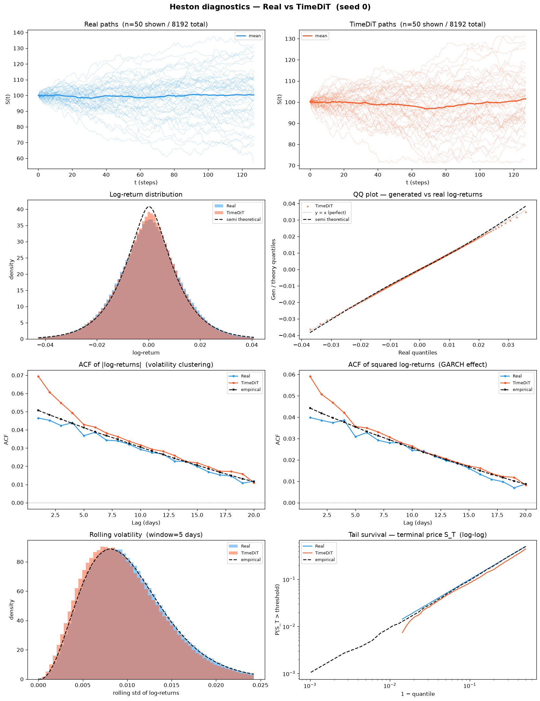

<h1 align="center">Financial Time Series Generation Benchmark</h1>

<p align="center">
  <em>A reproducible benchmark for generative models of financial time series,<br/>
  companion to the ICAIF 2026 paper on path-dependent McKean-Vlasov control.</em>
</p>

<p align="center">
  <a href="LICENSE"></a>
  
  
  
  
  
</p>

<p align="center">
  <a href="#the-paper"><b>Paper</b></a> &nbsp;&middot;&nbsp;
  <a href="#about-the-benchmark"><b>About</b></a> &nbsp;&middot;&nbsp;
  <a href="#results-heston-mean--std-5-seeds"><b>Results</b></a> &nbsp;&middot;&nbsp;
  <a href="#methods"><b>Methods</b></a> &nbsp;&middot;&nbsp;
  <a href="CONTRIBUTING.md"><b>Contributing</b></a> &nbsp;&middot;&nbsp;
  <a href="CODE_OF_CONDUCT.md"><b>Code of Conduct</b></a> &nbsp;&middot;&nbsp;
  <a href="SECURITY.md"><b>Security</b></a> &nbsp;&middot;&nbsp;
  <a href="LICENSE"><b>License</b></a>
</p>

---

## Contents

- [The paper](#the-paper)
- [About the benchmark](#about-the-benchmark)
- [Results on Heston](#results-heston-mean--std-5-seeds)
- [Methods](#methods)
- [Governance](#governance)
- [Citation](#citation)

---

## The paper

This repository is the evaluation benchmark that accompanies the following paper.
It measures a broad landscape of generative models on a controlled stochastic
volatility testbed, and provides the reference numbers against which the paper's
path-dependent McKean-Vlasov method is assessed.

> **Financial Time Series Generation via Path-Dependent McKean-Vlasov Control**
>
> Alexandre Alouadi (BNP Paribas and Ecole Polytechnique), Grégoire Loeper (BNP
> Paribas and Monash University), Célian Marsala (BNP Paribas and ENSAE Paris),
> Othmane Mazhar (LPSM, Université Paris Cité and Sorbonne University), Huyên
> Pham (Ecole Polytechnique, CMAP).
>
> *7th ACM International Conference on AI in Finance (ICAIF 2026), Milan.*

**Abstract.** Financial scenario generation requires models that can match the
properties that matter for risk analysis, such as path distributions, heavy
tails, volatility clustering, and dependence across assets. We formulate this
task as a path-dependent McKean-Vlasov optimal control problem for simulation of
time series. The method learns stochastic dynamics from discrepancies between
observed and generated paths, and these discrepancies can be chosen to emphasize
specific stylized facts. Experiments on stochastic volatility and multivariate
benchmarks show that the framework can be specialized to reproduce key empirical
properties while retaining a principled mathematical formulation.

The McKean-Vlasov method is the paper's contribution and is scored inside this
same harness; the twelve methods below are the competing generative families it
is compared against. See [Citation](#citation) for how to cite this work.

---

## About the benchmark

A public benchmark for evaluating **generative models of financial time series**.

Each method is trained on the same target dataset and evaluated with **34 metrics (A1-A34)**
plus **6 curve-shape diagnostics (B)**, each scored by **MSE**, a function-level **% error** (MAPE), **NRMSE** and a tail-risk **CVaR** (range-normalised Expected Shortfall of the pointwise curve error at q=0.90/0.95),
across 5 random seeds. Every table carries a **Perfect floor** column: the score a *perfect* generator
still incurs from finite-sample noise, measured by drawing an **independent Heston simulation** (a fresh
8 192-path draw, seeds 1000+) and scoring it against the **held-out test set** exactly as every method is
scored (see [`methods/perfect_recovery/`](methods/perfect_recovery/)). The floor is therefore **non-zero**
and identical in construction across methods, it is the noise a genuine Heston sample cannot avoid, not a
degenerate zero.

---

## Results, Heston (mean ± std, 5 seeds)

Cross-method comparison on 8 192 Heston price paths (seq\_len=128).
↓ = lower is better. ↑ = higher is better. **Bold** = best across methods.

### A1-A34, Metrics by category

Methods are grouped by model family. ↓ = lower is better, ↑ = higher is better, A28 target = 1.0.
**Bold** = best across methods. Every method is scored against the **held-out test set** (an 8 192-path
Heston draw, seed 1); the *Perfect* floor is an independent Heston draw scored the same way.

<table>
<thead>
  <tr>
    <th rowspan="2">Metric</th>
    <th colspan="3">GAN</th>
    <th colspan="4">Diffusion</th>
    <th colspan="3">VAE</th>
    <th>Schrödinger Bridge</th>
    <th>Fourier Flow</th>
    <th rowspan="2">Perfect</th>
    <th rowspan="2">Winner</th>
  </tr>
  <tr>
    <th>TimeGAN</th>
    <th>COSCI-GAN</th>
    <th>GT-GAN</th>
    <th>Diffusion-TS</th>
    <th>CSDI</th>
    <th>TimeMoDE</th>
    <th>TimeDiT</th>
    <th>TimeVAE</th>
    <th>TimeVQVAE</th>
    <th>LS4</th>
    <th>SBTS</th>
    <th>Fourier Flow</th>
  </tr>
</thead>
<tbody>
  <tr><td colspan="15"><b>Fat Tail</b></td></tr>
  <tr><td>A1 Kurtosis Error ↓</td><td>2.954 ± 2.098</td><td>0.5615 ± 0.1128</td><td>281.8 ± 288.2</td><td>0.4242 ± 0.02303</td><td>0.09543 ± 0.02623</td><td>20.10 ± 3.136</td><td>0.1007 ± 0.05273</td><td>2.257 ± 0.5719</td><td>0.1363 ± 0.09243</td><td>0.3684 ± 0.01609</td><td><b>0.008384 ± 0.005009</b></td><td>0.5761 ± 0.008273</td><td>0.008092 ± 0.006811</td><td><b>SBTS</b></td></tr>
  <tr><td>A2 \|r\| q95 Error ↓</td><td>0.003196 ± 0.001907</td><td>0.09711 ± 0.003466</td><td>0.02279 ± 2.78e-04</td><td>0.006902 ± 1.57e-04</td><td>0.005393 ± 1.50e-04</td><td>0.02387 ± 0.006491</td><td>0.002101 ± 0.001373</td><td>0.02227 ± 1.22e-04</td><td>0.004515 ± 2.54e-04</td><td>3.99e-04 ± 1.13e-04</td><td><b>2.12e-04 ± 3.87e-05</b></td><td>7.21e-04 ± 2.10e-04</td><td>6.57e-05 ± 5.96e-05</td><td><b>SBTS</b></td></tr>
  <tr><td>A3 \|r\| q99 Error ↓</td><td>0.004342 ± 0.002767</td><td>0.1240 ± 0.005959</td><td>0.02978 ± 0.001743</td><td>0.01032 ± 1.75e-04</td><td>0.007327 ± 2.29e-04</td><td>0.04025 ± 0.01065</td><td>0.002831 ± 0.001858</td><td>0.03082 ± 1.05e-04</td><td>0.006058 ± 3.03e-04</td><td>0.001156 ± 1.66e-04</td><td><b>1.20e-04 ± 8.36e-05</b></td><td>0.002325 ± 5.06e-04</td><td>5.98e-05 ± 3.25e-05</td><td><b>SBTS</b></td></tr>
  <tr><td>A4 Tail QQ Error ↓</td><td>0.003401 ± 0.001522</td><td>0.09566 ± 0.003535</td><td>0.02240 ± 3.79e-04</td><td>0.006781 ± 1.50e-04</td><td>0.005296 ± 1.50e-04</td><td>0.02382 ± 0.006446</td><td>0.002063 ± 0.001343</td><td>0.02191 ± 1.17e-04</td><td>0.004444 ± 2.48e-04</td><td>4.05e-04 ± 8.23e-05</td><td><b>1.90e-04 ± 4.01e-05</b></td><td>7.42e-04 ± 1.38e-04</td><td>6.75e-05 ± 3.70e-05</td><td><b>SBTS</b></td></tr>
  <tr><td>A5 Hill Tail Index Error ↓</td><td>36.32 ± 17.05</td><td>1.614 ± 1.128</td><td>7.568 ± 1.267</td><td>3.047 ± 0.2789</td><td>1.426 ± 0.5856</td><td>6.730 ± 6.378</td><td>3.694 ± 2.142</td><td>1.831 ± 0.6794</td><td>3.777 ± 1.193</td><td><b>1.225 ± 0.4268</b></td><td>1.604 ± 0.2885</td><td>5.802 ± 2.000</td><td>0.5266 ± 0.5572</td><td><b>LS4</b></td></tr>
  <tr><td colspan="15"><b>Distribution</b></td></tr>
  <tr><td>A6 Path MMD² ↓</td><td>0.01866 ± 0.01472</td><td>0.04686 ± 0.004162</td><td>0.03292 ± 0.009071</td><td>0.004476 ± 8.48e-04</td><td>0.003646 ± 4.16e-04</td><td>0.06947 ± 0.05966</td><td>0.004171 ± 0.001840</td><td>0.01914 ± 0.001334</td><td>0.003433 ± 7.97e-04</td><td><b>0.001926 ± 2.51e-04</b></td><td>0.001971 ± 1.85e-04</td><td>0.005527 ± 0.002289</td><td>0.001842 ± 2.55e-04</td><td><b>LS4</b></td></tr>
  <tr><td>A7 Terminal MMD² ↓</td><td>0.03072 ± 0.02472</td><td>0.01623 ± 0.01333</td><td>0.008520 ± 0.002539</td><td>0.003676 ± 0.001070</td><td>0.003605 ± 8.41e-04</td><td>0.06458 ± 0.06681</td><td>0.003929 ± 0.001225</td><td>0.004951 ± 0.001715</td><td>0.003838 ± 0.001368</td><td><b>0.001520 ± 3.61e-04</b></td><td>0.001583 ± 4.28e-04</td><td>0.01105 ± 0.006414</td><td>0.001983 ± 8.89e-04</td><td><b>LS4</b></td></tr>
  <tr><td>A8 Increment MMD² ↓</td><td>0.008280 ± 0.004303</td><td>0.4788 ± 0.01185</td><td>0.2025 ± 0.01417</td><td>0.01109 ± 7.52e-04</td><td>0.008062 ± 7.11e-04</td><td>0.07441 ± 0.01639</td><td>0.002258 ± 7.89e-04</td><td>0.2130 ± 0.001204</td><td>0.007018 ± 0.001054</td><td><b>9.63e-04 ± 3.76e-05</b></td><td>0.001077 ± 3.18e-05</td><td>0.001124 ± 6.46e-05</td><td>8.69e-04 ± 2.70e-05</td><td><b>LS4</b></td></tr>
  <tr><td>A9 Volatility MMD ↓</td><td>0.3975 ± 0.2486</td><td>3.955 ± 0.04883</td><td>2.882 ± 0.6128</td><td>0.3846 ± 0.02464</td><td>0.2498 ± 0.01607</td><td>2.033 ± 0.3303</td><td>0.05213 ± 0.02723</td><td>3.575 ± 0.4476</td><td>0.1932 ± 0.02799</td><td><b>0.01447 ± 0.001550</b></td><td>0.01503 ± 8.50e-04</td><td>0.05871 ± 0.007003</td><td>0.008554 ± 0.001549</td><td><b>LS4</b></td></tr>
  <tr><td>A10 Terminal SWD ↓</td><td>2.917 ± 1.131</td><td>4.756 ± 3.118</td><td>2.391 ± 0.1196</td><td>1.684 ± 0.3010</td><td>1.618 ± 0.2760</td><td>11.13 ± 9.128</td><td>2.348 ± 1.013</td><td>1.947 ± 0.3598</td><td>1.356 ± 0.2690</td><td>0.7480 ± 0.3255</td><td><b>0.7477 ± 0.3351</b></td><td>2.710 ± 1.034</td><td>1.151 ± 0.4868</td><td><b>SBTS</b></td></tr>
  <tr><td>A11 Path SWD ↓</td><td>1.678 ± 0.5770</td><td>3.505 ± 0.1711</td><td>2.236 ± 0.2567</td><td>1.212 ± 0.1556</td><td>1.069 ± 0.1305</td><td>8.734 ± 6.925</td><td>1.847 ± 0.6446</td><td>1.167 ± 0.1135</td><td>0.8781 ± 0.2081</td><td><b>0.5744 ± 0.1246</b></td><td>0.6418 ± 0.1355</td><td>1.334 ± 0.3806</td><td>0.6191 ± 0.1960</td><td><b>LS4</b></td></tr>
  <tr><td>A12 RV Law Loss ↓</td><td>1.558 ± 0.3879</td><td>118.7 ± 7.929</td><td>15.11 ± 13.84</td><td>2.274 ± 0.04910</td><td>1.920 ± 0.05633</td><td>16.52 ± 5.360</td><td>0.8413 ± 0.4666</td><td>5.010 ± 0.008395</td><td>1.706 ± 0.08942</td><td>0.2415 ± 0.01757</td><td><b>0.07994 ± 0.01408</b></td><td>0.5397 ± 0.1300</td><td>0.05202 ± 0.006560</td><td><b>SBTS</b></td></tr>
  <tr><td>A13 Mean Path RMSE ↓</td><td>0.5356 ± 0.2514</td><td>3.995 ± 0.1803</td><td>0.7421 ± 0.3193</td><td>0.4399 ± 0.2584</td><td>0.3654 ± 0.3226</td><td>8.840 ± 7.341</td><td>1.963 ± 0.5030</td><td>0.3196 ± 0.2225</td><td>0.7593 ± 0.1340</td><td><b>0.1722 ± 0.1200</b></td><td>0.2545 ± 0.09266</td><td>0.4336 ± 0.3651</td><td>0.1205 ± 0.05175</td><td><b>LS4</b></td></tr>
  <tr><td>A14 KS Log-returns ↓</td><td>0.08474 ± 0.03769</td><td>0.3206 ± 0.007269</td><td>0.3881 ± 0.003914</td><td>0.06048 ± 0.001904</td><td>0.05391 ± 0.001972</td><td>0.1370 ± 0.02655</td><td>0.02530 ± 0.01422</td><td>0.3670 ± 0.004602</td><td>0.05084 ± 0.003747</td><td>0.01258 ± 6.74e-04</td><td><b>0.002542 ± 2.16e-04</b></td><td>0.01895 ± 0.002028</td><td>0.001491 ± 5.79e-04</td><td><b>SBTS</b></td></tr>
  <tr><td>A15 Skewness Error ↓</td><td>0.3412 ± 0.3279</td><td>0.04981 ± 0.04124</td><td>390.5 ± 355.8</td><td>0.06445 ± 0.03230</td><td>0.03681 ± 0.002124</td><td>0.02843 ± 0.02245</td><td><b>0.01515 ± 0.005901</b></td><td>0.5479 ± 0.09837</td><td>0.03079 ± 0.008248</td><td>0.02998 ± 0.01249</td><td>0.01796 ± 0.003795</td><td>0.02288 ± 0.01115</td><td>0.005274 ± 0.001459</td><td><b>TimeDiT</b></td></tr>
  <tr><td>A16 QQ RMSE (300-pt) ↓</td><td>0.002506 ± 6.49e-04</td><td>0.04857 ± 0.001967</td><td>0.01086 ± 1.44e-04</td><td>0.003073 ± 8.32e-05</td><td>0.002576 ± 8.57e-05</td><td>0.01109 ± 0.002985</td><td>0.001058 ± 6.43e-04</td><td>0.01057 ± 8.40e-05</td><td>0.002268 ± 1.38e-04</td><td>3.41e-04 ± 9.53e-06</td><td><b>1.01e-04 ± 1.31e-05</b></td><td>5.81e-04 ± 4.14e-05</td><td>4.19e-05 ± 1.89e-05</td><td><b>SBTS</b></td></tr>
  <tr><td>A17 Terminal Price KS ↓</td><td>0.1109 ± 0.05875</td><td>0.1473 ± 0.09804</td><td>0.06672 ± 0.01592</td><td>0.04436 ± 0.007030</td><td>0.03667 ± 0.004476</td><td>0.3050 ± 0.2233</td><td>0.06746 ± 0.02112</td><td>0.05127 ± 0.007848</td><td>0.05522 ± 0.009093</td><td><b>0.01584 ± 0.005488</b></td><td>0.01831 ± 0.003291</td><td>0.08098 ± 0.01617</td><td>0.01099 ± 0.001563</td><td><b>LS4</b></td></tr>
  <tr><td colspan="15"><b>Adversarial</b></td></tr>
  <tr><td>A18 Disc Score GRU ↓</td><td>0.03305 ± 0.05328</td><td>0.4999 ± 1.22e-04</td><td>0.4871 ± 0.01292</td><td>0.08987 ± 0.1524</td><td>0.06302 ± 0.1056</td><td>0.3950 ± 0.08909</td><td>0.01047 ± 0.009703</td><td>0.4272 ± 0.08815</td><td>0.07174 ± 0.06503</td><td><b>0.005890 ± 0.001676</b></td><td>0.005951 ± 0.007927</td><td>0.009185 ± 0.009209</td><td>0.006195 ± 0.007171</td><td><b>LS4</b></td></tr>
  <tr><td>A18 Disc Score MLP ↓</td><td>0.08792 ± 0.04703</td><td>0.5000 ± 0</td><td>0.07345 ± 0.1266</td><td>0.02426 ± 0.03140</td><td>0.01138 ± 0.002541</td><td>0.4609 ± 0.01765</td><td>0.05044 ± 0.03674</td><td>0.1358 ± 0.1503</td><td>0.009002 ± 0.003393</td><td>0.006256 ± 0.002539</td><td>0.01028 ± 0.003179</td><td><b>0.005951 ± 0.002921</b></td><td>0.005951 ± 0.003469</td><td><b>Fourier Flow</b></td></tr>
  <tr><td colspan="15"><b>Predictive</b></td></tr>
  <tr><td>A19 Pred Score GRU ↓</td><td>0.05277 ± 0.001115</td><td>0.1331 ± 0.01808</td><td>0.05547 ± 0.001080</td><td>0.05112 ± 1.22e-04</td><td>0.05024 ± 1.88e-05</td><td>0.08335 ± 0.005229</td><td>0.05009 ± 5.64e-05</td><td>0.05385 ± 7.71e-04</td><td>0.05014 ± 2.87e-05</td><td><b>0.05001 ± 3.66e-06</b></td><td>0.05004 ± 7.70e-06</td><td>0.05004 ± 2.00e-05</td><td>0.05002 ± 1.08e-05</td><td><b>LS4</b></td></tr>
  <tr><td>A19 Pred Score MLP ↓</td><td>0.05322 ± 0.001031</td><td>0.09591 ± 0.006992</td><td>0.05302 ± 2.01e-04</td><td>0.05112 ± 1.21e-04</td><td>0.05025 ± 1.43e-04</td><td>0.07423 ± 0.004722</td><td>0.05019 ± 3.58e-04</td><td>0.05243 ± 1.91e-04</td><td>0.05018 ± 6.79e-05</td><td><b>0.05006 ± 1.23e-04</b></td><td>0.05014 ± 2.07e-04</td><td>0.05032 ± 3.48e-04</td><td>0.05036 ± 6.63e-04</td><td><b>LS4</b></td></tr>
  <tr><td colspan="15"><b>Temporal</b></td></tr>
  <tr><td>A20 Covariance Error ↓</td><td>21.36 ± 9.068</td><td>30.59 ± 29.16</td><td>20.55 ± 7.355</td><td>44.18 ± 10.64</td><td>41.55 ± 5.776</td><td>64.76 ± 21.18</td><td>17.72 ± 11.98</td><td>57.28 ± 1.758</td><td>22.61 ± 14.72</td><td>13.63 ± 6.662</td><td><b>4.969 ± 2.722</b></td><td>60.80 ± 36.58</td><td>4.923 ± 3.284</td><td><b>SBTS</b></td></tr>
  <tr><td>A21 ACF \|r\| Error (lags) ↓</td><td>0.1278 ± 0.06738</td><td>0.08056 ± 0.02054</td><td>0.3181 ± 0.1375</td><td>0.01812 ± 0.002352</td><td>0.01126 ± 0.003095</td><td>0.07526 ± 0.003463</td><td>0.01023 ± 0.004203</td><td>0.3890 ± 0.1057</td><td>0.01979 ± 0.004246</td><td>0.01294 ± 0.001791</td><td><b>0.002841 ± 4.75e-04</b></td><td>0.04095 ± 5.50e-04</td><td>0.002234 ± 6.62e-04</td><td><b>SBTS</b></td></tr>
  <tr><td>A22 ACF r² Error (lags) ↓</td><td>0.08676 ± 0.03470</td><td>0.09004 ± 0.02156</td><td>0.1619 ± 0.1184</td><td>0.01587 ± 0.002662</td><td>0.01124 ± 0.002605</td><td>0.07767 ± 0.002639</td><td>0.009593 ± 0.003496</td><td>0.3609 ± 0.08849</td><td>0.01817 ± 0.003251</td><td>0.006752 ± 0.001737</td><td><b>0.003893 ± 6.21e-04</b></td><td>0.03498 ± 5.56e-04</td><td>0.002206 ± 6.32e-04</td><td><b>SBTS</b></td></tr>
  <tr><td>A23 ACF \|r\| Lag-1 Error ↓</td><td>0.2301 ± 0.1034</td><td>0.1700 ± 0.04930</td><td>0.4201 ± 0.1602</td><td><b>0.002410 ± 0.001465</b></td><td>0.02252 ± 0.004755</td><td>0.2258 ± 0.01439</td><td>0.01616 ± 0.005836</td><td>0.4674 ± 0.1346</td><td>0.01523 ± 0.008014</td><td>0.01743 ± 0.005532</td><td>0.008185 ± 0.001153</td><td>0.04897 ± 7.04e-04</td><td>0.002652 ± 0.001035</td><td><b>Diffusion-TS</b></td></tr>
  <tr><td>A24 ACF r² Lag-1 Error ↓</td><td>0.1760 ± 0.06259</td><td>0.1957 ± 0.05105</td><td>0.2270 ± 0.1494</td><td><b>0.007895 ± 0.002645</b></td><td>0.02168 ± 0.003561</td><td>0.2466 ± 0.008535</td><td>0.01545 ± 0.004782</td><td>0.4630 ± 0.1189</td><td>0.01323 ± 0.007254</td><td>0.009068 ± 0.005290</td><td>0.009127 ± 0.001088</td><td>0.04195 ± 7.01e-04</td><td>0.002790 ± 9.39e-04</td><td><b>Diffusion-TS</b></td></tr>
  <tr><td colspan="15"><b>Vol</b></td></tr>
  <tr><td>A25 Mean RMSE ↓</td><td>0.7781 ± 0.3669</td><td>4.539 ± 3.359</td><td>0.7845 ± 0.3300</td><td>0.7610 ± 0.4617</td><td>0.5139 ± 0.4595</td><td>10.88 ± 9.469</td><td>1.998 ± 0.9794</td><td>0.3883 ± 0.2340</td><td>1.033 ± 0.1905</td><td>0.3270 ± 0.2333</td><td><b>0.2977 ± 0.1411</b></td><td>0.7990 ± 0.7970</td><td>0.1392 ± 0.06359</td><td><b>SBTS</b></td></tr>
  <tr><td>A26 Return Std Error ↓</td><td>0.1525 ± 0.08911</td><td>5.032 ± 0.2229</td><td>1.005 ± 0.09141</td><td>0.3107 ± 0.009292</td><td>0.2580 ± 0.009849</td><td>1.419 ± 0.2615</td><td>0.09098 ± 0.05428</td><td>1.074 ± 0.007809</td><td>0.2316 ± 0.01420</td><td>0.004853 ± 0.003540</td><td>0.01059 ± 7.02e-04</td><td><b>0.004832 ± 0.002757</b></td><td>0.002523 ± 0.001767</td><td><b>Fourier Flow</b></td></tr>
  <tr><td>A27 Log-Return Std Error ↓</td><td>0.001703 ± 7.89e-04</td><td>0.04975 ± 0.002001</td><td>0.009540 ± 0.007044</td><td>0.003240 ± 8.19e-05</td><td>0.002667 ± 8.89e-05</td><td>0.01320 ± 0.003285</td><td>0.001072 ± 6.80e-04</td><td>0.01098 ± 7.75e-05</td><td>0.002336 ± 1.37e-04</td><td><b>4.63e-05 ± 2.22e-05</b></td><td>9.31e-05 ± 1.98e-05</td><td>7.64e-05 ± 5.51e-05</td><td>3.15e-05 ± 2.48e-05</td><td><b>LS4</b></td></tr>
  <tr><td>A28 Kurtosis Ratio (→ 1)</td><td>-1.116 ± 3.593</td><td>-8.150 ± 12.11</td><td>0.002659 ± 0.004016</td><td>1.903 ± 0.2558</td><td>0.8706 ± 0.03043</td><td>0.01840 ± 0.007380</td><td><b>0.9925 ± 0.07945</b></td><td>0.2834 ± 0.04765</td><td>0.8410 ± 0.06953</td><td>1.565 ± 0.07840</td><td>1.012 ± 0.01211</td><td>3.098 ± 0.7754</td><td>1.006 ± 0.009834</td><td><b>TimeDiT</b></td></tr>
  <tr><td>A29 Sigma Mean Error ↓</td><td>0.03089 ± 0.009106</td><td>0.7871 ± 0.03094</td><td>0.1649 ± 0.01028</td><td>0.04883 ± 0.001266</td><td>0.04078 ± 0.001489</td><td>0.1931 ± 0.04858</td><td>0.01655 ± 0.01019</td><td>0.1745 ± 0.001776</td><td>0.03743 ± 0.002059</td><td>0.001445 ± 6.99e-04</td><td><b>0.001427 ± 3.04e-04</b></td><td>0.002245 ± 8.77e-04</td><td>4.96e-04 ± 4.24e-04</td><td><b>SBTS</b></td></tr>
  <tr><td>A30 Cross-Sect. Vol Path RMSE ↓</td><td>0.4742 ± 0.2079</td><td>1.155 ± 0.3231</td><td>0.8923 ± 0.2085</td><td>1.365 ± 0.2012</td><td>1.134 ± 0.1303</td><td>1.950 ± 0.5991</td><td>0.4423 ± 0.2699</td><td>1.325 ± 0.04564</td><td>0.5701 ± 0.3404</td><td>0.3372 ± 0.1171</td><td><b>0.2779 ± 0.04900</b></td><td>1.381 ± 0.4336</td><td>0.1432 ± 0.03018</td><td><b>SBTS</b></td></tr>
  <tr><td>A31 Rolling Vol KS (w=5) ↓</td><td>0.2552 ± 0.1101</td><td>0.9371 ± 0.007667</td><td>0.9868 ± 0.004912</td><td>0.2576 ± 0.007919</td><td>0.2202 ± 0.008329</td><td>0.5014 ± 0.08662</td><td>0.08627 ± 0.05171</td><td>0.9869 ± 0.004527</td><td>0.1850 ± 0.01013</td><td>0.03798 ± 0.001391</td><td><b>0.01375 ± 0.001092</b></td><td>0.07213 ± 0.001372</td><td>0.003814 ± 0.001210</td><td><b>SBTS</b></td></tr>
  <tr><td>A32 Vol-of-Vol Error ↓</td><td>8.96e-04 ± 8.69e-04</td><td>0.01806 ± 0.001147</td><td>0.009854 ± 0.007895</td><td>0.001587 ± 3.82e-05</td><td>0.001048 ± 2.14e-05</td><td>0.008546 ± 0.001733</td><td>3.84e-04 ± 2.69e-04</td><td>0.004576 ± 5.62e-05</td><td>6.76e-04 ± 5.79e-05</td><td>3.21e-04 ± 4.23e-05</td><td><b>1.30e-05 ± 1.26e-05</b></td><td>6.89e-04 ± 9.20e-05</td><td>1.54e-05 ± 9.93e-06</td><td><b>SBTS</b></td></tr>
  <tr><td colspan="15"><b>Heston Spec</b></td></tr>
  <tr><td>A33 Teacher-Sigma Corr ↑</td><td>0.002745 ± 0.01354</td><td>-0.005511 ± 0.008042</td><td>0.01003 ± 0.008468</td><td>0.001823 ± 0.004419</td><td>0.003948 ± 0.003596</td><td>0.009360 ± 0.006530</td><td>0.004130 ± 0.008214</td><td><b>0.02254 ± 0.003796</b></td><td>7.04e-04 ± 0.005837</td><td>-3.94e-04 ± 0.006577</td><td>-0.008422 ± 0.005109</td><td>-0.002564 ± 0.002730</td><td>0.6163 ± 0.002371</td><td><b>TimeVAE</b></td></tr>
  <tr><td>A34 Teacher-Sigma RMSE ↓</td><td>0.1186 ± 0.01863</td><td>0.8087 ± 0.02874</td><td>0.3088 ± 0.1407</td><td>0.09645 ± 9.09e-04</td><td>0.09917 ± 6.44e-04</td><td>0.2737 ± 0.04669</td><td>0.09861 ± 0.001092</td><td>0.1803 ± 0.001643</td><td>0.1014 ± 9.08e-04</td><td>0.09513 ± 7.87e-04</td><td>0.1002 ± 3.90e-04</td><td><b>0.08963 ± 0.001225</b></td><td>0.06559 ± 1.37e-04</td><td><b>Fourier Flow</b></td></tr>
</tbody>
</table>

<!-- A win-counts (of 36): SBTS=16, LS4=12, Fourier Flow=3, Diffusion-TS=2, TimeDiT=2, TimeVAE=1, TimeGAN=0, COSCI-GAN=0, GT-GAN=0, CSDI=0, TimeMoDE=0, TimeVQVAE=0 -->

**SBTS wins 16 of 36 A-metrics; LS4 12; Fourier Flow 3; Diffusion-TS 2; TimeDiT 2; TimeVAE 1.** TimeGAN,
COSCI-GAN, GT-GAN, CSDI, TimeMoDE and TimeVQVAE win none outright. (36 = the 34 metrics with A18 and A19 each
split into a GRU and an MLP variant.) With the author-confirmed **K=20 / h=0.05** kernel, **SBTS** is still the
strongest generator in the benchmark: it sweeps the tail quantiles (A1-A4), most of the
return-law/distribution family (A10, A12, A14, A16), and, the decisive change from the paper's over-smoothing
h=0.4, nearly the entire **temporal/vol** family (A20 covariance **4.969**, A21/A22 ACF-lag averages, A25
mean-RMSE, A29 σ-mean, A30 cross-sectional vol, A31 rolling-vol KS **0.01375**, A32 vol-of-vol). Its losses are
structural: the two Heston-spec rows (A33/A34, latent variance unrecoverable from prices), the lag-1 ACF pair
(A23/A24, where Diffusion-TS's decoder is sharpest), the distributional/adversarial axes LS4 and Fourier Flow
hold, and, new with TimeDiT in the pool, the two higher-moment rows (A15 skewness, A28 kurtosis ratio) it
previously owned.

**LS4**'s latent-S4 state-space prior is the clear second: it takes the distributional family (A6-A9, A11,
A13, A17), both predictive scores and the adversarial-GRU (A18-GRU **0.005890**, A19-GRU **0.05001** /
A19-MLP **0.05006**, at or under the finite-sample floor), the Hill index (A5) and the log-return-std error
(A27). The remaining families defend narrow niches. **Fourier Flow** takes three moment/near-Gaussian
metrics, the **MLP discriminative score** (A18-MLP **0.005951**), the **return-std error** (A26
**0.004832**) and the **teacher-sigma RMSE** (A34 **0.08963**). **Diffusion-TS** owns the two **lag-1 ACF**
metrics (A23 **0.002410**, A24 **0.007895**) where its interpretable seasonal-trend decoder is sharpest.
**TimeVAE** takes the single **teacher-sigma correlation** (A33 **0.02254**, the best latent-vol recovery of
any generator, though ~27× below the 0.6163 floor). **TimeDiT**, the benchmark's largest _dense_ generator
(32.46 M), is the suite's best **higher-moment** matcher, winning both the **skewness error** (A15
**0.01515**) and the **kurtosis ratio** (A28 **0.9925**, essentially on the 1.006 finite-sample floor), the two
rows SBTS previously owned. **CSDI, TimeMoDE, TimeGAN, COSCI-GAN, TimeVQVAE and GT-GAN** win no
A-metric outright; **GT-GAN** carries the most extreme *systematic* return-law collapse, an over-peaked
marginal with the suite's most extreme kurtosis ratio (A28 0.002659, ~375× more leptokurtic than Heston), the
worst A14 KS (0.3881), a severe A1 kurtosis error (281.8) and a near-separable A18-GRU (0.4871).

### B, Curve-shape metrics (6 diagnostic plots)

Each of the 6 diagnostic plots yields a **curve** L (a list of values), not a scalar. For each plot we build three lists, the curve L, its first finite difference (der), and its second finite difference (sec\_der), then combine them into **one number per plot**. **MSE** averages all three sub-scores; **% err**, **NRMSE** and **CVaR** are reported on the curve L only (funct-only, see below):

- **MSE**: dᵢ = mean((L_gen − L_real)²), averaged over curve / der / sec\_der. Combined std = quadrature of the three seed-std.
- **% err** (function-level MAPE): dᵢ = mean(|L_gen − L_real| / (|L_real| + 1e-6)) × 100, reported on the curve L itself (funct-only). The derivative / 2nd-difference MAPE is excluded: diff(L) has near-zero true values, so its relative error explodes into meaningless 10⁴-% figures.
- **NRMSE**: sqrt(mean((L_gen − L_real)²)) / (max|L_real| − min|L_real| + 1e-12) × 100, RMSE normalised by the reference curve's range, reported on the curve L only (funct-only).
- **CVaR₉₀ / CVaR₉₅** (tail-risk / Expected Shortfall): pointwise errors eₜ = |L_gen(t) − L_real(t)|; for q ∈ {0.90, 0.95}, CVaR_q = mean(eₜ over the worst (1−q) fraction, i.e. eₜ ≥ the q-th percentile), then normalised by (max L_real − min L_real + 1e-12) × 100, the same range convention as NRMSE. Funct-only. Captures how bad the *worst-fitting* section of the curve is, not just the average.

For **all six plots** the % err, NRMSE and CVaR use the curve L only (funct-only); the finite differences of these curves are near-zero and ill-posed, so only the MSE averages all three. ↓ lower is better. Histogram bin edges use [0.5th, 99.5th]-percentile of **real data only**, so the reference curve is fixed. The **Perfect** column is an independent Heston draw (seeds 1000+) scored against the test set the same way, a **non-zero** finite-sample floor, not a degenerate zero. Each subline shows its own winner (lowest value); the **MSE** row decides each plot's headline ranking and the **grid_tvd** path-comparison row is ranked as one additional contest.

<table>
<thead>
  <tr>
    <th rowspan="2">Plot</th>
    <th rowspan="2">Measure</th>
    <th colspan="3">GAN</th>
    <th colspan="4">Diffusion</th>
    <th colspan="3">VAE</th>
    <th>Schrödinger Bridge</th>
    <th>Fourier Flow</th>
    <th rowspan="2">Perfect</th>
    <th rowspan="2">Winner</th>
  </tr>
  <tr>
    <th>TimeGAN</th>
    <th>COSCI-GAN</th>
    <th>GT-GAN</th>
    <th>Diffusion-TS</th>
    <th>CSDI</th>
    <th>TimeMoDE</th>
    <th>TimeDiT</th>
    <th>TimeVAE</th>
    <th>TimeVQVAE</th>
    <th>LS4</th>
    <th>SBTS</th>
    <th>Fourier Flow</th>
  </tr>
</thead>
<tbody>
  <tr><td><b>Path comparison</b><br><sub>grid_tvd 50×50 path-cloud</sub></td><td>grid_tvd 50×50 (%) ↓</td><td>17.14% ± 8.253%</td><td>14.01% ± 1.126%</td><td>19.00% ± 3.806%</td><td>7.829% ± 0.9332%</td><td>5.990% ± 0.4649%</td><td>35.58% ± 22.96%</td><td>8.518% ± 1.335%</td><td>8.662% ± 0.4769%</td><td>7.269% ± 0.3121%</td><td><b>2.772% ± 0.2228%</b></td><td>3.809% ± 0.1196%</td><td>9.442% ± 1.721%</td><td>2.237% ± 0.1564%</td><td><b>LS4</b></td></tr>
  <tr><td rowspan="5"><b>Log-return histogram</b></td><td>MSE</td><td>45.40 ± 57.91</td><td>42.66 ± 1.999</td><td>2160 ± 655.2</td><td>4.883 ± 0.5079</td><td>4.644 ± 0.4940</td><td>14.84 ± 4.653</td><td>1.109 ± 0.7767</td><td>968.0 ± 183.1</td><td>4.386 ± 0.8335</td><td>0.4517 ± 0.02799</td><td><b>0.1166 ± 0.01679</b></td><td>0.9211 ± 0.02370</td><td>0.1098 ± 0.02492</td><td><b>SBTS</b></td></tr>
  <tr><td>% err</td><td>33.41% ± 6.533%</td><td>246.6% ± 7.987%</td><td>117.7% ± 1.125%</td><td>42.14% ± 1.003%</td><td>35.27% ± 1.063%</td><td>112.4% ± 24.79%</td><td>14.71% ± 8.894%</td><td>114.9% ± 0.6458%</td><td>30.95% ± 1.747%</td><td>5.429% ± 0.1852%</td><td><b>2.247% ± 0.1314%</b></td><td>9.167% ± 0.5606%</td><td>1.799% ± 0.04483%</td><td><b>SBTS</b></td></tr>
  <tr><td>NRMSE</td><td>21.38% ± 14.34%</td><td>30.81% ± 0.7154%</td><td>151.6% ± 13.15%</td><td>10.28% ± 0.5317%</td><td>9.998% ± 0.5467%</td><td>17.86% ± 2.921%</td><td>4.118% ± 2.311%</td><td>123.7% ± 6.783%</td><td>9.691% ± 0.9011%</td><td>2.779% ± 0.08180%</td><td><b>0.6462% ± 0.03094%</b></td><td>4.186% ± 0.1102%</td><td>0.5328% ± 0.02035%</td><td><b>SBTS</b></td></tr>
  <tr><td>CVaR₉₀</td><td>50.55% ± 32.16%</td><td>58.05% ± 1.029%</td><td>317.1% ± 7.324%</td><td>21.62% ± 1.519%</td><td>23.51% ± 1.709%</td><td>37.47% ± 5.269%</td><td>9.785% ± 5.383%</td><td>287.6% ± 7.035%</td><td>24.32% ± 2.457%</td><td>6.921% ± 0.2804%</td><td><b>1.507% ± 0.09588%</b></td><td>10.19% ± 0.3052%</td><td>1.234% ± 0.08860%</td><td><b>SBTS</b></td></tr>
  <tr><td>CVaR₉₅</td><td>78.15% ± 57.07%</td><td>60.73% ± 0.9285%</td><td>553.4% ± 17.57%</td><td>22.55% ± 1.702%</td><td>25.24% ± 1.771%</td><td>39.84% ± 5.430%</td><td>10.90% ± 5.663%</td><td>483.9% ± 19.22%</td><td>26.67% ± 2.883%</td><td>8.401% ± 0.2798%</td><td><b>1.783% ± 0.1817%</b></td><td>11.93% ± 0.3586%</td><td>1.444% ± 0.08562%</td><td><b>SBTS</b></td></tr>
  <tr><td rowspan="5"><b>QQ plot</b></td><td>MSE</td><td>2.38e-06 ± 1.14e-06</td><td>8.25e-04 ± 6.60e-05</td><td>4.16e-05 ± 1.27e-06</td><td>3.48e-06 ± 1.75e-07</td><td>2.36e-06 ± 1.57e-07</td><td>5.02e-05 ± 2.50e-05</td><td>5.42e-07 ± 4.35e-07</td><td>3.99e-05 ± 5.99e-07</td><td>1.82e-06 ± 2.20e-07</td><td>4.59e-08 ± 2.12e-09</td><td><b>4.42e-09 ± 1.01e-09</b></td><td>1.45e-07 ± 2.63e-08</td><td>1.09e-09 ± 6.13e-10</td><td><b>SBTS</b></td></tr>
  <tr><td>% err</td><td>34.50% ± 11.22%</td><td>437.1% ± 19.17%</td><td>92.66% ± 2.380%</td><td>25.71% ± 1.743%</td><td>24.22% ± 1.083%</td><td>93.59% ± 22.96%</td><td>13.24% ± 8.560%</td><td>90.53% ± 1.555%</td><td>23.84% ± 2.434%</td><td>6.022% ± 0.6435%</td><td><b>2.270% ± 0.3076%</b></td><td>9.342% ± 2.293%</td><td>0.4629% ± 0.1067%</td><td><b>SBTS</b></td></tr>
  <tr><td>NRMSE</td><td>6.960% ± 1.738%</td><td>134.7% ± 5.407%</td><td>30.25% ± 0.4431%</td><td>8.689% ± 0.2248%</td><td>7.188% ± 0.2370%</td><td>31.65% ± 8.481%</td><td>2.946% ± 1.795%</td><td>29.57% ± 0.2260%</td><td>6.308% ± 0.3785%</td><td>0.9701% ± 0.02323%</td><td><b>0.2832% ± 0.03766%</b></td><td>1.687% ± 0.1351%</td><td>0.1206% ± 0.04670%</td><td><b>SBTS</b></td></tr>
  <tr><td>CVaR₉₀</td><td>6.454% ± 1.512%</td><td>138.6% ± 5.112%</td><td>32.67% ± 0.7552%</td><td>10.19% ± 0.2059%</td><td>7.785% ± 0.2211%</td><td>36.63% ± 9.839%</td><td>3.125% ± 1.877%</td><td>32.31% ± 0.1596%</td><td>6.515% ± 0.3574%</td><td>0.9129% ± 0.06396%</td><td><b>0.3149% ± 0.04665%</b></td><td>1.636% ± 0.2264%</td><td>0.1319% ± 0.04206%</td><td><b>SBTS</b></td></tr>
  <tr><td>CVaR₉₅</td><td>7.409% ± 1.912%</td><td>154.2% ± 6.106%</td><td>37.00% ± 1.251%</td><td>12.09% ± 0.2092%</td><td>8.895% ± 0.2534%</td><td>44.51% ± 11.84%</td><td>3.538% ± 2.145%</td><td>37.04% ± 0.1567%</td><td>7.395% ± 0.3894%</td><td>1.197% ± 0.1293%</td><td><b>0.3646% ± 0.06661%</b></td><td>2.268% ± 0.4096%</td><td>0.1599% ± 0.04416%</td><td><b>SBTS</b></td></tr>
  <tr><td rowspan="5"><b>ACF \|r\| lags 1-20</b></td><td>MSE</td><td>0.003597 ± 0.003199</td><td>0.008548 ± 0.003519</td><td>0.02626 ± 0.02245</td><td>1.72e-04 ± 4.79e-05</td><td>3.02e-05 ± 1.61e-05</td><td>0.003242 ± 1.60e-04</td><td>2.59e-05 ± 1.43e-05</td><td>0.03390 ± 0.01422</td><td>1.22e-04 ± 3.84e-05</td><td>5.14e-05 ± 1.08e-05</td><td><b>2.42e-05 ± 2.83e-06</b></td><td>3.83e-04 ± 1.20e-05</td><td>9.61e-06 ± 3.40e-06</td><td><b>SBTS</b></td></tr>
  <tr><td>% err</td><td>186.2% ± 107.8%</td><td>230.0% ± 48.05%</td><td>893.2% ± 463.3%</td><td>73.33% ± 13.17%</td><td>19.26% ± 8.314%</td><td>107.0% ± 17.32%</td><td>22.44% ± 9.216%</td><td>983.6% ± 273.1%</td><td>63.03% ± 14.21%</td><td>37.09% ± 3.059%</td><td><b>10.68% ± 0.4068%</b></td><td>117.2% ± 2.149%</td><td>8.724% ± 1.843%</td><td><b>SBTS</b></td></tr>
  <tr><td>NRMSE</td><td>224.6% ± 123.4%</td><td>198.2% ± 35.47%</td><td>668.0% ± 311.1%</td><td>51.98% ± 7.840%</td><td>19.33% ± 5.196%</td><td>146.6% ± 8.924%</td><td>18.69% ± 6.873%</td><td>795.3% ± 212.4%</td><td>45.54% ± 9.362%</td><td>29.46% ± 2.604%</td><td><b>7.891% ± 0.2799%</b></td><td>88.45% ± 1.425%</td><td>6.071% ± 1.301%</td><td><b>SBTS</b></td></tr>
  <tr><td>CVaR₉₀</td><td>522.2% ± 262.2%</td><td>420.7% ± 65.18%</td><td>1012% ± 397.5%</td><td>73.44% ± 9.466%</td><td>46.07% ± 9.937%</td><td>341.4% ± 17.58%</td><td>38.84% ± 13.69%</td><td>1246% ± 313.1%</td><td>71.36% ± 12.50%</td><td>45.94% ± 7.674%</td><td><b>17.80% ± 1.557%</b></td><td>127.7% ± 1.888%</td><td>11.26% ± 1.961%</td><td><b>SBTS</b></td></tr>
  <tr><td>CVaR₉₅</td><td>612.3% ± 275.1%</td><td>474.2% ± 99.55%</td><td>1118% ± 426.4%</td><td>75.43% ± 9.523%</td><td>59.93% ± 12.65%</td><td>601.0% ± 38.30%</td><td>43.00% ± 15.53%</td><td>1273% ± 322.9%</td><td>73.51% ± 13.45%</td><td>50.46% ± 11.86%</td><td><b>21.78% ± 3.068%</b></td><td>130.3% ± 1.872%</td><td>12.06% ± 1.837%</td><td><b>SBTS</b></td></tr>
  <tr><td rowspan="5"><b>ACF r² lags 1-20</b></td><td>MSE</td><td>0.001982 ± 0.001602</td><td>0.008781 ± 0.003516</td><td>0.008475 ± 0.01103</td><td>1.32e-04 ± 4.43e-05</td><td>2.71e-05 ± 1.16e-05</td><td>0.003771 ± 2.76e-04</td><td>2.28e-05 ± 1.19e-05</td><td>0.02694 ± 0.01034</td><td>1.05e-04 ± 3.00e-05</td><td>2.48e-05 ± 6.52e-06</td><td><b>2.21e-05 ± 1.57e-06</b></td><td>2.80e-04 ± 1.13e-05</td><td>9.17e-06 ± 3.08e-06</td><td><b>SBTS</b></td></tr>
  <tr><td>% err</td><td>130.0% ± 65.84%</td><td>287.8% ± 57.85%</td><td>541.6% ± 420.6%</td><td>73.19% ± 16.72%</td><td>21.75% ± 10.67%</td><td>117.7% ± 10.56%</td><td>25.04% ± 8.864%</td><td>1026% ± 265.1%</td><td>70.37% ± 13.75%</td><td>24.39% ± 3.127%</td><td><b>13.77% ± 1.214%</b></td><td>120.8% ± 3.065%</td><td>11.34% ± 2.219%</td><td><b>SBTS</b></td></tr>
  <tr><td>NRMSE</td><td>168.2% ± 70.21%</td><td>221.1% ± 36.09%</td><td>366.9% ± 274.6%</td><td>46.32% ± 8.702%</td><td>20.43% ± 5.060%</td><td>170.8% ± 4.574%</td><td>18.68% ± 5.843%</td><td>782.1% ± 188.7%</td><td>45.61% ± 7.936%</td><td>19.10% ± 2.524%</td><td><b>9.147% ± 0.8072%</b></td><td>82.92% ± 1.680%</td><td>6.486% ± 1.351%</td><td><b>SBTS</b></td></tr>
  <tr><td>CVaR₉₀</td><td>421.3% ± 169.3%</td><td>469.3% ± 84.08%</td><td>577.9% ± 398.0%</td><td>66.27% ± 10.63%</td><td>50.15% ± 8.636%</td><td>402.2% ± 10.46%</td><td>40.43% ± 12.44%</td><td>1323% ± 304.4%</td><td>73.46% ± 10.86%</td><td>32.40% ± 6.104%</td><td><b>20.76% ± 1.718%</b></td><td>120.7% ± 1.567%</td><td>12.35% ± 2.511%</td><td><b>SBTS</b></td></tr>
  <tr><td>CVaR₉₅</td><td>537.1% ± 194.7%</td><td>586.1% ± 127.8%</td><td>664.9% ± 437.7%</td><td>68.14% ± 10.38%</td><td>63.50% ± 10.43%</td><td>722.3% ± 25.00%</td><td>45.28% ± 13.99%</td><td>1372% ± 331.0%</td><td>75.90% ± 12.22%</td><td>35.55% ± 9.255%</td><td><b>26.73% ± 3.185%</b></td><td>123.3% ± 1.328%</td><td>13.27% ± 2.724%</td><td><b>SBTS</b></td></tr>
  <tr><td rowspan="5"><b>Rolling vol histogram</b></td><td>MSE</td><td>150.2 ± 75.22</td><td>1398 ± 34.29</td><td>3029 ± 1983</td><td>220.2 ± 15.36</td><td>157.5 ± 12.45</td><td>460.2 ± 142.2</td><td>32.13 ± 25.37</td><td>16019 ± 2352</td><td>113.9 ± 13.91</td><td>8.514 ± 0.7580</td><td><b>2.280 ± 0.2873</b></td><td>29.88 ± 2.639</td><td>1.372 ± 0.07269</td><td><b>SBTS</b></td></tr>
  <tr><td>% err</td><td>56.76% ± 21.18%</td><td>799.2% ± 14.12%</td><td>187.8% ± 42.87%</td><td>69.05% ± 1.441%</td><td>61.91% ± 2.364%</td><td>307.4% ± 73.28%</td><td>26.46% ± 15.61%</td><td>340.0% ± 11.74%</td><td>54.51% ± 2.433%</td><td>11.70% ± 1.165%</td><td><b>3.480% ± 0.2217%</b></td><td>25.42% ± 3.199%</td><td>2.264% ± 0.07625%</td><td><b>SBTS</b></td></tr>
  <tr><td>NRMSE</td><td>22.64% ± 7.203%</td><td>73.06% ± 0.8956%</td><td>97.99% ± 31.28%</td><td>28.87% ± 0.9919%</td><td>24.39% ± 0.9523%</td><td>41.42% ± 6.554%</td><td>9.346% ± 5.529%</td><td>221.5% ± 13.05%</td><td>20.68% ± 1.268%</td><td>5.275% ± 0.3034%</td><td><b>1.882% ± 0.1160%</b></td><td>10.43% ± 0.4823%</td><td>0.8688% ± 0.05532%</td><td><b>SBTS</b></td></tr>
  <tr><td>CVaR₉₀</td><td>51.23% ± 18.12%</td><td>121.7% ± 2.643%</td><td>236.6% ± 64.79%</td><td>59.83% ± 2.496%</td><td>50.44% ± 1.974%</td><td>66.25% ± 8.426%</td><td>19.03% ± 11.06%</td><td>434.8% ± 12.53%</td><td>44.63% ± 3.197%</td><td>10.95% ± 0.4870%</td><td><b>4.030% ± 0.2206%</b></td><td>19.99% ± 0.5784%</td><td>1.970% ± 0.1827%</td><td><b>SBTS</b></td></tr>
  <tr><td>CVaR₉₅</td><td>60.61% ± 26.33%</td><td>128.0% ± 3.162%</td><td>346.0% ± 123.4%</td><td>62.61% ± 2.777%</td><td>52.28% ± 2.063%</td><td>67.46% ± 8.373%</td><td>19.78% ± 11.27%</td><td>763.2% ± 29.64%</td><td>47.19% ± 3.505%</td><td>11.53% ± 0.5086%</td><td><b>4.437% ± 0.2493%</b></td><td>20.90% ± 0.5307%</td><td>2.308% ± 0.2413%</td><td><b>SBTS</b></td></tr>
  <tr><td rowspan="5"><b>Tail survival</b></td><td>MSE</td><td>0.003912 ± 0.003064</td><td>0.05973 ± 0.001991</td><td>0.07918 ± 0.002862</td><td>0.002258 ± 2.00e-04</td><td>0.001960 ± 1.85e-04</td><td>0.01218 ± 0.004580</td><td>4.30e-04 ± 3.47e-04</td><td>0.07224 ± 0.001903</td><td>0.001709 ± 2.78e-04</td><td>6.90e-05 ± 8.10e-06</td><td><b>1.55e-06 ± 7.35e-07</b></td><td>1.71e-04 ± 1.49e-05</td><td>5.22e-07 ± 5.50e-07</td><td><b>SBTS</b></td></tr>
  <tr><td>% err</td><td>23.64% ± 6.097%</td><td>342.3% ± 8.331%</td><td>91.34% ± 1.201%</td><td>28.39% ± 0.8411%</td><td>24.78% ± 0.8772%</td><td>104.2% ± 26.65%</td><td>10.23% ± 6.294%</td><td>90.06% ± 0.6385%</td><td>22.34% ± 1.374%</td><td>3.345% ± 0.1144%</td><td><b>0.8291% ± 0.1677%</b></td><td>5.711% ± 0.2437%</td><td>0.3302% ± 0.2167%</td><td><b>SBTS</b></td></tr>
  <tr><td>NRMSE</td><td>10.02% ± 4.365%</td><td>42.74% ± 0.7148%</td><td>49.16% ± 0.8809%</td><td>8.301% ± 0.3648%</td><td>7.733% ± 0.3598%</td><td>18.93% ± 3.726%</td><td>3.102% ± 1.874%</td><td>46.97% ± 0.6196%</td><td>7.206% ± 0.5711%</td><td>1.449% ± 0.08321%</td><td><b>0.2108% ± 0.04936%</b></td><td>2.287% ± 0.09795%</td><td>0.1050% ± 0.06651%</td><td><b>SBTS</b></td></tr>
  <tr><td>CVaR₉₀</td><td>13.92% ± 6.684%</td><td>63.43% ± 1.276%</td><td>75.15% ± 1.286%</td><td>11.78% ± 0.4757%</td><td>10.69% ± 0.4778%</td><td>26.13% ± 5.298%</td><td>4.263% ± 2.581%</td><td>71.06% ± 0.8527%</td><td>9.832% ± 0.7952%</td><td>2.157% ± 0.09912%</td><td><b>0.3610% ± 0.05477%</b></td><td>3.369% ± 0.1169%</td><td>0.1625% ± 0.08460%</td><td><b>SBTS</b></td></tr>
  <tr><td>CVaR₉₅</td><td>13.97% ± 6.723%</td><td>63.74% ± 1.294%</td><td>75.67% ± 1.299%</td><td>11.81% ± 0.4755%</td><td>10.72% ± 0.4743%</td><td>26.20% ± 5.313%</td><td>4.276% ± 2.585%</td><td>71.49% ± 0.8603%</td><td>9.856% ± 0.7985%</td><td>2.170% ± 0.1011%</td><td><b>0.3718% ± 0.05630%</b></td><td>3.386% ± 0.1132%</td><td>0.1682% ± 0.08394%</td><td><b>SBTS</b></td></tr>
</tbody>
</table>

<!-- B plot-level win-counts (MSE per plot + grid_tvd, of 7): SBTS=6, LS4=1 -->
<!-- B per-subline win-counts (grid_tvd + 6×5 measures, of 31): SBTS=30, LS4=1 -->

**SBTS wins B: 6 of 7 ranked contests, all six plots on MSE (log-return histogram, QQ, ACF \|r\|, ACF r²,
rolling-vol, tail survival); LS4 keeps only the grid_tvd path-comparison row.** Across the full 31 curve
sublines SBTS wins **30**, LS4 **1**, by far the best curve-shape fit in the benchmark. Under the K=20 kernel
the paper's h=0.4 ACF collapse is gone: SBTS's ACF \|r\| MSE (**2.42e-05**) and ACF r² MSE (**2.21e-05**) are
the tightest of any method, and every curve now sits within ~2× of the independent-draw Perfect floor
(log-return histogram MSE 0.1166 vs floor 0.1098; tail survival NRMSE 0.21% vs 0.11%). **LS4** is the clear
second on curve shape, its grid_tvd path-cloud (**2.772%**) still edges SBTS (3.809%) because SBTS's
reconstructed price-cloud is marginally wider, and it trails only SBTS on every marginal-shape diagnostic.
**Fourier Flow** and **TimeDiT** form a clear third tier behind SBTS and LS4, FF edges TimeDiT on the
log-return-histogram, QQ, rolling-vol and tail-survival MSE plots, while TimeDiT is 2nd only to SBTS on both
ACF-MSE rows (\|r\| **2.59e-05**, r² **2.28e-05**), beating FF there. The other diffusion methods
(Diffusion-TS, CSDI, TimeMoDE) sit mid-pack. **TimeVAE loses all six MSE
plots** by one-to-three orders of magnitude, its posterior-mean decoder collapses the marginal shape
(log-return histogram MSE 968 vs SBTS 0.117, worst rolling-vol MSE of any method 16019), consistent with its
heavily under-dispersed samples. **TimeVQVAE**, **COSCI-GAN** and **GT-GAN** win no B plot; COSCI-GAN posts
the worst QQ MSE (8.25e-04), while **GT-GAN** posts the worst log-return-histogram MSE of any generator
(2160). No method reaches the non-zero Perfect floor on any curve, but SBTS is within ~2× of it on most. Each
value is computed over the same **5 seeds** per method.

Detailed per-seed results and plots:
→ [`results/Heston/SBTS/`](results/Heston/SBTS/), SBTS metrics, diagnostics, PS-MC
→ [`results/Heston/TimeGAN/`](results/Heston/TimeGAN/), TimeGAN metrics, diagnostics, PS-MC
→ [`results/Heston/FourierFlow/`](results/Heston/FourierFlow/), Fourier Flow metrics, diagnostics, PS-MC
→ [`results/Heston/DiffusionTS/`](results/Heston/DiffusionTS/), Diffusion-TS metrics, diagnostics, PS-MC
→ [`results/Heston/CSDI/`](results/Heston/CSDI/), CSDI metrics, diagnostics, PS-MC
→ [`results/Heston/TimeVAE/`](results/Heston/TimeVAE/), TimeVAE metrics, diagnostics, PS-MC
→ [`results/Heston/TimeVQVAE/`](results/Heston/TimeVQVAE/), TimeVQVAE metrics, diagnostics, PS-MC
→ [`results/Heston/COSCI-GAN/`](results/Heston/COSCI-GAN/), COSCI-GAN metrics, diagnostics, PS-MC
→ [`results/Heston/GT-GAN/`](results/Heston/GT-GAN/), GT-GAN metrics, diagnostics, PS-MC
→ [`results/Heston/LS4/`](results/Heston/LS4/), LS4 metrics, diagnostics, PS-MC

### PS-MC, Path-Shadowing Monte-Carlo forecast (CRPS)

Path Shadowing Monte-Carlo (Morel-Bouchaud 2023) forecasts the future of a partial path by finding its
nearest neighbours ("shadows") in the generated set and averaging their continuations. We score the
forecast with the **CRPS** of the predicted terminal-price distribution at horizons **H=32** and **H=64**
days, averaged over held-out **test**-set query paths (↓ lower is better). The **RW baseline** is a
Gaussian random walk calibrated to the test set's log-return volatility, a method whose CRPS beats it
carries genuine forecast information beyond the marginal variance.

<table>
<thead>
  <tr>
    <th rowspan="2">Metric</th>
    <th colspan="3">GAN</th>
    <th colspan="4">Diffusion</th>
    <th colspan="3">VAE</th>
    <th>Schrödinger Bridge</th>
    <th>Fourier Flow</th>
    <th rowspan="2">RW baseline</th>
    <th rowspan="2">Perfect</th>
    <th rowspan="2">Winner</th>
  </tr>
  <tr>
    <th>TimeGAN</th>
    <th>COSCI-GAN</th>
    <th>GT-GAN</th>
    <th>Diffusion-TS</th>
    <th>CSDI</th>
    <th>TimeMoDE</th>
    <th>TimeDiT</th>
    <th>TimeVAE</th>
    <th>TimeVQVAE</th>
    <th>LS4</th>
    <th>SBTS</th>
    <th>Fourier Flow</th>
  </tr>
</thead>
<tbody>
  <tr><td>PS-MC CRPS H=32 ↓</td><td>3.085 ± 0.3332</td><td>4.657 ± 0.7720</td><td>3.551 ± 0.1083</td><td>2.717 ± 0.002200</td><td>2.718 ± 0.003646</td><td>3.196 ± 0.1393</td><td>2.724 ± 0.01941</td><td>3.912 ± 0.07154</td><td>2.779 ± 0.01655</td><td><b>2.704 ± 0.002510</b></td><td>2.777 ± 0.005721</td><td>2.744 ± 0.03009</td><td>3.738</td><td>2.721 ± 0.004183</td><td><b>LS4</b></td></tr>
  <tr><td>PS-MC CRPS H=64 ↓</td><td>4.337 ± 0.4329</td><td>5.789 ± 0.7528</td><td>4.996 ± 0.1952</td><td>3.804 ± 0.007848</td><td>3.776 ± 0.005153</td><td>4.601 ± 0.2896</td><td>3.786 ± 0.01767</td><td>5.670 ± 0.1222</td><td>3.851 ± 0.02210</td><td><b>3.763 ± 0.005851</b></td><td>3.858 ± 0.008858</td><td>3.961 ± 0.1098</td><td>5.246</td><td>3.788 ± 0.006463</td><td><b>LS4</b></td></tr>
</tbody>
</table>

<!-- PS-MC win-counts: LS4=2 -->

**LS4 wins both horizons** (CRPS 2.704 at H=32, 3.763 at H=64), its shadows carry the sharpest forecast.
**CSDI** and **Diffusion-TS** follow within ~0.5% at H=32 (2.718 / 2.717), and CSDI is second at H=64
(3.776). Every method except **COSCI-GAN** (4.657 / 5.789) and **TimeVAE** (3.912 / 5.670) beats the RW
baseline (3.738 / 5.246) at both horizons, so the generated paths carry real predictive structure beyond
the marginal variance; the two exceptions overshoot the random walk because their samples are
over-dispersed (COSCI-GAN) or collapsed (TimeVAE). Notably **GT-GAN beats RW on CRPS at both horizons**
(3.551 / 4.996) despite its collapsed, over-peaked return law: price anchoring plus K=77
neighbour averaging launders its spiky returns into a well-calibrated ensemble spread, the gain is
CRPS-specific and does not carry to point-wise MAE/RMSE.

**Forecaster references (not generators).** Chronos-2 and TimesFM are purpose-built **conditional
forecasters**, not unconditional generators, so they are excluded from the generator table above. Instead
each forecasts the Heston future **directly** (64-step real prefix → single-shot 64-step forecast, K=77
inverse-CDF ensemble), scored with the **identical CRPS harness** and RW baseline, the "best forecaster"
yardsticks these generator PS-MC rows are measured against. Directly comparable:

| CRPS ↓ (price space) | H=32 | H=64 |
|----------------------|:----:|:----:|
| **Forecaster reference** *(direct forecast)* | | |
| Chronos-2 zero-shot | 2.996 | 4.234 |
| Chronos-2 fine-tuned *(5 seeds)* | 2.760 ± 0.0001944 | 3.980 ± 0.0004099 |
| TimesFM-1.0-200m zero-shot | 3.065 | 4.347 |
| TimesFM-1.0-200m fine-tuned *(5 seeds)* | 2.976 ± 0.140 | 4.046 ± 0.139 |
| TimesFM-2.0-500m zero-shot | 3.103 | 4.549 |
| TimesFM-2.0-500m fine-tuned *(5 seeds)* | 3.169 ± 0.312 | 4.440 ± 0.539 |
| **Best generator PS-MC** | | |
| LS4 (path-shadowing, best of 12 generators) | **2.704 ± 0.002510** | **3.763 ± 0.005851** |
| **Baselines** | | |
| Random walk (naive) | 3.738 | 5.246 |
| Perfect (oracle Heston pool) | 2.721 ± 0.004183 | 3.788 ± 0.006463 |

**All six forecaster variants beat the RW baseline** (TimesFM sits just behind Chronos-2 at both horizons,
and the smaller 1.0-200m checkpoint beats the newer 2.0-500m on Heston),
but **neither foundation forecaster beats LS4 PS-MC** (2.704 / 3.763), which reaches the Perfect oracle floor
while the forecasters do not, so Path-Shadowing MC over a well-trained generator is itself a competitive
conditional forecaster. See [`methods/Chronos2/`](methods/Chronos2/),
[`methods/TimesFM/`](methods/TimesFM/), [`results/Heston/Chronos2/`](results/Heston/Chronos2/) and
[`results/Heston/TimesFM/`](results/Heston/TimesFM/).

### Stylised curves

The 8-panel diagnostic below overlays each method's generated paths (blue) against the held-out **test
set** (orange) on the eight stylised facts the B-metrics quantify: price fan, log-return histogram, QQ
plot, ACF of |r| and r², rolling-volatility histogram, tail-survival and mean-path. One panel figure per
method, ordered by family.

### GAN

#### TimeGAN


#### COSCI-GAN


#### GT-GAN


---

### Diffusion

#### Diffusion-TS


#### CSDI


#### TimeMoDE


#### TimeDiT


---

### VAE

#### TimeVAE


#### TimeVQVAE


#### LS4


---

### Schrödinger Bridge

#### SBTS


---

### Fourier Flow

#### Fourier Flow


## Datasets

| Dataset | Paths | Seq len | Description |
|---------|-------|---------|-------------|
| [Heston](dataset/Heston/) | 8 192 | 128 | Heston stochastic volatility model, daily prices (~6 months) |

→ [`dataset/Heston/README.md`](dataset/Heston/README.md), parameters, SDE formula, reproduce instructions.

---

## Methods

Methods are grouped by generative family (same taxonomy as the results tables:
GAN, Diffusion, VAE, Schrödinger Bridge, Fourier Flow). Each row links the
paper, the original code, and the reference PDF committed under
`methods/<m>/paper_reimplementation/`.

<table>
<thead>
<tr>
<th>Method</th><th>Paper</th><th>Authors</th><th>Year</th><th>Venue</th><th>Original code</th><th>PDF</th>
</tr>
</thead>
<tbody>

<tr><td colspan="7"><strong>🟥 GAN</strong></td></tr>
<tr>
<td><a href="methods/TimeGAN/">TimeGAN</a></td>
<td><a href="https://papers.nips.cc/paper_files/paper/2019/hash/c9efe5f26cd17ba6216bbe2a7d26d490-Abstract.html">Time-series Generative Adversarial Networks</a></td>
<td>Yoon, Jarrett, van der Schaar</td><td>2019</td><td>NeurIPS</td>
<td><a href="https://github.com/jsyoon0823/TimeGAN">jsyoon0823/TimeGAN</a></td>
<td><a href="methods/TimeGAN/paper_reimplementation/TimeGAN_NeurIPS2019.pdf">PDF</a></td>
</tr>
<tr>
<td><a href="methods/COSCI-GAN/">COSCI-GAN</a></td>
<td><a href="https://openreview.net/pdf?id=RP1CtZhEmR">Generating multivariate time series with COmmon Source CoordInated GAN (COSCI-GAN)</a></td>
<td>Seyfi, Rajotte, Ng</td><td>2022</td><td>NeurIPS</td>
<td><a href="https://github.com/aliseyfi75/COSCI-GAN">aliseyfi75/COSCI-GAN</a></td>
<td><a href="methods/COSCI-GAN/paper_reimplementation/COSCI-GAN_NeurIPS2022.pdf">PDF</a></td>
</tr>
<tr>
<td><a href="methods/GT-GAN/">GT-GAN</a></td>
<td><a href="https://openreview.net/forum?id=ez6VHWvuXEx">GT-GAN: General Purpose Time Series Synthesis with Generative Adversarial Networks</a></td>
<td>Jeon, Kim, Song, Cho, Park</td><td>2022</td><td>NeurIPS</td>
<td><a href="https://github.com/Jinsung-Jeon/GT-GAN">Jinsung-Jeon/GT-GAN</a></td>
<td><a href="methods/GT-GAN/paper_reimplementation/GT-GAN_NeurIPS2022.pdf">PDF</a></td>
</tr>

<tr><td colspan="7"><strong>🟦 Diffusion</strong></td></tr>
<tr>
<td><a href="methods/DiffusionTS/">Diffusion-TS</a></td>
<td><a href="https://arxiv.org/abs/2403.01742">Diffusion-TS: Interpretable Diffusion for General Time Series Generation</a></td>
<td>Yuan, Qiao</td><td>2024</td><td>ICLR</td>
<td><a href="https://github.com/Y-debug-sys/Diffusion-TS">Y-debug-sys/Diffusion-TS</a></td>
<td><a href="methods/DiffusionTS/paper_reimplementation/DiffusionTS_ICLR2024_2403.01742v3.pdf">PDF</a></td>
</tr>
<tr>
<td><a href="methods/CSDI/">CSDI</a></td>
<td><a href="https://arxiv.org/abs/2107.03502">CSDI: Conditional Score-based Diffusion Models for Probabilistic Time Series Imputation</a></td>
<td>Tashiro, Song, Song, Ermon</td><td>2021</td><td>NeurIPS</td>
<td><a href="https://github.com/ermongroup/CSDI">ermongroup/CSDI</a></td>
<td><a href="methods/CSDI/paper_reimplementation/CSDI_NeurIPS2021_2107.03502v2.pdf">PDF</a></td>
</tr>
<tr>
<td><a href="methods/TimeMoDE/">TimeMoDE</a></td>
<td><a href="https://arxiv.org/abs/2606.15172">Towards a Unified Generative Model for Scarce Time Series with Domain Experts</a></td>
<td>Yao, Zheng, Zuo, Zhang</td><td>2026</td><td>ICML</td>
<td><em>no official release</em></td>
<td><a href="methods/TimeMoDE/paper_reimplementation/TimeMoDE_ICML2026.pdf">PDF</a></td>
</tr>
<tr>
<td><a href="methods/TimeDiT/">TimeDiT</a></td>
<td><a href="https://arxiv.org/abs/2409.02322">TimeDiT: General-purpose Diffusion Transformers for Time Series Foundation Model</a></td>
<td>Cao, Ye, Zhang, Liu</td><td>2024</td><td>arXiv</td>
<td><em>no official release</em></td>
<td><a href="methods/TimeDiT/paper_reimplementation/TimeDiT_arXiv2409.02322.pdf">PDF</a></td>
</tr>

<tr><td colspan="7"><strong>🟩 VAE</strong></td></tr>
<tr>
<td><a href="methods/TimeVAE/">TimeVAE</a></td>
<td><a href="https://arxiv.org/abs/2111.08095">TimeVAE: A Variational Auto-Encoder for Multivariate Time Series Generation</a></td>
<td>Desai, Freeman, Beaver, Wang</td><td>2021</td><td>arXiv</td>
<td><a href="https://github.com/abudesai/timeVAE">abudesai/timeVAE</a></td>
<td><a href="methods/TimeVAE/paper_reimplementation/TimeVAE_arxiv_2111.08095v3.pdf">PDF</a></td>
</tr>
<tr>
<td><a href="methods/TimeVQVAE/">TimeVQVAE</a></td>
<td><a href="https://arxiv.org/abs/2303.04743">Vector Quantized Time Series Generation with a Bidirectional Prior Model</a></td>
<td>Lee, Malacarne, Aune</td><td>2023</td><td>AISTATS</td>
<td><a href="https://github.com/ML4ITS/TimeVQVAE">ML4ITS/TimeVQVAE</a></td>
<td><a href="methods/TimeVQVAE/paper_reimplementation/TimeVQVAE_AISTATS2023_lee23d.pdf">PDF</a></td>
</tr>
<tr>
<td><a href="methods/LS4/">LS4</a></td>
<td><a href="https://arxiv.org/abs/2212.12749">Deep Latent State Space Models for Time-Series Generation</a></td>
<td>Zhou, Poli, Xu, Massaroli, Ermon</td><td>2023</td><td>ICML</td>
<td><a href="https://github.com/alexzhou907/ls4">alexzhou907/ls4</a></td>
<td><a href="methods/LS4/paper_reimplementation/LS4_ICML2023.pdf">PDF</a></td>
</tr>

<tr><td colspan="7"><strong>🟨 Schrödinger Bridge</strong></td></tr>
<tr>
<td><a href="methods/SBTS/">SBTS</a></td>
<td><a href="https://arxiv.org/abs/2503.02943">Robust time series generation via Schrödinger Bridge: a comprehensive evaluation</a></td>
<td>Alouadi, Barreau, Carlier, Pham</td><td>2025</td><td>ICAIF</td>
<td><a href="https://github.com/alexouadi/SBTS">alexouadi/SBTS</a></td>
<td><a href="methods/SBTS/paper_reimplementation/SBTS_arXiv-2503.02943.pdf">PDF</a></td>
</tr>

<tr><td colspan="7"><strong>🟪 Fourier Flow</strong></td></tr>
<tr>
<td><a href="methods/FourierFlow/">FourierFlow</a></td>
<td><a href="https://iclr.cc/virtual/2021/poster/2750">Generative Time-Series Modeling with Fourier Flows</a></td>
<td>Alaa, Chan, van der Schaar</td><td>2021</td><td>ICLR</td>
<td><a href="https://github.com/ahmedmalaa/Fourier-flows">ahmedmalaa/Fourier-flows</a></td>
<td><a href="methods/FourierFlow/paper_reimplementation/FourierFlow_ICLR2021.pdf">PDF</a></td>
</tr>

<tr><td colspan="7"><strong>🟫 Forecaster reference</strong> <sub>(not a generator, direct conditional forecast, scored separately)</sub></td></tr>
<tr>
<td><a href="methods/Chronos2/">Chronos-2</a></td>
<td><a href="https://arxiv.org/abs/2510.15821">Chronos-2: From Univariate to Universal Forecasting</a></td>
<td>Ansari, Turkmen, Shchur, et al.</td><td>2025</td><td>arXiv</td>
<td><a href="https://github.com/amazon-science/chronos-forecasting">amazon-science/chronos-forecasting</a></td>
<td><a href="methods/Chronos2/paper_reimplementation/Chronos2_2510.15821v1.pdf">PDF</a></td>
</tr>
<tr>
<td><a href="methods/TimesFM/">TimesFM</a></td>
<td><a href="https://arxiv.org/abs/2310.10688">A decoder-only foundation model for time-series forecasting</a></td>
<td>Das, Kong, Sen, Zhou</td><td>2024</td><td>ICML</td>
<td><a href="https://github.com/google-research/timesfm">google-research/timesfm</a></td>
<td><a href="methods/TimesFM/paper_reimplementation/TimesFM_2310.10688v4.pdf">PDF</a></td>
</tr>

</tbody>
</table>

---

## Metrics (A1-A34 + B)

### A1-A34, Core Metrics by category

| ID | Name | Category | Dir | Formula reference |
|----|------|----------|-----|------------------|
| A1 | Kurtosis Error | Fat Tail | ↓ | \|κ_real − κ_gen\| on log-returns |
| A2 | \|r\| q95 Error | Fat Tail | ↓ | \|q_0.95(\|r_real\|) − q_0.95(\|r_gen\|)\| |
| A3 | \|r\| q99 Error | Fat Tail | ↓ | \|q_0.99(\|r_real\|) − q_0.99(\|r_gen\|)\| |
| A4 | Tail QQ Error | Fat Tail | ↓ | QQ RMSE restricted to top-5% tail quantiles |
| A5 | Hill Tail Index Error | Fat Tail | ↓ | \|Hill_real − Hill_gen\|; Hill (1975), top 5% threshold |
| A6 | Path MMD² | Distribution | ↓ | RBF kernel on full paths; Gretton et al. (2012) |
| A7 | Terminal MMD² | Distribution | ↓ | RBF kernel on terminal prices S_T |
| A8 | Increment MMD² | Distribution | ↓ | RBF kernel on log-return increments |
| A9 | Volatility MMD | Distribution | ↓ | RBF kernel on rolling 5-step realized vol |
| A10 | Terminal SWD | Distribution | ↓ | Sliced Wasserstein on S_T; Rabin et al. (2012) |
| A11 | Path SWD | Distribution | ↓ | Sliced Wasserstein on full paths |
| A12 | RV Law Loss | Distribution | ↓ | W₁(RV_real, RV_gen); RV_i=Σ_t r²_{i,t}/dt; Barndorff-Nielsen & Shephard (2002) |
| A13 | Mean Path RMSE | Distribution | ↓ | RMSE between real/gen mean trajectories |
| A14 | KS Log-returns | Distribution | ↓ | KS statistic on pooled log-returns; Massey (1951) |
| A15 | Skewness Error | Distribution | ↓ | \|skew_real − skew_gen\| on log-returns; Cont (2001) |
| A16 | QQ RMSE (300-pt) | Distribution | ↓ | QQ RMSE over 300 uniform quantile levels |
| A17 | Terminal Price KS | Distribution | ↓ | KS statistic on terminal prices S_T |
| A18 | Disc Score GRU / MLP | Adversarial | ↓ | \|accuracy − 0.5\| on log-returns; Esteban et al. (2017) |
| A19 | Pred Score GRU / MLP | Predictive | ↓ | TSTR MAE on log-returns; Esteban et al. (2017) |
| A20 | Covariance Error | Temporal | ↓ | ‖Σ_real − Σ_gen‖_F / ‖Σ_real‖_F × 100% |
| A21 | ACF \|r\| Error (lags) | Temporal | ↓ | Mean \|ACF_real(k) − ACF_gen(k)\| over lags 1-20 on \|r\| |
| A22 | ACF r² Error (lags) | Temporal | ↓ | Mean \|ACF_real(k) − ACF_gen(k)\| over lags 1-20 on r² |
| A23 | ACF \|r\| Lag-1 Error | Temporal | ↓ | \|ACF_real(1) − ACF_gen(1)\| on \|r\|; Heston ≈ +0.052 |
| A24 | ACF r² Lag-1 Error | Temporal | ↓ | \|ACF_real(1) − ACF_gen(1)\| on r²; Heston ≈ +0.050 |
| A25 | Mean RMSE | Vol | ↓ | RMSE of per-step mean price E[S_t] |
| A26 | Return Std Error | Vol | ↓ | \|std(r_real) − std(r_gen)\| on price increments ΔS_t |
| A27 | Log-Return Std Error | Vol | ↓ | \|std(r_real) − std(r_gen)\| on log-returns |
| A28 | Kurtosis Ratio (→ 1) | Vol |, | κ_real / κ_gen; perfect = 1.0 |
| A29 | Sigma Mean Error | Vol | ↓ | \|mean(σ_real) − mean(σ_gen)\| annualized per-path vol |
| A30 | Cross-Sect. Vol Path RMSE | Vol | ↓ | RMSE of cross-sectional vol trajectory |
| A31 | Rolling Vol KS (w=5) | Vol | ↓ | KS on rolling-5 vol histograms; Mandelbrot (1963) |
| A32 | Vol-of-Vol Error | Vol | ↓ | \|std(rolling-vol_real) − std(rolling-vol_gen)\| |
| A33 | Teacher-Sigma Corr | Heston Spec | ↑ | Pearson ρ of QV-estimated vol vs true teacher v_t |
| A34 | Teacher-Sigma RMSE | Heston Spec | ↓ | RMSE of QV-estimated vol vs true teacher v_t |

### B, Curve-shape metrics (6 diagnostic plots)

For each of 6 diagnostic plots we build three lists, the curve L, its first finite difference (der), and its second finite difference (sec\_der), and score each list under **five measures**: **MSE** (mean squared error), **% err** (function-level MAPE with a 1e-6 floor), **NRMSE** (RMSE normalised by the reference curve's range), and **CVaR₉₀** and **CVaR₉₅** (range-normalised Expected Shortfall, the mean of the worst 10%/5% of pointwise curve errors). **MSE** is the mean of the three sub-scores and decides the winner; **% err**, **NRMSE** and **CVaR** use the curve L only (funct-only), since finite differences of these curves are near-zero and their relative error is ill-posed. The **grid_tvd** row (2D-histogram Total Variation Distance of the path clouds, locked at 50×50) is the **first row of Table B** and is ranked like any plot, its winner (LS4) is counted. Histogram bin edges use [0.5th, 99.5th]-percentile of **real data only**, making the reference curve fixed across seeds.

| Plot | Key | What the curve represents |
|------|-----|--------------------------|
| Log-return histogram | `B_log_ret_hist_*` | Density of log-returns r=log(S_{t+1}/S_t) |
| QQ plot | `B_qq_plot_*` | Quantile function at 100 uniform levels |
| ACF \|r\| (lags 1-20) | `B_acf_abs_r_*` | Mean per-path ACF of \|r\| at each lag |
| ACF r² (lags 1-20) | `B_acf_sq_r_*` | Mean per-path ACF of r² at each lag |
| Rolling vol hist. | `B_roll_vol_hist_*` | Density of rolling-5 vol |
| Tail survival | `B_tail_surv_*` | P(\|r\|>x) at thresholds of real \|r\| |

Full formulas and per-seed results:
→ [`results/Heston/SBTS/README.md`](results/Heston/SBTS/README.md)
→ [`results/Heston/TimeGAN/README.md`](results/Heston/TimeGAN/README.md)
→ [`results/Heston/FourierFlow/README.md`](results/Heston/FourierFlow/README.md)
→ [`results/Heston/DiffusionTS/README.md`](results/Heston/DiffusionTS/README.md)
→ [`results/Heston/CSDI/README.md`](results/Heston/CSDI/README.md)
→ [`results/Heston/TimeVAE/README.md`](results/Heston/TimeVAE/README.md)
→ [`results/Heston/TimeVQVAE/README.md`](results/Heston/TimeVQVAE/README.md)
→ [`results/Heston/COSCI-GAN/README.md`](results/Heston/COSCI-GAN/README.md)
→ [`results/Heston/LS4/README.md`](results/Heston/LS4/README.md)

---

## Reproducing

```bash
# 1. Generate target dataset
cd dataset/Heston && python generate_heston.py

# 2a. Train TimeGAN (5 seeds, 2 A100 GPUs, ~45 min)
cd methods/TimeGAN/code && python train.py --gpu0 0 --gpu1 3

# 2b. Generate SBTS paths (5 seeds, CPU, 64 workers, ~30 min)
source /path/to/sbts-venv/bin/activate
cd methods/SBTS/code && SBTS_NWORK=64 python run_all.py

# 2c. Train Fourier Flow (5 seeds, CPU-only numpy.fft, grad-clip=1.0)
cd methods/FourierFlow/code && ./train_all.sh

# 2d. Train Diffusion-TS (5 seeds, 2 A100 GPUs, mujoco arch, ~15 min/seed)
cd methods/DiffusionTS/code
for s in 0 1 2 3 4; do g=$((s%2+1)); c=$((g*8)); \
  CUDA_VISIBLE_DEVICES=$g OMP_NUM_THREADS=8 taskset -c $c-$((c+7)) \
  PYTHONPATH=reference /home/tbasseras/gpu-venv/bin/python train_heston.py --arch mujoco --seed $s & done; wait

# 2e. Train CSDI (5 seeds, 2 A100 GPUs, unconditional DDPM, ~30 min/seed)
cd methods/CSDI/code
for s in 0 1 2 3 4; do gpu=$([ $((s % 2)) -eq 0 ] && echo 0 || echo 3); c=$(( (s%2)*8 )); \
  CUDA_VISIBLE_DEVICES=$gpu OMP_NUM_THREADS=8 taskset -c $c-$((c+7)) \
  /home/tbasseras/gpu-venv/bin/python train_heston.py --seed $s & done; wait

# 2f. Train TimeVAE (5 seeds, 2 A100 GPUs, conv VAE + EarlyStopping, ~13 min/seed)
cd methods/TimeVAE/code
for s in 0 1 2 3 4; do gpu=$([ $((s % 2)) -eq 0 ] && echo 0 || echo 3); c=$(( (s%2)*8 )); \
  CUDA_VISIBLE_DEVICES=$gpu OMP_NUM_THREADS=8 taskset -c $c-$((c+7)) \
  /home/tbasseras/gpu-venv/bin/python train_heston.py --seed $s & done; wait

# 2g. Train COSCI-GAN (5 seeds, 2 A100 GPUs, C=1 price-only, 120 epochs, ~4.3 min/seed)
cd methods/COSCI-GAN/code
for s in 0 1 2 3 4; do gpu=$([ $((s % 2)) -eq 0 ] && echo 0 || echo 3); c=$(( (s%2)*8 )); \
  CUDA_VISIBLE_DEVICES=$gpu OMP_NUM_THREADS=8 taskset -c $c-$((c+7)) \
  /home/tbasseras/gpu-venv/bin/python train_heston.py --seed $s & done; wait

# 2h. Train LS4 (5 seeds, 2 A100 GPUs, latent-S4 VAE, 100 epochs, ~16 min/seed)
#     NOTE: apply the naive-Cauchy conjugate-pair fix first (code/reference/models/s4.py:795)
cd methods/LS4/code
for s in 0 1 2 3 4; do gpu=$([ $((s % 2)) -eq 0 ] && echo 0 || echo 3); c=$(( (s%2)*8 )); \
  CUDA_VISIBLE_DEVICES=$gpu OMP_NUM_THREADS=8 taskset -c $c-$((c+7)) \
  /home/tbasseras/gpu-venv/bin/python train_heston.py --seed $s & done; wait

# 2i. Train GT-GAN (5 seeds, 2 A100 GPUs, NeuralCDE + Neural-ODE + CNF, ~21-34 h/seed — ODE-solver bound)
cd methods/GT-GAN/code
for s in 0 1 2 3 4; do gpu=$([ $((s % 2)) -eq 0 ] && echo 0 || echo 3); c=$(( (s%2)*8 )); \
  CUDA_VISIBLE_DEVICES=$gpu OMP_NUM_THREADS=8 taskset -c $c-$((c+7)) \
  /home/tbasseras/gtgan-venv/bin/python train_heston.py --seed $s & done; wait

# 2j. Train TimeDiT (5 seeds, 2 A100 GPUs, DiT-S diffusion transformer, 15 000 steps, ~1.3-2.3 h/seed)
cd methods/TimeDiT/code
for s in 0 1 2 3 4; do gpu=$([ $((s % 2)) -eq 0 ] && echo 0 || echo 3); c=$(( (s%2)*8 )); \
  OMP_NUM_THREADS=8 taskset -c $c-$((c+7)) \
  /home/tbasseras/gpu-venv/bin/python train_heston.py --seed $s --gpu $gpu & done; wait

# 3. Compute all metrics (GPU for A13/A14)
CUDA_VISIBLE_DEVICES=0 python metrics/compute_all.py --method TimeGAN     --dataset Heston
CUDA_VISIBLE_DEVICES=0 python metrics/compute_all.py --method SBTS        --dataset Heston
CUDA_VISIBLE_DEVICES=0 python metrics/compute_all.py --method FourierFlow --dataset Heston
CUDA_VISIBLE_DEVICES=0 python metrics/compute_all.py --method DiffusionTS --dataset Heston
CUDA_VISIBLE_DEVICES=0 python metrics/compute_all.py --method CSDI        --dataset Heston
CUDA_VISIBLE_DEVICES=0 python metrics/compute_all.py --method TimeVAE     --dataset Heston
CUDA_VISIBLE_DEVICES=0 python metrics/compute_all.py --method TimeVQVAE   --dataset Heston
CUDA_VISIBLE_DEVICES=0 python metrics/compute_all.py --method COSCI-GAN   --dataset Heston
CUDA_VISIBLE_DEVICES=0 python metrics/compute_all.py --method GT-GAN      --dataset Heston
CUDA_VISIBLE_DEVICES=0 python metrics/compute_all.py --method LS4         --dataset Heston
CUDA_VISIBLE_DEVICES=0 python metrics/compute_all.py --method TimeDiT     --dataset Heston

# 4. Compute perfect-recovery floor
CUDA_VISIBLE_DEVICES=0 python metrics/perfect_recovery.py --dataset Heston
```

See [`GUIDELINE.md`](GUIDELINE.md) for the full reproducibility protocol.

---

## Adding a new method

1. Create `methods/<NewMethod>/` with subfolders `generated_paths/`, `weights/`, `losses/`, `code/`
2. Implement generation code, save paths as `generated_paths/seed_{i}/generated_paths_NxT.npy` (price space, S₀≈100)
3. Run `python metrics/compute_all.py --method NewMethod --dataset Heston`
4. Results appear in `results/Heston/NewMethod/` with full A1-A34 + B tables

See [`CONTRIBUTING.md`](CONTRIBUTING.md) for the full contributor workflow.

---

## Governance

This project is released under the terms below and welcomes contributions.

| Document | Purpose |
|----------|---------|
| [LICENSE](LICENSE) | MIT License |
| [CONTRIBUTING.md](CONTRIBUTING.md) | How to add a method or a metric, and the house style |
| [CODE_OF_CONDUCT.md](CODE_OF_CONDUCT.md) | Contributor Covenant, the behaviour we expect |
| [SECURITY.md](SECURITY.md) | How to report a vulnerability privately |

This benchmark is sponsored by **Murex**. For anything not covered by the
documents above, email tbasseras@murex.com.

---

## Citation

If you use this benchmark, please cite the accompanying paper:

```bibtex
@inproceedings{alouadi2026mckean,
  title     = {Financial Time Series Generation via Path-Dependent McKean-Vlasov Control},
  author    = {Alouadi, Alexandre and Loeper, Gr\'egoire and Marsala, C\'elian and Mazhar, Othmane and Pham, Huy\^en},
  booktitle = {Proceedings of the 7th ACM International Conference on AI in Finance (ICAIF)},
  year      = {2026},
  address   = {Milan, Italy}
}
```

</content>
