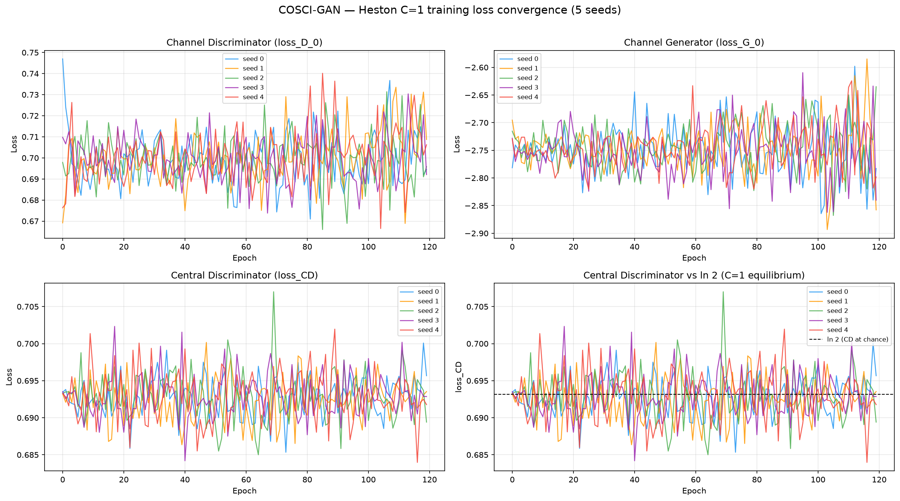
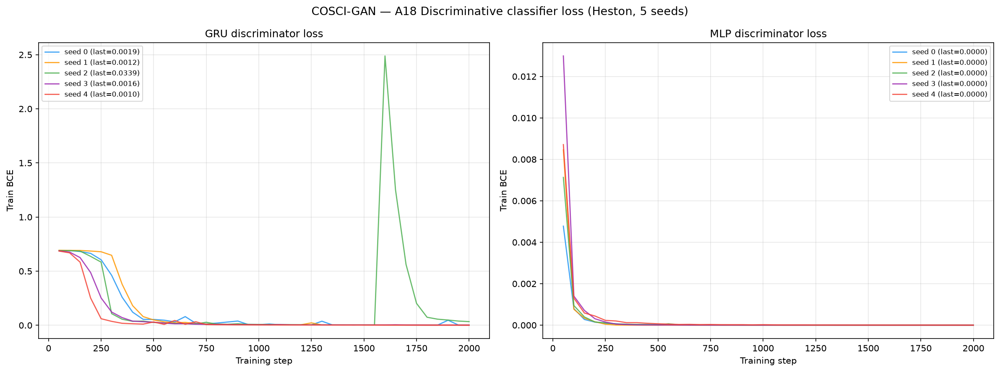
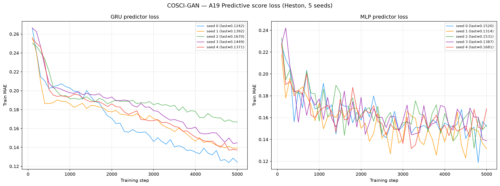
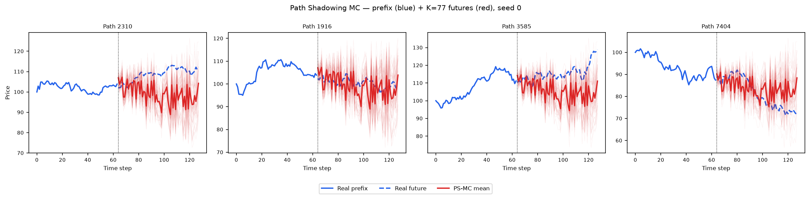
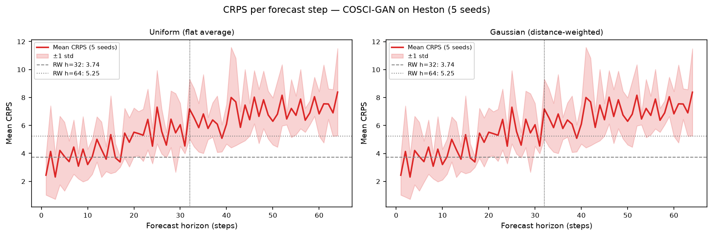

# COSCI-GAN on Heston

PyTorch reimplementation of **COSCI-GAN** (Seyfi, Rajotte & Ng, NeurIPS 2022 —
*Generating multivariate time series with COmmon Source CoordInated GAN*)
trained on 8 192 Heston stochastic-volatility price paths (seq\_len = 128).

See [`code/README.md`](code/README.md) for the source, the original paper/GitHub, the 3-player
architecture (per-channel LSTM Generator + LSTM Discriminator, one MLP Central Discriminator),
the hyperparameters (`gamma` = 5, `noise_len` = 32, `hidden_dim` = 256, Adam betas (0.5, 0.9)),
and the scalar MinMax normalisation chain applied to fit the price-scale Heston data into the
model's `[0, 1]` space.

> **⚠️ C = 1 degeneracy (documented honestly).** COSCI-GAN's contribution is *cross-channel*
> coordination: C univariate "Channel GANs" driven by a **shared noise vector**, coupled by one
> **Central Discriminator** (CD) that sees the concatenation of all channels. Heston here is
> **price-only, so C = 1**. With a single channel the CD receives the *same* 128-dim vector as the
> single channel discriminator — it becomes a redundant second critic with nothing cross-channel to
> coordinate. The healthy-equilibrium signature is therefore **`loss_CD ≈ ln 2 ≈ 0.693` (CD stuck at
> chance)**, which is exactly what we observe (see Training Loss below). The paper's own metric
> (Table 4 cross-channel correlation-MAE) is **structurally undefined at C = 1** and is reproduced
> separately on the multi-channel EEG dataset in
> [`paper_reimplementation/`](paper_reimplementation/README.md) (ours 0.1085 ± 0.0066 vs paper
> 0.111 ± 0.005). The Heston numbers below still exercise the full 3-player training loop; they just
> cannot reward the CD, so read them as "single-channel GAN with a spectating CD".

---

## Metrics A1–A34 + B — mean ± std across 5 seeds

> All metrics on **log-returns** $r_t = \log(S_{t+1}/S_t)$ unless noted. A26 uses price increments $\Delta S_t$.

| ID | Metric | Category | Dir | Mean ± Std | Seed 0 | Seed 1 | Seed 2 | Seed 3 | Seed 4 | Perfect floor |
|----|--------|----------|-----|-----------|--------|--------|--------|--------|--------|---------------|
| | **— Fat Tail —** | | | | | | | | | |
| A1 | Kurtosis Error | Fat Tail | ↓ | 0.5612 ± 0.1128 | 0.5685 | 0.6518 | 0.4435 | 0.4273 | 0.7147 | 0 |
| A2 | \|r\| q95 Error | Fat Tail | ↓ | 0.0972 ± 0.0035 | 0.1027 | 0.0962 | 0.0934 | 0.0995 | 0.0942 | 0 |
| A3 | \|r\| q99 Error | Fat Tail | ↓ | 0.1240 ± 0.0060 | 0.1261 | 0.1214 | 0.1201 | 0.1346 | 0.1178 | 0 |
| A4 | Tail QQ Error | Fat Tail | ↓ | 0.0957 ± 0.0035 | 0.1012 | 0.0947 | 0.0919 | 0.0983 | 0.0925 | 0 |
| A5 | Hill Tail Index Error | Fat Tail | ↓ | 1.563 ± 1.206 | 1.622 | 2.912 | 2.879 | 0.247 | 0.155 | 0 |
| | **— Distribution —** | | | | | | | | | |
| A6 | Path MMD² | Distribution | ↓ | 0.0467 ± 0.0038 | 0.0511 | 0.0401 | 0.0495 | 0.0477 | 0.0451 | 0.0015 |
| A7 | Terminal MMD² | Distribution | ↓ | 0.0138 ± 0.0137 | 0.0034 | 0.0014 | 0.0056 | 0.0211 | 0.0374 | 0.0016 |
| A8 | Increment MMD² | Distribution | ↓ | 0.4784 ± 0.0108 | 0.4951 | 0.4794 | 0.4614 | 0.4763 | 0.4799 | 7.45e-04 |
| A9 | Volatility MMD | Distribution | ↓ | 3.960 ± 0.0432 | 3.953 | 4.015 | 3.888 | 3.992 | 3.954 | 0.0071 |
| A10 | Terminal SWD | Distribution | ↓ | 4.550 ± 3.115 | 2.723 | 1.086 | 2.336 | 8.052 | 8.552 | 0.6873 |
| A11 | Path SWD | Distribution | ↓ | 3.486 ± 0.1871 | 3.764 | 3.222 | 3.617 | 3.412 | 3.415 | 0.4381 |
| A12 | RV Law Loss | Distribution | ↓ | 118.768 ± 7.929 | 129.782 | 118.368 | 107.774 | 124.957 | 112.960 | 0 |
| A13 | Mean Path RMSE | Distribution | ↓ | 4.007 ± 0.1941 | 4.272 | 3.736 | 4.181 | 3.922 | 3.922 | 0 |
| A14 | KS Log-returns | Distribution | ↓ | 0.3208 ± 0.0073 | 0.3156 | 0.3236 | 0.3122 | 0.3332 | 0.3194 | 0 |
| A15 | Skewness Error | Distribution | ↓ | 0.0445 ± 0.0386 | 0.1128 | 0.0146 | 0.0615 | 0.0217 | 0.0118 | 0 |
| A16 | QQ RMSE (300-pt) | Distribution | ↓ | 0.0486 ± 0.0020 | 0.0514 | 0.0487 | 0.0458 | 0.0498 | 0.0472 | 0 |
| A17 | Terminal Price KS | Distribution | ↓ | 0.1481 ± 0.0985 | 0.0992 | 0.0253 | 0.0936 | 0.2261 | 0.2963 | 0 |
| | **— Adversarial —** | | | | | | | | | |
| A18 GRU | Discriminative Score GRU | Adversarial | ↓ | 0.4998 ± 2.44e-04 | 0.4994 | 0.5000 | 0.4997 | 0.5000 | 0.5000 | 0.0042 |
| A18 MLP | Discriminative Score MLP | Adversarial | ↓ | 0.5000 ± 0.0000 | 0.5000 | 0.5000 | 0.5000 | 0.5000 | 0.5000 | 0.0067 |
| | **— Predictive —** | | | | | | | | | |
| A19 GRU | Predictive Score GRU | Predictive | ↓ | 0.1308 ± 0.0177 | 0.1476 | 0.1065 | 0.1362 | 0.1499 | 0.1138 | 0.0537 |
| A19 MLP | Predictive Score MLP | Predictive | ↓ | 0.1089 ± 0.0071 | 0.1182 | 0.1116 | 0.0967 | 0.1109 | 0.1071 | 0.0539 |
| | **— Temporal —** | | | | | | | | | |
| A20 | Covariance Error | Temporal | ↓ | 28.895 ± 25.360 | 10.835 | 4.775 | 67.761 | 10.657 | 50.447 | 0 |
| A21 | ACF \|r\| Error (lags) | Temporal | ↓ | 0.0806 ± 0.0206 | 0.0787 | 0.1093 | 0.0657 | 0.0970 | 0.0524 | 0 |
| A22 | ACF r² Error (lags) | Temporal | ↓ | 0.0902 ± 0.0214 | 0.0853 | 0.1206 | 0.0737 | 0.1082 | 0.0630 | 0 |
| A23 | ACF \|r\| Lag-1 Error | Temporal | ↓ | 0.1663 ± 0.0493 | 0.1758 | 0.1955 | 0.1414 | 0.2319 | 0.0870 | 0 |
| A24 | ACF r² Lag-1 Error | Temporal | ↓ | 0.1916 ± 0.0511 | 0.2109 | 0.2327 | 0.1673 | 0.2432 | 0.1038 | 0 |
| | **— Vol —** | | | | | | | | | |
| A25 | Mean RMSE | Vol | ↓ | 4.500 ± 3.382 | 3.279 | 0.786 | 1.410 | 8.232 | 8.791 | 0 |
| A26 | Return Std Error | Vol | ↓ | 5.033 ± 0.2229 | 5.300 | 5.083 | 4.684 | 5.212 | 4.888 | 0 |
| A27 | Log-Return Std Error | Vol | ↓ | 0.0498 ± 0.0020 | 0.0525 | 0.0497 | 0.0470 | 0.0513 | 0.0483 | 0 |
| A28 | Kurtosis Ratio | Vol | — | −7.994 ± 11.881 | −19.070 | −9.027 | 6.221 | 4.696 | −22.790 | 1.000 |
| A29 | Sigma Mean Error | Vol | ↓ | 0.7875 ± 0.0309 | 0.8308 | 0.7881 | 0.7440 | 0.8097 | 0.7648 | 0 |
| A30 | Cross-Sect. Vol Path RMSE | Vol | ↓ | 1.065 ± 0.2608 | 1.023 | 0.884 | 1.569 | 0.999 | 0.848 | 0 |
| A31 | Rolling Vol KS (w=5) | Vol | ↓ | 0.9373 ± 0.0076 | 0.9437 | 0.9453 | 0.9237 | 0.9372 | 0.9364 | 0 |
| A32 | Vol-of-Vol Error | Vol | ↓ | 0.0181 ± 0.0011 | 0.0191 | 0.0168 | 0.0181 | 0.0195 | 0.0167 | 0 |
| | **— Heston Spec —** | | | | | | | | | |
| A33 | Teacher-Sigma Corr | Heston Spec | ↑ | −0.0043 ± 0.0131 | −0.0291 | −0.0055 | 0.0026 | 0.0076 | 0.0028 | 0.6143 |
| A34 | Teacher-Sigma RMSE | Heston Spec | ↓ | 0.8095 ± 0.0288 | 0.8555 | 0.8105 | 0.7721 | 0.8219 | 0.7875 | 0.0654 |

> **Convention:** ↓ lower is better; ↑ higher is better; — no monotone direction. A28 Kurtosis Ratio: perfect = 1.0.
> **A1**: |kurt_real − kurt_gen| on log-returns. **A2–A3**: 95th/99th quantile error on |log-returns|. **A4**: QQ error restricted to top-5% tail quantiles. **A5**: |Hill tail index_real − Hill tail index_gen|, Hill estimator on |log-returns| above 95th pct.
> **A6–A11**: path-kernel distances — Gaussian MMD² on full paths / terminal prices / increments / realized-vol, and sliced-Wasserstein on terminal & full paths. Non-zero perfect floor (an independent Heston draw scored against the test set — finite-sample noise).
> **A12**: W₁(RV_real, RV_gen), RV_i = Σ_t r²_{i,t}/dt. Ref: Barndorff-Nielsen & Shephard (2002). **A13**: path-level RMSE between real/gen mean trajectories. **A14**: KS statistic on pooled log-returns. **A15**: |skew_real − skew_gen|, Heston true skew ≈ −0.45. **A16**: QQ RMSE over 300 uniform quantile levels. **A17**: KS statistic on terminal prices S_T.
> **A18**: Discriminative classifier trained on log-returns; score = |accuracy − 0.5|, 0 = indistinguishable, 0.5 = perfectly separable (GRU + MLP). **A19**: TSTR predictive MAE (GRU + MLP).
> **A20**: covariance-matrix error (%). **A21–A22**: ACF error on |r| and r² across lags 1–20. ARCH signal: |r_t| has positive lag-1 ACF ~0.05 in Heston. **A23–A24**: ACF lag-1 error on |r| and r². Heston true values ≈ +0.052 / +0.050.
> **A25**: mean-path RMSE. **A26**: return std error, uses price increments $\Delta S_t$. **A27**: log-return std error, uses $r_t = \log(S_{t+1}/S_t)$. **A28**: kurtosis ratio real/gen, perfect = 1.0. **A29**: sigma mean error — annualized per-path vol. **A30**: cross-sectional vol-path RMSE. **A31**: KS statistic on rolling-5 vol histograms. **A32**: |vol-of-vol_real − vol-of-vol_gen|.
> **A33**: Teacher-sigma correlation (Heston-recovered vol vs teacher σ), higher is better, perfect ≈ 0.614. **A34**: Teacher-sigma RMSE, perfect ≈ 0.065.

---

## B — Curve-Shape Metrics — mean ± std across 5 seeds

Each stylised-fact plot yields a **curve** L (a list of values), not a scalar. For the real
data (L_r) and generated data (L_g) we build three lists — the curve L, its first finite
difference L' (der), and its second finite difference L'' (sec\_der) — then combine the three
sub-scores into **one number per plot**:

- **MSE row**: for each list, dᵢ = mean((L_r − L_g)²). Reported mean = m_funct + m_der + m_sec\_der (**sum** of the three seed-means); std = sqrt(s_funct² + s_der² + s_sec\_der²) (**quadrature**).
- **% err row**: for each list, dᵢ = mean(|L_g − L_r| / (|L_r| + 1e-6)) × 100, a proper MAPE — one division (the mean already averages over the curve's points). Reported value = the **function-level MAPE on the curve L itself** — the derivative / 2nd-derivative MAPE is **excluded** because diff(L)/diff2(L) have near-zero true values, so their relative error explodes into meaningless 10⁴-% figures. mean/std = mean and **sample std across the 5 seeds** of that per-seed function MAPE.

All ↓ lower is better. The perfect floor is **non-zero** for all six plots — it is the residual finite-sample error of an independent Heston draw scored against the test set, identical across methods.
Two sublines per plot: **MSE** and **% error** (the per-seed columns hold that seed's combined score).

| Plot | Measure | Mean ± Std | Seed 0 | Seed 1 | Seed 2 | Seed 3 | Seed 4 | Perfect |
|------|---------|-----------|--------|--------|--------|--------|--------|:------:|
| **Log-return histogram** | MSE | 128.592 ± 5.889 | 124.089 | 122.327 | 124.903 | 135.899 | 135.744 | 0 |
| | % err | 248.649% ± 7.948% | 241.568% | 242.413% | 242.555% | 259.154% | 257.557% | 0 |
| **QQ plot** | MSE | 2.48e-03 ± 1.97e-04 | 2.76e-03 | 2.47e-03 | 2.20e-03 | 2.63e-03 | 2.33e-03 | 0 |
| | % err | 437.165% ± 19.282% | 448.244% | 436.789% | 401.120% | 457.444% | 442.228% | 0 |
| **ACF \|r\| lags 1–20** | MSE | 0.0256 ± 0.0069 | 0.0243 | 0.0458 | 0.0223 | 0.0213 | 0.0143 | 0 |
| | % err | 211.798% ± 41.110% | 190.398% | 289.822% | 189.330% | 214.921% | 174.519% | 0 |
| **ACF r² lags 1–20** | MSE | 0.0263 ± 0.0070 | 0.0207 | 0.0454 | 0.0290 | 0.0229 | 0.0136 | 0 |
| | % err | 251.696% ± 48.247% | 201.783% | 343.895% | 242.673% | 232.584% | 237.544% | 0 |
| **Rolling vol histogram** | MSE | 4202.497 ± 102.308 | 4179.691 | 4337.240 | 4087.884 | 4105.134 | 4302.536 | 0 |
| | % err | 802.749% ± 14.018% | 799.519% | 821.483% | 785.061% | 791.475% | 816.208% | 0 |
| **Tail survival** | MSE | 0.1794 ± 0.0060 | 0.1786 | 0.1791 | 0.1695 | 0.1880 | 0.1820 | 0 |
| | % err | 342.768% ± 8.325% | 343.621% | 344.949% | 327.900% | 353.683% | 343.686% | 0 |

> **Log-ret histogram**: MSE 128.6 — better than TimeVAE (2887) and TimeGAN (144), but **~45× worse than Fourier Flow (2.85)** and well behind SBTS/CSDI/DTS/TimeVQVAE (all ≈ 12–15). So while the *scalar* central moments are good (A1 Kurtosis Error 0.56 best of the VAE/GAN family), the *full histogram curve* is only mid-to-low across the benchmark: the central mass is roughly the right width but the **tails are too thin** (A28 Kurtosis Ratio negative, see below), which the curve metric penalises.
> **ACF \|r\|, ACF r²**: MSE small (~0.026) because the true ACF ≈ 0.05 sits near zero; the **% error** (function-level MAPE) is ~212% / 252% for that same near-zero-denominator reason. COSCI-GAN reproduces **more** of the ARCH autocorrelation than TimeVAE (A21 0.081, A23 0.166 vs TimeVAE 0.39 / 0.46), but still far from Diffusion-TS. Read MSE for absolute agreement, % error for relative shape.
> **Rolling vol histogram**: MSE 4202 — like every VAE/GAN baseline here, COSCI-GAN fails to reproduce the Heston rolling-volatility distribution (A31 rolling-vol KS 0.937, near-disjoint supports).

---

## Reading the table — honest mixed result

COSCI-GAN has the **best scalar low-order moments** of the VAE/GAN family here, but its **full-density
curves rank near the bottom of the benchmark** and it suffers a **hard adversarial failure**:

- **Good — scalar moments.** A1 Kurtosis Error **0.56** (vs TimeVAE 2.26, TimeGAN 2.96) and A15
  Skewness Error **0.044** (vs TimeVAE 0.56) are the best of the VAE/GAN family, and **A5 Hill tail-index
  error 1.56 is the best of *any* method in the benchmark** (beating CSDI 1.99). But these are *scalar*
  summaries — they do **not** carry over to the full-density *curve* diagnostics (B section above),
  where COSCI-GAN ranks **6th–8th of 8 on every plot** (dead-last on QQ, log-ret-histogram MSE 128.6
  behind all but TimeGAN and TimeVAE). Good moments, weak curves.
- **Decent — ARCH autocorrelation.** A21 0.081 / A23 0.166 beat TimeVAE (0.39 / 0.46); COSCI-GAN
  captures *some* volatility clustering, though not at Diffusion-TS level.
- **Hard fail — A18 = 0.50 (both GRU and MLP).** The discriminative score is at its **maximum**
  (`score = |accuracy − 0.5|`, so 0.50 = the classifier separates real from fake with ~100%
  accuracy). This is a **genuine result, not a metric bug**: the classifier's hidden dim is floored
  to `max(8, n_features·8) = 8` (never the degenerate 0 that crashed on 1-D data elsewhere), and its
  BCE loss collapses to ~1e-6 (MLP) / ~1e-3 (GRU) during training (see A18 loss plot), whereas the
  same pipeline leaves TimeVAE at ~0.69 (chance). COSCI-GAN paths carry a fingerprint the classifier
  learns almost perfectly.
- **Fat tails too thin — A28 = −7.99 (sign-flipping across seeds).** The generated log-returns have
  near-zero-to-slightly-negative *excess* kurtosis (Gaussian-ish tails) against Heston's mildly
  fat tails, so the ratio κ_real/κ_gen straddles zero (seeds range −22.8 … +6.2). The marginal
  *centre* is right (A1 good) but the *tail* is not.
- **No latent-vol recovery — A33 ≈ −0.004 (perfect 0.614), A34 0.81.** As with every single-factor
  generator here, the recovered instantaneous vol is uncorrelated with the teacher σ.

Net: a good density-matcher that a modern sequence classifier nonetheless nails, with thin tails and
no stochastic-vol structure.

---

## Stylised Facts Diagnostic (Heston vs COSCI-GAN, seed 0)

Eight-panel comparison matching the Murex paper (Fig. 1 style): sample paths, return distribution,
QQ plot, ACF of |returns|, ACF of squared returns, rolling vol histogram (window=5), tail survival (log-log).


---

## COSCI-GAN Training Loss (5 seeds)

COSCI-GAN is a **3-player** game, so each epoch logs three losses (`epoch, loss_D_0, loss_G_0,
loss_CD`):

- **`loss_D_0`** — channel-0 discriminator BCE, hovers at **~0.69–0.75** (critic near chance = the
  GAN equilibrium).
- **`loss_G_0`** — channel-0 generator loss = local adversarial − γ·loss_CD (γ = 5), sits around
  **−2.8**, dominated by the −γ·loss_CD coupling term.
- **`loss_CD`** — central discriminator BCE, pinned at **ln 2 ≈ 0.693** for the entire run — the
  **C = 1 degeneracy signature**: with one channel the CD has nothing cross-channel to coordinate
  and stays exactly at chance.

Training runs Adam(betas (0.5, 0.9)), batch 32, 120 epochs; generator/discriminator LR 1e-3, CD LR
1e-4 (10× smaller so the CD cannot overpower the channel GAN). All 5 seeds converge to this
equilibrium. See [`code/README.md`](code/README.md) for the loss definitions and the MinMax
normalisation chain.



---

## A18 — Discriminative Classifier Training Loss

BCE loss during GRU and MLP classifier training (2 000 steps, logged every 50 steps).
A value near ln(2) ≈ 0.693 means the classifier cannot distinguish real from fake; here the loss
**collapses toward zero** (MLP → ~1e-6, GRU → ~1e-3), the direct cause of the A18 = 0.50 score —
COSCI-GAN paths are near-perfectly separable from real Heston paths.



---

## A19 — Predictive Score Training Loss (TSTR)

MAE loss during GRU and MLP predictor training on *synthetic* data (5 000 steps, logged every 100 steps).



---

## Path Shadowing MC (arXiv:2308.01486)

Given a real path prefix (steps 0–63), embed it as a **65D murex-style feature vector**
(63 step-by-step log-returns + terminal cumulative return + realized volatility, z-scored
using the generated pool distribution), retrieve K=77 nearest COSCI-GAN paths by L2 distance
in that space, then use their price-anchored futures (steps 64–127) as a forecast ensemble.
Two variants: flat average (**Uniform**) and distance-weighted (**Gaussian**,
per-query η = η̃·‖z(x̃)‖ with η̃ = median(dist)/median(‖z‖) calibrated from data). The PS-MC pipeline
is **model-agnostic** — it consumes only the generated `.npy` paths, identical to the other methods'.

### Example ensemble fan-out (seed 0)



### CRPS per forecast step



### Results (mean ± std, 5 seeds)

| Metric | H=32 Uniform | H=32 Gaussian | H=64 Uniform | H=64 Gaussian | Naive RW |
|--------|:------------:|:-------------:|:------------:|:-------------:|:--------:|
| **CRPS** | 4.657 ± 0.775 | 4.656 ± 0.773 | 5.834 ± 0.763 | 5.834 ± 0.764 | 3.73 / 5.30 |
| MAE    | 6.030 ± 0.891 | 6.027 ± 0.888 | 7.674 ± 0.866 | 7.673 ± 0.866 | 3.73 / 5.30 |
| RMSE   | 7.613 ± 0.940 | 7.610 ± 0.938 | 9.782 ± 0.944 | 9.780 ± 0.944 | 5.07 / 7.18 |

PS-MC does **not** beat the naive RW on CRPS at either horizon (4.66 > 3.73 at H=32; 5.83 > 5.30 at
H=64); only **1 of 5 seeds** (seed 2, CRPS 3.54) edges below the RW at H=32. COSCI-GAN's
prior-generated pool does not contain price-anchored futures close enough to the real prefixes to
form a well-calibrated nearest-neighbour ensemble — consistent with its A18 = 0.50 separability and
weak stylised-facts fit (A9 Volatility MMD 3.96, A31 Rolling-Vol KS 0.937). Uniform ≈ Gaussian:
Heston is time-homogeneous, so the K nearest neighbours are roughly equally predictive.

Full analysis: [`../../results/Heston/COSCI-GAN/path_shadowing/README.md`](../../results/Heston/COSCI-GAN/path_shadowing/README.md)

---

## File layout

```
methods/COSCI-GAN/
├── README.md                          ← this file
├── generated_paths/seed_{0..4}/
│   ├── generated_paths_8192x128.npy   shape (8192, 128), original price scale
│   └── metadata.json                  seed, shape, min/max, train time, params (799 618)
├── weights/
│   ├── seed_{i}_model.pt              per-channel G/D + CD state_dict
│   └── seed_{i}_config.json           full hyperparameters + MinMax constants
├── losses/
│   ├── seed_{i}_losses.csv            epoch, loss_D_0, loss_G_0, loss_CD
│   └── loss_convergence.png           convergence plot (5 seeds, 3 loss panels + CD-vs-ln2 overlay)
├── code/
│   ├── train_heston.py                Heston training driver (3-player COSCI-GAN, C=1)
│   ├── plot_losses.py                 loss-convergence plot generator
│   ├── reference/                     verbatim released code (aliseyfi75/COSCI-GAN)
│   └── README.md                      paper, GitHub, architecture, C=1 note, hyperparameters
├── paper_reimplementation/            EEG eye-state Table-4 correlation-MAE reproduction
└── path_shadowing/                    model-agnostic PS-MC forecaster
```

## Reproduce

```bash
# Train all 5 seeds (2 A100 GPUs in parallel)
cd methods/COSCI-GAN/code
/home/tbasseras/gpu-venv/bin/python train_heston.py --seed 0

# Compute all metrics
cd /home/tbasseras/benchmark
/home/tbasseras/gpu-venv/bin/python metrics/compute_all.py --method COSCI-GAN --dataset Heston

# Run Path Shadowing MC
cd methods/COSCI-GAN/path_shadowing
/home/tbasseras/gpu-venv/bin/python run_eval.py
```
