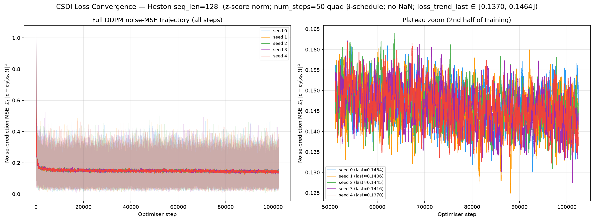
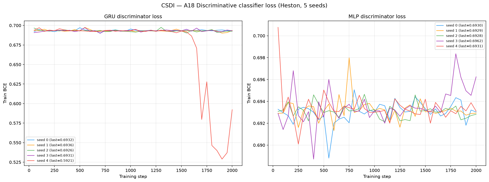
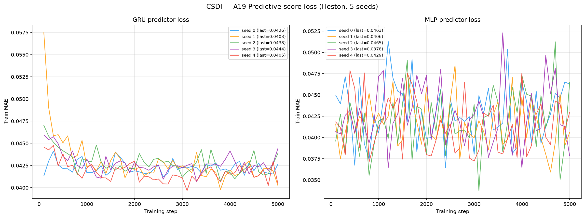
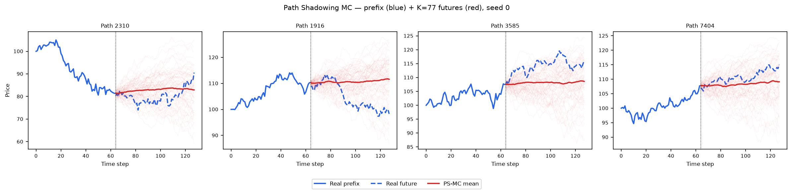
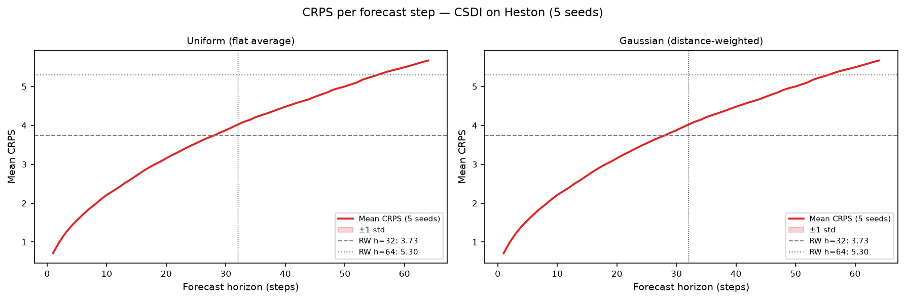

# CSDI on Heston

PyTorch reimplementation of **CSDI** (Tashiro, Song, Song, Ermon, NeurIPS 2021 —
*CSDI: Conditional Score-based Diffusion Models for Probabilistic Time Series Imputation*)
adapted as an **unconditional** score-based diffusion generator, trained on 8 192 Heston
stochastic-volatility price paths (seq\_len = 128).

See [`code/README.md`](code/README.md) for the source, the original paper/GitHub, and the exact
change (`is_unconditional=1` + `cond_mask ≡ 0`) that turns the authors' conditional imputer into a
pure DDPM sampler for Heston generation.

---

## Metrics A1–A34 + B — mean ± std across 5 seeds

> All metrics on **log-returns** $r_t = \log(S_{t+1}/S_t)$ unless noted. A26 uses price increments $\Delta S_t$.

| ID | Metric | Category | Dir | Mean ± Std | Seed 0 | Seed 1 | Seed 2 | Seed 3 | Seed 4 | Perfect floor |
|----|--------|----------|-----|-----------|--------|--------|--------|--------|--------|---------------|
| | **— Fat Tail —** | | | | | | | | | |
| A1 | Kurtosis Error | Fat Tail | ↓ | 0.0958 ± 0.0262 | 0.1181 | 0.1039 | 0.0508 | 0.0837 | 0.1224 | 0 |
| A2 | \|r\| q95 Error | Fat Tail | ↓ | 0.0053 ± 1.50e-04 | 0.0053 | 0.0054 | 0.0052 | 0.0052 | 0.0056 | 0 |
| A3 | \|r\| q99 Error | Fat Tail | ↓ | 0.0073 ± 2.29e-04 | 0.0071 | 0.0075 | 0.0071 | 0.0072 | 0.0077 | 0 |
| A4 | Tail QQ Error | Fat Tail | ↓ | 0.0052 ± 1.50e-04 | 0.0052 | 0.0053 | 0.0051 | 0.0051 | 0.0055 | 0 |
| A5 | Hill Tail Index Error | Fat Tail | ↓ | 1.992 ± 0.5856 | 2.302 | 1.613 | 1.204 | 1.926 | 2.913 | 0 |
| | **— Distribution —** | | | | | | | | | |
| A6 | Path MMD² | Distribution | ↓ | 0.0027 ± 6.16e-04 | 0.0022 | 0.0029 | 0.0019 | 0.0037 | 0.0027 | 0.0015 |
| A7 | Terminal MMD² | Distribution | ↓ | 0.0028 ± 0.0011 | 0.0018 | 0.0035 | 0.0026 | 0.0046 | 0.0017 | 0.0016 |
| A8 | Increment MMD² | Distribution | ↓ | 0.0079 ± 8.54e-04 | 0.0081 | 0.0081 | 0.0065 | 0.0078 | 0.0092 | 7.45e-04 |
| A9 | Volatility MMD | Distribution | ↓ | 0.2448 ± 0.0206 | 0.2500 | 0.2460 | 0.2075 | 0.2497 | 0.2710 | 0.0071 |
| A10 | Terminal SWD | Distribution | ↓ | 1.303 ± 0.2465 | 1.156 | 1.298 | 1.135 | 1.781 | 1.145 | 0.6873 |
| A11 | Path SWD | Distribution | ↓ | 0.7712 ± 0.1581 | 0.6971 | 0.6767 | 0.6470 | 1.079 | 0.7560 | 0.4381 |
| A12 | RV Law Loss | Distribution | ↓ | 1.897 ± 0.0563 | 1.869 | 1.923 | 1.845 | 1.851 | 1.995 | 0 |
| A13 | Mean Path RMSE | Distribution | ↓ | 0.3101 ± 0.3036 | 0.1073 | 0.0983 | 0.9073 | 0.1902 | 0.2472 | 0 |
| A14 | KS Log-returns | Distribution | ↓ | 0.0539 ± 0.0021 | 0.0530 | 0.0544 | 0.0520 | 0.0522 | 0.0577 | 0 |
| A15 | Skewness Error | Distribution | ↓ | 0.0457 ± 0.0021 | 0.0476 | 0.0469 | 0.0429 | 0.0434 | 0.0478 | 0 |
| A16 | QQ RMSE (300-pt) | Distribution | ↓ | 0.0026 ± 8.60e-05 | 0.0025 | 0.0026 | 0.0025 | 0.0025 | 0.0027 | 0 |
| A17 | Terminal Price KS | Distribution | ↓ | 0.0321 ± 0.0053 | 0.0255 | 0.0295 | 0.0387 | 0.0380 | 0.0289 | 0 |
| | **— Adversarial —** | | | | | | | | | |
| A18 GRU | Discriminative Score GRU | Adversarial | ↓ | 0.0470 ± 0.0901 | 1.53e-04 | 1.53e-04 | 0.0063 | 0.0014 | 0.2272 | 0.0042 |
| A18 MLP | Discriminative Score MLP | Adversarial | ↓ | 0.0046 ± 0.0058 | 0.0029 | 1.53e-04 | 0.0026 | 0.0014 | 0.0160 | 0.0067 |
| | **— Predictive —** | | | | | | | | | |
| A19 GRU | Predictive Score GRU | Predictive | ↓ | 0.0539 ± 3.20e-05 | 0.05394 | 0.05390 | 0.05392 | 0.05398 | 0.05398 | 0.0537 |
| A19 MLP | Predictive Score MLP | Predictive | ↓ | 0.0541 ± 2.47e-04 | 0.0539 | 0.0542 | 0.0539 | 0.0539 | 0.0545 | 0.0539 |
| | **— Temporal —** | | | | | | | | | |
| A20 | Covariance Error | Temporal | ↓ | 35.54 ± 5.776 | 35.80 | 40.66 | 25.78 | 41.95 | 33.50 | 0 |
| A21 | ACF \|r\| Error (lags) | Temporal | ↓ | 0.0091 ± 0.0026 | 0.0073 | 0.0092 | 0.0060 | 0.0096 | 0.0135 | 0 |
| A22 | ACF r² Error (lags) | Temporal | ↓ | 0.0086 ± 0.0021 | 0.0072 | 0.0088 | 0.0059 | 0.0090 | 0.0122 | 0 |
| A23 | ACF \|r\| Lag-1 Error | Temporal | ↓ | 0.0188 ± 0.0048 | 0.0186 | 0.0182 | 0.0120 | 0.0184 | 0.0270 | 0 |
| A24 | ACF r² Lag-1 Error | Temporal | ↓ | 0.0176 ± 0.0036 | 0.0178 | 0.0159 | 0.0130 | 0.0174 | 0.0239 | 0 |
| | **— Vol —** | | | | | | | | | |
| A25 | Mean RMSE | Vol | ↓ | 0.3729 ± 0.4145 | 0.1444 | 0.1132 | 1.195 | 0.1425 | 0.2694 | 0 |
| A26 | Return Std Error | Vol | ↓ | 0.2570 ± 0.0098 | 0.2542 | 0.2612 | 0.2436 | 0.2527 | 0.2732 | 0 |
| A27 | Log-Return Std Error | Vol | ↓ | 0.0026 ± 8.90e-05 | 0.0026 | 0.0027 | 0.0026 | 0.0026 | 0.0028 | 0 |
| A28 | Kurtosis Ratio | Vol | — | 0.8539 ± 0.0298 | 0.8099 | 0.8461 | 0.8832 | 0.8911 | 0.8393 | 1.000 |
| A29 | Sigma Mean Error | Vol | ↓ | 0.0404 ± 0.0015 | 0.0398 | 0.0410 | 0.0391 | 0.0392 | 0.0430 | 0 |
| A30 | Cross-Sect. Vol Path RMSE | Vol | ↓ | 0.9262 ± 0.1315 | 0.9504 | 1.054 | 0.7295 | 1.071 | 0.8263 | 0 |
| A31 | Rolling Vol KS (w=5) | Vol | ↓ | 0.2180 ± 0.0082 | 0.2145 | 0.2195 | 0.2110 | 0.2118 | 0.2333 | 0 |
| A32 | Vol-of-Vol Error | Vol | ↓ | 0.0010 ± 2.10e-05 | 0.0010 | 0.0011 | 0.0011 | 0.0010 | 0.0011 | 0 |
| | **— Heston Spec —** | | | | | | | | | |
| A33 | Teacher-Sigma Corr | Heston Spec | ↑ | 0.0084 ± 0.0040 | 0.0090 | 0.0090 | 0.0116 | 0.0009 | 0.0116 | 0.6143 |
| A34 | Teacher-Sigma RMSE | Heston Spec | ↓ | 0.0985 ± 6.61e-04 | 0.0985 | 0.0986 | 0.0974 | 0.0984 | 0.0995 | 0.0654 |

> **Convention:** ↓ lower is better; ↑ higher is better; — no monotone direction. A28 Kurtosis Ratio: perfect = 1.0.
> **A1**: |kurt_real − kurt_gen| on log-returns. **A2–A3**: 95th/99th quantile error on |log-returns|. **A4**: QQ error restricted to top-5% tail quantiles. **A5**: |Hill tail index_real − Hill tail index_gen|, Hill estimator on |log-returns| above 95th pct.
> **A6–A11**: path-kernel distances — Gaussian MMD² on full paths / terminal prices / increments / realized-vol, and sliced-Wasserstein on terminal & full paths. Non-zero perfect floor (row-shuffle keeps joint path structure).
> **A12**: W₁(RV_real, RV_gen), RV_i = Σ_t r²_{i,t}/dt. Ref: Barndorff-Nielsen & Shephard (2002). **A13**: path-level RMSE between real/gen mean trajectories. **A14**: KS statistic on pooled log-returns. **A15**: |skew_real − skew_gen|, Heston true skew ≈ −0.45. **A16**: QQ RMSE over 300 uniform quantile levels. **A17**: KS statistic on terminal prices S_T.
> **A18**: Discriminative classifier trained on log-returns; score = |accuracy − 0.5|, 0 = indistinguishable (GRU + MLP). **A19**: TSTR predictive MAE; all methods cluster near 0.054–0.059 (irreducible log-return floor) (GRU + MLP).
> **A20**: covariance-matrix error (%). **A21–A22**: ACF error on |r| and r² across lags 1–20. ARCH signal: |r_t| has positive lag-1 ACF ~0.05 in Heston. **A23–A24**: ACF lag-1 error on |r| and r². Heston true values ≈ +0.052 / +0.050.
> **A25**: mean-path RMSE. **A26**: return std error, uses price increments $\Delta S_t$. **A27**: log-return std error, uses $r_t = \log(S_{t+1}/S_t)$. **A28**: kurtosis ratio real/gen, perfect = 1.0. **A29**: sigma mean error — annualized per-path vol. **A30**: cross-sectional vol-path RMSE. **A31**: KS statistic on rolling-5 vol histograms. **A32**: |vol-of-vol_real − vol-of-vol_gen|.
> **A33**: Teacher-sigma correlation (Heston-recovered vol vs teacher σ), higher is better, perfect ≈ 0.614. **A34**: Teacher-sigma RMSE, perfect ≈ 0.065.

---

## B — Curve-Shape Metrics — mean ± std across 5 seeds

Each stylised-fact plot yields a **curve** L (a list of values), not a scalar. For the real
data (L_r) and generated data (L_g) we build three lists — the curve L, its first finite
difference L' (der), and its second finite difference L'' (sec\_der) — then combine the three
sub-scores into **one number per plot**:

- **MSE row**: for each list, dᵢ = mean((L_r − L_g)²). Reported mean = m_funct + m_der + m_sec\_der (**sum** of the three seed-means); std = sqrt(s_funct² + s_der² + s_sec\_der²) (**quadrature**).
- **% err row**: for each list, dᵢ = mean(|L_g − L_r| / (|L_r| + 1e-6)) × 100, a proper MAPE — one division (the mean already averages over the curve's points). Reported value = the **function-level MAPE on the curve L itself** — the derivative / 2nd-derivative MAPE is **excluded** because diff(L)/diff2(L) have near-zero true values, so their relative error explodes into meaningless 10⁴-% figures. mean/std = mean and **sample std across the 5 seeds** of that per-seed function MAPE.

All ↓ lower is better. Perfect floor = 0 for all six plots (row-shuffled real data has identical curves).
Two sublines per plot: **MSE** and **% error** (the per-seed columns hold that seed's combined score).

| Plot | Measure | Mean ± Std | Seed 0 | Seed 1 | Seed 2 | Seed 3 | Seed 4 | Perfect |
|------|---------|-----------|--------|--------|--------|--------|--------|:------:|
| **Log-return histogram** | MSE | 13.85 ± 1.500 | 13.38 | 14.43 | 12.11 | 12.72 | 16.62 | 0 |
| | % err | 35.03% ± 1.059% | 34.53% | 35.44% | 34.15% | 34.12% | 36.93% | 0 |
| **QQ plot** | MSE | 6.94e-06 ± 4.63e-07 | 6.72e-06 | 7.15e-06 | 6.53e-06 | 6.56e-06 | 7.76e-06 | 0 |
| | % err | 23.93% ± 1.070% | 23.45% | 23.95% | 24.12% | 22.41% | 25.71% | 0 |
| **ACF \|r\| lags 1–20** | MSE | 6.27e-05 ± 2.10e-05 | 4.30e-05 | 4.78e-05 | 4.74e-05 | 5.61e-05 | 1.19e-04 | 0 |
| | % err | 15.15% ± 5.425% | 8.88% | 12.01% | 21.03% | 11.56% | 22.26% | 0 |
| **ACF r² lags 1–20** | MSE | 5.59e-05 ± 1.61e-05 | 5.02e-05 | 4.35e-05 | 4.27e-05 | 5.20e-05 | 9.10e-05 | 0 |
| | % err | 16.27% ± 4.883% | 10.52% | 14.11% | 19.54% | 13.11% | 24.07% | 0 |
| **Rolling vol histogram** | MSE | 463.8 ± 36.61 | 447.6 | 465.8 | 438.7 | 433.0 | 533.9 | 0 |
| | % err | 61.28% ± 2.323% | 60.33% | 62.06% | 58.63% | 60.00% | 65.38% | 0 |
| **Tail survival** | MSE | 0.0058 ± 5.52e-04 | 0.0057 | 0.0060 | 0.0052 | 0.0054 | 0.0068 | 0 |
| | % err | 24.63% ± 0.880% | 24.31% | 25.01% | 23.73% | 23.94% | 26.16% | 0 |

> **QQ plot**: CSDI's best B panel — MSE 6.9e-06 (function-level MAPE 24%) shows the return-quantile shape is reproduced tightly. **ACF \|r\|, ACF r²**: MSE is tiny (~6e-05) because the true ACF ≈ 0.05 sits near zero; read MSE for absolute agreement, % error for relative shape.
> **Log-return histogram / Rolling vol histogram**: the two weakest panels in absolute terms (MSE 13.85 / 463.8) — the diffusion pool slightly over-disperses the return and rolling-vol distributions.

---

## Stylised Facts Diagnostic (Heston vs CSDI, seed 0)

Eight-panel comparison matching the Murex paper (Fig. 1 style): sample paths, return distribution,
QQ plot, ACF of |returns|, ACF of squared returns, rolling vol histogram (window=5), tail survival (log-log).


---

## CSDI Training Loss (5 seeds)

Single-phase **DDPM noise-prediction MSE** $\mathbb{E}_t \lVert \epsilon - \epsilon_\theta(x_t, t) \rVert^2$
over 200 epochs (359 mini-batches/epoch, batch 16). CSDI is a score-based diffusion model, so there is
**no adversarial or supervised phase** — a single denoising objective is minimised. Optimiser Adam
(lr 1e-3, weight-decay 1e-6); `MultiStepLR` decays lr ×0.1 at epochs 150 and 180. Unconditional
generation is obtained by forcing the conditioning mask to zero (`cond_mask ≡ 0`), so every point is a
diffusion target (see [`code/README.md`](code/README.md)). Min training loss ≈ 0.0096, no NaN.



---

## A18 — Discriminative Classifier Training Loss

BCE loss during GRU and MLP classifier training (2 000 steps, logged every 50 steps).
A value near ln(2) ≈ 0.693 means the classifier cannot distinguish real from fake.



---

## A19 — Predictive Score Training Loss (TSTR)

MAE loss during GRU and MLP predictor training on *synthetic* data (5 000 steps, logged every 100 steps).



---

## Path Shadowing MC (arXiv:2308.01486)

Given a real path prefix (steps 0–63), embed it as a **65D murex-style feature vector**
(63 step-by-step log-returns + terminal cumulative return + realized volatility, z-scored
using the generated pool distribution), retrieve K=77 nearest CSDI paths by L2 distance
in that space, then use their price-anchored futures (steps 64–127) as a forecast ensemble.
Two variants: flat average (**Uniform**) and distance-weighted (**Gaussian**,
per-query η = η̃·‖z(x̃)‖ with η̃ = median(dist)/median(‖z‖) calibrated from data). The PS-MC pipeline
is **model-agnostic** — it consumes only the generated `.npy` paths, identical to TimeGAN / Fourier Flow.

### Example ensemble fan-out (seed 0)



### CRPS per forecast step



### Results (mean ± std, 5 seeds)

| Metric | H=32 Uniform | H=32 Gaussian | H=64 Uniform | H=64 Gaussian | Naive RW |
|--------|:------------:|:-------------:|:------------:|:-------------:|:--------:|
| **CRPS** | **2.713 ± 0.005** | 2.713 ± 0.005 | **3.814 ± 0.007** | 3.814 ± 0.007 | 3.73 / 5.30 |
| MAE    | 3.721 ± 0.007 | 3.721 ± 0.007 | 5.254 ± 0.009 | 5.254 ± 0.009 | 3.73 / 5.30 |
| RMSE   | 5.067 ± 0.005 | 5.067 ± 0.005 | 7.154 ± 0.005 | 7.154 ± 0.005 | 5.07 / 7.18 |

PS-MC **beats the naive RW on CRPS** at both horizons (2.71 < 3.73 at H=32; 3.81 < 5.30 at H=64), on all
5 seeds. CSDI's CRPS is the **lowest of all methods benchmarked** (2.713 vs Fourier Flow 2.742 and
TimeGAN 3.09 at H=32) — its diffusion-generated pool provides the tightest, best-calibrated
nearest-neighbour futures. Uniform ≈ Gaussian: Heston is time-homogeneous, so the K nearest neighbours
are roughly equally predictive.

Full analysis: [`../../results/Heston/CSDI/path_shadowing/README.md`](../../results/Heston/CSDI/path_shadowing/README.md)

---

## File layout

```
methods/CSDI/
├── README.md                          ← this file
├── generated_paths/seed_{0..4}/
│   ├── generated_paths_8192x128.npy   shape (8192, 128), original price scale
│   └── metadata.json                  seed, shape, min/max, train time, params, z-score
├── weights/
│   ├── seed_{i}_model.pt              full PyTorch state_dict
│   └── seed_{i}_config.json           hyperparameters (base.yaml verbatim)
├── losses/
│   ├── seed_{i}_losses.csv            step, loss (DDPM noise-prediction MSE)
│   └── loss_convergence.png           convergence plot (5 seeds overlaid)
├── code/
│   ├── train_heston.py                unconditional CSDI generator (imports reference CSDI)
│   ├── plot_losses.py                 loss_convergence.png generator
│   ├── reference/                     verbatim released code (ermongroup/CSDI)
│   └── README.md                      paper, GitHub, the is_unconditional=1 change
├── paper_reimplementation/            PhysioNet + PM2.5 CRPS reproduction (Table 2) + Heston imputation-CRPS
└── path_shadowing/                    model-agnostic PS-MC forecaster
```

## Reproduce

```bash
# Train all 5 seeds (2 A100 GPUs in parallel — one --seed per process)
cd methods/CSDI/code
for s in 0 1 2 3 4; do
  gpu=$([ $((s % 2)) -eq 0 ] && echo 0 || echo 3)
  CUDA_VISIBLE_DEVICES=$gpu OMP_NUM_THREADS=8 taskset -c 0-7 \
    /home/tbasseras/gpu-venv/bin/python train_heston.py --seed $s &
done
wait

# Compute all metrics
cd metrics
python compute_all.py --method CSDI --dataset Heston

# Run Path Shadowing MC
cd methods/CSDI/path_shadowing
python run_eval.py
```

See [`code/README.md`](code/README.md) for the exact interpreter path, env vars, and which output
file produced each committed number.
