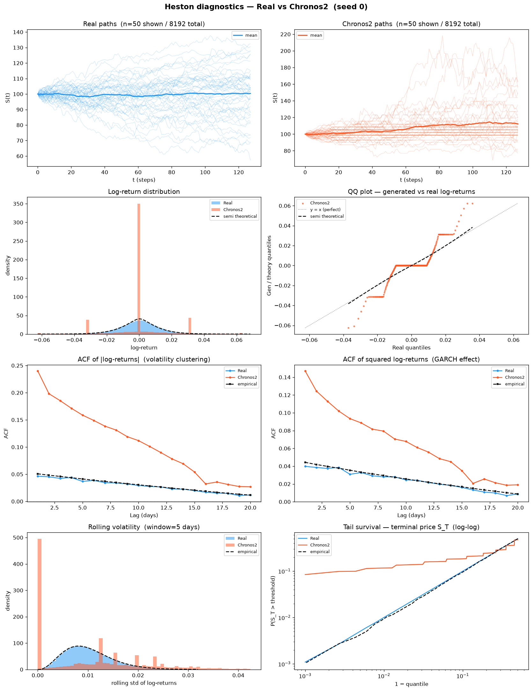
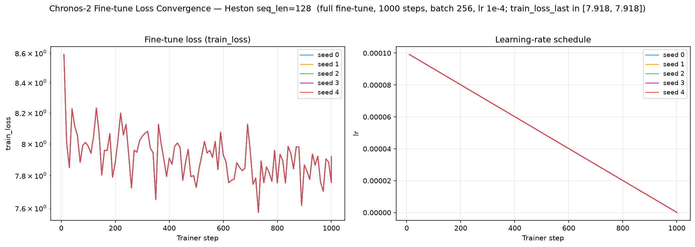
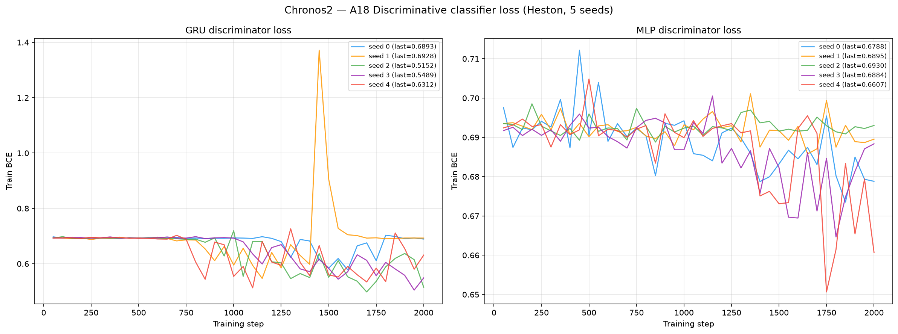
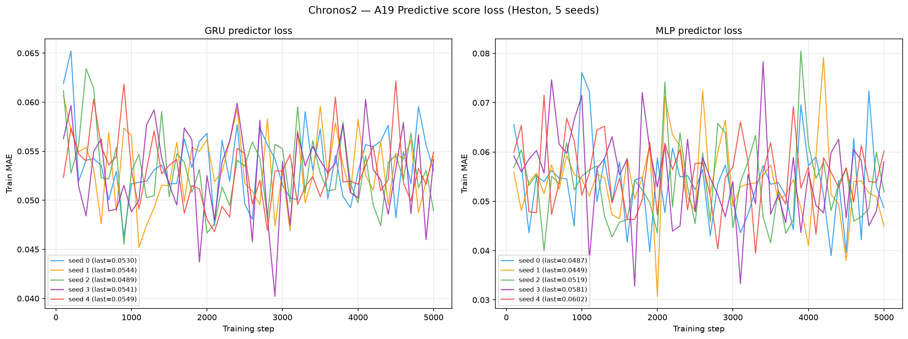
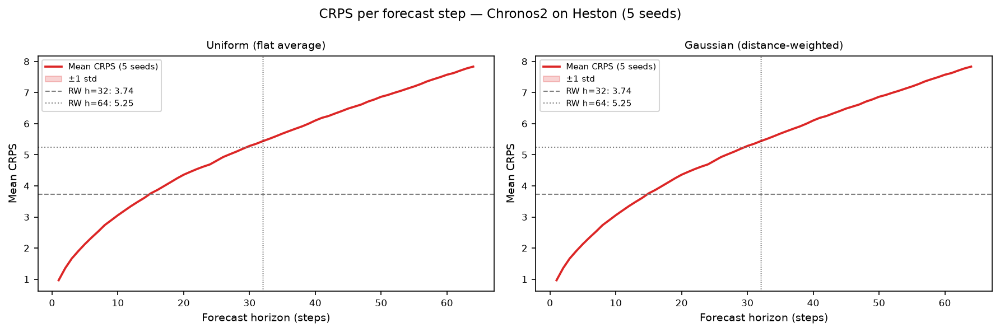

# Chronos-2 on Heston

Fine-tuned run of the **official Chronos-2** foundation forecaster (Ansari, Turkmen, Shchur,
et al., Amazon Science, **2025** — *Chronos-2: From Univariate to Universal Forecasting*,
arXiv:2510.15821, `github.com/amazon-science/chronos-forecasting`), a pretrained
encoder-decoder T5-style probabilistic model with group attention (**~120M params — the
largest model in the benchmark**). Full fine-tuned on 8 192 Heston stochastic-volatility
price paths (seq\_len = 128), then rolled out autoregressively from real test-set prefixes.

See [`code/README.md`](code/README.md) for the source, the original paper/GitHub, the
architecture, the full fine-tune protocol (checkpoint `amazon/chronos-2`, `finetune_mode="full"`,
1 000 steps, lr 1e-4, batch 256, prediction length 16), and the log-space autoregressive
rollout generator.

> **Generation scheme — autoregressive rollout in log-space from a real test prefix.**
> Each generated series starts from the **first 16 steps of a real test path** (prefix = 16,
> `dataset/Heston/heston_S_test_8192x128.npy`). At every step the fine-tuned model forecasts
> the next-step quantiles (21 trained levels); one Monte-Carlo sample per series is drawn by
> inverse-CDF (`np.interp`) on those quantiles, appended, and the window advanced — repeated to
> length 128. Rollout runs in **log-price space** and the output is exponentiated back to price
> scale. Feature dim **1**, sequence length **128** (the Heston shape).

> **Fine-tune only — the shipped Chronos-2 variant.** The **fine-tuned** model is the sole
> Chronos-2 method in this benchmark. Chronos-2's robust scaling is level-proportional, so a
> **zero-shot** autoregressive rollout on a low-vol geometric process like Heston is fundamentally
> unstable: the price level runs away multiplicatively even in log-space. Fine-tuning fixes the
> per-step scale and is required for a stable 112-step rollout. **No zero-shot artifacts are
> archived** — only the fine-tuned variant ships (see [`code/README.md`](code/README.md) for the
> log-space and zero-shot-instability findings).

---

## Metrics A1–A34 + B — mean ± std across 5 seeds

> All metrics on **log-returns** $r_t = \log(S_{t+1}/S_t)$ unless noted. A26 uses price increments $\Delta S_t$.

| Metric | Mean ± Std | Seed 0 | Seed 1 | Seed 2 | Seed 3 | Seed 4 | Perfect floor |
|--------|-----------|--------|--------|--------|--------|--------|---------------|
| **— Fat Tail —** | | | | | | | |
| A1 Kurtosis Error ↓ | 33213 ± 61713 | 5912 | 43.25 | 195.1 | 1.57e+05 | 3352 | 0.008092 |
| A2 \|r\| q95 Error ↓ | 0.008183 ± 1.28e-04 | 0.007993 | 0.008330 | 0.008236 | 0.008074 | 0.008280 | 6.57e-05 |
| A3 \|r\| q99 Error ↓ | 0.02621 ± 3.47e-18 | 0.02621 | 0.02621 | 0.02621 | 0.02621 | 0.02621 | 5.98e-05 |
| A4 Tail QQ Error ↓ | 0.01329 ± 5.52e-05 | 0.01323 | 0.01335 | 0.01329 | 0.01322 | 0.01335 | 6.75e-05 |
| A5 Hill Tail Index Error ↓ | 16.95 ± 0.3287 | 17.50 | 16.70 | 16.66 | 17.15 | 16.72 | 0.5266 |
| **— Distribution —** | | | | | | | |
| A6 Path MMD² ↓ | 0.01567 ± 0.001487 | 0.01436 | 0.01632 | 0.01551 | 0.01402 | 0.01816 | 0.001842 |
| A7 Terminal MMD² ↓ | 0.02727 ± 0.001487 | 0.02739 | 0.02527 | 0.02739 | 0.02647 | 0.02980 | 0.001983 |
| A8 Increment MMD² ↓ | 0.01223 ± 5.59e-04 | 0.01168 | 0.01160 | 0.01270 | 0.01215 | 0.01303 | 8.69e-04 |
| A9 Volatility MMD ↓ | 0.7819 ± 0.03406 | 0.7570 | 0.7535 | 0.7893 | 0.7647 | 0.8453 | 0.008554 |
| A10 Terminal SWD ↓ | 13.27 ± 11.05 | 8.970 | 5.687 | 8.121 | 35.26 | 8.292 | 1.151 |
| A11 Path SWD ↓ | 3.663 ± 1.763 | 3.183 | 2.167 | 2.922 | 7.122 | 2.918 | 0.6191 |
| A12 RV Law Loss ↓ | 8.120 ± 0.07749 | 8.068 | 8.042 | 8.078 | 8.254 | 8.160 | 0.05202 |
| A13 Mean Path RMSE ↓ | 2.966 ± 0.5016 | 2.852 | 2.530 | 2.807 | 3.945 | 2.698 | 0.1205 |
| A14 KS Log-returns ↓ | 0.2830 ± 6.09e-04 | 0.2827 | 0.2833 | 0.2822 | 0.2826 | 0.2840 | 0.001491 |
| A15 Skewness Error ↓ | 0.3153 ± 0.08030 | 0.2967 | 0.2164 | 0.2669 | 0.4531 | 0.3433 | 0.005274 |
| A16 QQ RMSE (300-pt) ↓ | 0.007833 ± 1.06e-05 | 0.007820 | 0.007848 | 0.007831 | 0.007823 | 0.007842 | 4.19e-05 |
| A17 Terminal Price KS ↓ | 0.1239 ± 0.002006 | 0.1261 | 0.1228 | 0.1265 | 0.1229 | 0.1213 | 0.01099 |
| **— Adversarial —** | | | | | | | |
| A18 Disc Score GRU ↓ | 0.1606 ± 0.07803 | 0.009002 | 0.1643 | 0.2113 | 0.2003 | 0.2180 | 0.006195 |
| A18 Disc Score MLP ↓ | 0.02298 ± 0.01150 | 0.02731 | 0.01053 | 0.02609 | 0.01022 | 0.04074 | 0.005951 |
| **— Predictive —** | | | | | | | |
| A19 Pred Score GRU ↓ | 0.05003 ± 2.34e-05 | 0.05007 | 0.05002 | 0.05003 | 0.05001 | 0.05001 | 0.05002 |
| A19 Pred Score MLP ↓ | 0.05024 ± 3.00e-04 | 0.05002 | 0.05017 | 0.04989 | 0.05076 | 0.05034 | 0.05036 |
| **— Temporal —** | | | | | | | |
| A20 Covariance Error ↓ | 19192 ± 37246 | 740.1 | 444.9 | 533.7 | 93683 | 557.6 | 4.923 |
| A21 ACF \|r\| Error (lags) ↓ | 0.1339 ± 0.001922 | 0.1324 | 0.1332 | 0.1334 | 0.1330 | 0.1377 | 0.002234 |
| A22 ACF r² Error (lags) ↓ | 0.07220 ± 0.001298 | 0.07129 | 0.07189 | 0.07184 | 0.07122 | 0.07473 | 0.002206 |
| A23 ACF \|r\| Lag-1 Error ↓ | 0.1905 ± 0.002310 | 0.1892 | 0.1891 | 0.1897 | 0.1892 | 0.1951 | 0.002652 |
| A24 ACF r² Lag-1 Error ↓ | 0.1040 ± 0.001707 | 0.1040 | 0.1032 | 0.1028 | 0.1025 | 0.1072 | 0.002790 |
| **— Vol —** | | | | | | | |
| A25 Mean RMSE ↓ | 7.034 ± 1.428 | 6.627 | 5.954 | 6.476 | 9.854 | 6.261 | 0.1392 |
| A26 Return Std Error ↓ | 7.661 ± 13.38 | 1.048 | 0.8754 | 0.9305 | 34.43 | 1.023 | 0.002523 |
| A27 Log-Return Std Error ↓ | 0.006403 ± 5.83e-05 | 0.006381 | 0.006347 | 0.006380 | 0.006516 | 0.006393 | 3.15e-05 |
| A28 Kurtosis Ratio (→ 1) | 0.09859 ± 0.02940 | 0.1056 | 0.1382 | 0.1121 | 0.04969 | 0.08734 | 1.006 |
| A29 Sigma Mean Error ↓ | 0.05589 ± 2.83e-04 | 0.05610 | 0.05579 | 0.05618 | 0.05599 | 0.05539 | 4.96e-04 |
| A30 Cross-Sect. Vol Path RMSE ↓ | 24.84 ± 39.72 | 5.430 | 4.327 | 4.944 | 104.3 | 5.211 | 0.1432 |
| A31 Rolling Vol KS (w=5) ↓ | 0.3490 ± 0.002518 | 0.3472 | 0.3484 | 0.3470 | 0.3485 | 0.3539 | 0.003814 |
| A32 Vol-of-Vol Error ↓ | 0.007430 ± 6.32e-05 | 0.007401 | 0.007372 | 0.007380 | 0.007542 | 0.007457 | 1.54e-05 |
| **— Heston Spec —** | | | | | | | |
| A33 Teacher-Sigma Corr ↑ | 0.05739 ± 0.004889 | 0.05977 | 0.05015 | 0.06498 | 0.05602 | 0.05602 | 0.6163 |
| A34 Teacher-Sigma RMSE ↓ | 0.2167 ± 0.001244 | 0.2160 | 0.2160 | 0.2154 | 0.2189 | 0.2172 | 0.06559 |

> **Convention:** ↓ lower is better; ↑ higher is better; — no monotone direction. A28 Kurtosis Ratio: perfect = 1.0.
> **A1**: |kurt_real − kurt_gen| on log-returns. **A2–A3**: 95th/99th quantile error on |log-returns|. **A4**: QQ error restricted to top-5% tail quantiles. **A5**: |Hill tail index_real − Hill tail index_gen|, Hill estimator on |log-returns| above 95th pct.
> **A6–A11**: path-kernel distances — Gaussian MMD² on full paths / terminal prices / increments / realized-vol, and sliced-Wasserstein on terminal & full paths. Non-zero perfect floor (an independent Heston draw scored against the test set — finite-sample noise).
> **A12**: W₁(RV_real, RV_gen), RV_i = Σ_t r²_{i,t}/dt. Ref: Barndorff-Nielsen & Shephard (2002). **A13**: path-level RMSE between real/gen mean trajectories. **A14**: KS statistic on pooled log-returns. **A15**: |skew_real − skew_gen|, Heston true skew ≈ −0.45. **A16**: QQ RMSE over 300 uniform quantile levels. **A17**: KS statistic on terminal prices S_T.
> **A18**: Discriminative classifier trained on log-returns; score = |accuracy − 0.5|, 0 = indistinguishable, 0.5 = perfectly separable (GRU + MLP). **A19**: TSTR predictive MAE (GRU + MLP).
> **A20**: covariance-matrix error (%). **A21–A22**: ACF error on |r| and r² across lags 1–20. ARCH signal: |r_t| has positive lag-1 ACF ~0.05 in Heston. **A23–A24**: ACF lag-1 error on |r| and r². Heston true values ≈ +0.052 / +0.050.
> **A25**: mean-path RMSE. **A26**: return std error, uses price increments $\Delta S_t$. **A27**: log-return std error, uses $r_t = \log(S_{t+1}/S_t)$. **A28**: kurtosis ratio real/gen, perfect = 1.0. **A29**: sigma mean error — annualized per-path vol. **A30**: cross-sectional vol-path RMSE. **A31**: KS statistic on rolling-5 vol histograms. **A32**: |vol-of-vol_real − vol-of-vol_gen|.
> **A33**: Teacher-sigma correlation (Heston-recovered vol vs teacher σ), higher is better, perfect ≈ 0.614. **A34**: Teacher-sigma RMSE, perfect ≈ 0.065.

---

## B — Curve-Shape Metrics — mean ± std across 5 seeds

Each stylised-fact plot yields a **curve** L (a list of values), not a scalar. For the real
data (L_r) and generated data (L_g) we build three lists — the curve L, its first finite
difference L' (der), and its second finite difference L'' (sec\_der) — then combine the three
sub-scores into **one number per plot**:

- **MSE row**: for each list, dᵢ = mean((L_r − L_g)²). Reported mean = the **mean of the three sub-scores** (funct + der + sec\_der)/3; std = the sample std of that per-seed combined score across the 5 seeds. The **MSE row decides the cross-method winner**.
- **% err row**: for each list, dᵢ = mean(|L_g − L_r| / (|L_r| + 1e-6)) × 100, a proper MAPE — one division (the mean already averages over the curve's points). Reported value = the **function-level MAPE on the curve L itself** — the derivative / 2nd-derivative MAPE is **excluded** because diff(L)/diff2(L) have near-zero true values, so their relative error explodes into meaningless 10⁴-% figures. mean/std = mean and **sample std across the 5 seeds** of that per-seed function MAPE.
- **NRMSE row**: sqrt(mean((L_g − L_r)²)) / (max|L_r| − min|L_r| + 1e-12) × 100 on the curve L **only (funct-only)** — the ill-posed derivative / 2nd-derivative curves are excluded for the same reason as the % err row.
- **CVaR₉₀ / CVaR₉₅ rows**: tail-averaged pointwise curve error (Expected Shortfall) on the curve L **only (funct-only)**. Pointwise error eₜ = |L_g(t) − L_r(t)|; for q ∈ {0.90, 0.95}, CVaR_q = mean(eₜ for eₜ ≥ the q-th percentile of eₜ), then range-normalized like NRMSE (÷ (max|L_r| − min|L_r| + 1e-12) × 100).

All ↓ lower is better. The perfect floor is **non-zero** for all six plots — it is the residual finite-sample error of an independent Heston draw scored against the test set, identical across methods.

| Plot | Measure | Mean ± Std | Seed 0 | Seed 1 | Seed 2 | Seed 3 | Seed 4 | Perfect floor |
|------|---------|-----------|--------|--------|--------|--------|--------|---------------|
| **Path comparison** *(50×50 path-cloud)* | grid_tvd 50×50 (%) ↓ | 8.835% ± 5.165% | 6.050% | 12.32% | 14.02% | 0.005531% | 11.78% | 2.237% |
| **Log-return histogram** | MSE | 20704 ± 69.62 | 20658 | 20723 | 20628 | 20683 | 20828 | 0.1098 |
|  | % err | 182.5% ± 0.1675% | 182.7% | 182.5% | 182.3% | 182.6% | 182.3% | 1.799% |
|  | NRMSE | 221.2% ± 0.3808% | 220.9% | 221.3% | 220.8% | 221.1% | 221.9% | 0.5328% |
|  | CVaR₉₀ | 322.7% ± 0.3105% | 322.6% | 322.8% | 322.3% | 322.7% | 323.2% | 1.234% |
|  | CVaR₉₅ | 565.6% ± 0.5994% | 565.3% | 565.7% | 564.8% | 565.4% | 566.6% | 1.444% |
| **QQ plot** | MSE | 2.41e-05 ± 5.94e-08 | 2.41e-05 | 2.42e-05 | 2.40e-05 | 2.41e-05 | 2.41e-05 | 1.09e-09 |
|  | % err | 78.69% ± 0.06065% | 78.64% | 78.73% | 78.63% | 78.68% | 78.79% | 0.4629% |
|  | NRMSE | 21.72% ± 0.02665% | 21.69% | 21.76% | 21.71% | 21.71% | 21.75% | 0.1206% |
|  | CVaR₉₀ | 24.08% ± 0.04125% | 24.04% | 24.15% | 24.06% | 24.05% | 24.11% | 0.1319% |
|  | CVaR₉₅ | 29.36% ± 0.08250% | 29.27% | 29.49% | 29.32% | 29.30% | 29.42% | 0.1599% |
| **ACF \|r\| lags 1–20** | MSE | 0.003108 ± 9.05e-05 | 0.003019 | 0.003091 | 0.003067 | 0.003080 | 0.003282 | 9.61e-06 |
|  | % err | 255.1% ± 3.890% | 250.2% | 256.1% | 254.7% | 252.6% | 261.8% | 8.724% |
|  | NRMSE | 251.0% ± 3.755% | 247.3% | 250.5% | 249.3% | 249.6% | 258.2% | 6.071% |
|  | CVaR₉₀ | 453.6% ± 5.754% | 450.9% | 451.7% | 451.8% | 448.7% | 464.9% | 11.26% |
|  | CVaR₉₅ | 506.8% ± 6.147% | 503.5% | 503.2% | 504.9% | 503.6% | 519.1% | 12.06% |
| **ACF r² lags 1–20** | MSE | 9.03e-04 ± 3.42e-05 | 8.68e-04 | 9.02e-04 | 8.93e-04 | 8.84e-04 | 9.67e-04 | 9.17e-06 |
|  | % err | 173.0% ± 3.750% | 167.7% | 175.4% | 172.7% | 170.6% | 178.5% | 11.34% |
|  | NRMSE | 147.7% ± 2.884% | 144.8% | 147.9% | 146.7% | 146.1% | 153.1% | 6.486% |
|  | CVaR₉₀ | 272.4% ± 4.462% | 272.8% | 272.1% | 270.6% | 266.4% | 280.2% | 12.35% |
|  | CVaR₉₅ | 304.5% ± 4.999% | 304.6% | 302.4% | 301.2% | 300.2% | 314.0% | 13.27% |
| **Rolling vol histogram** | MSE | 9718 ± 132.0 | 9839 | 9865 | 9715 | 9674 | 9497 | 1.372 |
|  | % err | 239.2% ± 1.525% | 236.6% | 238.9% | 239.2% | 240.2% | 241.1% | 2.264% |
|  | NRMSE | 72.66% ± 0.2984% | 72.89% | 72.94% | 72.63% | 72.72% | 72.11% | 0.8688% |
|  | CVaR₉₀ | 162.4% ± 0.4303% | 162.8% | 163.0% | 162.2% | 162.4% | 161.8% | 1.970% |
|  | CVaR₉₅ | 258.0% ± 0.9043% | 258.8% | 259.2% | 257.6% | 257.9% | 256.7% | 2.308% |
| **Tail survival** | MSE | 0.02570 ± 1.09e-04 | 0.02564 | 0.02570 | 0.02556 | 0.02568 | 0.02589 | 5.22e-07 |
|  | % err | 69.52% ± 0.07637% | 69.41% | 69.60% | 69.51% | 69.49% | 69.62% | 0.3302% |
|  | NRMSE | 27.94% ± 0.05985% | 27.91% | 27.95% | 27.87% | 27.94% | 28.05% | 0.1050% |
|  | CVaR₉₀ | 52.88% ± 0.09414% | 52.84% | 52.89% | 52.77% | 52.86% | 53.05% | 0.1625% |
|  | CVaR₉₅ | 54.97% ± 0.09358% | 54.93% | 54.98% | 54.85% | 54.95% | 55.14% | 0.1682% |

> **Log-ret histogram**: MSE **20704** — the **worst log-return-histogram fit in the benchmark**
> (next-worst GT-GAN 2160, ~10× lower). Chronos-2's rolled-out return density is far too wide:
> the fine-tuned per-step quantile spread, compounded over 112 autoregressive steps, over-disperses
> the marginal return law relative to Heston.
> **Rolling vol histogram**: MSE **9718** — paired with A31 rolling-vol KS **0.349**, the
> rolled-out volatility distribution overshoots Heston's.

---

## Reading the table — locally calibrated, globally over-dispersed

Chronos-2 is the benchmark's **honest foundation-model anchor**: its *local* one-step forecast is
strong (it was pretrained on that objective and fine-tuned on it), but stacking 112 sampled
one-step forecasts into a full 128-length path **over-disperses** the marginal law and inflates
the tail metrics. It is the mirror image of GT-GAN — where GT-GAN's return law is *too narrow*
(over-peaked, A28 ≈ 0.003), Chronos-2's is *too wide* (over-dispersed, A28 ≈ 0.099).

- **Local next-step calibration is the standout strength — A19 GRU = 0.05003 (at the 0.05002 floor).**
  A TSTR predictor trained on Chronos-2 output forecasts real Heston **at the perfect floor** on
  every seed (0.05001–0.05007). The **A18 GRU** discriminative score reaches **0.009 on seed 0** —
  near-indistinguishable from real — though it averages 0.161 across seeds because seeds 1–4 land
  in the 0.16–0.22 band; the **MLP** discriminative score is a tight **0.023 ± 0.012**, mid-pack
  and far below the GAN family. Under Path-Shadowing MC the price-anchored pool **beats the naive
  RW at both horizons** (below). The model's next-step conditional is genuinely well-calibrated.
- **Distributional over-dispersion is the standout weakness — A28 = 0.09859 (perfect 1.0), gen std ≈ 1.5× real.**
  The kurtosis *ratio* κ_real/κ_gen ≈ 0.099 means the generated log-returns are **≈ 10× more
  leptokurtic** than Heston, and the generated **price** std (15.2) is **≈ 1.5× the real** std
  (10.2, `metadata.json`). Compounding a slightly-too-wide next-step quantile over 112 steps yields
  the **worst log-return-histogram MSE in the benchmark (20704)** and a wide A14 KS = 0.283.
- **Seed 3 produced a runaway path (kept unclipped).** One seed-3 series ran away to a terminal
  price of ~1323 (`max_val` 1322.8), which alone drives the huge seed-3 outliers in **A1**
  (1.57e5), **A20** (93683), **A26** (34.43) and **A30** (104.3). We **do not clip** generated
  paths — this is an honest artifact of level-proportional scaling under autoregressive rollout,
  and it is exactly the instability that fine-tuning tames but does not fully eliminate.
- **No latent-vol recovery — A33 teacher-σ corr ≈ 0.057 (perfect 0.616).** Chronos-2 has no notion
  of Heston's hidden variance process; its rolled-out volatility path is uncorrelated with the
  teacher σ (A33 ≈ 0.057, A34 RMSE 0.217, A9 Volatility MMD 0.782). It matches the *level* of
  returns locally but not the *stochastic-volatility structure* globally.

Net: **the honest foundation-model anchor** — a 120M-parameter pretrained forecaster that is
adversarially strong *locally* (predictive score at the floor, PS-MC beats RW, seed-0 GRU 0.009)
but distributionally weak *globally* (worst log-return-histogram fit, over-dispersed return law,
no latent-vol recovery). It is the largest model here and the clearest demonstration that a strong
one-step conditional does not imply a faithful long-horizon path distribution.

---

## Stylised Facts Diagnostic (Heston vs Chronos-2, seed 0)

Eight-panel comparison matching the Murex paper (Fig. 1 style): sample paths, return distribution,
QQ plot, ACF of |returns|, ACF of squared returns, rolling vol histogram (window=5), tail survival (log-log).



---

## Chronos-2 Fine-tune Loss (5 seeds)

Chronos-2 is fine-tuned with `finetune_mode="full"` for **1 000 steps** (lr 1e-4, batch 256,
prediction length 16). The HF `Trainer` scalar `train_loss` is logged every 10 steps to
`losses/seed_{i}_losses.csv` (columns `step, train_loss, lr`). The loss falls from
**8.590 → 7.918** (first→last step) with the cosine LR decaying to 0; the per-seed trajectories
are near-identical (deterministic data order), and the minimum loss reached is **7.573**
(`metadata.json`, `ft_min_loss`). Fine-tuning is fast: **~85 s/seed** on one A100
(`train_time_sec` 84.8). No NaN on any seed (`gen_has_nan` false). See
[`code/README.md`](code/README.md) for the fine-tune call and the log-space rollout.



---

## A18 — Discriminative Classifier Training Loss

BCE loss during GRU and MLP classifier training (2 000 steps, logged every 50 steps).
A value near ln(2) ≈ 0.693 means the classifier cannot distinguish real from fake. On **seed 0**
the GRU stays near ln 2 (A18 GRU 0.009 — near-indistinguishable); on seeds 1–4 it separates more
(0.16–0.22), yielding the 0.161 ± 0.078 average.



---

## A19 — Predictive Score Training Loss (TSTR)

MAE loss during GRU and MLP predictor training on *synthetic* data (5 000 steps, logged every 100 steps).
The GRU predictor lands **at the perfect floor** (0.05003 vs 0.05002) — Chronos-2's local one-step
conditional transfers cleanly to real Heston.



---

## Path Shadowing MC (arXiv:2308.01486)

Given a real path prefix (steps 0–63), embed it as a **65D murex-style feature vector**
(63 step-by-step log-returns + terminal cumulative return + realized volatility, z-scored
using the generated pool distribution), retrieve K=77 nearest Chronos-2 paths by L2 distance
in that space, then use their price-anchored futures (steps 64–127) as a forecast ensemble.
Two variants: flat average (**Uniform**) and distance-weighted (**Gaussian**,
per-query η = η̃·‖z(x̃)‖ with η̃ = median(dist)/median(‖z‖) calibrated from data). The PS-MC pipeline
is **model-agnostic** — it consumes only the generated `.npy` paths, identical to the other methods'.

### Example ensemble fan-out (seed 0)


### CRPS per forecast step



### Results (mean ± std, 5 seeds)

| Metric | H=32 Uniform | H=32 Gaussian | H=64 Uniform | H=64 Gaussian | Naive RW |
|--------|:------------:|:-------------:|:------------:|:-------------:|:--------:|
| **CRPS** | 3.7185 ± 0.0017 | 3.7184 ± 0.0017 | 5.2182 ± 0.0027 | 5.2181 ± 0.0027 | 3.738 / 5.246 |
| MAE    | 3.7370 ± 0.0005 | 3.7370 ± 0.0005 | 5.2444 ± 0.0010 | 5.2444 ± 0.0010 | 3.738 / 5.246 |
| RMSE   | 5.0391 ± 0.0009 | 5.0391 ± 0.0009 | 7.0644 ± 0.0013 | 7.0644 ± 0.0014 | 5.040 / 7.066 |

PS-MC over the Chronos-2 pool **beats the naive RW on CRPS at both horizons** (3.719 < 3.738 at
H=32; 5.218 < 5.246 at H=64) — a small but genuine margin. The spread across seeds is **remarkably
tight** (std ≈ 0.002, ~50× tighter than GT-GAN's 0.11) because Chronos-2's fine-tuned pool is
locally well-calibrated, so the K=77 price-anchored neighbours form a stable ensemble. **Uniform ≈
Gaussian**: Heston is time-homogeneous, so the K nearest neighbours are roughly equally predictive.
Full analysis:
[`../../results/Heston/Chronos2/path_shadowing/README.md`](../../results/Heston/Chronos2/path_shadowing/README.md)

---

## Comparison with the paper

Chronos-2's arXiv:2510.15821 evaluation reports **MASE** and **WQL** on standard forecasting
benchmarks (Chronos-datasets), not on Heston. We validated our Chronos-2 port by reproducing its
**zero-shot** MASE/WQL on five held-out datasets before running the Heston generator above,
against the paper's `chronos-bolt-base` reference numbers:

| Dataset | MASE ours | MASE ref | WQL ours | WQL ref |
|---------|:---------:|:--------:|:--------:|:-------:|
| ercot | 0.7765 | 0.6933 | 0.02457 | 0.02142 |
| exchange_rate | 1.8788 | 1.7095 | 0.01214 | 0.01201 |
| monash_australian_electricity | 0.6135 | 0.7403 | 0.02878 | 0.03584 |
| monash_traffic | 0.8308 | 0.7843 | 0.24254 | 0.23149 |
| nn5 | 0.5561 | 0.5764 | 0.14489 | 0.15005 |

The zero-shot MASE/WQL land in the **same regime** as the `chronos-bolt-base` reference across all
five datasets — better on `monash_australian_electricity` and `nn5`, slightly behind on `ercot`,
`exchange_rate` and `monash_traffic` — confirming the port loads and runs the pretrained checkpoint
faithfully. The same `amazon/chronos-2` checkpoint is fine-tuned into the Heston generator above.
Full write-up: [`paper_reimplementation/README.md`](paper_reimplementation/README.md).

---

## File layout

```
methods/Chronos2/
├── README.md                          ← this file
├── generated_paths/seed_{0..4}/
│   ├── generated_paths_8192x128.npy   shape (8192, 128), original price scale
│   └── metadata.json                  seed, shape, min/max, gen/train time, ft losses
├── weights/
│   ├── seed_{i}_model.pt              fine-tuned Chronos-2 state_dict (~478 MB, git-excluded)
│   └── seed_{i}_config.json           checkpoint id + rollout/fine-tune hyperparameters
├── losses/
│   ├── seed_{i}_losses.csv            step, train_loss, lr
│   └── loss_convergence.png           fine-tune loss + LR schedule (5 seeds)
├── code/
│   ├── train_heston.py                fine-tune + log-space autoregressive rollout generator
│   ├── plot_losses.py                 loss-convergence plot generator
│   ├── reference/                     verbatim official code (amazon-science/chronos-forecasting)
│   └── README.md                      paper, GitHub, architecture, fine-tune-only justification
├── paper_reimplementation/            zero-shot MASE/WQL reproduction (paper Chronos-datasets)
└── path_shadowing/                    model-agnostic PS-MC forecaster
```

## Reproduce

```bash
# Fine-tune + generate all 5 seeds (2 A100 GPUs in parallel)
cd methods/Chronos2/code
/home/tbasseras/gpu-venv/bin/python train_heston.py --variant finetune --seed 0

# Compute all metrics
cd /home/tbasseras/benchmark
/home/tbasseras/gpu-venv/bin/python metrics/compute_all.py --method Chronos2 --dataset Heston

# Run Path Shadowing MC
cd methods/Chronos2/path_shadowing
/home/tbasseras/gpu-venv/bin/python run_eval.py
```
