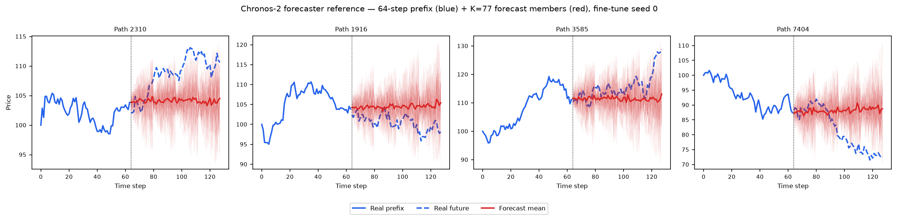
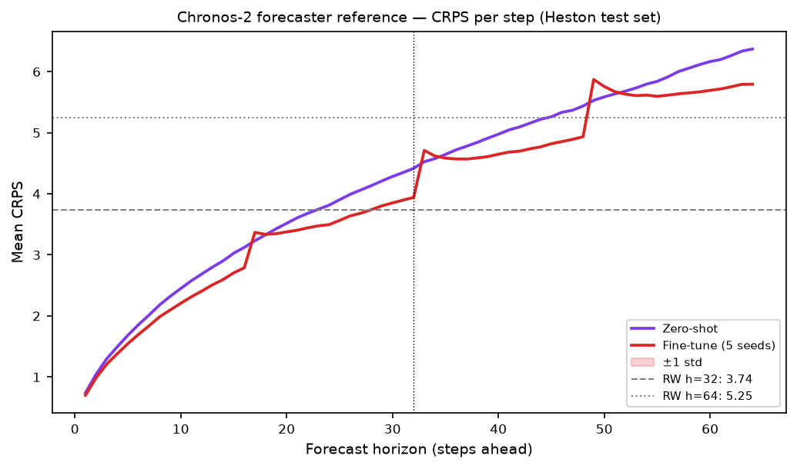

# Chronos-2, Forecaster Reference (not a generator)

**Chronos-2 is used in this benchmark as a *forecaster reference*, not as a generative method.**
Every other entry (TimeGAN, COSCI-GAN, GT-GAN, Diffusion-TS, CSDI, TimeVAE, TimeVQVAE, LS4, SBTS,
Fourier Flow) is an **unconditional generator** whose forecasting ability is measured *indirectly*
through **Path-Shadowing Monte-Carlo** (PS-MC): retrieve nearest generated paths to a real prefix and
forecast with their futures. Chronos-2 answers the natural question that raises, *how good is a
purpose-built conditional forecaster on the same task?*, by forecasting the Heston future **directly**.
It is the **"best forecaster" yardstick** the generator PS-MC rows are measured against.

Chronos-2 (Ansari, Turkmen, Shchur, et al., Amazon Science, **2025**, *Chronos-2: From Univariate to
Universal Forecasting*, arXiv:2510.15821, `github.com/amazon-science/chronos-forecasting`) is a
pretrained encoder-decoder T5-style **probabilistic conditional forecaster** with group attention
(checkpoint `amazon/chronos-2`, **~120M params**). Given a context window it emits 21 predictive
quantiles per future step via `predict_quantiles`.

> **The retired generator experiment lives in [`old/`](old/).** Chronos-2 was previously fine-tuned into
> an unconditional Heston generator by autoregressive log-space rollout (5 seeds, full A1-A34 + B + PS-MC).
> That framing was **retired**, a foundation forecaster is not an unconditional generator, and stacking
> 112 sampled one-step forecasts over-disperses the marginal law. All of those artifacts (generator code,
> generated paths, losses, metrics, plots) are archived under [`old/`](old/) with their own README. They
> are **excluded from every A/B/PS-MC table and win-count** in the root and results READMEs.

---

## Forecaster-reference protocol

Direct conditional forecast on the Heston **test set** (`dataset/Heston/heston_S_test_8192x128.npy`,
8 192 paths × 128 steps, price scale):

1. **Prefix = 64 steps** (steps 0-63) of each real test path, matches the PS-MC query prefix length, so
   the horizons line up exactly with the generator PS-MC rows.
2. **Single-shot forecast** of the next **64 steps** (steps 64-127) with one
   `pipeline.predict_quantiles(context, prediction_length=64, quantile_levels=<21 levels>)` call **in
   price space**. Single-shot (no autoregressive feedback) is stable, unlike the retired generator
   rollout, which needed log-space to avoid multiplicative runaway.
3. **Ensemble of K = 77 members** per path by piecewise-linear **inverse-CDF sampling** over the 21
   quantile levels (matches the PS-MC ensemble size K = 77).
4. **Scored with the *identical* harness** as the generators: the same
   `crps` / `evaluate_horizon` / `naive_baseline` from [`path_shadowing/path_shadowing.py`](path_shadowing/path_shadowing.py).
   CRPS is the energy-score CRPS, directly comparable to the generator PS-MC rows and the shared naive
   random-walk (RW) baseline.

Two reference variants ship as **two rows**:

- **Zero-shot**, the pretrained `amazon/chronos-2` checkpoint, no Heston training (a single model → a
  single point value).
- **Fine-tuned**, the 5 per-seed checkpoints from the retired generator experiment
  (`weights/seed_{i}_model.pt`, `finetune_mode="full"`, 1 000 steps, lr 1e-4, batch 256), reported as
  **mean ± std across the 5 seeds**.

Horizons **H = 32** and **H = 64** are cut from the same 64-step forecast (`HORIZONS = {h32:(0,32),
h64:(0,64)}`), exactly as in the generator PS-MC evaluation.

---

## Reference scores, CRPS / MAE / RMSE (price space, 64-step prefix)

Lower is better. CRPS is the energy-score CRPS; the **RW baseline** repeats the last prefix value
(a deterministic random walk, so its CRPS = MAE). Numbers read from
[`../../results/Heston/Chronos2/forecaster_summary.json`](../../results/Heston/Chronos2/forecaster_summary.json).

| Forecaster | CRPS H=32 ↓ | CRPS H=64 ↓ | MAE H=32 | MAE H=64 | RMSE H=32 | RMSE H=64 |
|------------|:-----------:|:-----------:|:--------:|:--------:|:---------:|:---------:|
| **Chronos-2 zero-shot** | 2.996 | 4.234 | 4.074 | 5.692 | 5.507 | 7.700 |
| **Chronos-2 fine-tuned** *(5 seeds)* | **2.760 ± 0.0001944** | **3.980 ± 0.0004099** | 3.740 ± 0.0001595 | 5.256 ± 0.0004472 | 5.049 ± 0.0004853 | 7.088 ± 0.0006329 |
| *RW baseline* | *3.738* | *5.246* | *3.738* | *5.246* | *5.040* | *7.066* |

**Both variants beat the naive random walk on CRPS at both horizons**, a real conditional forecaster
adds value over "tomorrow = today". Fine-tuning helps: it sharpens the per-step scale (CRPS 2.996 → 2.760
at H=32, 4.234 → 3.980 at H=64) and its 5 seeds are near-identical (std ≈ 2e-04, deterministic data
order). The fine-tune checkpoints were trained at `prediction_length = 16`, so their single-shot 64-step
forecast shows mild 16-step **block structure** in the per-step CRPS curve (visible in
[`forecaster_crps_per_step.png`](../../results/Heston/Chronos2/plots/forecaster_crps_per_step.png)),
yet still improve on zero-shot overall.

### How the forecaster reference compares to generator Path-Shadowing MC

Same task, same prefix length, same CRPS, same RW baseline, so these are directly comparable:

| CRPS ↓ (price space) | H=32 | H=64 |
|----------------------|:----:|:----:|
| **Forecaster reference** | | |
| Chronos-2 zero-shot | 2.996 | 4.234 |
| Chronos-2 fine-tuned *(5 seeds)* | 2.760 ± 0.0001944 | 3.980 ± 0.0004099 |
| **Best generator PS-MC** | | |
| LS4 (path-shadowing, best of 10 generators) | **2.704 ± 0.002510** | **3.763 ± 0.005851** |
| **Baselines** | | |
| Random walk (naive) | 3.738 | 5.246 |
| Perfect (oracle Heston pool) | 2.721 ± 0.004183 | 3.788 ± 0.006463 |

**The headline finding.** A purpose-built, fine-tuned foundation forecaster (Chronos-2, ~120M params)
**does not beat the best generator's path-shadowing** at either horizon: LS4 PS-MC (2.704 / 3.763) edges
out fine-tuned Chronos-2 (2.760 / 3.980), and LS4 even reaches the **Perfect oracle floor** (2.721 /
3.788) while the forecaster does not. Path-Shadowing MC over a well-trained unconditional generator is a
**competitive forecaster in its own right**, the generator route is not merely a fidelity check, it is a
genuinely strong conditional-forecasting method. Chronos-2 is the honest external yardstick that makes
that claim credible.

---

## Plots

**Example forecasts (fine-tune seed 0).** 64-step real prefix (blue solid) + real future (blue dashed) +
K = 77 inverse-CDF forecast members (red) + forecast mean, for 4 random test paths:



**CRPS per forecast step** (zero-shot vs fine-tune, ±1 std band, RW baseline lines). The mild 16-step
steps in the fine-tune curve are the `prediction_length = 16` training footprint:



---

## Validating the port, paper zero-shot reproduction

Chronos-2's arXiv:2510.15821 evaluation reports **MASE** and **WQL** on standard forecasting benchmarks
(Chronos-datasets), not on Heston. Before using the checkpoint as a reference we reproduced its
**zero-shot** MASE/WQL on five held-out datasets, against the paper's `chronos-bolt-base` reference:

| Dataset | MASE ours | MASE ref | WQL ours | WQL ref |
|---------|:---------:|:--------:|:--------:|:-------:|
| ercot | 0.7765 | 0.6933 | 0.02457 | 0.02142 |
| exchange_rate | 1.8788 | 1.7095 | 0.01214 | 0.01201 |
| monash_australian_electricity | 0.6135 | 0.7403 | 0.02878 | 0.03584 |
| monash_traffic | 0.8308 | 0.7843 | 0.24254 | 0.23149 |
| nn5 | 0.5561 | 0.5764 | 0.14489 | 0.15005 |

The zero-shot MASE/WQL land in the **same regime** as the `chronos-bolt-base` reference across all five
datasets, confirming the port loads and runs the pretrained checkpoint faithfully. Full write-up:
[`paper_reimplementation/README.md`](paper_reimplementation/README.md).

---

## File layout

```
methods/Chronos2/
├── README.md                          ← this file (forecaster reference)
├── path_shadowing/
│   ├── run_forecaster_ref.py          direct 64-step forecast (zero-shot + 5 fine-tune seeds)
│   ├── regen_plots.py                 rebuild the two forecaster plots from summary + seed-0 pipeline
│   └── path_shadowing.py              shared crps / evaluate_horizon / naive_baseline harness
├── code/reference/                    verbatim official code (amazon-science/chronos-forecasting)
├── weights/
│   └── seed_{i}_model.pt              fine-tuned Chronos-2 state_dict (~478 MB, git-excluded)
├── paper_reimplementation/            zero-shot MASE/WQL reproduction (paper Chronos-datasets)
└── old/                               ← RETIRED unconditional-generator experiment (see old/README.md)
    ├── code/train_heston.py           fine-tune + log-space autoregressive rollout generator
    ├── generated_paths/, losses/      5-seed generator artifacts
    └── path_shadowing/                generator-pool PS-MC (model-agnostic retrieval)
```

## Reproduce

```bash
# Forecaster reference — zero-shot + 5 fine-tune seeds, H=32 and H=64
cd methods/Chronos2/path_shadowing
OMP_NUM_THREADS=8 CUDA_VISIBLE_DEVICES=0 taskset -c 0-7 \
  /home/tbasseras/gpu-venv/bin/python run_forecaster_ref.py
# → results/Heston/Chronos2/forecaster_summary.json + forecaster_seed_{0..4}.json + plots/

# Rebuild the two plots from an existing summary (no full re-run)
OMP_NUM_THREADS=8 CUDA_VISIBLE_DEVICES=0 taskset -c 0-7 \
  /home/tbasseras/gpu-venv/bin/python regen_plots.py
```
