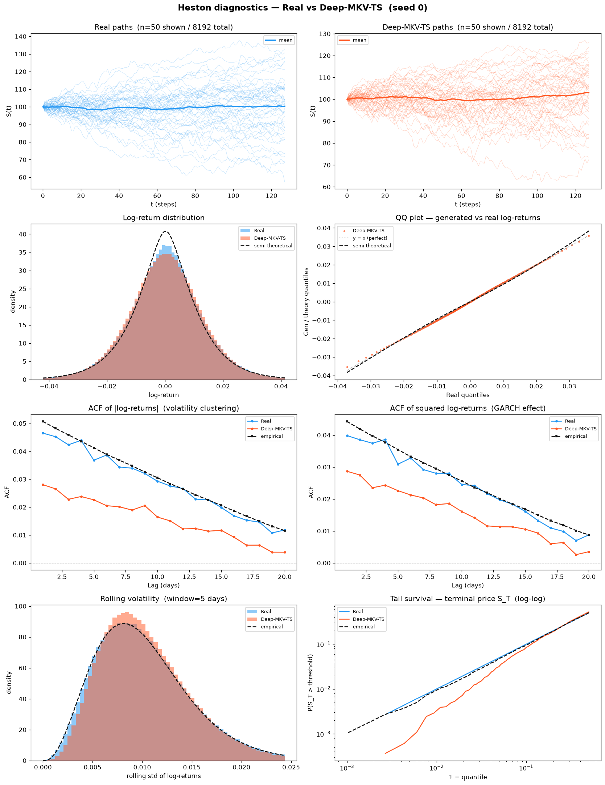
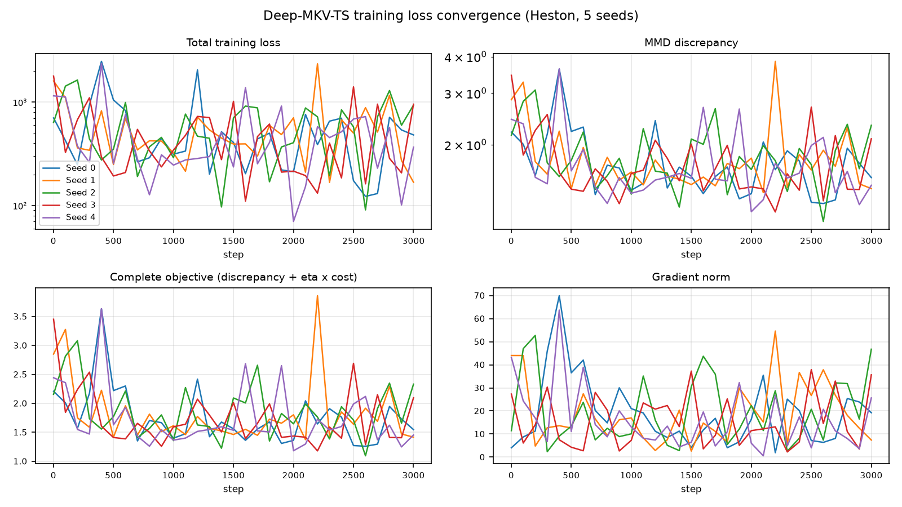
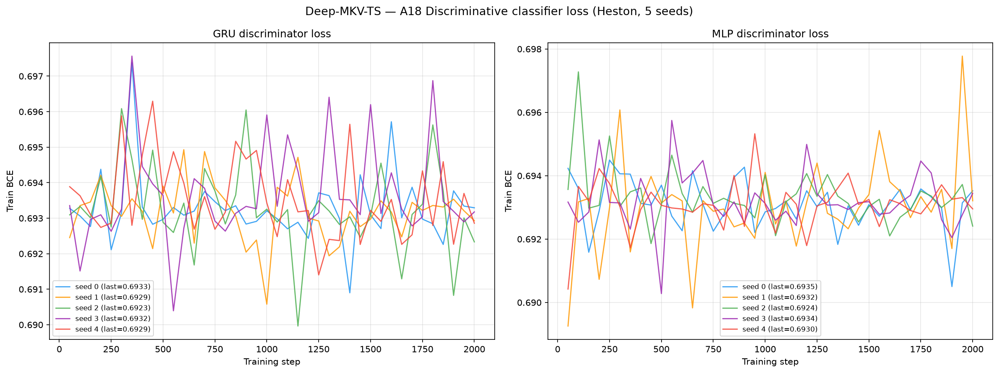
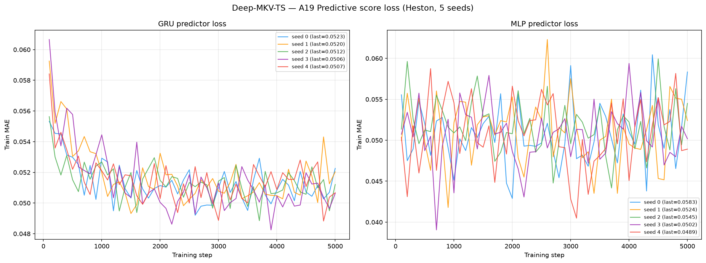
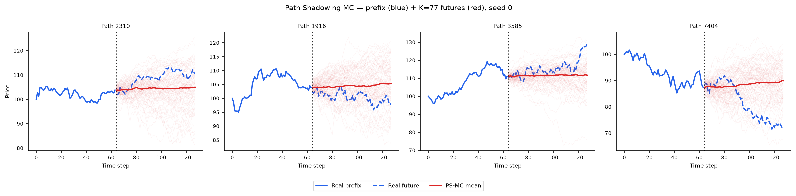
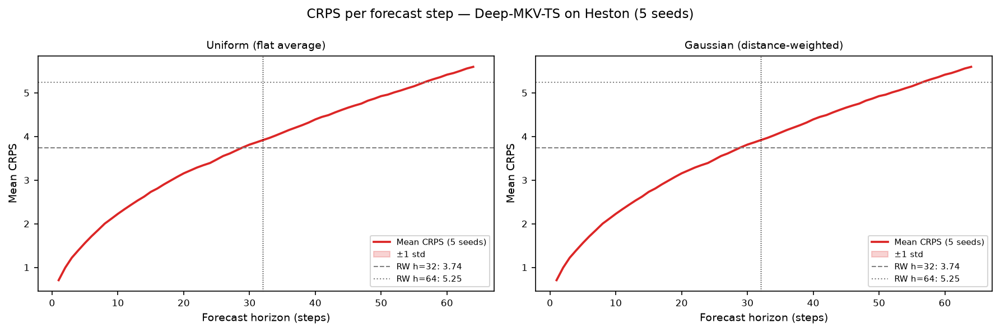

# Deep-MKV-TS on Heston

**Deep McKean–Vlasov Time Series generation** — a path-dependent McKean–Vlasov
stochastic-control generator, applied to 8 192 Heston stochastic-volatility price
paths (`seq_len = 128`).

Deep-MKV-TS does **not** learn a generator from noise. It starts from a *frozen,
interpretable reference SDE* (Guyon–Lekeufack, paper §2.1) fitted to the data by
maximum likelihood, then learns a **volatility correction only** — the drift is
never touched. Training minimises

$$\mathcal{J}(\alpha) \;=\; \mathcal{D}\big(\mu^{\alpha},\,\mu^{\text{data}}\big) \;+\; \eta\,\mathbb{E}\!\left[\int_0^T \tfrac12\,\|\alpha_t\|^2\,\sigma_t^{-2}\,dt\right],\qquad \eta = 1,$$

where $\mathcal{D}$ is a six-component MMD discrepancy (observed path, increments,
terminal, global realized variance, $|r|$ ACF, $r^2$ ACF) and the second term is a
**specific-entropy running cost** that penalises how far the controlled law drifts
from the reference law. The correction network is a 1-layer GRU
(`input_dim = 1`, `hidden_dim = 96`) with two `Linear(96,96) → act → Linear(96,1)`
heads — **47 330 parameters** in total, of which only
`expected_adjoint_noise_next_head` is trained.

See [`code/README.md`](code/README.md) for source, vendored upstream code and
implementation details, and
[`paper_reimplementation/README.md`](paper_reimplementation/README.md) for the
paper-reproduction protocol and the paper-vs-ours table.

> **Reported checkpoint (`K = 2500`).** Every seed trains for 3 000 steps and the
> **step-2500** checkpoint is the reported one, exactly as in the paper. There is
> **no learning-rate scheduler anywhere in the codebase**, so this is bitwise
> identical to having stopped training at step 2 500 — the extra 500 steps only
> exist to expose the post-report trajectory.

> **Split discipline (GUIDELINE §5.0).** `train` is a seed-0 Heston draw and is
> never scored. **`heston_S_test_8192x128.npy`** carries A1–A17, A20–A34, all B
> curves, `grid_tvd`, the plots and PS-MC. **`heston_S_disc_8192x128.npy`** is used
> *only* to fit the A18 discriminator and the A19 forecaster. Hyperparameter
> selection was performed on a separate `val` / `valdisc` pair and never on `test`
> or `disc`.
>
> `paper_reimplementation/metric/PROTOCOL.json` carries
> `"test_split_access_authorized": false`. That flag governs **training and model
> selection**, which never read `test`. The benchmark's *post-hoc* scoring on
> `test` is mandated by GUIDELINE §5.0 and applies identically to all 16 methods —
> the two statements are not in conflict.

---

## Metrics A1-A34 + B, mean ± std across 5 seeds

> All metrics on **log-returns** $r_t = \log(S_{t+1}/S_t)$ unless noted. A26 uses price increments $\Delta S_t$.

| Metric | Mean ± Std | Seed 0 | Seed 1 | Seed 2 | Seed 3 | Seed 4 | Perfect floor |
|--------|-----------|--------|--------|--------|--------|--------|---------------|
| **Fat Tail** | | | | | | | |
| A1 Kurtosis Error ↓ | 0.3334 ± 0.02706 | 0.3756 | 0.3383 | 0.3020 | 0.3063 | 0.3450 | 0.008092 |
| A2 \|r\| q95 Error ↓ | 2.10e-04 ± 1.13e-04 | 2.90e-04 | 1.76e-04 | 9.81e-06 | 3.33e-04 | 2.41e-04 | 6.57e-05 |
| A3 \|r\| q99 Error ↓ | 3.75e-04 ± 2.54e-04 | 8.39e-04 | 3.34e-04 | 8.90e-05 | 2.17e-04 | 3.94e-04 | 5.98e-05 |
| A4 Tail QQ Error ↓ | 2.70e-04 ± 2.95e-05 | 2.92e-04 | 2.65e-04 | 2.70e-04 | 3.03e-04 | 2.17e-04 | 6.75e-05 |
| A5 Hill Tail Index Error ↓ | 5.110 ± 0.6663 | 5.895 | 5.850 | 4.713 | 4.908 | 4.184 | 0.5266 |
| **Distribution** | | | | | | | |
| A6 Path MMD² ↓ | 0.002031 ± 1.48e-04 | 0.001779 | 0.002152 | 0.002088 | 0.002180 | 0.001955 | 0.001842 |
| A7 Terminal MMD² ↓ | 0.002535 ± 0.001066 | 0.001171 | 0.003995 | 0.003484 | 0.001663 | 0.002362 | 0.001983 |
| A8 Increment MMD² ↓ | 9.42e-04 ± 3.37e-05 | 9.99e-04 | 9.21e-04 | 9.17e-04 | 9.62e-04 | 9.12e-04 | 8.69e-04 |
| A9 Volatility MMD ↓ | 0.01743 ± 9.18e-04 | 0.01887 | 0.01792 | 0.01713 | 0.01712 | 0.01612 | 0.008554 |
| A10 Terminal SWD ↓ | 0.9334 ± 0.1952 | 0.7016 | 0.9100 | 1.244 | 1.044 | 0.7676 | 1.151 |
| A11 Path SWD ↓ | 0.5509 ± 0.05390 | 0.4997 | 0.5020 | 0.5661 | 0.6466 | 0.5404 | 0.6191 |
| A12 RV Law Loss ↓ | 0.1215 ± 0.04230 | 0.1952 | 0.08286 | 0.09060 | 0.1423 | 0.09636 | 0.05202 |
| A13 Mean Path RMSE ↓ | 0.1500 ± 0.05181 | 0.1100 | 0.2300 | 0.1840 | 0.1405 | 0.08543 | 0.1205 |
| A14 KS Log-returns ↓ | 0.008172 ± 0.001151 | 0.009454 | 0.007865 | 0.008078 | 0.006233 | 0.009230 | 0.001491 |
| A15 Skewness Error ↓ | 0.05862 ± 0.003704 | 0.06011 | 0.06239 | 0.05798 | 0.05177 | 0.06082 | 0.005274 |
| A16 QQ RMSE (300-pt) ↓ | 2.13e-04 ± 2.73e-05 | 2.60e-04 | 2.10e-04 | 2.01e-04 | 1.76e-04 | 2.16e-04 | 4.19e-05 |
| A17 Terminal Price KS ↓ | 0.03333 ± 0.006508 | 0.02722 | 0.03430 | 0.03662 | 0.04321 | 0.02527 | 0.01099 |
| **Adversarial** | | | | | | | |
| A18 Disc Score GRU ↓ | 0.007355 ± 0.003169 | 0.006256 | 0.002289 | 0.007782 | 0.008392 | 0.01205 | 0.006195 |
| A18 Disc Score MLP ↓ | 0.003448 ± 0.001642 | 0.004425 | 0.003509 | 4.58e-04 | 0.003509 | 0.005340 | 0.005951 |
| **Predictive** | | | | | | | |
| A19 Pred Score GRU ↓ | 0.05003 ± 2.27e-05 | 0.05001 | 0.05006 | 0.05002 | 0.05001 | 0.05007 | 0.05002 |
| A19 Pred Score MLP ↓ | 0.05010 ± 2.26e-04 | 0.04992 | 0.04996 | 0.05004 | 0.05003 | 0.05054 | 0.05036 |
| **Temporal** | | | | | | | |
| A20 Covariance Error ↓ | 12.22 ± 3.900 | 18.34 | 12.30 | 12.49 | 11.95 | 6.017 | 4.923 |
| A21 ACF \|r\| Error (lags) ↓ | 0.01413 ± 0.001621 | 0.01626 | 0.01337 | 0.01152 | 0.01427 | 0.01522 | 0.002234 |
| A22 ACF r² Error (lags) ↓ | 0.008819 ± 0.001354 | 0.01076 | 0.008410 | 0.006776 | 0.008394 | 0.009757 | 0.002206 |
| A23 ACF \|r\| Lag-1 Error ↓ | 0.01762 ± 0.001716 | 0.01985 | 0.01661 | 0.01491 | 0.01872 | 0.01803 | 0.002652 |
| A24 ACF r² Lag-1 Error ↓ | 0.01144 ± 0.001556 | 0.01317 | 0.01141 | 0.008572 | 0.01175 | 0.01232 | 0.002790 |
| **Vol** | | | | | | | |
| A25 Mean RMSE ↓ | 0.2653 ± 0.07286 | 0.2234 | 0.3360 | 0.3273 | 0.2967 | 0.1430 | 0.1392 |
| A26 Return Std Error ↓ | 0.01122 ± 0.005529 | 0.008511 | 0.008698 | 0.004810 | 0.02094 | 0.01313 | 0.002523 |
| A27 Log-Return Std Error ↓ | 3.90e-05 ± 3.32e-05 | 4.41e-06 | 2.77e-05 | 1.01e-04 | 4.09e-05 | 2.07e-05 | 3.15e-05 |
| A28 Kurtosis Ratio (→ 1) | 1.182 ± 0.1352 | 1.389 | 1.261 | 1.082 | 1.001 | 1.177 | 1.006 |
| A29 Sigma Mean Error ↓ | 0.001118 ± 4.45e-04 | 0.001145 | 0.001052 | 0.001918 | 5.71e-04 | 9.03e-04 | 4.96e-04 |
| A30 Cross-Sect. Vol Path RMSE ↓ | 0.2623 ± 0.05918 | 0.3785 | 0.2541 | 0.2202 | 0.2315 | 0.2273 | 0.1432 |
| A31 Rolling Vol KS (w=5) ↓ | 0.02488 ± 0.003857 | 0.03146 | 0.02323 | 0.02342 | 0.01997 | 0.02633 | 0.003814 |
| A32 Vol-of-Vol Error ↓ | 1.72e-04 ± 6.04e-05 | 2.75e-04 | 1.71e-04 | 9.29e-05 | 1.37e-04 | 1.83e-04 | 1.54e-05 |
| **Heston Spec** | | | | | | | |
| A33 Teacher-Sigma Corr ↑ | -0.001032 ± 0.006621 | 0.007350 | -0.007386 | 0.001398 | 0.003547 | -0.01007 | 0.6163 |
| A34 Teacher-Sigma RMSE ↓ | 0.09718 ± 0.001019 | 0.09522 | 0.09741 | 0.09815 | 0.09775 | 0.09739 | 0.06559 |

> **Convention:** ↓ lower is better; ↑ higher is better. A28 Kurtosis Ratio: perfect = 1.0 (no monotone direction, closest to 1 wins).
> **Headline:** Deep-MKV-TS **wins 9 of the 36 A-metric rows** — second overall behind SBTS (12) and ahead of LS4 (8). It also **wins both PS-MC horizons (2/2)**. It wins **0 of the 7 ranked B contests**.

### Reading the A table honestly

Four cells sit **below** the Perfect-Recovery floor:

| Cell | Deep-MKV-TS | Perfect floor |
|------|------------:|--------------:|
| A10 Terminal SWD | 0.9334 | 1.151 |
| A11 Path SWD | 0.5509 | 0.6191 |
| A18 Disc Score MLP | 0.003448 | 0.005951 |
| PS-MC CRPS (both horizons) | 2.696 / 3.758 | 2.721 / 3.788 |

This is **not** evidence that the generator is better than the truth. The Perfect
floor (GUIDELINE §5.4) is an *independent finite-sample* Heston draw, so it carries
the full sampling variance of a real 8 192-path cloud. A generator whose cloud is
slightly **under-dispersed** sits closer to the test set's empirical measure than a
second honest draw does, and scores below the floor on any distance that rewards
concentration.

Two independent cells corroborate the under-dispersion reading rather than the
superiority reading:

- **A28 Kurtosis Ratio = 1.182 > 1** (floor 1.006) — generated returns are *less*
  leptokurtic than real ones.
- **A5 Hill Tail Index Error = 5.110** (floor 0.527) — the tail index is badly
  attenuated, the single worst row in the table.

Both say the same thing: the tails are too thin. The entropy running cost is doing
exactly what it is designed to do — it charges the control for deviating from the
frozen reference, and the cheapest way to reduce the MMD terms is to shrink the
spread rather than to reproduce the extreme quantiles. So A10 / A11 / A18-MLP should
be read as **a variance deficit, not a win**.

**A33 Teacher-Sigma Corr ≈ 0** (floor 0.616) is a genuine and *shared* limitation:
every generator in this benchmark scores ≈ 0 here. The MMD objective is purely
distributional — nothing in $\mathcal{J}(\alpha)$ ever asks the model to recover the
specific latent variance path $v_t$ that produced a given price path, only to match
the law. A34 (0.0972 vs floor 0.0656) shows the *scale* of the reproduced vol is
roughly right even though its *timing* is uncorrelated.

**Cross-seed std is unusually small** across the whole table (e.g. A19-GRU
± 2.27e-05, A34 ± 0.00102). That is a direct consequence of the architecture: the
drift is a frozen, ML-calibrated reference shared by all five seeds, so seed
variation only enters through the 47 330-parameter volatility correction and the
sampling noise. Methods that learn the whole generator from scratch show 1–2 orders
of magnitude more seed spread.

---

## B, Curve-Shape Metrics, mean ± std across 5 seeds

> Each stylised-fact plot yields a **curve** $L$, not a scalar. From $L$, its 1st difference (der) and its
> 2nd difference (sec\_der) we compute three measures, combined into one number per plot (combined std =
> sample std across the 5 seeds):
> - **MSE**: `mean((L_gen − L_real)²)` per sub-metric; combined = **mean-of-3** (funct + der + sec\_der)/3. **Decides the winner.**
> - **% err**: `mean(|L_gen − L_real| / (|L_real| + 1e-6)) × 100` — MAPE with a fixed 1e-6 floor; **funct-only**.
> - **NRMSE**: `sqrt(mean((L_gen − L_real)²)) / (max|L_real| − min|L_real| + 1e-12) × 100`; **funct-only**.
> - **CVaR₉₀ / CVaR₉₅**: mean of the worst 10% / 5% pointwise relative errors along the curve; **funct-only**.
>
> % err, NRMSE and both CVaRs are funct-only for every plot: the der / sec\_der true values sit near zero
> and blow the ratios into meaningless 10⁴-% figures. MSE keeps mean-of-3. All ↓ lower is better. The
> Perfect floor is **non-zero** (independent draw vs test set, §5.4).
>
> `grid_tvd` is the **first ranked row of Table B** (7 ranked B contests in total: `grid_tvd` + 6 curves).

| Plot | Measure | Mean ± Std | Seed 0 | Seed 1 | Seed 2 | Seed 3 | Seed 4 | Perfect floor |
|------|---------|-----------|--------|--------|--------|--------|--------|---------------|
| **grid_tvd 50×50 (%)** | TVD | 3.575% ± 0.4069% | 2.986% | 3.724% | 3.777% | 4.135% | 3.252% | 2.237% |
| **Log-return histogram** | MSE | 0.2575 ± 0.05127 | 0.3450 | 0.2220 | 0.1991 | 0.2407 | 0.2805 | 0.1098 |
|  | % err | 3.424% ± 0.3123% | 3.965% | 3.341% | 2.991% | 3.424% | 3.400% | 1.799% |
|  | NRMSE | 1.898% ± 0.1993% | 2.212% | 1.837% | 1.776% | 1.641% | 2.024% | 0.5328% |
|  | CVaR₉₀ | 4.831% ± 0.4587% | 5.537% | 4.685% | 4.541% | 4.242% | 5.150% | 1.234% |
|  | CVaR₉₅ | 5.967% ± 0.6218% | 6.779% | 5.846% | 5.808% | 4.962% | 6.440% | 1.444% |
| **QQ plot** | MSE | 1.94e-08 ± 5.35e-09 | 2.93e-08 | 1.83e-08 | 1.68e-08 | 1.33e-08 | 1.90e-08 | 1.09e-09 |
|  | % err | 4.987% ± 0.6969% | 5.415% | 4.990% | 4.640% | 3.915% | 5.974% | 0.4629% |
|  | NRMSE | 0.6142% ± 0.08099% | 0.7571% | 0.6064% | 0.5794% | 0.5089% | 0.6194% | 0.1206% |
|  | CVaR₉₀ | 0.5913% ± 0.06009% | 0.6994% | 0.5612% | 0.5175% | 0.5873% | 0.5913% | 0.1319% |
|  | CVaR₉₅ | 0.8014% ± 0.09523% | 0.9737% | 0.7753% | 0.6883% | 0.8135% | 0.7562% | 0.1599% |
| **ACF \|r\| lags 1-20** | MSE | 5.06e-05 ± 1.08e-05 | 6.88e-05 | 4.03e-05 | 4.04e-05 | 4.74e-05 | 5.62e-05 | 9.61e-06 |
|  | % err | 36.73% ± 6.242% | 46.34% | 32.94% | 29.61% | 33.10% | 41.64% | 8.724% |
|  | NRMSE | 30.12% ± 3.761% | 35.87% | 27.81% | 25.45% | 28.53% | 32.95% | 6.071% |
|  | CVaR₉₀ | 46.82% ± 5.219% | 54.35% | 43.30% | 39.32% | 47.06% | 50.10% | 11.26% |
|  | CVaR₉₅ | 47.96% ± 5.550% | 55.87% | 44.20% | 39.67% | 49.81% | 50.25% | 12.06% |
| **ACF r² lags 1-20** | MSE | 2.53e-05 ± 5.29e-06 | 3.48e-05 | 2.10e-05 | 2.13e-05 | 2.20e-05 | 2.72e-05 | 9.17e-06 |
|  | % err | 26.21% ± 6.110% | 36.78% | 22.85% | 20.96% | 21.09% | 29.37% | 11.34% |
|  | NRMSE | 21.19% ± 3.446% | 26.83% | 19.66% | 17.33% | 18.81% | 23.36% | 6.486% |
|  | CVaR₉₀ | 35.77% ± 4.879% | 44.43% | 33.55% | 30.01% | 33.75% | 37.12% | 12.35% |
|  | CVaR₉₅ | 36.91% ± 5.102% | 46.56% | 33.68% | 32.44% | 34.41% | 37.47% | 13.27% |
| **Rolling vol histogram** | MSE | 4.491 ± 0.9730 | 6.288 | 3.731 | 3.595 | 4.182 | 4.660 | 1.372 |
|  | % err | 6.961% ± 1.556% | 9.839% | 5.757% | 5.459% | 6.649% | 7.099% | 2.264% |
|  | NRMSE | 3.558% ± 0.4497% | 4.328% | 3.144% | 3.113% | 3.453% | 3.752% | 0.8688% |
|  | CVaR₉₀ | 7.883% ± 0.7741% | 9.269% | 7.274% | 7.321% | 7.347% | 8.203% | 1.970% |
|  | CVaR₉₅ | 8.409% ± 0.8117% | 9.844% | 7.782% | 7.828% | 7.806% | 8.784% | 2.308% |
| **Tail survival** | MSE | 2.60e-05 ± 8.36e-06 | 3.84e-05 | 2.55e-05 | 2.51e-05 | 1.23e-05 | 2.87e-05 | 5.22e-07 |
|  | % err | 1.782% ± 0.3354% | 2.375% | 1.760% | 1.573% | 1.377% | 1.828% | 0.3302% |
|  | NRMSE | 0.8779% ± 0.1525% | 1.082% | 0.8825% | 0.8762% | 0.6117% | 0.9367% | 0.1050% |
|  | CVaR₉₀ | 1.335% ± 0.2110% | 1.636% | 1.329% | 1.311% | 0.9822% | 1.419% | 0.1625% |
|  | CVaR₉₅ | 1.346% ± 0.2069% | 1.645% | 1.335% | 1.321% | 1.003% | 1.425% | 0.1682% |

> **The ACF % errors look catastrophic and are not.** The true Heston ACF of $|r|$ sits
> near **0.05**, so a 0.015 absolute miss is a 30% relative miss by construction. The
> scale-free comparison is against the Perfect floor: ACF-$|r|$ MSE 5.06e-05 vs floor
> 9.61e-06 = **5.3×** the floor. For reference, TimeGAN sits at ~370× the floor on the
> same row. Deep-MKV-TS reproduces the volatility-clustering *shape*; it simply does not
> win any B row outright because SBTS is at or near the floor on six of the seven.
>
> **Where the B losses come from.** Every B row is a curve-*shape* comparison, and the
> two rows Deep-MKV-TS is furthest from the floor on — tail survival (50× floor) and the
> log-return histogram (2.3× floor) — are precisely the two that read off the tails. Same
> variance deficit as A5 / A28, seen through a different lens.

---

## Stylised Facts Diagnostic (Heston vs Deep-MKV-TS, seed 0)

Eight-panel comparison: sample paths, return distribution, QQ plot, ACF of |returns|,
ACF of squared returns, rolling vol histogram (window = 5), tail survival (log-log).



---

## Training loss

Unlike SBTS, Deep-MKV-TS **is** trained by gradient descent — 3 000 Adam steps
(`lr = 2e-3`, `grad_clip_norm = 5.0`, `sample_batch_size = 2048`), with the
**step-2500** checkpoint reported. The objective is the entropy-penalised MMD above.



`losses/seed_{i}_losses.csv` has one row per logged step with the schema:

| Column | Meaning |
|--------|---------|
| `step` | optimiser step (1 … 3000) |
| `phase` | `source` (reference rollout) or `control` (corrected rollout) |
| `loss_total` | scalar minimised by Adam |
| `discrepancy_objective` | $\mathcal{D}(\mu^\alpha,\mu^{\text{data}})$, the six MMD terms combined |
| `complete_objective` | $\mathcal{D} + \eta\cdot$`running_cost` |
| `running_cost` | specific-entropy penalty $\eta\,\mathbb{E}[\int \tfrac12\|\alpha\|^2\sigma^{-2}]$, $\eta = 1$ |
| `grad_norm` | pre-clip gradient norm |
| `mmd_observed_path` | MMD² on full observed paths |
| `mmd_increments` | MMD² on one-step increments |
| `mmd_terminal` | MMD² on $S_T$ |
| `mmd_global_rv` | MMD² on per-path realized variance |
| `mmd_abs_return_acf` | MMD² on the $\|r\|$ ACF vector (weight 0.25) |
| `mmd_squared_return_acf` | MMD² on the $r^2$ ACF vector (weight 0.125) |

Wall-clock: **≈ 22–35 min per seed** on one A100-80GB (8 CPU cores pinned).

---

## A18, Discriminative Classifier Training Loss

BCE loss during GRU and MLP classifier training (2 000 steps, logged every 50 steps).
A value near $\ln 2 \approx 0.693$ means the classifier cannot distinguish real from fake.
Fitted on `heston_S_disc_8192x128.npy`.



---

## A19, Predictive Score Training Loss (TSTR)

MAE loss during GRU and MLP predictor training on *synthetic* data (5 000 steps, logged
every 100 steps), then evaluated on real data.



---

## Path Shadowing MC (arXiv:2308.01486)

Given a real path prefix (steps 0–63), embed it as a **65D murex-style feature vector**
(63 step-by-step log-returns + terminal cumulative return + realized volatility, z-scored
using the generated pool distribution), retrieve the **K = 77** nearest Deep-MKV-TS paths
by L2 distance, then use their **price-anchored** futures (steps 64–127) as a forecast
ensemble. Two variants: flat average (**Uniform**) and distance-weighted (**Gaussian**,
per-query $\eta = \tilde\eta\,\|z(\tilde x)\|$ with $\tilde\eta = \mathrm{median}(\text{dist})/\mathrm{median}(\|z\|)$
calibrated from data; the fitted $\tilde\eta$ lands at ≈ 8.63–8.75 across the five seeds).

### Example ensemble fan-out (seed 0)



### CRPS per forecast step



### Results (mean ± std, 5 seeds)

| Metric | H=32 Uniform | H=32 Gaussian | H=64 Uniform | H=64 Gaussian | Naive RW |
|--------|:------------:|:-------------:|:------------:|:-------------:|:--------:|
| **CRPS** | **2.696 ± 0.004** | 2.696 ± 0.004 | **3.758 ± 0.005** | 3.758 ± 0.005 | 3.738 / 5.246 |
| MAE    | 3.729 ± 0.005 | 3.729 ± 0.005 | 5.207 ± 0.008 | 5.207 ± 0.008 | 3.738 / 5.246 |
| RMSE   | 5.047 ± 0.005 | 5.047 ± 0.005 | 7.055 ± 0.005 | 7.055 ± 0.005 | 5.040 / 7.066 |

| Horizon | Deep-MKV-TS CRPS | Perfect floor | Best rival |
|---------|-----------------:|--------------:|-----------:|
| H = 32 | **2.696 ± 0.0041** | 2.721 ± 0.0042 | LS4 2.704 |
| H = 64 | **3.758 ± 0.0048** | 3.788 ± 0.0065 | LS4 3.763 |

PS-MC **beats the naive RW on CRPS** at both horizons (2.696 < 3.738 at H=32;
3.758 < 5.246 at H=64) and **wins both PS-MC contests** across the benchmark.

> **Caveat, stated plainly.** Deep-MKV-TS is the only method whose PS-MC CRPS lands
> *at or below* the Perfect-Recovery floor at both horizons. Path shadowing is a
> **retrieval** task: it rewards a pool whose members hug the conditional mean. A
> mildly under-dispersed pool — which A5 / A28 independently establish this one to
> be — retrieves tighter, lower-CRPS ensembles than an honest independent draw does.
> The 2/2 win is real under the benchmark's rules, but it is at least partly the same
> variance deficit that costs the method the B rows, not purely superior forecasting.
>
> Note also that Uniform and Gaussian agree to four decimals at both horizons. With
> K = 77 neighbours drawn from an 8 192-path pool the distance spread inside the
> neighbourhood is small, so the Gaussian weights are near-flat — this is expected,
> not a bug.

Full analysis: [`results/Heston/Deep-MKV-TS/path_shadowing/README.md`](../../results/Heston/Deep-MKV-TS/path_shadowing/README.md)

---

## File layout

```
methods/Deep-MKV-TS/
├── README.md                              ← this file
├── generated_paths/seed_{0..4}/
│   ├── generated_paths_8192x128.npy       shape (8192, 128), float64, price scale, S₀ = 100
│   └── metadata.json                      seed, shape, min/max, checkpoint step, bank_seed
├── weights/
│   ├── seed_{i}_model.pt                  checkpoint dict (NOT a bare state_dict — see note)
│   └── seed_{i}_config.json               full hyperparameter record + num_parameters = 47330
├── losses/
│   ├── seed_{i}_losses.csv                per-step objective decomposition (schema above)
│   └── loss_convergence.png               5-seed overlay of loss_total
├── code/
│   ├── README.md                          source, upstream provenance, architecture
│   ├── export_benchmark_artifacts.py      runs/ → generated_paths/ + weights/ + losses/
│   ├── run_benchmark_pipeline.sh          one command for everything downstream of training
│   └── reference/                         vendored upstream Deep-MKV-TS code
├── paper_reimplementation/
│   ├── README.md                          how to reproduce the paper's Table 1 from scratch
│   ├── dataset/README.md                  which Heston splits, how they were drawn
│   ├── metric/
│   │   ├── PROTOCOL.json                  frozen protocol: split, checkpoint, reference kind
│   │   ├── run_reproduction.sh            seeds 0, 1, 3, 4 (the paper's four seeds)
│   │   ├── run_seed2.sh                   seed 2 (benchmark needs 5)
│   │   ├── run_hpsearch.sh                14-trial search on val / valdisc
│   │   └── aggregate_paper_table.py       renders results/PAPER_VS_OURS.md
│   ├── results/PAPER_VS_OURS.md           the paper-vs-ours table (5/5 within tolerance)
│   └── runs/                              gitignored — training trees, ~GB per seed
└── path_shadowing/
    ├── path_shadowing.py                  65D embedding, KNN retrieval, price anchoring
    └── run_eval.py                        writes results/.../path_shadowing/summary.json
```

> **Checkpoint format hazard.** `weights/seed_{i}_model.pt` is a **dict**, not a bare
> `state_dict`. Besides the network tensors it carries
> `noise_adjoint_target_mean` and `noise_adjoint_target_scale`, which are **required
> for inference** — loading only the state_dict silently produces wrong paths.
> `code/export_benchmark_artifacts.py::_network_config()` shows the correct read.

---

## Reproduce

Three commands, from a clean checkout. Training needs one A100-class GPU; everything
downstream needs the same GPU only for the A18/A19 judges.

```bash
cd /home/tbasseras/benchmark/methods/Deep-MKV-TS

# 1. Train the paper's four seeds (0, 1, 3, 4)   — ~2.5 h total
bash paper_reimplementation/metric/run_reproduction.sh

# 2. Train seed 2, which the benchmark needs but the paper does not use  — ~25 min
bash paper_reimplementation/metric/run_seed2.sh

# 3. Everything downstream: export → A1-A34 + B + grid_tvd → plots → PS-MC
bash code/run_benchmark_pipeline.sh
```

Step 3 blocks until all five `runs/seed_*/COMPLETE.json` exist, so it can be launched
the moment the last seed starts training. Overridable environment variables:

| Variable | Default | Meaning |
|----------|---------|---------|
| `BENCHMARK_PYTHON` | `/home/tbasseras/gpu-venv/bin/python` | interpreter |
| `BENCHMARK_CORES` | `16-23` | `taskset` CPU set (8 physical cores, GUIDELINE §4.1) |
| `BENCHMARK_GPU` | `0` | single GPU index for the A18/A19 judges |

To reproduce only the **paper table** (no benchmark artefacts), run steps 1 and then
`python paper_reimplementation/metric/aggregate_paper_table.py`, which regenerates
[`paper_reimplementation/results/PAPER_VS_OURS.md`](paper_reimplementation/results/PAPER_VS_OURS.md).
