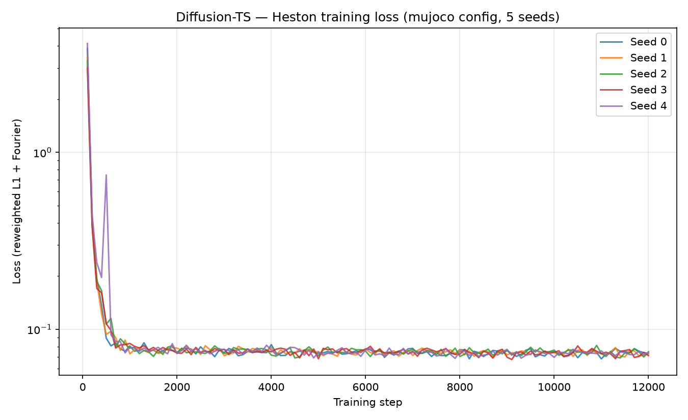
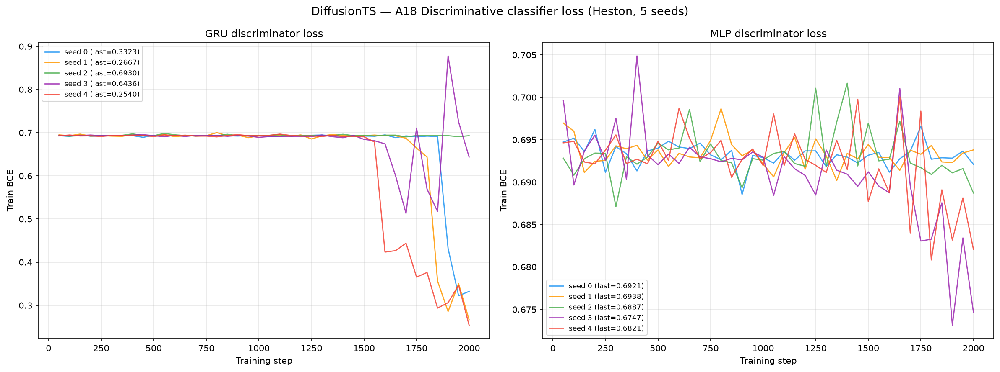
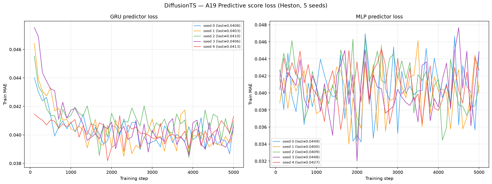
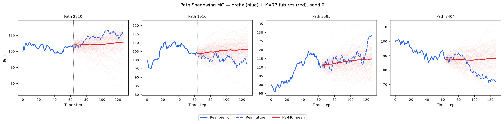
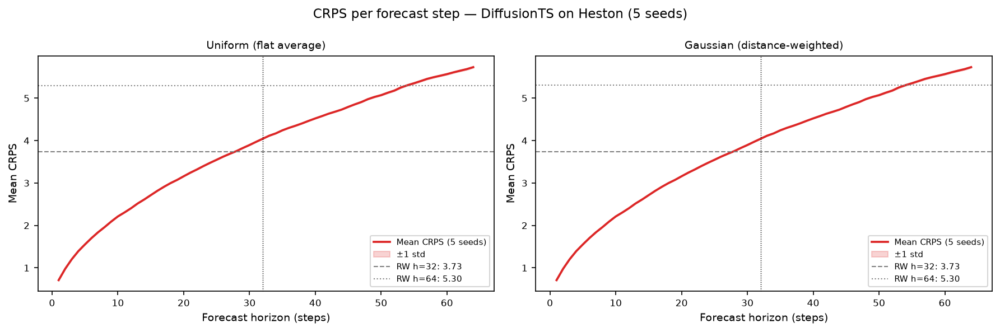

# Diffusion-TS on Heston

PyTorch reimplementation of **Diffusion-TS** (Yuan & Qiao, ICLR 2024 —
*Diffusion-TS: Interpretable Diffusion for General Time Series Generation*) trained on 8 192 Heston
stochastic-volatility price paths (seq\_len = 128).

See [`code/README.md`](code/README.md) for source, the original paper/GitHub, the `mujoco` architecture
choice (with the three smoke Context-FID results), and the normalisation chain applied to fit the
price-scale Heston data into the model's `[-1, 1]` space.

---

## Metrics A1–A34 + B — mean ± std across 5 seeds

> All metrics on **log-returns** $r_t = \log(S_{t+1}/S_t)$ unless noted. A26 uses price increments $\Delta S_t$.

| Metric | Mean ± Std | Seed 0 | Seed 1 | Seed 2 | Seed 3 | Seed 4 | Perfect floor |
|--------|-----------|--------|--------|--------|--------|--------|---------------|
| **— Fat Tail —** | | | | | | | |
| A1 Kurtosis Error ↓ | 0.4242 ± 0.02303 | 0.4235 | 0.3935 | 0.4649 | 0.4177 | 0.4214 | 0.008092 |
| A2 \|r\| q95 Error ↓ | 0.006902 ± 1.57e-04 | 0.006982 | 0.007108 | 0.006664 | 0.006971 | 0.006786 | 6.57e-05 |
| A3 \|r\| q99 Error ↓ | 0.01032 ± 1.75e-04 | 0.01036 | 0.01042 | 0.01012 | 0.01058 | 0.01014 | 5.98e-05 |
| A4 Tail QQ Error ↓ | 0.006781 ± 1.50e-04 | 0.006847 | 0.006982 | 0.006561 | 0.006852 | 0.006662 | 6.75e-05 |
| A5 Hill Tail Index Error ↓ | 3.047 ± 0.2789 | 2.844 | 3.402 | 2.995 | 2.670 | 3.325 | 0.5266 |
| **— Distribution —** | | | | | | | |
| A6 Path MMD² ↓ | 0.004476 ± 8.48e-04 | 0.004700 | 0.003512 | 0.003644 | 0.005848 | 0.004675 | 0.001842 |
| A7 Terminal MMD² ↓ | 0.003676 ± 0.001070 | 0.003800 | 0.002500 | 0.002506 | 0.005278 | 0.004298 | 0.001983 |
| A8 Increment MMD² ↓ | 0.01109 ± 7.52e-04 | 0.01176 | 0.01203 | 0.009961 | 0.01062 | 0.01107 | 8.69e-04 |
| A9 Volatility MMD ↓ | 0.3846 ± 0.02464 | 0.4163 | 0.4075 | 0.3522 | 0.3632 | 0.3840 | 0.008554 |
| A10 Terminal SWD ↓ | 1.684 ± 0.3010 | 1.625 | 1.480 | 1.313 | 2.187 | 1.815 | 1.151 |
| A11 Path SWD ↓ | 1.212 ± 0.1556 | 1.281 | 1.037 | 1.034 | 1.437 | 1.270 | 0.6191 |
| A12 RV Law Loss ↓ | 2.274 ± 0.04910 | 2.292 | 2.343 | 2.204 | 2.297 | 2.234 | 0.05202 |
| A13 Mean Path RMSE ↓ | 0.4399 ± 0.2584 | 0.3142 | 0.6895 | 0.8016 | 0.2562 | 0.1379 | 0.1205 |
| A14 KS Log-returns ↓ | 0.06048 ± 0.001904 | 0.06076 | 0.06349 | 0.05761 | 0.06083 | 0.05971 | 0.001491 |
| A15 Skewness Error ↓ | 0.06445 ± 0.03230 | 0.07100 | 0.02133 | 0.03854 | 0.07706 | 0.1143 | 0.005274 |
| A16 QQ RMSE (300-pt) ↓ | 0.003073 ± 8.32e-05 | 0.003100 | 0.003196 | 0.002953 | 0.003101 | 0.003014 | 4.19e-05 |
| A17 Terminal Price KS ↓ | 0.04436 ± 0.007030 | 0.03638 | 0.05078 | 0.05090 | 0.04846 | 0.03528 | 0.01099 |
| **— Adversarial —** | | | | | | | |
| A18 Disc Score GRU ↓ | 0.08987 ± 0.1524 | 0.03708 | 0.004425 | 0.008697 | 0.005340 | 0.3938 | 0.006195 |
| A18 Disc Score MLP ↓ | 0.02426 ± 0.03140 | 0.005951 | 0.009002 | 0.003814 | 0.08651 | 0.01602 | 0.005951 |
| **— Predictive —** | | | | | | | |
| A19 Pred Score GRU ↓ | 0.05112 ± 1.22e-04 | 0.05123 | 0.05095 | 0.05115 | 0.05100 | 0.05126 | 0.05002 |
| A19 Pred Score MLP ↓ | 0.05112 ± 1.21e-04 | 0.05108 | 0.05122 | 0.05117 | 0.05091 | 0.05124 | 0.05036 |
| **— Temporal —** | | | | | | | |
| A20 Covariance Error ↓ | 44.18 ± 10.64 | 33.69 | 41.70 | 36.37 | 63.86 | 45.29 | 4.923 |
| A21 ACF \|r\| Error (lags) ↓ | 0.01812 ± 0.002352 | 0.01788 | 0.01389 | 0.01844 | 0.02089 | 0.01951 | 0.002234 |
| A22 ACF r² Error (lags) ↓ | 0.01587 ± 0.002662 | 0.01479 | 0.01112 | 0.01724 | 0.01808 | 0.01809 | 0.002206 |
| A23 ACF \|r\| Lag-1 Error ↓ | 0.002410 ± 0.001465 | 0.002879 | 0.004665 | 0.001428 | 0.002751 | 3.27e-04 | 0.002652 |
| A24 ACF r² Lag-1 Error ↓ | 0.007895 ± 0.002645 | 0.004063 | 0.01104 | 0.01044 | 0.005909 | 0.008032 | 0.002790 |
| **— Vol —** | | | | | | | |
| A25 Mean RMSE ↓ | 0.7610 ± 0.4617 | 0.5277 | 1.226 | 1.375 | 0.5129 | 0.1636 | 0.1392 |
| A26 Return Std Error ↓ | 0.3107 ± 0.009292 | 0.3141 | 0.3245 | 0.2965 | 0.3128 | 0.3058 | 0.002523 |
| A27 Log-Return Std Error ↓ | 0.003240 ± 8.19e-05 | 0.003269 | 0.003357 | 0.003126 | 0.003278 | 0.003172 | 3.15e-05 |
| A28 Kurtosis Ratio (→ 1) | 1.903 ± 0.2558 | 1.902 | 1.462 | 2.170 | 2.142 | 1.838 | 1.006 |
| A29 Sigma Mean Error ↓ | 0.04883 ± 0.001266 | 0.04931 | 0.05074 | 0.04704 | 0.04913 | 0.04792 | 4.96e-04 |
| A30 Cross-Sect. Vol Path RMSE ↓ | 1.365 ± 0.2012 | 1.349 | 1.101 | 1.217 | 1.679 | 1.477 | 0.1432 |
| A31 Rolling Vol KS (w=5) ↓ | 0.2576 ± 0.007919 | 0.2557 | 0.2716 | 0.2498 | 0.2602 | 0.2508 | 0.003814 |
| A32 Vol-of-Vol Error ↓ | 0.001587 ± 3.82e-05 | 0.001584 | 0.001564 | 0.001589 | 0.001656 | 0.001542 | 1.54e-05 |
| **— Heston Spec —** | | | | | | | |
| A33 Teacher-Sigma Corr ↑ | 0.001823 ± 0.004419 | -0.001107 | -0.004280 | 0.008148 | 0.001159 | 0.005192 | 0.6163 |
| A34 Teacher-Sigma RMSE ↓ | 0.09645 ± 9.09e-04 | 0.09667 | 0.09806 | 0.09535 | 0.09613 | 0.09601 | 0.06559 |

> **Convention:** ↓ lower is better; ↑ higher is better; — no monotone direction. A28 Kurtosis Ratio: perfect = 1.0.
> **A1**: |kurt_real − kurt_gen| on log-returns. **A2–A3**: 95th/99th quantile error on |log-returns|. **A4**: QQ error restricted to top-5% tail quantiles. **A5**: |Hill tail index_real − Hill tail index_gen|, Hill estimator on |log-returns| above 95th pct.
> **A6–A11**: path-kernel distances — Gaussian MMD² on full paths / terminal prices / increments / realized-vol, and sliced-Wasserstein on terminal & full paths. Non-zero perfect floor (an independent Heston draw scored against the test set — finite-sample noise).
> **A12**: W₁(RV_real, RV_gen), RV_i = Σ_t r²_{i,t}/dt. Ref: Barndorff-Nielsen & Shephard (2002). **A13**: path-level RMSE between real/gen mean trajectories. **A14**: KS statistic on pooled log-returns. **A15**: |skew_real − skew_gen|, Heston true skew ≈ −0.45. **A16**: QQ RMSE over 300 uniform quantile levels. **A17**: KS statistic on terminal prices S_T.
> **A18**: Discriminative classifier trained on log-returns; score = |accuracy − 0.5|, 0 = indistinguishable (GRU + MLP). **A19**: TSTR predictive MAE; all methods cluster near 0.054–0.059 (irreducible log-return floor) (GRU + MLP).
> **A20**: covariance-matrix error (%). **A21–A22**: ACF error on |r| and r² across lags 1–20. ARCH signal: |r_t| has positive lag-1 ACF ~0.05 in Heston. **A23–A24**: ACF lag-1 error on |r| and r². Heston true values ≈ +0.052 / +0.050.
> **A25**: mean-path RMSE. **A26**: return std error, uses price increments $\Delta S_t$. **A27**: log-return std error, uses $r_t = \log(S_{t+1}/S_t)$. **A28**: kurtosis ratio real/gen, perfect = 1.0. **A29**: sigma mean error — annualized per-path vol. **A30**: cross-sectional vol-path RMSE. **A31**: KS statistic on rolling-5 vol histograms. **A32**: |vol-of-vol_real − vol-of-vol_gen|.
> **A33**: Teacher-sigma correlation (Heston-recovered vol vs teacher σ), higher is better, perfect ≈ 0.614. **A34**: Teacher-sigma RMSE, perfect ≈ 0.065.

---

## B — Curve-Shape Metrics — mean ± std across 5 seeds

Each stylised-fact plot yields a **curve** L (a list of values), not a scalar. For the real
data (L_r) and generated data (L_g) we build three lists — the curve L, its first finite
difference L' (der), and its second finite difference L'' (sec\_der) — then combine the three
sub-scores into **one number per plot**:

- **MSE row**: for each list, dᵢ = mean((L_r − L_g)²). Reported mean = the **mean of the three sub-scores** (funct + der + sec\_der)/3; std = the sample std of that per-seed combined score across the 5 seeds. The **MSE row decides the cross-method winner**.
- **% err row**: for each list, dᵢ = mean(|L_g − L_r| / (|L_r| + 1e-6)) × 100, a proper MAPE — one division (the mean already averages over the curve's points). Reported value = the **function-level MAPE on the curve L itself** — the derivative / 2nd-derivative MAPE is **excluded** because diff(L)/diff2(L) have near-zero true values, so their relative error explodes into meaningless 10⁴-% figures. mean/std = mean and **sample std across the 5 seeds** of that per-seed function MAPE.
- **NRMSE row**: sqrt(mean((L_g − L_r)²)) / (max|L_r| − min|L_r| + 1e-12) × 100 on the curve L **only (funct-only)** — the ill-posed derivative / 2nd-derivative curves are excluded for the same reason as the % err row.

All ↓ lower is better. The perfect floor is **non-zero** for all six plots — it is the residual finite-sample error of an independent Heston draw scored against the test set, identical across methods.
Three sublines per plot: **MSE**, **% error** and **NRMSE** (the per-seed columns hold that seed's combined score).

| Plot | Measure | Mean ± Std | Seed 0 | Seed 1 | Seed 2 | Seed 3 | Seed 4 | Perfect floor |
|------|---------|-----------|--------|--------|--------|--------|--------|---------------|
| **Log-return histogram** | MSE | 4.883 ± 0.5079 | 5.006 | 5.702 | 4.145 | 4.921 | 4.641 | 0.1098 |
|  | % err | 42.14% ± 1.003% | 42.49% | 43.59% | 40.66% | 42.51% | 41.46% | 1.799% |
|  | NRMSE | 10.28% ± 0.5317% | 10.39% | 11.13% | 9.501% | 10.35% | 10.03% | 0.5328% |
| **QQ plot** | MSE | 3.48e-06 ± 1.75e-07 | 3.53e-06 | 3.73e-06 | 3.22e-06 | 3.56e-06 | 3.35e-06 | 1.09e-09 |
|  | % err | 25.71% ± 1.743% | 25.96% | 26.73% | 22.28% | 26.94% | 26.63% | 0.4629% |
|  | NRMSE | 8.689% ± 0.2248% | 8.762% | 9.013% | 8.361% | 8.781% | 8.526% | 0.1206% |
| **ACF \|r\| lags 1–20** | MSE | 1.72e-04 ± 4.79e-05 | 1.55e-04 | 9.01e-05 | 1.83e-04 | 2.33e-04 | 1.98e-04 | 9.61e-06 |
|  | % err | 73.33% ± 13.17% | 75.94% | 49.20% | 72.16% | 87.76% | 81.61% | 8.724% |
|  | NRMSE | 51.98% ± 7.840% | 52.83% | 37.44% | 52.47% | 60.59% | 56.55% | 6.071% |
| **ACF r² lags 1–20** | MSE | 1.32e-04 ± 4.43e-05 | 1.11e-04 | 5.68e-05 | 1.48e-04 | 1.85e-04 | 1.57e-04 | 9.17e-06 |
|  | % err | 73.19% ± 16.72% | 76.69% | 42.26% | 72.09% | 90.71% | 84.21% | 11.34% |
|  | NRMSE | 46.32% ± 8.702% | 47.25% | 30.12% | 47.00% | 55.66% | 51.56% | 6.486% |
| **Rolling vol histogram** | MSE | 220.2 ± 15.36 | 217.2 | 248.3 | 205.7 | 222.3 | 207.3 | 1.372 |
|  | % err | 69.05% ± 1.441% | 68.55% | 71.20% | 67.59% | 70.25% | 67.65% | 2.264% |
|  | NRMSE | 28.87% ± 0.9919% | 28.69% | 30.67% | 27.92% | 29.04% | 28.03% | 0.8688% |
| **Tail survival** | MSE | 0.002258 ± 2.00e-04 | 0.002299 | 0.002595 | 0.002002 | 0.002274 | 0.002121 | 5.22e-07 |
|  | % err | 28.39% ± 0.8411% | 28.63% | 29.69% | 27.23% | 28.61% | 27.76% | 0.3302% |
|  | NRMSE | 8.301% ± 0.3648% | 8.383% | 8.907% | 7.823% | 8.337% | 8.053% | 0.1050% |

> **Log-ret histogram**: MSE 4.883 — the diffusion sampler slightly over-disperses the central log-return bins relative to Heston (A28 Kurtosis Ratio 1.90).
> **ACF \|r\|, ACF r²**: the MSE is tiny (1.7e-4 / 1.3e-4) because the true ACF ≈ 0.05 sits near zero, but the **% error** (function-level MAPE) is large (73% / 73%) for exactly that reason — near-zero denominators amplify any deviation. Read MSE for absolute agreement, % error for relative shape.
> **QQ plot**: MSE 3.5e-06 — the return-quantile curve is reproduced tightly, consistent with the tight A16 QQ RMSE.

---

## Stylised Facts Diagnostic (Heston vs Diffusion-TS, seed 0)

Eight-panel comparison matching the Murex paper (Fig. 1 style): sample paths, return distribution,
QQ plot, ACF of |returns|, ACF of squared returns, rolling vol histogram (window=5), tail survival (log-log).


---

## Diffusion-TS Training Loss (5 seeds)

Reweighted L1 + Fourier-FFT reconstruction loss (direct $\hat{x}_0$ prediction) over 12 000 steps
(`mujoco` preset), all 5 seeds. The loss decreases smoothly from ~3.9 to ~0.07 and plateaus — see
[`code/README.md`](code/README.md) for the training signals and normalisation chain.



---

## A18 — Discriminative Classifier Training Loss

BCE loss during GRU and MLP classifier training (2 000 steps, logged every 50 steps).
A value near ln(2) ≈ 0.693 means the classifier cannot distinguish real from fake.



---

## A19 — Predictive Score Training Loss (TSTR)

MAE loss during GRU and MLP predictor training on *synthetic* data (5 000 steps, logged every 100 steps).



---

## Path Shadowing MC (arXiv:2308.01486)

Given a real path prefix (steps 0–63), embed it as a **65D murex-style feature vector**
(63 step-by-step log-returns + terminal cumulative return + realized volatility, z-scored
using the generated pool distribution), retrieve K=77 nearest Diffusion-TS paths by L2 distance
in that space, then use their price-anchored futures (steps 64–127) as a forecast ensemble.
Two variants: flat average (**Uniform**) and distance-weighted (**Gaussian**,
per-query η = η̃·‖z(x̃)‖ with η̃ = median(dist)/median(‖z‖) calibrated from data). The PS-MC pipeline
is **model-agnostic** — it consumes only the generated `.npy` paths, identical to FourierFlow's and TimeGAN's.

### Example ensemble fan-out (seed 0)



### CRPS per forecast step



### Results (mean ± std, 5 seeds)

| Metric | H=32 Uniform | H=32 Gaussian | H=64 Uniform | H=64 Gaussian | Naive RW |
|--------|:------------:|:-------------:|:------------:|:-------------:|:--------:|
| **CRPS** | **2.717 ± 0.003** | 2.717 ± 0.003 | **3.845 ± 0.005** | 3.845 ± 0.005 | 3.73 / 5.30 |
| MAE    | 3.718 ± 0.004 | 3.718 ± 0.004 | 5.259 ± 0.011 | 5.259 ± 0.011 | 3.73 / 5.30 |
| RMSE   | 5.084 ± 0.006 | 5.084 ± 0.006 | 7.196 ± 0.007 | 7.196 ± 0.007 | 5.07 / 7.18 |

PS-MC **beats the naive RW on CRPS** at both horizons (2.72 < 3.73 at H=32; 3.85 < 5.30 at H=64), on all
5 seeds, and its CRPS is the **lowest of the three methods** (2.72 vs FourierFlow 2.74, TimeGAN 3.09 at H=32) —
the Diffusion-TS pool gives the tightest, best-calibrated nearest-neighbour futures. Uniform ≈ Gaussian:
Heston is time-homogeneous, so the K nearest neighbours are roughly equally predictive.

Full analysis: [`../../results/Heston/DiffusionTS/path_shadowing/README.md`](../../results/Heston/DiffusionTS/path_shadowing/README.md)

---

## File layout

```
methods/DiffusionTS/
├── README.md                          ← this file
├── generated_paths/seed_{0..4}/
│   ├── generated_paths_8192x128.npy   shape (8192, 128), original price scale
│   └── metadata.json                  seed, shape, min/max, train time, params
├── weights/
│   ├── seed_{i}_model.pt              model + EMA state_dict, arch, minmax
│   └── seed_{i}_config.json           full hyperparameters + scaling constants
├── losses/
│   ├── seed_{i}_losses.csv            step, loss (reweighted L1 + Fourier)
│   └── loss_convergence.png           convergence plot (5 seeds overlaid)
├── code/
│   ├── train_heston.py                Heston training driver (imports reference Diffusion-TS)
│   ├── reference/                     verbatim released code (Y-debug-sys/Diffusion-TS)
│   └── README.md                      paper, GitHub, mujoco arch choice + 3 smoke results
├── paper_reimplementation/            Stocks len-24 Table-1 reproduction (paper's own 4 metrics)
└── path_shadowing/                    model-agnostic PS-MC forecaster
```

## Reproduce

```bash
# Train all 5 seeds (mujoco, 2 GPUs in parallel — see code/README.md)
cd methods/DiffusionTS/code
PYTHONPATH=reference /home/tbasseras/gpu-venv/bin/python train_heston.py --arch mujoco --seed 0

# Compute metrics
cd /home/tbasseras/benchmark
/home/tbasseras/gpu-venv/bin/python metrics/compute_all.py --method DiffusionTS --dataset Heston
```
