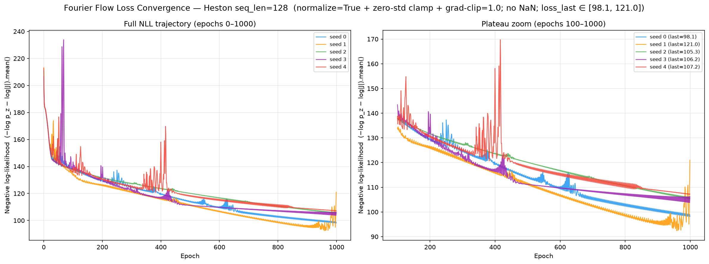
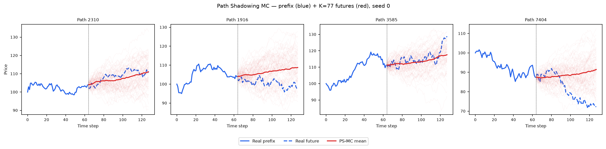
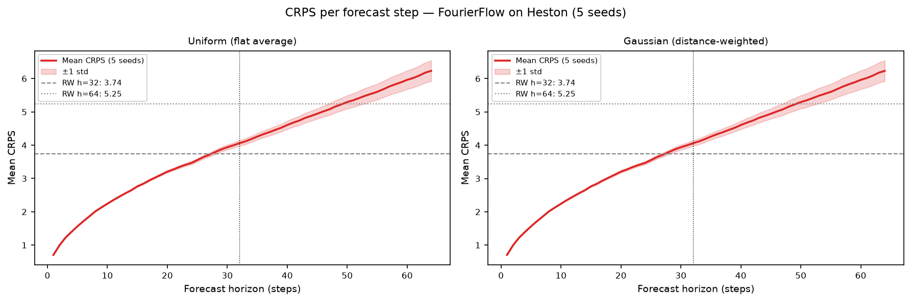

# Fourier Flow on Heston

PyTorch/NumPy reimplementation of **Fourier Flow** (Alaa, Chan, van der Schaar, ICLR 2021 —
*Generative Time-series Modeling with Fourier Flows*) trained on 8 192 Heston stochastic-volatility
price paths (seq\_len = 128).

See [`code/README.md`](code/README.md) for source, the original paper/GitHub, and the numerical guards
applied to make the frequency-domain flow finite on Heston data.

---

## Metrics A1–A34 + B — mean ± std across 5 seeds

> All metrics on **log-returns** $r_t = \log(S_{t+1}/S_t)$ unless noted. A26 uses price increments $\Delta S_t$.

| ID | Metric | Category | Dir | Mean ± Std | Seed 0 | Seed 1 | Seed 2 | Seed 3 | Seed 4 | Perfect floor |
|----|--------|----------|-----|-----------|--------|--------|--------|--------|--------|---------------|
| | **— Fat Tail —** | | | | | | | | | |
| A1 | Kurtosis Error | Fat Tail | ↓ | 0.5757 ± 0.0083 | 0.5668 | 0.5900 | 0.5728 | 0.5695 | 0.5795 | 0 |
| A2 | \|r\| q95 Error | Fat Tail | ↓ | 6.52e-04 ± 2.10e-04 | 6.40e-04 | 9.13e-04 | 2.73e-04 | 7.24e-04 | 7.10e-04 | 0 |
| A3 | \|r\| q99 Error | Fat Tail | ↓ | 0.0023 ± 5.06e-04 | 0.0023 | 0.0031 | 0.0015 | 0.0024 | 0.0023 | 0 |
| A4 | Tail QQ Error | Fat Tail | ↓ | 7.15e-04 ± 1.23e-04 | 6.75e-04 | 9.40e-04 | 5.66e-04 | 7.11e-04 | 6.82e-04 | 0 |
| A5 | Hill Tail Index Error | Fat Tail | ↓ | 6.368 ± 2.000 | 8.082 | 3.519 | 4.446 | 8.437 | 7.354 | 0 |
| | **— Distribution —** | | | | | | | | | |
| A6 | Path MMD² | Distribution | ↓ | 0.0052 ± 0.0019 | 0.0040 | 0.0051 | 0.0088 | 0.0036 | 0.0043 | 0.0015 |
| A7 | Terminal MMD² | Distribution | ↓ | 0.0106 ± 0.0051 | 0.0119 | 0.0037 | 0.0187 | 0.0069 | 0.0117 | 0.0016 |
| A8 | Increment MMD² | Distribution | ↓ | 0.0011 ± 7.70e-05 | 0.0010 | 0.0011 | 0.0012 | 9.45e-04 | 0.0011 | 7.45e-04 |
| A9 | Volatility MMD | Distribution | ↓ | 0.0596 ± 0.0086 | 0.0541 | 0.0597 | 0.0740 | 0.0482 | 0.0622 | 0.0071 |
| A10 | Terminal SWD | Distribution | ↓ | 2.815 ± 0.9433 | 2.526 | 2.194 | 4.673 | 2.144 | 2.540 | 0.6873 |
| A11 | Path SWD | Distribution | ↓ | 1.289 ± 0.4198 | 0.9519 | 1.582 | 1.969 | 0.8821 | 1.059 | 0.4381 |
| A12 | RV Law Loss | Distribution | ↓ | 0.5291 ± 0.1299 | 0.5209 | 0.7487 | 0.3413 | 0.5341 | 0.5004 | 0 |
| A13 | Mean Path RMSE | Distribution | ↓ | 0.4910 ± 0.4022 | 0.4282 | 1.145 | 0.7092 | 0.1191 | 0.0536 | 0 |
| A14 | KS Log-returns | Distribution | ↓ | 0.0191 ± 0.0024 | 0.0171 | 0.0234 | 0.0196 | 0.0173 | 0.0179 | 0 |
| A15 | Skewness Error | Distribution | ↓ | 0.0282 ± 0.0152 | 0.0282 | 0.0062 | 0.0528 | 0.0214 | 0.0325 | 0 |
| A16 | QQ RMSE (300-pt) | Distribution | ↓ | 5.86e-04 ± 4.20e-05 | 5.68e-04 | 6.66e-04 | 5.88e-04 | 5.52e-04 | 5.59e-04 | 0 |
| A17 | Terminal Price KS | Distribution | ↓ | 0.0848 ± 0.0166 | 0.0759 | 0.0955 | 0.1085 | 0.0597 | 0.0842 | 0 |
| | **— Adversarial —** | | | | | | | | | |
| A18 GRU | Discriminative Score GRU | Adversarial | ↓ | 0.0094 ± 0.0097 | 0.0023 | 0.0273 | 0.0026 | 0.0026 | 0.0121 | 0.0071 |
| A18 MLP | Discriminative Score MLP | Adversarial | ↓ | 0.0053 ± 0.0041 | 0.0117 | 0.0029 | 0.0011 | 0.0087 | 0.0023 | 0.0033 |
| | **— Predictive —** | | | | | | | | | |
| A19 GRU | Predictive Score GRU | Predictive | ↓ | 0.0537 ± 7.6e-06 | 0.05370 | 0.05372 | 0.05372 | 0.05371 | 0.05371 | 0.0537 |
| A19 MLP | Predictive Score MLP | Predictive | ↓ | 0.0540 ± 4.90e-04 | 0.0539 | 0.0537 | 0.0536 | 0.0550 | 0.0538 | 0.0537 |
| | **— Temporal —** | | | | | | | | | |
| A20 | Covariance Error | Temporal | ↓ | 64.406 ± 38.255 | 45.628 | 33.517 | 138.316 | 41.015 | 63.554 | 0 |
| A21 | ACF \|r\| Error (lags) | Temporal | ↓ | 0.0435 ± 5.50e-04 | 0.0438 | 0.0440 | 0.0424 | 0.0435 | 0.0436 | 0 |
| A22 | ACF r² Error (lags) | Temporal | ↓ | 0.0379 ± 5.56e-04 | 0.0384 | 0.0384 | 0.0369 | 0.0378 | 0.0382 | 0 |
| A23 | ACF \|r\| Lag-1 Error | Temporal | ↓ | 0.0526 ± 7.04e-04 | 0.0517 | 0.0535 | 0.0520 | 0.0533 | 0.0527 | 0 |
| A24 | ACF r² Lag-1 Error | Temporal | ↓ | 0.0461 ± 7.01e-04 | 0.0447 | 0.0467 | 0.0460 | 0.0465 | 0.0462 | 0 |
| | **— Vol —** | | | | | | | | | |
| A25 | Mean RMSE | Vol | ↓ | 0.9000 ± 0.8807 | 0.7646 | 2.488 | 1.062 | 0.1535 | 0.0319 | 0 |
| A26 | Return Std Error | Vol | ↓ | 0.0058 ± 0.0028 | 0.0064 | 8.53e-04 | 0.0096 | 0.0053 | 0.0067 | 0 |
| A27 | Log-Return Std Error | Vol | ↓ | 6.70e-05 ± 6.60e-05 | 1.90e-05 | 1.02e-04 | 1.80e-04 | 2.90e-05 | 2.00e-06 | 0 |
| A28 | Kurtosis Ratio | Vol | — | 3.039 ± 0.7605 | 2.820 | 4.491 | 2.251 | 2.904 | 2.727 | 1.000 |
| A29 | Sigma Mean Error | Vol | ↓ | 0.0026 ± 8.77e-04 | 0.0027 | 0.0019 | 0.0043 | 0.0020 | 0.0022 | 0 |
| A30 | Cross-Sect. Vol Path RMSE | Vol | ↓ | 1.367 ± 0.4499 | 0.9122 | 1.710 | 2.071 | 0.9772 | 1.165 | 0 |
| A31 | Rolling Vol KS (w=5) | Vol | ↓ | 0.0740 ± 0.0014 | 0.0746 | 0.0762 | 0.0737 | 0.0724 | 0.0729 | 0 |
| A32 | Vol-of-Vol Error | Vol | ↓ | 6.88e-04 ± 9.20e-05 | 6.77e-04 | 8.40e-04 | 5.51e-04 | 6.98e-04 | 6.76e-04 | 0 |
| | **— Heston Spec —** | | | | | | | | | |
| A33 | Teacher-Sigma Corr | Heston Spec | ↑ | 7.85e-04 ± 0.0038 | -0.0055 | 0.0027 | -0.0011 | 0.0023 | 0.0054 | 0.6143 |
| A34 | Teacher-Sigma RMSE | Heston Spec | ↓ | 0.0894 ± 0.0013 | 0.0897 | 0.0874 | 0.0913 | 0.0892 | 0.0893 | 0.0654 |

> **Convention:** ↓ lower is better; ↑ higher is better; — no monotone direction. A28 Kurtosis Ratio: perfect = 1.0.
> **A1**: |kurt_real − kurt_gen| on log-returns. **A2–A3**: 95th/99th quantile error on |log-returns|. **A4**: QQ error restricted to top-5% tail quantiles. **A5**: |Hill tail index_real − Hill tail index_gen|, Hill estimator on |log-returns| above 95th pct.
> **A6–A11**: path-kernel distances — Gaussian MMD² on full paths / terminal prices / increments / realized-vol, and sliced-Wasserstein on terminal & full paths. Non-zero perfect floor (an independent Heston draw scored against the test set — finite-sample noise).
> **A12**: W₁(RV_real, RV_gen), RV_i = Σ_t r²_{i,t}/dt. Ref: Barndorff-Nielsen & Shephard (2002). **A13**: path-level RMSE between real/gen mean trajectories. **A14**: KS statistic on pooled log-returns. **A15**: |skew_real − skew_gen|, Heston true skew ≈ −0.45. **A16**: QQ RMSE over 300 uniform quantile levels. **A17**: KS statistic on terminal prices S_T.
> **A18**: Discriminative classifier trained on log-returns; score = |accuracy − 0.5|, 0 = indistinguishable (GRU + MLP). **A19**: TSTR predictive MAE; all methods cluster near 0.054–0.059 (irreducible log-return floor) (GRU + MLP).
> **A20**: covariance-matrix error (%). **A21–A22**: ACF error on |r| and r² across lags 1–20. ARCH signal: |r_t| has positive lag-1 ACF ~0.05 in Heston. **A23–A24**: ACF lag-1 error on |r| and r². Heston true values ≈ +0.052 / +0.050.
> **A25**: mean-path RMSE. **A26**: return std error, uses price increments $\Delta S_t$. **A27**: log-return std error, uses $r_t = \log(S_{t+1}/S_t)$. **A28**: kurtosis ratio real/gen, perfect = 1.0. **A29**: sigma mean error — annualized per-path vol. **A30**: cross-sectional vol-path RMSE. **A31**: KS statistic on rolling-5 vol histograms. **A32**: |vol-of-vol_real − vol-of-vol_gen|.
> **A33**: Teacher-sigma correlation (Heston-recovered vol vs teacher σ), higher is better, perfect ≈ 0.614. **A34**: Teacher-sigma RMSE, perfect ≈ 0.065.

---

## B — Curve-Shape Metrics — mean ± std across 5 seeds

Each stylised-fact plot yields a **curve** L (a list of values), not a scalar. For the real
data (L_r) and generated data (L_g) we build three lists — the curve L, its first finite
difference L' (der), and its second finite difference L'' (sec\_der) — then combine the three
sub-scores into **one number per plot**:

- **MSE row**: for each list, dᵢ = mean((L_r − L_g)²). Reported mean = m_funct + m_der + m_sec\_der (**sum** of the three seed-means); std = sqrt(s_funct² + s_der² + s_sec\_der²) (**quadrature**).
- **% err row**: for each list, dᵢ = mean(|L_g − L_r| / (|L_r| + 1e-6)) × 100, a proper MAPE — one division (the mean already averages over the curve's points). Reported value = the **function-level MAPE on the curve L itself** — the derivative / 2nd-derivative MAPE is **excluded** because diff(L)/diff2(L) have near-zero true values, so their relative error explodes into meaningless 10⁴-% figures. mean/std = mean and **sample std across the 5 seeds** of that per-seed function MAPE.

All ↓ lower is better. The perfect floor is **non-zero** for all six plots — it is the residual finite-sample error of an independent Heston draw scored against the test set, identical across methods.
Two sublines per plot: **MSE** and **% error** (the per-seed columns hold that seed's combined score).

| Plot | Measure | Mean ± Std | Seed 0 | Seed 1 | Seed 2 | Seed 3 | Seed 4 | Perfect |
|------|---------|-----------|--------|--------|--------|--------|--------|:------:|
| **Log-return histogram** | MSE | 2.847 ± 0.1405 | 2.716 | 3.091 | 2.916 | 2.746 | 2.764 | 0 |
| | % err | 9.072% ± 0.5711% | 8.832% | 10.189% | 8.942% | 8.816% | 8.580% | 0 |
| **QQ plot** | MSE | 4.43e-07 ± 6.56e-08 | 4.19e-07 | 5.97e-07 | 3.92e-07 | 4.03e-07 | 4.03e-07 | 0 |
| | % err | 9.363% ± 2.272% | 8.048% | 13.826% | 8.956% | 7.638% | 8.345% | 0 |
| **ACF \|r\| lags 1–20** | MSE | 0.0013 ± 3.81e-05 | 0.0013 | 0.0013 | 0.0012 | 0.0013 | 0.0013 | 0 |
| | % err | 115.19% ± 1.926% | 116.72% | 117.15% | 111.88% | 114.26% | 115.94% | 0 |
| **ACF r² lags 1–20** | MSE | 9.43e-04 ± 3.51e-05 | 9.50e-04 | 9.91e-04 | 8.79e-04 | 9.54e-04 | 9.43e-04 | 0 |
| | % err | 117.36% ± 2.638% | 119.14% | 120.32% | 112.68% | 116.63% | 118.02% | 0 |
| **Rolling vol histogram** | MSE | 92.44 ± 8.157 | 91.90 | 107.98 | 82.56 | 89.80 | 89.98 | 0 |
| | % err | 25.29% ± 3.210% | 25.06% | 30.67% | 20.57% | 25.36% | 24.78% | 0 |
| **Tail survival** | MSE | 5.30e-04 ± 4.58e-05 | 5.22e-04 | 5.32e-04 | 6.13e-04 | 4.74e-04 | 5.10e-04 | 0 |
| | % err | 5.759% ± 0.2366% | 5.711% | 6.213% | 5.711% | 5.531% | 5.629% | 0 |

> **Log-ret histogram**: Fourier Flow is far more stable than TimeGAN here (MSE 2.85 ± 0.14 vs 144 ± 121) — explicit likelihood avoids the seed-to-seed collapse of adversarial training.
> **ACF \|r\|, ACF r²**: the MSE is tiny (~1e-3) because the true ACF ≈ 0.05 sits near zero, but the **% error** (function-level MAPE) is large (115% / 117%) for exactly that reason — near-zero denominators amplify any deviation. Read MSE for absolute agreement, % error for relative shape.
> **Rolling vol histogram**: MSE 92 from vol-distribution mismatch; still the weakest B panel in absolute terms alongside the log-return histogram.

---

## Stylised Facts Diagnostic (Heston vs Fourier Flow, seed 0)

Eight-panel comparison matching the Murex paper (Fig. 1 style): sample paths, return distribution,
QQ plot, ACF of |returns|, ACF of squared returns, rolling vol histogram (window=5), tail survival (log-log).


---

## Fourier Flow Training Loss (5 seeds)

Negative-log-likelihood loss `(-log_pz - log_jacob).mean()` over 1000 full-batch epochs, all 5 seeds.
Gradient clipping at 1.0 keeps the loss finite on Heston (see `code/README.md`).



---

## A18 — Discriminative Classifier Training Loss

BCE loss during GRU and MLP classifier training (2 000 steps, logged every 50 steps).
A value near ln(2) ≈ 0.693 means the classifier cannot distinguish real from fake.


---

## A19 — Predictive Score Training Loss (TSTR)

MAE loss during GRU and MLP predictor training on *synthetic* data (5 000 steps, logged every 100 steps).


---

## Path Shadowing MC (arXiv:2308.01486)

Given a real path prefix (steps 0–63), embed it as a **65D murex-style feature vector**
(63 step-by-step log-returns + terminal cumulative return + realized volatility, z-scored
using the generated pool distribution), retrieve K=77 nearest Fourier Flow paths by L2 distance
in that space, then use their price-anchored futures (steps 64–127) as a forecast ensemble.
Two variants: flat average (**Uniform**) and distance-weighted (**Gaussian**,
per-query η = η̃·‖z(x̃)‖ with η̃ = median(dist)/median(‖z‖) calibrated from data). The PS-MC pipeline
is **model-agnostic** — it consumes only the generated `.npy` paths, identical to TimeGAN's.

### Example ensemble fan-out (seed 0)



### CRPS per forecast step



### Results (mean ± std, 5 seeds)

| Metric | H=32 Uniform | H=32 Gaussian | H=64 Uniform | H=64 Gaussian | Naive RW |
|--------|:------------:|:-------------:|:------------:|:-------------:|:--------:|
| **CRPS** | **2.742 ± 0.027** | 2.743 ± 0.027 | **3.992 ± 0.106** | 3.992 ± 0.106 | 3.73 / 5.30 |
| MAE    | 3.774 ± 0.028 | 3.774 ± 0.028 | 5.461 ± 0.120 | 5.461 ± 0.121 | 3.73 / 5.30 |
| RMSE   | 5.185 ± 0.055 | 5.185 ± 0.055 | 7.547 ± 0.197 | 7.548 ± 0.197 | 5.07 / 7.18 |

PS-MC **beats the naive RW on CRPS** at both horizons (2.74 < 3.73 at H=32; 3.99 < 5.30 at H=64), on all
5 seeds, and its CRPS is lower than TimeGAN's (2.74 vs 3.09 at H=32) — Fourier Flow's pool gives tighter,
better-calibrated nearest-neighbour futures. Uniform ≈ Gaussian: Heston is time-homogeneous, so the K
nearest neighbours are roughly equally predictive.

Full analysis: [`../../results/Heston/FourierFlow/path_shadowing/README.md`](../../results/Heston/FourierFlow/path_shadowing/README.md)

---

## File layout

```
methods/FourierFlow/
├── README.md                          ← this file
├── generated_paths/seed_{0..4}/
│   ├── generated_paths_8192x128.npy   shape (8192, 128), original price scale
│   └── metadata.json                  seed, shape, min/max, train time
├── weights/
│   ├── seed_{i}_model.pt              full PyTorch state_dict
│   └── seed_{i}_config.json           hyperparameters
├── losses/
│   ├── seed_{i}_losses.csv            epoch, loss (NLL per full-batch epoch)
│   └── loss_convergence.png           convergence plot (5 seeds overlaid)
├── code/
│   ├── train_heston.py                Heston training driver (imports reference FourierFlow) + guards
│   ├── train_all.sh                   orchestrator — 5 seeds (CPU, core-pinned)
│   ├── plot_losses.py                 loss_convergence.png generator
│   ├── reference/                     verbatim released code (ahmedmalaa/Fourier-flows)
│   └── README.md                      paper, GitHub, numerical guards
├── paper_reimplementation/            Stocks Table-2 reproduction (F-score + MAE)
└── path_shadowing/                    model-agnostic PS-MC forecaster
```

## Reproduce

```bash
# Train all 5 seeds (CPU, numpy.fft — Fourier Flow has no GPU path)
cd methods/FourierFlow/code
./train_all.sh

# Compute metrics
cd metrics
python compute_all.py --method FourierFlow --dataset Heston
```
