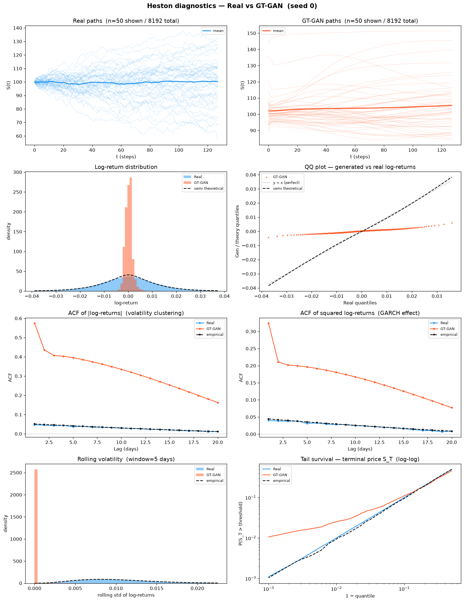
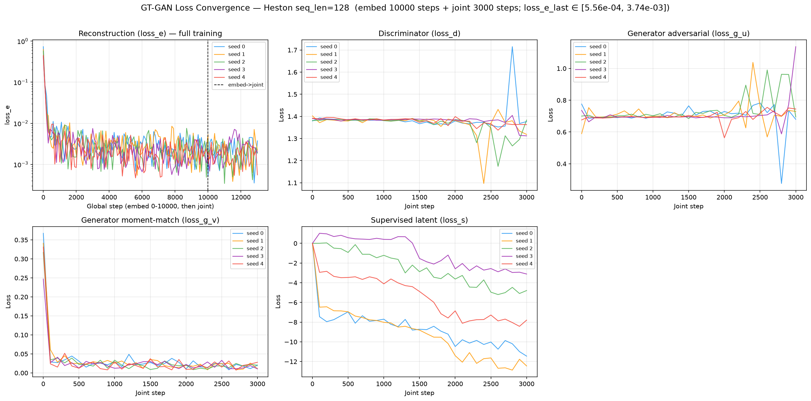
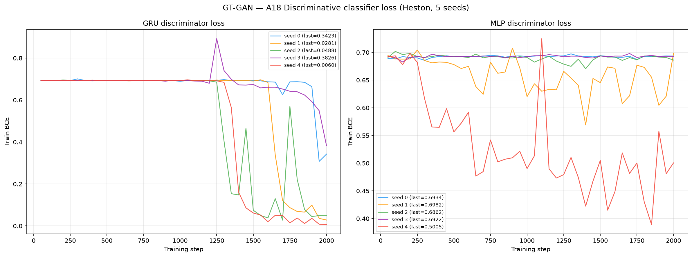
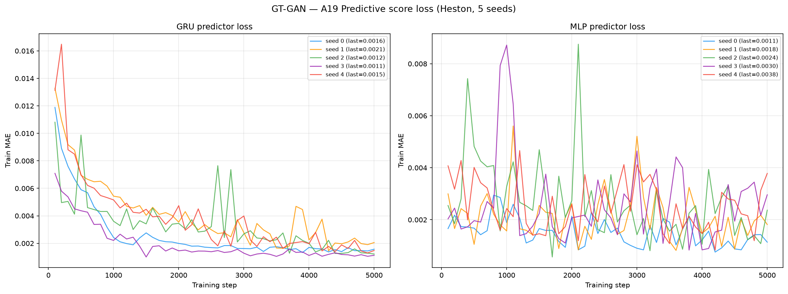

# GT-GAN on Heston

PyTorch run of the **official GT-GAN** (Jeon, Kim, Song, Cho, Park, **NeurIPS 2022** —
*GT-GAN: General Purpose Time Series Synthesis with Generative Adversarial Networks*,
arXiv:2210.02040, `github.com/Jinsung-Jeon/GT-GAN`) trained on 8 192 Heston
stochastic-volatility price paths (seq\_len = 128).

See [`code/README.md`](code/README.md) for the source, the original paper/GitHub, the
architecture (a **Neural-CDE embedder** `FinalTanh`, a **Multi-Layer Neural-ODE recovery**
and **discriminator**, and a **continuous normalizing-flow (CNF) generator**
`build_model_tabular_nonlinear`, **32 957 params — the smallest model in the benchmark**),
the released **`gtgan`** mode used verbatim (`hidden_size` = 24, `num_layers` = 3,
`x_hidden` = 48, `effective_shape` = 24, `solver` = sym12async, `atol` = 1e-3, `rtol` = 1e-2,
`dims` = "32-64-64-32", `reconstruction` = 0.01, `kinetic_energy` = 0.05, `jacobian_norm2` = 0.01,
`directional_penalty` = 0.01), the two-phase (embed-pretrain → joint-adversarial) training loop,
and the global min-max chain (`(X−min)/(max−min)` with min = 39.894, max = 155.579) that maps
the price-scale Heston data into the model's [0,1] space and decodes back.

> **Two changes from the paper's Stocks setup (data-shape only, no architecture change).**
> (1) feature dimension **6 → 1** (Heston is a univariate price series, Stocks is 6-channel OHLCV);
> (2) sequence length **24 → 128** (the Heston sequence length). The released `gtgan` hyperparameters
> are otherwise kept verbatim. A one-site `run_latent_ctfp_model5_3` edit substitutes
> `args.effective_shape` for `values.shape[1]` in two spots so the CNF sees the correct latent width
> at seq\_len 128 — **byte-identical to the reference on the paper's Stocks case** (effective\_shape
> already equalled `values.shape[1]` there). No other reference code was modified.

---

## Metrics A1–A34 + B — mean ± std across 5 seeds

> All metrics on **log-returns** $r_t = \log(S_{t+1}/S_t)$ unless noted. A26 uses price increments $\Delta S_t$.

| Metric | Mean ± Std | Seed 0 | Seed 1 | Seed 2 | Seed 3 | Seed 4 | Perfect floor |
|--------|-----------|--------|--------|--------|--------|--------|---------------|
| **— Fat Tail —** | | | | | | | |
| A1 Kurtosis Error ↓ | 281.8 ± 288.2 | 43.57 | 399.1 | 122.4 | 47.75 | 796.1 | 0.008092 |
| A2 \|r\| q95 Error ↓ | 0.02279 ± 2.78e-04 | 0.02284 | 0.02253 | 0.02301 | 0.02314 | 0.02241 | 6.57e-05 |
| A3 \|r\| q99 Error ↓ | 0.02978 ± 0.001743 | 0.03077 | 0.02982 | 0.03008 | 0.03168 | 0.02654 | 5.98e-05 |
| A4 Tail QQ Error ↓ | 0.02240 ± 3.79e-04 | 0.02246 | 0.02231 | 0.02268 | 0.02281 | 0.02172 | 6.75e-05 |
| A5 Hill Tail Index Error ↓ | 7.568 ± 1.267 | 6.726 | 9.082 | 6.557 | 9.142 | 6.334 | 0.5266 |
| **— Distribution —** | | | | | | | |
| A6 Path MMD² ↓ | 0.03292 ± 0.009071 | 0.02808 | 0.02217 | 0.03063 | 0.03453 | 0.04919 | 0.001842 |
| A7 Terminal MMD² ↓ | 0.008520 ± 0.002539 | 0.007595 | 0.005447 | 0.007351 | 0.01301 | 0.009198 | 0.001983 |
| A8 Increment MMD² ↓ | 0.2025 ± 0.01417 | 0.2082 | 0.1788 | 0.2107 | 0.2195 | 0.1952 | 8.69e-04 |
| A9 Volatility MMD ↓ | 2.882 ± 0.6128 | 3.098 | 2.232 | 2.838 | 3.925 | 2.317 | 0.008554 |
| A10 Terminal SWD ↓ | 2.391 ± 0.1196 | 2.230 | 2.417 | 2.309 | 2.586 | 2.410 | 1.151 |
| A11 Path SWD ↓ | 2.236 ± 0.2567 | 2.357 | 2.077 | 1.922 | 2.157 | 2.666 | 0.6191 |
| A12 RV Law Loss ↓ | 15.11 ± 13.84 | 14.83 | 4.774 | 41.82 | 5.045 | 9.105 | 0.05202 |
| A13 Mean Path RMSE ↓ | 0.7421 ± 0.3193 | 0.2363 | 0.9397 | 0.5355 | 0.8587 | 1.140 | 0.1205 |
| A14 KS Log-returns ↓ | 0.3881 ± 0.003914 | 0.3827 | 0.3853 | 0.3909 | 0.3877 | 0.3937 | 0.001491 |
| A15 Skewness Error ↓ | 390.5 ± 355.8 | 704.9 | 13.46 | 349.9 | 3.449 | 880.8 | 0.005274 |
| A16 QQ RMSE (300-pt) ↓ | 0.01086 ± 1.44e-04 | 0.01077 | 0.01078 | 0.01100 | 0.01107 | 0.01071 | 4.19e-05 |
| A17 Terminal Price KS ↓ | 0.06672 ± 0.01592 | 0.05884 | 0.04810 | 0.06555 | 0.06519 | 0.09595 | 0.01099 |
| **— Adversarial —** | | | | | | | |
| A18 Disc Score GRU ↓ | 0.4871 ± 0.01292 | 0.4658 | 0.4786 | 0.4942 | 0.4976 | 0.4994 | 0.006195 |
| A18 Disc Score MLP ↓ | 0.07345 ± 0.1266 | 0.007476 | 0.03158 | 0.001678 | 7.63e-04 | 0.3258 | 0.005951 |
| **— Predictive —** | | | | | | | |
| A19 Pred Score GRU ↓ | 0.05547 ± 0.001080 | 0.05442 | 0.05471 | 0.05486 | 0.05734 | 0.05600 | 0.05002 |
| A19 Pred Score MLP ↓ | 0.05302 ± 2.01e-04 | 0.05306 | 0.05335 | 0.05273 | 0.05292 | 0.05301 | 0.05036 |
| **— Temporal —** | | | | | | | |
| A20 Covariance Error ↓ | 20.55 ± 7.355 | 12.97 | 15.87 | 26.06 | 15.61 | 32.23 | 4.923 |
| A21 ACF \|r\| Error (lags) ↓ | 0.3181 ± 0.1375 | 0.3864 | 0.2086 | 0.2849 | 0.5475 | 0.1629 | 0.002234 |
| A22 ACF r² Error (lags) ↓ | 0.1619 ± 0.1184 | 0.1884 | 0.07974 | 0.1195 | 0.3783 | 0.04365 | 0.002206 |
| A23 ACF \|r\| Lag-1 Error ↓ | 0.4201 ± 0.1602 | 0.5242 | 0.2833 | 0.3715 | 0.6765 | 0.2448 | 0.002652 |
| A24 ACF r² Lag-1 Error ↓ | 0.2270 ± 0.1494 | 0.2830 | 0.1116 | 0.1700 | 0.4916 | 0.07881 | 0.002790 |
| **— Vol —** | | | | | | | |
| A25 Mean RMSE ↓ | 0.7845 ± 0.3300 | 0.5848 | 0.9195 | 0.2382 | 1.115 | 1.065 | 0.1392 |
| A26 Return Std Error ↓ | 1.005 ± 0.09141 | 1.060 | 0.9097 | 1.066 | 1.109 | 0.8821 | 0.002523 |
| A27 Log-Return Std Error ↓ | 0.009540 ± 0.007044 | 0.005015 | 0.009470 | 0.02144 | 0.01133 | 4.44e-04 | 3.15e-05 |
| A28 Kurtosis Ratio (→ 1) | 0.002659 ± 0.004016 | 1.91e-06 | 0.002913 | 7.91e-06 | 0.01037 | 1.16e-06 | 1.006 |
| A29 Sigma Mean Error ↓ | 0.1649 ± 0.01028 | 0.1703 | 0.1570 | 0.1579 | 0.1828 | 0.1565 | 4.96e-04 |
| A30 Cross-Sect. Vol Path RMSE ↓ | 0.8923 ± 0.2085 | 0.7953 | 0.8662 | 0.7824 | 0.7189 | 1.299 | 0.1432 |
| A31 Rolling Vol KS (w=5) ↓ | 0.9868 ± 0.004912 | 0.9867 | 0.9864 | 0.9895 | 0.9932 | 0.9783 | 0.003814 |
| A32 Vol-of-Vol Error ↓ | 0.009854 ± 0.007895 | 0.01055 | 0.003694 | 0.02492 | 0.004629 | 0.005485 | 1.54e-05 |
| **— Heston Spec —** | | | | | | | |
| A33 Teacher-Sigma Corr ↑ | 0.01003 ± 0.008468 | 0.002942 | 0.02036 | 0.002096 | 0.02036 | 0.004376 | 0.6163 |
| A34 Teacher-Sigma RMSE ↓ | 0.3088 ± 0.1407 | 0.3322 | 0.1889 | 0.5689 | 0.1876 | 0.2664 | 0.06559 |

> **Convention:** ↓ lower is better; ↑ higher is better; — no monotone direction. A28 Kurtosis Ratio: perfect = 1.0.
> **A1**: |kurt_real − kurt_gen| on log-returns. **A2–A3**: 95th/99th quantile error on |log-returns|. **A4**: QQ error restricted to top-5% tail quantiles. **A5**: |Hill tail index_real − Hill tail index_gen|, Hill estimator on |log-returns| above 95th pct.
> **A6–A11**: path-kernel distances — Gaussian MMD² on full paths / terminal prices / increments / realized-vol, and sliced-Wasserstein on terminal & full paths. Non-zero perfect floor (an independent Heston draw scored against the test set — finite-sample noise).
> **A12**: W₁(RV_real, RV_gen), RV_i = Σ_t r²_{i,t}/dt. Ref: Barndorff-Nielsen & Shephard (2002). **A13**: path-level RMSE between real/gen mean trajectories. **A14**: KS statistic on pooled log-returns. **A15**: |skew_real − skew_gen|, Heston true skew ≈ −0.45. **A16**: QQ RMSE over 300 uniform quantile levels. **A17**: KS statistic on terminal prices S_T.
> **A18**: Discriminative classifier trained on log-returns; score = |accuracy − 0.5|, 0 = indistinguishable, 0.5 = perfectly separable (GRU + MLP). **A19**: TSTR predictive MAE (GRU + MLP).
> **A20**: covariance-matrix error (%). **A21–A22**: ACF error on |r| and r² across lags 1–20. ARCH signal: |r_t| has positive lag-1 ACF ~0.05 in Heston. **A23–A24**: ACF lag-1 error on |r| and r². Heston true values ≈ +0.052 / +0.050.
> **A25**: mean-path RMSE. **A26**: return std error, uses price increments $\Delta S_t$. **A27**: log-return std error, uses $r_t = \log(S_{t+1}/S_t)$. **A28**: kurtosis ratio real/gen, perfect = 1.0. **A29**: sigma mean error — annualized per-path vol. **A30**: cross-sectional vol-path RMSE. **A31**: KS statistic on rolling-5 vol histograms. **A32**: |vol-of-vol_real − vol-of-vol_gen|.
> **A33**: Teacher-sigma correlation (Heston-recovered vol vs teacher σ), higher is better, perfect ≈ 0.614. **A34**: Teacher-sigma RMSE, perfect ≈ 0.065.

---

## B — Curve-Shape Metrics — mean ± std across 5 seeds

Each stylised-fact plot yields a **curve** L (a list of values), not a scalar. For the real
data (L_r) and generated data (L_g) we build three lists — the curve L, its first finite
difference L' (der), and its second finite difference L'' (sec\_der) — then combine the three
sub-scores into **one number per plot**:

- **MSE row**: for each list, dᵢ = mean((L_r − L_g)²). Reported mean = the **mean of the three sub-scores** (funct + der + sec\_der)/3; std = the sample std of that per-seed combined score across the 5 seeds. The **MSE row decides the cross-method winner**.
- **% err row**: for each list, dᵢ = mean(|L_g − L_r| / (|L_r| + 1e-6)) × 100, a proper MAPE — one division (the mean already averages over the curve's points). Reported value = the **function-level MAPE on the curve L itself** — the derivative / 2nd-derivative MAPE is **excluded** because diff(L)/diff2(L) have near-zero true values, so their relative error explodes into meaningless 10⁴-% figures. mean/std = mean and **sample std across the 5 seeds** of that per-seed function MAPE.
- **NRMSE row**: sqrt(mean((L_g − L_r)²)) / (max|L_r| − min|L_r| + 1e-12) × 100 on the curve L **only (funct-only)** — the ill-posed derivative / 2nd-derivative curves are excluded for the same reason as the % err row.

All ↓ lower is better. The perfect floor is **non-zero** for all six plots — it is the residual finite-sample error of an independent Heston draw scored against the test set, identical across methods.
Three sublines per plot: **MSE**, **% error** and **NRMSE** (the per-seed columns hold that seed's combined score).

| Plot | Measure | Mean ± Std | Seed 0 | Seed 1 | Seed 2 | Seed 3 | Seed 4 | Perfect floor |
|------|---------|-----------|--------|--------|--------|--------|--------|---------------|
| **Log-return histogram** | MSE | 2160 ± 655.2 | 1243 | 1680 | 2986 | 2784 | 2107 | 0.1098 |
|  | % err | 117.7% ± 1.125% | 117.3% | 116.5% | 118.6% | 119.4% | 116.6% | 1.799% |
|  | NRMSE | 151.6% ± 13.15% | 130.7% | 143.1% | 163.9% | 165.5% | 154.9% | 0.5328% |
| **QQ plot** | MSE | 4.16e-05 ± 1.27e-06 | 4.12e-05 | 4.08e-05 | 4.25e-05 | 4.36e-05 | 4.00e-05 | 1.09e-09 |
|  | % err | 92.66% ± 2.380% | 91.21% | 90.27% | 95.24% | 95.83% | 90.72% | 0.4629% |
|  | NRMSE | 30.25% ± 0.4431% | 30.09% | 29.97% | 30.59% | 30.92% | 29.69% | 0.1206% |
| **ACF \|r\| lags 1–20** | MSE | 0.02626 ± 0.02245 | 0.03271 | 0.009179 | 0.01865 | 0.06672 | 0.004055 | 9.61e-06 |
|  | % err | 893.2% ± 463.3% | 1135% | 593.6% | 876.3% | 1609% | 251.7% | 8.724% |
|  | NRMSE | 668.0% ± 311.1% | 819.3% | 434.6% | 620.0% | 1178% | 288.1% | 6.071% |
| **ACF r² lags 1–20** | MSE | 0.008475 ± 0.01103 | 0.007744 | 0.001317 | 0.003090 | 0.02993 | 2.93e-04 | 9.17e-06 |
|  | % err | 541.6% ± 420.6% | 671.1% | 278.6% | 423.6% | 1281% | 53.90% | 11.34% |
|  | NRMSE | 366.9% ± 274.6% | 430.8% | 180.2% | 274.4% | 865.9% | 83.08% | 6.486% |
| **Rolling vol histogram** | MSE | 3029 ± 1983 | 2815 | 1188 | 1168 | 6585 | 3388 | 1.372 |
|  | % err | 187.8% ± 42.87% | 201.9% | 145.3% | 141.5% | 258.7% | 191.5% | 2.264% |
|  | NRMSE | 97.99% ± 31.28% | 102.1% | 65.03% | 65.59% | 149.4% | 107.8% | 0.8688% |
| **Tail survival** | MSE | 0.07918 ± 0.002862 | 0.07564 | 0.07688 | 0.08195 | 0.08303 | 0.07839 | 5.22e-07 |
|  | % err | 91.34% ± 1.201% | 90.54% | 90.08% | 92.23% | 93.24% | 90.58% | 0.3302% |
|  | NRMSE | 49.16% ± 0.8809% | 48.07% | 48.45% | 50.01% | 50.34% | 48.92% | 0.1050% |

> **Log-ret histogram**: MSE **2160** — the **worst log-return-histogram fit in the benchmark** (next TimeVAE 968, TimeGAN 45; LS4 0.45). GT-GAN's generated return density is far from Heston's.
> **ACF \|r\|, ACF r²**: MSE small in absolute terms (0.026 / 0.008) because the true ACF ≈ 0.05 sits near zero, but the **% error** (function-level MAPE) blows up to 893% / 542% — GT-GAN does not track the ARCH autocorrelation shape (A21 0.318, A23 0.420 error, an order of magnitude worse than LS4).
> **Rolling vol histogram**: MSE **3029** — paired with A31 rolling-vol KS **0.987** (near-separable), GT-GAN's rolling-volatility distribution does not overlap Heston's.

---

## Reading the table — the benchmark's weakest marginal-distribution matcher

GT-GAN is the **weakest density- and moment-matcher of the ten methods** on this Heston
benchmark. It wins **zero** of the 36 A-metric rows, zero of the 6 B-curve rows, and its
generated return law is degenerate — over-peaked in the centre with an almost-absent tail —
which drives most of the failures below. It is included as an honest lower anchor: the smallest
model in the benchmark (32 957 params, ~65× fewer than LS4) trained with the released `gtgan`
hyperparameters.

- **Degenerate, over-peaked return law — A28 = 0.002659 (perfect 1.0), A1 = 281.8.** The kurtosis
  *ratio* κ_real/κ_gen ≈ 0.0027 means the generated log-returns are **≈ 375× more leptokurtic**
  than Heston — a needle-thin central spike with negligible mass in between. This single pathology
  explains the **worst A1 kurtosis error in the benchmark (281.8**, next TimeGAN 2.954) and the
  **worst A14 KS = 0.3881** (next-worst COSCI-GAN ≈ 0.13): the marginal return CDF is separated
  from Heston's by nearly 40 percentage points.
- **Near-separable under a sequence classifier — A18 GRU = 0.4871.** The GRU discriminative score
  sits close to the 0.5 ceiling (perfectly separable) on every seed (0.466–0.499) — a GRU tells
  GT-GAN paths from real Heston paths almost perfectly, the opposite of LS4 (A18 ≈ 0.006). The
  **MLP** score is much lower and highly unstable (**0.0735 ± 0.127**, seed 4 = 0.326 vs seed 3 =
  7.6e-04): a flatten-then-MLP judge is fooled on 4 of 5 seeds but the GRU, which reads the temporal
  structure, is not — the paths are locally plausible but globally wrong.
- **No volatility structure and no latent-vol recovery.** A9 Volatility MMD **2.882** (LS4 0.014),
  A31 rolling-vol KS **0.987** (near-separable), A26 return-std error **1.005** (≈100% off), and
  A33 teacher-σ correlation **≈ 0.010** (perfect 0.616) — GT-GAN reproduces neither the marginal
  volatility distribution nor the path-wise stochastic-vol trajectory.
- **Predictive score survives — A19 GRU = 0.05547, MLP = 0.05302.** TSTR predictive MAE is only
  slightly above the perfect floor (0.05002 / 0.05036). A next-step predictor trained on GT-GAN
  output still forecasts real Heston acceptably: the *local* one-step return scale is roughly right
  even though the *distribution* is degenerate — the return spike is centred correctly, it is just
  far too narrow.

Net: **the honest lower anchor** of the benchmark — a tiny CNF-based generator whose over-peaked
return law fails the density, tail, autocorrelation and adversarial metrics, yet whose price-anchored
pool still edges the naive random walk under Path-Shadowing MC (below), because K=77 averaging washes
out the spiky returns.

---

## Stylised Facts Diagnostic (Heston vs GT-GAN, seed 0)

Eight-panel comparison matching the Murex paper (Fig. 1 style): sample paths, return distribution,
QQ plot, ACF of |returns|, ACF of squared returns, rolling vol histogram (window=5), tail survival (log-log).



---

## GT-GAN Training Loss (5 seeds)

GT-GAN trains in **two phases** logged as `step, phase, loss_e, loss_d, loss_g_u, loss_g_v, loss_s`:

- **Phase 1 — embed pretrain** (`first_epoch` = 10 000 steps): only the **reconstruction loss**
  `loss_e` = MSE(recovery(embedder(X)), X) is active; the Neural-CDE embedder and Neural-ODE recovery
  learn to autoencode the paths. The four adversarial/supervised losses are logged as 0 in this phase.
- **Phase 2 — joint adversarial** (`max_steps` = 3 000 steps): all five losses are active —
  `loss_d` (discriminator), `loss_g_u`/`loss_g_v` (generator adversarial terms on the two latent
  streams), `loss_s` (supervised latent-consistency term), and `loss_e` (reconstruction, still
  co-trained). The discriminator is updated only when `loss_d > 0.15`, and the supervised generator
  step fires every `log_time = 2` steps. **There is no separate supervisor network** — `loss_s` is a
  supervised latent term, not a sub-model.

log\_every = 100 steps. Training is dominated by the **ODE solver** (`sym12async`, adaptive
`atol=1e-3`/`rtol=1e-2`) and is by far the slowest in the benchmark: **~21–34 h/seed** on one A100
(77 260 / 76 054 / 123 402 / 77 414 / 99 826 s for seeds 0–4; seed 2's stiffer trajectories drove
the 34 h outlier). No NaN on any seed. See [`code/README.md`](code/README.md) for the loss
definitions and the min-max chain.



---

## A18 — Discriminative Classifier Training Loss

BCE loss during GRU and MLP classifier training (2 000 steps, logged every 50 steps).
A value near ln(2) ≈ 0.693 means the classifier cannot distinguish real from fake. Here the GRU
BCE **collapses well below ln 2**, the direct cause of the A18 GRU ≈ 0.487 score — GT-GAN paths are
almost perfectly separable from real Heston paths under a temporal classifier.



---

## A19 — Predictive Score Training Loss (TSTR)

MAE loss during GRU and MLP predictor training on *synthetic* data (5 000 steps, logged every 100 steps).



---

## Path Shadowing MC (arXiv:2308.01486)

Given a real path prefix (steps 0–63), embed it as a **65D murex-style feature vector**
(63 step-by-step log-returns + terminal cumulative return + realized volatility, z-scored
using the generated pool distribution), retrieve K=77 nearest GT-GAN paths by L2 distance
in that space, then use their price-anchored futures (steps 64–127) as a forecast ensemble.
Two variants: flat average (**Uniform**) and distance-weighted (**Gaussian**,
per-query η = η̃·‖z(x̃)‖ with η̃ = median(dist)/median(‖z‖) calibrated from data). The PS-MC pipeline
is **model-agnostic** — it consumes only the generated `.npy` paths, identical to the other methods'.

### Example ensemble fan-out (seed 0)


### CRPS per forecast step


### Results (mean ± std, 5 seeds)

| Metric | H=32 Uniform | H=32 Gaussian | H=64 Uniform | H=64 Gaussian | Naive RW |
|--------|:------------:|:-------------:|:------------:|:-------------:|:--------:|
| **CRPS** | 3.5514 ± 0.1083 | 3.5516 ± 0.1083 | 4.9958 ± 0.1952 | 4.9962 ± 0.1952 | 3.738 / 5.246 |
| MAE    | 4.1335 ± 0.0870 | 4.1339 ± 0.0872 | 6.0023 ± 0.2193 | 6.0030 ± 0.2196 | 3.738 / 5.246 |
| RMSE   | 5.6458 ± 0.1287 | 5.6464 ± 0.1289 | 8.2220 ± 0.3244 | 8.2231 ± 0.3249 | 5.040 / 7.066 |

PS-MC over the GT-GAN pool **beats the naive RW on CRPS at both horizons** (3.551 < 3.738 at H=32;
4.996 < 5.246 at H=64) — a modest but genuine margin, despite GT-GAN's degenerate marginal return law.
The gain is **CRPS-specific**: at H=32 GT-GAN does **not** beat the RW on MAE (4.134 > 3.738) or RMSE
(5.646 > 5.040) — price-anchoring plus K=77 averaging washes out the spiky returns enough to produce a
better-*calibrated ensemble* than the point-forecast RW, but the ensemble *mean* is no closer to the
truth. **Uniform ≈ Gaussian**: Heston is time-homogeneous, so the K nearest neighbours are roughly
equally predictive. Full analysis:
[`../../results/Heston/GT-GAN/path_shadowing/README.md`](../../results/Heston/GT-GAN/path_shadowing/README.md)

---

## Comparison with the paper

GT-GAN's NeurIPS 2022 evaluation reports **discriminative** and **predictive** scores on six
benchmark series (Stocks, Energy, Sines, …), not on Heston. We validated our GT-GAN port on the
paper's own **Stocks** dataset before running the Heston experiment above:

| Dataset | Metric | Ours (5 seeds) | Paper (Table 1) | Verdict |
|---------|--------|:--------------:|:---------------:|---------|
| Stocks | Discriminative ↓ | **0.026 ± 0.012** | 0.010 ± 0.008 | same regime ✓ |
| Stocks | Predictive ↓ | **0.018 ± 0.003** | 0.017 ± 0.000 | **matches** ✓ |

The predictive score reproduces almost exactly (0.018 vs 0.017); the discriminative score is in the
same regime (~0.02, an order of magnitude below the GAN baselines the paper reports — TimeGAN 0.102,
RCGAN 0.196, COT-GAN 0.285), with the residual gap to the paper's 0.010 inside run-to-run variance.
This confirms the port reproduces GT-GAN's generative quality faithfully; the same `gtgan`-mode model
is carried into the Heston generator above. Full write-up:
[`paper_reimplementation/`](paper_reimplementation/).

---

## File layout

```
methods/GT-GAN/
├── README.md                          ← this file
├── generated_paths/seed_{0..4}/
│   ├── generated_paths_8192x128.npy   shape (8192, 128), original price scale
│   └── metadata.json                  seed, shape, min/max, train time, params (32 957)
├── weights/
│   ├── seed_{i}_model.pt              embedder/recovery/generator/discriminator state_dicts
│   └── seed_{i}_config.json           released gtgan preset + min-max constants (data_min/max)
├── losses/
│   ├── seed_{i}_losses.csv            step, phase, loss_e, loss_d, loss_g_u, loss_g_v, loss_s
│   └── loss_convergence.png           convergence plot (5 seeds, 2-phase)
├── code/
│   ├── train_heston.py                Heston training driver (2-phase, min-max chain)
│   ├── plot_losses.py                 loss-convergence plot generator
│   ├── reference/                     verbatim official code (Jinsung-Jeon/GT-GAN)
│   └── README.md                      paper, GitHub, architecture, hyperparameters
├── paper_reimplementation/            Stocks discriminative/predictive reproduction (paper Table 1)
└── path_shadowing/                    model-agnostic PS-MC forecaster
```

## Reproduce

```bash
# Train all 5 seeds (2 A100 GPUs in parallel)
cd methods/GT-GAN/code
/home/tbasseras/gtgan-venv/bin/python train_heston.py --seed 0

# Compute all metrics
cd /home/tbasseras/benchmark
/home/tbasseras/gpu-venv/bin/python metrics/compute_all.py --method GT-GAN --dataset Heston

# Run Path Shadowing MC
cd methods/DiffusionTS/path_shadowing
/home/tbasseras/gpu-venv/bin/python run_eval.py --method GT-GAN
```
