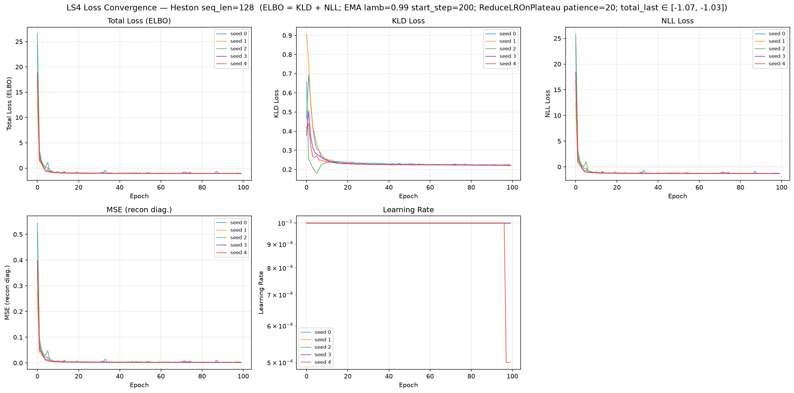
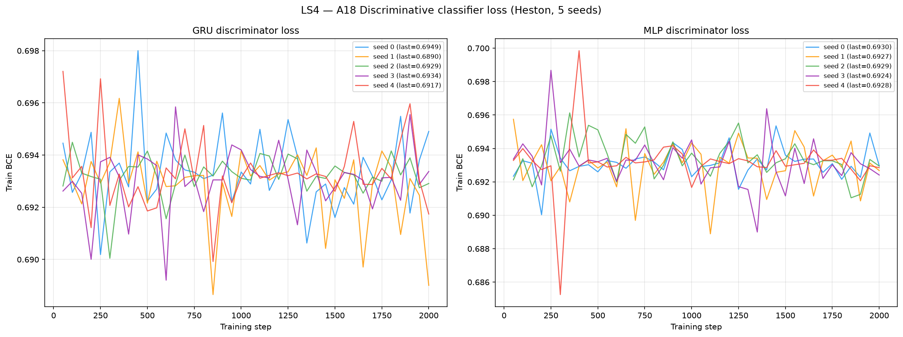
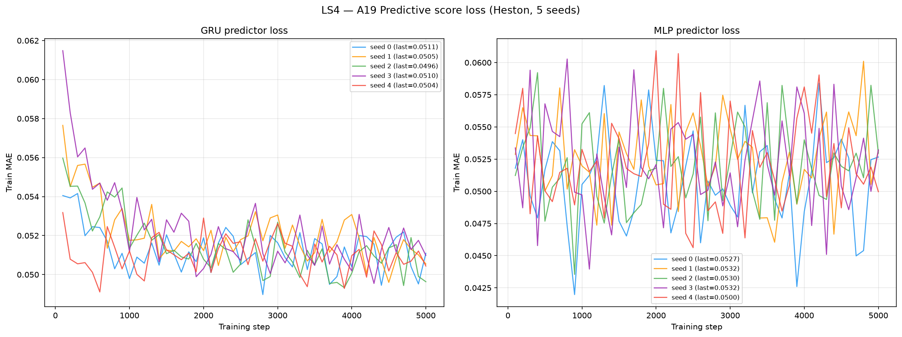
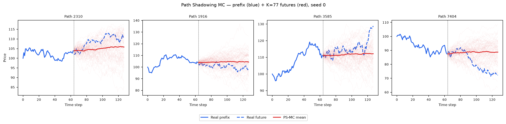
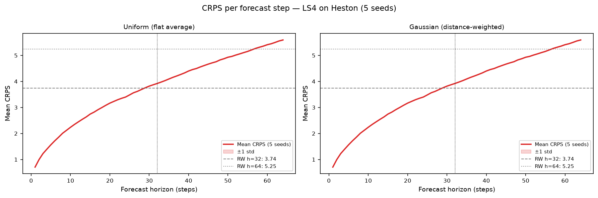

# LS4 on Heston

PyTorch run of the **official LS4** (Zhou, Poli, Xu, Massaroli, Ermon, **ICML 2023** —
*Deep Latent State Space Models for Time-Series Generation*, PMLR 202, arXiv:2212.12749,
`github.com/alexzhou907/ls4`) trained on 8 192 Heston stochastic-volatility price paths
(seq\_len = 128).

See [`code/README.md`](code/README.md) for the source, the original paper/GitHub, the
architecture (S4 structured-state-space **prior** rolling a continuous latent `z` forward,
S4 **posterior** + S4 **decoder** reconstructing observations, `latent_type = split`,
2 146 857 params), the released `solar_weekly` preset used verbatim
(`z_dim` = 5, `d_model` = 64, `d_state` = 64, `n_layers` = 4, `backbone` = autoreg,
`s4_type` = s4, `sigma` = 0.1), the AdamW + ReduceLROnPlateau + EMA optimiser stack, and
the global-standardise chain (`(X−μ)/σ` with μ = 101.325, σ = 9.972) that maps the
price-scale Heston data into the model's ≈N(0,1) space and decodes back.

> **⚠️ Cauchy fix (REQUIRED — the only change to reference model code).** LS4's
> `model.generate` rolls the S4 latent **prior** forward with `latent.step` — the STEP-mode
> recurrence (one timestep at a time), not the convolutional scan used at training. On a
> CUDA-13 A100 the fast Cauchy kernels (`pykeops` / bundled CUDA extension) are unavailable,
> so S4 falls back to the **naive Python Cauchy kernel** in `reference/models/s4.py`. As
> shipped, that fallback sums the kernel over the *full* pole set instead of over **conjugate
> pole pairs** — correct for the keops/CUDA path, wrong for the naive path used at generation.
> The fix at `code/reference/models/s4.py:795` makes the naive kernel sum over conjugate
> **pairs**, matching keops/CUDA. Without it, generation degenerates (verified on Solar-Weekly:
> marginal score frozen at 0.197 vs paper 0.046 — see
> [`paper_reimplementation/README.md`](paper_reimplementation/README.md)); the Heston generator
> uses the identical `latent.step` recurrence and carries the same fix. No other reference code
> was modified.

---

## Metrics A1–A34 + B — mean ± std across 5 seeds

> All metrics on **log-returns** $r_t = \log(S_{t+1}/S_t)$ unless noted. A26 uses price increments $\Delta S_t$.

| ID | Metric | Category | Dir | Mean ± Std | Seed 0 | Seed 1 | Seed 2 | Seed 3 | Seed 4 | Perfect floor |
|----|--------|----------|-----|-----------|--------|--------|--------|--------|--------|---------------|
| | **— Fat Tail —** | | | | | | | | | |
| A1 | Kurtosis Error | Fat Tail | ↓ | 0.3680 ± 0.0161 | 0.3897 | 0.3716 | 0.3779 | 0.3573 | 0.3435 | 0 |
| A2 | \|r\| q95 Error | Fat Tail | ↓ | 3.30e-4 ± 1.13e-4 | 4.43e-4 | 1.61e-4 | 4.63e-4 | 2.63e-4 | 3.19e-4 | 0 |
| A3 | \|r\| q99 Error | Fat Tail | ↓ | 0.0011 ± 1.66e-4 | 0.0013 | 0.0010 | 0.0014 | 9.11e-4 | 0.0012 | 0 |
| A4 | Tail QQ Error | Fat Tail | ↓ | 3.73e-4 ± 7.30e-5 | 4.33e-4 | 2.51e-4 | 4.58e-4 | 3.86e-4 | 3.40e-4 | 0 |
| A5 | Hill Tail Index Error | Fat Tail | ↓ | 1.5639 ± 0.4825 | 2.4230 | 0.9996 | 1.6869 | 1.3047 | 1.4055 | 0 |
| | **— Distribution —** | | | | | | | | | |
| A6 | Path MMD² | Distribution | ↓ | 0.0017 ± 2.16e-4 | 0.0018 | 0.0020 | 0.0018 | 0.0015 | 0.0015 | 0.0015 |
| A7 | Terminal MMD² | Distribution | ↓ | 0.0018 ± 7.22e-4 | 0.0013 | 0.0030 | 0.0019 | 0.0020 | 8.48e-4 | 0.0016 |
| A8 | Increment MMD² | Distribution | ↓ | 9.17e-4 ± 2.50e-5 | 9.51e-4 | 8.86e-4 | 9.25e-4 | 8.91e-4 | 9.35e-4 | 7.45e-4 |
| A9 | Volatility MMD | Distribution | ↓ | 0.0152 ± 0.0015 | 0.0165 | 0.0148 | 0.0173 | 0.0141 | 0.0133 | 0.0071 |
| A10 | Terminal SWD | Distribution | ↓ | 0.8701 ± 0.2595 | 0.7124 | 1.1211 | 1.2127 | 0.7869 | 0.5172 | 0.6873 |
| A11 | Path SWD | Distribution | ↓ | 0.4728 ± 0.0725 | 0.5873 | 0.4713 | 0.5123 | 0.3973 | 0.3957 | 0.4381 |
| A12 | RV Law Loss | Distribution | ↓ | 0.2324 ± 0.0163 | 0.2421 | 0.2172 | 0.2568 | 0.2122 | 0.2337 | 0 |
| A13 | Mean Path RMSE | Distribution | ↓ | 0.1204 ± 0.0983 | 0.3063 | 0.0549 | 0.0522 | 0.1357 | 0.0528 | 0 |
| A14 | KS Log-returns | Distribution | ↓ | 0.0123 ± 6.65e-4 | 0.0130 | 0.0128 | 0.0113 | 0.0127 | 0.0117 | 0 |
| A15 | Skewness Error | Distribution | ↓ | 0.0318 ± 0.0168 | 0.0323 | 0.0241 | 0.0109 | 0.0621 | 0.0295 | 0 |
| A16 | QQ RMSE (300-pt) | Distribution | ↓ | 3.43e-4 ± 1.20e-5 | 3.38e-4 | 3.57e-4 | 3.36e-4 | 3.58e-4 | 3.29e-4 | 0 |
| A17 | Terminal Price KS | Distribution | ↓ | 0.0142 ± 0.0030 | 0.0194 | 0.0129 | 0.0123 | 0.0154 | 0.0110 | 0 |
| | **— Adversarial —** | | | | | | | | | |
| A18 GRU | Discriminative Score GRU | Adversarial | ↓ | 0.0077 ± 0.0054 | 0.0014 | 0.0069 | 0.0035 | 0.0099 | 0.0169 | 0.0042 |
| A18 MLP | Discriminative Score MLP | Adversarial | ↓ | 0.0096 ± 0.0074 | 0.0053 | 0.0163 | 0.0047 | 0.0203 | 0.0011 | 0.0067 |
| | **— Predictive —** | | | | | | | | | |
| A19 GRU | Predictive Score GRU | Predictive | ↓ | 0.0537 ± 1.10e-5 | 0.0537 | 0.0537 | 0.0537 | 0.0537 | 0.0537 | 0.0537 |
| A19 MLP | Predictive Score MLP | Predictive | ↓ | 0.0540 ± 3.61e-4 | 0.0538 | 0.0545 | 0.0539 | 0.0544 | 0.0536 | 0.0539 |
| | **— Temporal —** | | | | | | | | | |
| A20 | Covariance Error | Temporal | ↓ | 8.5453 ± 5.4272 | 14.4896 | 2.3088 | 15.6136 | 4.9084 | 5.4060 | 0 |
| A21 | ACF \|r\| Error (lags) | Temporal | ↓ | 0.0155 ± 0.0018 | 0.0176 | 0.0151 | 0.0176 | 0.0137 | 0.0135 | 0 |
| A22 | ACF r² Error (lags) | Temporal | ↓ | 0.0097 ± 0.0017 | 0.0117 | 0.0095 | 0.0117 | 0.0079 | 0.0077 | 0 |
| A23 | ACF \|r\| Lag-1 Error | Temporal | ↓ | 0.0211 ± 0.0055 | 0.0298 | 0.0191 | 0.0249 | 0.0168 | 0.0148 | 0 |
| A24 | ACF r² Lag-1 Error | Temporal | ↓ | 0.0132 ± 0.0053 | 0.0220 | 0.0114 | 0.0159 | 0.0096 | 0.0069 | 0 |
| | **— Vol —** | | | | | | | | | |
| A25 | Mean RMSE | Vol | ↓ | 0.2449 ± 0.1755 | 0.5559 | 0.1174 | 0.1373 | 0.3224 | 0.0917 | 0 |
| A26 | Return Std Error | Vol | ↓ | 0.0054 ± 0.0040 | 0.0021 | 0.0117 | 2.74e-4 | 0.0071 | 0.0060 | 0 |
| A27 | Log-Return Std Error | Vol | ↓ | 5.20e-5 ± 3.50e-5 | 8.98e-6 | 1.05e-4 | 3.03e-5 | 7.85e-5 | 3.87e-5 | 0 |
| A28 | Kurtosis Ratio | Vol | — | 1.5347 ± 0.0769 | 1.4795 | 1.5321 | 1.6839 | 1.4945 | 1.4834 | 1.000 |
| A29 | Sigma Mean Error | Vol | ↓ | 0.0018 ± 6.99e-4 | 0.0011 | 0.0028 | 9.52e-4 | 0.0024 | 0.0018 | 0 |
| A30 | Cross-Sect. Vol Path RMSE | Vol | ↓ | 0.1640 ± 0.0759 | 0.2330 | 0.0947 | 0.2750 | 0.1287 | 0.0887 | 0 |
| A31 | Rolling Vol KS (w=5) | Vol | ↓ | 0.0398 ± 0.0014 | 0.0408 | 0.0410 | 0.0407 | 0.0390 | 0.0373 | 0 |
| A32 | Vol-of-Vol Error | Vol | ↓ | 3.20e-4 ± 4.20e-5 | 3.47e-4 | 2.86e-4 | 3.89e-4 | 2.78e-4 | 2.98e-4 | 0 |
| | **— Heston Spec —** | | | | | | | | | |
| A33 | Teacher-Sigma Corr | Heston Spec | ↑ | -0.0022 ± 0.0041 | 0.0024 | -0.0066 | 0.0027 | -0.0065 | -0.0028 | 0.6143 |
| A34 | Teacher-Sigma RMSE | Heston Spec | ↓ | 0.0951 ± 6.95e-4 | 0.0945 | 0.0957 | 0.0941 | 0.0958 | 0.0954 | 0.0654 |

> **Convention:** ↓ lower is better; ↑ higher is better; — no monotone direction. A28 Kurtosis Ratio: perfect = 1.0.
> **A1**: |kurt_real − kurt_gen| on log-returns. **A2–A3**: 95th/99th quantile error on |log-returns|. **A4**: QQ error restricted to top-5% tail quantiles. **A5**: |Hill tail index_real − Hill tail index_gen|, Hill estimator on |log-returns| above 95th pct.
> **A6–A11**: path-kernel distances — Gaussian MMD² on full paths / terminal prices / increments / realized-vol, and sliced-Wasserstein on terminal & full paths. Non-zero perfect floor (an independent Heston draw scored against the test set — finite-sample noise).
> **A12**: W₁(RV_real, RV_gen), RV_i = Σ_t r²_{i,t}/dt. Ref: Barndorff-Nielsen & Shephard (2002). **A13**: path-level RMSE between real/gen mean trajectories. **A14**: KS statistic on pooled log-returns. **A15**: |skew_real − skew_gen|, Heston true skew ≈ −0.45. **A16**: QQ RMSE over 300 uniform quantile levels. **A17**: KS statistic on terminal prices S_T.
> **A18**: Discriminative classifier trained on log-returns; score = |accuracy − 0.5|, 0 = indistinguishable, 0.5 = perfectly separable (GRU + MLP). **A19**: TSTR predictive MAE (GRU + MLP).
> **A20**: covariance-matrix error (%). **A21–A22**: ACF error on |r| and r² across lags 1–20. ARCH signal: |r_t| has positive lag-1 ACF ~0.05 in Heston. **A23–A24**: ACF lag-1 error on |r| and r². Heston true values ≈ +0.052 / +0.050.
> **A25**: mean-path RMSE. **A26**: return std error, uses price increments $\Delta S_t$. **A27**: log-return std error, uses $r_t = \log(S_{t+1}/S_t)$. **A28**: kurtosis ratio real/gen, perfect = 1.0. **A29**: sigma mean error — annualized per-path vol. **A30**: cross-sectional vol-path RMSE. **A31**: KS statistic on rolling-5 vol histograms. **A32**: |vol-of-vol_real − vol-of-vol_gen|.
> **A33**: Teacher-sigma correlation (Heston-recovered vol vs teacher σ), higher is better, perfect ≈ 0.614. **A34**: Teacher-sigma RMSE, perfect ≈ 0.065.

---

## B — Curve-Shape Metrics — mean ± std across 5 seeds

Each stylised-fact plot yields a **curve** L (a list of values), not a scalar. For the real
data (L_r) and generated data (L_g) we build three lists — the curve L, its first finite
difference L' (der), and its second finite difference L'' (sec\_der) — then combine the three
sub-scores into **one number per plot**:

- **MSE row**: for each list, dᵢ = mean((L_r − L_g)²). Reported mean = m_funct + m_der + m_sec\_der (**sum** of the three seed-means); std = sqrt(s_funct² + s_der² + s_sec\_der²) (**quadrature**).
- **% err row**: for each list, dᵢ = mean(|L_g − L_r| / (|L_r| + 1e-6)) × 100, a proper MAPE — one division (the mean already averages over the curve's points). Reported value = the **function-level MAPE on the curve L itself** — the derivative / 2nd-derivative MAPE is **excluded** because diff(L)/diff2(L) have near-zero true values, so their relative error explodes into meaningless 10⁴-% figures. mean/std = mean and **sample std across the 5 seeds** of that per-seed function MAPE.

All ↓ lower is better. The perfect floor is **non-zero** for all six plots — it is the residual finite-sample error of an independent Heston draw scored against the test set, identical across methods.
Two sublines per plot: **MSE** and **% error** (the per-seed columns hold that seed's combined score).

| Plot | Measure | Mean ± Std | Seed 0 | Seed 1 | Seed 2 | Seed 3 | Seed 4 | Perfect |
|------|---------|-----------|--------|--------|--------|--------|--------|:------:|
| **Log-return histogram** | MSE | 1.4285 ± 0.0817 | 1.3367 | 1.4889 | 1.5410 | 1.4579 | 1.3183 | 0 |
| | % err | 5.346% ± 0.168% | 5.277% | 5.153% | 5.444% | 5.623% | 5.233% | 0 |
| **QQ plot** | MSE | 1.41e-7 ± 6.73e-9 | 1.38e-7 | 1.48e-7 | 1.40e-7 | 1.46e-7 | 1.31e-7 | 0 |
| | % err | 5.994% ± 0.595% | 6.647% | 6.444% | 5.317% | 6.326% | 5.237% | 0 |
| **ACF \|r\| lags 1–20** | MSE | 1.92e-4 ± 2.77e-5 | 2.45e-4 | 2.07e-4 | 2.04e-4 | 1.56e-4 | 1.49e-4 | 0 |
| | % err | 42.327% ± 2.740% | 43.688% | 45.710% | 43.866% | 40.219% | 38.153% | 0 |
| **ACF r² lags 1–20** | MSE | 8.90e-5 ± 1.70e-5 | 1.23e-4 | 1.04e-4 | 9.18e-5 | 6.31e-5 | 6.46e-5 | 0 |
| | % err | 32.247% ± 2.974% | 32.730% | 36.014% | 34.653% | 29.886% | 27.952% | 0 |
| **Rolling vol histogram** | MSE | 26.5199 ± 2.6360 | 29.1176 | 26.1623 | 29.9427 | 23.3211 | 24.0557 | 0 |
| | % err | 11.577% ± 1.144% | 12.570% | 10.797% | 13.206% | 10.106% | 11.205% | 0 |
| **Tail survival** | MSE | 2.16e-4 ± 2.50e-5 | 1.92e-4 | 2.62e-4 | 1.99e-4 | 2.23e-4 | 2.04e-4 | 0 |
| | % err | 3.388% ± 0.129% | 3.287% | 3.633% | 3.377% | 3.365% | 3.275% | 0 |

> **Log-ret histogram**: MSE **1.43** — the **best log-return-histogram fit in the whole benchmark** (next best SBTS/CSDI/DTS ≈ 12–15; Fourier Flow 2.85; TimeGAN 144; TimeVAE 2887). LS4's marginal return density is essentially on top of Heston's.
> **QQ plot**: MSE **1.41e-7** (function-level %err 5.99%) — quantile-by-quantile the LS4 return distribution matches Heston's to seven decimals; the residual %err is tail-driven.
> **ACF \|r\|, ACF r²**: MSE tiny (~1.9e-4 / 8.9e-5) because the true ACF ≈ 0.05 sits near zero; the **% error** (function-level MAPE) is 42% / 32% for that same near-zero-denominator reason. LS4 tracks the ARCH autocorrelation shape well (A21 0.016, A23 0.021 — an order of magnitude better than the VAE/GAN baselines).
> **Rolling vol histogram**: MSE **26.5** — the **best rolling-volatility-histogram fit in the benchmark** (every VAE/GAN baseline is 4000+). Paired with A31 rolling-vol KS **0.040**, LS4 is the only method here whose rolling-vol distribution overlaps Heston's.

---

## Reading the table — best-in-class density & path fit, no latent-vol recovery

LS4 is the **strongest density- and path-matcher in this benchmark**, sitting at or near the
perfect-recovery floor on the kernel, quantile, adversarial and predictive metrics. Its one
structural blind spot is the Heston latent volatility factor, which — like every single-factor
generator here — it does not recover.

- **Near the floor on the hard distributional metrics.** A6 Path MMD² **0.0017** (floor 0.0015),
  A8 Increment MMD² **9.17e-4** (floor 7.45e-4), A11 Path SWD **0.4728** (floor 0.4381), A16 QQ RMSE
  **3.43e-4**, A14 KS **0.0123** — these are within a hair of the independent-draw perfect-recovery floor,
  the best of any method in the benchmark. A7 Terminal MMD² **0.0018** and A10 Terminal SWD **0.870**
  bracket their floors (0.0016 / 0.687).
- **Adversarially indistinguishable — A18 ≈ 0.008/0.010.** The discriminative score (`|accuracy − 0.5|`)
  is essentially at chance for both GRU (**0.0077**) and MLP (**0.0096**), right at the perfect floor
  (0.0042 / 0.0067). A modern sequence classifier **cannot** separate LS4 paths from real Heston paths —
  the exact opposite of COSCI-GAN (A18 = 0.50, perfectly separable).
- **Predictive score at the floor — A19 GRU = 0.0537.** TSTR (train-on-synthetic, test-on-real) MAE
  equals the perfect-recovery floor to four decimals (GRU 0.0537 = floor; MLP 0.0540 vs 0.0539). Models
  trained on LS4 output predict real Heston just as well as models trained on real data.
- **Best scalar moments too.** A1 Kurtosis Error **0.368** (best of any method; COSCI-GAN 0.56, TimeVAE 2.26),
  A15 Skewness Error **0.032**, A5 Hill tail-index error **1.56**.
- **Thin-tail caveat — A28 = 1.53 (perfect 1.0).** The generated log-returns are mildly *platykurtic*
  relative to Heston: κ_real/κ_gen ≈ 1.53 across all seeds (stable sign, unlike COSCI-GAN's ±). The
  marginal *centre* is excellent (A1, A14, QQ all top-tier) but the extreme tail is slightly under-heavy.
- **No latent-vol recovery — A33 ≈ −0.002 (perfect 0.614), A34 0.095 (perfect 0.065).** The recovered
  instantaneous vol is uncorrelated with the teacher σ. LS4 reproduces the *marginal* and *rolling*
  volatility distributions (A9 0.015, A31 0.040) superbly, but does not reconstruct the *path-wise*
  stochastic-vol trajectory — the standard limitation of single-factor generators on a two-factor SDE.

Net: **the new best-in-class method** on this Heston benchmark for density, path-kernel, adversarial and
predictive fidelity, with two honest caveats — slightly thin tails (A28) and no per-path latent-vol
structure (A33).

---

## Stylised Facts Diagnostic (Heston vs LS4, seed 0)

Eight-panel comparison matching the Murex paper (Fig. 1 style): sample paths, return distribution,
QQ plot, ACF of |returns|, ACF of squared returns, rolling vol histogram (window=5), tail survival (log-log).


---

## LS4 Training Loss (5 seeds)

LS4 is a **VAE-style latent state-space model** trained on the ELBO. Each epoch logs
`epoch, total_loss, kld_loss, nll_loss, mse_loss, lr`:

- **`total_loss`** — the training objective, `total = kld_loss + nll_loss` (ELBO). Descends to
  ≈ **−1.068** at convergence (negative because the Gaussian NLL with `sigma` = 0.1 is strongly
  negative on well-reconstructed, standardised data).
- **`kld_loss`** — KL between the S4 latent posterior and the S4 latent prior.
- **`nll_loss`** — Gaussian reconstruction NLL of the decoder.
- **`mse_loss`** — reconstruction MSE, a **diagnostic only** (not part of the objective).
- **`lr`** — AdamW learning rate, stepped by `ReduceLROnPlateau` (patience 20, factor 0.5); EMA of
  the weights (lamb 0.99, start_step 200) is used for generation.

100 epochs/seed, ≈ 973 s/seed on one A100 (naive Cauchy/Vandermonde fallback — no CUDA extension,
hence slower than the paper's keops run), no NaN. See [`code/README.md`](code/README.md) for the loss
definitions and the standardise chain.



---

## A18 — Discriminative Classifier Training Loss

BCE loss during GRU and MLP classifier training (2 000 steps, logged every 50 steps).
A value near ln(2) ≈ 0.693 means the classifier cannot distinguish real from fake; here the loss
**stays near ln 2** for both classifiers, the direct cause of the A18 ≈ 0.008/0.010 score —
LS4 paths are near-indistinguishable from real Heston paths.



---

## A19 — Predictive Score Training Loss (TSTR)

MAE loss during GRU and MLP predictor training on *synthetic* data (5 000 steps, logged every 100 steps).



---

## Path Shadowing MC (arXiv:2308.01486)

Given a real path prefix (steps 0–63), embed it as a **65D murex-style feature vector**
(63 step-by-step log-returns + terminal cumulative return + realized volatility, z-scored
using the generated pool distribution), retrieve K=77 nearest LS4 paths by L2 distance
in that space, then use their price-anchored futures (steps 64–127) as a forecast ensemble.
Two variants: flat average (**Uniform**) and distance-weighted (**Gaussian**,
per-query η = η̃·‖z(x̃)‖ with η̃ = median(dist)/median(‖z‖) calibrated from data). The PS-MC pipeline
is **model-agnostic** — it consumes only the generated `.npy` paths, identical to the other methods'.

### Example ensemble fan-out (seed 0)



### CRPS per forecast step



### Results (mean ± std, 5 seeds)

| Metric | H=32 Uniform | H=32 Gaussian | H=64 Uniform | H=64 Gaussian | Naive RW |
|--------|:------------:|:-------------:|:------------:|:-------------:|:--------:|
| **CRPS** | 2.7007 ± 0.0034 | 2.7007 ± 0.0034 | 3.7999 ± 0.0055 | 3.7999 ± 0.0055 | 3.73 / 5.30 |
| MAE    | 3.7177 ± 0.0046 | 3.7177 ± 0.0047 | 5.2484 ± 0.0078 | 5.2484 ± 0.0078 | 3.73 / 5.30 |
| RMSE   | 5.0700 ± 0.0040 | 5.0700 ± 0.0039 | 7.1600 ± 0.0056 | 7.1600 ± 0.0055 | 5.07 / 7.18 |

PS-MC **beats the naive RW on CRPS at both horizons** (2.70 < 3.73 at H=32; 3.80 < 5.30 at H=64) —
the **largest CRPS margin of any method in the benchmark**, and LS4 also edges the RW on MAE
(3.72 < 3.73; 5.25 < 5.30) and ties/beats it on RMSE (5.07 ≈ 5.07; 7.16 < 7.18). LS4's generated pool
contains price-anchored futures close enough to the real prefixes to form a well-calibrated
nearest-neighbour ensemble — consistent with its floor-level A18 separability and top-tier stylised-facts
fit. Uniform ≈ Gaussian: Heston is time-homogeneous, so the K nearest neighbours are roughly equally
predictive.

Full analysis: [`../../results/Heston/LS4/path_shadowing/README.md`](../../results/Heston/LS4/path_shadowing/README.md)

---

## File layout

```
methods/LS4/
├── README.md                          ← this file
├── generated_paths/seed_{0..4}/
│   ├── generated_paths_8192x128.npy   shape (8192, 128), original price scale
│   └── metadata.json                  seed, shape, min/max, train time, params (2 146 857)
├── weights/
│   ├── seed_{i}_model.pt              EMA state_dict (S4 prior/posterior/decoder)
│   └── seed_{i}_config.json           released solar_weekly preset + standardise constants (μ, σ)
├── losses/
│   ├── seed_{i}_losses.csv            epoch, total_loss, kld_loss, nll_loss, mse_loss, lr
│   └── loss_convergence.png           convergence plot (5 seeds, Total/KLD/NLL/MSE + LR panels)
├── code/
│   ├── train_heston.py                Heston training driver (ELBO, EMA, standardise chain)
│   ├── plot_losses.py                 loss-convergence plot generator
│   ├── reference/                     verbatim official code (alexzhou907/ls4) + the s4.py:795 Cauchy fix
│   └── README.md                      paper, GitHub, architecture, Cauchy fix, hyperparameters
├── paper_reimplementation/            Solar-Weekly marginal/clf/predictive reproduction (paper Table 1)
└── path_shadowing/                    model-agnostic PS-MC forecaster
```

## Reproduce

```bash
# Train all 5 seeds (2 A100 GPUs in parallel)
cd methods/LS4/code
/home/tbasseras/gpu-venv/bin/python train_heston.py --seed 0

# Compute all metrics
cd /home/tbasseras/benchmark
/home/tbasseras/gpu-venv/bin/python metrics/compute_all.py --method LS4 --dataset Heston

# Run Path Shadowing MC
cd methods/LS4/path_shadowing
/home/tbasseras/gpu-venv/bin/python run_eval.py
```
