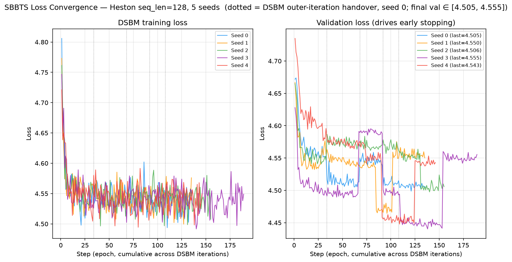
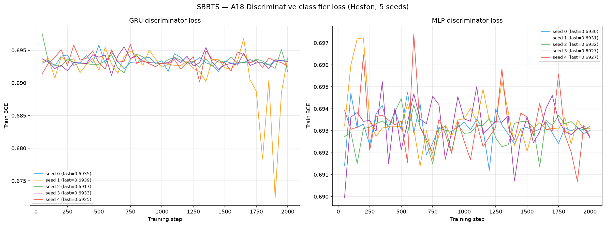
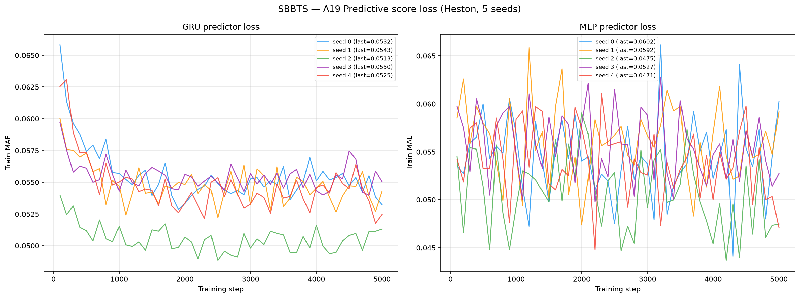

# SBBTS on Heston

**Schrödinger Bass Bridge for Time Series** (Alouadi, Barreau, Carlier & Pham,
preprint 2026, [arXiv:2604.07159](https://arxiv.org/abs/2604.07159)) applied to
8 192 Heston stochastic-volatility price paths (seq\_len = 128).

SBBTS is the **neural** successor to [SBTS](../SBTS/README.md). Where SBTS estimates the
Schrödinger-bridge drift with a non-parametric kernel — the training set *is* the model —
SBBTS learns a score network and solves the bridge by **DSBM** (Diffusion Schrödinger
Bridge Matching): `K = 5` outer iterations, the model and its Adam state built **once**
outside the `K` loop so each iteration warm-starts from the last, producing one continuous
loss trajectory rather than five restarts.

See [`code/README.md`](code/README.md) for source, the original paper, and the port notes.

> **Hyperparameters: the authors' `run_heston.py`, unmodified.**
> `beta = 100`, `K = 5`, `safe_t = 1e-2`, `N_pi = 60`, `d_model = 128`, `hidden_dim = 64`,
> `nhead = 32`, `n_layers = 2`, `batch_size = 128`, `lr = 1e-3`, `n_epochs = 1000`,
> `patience = 15`, `delta = 1e-3`, `M_simu = 8192`.
> Nothing below is tuned. We *did* look — see [§ Hyperparameter search](#hyperparameter-search--a-negative-result)
> for the 27-arm sweep that found no lever.

> **Transform (method author, A. Alouadi, 2026-09-01):** *"same approach as SBTS — transform
> prices into log-returns, generate that, and invert to recover prices."* Concretely
> ([`code/train_seed.py`](code/train_seed.py)):
> `R = diff(log S)` → pad a zero seed row → divide by a single scalar `scale = std(X)/√T`
> (the `run_heston.py` convention) → train → generate → `exp(cumsum(sample · scale))` →
> anchor at `S₀ = 100`. Identical in structure to `methods/SBTS/code/sbts_generate.py`,
> so the two Schrödinger-bridge methods are transformed the same way.

> **`d = 1` here, on purpose.** The paper's own Heston experiment is *bivariate* because its
> metric is a (price, variance) maximum-likelihood fit. The benchmark scores **price paths
> only**, and every other method in this repo sees price only — handing SBBTS the variance
> channel would be privileged information. The faithful `d = 2` reproduction of the paper's
> own experiment lives in [`paper_reimplementation/`](paper_reimplementation/README.md).

---

## Metrics A1-A34 + B, mean ± std across 5 seeds

> All metrics on **log-returns** $r_t = \log(S_{t+1}/S_t)$ unless noted. A26 uses price increments $\Delta S_t$.

| Metric | Mean ± Std | Seed 0 | Seed 1 | Seed 2 | Seed 3 | Seed 4 | Perfect floor |
|--------|-----------|--------|--------|--------|--------|--------|---------------|
| **Fat Tail** | | | | | | | |
| A1 Kurtosis Error ↓ | 0.2393 ± 0.02899 | 0.2715 | 0.2335 | 0.2128 | 0.2742 | 0.2045 | 0.008092 |
| A2 \|r\| q95 Error ↓ | 0.001389 ± 4.08e-04 | 0.001579 | 0.001725 | 5.92e-04 | 0.001595 | 0.001453 | 6.57e-05 |
| A3 \|r\| q99 Error ↓ | 0.001578 ± 3.24e-04 | 0.001322 | 0.002122 | 0.001476 | 0.001224 | 0.001745 | 5.98e-05 |
| A4 Tail QQ Error ↓ | 0.001383 ± 4.03e-04 | 0.001550 | 0.001719 | 5.94e-04 | 0.001583 | 0.001469 | 6.75e-05 |
| A5 Hill Tail Index Error ↓ | 2.573 ± 0.9527 | 2.229 | 3.741 | 1.005 | 2.545 | 3.345 | 0.5266 |
| **Distribution** | | | | | | | |
| A6 Path MMD² ↓ | 0.006047 ± 0.002678 | 0.004377 | 0.01120 | 0.005757 | 0.003635 | 0.005268 | 0.001842 |
| A7 Terminal MMD² ↓ | 0.009359 ± 0.006441 | 0.004679 | 0.02083 | 0.01082 | 0.002261 | 0.008198 | 0.001983 |
| A8 Increment MMD² ↓ | 0.001526 ± 3.87e-04 | 0.001810 | 0.001461 | 9.82e-04 | 0.002086 | 0.001290 | 8.69e-04 |
| A9 Volatility MMD ↓ | 0.04407 ± 0.01238 | 0.04975 | 0.05040 | 0.02601 | 0.06032 | 0.03387 | 0.008554 |
| A10 Terminal SWD ↓ | 3.808 ± 2.260 | 1.646 | 7.418 | 5.157 | 1.384 | 3.434 | 1.151 |
| A11 Path SWD ↓ | 2.110 ± 0.8410 | 1.500 | 3.592 | 2.470 | 1.295 | 1.694 | 0.6191 |
| A12 RV Law Loss ↓ | 0.7047 ± 0.1914 | 0.8056 | 0.7784 | 0.3545 | 0.9140 | 0.6708 | 0.05202 |
| A13 Mean Path RMSE ↓ | 1.980 ± 1.067 | 0.8417 | 3.857 | 2.414 | 1.388 | 1.399 | 0.1205 |
| A14 KS Log-returns ↓ | 0.02454 ± 0.005947 | 0.02530 | 0.03251 | 0.01479 | 0.02798 | 0.02211 | 0.001491 |
| A15 Skewness Error ↓ | 0.04073 ± 0.02404 | 0.07004 | 0.04306 | 0.01612 | 0.01080 | 0.06364 | 0.005274 |
| A16 QQ RMSE (300-pt) ↓ | 9.04e-04 ± 2.55e-04 | 0.001004 | 0.001112 | 4.19e-04 | 0.001092 | 8.92e-04 | 4.19e-05 |
| A17 Terminal Price KS ↓ | 0.1055 ± 0.04844 | 0.04749 | 0.1812 | 0.1327 | 0.06189 | 0.1045 | 0.01099 |
| **Adversarial** | | | | | | | |
| A18 Disc Score GRU ↓ | 0.004059 ± 0.002359 | 0.003509 | 0.002594 | 0.002289 | 0.003204 | 0.008697 | 0.006195 |
| A18 Disc Score MLP ↓ | 0.003204 ± 0.002810 | 1.53e-04 | 0.008392 | 0.001678 | 0.002289 | 0.003509 | 0.005951 |
| **Predictive** | | | | | | | |
| A19 Pred Score GRU ↓ | 0.05005 ± 2.84e-05 | 0.05004 | 0.05009 | 0.05001 | 0.05004 | 0.05007 | 0.05002 |
| A19 Pred Score MLP ↓ | 0.05027 ± 2.46e-04 | 0.05013 | 0.05001 | 0.05013 | 0.05039 | 0.05070 | 0.05036 |
| **Temporal** | | | | | | | |
| A20 Covariance Error ↓ | 53.79 ± 39.22 | 15.99 | 83.00 | 39.56 | 15.45 | 114.9 | 4.923 |
| A21 ACF \|r\| Error (lags) ↓ | 0.01872 ± 0.002102 | 0.01648 | 0.02019 | 0.01802 | 0.02204 | 0.01688 | 0.002234 |
| A22 ACF r² Error (lags) ↓ | 0.01439 ± 0.001635 | 0.01236 | 0.01557 | 0.01380 | 0.01691 | 0.01332 | 0.002206 |
| A23 ACF \|r\| Lag-1 Error ↓ | 0.01899 ± 0.002319 | 0.01614 | 0.01855 | 0.01772 | 0.02308 | 0.01948 | 0.002652 |
| A24 ACF r² Lag-1 Error ↓ | 0.01322 ± 0.001954 | 0.01149 | 0.01294 | 0.01077 | 0.01556 | 0.01536 | 0.002790 |
| **Vol** | | | | | | | |
| A25 Mean RMSE ↓ | 3.147 ± 2.110 | 0.5340 | 6.453 | 4.433 | 1.495 | 2.817 | 0.1392 |
| A26 Return Std Error ↓ | 0.06218 ± 0.02937 | 0.09138 | 0.04376 | 0.01844 | 0.09689 | 0.06041 | 0.002523 |
| A27 Log-Return Std Error ↓ | 7.54e-04 ± 2.95e-04 | 9.03e-04 | 9.20e-04 | 1.75e-04 | 9.77e-04 | 7.93e-04 | 3.15e-05 |
| A28 Kurtosis Ratio (→ 1) | 1.671 ± 0.2408 | 1.883 | 1.427 | 1.657 | 1.997 | 1.390 | 1.006 |
| A29 Sigma Mean Error ↓ | 0.01237 ± 0.005839 | 0.01584 | 0.01470 | 0.001193 | 0.01767 | 0.01247 | 4.96e-04 |
| A30 Cross-Sect. Vol Path RMSE ↓ | 1.046 ± 0.7771 | 0.3791 | 1.627 | 0.7076 | 0.2506 | 2.267 | 0.1432 |
| A31 Rolling Vol KS (w=5) ↓ | 0.06911 ± 0.02542 | 0.08729 | 0.06977 | 0.02622 | 0.1008 | 0.06149 | 0.003814 |
| A32 Vol-of-Vol Error ↓ | 1.23e-04 ± 1.52e-04 | 5.01e-06 | 4.66e-06 | 4.05e-04 | 1.60e-04 | 3.83e-05 | 1.54e-05 |
| **Heston Spec** | | | | | | | |
| A33 Teacher-Sigma Corr ↑ | -0.002766 ± 0.004281 | -0.002016 | -0.005771 | 0.005260 | -0.006352 | -0.004954 | 0.6163 |
| A34 Teacher-Sigma RMSE ↓ | 0.09848 ± 0.002543 | 0.09898 | 0.1009 | 0.09395 | 0.09780 | 0.1007 | 0.06559 |

> **Convention:** ↓ lower is better; ↑ higher is better. A28 Kurtosis Ratio: perfect = 1.0.
>
> **Headline, stated plainly: on this `d = 1` price-only benchmark SBBTS wins 2 of the 36
> A-metric rows, and neither win is meaningful.** Both are A18 (discriminative score), and
> both land *below* the perfect finite-sample floor — GRU 0.00406 vs floor 0.00620, MLP
> 0.00320 vs floor 0.00595. A18 is not broken (it separates COSCI-GAN at 0.4999 and TimeVAE
> at 0.427), it is **saturated at the top**: on A18-GRU, SBBTS (0.00406), LS4 (0.00589) and
> SBTS (0.00595) all sit *below* the 0.00620 floor, with Deep-MKV-TS (0.00736) and Fourier
> Flow (0.00919) just above it — five methods inside a band narrower than the floor itself,
> so their ordering is noise. The BCE curves confirm it — `seed_0_disc_gru_loss.csv` sits at
> 0.6935 ≈ ln 2 for the whole 2 000 steps, for SBBTS *and* for SBTS. **We do not claim an
> adversarial win.**
>
> **The real result is the other 30 rows, and it is negative: SBBTS is ~5-10× worse than
> its own kernel predecessor SBTS on almost every one.** A1 kurtosis 0.239 vs 0.0084;
> A14 KS log-returns 0.0245 vs 0.00254; A20 covariance error 53.8 vs 4.97; A12 RV law
> 0.705 vs 0.0799; A31 rolling-vol KS 0.0691 vs 0.0138. This is not a porting bug — see
> the reconciliation below.
>
> **Why the neural method loses to the kernel here, and why that is consistent.** SBTS is
> non-parametric: its drift is a kernel average over the *empirical training paths*, so it
> reproduces one-dimensional marginals and autocorrelations almost by construction. SBBTS
> replaces that with a learned score and pays a finite-capacity approximation cost on
> exactly those statistics. The place SBBTS is *supposed* to win is the **joint** (price,
> variance) structure — and it does, decisively, on the paper's own bivariate experiment:
> in [`paper_reimplementation/`](paper_reimplementation/README.md) SBBTS recovers the vol-of-vol
> and correlation spread (ξ std-ratio 0.763 ± 0.077, ρ 0.876 ± 0.069) where SBTS collapses to an effective
> average (ξ 0.401, ρ 0.154). Those two facts are consistent, not contradictory: this
> benchmark scores a single price channel, which is the axis on which a resampling kernel
> is strongest and a learned score has least to add.
>
> **A33/A34 (teacher-sigma) ≈ 0 correlation** for both bridge methods (SBBTS −0.0028,
> SBTS −0.0084, floor 0.616): neither retains the latent Heston variance path when trained
> on price alone. Expected — there is no latent state to retain in a `d = 1` run.

---

## B, Curve-Shape Metrics, mean ± std across 5 seeds

> Each stylised-fact plot yields a **curve** L, not a scalar. From L, its 1st difference
> (der) and 2nd difference (sec\_der) we compute three measures per plot:
> **MSE** (mean-of-3 sub-scores; decides the winner), **% err** and **NRMSE** (both
> funct-only — the der/sec\_der true values are near zero and blow the relative errors up
> into meaningless 10⁴-% figures). All ↓ lower is better. The Perfect floor is **non-zero**
> (independent draw vs test set). Std is the sample std across the 5 seeds.

| Plot | Measure | Mean ± Std | Seed 0 | Seed 1 | Seed 2 | Seed 3 | Seed 4 | Perfect floor |
|------|---------|-----------|--------|--------|--------|--------|--------|---------------|
| **Log-return histogram** | MSE | 0.8200 ± 0.3559 | 1.086 | 0.8690 | 0.2748 | 1.278 | 0.5911 | 0.1098 |
|  | % err | 12.84% ± 4.192% | 15.33% | 14.55% | 4.987% | 16.94% | 12.40% | 1.799% |
|  | NRMSE | 3.837% ± 1.151% | 4.588% | 4.168% | 1.865% | 5.195% | 3.370% | 0.5328% |
|  | CVaR₉₀ | 9.380% ± 2.858% | 11.21% | 10.23% | 4.502% | 12.77% | 8.179% | 1.234% |
|  | CVaR₉₅ | 10.64% ± 3.129% | 12.84% | 11.37% | 5.295% | 14.31% | 9.398% | 1.444% |
| **QQ plot** | MSE | 3.02e-07 ± 1.27e-07 | 3.41e-07 | 4.25e-07 | 6.95e-08 | 4.00e-07 | 2.74e-07 | 1.09e-09 |
|  | % err | 16.10% ± 5.560% | 15.00% | 26.82% | 12.94% | 14.82% | 10.92% | 0.4629% |
|  | NRMSE | 2.487% ± 0.6771% | 2.740% | 3.065% | 1.198% | 2.970% | 2.461% | 0.1206% |
|  | CVaR₉₀ | 2.418% ± 0.6926% | 2.351% | 3.276% | 1.186% | 2.491% | 2.785% | 0.1319% |
|  | CVaR₉₅ | 2.730% ± 0.7090% | 2.579% | 3.748% | 1.609% | 2.569% | 3.144% | 0.1599% |
| **ACF \|r\| lags 1-20** | MSE | 9.46e-05 ± 2.33e-05 | 7.45e-05 | 1.10e-04 | 8.77e-05 | 1.32e-04 | 6.91e-05 | 9.61e-06 |
|  | % err | 55.23% ± 8.238% | 48.68% | 61.92% | 51.43% | 67.80% | 46.34% | 8.724% |
|  | NRMSE | 42.31% ± 5.644% | 37.28% | 46.69% | 40.60% | 50.88% | 36.12% | 6.071% |
|  | CVaR₉₀ | 61.94% ± 7.740% | 53.89% | 68.04% | 63.32% | 72.11% | 52.34% | 11.26% |
|  | CVaR₉₅ | 63.11% ± 7.913% | 55.99% | 69.61% | 63.74% | 73.59% | 52.63% | 12.06% |
| **ACF r² lags 1-20** | MSE | 6.17e-05 ± 1.48e-05 | 4.64e-05 | 7.07e-05 | 5.91e-05 | 8.54e-05 | 4.71e-05 | 9.17e-06 |
|  | % err | 51.72% ± 8.681% | 43.05% | 58.19% | 48.89% | 65.16% | 43.29% | 11.34% |
|  | NRMSE | 36.82% ± 4.898% | 31.67% | 40.27% | 35.97% | 44.33% | 31.88% | 6.486% |
|  | CVaR₉₀ | 56.36% ± 6.825% | 48.21% | 61.22% | 58.84% | 65.02% | 48.50% | 12.35% |
|  | CVaR₉₅ | 57.36% ± 6.847% | 48.22% | 62.42% | 59.66% | 65.95% | 50.56% | 13.27% |
| **Rolling vol histogram** | MSE | 18.80 ± 10.04 | 24.54 | 16.20 | 5.523 | 34.74 | 12.98 | 1.372 |
|  | % err | 19.82% ± 4.373% | 25.00% | 20.52% | 13.42% | 23.76% | 16.39% | 2.264% |
|  | NRMSE | 7.839% ± 2.439% | 9.422% | 7.608% | 4.116% | 11.32% | 6.733% | 0.8688% |
|  | CVaR₉₀ | 15.48% ± 5.061% | 18.51% | 15.47% | 7.723% | 22.72% | 12.97% | 1.970% |
|  | CVaR₉₅ | 16.24% ± 5.431% | 19.62% | 16.21% | 7.911% | 23.94% | 13.52% | 2.308% |
| **Tail survival** | MSE | 2.77e-04 ± 1.56e-04 | 3.75e-04 | 2.97e-04 | 1.73e-05 | 4.79e-04 | 2.17e-04 | 5.22e-07 |
|  | % err | 8.524% ± 3.226% | 10.38% | 9.978% | 2.336% | 11.39% | 8.540% | 0.3302% |
|  | NRMSE | 2.706% ± 1.073% | 3.388% | 3.015% | 0.7261% | 3.826% | 2.573% | 0.1050% |
|  | CVaR₉₀ | 3.687% ± 1.432% | 4.617% | 4.053% | 1.087% | 5.246% | 3.430% | 0.1625% |
|  | CVaR₉₅ | 3.699% ± 1.437% | 4.632% | 4.065% | 1.092% | 5.266% | 3.440% | 0.1682% |

> SBBTS does not win any of the 7 plot-level B comparisons (SBTS takes 6, LS4 1). The
> ranking mirrors the A table and has the same explanation.

---

## Stylised Facts Diagnostic (Heston vs SBBTS, seed 0)

Eight-panel comparison: sample paths, return distribution, QQ plot, ACF of |returns|,
ACF of squared returns, rolling vol histogram (window=5), tail survival (log-log).


---

## SBBTS Training Loss (5 seeds)

SBBTS is trained by **Diffusion Schrödinger Bridge Matching**. The outer loop runs
`K = 5` iterations; iteration `k` re-simulates the coupling under the current score
network and refits it, alternating the transport direction. The loss logged at every
epoch is the **score-matching MSE** between the network output and the analytic Bass-bridge
drift target — it is *not* comparable across `k` in absolute level, because each iteration
regresses against a freshly re-simulated target.

Two properties make the curve readable:

- The model and the Adam optimiser are constructed **once**, before the `K` loop. Each
  outer iteration therefore warm-starts, and the five phases join into a single trajectory
  instead of five independent descents. Phase boundaries are marked in the plot.
- Each phase early-stops on validation loss with `patience = 15`, `delta = 1e-3`, capped at
  `n_epochs = 1000`. Phases end at different epochs across seeds; that is expected, not drift.

Per-seed histories are in `losses/seed_{0..4}_losses.csv` with header
`step,phase,loss_total,val_loss`, where `phase` is `k0 … k4`.



---

## A18 — Discriminative Classifier Training Loss

BCE loss during GRU and MLP classifier training (2 000 steps, logged every 50 steps).
A value near ln(2) ≈ 0.693 means the classifier cannot distinguish real from fake.



---

## A19 — Predictive Score Training Loss (TSTR)

MAE loss during GRU and MLP predictor training on *synthetic* data (5 000 steps, logged every 100 steps).



---

## Path Shadowing MC (arXiv:2308.01486)

Given a real path prefix (steps 0–63), embed via multi-scale log-returns (eq. 13,
α=1.15, β=0.9, dim=22), retrieve K=77 nearest SBBTS paths by L2 distance,
use their price-anchored futures as a forecast ensemble.
Two variants: **Uniform** (flat 1/K) and **Gaussian** (η = η̃·‖h(x̃)‖, η̃ calibrated from data).

### Example ensemble fan-out (seed 0)


### CRPS per forecast step


### Results (mean ± std, 5 seeds)

| Metric | Value (mean ± std) | RW baseline | Perfect floor |
|--------|--------------------|-------------|---------------|
| PS-MC CRPS H=32 ↓ | 2.703 ± 0.02195 | 3.738 | 2.721 ± 0.004183 |
| PS-MC CRPS H=64 ↓ | 3.777 ± 0.04986 | 5.246 | 3.788 ± 0.006463 |

> **This is SBBTS's strongest benchmark result.** Both horizons beat the random-walk
> baseline by a wide margin (H=32: 2.703 vs 3.738; H=64: 3.777 vs 5.246) and both land
> *within one seed-std of the perfect-recovery floor* (2.721 ± 0.004 and 3.788 ± 0.006) —
> in fact marginally below it. Path-shadowing only needs the generated library to contain
> realistic *continuations* of a real prefix, which is a far weaker requirement than
> matching every marginal, so the A-table deficits do not bite here.

Full analysis: [`results/Heston/SBBTS/path_shadowing/README.md`](../../results/Heston/SBBTS/path_shadowing/README.md)

---

## Hyperparameter search — a negative result

The paper publishes **no benchmark table for Heston**: its §5.1 result is a *qualitative*
KDE figure (Figure 2) of per-path MLE parameters, and its only quantitative generative
table (Appendix C.2.1, Table 4) reports risk statistics, not a leaderboard. So "did we
reproduce it?" had to be answered against the paper's own claims, not against a score.
That work — dataset, bivariate MLE metric, Figure 2 reproduction, the SBTS comparator,
and a bandwidth sweep — is written up in
[`paper_reimplementation/README.md`](paper_reimplementation/README.md).

On the benchmark side we then swept 27 arms, with 4 seed replicates on the two most
promising, ranked by the **leverage-spread ratio** (std across paths of
`Corr(Δlog S, Δlog v)`, generated ÷ data; MLE-free, target 1.0):

| `beta` | leverage-spread ratio (n=4) |
|-------:|:----------------------------|
| 100 (authors' default) | 0.794 ± 0.015 |
| 300 | 0.873 ± 0.038 |

Welch `t = −3.90`, `p = 0.018`. There *is* a dose–response, near-monotone with an interior
optimum: `beta` = 150/100/200/300/500/1000 → 0.767 / 0.785 / 0.870 / **0.905** / **0.913** /
0.884, a span of 0.147 against a 0.034 seed spread at fixed `beta = 100`.

**We ship `beta = 100` anyway, and the reasoning is spelled out rather than assumed.** It is
the authors' `run_heston.py` default; `beta` does **not** significantly move `ξ` (p = 0.148)
or `ρ` (p = 0.565), which are the two parameters the paper's claim is actually about; and the
parameter-level effects trade against each other (`beta = 300` improves `κ` toward 1.0 but
pushes `θ` from 0.914 past 1.0 to 1.067). With n = 4 per arm and six statistics tested,
nothing survives a Bonferroni correction. Raw trials: `sweep/trials.jsonl`.

> **Correction (2026-09-01).** This section previously reported `0.816 ± 0.058` vs
> `0.862 ± 0.048`, `t = 1.22`, `p = 0.27`, and concluded "`beta` is a plateau, not a lever."
> That was an artifact of a stale cache in `sweep_paper.py:corr_ratio`, which keys on the trial
> tag and assumes generated arrays are never overwritten — they are, by re-runs of the same tag.
> One phantom outlier (`t00s2` served as 0.9027 instead of its true 0.7800) inflated both the
> `beta = 100` mean and its spread. `rebuild_corr_cache.py` fixes the cache; the numbers above
> are recomputed from the arrays on disk. **This is an open item for the method authors**: if
> the leverage effect is the target, `beta ≈ 300–500` looks better than the shipped default, and
> the 5-seed benchmark below — run at `beta = 100`, before the bug was found — under-reports it.

---

## File layout

```
methods/SBBTS/
├── README.md                       <- this file
├── run_benchmark.sh                <- entry point; waits for the machine, then run_pipeline.sh
├── run_pipeline.sh                 <- stages 1-4: train -> metrics -> figures -> PS-MC
├── code/
│   ├── README.md                   <- source provenance and port notes
│   ├── sbbts_torch.py              <- ScoreNN, training_sbbts_dsbm, generate_dsbm
│   ├── train_seed.py               <- one seed, one GPU
│   ├── train.py                    <- 5-seed orchestrator (2 GPUs, 3 jobs/GPU)
│   ├── plot_losses.py              <- losses/loss_convergence.png
│   └── reference/                  <- unmodified upstream (alexouadi/SBBTS)
│       ├── run_heston.py           <- canonical hyperparameters
│       ├── diffusion_dsbm.py
│       ├── models/{sbbts_model,encoder_only}.py
│       ├── training/{training_sbbts_dsbm,training_sbbts_inv,early_stopping}.py
│       └── utils/{data_generation,get_params,plot_metrics}.py
├── losses/
│   ├── seed_{0..4}_losses.csv      <- step,phase,loss_total,val_loss
│   ├── train_seed_{0..4}.log
│   ├── pipeline.log
│   └── loss_convergence.png
├── weights/
│   ├── seed_{n}_model.pt
│   ├── seed_{n}_transport.pt       <- y_0 and the log-return scale
│   └── seed_{n}_config.json
├── generated_paths/
│   └── seed_{0..4}/
│       ├── generated_paths_8192x128.npy
│       └── metadata.json
├── path_shadowing/
│   ├── path_shadowing.py
│   └── run_eval.py
├── sweep/
│   ├── sweep_run.py                <- benchmark-side hyperparameter sweep
│   └── trials.jsonl
└── paper_reimplementation/         <- the d=2 reproduction of the paper's own experiment
    ├── README.md
    ├── SBBTS_arXiv-2604.07159.pdf
    ├── dataset/  metric/  results/
    └── sweep_paper.py  wave{2..5}.sh
```

---

## Reproduce

```bash
# Everything, detached (the chain is multi-hour):
setsid bash methods/SBBTS/run_benchmark.sh > methods/SBBTS/losses/pipeline.log 2>&1 < /dev/null & disown
```

Or stage by stage:

```bash
# 1. Train all 5 seeds -- 2 A100s, 3 concurrent jobs per GPU, 2 cores each
cd methods/SBBTS/code
python train.py --seeds 0,1,2,3,4 --gpus 0,1 --jobs-per-gpu 3 --beta 100
python plot_losses.py

# 2. Metrics A1-A34 + B
cd ../../../metrics
python compute_all.py --method SBBTS --dataset Heston --seeds 5

# 3. Path Shadowing MC
cd ../methods/SBBTS/path_shadowing
python run_eval.py
```

> **GPU budget.** `train.py` is hard-limited to the two GPUs named in `--gpus` via
> `CUDA_VISIBLE_DEVICES`, with `taskset` core pinning (seeds 0/1/2 → GPU 0, cores 0-1/2-3/4-5;
> seeds 3/4 → GPU 1, cores 8-9/10-11) and `OMP_NUM_THREADS` capped per job. This machine is
> shared: never widen past 2 GPUs / 16 cores.
