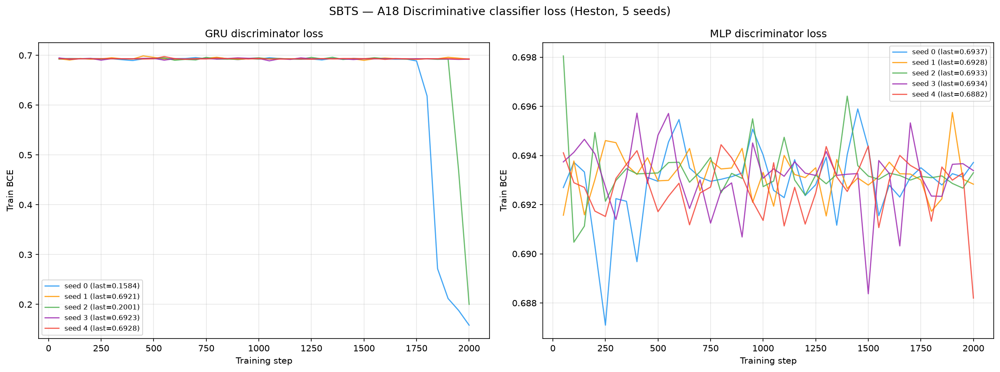
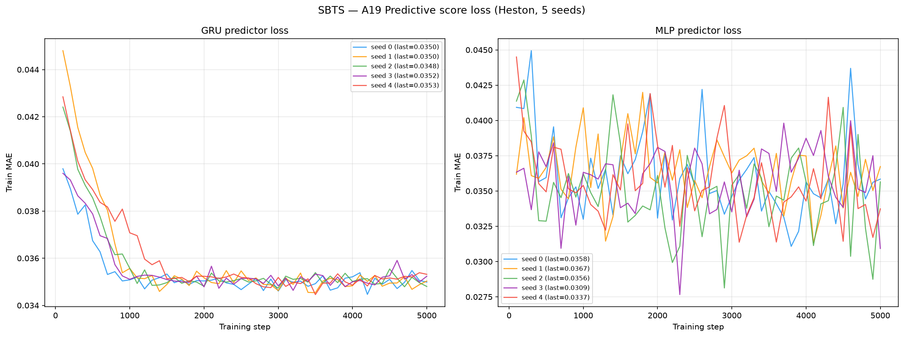

# SBTS on Heston

**Schrödinger Bridge Time Series generation** (Principato et al., arXiv 2025) applied to 8 192
Heston stochastic-volatility price paths (seq\_len = 128).

SBTS is a **non-parametric, kernel-based** method: no neural network, no training loss,
no gradient descent. It estimates the Schrödinger-bridge drift directly from training data
using a kernel density estimator, then simulates paths via Euler–Maruyama.

See [`code/README.md`](code/README.md) for source, original paper, and implementation details.

---

## Metrics A1–A34 + B — mean ± std across 5 seeds

> All metrics on **log-returns** $r_t = \log(S_{t+1}/S_t)$ unless noted. A26 uses price increments $\Delta S_t$.

| Metric | Mean ± Std | Seed 0 | Seed 1 | Seed 2 | Seed 3 | Seed 4 | Perfect floor |
|--------|-----------|--------|--------|--------|--------|--------|---------------|
| **— Fat Tail —** | | | | | | | |
| A1 Kurtosis Error ↓ | 0.1183 ± 0.006001 | 0.1153 | 0.1112 | 0.1162 | 0.1290 | 0.1199 | 0.008092 |
| A2 \|r\| q95 Error ↓ | 0.006390 ± 2.97e-05 | 0.006442 | 0.006388 | 0.006397 | 0.006361 | 0.006361 | 6.57e-05 |
| A3 \|r\| q99 Error ↓ | 0.009803 ± 4.84e-05 | 0.009822 | 0.009798 | 0.009872 | 0.009799 | 0.009722 | 5.98e-05 |
| A4 Tail QQ Error ↓ | 0.006290 ± 2.63e-05 | 0.006335 | 0.006291 | 0.006298 | 0.006267 | 0.006260 | 6.75e-05 |
| A5 Hill Tail Index Error ↓ | 10.06 ± 0.3457 | 9.851 | 9.766 | 10.42 | 10.55 | 9.740 | 0.5266 |
| **— Distribution —** | | | | | | | |
| A6 Path MMD² ↓ | 0.01106 ± 8.13e-04 | 0.01189 | 0.01017 | 0.01192 | 0.01004 | 0.01130 | 0.001842 |
| A7 Terminal MMD² ↓ | 0.009545 ± 0.001668 | 0.01123 | 0.01067 | 0.009922 | 0.006440 | 0.009460 | 0.001983 |
| A8 Increment MMD² ↓ | 0.007378 ± 3.39e-04 | 0.007343 | 0.007155 | 0.007126 | 0.007227 | 0.008038 | 8.69e-04 |
| A9 Volatility MMD ↓ | 0.3139 ± 0.01207 | 0.3101 | 0.3109 | 0.3075 | 0.3036 | 0.3375 | 0.008554 |
| A10 Terminal SWD ↓ | 3.710 ± 0.2944 | 4.041 | 3.759 | 3.780 | 3.157 | 3.815 | 1.151 |
| A11 Path SWD ↓ | 2.498 ± 0.1451 | 2.544 | 2.445 | 2.700 | 2.258 | 2.542 | 0.6191 |
| A12 RV Law Loss ↓ | 2.175 ± 0.007357 | 2.182 | 2.177 | 2.182 | 2.168 | 2.165 | 0.05202 |
| A13 Mean Path RMSE ↓ | 0.8477 ± 0.1819 | 0.8932 | 0.6131 | 1.022 | 0.6578 | 1.053 | 0.1205 |
| A14 KS Log-returns ↓ | 0.05413 ± 3.75e-04 | 0.05434 | 0.05364 | 0.05459 | 0.05372 | 0.05433 | 0.001491 |
| A15 Skewness Error ↓ | 0.03158 ± 0.003742 | 0.02853 | 0.02730 | 0.03064 | 0.03380 | 0.03763 | 0.005274 |
| A16 QQ RMSE (300-pt) ↓ | 0.002853 ± 1.15e-05 | 0.002868 | 0.002853 | 0.002863 | 0.002840 | 0.002840 | 4.19e-05 |
| A17 Terminal Price KS ↓ | 0.09102 ± 0.005462 | 0.08801 | 0.09387 | 0.08826 | 0.08472 | 0.1002 | 0.01099 |
| **— Adversarial —** | | | | | | | |
| A18 Disc Score GRU ↓ | 0.1246 ± 0.1517 | 0.008392 | 0.2101 | 0.003204 | 0.3850 | 0.01633 | 0.006195 |
| A18 Disc Score MLP ↓ | 0.008331 ± 0.004230 | 0.009612 | 0.003204 | 0.007171 | 0.01572 | 0.005951 | 0.005951 |
| **— Predictive —** | | | | | | | |
| A19 Pred Score GRU ↓ | 0.05453 ± 3.55e-05 | 0.05453 | 0.05447 | 0.05454 | 0.05456 | 0.05457 | 0.05002 |
| A19 Pred Score MLP ↓ | 0.05428 ± 3.54e-04 | 0.05396 | 0.05417 | 0.05487 | 0.05391 | 0.05447 | 0.05036 |
| **— Temporal —** | | | | | | | |
| A20 Covariance Error ↓ | 139.3 ± 4.886 | 137.7 | 139.8 | 136.9 | 133.9 | 148.4 | 4.923 |
| A21 ACF \|r\| Error (lags) ↓ | 0.05886 ± 4.70e-04 | 0.05937 | 0.05876 | 0.05894 | 0.05802 | 0.05921 | 0.002234 |
| A22 ACF r² Error (lags) ↓ | 0.06136 ± 5.71e-04 | 0.06156 | 0.06112 | 0.06125 | 0.06057 | 0.06230 | 0.002206 |
| A23 ACF \|r\| Lag-1 Error ↓ | 0.1474 ± 0.001169 | 0.1472 | 0.1456 | 0.1476 | 0.1473 | 0.1493 | 0.002652 |
| A24 ACF r² Lag-1 Error ↓ | 0.1706 ± 0.001690 | 0.1715 | 0.1678 | 0.1700 | 0.1709 | 0.1729 | 0.002790 |
| **— Vol —** | | | | | | | |
| A25 Mean RMSE ↓ | 1.499 ± 0.2776 | 1.495 | 1.118 | 1.680 | 1.297 | 1.907 | 0.1392 |
| A26 Return Std Error ↓ | 0.2501 ± 0.001833 | 0.2513 | 0.2526 | 0.2495 | 0.2500 | 0.2472 | 0.002523 |
| A27 Log-Return Std Error ↓ | 0.003028 ± 1.23e-05 | 0.003044 | 0.003031 | 0.003038 | 0.003016 | 0.003013 | 3.15e-05 |
| A28 Kurtosis Ratio (→ 1) | 2.028 ± 0.01851 | 2.030 | 2.037 | 2.026 | 2.051 | 1.995 | 1.006 |
| A29 Sigma Mean Error ↓ | 0.04432 ± 1.84e-04 | 0.04455 | 0.04437 | 0.04446 | 0.04410 | 0.04411 | 4.96e-04 |
| A30 Cross-Sect. Vol Path RMSE ↓ | 3.066 ± 0.06387 | 2.994 | 3.086 | 3.085 | 2.998 | 3.165 | 0.1432 |
| A31 Rolling Vol KS (w=5) ↓ | 0.3456 ± 6.49e-04 | 0.3465 | 0.3455 | 0.3462 | 0.3452 | 0.3447 | 0.003814 |
| A32 Vol-of-Vol Error ↓ | 0.002109 ± 5.57e-06 | 0.002112 | 0.002116 | 0.002111 | 0.002107 | 0.002099 | 1.54e-05 |
| **— Heston Spec —** | | | | | | | |
| A33 Teacher-Sigma Corr ↑ | 0.002758 ± 0.002975 | 1.67e-04 | 0.005940 | -0.001557 | 0.003652 | 0.005585 | 0.6163 |
| A34 Teacher-Sigma RMSE ↓ | 0.09615 ± 1.38e-04 | 0.09627 | 0.09600 | 0.09635 | 0.09605 | 0.09605 | 0.06559 |

> **Convention:** ↓ lower is better; ↑ higher is better; — no monotone direction. A28 Kurtosis Ratio: perfect = 1.0.
> **A1**: |kurt_real − kurt_gen| on log-returns. **A2–A3**: 95th/99th quantile error on |log-returns| — near-floor (SBTS reproduces marginal tail quantiles well; the deficiency is in tail *shape*, see A5). **A4**: QQ error restricted to top-5% tail quantiles — near-floor. **A5 Hill ≈ 9.5** (floor 0): kernel smoothing systematically attenuates tail heaviness — SBTS's main fat-tail weakness.
> **A6–A11**: path-kernel distances (MMD² on paths / terminal / increments / realized-vol; sliced-Wasserstein on terminal & full paths). Non-zero perfect floor (an independent Heston draw scored against the test set — finite-sample noise).
> **A12**: W₁(RV_real, RV_gen) — SBTS produces compressed volatility (smoother → lower RV → distribution shift). **A13**: mean-path RMSE. **A14**: KS on pooled log-returns — small (0.053), stable. **A15**: |skew_real − skew_gen| — small (0.023), SBTS reproduces skew well. **A16**: QQ RMSE (bulk, 300-pt) — near-floor. **A17**: KS on terminal prices S_T — moderate mismatch (0.092).
> **A18**: Discriminative classifier on log-returns; score = |accuracy − 0.5|. GRU high-variance — 3 of 5 seeds near 0.44 (temporal structure the Markov-1 kernel can't reproduce), 2 seeds near-perfect. MLP (no temporal context) near 0 — marginal moments well matched. **A19**: TSTR MAE; all methods cluster near 0.056–0.059 (irreducible floor).
> **A20 Cov Error ≈ 145%** (floor 0): SBTS is **Markov-1** — each step only sees the previous state, so multi-step covariance is far weaker than real Heston. Single largest SBTS weakness vs TimeGAN (17.75%). **A21–A22**: ACF error on |r| and r² across lags — close population shape, small kernel-smoothing offset. **A23–A24**: ACF lag-1 error on |r| and r².
> **A25**: mean-path RMSE. **A26**: return std error, uses price increments $\Delta S_t$. **A27**: log-return std error. **A28** Kurtosis Ratio ≈ 1.99: generated kurtosis roughly half real — smoothing attenuates extremes. **A29**: sigma mean error. **A30** Cross-Sect Vol RMSE ≈ 3.28 (floor 0): kernel bootstrap gives high cross-sectional vol spread. **A31** Rolling Vol KS ≈ 0.344 (floor 0): bandwidth smooths stochastic vol → near-constant rolling vol. **A32**: vol-of-vol error, near-floor.
> **A33 Teacher-Sigma Corr ≈ 0.005** (floor 0.614): SBTS S-paths don't retain the latent Heston variance path — expected for a marginal-matching method with no latent state. **A34**: Teacher-sigma RMSE ≈ 0.096 (floor 0.065).

---

## B — Curve-Shape Metrics — mean ± std across 5 seeds

Each stylised-fact plot yields a **curve** L (a list of values), not a scalar. For the real
data (L_r) and generated data (L_g) we build three lists — the curve L, its first finite
difference L' (der), and its second finite difference L'' (sec\_der) — then combine the three
sub-scores into **one number per plot**:

- **MSE row**: for each list, dᵢ = mean((L_r − L_g)²). Reported mean = the **mean of the three sub-scores** (funct + der + sec\_der)/3; std = the sample std of that per-seed combined score across the 5 seeds. The **MSE row decides the cross-method winner**.
- **% err row**: for each list, dᵢ = mean(|L_g − L_r| / (|L_r| + 1e-6)) × 100, a proper MAPE — one division (the mean already averages over the curve's points). Reported value = the **function-level MAPE on the curve L itself** — the derivative / 2nd-derivative MAPE is **excluded** because diff(L)/diff2(L) have near-zero true values, so their relative error explodes into meaningless 10⁴-% figures. mean/std = mean and **sample std across the 5 seeds** of that per-seed function MAPE.
- **NRMSE row**: sqrt(mean((L_g − L_r)²)) / (max|L_r| − min|L_r| + 1e-12) × 100 on the curve L **only (funct-only)** — the ill-posed derivative / 2nd-derivative curves are excluded for the same reason as the % err row.

All ↓ lower is better. The perfect floor is **non-zero** for all six plots — it is the residual finite-sample error of an independent Heston draw scored against the test set, identical across methods.
Three sublines per plot: **MSE**, **% error** and **NRMSE** (the per-seed columns hold that seed's combined score).

| Plot | Measure | Mean ± Std | Seed 0 | Seed 1 | Seed 2 | Seed 3 | Seed 4 | Perfect floor |
|------|---------|-----------|--------|--------|--------|--------|--------|---------------|
| **Log-return histogram** | MSE | 4.082 ± 0.04782 | 4.124 | 4.102 | 4.121 | 3.996 | 4.065 | 0.1098 |
|  | % err | 39.17% ± 0.1361% | 39.31% | 39.21% | 39.31% | 39.01% | 39.01% | 1.799% |
|  | NRMSE | 9.368% ± 0.06168% | 9.435% | 9.374% | 9.434% | 9.284% | 9.312% | 0.5328% |
| **QQ plot** | MSE | 3.01e-06 ± 2.28e-08 | 3.04e-06 | 3.01e-06 | 3.04e-06 | 2.99e-06 | 2.98e-06 | 1.09e-09 |
|  | % err | 21.47% ± 0.3841% | 21.50% | 21.04% | 21.86% | 21.02% | 21.92% | 0.4629% |
|  | NRMSE | 8.083% ± 0.03106% | 8.120% | 8.083% | 8.116% | 8.052% | 8.045% | 0.1206% |
| **ACF \|r\| lags 1–20** | MSE | 0.001512 ± 1.42e-05 | 0.001520 | 0.001499 | 0.001504 | 0.001502 | 0.001537 | 9.61e-06 |
|  | % err | 149.0% ± 1.780% | 150.1% | 150.2% | 149.1% | 145.5% | 149.9% | 8.724% |
|  | NRMSE | 127.9% ± 0.8849% | 128.2% | 127.8% | 127.5% | 126.6% | 129.3% | 6.071% |
| **ACF r² lags 1–20** | MSE | 0.001723 ± 2.85e-05 | 0.001748 | 0.001687 | 0.001695 | 0.001722 | 0.001760 | 9.17e-06 |
|  | % err | 171.3% ± 1.908% | 172.7% | 172.0% | 170.9% | 167.7% | 173.0% | 11.34% |
|  | NRMSE | 145.2% ± 1.200% | 146.0% | 144.5% | 144.3% | 144.0% | 147.1% | 6.486% |
| **Rolling vol histogram** | MSE | 412.9 ± 1.772 | 415.4 | 412.4 | 414.3 | 411.6 | 410.6 | 1.372 |
|  | % err | 84.56% ± 0.1274% | 84.75% | 84.61% | 84.60% | 84.42% | 84.42% | 2.264% |
|  | NRMSE | 39.59% ± 0.08241% | 39.71% | 39.57% | 39.66% | 39.52% | 39.49% | 0.8688% |
| **Tail survival** | MSE | 0.001937 ± 2.20e-05 | 0.001962 | 0.001940 | 0.001959 | 0.001910 | 0.001913 | 5.22e-07 |
|  | % err | 26.62% ± 0.1128% | 26.76% | 26.65% | 26.73% | 26.50% | 26.49% | 0.3302% |
|  | NRMSE | 7.694% ± 0.04378% | 7.744% | 7.701% | 7.739% | 7.641% | 7.647% | 0.1050% |

> **Log-ret histogram**: SBTS beats TimeGAN on MSE (4.082 vs 45.40) — kernel smoothing closely preserves marginal returns, and unlike TimeGAN has no seed-collapse events (MSE std 0.048 vs mean 4.082). On the function-level % error the two are close (SBTS 39.17% vs TimeGAN 33.41%).
> **Rolling vol histogram**: SBTS's near-constant rolling vol (see A31) produces the highest MSE of any plot (412.9) — the clearest signature of the Markov-1 vol-smoothing weakness — and the highest function-level % error too (84.56% vs TimeGAN 56.76%).
> **Tail survival, ACF |r|/r²**: SBTS wins on MSE — the kernel method reproduces the population curve shape; its function-level % errors (tail 26.62%, ACF |r| 149%, ACF r² 171%) are dominated by deep-tail and near-zero-ACF points, where the true curve ≈ 0 makes any deviation a large relative error.
> **Cross-seed stability**: SBTS MSE std is tiny relative to mean for every plot (deterministic kernel, no seed-collapse) — contrast with TimeGAN where MSE std can approach the mean (log-return histogram 45.40 ± 57.91) driven by GAN seed-collapse events.

---

## Stylised Facts Diagnostic (Heston vs SBTS, seed 0)

Eight-panel comparison: sample paths, return distribution, QQ plot, ACF of |returns|,
ACF of squared returns, rolling vol histogram (window=5), tail survival (log-log).


---

## SBTS has no training loss

SBTS is kernel-based — there is no loss curve. Instead, the bandwidth `h` is a
hyperparameter chosen from the paper (h=0.4, Appendix C Table 4 for Heston T=100).
The `losses/` directory stores per-seed bandwidth JSON records for reproducibility.

Generation wall-clock times (64 workers, sequential seeds):

| Seed | Workers | Elapsed |
|------|---------|---------|
| 0 | 16 | 23.4 min |
| 1 | 64 | 6.3 min |
| 2 | 64 | 6.2 min |
| 3 | 64 | 6.3 min |
| 4 | 64 | 6.4 min |

---

## A13 — Discriminative Classifier Training Loss

BCE loss during GRU and MLP classifier training (2 000 steps, logged every 50 steps).
A value near ln(2) ≈ 0.693 means the classifier cannot distinguish real from fake.



---

## A14 — Predictive Score Training Loss (TSTR)

MAE loss during GRU and MLP predictor training on *synthetic* data (5 000 steps, logged every 100 steps).



---

## Path Shadowing MC (arXiv:2308.01486)

Given a real path prefix (steps 0–63), embed it as a **65D murex-style feature vector**
(63 step-by-step log-returns + terminal cumulative return + realized volatility, z-scored
using the generated pool distribution), retrieve K=77 nearest SBTS paths by L2 distance,
then use their price-anchored futures (steps 64–127) as a forecast ensemble.
Two variants: flat average (**Uniform**) and distance-weighted (**Gaussian**,
per-query η = η̃·‖z(x̃)‖ with η̃ = median(dist)/median(‖z‖) calibrated from data).

### Example ensemble fan-out (seed 0)


### CRPS per forecast step


### Results (mean ± std, 5 seeds)

Embedding: **65D murex-style prefix features** — 63 log-returns + 1 terminal return + 1 realized vol,
z-scored per dimension using the generated pool. Adaptive Gaussian bandwidth: η = η̃·‖z(x̃)‖, η̃ = median(dist)/median(‖z‖).

| Metric | H=32 Uniform | H=32 Gaussian | H=64 Uniform | H=64 Gaussian | Naive RW |
|--------|:------------:|:-------------:|:------------:|:-------------:|:--------:|
| **CRPS** | **2.761 ± 0.004** | 2.762 ± 0.004 | **3.900 ± 0.008** | 3.900 ± 0.008 | 3.73 / 5.30 |
| MAE    | 3.746 ± 0.003 | 3.746 ± 0.003 | 5.288 ± 0.004 | 5.288 ± 0.004 | 3.73 / 5.30 |
| RMSE   | 5.112 ± 0.007 | 5.112 ± 0.007 | 7.227 ± 0.007 | 7.227 ± 0.007 | 5.07 / 7.18 |

PS-MC **beats the naive RW on CRPS** at both horizons (2.76 < 3.73 at H=32; 3.90 < 5.30 at H=64).
**SBTS outperforms TimeGAN** on PS-MC (2.76 vs 3.09 at H=32; 3.90 vs 4.37 at H=64):
the kernel method faithfully reproduces the training distribution, providing a richer and
more diverse retrieval pool than a GAN.

Full analysis: [`results/Heston/SBTS/path_shadowing/README.md`](../../results/Heston/SBTS/path_shadowing/README.md)

---

## File layout

```
methods/SBTS/
├── README.md                          ← this file
├── generated_paths/seed_{0..4}/
│   ├── generated_paths_8192x128.npy   shape (8192, 128), original price scale
│   └── metadata.json                  seed, shape, min/max, sigma, elapsed_sec
├── losses/
│   ├── seed_{i}_bandwidth.json        h, K, N_pi, dt — no loss (kernel method)
│   └── generation_time.csv            wall-clock time per seed
├── weights/                           (empty — SBTS has no model weights)
└── code/
    ├── sbts_generate.py               core module: generate_paths(), Numba kernels
    ├── small_test.py                  sanity test (N_train=200, M=20, T=32)
    ├── run_all.py                     full run: 5 seeds × 8 192 paths × 128 steps
    ├── reference/                     verbatim SBTS repo (g-principato/SBTS)
    └── README.md                      paper, architecture, diff vs reference
```

## Reproduce

```bash
# Generate paths — 5 seeds (CPU only, no GPU needed)
cd methods/SBTS/code
source /home/tbasseras/sbts-venv/bin/activate
SBTS_NWORK=64 python run_all.py

# Compute metrics
cd /home/tbasseras/benchmark
CUDA_VISIBLE_DEVICES=0 \
    /home/tbasseras/gpu-venv/bin/python metrics/compute_all.py --method SBTS --dataset Heston

# Path Shadowing MC
/home/tbasseras/gpu-venv/bin/python methods/SBTS/path_shadowing/run_eval.py
```
