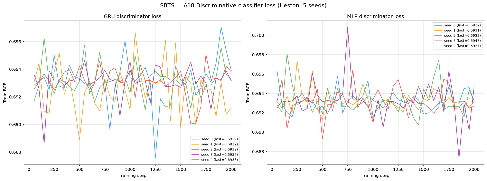
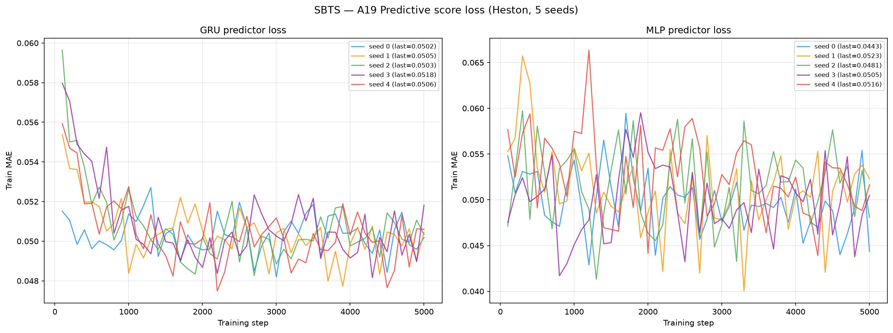
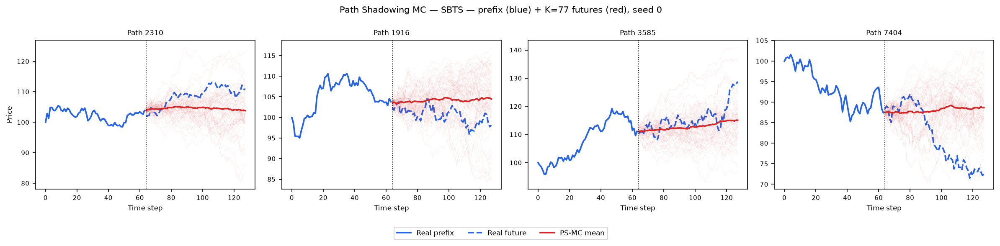
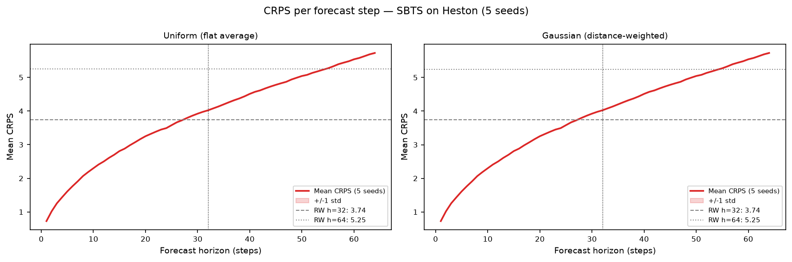

# SBTS on Heston

**Schrödinger Bridge Time Series generation** (Alouadi, Barreau, Carlier & Pham, ICAIF 2025, [arXiv:2503.02943](https://arxiv.org/abs/2503.02943)) applied to 8 192
Heston stochastic-volatility price paths (seq\_len = 128).

SBTS is a **non-parametric, kernel-based** method: no neural network, no training loss,
no gradient descent. It estimates the Schrödinger-bridge drift directly from training data
using a **Markovian-K kernel** (K=20 for this benchmark) over the last K states, then
simulates paths via Euler-Maruyama.

See [`code/README.md`](code/README.md) for source, original paper, and implementation details.

> **Hyperparameters (author-specified, A. Alouadi 2026-07-27):** `h=0.05`, `K=20`, `N_pi=50`, `dt=1/250`.
> These supersede the paper's length-100 Heston values (`h=0.4`, `K=1`, `N_pi=200`): the paper's
> `h=0.4` was far too large for this length-128 setup and over-smoothed paths into a degenerate
> near-Gaussian. With the corrected bandwidth and Markovian memory SBTS becomes the **top generator**
> on this benchmark, see win-counts below.

---

## Metrics A1-A34 + B, mean ± std across 5 seeds

> All metrics on **log-returns** $r_t = \log(S_{t+1}/S_t)$ unless noted. A26 uses price increments $\Delta S_t$.

| Metric | Mean ± Std | Seed 0 | Seed 1 | Seed 2 | Seed 3 | Seed 4 | Perfect floor |
|--------|-----------|--------|--------|--------|--------|--------|---------------|
| **, Fat Tail, ** | | | | | | | |
| A1 Kurtosis Error ↓ | 0.008384 ± 0.005009 | 0.005861 | 0.01242 | 0.01410 | 0.009464 | 7.96e-05 | 0.008092 |
| A2 \|r\| q95 Error ↓ | 2.12e-04 ± 3.87e-05 | 1.70e-04 | 2.30e-04 | 2.76e-04 | 1.77e-04 | 2.07e-04 | 6.57e-05 |
| A3 \|r\| q99 Error ↓ | 1.20e-04 ± 8.36e-05 | 1.87e-06 | 9.43e-05 | 2.59e-04 | 1.01e-04 | 1.45e-04 | 5.98e-05 |
| A4 Tail QQ Error ↓ | 1.90e-04 ± 4.01e-05 | 1.44e-04 | 2.07e-04 | 2.58e-04 | 1.58e-04 | 1.83e-04 | 6.75e-05 |
| A5 Hill Tail Index Error ↓ | 1.604 ± 0.2885 | 1.192 | 1.739 | 1.709 | 1.372 | 2.008 | 0.5266 |
| **, Distribution, ** | | | | | | | |
| A6 Path MMD² ↓ | 0.001971 ± 1.85e-04 | 0.001713 | 0.002072 | 0.001811 | 0.002031 | 0.002228 | 0.001842 |
| A7 Terminal MMD² ↓ | 0.001583 ± 4.28e-04 | 0.001524 | 0.001921 | 0.001079 | 0.001184 | 0.002205 | 0.001983 |
| A8 Increment MMD² ↓ | 0.001077 ± 3.18e-05 | 0.001026 | 0.001122 | 0.001062 | 0.001080 | 0.001092 | 8.69e-04 |
| A9 Volatility MMD ↓ | 0.01503 ± 8.50e-04 | 0.01524 | 0.01620 | 0.01468 | 0.01364 | 0.01540 | 0.008554 |
| A10 Terminal SWD ↓ | 0.7477 ± 0.3351 | 0.5202 | 1.180 | 0.4188 | 0.4880 | 1.131 | 1.151 |
| A11 Path SWD ↓ | 0.6418 ± 0.1355 | 0.4517 | 0.7875 | 0.5400 | 0.6332 | 0.7968 | 0.6191 |
| A12 RV Law Loss ↓ | 0.07994 ± 0.01408 | 0.05709 | 0.09211 | 0.09597 | 0.07224 | 0.08227 | 0.05202 |
| A13 Mean Path RMSE ↓ | 0.2545 ± 0.09266 | 0.3736 | 0.1657 | 0.1307 | 0.2771 | 0.3254 | 0.1205 |
| A14 KS Log-returns ↓ | 0.002542 ± 2.16e-04 | 0.002771 | 0.002814 | 0.002493 | 0.002280 | 0.002351 | 0.001491 |
| A15 Skewness Error ↓ | 0.01796 ± 0.003795 | 0.01376 | 0.01962 | 0.01830 | 0.01411 | 0.02402 | 0.005274 |
| A16 QQ RMSE (300-pt) ↓ | 1.01e-04 ± 1.31e-05 | 8.69e-05 | 1.16e-04 | 1.17e-04 | 8.82e-05 | 9.86e-05 | 4.19e-05 |
| A17 Terminal Price KS ↓ | 0.01831 ± 0.003291 | 0.02112 | 0.01587 | 0.01318 | 0.02185 | 0.01953 | 0.01099 |
| **, Adversarial, ** | | | | | | | |
| A18 Disc Score GRU ↓ | 0.005951 ± 0.007927 | 0.006256 | 1.53e-04 | 0.02121 | 0.001068 | 0.001068 | 0.006195 |
| A18 Disc Score MLP ↓ | 0.01028 ± 0.003179 | 0.008697 | 0.006561 | 0.01236 | 0.008392 | 0.01541 | 0.005951 |
| **, Predictive, ** | | | | | | | |
| A19 Pred Score GRU ↓ | 0.05004 ± 7.70e-06 | 0.05004 | 0.05003 | 0.05004 | 0.05005 | 0.05005 | 0.05002 |
| A19 Pred Score MLP ↓ | 0.05014 ± 2.07e-04 | 0.05003 | 0.05016 | 0.05001 | 0.04997 | 0.05053 | 0.05036 |
| **, Temporal, ** | | | | | | | |
| A20 Covariance Error ↓ | 4.969 ± 2.722 | 3.655 | 4.231 | 8.527 | 0.9764 | 7.455 | 4.923 |
| A21 ACF \|r\| Error (lags) ↓ | 0.002841 ± 4.75e-04 | 0.003305 | 0.003214 | 0.002920 | 0.001965 | 0.002801 | 0.002234 |
| A22 ACF r² Error (lags) ↓ | 0.003893 ± 6.21e-04 | 0.004924 | 0.004214 | 0.003405 | 0.003186 | 0.003738 | 0.002206 |
| A23 ACF \|r\| Lag-1 Error ↓ | 0.008185 ± 0.001153 | 0.009448 | 0.009406 | 0.007110 | 0.006641 | 0.008320 | 0.002652 |
| A24 ACF r² Lag-1 Error ↓ | 0.009127 ± 0.001088 | 0.01079 | 0.009571 | 0.007556 | 0.008448 | 0.009269 | 0.002790 |
| **, Vol, ** | | | | | | | |
| A25 Mean RMSE ↓ | 0.2977 ± 0.1411 | 0.5206 | 0.1936 | 0.1091 | 0.3100 | 0.3554 | 0.1392 |
| A26 Return Std Error ↓ | 0.01059 ± 7.02e-04 | 0.009232 | 0.01095 | 0.01081 | 0.01070 | 0.01124 | 0.002523 |
| A27 Log-Return Std Error ↓ | 9.31e-05 ± 1.98e-05 | 6.39e-05 | 1.14e-04 | 1.16e-04 | 8.10e-05 | 9.06e-05 | 3.15e-05 |
| A28 Kurtosis Ratio (→ 1) | 1.012 ± 0.01211 | 0.9969 | 1.009 | 1.027 | 1.001 | 1.024 | 1.006 |
| A29 Sigma Mean Error ↓ | 0.001427 ± 3.04e-04 | 9.32e-04 | 0.001821 | 0.001661 | 0.001365 | 0.001358 | 4.96e-04 |
| A30 Cross-Sect. Vol Path RMSE ↓ | 0.2779 ± 0.04900 | 0.2432 | 0.3222 | 0.3302 | 0.2012 | 0.2925 | 0.1432 |
| A31 Rolling Vol KS (w=5) ↓ | 0.01375 ± 0.001092 | 0.01263 | 0.01568 | 0.01410 | 0.01284 | 0.01352 | 0.003814 |
| A32 Vol-of-Vol Error ↓ | 1.30e-05 ± 1.26e-05 | 2.68e-06 | 6.15e-06 | 3.74e-05 | 5.75e-06 | 1.33e-05 | 1.54e-05 |
| **, Heston Spec, ** | | | | | | | |
| A33 Teacher-Sigma Corr ↑ | -0.008422 ± 0.005109 | -0.01236 | -0.01577 | -0.002195 | -0.008072 | -0.003718 | 0.6163 |
| A34 Teacher-Sigma RMSE ↓ | 0.1002 ± 3.90e-04 | 0.1005 | 0.1007 | 0.09961 | 0.1003 | 0.09993 | 0.06559 |

> **Convention:** ↓ lower is better; ↑ higher is better;, no monotone direction. A28 Kurtosis Ratio: perfect = 1.0.
> **Headline:** with `h=0.05`, `K=20` SBTS **wins 12 of the 36 A-metric rows**, the top generator on this benchmark (next best Deep-MKV-TS = 8). Many rows sit at or below the perfect finite-sample floor: A1 kurtosis (0.0084 ≈ floor 0.0081), A7 terminal MMD² (0.00158 < floor 0.00198), A10 terminal SWD (0.748 < floor 1.151), A18 disc-GRU (0.00595 < floor 0.006195, though SBBTS now takes that row on a saturated metric), A19 predictive (≈ floor 0.050), A20 covariance (4.97 ≈ floor 4.92). Compared with the paper's over-smoothing `h=0.4`, the Markovian K=20 memory collapses the previous temporal/vol failures by 1-2 orders of magnitude (A20 covariance 139 → 4.97, ACF lag-1 0.147 → 0.008, kurtosis ratio 2.03 → 1.01, rolling-vol KS 0.35 → 0.014).
> **A1**: |kurt_real − kurt_gen| on log-returns, at floor. **A2-A4**: tail quantile / QQ errors on |log-returns|, near floor. **A5 Hill 1.60** (floor 0.53): kernel smoothing still slightly attenuates tail heaviness, the main remaining fat-tail gap, but 6× smaller than under h=0.4 (10.06).
> **A6-A11**: path-kernel distances (MMD² on paths / terminal / increments / realized-vol; sliced-Wasserstein on terminal & full paths), at or below the finite-sample floor on A7/A10. **A12**: W₁(RV_real, RV_gen), small residual (0.080). **A13**: mean-path RMSE. **A14**: KS on pooled log-returns (0.0025). **A15**: skewness error (0.018) reproduced well. **A16**: QQ RMSE (bulk) near-floor. **A17**: terminal-price KS (0.018).
> **A18**: discriminative classifier, score = |accuracy − 0.5|; GRU 0.00595 (below floor, the K=20 kernel is temporally indistinguishable on 3/5 seeds), MLP 0.0103. **A19**: TSTR MAE at the irreducible floor (≈ 0.050).
> **A20 Covariance Error 4.97 ≈ floor 4.92**: the K=20 Markovian memory now reproduces multi-step covariance, the single largest weakness under h=0.4 (139) is gone. **A21-A24**: ACF |r|/r² errors near floor (kernel reproduces the autocorrelation curve).
> **A25-A32**: volatility block near floor across the board. **A28** kurtosis ratio ≈ 1.01 (perfect 1.0). **A31** rolling-vol KS 0.014 (floor 0.004). **A32** vol-of-vol near floor.
> **A33 Teacher-Sigma Corr ≈ 0** (floor 0.614) and **A34 RMSE 0.100** (floor 0.066): SBTS S-paths do not retain the latent Heston variance path, an inherent limit of a marginal-/kernel-matching method with no explicit latent state. This is the one structural gap the Markovian memory cannot close.

---

## B, Curve-Shape Metrics, mean ± std across 5 seeds

Each stylised-fact plot yields a **curve** L (a list of values), not a scalar. For the real
data (L_r) and generated data (L_g) we build three lists, the curve L, its first finite
difference L' (der), and its second finite difference L'' (sec\_der), then combine the three
sub-scores into **one number per plot**:

- **MSE row**: for each list, dᵢ = mean((L_r − L_g)²). Reported mean = the **mean of the three sub-scores** (funct + der + sec\_der)/3; std = the sample std of that per-seed combined score across the 5 seeds. The **MSE row decides the cross-method winner**.
- **% err row**: for each list, dᵢ = mean(|L_g − L_r| / (|L_r| + 1e-6)) × 100, a proper MAPE, one division (the mean already averages over the curve's points). Reported value = the **function-level MAPE on the curve L itself**, the derivative / 2nd-derivative MAPE is **excluded** because diff(L)/diff2(L) have near-zero true values, so their relative error explodes into meaningless 10⁴-% figures. mean/std = mean and **sample std across the 5 seeds** of that per-seed function MAPE.
- **NRMSE row**: sqrt(mean((L_g − L_r)²)) / (max|L_r| − min|L_r| + 1e-12) × 100 on the curve L **only (funct-only)**, the ill-posed derivative / 2nd-derivative curves are excluded for the same reason as the % err row.
- **CVaR₉₀ / CVaR₉₅ rows**: tail-averaged pointwise curve error (Expected Shortfall) on the curve L **only (funct-only)**. Pointwise error eₜ = |L_g(t) − L_r(t)|; for q ∈ {0.90, 0.95}, CVaR_q = mean(eₜ for eₜ ≥ the q-th percentile of eₜ), then range-normalized like NRMSE (÷ (max|L_r| − min|L_r| + 1e-12) × 100).

All ↓ lower is better. The perfect floor is **non-zero** for all six plots, it is the residual finite-sample error of an independent Heston draw scored against the test set, identical across methods.
Five sublines per plot: **MSE**, **% error**, **NRMSE**, **CVaR₉₀** and **CVaR₉₅** (the per-seed columns hold that seed's combined score).

| Plot | Measure | Mean ± Std | Seed 0 | Seed 1 | Seed 2 | Seed 3 | Seed 4 | Perfect floor |
|------|---------|-----------|--------|--------|--------|--------|--------|---------------|
| **Path comparison** *(50×50 path-cloud)* | grid_tvd 50×50 (%) ↓ | 3.809% ± 0.1196% | 3.977% | 3.643% | 3.833% | 3.710% | 3.882% | 2.237% |
| **Log-return histogram** | MSE | 0.1166 ± 0.01679 | 0.1122 | 0.1421 | 0.1275 | 0.1080 | 0.09318 | 0.1098 |
|  | % err | 2.247% ± 0.1314% | 2.378% | 2.330% | 2.351% | 2.083% | 2.091% | 1.799% |
|  | NRMSE | 0.6462% ± 0.03094% | 0.6386% | 0.6850% | 0.6700% | 0.6427% | 0.5947% | 0.5328% |
|  | CVaR₉₀ | 1.507% ± 0.09588% | 1.395% | 1.624% | 1.530% | 1.591% | 1.396% | 1.234% |
|  | CVaR₉₅ | 1.783% ± 0.1817% | 1.555% | 2.004% | 1.723% | 1.987% | 1.645% | 1.444% |
| **QQ plot** | MSE | 4.42e-09 ± 1.01e-09 | 3.28e-09 | 5.62e-09 | 5.31e-09 | 3.20e-09 | 4.69e-09 | 1.09e-09 |
|  | % err | 2.270% ± 0.3076% | 2.726% | 1.821% | 2.074% | 2.306% | 2.425% | 0.4629% |
|  | NRMSE | 0.2832% ± 0.03766% | 0.2390% | 0.3241% | 0.3254% | 0.2422% | 0.2852% | 0.1206% |
|  | CVaR₉₀ | 0.3149% ± 0.04665% | 0.2590% | 0.3436% | 0.3830% | 0.2676% | 0.3215% | 0.1319% |
|  | CVaR₉₅ | 0.3646% ± 0.06661% | 0.2804% | 0.3875% | 0.4586% | 0.2972% | 0.3990% | 0.1599% |
| **ACF \|r\| lags 1-20** | MSE | 2.42e-05 ± 2.83e-06 | 2.37e-05 | 2.02e-05 | 2.63e-05 | 2.83e-05 | 2.28e-05 | 9.61e-06 |
|  | % err | 10.68% ± 0.4068% | 10.13% | 10.39% | 11.18% | 11.11% | 10.59% | 8.724% |
|  | NRMSE | 7.891% ± 0.2799% | 8.281% | 8.112% | 7.822% | 7.481% | 7.759% | 6.071% |
|  | CVaR₉₀ | 17.80% ± 1.557% | 20.01% | 18.20% | 17.65% | 15.15% | 17.99% | 11.26% |
|  | CVaR₉₅ | 21.78% ± 3.068% | 25.14% | 25.03% | 18.92% | 17.67% | 22.14% | 12.06% |
| **ACF r² lags 1-20** | MSE | 2.21e-05 ± 1.57e-06 | 2.42e-05 | 2.27e-05 | 2.28e-05 | 2.15e-05 | 1.95e-05 | 9.17e-06 |
|  | % err | 13.77% ± 1.214% | 14.18% | 15.91% | 12.91% | 12.45% | 13.37% | 11.34% |
|  | NRMSE | 9.147% ± 0.8072% | 10.22% | 9.981% | 8.470% | 8.210% | 8.860% | 6.486% |
|  | CVaR₉₀ | 20.76% ± 1.718% | 23.68% | 21.61% | 19.33% | 18.99% | 20.18% | 12.35% |
|  | CVaR₉₅ | 26.73% ± 3.185% | 31.60% | 28.03% | 22.13% | 24.74% | 27.15% | 13.27% |
| **Rolling vol histogram** | MSE | 2.280 ± 0.2873 | 1.747 | 2.599 | 2.437 | 2.301 | 2.318 | 1.372 |
|  | % err | 3.480% ± 0.2217% | 3.392% | 3.532% | 3.851% | 3.169% | 3.455% | 2.264% |
|  | NRMSE | 1.882% ± 0.1160% | 1.771% | 2.059% | 1.921% | 1.739% | 1.922% | 0.8688% |
|  | CVaR₉₀ | 4.030% ± 0.2206% | 3.826% | 4.338% | 4.072% | 3.739% | 4.173% | 1.970% |
|  | CVaR₉₅ | 4.437% ± 0.2493% | 4.242% | 4.814% | 4.294% | 4.185% | 4.652% | 2.308% |
| **Tail survival** | MSE | 1.55e-06 ± 7.35e-07 | 7.33e-07 | 2.90e-06 | 1.66e-06 | 1.23e-06 | 1.24e-06 | 5.22e-07 |
|  | % err | 0.8291% ± 0.1677% | 0.5878% | 1.052% | 0.9805% | 0.7421% | 0.7830% | 0.3302% |
|  | NRMSE | 0.2108% ± 0.04936% | 0.1479% | 0.2969% | 0.2236% | 0.1920% | 0.1937% | 0.1050% |
|  | CVaR₉₀ | 0.3610% ± 0.05477% | 0.3108% | 0.4453% | 0.4070% | 0.3246% | 0.3171% | 0.1625% |
|  | CVaR₉₅ | 0.3718% ± 0.05630% | 0.3203% | 0.4599% | 0.4170% | 0.3362% | 0.3257% | 0.1682% |

> **Headline:** SBTS wins **6 of the 7 B plots** on the MSE row (log-return histogram, QQ, ACF |r|, ACF r², rolling-vol, tail survival) and **30 of the 31 sublines**, dominant curve-shape agreement. Every plot's MSE now sits close to the finite-sample floor (e.g. log-return histogram 0.117 ≈ floor 0.110; rolling-vol 2.28 vs 1.37).
> **Rolling vol histogram**: MSE 2.28, a 180× reduction from the h=0.4 era (412.9). The K=20 memory reproduces the stochastic-vol distribution the Markov-1 kernel could not.
> **Tail survival, ACF |r|/r²**: MSE near floor; function-level % errors (ACF 11-14%) are dominated by near-zero-ACF points where the true curve ≈ 0 inflates any deviation into a large relative error.
> **Cross-seed stability**: SBTS MSE std is small relative to mean for every plot (deterministic kernel, no seed-collapse events).

---

## Stylised Facts Diagnostic (Heston vs SBTS, seed 0)

Eight-panel comparison: sample paths, return distribution, QQ plot, ACF of |returns|,
ACF of squared returns, rolling vol histogram (window=5), tail survival (log-log).


---

## SBTS has no training loss

SBTS is kernel-based, there is no loss curve. Instead, the bandwidth `h`, Markovian order `K`,
and Euler substeps `N_pi` are hyperparameters: **h=0.05, K=20, N_pi=50** (author-specified by
A. Alouadi 2026-07-27 for this length-128 Heston benchmark, superseding the paper's length-100
`h=0.4`/`K=1`/`N_pi=200`). The `losses/` directory stores per-seed bandwidth JSON records for reproducibility.

Generation wall-clock times (64 workers, sequential seeds, full 8 192-path run finishes in **9.7 min total**):

| Seed | Workers | Elapsed |
|------|---------|---------|
| 0 | 64 | 1.9 min |
| 1 | 64 | 1.9 min |
| 2 | 64 | 1.9 min |
| 3 | 64 | 2.0 min |
| 4 | 64 | 2.0 min |

---

## A18, Discriminative Classifier Training Loss

BCE loss during GRU and MLP classifier training (2 000 steps, logged every 50 steps).
A value near ln(2) ≈ 0.693 means the classifier cannot distinguish real from fake.



---

## A19, Predictive Score Training Loss (TSTR)

MAE loss during GRU and MLP predictor training on *synthetic* data (5 000 steps, logged every 100 steps).



---

## Path Shadowing MC (arXiv:2308.01486)

Given a real path prefix (steps 0-63), embed it as a **65D murex-style feature vector**
(63 step-by-step log-returns + terminal cumulative return + realized volatility, z-scored
using the generated pool distribution), retrieve K=77 nearest SBTS paths by L2 distance,
then use their price-anchored futures (steps 64-127) as a forecast ensemble.
Two variants: flat average (**Uniform**) and distance-weighted (**Gaussian**,
per-query η = η̃·‖z(x̃)‖ with η̃ = median(dist)/median(‖z‖) calibrated from data).

### Example ensemble fan-out (seed 0)



### CRPS per forecast step



### Results (mean ± std, 5 seeds)

Embedding: **65D murex-style prefix features**, 63 log-returns + 1 terminal return + 1 realized vol,
z-scored per dimension using the generated pool. Adaptive Gaussian bandwidth: η = η̃·‖z(x̃)‖, η̃ = median(dist)/median(‖z‖).

| Metric | H=32 Uniform | H=32 Gaussian | H=64 Uniform | H=64 Gaussian | Naive RW |
|--------|:------------:|:-------------:|:------------:|:-------------:|:--------:|
| **CRPS** | **2.777 ± 0.006** | 2.778 ± 0.006 | **3.858 ± 0.009** | 3.859 ± 0.009 | 3.738 / 5.246 |
| MAE    | 3.762 ± 0.007 | 3.763 ± 0.007 | 5.254 ± 0.007 | 5.255 ± 0.007 | 3.738 / 5.246 |
| RMSE   | 5.089 ± 0.005 | 5.089 ± 0.006 | 7.119 ± 0.006 | 7.120 ± 0.006 | 5.040 / 7.066 |

PS-MC **beats the naive RW on CRPS** at both horizons (2.777 < 3.738 at H=32; 3.858 < 5.246 at H=64).
**SBTS also outperforms TimeGAN** on PS-MC (2.777 vs 3.085 at H=32; 3.858 vs 4.337 at H=64), but
**LS4 leads this task** (2.704 / 3.763): path-shadowing is a retrieval metric, and LS4's slightly
more diverse pool edges out the kernel method here even though SBTS dominates the A/B marginal-
and curve-shape metrics.

Full analysis: [`results/Heston/SBTS/path_shadowing/README.md`](../../results/Heston/SBTS/path_shadowing/README.md)

---

## File layout

```
methods/SBTS/
├── README.md                          ← this file
├── generated_paths/seed_{0..4}/
│   ├── generated_paths_8192x128.npy   shape (8192, 128), original price scale
│   └── metadata.json                  seed, shape, min/max, sigma, elapsed_sec
├── losses/
│   ├── seed_{i}_bandwidth.json        h, K, N_pi, dt — no loss (kernel method)
│   └── generation_time.csv            wall-clock time per seed
├── weights/                           (empty — SBTS has no model weights)
└── code/
    ├── sbts_generate.py               core module: generate_paths(), Numba kernels
    ├── small_test.py                  sanity test (N_train=200, M=20, T=32)
    ├── run_all.py                     full run: 5 seeds × 8 192 paths × 128 steps
    ├── reference/                     verbatim SBTS repo (alexouadi/SBTS)
    └── README.md                      paper, architecture, diff vs reference
```

## Reproduce

```bash
# Generate paths — 5 seeds (CPU only, no GPU needed)
cd methods/SBTS/code
source /home/tbasseras/sbts-venv/bin/activate
SBTS_NWORK=64 python run_all.py

# Compute metrics
cd /home/tbasseras/benchmark
CUDA_VISIBLE_DEVICES=0 \
    /home/tbasseras/gpu-venv/bin/python metrics/compute_all.py --method SBTS --dataset Heston

# Path Shadowing MC
/home/tbasseras/gpu-venv/bin/python methods/SBTS/path_shadowing/run_eval.py
```
