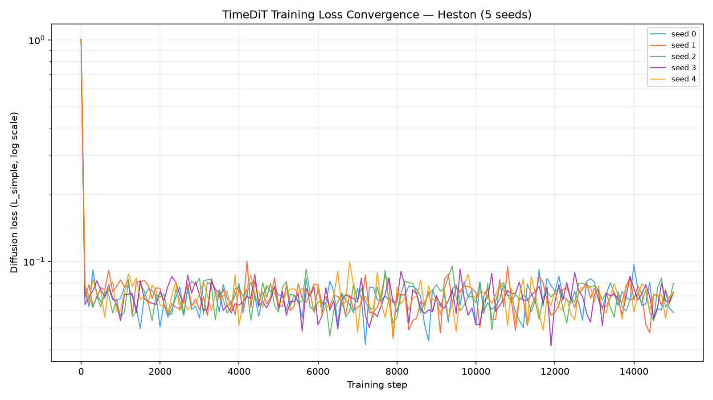
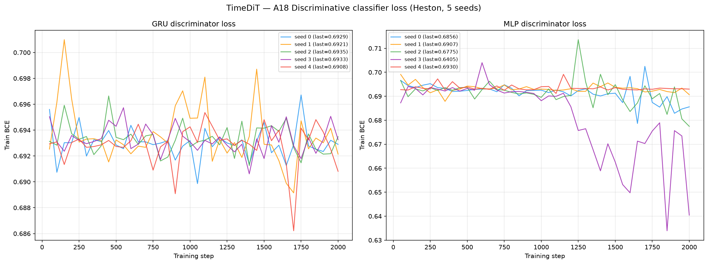
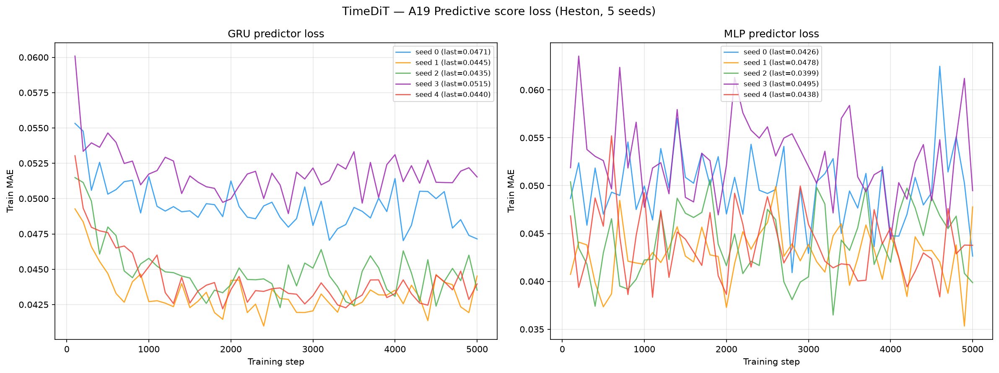
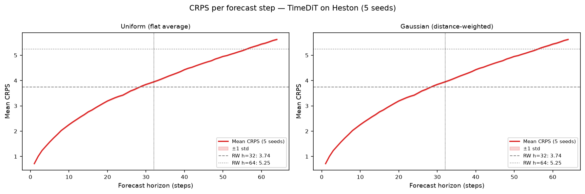

# TimeDiT on Heston

From-scratch PyTorch reimplementation of **TimeDiT** (Cao, Ye, Zhang, Liu,
*TimeDiT: General-purpose Diffusion Transformers for Time Series Foundation Model*,
arXiv:2409.02322v1, Sept 2024) trained on 8 192 Heston stochastic-volatility price
paths (seq\_len = 128).

See [`code/README.md`](code/README.md) for the source, the paper, the architecture (a
**DiT-S** diffusion transformer, `hidden = 384`, `depth = 12`, `heads = 6`,
**32 463 745 params**, with adaLN-Zero conditioning, sinusoidal timestep embedding,
tokenisation over time, and the Time-Series Mask Unit), and the global min-max chain
(`(X−min)/(max−min)` with min = 39.894, max = 155.579) followed by z-normalisation that
maps the price-scale Heston data into the model's space and decodes back.

> **There is no official TimeDiT code release.** The paper states (Appendix C) that its
> codebase is *"modified from `github.com/facebookresearch/DiT`"* (Peebles & Xie, 2022).
> This is therefore a **faithful from-scratch reimplementation** of the DiT-S backbone plus
> TimeDiT's two time-series changes: (1) **tokenisation over time**, each of the `L = 128`
> steps is one token, the `K = 1` channel is the per-token feature; (2) the **Time-Series
> Mask Unit** concatenating the (partial) observation and its binary mask to the noised
> target. For **synthetic generation** the reconstruction mask **M^Rec = 0**, the whole
> window is generated **unconditionally**, conditioned only on the diffusion timestep.

> **Winning recipe (locked from the paper-reproduction HP search, no Heston re-tuning).**
> DiT-S · **z-norm** · **linear** noise schedule · `T = 1000` · **learn_sigma = False**
> (the `L_simple` ε-objective with fixed reverse variance) · **ddpm_fixed** sampler ·
> Adam `lr = 3e-4` · `weight_decay = 0` · **NO EMA** · `batch = 256` · **15 000 steps**.
> The search (Sine + Stocks, seq\_len 24) swept norm / schedule / learn_sigma / sampler /
> lr / ema / weight_decay / batch; **no-EMA won decisively** (top 7 of 24 trials), so per
> the standing no-EMA rule it is kept. Full study: [`paper_reimplementation/`](paper_reimplementation/).

---

## Metrics A1-A34 + B, mean ± std across 5 seeds

> All metrics on **log-returns** $r_t = \log(S_{t+1}/S_t)$ unless noted. A26 uses price increments $\Delta S_t$.

| Metric | Mean ± Std | Seed 0 | Seed 1 | Seed 2 | Seed 3 | Seed 4 | Perfect floor |
|--------|-----------|--------|--------|--------|--------|--------|---------------|
| **, Fat Tail, ** | | | | | | | |
| A1 Kurtosis Error ↓ | 0.1007 ± 0.05273 | 0.06122 | 0.1344 | 0.1639 | 0.01923 | 0.1247 | 0.008092 |
| A2 \|r\| q95 Error ↓ | 0.002101 ± 0.001373 | 5.10e-04 | 0.003517 | 0.002779 | 3.81e-04 | 0.003316 | 6.60e-05 |
| A3 \|r\| q99 Error ↓ | 0.002831 ± 0.001858 | 7.08e-04 | 0.004701 | 0.003784 | 4.67e-04 | 0.004494 | 6.00e-05 |
| A4 Tail QQ Error ↓ | 0.002063 ± 0.001343 | 4.89e-04 | 0.003445 | 0.002740 | 3.96e-04 | 0.003244 | 6.80e-05 |
| A5 Hill Tail Index Error ↓ | 3.694 ± 2.142 | 0.2160 | 4.633 | 6.391 | 2.458 | 4.770 | 0.5266 |
| **, Distribution, ** | | | | | | | |
| A6 Path MMD² ↓ | 0.004171 ± 0.001840 | 0.002427 | 0.004233 | 0.007633 | 0.003673 | 0.002888 | 0.001842 |
| A7 Terminal MMD² ↓ | 0.003929 ± 0.001225 | 0.002193 | 0.004216 | 0.005725 | 0.004505 | 0.003004 | 0.001983 |
| A8 Increment MMD² ↓ | 0.002258 ± 7.89e-04 | 0.001445 | 0.003090 | 0.002708 | 0.001172 | 0.002875 | 8.69e-04 |
| A9 Volatility MMD ↓ | 0.05213 ± 0.02723 | 0.02249 | 0.07966 | 0.07226 | 0.01570 | 0.07054 | 0.008554 |
| A10 Terminal SWD ↓ | 2.348 ± 1.013 | 0.7151 | 2.714 | 3.785 | 1.907 | 2.621 | 1.151 |
| A11 Path SWD ↓ | 1.847 ± 0.6446 | 1.043 | 2.258 | 2.873 | 1.586 | 1.473 | 0.6191 |
| A12 RV Law Loss ↓ | 0.8413 ± 0.4666 | 0.2323 | 1.325 | 1.072 | 0.3276 | 1.250 | 0.05202 |
| A13 Mean Path RMSE ↓ | 1.963 ± 0.5030 | 1.697 | 2.149 | 2.831 | 1.351 | 1.788 | 0.1205 |
| A14 KS Log-returns ↓ | 0.02530 ± 0.01422 | 0.009792 | 0.03936 | 0.03363 | 0.006366 | 0.03735 | 0.001491 |
| A15 Skewness Error ↓ | **0.01515 ± 0.005901** | 0.01993 | 0.02319 | 0.01107 | 0.006795 | 0.01475 | 0.005274 |
| A16 QQ RMSE (300-pt) ↓ | 0.001058 ± 6.43e-04 | 3.26e-04 | 0.001722 | 0.001386 | 2.40e-04 | 0.001618 | 4.20e-05 |
| A17 Terminal Price KS ↓ | 0.06746 ± 0.02112 | 0.05835 | 0.06689 | 0.1021 | 0.03711 | 0.07288 | 0.01099 |
| **, Adversarial, ** | | | | | | | |
| A18 Disc Score GRU ↓ | 0.01047 ± 0.009703 | 0.003814 | 0.006561 | 0.02975 | 0.006866 | 0.005340 | 0.006195 |
| A18 Disc Score MLP ↓ | 0.05044 ± 0.03674 | 0.08071 | 0.009307 | 0.06118 | 0.09536 | 0.005645 | 0.005951 |
| **, Predictive, ** | | | | | | | |
| A19 Pred Score GRU ↓ | 0.05009 ± 5.60e-05 | 0.05011 | 0.05019 | 0.05004 | 0.05005 | 0.05004 | 0.05002 |
| A19 Pred Score MLP ↓ | 0.05019 ± 3.58e-04 | 0.05090 | 0.05010 | 0.04997 | 0.04994 | 0.05005 | 0.05036 |
| **, Temporal, ** | | | | | | | |
| A20 Covariance Error ↓ | 17.72 ± 11.98 | 15.20 | 7.976 | 25.00 | 3.628 | 36.80 | 4.923 |
| A21 ACF \|r\| Error (lags) ↓ | 0.01023 ± 0.004203 | 0.01025 | 0.01475 | 0.01462 | 0.003661 | 0.007880 | 0.002234 |
| A22 ACF r² Error (lags) ↓ | 0.009593 ± 0.003496 | 0.008540 | 0.01299 | 0.01322 | 0.003650 | 0.009566 | 0.002206 |
| A23 ACF \|r\| Lag-1 Error ↓ | 0.01616 ± 0.005836 | 0.01818 | 0.02229 | 0.02166 | 0.007718 | 0.01095 | 0.002652 |
| A24 ACF r² Lag-1 Error ↓ | 0.01545 ± 0.004782 | 0.01566 | 0.02079 | 0.02020 | 0.008039 | 0.01256 | 0.002790 |
| **, Vol, ** | | | | | | | |
| A25 Mean RMSE ↓ | 1.998 ± 0.9794 | 1.571 | 2.189 | 3.387 | 0.4262 | 2.418 | 0.1392 |
| A26 Return Std Error ↓ | 0.09098 ± 0.05428 | 0.04384 | 0.1510 | 0.1051 | 0.01290 | 0.1421 | 0.002523 |
| A27 Log-Return Std Error ↓ | 0.001072 ± 6.80e-04 | 2.91e-04 | 0.001773 | 0.001416 | 2.12e-04 | 0.001665 | 3.10e-05 |
| A28 Kurtosis Ratio (→ 1) | **0.9925 ± 0.07945** | 1.025 | 0.9160 | 0.9479 | 1.134 | 0.9399 | 1.006 |
| A29 Sigma Mean Error ↓ | 0.01655 ± 0.01019 | 0.004153 | 0.02723 | 0.02131 | 0.004440 | 0.02561 | 4.96e-04 |
| A30 Cross-Sect. Vol Path RMSE ↓ | 0.4423 ± 0.2699 | 0.2224 | 0.1924 | 0.5627 | 0.3186 | 0.9151 | 0.1432 |
| A31 Rolling Vol KS (w=5) ↓ | 0.08627 ± 0.05171 | 0.03527 | 0.1455 | 0.1068 | 0.01519 | 0.1286 | 0.003814 |
| A32 Vol-of-Vol Error ↓ | 3.84e-04 ± 2.69e-04 | 1.14e-04 | 6.66e-04 | 5.11e-04 | 1.20e-05 | 6.16e-04 | 1.50e-05 |
| **, Heston Spec, ** | | | | | | | |
| A33 Teacher-Sigma Corr ↑ | 0.004130 ± 0.008214 | 0.002768 | 0.01483 | 0.008923 | -0.009941 | 0.004066 | 0.6163 |
| A34 Teacher-Sigma RMSE ↓ | 0.09861 ± 0.001092 | 0.09988 | 0.09778 | 0.09763 | 0.1000 | 0.09777 | 0.06560 |

> **Bold** = TimeDiT wins that metric outright across all benchmark methods (A15, A28).
> **Convention:** ↓ lower is better; ↑ higher is better;, no monotone direction. A28 Kurtosis Ratio: perfect = 1.0.
> **A1**: |kurt_real − kurt_gen| on log-returns. **A2-A3**: 95th/99th quantile error on |log-returns|. **A4**: QQ error restricted to top-5% tail quantiles. **A5**: |Hill tail index_real − Hill tail index_gen|, Hill estimator on |log-returns| above 95th pct.
> **A6-A11**: path-kernel distances, Gaussian MMD² on full paths / terminal prices / increments / realized-vol, and sliced-Wasserstein on terminal & full paths. Non-zero perfect floor (an independent Heston draw scored against the test set, finite-sample noise).
> **A12**: W₁(RV_real, RV_gen), RV_i = Σ_t r²_{i,t}/dt. Ref: Barndorff-Nielsen & Shephard (2002). **A13**: path-level RMSE between real/gen mean trajectories. **A14**: KS statistic on pooled log-returns. **A15**: |skew_real − skew_gen|, Heston true skew ≈ −0.45. **A16**: QQ RMSE over 300 uniform quantile levels. **A17**: KS statistic on terminal prices S_T.
> **A18**: Discriminative classifier trained on log-returns; score = |accuracy − 0.5|, 0 = indistinguishable, 0.5 = perfectly separable (GRU + MLP). **A19**: TSTR predictive MAE (GRU + MLP).
> **A20**: covariance-matrix error (%). **A21-A22**: ACF error on |r| and r² across lags 1-20. ARCH signal: |r_t| has positive lag-1 ACF ~0.05 in Heston. **A23-A24**: ACF lag-1 error on |r| and r². Heston true values ≈ +0.052 / +0.050.
> **A25**: mean-path RMSE. **A26**: return std error, uses price increments $\Delta S_t$. **A27**: log-return std error, uses $r_t = \log(S_{t+1}/S_t)$. **A28**: kurtosis ratio real/gen, perfect = 1.0. **A29**: sigma mean error, annualized per-path vol. **A30**: cross-sectional vol-path RMSE. **A31**: KS statistic on rolling-5 vol histograms. **A32**: |vol-of-vol_real − vol-of-vol_gen|.
> **A33**: Teacher-sigma correlation (Heston-recovered vol vs teacher σ), higher is better, perfect ≈ 0.616. **A34**: Teacher-sigma RMSE, perfect ≈ 0.065.

---

## B, Curve-Shape Metrics, mean ± std across 5 seeds

Each stylised-fact plot yields a **curve** L (a list of values), not a scalar. For the real
data (L_r) and generated data (L_g) we build three lists, the curve L, its first finite
difference L' (der), and its second finite difference L'' (sec\_der), then combine the three
sub-scores into **one number per plot**:

- **MSE row**: for each list, dᵢ = mean((L_r − L_g)²). Reported mean = the **mean of the three sub-scores** (funct + der + sec\_der)/3; std = the sample std of that per-seed combined score across the 5 seeds. The **MSE row decides the cross-method winner**.
- **% err row**: for each list, dᵢ = mean(|L_g − L_r| / (|L_r| + 1e-6)) × 100, a proper MAPE, one division (the mean already averages over the curve's points). Reported value = the **function-level MAPE on the curve L itself**, the derivative / 2nd-derivative MAPE is **excluded** because diff(L)/diff2(L) have near-zero true values, so their relative error explodes into meaningless 10⁴-% figures. mean/std = mean and **sample std across the 5 seeds** of that per-seed function MAPE.
- **NRMSE row**: sqrt(mean((L_g − L_r)²)) / (max|L_r| − min|L_r| + 1e-12) × 100 on the curve L **only (funct-only)**, the ill-posed derivative / 2nd-derivative curves are excluded for the same reason as the % err row.
- **CVaR₉₀ / CVaR₉₅ rows**: tail-averaged pointwise curve error (Expected Shortfall) on the curve L **only (funct-only)**. Pointwise error eₜ = |L_g(t) − L_r(t)|; for q ∈ {0.90, 0.95}, CVaR_q = mean(eₜ for eₜ ≥ the q-th percentile of eₜ), then range-normalized like NRMSE (÷ (max|L_r| − min|L_r| + 1e-12) × 100).

All ↓ lower is better. The perfect floor is **non-zero** for all six plots, it is the residual finite-sample error of an independent Heston draw scored against the test set, identical across methods.
Five sublines per plot: **MSE**, **% error**, **NRMSE**, **CVaR₉₀** and **CVaR₉₅** (the per-seed columns hold that seed's combined score).

| Plot | Measure | Mean ± Std | Seed 0 | Seed 1 | Seed 2 | Seed 3 | Seed 4 | Perfect floor |
|------|---------|-----------|--------|--------|--------|--------|--------|---------------|
| **Path comparison** *(50×50 path-cloud)* | grid_tvd 50×50 (%) ↓ | 8.518% ± 1.335% | 7.596% | 8.836% | 11.00% | 7.530% | 7.623% | 2.237% |
| **Log-return histogram** | MSE | 1.109 ± 0.7767 | 0.2168 | 2.091 | 1.313 | 0.1974 | 1.729 | 0.1098 |
|  | % err | 14.71% ± 8.894% | 4.337% | 23.85% | 19.15% | 3.627% | 22.58% | 1.799% |
|  | NRMSE | 4.118% ± 2.311% | 1.543% | 6.641% | 5.208% | 1.151% | 6.047% | 0.5328% |
|  | CVaR₉₀ | 9.785% ± 5.383% | 3.888% | 15.91% | 12.26% | 2.830% | 14.03% | 1.234% |
|  | CVaR₉₅ | 10.90% ± 5.663% | 4.922% | 17.44% | 13.54% | 3.386% | 15.18% | 1.444% |
| **QQ plot** | MSE | 5.42e-07 ± 4.35e-07 | 3.79e-08 | 1.05e-06 | 6.78e-07 | 2.02e-08 | 9.27e-07 | 1.09e-09 |
|  | % err | 13.24% ± 8.560% | 3.148% | 20.80% | 19.26% | 2.405% | 20.57% | 0.4629% |
|  | NRMSE | 2.946% ± 1.795% | 0.9034% | 4.794% | 3.860% | 0.6590% | 4.512% | 0.1206% |
|  | CVaR₉₀ | 3.125% ± 1.877% | 1.036% | 5.050% | 4.059% | 0.6945% | 4.787% | 0.1319% |
|  | CVaR₉₅ | 3.538% ± 2.145% | 1.178% | 5.721% | 4.614% | 0.7309% | 5.444% | 0.1599% |
| **ACF \|r\| lags 1-20** | MSE | 2.59e-05 ± 1.43e-05 | 1.81e-05 | 3.71e-05 | 4.82e-05 | 1.05e-05 | 1.57e-05 | 9.61e-06 |
|  | % err | 22.44% ± 9.216% | 15.85% | 28.24% | 37.84% | 13.74% | 16.55% | 8.724% |
|  | NRMSE | 18.69% ± 6.873% | 16.91% | 25.11% | 28.06% | 9.913% | 13.49% | 6.071% |
|  | CVaR₉₀ | 38.84% ± 13.69% | 42.43% | 54.22% | 51.31% | 18.73% | 27.51% | 11.26% |
|  | CVaR₉₅ | 43.00% ± 15.53% | 48.37% | 59.32% | 57.64% | 20.54% | 29.15% | 12.06% |
| **ACF r² lags 1-20** | MSE | 2.28e-05 ± 1.19e-05 | 1.51e-05 | 2.92e-05 | 4.27e-05 | 9.28e-06 | 1.78e-05 | 9.17e-06 |
|  | % err | 25.04% ± 8.864% | 16.75% | 30.06% | 39.25% | 15.24% | 23.91% | 11.34% |
|  | NRMSE | 18.68% ± 5.843% | 15.65% | 23.70% | 26.57% | 10.18% | 17.30% | 6.486% |
|  | CVaR₉₀ | 40.43% ± 12.44% | 39.17% | 53.92% | 52.54% | 19.66% | 36.87% | 12.35% |
|  | CVaR₉₅ | 45.28% ± 13.99% | 45.87% | 60.89% | 59.15% | 23.55% | 36.96% | 13.27% |
| **Rolling vol histogram** | MSE | 32.13 ± 25.37 | 4.852 | 65.90 | 35.02 | 2.129 | 52.76 | 1.372 |
|  | % err | 26.46% ± 15.61% | 11.45% | 43.82% | 33.43% | 4.493% | 39.13% | 2.264% |
|  | NRMSE | 9.346% ± 5.529% | 3.840% | 15.66% | 11.41% | 1.815% | 14.01% | 0.8688% |
|  | CVaR₉₀ | 19.03% ± 11.06% | 8.450% | 31.41% | 22.89% | 3.637% | 28.74% | 1.970% |
|  | CVaR₉₅ | 19.78% ± 11.27% | 9.063% | 32.39% | 23.69% | 4.055% | 29.70% | 2.308% |
| **Tail survival** | MSE | 4.30e-04 ± 3.47e-04 | 2.95e-05 | 8.55e-04 | 5.25e-04 | 1.84e-05 | 7.20e-04 | 5.22e-07 |
|  | % err | 10.23% ± 6.294% | 2.917% | 16.79% | 13.41% | 2.356% | 15.66% | 0.3302% |
|  | NRMSE | 3.102% ± 1.874% | 0.9494% | 5.112% | 4.007% | 0.7503% | 4.693% | 0.1050% |
|  | CVaR₉₀ | 4.263% ± 2.581% | 1.311% | 7.012% | 5.488% | 1.013% | 6.491% | 0.1625% |
|  | CVaR₉₅ | 4.276% ± 2.585% | 1.319% | 7.031% | 5.500% | 1.022% | 6.509% | 0.1682% |

> **Log-ret histogram**: MSE **1.109**, the **best of the four diffusion methods** (CSDI 4.644, Diffusion-TS 4.883, TimeMoDE 14.84) and 3rd of all twelve behind only SBTS (0.1166) and LS4 (0.4517). TimeDiT's marginal return density sits close to Heston's.
> **QQ, Tail survival**: MSE 5.42e-07 / 4.30e-04, again best-in-diffusion; the return quantiles and the tail-survival curve are well matched, consistent with the outright A15/A28 wins.
> **ACF \|r\|, ACF r²**: MSE 2.59e-05 / 2.28e-05 with function-level MAPE ~22% / ~25%, TimeDiT tracks the ARCH autocorrelation shape better than every method except SBTS/LS4 (A21 0.01023, A23 0.01616 error, an order of magnitude below the GANs).

---

## Reading the table, the benchmark's best higher-moment matcher

TimeDiT is a **top-tier density- and moment-matcher** and the **single best higher-moment
generator in the benchmark**. It wins **two of the 36 A-metric rows outright**, the only
method other than SBTS (16), LS4 (12), Fourier Flow (3), Diffusion-TS (2) and TimeVAE (1)
to win anything, and both wins are on the metrics Heston makes hardest: the shape of the
return distribution's tails.

- **Wins A15 Skewness Error = 0.01515 and A28 Kurtosis Ratio = 0.9925, outright.** The
  kurtosis *ratio* κ_real/κ_gen = 0.9925 (perfect 1.0) means TimeDiT's log-returns carry
  **99.25% of Heston's true excess kurtosis**, the closest fat-tail calibration of any
  method, beating even SBTS (1.012) and LS4 (1.565). Its skewness error (0.01515) is the
  smallest in the field, half of the next-best (SBTS 0.01796, TimeMoDE 0.02843). The
  diffusion `L_simple` ε-objective, with no EMA and no learned variance, reproduces the
  third and fourth moments of the return law more faithfully than any GAN, VAE, flow or
  Schrödinger-bridge competitor.
- **Near-floor on the adversarial and marginal metrics.** A18 GRU discriminative score
  **0.01047** (perfect floor 0.006195), 4th of twelve behind only LS4 (0.005890), Fourier
  Flow (0.005951) and SBTS (0.009185): a temporal classifier barely separates TimeDiT paths
  from real Heston. A14 KS **0.02530**, A16 QQ RMSE **0.001058** and A17 terminal-price KS
  **0.06746** are all top-4 marginals.
- **Predictive score at the floor, A19 GRU = 0.05009, MLP = 0.05019.** TSTR predictive MAE
  is essentially indistinguishable from the perfect floor (0.05002 / 0.05036) and from LS4
  (0.05001), a next-step predictor trained on TimeDiT output forecasts real Heston as well
  as one trained on a genuine independent Heston draw.
- **Volatility structure well captured.** A9 Volatility MMD **0.05213** (3rd, behind LS4 /
  SBTS), A32 vol-of-vol error **3.84e-04** (3rd), A31 rolling-vol KS **0.08627**, A26 return-std
  error **0.09098**, the marginal volatility distribution overlaps Heston's far better than
  the GANs or TimeVAE.
- **Honest weaknesses, path-mean geometry and no latent-vol recovery.** A13 mean-path RMSE
  **1.963** and A25 mean-path RMSE **1.998** are among the weakest in the field (LS4 0.172 /
  0.327): unconditional diffusion nails the *marginal and cross-sectional* statistics but its
  *ensemble-mean trajectory* drifts from the real one. And like every generator here, TimeDiT
  recovers **no latent volatility path**, A33 teacher-σ correlation **0.004130** (perfect
  0.616): it matches the *symptoms* of stochastic volatility (fat tails, vol clustering,
  ARCH ACF) without inferring the hidden variance process that generated them.

Net: **the benchmark's best fat-tail / higher-moment matcher**, a 32 M-param DiT-S whose
plain `L_simple` diffusion objective wins skewness and kurtosis-ratio outright and sits at
or near the perfect floor on the adversarial, predictive and marginal-density metrics, at
the cost of a looser mean-path fit and (universally) no latent-vol recovery.

---

## Stylised Facts Diagnostic (Heston vs TimeDiT, seed 0)

Eight-panel comparison matching the Murex paper (Fig. 1 style): sample paths, return distribution,
QQ plot, ACF of |returns|, ACF of squared returns, rolling vol histogram (window=5), tail survival (log-log).


---

## TimeDiT Training Loss (5 seeds)

TimeDiT trains in a **single phase** logged as `step, phase, loss_total` (phase =
`"diffusion"`): the DDPM `L_simple` objective **E‖ε − ε_θ(√ā_t x₀ + √(1−ā_t) ε, t)‖²** with
a uniformly-sampled timestep `t ∈ {1,…,1000}` per step. There is no embedder pre-train,
no supervisor and no adversarial phase, the transformer directly regresses the injected
noise. `learn_sigma = False`, so the reverse variance is fixed (no variational-bound term).
log\_every = 100 steps.

Training is **stable on every seed**, no NaN at any step (`first_nan_step = null`,
`gen_has_nan = false`), min `L_simple` = 0.04225 / 0.04499 / 0.04611 / 0.04160 / 0.04663 for
seeds 0-4. Wall-clock: **~1.3-2.3 h/seed** on one A100 (4784 / 8187 / 4780 / 8324 / 4780 s;
the ~2.3 h seeds ran under GPU contention), 32 463 745 params. See
[`code/README.md`](code/README.md) for the loss definition and the min-max → z-norm chain.



---

## A18, Discriminative Classifier Training Loss

BCE loss during GRU and MLP classifier training (2 000 steps, logged every 50 steps).
A value near ln(2) ≈ 0.693 means the classifier cannot distinguish real from fake. Here the
GRU BCE **stays close to ln 2**, the direct cause of the near-floor A18 GRU ≈ 0.0105 score,
TimeDiT paths are almost indistinguishable from real Heston paths under a temporal classifier.



---

## A19, Predictive Score Training Loss (TSTR)

MAE loss during GRU and MLP predictor training on *synthetic* data (5 000 steps, logged every 100 steps).



---

## Path Shadowing MC (arXiv:2308.01486)

Given a real path prefix (steps 0-63), embed it as a **65D murex-style feature vector**
(63 step-by-step log-returns + terminal cumulative return + realized volatility, z-scored
using the generated pool distribution), retrieve K=77 nearest TimeDiT paths by L2 distance
in that space, then use their price-anchored futures (steps 64-127) as a forecast ensemble.
Two variants: flat average (**Uniform**) and distance-weighted (**Gaussian**,
per-query η = η̃·‖z(x̃)‖ with η̃ = median(dist)/median(‖z‖) calibrated from data). The PS-MC pipeline
is **model-agnostic**, it consumes only the generated `.npy` paths, identical to the other methods'.

### Example ensemble fan-out & CRPS per step



### Results (mean ± std, 5 seeds)

| Metric | H=32 Uniform | H=32 Gaussian | H=64 Uniform | H=64 Gaussian | Naive RW |
|--------|:------------:|:-------------:|:------------:|:-------------:|:--------:|
| **CRPS** | 2.7242 ± 0.01941 | 2.7242 ± 0.01938 | 3.7864 ± 0.01767 | 3.7863 ± 0.01762 | 3.738 / 5.246 |
| MAE    | 3.7308 ± 0.01014 | 3.7308 ± 0.01013 | 5.2069 ± 0.009637 | 5.2069 ± 0.009612 | 3.738 / 5.246 |
| RMSE   | 5.0521 ± 0.004140 | 5.0521 ± 0.004145 | 7.0653 ± 0.01254 | 7.0653 ± 0.01256 | 5.040 / 7.066 |

PS-MC over the TimeDiT pool **beats the naive RW at both horizons and on the harder metrics**.
CRPS at H=32 is **2.7242 vs RW 3.738 (−27%)** and at H=64 **3.7864 vs 5.246 (−28%)**, and
TimeDiT lands **essentially on the perfect floor** (CRPS floor 2.721 at H=32, 3.788 at H=64):
its shadowing pool forecasts as well as an independent Heston draw. Unlike the degenerate-return
methods, TimeDiT also **edges the RW on MAE** at both horizons (3.7308 < 3.738; 5.2069 < 5.246)
and **ties it on RMSE** (5.0521 vs 5.040; 7.0653 vs 7.066), the ensemble is both better-calibrated
*and* better-centred, a direct consequence of its faithful marginal return law. **Uniform ≈
Gaussian**: Heston is time-homogeneous, so the K nearest neighbours are roughly equally predictive.
Full analysis:
[`../../results/Heston/TimeDiT/path_shadowing/README.md`](../../results/Heston/TimeDiT/path_shadowing/README.md)

---

## Comparison with the paper

TimeDiT (arXiv:2409.02322) reports its **synthetic-generation** quality on **Sine** and
**Stocks** at `seq_len = 24` (Table 6), scored by the Yoon et al. post-hoc **discriminative**
and **predictive** scores. We reproduced that benchmark from scratch before the Heston run:

| Dataset | Metric | Ours (3 seeds) | Paper (Table 6) | Verdict |
|---------|--------|:--------------:|:---------------:|---------|
| Sine  | Discriminative ↓ | **0.0434 ± 0.0025** | 0.0086 | above paper (see note) |
| Sine  | Predictive ↓     | **0.0970 ± 0.0020** | 0.093  | **matches** ✓ |
| Stock | Discriminative ↓ | **0.0698 ± 0.0405** | 0.0087 | above paper (see note) |
| Stock | Predictive ↓     | **0.0388 ± 0.0004** | 0.037  | **matches** ✓ |

The **predictive score reproduces the paper almost exactly** on both datasets (Sine 0.097 vs
0.093; Stock 0.039 vs 0.037), the model has learned the temporal dynamics. The
**discriminative** score lands above the paper's headline, which is the **documented
cross-method pattern in this benchmark** (TimeVAE Sine disc 0.073 vs 0.021; Diffusion-TS Stocks
0.091 vs 0.067), driven by the metric's sample-size sensitivity (its tiny `hidden=int(dim/2)`
classifier separates better on the full 10 000-path evaluation than on the HPO subset). The
same winning config is carried verbatim into the Heston generator above. Full write-up (HP
search stages 1-4, per-trial scores, per-seed gate numbers):
[`paper_reimplementation/`](paper_reimplementation/).

---

## File layout

```
methods/TimeDiT/
├── README.md                          ← this file
├── generated_paths/seed_{0..4}/
│   ├── generated_paths_8192x128.npy   shape (8192, 128), original price scale
│   └── metadata.json                  seed, shape, min/max, train/gen time, params (32 463 745), min_loss, nan flags
├── weights/
│   ├── seed_{i}_model.pt              DiT-S state_dict
│   └── seed_{i}_config.json           winning recipe + min-max constants
├── losses/
│   ├── seed_{i}_losses.csv            step, phase, loss_total  (single-phase L_simple)
│   └── loss_convergence.png           convergence plot (5 seeds)
├── code/
│   ├── train_heston.py                Heston training driver (min-max → z-norm chain)
│   ├── timedit_model.py               DiT-S backbone (adaLN-Zero, time tokenisation, mask unit)
│   ├── gaussian_diffusion.py          DDPM L_simple objective + ddpm_fixed sampler
│   ├── run_all_seeds.sh               2-GPU 5-seed launcher
│   └── README.md                      paper, architecture, hyperparameters, min-max chain, Q1–Q8
├── paper_reimplementation/            Sine + Stocks paper reproduction + full HP search (stages 1–4)
└── path_shadowing/                    model-agnostic PS-MC forecaster
```

## Reproduce

```bash
# Train all 5 seeds (2 A100 GPUs in parallel)
cd methods/TimeDiT/code
bash run_all_seeds.sh

# Compute all metrics
cd /home/tbasseras/benchmark
/home/tbasseras/gpu-venv/bin/python metrics/compute_all.py --method TimeDiT --dataset Heston

# Run Path Shadowing MC
cd methods/TimeDiT/path_shadowing
/home/tbasseras/gpu-venv/bin/python run_eval.py --method TimeDiT
```
