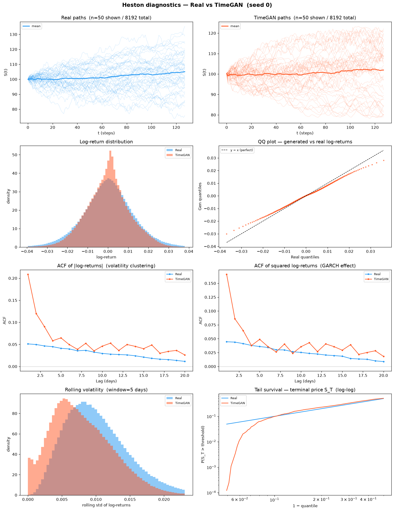
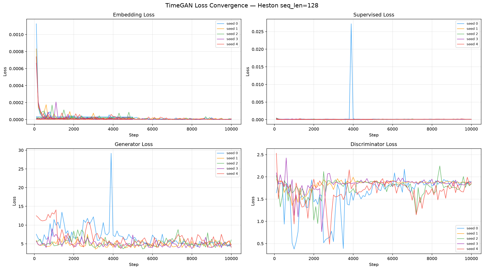
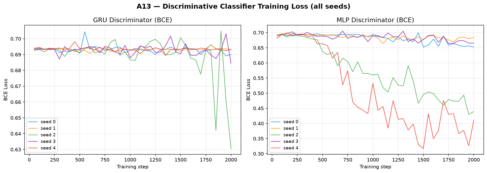
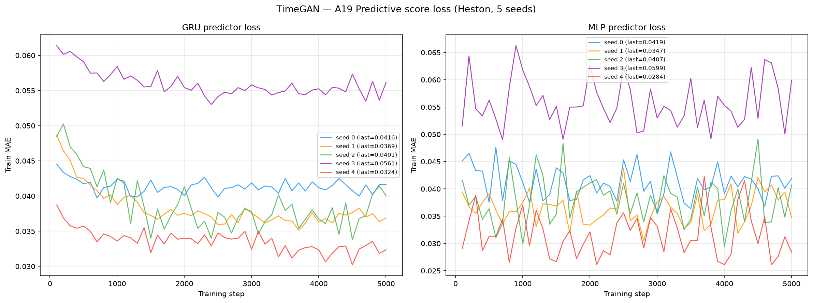
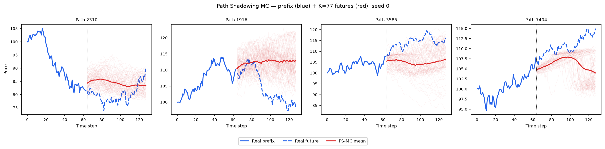
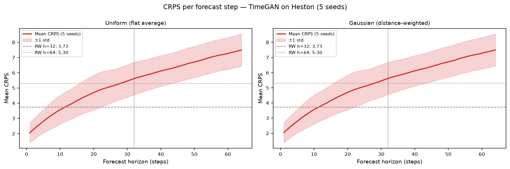

# TimeGAN on Heston

PyTorch reimplementation of **TimeGAN** (Yoon et al., NeurIPS 2019) trained on 8 192
Heston stochastic-volatility price paths (seq\_len = 128).

See [`code/README.md`](code/README.md) for source, original paper, and the 5 fixes applied
to the TF1 reference implementation.

---

## Metrics — mean ± std across 5 seeds

| ID | Metric | Category | Dir | Mean ± Std | Seed 0 | Seed 1 | Seed 2 | Seed 3 | Seed 4 | Perfect |
|----|--------|----------|-----|-----------|--------|--------|--------|--------|--------|---------|
| A1 | Path MMD² | Distribution | ↓ | 0.0180 ± 0.0147 | 0.0095 | 0.0035 | 0.0345 | 0.0054 | 0.0373 | 0 |
| A2 | Terminal MMD² | Distribution | ↓ | 0.0296 ± 0.0234 | 0.0202 | 0.0086 | 0.0646 | 0.0051 | 0.0494 | 0 |
| A3 | Increment MMD² | Distribution | ↓ | 0.0078 ± 0.0037 | 0.0054 | 0.0076 | 0.0117 | 0.0023 | 0.0121 | 0 |
| A4 | Volatility MMD | Distribution | ↓ | 0.3798 ± 0.2351 | 0.1746 | 0.3673 | 0.6468 | 0.0709 | 0.6394 | 0 |
| A5 | Terminal SWD | Distribution | ↓ | 2.8497 ± 1.0789 | 2.7650 | 1.8201 | 4.3392 | 1.5522 | 3.7720 | 0 |
| A6 | Path SWD | Distribution | ↓ | 1.5006 ± 0.5834 | 1.2791 | 0.8390 | 2.3493 | 1.0207 | 2.0149 | 0 |
| A7 | Cov Error (%) | Statistics | ↓ | 17.7510 ± 6.7074 | 8.8300 | 18.7648 | 14.8070 | 29.3730 | 16.9801 | 0 |
| A8 | Mean RMSE | Statistics | ↓ | 0.7385 ± 0.4552 | 0.8320 | 0.3890 | 1.0560 | 1.3412 | 0.0743 | 0 |
| A9 | Std Error | Statistics | ↓ | 0.1519 ± 0.0888 | 0.1519 | 0.2379 | 0.0302 | 0.0788 | 0.2608 | 0 |
| A10 | Kurtosis Error | Statistics | ↓ | 2.9545 ± 2.0988 | 0.0148 | 5.3599 | 3.7677 | 0.9581 | 4.6722 | 0 |
| A11 | ACF Abs Error | Temporal | ↓ | 0.1339 ± 0.0728 | 0.0821 | 0.1065 | 0.2184 | 0.0421 | 0.2203 | 0 |
| A12 | ACF Sq Error | Temporal | ↓ | 0.0919 ± 0.0386 | 0.0588 | 0.0833 | 0.1318 | 0.0445 | 0.1412 | 0 |
| A13 | Disc Score GRU | Adversarial | ↓ | 0.0499 ± 0.0336 | 0.0468 | 0.0224 | 0.1088 | 0.0133 | 0.0581 | **0** |
| A13 | Disc Score MLP | Adversarial | ↓ | 0.1508 ± 0.1415 | 0.0368 | 0.0352 | 0.2901 | 0.0374 | 0.3544 | **0** |
| A14 | Pred Score GRU (TSTR) | Predictive | ↓ | 0.0087 ± 0.0002 | 0.0085 | 0.0090 | 0.0085 | 0.0088 | 0.0085 | baseline |
| A14 | Pred Score MLP (TSTR) | Predictive | ↓ | 0.0090 ± 0.0005 | 0.0090 | 0.0087 | 0.0090 | 0.0084 | 0.0099 | baseline |
| A15 | Sigma Corr | Heston-specific | ↑ | 0.0031 ± 0.0101 | 0.0008 | 0.0079 | -0.0100 | -0.0029 | 0.0196 | **1** |
| A15 | Sigma RMSE | Heston-specific | ↓ | 0.9659 ± 0.1237 | 0.9279 | 0.8392 | 1.0714 | 1.1474 | 0.8436 | 0 |
| A16 | Tail Survival Error | Fat-tail | ↓ | 0.0216 ± 0.0111 | 0.0209 | 0.0397 | 0.0107 | 0.0097 | 0.0270 | **0** |

> **A13 discriminative score**: `|accuracy − 0.5|` on a held-out test set (80/20 split).
> 0 = generator is indistinguishable from real data. 0.5 = perfect separation (bad generator).
>
> **A14 predictive score**: TSTR MAE — predictor trained on *synthetic*, evaluated on *real*.
>
> **A15 sigma**: Heston-specific. Compares inferred instantaneous vol from generated paths
> against the true variance paths.
>
> **A16 tail survival error**: RMS of survival probability difference at quantiles {0.90, 0.95, 0.99}.
> Tests fat-tail reproduction. 0 = perfect. Lower is better.

---

## Stylised Facts Diagnostic (Heston vs TimeGAN, seed 0)

Eight-panel comparison matching the Murex paper (Fig. 1 style): sample paths, return distribution,
QQ plot, ACF of |returns|, ACF of squared returns, rolling vol histogram (window=5), tail survival (log-log).



---

## TimeGAN Training Loss (5 seeds)

Loss curves across all three training phases (embedding 0–5k, supervisor 5–10k, joint 10–20k).



---

## A13 — Discriminative Classifier Training Loss

BCE loss during GRU and MLP classifier training (2 000 steps, logged every 50 steps).
A value near ln(2) ≈ 0.693 means the classifier cannot distinguish real from fake.



---

## A14 — Predictive Score Training Loss (TSTR)

MAE loss during GRU and MLP predictor training on *synthetic* data (5 000 steps, logged every 100 steps).



---

## Path Shadowing MC (arXiv:2308.01486)

Given a real path prefix (steps 0–63), retrieve K=77 nearest TimeGAN paths by L2 distance,
then use their futures (steps 64–127) as a forecast ensemble. Two variants: flat average
(**Uniform**) and distance-weighted (**Gaussian**, η = median NN distance).

### Example ensemble fan-out (seed 0)



### CRPS per forecast step



### Results (mean ± std, 5 seeds)

| Metric | H=32 Uniform | H=32 Gaussian | H=64 Uniform | H=64 Gaussian | Naive RW |
|--------|:------------:|:-------------:|:------------:|:-------------:|:--------:|
| CRPS   | 4.159 ± 0.982 | 4.154 ± 0.984 | 5.385 ± 0.990 | 5.384 ± 0.989 | 3.73 / 5.30 |
| MAE    | 5.144 ± 0.732 | 5.138 ± 0.735 | 6.595 ± 0.605 | 6.593 ± 0.605 | 3.73 / 5.30 |
| RMSE   | 6.778 ± 0.855 | 6.770 ± 0.860 | 8.746 ± 0.709 | 8.746 ± 0.707 | 5.07 / 7.18 |

PS-MC CRPS slightly exceeds the naive random-walk baseline — expected given TimeGAN's
residual ACF error (A11 = 0.134) and retrieval on raw price-level L2 (level effects
dominate dynamics). Normalised retrieval would likely improve results.

Full analysis: [`results/Heston/TimeGAN/path_shadowing/README.md`](../../results/Heston/TimeGAN/path_shadowing/README.md)

---

## File layout

```
methods/TimeGAN/
├── README.md                          ← this file
├── generated_paths/seed_{0..4}/
│   ├── generated_paths_8192x128.npy   shape (8192, 128), original price scale
│   └── metadata.json                  seed, shape, min/max, train time
├── weights/
│   ├── seed_{i}_model.pt              full PyTorch state_dict
│   └── seed_{i}_config.json           hyperparameters
├── losses/
│   ├── seed_{i}_losses.csv            step, phase, e_loss, s_loss, g_loss, d_loss
│   └── loss_convergence.png           convergence plot (5 seeds overlaid)
└── code/
    ├── timegan_torch.py               PyTorch TimeGAN implementation
    ├── train.py                       orchestrator — 5 seeds on 2 GPUs in pairs
    ├── train_seed.py                  single-seed worker
    ├── reference/                     verbatim TF1 code (jsyoon0823/TimeGAN)
    └── README.md                      paper, GitHub, list of 5 fixes vs TF1
```

## Reproduce

```bash
# Train all 5 seeds (2 A100 GPUs in parallel)
cd methods/TimeGAN/code
python train.py --gpu0 0 --gpu1 3

# Compute metrics
cd metrics
python compute_all.py --method TimeGAN --dataset Heston
```
