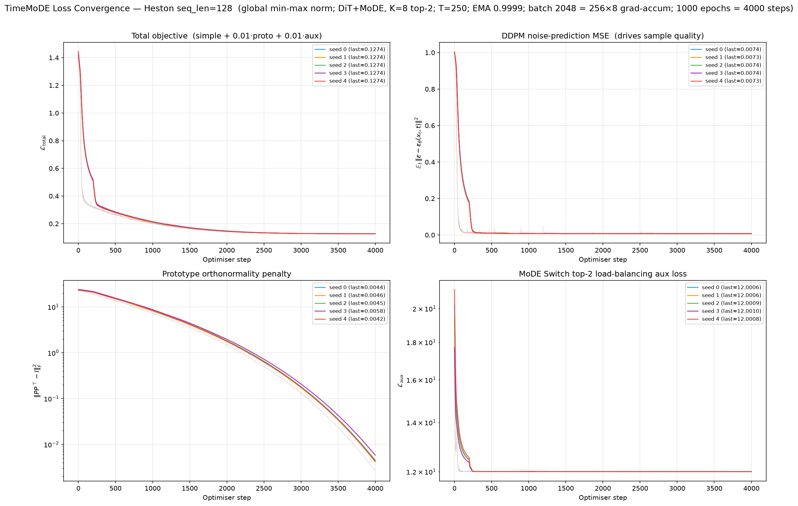
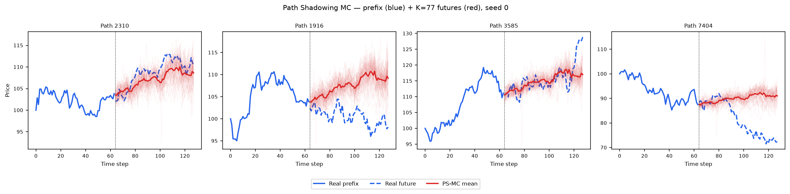
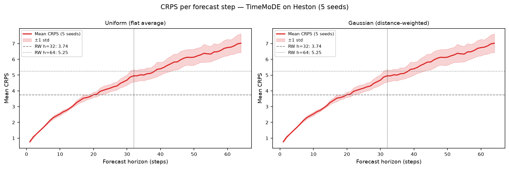

# TimeMoDE on Heston

PyTorch reimplementation of **TimeMoDE** (Yao, Zheng, Zuo, Zhang, ICML 2026 / PMLR 306,
*Towards a Unified Generative Model for Scarce Time Series with Domain Experts*, arXiv:2606.15172)
trained on 8 192 Heston stochastic-volatility price paths (seq\_len = 128).

TimeMoDE is a **Diffusion Transformer (DiT)** whose token-mixing MLPs are replaced by a **Mixture of
Domain Experts (MoDE)**, K = 8 experts, top-2 routed, plus one always-on shared expert E₀, trained as an
ε-prediction DDPM (T = 250, `learn_sigma=False`). No official code was released, so this is a
**from-the-paper reimplementation**. It first reproduced the paper's own headline numbers on the paper's
simplest dataset (StarLightCurves, "From Scratch"), and that **exact seed-0 model is reused unchanged** on
Heston, only the input geometry changes (SLC `L=24` → Heston `L=128`). See
[`paper_reimplementation/README.md`](paper_reimplementation/README.md) for the reproduction gate and
[`code/README.md`](code/README.md) for the training driver, the architecture-parity table, and the
normalisation chain (global min-max → [0, 1]).

**Honest headline.** TimeMoDE reproduces the paper faithfully (gate PASS on Context-FID + Discriminative)
but **performs poorly on Heston**: it is easily discriminated (A18 GRU 0.395), has large marginal-tail errors
(A1 kurtosis 20.10), and shows **very large seed-to-seed variance** (grid_tvd 11.95 %-65.12 %), the signature
of From-Scratch training instability of a 53.9 M-parameter MoE on a single smooth univariate process.
Nothing in the architecture changed between seeds or between SLC and Heston; the variance is genuine run-to-run
optimisation noise, not a configuration difference.

---

## Metrics A1-A34 + B, mean ± std across 5 seeds

> All metrics on **log-returns** $r_t = \log(S_{t+1}/S_t)$ unless noted. A26 uses price increments $\Delta S_t$.

| Metric | Mean ± Std | Seed 0 | Seed 1 | Seed 2 | Seed 3 | Seed 4 | Perfect floor |
|--------|-----------|--------|--------|--------|--------|--------|---------------|
| **, Fat Tail, ** | | | | | | | |
| A1 Kurtosis Error ↓ | 20.10 ± 3.136 | 21.15 | 22.27 | 19.31 | 14.43 | 23.36 | 0.008092 |
| A2 \|r\| q95 Error ↓ | 0.02387 ± 0.006491 | 0.01361 | 0.02345 | 0.02200 | 0.03352 | 0.02679 | 6.57e-05 |
| A3 \|r\| q99 Error ↓ | 0.04025 ± 0.01065 | 0.02408 | 0.03674 | 0.03713 | 0.05508 | 0.04823 | 5.98e-05 |
| A4 Tail QQ Error ↓ | 0.02382 ± 0.006446 | 0.01366 | 0.02327 | 0.02193 | 0.03340 | 0.02680 | 6.75e-05 |
| A5 Hill Tail Index Error ↓ | 6.730 ± 6.378 | 12.21 | 15.86 | 5.396 | 0.09856 | 0.08298 | 0.5266 |
| **, Distribution, ** | | | | | | | |
| A6 Path MMD² ↓ | 0.06947 ± 0.05966 | 0.1402 | 0.1443 | 0.02988 | 0.01454 | 0.01840 | 0.001842 |
| A7 Terminal MMD² ↓ | 0.06458 ± 0.06681 | 0.1167 | 0.1704 | 0.01472 | 0.01579 | 0.005213 | 0.001983 |
| A8 Increment MMD² ↓ | 0.07441 ± 0.01639 | 0.05791 | 0.09306 | 0.06287 | 0.09562 | 0.06261 | 8.69e-04 |
| A9 Volatility MMD ↓ | 2.033 ± 0.3303 | 1.791 | 2.547 | 1.824 | 2.299 | 1.705 | 0.008554 |
| A10 Terminal SWD ↓ | 11.13 ± 9.128 | 22.74 | 21.61 | 3.265 | 6.087 | 1.929 | 1.151 |
| A11 Path SWD ↓ | 8.734 ± 6.925 | 19.04 | 15.08 | 3.950 | 2.853 | 2.746 | 0.6191 |
| A12 RV Law Loss ↓ | 16.52 ± 5.360 | 8.539 | 16.68 | 13.96 | 24.84 | 18.58 | 0.05202 |
| A13 Mean Path RMSE ↓ | 8.840 ± 7.341 | 19.36 | 16.07 | 3.908 | 2.525 | 2.340 | 0.1205 |
| A14 KS Log-returns ↓ | 0.1370 ± 0.02655 | 0.1005 | 0.1573 | 0.1170 | 0.1742 | 0.1360 | 0.001491 |
| A15 Skewness Error ↓ | 0.02843 ± 0.02245 | 0.01022 | 0.03483 | 0.003483 | 0.06741 | 0.02620 | 0.005274 |
| A16 QQ RMSE (300-pt) ↓ | 0.01109 ± 0.002985 | 0.006446 | 0.01126 | 0.009964 | 0.01563 | 0.01215 | 4.19e-05 |
| A17 Terminal Price KS ↓ | 0.3050 ± 0.2233 | 0.5403 | 0.6111 | 0.1453 | 0.1449 | 0.08350 | 0.01099 |
| **, Adversarial, ** | | | | | | | |
| A18 Disc Score GRU ↓ | 0.3950 ± 0.08909 | 0.2876 | 0.4945 | 0.3920 | 0.4957 | 0.3050 | 0.006195 |
| A18 Disc Score MLP ↓ | 0.4609 ± 0.01765 | 0.4493 | 0.4338 | 0.4783 | 0.4805 | 0.4625 | 0.005951 |
| **, Predictive, ** | | | | | | | |
| A19 Pred Score GRU ↓ | 0.08335 ± 0.005229 | 0.07940 | 0.09353 | 0.08148 | 0.08266 | 0.07969 | 0.05002 |
| A19 Pred Score MLP ↓ | 0.07423 ± 0.004722 | 0.06815 | 0.07934 | 0.07122 | 0.08019 | 0.07225 | 0.05036 |
| **, Temporal, ** | | | | | | | |
| A20 Covariance Error ↓ | 64.76 ± 21.18 | 98.60 | 64.04 | 68.12 | 32.00 | 61.02 | 4.923 |
| A21 ACF \|r\| Error (lags) ↓ | 0.07526 ± 0.003463 | 0.07178 | 0.07182 | 0.08122 | 0.07552 | 0.07594 | 0.002234 |
| A22 ACF r² Error (lags) ↓ | 0.07767 ± 0.002639 | 0.07530 | 0.07734 | 0.07439 | 0.08020 | 0.08112 | 0.002206 |
| A23 ACF \|r\| Lag-1 Error ↓ | 0.2258 ± 0.01439 | 0.2108 | 0.2209 | 0.2519 | 0.2162 | 0.2295 | 0.002652 |
| A24 ACF r² Lag-1 Error ↓ | 0.2466 ± 0.008535 | 0.2339 | 0.2445 | 0.2583 | 0.2428 | 0.2535 | 0.002790 |
| **, Vol, ** | | | | | | | |
| A25 Mean RMSE ↓ | 10.88 ± 9.469 | 22.82 | 21.89 | 3.567 | 5.117 | 0.9921 | 0.1392 |
| A26 Return Std Error ↓ | 1.419 ± 0.2615 | 1.126 | 1.682 | 1.205 | 1.777 | 1.305 | 0.002523 |
| A27 Log-Return Std Error ↓ | 0.01320 ± 0.003285 | 0.008040 | 0.01349 | 0.01183 | 0.01803 | 0.01463 | 3.15e-05 |
| A28 Kurtosis Ratio (→ 1) | 0.01840 ± 0.007380 | 0.01034 | 0.01038 | 0.02016 | 0.02988 | 0.02126 | 1.006 |
| A29 Sigma Mean Error ↓ | 0.1931 ± 0.04858 | 0.1159 | 0.2007 | 0.1748 | 0.2653 | 0.2087 | 4.96e-04 |
| A30 Cross-Sect. Vol Path RMSE ↓ | 1.950 ± 0.5991 | 2.975 | 1.958 | 1.990 | 1.127 | 1.697 | 0.1432 |
| A31 Rolling Vol KS (w=5) ↓ | 0.5014 ± 0.08662 | 0.3699 | 0.5521 | 0.4503 | 0.6236 | 0.5111 | 0.003814 |
| A32 Vol-of-Vol Error ↓ | 0.008546 ± 0.001733 | 0.005747 | 0.008466 | 0.007878 | 0.01079 | 0.009847 | 1.54e-05 |
| **, Heston Spec, ** | | | | | | | |
| A33 Teacher-Sigma Corr ↑ | 0.009360 ± 0.006530 | 0.005223 | 0.01637 | 0.01575 | 0.01035 | -8.94e-04 | 0.6163 |
| A34 Teacher-Sigma RMSE ↓ | 0.2737 ± 0.04669 | 0.2004 | 0.2741 | 0.2545 | 0.3411 | 0.2983 | 0.06559 |

> **Convention:** ↓ lower is better; ↑ higher is better;, no monotone direction. A28 Kurtosis Ratio: perfect = 1.0.
> **A1**: |kurt_real − kurt_gen| on log-returns. **A2-A3**: 95th/99th quantile error on |log-returns|. **A4**: QQ error restricted to top-5% tail quantiles. **A5**: |Hill tail index_real − Hill tail index_gen|, Hill estimator on |log-returns| above 95th pct.
> **A6-A11**: path-kernel distances, Gaussian MMD² on full paths / terminal prices / increments / realized-vol, and sliced-Wasserstein on terminal & full paths. Non-zero perfect floor (an independent Heston draw scored against the test set, finite-sample noise).
> **A12**: W₁(RV_real, RV_gen), RV_i = Σ_t r²_{i,t}/dt. Ref: Barndorff-Nielsen & Shephard (2002). **A13**: path-level RMSE between real/gen mean trajectories. **A14**: KS statistic on pooled log-returns. **A15**: |skew_real − skew_gen|, Heston true skew ≈ −0.45. **A16**: QQ RMSE over 300 uniform quantile levels. **A17**: KS statistic on terminal prices S_T.
> **A18**: Discriminative classifier trained on log-returns; score = |accuracy − 0.5|, 0 = indistinguishable (GRU + MLP). **A19**: TSTR predictive MAE; all methods cluster near 0.05 (irreducible log-return floor) (GRU + MLP).
> **A20**: covariance-matrix error (%). **A21-A22**: ACF error on |r| and r² across lags 1-20. ARCH signal: |r_t| has positive lag-1 ACF ~0.05 in Heston. **A23-A24**: ACF lag-1 error on |r| and r². Heston true values ≈ +0.052 / +0.050.
> **A25**: mean-path RMSE. **A26**: return std error, uses price increments $\Delta S_t$. **A27**: log-return std error, uses $r_t = \log(S_{t+1}/S_t)$. **A28**: kurtosis ratio real/gen, perfect = 1.0. **A29**: sigma mean error, annualized per-path vol. **A30**: cross-sectional vol-path RMSE. **A31**: KS statistic on rolling-5 vol histograms. **A32**: |vol-of-vol_real − vol-of-vol_gen|.
> **A33**: Teacher-sigma correlation (Heston-recovered vol vs teacher σ), higher is better, perfect ≈ 0.614. **A34**: Teacher-sigma RMSE, perfect ≈ 0.065.

**Reading the table.** TimeMoDE is a **weak generator on Heston**. It is cleanly distinguishable on both
judges (A18 GRU 0.395, MLP 0.461, near the 0.5 ceiling, i.e. the classifier is almost always right), its
kurtosis is badly off (A1 20.10 vs Diffusion-TS 0.424) and its distributional distances (A6 path MMD² 0.069,
A9 vol MMD 2.03) are an order of magnitude above the diffusion baselines. The dominant story is **variance**:
almost every row spans a factor of 5-15 across seeds (A5 Hill 0.083→15.86, A10 terminal SWD 1.93→22.74, A17
terminal KS 0.084→0.611). Seeds 2/3/4 are markedly better than seeds 0/1, the model sometimes finds a decent
optimum and sometimes collapses to an over-dispersed one, with no architecture or hyperparameter difference
between runs. The one metric where the number *looks* good, **A28 kurtosis ratio 0.018**, is misleading: the
ratio target is 1.0, so 0.018 means the generated kurtosis is ~50× too small relative to real, consistent with
the large A1 error, it is not a win. A33 teacher-sigma correlation ≈ 0, as for every method: no generator
recovers the latent Heston variance process from prices alone (floor 0.616).

---

## B, Curve-Shape Metrics, mean ± std across 5 seeds

Each stylised-fact plot yields a **curve** L (a list of values), not a scalar. For the real data (L_r) and
generated data (L_g) we build three lists, the curve L, its first finite difference L' (der), and its second
finite difference L'' (sec\_der), then combine the three sub-scores into **one number per plot**:

- **MSE row** (decides the winner): for each list, mean((L_r − L_g)²), averaged over the three lists (funct + der + sec\_der).
- **% err row** (function-level MAPE): mean(|L_g − L_r| / (|L_r| + 1e-6)) × 100 on the curve L only; the derivative / 2nd-difference MAPE is excluded as ill-posed (near-zero denominators explode into 10⁴-% figures).
- **NRMSE row**: sqrt(mean((L_g − L_r)²)) / (max|L_r| − min|L_r| + 1e-12) × 100 on the curve L only (funct-only).
- **CVaR₉₀ / CVaR₉₅ rows**: tail-averaged pointwise curve error (Expected Shortfall) on the curve L only; eₜ = |L_g(t) − L_r(t)|, CVaR_q = mean(eₜ for eₜ ≥ q-th percentile), range-normalized like NRMSE. q ∈ {0.90, 0.95}.

All ↓ lower is better. The perfect floor is **non-zero** for all plots, the residual finite-sample error of an independent Heston draw scored against the test set, identical across methods.

| Plot | Measure | Mean ± Std | Seed 0 | Seed 1 | Seed 2 | Seed 3 | Seed 4 | Perfect floor |
|------|---------|-----------|--------|--------|--------|--------|--------|---------------|
| **Path comparison** *(50×50 path-cloud)* | grid_tvd 50×50 (%) ↓ | 35.58% ± 22.96% | 65.12% | 61.67% | 22.09% | 11.95% | 17.07% | 2.237% |
| **Log-return histogram** | MSE | 14.84 ± 4.653 | 8.526 | 17.80 | 11.37 | 21.74 | 14.75 | 0.1098 |
|  | % err | 112.4% ± 24.79% | 74.51% | 126.6% | 99.73% | 148.1% | 113.2% | 1.799% |
|  | NRMSE | 17.86% ± 2.921% | 13.65% | 19.86% | 15.80% | 21.94% | 18.05% | 0.5328% |
|  | CVaR₉₀ | 37.47% ± 5.269% | 30.03% | 41.21% | 33.48% | 44.78% | 37.84% | 1.234% |
|  | CVaR₉₅ | 39.84% ± 5.430% | 32.08% | 43.66% | 35.82% | 47.34% | 40.32% | 1.444% |
| **QQ plot** | MSE | 5.02e-05 ± 2.50e-05 | 1.61e-05 | 4.67e-05 | 3.80e-05 | 9.20e-05 | 5.81e-05 | 1.09e-09 |
|  | % err | 93.59% ± 22.96% | 63.42% | 110.8% | 76.19% | 127.0% | 90.49% | 0.4629% |
|  | NRMSE | 31.65% ± 8.481% | 18.46% | 31.80% | 28.50% | 44.46% | 35.04% | 0.1206% |
|  | CVaR₉₀ | 36.63% ± 9.839% | 21.19% | 35.32% | 33.71% | 51.05% | 41.87% | 0.1319% |
|  | CVaR₉₅ | 44.51% ± 11.84% | 26.12% | 41.93% | 41.00% | 61.44% | 52.07% | 0.1599% |
| **ACF \|r\| lags 1-20** | MSE | 0.003242 ± 1.60e-04 | 0.003049 | 0.003210 | 0.003148 | 0.003279 | 0.003525 | 9.61e-06 |
|  | % err | 107.0% ± 17.32% | 104.8% | 80.90% | 135.0% | 111.0% | 103.4% | 8.724% |
|  | NRMSE | 146.6% ± 8.924% | 138.3% | 140.0% | 163.2% | 143.8% | 147.7% | 6.071% |
|  | CVaR₉₀ | 341.4% ± 17.58% | 321.1% | 333.5% | 372.9% | 333.7% | 345.7% | 11.26% |
|  | CVaR₉₅ | 601.0% ± 38.30% | 560.9% | 587.9% | 670.3% | 575.3% | 610.6% | 12.06% |
| **ACF r² lags 1-20** | MSE | 0.003771 ± 2.76e-04 | 0.003565 | 0.003818 | 0.003382 | 0.003913 | 0.004178 | 9.17e-06 |
|  | % err | 117.7% ± 10.56% | 118.9% | 97.34% | 122.8% | 127.7% | 121.7% | 11.34% |
|  | NRMSE | 170.8% ± 4.574% | 163.4% | 168.3% | 174.8% | 171.5% | 176.0% | 6.486% |
|  | CVaR₉₀ | 402.2% ± 10.46% | 383.3% | 402.1% | 408.2% | 402.8% | 414.6% | 12.35% |
|  | CVaR₉₅ | 722.3% ± 25.00% | 685.2% | 716.2% | 756.6% | 711.0% | 742.3% | 13.27% |
| **Rolling vol histogram** | MSE | 460.2 ± 142.2 | 278.9 | 571.3 | 339.5 | 663.1 | 448.1 | 1.372 |
|  | % err | 307.4% ± 73.28% | 197.4% | 354.8% | 268.7% | 412.2% | 303.7% | 2.264% |
|  | NRMSE | 41.42% ± 6.554% | 32.62% | 46.74% | 36.00% | 50.35% | 41.38% | 0.8688% |
|  | CVaR₉₀ | 66.25% ± 8.426% | 56.08% | 73.64% | 57.54% | 77.25% | 66.77% | 1.970% |
|  | CVaR₉₅ | 67.46% ± 8.373% | 57.62% | 74.98% | 58.56% | 78.31% | 67.85% | 2.308% |
| **Tail survival** | MSE | 0.01218 ± 0.004580 | 0.005687 | 0.01391 | 0.009427 | 0.01940 | 0.01248 | 5.22e-07 |
|  | % err | 104.2% ± 26.65% | 62.80% | 111.3% | 92.75% | 144.6% | 109.4% | 0.3302% |
|  | NRMSE | 18.93% ± 3.726% | 13.18% | 20.62% | 16.97% | 24.35% | 19.53% | 0.1050% |
|  | CVaR₉₀ | 26.13% ± 5.298% | 17.99% | 28.50% | 23.35% | 33.89% | 26.92% | 0.1625% |
|  | CVaR₉₅ | 26.20% ± 5.313% | 18.04% | 28.58% | 23.40% | 33.98% | 26.98% | 0.1682% |

> **Log-ret histogram MSE 14.84**, 3× the Diffusion-TS value (4.88): TimeMoDE badly over-disperses the central
> return bins (A28 kurtosis ratio 0.018 → generated tails far too thin). **Rolling-vol histogram MSE 460**, 2×
> Diffusion-TS (220): the vol distribution is the worst-fit curve, consistent with A9/A31. **ACF |r|, ACF r²**:
> read MSE (tiny, ~3e-3) for absolute agreement and % error (>100 %) for relative shape, the true ACF ≈ 0.05
> sits near zero so relative error is inflated by near-zero denominators.

---

## Stylised Facts Diagnostic (Heston vs TimeMoDE, seed 0)

Eight-panel comparison matching the Murex paper (Fig. 1 style): sample paths, return distribution,
QQ plot, ACF of |returns|, ACF of squared returns, rolling vol histogram (window=5), tail survival (log-log).


---

## TimeMoDE Training Loss (5 seeds)

TimeMoDE optimises a **composite** objective, logged once per optimiser step over 4 000 steps
(1 000 epochs × 4 grad-accum micro-steps; effective batch 2 048):

$$\mathcal{L}_{\text{total}} = \mathcal{L}_{\text{simple}} + 0.01\,\mathcal{L}_{\text{proto}} + 0.01\,\mathcal{L}_{\text{aux}}$$

- **simple**, DDPM ε-prediction MSE $\mathbb{E}_t\|\epsilon-\epsilon_\theta(x_t,t)\|^2$; the only term that drives sample quality. Converges to ~0.006-0.008.
- **proto**, prototype orthonormality penalty $\|PP^\top-I\|_F^2$ on the K = 8 expert prototype bank; collapses toward 0.
- **aux**, MoDE Switch top-2 load-balancing loss; plateaus near ~12 (uniform-routing floor for K = 8, top-2).

Each term is plotted in its own panel with all 5 seeds overlaid and a trailing moving average, see
[`code/plot_losses.py`](code/plot_losses.py). The four terms converge nearly identically across seeds, which is
the point: **the training loss is stable and seed-invariant even though the generated-sample quality is not**.
The seed-to-seed spread in the metric tables above therefore comes from *which* mode the sampler settles into,
not from divergent optimisation.



---

## A18, Discriminative Classifier Training Loss

BCE loss during GRU and MLP classifier training (2 000 steps, logged every 50 steps).
A value near ln(2) ≈ 0.693 means the classifier cannot distinguish real from fake. TimeMoDE's classifiers drive
the loss **well below** ln(2) (real vs fake is easy), consistent with A18 ≈ 0.40-0.46.


---

## A19, Predictive Score Training Loss (TSTR)

MAE loss during GRU and MLP predictor training on *synthetic* data (5 000 steps, logged every 100 steps).


---

## Path Shadowing MC (arXiv:2308.01486)

Given a real path prefix (steps 0-63), embed it as a **65D murex-style feature vector** (63 step-by-step
log-returns + terminal cumulative return + realized volatility, z-scored using the generated pool
distribution), retrieve K = 77 nearest TimeMoDE paths by L2 distance in that space, then use their
price-anchored futures (steps 64-127) as a forecast ensemble. Two variants: flat average (**Uniform**) and
distance-weighted (**Gaussian**, per-query η adaptive). The PS-MC pipeline is **model-agnostic**, it consumes
only the generated `.npy` paths, identical to Diffusion-TS's and TimeGAN's.

### Example ensemble fan-out (seed 0)



### CRPS per forecast step



### Results (mean ± std, 5 seeds)

| Metric | H=32 Uniform | H=32 Gaussian | H=64 Uniform | H=64 Gaussian | Naive RW |
|--------|:------------:|:-------------:|:------------:|:-------------:|:--------:|
| **CRPS** | **3.196 ± 0.139** | 3.197 ± 0.139 | **4.601 ± 0.290** | 4.601 ± 0.290 | 3.738 / 5.246 |
| MAE    | 4.002 ± 0.149 | 4.002 ± 0.149 | 5.694 ± 0.276 | 5.694 ± 0.276 | 3.738 / 5.246 |
| RMSE   | 5.454 ± 0.202 | 5.454 ± 0.202 | 7.792 ± 0.385 | 7.792 ± 0.385 | 5.040 / 7.066 |

PS-MC **beats the naive RW on CRPS** at both horizons (3.196 < 3.738 at H=32; 4.601 < 5.246 at H=64), on all
5 seeds, even a weak TimeMoDE pool still gives a calibrated nearest-neighbour ensemble that improves on a point
forecast. But its CRPS **trails every diffusion/state-space method** (Diffusion-TS 2.717, CSDI 2.718, LS4 2.704
at H=32): the poorer TimeMoDE pool yields looser neighbours. Uniform ≈ Gaussian: Heston is time-homogeneous, so
the K nearest neighbours are roughly equally predictive.

Full analysis: [`../../results/Heston/TimeMoDE/path_shadowing/README.md`](../../results/Heston/TimeMoDE/path_shadowing/README.md)

---

## File layout

```
methods/TimeMoDE/
├── README.md                          ← this file
├── generated_paths/seed_{0..4}/
│   ├── generated_paths_8192x128.npy   shape (8192, 128), original price scale
│   └── metadata.json                  seed, shape, train time, params (53.91 M)
├── weights/
│   ├── seed_{i}_model.pt              model + EMA state_dict, arch, minmax
│   └── seed_{i}_config.json           full hyperparameters + scaling constants
├── losses/
│   ├── seed_{i}_losses.csv            step, loss_total, simple, proto, aux
│   └── loss_convergence.png           4-panel convergence plot (5 seeds overlaid)
├── code/
│   ├── train_seed.py                  single-seed Heston driver (imports the gate model)
│   ├── train.py                       2-GPU launcher
│   ├── plot_losses.py                 4-panel composite-loss plotter
│   └── README.md                      driver, architecture-parity table, normalisation chain
├── paper_reimplementation/            SLC "From Scratch" reproduction GATE (paper's own metrics)
│   ├── timemode_model.py              the exact DiT-MoDE (imported unchanged by Heston)
│   ├── diffusion.py                   the exact ε-prediction DDPM
│   └── README.md                      paper-vs-ours c-FID + Disc table, predictive-artifact note
└── path_shadowing/                    model-agnostic PS-MC forecaster
```

## Reproduce

```bash
# Train all 5 seeds (imports the gate-validated DiT-MoDE; 2 GPUs, ~5.6 h/seed)
cd methods/TimeMoDE/code
/home/tbasseras/gpu-venv/bin/python train.py            # launches seeds across GPUs

# Compute metrics
cd /home/tbasseras/benchmark
/home/tbasseras/gpu-venv/bin/python metrics/compute_all.py --method TimeMoDE --dataset Heston
```
