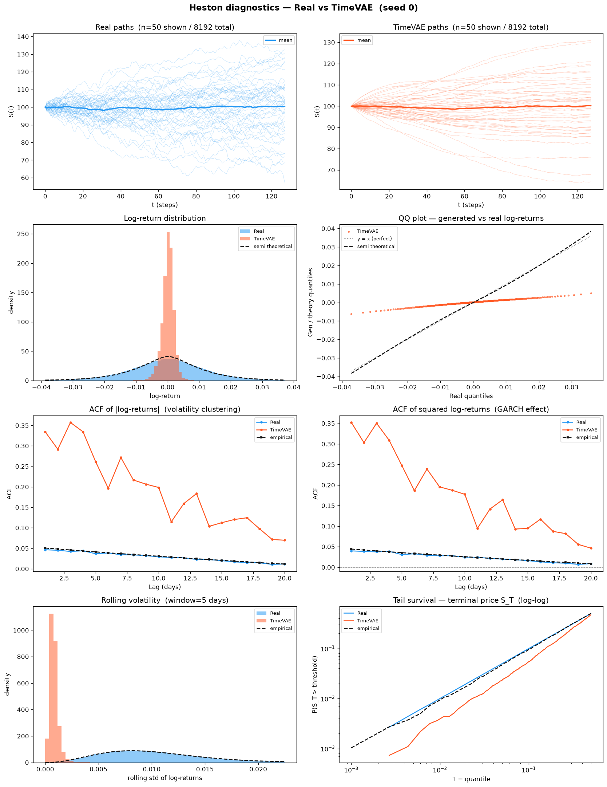
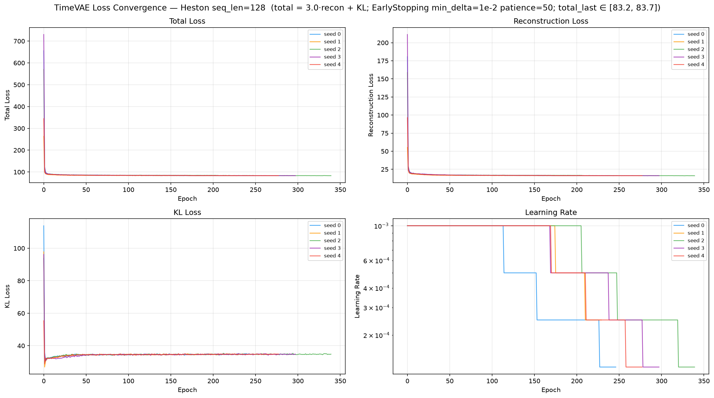
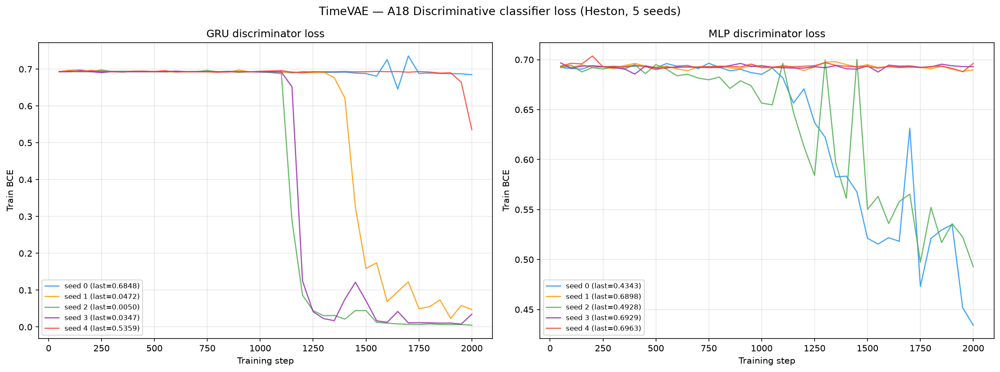
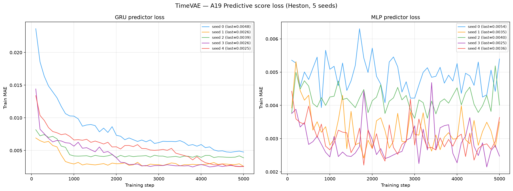
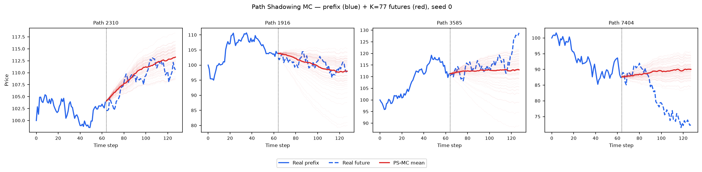
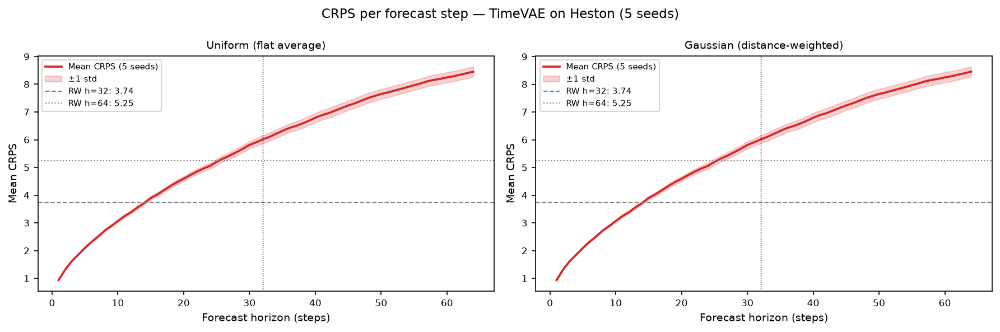

# TimeVAE on Heston

PyTorch reimplementation of **TimeVAE** (Desai, Freeman, Beaver & Wang, 2021 —
*TimeVAE: A Variational Auto-Encoder for Multivariate Time Series Generation*, arXiv:2111.08095v3)
trained on 8 192 Heston stochastic-volatility price paths (seq\_len = 128).

See [`code/README.md`](code/README.md) for the source, the original paper/GitHub, the TimeVAE-Base
architecture (latent\_dim = 8, hidden = 50/100/200, `reconstruction_wt` = 3.0), and the per-`(t, feature)`
MinMax normalisation chain applied to fit the price-scale Heston data into the model's `[0, 1]` space.

---

## Metrics A1–A34 + B — mean ± std across 5 seeds

> All metrics on **log-returns** $r_t = \log(S_{t+1}/S_t)$ unless noted. A26 uses price increments $\Delta S_t$.

| ID | Metric | Category | Dir | Mean ± Std | Seed 0 | Seed 1 | Seed 2 | Seed 3 | Seed 4 | Perfect floor |
|----|--------|----------|-----|-----------|--------|--------|--------|--------|--------|---------------|
| | **— Fat Tail —** | | | | | | | | | |
| A1 | Kurtosis Error | Fat Tail | ↓ | 2.2577 ± 0.5719 | 1.3677 | 2.6621 | 1.7911 | 2.6682 | 2.7994 | 0 |
| A2 | \|r\| q95 Error | Fat Tail | ↓ | 0.0222 ± 1.22e-04 | 0.0220 | 0.0223 | 0.0222 | 0.0223 | 0.0223 | 0 |
| A3 | \|r\| q99 Error | Fat Tail | ↓ | 0.0308 ± 1.05e-04 | 0.0306 | 0.0309 | 0.0308 | 0.0309 | 0.0308 | 0 |
| A4 | Tail QQ Error | Fat Tail | ↓ | 0.0219 ± 1.17e-04 | 0.0216 | 0.0219 | 0.0218 | 0.0220 | 0.0219 | 0 |
| A5 | Hill Tail Index Error | Fat Tail | ↓ | 2.396 ± 0.6794 | 2.056 | 1.263 | 2.541 | 3.110 | 3.011 | 0 |
| | **— Distribution —** | | | | | | | | | |
| A6 | Path MMD² | Distribution | ↓ | 0.0184 ± 9.55e-04 | 0.0180 | 0.0190 | 0.0178 | 0.0199 | 0.0172 | 0.0015 |
| A7 | Terminal MMD² | Distribution | ↓ | 0.0042 ± 0.0011 | 0.0032 | 0.0060 | 0.0041 | 0.0046 | 0.0029 | 0.0016 |
| A8 | Increment MMD² | Distribution | ↓ | 0.2134 ± 0.0012 | 0.2131 | 0.2118 | 0.2130 | 0.2155 | 0.2136 | 7.45e-04 |
| A9 | Volatility MMD | Distribution | ↓ | 3.591 ± 0.4563 | 2.941 | 3.812 | 3.153 | 3.999 | 4.049 | 0.0071 |
| A10 | Terminal SWD | Distribution | ↓ | 1.798 ± 0.2603 | 1.523 | 2.057 | 1.819 | 2.108 | 1.483 | 0.6873 |
| A11 | Path SWD | Distribution | ↓ | 0.9882 ± 0.2052 | 0.8341 | 1.202 | 0.8952 | 1.262 | 0.7480 | 0.4381 |
| A12 | RV Law Loss | Distribution | ↓ | 4.986 ± 0.0084 | 4.971 | 4.991 | 4.982 | 4.994 | 4.992 | 0 |
| A13 | Mean Path RMSE | Distribution | ↓ | 0.2981 ± 0.2172 | 0.4999 | 0.1395 | 0.6196 | 0.1259 | 0.1058 | 0 |
| A14 | KS Log-returns | Distribution | ↓ | 0.3673 ± 0.0046 | 0.3612 | 0.3709 | 0.3622 | 0.3720 | 0.3701 | 0 |
| A15 | Skewness Error | Distribution | ↓ | 0.5568 ± 0.0984 | 0.4720 | 0.6895 | 0.4188 | 0.6172 | 0.5867 | 0 |
| A16 | QQ RMSE (300-pt) | Distribution | ↓ | 0.0105 ± 8.40e-05 | 0.0104 | 0.0106 | 0.0105 | 0.0106 | 0.0106 | 0 |
| A17 | Terminal Price KS | Distribution | ↓ | 0.0478 ± 0.0099 | 0.0664 | 0.0468 | 0.0449 | 0.0439 | 0.0370 | 0 |
| | **— Adversarial —** | | | | | | | | | |
| A18 GRU | Discriminative Score GRU | Adversarial | ↓ | 0.2035 ± 0.1934 | 0.0072 | 0.1414 | 0.4576 | 0.0056 | 0.4057 | 0.0042 |
| A18 MLP | Discriminative Score MLP | Adversarial | ↓ | 0.1756 ± 0.1354 | 0.3392 | 0.1216 | 0.3300 | 0.0841 | 0.0032 | 0.0067 |
| | **— Predictive —** | | | | | | | | | |
| A19 GRU | Predictive Score GRU | Predictive | ↓ | 0.0577 ± 8.53e-04 | 0.05657 | 0.05755 | 0.05710 | 0.05838 | 0.05894 | 0.0537 |
| A19 MLP | Predictive Score MLP | Predictive | ↓ | 0.0564 ± 2.75e-04 | 0.05678 | 0.05609 | 0.05610 | 0.05661 | 0.05650 | 0.0539 |
| | **— Temporal —** | | | | | | | | | |
| A20 | Covariance Error | Temporal | ↓ | 51.272 ± 1.758 | 52.105 | 51.964 | 53.760 | 49.103 | 49.430 | 0 |
| A21 | ACF \|r\| Error (lags) | Temporal | ↓ | 0.3865 ± 0.1057 | 0.2211 | 0.4488 | 0.3024 | 0.4799 | 0.4803 | 0 |
| A22 | ACF r² Error (lags) | Temporal | ↓ | 0.3580 ± 0.0885 | 0.2253 | 0.4130 | 0.2788 | 0.4382 | 0.4344 | 0 |
| A23 | ACF \|r\| Lag-1 Error | Temporal | ↓ | 0.4637 ± 0.1346 | 0.2784 | 0.5216 | 0.3283 | 0.5937 | 0.5965 | 0 |
| A24 | ACF r² Lag-1 Error | Temporal | ↓ | 0.4589 ± 0.1189 | 0.3016 | 0.5167 | 0.3301 | 0.5764 | 0.5697 | 0 |
| | **— Vol —** | | | | | | | | | |
| A25 | Mean RMSE | Vol | ↓ | 0.3396 ± 0.2710 | 0.8152 | 0.0701 | 0.4608 | 0.1752 | 0.1766 | 0 |
| A26 | Return Std Error | Vol | ↓ | 1.0729 ± 0.0078 | 1.0596 | 1.0780 | 1.0683 | 1.0800 | 1.0783 | 0 |
| A27 | Log-Return Std Error | Vol | ↓ | 0.0109 ± 7.80e-05 | 0.0108 | 0.0110 | 0.0109 | 0.0110 | 0.0110 | 0 |
| A28 | Kurtosis Ratio | Vol | — | 0.2780 ± 0.0467 | 0.3487 | 0.2346 | 0.3189 | 0.2485 | 0.2393 | 1.000 |
| A29 | Sigma Mean Error | Vol | ↓ | 0.1741 ± 0.0018 | 0.1712 | 0.1752 | 0.1729 | 0.1757 | 0.1754 | 0 |
| A30 | Cross-Sect. Vol Path RMSE | Vol | ↓ | 1.1223 ± 0.0447 | 1.1285 | 1.1462 | 1.1879 | 1.0900 | 1.0588 | 0 |
| A31 | Rolling Vol KS (w=5) | Vol | ↓ | 0.9871 ± 0.0045 | 0.9785 | 0.9872 | 0.9885 | 0.9913 | 0.9900 | 0 |
| A32 | Vol-of-Vol Error | Vol | ↓ | 0.0046 ± 5.60e-05 | 0.0045 | 0.0046 | 0.0046 | 0.0046 | 0.0046 | 0 |
| | **— Heston Spec —** | | | | | | | | | |
| A33 | Teacher-Sigma Corr | Heston Spec | ↑ | 0.0273 ± 0.0050 | 0.0241 | 0.0264 | 0.0261 | 0.0228 | 0.0370 | 0.6143 |
| A34 | Teacher-Sigma RMSE | Heston Spec | ↓ | 0.1793 ± 0.0016 | 0.1766 | 0.1803 | 0.1782 | 0.1808 | 0.1806 | 0.0654 |

> **Convention:** ↓ lower is better; ↑ higher is better; — no monotone direction. A28 Kurtosis Ratio: perfect = 1.0.
> **A1**: |kurt_real − kurt_gen| on log-returns. **A2–A3**: 95th/99th quantile error on |log-returns|. **A4**: QQ error restricted to top-5% tail quantiles. **A5**: |Hill tail index_real − Hill tail index_gen|, Hill estimator on |log-returns| above 95th pct.
> **A6–A11**: path-kernel distances — Gaussian MMD² on full paths / terminal prices / increments / realized-vol, and sliced-Wasserstein on terminal & full paths. Non-zero perfect floor (an independent Heston draw scored against the test set — finite-sample noise).
> **A12**: W₁(RV_real, RV_gen), RV_i = Σ_t r²_{i,t}/dt. Ref: Barndorff-Nielsen & Shephard (2002). **A13**: path-level RMSE between real/gen mean trajectories. **A14**: KS statistic on pooled log-returns. **A15**: |skew_real − skew_gen|, Heston true skew ≈ −0.45. **A16**: QQ RMSE over 300 uniform quantile levels. **A17**: KS statistic on terminal prices S_T.
> **A18**: Discriminative classifier trained on log-returns; score = |accuracy − 0.5|, 0 = indistinguishable (GRU + MLP). **A19**: TSTR predictive MAE; all methods cluster near 0.056–0.059 (irreducible log-return floor) (GRU + MLP).
> **A20**: covariance-matrix error (%). **A21–A22**: ACF error on |r| and r² across lags 1–20. ARCH signal: |r_t| has positive lag-1 ACF ~0.05 in Heston. **A23–A24**: ACF lag-1 error on |r| and r². Heston true values ≈ +0.052 / +0.050.
> **A25**: mean-path RMSE. **A26**: return std error, uses price increments $\Delta S_t$. **A27**: log-return std error, uses $r_t = \log(S_{t+1}/S_t)$. **A28**: kurtosis ratio real/gen, perfect = 1.0. **A29**: sigma mean error — annualized per-path vol. **A30**: cross-sectional vol-path RMSE. **A31**: KS statistic on rolling-5 vol histograms. **A32**: |vol-of-vol_real − vol-of-vol_gen|.
> **A33**: Teacher-sigma correlation (Heston-recovered vol vs teacher σ), higher is better, perfect ≈ 0.614. **A34**: Teacher-sigma RMSE, perfect ≈ 0.065.

---

## B — Curve-Shape Metrics — mean ± std across 5 seeds

Each stylised-fact plot yields a **curve** L (a list of values), not a scalar. For the real
data (L_r) and generated data (L_g) we build three lists — the curve L, its first finite
difference L' (der), and its second finite difference L'' (sec\_der) — then combine the three
sub-scores into **one number per plot**:

- **MSE row**: for each list, dᵢ = mean((L_r − L_g)²). Reported mean = m_funct + m_der + m_sec\_der (**sum** of the three seed-means); std = sqrt(s_funct² + s_der² + s_sec\_der²) (**quadrature**).
- **% err row**: for each list, dᵢ = mean(|L_g − L_r| / (|L_r| + 1e-6)) × 100, a proper MAPE — one division (the mean already averages over the curve's points). Reported value = the **function-level MAPE on the curve L itself** — the derivative / 2nd-derivative MAPE is **excluded** because diff(L)/diff2(L) have near-zero true values, so their relative error explodes into meaningless 10⁴-% figures. mean/std = mean and **sample std across the 5 seeds** of that per-seed function MAPE.

All ↓ lower is better. The perfect floor is **non-zero** for all six plots — it is the residual finite-sample error of an independent Heston draw scored against the test set, identical across methods.
Two sublines per plot: **MSE** and **% error** (the per-seed columns hold that seed's combined score).

| Plot | Measure | Mean ± Std | Seed 0 | Seed 1 | Seed 2 | Seed 3 | Seed 4 | Perfect |
|------|---------|-----------|--------|--------|--------|--------|--------|:------:|
| **Log-return histogram** | MSE | 2887.259 ± 310.994 | 2082.294 | 3156.603 | 2445.721 | 3386.113 | 3365.564 | 0 |
| | % err | 114.827% ± 0.588% | 113.754% | 115.203% | 114.639% | 115.333% | 115.209% | 0 |
| **QQ plot** | MSE | 1.19e-04 ± 1.80e-06 | 1.16e-04 | 1.20e-04 | 1.18e-04 | 1.21e-04 | 1.20e-04 | 0 |
| | % err | 90.291% ± 1.536% | 87.504% | 91.291% | 89.758% | 91.291% | 91.610% | 0 |
| **ACF \|r\| lags 1–20** | MSE | 0.1005 ± 0.0453 | 0.0399 | 0.1207 | 0.0600 | 0.1389 | 0.1428 | 0 |
| | % err | 891.100% ± 249.264% | 519.196% | 1042.700% | 666.704% | 1105.252% | 1121.651% | 0 |
| **ACF r² lags 1–20** | MSE | 0.0798 ± 0.0330 | 0.0360 | 0.0942 | 0.0502 | 0.1082 | 0.1102 | 0 |
| | % err | 903.154% ± 234.327% | 558.586% | 1048.821% | 685.035% | 1105.737% | 1117.591% | 0 |
| **Rolling vol histogram** | MSE | 47159.416 ± 4926.055 | 56934.005 | 35525.634 | 50667.272 | 48666.273 | 44003.894 | 0 |
| | % err | 334.809% ± 11.759% | 347.742% | 312.838% | 340.851% | 335.866% | 336.751% | 0 |
| **Tail survival** | MSE | 0.2168 ± 0.0057 | 0.2071 | 0.2206 | 0.2135 | 0.2219 | 0.2210 | 0 |
| | % err | 90.076% ± 0.638% | 88.993% | 90.482% | 89.704% | 90.652% | 90.550% | 0 |

> **Log-ret histogram**: MSE 2887 is by far the weakest B panel — TimeVAE collapses the log-return density into a too-narrow central peak (see A28 Kurtosis Ratio 0.28 ≪ 1.0, i.e. generated returns are ~3.6× more peaked than Heston), so the histogram bins mismatch strongly in absolute terms.
> **ACF \|r\|, ACF r²**: the MSE is small (~0.1) because the true ACF ≈ 0.05 sits near zero, but the **% error** (function-level MAPE) blows up (~890% / 903%) for exactly that reason — near-zero denominators amplify any deviation. TimeVAE reproduces almost none of the ARCH autocorrelation (A21 0.39, A23 0.46 vs Diffusion-TS 0.02 / 0.004). Read MSE for absolute agreement, % error for relative shape.
> **Rolling vol histogram**: MSE 47159 — TimeVAE fails to reproduce the Heston rolling-volatility distribution (A31 rolling-vol KS 0.987, essentially disjoint supports).

---

## Stylised Facts Diagnostic (Heston vs TimeVAE, seed 0)

Eight-panel comparison matching the Murex paper (Fig. 1 style): sample paths, return distribution,
QQ plot, ACF of |returns|, ACF of squared returns, rolling vol histogram (window=5), tail survival (log-log).



---

## TimeVAE Training Loss (5 seeds)

TimeVAE is a variational auto-encoder, so each epoch logs three additive components:
**Total = 3.0·Reconstruction + KL** (the `reconstruction_wt` = 3.0 preset from the paper),
plus the `ReduceLROnPlateau` learning rate. Training runs Adam(lr = 1e-3), batch 16, up to 1 000
epochs with `EarlyStopping(monitor = total_loss, min_delta = 1e-2, patience = 50)`. All 5 seeds
early-stop between **230 and 340 epochs**, with the total loss falling from ~450 to a plateau of
**~83** (per-seed final total: seed 0 83.19 @ 247 ep, seed 1 83.13 @ 230, seed 2 82.99 @ 340,
seed 3 82.81 @ 298, seed 4 82.76 @ 278). See [`code/README.md`](code/README.md) for the loss
definition and the MinMax normalisation chain.



---

## A18 — Discriminative Classifier Training Loss

BCE loss during GRU and MLP classifier training (2 000 steps, logged every 50 steps).
A value near ln(2) ≈ 0.693 means the classifier cannot distinguish real from fake.



---

## A19 — Predictive Score Training Loss (TSTR)

MAE loss during GRU and MLP predictor training on *synthetic* data (5 000 steps, logged every 100 steps).



---

## Path Shadowing MC (arXiv:2308.01486)

Given a real path prefix (steps 0–63), embed it as a **65D murex-style feature vector**
(63 step-by-step log-returns + terminal cumulative return + realized volatility, z-scored
using the generated pool distribution), retrieve K=77 nearest TimeVAE paths by L2 distance
in that space, then use their price-anchored futures (steps 64–127) as a forecast ensemble.
Two variants: flat average (**Uniform**) and distance-weighted (**Gaussian**,
per-query η = η̃·‖z(x̃)‖ with η̃ = median(dist)/median(‖z‖) calibrated from data). The PS-MC pipeline
is **model-agnostic** — it consumes only the generated `.npy` paths, identical to the other methods'.

### Example ensemble fan-out (seed 0)



### CRPS per forecast step



### Results (mean ± std, 5 seeds)

| Metric | H=32 Uniform | H=32 Gaussian | H=64 Uniform | H=64 Gaussian | Naive RW |
|--------|:------------:|:-------------:|:------------:|:-------------:|:--------:|
| **CRPS** | 3.855 ± 0.070 | 3.856 ± 0.070 | 5.634 ± 0.124 | 5.634 ± 0.124 | 3.73 / 5.30 |
| MAE    | 4.414 ± 0.045 | 4.414 ± 0.045 | 6.549 ± 0.086 | 6.549 ± 0.086 | 3.73 / 5.30 |
| RMSE   | 6.064 ± 0.061 | 6.065 ± 0.061 | 8.947 ± 0.111 | 8.948 ± 0.111 | 5.07 / 7.18 |

PS-MC does **not** beat the naive RW on CRPS at either horizon (3.86 > 3.73 at H=32; 5.63 > 5.30 at
H=64). TimeVAE's prior-generated pool does not contain price-anchored futures that are close enough to
the real prefixes to form a well-calibrated nearest-neighbour ensemble — consistent with its weak
stylised-facts fit (A9 Volatility MMD 3.59, A31 Rolling-Vol KS 0.987). Uniform ≈ Gaussian: Heston is
time-homogeneous, so the K nearest neighbours are roughly equally predictive.

Full analysis: [`../../results/Heston/TimeVAE/path_shadowing/README.md`](../../results/Heston/TimeVAE/path_shadowing/README.md)

---

## File layout

```
methods/TimeVAE/
├── README.md                          ← this file
├── generated_paths/seed_{0..4}/
│   ├── generated_paths_8192x128.npy   shape (8192, 128), original price scale
│   └── metadata.json                  seed, shape, min/max, train time, params
├── weights/
│   ├── seed_{i}_model.pt              VAE encoder/decoder state_dict
│   └── seed_{i}_config.json           full hyperparameters + MinMax constants
├── losses/
│   ├── seed_{i}_losses.csv            epoch, total_loss, reconstruction_loss, kl_loss, lr
│   └── loss_convergence.png           convergence plot (5 seeds, Total/Recon/KL/LR panels)
├── code/
│   ├── train_heston.py                Heston training driver (imports timevae_torch)
│   ├── timevae_torch.py               PyTorch TimeVAE-Base port
│   ├── plot_losses.py                 loss-convergence plot generator
│   ├── reference/                     verbatim released code (abudesai/timeVAE)
│   └── README.md                      paper, GitHub, architecture, fixes, hyperparameters
├── paper_reimplementation/            sine len-24 paper reproduction (disc/pred score)
└── path_shadowing/                    model-agnostic PS-MC forecaster
```

## Reproduce

```bash
# Train all 5 seeds (2 A100 GPUs in parallel)
cd methods/TimeVAE/code
/home/tbasseras/gpu-venv/bin/python train_heston.py --seed 0

# Compute all metrics
cd /home/tbasseras/benchmark
/home/tbasseras/gpu-venv/bin/python metrics/compute_all.py --method TimeVAE --dataset Heston

# Run Path Shadowing MC
cd methods/TimeVAE/path_shadowing
/home/tbasseras/gpu-venv/bin/python run_eval.py
```
