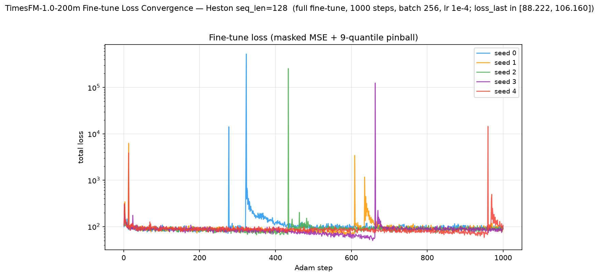

# TimesFM — Forecaster Reference (not a generator)

**TimesFM is used in this benchmark as a *forecaster reference*, not as a generative method.**
Every unconditional generator (TimeGAN, COSCI-GAN, GT-GAN, Diffusion-TS, CSDI, TimeVAE, TimeVQVAE, LS4,
SBTS, Fourier Flow) has its forecasting ability measured *indirectly* through **Path-Shadowing Monte-Carlo**
(PS-MC): retrieve nearest generated paths to a real prefix and forecast with their futures. TimesFM —
like Chronos-2 — answers the natural question that raises — *how good is a purpose-built conditional
forecaster on the same task?* — by forecasting the Heston future **directly**. It sits in the **forecaster
category** alongside Chronos-2 and is one of the **"best forecaster" yardsticks** the generator PS-MC rows
are measured against.

TimesFM (Das, Kong, Sen, Zhou, Google Research, **ICML 2024** — *A decoder-only foundation model for
time-series forecasting*, arXiv:2310.10688v4, `github.com/google-research/timesfm`) is a pretrained
**decoder-only patched** probabilistic forecaster. This benchmark uses the released checkpoint
`google/timesfm-1.0-200m-pytorch` (**~200M params**; 20 layers, model_dims 1280, input-patch 32,
output-patch 128, positional embeddings on). Given a context window it emits a mean plus **9 predictive
quantiles** (levels 0.1…0.9) per future step.

> **There is no `old/` folder.** Unlike Chronos-2, TimesFM was never run as an unconditional generator in
> this benchmark — it enters purely as a forecaster reference, so there is no retired generator experiment
> to archive. TimesFM appears in the forecaster category only and is **excluded from every A/B/PS-MC
> generator table and win-count** in the root and results READMEs.

---

## Forecaster-reference protocol

Direct conditional forecast on the Heston **test set** (`dataset/Heston/heston_S_test_8192x128.npy`,
8 192 paths × 128 steps, price scale) — identical to the Chronos-2 reference protocol so the two
forecasters and the generator PS-MC rows all line up:

1. **Prefix = 64 steps** (steps 0–63) of each real test path — matches the PS-MC query prefix length, so
   the horizons line up exactly with the generator PS-MC rows.
2. **Single-shot forecast** of the next **64 steps** (steps 64–127) with one
   `tfm.forecast(context, freq=[0]*N)` call **in price space** (TimesFM applies reversible instance-norm on
   the context internally). Single-shot (no autoregressive feedback) is stable.
3. **Ensemble of K = 77 members** per path by piecewise-linear **inverse-CDF sampling** over the **9**
   quantile levels TimesFM emits (matches the PS-MC ensemble size K = 77). The mean column is dropped; only
   the 9 quantile heads feed the ensemble.
4. **Scored with the *identical* harness** as the generators: the same
   `crps` / `evaluate_horizon` / `naive_baseline` from
   [`path_shadowing/path_shadowing.py`](path_shadowing/path_shadowing.py). CRPS is the energy-score CRPS,
   directly comparable to the generator PS-MC rows and the shared naive random-walk (RW) baseline.

Two reference variants ship as **two rows**:

- **Zero-shot** — the pretrained `google/timesfm-1.0-200m-pytorch` checkpoint, no Heston training (a single
  model → a single point value).
- **Fine-tuned** — 5 per-seed **full** fine-tunes of that checkpoint on the 8 192 Heston training paths
  (`weights/seed_{i}_model.pt`, 1 000 Adam steps, lr 1e-4, weight-decay 0.01, batch 256), reported as
  **mean ± std across the 5 seeds**. The fine-tune objective is the official TimesFM finetuner loss with
  `use_quantile_loss=True`: **masked MSE on the mean head + the 9-quantile pinball loss**, all masked to the
  first 64 future steps. Supervising the quantile heads is essential — the eval ensemble is built from them,
  so fine-tuning the shared backbone on the mean head alone would decalibrate the quantiles.

Horizons **H = 32** and **H = 64** are cut from the same 64-step forecast (`HORIZONS = {h32:(0,32),
h64:(0,64)}`), exactly as in the generator PS-MC evaluation.

---

## Reference scores — CRPS / MAE / RMSE (price space, 64-step prefix)

Lower is better. CRPS is the energy-score CRPS; the **RW baseline** repeats the last prefix value
(a deterministic random walk, so its CRPS = MAE). Numbers read from
[`../../results/Heston/TimesFM/forecaster_summary.json`](../../results/Heston/TimesFM/forecaster_summary.json).

| Forecaster | CRPS H=32 ↓ | CRPS H=64 ↓ | MAE H=32 | MAE H=64 | RMSE H=32 | RMSE H=64 |
|------------|:-----------:|:-----------:|:--------:|:--------:|:---------:|:---------:|
| **TimesFM zero-shot** | 3.065 | 4.347 | 4.147 | 5.770 | 5.639 | 7.811 |
| **TimesFM fine-tuned** *(5 seeds)* | **2.976 ± 0.140** | **4.046 ± 0.139** | 4.039 ± 0.169 | 5.470 ± 0.153 | 5.365 ± 0.174 | 7.338 ± 0.173 |
| *RW baseline* | *3.738* | *5.246* | *3.738* | *5.246* | *5.040* | *7.066* |

**Both variants beat the naive random walk on CRPS at both horizons** — a real conditional forecaster adds
value over "tomorrow = today". Fine-tuning helps: it sharpens the per-step scale (CRPS 3.065 → 2.976 at
H=32, 4.347 → 4.046 at H=64). Unlike Chronos-2, the 5 fine-tune seeds show **genuine spread** (std ≈ 0.14),
because the fine-tuner draws random minibatches (`rng.integers`) seeded per run, so each seed sees a
different data order — the std is real seed variance, not numerical noise.

### How the forecaster reference compares to Chronos-2 and generator Path-Shadowing MC

Same task, same prefix length, same CRPS, same RW baseline — so all rows are directly comparable:

| CRPS ↓ (price space) | H=32 | H=64 |
|----------------------|:----:|:----:|
| **Forecaster reference** | | |
| TimesFM zero-shot | 3.065 | 4.347 |
| TimesFM fine-tuned *(5 seeds)* | 2.976 ± 0.140 | 4.046 ± 0.139 |
| Chronos-2 zero-shot | 2.996 | 4.234 |
| Chronos-2 fine-tuned *(5 seeds)* | 2.760 ± 0.0001944 | 3.980 ± 0.0004099 |
| **Best generator PS-MC** | | |
| LS4 (path-shadowing, best of 10 generators) | **2.704 ± 0.002510** | **3.763 ± 0.005851** |
| **Baselines** | | |
| Random walk (naive) | 3.738 | 5.246 |
| Perfect (oracle Heston pool) | 2.721 ± 0.004183 | 3.788 ± 0.006463 |

**The headline finding holds with a second forecaster.** TimesFM is **comparable to but slightly behind
Chronos-2** at both horizons and both variants (fine-tuned 2.976 / 4.046 vs Chronos-2 2.760 / 3.980), and —
crucially — **neither purpose-built foundation forecaster beats the best generator's path-shadowing**: LS4
PS-MC (2.704 / 3.763) edges out both, and LS4 even reaches the **Perfect oracle floor** (2.721 / 3.788)
while the forecasters do not. Path-Shadowing MC over a well-trained unconditional generator is a
**competitive conditional forecaster in its own right** — the generator route is not merely a fidelity
check. TimesFM is a second honest external yardstick that makes that claim credible.

---

## Plots

**Example forecasts (fine-tune seed 0).** 64-step real prefix (blue solid) + real future (blue dashed) +
K = 77 inverse-CDF forecast members (red) + forecast mean, for 4 random test paths:


**CRPS per forecast step** (zero-shot vs fine-tune, ±1 std band, RW baseline lines):


**Fine-tune loss convergence** (5 seeds overlaid, log-y; masked MSE + 9-quantile pinball):



---

## Validating the port — paper zero-shot ETT reproduction

TimesFM's arXiv:2310.10688v4 headline is **zero-shot** forecasting accuracy. Before using the checkpoint as
a reference we reproduced its **zero-shot MAE on the ETT long-horizon benchmark** (paper **Table 5**:
"MAE for ETT datasets for prediction horizons 96 and 192", last-test-window protocol, context 512,
train-statistic z-normalisation), for **both** released checkpoints:

| Checkpoint | ETT avg MAE (ours) | Paper `TimesFM(ZS)` avg |
|------------|:------------------:|:-----------------------:|
| `google/timesfm-1.0-200m-pytorch` *(paper model)* | **0.3409** | 0.36 |
| `google/timesfm-2.0-500m-pytorch` *(newer)* | 0.3415 | — (not in paper) |

Our 1.0-200m average (0.3409) matches the paper's `TimesFM(ZS)` average (0.36) closely, confirming the port
loads and runs the pretrained checkpoint faithfully. The full 8-task per-dataset table (both checkpoints,
vs the paper's Table 5 `TimesFM(ZS)` column) is in
[`paper_reimplementation/README.md`](paper_reimplementation/README.md).

---

## File layout

```
methods/TimesFM/
├── README.md                          ← this file (forecaster reference)
├── path_shadowing/
│   ├── run_forecaster_ref.py          direct 64-step forecast (zero-shot + 5 fine-tune seeds) + plots
│   ├── finetune_heston.py             full fine-tune of the 1.0-200m checkpoint (5 seeds)
│   ├── plot_losses.py                 5-seed fine-tune loss-convergence plot
│   └── path_shadowing.py              shared crps / evaluate_horizon / naive_baseline harness
├── code/reference/                    verbatim official code (google-research/timesfm)
├── weights/
│   ├── seed_{i}_model.pt              fine-tuned decoder state_dict (~814 MB, git-excluded)
│   ├── seed_{i}_config.json           per-seed fine-tune hyperparameters + loss trace summary
│   ├── seed_{i}_losses.csv            per-step total loss (masked MSE + 9-quantile pinball)
│   └── loss_convergence.png           5-seed loss curves
└── paper_reimplementation/            zero-shot ETT MAE reproduction (paper Table 5), both checkpoints
```

## Reproduce

```bash
# Fine-tune 5 seeds (2 GPUs in parallel), then the forecaster reference eval.
cd methods/TimesFM/path_shadowing
for s in 0 1; do CUDA_VISIBLE_DEVICES=$s taskset -c $((s*8))-$((s*8+7)) OMP_NUM_THREADS=8 \
  /home/tbasseras/timesfm-v1-venv/bin/python finetune_heston.py --seed $s & done; wait
# ... repeat for seeds 2,3 then 4 ...

# Forecaster reference — zero-shot + 5 fine-tune seeds, H=32 and H=64, + plots
OMP_NUM_THREADS=8 CUDA_VISIBLE_DEVICES=0 taskset -c 0-7 \
  /home/tbasseras/timesfm-v1-venv/bin/python run_forecaster_ref.py
# → results/Heston/TimesFM/forecaster_summary.json + forecaster_seed_{0..4}.json + plots/

# Rebuild the 5-seed loss-convergence plot from the saved CSVs
/home/tbasseras/timesfm-v1-venv/bin/python plot_losses.py
```
