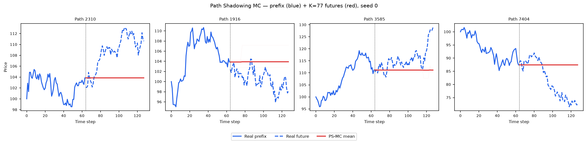

# Path Shadowing MC — Chronos-2 on Heston

**Reference:** Morel, Mallat, Bouchaud (2023) — arXiv:2308.01486

> The PS-MC evaluation is **model-agnostic**: it consumes only the generated
> `.npy` paths, so the embedding, retrieval and scoring are identical to the
> GT-GAN, Diffusion-TS, FourierFlow, TimeGAN, TimeVQVAE, COSCI-GAN and LS4
> pipelines ([`../../GT-GAN/path_shadowing/README.md`](../../GT-GAN/path_shadowing/README.md)).
> Only the generated pool differs (fine-tuned Chronos-2 instead of the others).

---

## Method

### Step 1 — 65D murex-style prefix embedding

Given a path prefix of `prefix_len = 64` price steps, we embed it as a
**65-dimensional feature vector** adapted from Murex's internal implementation:

| Component | Dimension | Formula |
|-----------|-----------|---------|
| Full log-return trajectory | 63 | `r_t = log S_t − log S_{t−1}`, t = 1…63 |
| Terminal cumulative return | 1 | `R = log S_63 − log S_0` |
| Realized volatility | 1 | `σ = sqrt(mean(r_t²))` |
| **Total** | **65** | — |

Each dimension is **z-scored** using the mean and std of the generated pool,
making distances scale-invariant across features:

```python
mean = fake_emb.mean(axis=0)   # per-dimension, from generated pool
std  = fake_emb.std(axis=0)
z_real = (real_emb - mean) / std
z_fake = (fake_emb - mean) / std
```

### Step 2 — KNN retrieval (NOT combinatorial)

For every real query path `x̃_past`:

```python
# O(N × D) scan — sklearn NearestNeighbors, L2 metric in z-scored space
distances, indices = nn.kneighbors(z_real)  # returns K smallest distances
```

`K = 77` generated paths with the smallest L2 distance in the z-scored
65D space are selected. **No subset enumeration, no combinatorial search.**

### Step 3 — Price anchoring

Each retrieved fake future is multiplicatively scaled so it starts at the real
path's last prefix price, removing the price-level offset:

$$\tilde{S}^{(k)}_{\text{anchored}}(u) = S^{(k)}_{\text{fake}}(u) \times \frac{S_{\text{real}}(t)}{S^{(k)}_{\text{fake}}(t)}, \quad u > t$$

### Step 4 — Two weighting variants

**Uniform:** flat weight `1/K` on all K retrieved futures.

**Gaussian:** distance-weighted with per-query adaptive bandwidth:

$$w_k \propto \exp\!\left(-\frac{\|z^k_{\text{past}} - z_{\text{query}}\|^2}{2\,\eta_i^2}\right), \quad \eta_i = \tilde{\eta} \cdot \|z(\tilde{x}_{\text{past},i})\|$$

Adaptive calibration (dataset-neutral):

$$\tilde{\eta}_{\text{adapt}} = \frac{\text{median}(\text{distances})}{\text{median}(\|z\|)}$$

Using the paper's raw `η̃ = 0.075` (calibrated on S&P) collapses weights onto
a single nearest neighbour on Heston data. The adaptive η̃ preserves the
per-query scaling idea while being dataset-neutral.

### Step 5 — Evaluation

Forecast = weighted average of the K anchored futures.
Evaluated at two horizons **H=32** (steps 64–95) and **H=64** (steps 64–127)
using CRPS (proper scoring rule), MAE, and RMSE.

---

## Results (mean ± std across 5 seeds) — 65D murex embedding

| Metric | Horizon | Uniform | Gaussian (adaptive η̃) | Naive RW baseline |
|--------|---------|---------|----------------------|-------------------|
| **CRPS** | H=32 | 3.7185 ± 0.0017 | 3.7184 ± 0.0017 | **3.7378** |
| MAE    | H=32 | 3.7370 ± 0.0005 | 3.7370 ± 0.0005 | 3.7378 |
| RMSE   | H=32 | 5.0391 ± 0.0009 | 5.0391 ± 0.0009 | 5.0399 |
| **CRPS** | H=64 | 5.2182 ± 0.0027 | 5.2181 ± 0.0027 | **5.2459** |
| MAE    | H=64 | 5.2444 ± 0.0010 | 5.2444 ± 0.0010 | 5.2459 |
| RMSE   | H=64 | 7.0644 ± 0.0013 | 7.0644 ± 0.0013 | 7.0661 |

**PS-MC over the Chronos-2 pool beats the naive RW on CRPS at both horizons** — CRPS
3.7185 < 3.7378 at H=32 and 5.2182 < 5.2459 at H=64 — but the margin is **tiny
(~0.5%)** and, unlike GT-GAN, **the Chronos-2 ensemble also matches the RW on point
error**: MAE 3.7370 ≈ 3.7378 and RMSE 5.0391 ≈ 5.0399 at H=32 (both fractionally
*below* the RW). The anchored ensemble mean essentially **reproduces the random walk**.

Why the ensemble collapses onto the RW. Chronos-2 is **locally very well calibrated**
(see [`../README.md`](../README.md): A19 predictive score at the perfect floor, A18
GRU near-indistinguishable on seed 0). Its retrieved neighbours, once price-anchored,
have anchored means that sit almost exactly at the real path's last value — the RW
forecast — so MAE/RMSE track the RW to four decimals. The only edge is a **thin
calibrated spread** that nudges CRPS ~0.5% below the RW's degenerate point mass.
This is the **opposite failure mode to GT-GAN**: GT-GAN's mis-shaped returns gave a
*larger* CRPS win but *worse* MAE/RMSE, whereas Chronos-2's well-shaped one-step
conditional gives a *smaller* CRPS win with MAE/RMSE **at** the RW floor.

**Uniform ≈ Gaussian** for Heston: Heston is time-homogeneous with constant
parameters, so all K nearest neighbours are roughly equally good predictors. The
adaptive Gaussian provides no meaningful gain over uniform.

**Naive RW**: deterministic forecast (last prefix value repeated) → CRPS = MAE. The
Chronos-2 ensemble's edge over RW is purely the value of a thin calibrated spread.

---

## Per-seed CRPS (H=32, uniform)

| Seed 0 | Seed 1 | Seed 2 | Seed 3 | Seed 4 |
|--------|--------|--------|--------|--------|
| 3.7186 | 3.7158 | 3.7203 | 3.7176 | 3.7202 |

**Extremely tight cross-seed spread (3.7158–3.7203, std 0.0017)** — ~60× tighter than
GT-GAN's std 0.108. **All five seeds sit below the RW floor (3.7378)** — a robust,
consistent (if small) improvement, reflecting how deterministic Chronos-2's fine-tuned
one-step conditional is across seeds.

---

## Setup

| Parameter | Value |
|-----------|-------|
| Query set | 8 192 real Heston test paths `heston_S_test_8192x128.npy` |
| Pool | Fine-tuned Chronos-2 generated paths per seed (8 192 paths) |
| Prefix | Steps 0–63 (64 steps) |
| Embedding | 65D murex-style (63 log-returns + terminal return + realized vol), z-scored |
| K | 77 nearest neighbours (L2 in z-scored embedding space) |
| η̃ | Adaptive: median(dist) / median(‖z‖) ≈ 6.29 (6.279–6.301 across seeds) |
| Horizons | H=32 (steps 64–95), H=64 (steps 64–127) |

---

## Figures

### Ensemble fan-out (seed 0, 4 example paths)



Blue solid = real prefix (0–63). Blue dashed = real future. Red fan = K=77 retrieved Chronos-2 futures (anchored). Bold red = ensemble mean.

### CRPS per forecast step


PS-MC stays **at or just below** the RW baseline across the forecast horizon — the
Chronos-2 ensemble's thin calibrated spread edges the random walk on CRPS while its
mean tracks the RW point forecast.

---

## Files

| File | Contents |
|------|---------|
| `seed_{0..4}_results.json` | Per-seed metrics (eta, CRPS/MAE/RMSE at h32/h64, both variants) |
| `summary.json` | Mean ± std across seeds + baseline + per_seed array |
| `plots/ps_mc_example.png` | Fan-out illustration (seed 0) |
| `plots/crps_per_step.png` | CRPS per forecast step (5 seeds, mean ± std) |

---

## Reproduce

```bash
cd methods/Chronos2/path_shadowing
/home/tbasseras/gpu-venv/bin/python run_eval.py   # 5 seeds → results/Heston/Chronos2/path_shadowing/
```
