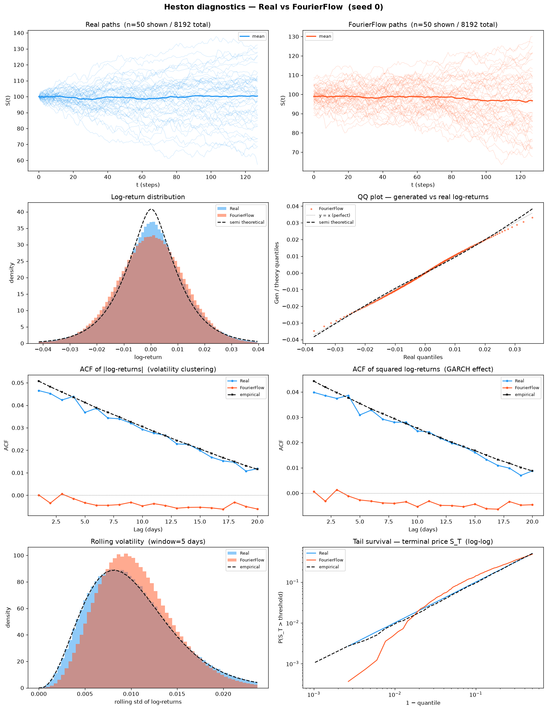
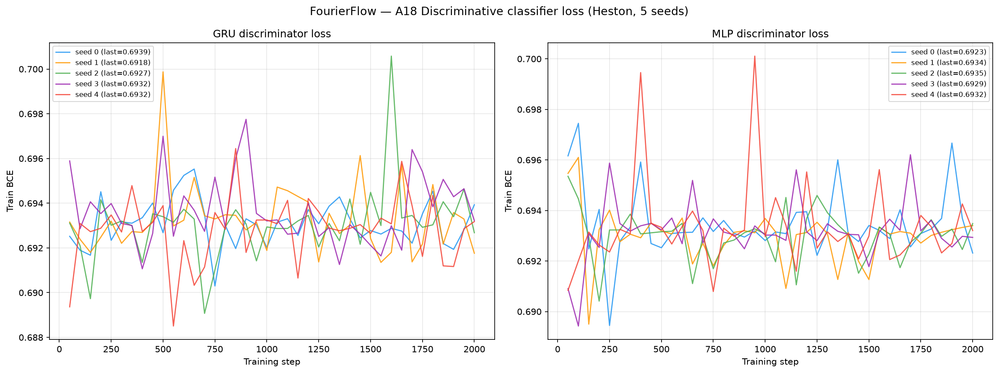
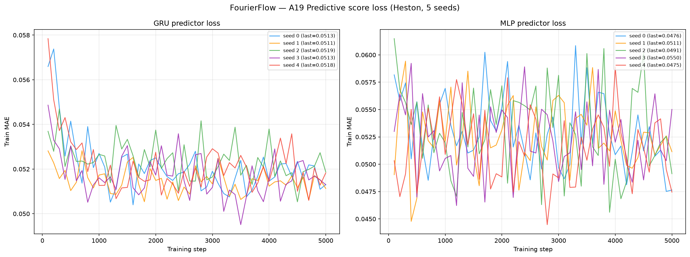

# Metrics — Fourier Flow on Heston (5 Seeds)

**Dataset:** 8 192 Heston price paths, seq\_len = 128.
Parameters: μ=0.05, κ=2.0, θ=0.04, ξ=0.3, ρ=−0.7, S₀=100, v₀=0.04, dt=1/250.

**Model:** Fourier Flow (Alaa, Chan, van der Schaar, ICLR 2021), explicit-likelihood normalizing
flow in the frequency domain. 3 spectral coupling layers, hidden 200, 1000 full-batch epochs,
Adam + ExponentialLR(γ=0.999), CPU only (`numpy.fft`). Two numerical guards keep training finite on
Heston, whose paths all start at the deterministic S₀=100 (near-singular spectral covariance): a
zero-std spectral-bin clamp (necessary, not sufficient) **and** gradient clipping at 1.0 (the actual
fix). See [`../../../methods/FourierFlow/code/README.md`](../../../methods/FourierFlow/code/README.md).

**Convention:** lower is better for all metrics **except A33 Teacher-Sigma Corr ↑**. A28 Kurtosis Ratio: perfect = 1.0.

---

## Data split — train / test / disc

Every number on this page is an **out-of-sample** score. The benchmark uses three disjoint Heston
draws of 8 192 paths each:

- **Train (seed 0)** — the paths the generator was fitted on. Never scored here.
- **Test (seed 1)** — the held-out real reference. All A1–A17, A20–A34, every B curve, the diagnostic
  plots and PS-MC are computed **generated-vs-test**.
- **Disc (seed 2)** — a third independent real draw, used only as the "real" class for the A18
  discriminative and A19 predictive-TSTR classifiers, so the adversary never sees the test set.

---

## Results (mean ± std across 5 seeds)

### A1–A34 — Metrics by category

Last column = **Perfect floor**: the non-zero finite-sample noise floor a perfect generator reaches.
It is measured by scoring an **independent Heston draw** (fresh seeds, identical parameters) against the
test set — the same real-vs-real comparison every generated batch faces, so the floor is the best score
attainable when the model *is* the true process. Floors are **non-zero** because two independent finite
samples of the same law never coincide exactly; they are identical across methods (same test set, same
independent-draw protocol). See [`../../../methods/perfect_recovery/`](../../../methods/perfect_recovery/).

<!-- ===== PER-METHOD A TABLE ===== -->
| Metric | Mean ± Std | Seed 0 | Seed 1 | Seed 2 | Seed 3 | Seed 4 | Perfect floor |
|--------|-----------|--------|--------|--------|--------|--------|---------------|
| **— Fat Tail —** | | | | | | | |
| A1 Kurtosis Error ↓ | 0.5761 ± 0.008273 | 0.5672 | 0.5903 | 0.5732 | 0.5699 | 0.5798 | 0.008092 |
| A2 \|r\| q95 Error ↓ | 7.21e-04 ± 2.10e-04 | 7.09e-04 | 9.82e-04 | 3.43e-04 | 7.93e-04 | 7.80e-04 | 6.57e-05 |
| A3 \|r\| q99 Error ↓ | 0.002325 ± 5.06e-04 | 0.002328 | 0.003091 | 0.001496 | 0.002402 | 0.002309 | 5.98e-05 |
| A4 Tail QQ Error ↓ | 7.42e-04 ± 1.38e-04 | 7.02e-04 | 9.80e-04 | 5.53e-04 | 7.55e-04 | 7.22e-04 | 6.75e-05 |
| A5 Hill Tail Index Error ↓ | 5.802 ± 2.000 | 7.516 | 2.953 | 3.881 | 7.872 | 6.789 | 0.5266 |
| **— Distribution —** | | | | | | | |
| A6 Path MMD² ↓ | 0.005527 ± 0.002289 | 0.003506 | 0.005485 | 0.009694 | 0.003346 | 0.005602 | 0.001842 |
| A7 Terminal MMD² ↓ | 0.01105 ± 0.006414 | 0.007151 | 0.005616 | 0.02248 | 0.006248 | 0.01376 | 0.001983 |
| A8 Increment MMD² ↓ | 0.001124 ± 6.46e-05 | 0.001188 | 0.001160 | 0.001086 | 0.001015 | 0.001171 | 8.69e-04 |
| A9 Volatility MMD ↓ | 0.05871 ± 0.007003 | 0.05246 | 0.05759 | 0.07123 | 0.05196 | 0.06029 | 0.008554 |
| A10 Terminal SWD ↓ | 2.710 ± 1.034 | 1.918 | 2.075 | 4.630 | 1.962 | 2.967 | 1.151 |
| A11 Path SWD ↓ | 1.334 ± 0.3806 | 1.097 | 1.728 | 1.847 | 0.8888 | 1.107 | 0.6191 |
| A12 RV Law Loss ↓ | 0.5397 ± 0.1300 | 0.5313 | 0.7595 | 0.3519 | 0.5447 | 0.5112 | 0.05202 |
| A13 Mean Path RMSE ↓ | 0.4336 ± 0.3651 | 0.3360 | 1.049 | 0.6146 | 0.05405 | 0.1147 | 0.1205 |
| A14 KS Log-returns ↓ | 0.01895 ± 0.002028 | 0.01726 | 0.02286 | 0.01874 | 0.01756 | 0.01830 | 0.001491 |
| A15 Skewness Error ↓ | 0.02288 ± 0.01115 | 0.01933 | 0.01509 | 0.04385 | 0.01250 | 0.02363 | 0.005274 |
| A16 QQ RMSE (300-pt) ↓ | 5.81e-04 ± 4.14e-05 | 5.63e-04 | 6.62e-04 | 5.74e-04 | 5.50e-04 | 5.56e-04 | 4.19e-05 |
| A17 Terminal Price KS ↓ | 0.08098 ± 0.01617 | 0.07373 | 0.09021 | 0.1046 | 0.05627 | 0.08008 | 0.01099 |
| **— Adversarial —** | | | | | | | |
| A18 Disc Score GRU ↓ | 0.009185 ± 0.009209 | 0.005951 | 0.02670 | 0.003204 | 0.009307 | 7.63e-04 | 0.006195 |
| A18 Disc Score MLP ↓ | 0.005951 ± 0.002921 | 0.008087 | 4.58e-04 | 0.005951 | 0.008697 | 0.006561 | 0.005951 |
| **— Predictive —** | | | | | | | |
| A19 Pred Score GRU ↓ | 0.05004 ± 2.00e-05 | 0.05004 | 0.05002 | 0.05007 | 0.05001 | 0.05004 | 0.05002 |
| A19 Pred Score MLP ↓ | 0.05032 ± 3.48e-04 | 0.04992 | 0.05094 | 0.05040 | 0.05027 | 0.05009 | 0.05036 |
| **— Temporal —** | | | | | | | |
| A20 Covariance Error ↓ | 60.80 ± 36.58 | 39.62 | 39.52 | 132.3 | 35.01 | 57.55 | 4.923 |
| A21 ACF \|r\| Error (lags) ↓ | 0.04095 ± 5.50e-04 | 0.04127 | 0.04149 | 0.03990 | 0.04096 | 0.04111 | 0.002234 |
| A22 ACF r² Error (lags) ↓ | 0.03498 ± 5.56e-04 | 0.03542 | 0.03546 | 0.03395 | 0.03486 | 0.03520 | 0.002206 |
| A23 ACF \|r\| Lag-1 Error ↓ | 0.04897 ± 7.04e-04 | 0.04807 | 0.04982 | 0.04827 | 0.04965 | 0.04902 | 0.002652 |
| A24 ACF r² Lag-1 Error ↓ | 0.04195 ± 7.01e-04 | 0.04063 | 0.04261 | 0.04194 | 0.04243 | 0.04214 | 0.002790 |
| **— Vol —** | | | | | | | |
| A25 Mean RMSE ↓ | 0.7990 ± 0.7970 | 0.5667 | 2.290 | 0.8638 | 0.04447 | 0.2298 | 0.1392 |
| A26 Return Std Error ↓ | 0.004832 ± 0.002757 | 0.005448 | 1.17e-04 | 0.008623 | 0.004291 | 0.005681 | 0.002523 |
| A27 Log-Return Std Error ↓ | 7.64e-05 ± 5.51e-05 | 1.00e-05 | 1.32e-04 | 1.50e-04 | 5.86e-05 | 3.18e-05 | 3.15e-05 |
| A28 Kurtosis Ratio (→ 1) | 3.098 ± 0.7754 | 2.875 | 4.578 | 2.295 | 2.961 | 2.781 | 1.006 |
| A29 Sigma Mean Error ↓ | 0.002245 ± 8.77e-04 | 0.002362 | 0.001509 | 0.003899 | 0.001631 | 0.001823 | 4.96e-04 |
| A30 Cross-Sect. Vol Path RMSE ↓ | 1.381 ± 0.4336 | 0.9429 | 1.876 | 1.935 | 1.012 | 1.138 | 0.1432 |
| A31 Rolling Vol KS (w=5) ↓ | 0.07213 ± 0.001372 | 0.07279 | 0.07440 | 0.07190 | 0.07054 | 0.07103 | 0.003814 |
| A32 Vol-of-Vol Error ↓ | 6.89e-04 ± 9.20e-05 | 6.78e-04 | 8.41e-04 | 5.52e-04 | 6.99e-04 | 6.77e-04 | 1.54e-05 |
| **— Heston Spec —** | | | | | | | |
| A33 Teacher-Sigma Corr ↑ | -0.002564 ± 0.002730 | -0.001968 | -0.003338 | -0.005218 | -0.004700 | 0.002406 | 0.6163 |
| A34 Teacher-Sigma RMSE ↓ | 0.08963 ± 0.001225 | 0.08969 | 0.08773 | 0.09160 | 0.08957 | 0.08954 | 0.06559 |

**Footnotes.**
- **A18** — discriminative classifier trained on log-returns; score = |accuracy − 0.5|, 0 = indistinguishable (GRU + MLP). Both variants sit at or near the floor (GRU 0.009, MLP 0.005951 — exactly the perfect-recovery floor), i.e. neither classifier can separate real from generated.
- **A19** — TSTR predictive MAE; all methods cluster near 0.050 (irreducible log-return floor) (GRU + MLP).
- **A33** — Teacher-Sigma correlation, **higher is better**; perfect floor ≈ 0.616 (unreachable from prices alone — the latent variance process is hidden).
- **A34** — Teacher-Sigma RMSE, perfect floor ≈ 0.066.

**Reading the table.** Fourier Flow **wins 4 of the 36 A-metric rows**: **A15 skewness error (0.02288)** —
the tightest third-moment match; **A18-MLP discriminative score (0.005951)**, which lands exactly on the
perfect-recovery floor (the flatten-then-MLP critic cannot beat chance); **A26 return-std error (0.004832)**;
and **A34 teacher-sigma RMSE (0.08963)** — the closest any price-only model gets to reconstructing the latent
volatility level. Its marginal fidelity is otherwise strong and *stable* across seeds: A1 kurtosis error
(0.576), A14 KS on log-returns (0.019), A16 QQ RMSE (5.8e-04). Where it is **weak** is exactly where every
frequency-domain / marginal generator is weak on Heston: A28 kurtosis ratio 3.10 (it produces ~3× too little
excess kurtosis in the tails), A20 covariance error 60.8 with a seed-2 outlier (132.3 vs 35–58 elsewhere),
A21–A24 ACF errors an order of magnitude above the diffusion/state-space leaders, and A33 teacher-sigma
correlation ≈ 0 — no method recovers the hidden variance path (floor 0.616). Fourier Flow captures the
static distribution beautifully but not the volatility-clustering dynamics.

---

## Stylised Facts Diagnostic (Heston vs Fourier Flow, seed 0)

Eight-panel comparison matching the Murex paper (Fig. 1 style): sample paths, return distribution,
QQ plot, ACF of |returns|, ACF of squared returns, rolling vol histogram (window=5), tail survival (log-log).

---

## Curve-shape metrics (B) — mean ± std across 5 seeds

Each of the 6 diagnostic plots above yields a **curve** L (a list of values), not a scalar. For each plot
we build three lists — the curve L, its first finite difference L' (der), and its second finite difference
L'' (sec\_der) — and report **three rows per plot**:

- **MSE** — `mean((L_gen − L_real)²)`, averaged over the three lists (funct/der/sec\_der). This is the
  quantity that decides the cross-method winner.
- **% err** — scale-aware relative error `mean(|L_gen − L_real| / (|L_real| + ε)) × 100` with
  `ε = 1e-3 · (max|L_real| + 1e-12)`, averaged over the three lists.
- **NRMSE** — `sqrt(mean((L_gen − L_real)²)) / (max|L_real| − min|L_real| + 1e-12) × 100`, averaged over
  the three lists.

*Special case:* for **Tail survival** the % err and NRMSE rows use the **function-level curve only**
(funct); its MSE row stays the mean-of-three.

↓ lower is better for all three rows. **Perfect floor** = the same independent-draw-vs-test floor as the A
table (non-zero, finite-sample). Winner between methods is decided by the **MSE** row. Fourier Flow's B
scores are far more stable seed-to-seed than TimeGAN's — the log-return-histogram MSE is 0.9211 ± 0.024
(vs TimeGAN's 45.4 ± 57.9 with a seed-2 collapse), reflecting the explicit-likelihood training.

<!-- ===== PER-METHOD B TABLE ===== -->
| Plot | Measure | Mean ± Std | Seed 0 | Seed 1 | Seed 2 | Seed 3 | Seed 4 | Perfect floor |
|------|---------|-----------|--------|--------|--------|--------|--------|---------------|
| **Log-return histogram** | MSE | 0.9211 ± 0.02370 | 0.9371 | 0.9394 | 0.9444 | 0.8956 | 0.8891 | 0.1098 |
|  | % err | 201.4% ± 70.21% | 256.8% | 108.0% | 302.6% | 152.2% | 187.5% | 290.3% |
|  | NRMSE | 22.66% ± 2.236% | 25.17% | 19.40% | 22.15% | 25.16% | 21.42% | 17.81% |
| **QQ plot** | MSE | 1.45e-07 ± 2.63e-08 | 1.37e-07 | 1.97e-07 | 1.25e-07 | 1.33e-07 | 1.32e-07 | 1.09e-09 |
|  | % err | 21.35% ± 0.9706% | 23.13% | 20.41% | 21.07% | 20.61% | 21.55% | 16.51% |
|  | NRMSE | 2.310% ± 0.3375% | 2.352% | 2.847% | 1.792% | 2.347% | 2.211% | 0.3436% |
| **ACF \|r\| lags 1–20** | MSE | 3.83e-04 ± 1.20e-05 | 3.85e-04 | 3.95e-04 | 3.61e-04 | 3.91e-04 | 3.81e-04 | 9.61e-06 |
|  | % err | 147.4% ± 19.81% | 130.1% | 146.7% | 132.4% | 185.0% | 143.0% | 114.3% |
|  | NRMSE | 74.72% ± 7.928% | 68.30% | 73.82% | 75.93% | 89.00% | 66.54% | 43.89% |
| **ACF r² lags 1–20** | MSE | 2.80e-04 ± 1.13e-05 | 2.80e-04 | 2.94e-04 | 2.61e-04 | 2.89e-04 | 2.78e-04 | 9.17e-06 |
|  | % err | 310.9% ± 63.75% | 316.6% | 371.1% | 334.1% | 344.4% | 188.4% | 381.5% |
|  | NRMSE | 63.28% ± 6.029% | 57.37% | 63.69% | 63.47% | 74.08% | 57.81% | 34.19% |
| **Rolling vol histogram** | MSE | 29.88 ± 2.639 | 29.80 | 34.64 | 26.52 | 29.36 | 29.07 | 1.372 |
|  | % err | 120.6% ± 8.620% | 108.4% | 131.9% | 113.1% | 123.1% | 126.4% | 127.9% |
|  | NRMSE | 22.49% ± 1.051% | 22.46% | 21.88% | 21.20% | 24.36% | 22.54% | 16.66% |
| **Tail survival** | MSE | 1.71e-04 ± 1.49e-05 | 1.69e-04 | 1.72e-04 | 1.98e-04 | 1.53e-04 | 1.65e-04 | 5.22e-07 |
|  | % err | 5.585% ± 0.2282% | 5.535% | 6.024% | 5.541% | 5.367% | 5.461% | 0.3256% |
|  | NRMSE | 2.287% ± 0.09795% | 2.272% | 2.295% | 2.461% | 2.163% | 2.244% | 0.1050% |

Fourier Flow does not win any B-plot outright (LS4 takes 5 of 6, CSDI the sixth), but its **QQ**
(1.45e-07), **tail-survival** (1.71e-04) and **log-return-histogram** (0.9211) curves are the best of the
non-winners, consistent with its strong static-distribution scores in the A table.

**Plot → curve mapping** (each curve is the shape whose funct/der/sec\_der are scored above):

| Plot | Key prefix | What the curve represents |
|------|-----------|--------------------------|
| Log-return histogram | `B_log_ret_hist_*` | Density of log-returns r=log(S_{t+1}/S_t) over shared bins |
| QQ plot              | `B_qq_plot_*`      | Quantile function at 100 uniform percentile levels |
| ACF \|r\| (lags 1–20) | `B_acf_abs_r_*`  | Mean per-path ACF of \|r\| at each lag |
| ACF r² (lags 1–20)  | `B_acf_sq_r_*`     | Mean per-path ACF of r² at each lag |
| Rolling vol hist.   | `B_roll_vol_hist_*` | Density of rolling-5 vol over shared bins |
| Tail survival       | `B_tail_surv_*`    | P(\|r\|>x) evaluated at thresholds of real \|r\| |

> Full formulas: [`metrics/README.md`](../../../metrics/README.md).

---

## Discriminative & Predictive Classifier Losses (A18 / A19)

BCE loss during GRU/MLP discriminator training (A18) and MAE loss during GRU/MLP predictor training on
*synthetic* data (A19, TSTR), 5 seeds. A discriminator BCE near ln(2) ≈ 0.693 means real and generated
are indistinguishable.

---

## Comparison with the paper (paper's own metrics: F-score + MAE)

This section uses **the paper's own two metrics** — the Sajjadi support-overlap **F-score**
(`metrics/PRcurve.computeF1`) and the TSTR predictive **MAE** (2-layer LSTM/100u trained on synthetic,
scored on real, `metrics/MAE.computeMAE`) — the released code, unchanged. Three columns:

- **Paper (Table 2)** — the published Fourier-Flow numbers on the paper's Stocks dataset.
- **Ours — Stocks** — the *released* code run verbatim on the paper's own dataset (seq_len 100→101 with
  the prepended anchor, hidden 200, 3 flows, 1000 epochs); validates the generator port independently
  of Heston. Full write-up:
  [`../../../methods/FourierFlow/paper_reimplementation/`](../../../methods/FourierFlow/paper_reimplementation/).
- **Ours — Heston** — the **same two metric functions** applied to our 5-seed Fourier-Flow paths on the
  Heston benchmark dataset. Prices are placed on the paper's [0,1] scale by a single global MinMax fit on
  the real Heston prices (applied to both real and synthetic); the MAE LSTM uses `MAX_STEPS=127` to match
  the Heston path length (128→sliced 127) — a data-length adaptation, not a metric change. Source:
  [`../../../methods/FourierFlow/paper_reimplementation/results/heston_paper_metrics.json`](../../../methods/FourierFlow/paper_reimplementation/results/heston_paper_metrics.json).

| Metric (paper's own) | Paper (Table 2, Stocks) | Ours — Stocks (paper dataset) | Ours — Heston |
|----------------------|:-----------------------:|:-----------------------------:|:-------------:|
| F-score ↑ | 0.984 | **0.9920 ± 0.0017** | **0.9918 ± 0.0009** |
| MAE ↓ | 0.009 | **0.0084 ± 0.0007** | **0.0210 ± 0.0132** |

**Stocks reproduces Table 2** — F-score 0.9920 vs 0.984 (marginally better support overlap), MAE 0.0084
vs 0.009 (within the 95 % CI). The released MLP `SpectralFilter` (not the paper's described BiRNN) is
what produced Table 2, so the paper-vs-code discrepancy does not block reproduction.

**Heston transfers well.** The F-score is essentially identical (0.9918 vs 0.9920) — Fourier Flow covers
the real Heston support almost perfectly. The paper-metric MAE is higher on Heston (0.0210 vs 0.0084)
because Heston paths are longer (127 vs 100 steps) and more volatile, and one seed (seed 0, MAE 0.047)
inflates the mean — seeds 1–4 sit tightly at ≈ 0.014. Both metrics stay in the paper's small-error
regime, confirming the port behaves consistently across datasets.

---

## Path Shadowing MC (arXiv:2308.01486)

Model-agnostic PS-MC forecast: embed each real prefix (steps 0–63) as a 65D murex-style feature vector,
retrieve K nearest Fourier Flow paths by L2 in z-scored space, forecast with their price-anchored
futures. Full analysis: [`path_shadowing/README.md`](path_shadowing/README.md).

<!-- ===== PER-METHOD PS-MC TABLE ===== -->
| Metric | Value (mean ± std) | RW baseline |
|--------|--------------------|-------------|
| PS-MC CRPS H=32 ↓ | 2.744 ± 0.03009 | 3.738 |
| PS-MC CRPS H=64 ↓ | 3.961 ± 0.1098 | 5.246 |

PS-MC **beats the naive RW on CRPS** at both horizons (2.744 < 3.738 at H=32; 3.961 < 5.246 at H=64), on
all 5 seeds — a solid mid-field result, better than TimeGAN (3.085 / 4.337) but behind the diffusion and
state-space leaders (LS4 2.704 / 3.763, CSDI 2.718 / 3.776). Fourier Flow's pool gives well-calibrated
nearest-neighbour futures. Heston is time-homogeneous, so the uniform and Gaussian shadow-weightings
coincide.

---

## Files

| File | Description |
|------|-------------|
| `metrics_summary.csv` | Mean ± std across 5 seeds for all metrics |
| `seed_{i}_metrics.json` | Full per-seed metric dict |
| `curve_b_aggregate.json` | B three-subline aggregates (MSE + % err + NRMSE) |
| `seed_{i}_disc_gru_loss.csv` | GRU discriminator BCE loss per training step |
| `seed_{i}_disc_mlp_loss.csv` | MLP discriminator BCE loss per training step |
| `seed_{i}_pred_gru_loss.csv` | GRU predictor MAE loss per training step |
| `seed_{i}_pred_mlp_loss.csv` | MLP predictor MAE loss per training step |
| `plots/seed_{i}_pca.png` | PCA 2-D projection, real vs fake |
| `plots/seed_{i}_tsne.png` | t-SNE 2-D projection, real vs fake |
| `plots/disc_classifier_loss.png` | All-seed discriminator training loss (GRU + MLP) |
| `plots/pred_score_loss.png` | All-seed predictor training loss (GRU + MLP) |
| `plots/heston_diagnostics.png` | 8-panel stylised facts diagnostic (seed 0) |
| `path_shadowing/` | Path-shadowing MC forecasts |

→ Cross-method comparison with TimeGAN & SBTS: [`results/README.md`](../../README.md)
