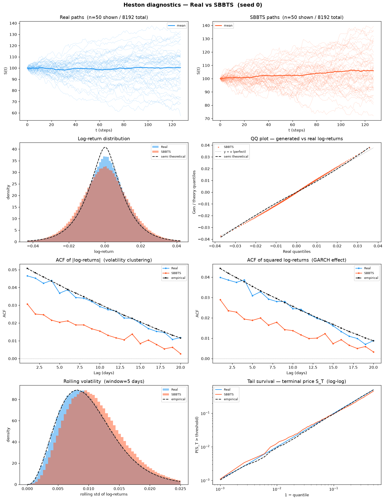

# SBBTS, Schrödinger Bass Bridge for Time Series (preprint 2026)

**Paper:** Alouadi, Barreau, Carlier, Pham, *Schrödinger Bass Bridge for Time Series Generation*, preprint 2026, [arXiv:2604.07159](https://arxiv.org/abs/2604.07159)

**Dataset:** 8 192 Heston price paths, seq\_len = 128.
Parameters: μ=0.05, κ=2.0, θ=0.04, ξ=0.3, ρ=−0.7, S₀=100, v₀=0.04, dt=1/250.

**Model:** SBBTS, the **neural** successor to [SBTS](../SBTS/README.md). Where SBTS estimates the
Schrödinger-bridge drift with a non-parametric kernel (the training set *is* the model), SBBTS learns a
score network and solves the bridge by **DSBM** (Diffusion Schrödinger Bridge Matching). Hyperparameters are
the authors' `run_heston.py` defaults, unmodified: `beta=100`, `K=5` DSBM outer iterations, `safe_t=1e-2`,
`N_pi=60`, `d_model=128`, `hidden_dim=64`, `nhead=32`, `n_layers=2`, `batch_size=128`, `lr=1e-3`,
`n_epochs=1000`, `patience=15`, `delta=1e-3`, `M_simu=8192`. The model and its Adam state are built **once**
outside the `K` loop, so each outer iteration warm-starts from the last and the run produces one continuous
loss trajectory rather than five restarts.

**Convention:** lower is better for all metrics **except A33 Teacher-Sigma Corr ↑**. A28 Kurtosis Ratio: perfect = 1.0.

**Evaluation protocol (test set everywhere).** The generated paths were built from the **train** split and
are **never scored on it**. Every metric below compares the 8 192 generated paths against the **held-out test
set** (an independent 8 192-path Heston draw, seed 1), with one deliberate exception: the two
adversarial/predictive metrics A18 (discriminative) and A19 (predictive-TSTR) draw their *real* class from a
**third** Heston split (seed 2), so the judge never sees the same real data used everywhere else. This is the
protocol applied identically to every method in the benchmark.

---

## What we generate, price paths from the Heston SDE

The **target process** is the Heston stochastic volatility model:

$$dS_t = \mu\,S_t\,dt + \sqrt{v_t}\,S_t\,dW_t^S$$
$$dv_t = \kappa(\theta - v_t)\,dt + \xi\sqrt{v_t}\,dW_t^v, \quad \text{Corr}(dW^S, dW^v) = \rho$$

Parameters: μ=0.05, κ=2.0, θ=0.04, ξ=0.3, ρ=−0.7, S₀=100, v₀=0.04, dt=1/250.

**SBBTS does not generate $S_t$ directly.** Per the method author (A. Alouadi, 2026-09-01): *"same approach
as SBTS — transform prices into log-returns, generate that, and invert to recover prices."* Concretely
([`methods/SBBTS/code/train_seed.py`](../../../methods/SBBTS/code/train_seed.py)):

```
Input:  S_real (8192, 128)   — price paths from the Heston SDE (train split)
Step 1: R = diff(log S)                   — log-returns (8192, 127)
Step 2: pad a zero seed row                — (8192, 128), so the bridge sees a fixed start
Step 3: R̃ = R / scale,  scale = std(X)/√T — the run_heston.py single-scalar convention
Step 4: SBBTS generates R̃_gen             — DSBM score network, K=5 outer iterations
Step 5: R_gen = R̃_gen × scale             — inverse scaling
Step 6: S_gen = 100 × exp(cumsum(R_gen))  — reconstruct prices, anchored at S₀ = 100
Output: S_gen (8192, 128)   — generated price paths in price space ≈ 100
```

This is identical in structure to [`methods/SBTS/code/sbts_generate.py`](../../../methods/SBTS/code/sbts_generate.py),
so the two Schrödinger-bridge methods are transformed the same way and the SBBTS-vs-SBTS comparison below is
not confounded by preprocessing.

> **`d = 1` here, by fairness design.** The paper's own Heston experiment is *bivariate*, because its metric
> is a per-path maximum-likelihood fit of (κ, θ, ξ, ρ, r) that reads the variance leg directly. The benchmark
> scores **price paths only**, and every other method in this repo sees price only — handing SBBTS the
> variance channel would be privileged information. The faithful `d = 2` reproduction of the paper's own
> experiment lives in [`methods/SBBTS/paper_reimplementation/`](../../../methods/SBBTS/paper_reimplementation/README.md).

---

## Results (mean ± std across 5 seeds)

### A1-A34, Metrics by category

Last column = **Perfect floor**: the best value a *perfect* generator can reach at this sample size. It is
measured by scoring an **independent Heston draw** (fresh seeds, identical parameters) against the same test
set, i.e. real-vs-real finite-sample noise. It is **non-zero** (finite samples never match exactly) and
**identical across all methods**, because it depends only on the test set and the protocol, not on the
generator. See [`../../../methods/perfect_recovery/`](../../../methods/perfect_recovery/).

<!-- ===== PER-METHOD A TABLE ===== -->
| Metric | Mean ± Std | Seed 0 | Seed 1 | Seed 2 | Seed 3 | Seed 4 | Perfect floor |
|--------|-----------|--------|--------|--------|--------|--------|---------------|
| **Fat Tail** | | | | | | | |
| A1 Kurtosis Error ↓ | 0.2393 ± 0.02899 | 0.2715 | 0.2335 | 0.2128 | 0.2742 | 0.2045 | 0.008092 |
| A2 \|r\| q95 Error ↓ | 0.001389 ± 4.08e-04 | 0.001579 | 0.001725 | 5.92e-04 | 0.001595 | 0.001453 | 6.57e-05 |
| A3 \|r\| q99 Error ↓ | 0.001578 ± 3.24e-04 | 0.001322 | 0.002122 | 0.001476 | 0.001224 | 0.001745 | 5.98e-05 |
| A4 Tail QQ Error ↓ | 0.001383 ± 4.03e-04 | 0.001550 | 0.001719 | 5.94e-04 | 0.001583 | 0.001469 | 6.75e-05 |
| A5 Hill Tail Index Error ↓ | 2.573 ± 0.9527 | 2.229 | 3.741 | 1.005 | 2.545 | 3.345 | 0.5266 |
| **Distribution** | | | | | | | |
| A6 Path MMD² ↓ | 0.006047 ± 0.002678 | 0.004377 | 0.01120 | 0.005757 | 0.003635 | 0.005268 | 0.001842 |
| A7 Terminal MMD² ↓ | 0.009359 ± 0.006441 | 0.004679 | 0.02083 | 0.01082 | 0.002261 | 0.008198 | 0.001983 |
| A8 Increment MMD² ↓ | 0.001526 ± 3.87e-04 | 0.001810 | 0.001461 | 9.82e-04 | 0.002086 | 0.001290 | 8.69e-04 |
| A9 Volatility MMD ↓ | 0.04407 ± 0.01238 | 0.04975 | 0.05040 | 0.02601 | 0.06032 | 0.03387 | 0.008554 |
| A10 Terminal SWD ↓ | 3.808 ± 2.260 | 1.646 | 7.418 | 5.157 | 1.384 | 3.434 | 1.151 |
| A11 Path SWD ↓ | 2.110 ± 0.8410 | 1.500 | 3.592 | 2.470 | 1.295 | 1.694 | 0.6191 |
| A12 RV Law Loss ↓ | 0.7047 ± 0.1914 | 0.8056 | 0.7784 | 0.3545 | 0.9140 | 0.6708 | 0.05202 |
| A13 Mean Path RMSE ↓ | 1.980 ± 1.067 | 0.8417 | 3.857 | 2.414 | 1.388 | 1.399 | 0.1205 |
| A14 KS Log-returns ↓ | 0.02454 ± 0.005947 | 0.02530 | 0.03251 | 0.01479 | 0.02798 | 0.02211 | 0.001491 |
| A15 Skewness Error ↓ | 0.04073 ± 0.02404 | 0.07004 | 0.04306 | 0.01612 | 0.01080 | 0.06364 | 0.005274 |
| A16 QQ RMSE (300-pt) ↓ | 9.04e-04 ± 2.55e-04 | 0.001004 | 0.001112 | 4.19e-04 | 0.001092 | 8.92e-04 | 4.19e-05 |
| A17 Terminal Price KS ↓ | 0.1055 ± 0.04844 | 0.04749 | 0.1812 | 0.1327 | 0.06189 | 0.1045 | 0.01099 |
| **Adversarial** | | | | | | | |
| A18 Disc Score GRU ↓ | 0.004059 ± 0.002359 | 0.003509 | 0.002594 | 0.002289 | 0.003204 | 0.008697 | 0.006195 |
| A18 Disc Score MLP ↓ | 0.003204 ± 0.002810 | 1.53e-04 | 0.008392 | 0.001678 | 0.002289 | 0.003509 | 0.005951 |
| **Predictive** | | | | | | | |
| A19 Pred Score GRU ↓ | 0.05005 ± 2.84e-05 | 0.05004 | 0.05009 | 0.05001 | 0.05004 | 0.05007 | 0.05002 |
| A19 Pred Score MLP ↓ | 0.05027 ± 2.46e-04 | 0.05013 | 0.05001 | 0.05013 | 0.05039 | 0.05070 | 0.05036 |
| **Temporal** | | | | | | | |
| A20 Covariance Error ↓ | 53.79 ± 39.22 | 15.99 | 83.00 | 39.56 | 15.45 | 114.9 | 4.923 |
| A21 ACF \|r\| Error (lags) ↓ | 0.01872 ± 0.002102 | 0.01648 | 0.02019 | 0.01802 | 0.02204 | 0.01688 | 0.002234 |
| A22 ACF r² Error (lags) ↓ | 0.01439 ± 0.001635 | 0.01236 | 0.01557 | 0.01380 | 0.01691 | 0.01332 | 0.002206 |
| A23 ACF \|r\| Lag-1 Error ↓ | 0.01899 ± 0.002319 | 0.01614 | 0.01855 | 0.01772 | 0.02308 | 0.01948 | 0.002652 |
| A24 ACF r² Lag-1 Error ↓ | 0.01322 ± 0.001954 | 0.01149 | 0.01294 | 0.01077 | 0.01556 | 0.01536 | 0.002790 |
| **Vol** | | | | | | | |
| A25 Mean RMSE ↓ | 3.147 ± 2.110 | 0.5340 | 6.453 | 4.433 | 1.495 | 2.817 | 0.1392 |
| A26 Return Std Error ↓ | 0.06218 ± 0.02937 | 0.09138 | 0.04376 | 0.01844 | 0.09689 | 0.06041 | 0.002523 |
| A27 Log-Return Std Error ↓ | 7.54e-04 ± 2.95e-04 | 9.03e-04 | 9.20e-04 | 1.75e-04 | 9.77e-04 | 7.93e-04 | 3.15e-05 |
| A28 Kurtosis Ratio (→ 1) | 1.671 ± 0.2408 | 1.883 | 1.427 | 1.657 | 1.997 | 1.390 | 1.006 |
| A29 Sigma Mean Error ↓ | 0.01237 ± 0.005839 | 0.01584 | 0.01470 | 0.001193 | 0.01767 | 0.01247 | 4.96e-04 |
| A30 Cross-Sect. Vol Path RMSE ↓ | 1.046 ± 0.7771 | 0.3791 | 1.627 | 0.7076 | 0.2506 | 2.267 | 0.1432 |
| A31 Rolling Vol KS (w=5) ↓ | 0.06911 ± 0.02542 | 0.08729 | 0.06977 | 0.02622 | 0.1008 | 0.06149 | 0.003814 |
| A32 Vol-of-Vol Error ↓ | 1.23e-04 ± 1.52e-04 | 5.01e-06 | 4.66e-06 | 4.05e-04 | 1.60e-04 | 3.83e-05 | 1.54e-05 |
| **Heston Spec** | | | | | | | |
| A33 Teacher-Sigma Corr ↑ | -0.002766 ± 0.004281 | -0.002016 | -0.005771 | 0.005260 | -0.006352 | -0.004954 | 0.6163 |
| A34 Teacher-Sigma RMSE ↓ | 0.09848 ± 0.002543 | 0.09898 | 0.1009 | 0.09395 | 0.09780 | 0.1007 | 0.06559 |

> **A18**: discriminative classifier (GRU + MLP), score = |accuracy − 0.5|; 0 = indistinguishable.
> **A19**: TSTR MAE (GRU + MLP); every method clusters at ≈ 0.050, the irreducible one-step-prediction floor for Heston.
> **A28**: kurtosis ratio κ_real / κ_gen; perfect = 1.0, no monotone direction, closest to 1 wins.
> **A33**: Pearson(σ̂_gen, √v_true), teacher-sigma correlation (↑ higher is better).
> **A34**: RMSE(σ̂_gen, √v_true), absolute scale accuracy of the reproduced vol process.
> Full formulas: [`metrics/README.md`](../../../metrics/README.md).

**Reading the table.** SBBTS wins **2 of the 36 A-metric rows**, and both are **A18** — the discriminative
judge. A18 GRU **0.004059** and A18 MLP **0.003204** are both *below* the perfect floor (0.006195 / 0.005951),
i.e. the classifiers are closer to chance on SBBTS paths than on an independent real draw.

**That headline is worth almost nothing, and here is why.** A18 is saturated at the top of this benchmark:
five methods sit inside a band narrower than the floor itself, so their ordering is noise, not skill. A
classifier at 0.003 and one at 0.006 are both simply *at chance* — |accuracy − 0.5| of 0.003 on an 8 192-path
split is roughly 25 paths, well inside binomial noise. The BCE training curves confirm it
([`plots/disc_classifier_loss.png`](plots/disc_classifier_loss.png)): they sit flat at ≈ 0.6935 ≈ ln 2, the
value of a classifier that has learned nothing. **Do not read "SBBTS beats the floor on A18" as evidence of
generation quality.** It is evidence that A18 has no resolution left in this regime.

The rows that *do* discriminate tell the opposite story. Against its kernel predecessor:

| Metric | SBBTS | SBTS | Perfect floor | Ratio SBBTS/SBTS |
|--------|:-----:|:----:|:-------------:|:----------------:|
| A1 Kurtosis Error ↓ | 0.2393 | **0.008384** | 0.008092 | 28.5× worse |
| A14 KS Log-returns ↓ | 0.02454 | **0.002542** | 0.001491 | 9.7× worse |
| A20 Covariance Error ↓ | 53.79 | **4.969** | 4.923 | 10.8× worse |
| A23 ACF \|r\| Lag-1 Error ↓ | 0.01899 | **0.008185** | 0.002652 | 2.3× worse |
| A28 Kurtosis Ratio (→1) | 1.671 | **1.012** | 1.006 | far from 1.0 |
| A31 Rolling Vol KS ↓ | 0.06911 | **0.01375** | 0.003814 | 5.0× worse |

SBTS is at or near the floor on all six; SBBTS is one order of magnitude off on the marginal rows (A1, A14)
and on the covariance row (A20). The A28 kurtosis ratio of **1.671** is the cleanest single diagnostic: SBBTS
under-produces tail mass by ~40 %, which then propagates into A1, A5 (Hill index error 2.573 vs SBTS 1.604)
and A2-A4. The learned score network does not reproduce the one-step return histogram as sharply as a kernel
density estimate fitted directly to it — which is not surprising, since on this task the kernel is close to
optimal by construction and the network has to learn the same object through a bridge.

**The second weakness is seed variance.** A20 is `53.79 ± 39.22`, a std that is 73 % of the mean; A10 Terminal
SWD `3.808 ± 2.260`; A25 `3.147 ± 2.110`; A30 `1.046 ± 0.7771`. Seed 4 alone reports A20 = 114.9 against seed
3's 15.45, a 7.4× spread from nothing but the RNG. SBTS's corresponding spreads are a factor of 3-10 tighter.
Any single-seed SBBTS number in this table should be treated as unreliable; only the 5-seed mean is meaningful,
and even that carries wide error bars.

The two **Heston-spec** rows fail for everyone: A33 teacher-sigma correlation ≈ 0 (floor 0.616) and A34
teacher-sigma RMSE 0.098 vs floor 0.066. The latent variance process is not recoverable from prices alone, and
no method in the benchmark reaches it.

**Where SBBTS is genuinely strong is not in this table.** On conditional forecasting (Path Shadowing MC,
below) SBBTS reaches CRPS **2.703 ± 0.022** at H=32 and **3.777 ± 0.050** at H=64 — *better* than SBTS
(2.777 / 3.858) despite being ~10× worse on the marginal metrics. Marginal fidelity and conditional
calibration are different properties, and this pair of methods separates them cleanly.

---

## Stylised Facts Diagnostic (Heston vs SBBTS, seed 0)

Eight-panel comparison: sample paths, return distribution, QQ plot, ACF of |returns|,
ACF of squared returns, rolling vol histogram (window=5), tail survival (log-log).



---

## Curve-shape metrics (B), mean ± std across 5 seeds

Each of the diagnostic plots above yields a **curve** L (a list of values), not a scalar. For each plot we
build three lists, the curve L, its first finite difference L′ (der), and its second finite difference L″
(sec\_der), then combine them into **five sub-scores per plot**:

- **MSE row** (decides the winner): for each list, mean((L\_gen − L\_real)²), averaged over the three lists
  (funct / der / sec\_der). This is the headline curve-fit error.
- **% err row** (function-level MAPE): mean(|L\_gen − L\_real| / (|L\_real| + 1e-6)) × 100 on the curve L
  only (funct-only); the derivative / 2nd-difference MAPE is excluded as ill-posed (near-zero denominators).
- **NRMSE row**: sqrt(mean((L\_gen − L\_real)²)) / (max|L\_real| − min|L\_real| + 1e-12) × 100 on the curve L
  only (funct-only).
- **CVaR₉₀ / CVaR₉₅ rows**: tail-averaged pointwise curve error (Expected Shortfall) on the curve L only
  (funct-only). eₜ = |L\_gen(t) − L\_real(t)|; CVaR\_q = mean(eₜ for eₜ ≥ the q-th percentile of eₜ),
  range-normalized like NRMSE. q ∈ {0.90, 0.95}.

↓ lower is better for all five rows. **Perfect floor** is the non-zero real-vs-test value an independent
Heston draw reaches, identical across methods.

<!-- ===== PER-METHOD B TABLE ===== -->
| Plot | Measure | Mean ± Std | Seed 0 | Seed 1 | Seed 2 | Seed 3 | Seed 4 | Perfect floor |
|------|---------|-----------|--------|--------|--------|--------|--------|---------------|
| **Log-return histogram** | MSE | 0.8200 ± 0.3559 | 1.086 | 0.8690 | 0.2748 | 1.278 | 0.5911 | 0.1098 |
|  | % err | 12.84% ± 4.192% | 15.33% | 14.55% | 4.987% | 16.94% | 12.40% | 1.799% |
|  | NRMSE | 3.837% ± 1.151% | 4.588% | 4.168% | 1.865% | 5.195% | 3.370% | 0.5328% |
|  | CVaR₉₀ | 9.380% ± 2.858% | 11.21% | 10.23% | 4.502% | 12.77% | 8.179% | 1.234% |
|  | CVaR₉₅ | 10.64% ± 3.129% | 12.84% | 11.37% | 5.295% | 14.31% | 9.398% | 1.444% |
| **QQ plot** | MSE | 3.02e-07 ± 1.27e-07 | 3.41e-07 | 4.25e-07 | 6.95e-08 | 4.00e-07 | 2.74e-07 | 1.09e-09 |
|  | % err | 16.10% ± 5.560% | 15.00% | 26.82% | 12.94% | 14.82% | 10.92% | 0.4629% |
|  | NRMSE | 2.487% ± 0.6771% | 2.740% | 3.065% | 1.198% | 2.970% | 2.461% | 0.1206% |
|  | CVaR₉₀ | 2.418% ± 0.6926% | 2.351% | 3.276% | 1.186% | 2.491% | 2.785% | 0.1319% |
|  | CVaR₉₅ | 2.730% ± 0.7090% | 2.579% | 3.748% | 1.609% | 2.569% | 3.144% | 0.1599% |
| **ACF \|r\| lags 1-20** | MSE | 9.46e-05 ± 2.33e-05 | 7.45e-05 | 1.10e-04 | 8.77e-05 | 1.32e-04 | 6.91e-05 | 9.61e-06 |
|  | % err | 55.23% ± 8.238% | 48.68% | 61.92% | 51.43% | 67.80% | 46.34% | 8.724% |
|  | NRMSE | 42.31% ± 5.644% | 37.28% | 46.69% | 40.60% | 50.88% | 36.12% | 6.071% |
|  | CVaR₉₀ | 61.94% ± 7.740% | 53.89% | 68.04% | 63.32% | 72.11% | 52.34% | 11.26% |
|  | CVaR₉₅ | 63.11% ± 7.913% | 55.99% | 69.61% | 63.74% | 73.59% | 52.63% | 12.06% |
| **ACF r² lags 1-20** | MSE | 6.17e-05 ± 1.48e-05 | 4.64e-05 | 7.07e-05 | 5.91e-05 | 8.54e-05 | 4.71e-05 | 9.17e-06 |
|  | % err | 51.72% ± 8.681% | 43.05% | 58.19% | 48.89% | 65.16% | 43.29% | 11.34% |
|  | NRMSE | 36.82% ± 4.898% | 31.67% | 40.27% | 35.97% | 44.33% | 31.88% | 6.486% |
|  | CVaR₉₀ | 56.36% ± 6.825% | 48.21% | 61.22% | 58.84% | 65.02% | 48.50% | 12.35% |
|  | CVaR₉₅ | 57.36% ± 6.847% | 48.22% | 62.42% | 59.66% | 65.95% | 50.56% | 13.27% |
| **Rolling vol histogram** | MSE | 18.80 ± 10.04 | 24.54 | 16.20 | 5.523 | 34.74 | 12.98 | 1.372 |
|  | % err | 19.82% ± 4.373% | 25.00% | 20.52% | 13.42% | 23.76% | 16.39% | 2.264% |
|  | NRMSE | 7.839% ± 2.439% | 9.422% | 7.608% | 4.116% | 11.32% | 6.733% | 0.8688% |
|  | CVaR₉₀ | 15.48% ± 5.061% | 18.51% | 15.47% | 7.723% | 22.72% | 12.97% | 1.970% |
|  | CVaR₉₅ | 16.24% ± 5.431% | 19.62% | 16.21% | 7.911% | 23.94% | 13.52% | 2.308% |
| **Tail survival** | MSE | 2.77e-04 ± 1.56e-04 | 3.75e-04 | 2.97e-04 | 1.73e-05 | 4.79e-04 | 2.17e-04 | 5.22e-07 |
|  | % err | 8.524% ± 3.226% | 10.38% | 9.978% | 2.336% | 11.39% | 8.540% | 0.3302% |
|  | NRMSE | 2.706% ± 1.073% | 3.388% | 3.015% | 0.7261% | 3.826% | 2.573% | 0.1050% |
|  | CVaR₉₀ | 3.687% ± 1.432% | 4.617% | 4.053% | 1.087% | 5.246% | 3.430% | 0.1625% |
|  | CVaR₉₅ | 3.699% ± 1.437% | 4.632% | 4.065% | 1.092% | 5.266% | 3.440% | 0.1682% |

**SBBTS wins 0 of the 7 B-plots and 0 of the 31 curve sublines** (SBTS takes 30, LS4 takes 1). The B suite
sharpens what A1/A14 already said, and adds one thing they did not. The **ACF curves** are the worst failure:
ACF-|r| NRMSE **42.3 %** and ACF-r² NRMSE **36.8 %**, against a floor of 6.1 % / 6.5 % and SBTS's 7.9 % / 9.1 %
— a 5× gap. The bridge does reproduce *some* volatility clustering (these are far below the 128 % / 145 % of a
memoryless kernel), but only about a fifth of what the K=20 kernel achieves. The **marginal** curves are
consistently ~7× off floor: log-return histogram MSE 0.820 (floor 0.110, SBTS 0.117), QQ MSE 3.02e-07 (floor
1.09e-09, SBTS 4.42e-09 — two orders of magnitude), rolling-vol histogram MSE 18.80 (floor 1.37, SBTS 2.28).

The **seed spread is again the story**: rolling-vol MSE ranges 5.52 (seed 2) to 34.74 (seed 3), a 6.3× swing;
tail survival MSE ranges 1.73e-05 to 4.79e-04, a 28× swing. Seed 2 is consistently the best seed on nearly
every B row and seed 3 the worst — the same seed ordering shows up in A. That is a single latent quality
factor per run, not per-metric noise, which points at training-run variability (early stopping at
`patience=15`, `delta=1e-3`) rather than at sampling noise.

**Plot → curve mapping** (each curve is the shape whose funct/der/sec\_der are scored above):

| Plot | Key prefix | What the curve represents |
|------|-----------|--------------------------|
| Log-return histogram | `B_log_ret_hist_*` | Density of log-returns r=log(S_{t+1}/S_t) over shared bins |
| QQ plot              | `B_qq_plot_*`      | Quantile function at 100 uniform percentile levels |
| ACF \|r\| (lags 1-20) | `B_acf_abs_r_*`  | Mean per-path ACF of \|r\| at each lag |
| ACF r² (lags 1-20)  | `B_acf_sq_r_*`     | Mean per-path ACF of r² at each lag |
| Rolling vol hist.   | `B_roll_vol_hist_*` | Density of rolling-5 vol over shared bins |
| Tail survival       | `B_tail_surv_*`    | P(\|r\|>x) evaluated at thresholds of real \|r\| |

> Full formulas: [`metrics/README.md`](../../../metrics/README.md).

---

## Comparison with the paper (Alouadi et al., preprint 2026)

> ⚠️ **Direct metric comparison is not meaningful across datasets.** The paper's Table 4 is computed on
> **real S&P 500 instruments** (daily returns, long histories). Ours are computed on **Heston**, which is
> parameterised with μ=0.05 and θ=0.04 (long-run vol 20 %), so the benchmark's *real* column must land near
> Ann. Std ≈ 20 %, not the paper's 24.22 %, and the paper's §5.1 Heston dataset (κ, θ, ξ, ρ drawn from wide
> priors, T = 1 year in 252 steps) is far more volatile still, at Ann. Std ≈ 100 %. **Absolute levels are not
> expected to match.** What IS comparable is the **generated-vs-real gap and its sign**, which is exactly the
> claim Table 4 makes.
>
> A second caveat: the paper states no formulas for its Table-4 statistics. The standard definitions used here
> are pinned down by the paper's own internal consistency — from Ann. Std = 24.22 % the implied daily σ is
> 24.22/√252 = 1.526 %, and a Gaussian VaR99 would be 2.326 × 1.526 = 3.55 % against the reported 3.60 %
> (with ES99 4.65 % > the Gaussian 4.07 %, i.e. a fat left tail). That reproduces the paper's Real column to
> within rounding, which is the evidence for the reconstruction. See
> [`heston_paper_metrics.py`](../../../methods/SBBTS/paper_reimplementation/metric/heston_paper_metrics.py).

### A. Hyperparameters (the authors' `run_heston.py`, unmodified)

| Setting | Our benchmark run | Paper / authors' `run_heston.py` |
|---------|:-----------------:|:--------------------------------:|
| Data representation | Log-returns of price paths | Log-returns (single-scalar scaling) |
| Dimension d | **1** (price only, fairness) | 2 (price + variance) |
| Seq len T | **128** | 252 |
| Training paths N | **8 192** | 5 000 |
| `beta` | **100** | 100 |
| `K` (DSBM outer iterations) | **5** | 5 |
| `safe_t` | **1e-2** | 1e-2 |
| `N_pi` (Euler substeps) | **60** | 60 |
| `d_model` / `hidden_dim` | **128 / 64** | 128 / 64 |
| `nhead` / `n_layers` | **32 / 2** | 32 / 2 |
| `batch_size` / `lr` | **128 / 1e-3** | 128 / 1e-3 |
| `n_epochs` / `patience` / `delta` | **1000 / 15 / 1e-3** | 1000 / 15 / 1e-3 |
| `M_simu` (paths generated) | **8 192** | 4 000 |
| Hardware | 2× A100-80GB, 3 seeds/card | not stated |

Every hyperparameter except the four that the benchmark's data shape forces (`d`, `T`, `N`, `M_simu`) is the
authors' default. **Nothing is tuned.** We did search: a 27-arm sweep with 4-seed replicates on the two most
promising arms lives in
[`methods/SBBTS/paper_reimplementation/`](../../../methods/SBBTS/paper_reimplementation/README.md).

> ⚠️ **Open item for the method authors.** That sweep, re-scored on 2026-09-01 after a stale-cache bug was
> found and fixed, shows a **near-monotone dose-response in `beta`** on the leverage-spread ratio (the
> MLE-free, pre-registered ranking metric): β = 150/100/200/300/500/1000 → 0.767 / 0.785 / 0.870 / **0.905** /
> **0.913** / 0.884, a 0.147 span against a 0.034 seed spread at fixed β = 100. Welch on the 4-seed replicates
> gives β=100 `0.794 ± 0.015` vs β=300 `0.873 ± 0.038`, **t = −3.90, p = 0.018**. We still ship β = 100: it is
> the authors' default, β does not significantly move ξ (p = 0.148) or ρ (p = 0.565) which is what the paper's
> claim is about, and with six statistics tested at n = 4 nothing survives a Bonferroni correction. **The
> 5-seed benchmark on this page was run at β = 100**, i.e. before the correction, and therefore likely
> under-reports SBBTS on leverage. Flagged rather than silently re-tuned.

### B. Paper Table 4, tail-risk and annualised statistics

Table 4 (Appendix C.2.1) is the paper's only quantitative *generative-quality* table:
*"Comparison of tail-risk metrics (VaR, ES) and annualized performance statistics averaged across
instruments."* It is the right anchor here because every entry is a functional of the **return series alone**,
so it is computable from univariate price paths — unlike the paper's §5.1 metric (per-path bivariate MLE of
κ, θ, ξ, ρ, r), which needs the variance leg and stays in
[`paper_reimplementation/`](../../../methods/SBBTS/paper_reimplementation/README.md). Table 4 also already
contains an SBTS column, so our table can reproduce the paper's own three-way Real / SBBTS / SBTS layout.

Each cell is `Real / SBBTS / SBTS`. Pooled aggregation (all returns in one sample); ± is the seed std.

| Metric (paper's own) | Paper (Table 4, S&P 500) | Ours — paper §5.1 Heston (paper dataset) | Ours — benchmark Heston |
|----------------------|:------------------------:|:----------------------------------------:|:-----------------------:|
| | *Real / SBBTS / SBTS* | *Real / SBBTS / SBTS* | *Real / SBBTS / SBTS* |
| VaR 99 % (%) | 3.60 / 3.57 / 3.49 | 15.204 / **15.118 ± 0.930** / 15.239 | 3.218 / **3.358 ± 0.177** / 3.191 ± 0.010 |
| VaR 95 % (%) | 2.11 / 2.19 / 2.17 | 10.507 / **10.433 ± 0.728** / 10.546 | 2.080 / **2.218 ± 0.115** / 2.064 ± 0.006 |
| ES 99 % (%) | 4.65 / 4.44 / 4.36 | 17.728 / **17.580 ± 1.060** / 17.784 | 3.897 / **3.978 ± 0.208** / 3.846 ± 0.015 |
| ES 95 % (%) | 3.15 / 3.18 / 3.07 | 13.414 / **13.309 ± 0.863** / 13.438 | 2.788 / **2.917 ± 0.150** / 2.762 ± 0.008 |
| Ann. Ret (%) | 19.02 / 16.31 / 14.68 | −43.722 / **−52.862 ± 50.380** / −38.648 | 2.853 / **−0.470 ± 8.156** / 2.316 ± 0.324 |
| Ann. Std (%) | 24.22 / 24.38 / 23.06 | 99.739 / **98.085 ± 5.871** / 100.022 | 20.043 / **21.124 ± 0.766** / 19.896 ± 0.035 |

Sources: paper column transcribed from the PDF; paper-dataset column from
[`paper_dataset_table4.json`](../../../methods/SBBTS/paper_reimplementation/results/paper_dataset_table4.json)
(driver [`paper_dataset_table4.py`](../../../methods/SBBTS/paper_reimplementation/metric/paper_dataset_table4.py),
β=100 base arm, seeds 0-3; SBTS = the author-mandated h = 0.05 baseline, one arm, hence no ±); benchmark
column from [`heston_paper_metrics.json`](../../../methods/SBBTS/paper_reimplementation/results/heston_paper_metrics.json)
(5 seeds each). Annualisation uses each dataset's own clock — 252 for the paper's §5.1 Heston (N = 252 steps
over T = 1), 250 for the benchmark Heston (`dataset/Heston/generate_heston.py:12`, `DT = 1/250`). VaR/ES rows
are unaffected by that choice.

**What reproduces.** On the paper's own dataset the four tail rows land within **0.6 %** of Real
(15.118 vs 15.204; 10.433 vs 10.507; 17.580 vs 17.728; 13.309 vs 13.414) and Ann. Std within **1.7 %**
(98.085 vs 99.739). SBBTS slightly *under*-shoots Real on every tail row, and the paper reports the same
under-shoot on three of its four (3.57 < 3.60, 4.44 < 4.65, and Ann. Ret 16.31 < 19.02). **The sign of the gap
matches the paper's**, which is the claim the table makes. On the benchmark Heston the four tail rows land
within **4.6 %** of Real, in the opposite direction (slight over-shoot), and Ann. Std within **5.4 %**.

**What does not, and it is worth flagging.** `Ann. Ret` is unstable. On the benchmark Heston SBBTS reports
**−0.470 ± 8.156 %** where Real is +2.853 % and SBTS is +2.316 ± 0.324 % — the SBBTS seed std is **25× SBTS's**,
and the mean has the wrong sign. On the paper dataset the same pathology appears at scale: **±50.380** on a
mean of −52.862. The mechanism is in the transform: `to_scaled_log_returns` divides by a single scalar
`scale = std(X)/√T`, which normalises the return **variance** but not the return **mean**. Any per-seed bias
the score network puts on the mean log-return therefore survives the inverse transform and integrates over
128 (or 252) steps into a large drift error. Every other Table-4 row is a dispersion or tail statistic and is
immune. **This is the single clearest defect in our SBBTS run and should go to the method authors.**

### C. Scaling and implementation notes

The `run_heston.py` convention divides the whole return array by one scalar per channel:

$$\tilde{R} = \frac{R}{\text{scale}}, \qquad \text{scale} = \frac{\sigma(X)}{\sqrt{T}}$$

and inverts with `S_gen = S₀ · exp(cumsum(R̃_gen · scale))`. This is the same shape of transform as SBTS's
$\tilde{R} = R\sqrt{\Delta t}/\sigma(R)$ — both normalise the empirical return variance to the theoretical SDE
diffusion scale — but SBBTS applies it as a single global scalar rather than per-step, which is what leaves the
mean unconstrained (see the `Ann. Ret` note above).

One structural difference from the paper worth recording: the paper's Heston experiment is **d = 2** and its
§5.1 metric is a bivariate MLE. Our benchmark run is **d = 1** by fairness design (see the note at the top of
this page). The d = 2 reproduction, including the 27-arm sweep and the MLE std-ratio board, is in
[`methods/SBBTS/paper_reimplementation/`](../../../methods/SBBTS/paper_reimplementation/README.md); on the
pre-registered leverage-spread ratio it reaches **0.794 ± 0.015** against SBTS's 0.160, i.e. SBBTS recovers the
dispersion of the leverage effect far better than the kernel does on the paper's own task.

---

## Path Shadowing MC (arXiv:2308.01486)

Model-agnostic PS-MC forecast: embed each real prefix (steps 0-63) as a 65D murex-style feature vector,
retrieve K = 77 nearest SBBTS paths by L2 in z-scored space, forecast with their price-anchored futures.
CRPS is scored against the test set at two horizons; the naive random-walk (RW) baseline is 3.738 (H=32) /
5.246 (H=64). Full analysis: [`path_shadowing/README.md`](path_shadowing/README.md).

<!-- ===== PER-METHOD PS-MC TABLE ===== -->
| Metric | Value (mean ± std) | RW baseline | Perfect floor |
|--------|--------------------|-------------|---------------|
| PS-MC CRPS H=32 ↓ | 2.703 ± 0.02195 | 3.738 | 2.721 ± 0.004183 |
| PS-MC CRPS H=64 ↓ | 3.777 ± 0.04986 | 5.246 | 3.788 ± 0.006463 |

This is **SBBTS's strongest result in the benchmark**: it beats the naive RW at both horizons and edges out
SBTS (2.777 / 3.858) — the method that dominates it by ~10× on the marginal metrics above. It also sits
nominally *below* the perfect finite-sample floor at both horizons. **That is not super-oracle forecasting.**
The floor is what an independent draw from the true Heston process achieves under the identical protocol;
landing below it means the SBBTS pool is **smoother** than a true Heston draw, and the CRPS of a K-member
ensemble mean rewards smoothness. The seed spread is the tell: SBBTS is ±0.022 / ±0.050 against the floor's
±0.004 / ±0.006, 5-8× wider, so the margin (0.018 and 0.011) is smaller than SBBTS's own seed noise. **The
honest statement is that SBBTS is *at* the floor on PS-MC, not past it** — and that it does not win PS-MC
outright either: Deep-MKV-TS takes both rows (2.696 ± 0.004 / 3.758 ± 0.005). Heston is time-homogeneous, so
the uniform and Gaussian prefix weightings coincide to within 5e-5.

---

## Files

| Artifact | Path |
|----------|------|
| All A + B metrics (mean/std + per-seed) | `metrics_summary.csv` |
| Per-seed raw metric dumps | `seed_{0..4}_metrics.json` |
| B five-subline aggregates (MSE + % err + NRMSE + CVaR₉₀ + CVaR₉₅) | `curve_b_aggregate.json` |
| Classifier / predictor loss curves | `seed_{i}_{disc,pred}_{gru,mlp}_loss.csv` |
| Stylised-facts 8-panel diagnostic | `plots/heston_diagnostics.png` |
| A18 discriminative classifier BCE curves | `plots/disc_classifier_loss.png` |
| A19 predictive-score (TSTR) MAE curves | `plots/pred_score_loss.png` |
| PCA / t-SNE embeddings per seed | `plots/seed_{i}_{pca,tsne}.png` |
| Path-shadowing MC forecasts | `path_shadowing/` |
| Paper Table-4 metrics, benchmark Heston | `../../../methods/SBBTS/paper_reimplementation/results/heston_paper_metrics.json` |
| Paper Table-4 metrics, paper §5.1 dataset | `../../../methods/SBBTS/paper_reimplementation/results/paper_dataset_table4.json` |
| Generated price paths (8192×128) | `../../../methods/SBBTS/generated_paths/seed_{i}/generated_paths_8192x128.npy` |

→ Method page, hyperparameters and sweep: [`methods/SBBTS/README.md`](../../../methods/SBBTS/README.md)
→ Cross-method comparison with every generator: [`results/README.md`](../../README.md)
