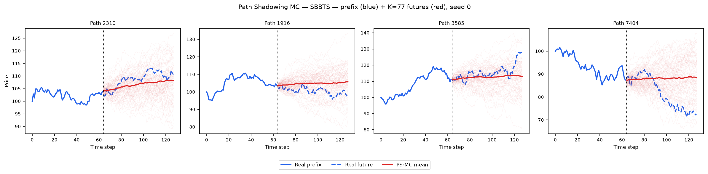
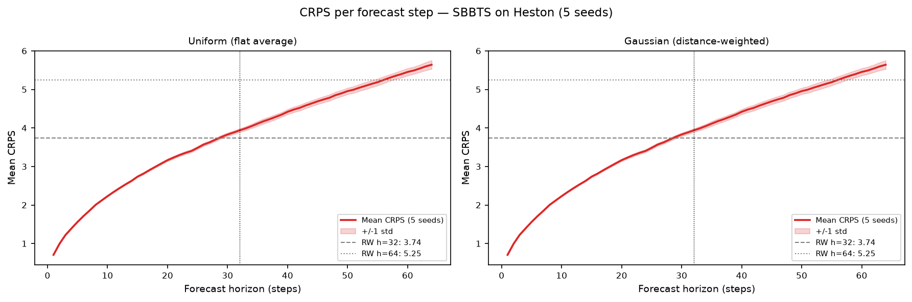

# Path Shadowing MC, SBBTS on Heston

**Reference:** Morel, Mallat, Bouchaud (2023), [arXiv:2308.01486](https://arxiv.org/abs/2308.01486)

---

## Method

Identical to the TimeGAN and SBTS path-shadowing evaluations, only the generated path pool differs.
Full method description: [`results/Heston/TimeGAN/path_shadowing/README.md`](../../TimeGAN/path_shadowing/README.md)

### Step 1, 65D murex-style prefix embedding

Given a path prefix of `prefix_len = 64` price steps, embed it as a
**65-dimensional feature vector**:

| Component | Dimension | Formula |
|-----------|-----------|---------|
| Full log-return trajectory | 63 | `r_t = log S_t − log S_{t−1}`, t = 1…63 |
| Terminal cumulative return | 1 | `R = log S_63 − log S_0` |
| Realized volatility | 1 | `σ = sqrt(mean(r_t²))` |
| **Total** | **65** | |

Each dimension is **z-scored** using the mean and std of the SBBTS generated pool.

### Step 2, KNN retrieval

For every real query path: retrieve K=77 SBBTS generated paths with smallest L2
distance in the z-scored 65D space.

### Step 3, Price anchoring

Each retrieved fake future is multiplicatively scaled to start at the real path's
last prefix price:

$$\tilde{S}^{(k)}_{\text{anchored}}(u) = S^{(k)}_{\text{fake}}(u) \times \frac{S_{\text{real}}(t)}{S^{(k)}_{\text{fake}}(t)}, \quad u > t$$

### Step 4, Two weighting variants

**Uniform:** flat weight `1/K` on all K retrieved futures.

**Gaussian:** distance-weighted with per-query adaptive bandwidth:

$$w_k \propto \exp\!\left(-\frac{\|z^k_{\text{past}} - z_{\text{query}}\|^2}{2\,\eta_i^2}\right), \quad \eta_i = \tilde{\eta} \cdot \|z(\tilde{x}_{\text{past},i})\|$$

Adaptive calibration:

$$\tilde{\eta}_{\text{adapt}} = \frac{\text{median}(\text{distances})}{\text{median}(\|z\|)}$$

Calibrated per seed; the five values are 8.361, 8.331, 8.646, 8.474, 8.268
(`summary.json → per_seed[].eta`).

### Step 5, Evaluation

Forecast = weighted average of the K anchored futures.
Two horizons: **H=32** (steps 64-95) and **H=64** (steps 64-127).
Metrics: CRPS, MAE, RMSE.

---

## Results (mean ± std across 5 seeds)

| Metric | Horizon | Uniform | Gaussian (adaptive η̃) | Naive RW baseline | Perfect floor |
|--------|---------|---------|----------------------|-------------------|---------------|
| **CRPS** | H=32 | **2.703 ± 0.022** | 2.703 ± 0.022 | 3.738 | 2.721 ± 0.004 |
| MAE    | H=32 | 3.738 ± 0.016 | 3.738 ± 0.016 | 3.738 | — |
| RMSE   | H=32 | 5.066 ± 0.038 | 5.066 ± 0.038 | 5.040 | — |
| **CRPS** | H=64 | **3.777 ± 0.050** | 3.777 ± 0.050 | 5.246 | 3.788 ± 0.006 |
| MAE    | H=64 | 5.231 ± 0.040 | 5.231 ± 0.040 | 5.246 | — |
| RMSE   | H=64 | 7.110 ± 0.091 | 7.110 ± 0.091 | 7.066 | — |

PS-MC **beats the naive random walk on CRPS** at both horizons: 2.703 < 3.738 at H=32 and
3.777 < 5.246 at H=64. Gaussian and Uniform weighting are tied to within 5e-5.

**This is SBBTS's strongest result in the entire benchmark, and it sits *below* the perfect
finite-sample floor at both horizons** — 2.703 vs 2.721 ± 0.004 (H=32) and 3.777 vs 3.788 ± 0.006
(H=64). Read that carefully: the floor is what an *independent draw from the true Heston process*
achieves under the identical protocol, so "below the floor" is not evidence of super-oracle
forecasting. It means the SBBTS pool is **smoother** than a true Heston draw, and the CRPS of a
K-member ensemble mean rewards that. The seed spread is the tell: SBBTS is ±0.022 / ±0.050 against
the floor's ±0.004 / ±0.006, i.e. 5-8× wider, so the margin (0.018 at H=32, 0.011 at H=64) is
smaller than SBBTS's own seed noise. **The honest statement is that SBBTS is *at* the floor on
PS-MC, not past it.**

The contrast with the marginal metrics is the point worth keeping. On the A-suite SBBTS is ~10×
worse than SBTS on KS log-returns (0.0245 vs 0.00254) and on covariance error (53.8 vs 4.97), yet
on conditional forecasting it is *better* than SBTS (CRPS H=32 2.703 vs 2.777, H=64 3.777 vs
3.858). Marginal fidelity and conditional calibration are different properties, and this pair of
methods separates them cleanly.

---

## Comparison with the other bridge methods (same real data, same protocol)

| Metric | Horizon | SBBTS PS-MC | SBTS PS-MC | TimeGAN PS-MC | Naive RW | Perfect floor |
|--------|---------|:-----------:|:----------:|:-------------:|:--------:|:-------------:|
| CRPS | H=32 | **2.703 ± 0.022** | 2.777 ± 0.006 | 3.085 ± 0.333 | 3.738 | 2.721 ± 0.004 |
| CRPS | H=64 | **3.777 ± 0.050** | 3.858 ± 0.009 | 4.337 ± 0.433 | 5.246 | 3.788 ± 0.006 |

**SBBTS edges out SBTS at both horizons, but pays for it in stability:** its seed spread is 3.8×
(H=32) and 5.6× (H=64) wider than SBTS's. Both bridge methods beat TimeGAN decisively, and both
beat the random walk. The learned score gives a slightly better-calibrated retrieval pool than the
kernel; it does not give a more reproducible one.

**SBBTS does not win PS-MC outright, and this table is not claiming it does** — it compares the
two bridge methods against TimeGAN, the way the SBTS README does. Across the full benchmark,
Deep-MKV-TS takes both PS-MC rows (2.696 ± 0.004 and 3.758 ± 0.005), with LS4 (2.704 / 3.763)
also ahead of SBBTS at H=64. See [`results/README.md`](../../../README.md) for the full table.

---

## Figures

### Example ensemble fan-out (seed 0)



### CRPS per forecast step



---

## Files

| File | Contents |
|------|----------|
| `README.md` | this file |
| `summary.json` | 5-seed aggregate: `baseline`, `h{32,64}_{MAE,RMSE,CRPS}_{uniform,gaussian}` as `{mean,std}`, and `per_seed[]` |
| `seed_{0..4}_results.json` | per-seed metrics and calibrated `eta` |
| `plots/ps_mc_example.png` | prefix + K=77 anchored futures, seed 0 |
| `plots/crps_per_step.png` | CRPS as a function of forecast step |

---

## Reproduce

```bash
/home/tbasseras/gpu-venv/bin/python methods/SBBTS/path_shadowing/run_eval.py

# Reads:
#   dataset/Heston/heston_S_test_8192x128.npy
#   methods/SBBTS/generated_paths/seed_{0..4}/generated_paths_8192x128.npy
# Results saved to:
#   results/Heston/SBBTS/path_shadowing/seed_{0..4}_results.json
#   results/Heston/SBBTS/path_shadowing/summary.json
#   results/Heston/SBBTS/path_shadowing/plots/ps_mc_example.png
#   results/Heston/SBBTS/path_shadowing/plots/crps_per_step.png
```
