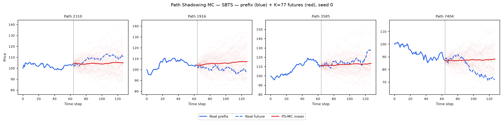
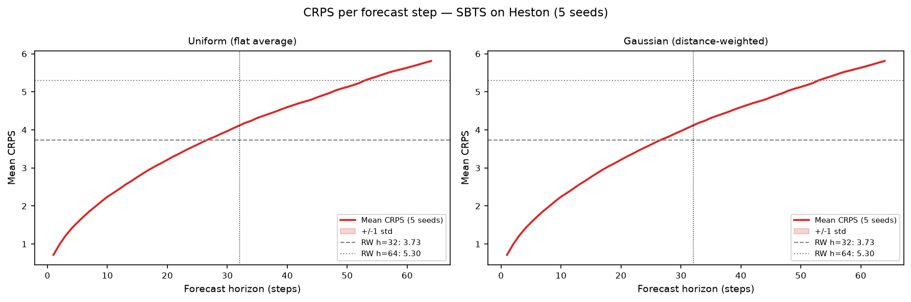

# Path Shadowing MC — SBTS on Heston

**Reference:** Morel, Mallat, Bouchaud (2023) — arXiv:2308.01486

---

## Method

Identical to the TimeGAN path shadowing evaluation — only the generated path pool differs.
Full method description: [`results/Heston/TimeGAN/path_shadowing/README.md`](../../TimeGAN/path_shadowing/README.md)

### Step 1 — 65D murex-style prefix embedding

Given a path prefix of `prefix_len = 64` price steps, embed it as a
**65-dimensional feature vector**:

| Component | Dimension | Formula |
|-----------|-----------|---------|
| Full log-return trajectory | 63 | `r_t = log S_t − log S_{t−1}`, t = 1…63 |
| Terminal cumulative return | 1 | `R = log S_63 − log S_0` |
| Realized volatility | 1 | `σ = sqrt(mean(r_t²))` |
| **Total** | **65** | — |

Each dimension is **z-scored** using the mean and std of the SBTS generated pool.

### Step 2 — KNN retrieval

For every real query path: retrieve K=77 SBTS generated paths with smallest L2
distance in the z-scored 65D space.

### Step 3 — Price anchoring

Each retrieved fake future is multiplicatively scaled to start at the real path's
last prefix price:

$$\tilde{S}^{(k)}_{\text{anchored}}(u) = S^{(k)}_{\text{fake}}(u) \times \frac{S_{\text{real}}(t)}{S^{(k)}_{\text{fake}}(t)}, \quad u > t$$

### Step 4 — Two weighting variants

**Uniform:** flat weight `1/K` on all K retrieved futures.

**Gaussian:** distance-weighted with per-query adaptive bandwidth:

$$w_k \propto \exp\!\left(-\frac{\|z^k_{\text{past}} - z_{\text{query}}\|^2}{2\,\eta_i^2}\right), \quad \eta_i = \tilde{\eta} \cdot \|z(\tilde{x}_{\text{past},i})\|$$

Adaptive calibration:

$$\tilde{\eta}_{\text{adapt}} = \frac{\text{median}(\text{distances})}{\text{median}(\|z\|)}$$

### Step 5 — Evaluation

Forecast = weighted average of the K anchored futures.
Two horizons: **H=32** (steps 64–95) and **H=64** (steps 64–127).
Metrics: CRPS, MAE, RMSE.

---

## Results (mean ± std across 5 seeds)

| Metric | Horizon | Uniform | Gaussian (adaptive η̃) | Naive RW baseline |
|--------|---------|---------|----------------------|-------------------|
| **CRPS** | H=32 | **2.761 ± 0.004** | 2.762 ± 0.004 | 3.732 |
| MAE    | H=32 | 3.746 ± 0.003 | 3.746 ± 0.003 | 3.732 |
| RMSE   | H=32 | 5.112 ± 0.007 | 5.112 ± 0.007 | 5.068 |
| **CRPS** | H=64 | **3.900 ± 0.008** | 3.900 ± 0.008 | 5.301 |
| MAE    | H=64 | 5.288 ± 0.004 | 5.288 ± 0.004 | 5.301 |
| RMSE   | H=64 | 7.227 ± 0.007 | 7.227 ± 0.007 | 7.181 |

PS-MC **beats the naive random walk on CRPS** at both horizons:
2.761 < 3.732 at H=32 and 3.900 < 5.301 at H=64.
Gaussian and Uniform weighting are essentially tied (difference < 0.001).

---

## Comparison with TimeGAN Path Shadowing (same real data, same protocol)

| Metric | Horizon | SBTS PS-MC | TimeGAN PS-MC | Naive RW |
|--------|---------|:----------:|:-------------:|:--------:|
| CRPS | H=32 | **2.761 ± 0.004** | 3.087 ± 0.340 | 3.732 |
| CRPS | H=64 | **3.900 ± 0.008** | 4.372 ± 0.431 | 5.301 |

**SBTS outperforms TimeGAN on PS-MC at both horizons.**
The kernel method faithfully reproduces the training distribution, providing a richer and
more diverse retrieval pool than a GAN — smaller variance across seeds (±0.004 vs ±0.340)
and decisively lower CRPS.

---

## Figures

### Example ensemble fan-out (seed 0)



### CRPS per forecast step



---

## Reproduce

```bash
/home/tbasseras/gpu-venv/bin/python methods/SBTS/path_shadowing/run_eval.py

# Results saved to:
#   results/Heston/SBTS/path_shadowing/seed_{0..4}_results.json
#   results/Heston/SBTS/path_shadowing/summary.json
#   results/Heston/SBTS/path_shadowing/plots/ps_mc_example.png
#   results/Heston/SBTS/path_shadowing/plots/crps_per_step.png
```
