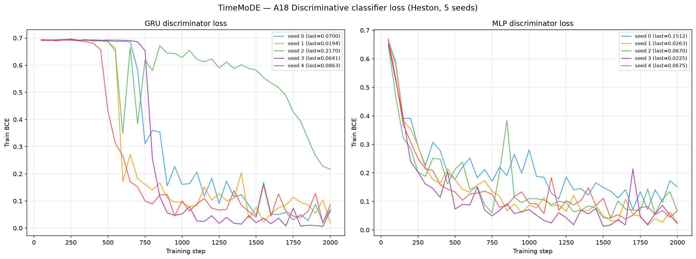
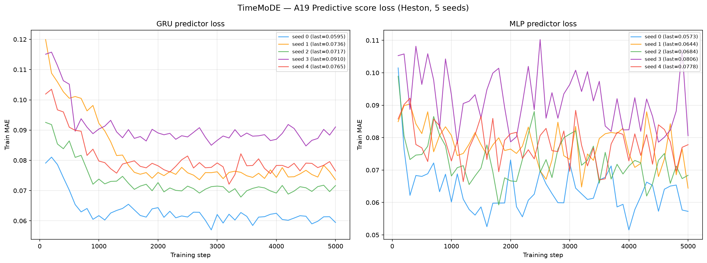

# Metrics, TimeMoDE on Heston (5 Seeds)

**Dataset:** 8 192 Heston price paths, seq\_len = 128.
Parameters: μ=0.05, κ=2.0, θ=0.04, ξ=0.3, ρ=−0.7, S₀=100, v₀=0.04, dt=1/250.

**Model:** TimeMoDE (Yao, Zheng, Zuo, Zhang, ICML 2026 / PMLR 306, arXiv:2606.15172), a **Diffusion
Transformer (DiT)** whose token-mixing MLPs are replaced by a **Mixture of Domain Experts (MoDE)** (K = 8
experts, top-2 routed, + 1 always-on shared expert E₀), trained as an ε-prediction DDPM (T = 250,
`learn_sigma=False`, 53.91 M params). No official code exists; this is a from-the-paper reimplementation whose
**exact seed-0 architecture** first passed a reproduction gate on the paper's own StarLightCurves "From
Scratch" task, then was reused **unchanged** on Heston (only input length 24 → 128 differs). See
[`../../../methods/TimeMoDE/code/README.md`](../../../methods/TimeMoDE/code/README.md) and
[`../../../methods/TimeMoDE/paper_reimplementation/README.md`](../../../methods/TimeMoDE/paper_reimplementation/README.md).

**Convention:** lower is better for all metrics **except A33 Teacher-Sigma Corr ↑**. A28 Kurtosis Ratio: perfect = 1.0.

**Evaluation protocol (test set everywhere).** Generators were trained on the **train** split (seed 0) and are
**never scored on it**. Every metric below compares the 8 192 generated paths against the **held-out test set**
(an independent 8 192-path Heston draw, seed 1), with one deliberate exception: the two adversarial/predictive
metrics A18 (discriminative) and A19 (predictive-TSTR) draw their *real* class from a **third** Heston split
(seed 2), so the judge never sees the same real data used everywhere else. This is the protocol applied
identically to all methods.

---

## What we generate

Each of the 5 training seeds produces 8 192 synthetic price paths of length 128 in the **original price scale**
(`../../../methods/TimeMoDE/generated_paths/seed_{i}/generated_paths_8192x128.npy`). TimeMoDE trains on prices
mapped to [0, 1] by a single global min-max fit on the real Heston training prices; at sampling time the
[0, 1] output is clipped and inverted back to price scale before scoring. All metrics, diagnostics and
path-shadowing consume these price-scale `.npy` files, identical to every other method.

---

## Results (mean ± std across 5 seeds)

### A1-A34, Metrics by category

Last column = **Perfect floor**: the best value a *perfect* generator can reach at this sample size. It is
measured by scoring an **independent Heston draw** (fresh seeds, identical parameters) against the same test
set, i.e. real-vs-real finite-sample noise. It is **non-zero** (finite samples never match exactly) and
**identical across all methods**, because it depends only on the test set and the protocol, not on the
generator. See [`../../../methods/perfect_recovery/`](../../../methods/perfect_recovery/).

<!-- ===== PER-METHOD A TABLE ===== -->
| Metric | Mean ± Std | Seed 0 | Seed 1 | Seed 2 | Seed 3 | Seed 4 | Perfect floor |
|--------|-----------|--------|--------|--------|--------|--------|---------------|
| **, Fat Tail, ** | | | | | | | |
| A1 Kurtosis Error ↓ | 20.10 ± 3.136 | 21.15 | 22.27 | 19.31 | 14.43 | 23.36 | 0.008092 |
| A2 \|r\| q95 Error ↓ | 0.02387 ± 0.006491 | 0.01361 | 0.02345 | 0.02200 | 0.03352 | 0.02679 | 6.57e-05 |
| A3 \|r\| q99 Error ↓ | 0.04025 ± 0.01065 | 0.02408 | 0.03674 | 0.03713 | 0.05508 | 0.04823 | 5.98e-05 |
| A4 Tail QQ Error ↓ | 0.02382 ± 0.006446 | 0.01366 | 0.02327 | 0.02193 | 0.03340 | 0.02680 | 6.75e-05 |
| A5 Hill Tail Index Error ↓ | 6.730 ± 6.378 | 12.21 | 15.86 | 5.396 | 0.09856 | 0.08298 | 0.5266 |
| **, Distribution, ** | | | | | | | |
| A6 Path MMD² ↓ | 0.06947 ± 0.05966 | 0.1402 | 0.1443 | 0.02988 | 0.01454 | 0.01840 | 0.001842 |
| A7 Terminal MMD² ↓ | 0.06458 ± 0.06681 | 0.1167 | 0.1704 | 0.01472 | 0.01579 | 0.005213 | 0.001983 |
| A8 Increment MMD² ↓ | 0.07441 ± 0.01639 | 0.05791 | 0.09306 | 0.06287 | 0.09562 | 0.06261 | 8.69e-04 |
| A9 Volatility MMD ↓ | 2.033 ± 0.3303 | 1.791 | 2.547 | 1.824 | 2.299 | 1.705 | 0.008554 |
| A10 Terminal SWD ↓ | 11.13 ± 9.128 | 22.74 | 21.61 | 3.265 | 6.087 | 1.929 | 1.151 |
| A11 Path SWD ↓ | 8.734 ± 6.925 | 19.04 | 15.08 | 3.950 | 2.853 | 2.746 | 0.6191 |
| A12 RV Law Loss ↓ | 16.52 ± 5.360 | 8.539 | 16.68 | 13.96 | 24.84 | 18.58 | 0.05202 |
| A13 Mean Path RMSE ↓ | 8.840 ± 7.341 | 19.36 | 16.07 | 3.908 | 2.525 | 2.340 | 0.1205 |
| A14 KS Log-returns ↓ | 0.1370 ± 0.02655 | 0.1005 | 0.1573 | 0.1170 | 0.1742 | 0.1360 | 0.001491 |
| A15 Skewness Error ↓ | 0.02843 ± 0.02245 | 0.01022 | 0.03483 | 0.003483 | 0.06741 | 0.02620 | 0.005274 |
| A16 QQ RMSE (300-pt) ↓ | 0.01109 ± 0.002985 | 0.006446 | 0.01126 | 0.009964 | 0.01563 | 0.01215 | 4.19e-05 |
| A17 Terminal Price KS ↓ | 0.3050 ± 0.2233 | 0.5403 | 0.6111 | 0.1453 | 0.1449 | 0.08350 | 0.01099 |
| **, Adversarial, ** | | | | | | | |
| A18 Disc Score GRU ↓ | 0.3950 ± 0.08909 | 0.2876 | 0.4945 | 0.3920 | 0.4957 | 0.3050 | 0.006195 |
| A18 Disc Score MLP ↓ | 0.4609 ± 0.01765 | 0.4493 | 0.4338 | 0.4783 | 0.4805 | 0.4625 | 0.005951 |
| **, Predictive, ** | | | | | | | |
| A19 Pred Score GRU ↓ | 0.08335 ± 0.005229 | 0.07940 | 0.09353 | 0.08148 | 0.08266 | 0.07969 | 0.05002 |
| A19 Pred Score MLP ↓ | 0.07423 ± 0.004722 | 0.06815 | 0.07934 | 0.07122 | 0.08019 | 0.07225 | 0.05036 |
| **, Temporal, ** | | | | | | | |
| A20 Covariance Error ↓ | 64.76 ± 21.18 | 98.60 | 64.04 | 68.12 | 32.00 | 61.02 | 4.923 |
| A21 ACF \|r\| Error (lags) ↓ | 0.07526 ± 0.003463 | 0.07178 | 0.07182 | 0.08122 | 0.07552 | 0.07594 | 0.002234 |
| A22 ACF r² Error (lags) ↓ | 0.07767 ± 0.002639 | 0.07530 | 0.07734 | 0.07439 | 0.08020 | 0.08112 | 0.002206 |
| A23 ACF \|r\| Lag-1 Error ↓ | 0.2258 ± 0.01439 | 0.2108 | 0.2209 | 0.2519 | 0.2162 | 0.2295 | 0.002652 |
| A24 ACF r² Lag-1 Error ↓ | 0.2466 ± 0.008535 | 0.2339 | 0.2445 | 0.2583 | 0.2428 | 0.2535 | 0.002790 |
| **, Vol, ** | | | | | | | |
| A25 Mean RMSE ↓ | 10.88 ± 9.469 | 22.82 | 21.89 | 3.567 | 5.117 | 0.9921 | 0.1392 |
| A26 Return Std Error ↓ | 1.419 ± 0.2615 | 1.126 | 1.682 | 1.205 | 1.777 | 1.305 | 0.002523 |
| A27 Log-Return Std Error ↓ | 0.01320 ± 0.003285 | 0.008040 | 0.01349 | 0.01183 | 0.01803 | 0.01463 | 3.15e-05 |
| A28 Kurtosis Ratio (→ 1) | 0.01840 ± 0.007380 | 0.01034 | 0.01038 | 0.02016 | 0.02988 | 0.02126 | 1.006 |
| A29 Sigma Mean Error ↓ | 0.1931 ± 0.04858 | 0.1159 | 0.2007 | 0.1748 | 0.2653 | 0.2087 | 4.96e-04 |
| A30 Cross-Sect. Vol Path RMSE ↓ | 1.950 ± 0.5991 | 2.975 | 1.958 | 1.990 | 1.127 | 1.697 | 0.1432 |
| A31 Rolling Vol KS (w=5) ↓ | 0.5014 ± 0.08662 | 0.3699 | 0.5521 | 0.4503 | 0.6236 | 0.5111 | 0.003814 |
| A32 Vol-of-Vol Error ↓ | 0.008546 ± 0.001733 | 0.005747 | 0.008466 | 0.007878 | 0.01079 | 0.009847 | 1.54e-05 |
| **, Heston Spec, ** | | | | | | | |
| A33 Teacher-Sigma Corr ↑ | 0.009360 ± 0.006530 | 0.005223 | 0.01637 | 0.01575 | 0.01035 | -8.94e-04 | 0.6163 |
| A34 Teacher-Sigma RMSE ↓ | 0.2737 ± 0.04669 | 0.2004 | 0.2741 | 0.2545 | 0.3411 | 0.2983 | 0.06559 |

**Reading the table.** TimeMoDE **wins no A-metric row** and is one of the weakest generators on Heston. It is
cleanly separable on both judges (A18 GRU 0.395, MLP 0.461, near the 0.5 ceiling), its kurtosis is far off
(A1 20.10, vs Diffusion-TS 0.424), and its distributional distances (A6 path MMD² 0.069, A9 vol MMD 2.03) are
an order of magnitude above the diffusion baselines. The defining feature is **seed variance**: nearly every
row spans 5-15× across seeds (A5 Hill 0.083→15.86, A10 terminal SWD 1.93→22.74, A17 terminal KS 0.084→0.611).
Seeds 2/3/4 land in a decent optimum while seeds 0/1 collapse to an over-dispersed one, **with no architecture
or hyperparameter difference between runs** (see the composite-loss plot: all four loss terms converge nearly
identically across seeds, so the divergence is in *which sampling mode* the trained model settles into, not in
optimisation). A28 kurtosis ratio 0.018 *looks* small but the target is 1.0, so it means the generated kurtosis
is ~50× too small, consistent with A1, not a win. A33 teacher-sigma correlation ≈ 0, as for every method.

---

## Stylised Facts Diagnostic (Heston vs TimeMoDE, seed 0)

Eight-panel comparison matching the Murex paper (Fig. 1 style): sample paths, return distribution,
QQ plot, ACF of |returns|, ACF of squared returns, rolling vol histogram (window=5), tail survival (log-log).

---

## Curve-shape metrics (B), mean ± std across 5 seeds

Each of the 6 diagnostic plots above yields a **curve** L (a list of values), not a scalar. For each plot we
build three lists, the curve L, its first finite difference L′ (der), and its second finite difference L″
(sec\_der), then combine them into **five sub-scores per plot**:

- **MSE row** (decides the winner): for each list, mean((L\_gen − L\_real)²), averaged over the three lists (funct / der / sec\_der).
- **% err row** (function-level MAPE): mean(|L\_gen − L\_real| / (|L\_real| + 1e-6)) × 100 on the curve L only; the derivative / 2nd-difference MAPE is excluded as ill-posed (near-zero denominators).
- **NRMSE row**: sqrt(mean((L\_gen − L\_real)²)) / (max|L\_real| − min|L\_real| + 1e-12) × 100 on the curve L only (funct-only).
- **CVaR₉₀ / CVaR₉₅ rows**: tail-averaged pointwise curve error (Expected Shortfall) on the curve L only; eₜ = |L\_gen(t) − L\_real(t)|, CVaR\_q = mean(eₜ for eₜ ≥ q-th percentile), range-normalized like NRMSE. q ∈ {0.90, 0.95}.

↓ lower is better for all five rows. **Perfect floor** is the non-zero real-vs-test value an independent Heston
draw reaches, identical across methods.

<!-- ===== PER-METHOD B TABLE ===== -->
| Plot | Measure | Mean ± Std | Seed 0 | Seed 1 | Seed 2 | Seed 3 | Seed 4 | Perfect floor |
|------|---------|-----------|--------|--------|--------|--------|--------|---------------|
| **Path comparison** *(50×50 path-cloud)* | grid_tvd 50×50 (%) ↓ | 35.58% ± 22.96% | 65.12% | 61.67% | 22.09% | 11.95% | 17.07% | 2.237% |
| **Log-return histogram** | MSE | 14.84 ± 4.653 | 8.526 | 17.80 | 11.37 | 21.74 | 14.75 | 0.1098 |
|  | % err | 112.4% ± 24.79% | 74.51% | 126.6% | 99.73% | 148.1% | 113.2% | 1.799% |
|  | NRMSE | 17.86% ± 2.921% | 13.65% | 19.86% | 15.80% | 21.94% | 18.05% | 0.5328% |
|  | CVaR₉₀ | 37.47% ± 5.269% | 30.03% | 41.21% | 33.48% | 44.78% | 37.84% | 1.234% |
|  | CVaR₉₅ | 39.84% ± 5.430% | 32.08% | 43.66% | 35.82% | 47.34% | 40.32% | 1.444% |
| **QQ plot** | MSE | 5.02e-05 ± 2.50e-05 | 1.61e-05 | 4.67e-05 | 3.80e-05 | 9.20e-05 | 5.81e-05 | 1.09e-09 |
|  | % err | 93.59% ± 22.96% | 63.42% | 110.8% | 76.19% | 127.0% | 90.49% | 0.4629% |
|  | NRMSE | 31.65% ± 8.481% | 18.46% | 31.80% | 28.50% | 44.46% | 35.04% | 0.1206% |
|  | CVaR₉₀ | 36.63% ± 9.839% | 21.19% | 35.32% | 33.71% | 51.05% | 41.87% | 0.1319% |
|  | CVaR₉₅ | 44.51% ± 11.84% | 26.12% | 41.93% | 41.00% | 61.44% | 52.07% | 0.1599% |
| **ACF \|r\| lags 1-20** | MSE | 0.003242 ± 1.60e-04 | 0.003049 | 0.003210 | 0.003148 | 0.003279 | 0.003525 | 9.61e-06 |
|  | % err | 107.0% ± 17.32% | 104.8% | 80.90% | 135.0% | 111.0% | 103.4% | 8.724% |
|  | NRMSE | 146.6% ± 8.924% | 138.3% | 140.0% | 163.2% | 143.8% | 147.7% | 6.071% |
|  | CVaR₉₀ | 341.4% ± 17.58% | 321.1% | 333.5% | 372.9% | 333.7% | 345.7% | 11.26% |
|  | CVaR₉₅ | 601.0% ± 38.30% | 560.9% | 587.9% | 670.3% | 575.3% | 610.6% | 12.06% |
| **ACF r² lags 1-20** | MSE | 0.003771 ± 2.76e-04 | 0.003565 | 0.003818 | 0.003382 | 0.003913 | 0.004178 | 9.17e-06 |
|  | % err | 117.7% ± 10.56% | 118.9% | 97.34% | 122.8% | 127.7% | 121.7% | 11.34% |
|  | NRMSE | 170.8% ± 4.574% | 163.4% | 168.3% | 174.8% | 171.5% | 176.0% | 6.486% |
|  | CVaR₉₀ | 402.2% ± 10.46% | 383.3% | 402.1% | 408.2% | 402.8% | 414.6% | 12.35% |
|  | CVaR₉₅ | 722.3% ± 25.00% | 685.2% | 716.2% | 756.6% | 711.0% | 742.3% | 13.27% |
| **Rolling vol histogram** | MSE | 460.2 ± 142.2 | 278.9 | 571.3 | 339.5 | 663.1 | 448.1 | 1.372 |
|  | % err | 307.4% ± 73.28% | 197.4% | 354.8% | 268.7% | 412.2% | 303.7% | 2.264% |
|  | NRMSE | 41.42% ± 6.554% | 32.62% | 46.74% | 36.00% | 50.35% | 41.38% | 0.8688% |
|  | CVaR₉₀ | 66.25% ± 8.426% | 56.08% | 73.64% | 57.54% | 77.25% | 66.77% | 1.970% |
|  | CVaR₉₅ | 67.46% ± 8.373% | 57.62% | 74.98% | 58.56% | 78.31% | 67.85% | 2.308% |
| **Tail survival** | MSE | 0.01218 ± 0.004580 | 0.005687 | 0.01391 | 0.009427 | 0.01940 | 0.01248 | 5.22e-07 |
|  | % err | 104.2% ± 26.65% | 62.80% | 111.3% | 92.75% | 144.6% | 109.4% | 0.3302% |
|  | NRMSE | 18.93% ± 3.726% | 13.18% | 20.62% | 16.97% | 24.35% | 19.53% | 0.1050% |
|  | CVaR₉₀ | 26.13% ± 5.298% | 17.99% | 28.50% | 23.35% | 33.89% | 26.92% | 0.1625% |
|  | CVaR₉₅ | 26.20% ± 5.313% | 18.04% | 28.58% | 23.40% | 33.98% | 26.98% | 0.1682% |

TimeMoDE wins **none of the 6 B-plots**. Its log-return-histogram MSE (14.84) and rolling-vol-histogram MSE
(460) are ~3× and ~2× the Diffusion-TS values (4.88 / 220), the same over-dispersion the A28/A9/A31 vol
metrics show. Read MSE for absolute agreement and % error for relative shape; the ACF % errors exceed 100 %
because the true ACF ≈ 0.05 sits near zero, inflating relative error.

**Plot → curve mapping** (each curve is the shape whose funct/der/sec\_der are scored above):

| Plot | Key prefix | What the curve represents |
|------|-----------|--------------------------|
| Log-return histogram | `B_log_ret_hist_*` | Density of log-returns r=log(S_{t+1}/S_t) over shared bins |
| QQ plot              | `B_qq_plot_*`      | Quantile function at 100 uniform percentile levels |
| ACF \|r\| (lags 1-20) | `B_acf_abs_r_*`  | Mean per-path ACF of \|r\| at each lag |
| ACF r² (lags 1-20)  | `B_acf_sq_r_*`     | Mean per-path ACF of r² at each lag |
| Rolling vol hist.   | `B_roll_vol_hist_*` | Density of rolling-5 vol over shared bins |
| Tail survival       | `B_tail_surv_*`    | P(\|r\|>x) evaluated at thresholds of real \|r\| |

> Full formulas: [`metrics/README.md`](../../../metrics/README.md).

---

## Discriminative & Predictive Classifier Losses (A18 / A19)

BCE loss during GRU/MLP discriminator training (A18) and MAE loss during GRU/MLP predictor training on
*synthetic* data (A19, TSTR), 5 seeds. A discriminator BCE near ln(2) ≈ 0.693 means real and generated are
indistinguishable; TimeMoDE's classifiers drive it well below that (real vs fake is easy). The real class for
A18/A19 is drawn from the **disc split (seed 2)**, never the test set.

---

## Comparison with the paper (paper's own metrics: Context-FID + Discriminative)

TimeMoDE's paper (Yao et al., Table 19) reports its *From Scratch* generation quality with **Context-FID** and
**Discriminative** on the UCR StarLightCurves 10 %-few-shot task. Because no official code was released, our
mandatory reproduction gate re-runs the **exact seed-0 architecture** on that same task and scores it with the
benchmark's validated c-FID / Discriminative implementations. This is the honest paper comparison, it is on
the **paper's own dataset and metric**, which is where a "did we reproduce the model?" question is answerable.
(The Heston benchmark itself is univariate price data, on which the paper's own multivariate-style metrics
degenerate, so the paper comparison stays on SLC, see the reproduction README.)

Per the standing instruction, we keep **only Context-FID and Discriminative**, the two metrics the paper uses
to rank generation quality, and **drop Predictive**, which is a saturated, non-discriminating artifact on this
data (note below). Full gate write-up:
[`../../../methods/TimeMoDE/paper_reimplementation/README.md`](../../../methods/TimeMoDE/paper_reimplementation/README.md).

| Metric (paper's own) | Paper (Table 19, From Scratch) | **Ours, SLC seed 0** (gate) | Verdict |
|----------------------|:------------------------------:|:----------------------------:|:-------:|
| **Context-FID ↓** | **0.081** | **0.0733 ± 0.0043** | ✅ matches (inside spread) |
| **Discriminative ↓** | **0.048 ± 0.022** | **0.0533 ± 0.0213** | ✅ matches (inside ±std) |

**Verdict: PASS.** Seed 0 reproduces the paper on both discriminating metrics (c-FID 0.073 vs 0.081;
Discriminative 0.053 vs 0.048, both inside the paper's own ±std). This is the model reused **unchanged** on
Heston. Per-seed numbers:
[`results_slc_seed0.json`](../../../methods/TimeMoDE/paper_reimplementation/results_slc_seed0.json).

> **Note, why Predictive is dropped (artifact, not a quality signal).** The paper reports Predictive
> = **0.497 ± 0.000** for From-Scratch; our reproduction gives ~0.03. This is **not** a super-paper result and
> **not** a bug, the metric is *saturated and non-discriminating* on StarLightCurves. Predictive is a one-step
> TSTR MAE: train a small predictor on synthetic, measure `|x_{t+1} − pred|` on real. StarLightCurves are
> smooth and, under *global* min-max, a contiguous length-24 window spans only ~2.7 % of [0, 1] on average, so
> the naive one-step MAE **floor is ≈ 0.0012**, one-step prediction is trivially easy and every method
> (real-vs-real included) sits near that floor. The paper's 0.497 corresponds to a different, harder scoring
> protocol (downsampled / per-window normalised windows), so the two 0.03-vs-0.497 numbers are **not
> comparable** and the metric cannot separate a good generator from a bad one here. The verdict therefore rests
> on Context-FID and Discriminative only. Detailed derivation in the paper_reimplementation README §5.

**Heston reality.** The gate PASS says the *model* is a faithful TimeMoDE. It does **not** imply good Heston
performance, the A/B tables above show TimeMoDE is one of the weakest Heston generators (easily discriminated,
over-dispersed tails, high seed variance). A model can reproduce a paper and still be a poor fit for a
different data-generating process; that is exactly what happened here.

---

## Path Shadowing MC (arXiv:2308.01486)

Model-agnostic PS-MC forecast: embed each real prefix (steps 0-63) as a 65D murex-style feature vector,
retrieve K nearest TimeMoDE paths by L2 in z-scored space, forecast with their price-anchored futures. CRPS is
scored against the test set at two horizons; the naive random-walk (RW) baseline is 3.738 (H=32) / 5.246
(H=64). Full analysis: [`path_shadowing/README.md`](path_shadowing/README.md).

<!-- ===== PER-METHOD PS-MC TABLE ===== -->
| Metric | Value (mean ± std) | RW baseline |
|--------|--------------------|-------------|
| PS-MC CRPS H=32 ↓ | 3.196 ± 0.1393 | 3.738 |
| PS-MC CRPS H=64 ↓ | 4.601 ± 0.2896 | 5.246 |

PS-MC **beats the naive RW on CRPS** at both horizons (3.196 < 3.738 at H=32; 4.601 < 5.246 at H=64), on all
5 seeds, even a weak generated pool yields a calibrated nearest-neighbour ensemble that improves on a point
forecast. But TimeMoDE's CRPS **trails every diffusion/state-space method** (Diffusion-TS 2.717, CSDI 2.718,
LS4 2.704 at H=32): a poorer pool gives looser neighbours. Heston is time-homogeneous, so the uniform and
Gaussian prefix weightings coincide.

---

## Files

| File | Description |
|------|-------------|
| `metrics_summary.csv` | Mean ± std across 5 seeds for all metrics |
| `seed_{i}_metrics.json` | Full per-seed metric dict |
| `curve_b_aggregate.json` | B five-subline aggregates (MSE + % err + NRMSE + CVaR₉₀ + CVaR₉₅) |
| `grid_tvd_aggregate.json` | 50×50 path-cloud total-variation-distance aggregate |
| `seed_{i}_disc_gru_loss.csv` | GRU discriminator BCE loss per training step |
| `seed_{i}_disc_mlp_loss.csv` | MLP discriminator BCE loss per training step |
| `seed_{i}_pred_gru_loss.csv` | GRU predictor MAE loss per training step |
| `seed_{i}_pred_mlp_loss.csv` | MLP predictor MAE loss per training step |
| `plots/seed_{i}_pca.png` | PCA 2-D projection, real vs fake |
| `plots/seed_{i}_tsne.png` | t-SNE 2-D projection, real vs fake |
| `plots/disc_classifier_loss.png` | All-seed discriminator training loss (GRU + MLP) |
| `plots/pred_score_loss.png` | All-seed predictor training loss (GRU + MLP) |
| `plots/heston_diagnostics.png` | 8-panel stylised facts diagnostic (seed 0) |
| `path_shadowing/` | Path-shadowing MC forecasts |

→ Cross-method comparison with all generators: [`results/README.md`](../../README.md)
