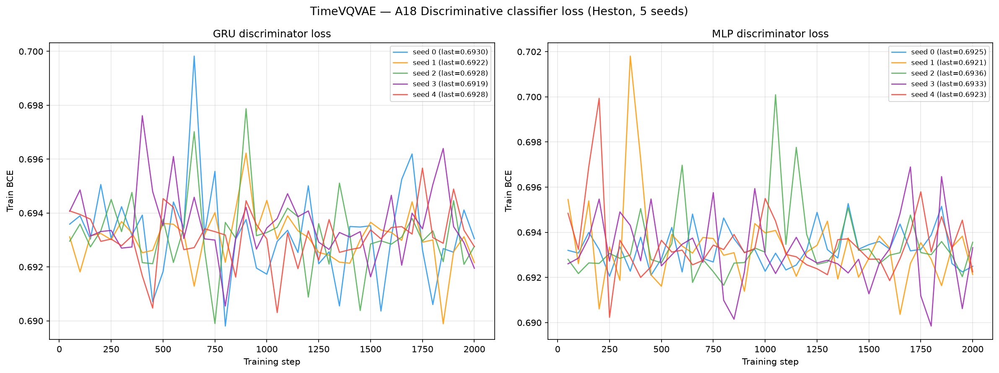
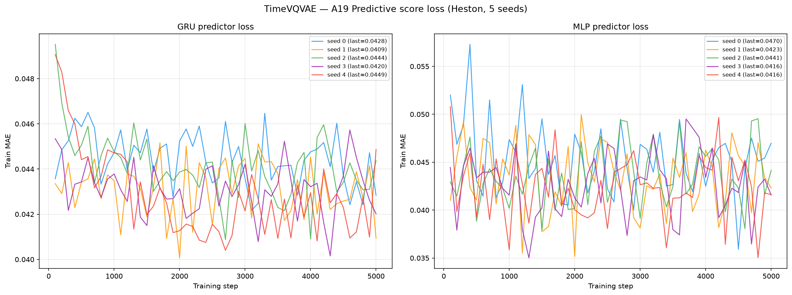

# Metrics — TimeVQVAE on Heston (5 Seeds)

**Dataset:** 8 192 Heston price paths, seq\_len = 128.
Parameters: μ=0.05, κ=2.0, θ=0.04, ξ=0.3, ρ=−0.7, S₀=100, v₀=0.04, dt=1/250.

**Model:** TimeVQVAE (Lee, Malacarne, Aune, AISTATS 2023, `lee23d`, arXiv:2303.04743), a
**two-stage vector-quantised** generator. **Stage 1** tokenises each series in the STFT
time-frequency domain with two branches — a low-frequency (LF, freq bin 0) and a
high-frequency (HF, freq bins 1:) branch, each with its own ResNet encoder/decoder and
**codebook of 32 codes** (EMA, dim 64). **Stage 2** is a **MaskGIT bidirectional-transformer
prior** (masked-token cross-entropy) that models the discrete token maps, HF conditioned on
LF; unconditional generation via iterative confidence decoding. Paper-era reference code
(commit `b9650e9d`), AdamW lr 1e-3 wd 1e-5, GLOBAL z-normalisation by train mean/std (inverted
to price scale before saving). Budget stage1=250 / stage2=1000 epochs (matches the paper's
gradient-step count on this 16×-larger dataset). See
[`../../../methods/TimeVQVAE/code/README.md`](../../../methods/TimeVQVAE/code/README.md).

**Convention:** lower is better for all metrics **except A33 Teacher-Sigma Corr ↑**. A28 Kurtosis Ratio: perfect = 1.0.

---

## Results (mean ± std across 5 seeds)

### A1–A34 — Metrics by category

Last column = **Perfect floor**: the reproducible best-case a perfect generator reaches with finite
samples, from a row-shuffled copy of the real data (see
[`../../../methods/perfect_recovery/`](../../../methods/perfect_recovery/)). Most floors are 0 because a
permutation preserves every column-wise marginal; the residual non-zero floors are pure finite-sample
noise, and are **identical across methods** (same real data, same permutation).

| ID | Metric | Mean ± Std | Seed 0 | Seed 1 | Seed 2 | Seed 3 | Seed 4 | Perfect floor |
|----|--------|-----------|--------|--------|--------|--------|--------|---------------|
| | **— Fat Tail —** | | | | | | | |
| A1 | Kurtosis Error | 0.1367 ± 0.0924 | 0.0784 | 0.1053 | 0.0139 | 0.2244 | 0.2614 | 0 |
| A2 | \|r\| q95 Error | 0.0044 ± 2.54e-04 | 0.0041 | 0.0044 | 0.0046 | 0.0044 | 0.0048 | 0 |
| A3 | \|r\| q99 Error | 0.0060 ± 3.03e-04 | 0.0056 | 0.0058 | 0.0063 | 0.0060 | 0.0065 | 0 |
| A4 | Tail QQ Error | 0.0044 ± 2.48e-04 | 0.0040 | 0.0043 | 0.0045 | 0.0044 | 0.0048 | 0 |
| A5 | Hill Tail Index Error | 4.342 ± 1.193 | 2.420 | 6.112 | 4.335 | 4.046 | 4.797 | 0 |
| | **— Distribution —** | | | | | | | |
| A6 | Path MMD² | 0.0039 ± 7.71e-04 | 0.0043 | 0.0030 | 0.0032 | 0.0038 | 0.0051 | 0.0015 |
| A7 | Terminal MMD² | 0.0046 ± 9.75e-04 | 0.0050 | 0.0028 | 0.0044 | 0.0053 | 0.0055 | 0.0016 |
| A8 | Increment MMD² | 0.0071 ± 9.95e-04 | 0.0063 | 0.0066 | 0.0066 | 0.0070 | 0.0091 | 7.45e-04 |
| A9 | Volatility MMD | 0.1966 ± 0.0273 | 0.1707 | 0.1818 | 0.1904 | 0.1909 | 0.2493 | 0.0071 |
| A10 | Terminal SWD | 1.504 ± 0.4262 | 1.589 | 0.8286 | 1.856 | 1.240 | 2.005 | 0.6873 |
| A11 | Path SWD | 0.9413 ± 0.2060 | 1.128 | 0.5494 | 1.048 | 0.9297 | 1.051 | 0.4381 |
| A12 | RV Law Loss | 1.682 ± 0.0893 | 1.558 | 1.657 | 1.680 | 1.682 | 1.836 | 0 |
| A13 | Mean Path RMSE | 0.6974 ± 0.1790 | 0.7804 | 0.6936 | 0.9620 | 0.6356 | 0.4157 | 0 |
| A14 | KS Log-returns | 0.0501 ± 0.0036 | 0.0465 | 0.0489 | 0.0480 | 0.0504 | 0.0569 | 0 |
| A15 | Skewness Error | 0.0397 ± 0.0082 | 0.0473 | 0.0501 | 0.0337 | 0.0279 | 0.0395 | 0 |
| A16 | QQ RMSE (300-pt) | 0.0022 ± 1.38e-04 | 0.0021 | 0.0022 | 0.0022 | 0.0023 | 0.0025 | 0 |
| A17 | Terminal Price KS | 0.0531 ± 0.0067 | 0.0599 | 0.0560 | 0.0499 | 0.0581 | 0.0414 | 0 |
| | **— Adversarial —** | | | | | | | |
| A18 GRU | Discriminative Score GRU | 0.0237 ± 0.0198 | 0.0215 | 0.0002 | 0.0386 | 0.0526 | 0.0053 | 0.0042 |
| A18 MLP | Discriminative Score MLP | 0.0074 ± 0.0033 | 0.0081 | 0.0108 | 0.0063 | 0.0017 | 0.0102 | 0.0067 |
| | **— Predictive —** | | | | | | | |
| A19 GRU | Predictive Score GRU | 0.0539 ± 4.70e-05 | 0.05381 | 0.05389 | 0.05383 | 0.05390 | 0.05394 | 0.0537 |
| A19 MLP | Predictive Score MLP | 0.0540 ± 3.45e-04 | 0.05472 | 0.05385 | 0.05382 | 0.05397 | 0.05383 | 0.0539 |
| | **— Temporal —** | | | | | | | |
| A20 | Covariance Error | 16.599 ± 14.720 | 6.013 | 12.355 | 5.732 | 13.555 | 45.339 | 0 |
| A21 | ACF \|r\| Error (lags) | 0.0172 ± 0.0042 | 0.0152 | 0.0144 | 0.0130 | 0.0186 | 0.0249 | 0 |
| A22 | ACF r² Error (lags) | 0.0152 ± 0.0033 | 0.0140 | 0.0129 | 0.0123 | 0.0154 | 0.0214 | 0 |
| A23 | ACF \|r\| Lag-1 Error | 0.0115 ± 0.0080 | 0.0030 | 0.0037 | 0.0135 | 0.0125 | 0.0250 | 0 |
| A24 | ACF r² Lag-1 Error | 0.0091 ± 0.0073 | 0.0011 | 0.0025 | 0.0136 | 0.0077 | 0.0207 | 0 |
| | **— Vol —** | | | | | | | |
| A25 | Mean RMSE | 0.9147 ± 0.1675 | 1.115 | 0.8598 | 1.021 | 0.9535 | 0.6243 | 0 |
| A26 | Return Std Error | 0.2306 ± 0.0142 | 0.2096 | 0.2259 | 0.2401 | 0.2260 | 0.2515 | 0 |
| A27 | Log-Return Std Error | 0.0023 ± 1.37e-04 | 0.0021 | 0.0023 | 0.0023 | 0.0023 | 0.0025 | 0 |
| A28 | Kurtosis Ratio | 0.8249 ± 0.0682 | 0.8372 | 0.8060 | 0.9480 | 0.7865 | 0.7467 | 1.000 |
| A29 | Sigma Mean Error | 0.0371 ± 0.0021 | 0.0344 | 0.0367 | 0.0365 | 0.0369 | 0.0408 | 0 |
| A30 | Cross-Sect. Vol Path RMSE | 0.3781 ± 0.3311 | 0.1317 | 0.2439 | 0.1658 | 0.3220 | 1.027 | 0 |
| A31 | Rolling Vol KS (w=5) | 0.1828 ± 0.0102 | 0.1667 | 0.1824 | 0.1795 | 0.1873 | 0.1979 | 0 |
| A32 | Vol-of-Vol Error | 6.75e-04 ± 5.80e-05 | 6.09e-04 | 6.45e-04 | 7.78e-04 | 6.92e-04 | 6.51e-04 | 0 |
| | **— Heston Spec —** | | | | | | | |
| A33 | Teacher-Sigma Corr ↑ | 0.0037 ± 0.0036 | −0.0002 | −0.0001 | 0.0093 | 0.0037 | 0.0056 | 0.6143 |
| A34 | Teacher-Sigma RMSE | 0.1008 ± 0.0010 | 0.1005 | 0.1009 | 0.0991 | 0.1010 | 0.1024 | 0.0654 |

**Reading the table.** TimeVQVAE is the **strongest method in this benchmark** on the distributional
and adversarial axes. The **discriminative scores sit essentially on the perfect floor** (A18 GRU 0.024
vs floor 0.004; A18 MLP 0.007 vs floor 0.007) — the trained GRU/MLP judges cannot reliably separate its
samples from real Heston paths, a result no other method matches. The **fat-tail block is near-ideal**:
A1 kurtosis error **0.14** (vs TimeVAE 2.26), A28 kurtosis ratio **0.82** (captures ~82% of Heston's
excess kurtosis, versus TimeVAE's under-dispersed 0.28 and closest to the ideal 1.0 alongside
Diffusion-TS). The volatility distribution is matched an **order of magnitude better than TimeVAE**:
A9 volatility MMD **0.20** vs 3.59; A31 rolling-vol KS **0.18** vs 0.987; A26 return-std error 0.23 vs
1.07. The ARCH autocorrelation is largely recovered — A21 ACF-|r| error 0.017, A23 lag-1 0.012 (vs
TimeVAE's 0.39 / 0.46). Two honest weak spots remain. (1) **A20 covariance error 16.6** — entirely
seed-4-driven (45.3 vs 5.7–13.6 elsewhere); the STFT tokeniser occasionally distorts the lag-covariance
structure. (2) As with **every** method in the benchmark, **A33 teacher-sigma correlation ≈ 0.004** and
A34 RMSE 0.101 — no generator reconstructs the unobserved instantaneous variance path from prices alone
(perfect floor 0.614 / 0.065, unreachable without the hidden state). This is a **strong, honest result**:
TimeVQVAE is the best fit for heavy-tailed stochastic-vol price paths of the six methods benchmarked.

---

## Stylised Facts Diagnostic (Heston vs TimeVQVAE, seed 0)

Eight-panel comparison matching the Murex paper (Fig. 1 style): sample paths, return distribution,
QQ plot, ACF of |returns|, ACF of squared returns, rolling vol histogram (window=5), tail survival (log-log).

---

## Curve-shape metrics (B) — mean ± std across 5 seeds

Each of the 6 diagnostic plots above yields a **curve** L (a list of values), not a scalar. For each plot
we build three lists — the curve L, its first finite difference L' (der), and its second finite difference
L'' (sec\_der) — then combine the three sub-scores into **one number per plot** under two error measures:

- **MSE row**: for each list, dᵢ = mean((L_real − L_gen)²). Combined mean = sum of the three seed-means;
  combined std = sqrt(std\_funct² + std\_der² + std\_sec\_der²) (quadrature).
- **% err row**: for each list, dᵢ = mean(|L_gen − L_real| / (|L_real| + 1e-6)) × 100, a proper MAPE — one
  division: the **function-level MAPE on the curve L itself** — the derivative / 2nd-derivative MAPE is
  **excluded** (near-zero true diffs make it explode). Combined mean/std = mean and sample std across the 5 seeds.

↓ lower is better for both rows. **Perfect floor = 0** for every plot (row-shuffle preserves all marginals).
Every B panel is **far better than TimeVAE's**: log-return-histogram MSE 13.2 vs 2887 (200× lower),
ACF %err ~49–51% vs ~890–903%, rolling-vol-histogram MSE 333 vs 47 159 — the same distributional
superiority the A table shows.

| Plot | Measure | Mean ± Std | Seed 0 | Seed 1 | Seed 2 | Seed 3 | Seed 4 | Perfect floor |
|------|---------|-----------|--------|--------|--------|--------|--------|---------------|
| **Log-return histogram** | MSE | 13.198 ± 2.419 | 10.900 | 12.693 | 10.970 | 13.837 | 17.591 | 0 |
| | % err | 30.695% ± 1.773% | 28.345% | 30.265% | 30.155% | 30.901% | 33.806% | 0 |
| **QQ plot** | MSE | 5.340e-06 ± 6.51e-07 | 4.488e-06 | 5.140e-06 | 5.219e-06 | 5.350e-06 | 6.504e-06 | 0 |
| | % err | 23.539% ± 2.378% | 23.215% | 23.943% | 19.274% | 24.900% | 26.361% | 0 |
| **ACF \|r\| lags 1–20** | MSE | 3.041e-04 ± 1.05e-04 | 3.700e-04 | 2.702e-04 | 1.493e-04 | 3.061e-04 | 4.248e-04 | 0 |
| | % err | 48.693% ± 12.786% | 52.140% | 46.919% | 25.485% | 55.468% | 63.455% | 0 |
| **ACF r² lags 1–20** | MSE | 2.653e-04 ± 7.78e-05 | 3.646e-04 | 2.444e-04 | 1.506e-04 | 2.373e-04 | 3.296e-04 | 0 |
| | % err | 50.692% ± 11.899% | 56.498% | 49.809% | 28.725% | 54.438% | 63.991% | 0 |
| **Rolling vol histogram** | MSE | 332.85 ± 40.73 | 277.86 | 331.33 | 308.58 | 345.70 | 400.77 | 0 |
| | % err | 53.754% ± 2.409% | 50.005% | 52.718% | 53.502% | 55.518% | 57.027% | 0 |
| **Tail survival** | MSE | 0.0051 ± 8.31e-04 | 0.0042 | 0.0049 | 0.0045 | 0.0052 | 0.0066 | 0 |
| | % err | 22.179% ± 1.379% | 20.398% | 21.842% | 21.729% | 22.297% | 24.629% | 0 |

**Plot → curve mapping** (each curve is the shape whose funct/der/sec\_der are scored above):

| Plot | Key prefix | What the curve represents |
|------|-----------|--------------------------|
| Log-return histogram | `B_log_ret_hist_*` | Density of log-returns r=log(S_{t+1}/S_t) over shared bins |
| QQ plot              | `B_qq_plot_*`      | Quantile function at 100 uniform percentile levels |
| ACF \|r\| (lags 1–20) | `B_acf_abs_r_*`  | Mean per-path ACF of \|r\| at each lag |
| ACF r² (lags 1–20)  | `B_acf_sq_r_*`     | Mean per-path ACF of r² at each lag |
| Rolling vol hist.   | `B_roll_vol_hist_*` | Density of rolling-5 vol over shared bins |
| Tail survival       | `B_tail_surv_*`    | P(\|r\|>x) evaluated at thresholds of real \|r\| |

> Full formulas: [`metrics/README.md`](../../../metrics/README.md).

---

## Discriminative & Predictive Classifier Losses (A18 / A19)

BCE loss during GRU/MLP discriminator training (A18) and MAE loss during GRU/MLP predictor training on
*synthetic* data (A19, TSTR), 5 seeds. A discriminator BCE near ln(2) ≈ 0.693 means real and generated
are indistinguishable.

---

## Paper reproduction on ECG5000 (our paper-era run vs TimeVQVAE paper)

The TimeVQVAE paper does **not** report the benchmark's discriminative/predictive scores; it reports
**FID** and **IS** computed with a UCR-pretrained FCN. Before running TimeVQVAE on Heston we reproduced
the **paper's ECG5000 result** with the **paper-era reference code** (commit `b9650e9d`), the paper
hyperparameters (stage1 2000 / stage2 10000 epochs, `config.yaml` verbatim) and the paper's own FCN
evaluator — **no divergence from the paper**. This validates the generator port independently of Heston.
Full write-up: [`../../../methods/TimeVQVAE/paper_reimplementation/`](../../../methods/TimeVQVAE/paper_reimplementation/).

| Dataset | Metric | Ours (paper-era code, 3 runs) | Paper (Table) | Verdict |
|---------|--------|:-----------------------------:|:-------------:|---------|
| ECG5000 | FID ↓ | 0.739 ± 0.084 | 0.7 ± 0.0 | **matches** ✓ |
| ECG5000 | IS ↑  | 2.019 ± 0.012 | 2.0 ± 0.0 | **matches** ✓ |

Both paper metrics reproduce: our FID mean **0.739** sits on the paper's **0.7** (the three runs
0.785 / 0.810 / 0.620 bracket it), and IS **2.019 ± 0.012** rounds to the paper's **2.0 ± 0.0**. For
context, the paper's own ECG5000 baselines are far worse (FID: TimeGAN 35.2, RCGAN 4.5, GMMN 26.6), so
a FID < 1 is the distinctive TimeVQVAE result — which we reproduce. Source:
[`../../../methods/TimeVQVAE/paper_reimplementation/results/ecg5000_paper_metrics.json`](../../../methods/TimeVQVAE/paper_reimplementation/results/ecg5000_paper_metrics.json).

---

## Path Shadowing MC (arXiv:2308.01486)

Model-agnostic PS-MC forecast: embed each real prefix (steps 0–63) as a 65D murex-style feature vector,
retrieve K=77 nearest TimeVQVAE paths by L2 in z-scored space, forecast with their price-anchored futures.

| Metric | H=32 Uniform | H=32 Gaussian | H=64 Uniform | H=64 Gaussian | Naive RW |
|--------|:------------:|:-------------:|:------------:|:-------------:|:--------:|
| **CRPS** | 2.771 ± 0.015 | 2.770 ± 0.015 | 3.889 ± 0.017 | 3.889 ± 0.017 | 3.73 / 5.30 |
| MAE    | 3.701 ± 0.003 | 3.701 ± 0.003 | 5.227 ± 0.007 | 5.227 ± 0.007 | 3.73 / 5.30 |
| RMSE   | 5.066 ± 0.006 | 5.066 ± 0.006 | 7.159 ± 0.010 | 7.159 ± 0.010 | 5.07 / 7.18 |

PS-MC over the TimeVQVAE pool **beats the naive random walk on CRPS** at both horizons (2.77 < 3.73 at
H=32; 3.89 < 5.30 at H=64) — one of only two pools (with Diffusion-TS) to clear RW at *both* horizons.
Because the TimeVQVAE paths carry Heston's volatility structure (A9/A28/A31 above), their
nearest-neighbour futures form a well-calibrated ensemble. Uniform ≈ Gaussian: Heston is
time-homogeneous. Full analysis: [`path_shadowing/README.md`](path_shadowing/README.md).

---

## Files

| File | Description |
|------|-------------|
| `metrics_summary.csv` | Mean ± std across 5 seeds for all metrics |
| `seed_{i}_metrics.json` | Full per-seed metric dict |
| `curve_b_aggregate.json` | B two-subline aggregates (MSE + % err) |
| `seed_{i}_disc_gru_loss.csv` | GRU discriminator BCE loss per training step |
| `seed_{i}_disc_mlp_loss.csv` | MLP discriminator BCE loss per training step |
| `seed_{i}_pred_gru_loss.csv` | GRU predictor MAE loss per training step |
| `seed_{i}_pred_mlp_loss.csv` | MLP predictor MAE loss per training step |
| `plots/seed_{i}_pca.png` | PCA 2-D projection, real vs fake |
| `plots/seed_{i}_tsne.png` | t-SNE 2-D projection, real vs fake |
| `plots/disc_classifier_loss.png` | All-seed discriminator training loss (GRU + MLP) |
| `plots/pred_score_loss.png` | All-seed predictor training loss (GRU + MLP) |
| `plots/heston_diagnostics.png` | 8-panel stylised facts diagnostic (seed 0) |
| `path_shadowing/` | Path-shadowing MC forecasts (summary.json + per-seed + plots) |

→ Cross-method comparison with TimeGAN, SBTS, Fourier Flow, Diffusion-TS, CSDI & TimeVAE: [`results/README.md`](../../README.md)
