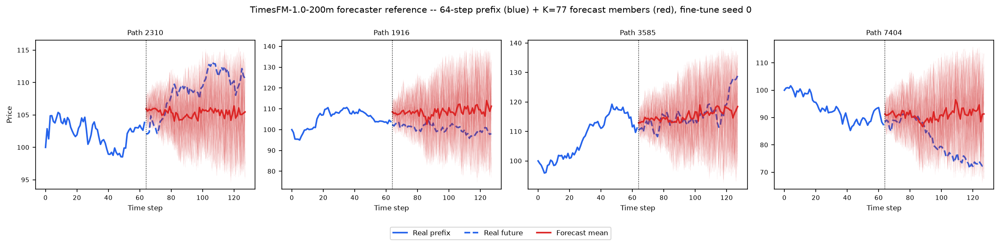
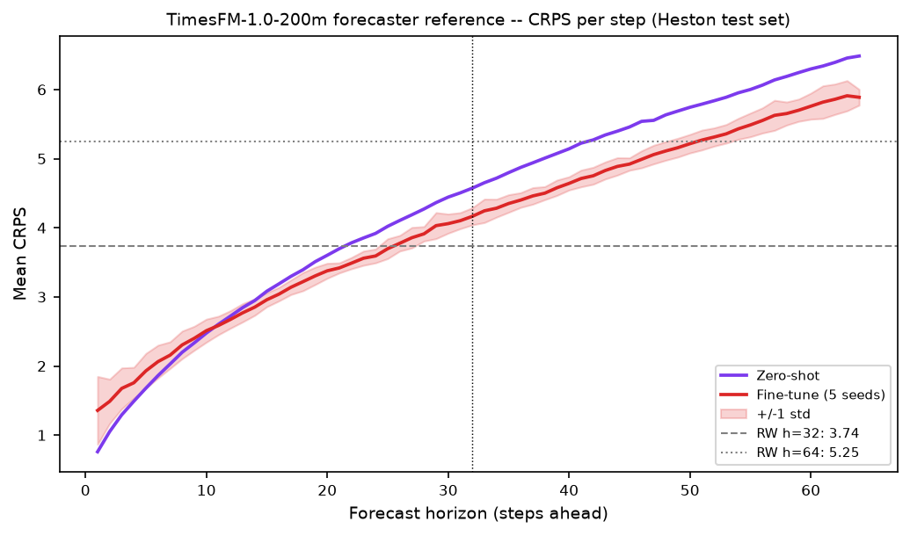

# TimesFM — Forecaster Reference on Heston

**TimesFM is a *forecaster reference*, not a generative method.** Every other entry in this benchmark
(except Chronos-2) is an **unconditional generator** whose forecasting ability is measured *indirectly*
through Path-Shadowing Monte-Carlo (PS-MC). TimesFM — like Chronos-2 — answers *how good is a purpose-built
conditional forecaster on the same task?* by forecasting the Heston future **directly**. It sits in the
**forecaster category** alongside Chronos-2 and is one of the "best forecaster" yardsticks the generator
PS-MC rows are compared against.

**Dataset:** 8 192 Heston price paths, seq\_len = 128.
Parameters: μ=0.05, κ=2.0, θ=0.04, ξ=0.3, ρ=−0.7, S₀=100, v₀=0.04, dt=1/250.
Forecasts are made on the **test set** (`dataset/Heston/heston_S_test_8192x128.npy`).

**Model.** TimesFM — a pretrained decoder-only patched probabilistic **conditional forecaster** (Das, Kong,
Sen, Zhou, Google Research, **ICML 2024**, *A decoder-only foundation model for time-series forecasting*,
arXiv:2310.10688v4, `github.com/google-research/timesfm`). Checkpoint
`google/timesfm-1.0-200m-pytorch` (**~200M params**; 20 layers, model_dims 1280, input-patch 32,
output-patch 128, positional embeddings on). Given a context window it emits a mean plus **9 predictive
quantiles** (levels 0.1…0.9) per future step. See
[`../../../methods/TimesFM/README.md`](../../../methods/TimesFM/README.md).

> **There is no `old/` folder.** Unlike Chronos-2, TimesFM was never run as an unconditional generator in
> this benchmark — it enters purely as a forecaster reference, so there is no retired generator experiment
> to archive. TimesFM appears in the forecaster category only and is **excluded from every A/B/PS-MC
> generator table and win-count** in the root and results READMEs.

---

## Forecaster-reference protocol

1. **Prefix = 64 steps** (0–63) of each real test path — matches the PS-MC query prefix length.
2. **Single-shot forecast** of the next **64 steps** (64–127) in **price space** with one
   `tfm.forecast(context, freq=[0]*N)` call (TimesFM applies reversible instance-norm on the context
   internally). Single-shot has no autoregressive feedback, so it is stable.
3. **Ensemble K = 77** per path by piecewise-linear inverse-CDF sampling over the **9** quantile levels
   TimesFM emits (the mean column is dropped; only the 9 quantile heads feed the ensemble). K = 77 matches
   the PS-MC ensemble size.
4. **Scored with the identical harness** as the generators — the same `crps` / `evaluate_horizon` /
   `naive_baseline` from `path_shadowing.py`, so CRPS and the naive random-walk (RW) baseline are directly
   comparable to the generator PS-MC rows.

Two reference variants, reported as **two rows**: **zero-shot** (pretrained checkpoint, a single model →
one point value) and **fine-tuned** (5 per-seed full fine-tunes on the 8 192 Heston training paths, 1 000
Adam steps, lr 1e-4, wd 0.01, batch 256, masked MSE + 9-quantile pinball loss, mean ± std across seeds).
Horizons **H = 32** and **H = 64** are cut from the same 64-step forecast.

---

## Reference scores — CRPS / MAE / RMSE (price space, 64-step prefix)

Lower is better. CRPS is the energy-score CRPS; the RW baseline repeats the last prefix value (its
CRPS = MAE). Read from [`forecaster_summary.json`](forecaster_summary.json).

| Forecaster | CRPS H=32 ↓ | CRPS H=64 ↓ | MAE H=32 | MAE H=64 | RMSE H=32 | RMSE H=64 |
|------------|:-----------:|:-----------:|:--------:|:--------:|:---------:|:---------:|
| **TimesFM zero-shot** | 3.065 | 4.347 | 4.147 | 5.770 | 5.639 | 7.811 |
| **TimesFM fine-tuned** *(5 seeds)* | **2.976 ± 0.140** | **4.046 ± 0.139** | 4.039 ± 0.169 | 5.470 ± 0.153 | 5.365 ± 0.174 | 7.338 ± 0.173 |
| *RW baseline* | *3.738* | *5.246* | *3.738* | *5.246* | *5.040* | *7.066* |

**Both variants beat the naive random walk on CRPS at both horizons** — a real conditional forecaster adds
value over "tomorrow = today". Fine-tuning sharpens the per-step scale (CRPS 3.065 → 2.976 at H=32,
4.347 → 4.046 at H=64). Unlike Chronos-2, the 5 fine-tune seeds show **genuine spread** (std ≈ 0.14): the
fine-tuner draws random minibatches (`rng.integers`) seeded per run, so each seed sees a different data
order — the std is real seed variance, not numerical noise.

### Forecaster reference vs generator Path-Shadowing MC

Same task, prefix length, CRPS and RW baseline — directly comparable:

| CRPS ↓ (price space) | H=32 | H=64 |
|----------------------|:----:|:----:|
| **Forecaster reference** | | |
| TimesFM zero-shot | 3.065 | 4.347 |
| TimesFM fine-tuned *(5 seeds)* | 2.976 ± 0.140 | 4.046 ± 0.139 |
| Chronos-2 zero-shot | 2.996 | 4.234 |
| Chronos-2 fine-tuned *(5 seeds)* | 2.760 ± 0.0001944 | 3.980 ± 0.0004099 |
| **Best generator PS-MC** | | |
| LS4 (path-shadowing, best of 10 generators) | **2.704 ± 0.002510** | **3.763 ± 0.005851** |
| **Baselines** | | |
| Random walk (naive) | 3.738 | 5.246 |
| Perfect (oracle Heston pool) | 2.721 ± 0.004183 | 3.788 ± 0.006463 |

**Headline finding holds with a second forecaster.** TimesFM is **comparable to but slightly behind
Chronos-2** at both horizons and both variants (fine-tuned 2.976 / 4.046 vs Chronos-2 2.760 / 3.980), and —
crucially — **neither purpose-built foundation forecaster beats the best generator's path-shadowing**: LS4
PS-MC (2.704 / 3.763) edges out both and reaches the Perfect oracle floor (2.721 / 3.788) while the
forecasters do not. Path-Shadowing MC over a well-trained unconditional generator is a **competitive
conditional forecaster in its own right** — the generator route is not merely a fidelity check.

---

## Plots

**Example forecasts (fine-tune seed 0)** — 64-step real prefix (blue solid) + real future (blue dashed) +
K = 77 inverse-CDF forecast members (red) + forecast mean, 4 random test paths:

**CRPS per forecast step** (zero-shot vs fine-tune, ±1 std band, RW baseline lines):

---

## Validating the port — paper zero-shot ETT reproduction

> ⚠️ **TimesFM's paper metric is zero-shot forecasting accuracy on standard benchmarks, not Heston.**
> The arXiv:2310.10688v4 headline is **zero-shot MAE** on the ETT long-horizon benchmark (paper **Table 5**).
> We validated our port by reproducing that zero-shot MAE (last-test-window protocol, context 512,
> train-statistic z-normalisation, horizons 96 and 192), for **both** released checkpoints.

| Checkpoint | ETT avg MAE (ours) | Paper `TimesFM(ZS)` avg |
|------------|:------------------:|:-----------------------:|
| `google/timesfm-1.0-200m-pytorch` *(paper model)* | **0.3409** | 0.36 |
| `google/timesfm-2.0-500m-pytorch` *(newer)* | 0.3415 | — (not in paper) |

Our 1.0-200m average (0.3409) matches the paper's `TimesFM(ZS)` average (0.36) closely, confirming the port
loads and runs the pretrained checkpoint faithfully. Full 8-task per-dataset table (both checkpoints vs the
paper's Table 5 `TimesFM(ZS)` column):
[`../../../methods/TimesFM/paper_reimplementation/README.md`](../../../methods/TimesFM/paper_reimplementation/README.md).

---

## Files

| File | Description |
|------|-------------|
| `forecaster_summary.json` | Zero-shot + fine-tune (mean ± std, 5 seeds) CRPS/MAE/RMSE at H=32/H=64 + RW baseline + per-step CRPS |
| `forecaster_seed_{i}.json` | Per-seed fine-tune forecaster scores |
| `plots/forecaster_example.png` | 4 example paths: prefix + K=77 forecast members + mean (fine-tune seed 0) |
| `plots/forecaster_crps_per_step.png` | CRPS per forecast step, zero-shot vs fine-tune, RW baseline lines |

→ Cross-method comparison with the 10 generators: [`results/README.md`](../../README.md)
