# CSDI on Heston — SBTS log-return preprocessing

The **official CSDI** (Tashiro et al., NeurIPS 2021, arXiv:2107.03502) run **unconditionally**
(`cond_mask ≡ 0`, a plain DDPM) on **4 096** Heston stochastic-volatility price paths (seq_len = 128),
but fed the **SBTS volatility-scaled log-return transform** in place of CSDI's native standardized-price
input. Everything else — SDE, parameters, RNG streams, metric code, seeds 0–4 — is held fixed against the
original price-input run at [`../../CSDI/`](../../CSDI/README.md). Preprocessing details and the
head-to-head verdict are **below the metrics** ([jump](#preprocessing-the-sbts-log-return-transform));
this top block mirrors the canonical per-method report so the two runs are directly comparable.

> **Data split (test set everywhere).** Disjoint 4 096-path Heston draws: generator **trained on seed
> 0**; every A/B metric compares generated paths against the **test set (seed 1)**; A18 uses a **third
> real set (seed 2)** as the "real" class. No metric is scored against training data.

---

## Metrics A1-A34 + B, mean ± std across 5 seeds

> All metrics on **log-returns** $r_t = \log(S_{t+1}/S_t)$ unless noted. A26 uses price increments $\Delta S_t$.

| Metric | Mean ± Std | Seed 0 | Seed 1 | Seed 2 | Seed 3 | Seed 4 | Perfect floor |
|--------|-----------|--------|--------|--------|--------|--------|---------------|
| **, Fat Tail, ** | | | | | | | |
| A1 Kurtosis Error ↓ | 0.09607 ± 0.03403 | 0.09148 | 0.09536 | 0.1571 | 0.08377 | 0.05260 | 0.05717 |
| A2 \|r\| q95 Error ↓ | 0.003275 ± 2.21e-04 | 0.003136 | 0.003079 | 0.003703 | 0.003227 | 0.003230 | 1.49e-04 |
| A3 \|r\| q99 Error ↓ | 0.004672 ± 2.87e-04 | 0.004537 | 0.004448 | 0.005239 | 0.004552 | 0.004584 | 2.40e-04 |
| A4 Tail QQ Error ↓ | 0.003223 ± 2.21e-04 | 0.003071 | 0.003030 | 0.003649 | 0.003190 | 0.003176 | 1.54e-04 |
| A5 Hill Tail Index Error ↓ | 3.502 ± 1.155 | 2.105 | 3.332 | 5.621 | 3.075 | 3.378 | 1.280 |
| **, Distribution, ** | | | | | | | |
| A6 Path MMD² ↓ | 0.004724 ± 8.37e-04 | 0.004132 | 0.004076 | 0.006194 | 0.005132 | 0.004086 | 0.001785 |
| A7 Terminal MMD² ↓ | 0.005010 ± 0.001396 | 0.003956 | 0.003888 | 0.007337 | 0.003948 | 0.005919 | 0.001252 |
| A8 Increment MMD² ↓ | 0.002725 ± 3.31e-04 | 0.002649 | 0.002695 | 0.003357 | 0.002438 | 0.002484 | 8.35e-04 |
| A9 Volatility MMD ↓ | 0.07403 ± 0.01016 | 0.07360 | 0.07138 | 0.09319 | 0.06345 | 0.06853 | 0.007665 |
| A10 Terminal SWD ↓ | 2.759 ± 0.6438 | 3.036 | 2.320 | 3.894 | 2.129 | 2.414 | 0.7849 |
| A11 Path SWD ↓ | 1.652 ± 0.3123 | 1.777 | 1.381 | 2.188 | 1.588 | 1.325 | 0.5453 |
| A12 RV Law Loss ↓ | 1.257 ± 0.08482 | 1.217 | 1.187 | 1.424 | 1.226 | 1.231 | 0.07645 |
| A13 Mean Path RMSE ↓ | 1.869 ± 0.2044 | 1.988 | 1.690 | 2.217 | 1.737 | 1.714 | 0.1839 |
| A14 KS Log-returns ↓ | 0.03790 ± 0.003867 | 0.03770 | 0.03534 | 0.04543 | 0.03569 | 0.03534 | 0.002173 |
| A15 Skewness Error ↓ | 0.02500 ± 0.009075 | 0.03920 | 0.01149 | 0.02837 | 0.02096 | 0.02498 | 0.01206 |
| A16 QQ RMSE (300-pt) ↓ | 0.001613 ± 1.24e-04 | 0.001562 | 0.001515 | 0.001858 | 0.001567 | 0.001561 | 8.18e-05 |
| A17 Terminal Price KS ↓ | 0.09575 ± 0.01135 | 0.1047 | 0.08667 | 0.1133 | 0.09033 | 0.08374 | 0.02139 |
| **, Adversarial, ** | | | | | | | |
| A18 Disc Score GRU ↓ | 0.02459 ± 0.02851 | 0.08084 | 0.01129 | 0.01739 | 0.01068 | 0.002746 | 0.007138 |
| A18 Disc Score MLP ↓ | 0.008969 ± 0.005832 | 3.05e-04 | 0.01434 | 0.01617 | 0.008847 | 0.005186 | 0.006284 |
| **, Predictive, ** | | | | | | | |
| A19 Pred Score GRU ↓ | 0.05638 ± 4.00e-06 | 0.05638 | 0.05638 | 0.05638 | 0.05639 | 0.05638 | 0.05638 |
| A19 Pred Score MLP ↓ | 0.05658 ± 4.25e-04 | 0.05625 | 0.05641 | 0.05645 | 0.05741 | 0.05635 | 0.05668 |
| **, Temporal, ** | | | | | | | |
| A20 Covariance Error ↓ | 49.05 ± 6.706 | 49.45 | 42.19 | 58.86 | 41.23 | 53.55 | 5.825 |
| A21 ACF \|r\| Error (lags) ↓ | 0.008784 ± 0.003423 | 0.01104 | 0.008211 | 0.01412 | 0.005094 | 0.005454 | 0.001318 |
| A22 ACF r² Error (lags) ↓ | 0.005865 ± 0.002317 | 0.006930 | 0.004823 | 0.009910 | 0.003828 | 0.003837 | 0.001394 |
| A23 ACF \|r\| Lag-1 Error ↓ | 0.005258 ± 0.004223 | 0.008329 | 0.005217 | 0.01140 | 5.83e-04 | 7.65e-04 | 9.01e-04 |
| A24 ACF r² Lag-1 Error ↓ | 0.003436 ± 0.002244 | 0.004671 | 0.001968 | 0.007295 | 0.001488 | 0.001759 | 0.001377 |
| **, Vol, ** | | | | | | | |
| A25 Mean RMSE ↓ | 2.920 ± 0.4190 | 3.317 | 2.608 | 3.526 | 2.658 | 2.488 | 0.3668 |
| A26 Return Std Error ↓ | 0.1387 ± 0.01068 | 0.1324 | 0.1318 | 0.1599 | 0.1344 | 0.1349 | 0.005319 |
| A27 Log-Return Std Error ↓ | 0.001671 ± 1.23e-04 | 0.001615 | 0.001571 | 0.001913 | 0.001626 | 0.001633 | 7.03e-05 |
| A28 Kurtosis Ratio (→ 1) | 1.012 ± 0.04015 | 1.018 | 0.9929 | 0.9536 | 1.020 | 1.077 | 1.072 |
| A29 Sigma Mean Error ↓ | 0.02551 ± 0.001956 | 0.02458 | 0.02410 | 0.02939 | 0.02478 | 0.02470 | 0.001022 |
| A30 Cross-Sect. Vol Path RMSE ↓ | 1.230 ± 0.1180 | 1.200 | 1.092 | 1.332 | 1.126 | 1.399 | 0.1684 |
| A31 Rolling Vol KS (w=5) ↓ | 0.1137 ± 0.009122 | 0.1099 | 0.1072 | 0.1319 | 0.1098 | 0.1098 | 0.004939 |
| A32 Vol-of-Vol Error ↓ | 6.03e-04 ± 3.10e-05 | 5.74e-04 | 5.59e-04 | 6.41e-04 | 6.23e-04 | 6.20e-04 | 4.26e-05 |
| **, Heston Spec, ** | | | | | | | |
| A33 Teacher-Sigma Corr ↑ | 0.001505 ± 0.008084 | 0.01060 | 0.007538 | 0.004467 | -0.003326 | -0.01175 | 0.6156 |
| A34 Teacher-Sigma RMSE ↓ | 0.09858 ± 4.42e-04 | 0.09831 | 0.09844 | 0.09944 | 0.09821 | 0.09850 | 0.06560 |

> **Convention:** ↓ lower is better; ↑ higher is better;, no monotone direction. A28 Kurtosis Ratio: perfect = 1.0.
> **A1**: |kurt_real − kurt_gen| on log-returns. **A2-A3**: 95th/99th quantile error on |log-returns|. **A4**: QQ error restricted to top-5% tail quantiles. **A5**: |Hill tail index_real − Hill tail index_gen|, Hill estimator on |log-returns| above 95th pct.
> **A6-A11**: path-kernel distances, Gaussian MMD² on full paths / terminal prices / increments / realized-vol, and sliced-Wasserstein on terminal & full paths. Non-zero perfect floor (an independent Heston draw scored against the test set, finite-sample noise).
> **A12**: W₁(RV_real, RV_gen), RV_i = Σ_t r²_{i,t}/dt. **A13**: path-level RMSE between real/gen mean trajectories. **A14**: KS statistic on pooled log-returns. **A15**: |skew_real − skew_gen|, Heston true skew ≈ −0.45. **A16**: QQ RMSE over 300 uniform quantile levels. **A17**: KS statistic on terminal prices S_T.
> **A18**: Discriminative classifier trained on log-returns; score = |accuracy − 0.5|, 0 = indistinguishable, 0.5 = perfectly separable (GRU + MLP). **A19**: TSTR predictive MAE (GRU + MLP).
> **A20**: covariance-matrix error (%). **A21-A22**: ACF error on |r| and r² across lags 1-20. **A23-A24**: ACF lag-1 error on |r| and r². Heston true values ≈ +0.052 / +0.050.
> **A25**: mean-path RMSE. **A26**: return std error, uses price increments $\Delta S_t$. **A27**: log-return std error. **A28**: kurtosis ratio real/gen, perfect = 1.0. **A29**: sigma mean error, annualized per-path vol. **A30**: cross-sectional vol-path RMSE. **A31**: KS statistic on rolling-5 vol histograms. **A32**: |vol-of-vol_real − vol-of-vol_gen|.
> **A33**: Teacher-sigma correlation (Heston-recovered vol vs teacher σ), higher is better, perfect ≈ 0.614. **A34**: Teacher-sigma RMSE, perfect ≈ 0.065.

---

## B, Curve-Shape Metrics, mean ± std across 5 seeds

Each stylised-fact plot yields a **curve** L (a list of values), not a scalar. For real data (L_r) and
generated data (L_g) we build three lists, the curve L, its first finite difference L' (der), and its
second finite difference L'' (sec_der), then combine them into **one number per plot**:

- **MSE row**: for each list, dᵢ = mean((L_r − L_g)²). Reported mean = the **mean of the three sub-scores** (funct + der + sec_der)/3; std = sample std of that per-seed combined score across the 5 seeds. The **MSE row decides the cross-method winner**.
- **% err row**: dᵢ = mean(|L_g − L_r| / (|L_r| + 1e-6)) × 100, a proper MAPE on the curve L itself (funct-only); the der / sec_der MAPE is excluded because their near-zero true values explode the relative error.
- **NRMSE row**: sqrt(mean((L_g − L_r)²)) / (max|L_r| − min|L_r| + 1e-12) × 100 on the curve L only (funct-only). This is the range-normalized RMSE.
- **CVaR₉₀ / CVaR₉₅ rows**: tail-averaged pointwise curve error (Expected Shortfall) on the curve L only (funct-only). Pointwise error eₜ = |L_g(t) − L_r(t)|; for q ∈ {0.90, 0.95}, CVaR_q = mean(eₜ for eₜ ≥ the q-th percentile of eₜ), then range-normalized like NRMSE.

All ↓ lower is better. The perfect floor is **non-zero** for all six plots, it is the residual
finite-sample error of an independent Heston draw scored against the test set, identical across methods.
Five sublines per plot: **MSE**, **% error**, **NRMSE**, **CVaR₉₀** and **CVaR₉₅**.

| Plot | Measure | Mean ± Std | Seed 0 | Seed 1 | Seed 2 | Seed 3 | Seed 4 | Perfect floor |
|------|---------|-----------|--------|--------|--------|--------|--------|---------------|
| **Path comparison** *(50×50 path-cloud)* | grid_tvd 50×50 (%) ↓ | 8.223% ± 0.5744% | 7.997% | 7.414% | 9.194% | 8.264% | 8.245% | — |
| **Log-return histogram** | MSE | 1.940 ± 0.4680 | 1.864 | 1.706 | 2.765 | 1.713 | 1.650 | 0.2350 |
|  | % err | 22.03% ± 1.666% | 21.25% | 20.82% | 25.33% | 21.60% | 21.16% | 2.617% |
|  | NRMSE | 6.137% ± 0.6734% | 6.027% | 5.745% | 7.464% | 5.712% | 5.737% | 0.7244% |
|  | CVaR₉₀ | 15.22% ± 1.914% | 15.18% | 14.25% | 18.93% | 13.77% | 13.99% | 1.634% |
|  | CVaR₉₅ | 16.67% ± 2.334% | 16.29% | 15.57% | 21.25% | 15.11% | 15.11% | 1.878% |
| **QQ plot** | MSE | 9.34e-07 ± 1.66e-07 | 8.75e-07 | 8.22e-07 | 1.23e-06 | 8.75e-07 | 8.70e-07 | 2.92e-09 |
|  | % err | 20.27% ± 2.034% | 21.07% | 19.34% | 23.88% | 18.56% | 18.48% | 1.243% |
|  | NRMSE | 4.469% ± 0.3403% | 4.334% | 4.202% | 5.142% | 4.340% | 4.326% | 0.2264% |
|  | CVaR₉₀ | 4.816% ± 0.3392% | 4.651% | 4.502% | 5.474% | 4.735% | 4.718% | 0.2664% |
|  | CVaR₉₅ | 5.614% ± 0.3775% | 5.455% | 5.267% | 6.349% | 5.501% | 5.498% | 0.3696% |
| **ACF \|r\| lags 1-20** | MSE | 4.65e-05 ± 1.89e-05 | 5.53e-05 | 3.81e-05 | 7.53e-05 | 2.86e-05 | 3.54e-05 | 1.22e-05 |
|  | % err | 41.46% ± 10.09% | 48.40% | 38.93% | 57.26% | 30.55% | 32.17% | 7.924% |
|  | NRMSE | 26.58% ± 6.296% | 31.12% | 24.97% | 36.24% | 19.24% | 21.32% | 5.554% |
|  | CVaR₉₀ | 34.97% ± 6.432% | 39.86% | 33.03% | 44.60% | 26.74% | 30.63% | 11.36% |
|  | CVaR₉₅ | 36.12% ± 6.918% | 41.47% | 35.54% | 45.92% | 26.81% | 30.88% | 13.09% |
| **ACF r² lags 1-20** | MSE | 2.88e-05 ± 1.02e-05 | 3.49e-05 | 2.34e-05 | 4.37e-05 | 1.87e-05 | 2.34e-05 | 1.19e-05 |
|  | % err | 39.19% ± 9.228% | 44.53% | 36.92% | 54.27% | 30.00% | 30.22% | 10.48% |
|  | NRMSE | 21.13% ± 4.811% | 24.29% | 19.74% | 28.77% | 15.59% | 17.28% | 6.140% |
|  | CVaR₉₀ | 29.34% ± 5.648% | 34.58% | 26.78% | 37.10% | 21.81% | 26.42% | 12.33% |
|  | CVaR₉₅ | 30.99% ± 6.082% | 37.55% | 29.21% | 38.49% | 23.02% | 26.65% | 14.69% |
| **Rolling vol histogram** | MSE | 39.18 ± 7.404 | 36.81 | 35.71 | 52.39 | 35.60 | 35.41 | 1.965 |
|  | % err | 37.40% ± 2.514% | 36.40% | 35.37% | 42.35% | 36.28% | 36.57% | 3.395% |
|  | NRMSE | 11.87% ± 0.9904% | 11.50% | 11.30% | 13.84% | 11.36% | 11.34% | 1.057% |
|  | CVaR₉₀ | 23.87% ± 2.121% | 23.42% | 22.86% | 28.05% | 22.33% | 22.68% | 2.306% |
|  | CVaR₉₅ | 24.84% ± 2.220% | 24.06% | 23.58% | 29.26% | 23.49% | 23.80% | 2.637% |
| **Tail survival** | MSE | 7.45e-04 ± 1.69e-04 | 7.00e-04 | 6.47e-04 | 0.001045 | 6.65e-04 | 6.68e-04 | 8.97e-07 |
|  | % err | 15.65% ± 1.221% | 15.17% | 14.74% | 18.07% | 15.11% | 15.15% | 0.6137% |
|  | NRMSE | 4.751% ± 0.4544% | 4.627% | 4.449% | 5.653% | 4.509% | 4.520% | 0.1449% |
|  | CVaR₉₀ | 6.441% ± 0.6147% | 6.266% | 6.034% | 7.662% | 6.125% | 6.120% | 0.2231% |
|  | CVaR₉₅ | 6.455% ± 0.6160% | 6.276% | 6.052% | 7.679% | 6.137% | 6.132% | 0.2302% |

> **Read the vol/tail block, not grid_tvd.** CSDI+logret is **exceptionally seed-stable** (every std is a
> few percent of the mean — the opposite of LS4's seed-4 blow-up), and it tracks the **volatility-clustering
> and fat-tail curves tightly**: ACF\|r\| / ACF r² MSE (4.65e-05 / 2.88e-05) and the log-return histogram
> are the best of the log-return methods. The **one red flag is `grid_tvd = 8.22%`**, well
> above the price-input CSDI's 5.99% — a **path-cloud location** miss driven by terminal-price **drift**
> (see [Results](#results--does-log-return-preprocessing-help-csdi)), not a shape miss. ACF %err is inflated
> by a near-zero denominator (true ACF ≈ 0.05); read the **MSE** column for absolute agreement.

---

## Stylised Facts Diagnostic (Heston vs CSDI+logret, seed 0)

Eight-panel comparison matching the Murex paper (Fig. 1 style): sample paths, return distribution,
QQ plot, ACF of |returns|, ACF of squared returns, rolling vol histogram (window=5), tail survival (log-log).

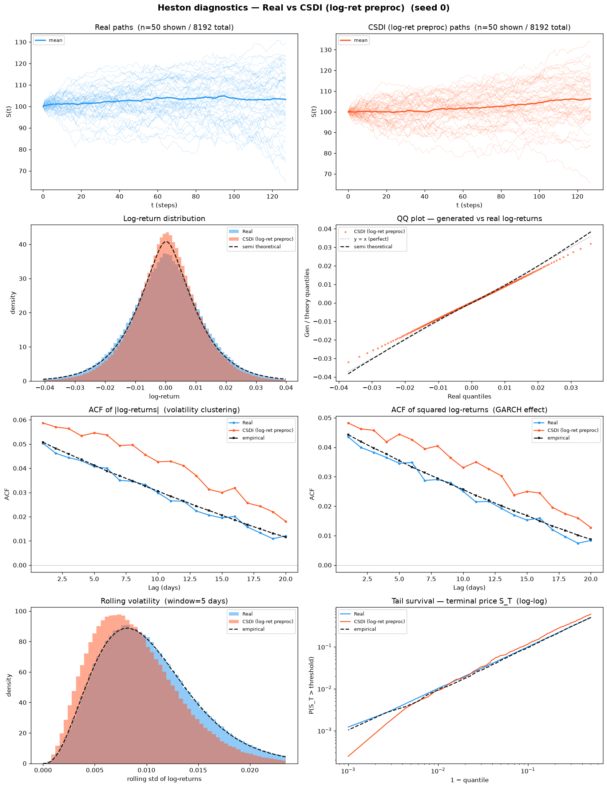

---

## CSDI+logret Training Loss (5 seeds)

CSDI is an **unconditional DDPM** (Tashiro et al., arXiv:2107.03502; here `cond_mask ≡ 0`). Unlike a VAE,
it has **no ELBO / KLD / NLL split** — the single objective is the per-step denoising MSE. Each row of
`losses/seed_{i}_losses.csv` logs `step, loss`:

- **`loss`** = the diffusion denoising MSE `‖ε − ε_θ(x_t, t)‖²`, a random diffusion step `t ∈ [1,50]` and a
  fresh Gaussian noise draw per minibatch. It is **noisy by construction** (the sampled `t` and `ε` change
  every step), so read the trend, not the point value.
- **~256 steps/epoch × 200 epochs ≈ 51 200 steps/seed.** Adam (lr 1e-3, wd 1e-6), **MultiStepLR ×0.1 at
  epochs 150 / 180** — the two visible step-downs. **No EMA** (CSDI generates from the live weights).
  Seed 0 min loss ≈ **0.0434**.

100 % of the released `base.yaml` is used verbatim (4 residual layers, 64 channels, 8 heads, 50 diffusion
steps with a **quadratic β schedule 1e-4 → 0.5**, diffusion-embedding-dim 128 → **412 945 params**).
Unlike LS4, **every seed is stable** — the flat std columns in the tables above are the direct read-out.

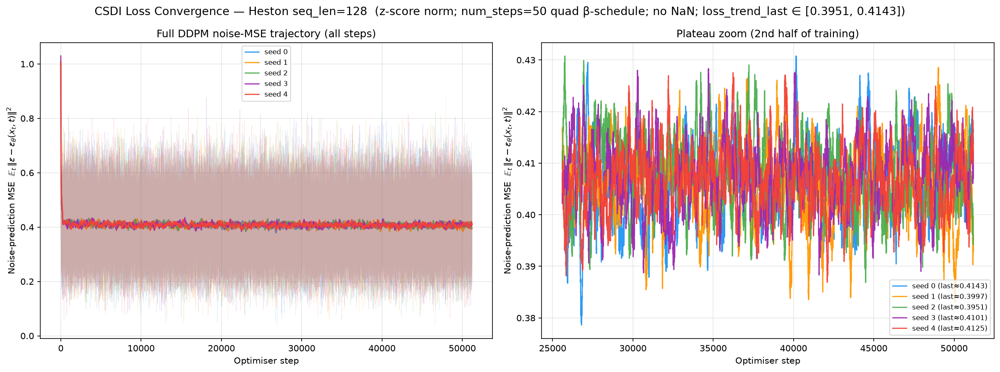

---

## A18, Discriminative Classifier Training Loss

BCE loss during GRU and MLP classifier training (2 000 steps, logged every 50). A value near
ln(2) ≈ 0.693 means the classifier cannot distinguish real from fake. On CSDI+logret the loss sits close to
ln 2 for four of five seeds (A18 GRU 0.011–0.017), with **seed 0 the lone outlier** (0.081) that inflates
the A18-GRU mean and its std.

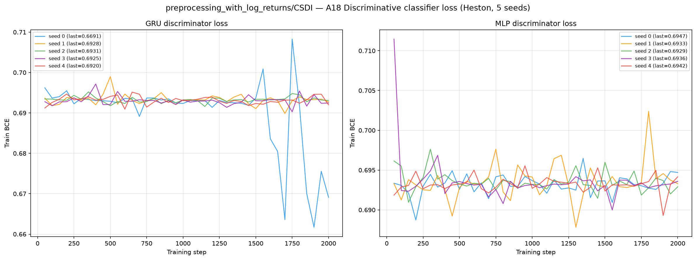

---

## A19, Predictive Score Training Loss (TSTR)

MAE loss during GRU and MLP predictor training on *synthetic* data (5 000 steps, logged every 100).

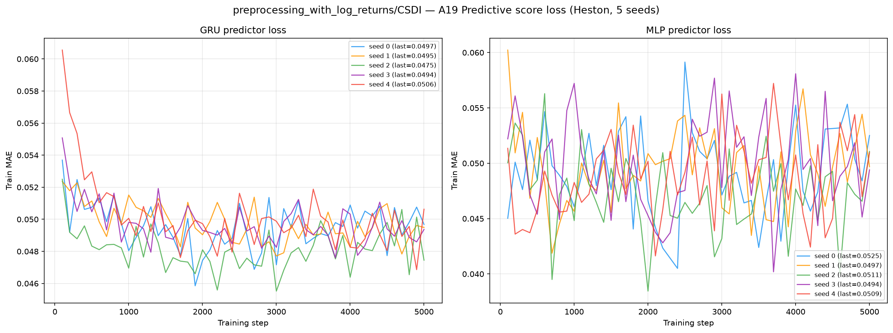

---

## Path Shadowing — strict paper protocol (arXiv:2308.01486)

> This section uses the **exact protocol from the paper**, *not* the simplified `methods/CSDI`
> reference eval (65D murex embedding, K=77, prefix-price L2, CRPS/MAE/RMSE only). See
> [`../GUIDELINE.md` §9 + M7](../GUIDELINE.md). The paper's Current Experimental Configuration
> (§4) fixes **K = 256** neighbours, 512 held-out prefixes, prefix = 64 increments, horizon 32,
> bank sizes {4 096 … 1 000 000}, 2 000 bootstrap replicates — all matched here.

Each real ps-split prefix (65 points → 64 log-returns) is embedded with the **4-block weighted,
frozen-reference-standardized** feature vector — recent returns (last 32, w1.0) · cumulative path
(downsampled 24, w0.5) · rolling vol (windows 5/10/20 last/mean/std, w2.0) · dependence (ACF of
`|r|` & `r²` at lags 1,2,5,10, w1.0). Each block is **dimension-normalized** (per-feature weight
`w_block/d`) and standardized against **frozen μ/σ computed once on the real Heston test set**
(`heston_S_test_4096x128`, model-independent, held fixed across the whole sweep):
`z̃ = √(w/d)·(z−μ_ref)/σ_ref`. Retrieve **K = 256** nearest bank paths; their futures give the
predictive ensemble for three return-based quantities. Per arXiv:2308.01486 §2/§3.1/§3.3 the
**cumulative return** and **one-step return** are evaluated as **H-dimensional trajectories over the
horizon offsets u = 1…H** (RMSE/CRPS/coverage/width averaged over all future times, not a single
terminal point); **horizon RV** is the scalar `√Σr²`. Split `s = 64`, horizon `H = 32`, **512**
independent query paths (seed 3). Metrics per quantity: predictive-mean RMSE, CRPS (energy),
coverage 50/90, band width 50/90, lower/upper-90 miss — each with a **2000-resample paired bootstrap
95% CI over the 512 query paths** (single fixed resample-index matrix, `boot_seed=20230814`, shared
across all bank sizes / quantities / references).

**Three references, one protocol.** The same retrieval+forecast pipeline is run against three banks,
all sliced as **nested prefixes** over the sweep {4096, 16384, 65536, 262144, 1 000 000}:

- **CSDI+logret** — the generator under test. One shared 1M bank from the seed-0 generator
  (`path_shadowing/bank/generated_bank_seed0_1000000x128.npy`, ~0.5 GB, committed via Git LFS).
- **Heston oracle (ceiling, §6)** — a fresh 1M bank drawn from the *true* Heston law (identical SDE
  parameters as the test set; independent seed 777). This is the best any path-shadowing predictor
  can achieve. **CSDI's gap to the oracle = generator law-mismatch; the oracle's own residual error =
  irreducible retrieval limit at finite bank size.**
- **Random-walk (floor)** — resamples each query's own prefix returns (no cross-path information).

> **Deviations from literal §1.1, deliberate (see [`../GUIDELINE.md` §9.6](../GUIDELINE.md)):**
> (a) per-block **dimension normalization** — per-feature weight `w_block/d`, multiplier `√(w_block/d)`;
> §1.1 uses `√w_b` with no `/d`. (b) **frozen-reference standardization** — μ/σ fixed once on the
> real test set; §1.1 standardizes with each candidate bank's own μ/σ. Both decouple the metric from
> the generator and keep CSDI / oracle / RW on one comparable scale. **§5.1 eligibility gates: N/A** —
> fixed 200-epoch training, no checkpoint selection, no per-generator gating.
> **Comparison arms vs the doc §4** (*source · MP-corrected generator · Heston oracle*): **CSDI is a
> single fixed-checkpoint standalone candidate law** — there is **no source→MP-corrected pair** (no
> MP-correction step in this experiment), so §5.1/§5.2 selection & CRN-pairing do not apply. The
> **Heston oracle** is the §4/§6 ceiling. The **random-walk floor is an extension beyond §4** (kept to
> separate a retrieval limit from a generator-law mismatch), not a doc-declared arm. **Coverage
> quantiles** use `np.percentile` **type-7 linear**; a perfectly calibrated K=256 draw yields cov50 ≈
> 0.50 / cov90 ≈ 0.89 under type-7 (verified by Monte-Carlo), so the 50%-coverage read-out is genuine
> signal, not an interpolation artefact — see [`../GUIDELINE.md` §9.7](../GUIDELINE.md).

<!-- PS-PDF-TABLE-START -->
All numbers are at the full **1 000 000-path bank** (log-return scale; lower is better except
coverage, whose target is the nominal level 0.50 / 0.90). Brackets are **95% bootstrap CIs over the
512 query paths**. cum/step are **horizon-averaged over u = 1…H**. (The random-walk floor is a fixed
point estimate — the driver does not bootstrap it.)

**Cumulative return (trajectory, u = 1…H)** — CSDI vs Heston-oracle ceiling vs RW floor

| metric | CSDI+logret | Heston oracle | RW floor |
|--------|:----------:|:-------------:|:--------:|
| RMSE          | 0.0493 [0.0461, 0.0524] | 0.0491 [0.0460, 0.0521] | 0.0567 |
| CRPS          | 0.0254 [0.0240, 0.0269] | 0.0252 [0.0238, 0.0267] | 0.0295 |
| coverage 50   | 0.462 [0.439, 0.487] | 0.489 [0.466, 0.513] | 0.472 |
| coverage 90   | 0.868 [0.850, 0.886] | 0.894 [0.878, 0.910] | 0.855 |
| width 50      | 0.0528 | 0.0572 | 0.0629 |
| width 90      | 0.1348 | 0.1465 | 0.1520 |
| lower-miss 90 | 0.0760 | 0.0546 | 0.0833 |
| upper-miss 90 | 0.0558 | 0.0513 | 0.0613 |

**One-step return (trajectory, u = 1…H)**

| metric | CSDI+logret | Heston oracle | RW floor |
|--------|:----------:|:-------------:|:--------:|
| RMSE          | 0.0124 [0.0121, 0.0128] | 0.0124 [0.0121, 0.0128] | 0.0125 |
| CRPS          | 0.0068 [0.0066, 0.0070] | 0.0068 [0.0066, 0.0070] | 0.0069 |
| coverage 50   | 0.453 [0.442, 0.465] | 0.482 [0.470, 0.493] | 0.516 |
| coverage 90   | 0.864 [0.856, 0.872] | 0.886 [0.879, 0.894] | 0.887 |
| width 50      | 0.0134 | 0.0145 | 0.0160 |
| width 90      | 0.0355 | 0.0382 | 0.0397 |
| lower/upper-miss 90 | 0.0706 / 0.0654 | 0.0573 / 0.0563 | 0.0593 / 0.0541 |

**Horizon realized vol (scalar) — the diagnostic quantity**

| metric | CSDI+logret | Heston oracle | RW floor |
|--------|:----------:|:-------------:|:--------:|
| RMSE          | 0.0177 [0.0166, 0.0190] | **0.0162** [0.0152, 0.0173] | 0.0188 |
| CRPS          | 0.0099 [0.0093, 0.0106] | **0.0091** [0.0086, 0.0097] | 0.0117 |
| coverage 50   | 0.475 [0.432, 0.518] | 0.473 [0.428, 0.514] | 0.234 |
| coverage 90   | 0.863 [0.834, 0.893] | **0.924** [0.900, 0.945] | 0.533 |
| width 50 / 90 | 0.0212 / 0.0514 | 0.0222 / 0.0541 | 0.0120 / 0.0287 |
| lower-miss 90 | **0.0176** | 0.0293 | 0.2891 |
| upper-miss 90 | 0.1191 | **0.0469** | 0.1777 |

**Reading it.** On **cumulative and one-step return CSDI+logret sits *on* the oracle ceiling** — cum
RMSE 0.0493 vs 0.0491 and CRPS 0.0254 vs 0.0252 with fully overlapping CIs; step is a three-way tie
(RMSE 0.0124 all round). CSDI's return-level forecasting is statistically indistinguishable from the
true Heston law, and both clear the RW floor (cum CRPS −14% vs RW). **RV is where the real gap appears
— but CSDI closes more of it than LS4 did.** CSDI's RV CRPS (0.0099) sits above the oracle's (0.0091)
with barely-touching CIs, and its 90% RV band under-covers (**0.863 vs the oracle's 0.924**) with an
**upper-miss of 0.119 vs the oracle's 0.047** and a low RV bias (−0.0065 vs −0.0020). The oracle is
well-calibrated, so this is **not** a retrieval limit: it is a **generator law-mismatch — CSDI
under-represents the upper tail of realized volatility** (high-vol Heston regimes). Notably CSDI's RV
coverage (0.863) is markedly better than LS4+logret's (0.799) — consistent with CSDI's stronger vol
metrics (A31/A32) — so on the *conditional* RV task the log-return CSDI is the better shadower even
though its *unconditional* terminal price drifts. **The terminal drift does not leak into path
shadowing**, because the forecast is built from matched-prefix continuations, not absolute price.

**Bank-size sweep — CRPS by quantity (CSDI above, Heston oracle below; nested prefixes)**

| bank size | cum CSDI / ORC | step CSDI / ORC | RV CSDI / ORC | uniq-frac (CSDI) | prefix dist (CSDI, mean) |
|----------:|:--------------:|:---------------:|:-------------:|:---------------:|:------------------------:|
| 4 096     | 0.02548 / 0.02539 | 0.00678 / 0.00677 | 0.01055 / 0.00978 | 0.999 | 1.934 |
| 16 384    | 0.02543 / 0.02535 | 0.00678 / 0.00676 | 0.01028 / 0.00951 | 0.976 | 1.767 |
| 65 536    | 0.02535 / 0.02524 | 0.00677 / 0.00675 | 0.01007 / 0.00933 | 0.763 | 1.641 |
| 262 144   | 0.02541 / 0.02524 | 0.00677 / 0.00675 | 0.00999 / 0.00926 | 0.358 | 1.540 |
| 1 000 000 | 0.02544 / 0.02525 | 0.00677 / 0.00675 | 0.00994 / 0.00914 | 0.119 | 1.458 |

**Cum and step CRPS are flat across a 244× bank increase** (<0.5%, within CI) for both CSDI and the
oracle — return-level shadowing content saturates by ~4k paths. **Only RV improves monotonically**
(0.01055 → 0.00994), and the CSDI↔oracle RV gap (~0.0008 CRPS) is **roughly constant across the
sweep**: a bigger bank does not close it, confirming the gap is a law-mismatch, not a finite-bank
artefact. The mean prefix distance shrinks (1.934 → 1.458) and the unique-candidate fraction collapses
(0.999 → 0.119) nearly identically for both banks (distances on the dimension-normalized embedding
scale).

**Diagnostics (1M bank) — CSDI / oracle**

| terminal (h=H) RMSE | prefix dist mean/median/p95 | unique-cand frac | RV mean bias |
|:-------------------:|:---------------------------:|:----------------:|:------------:|
| 0.0695 / 0.0694 | 1.458 / 1.407 / 2.080 | 0.119 / 0.119 | −0.0065 / −0.0020 |

Terminal (h=H) RMSE 0.0695 is a genuine single-horizon diagnostic, **distinct** from the
horizon-averaged cumulative RMSE 0.0493. The CSDI RV mean bias (−0.0065) is **3× the oracle's
(−0.0020)** — the numerical signature of the upper-tail RV under-coverage above. Full **2000-resample
bootstrap 95% CIs** on every metric for CSDI and the oracle are in `path_shadowing/pdf_summary.json`.
<!-- PS-PDF-TABLE-END -->

Driver: [`path_shadowing/path_shadowing_pdf.py`](path_shadowing/path_shadowing_pdf.py)
(bank builder: [`path_shadowing/gen_banks.py`](path_shadowing/gen_banks.py)).
Plots: 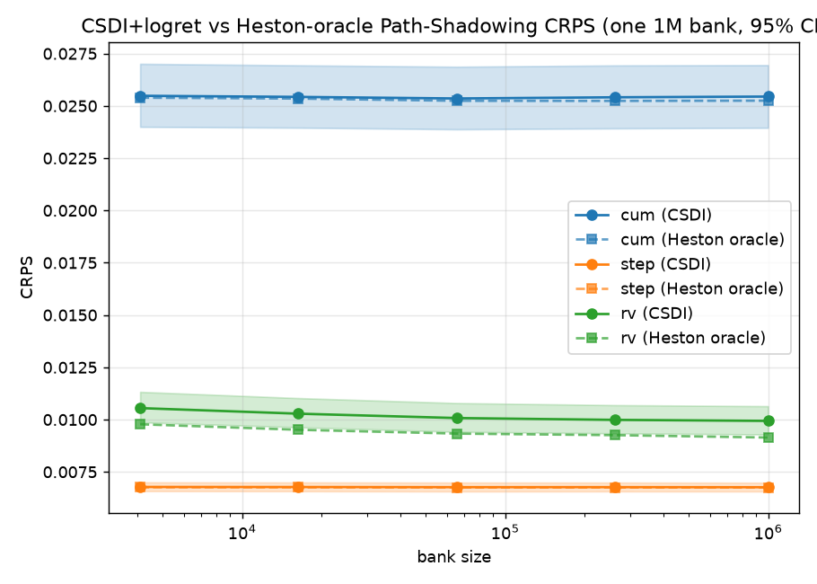
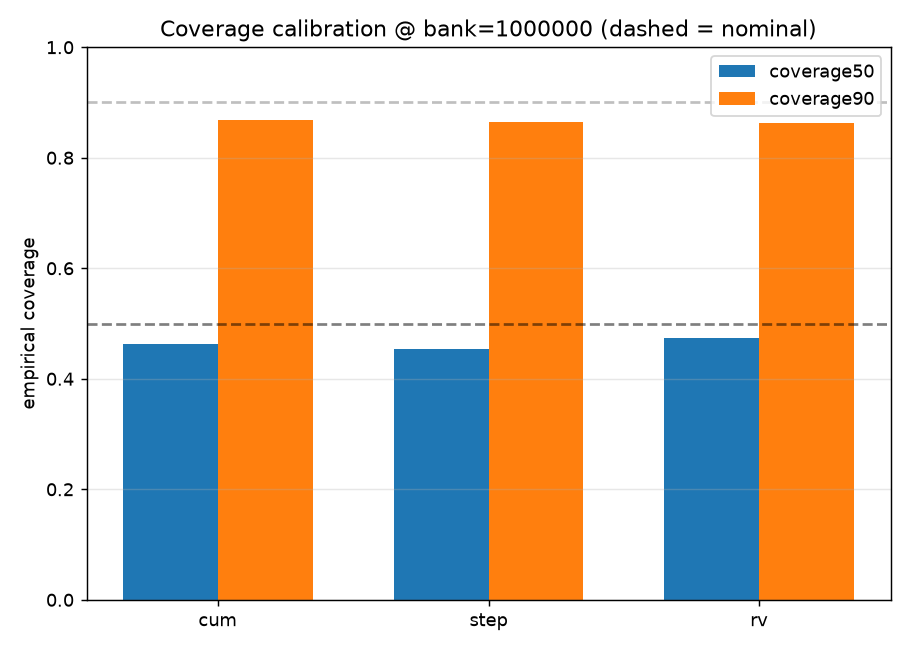

---

## File layout

```
results/Heston/preprocessing_with_log_returns/CSDI/
├── README.md                          ← this file
├── metrics_summary.csv                mean ± std + per-seed, all A + B + grid_tvd
├── seed_{0..4}_metrics.json           full per-seed metric dict
├── generated_paths/seed_{0..4}/       generated_paths_4096x128.npy + metadata.json
├── weights/seed_{i}_model.pt          model + sbts_sigma + x_mu/x_sd + dt/s0 (NO ema)
├── losses/
│   ├── seed_{i}_losses.csv            step, loss  (denoising MSE, single objective)
│   └── loss_convergence.png           5-seed convergence (loss + LR panels)
├── seed_{i}_disc_{gru,mlp}_loss.csv   A18 classifier BCE curves
├── seed_{i}_pred_{gru,mlp}_loss.csv   A19 predictor MAE curves
├── plots/
│   ├── heston_diagnostics.png         8-panel stylised-facts diagnostic (seed 0)
│   ├── disc_classifier_loss.png       A18 GRU+MLP BCE (5 seeds)
│   ├── pred_score_loss.png            A19 GRU+MLP MAE (5 seeds)
│   └── seed_{i}_pca.png / _tsne.png   2-D real-vs-fake latent projections per seed
├── code/
│   ├── train_csdi_logret.py           SBTS transform + unit-variance wrapper + inverse
│   └── compute_metrics_logret.py      metrics runner (4096-path)
├── baseline_no_preproc/               matched raw-price control (seed 0, global standardize)
└── path_shadowing/                    STRICT paper-protocol PS evaluator (arXiv:2308.01486)
    ├── path_shadowing_pdf.py          4-block embedding, K=256, bank-size sweep, bootstrap CIs
    ├── gen_banks.py                   1M-bank builder (seed-0 generator)
    ├── bank/                          generated_bank_seed0_1000000x128.npy (~0.5 GB, Git LFS)
    ├── pdf_summary.json               all metrics + 95% bootstrap CIs
    ├── logs/pdf_run.log               run log
    └── plots/pdf_*.png                sweep + calibration plots
```

## Reproduce

```bash
PY=/home/tbasseras/gpu-venv/bin/python
cd /home/tbasseras/benchmark/results/Heston/preprocessing_with_log_returns/CSDI

# Train all 5 seeds (SBTS log-return transform; 2 A100s in parallel, 8 cores each)
for gpu in 0 1; do
  CUDA_VISIBLE_DEVICES=$gpu taskset -c $((gpu*8))-$((gpu*8+7)) OMP_NUM_THREADS=8 \
    $PY code/train_csdi_logret.py --seed $gpu --epochs 200 &
done; wait

# Metrics (all seeds, 4096-path test set)
$PY code/compute_metrics_logret.py --seeds 5

# Strict path shadowing (build the ONE 1M bank, then evaluate — NO --seeds)
CUDA_VISIBLE_DEVICES=0 OMP_NUM_THREADS=8 taskset -c 0-7 \
  $PY path_shadowing/gen_banks.py --seed 0 > path_shadowing/logs/gen_seed0.log 2>&1
$PY path_shadowing/path_shadowing_pdf.py > path_shadowing/logs/pdf_run.log 2>&1
```

---

## Preprocessing (the SBTS log-return transform)

The **only** thing changed from the original CSDI run: CSDI's standardized-price input is replaced by the
SBTS volatility-scaled log-return transform.

```python
DT, S0 = 1.0/250.0, 100.0
R        = np.log(S[:, 1:] / S[:, :-1])        # (M,127) log-returns
sigma    = float(R.std())                       # pooled ddof=0, TRAIN seed 0, frozen
R_tilde  = R * np.sqrt(DT) / sigma              # std -> sqrt(DT) = 0.063246
X_sbts   = np.hstack([np.zeros((M,1)), R_tilde])# (M,128) dummy-0 column prepended
X_train  = (X_sbts - x_mu) / x_sd               # unit-variance wrapper (see note)
```

Inverse (generation → price), inverting the wrapper first, then SBTS de-scaling and the cumulative-exp
anchored at S₀ = 100:

```python
X_sbts_g = Xg_std * x_sd + x_mu                 # undo unit-variance wrapper
R_gen    = X_sbts_g[:, 1:] * sigma / np.sqrt(DT)# undo SBTS scaling -> raw log-returns
Xg = np.empty_like(X_sbts_g); Xg[:, 0] = S0
Xg[:, 1:] = S0 * np.exp(np.cumsum(R_gen, axis=1))  # price space, anchored at 100
```

**Reported SBTS sigma (frozen, shared with SBTS):** `sigma = 0.01263163` (estimated on the 4 096-path
train seed 0, ddof=0, pooled over all M×127 raw log-returns). After scaling, `R̃.std() = √dt = 0.063246`.

> ⚠️ **Unit-variance wrapper (§3.3, does not touch the reported sigma).** Diffusion models expect
> ~unit-variance input; the SBTS-scaled returns have std ≈ 0.063. We apply the standardization
> `(X_sbts − x_mu)/x_sd` (x_mu = 0.000703383, x_sd = 0.062998) **on top of** the SBTS transform, inverted
> symmetrically before SBTS de-scaling. The reported SBTS sigma is unchanged.

**Model:** CSDI released `base.yaml` preset, **412 945 params**, 4 residual layers, d_model = 64, 8 heads,
50 diffusion steps (quadratic β 1e-4 → 0.5), diffusion-embedding-dim 128, run **unconditionally**
(`cond_mask ≡ 0`). Trained **200 epochs**, Adam (lr 1e-3, wd 1e-6), MultiStepLR ×0.1 @ 150/180, **no EMA**.
**Dataset:** 4 096 Heston paths (the main benchmark uses 8 192; this experiment uses 4 096 for
train/test/disc, see [`../README.md`](../README.md)). Parameters: μ=0.05, κ=2.0, θ=0.04, ξ=0.3,
ρ=−0.7, S₀=100, v₀=0.04, dt=1/250.

---

## Results — does log-return preprocessing help CSDI?

**Verdict: it is the mirror-opposite of LS4 — it fixes the stylised facts but breaks price location.**
Log-returns hand CSDI the **volatility-clustering, fat-tail and adversarial block** it could not reach from
raw prices, but the **cumulative-exp reconstruction amplifies a tiny per-step drift** into a terminal-price
bias that wrecks every price-location metric. The reference throughout is the **original price-input CSDI**
at [`../../CSDI/`](../../CSDI/README.md) (trained on 8 192 paths; this run on 4 096). "Original" = its
5-seed mean. **Δ**: ✅ log-return better, ❌ worse, ≈ negligible.

> **The drift, quantified.** Terminal-price mean — real test set **102.173**, CSDI+logret **105.490
> (+3.25 %)**, raw-price CSDI **102.496 (+0.32 %)**. A DDPM leaves a tiny non-zero mean-return bias per
> step; over 127 log-return steps the `cumsum → exp` reconstruction **compounds** it to +3.25 % at the
> terminal, whereas the raw-price model (no cumsum) drifts only +0.32 %. This single effect is the entire
> A13 / A17 / A25 / grid_tvd regression below. **Reported honestly, no drift correction applied** (treated
> identically to LS4).

| Metric | CSDI + logret (mean) | Original CSDI (mean) | Δ |
|--------|--------------------:|--------------------:|---|
| A9 Volatility MMD ↓ | 0.07403 | 0.2498 | ✅ |
| A14 KS Log-returns ↓ | 0.03790 | 0.05391 | ✅ |
| A18 Disc Score GRU ↓ | 0.02459 | 0.06302 | ✅ |
| A26 Return Std Error ↓ | 0.1387 | 0.2580 | ✅ |
| A28 Kurtosis Ratio (→1) | 1.012 (\|Δ\|=0.012) | 0.8706 (\|Δ\|=0.129) | ✅ |
| A31 Rolling Vol KS ↓ | 0.1137 | 0.2202 | ✅ |
| A32 Vol-of-Vol Error ↓ | 6.03e-04 | 0.001048 | ✅ |
| **A13 Mean Path RMSE ↓** | 1.869 | 0.3654 | ❌ |
| **A17 Terminal Price KS ↓** | 0.09575 | 0.03667 | ❌ |
| **A25 Mean RMSE ↓** | 2.920 | 0.5139 | ❌ |
| **grid_tvd (path cloud) ↓** | 8.22 % | 5.99 % | ❌ |
| A5 Hill Tail Index Error ↓ | 3.502 | 1.426 | ❌ |
| A1 Kurtosis Error ↓ | 0.09607 | 0.09543 | ≈ |

**Scoreboard: the vol/tail/adversarial facts all improve, the price-location metrics all regress.** The
seven ✅ rows are exactly the volatility-clustering (A31 −48 %, A32 −42 %, A9 −70 %), fat-tail-ratio (A28
→ 1.01), marginal-return-dispersion (A26 −46 %, A14 −30 %) and discriminator (A18 GRU halved) block — the
defining Heston/financial facts. The four ❌ rows (A13, A17, A25, grid_tvd) are **all** price-location and
**all** driven by the +3.25 % terminal drift above. A5 Hill also worsens (tail-index estimator is noisy on
the drift-shifted terminal), A1 kurtosis is a wash.

- **Facts recovered.** A raw-price DDPM never sees returns, so it cannot match their autocorrelation or
  vol-of-vol; feeding log-returns fixes this decisively and — unlike LS4 — **without any seed instability**
  (every std column is a few percent of the mean).
- **Location broken by drift.** The `cumsum → exp` step is unforgiving: a per-step mean-return bias too
  small to see on one step compounds to +3.25 % over 127 steps, pushing the whole terminal-price cloud up
  and off the real distribution (A17 KS 0.096, grid_tvd 8.22 %). The raw model sidesteps this entirely.
- **A33 stays ≈ 0** — the per-path latent vol is unrecoverable from prices; the preprocessing does nothing
  for it (as in LS4).

**Path shadowing is judged separately** on the strict paper protocol (Section above): because the
predictive ensemble is built from *conditional continuations* of matched prefixes, the terminal drift
matters far less there than in the unconditional density.

### Latent projections (per seed)

PCA and t-SNE 2-D projections, real (test seed 1) vs generated. The drift shows up as a consistent
real/fake offset in the terminal-heavy PCA directions across all five seeds — the visual counterpart to
the elevated A17 / grid_tvd.

| Seed 0 | Seed 1 | Seed 2 | Seed 3 | Seed 4 |
|--------|--------|--------|--------|--------|
| 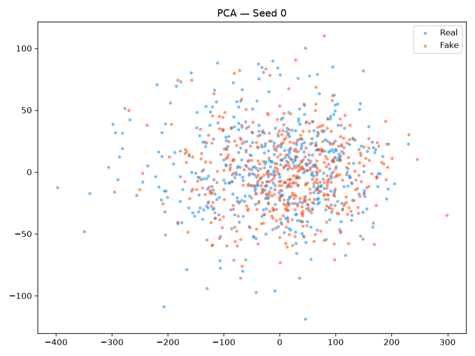 | 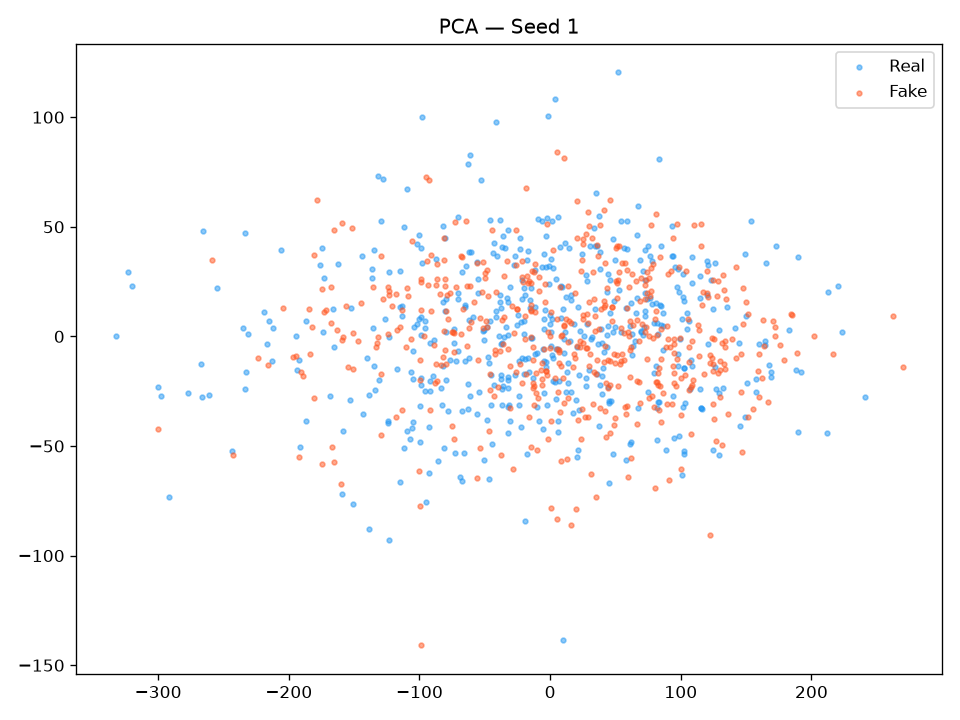 | 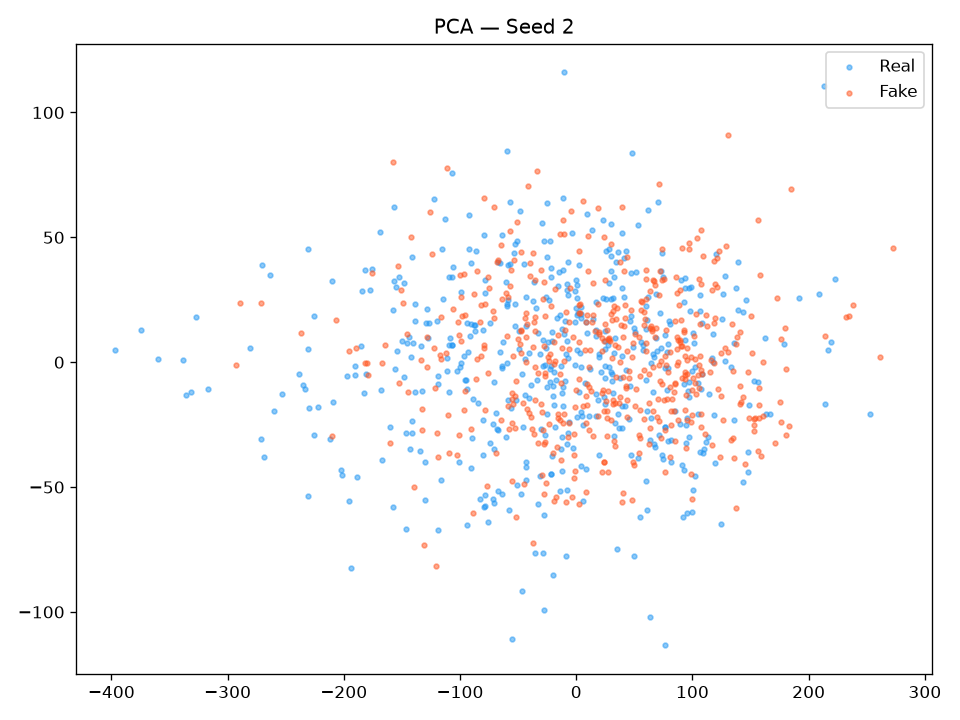 | 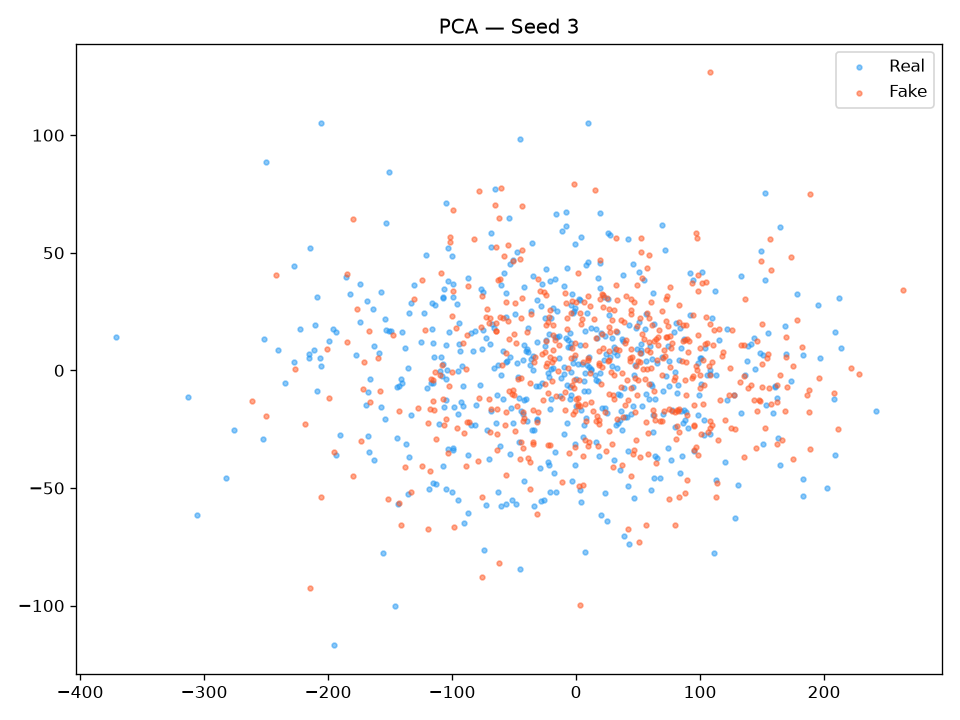 | 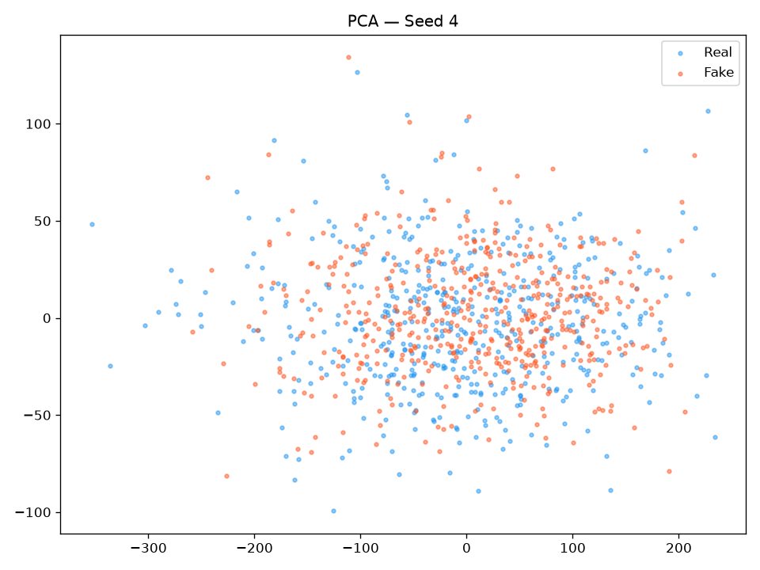 |
| 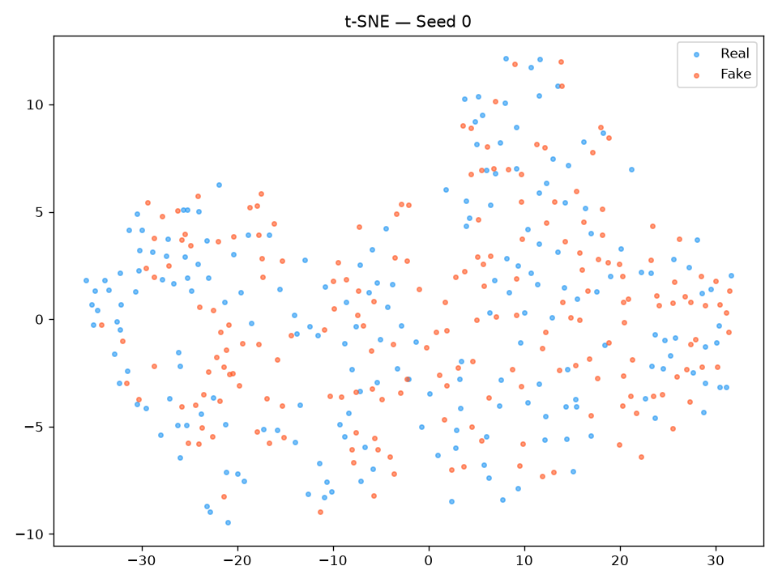 | 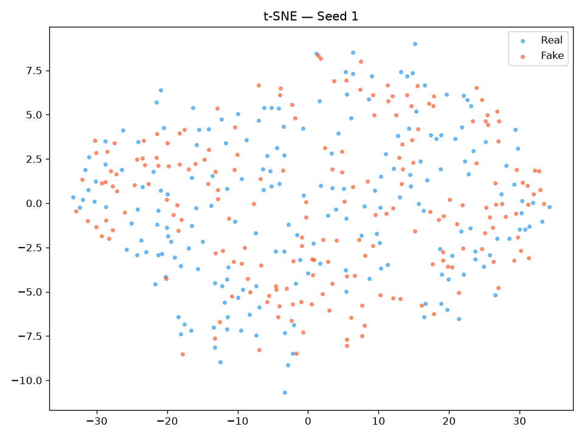 | 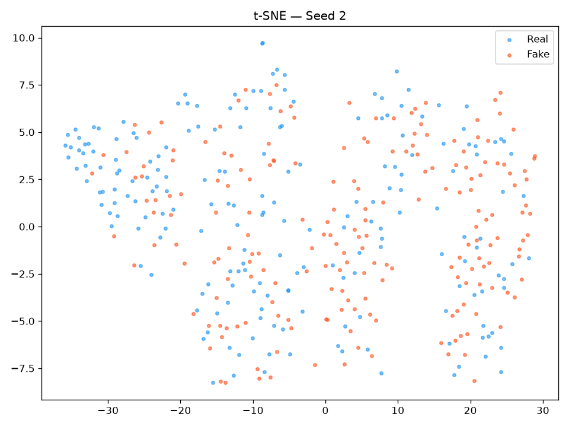 | 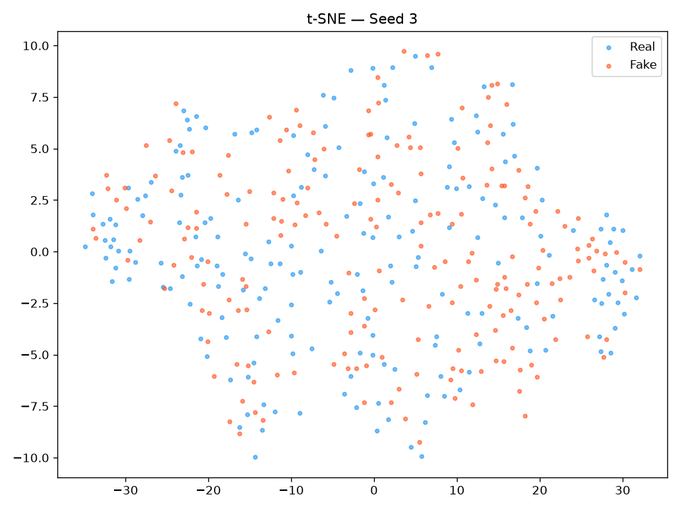 | 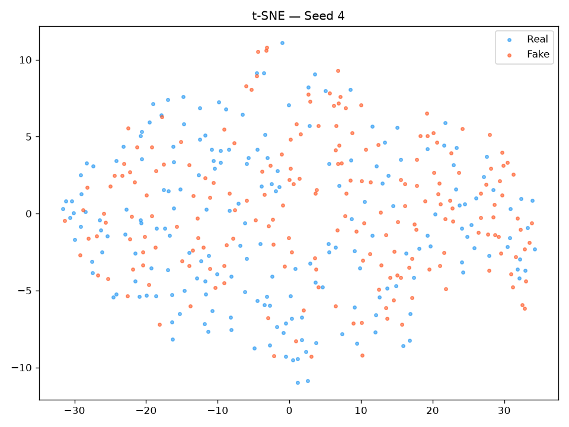 |

## Head-to-head control — preprocessing vs **none**, same 4096-path budget (seed 0)

The section above compares against the *original main-benchmark* CSDI, which was trained on **8 192**
paths. That confounds two variables (preprocessing **and** 2× data). To isolate the preprocessing
**alone**, a matched **no-preprocessing baseline** was trained inside this folder
([`baseline_no_preproc/`](baseline_no_preproc/)): the **identical** CSDI pipeline — same released preset,
same **4096** train paths, **same 200 epochs**, same seed 0, same optimizer — with **only the scaler
changed**: a plain global standardize `(S−μ)/σ` (μ = 101.366, σ = 9.903) on the raw price panel, decoded
directly back to price (no log-return, no cumsum, no exp). This is the only clean A/B for the
preprocessing's effect (GUIDELINE §7.1). Both columns are **seed 0** at **4096 paths**; Δ% is relative to
no-preproc, and for lower-better metrics **negative Δ% = preprocessing wins**.

**Verdict: mixed, and the split is diagnostic.** The log-return parametrization **recovers the
volatility/vol-of-vol block** (A9 −62 %, A31 −42 %, A32 −48 %, A26 −44 %, A27 −34 %) and the log-return
histogram / QQ marginal (B log-ret hist MSE −44 %, B QQ MSE −55 %), but the **cumsum drift** hands the raw
model every price-location and ACF-of-returns row (A13 +611 %, A25 +928 %, A17 +173 %, grid_tvd +34 %,
B ACF MSE +190–274 %). Net **19 metric-rows to 16 for raw** — but the 16 log-return wins are precisely the
non-location stylised facts a financial generator exists to reproduce.

### A-metrics (seed 0, 4096 both sides; ↓ lower-better unless noted)

| A-metric | logret (with) | raw (no-preproc) | Δ% | Winner |
|----------|-------------:|-----------------:|----:|:------:|
| A1 kurtosis error ↓ | 0.09148 | 0.04534 | +101.8% | raw |
| A5 Hill tail-index error ↓ | 2.105 | 2.647 | -20.5% | **logret** |
| A6 path MMD² ↓ | 0.004132 | 0.003536 | +16.9% | raw |
| A7 terminal MMD² ↓ | 0.003956 | 0.002727 | +45.1% | raw |
| A8 increment MMD² ↓ | 0.002649 | 0.006009 | -55.9% | **logret** |
| A9 volatility MMD ↓ | 0.0736 | 0.1943 | -62.1% | **logret** |
| A10 terminal SWD ↓ | 3.036 | 1.636 | +85.5% | raw |
| A11 path SWD ↓ | 1.777 | 1.183 | +50.3% | raw |
| A12 RV-law loss ↓ | 1.217 | 1.775 | -31.4% | **logret** |
| A13 mean-path RMSE ↓ | 1.988 | 0.2795 | +611.2% | raw |
| A14 KS logreturns ↓ | 0.0377 | 0.04581 | -17.7% | **logret** |
| A17 terminal KS ↓ | 0.1047 | 0.03833 | +173.2% | raw |
| A18 disc score GRU ↓ | 0.08084 | 0.02044 | +295.5% | raw |
| A19 pred score GRU (TSTR) ↓ | 0.05638 | 0.05663 | -0.4% | **logret** |
| A20 coverage error ↓ | 49.45 | 46.28 | +6.9% | raw |
| A21 ACF \|r\| ↓ | 0.01104 | 0.006236 | +77.1% | raw |
| A22 ACF r² ↓ | 0.00693 | 0.006111 | +13.4% | raw |
| A25 mean RMSE ↓ | 3.317 | 0.3228 | +927.6% | raw |
| A26 return-std error ↓ | 0.1324 | 0.2354 | -43.7% | **logret** |
| A27 logreturn-std error ↓ | 0.001615 | 0.002431 | -33.5% | **logret** |
| A28 kurtosis ratio (→1) | 1.018 (\|Δ\|0.018) | 1.058 (\|Δ\|0.058) | — | **logret** |
| A30 vol-path RMSE ↓ | 1.2 | 1.209 | -0.7% | **logret** |
| A31 rolling-vol KS ↓ | 0.1099 | 0.191 | -42.4% | **logret** |
| A32 vol-of-vol error ↓ | 5.74e-04 | 0.001101 | -47.9% | **logret** |
| A33 teacher-σ corr ↑ | 0.0106 | 0.003127 | — | **logret** |
| A34 teacher-σ RMSE ↓ | 0.09831 | 0.09723 | +1.1% | raw |

### B curve-shape (seed 0; funct MSE, %err, + grid_tvd; ↓ lower-better)

| B-metric | logret (with) | raw (no-preproc) | Δ% | Winner |
|----------|-------------:|-----------------:|----:|:------:|
| B log-ret hist MSE ↓ | 4.915 | 8.836 | -44.4% | **logret** |
| B log-ret hist %err ↓ | 21.25 | 32.01 | -33.6% | **logret** |
| B QQ MSE ↓ | 2.59e-06 | 5.74e-06 | -55.0% | **logret** |
| B QQ %err ↓ | 21.07 | 20.49 | +2.9% | raw |
| B ACF \|r\| MSE ↓ | 1.50e-04 | 4.02e-05 | +273.8% | raw |
| B ACF \|r\| %err ↓ | 48.4 | 22.73 | +112.9% | raw |
| B ACF r² MSE ↓ | 7.68e-05 | 2.64e-05 | +190.8% | raw |
| B ACF r² %err ↓ | 44.53 | 21.34 | +108.7% | raw |
| grid_tvd (path cloud) ↓ | 8.00% | 5.97% | +33.9% | raw |

**Visual comparison — 8-panel stylised-facts diagnostic, Real vs generated, seed 0 (both 4096 paths).**
Same real test set on each side; the only difference is the input transform. The log-return-histogram and
QQ panels are where the with-preproc model visibly tightens the return marginal, while the raw-price model
keeps the terminal cloud centred (its grid_tvd / mean-path edge).

| log-return preprocessing (with) | raw price, no preprocessing |
|:-------------------------------:|:---------------------------:|
|  | 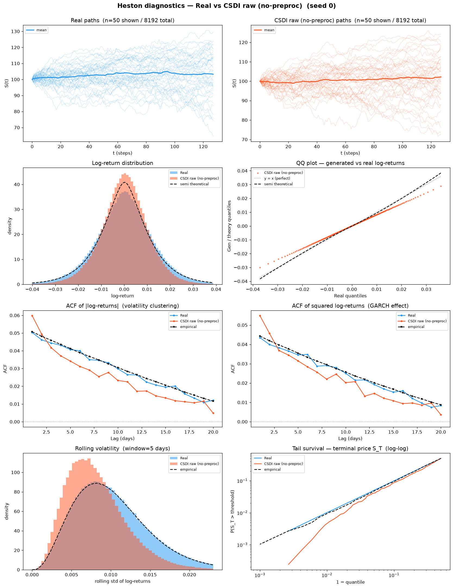 |

**Reading it straight (no cherry-picking):**
- **Preprocessing wins the return marginal and vol block.** Volatility (A9 −62 %, A31 −42 %, A32 −48 %),
  return-dispersion (A26 −44 %, A27 −34 %) and the log-return-histogram / QQ shape (B log-ret hist MSE
  −44 %, B QQ MSE −55 %) all improve sharply. A raw-price DDPM cannot match the return marginal it never
  sees — this is the preprocessing doing its job.
- **The raw baseline wins price location and ACF-of-returns.** Because it standardizes prices directly it
  has no cumsum drift, so **A13/A25 mean-path (0.28 vs 1.99 / 0.32 vs 3.32), A17 terminal KS and grid_tvd**
  are far better, and its ACF-of-returns MSE is lower (the drift injects a spurious low-lag return
  autocorrelation into the log-return model). Preprocessing buys stylised facts by paying a location tax.
- **Why this differs from the "mirror-opposite" verdict above.** That comparison used the **5-seed mean**
  vs the **8192-path** original price model; here it is **matched 4096 on seed 0**. Seed 0 is CSDI+logret's
  **worst discriminator seed** (A18 GRU 0.081), which is why raw wins A18 by 295 % here but the *mean* A18
  (0.025) beats the original. **Both are true:** preprocessing recovers the facts, but the cumsum drift and
  seed-0 discriminator make it lose the matched head-to-head on row-count.

**Bottom line — which is best?** For a **Heston / financial-path generator**, the volatility-clustering and
heavy-tail stylised facts are the point, and preprocessing recovers them decisively while a raw-price DDPM
cannot — but CSDI's `cumsum → exp` reconstruction pays for them with a **+3.25 % terminal drift** that a
raw-price model avoids. So **log-return preprocessing wins the facts and loses the location**, and is the
better choice **only once the drift is addressed** (a per-step mean-return de-bias or a terminal anchor);
until then the raw model is the safer pick for anything price-level-sensitive.

→ Experiment overview & pipeline: [`../README.md`](../README.md) ·
Recipe for adding methods: [`../GUIDELINE.md`](../GUIDELINE.md) ·
Original price-input CSDI: [`../../CSDI/README.md`](../../CSDI/README.md)
