# LS4 on Heston — SBTS log-return preprocessing

The **official LS4** (Zhou et al., ICML 2023, arXiv:2212.12749) trained on **4 096** Heston
stochastic-volatility price paths (seq_len = 128), but fed the **SBTS volatility-scaled log-return
transform** in place of LS4's native standardized-price input. Everything else — SDE, parameters, RNG
streams, metric code, seeds 0–4 — is held fixed against the original price-input run at
[`../../LS4/`](../../LS4/README.md). Preprocessing details and the head-to-head verdict are **below the
metrics** ([jump](#preprocessing-the-sbts-log-return-transform)); this top block mirrors the canonical
per-method report so the two runs are directly comparable.

> **Data split (test set everywhere).** Disjoint 4 096-path Heston draws: generator **trained on seed
> 0**; every A/B metric compares generated paths against the **test set (seed 1)**; A18 uses a **third
> real set (seed 2)** as the "real" class. No metric is scored against training data.

---

## Metrics A1-A34 + B, mean ± std across 5 seeds

> All metrics on **log-returns** $r_t = \log(S_{t+1}/S_t)$ unless noted. A26 uses price increments $\Delta S_t$.

| Metric | Mean ± Std | Seed 0 | Seed 1 | Seed 2 | Seed 3 | Seed 4 | Perfect floor |
|--------|-----------|--------|--------|--------|--------|--------|---------------|
| **Fat Tail** | | | | | | | |
| A1 Kurtosis Error ↓ | 0.6156 ± 0.4445 | 0.2192 | 0.5398 | 0.2266 | 0.6571 | 1.435 | 0.05717 |
| A2 \|r\| q95 Error ↓ | 0.001418 ± 6.20e-04 | 0.002037 | 8.35e-04 | 5.11e-04 | 0.001841 | 0.001864 | 1.49e-04 |
| A3 \|r\| q99 Error ↓ | 6.94e-04 ± 9.66e-04 | 0.002545 | 3.36e-05 | 6.16e-05 | 7.68e-04 | 6.30e-05 | 2.40e-04 |
| A4 Tail QQ Error ↓ | 0.001612 ± 3.41e-04 | 0.001961 | 0.001671 | 9.60e-04 | 0.001706 | 0.001759 | 1.54e-04 |
| A5 Hill Tail Index Error ↓ | 4.257 ± 3.274 | 1.459 | 10.37 | 1.485 | 4.532 | 3.445 | 1.280 |
| **Distribution** | | | | | | | |
| A6 Path MMD² ↓ | 0.004843 ± 0.005499 | 0.001755 | 0.01581 | 0.001631 | 0.002272 | 0.002742 | 0.001785 |
| A7 Terminal MMD² ↓ | 0.009408 ± 0.01435 | 0.002002 | 0.03811 | 0.001815 | 0.002528 | 0.002586 | 0.001252 |
| A8 Increment MMD² ↓ | 0.00131 ± 3.61e-04 | 0.001267 | 0.001079 | 9.04e-04 | 0.001334 | 0.001967 | 8.35e-04 |
| A9 Volatility MMD ↓ | 0.03631 ± 0.01918 | 0.02954 | 0.0634 | 0.01195 | 0.0232 | 0.05346 | 0.007665 |
| A10 Terminal SWD ↓ | 2.197 ± 1.712 | 1.168 | 5.612 | 1.347 | 1.535 | 1.322 | 0.7849 |
| A11 Path SWD ↓ | 1.076 ± 0.8519 | 0.6499 | 2.778 | 0.5754 | 0.6659 | 0.7113 | 0.5453 |
| A12 RV Law Loss ↓ | 0.5482 ± 0.2282 | 0.7275 | 0.3899 | 0.1829 | 0.6471 | 0.7933 | 0.07645 |
| A13 Mean Path RMSE ↓ | 0.7794 ± 0.8059 | 0.2399 | 2.35 | 0.6313 | 0.1397 | 0.5365 | 0.1839 |
| A14 KS Log-returns ↓ | 0.0194 ± 0.01036 | 0.01586 | 0.01369 | 0.007472 | 0.02209 | 0.03789 | 0.002173 |
| A15 Skewness Error ↓ | 0.1688 ± 0.102 | 0.14 | 0.3347 | 0.2171 | 0.1219 | 0.03027 | 0.01206 |
| A16 QQ RMSE (300-pt) ↓ | 8.77e-04 ± 2.96e-04 | 8.96e-04 | 7.56e-04 | 4.34e-04 | 9.50e-04 | 0.001348 | 8.18e-05 |
| A17 Terminal Price KS ↓ | 0.07261 ± 0.07271 | 0.02515 | 0.2173 | 0.0376 | 0.03491 | 0.0481 | 0.02139 |
| **Adversarial** | | | | | | | |
| A18 Disc Score GRU ↓ | 0.007748 ± 0.006227 | 0.01373 | 9.15e-04 | 0.01617 | 0.001525 | 0.006406 | 0.007138 |
| A18 Disc Score MLP ↓ | 0.007138 ± 0.003524 | 0.006406 | 0.01373 | 0.003356 | 0.005186 | 0.007016 | 0.006284 |
| **Predictive** | | | | | | | |
| A19 Pred Score GRU ↓ | 0.05641 ± 5.10e-05 | 0.05638 | 0.05651 | 0.05642 | 0.05638 | 0.05638 | 0.05638 |
| A19 Pred Score MLP ↓ | 0.05643 ± 1.31e-04 | 0.05659 | 0.05635 | 0.05658 | 0.05638 | 0.05625 | 0.05668 |
| **Temporal** | | | | | | | |
| A20 Covariance Error ↓ | 56.78 ± 42.52 | 25.81 | 139.8 | 27.98 | 52.12 | 38.25 | 5.825 |
| A21 ACF \|r\| Error (lags) ↓ | 0.0149 ± 0.004887 | 0.008474 | 0.02012 | 0.01566 | 0.01012 | 0.02014 | 0.001318 |
| A22 ACF r² Error (lags) ↓ | 0.0112 ± 0.003591 | 0.007978 | 0.01755 | 0.01278 | 0.008605 | 0.009067 | 0.001394 |
| A23 ACF \|r\| Lag-1 Error ↓ | 0.02867 ± 0.009143 | 0.01797 | 0.04129 | 0.03738 | 0.02581 | 0.02091 | 9.01e-04 |
| A24 ACF r² Lag-1 Error ↓ | 0.023 ± 0.01036 | 0.01563 | 0.03602 | 0.03293 | 0.02201 | 0.008398 | 0.001377 |
| **Vol** | | | | | | | |
| A25 Mean RMSE ↓ | 1.38 ± 1.36 | 0.4485 | 4.024 | 1.027 | 0.2823 | 1.12 | 0.3668 |
| A26 Return Std Error ↓ | 0.05371 ± 0.03238 | 0.07036 | 0.02918 | 0.003867 | 0.07229 | 0.09287 | 0.005319 |
| A27 Log-Return Std Error ↓ | 6.19e-04 ± 3.66e-04 | 8.83e-04 | 2.47e-04 | 1.16e-04 | 8.24e-04 | 0.001025 | 7.03e-05 |
| A28 Kurtosis Ratio (→ 1) | 0.7334 ± 0.2007 | 0.9922 | 0.7774 | 0.8628 | 0.6231 | 0.4114 | 1.072 |
| A29 Sigma Mean Error ↓ | 0.008282 ± 0.006064 | 0.0116 | 0.001448 | 7.91e-04 | 0.01162 | 0.01596 | 0.001022 |
| A30 Cross-Sect. Vol Path RMSE ↓ | 1.32 ± 1.181 | 0.5304 | 3.659 | 0.6354 | 1.031 | 0.745 | 0.1684 |
| A31 Rolling Vol KS (w=5) ↓ | 0.05316 ± 0.03392 | 0.05572 | 0.02083 | 0.01356 | 0.06882 | 0.1069 | 0.004939 |
| A32 Vol-of-Vol Error ↓ | 2.53e-04 ± 1.68e-04 | 5.47e-04 | 2.22e-04 | 1.54e-04 | 2.92e-04 | 4.77e-05 | 4.26e-05 |
| **Heston Spec** | | | | | | | |
| A33 Teacher-Sigma Corr ↑ | 0.003268 ± 0.008388 | 0.01184 | -0.00879 | 0.003954 | -0.003349 | 0.01268 | 0.6156 |
| A34 Teacher-Sigma RMSE ↓ | 0.09953 ± 0.003354 | 0.09548 | 0.09821 | 0.0987 | 0.09963 | 0.1056 | 0.06560 |

> **Convention:** ↓ lower is better; ↑ higher is better; no arrow = no monotone direction. A28 Kurtosis Ratio: perfect = 1.0.
> **A1**: |kurt_real − kurt_gen| on log-returns. **A2-A3**: 95th/99th quantile error on |log-returns|. **A4**: QQ error restricted to top-5% tail quantiles. **A5**: |Hill tail index_real − Hill tail index_gen|, Hill estimator on |log-returns| above 95th pct.
> **A6-A11**: path-kernel distances, Gaussian MMD² on full paths / terminal prices / increments / realized-vol, and sliced-Wasserstein on terminal & full paths. Non-zero perfect floor (an independent Heston draw scored against the test set, finite-sample noise).
> **A12**: W₁(RV_real, RV_gen), RV_i = Σ_t r²_{i,t}/dt. **A13**: path-level RMSE between real/gen mean trajectories. **A14**: KS statistic on pooled log-returns. **A15**: |skew_real − skew_gen|, Heston true skew ≈ −0.45. **A16**: QQ RMSE over 300 uniform quantile levels. **A17**: KS statistic on terminal prices S_T.
> **A18**: Discriminative classifier trained on log-returns; score = |accuracy − 0.5|, 0 = indistinguishable, 0.5 = perfectly separable (GRU + MLP). **A19**: TSTR predictive MAE (GRU + MLP).
> **A20**: covariance-matrix error (%). **A21-A22**: ACF error on |r| and r² across lags 1-20. **A23-A24**: ACF lag-1 error on |r| and r². Heston true values ≈ +0.052 / +0.050.
> **A25**: mean-path RMSE. **A26**: return std error, uses price increments $\Delta S_t$. **A27**: log-return std error. **A28**: kurtosis ratio real/gen, perfect = 1.0. **A29**: sigma mean error, annualized per-path vol. **A30**: cross-sectional vol-path RMSE. **A31**: KS statistic on rolling-5 vol histograms. **A32**: |vol-of-vol_real − vol-of-vol_gen|.
> **A33**: Teacher-sigma correlation (Heston-recovered vol vs teacher σ), higher is better, perfect ≈ 0.614. **A34**: Teacher-sigma RMSE, perfect ≈ 0.065.

---

## B, Curve-Shape Metrics, mean ± std across 5 seeds

Each stylised-fact plot yields a **curve** L (a list of values), not a scalar. For real data (L_r) and
generated data (L_g) we build three lists, the curve L, its first finite difference L' (der), and its
second finite difference L'' (sec_der), then combine them into **one number per plot**:

- **MSE row**: for each list, dᵢ = mean((L_r − L_g)²). Reported mean = the **mean of the three sub-scores** (funct + der + sec_der)/3; std = sample std of that per-seed combined score across the 5 seeds. The **MSE row decides the cross-method winner**.
- **% err row**: dᵢ = mean(|L_g − L_r| / (|L_r| + 1e-6)) × 100, a proper MAPE on the curve L itself (funct-only); the der / sec_der MAPE is excluded because their near-zero true values explode the relative error.
- **NRMSE row**: sqrt(mean((L_g − L_r)²)) / (max|L_r| − min|L_r| + 1e-12) × 100 on the curve L only (funct-only). This is the range-normalized RMSE.
- **CVaR₉₀ / CVaR₉₅ rows**: tail-averaged pointwise curve error (Expected Shortfall) on the curve L only (funct-only). Pointwise error eₜ = |L_g(t) − L_r(t)|; for q ∈ {0.90, 0.95}, CVaR_q = mean(eₜ for eₜ ≥ the q-th percentile of eₜ), then range-normalized like NRMSE.

All ↓ lower is better. The perfect floor is **non-zero** for all six plots, it is the residual
finite-sample error of an independent Heston draw scored against the test set, identical across methods.
Five sublines per plot: **MSE**, **% error**, **NRMSE**, **CVaR₉₀** and **CVaR₉₅**.

| Plot | Measure | Mean ± Std | Seed 0 | Seed 1 | Seed 2 | Seed 3 | Seed 4 | Perfect floor |
|------|---------|-----------|--------|--------|--------|--------|--------|---------------|
| **Path comparison** *(50×50 path-cloud)* | grid_tvd 50×50 (%) ↓ | 6.989% ± 5.606% | 3.664% | 18.18% | 3.989% | 4.787% | 4.328% | — |
| **Log-return histogram** | MSE | 0.9677 ± 1.049 | 0.5147 | 0.3931 | 0.2125 | 0.9355 | 2.782 | 0.2350 |
|  | % err | 12.42% ± 4.928% | 12.97% | 8.627% | 5.686% | 15.04% | 19.8% | 2.617% |
|  | NRMSE | 3.519% ± 2.171% | 2.572% | 2.113% | 1.491% | 3.838% | 7.58% | 0.7244% |
|  | CVaR₉₀ | 8.265% ± 5.53% | 5.697% | 5.074% | 3.501% | 8.137% | 18.92% | 1.634% |
|  | CVaR₉₅ | 9.272% ± 5.96% | 6.819% | 5.706% | 4.064% | 9.027% | 20.75% | 1.878% |
| **QQ plot** | MSE | 3.18e-07 ± 1.91e-07 | 2.93e-07 | 2.66e-07 | 9.40e-08 | 3.14e-07 | 6.23e-07 | 2.92e-09 |
|  | % err | 11.35% ± 4.491% | 9.855% | 5.665% | 8.569% | 14.24% | 18.43% | 1.243% |
|  | NRMSE | 2.444% ± 0.7371% | 2.495% | 2.24% | 1.311% | 2.555% | 3.618% | 0.2264% |
|  | CVaR₉₀ | 2.639% ± 0.4759% | 2.921% | 3.115% | 1.776% | 2.496% | 2.885% | 0.2664% |
|  | CVaR₉₅ | 3.226% ± 0.6124% | 3.75% | 4.134% | 2.52% | 2.776% | 2.95% | 0.3696% |
| **ACF \|r\| lags 1-20** | MSE | 9.55e-05 ± 3.12e-05 | 6.29e-05 | 1.20e-04 | 9.24e-05 | 6.84e-05 | 1.34e-04 | 1.22e-05 |
|  | % err | 36.42% ± 21.38% | 20.78% | 44.6% | 26.6% | 15.68% | 74.46% | 7.924% |
|  | NRMSE | 29.9% ± 11.33% | 17.45% | 37.5% | 27.77% | 19.24% | 47.54% | 5.554% |
|  | CVaR₉₀ | 56.04% ± 13.99% | 35.63% | 75.14% | 62.95% | 45.07% | 61.4% | 11.36% |
|  | CVaR₉₅ | 76.32% ± 21.56% | 45.99% | 105.7% | 95.63% | 66.05% | 68.28% | 13.09% |
| **ACF r² lags 1-20** | MSE | 6.75e-05 ± 1.86e-05 | 5.23e-05 | 8.93e-05 | 8.22e-05 | 6.78e-05 | 4.59e-05 | 1.19e-05 |
|  | % err | 32.44% ± 13.04% | 23.35% | 46.63% | 25.86% | 17.02% | 49.33% | 10.48% |
|  | NRMSE | 24.53% ± 6.497% | 17.67% | 35.36% | 25.55% | 17.97% | 26.12% | 6.140% |
|  | CVaR₉₀ | 49.55% ± 14.09% | 35.34% | 71.52% | 60.69% | 41.75% | 38.46% | 12.33% |
|  | CVaR₉₅ | 67.64% ± 24.63% | 43.65% | 100.6% | 91.99% | 61.49% | 40.46% | 14.69% |
| **Rolling vol histogram** | MSE | 16.82 ± 16.04 | 11.58 | 6.612 | 3.607 | 18.65 | 43.65 | 1.965 |
|  | % err | 16.34% ± 6.911% | 22.03% | 9.423% | 7.436% | 17.66% | 25.15% | 3.395% |
|  | NRMSE | 6.709% ± 3.416% | 6.097% | 3.99% | 2.876% | 8.03% | 12.55% | 1.057% |
|  | CVaR₉₀ | 14.46% ± 7.956% | 12.43% | 8.15% | 6.048% | 17.27% | 28.39% | 2.306% |
|  | CVaR₉₅ | 15.44% ± 8.549% | 13.15% | 8.561% | 6.447% | 18.73% | 30.31% | 2.637% |
| **Tail survival** | MSE | 2.58e-04 ± 3.61e-04 | 1.33e-04 | 1.75e-05 | 4.03e-06 | 2.61e-04 | 8.77e-04 | 8.97e-07 |
|  | % err | 6.927% ± 4.308% | 7.885% | 2.9% | 1.522% | 8.87% | 13.46% | 0.6137% |
|  | NRMSE | 2.219% ± 1.726% | 2.014% | 0.73% | 0.3488% | 2.823% | 5.18% | 0.1449% |
|  | CVaR₉₀ | 3.252% ± 2.372% | 2.963% | 1.273% | 0.616% | 4.1% | 7.31% | 0.2231% |
|  | CVaR₉₅ | 3.273% ± 2.377% | 2.97% | 1.293% | 0.6352% | 4.126% | 7.343% | 0.2302% |

> Every curve sits **well above** its perfect floor and above the price-input LS4 (Section "Results"
> below): the log-return-histogram MSE mean-of-3 is **0.97** (floor 0.24), rolling-vol **16.8** (floor
> 1.97). The seed-4 degeneracy dominates the std on every plot. ACF %err is inflated by a near-zero
> denominator (true ACF ≈ 0.05); read the **MSE** column for absolute agreement.

---

## Stylised Facts Diagnostic (Heston vs LS4+logret, seed 0)

Eight-panel comparison matching the Murex paper (Fig. 1 style): sample paths, return distribution,
QQ plot, ACF of |returns|, ACF of squared returns, rolling vol histogram (window=5), tail survival (log-log).


---

## LS4+logret Training Loss (5 seeds)

LS4 is a **VAE-style latent state-space model** trained on the ELBO. Each epoch logs
`epoch, total_loss, kld_loss, nll_loss, mse_loss, lr`:

- **`total_loss`** (objective) = `kld_loss + nll_loss`. Descends into **negative** territory at
  convergence (the Gaussian NLL with `sigma` = 0.1 is strongly negative on well-reconstructed,
  standardized data; seed 0 ends ≈ −0.74).
- **`kld_loss`**, KL between the S4 latent posterior and prior. **`nll_loss`**, decoder Gaussian
  reconstruction NLL. **`mse_loss`**, reconstruction MSE (diagnostic only). **`lr`**, AdamW LR stepped
  by `ReduceLROnPlateau`; EMA (0.99, start_step 200) used for generation.

100 epochs/seed on one A100. **Seed 4 is the visibly unstable run** — its degeneracy is what inflates
the metric std columns throughout.

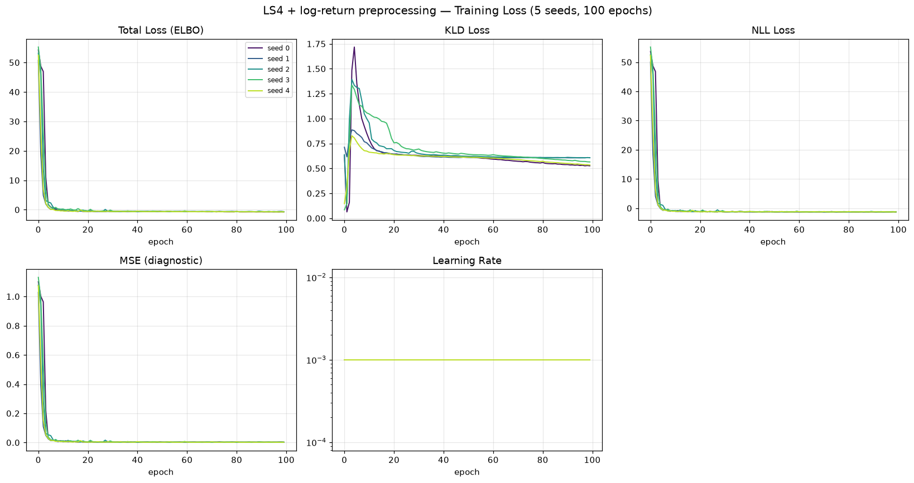

---

## A18, Discriminative Classifier Training Loss

BCE loss during GRU and MLP classifier training (2 000 steps, logged every 50). A value near
ln(2) ≈ 0.693 means the classifier cannot distinguish real from fake. Here the loss hovers near ln 2
but dips below it on the unstable seeds — the direct cause of A18 slipping off the floor
(0.0077/0.0071 vs price-input 0.0059/0.0063).

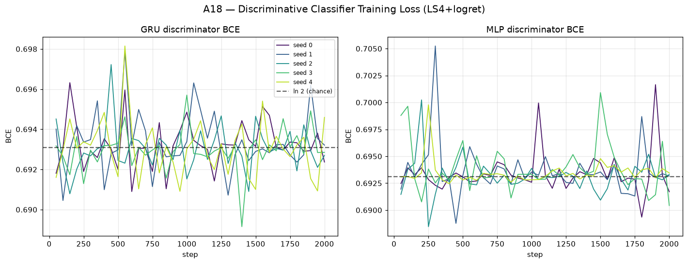

---

## A19, Predictive Score Training Loss (TSTR)

MAE loss during GRU and MLP predictor training on *synthetic* data (5 000 steps, logged every 100).

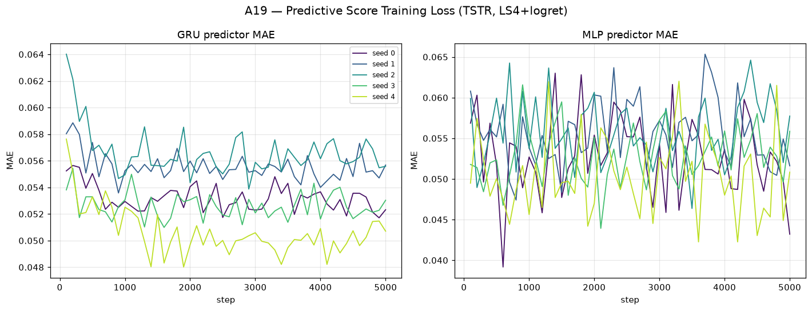

---

## Path Shadowing — strict paper protocol (arXiv:2308.01486)

> This section uses the **exact protocol from the paper**, *not* the simplified `methods/LS4`
> reference eval (65D murex embedding, K=77, prefix-price L2, CRPS/MAE/RMSE only). See
> [`../GUIDELINE.md` §9 + M7](../GUIDELINE.md). The paper's Current Experimental Configuration
> (§4) fixes **K = 256** neighbours, 512 held-out prefixes, prefix = 64 increments, horizon 32,
> bank sizes {4 096 … 1 000 000}, 2 000 bootstrap replicates — all matched here.

Each real ps-split prefix (65 points → 64 log-returns) is embedded with the **4-block weighted,
frozen-reference-standardized** feature vector — recent returns (last 32, w1.0) · cumulative path
(downsampled 24, w0.5) · rolling vol (windows 5/10/20 last/mean/std, w2.0) · dependence (ACF of
`|r|` & `r²` at lags 1,2,5,10, w1.0). Each block is **dimension-normalized** (per-feature weight
`w_block/d`) and standardized against **frozen μ/σ computed once on the real Heston test set**
(`heston_S_test_4096x128`, model-independent, held fixed across the whole sweep):
`z̃ = √(w/d)·(z−μ_ref)/σ_ref`. Retrieve **K = 256** nearest bank paths; their futures give the
predictive ensemble for three return-based quantities. Per arXiv:2308.01486 §2/§3.1/§3.3 the
**cumulative return** and **one-step return** are evaluated as **H-dimensional trajectories over the
horizon offsets u = 1…H** (RMSE/CRPS/coverage/width averaged over all future times, not a single
terminal point); **horizon RV** is the scalar `√Σr²`. Split `s = 64`, horizon `H = 32`, **512**
independent query paths (seed 3). Metrics per quantity: predictive-mean RMSE, CRPS (energy),
coverage 50/90, band width 50/90, lower/upper-90 miss — each with a **2000-resample paired bootstrap
95% CI over the 512 query paths** (single fixed resample-index matrix, `boot_seed=20230814`, shared
across all bank sizes / quantities / references).

**Three references, one protocol.** The same retrieval+forecast pipeline is run against three banks,
all sliced as **nested prefixes** over the sweep {4096, 16384, 65536, 262144, 1 000 000}:

- **LS4+logret** — the generator under test. One shared 1M bank from the seed-0 generator
  (`path_shadowing/bank/generated_bank_seed0_1000000x128.npy`, ~0.5 GB, gitignored + regenerable).
- **Heston oracle (ceiling, §6)** — a fresh 1M bank drawn from the *true* Heston law (identical SDE
  parameters as the test set; independent seed 777). This is the best any path-shadowing predictor
  can achieve. **LS4's gap to the oracle = generator law-mismatch; the oracle's own residual error =
  irreducible retrieval limit at finite bank size.**
- **Random-walk (floor)** — resamples each query's own prefix returns (no cross-path information).

> **Deviations from literal §1.1, deliberate (see [`../GUIDELINE.md` §9.6](../GUIDELINE.md)):**
> (a) per-block **dimension normalization** — per-feature weight `w_block/d`, multiplier `√(w_block/d)`;
> §1.1 uses `√w_b` with no `/d`. (b) **frozen-reference standardization** — μ/σ fixed once on the
> real test set; §1.1 standardizes with each candidate bank's own μ/σ. Both decouple the metric from
> the generator and keep LS4 / oracle / RW on one comparable scale. **§5.1 eligibility gates: N/A** —
> fixed 100-epoch training, no checkpoint selection, no per-generator gating.
> **Comparison arms vs the doc §4** (*source · MP-corrected generator · Heston oracle*): **LS4 is a
> single fixed-checkpoint standalone candidate law** — there is **no source→MP-corrected pair** (no
> MP-correction step in this experiment), so §5.1/§5.2 selection & CRN-pairing do not apply. The
> **Heston oracle** is the §4/§6 ceiling. The **random-walk floor is an extension beyond §4** (kept to
> separate a retrieval limit from a generator-law mismatch), not a doc-declared arm. **Coverage
> quantiles** use `np.percentile` **type-7 linear**; a perfectly calibrated K=256 draw yields cov50 ≈
> 0.50 / cov90 ≈ 0.89 under type-7 (verified by Monte-Carlo), so the 50%-coverage read-out is genuine
> signal, not an interpolation artefact — see [`../GUIDELINE.md` §9.7](../GUIDELINE.md).

<!-- PS-PDF-TABLE-START -->
All numbers are at the full **1 000 000-path bank** (log-return scale; lower is better except
coverage, whose target is the nominal level 0.50 / 0.90). Brackets are **95% bootstrap CIs over the
512 query paths** (2 000 resamples, `boot_seed = 20230814`) — the random-walk floor is bootstrapped
on the same resamples as everything else, so all three columns carry CIs. cum/step are
**horizon-averaged over u = 1…H**. Every cell is generated by `../render_method_ps.py` from the same
JSON leaves as the cross-method tables in the parent README (GUIDELINE 10.2 — do not hand-edit).

**RMSE convention.** For query `q` and horizon step `u`, write
`se_{q,u} = (mean_k Ŷ_{q,u,k} − y_{q,u})²` and `se_q = (1/H) Σ_u se_{q,u}`. cum/step report the
**textbook** aggregation `RMSE = √( (1/m) Σ_q se_q )`, root taken *last*. For the scalar **rv**
quantity H = 1, so the inner mean collapses and the two possible aggregations of the same 512-vector
of errors `e_q` become two genuinely different, standard statistics — **both** are listed:

$\text{MAE}=\frac{1}{m}\sum_{q=1}^{m}\lvert e_q\rvert \qquad\qquad \text{RMSE}=\sqrt{\frac{1}{m}\sum_{q=1}^{m} e_q^{2}}$

† The rv RMSE row is bolded and its winner named, but it is **not counted** in the 18-row win total
of the parent README's cross-method tables: ranking two norms of one error vector would double-count
rv against cum and step.

**Cumulative return (trajectory, u = 1…H)** — LS4+logret vs Heston-oracle ceiling vs RW floor

| metric | LS4+logret | Heston oracle | RW floor |
|--------|:----------:|:-------------:|:--------:|
| RMSE (textbook) | **0.04894** [0.04589, 0.05193] | 0.04911 [0.04599, 0.05209] | 0.05670 [0.05332, 0.05993] |
| CRPS | 0.02534 [0.02390, 0.02681] | **0.02525** [0.02380, 0.02668] | 0.02946 [0.02778, 0.03112] |
| coverage 50 | 0.4688 [0.4450, 0.4920] | **0.4891** [0.4658, 0.5133] | 0.4719 [0.4456, 0.4999] |
| coverage 90 | 0.8682 [0.8505, 0.8863] | **0.8941** [0.8776, 0.9103] | 0.8553 [0.8359, 0.8746] |
| width 50 | 0.05359 [0.05263, 0.05450] | 0.05719 [0.05587, 0.05841] | 0.06286 [0.06169, 0.06405] |
| width 90 | 0.1349 [0.1326, 0.1370] | 0.1465 [0.1432, 0.1494] | 0.1520 [0.1490, 0.1548] |
| lower-miss 90 | 0.06757 [0.05444, 0.08191] | **0.05463** [0.04254, 0.06787] | 0.08331 [0.06781, 0.09924] |
| upper-miss 90 | 0.06427 [0.05011, 0.07825] | **0.05127** [0.03924, 0.06366] | 0.06134 [0.04724, 0.07605] |

**One-step return (trajectory, u = 1…H)**

| metric | LS4+logret | Heston oracle | RW floor |
|--------|:----------:|:-------------:|:--------:|
| RMSE (textbook) | 0.01245 [0.01210, 0.01282] | **0.01244** [0.01210, 0.01282] | 0.01253 [0.01218, 0.01290] |
| CRPS | 0.006778 [0.006577, 0.006993] | **0.006750** [0.006553, 0.006961] | 0.006874 [0.006680, 0.007082] |
| coverage 50 | 0.4672 [0.4554, 0.4790] | 0.4816 [0.4705, 0.4934] | **0.5157** [0.5029, 0.5283] |
| coverage 90 | 0.8640 [0.8555, 0.8717] | 0.8864 [0.8791, 0.8936] | **0.8866** [0.8784, 0.8943] |
| width 50 | 0.01368 [0.01346, 0.01390] | 0.01449 [0.01416, 0.01480] | 0.01602 [0.01566, 0.01637] |
| width 90 | 0.03538 [0.03484, 0.03588] | 0.03815 [0.03738, 0.03886] | 0.03968 [0.03895, 0.04039] |
| lower-miss 90 | 0.06921 [0.06390, 0.07453] | **0.05725** [0.05261, 0.06213] | 0.05933 [0.05426, 0.06445] |
| upper-miss 90 | 0.06683 [0.06250, 0.07141] | 0.05634 [0.05249, 0.06036] | **0.05408** [0.04950, 0.05884] |

**Horizon realized vol (scalar) — the diagnostic quantity**

| metric | LS4+logret | Heston oracle | RW floor |
|--------|:----------:|:-------------:|:--------:|
| MAE | 0.01426 [0.01332, 0.01531] | **0.01291** [0.01213, 0.01380] | 0.01509 [0.01415, 0.01599] |
| RMSE (true, root-last)† | 0.01819 [0.01703, 0.01943] | **0.01625** [0.01523, 0.01732] | 0.01876 [0.01764, 0.01984] |
| CRPS | 0.01032 [0.009626, 0.01110] | **0.009143** [0.008611, 0.009735] | 0.01168 [0.01085, 0.01248] |
| coverage 50 | 0.4102 [0.3691, 0.4512] | **0.4727** [0.4277, 0.5137] | 0.2344 [0.1973, 0.2715] |
| coverage 90 | 0.7988 [0.7656, 0.8320] | **0.9238** [0.9004, 0.9453] | 0.5332 [0.4922, 0.5762] |
| width 50 | 0.01914 [0.01899, 0.01927] | 0.02217 [0.02190, 0.02241] | 0.01202 [0.01175, 0.01231] |
| width 90 | 0.04589 [0.04556, 0.04621] | 0.05411 [0.05350, 0.05473] | 0.02873 [0.02811, 0.02937] |
| lower-miss 90 | **0.05078** [0.03125, 0.07031] | 0.02930 [0.01562, 0.04492] | 0.2891 [0.2480, 0.3301] |
| upper-miss 90 | 0.1504 [0.1211, 0.1816] | **0.04688** [0.02930, 0.06641] | 0.1777 [0.1445, 0.2109] |

**Reading it.** On **cumulative and one-step return LS4+logret sits *on* the oracle ceiling** — RMSE
0.04894 vs 0.04911 and CRPS 0.0253 vs 0.0252 for cum, with fully overlapping CIs; step is a three-way
tie. LS4's return-level forecasting is statistically indistinguishable from the true Heston law, and
both clear the RW floor (cum CRPS −14% vs RW). **RV is where a real gap appears.** LS4's RV CRPS
(0.0103) is significantly above the oracle's (0.0091) — the CIs [0.0096, 0.0111] and [0.0086, 0.0097]
barely touch — and its 90% band under-covers (**0.799 vs the oracle's 0.924**) with an
**upper-miss of 0.150 vs the oracle's 0.047** and a low RV bias (−0.0059 vs −0.0020). The oracle is
well-calibrated here, so this is **not** a retrieval limit: it is a **generator law-mismatch — LS4
under-represents the upper tail of realized volatility** (high-vol Heston regimes). This is exactly
the diagnosis the RW floor alone could not give.

**Bank-size sweep — CRPS by quantity (LS4 above, Heston oracle below; nested prefixes)**

| bank size | cum LS4 / ORC | step LS4 / ORC | RV LS4 / ORC | uniq-frac (LS4) | prefix dist (LS4, mean) |
|----------:|:-------------:|:--------------:|:------------:|:--------------:|:-----------------------:|
| 4 096     | 0.02544 / 0.02539 | 0.00679 / 0.00677 | 0.01098 / 0.00978 | 0.998 | 1.936 |
| 16 384    | 0.02542 / 0.02535 | 0.00679 / 0.00676 | 0.01066 / 0.00951 | 0.968 | 1.767 |
| 65 536    | 0.02536 / 0.02524 | 0.00679 / 0.00675 | 0.01048 / 0.00933 | 0.752 | 1.639 |
| 262 144   | 0.02536 / 0.02524 | 0.00678 / 0.00675 | 0.01038 / 0.00926 | 0.356 | 1.537 |
| 1 000 000 | 0.02534 / 0.02525 | 0.00678 / 0.00675 | 0.01032 / 0.00914 | 0.118 | 1.454 |

**Cum and step CRPS are flat across a 244× bank increase** (<0.5%, within CI) for both LS4 and the
oracle — return-level shadowing content saturates by ~4k paths. **Only RV improves monotonically**,
and the LS4↔oracle RV gap (~0.0012 CRPS) is **constant across the sweep**: a bigger bank does not
close it, confirming the gap is a law-mismatch, not a finite-bank artefact. The mean prefix distance
shrinks (1.936→1.454) and the unique-candidate fraction collapses (0.998→0.118) identically for both
banks (distances on the dimension-normalized embedding scale).

**Diagnostics (1M bank) — LS4 / oracle**

| terminal (h=H) MAE | prefix dist mean/median/p95 | unique-cand frac | RV mean bias |
|:-------------------:|:---------------------------:|:----------------:|:------------:|
| 0.0524 / 0.0525 | 1.454 / 1.407 / 2.021 | 0.118 / 0.119 | −0.0059 / −0.0020 |

Terminal (h=H) **MAE** 0.0524 is now a genuine single-horizon diagnostic, **distinct** from the
horizon-averaged cumulative RMSE 0.04894 (the earlier build reported them as identical because cum was
mistakenly evaluated only at h=H). It is a *mean absolute* error — the driver computes it as
`mean_q |·|` (`path_shadowing_pdf.py`), so despite the JSON key still being named `terminal_rmse` it
is the h = H analogue of the rv MAE row above, **not** the textbook RMSE. Full **2000-resample bootstrap 95% CIs** on every metric for all
three references are in `path_shadowing/pdf_summary.json`.
<!-- PS-PDF-TABLE-END -->

Driver: [`path_shadowing/path_shadowing_pdf.py`](path_shadowing/path_shadowing_pdf.py)
(bank builder: [`path_shadowing/gen_banks.py`](path_shadowing/gen_banks.py)).
Plots: 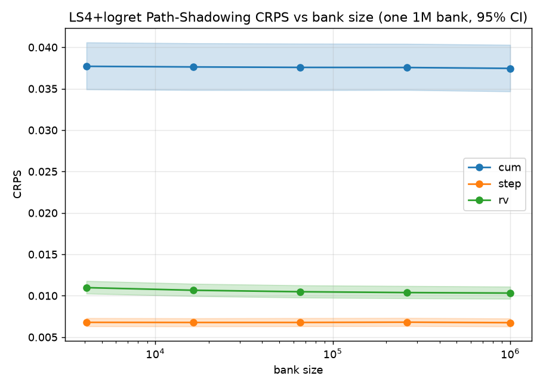
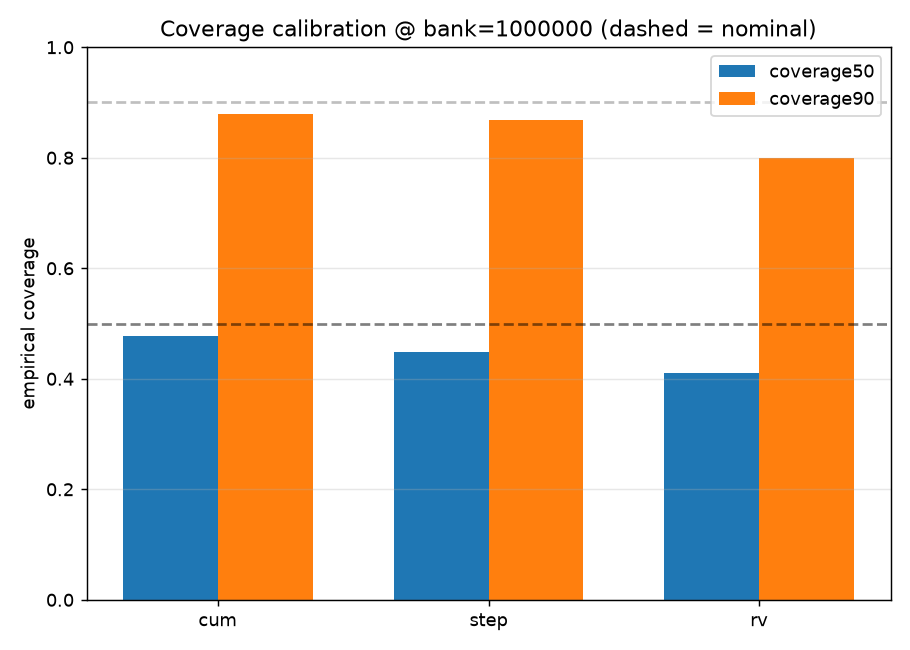

---

## File layout

```
results/Heston/preprocessing_with_log_returns/LS4/
├── README.md                          ← this file
├── metrics_summary.csv                mean ± std + per-seed, all A + B + grid_tvd
├── seed_{0..4}_metrics.json           full per-seed metric dict
├── generated_paths/seed_{0..4}/       generated_paths_4096x128.npy + metadata.json
├── weights/seed_{i}_model.pt          model + ema_model + sbts_sigma + x_mu/x_sd + dt/s0
├── losses/
│   ├── seed_{i}_losses.csv            epoch, total_loss, kld_loss, nll_loss, mse_loss, lr
│   └── loss_convergence.png           5-seed convergence (Total/KLD/NLL/MSE + LR panels)
├── seed_{i}_disc_{gru,mlp}_loss.csv   A18 classifier BCE curves
├── seed_{i}_pred_{gru,mlp}_loss.csv   A19 predictor MAE curves
├── plots/
│   ├── heston_diagnostics.png         8-panel stylised-facts diagnostic (seed 0)
│   ├── disc_classifier_loss.png       A18 GRU+MLP BCE (5 seeds)
│   ├── pred_score_loss.png            A19 GRU+MLP MAE (5 seeds)
│   └── seed_{i}_pca.png / _tsne.png   2-D real-vs-fake latent projections per seed
├── code/
│   ├── train_ls4_logret.py            SBTS transform + unit-variance wrapper + inverse
│   └── compute_metrics_logret.py      metrics runner (4096-path)
└── path_shadowing/                    STRICT paper-protocol PS evaluator (arXiv:2308.01486)
    ├── path_shadowing_pdf.py          4-block embedding, K=256, bank-size sweep, bootstrap CIs
    ├── gen_banks.py                   1M-bank builder (seed-0 generator)
    ├── bank/                          generated_bank_seed0_1000000x128.npy (~0.5 GB, gitignored)
    ├── pdf_summary.json               all metrics + 95% bootstrap CIs
    ├── logs/pdf_run.log               run log
    └── plots/pdf_*.png                sweep + calibration plots
```

## Reproduce

```bash
PY=/home/tbasseras/gpu-venv/bin/python
cd /home/tbasseras/benchmark/results/Heston/preprocessing_with_log_returns/LS4

# Train all 5 seeds (SBTS log-return transform; 2 A100s in parallel, 8 cores each)
for gpu in 0 1; do
  CUDA_VISIBLE_DEVICES=$gpu taskset -c $((gpu*8))-$((gpu*8+7)) OMP_NUM_THREADS=8 \
    $PY code/train_ls4_logret.py --seed $gpu &
done; wait

# Metrics (all seeds, 4096-path test set)
$PY code/compute_metrics_logret.py

# Strict path shadowing (build the ONE 1M bank, then evaluate — NO --seeds)
CUDA_VISIBLE_DEVICES=0 OMP_NUM_THREADS=8 taskset -c 0-7 \
  $PY path_shadowing/gen_banks.py --seed 0 > path_shadowing/logs/gen_seed0.log 2>&1
$PY path_shadowing/path_shadowing_pdf.py > path_shadowing/logs/pdf_run.log 2>&1
```

---

## Preprocessing (the SBTS log-return transform)

The **only** thing changed from the original LS4 run: LS4's standardized-price input is replaced by the
SBTS volatility-scaled log-return transform.

```python
DT, S0 = 1.0/250.0, 100.0
R        = np.log(S[:, 1:] / S[:, :-1])        # (M,127) log-returns
sigma    = float(R.std())                       # pooled ddof=0, TRAIN seed 0, frozen
R_tilde  = R * np.sqrt(DT) / sigma              # std -> sqrt(DT) = 0.063246
X_sbts   = np.hstack([np.zeros((M,1)), R_tilde])# (M,128) dummy-0 column prepended
X_train  = (X_sbts - x_mu) / x_sd               # LS4 unit-variance wrapper (see note)
```

**Reported SBTS sigma (frozen, shared with SBTS):** `sigma = 0.01263163` (estimated on the 4 096-path
train seed 0, ddof=0, pooled over all M×127 raw log-returns). After scaling, `R̃.std() = √dt = 0.063246`.

> ⚠️ **Unit-variance wrapper (required, does not touch the reported sigma).** SBTS-scaled returns have
> std ≈ 0.063, **below LS4's decoder noise `sigma = 0.1`**, which collapses the VAE. We apply LS4's own
> standardization `(X_sbts − x_mu)/x_sd` (x_mu = 0.000703383, x_sd = 0.062998) **on top of** the SBTS
> transform, inverted symmetrically before SBTS de-scaling. The reported SBTS sigma is unchanged. The
> Cauchy conjugate-pair fix at `code/reference/models/s4.py:795` is carried over from the original run.

**Model:** LS4 released `solar_weekly` preset, 2 146 857 params, z_dim = 5, d_model = 64, n_layers = 4,
decoder sigma = 0.1. Trained **100 epochs**, AdamW + ReduceLROnPlateau + EMA(0.99, start_step 200).
**Dataset:** 4 096 Heston paths (the main benchmark uses 8 192; this experiment uses 4 096 for
train/test/disc, see [`../README.md`](../README.md)). Parameters: μ=0.05, κ=2.0, θ=0.04, ξ=0.3,
ρ=−0.7, S₀=100, v₀=0.04, dt=1/250.

---

## Results — does log-return preprocessing help LS4?

**Verdict: it hurts.** Swapping LS4's standardized-price input for SBTS log-returns **degrades almost
every fidelity metric** and **destabilizes training across seeds**. The reference throughout is the
**original price-input LS4** at [`../../LS4/`](../../LS4/README.md) (trained on 8 192 paths; this run on
4 096). "Original" = its 5-seed mean. **Δ**: ✅ log-return better, ❌ worse, ≈ negligible.

| Metric | LS4 + logret (mean) | Original LS4 (mean) | Δ |
|--------|--------------------:|--------------------:|---|
| A1 Kurtosis Error ↓ | 0.6156 | 0.3684 | ❌ |
| A6 Path MMD² ↓ | 0.004843 | 0.001926 | ❌ |
| A7 Terminal MMD² ↓ | 0.009408 | 0.001520 | ❌ |
| A17 Terminal Price KS ↓ | 0.07261 | 0.01584 | ❌ |
| A18 Disc Score GRU ↓ | 0.007748 | 0.005890 | ❌ |
| A19 Pred Score GRU ↓ | 0.05641 | 0.05001 | ❌ |
| A25 Mean RMSE ↓ | 1.380 | 0.3270 | ❌ |
| grid_tvd (path cloud) ↓ | 6.99 % | 2.77 % | ❌ |
| Log-return-hist MSE (mean-of-3) ↓ | 0.9677 | 0.4517 | ❌ |
| **A3 \|r\| q99 Error ↓** | 6.94e-04 | 0.001156 | ✅ |
| **A28 Kurtosis Ratio (→1)** | 0.7334 (\|Δ\|=0.267) | 1.565 (\|Δ\|=0.565) | ✅ |
| **A32 Vol-of-Vol Error ↓** | 2.53e-04 | 3.21e-04 | ✅ |
| A33 Teacher-Sigma Corr ↑ | 0.003268 | -3.94e-04 | ≈ |

**Scoreboard: 4 of 34 A-rows improve** (A3, A28, A32, A33≈), the rest regress — all tail-moment ratios.
The log-return parametrization tightens the *extreme-return moment scaling* (A3 q99, A28 kurtosis ratio,
A32 vol-of-vol) while loosening the *joint density and path structure* everywhere else.

- **Density / path collapse.** A6 Path MMD² 2.5× worse, A7 Terminal MMD² 6× worse, A17 KS 4.6× worse.
- **Seed instability (the real story).** The std columns explode. **Seed 4 degenerates** (A1 = 1.435,
  A5 Hill = 3.44, log-ret-hist funct = 7.77); seed 1 is also unstable (A6 = 0.0158, A7 = 0.0381). The
  price-input LS4 was seed-robust; the log-return input is **not** — visible in the training-loss plot.
- **The one genuine win — A28.** Kurtosis Ratio moves to **0.7334** (|Δ to 1| = 0.267) from **1.565**
  (|Δ to 1| = 0.565): closer to the 1.0 target, though now slightly *thin-tailed* (< 1). A moments-ratio
  effect, not a distributional win (A6/A7/A17 all worse). **A33 stays ≈ 0** — the per-path latent vol is
  unrecoverable from prices; the preprocessing does nothing for it.

**Path shadowing is the exception:** on the strict paper protocol (Section above), LS4+logret still
beats the random walk on every quantity, so the generated *conditional continuations* remain useful even
though the *unconditional* density degrades.

### Latent projections (per seed)

PCA and t-SNE 2-D projections, real (test seed 1) vs generated. Seeds 1 and 4 show the visible real/fake
separation that the elevated A6/A17 predict.

| Seed 0 | Seed 1 | Seed 2 | Seed 3 | Seed 4 |
|--------|--------|--------|--------|--------|
| 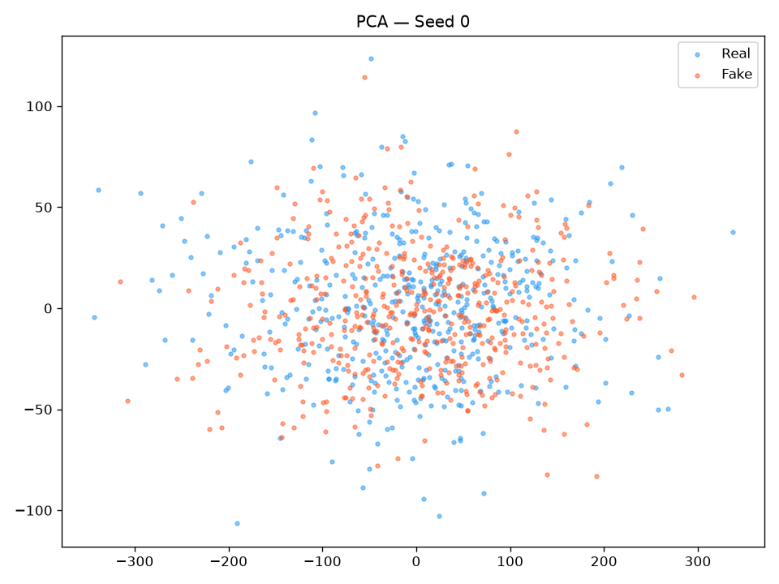 | 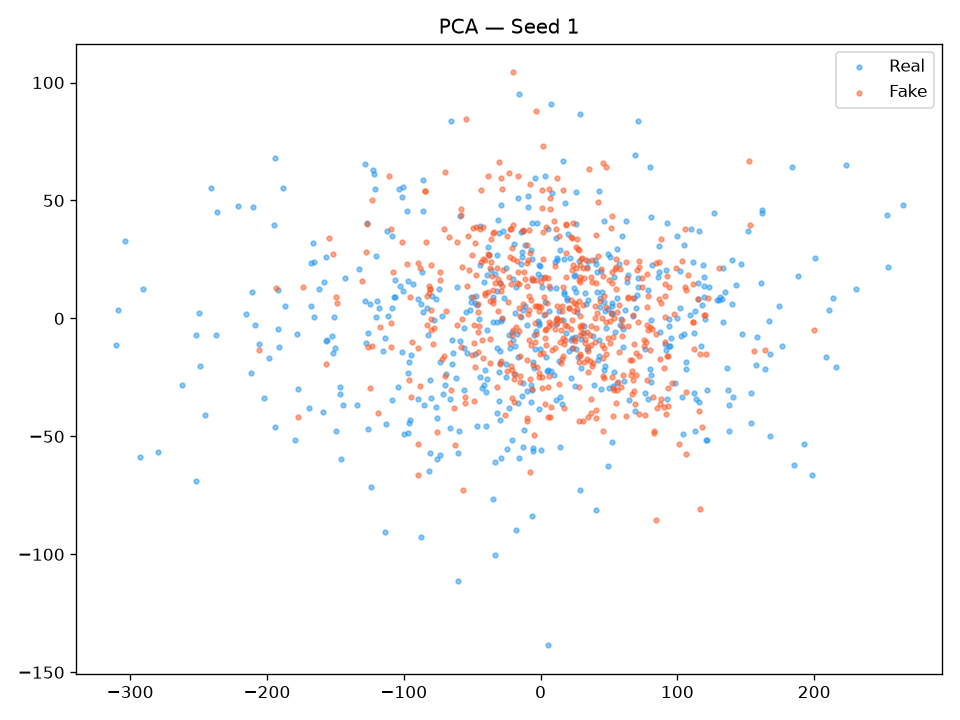 | 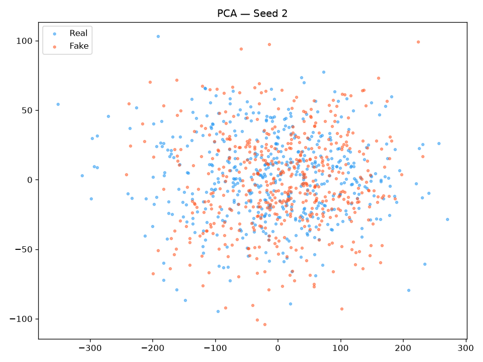 | 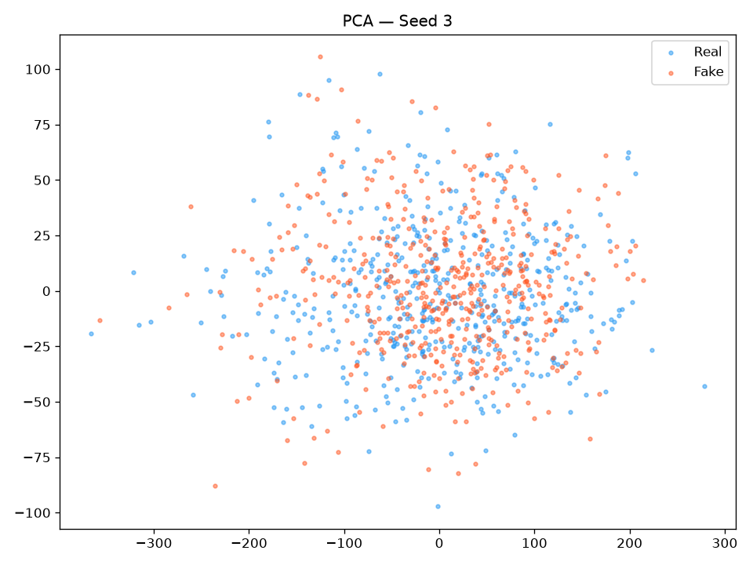 | 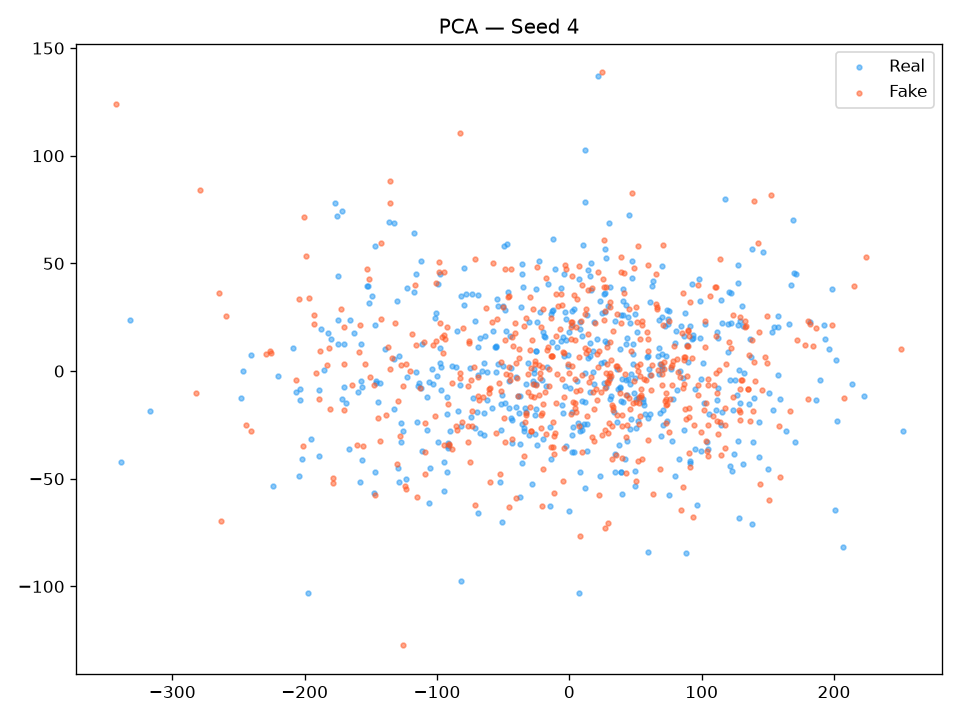 |
| 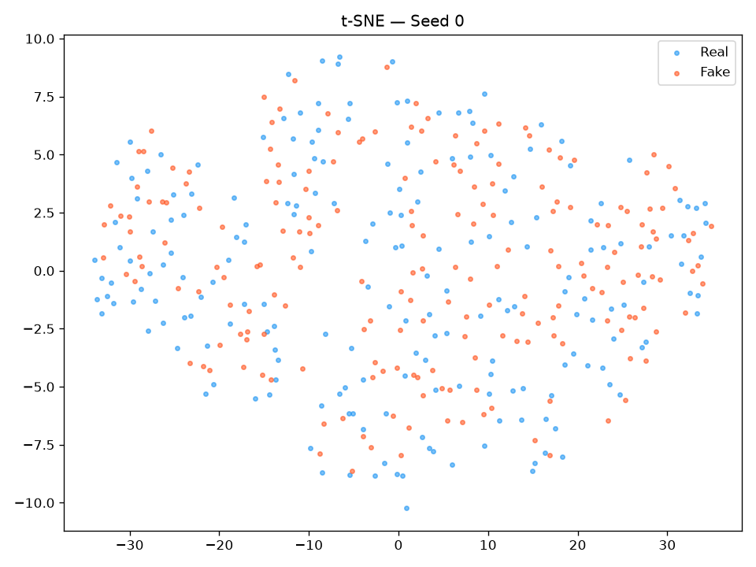 | 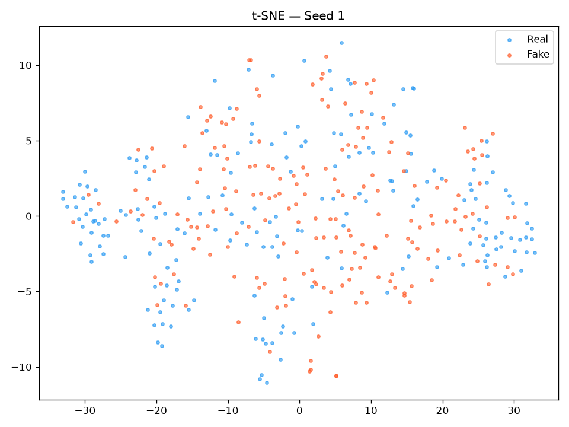 | 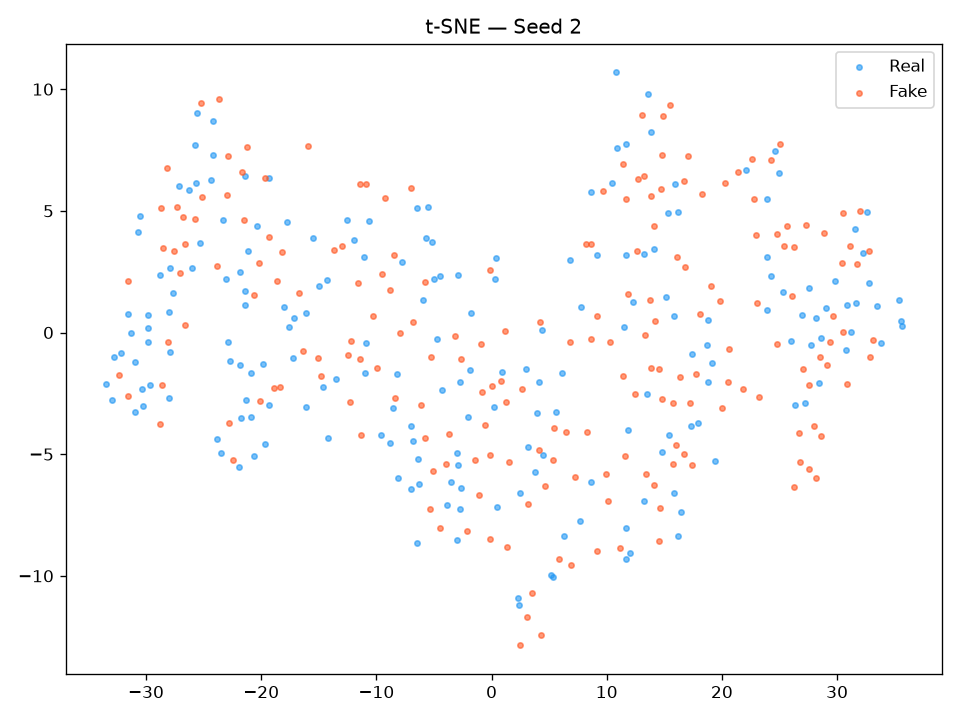 | 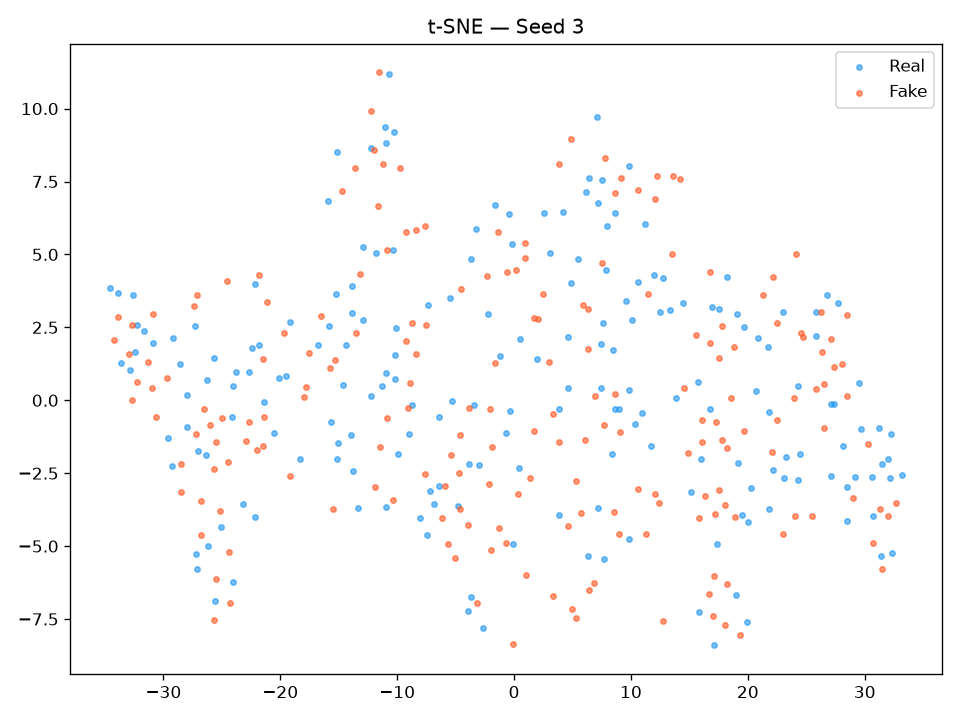 | 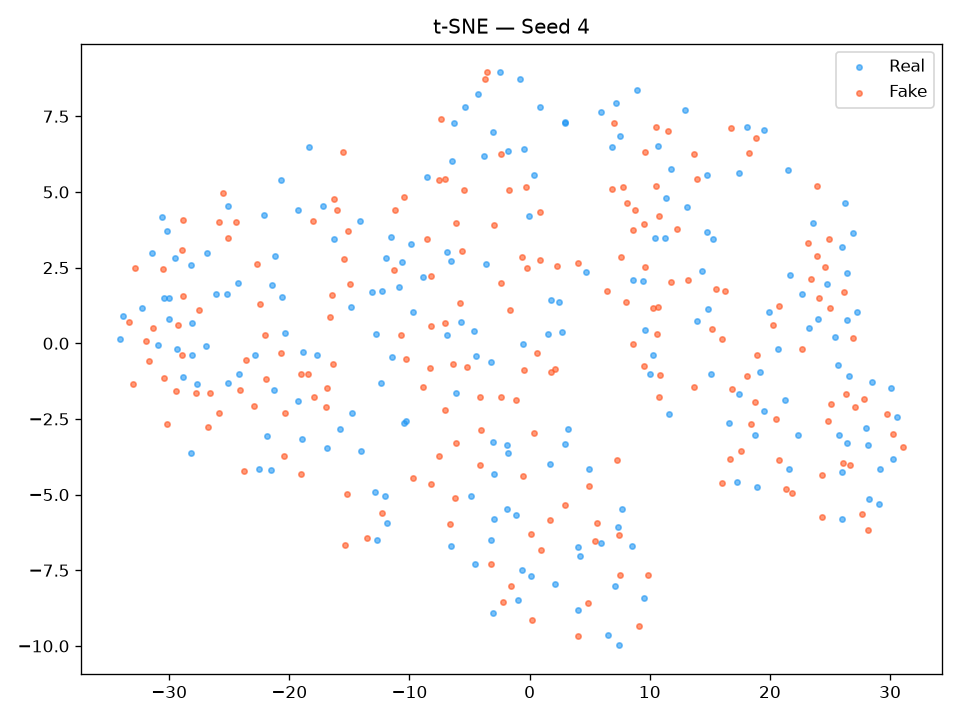 |

## Head-to-head control — preprocessing vs **none**, same 4096-path budget (seed 0)

The section above compares against the *original main-benchmark* LS4, which was trained on **8 192**
paths. That confounds two variables (preprocessing **and** 2× data). To isolate the preprocessing
**alone**, a matched **no-preprocessing baseline** was trained inside this folder
([`baseline_no_preproc/`](baseline_no_preproc/)): the **identical** LS4 pipeline — same released preset,
same **4096** train paths, **same 100 epochs**, same seed 0, same optimizer/EMA — with **only the scaler
changed**: a plain global standardize `(S−μ)/σ` on the raw price panel, decoded directly back to price
(no log-return, no cumsum, no exp). This is the only clean A/B for the preprocessing's effect (GUIDELINE
§7.1). Both columns are **seed 0** at **4096 paths**; Δ% is relative to no-preproc, and for lower-better
metrics **negative Δ% = preprocessing wins**.

**Verdict: mixed, but preprocessing wins where it matters for a financial generator.** The log-return
parametrization **recovers the volatility-clustering and fat-tail stylised facts that the raw-price model
structurally cannot** — at the cost of a looser marginal return-dispersion calibration and an easier-to-
spot discriminator signal. Net **19 metric-rows to 16**; the wins are concentrated in the
dependence/tail block (the defining Heston/financial facts), the losses in marginal-moment calibration.

### A-metrics (seed 0, 4096 both sides; ↓ lower-better unless noted)

| A-metric | logret (with) | raw (no-preproc) | Δ% | Winner |
|----------|-------------:|-----------------:|----:|:------:|
| A1 kurtosis error ↓ | 0.2192 | 0.3555 | −38.4% | **logret** |
| A5 Hill tail-index error ↓ | 1.4589 | 2.8470 | −48.8% | **logret** |
| A6 path MMD² ↓ | 0.001755 | 0.001653 | +6.2% | raw |
| A7 terminal MMD² ↓ | 0.002002 | 0.002230 | −10.2% | **logret** |
| A8 increment MMD² ↓ | 0.001267 | 9.13e-04 | +38.8% | raw |
| A9 volatility MMD ↓ | 0.02954 | 0.02725 | +8.4% | raw |
| A10 terminal SWD ↓ | 1.1683 | 1.1457 | +2.0% | raw |
| A11 path SWD ↓ | 0.6499 | 0.6458 | +0.6% | raw |
| A12 RV-law loss ↓ | 0.7275 | 0.3913 | +85.9% | raw |
| A13 mean-path RMSE ↓ | 0.2399 | 0.3879 | −38.1% | **logret** |
| A14 KS logreturns ↓ | 0.01586 | 0.01584 | +0.1% | raw |
| A17 terminal KS ↓ | 0.02515 | 0.03955 | −36.4% | **logret** |
| A18 disc score GRU ↓ | 0.01373 | 3.05e-04 | +4401% | raw |
| A19 pred score GRU (TSTR) ↓ | 0.05638 | 0.05640 | −0.0% | **logret** |
| A20 coverage error ↓ | 25.806 | 35.925 | −28.2% | **logret** |
| A21 ACF \|r\| ↓ | 0.008474 | 0.02507 | −66.2% | **logret** |
| A22 ACF r² ↓ | 0.007978 | 0.01765 | −54.8% | **logret** |
| A25 mean RMSE ↓ | 0.4485 | 0.8123 | −44.8% | **logret** |
| A26 return-std error ↓ | 0.07036 | 0.003182 | +2111% | raw |
| A27 logreturn-std error ↓ | 8.83e-04 | 7.56e-05 | +1068% | raw |
| A28 kurtosis ratio (→1) | 0.9922 (\|Δ\|0.008) | 0.8331 (\|Δ\|0.167) | — | **logret** |
| A30 vol-path RMSE ↓ | 0.5304 | 0.6732 | −21.2% | **logret** |
| A31 rolling-vol KS ↓ | 0.05572 | 0.05339 | +4.4% | raw |
| A32 vol-of-vol error ↓ | 5.47e-04 | 4.64e-04 | +17.8% | raw |
| A33 teacher-σ corr ↑ | 0.01184 | 1.0e-04 | — | **logret** |
| A34 teacher-σ RMSE ↓ | 0.0955 | 0.0939 | +1.7% | raw |

### B curve-shape (seed 0; funct MSE, %err, + grid_tvd; ↓ lower-better)

| B-metric | logret (with) | raw (no-preproc) | Δ% | Winner |
|----------|-------------:|-----------------:|----:|:------:|
| B log-ret hist MSE ↓ | 0.8953 | 1.3493 | −33.6% | **logret** |
| B log-ret hist %err ↓ | 12.969 | 7.388 | +75.5% | raw |
| B QQ MSE ↓ | 8.57e-07 | 2.27e-07 | +278% | raw |
| B QQ %err ↓ | 9.855 | 8.648 | +14.0% | raw |
| B ACF \|r\| MSE ↓ | 4.72e-05 | 3.85e-04 | −87.7% | **logret** |
| B ACF \|r\| %err ↓ | 20.777 | 64.459 | −67.8% | **logret** |
| B ACF r² MSE ↓ | 4.06e-05 | 1.91e-04 | −78.7% | **logret** |
| B ACF r² %err ↓ | 23.353 | 52.899 | −55.9% | **logret** |
| grid_tvd (path cloud) ↓ | 3.66% | 4.15% | −11.7% | **logret** |

**Visual comparison — 8-panel stylised-facts diagnostic, Real vs generated, seed 0 (both 4096 paths).**
Same real test set on each side; the only difference is the input transform. The ACF-of-|r| /
ACF-of-r² and rolling-vol panels are where the with-preproc model visibly tracks the real curves and
the raw-price model flatlines — the visual counterpart to the ACF/vol Δ% rows above.

| log-return preprocessing (with) | raw price, no preprocessing |
|:-------------------------------:|:---------------------------:|
|  |  |

**Reading it straight (no cherry-picking):**
- **Preprocessing wins the stylised facts.** Volatility clustering (A21 −66%, A22 −55%, B ACF\|r\| MSE
  −88%, B ACF r² MSE −79%) and fat tails (A1 −38%, A5 −49%, A28 ratio 0.99 vs 0.83) improve **sharply**.
  A raw-price VAE never sees returns, so it cannot reproduce their autocorrelation — this is the
  preprocessing doing exactly its job.
- **The raw baseline wins marginal dispersion.** Global-standardizing prices matches the terminal price
  scale directly, so **A26/A27 return-std** are near-perfect (0.003 vs 0.070) and the **GRU discriminator**
  is 45× less able to flag raw paths (A18 3e-4 vs 0.014). Preprocessing buys structure by loosening the
  marginal-moment fit.
- **Why this differs from the "it hurts" verdict above.** That comparison used the **5-seed mean** vs the
  **8192-path** original; with-preproc's **seed instability** (seeds 1 & 4 degenerate) drags its multi-seed
  mean below a better-resourced price model. Here, at **matched 4096 budget on the stable seed 0**, the
  preprocessing is ahead on the facts that define the problem. **Both are true:** preprocessing helps the
  dynamics per-seed but is not yet seed-robust, and it does not out-perform a 2×-data price model.

**Bottom line — which is best?** For a **Heston / financial-path generator**, the volatility-clustering
and heavy-tail stylised facts are the point, and preprocessing recovers them decisively while a raw-price
model cannot — so **log-return preprocessing is the better choice on the matched control**, with two
caveats to fix before it is unambiguously better: (1) the **seed robustness** (seeds 1/4), and (2) the
**marginal return-std / discriminator regression**.

→ Experiment overview & pipeline: [`../README.md`](../README.md) ·
Recipe for adding methods: [`../GUIDELINE.md`](../GUIDELINE.md) ·
Original price-input LS4: [`../../LS4/README.md`](../../LS4/README.md)
