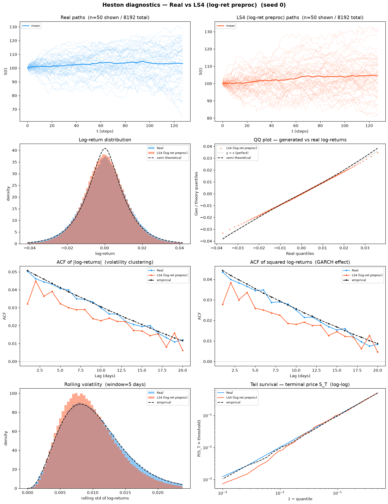
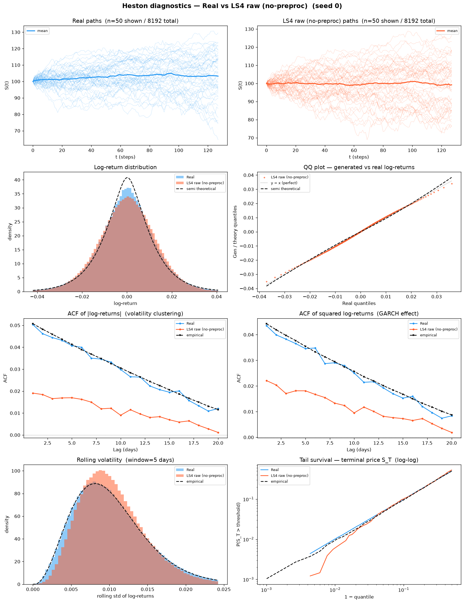
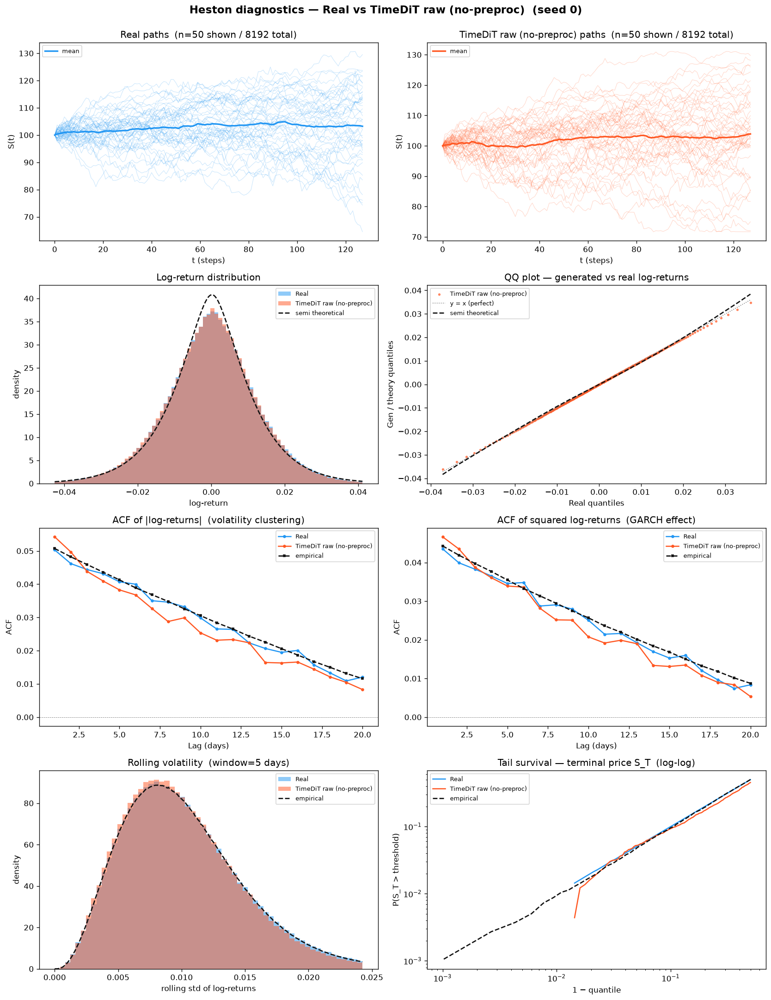

# Heston — `preprocessing_with_log_returns` experiment

This folder holds generator results for the **SBTS log-return preprocessing** applied to
methods **other than SBTS**. The question it answers: *does feeding a generator
volatility-scaled log-returns (the way SBTS does) instead of standardized prices change its
scores on the Heston benchmark?*

Four methods are carried through the full pipeline: **CSDI** (`CSDI/`), **TimeDiT** (`TimeDiT/`), **LS4**
(`LS4/`) and **SBTS** (`SBTS/`). CSDI, TimeDiT and LS4 are trained on the **4096**-path log-return train split
(seed 0); SBTS is non-parametric (no training — the log-return transform *is* its native representation, so its
five "seeds" differ only in the generation RNG). Each is scored on the held-out 4096 test set across seeds 0–4
and given a strict 1M-path path-shadowing bank. Every subsequent method gets its own sibling folder built the
same way — see [`GUIDELINE.md`](GUIDELINE.md) for the step-by-step recipe.

> **TimeDiT status — read the two halves separately, they disagree.** Its A and B columns below are the
> **SBTS-preproc** variant (5 seeds), where it is unremarkable (A 2/36, B 1/7). Its **PS column is the
> `TimeDiT (raw)` one**, generated from the **no-preproc** checkpoint, because log-return preprocessing
> *degrades* TimeDiT — raw price wins the matched seed-0 control **31–3** (1 exact tie), so the strict
> protocol was run on the checkpoint that actually represents the model. On that column it is the **best
> generator in the folder: 14 of 18 ranked rows at every one of the five bank sizes**, sitting on the Heston
> oracle. Only ONE bank exists (raw); the preprocessed-bank run was descoped. Full results:
> [`TimeDiT/README.md`](TimeDiT/README.md#path-shadowing--strict-paper-protocol-arxiv230801486-on-the-raw--no-preproc-checkpoint).

The tables below mirror the main [`results/`](../../README.md) display **at this experiment's 4096/512
scale**: cross-method A1–A34, curve-shape B, and the strict path-shadowing forecast, each with a
**Perfect** finite-sample floor (fresh independent Heston draw at N=4096, seeds 1000+) and a **Winner**
column (**bold** = best across methods, floor excluded).

---

## A1-A34, Cross-method comparison (mean ± std, 5 seeds)

Methods are grouped by model family. ↓ = lower is better, ↑ = higher is better, A28 target = 1.0.
**Bold** = best across methods. **Perfect** is a fresh independent Heston draw at N=4096 (seeds 1000+)
scored against the same test set exactly as each method is — a **non-zero** finite-sample floor.

<table>
<thead>
  <tr>
    <th rowspan="2">Metric</th>
    <th colspan="2">Diffusion</th>
    <th>VAE</th>
    <th>Schrödinger Bridge</th>
    <th rowspan="2">Perfect</th>
    <th rowspan="2">Winner</th>
  </tr>
  <tr>
    <th>CSDI</th>
    <th>TimeDiT</th>
    <th>LS4</th>
    <th>SBTS</th>
  </tr>
</thead>
<tbody>
  <tr><td colspan="7"><b>Fat Tail</b></td></tr>
  <tr><td>A1 Kurtosis Error ↓</td><td>0.09607 ± 0.03403</td><td>0.5543 ± 0.03596</td><td>0.6156 ± 0.4445</td><td><b>0.07225 ± 0.01942</b></td><td>0.05717 ± 0.01594</td><td><b>SBTS</b></td></tr>
  <tr><td>A2 \|r\| q95 Error ↓</td><td>0.003275 ± 2.21e-04</td><td>0.001798 ± 5.92e-04</td><td>0.001418 ± 6.20e-04</td><td><b>6.06e-04 ± 5.58e-05</b></td><td>1.49e-04 ± 8.48e-05</td><td><b>SBTS</b></td></tr>
  <tr><td>A3 \|r\| q99 Error ↓</td><td>0.004672 ± 2.87e-04</td><td>0.003947 ± 9.89e-04</td><td><b>6.94e-04 ± 9.66e-04</b></td><td>8.33e-04 ± 1.33e-04</td><td>2.40e-04 ± 1.51e-04</td><td><b>LS4</b></td></tr>
  <tr><td>A4 Tail QQ Error ↓</td><td>0.003223 ± 2.21e-04</td><td>0.001797 ± 5.88e-04</td><td>0.001612 ± 3.41e-04</td><td><b>5.62e-04 ± 6.96e-05</b></td><td>1.54e-04 ± 5.57e-05</td><td><b>SBTS</b></td></tr>
  <tr><td>A5 Hill Tail Index Error ↓</td><td>3.502 ± 1.155</td><td>4.229 ± 2.120</td><td>4.257 ± 3.274</td><td><b>1.606 ± 0.9107</b></td><td>1.280 ± 0.9324</td><td><b>SBTS</b></td></tr>
  <tr><td colspan="7"><b>Distribution</b></td></tr>
  <tr><td>A6 Path MMD² ↓</td><td>0.004724 ± 8.37e-04</td><td>0.008066 ± 0.001620</td><td>0.004843 ± 0.005499</td><td><b>0.002174 ± 1.52e-04</b></td><td>0.001785 ± 1.26e-04</td><td><b>SBTS</b></td></tr>
  <tr><td>A7 Terminal MMD² ↓</td><td>0.005010 ± 0.001396</td><td>0.01146 ± 0.003129</td><td>0.009408 ± 0.01435</td><td><b>0.002080 ± 7.68e-04</b></td><td>0.001252 ± 3.04e-04</td><td><b>SBTS</b></td></tr>
  <tr><td>A8 Increment MMD² ↓</td><td>0.002725 ± 3.31e-04</td><td>0.001790 ± 4.41e-04</td><td><b>0.001310 ± 3.61e-04</b></td><td>0.001322 ± 4.16e-05</td><td>8.35e-04 ± 9.07e-06</td><td><b>LS4</b></td></tr>
  <tr><td>A9 Volatility MMD ↓</td><td>0.07403 ± 0.01016</td><td>0.05459 ± 0.02186</td><td>0.03631 ± 0.01918</td><td><b>0.01640 ± 0.001147</b></td><td>0.007665 ± 4.31e-04</td><td><b>SBTS</b></td></tr>
  <tr><td>A10 Terminal SWD ↓</td><td>2.759 ± 0.6438</td><td>4.430 ± 1.492</td><td>2.197 ± 1.712</td><td><b>0.8197 ± 0.05810</b></td><td>0.7849 ± 0.2589</td><td><b>SBTS</b></td></tr>
  <tr><td>A11 Path SWD ↓</td><td>1.652 ± 0.3123</td><td>2.351 ± 0.5392</td><td>1.076 ± 0.8519</td><td><b>0.6156 ± 0.06419</b></td><td>0.5453 ± 0.06639</td><td><b>SBTS</b></td></tr>
  <tr><td>A12 RV Law Loss ↓</td><td>1.257 ± 0.08482</td><td>0.6697 ± 0.1841</td><td>0.5482 ± 0.2282</td><td><b>0.2002 ± 0.02898</b></td><td>0.07645 ± 0.02268</td><td><b>SBTS</b></td></tr>
  <tr><td>A13 Mean Path RMSE ↓</td><td>1.869 ± 0.2044</td><td>2.229 ± 1.057</td><td>0.7794 ± 0.8059</td><td><b>0.2458 ± 0.08483</b></td><td>0.1839 ± 0.07398</td><td><b>SBTS</b></td></tr>
  <tr><td>A14 KS Log-returns ↓</td><td>0.03790 ± 0.003867</td><td>0.01469 ± 0.003612</td><td>0.01940 ± 0.01036</td><td><b>0.003553 ± 6.82e-04</b></td><td>0.002173 ± 6.14e-04</td><td><b>SBTS</b></td></tr>
  <tr><td>A15 Skewness Error ↓</td><td>0.02500 ± 0.009075</td><td>0.06633 ± 0.007088</td><td>0.1688 ± 0.1020</td><td><b>0.01182 ± 0.004283</b></td><td>0.01206 ± 0.004495</td><td><b>SBTS</b></td></tr>
  <tr><td>A16 QQ RMSE (300-pt) ↓</td><td>0.001613 ± 1.24e-04</td><td>8.23e-04 ± 2.29e-04</td><td>8.77e-04 ± 2.96e-04</td><td><b>2.23e-04 ± 3.25e-05</b></td><td>8.18e-05 ± 2.29e-05</td><td><b>SBTS</b></td></tr>
  <tr><td>A17 Terminal Price KS ↓</td><td>0.09575 ± 0.01135</td><td>0.1251 ± 0.04108</td><td>0.07261 ± 0.07271</td><td><b>0.02070 ± 0.005751</b></td><td>0.02139 ± 0.004590</td><td><b>SBTS</b></td></tr>
  <tr><td colspan="7"><b>Adversarial</b></td></tr>
  <tr><td>A18 Disc Score GRU ↓</td><td>0.02459 ± 0.02851</td><td>0.02520 ± 0.02542</td><td><b>0.007748 ± 0.006227</b></td><td>0.01800 ± 0.01704</td><td>0.007138 ± 0.005353</td><td><b>LS4</b></td></tr>
  <tr><td>A18 Disc Score MLP ↓</td><td>0.008969 ± 0.005832</td><td>0.05241 ± 0.04124</td><td><b>0.007138 ± 0.003524</b></td><td>0.03606 ± 0.02450</td><td>0.006284 ± 0.004902</td><td><b>LS4</b></td></tr>
  <tr><td colspan="7"><b>Predictive</b></td></tr>
  <tr><td>A19 Pred Score GRU ↓</td><td><b>0.05638 ± 4.31e-06</b></td><td>0.05641 ± 2.19e-05</td><td>0.05641 ± 5.08e-05</td><td>0.05640 ± 1.13e-05</td><td>0.05638 ± 1.11e-05</td><td><b>CSDI</b></td></tr>
  <tr><td>A19 Pred Score MLP ↓</td><td>0.05657 ± 4.25e-04</td><td>0.05674 ± 6.88e-04</td><td>0.05643 ± 1.31e-04</td><td><b>0.05630 ± 4.92e-05</b></td><td>0.05668 ± 3.69e-04</td><td><b>SBTS</b></td></tr>
  <tr><td colspan="7"><b>Temporal</b></td></tr>
  <tr><td>A20 Covariance Error ↓</td><td>49.05 ± 6.706</td><td>47.23 ± 16.28</td><td>56.78 ± 42.52</td><td><b>10.55 ± 3.421</b></td><td>5.825 ± 6.502</td><td><b>SBTS</b></td></tr>
  <tr><td>A21 ACF \|r\| Error (lags) ↓</td><td>0.008784 ± 0.003423</td><td>0.01010 ± 0.003114</td><td>0.01490 ± 0.004887</td><td><b>0.003416 ± 3.25e-04</b></td><td>0.001318 ± 3.93e-04</td><td><b>SBTS</b></td></tr>
  <tr><td>A22 ACF r² Error (lags) ↓</td><td>0.005865 ± 0.002317</td><td>0.01164 ± 0.003193</td><td>0.01120 ± 0.003591</td><td><b>0.004008 ± 3.49e-04</b></td><td>0.001394 ± 3.32e-04</td><td><b>SBTS</b></td></tr>
  <tr><td>A23 ACF \|r\| Lag-1 Error ↓</td><td><b>0.005258 ± 0.004223</b></td><td>0.01911 ± 0.004496</td><td>0.02867 ± 0.009143</td><td>0.005333 ± 8.51e-04</td><td>9.01e-04 ± 9.55e-04</td><td><b>CSDI</b></td></tr>
  <tr><td>A24 ACF r² Lag-1 Error ↓</td><td><b>0.003436 ± 0.002244</b></td><td>0.02063 ± 0.004240</td><td>0.02300 ± 0.01036</td><td>0.006588 ± 8.26e-04</td><td>0.001377 ± 0.001044</td><td><b>CSDI</b></td></tr>
  <tr><td colspan="7"><b>Vol</b></td></tr>
  <tr><td>A25 Mean RMSE ↓</td><td>2.920 ± 0.4190</td><td>3.718 ± 1.905</td><td>1.380 ± 1.360</td><td><b>0.3239 ± 0.2242</b></td><td>0.3668 ± 0.1535</td><td><b>SBTS</b></td></tr>
  <tr><td>A26 Return Std Error ↓</td><td>0.1387 ± 0.01067</td><td>0.07439 ± 0.03363</td><td>0.05371 ± 0.03238</td><td><b>0.01868 ± 0.001095</b></td><td>0.005319 ± 0.002787</td><td><b>SBTS</b></td></tr>
  <tr><td>A27 Log-Return Std Error ↓</td><td>0.001671 ± 1.23e-04</td><td>8.63e-04 ± 2.46e-04</td><td>6.19e-04 ± 3.66e-04</td><td><b>2.34e-04 ± 3.74e-05</b></td><td>7.03e-05 ± 3.39e-05</td><td><b>SBTS</b></td></tr>
  <tr><td>A28 Kurtosis Ratio (→ 1)</td><td><b>1.012 ± 0.04015</b></td><td>3.692 ± 0.3942</td><td>0.7334 ± 0.2007</td><td>1.154 ± 0.02555</td><td>1.072 ± 0.02116</td><td><b>CSDI</b></td></tr>
  <tr><td>A29 Sigma Mean Error ↓</td><td>0.02551 ± 0.001956</td><td>0.01193 ± 0.003776</td><td>0.008282 ± 0.006064</td><td><b>0.003050 ± 4.90e-04</b></td><td>0.001022 ± 4.71e-04</td><td><b>SBTS</b></td></tr>
  <tr><td>A30 Cross-Sect. Vol Path RMSE ↓</td><td>1.230 ± 0.1180</td><td>1.233 ± 0.4329</td><td>1.320 ± 1.181</td><td><b>0.3453 ± 0.04165</b></td><td>0.1684 ± 0.09062</td><td><b>SBTS</b></td></tr>
  <tr><td>A31 Rolling Vol KS (w=5) ↓</td><td>0.1137 ± 0.009122</td><td>0.03917 ± 0.01601</td><td>0.05316 ± 0.03392</td><td><b>0.01640 ± 0.002043</b></td><td>0.004939 ± 0.001847</td><td><b>SBTS</b></td></tr>
  <tr><td>A32 Vol-of-Vol Error ↓</td><td>6.03e-04 ± 3.13e-05</td><td>5.27e-04 ± 1.04e-04</td><td>2.53e-04 ± 1.68e-04</td><td><b>1.32e-04 ± 2.11e-05</b></td><td>4.26e-05 ± 2.46e-05</td><td><b>SBTS</b></td></tr>
  <tr><td colspan="7"><b>Heston Spec</b></td></tr>
  <tr><td>A33 Teacher-Sigma Corr ↑</td><td>0.001505 ± 0.008084</td><td><b>0.007498 ± 0.009589</b></td><td>0.003268 ± 0.008388</td><td>-0.003848 ± 0.008977</td><td>0.6156 ± 0.002494</td><td><b>TimeDiT</b></td></tr>
  <tr><td>A34 Teacher-Sigma RMSE ↓</td><td>0.09858 ± 4.42e-04</td><td><b>0.09470 ± 9.96e-04</b></td><td>0.09953 ± 0.003354</td><td>0.09948 ± 6.30e-04</td><td>0.06560 ± 3.44e-04</td><td><b>TimeDiT</b></td></tr>
</tbody>
</table>

<!-- A win-counts (of 36): SBTS=26, CSDI=4, LS4=4, TimeDiT=2 -->

**Head-to-head, 36 stylised-fact rows: SBTS 26 — CSDI 4 — LS4 4 — TimeDiT 2.** The split is structural, not
noise. **SBTS is the folder's best unconditional generator by a wide margin**: the non-parametric kernel bridge
sweeps every **tail** (A1, A2, A4, A5), **distribution** (A6, A7, A9–A17), **temporal-lag** (A20–A22) and
**vol** row (A25–A27, A29–A32), and on several (A15 skewness, A17 terminal-KS) it lands *at or below the
Perfect floor* — the finite-sample draw it was built from. This is expected: SBTS resamples volatility-scaled
log-return increments directly, so the marginal return law and the realized-vol law are reproduced almost by
construction. CSDI keeps the two **lag-1 ACF** rows (A23–A24), A28 and A19-GRU — the score-based diffusion
still reproduces the sharpest vol-clustering autocorrelation SBTS's i.i.d.-increment kernel slightly
over-smooths (though A19 is saturated: all four methods and the Perfect floor agree to 5 significant figures at
≈0.0564, so that row carries no signal). LS4 keeps A3, A8 and **both A18 discriminators** — its state-space
decoder yields the smoothest, least-detectable single-path adversarial score. SBTS's one genuine weakness here
is **adversarial detectability** (A18): its resampled paths are individually more distinguishable than LS4's,
despite matching the population statistics far better.

**TimeDiT's two wins are both off-target.** They are the **Heston-spec teacher-σ pair** (A33–A34), and neither
is a recovery of the latent-vol signal: at A33 all four methods sit at ≈0 correlation (TimeDiT 0.0075, CSDI
0.0015, LS4 0.0033, SBTS −0.0038) against a Perfect floor of **0.6156**, so the ranking is a sign flip inside
the ±0.0096 seed noise; at A34 TimeDiT's 0.09470 edges the 0.0986–0.0995 pack but the floor is 0.06560. On
substance TimeDiT is last or near-last, and its **A28 kurtosis ratio (3.69 vs target 1)** is the worst row in
the whole table — the generated returns carry only ~27% of the real excess kurtosis. That is the signature of
the log-return preprocessing: min-max normalization pinned by ±6.5σ outliers leaves the returns filling ~25%
less of the unit box, the fixed-variance DDPM truncates what is left, and the `exp∘cumsum` inverse then
integrates per-step error into level error. Full diagnosis in
[`TimeDiT/README.md`](TimeDiT/README.md).

---

## B, Curve-shape metrics cross-method comparison (mean ± std, 5 seeds)

Each of the 6 diagnostic plots yields a **curve** L (a list of values), not a scalar. **MSE** combines three
lists — the curve L, its first finite difference (der), and its second finite difference (sec\_der) — and is the
winner-deciding number; **% err**, **NRMSE** and **CVaR** are **funct-only** (curve L only). The **grid_tvd**
row (path-cloud 2D-histogram TVD at a locked 50×50 grid) is the **first row of Table B** and is ranked like
any plot. ↓ lower is better. The **Perfect** column is a fresh independent Heston draw at N=4096 (seeds 1000+)
scored the same way; perfect seeds carry no grid_tvd, shown as `-`.

<table>
<thead>
  <tr>
    <th rowspan="2">Plot</th>
    <th rowspan="2">Measure</th>
    <th colspan="2">Diffusion</th>
    <th>VAE</th>
    <th>Schrödinger Bridge</th>
    <th rowspan="2">Perfect</th>
    <th rowspan="2">Winner</th>
  </tr>
  <tr>
    <th>CSDI</th>
    <th>TimeDiT</th>
    <th>LS4</th>
    <th>SBTS</th>
  </tr>
</thead>
<tbody>
  <tr><td><b>Path comparison</b><br><sub>grid_tvd 50×50 path-cloud</sub></td><td>grid_tvd 50×50 (%) ↓</td><td>8.223% ± 0.5744%</td><td>10.34% ± 1.310%</td><td>6.989% ± 5.606%</td><td><b>5.364% ± 0.1605%</b></td><td>-</td><td><b>SBTS</b></td></tr>
  <tr><td rowspan="5"><b>Log-return histogram</b></td><td>MSE</td><td>1.940 ± 0.4186</td><td>0.3080 ± 0.1053</td><td>0.9677 ± 0.9381</td><td><b>0.2310 ± 0.04478</b></td><td>0.2350 ± 0.02667</td><td><b>SBTS</b></td></tr>
  <tr><td>% err</td><td>22.03% ± 1.666%</td><td>8.746% ± 3.152%</td><td>12.42% ± 4.928%</td><td><b>3.750% ± 0.2603%</b></td><td>2.617% ± 0.2156%</td><td><b>SBTS</b></td></tr>
  <tr><td>NRMSE</td><td>6.137% ± 0.6734%</td><td>1.665% ± 0.4054%</td><td>3.519% ± 2.171%</td><td><b>0.8795% ± 0.09004%</b></td><td>0.7244% ± 0.06654%</td><td><b>SBTS</b></td></tr>
  <tr><td>CVaR₉₀</td><td>15.22% ± 1.914%</td><td>3.517% ± 0.9321%</td><td>8.265% ± 5.530%</td><td><b>2.010% ± 0.2653%</b></td><td>1.634% ± 0.08697%</td><td><b>SBTS</b></td></tr>
  <tr><td>CVaR₉₅</td><td>16.67% ± 2.334%</td><td>4.018% ± 1.118%</td><td>9.272% ± 5.960%</td><td><b>2.437% ± 0.3404%</b></td><td>1.878% ± 0.08662%</td><td><b>SBTS</b></td></tr>
  <tr><td rowspan="5"><b>QQ plot</b></td><td>MSE</td><td>9.34e-07 ± 1.48e-07</td><td>3.22e-07 ± 1.45e-07</td><td>3.18e-07 ± 1.71e-07</td><td><b>1.99e-08 ± 4.84e-09</b></td><td>2.92e-09 ± 1.37e-09</td><td><b>SBTS</b></td></tr>
  <tr><td>% err</td><td>20.27% ± 2.034%</td><td>16.53% ± 5.387%</td><td>11.35% ± 4.491%</td><td><b>1.902% ± 0.5972%</b></td><td>1.243% ± 0.5276%</td><td><b>SBTS</b></td></tr>
  <tr><td>NRMSE</td><td>4.469% ± 0.3403%</td><td>2.433% ± 0.6508%</td><td>2.444% ± 0.7371%</td><td><b>0.6273% ± 0.09046%</b></td><td>0.2264% ± 0.06458%</td><td><b>SBTS</b></td></tr>
  <tr><td>CVaR₉₀</td><td>4.816% ± 0.3392%</td><td>3.067% ± 0.8840%</td><td>2.639% ± 0.4759%</td><td><b>0.8309% ± 0.09743%</b></td><td>0.2664% ± 0.08057%</td><td><b>SBTS</b></td></tr>
  <tr><td>CVaR₉₅</td><td>5.614% ± 0.3775%</td><td>4.145% ± 1.096%</td><td>3.226% ± 0.6124%</td><td><b>1.033% ± 0.1299%</b></td><td>0.3696% ± 0.1267%</td><td><b>SBTS</b></td></tr>
  <tr><td rowspan="5"><b>ACF \|r\| lags 1-20</b></td><td>MSE</td><td>4.65e-05 ± 1.69e-05</td><td><b>2.90e-05 ± 9.23e-06</b></td><td>9.55e-05 ± 2.79e-05</td><td>3.14e-05 ± 4.44e-06</td><td>1.22e-05 ± 5.86e-06</td><td><b>TimeDiT</b></td></tr>
  <tr><td>% err</td><td>41.46% ± 10.09%</td><td>23.81% ± 8.540%</td><td>36.42% ± 21.38%</td><td><b>10.96% ± 0.9133%</b></td><td>7.924% ± 1.319%</td><td><b>SBTS</b></td></tr>
  <tr><td>NRMSE</td><td>26.58% ± 6.296%</td><td>18.79% ± 5.570%</td><td>29.90% ± 11.33%</td><td><b>8.605% ± 0.3722%</b></td><td>5.554% ± 0.8533%</td><td><b>SBTS</b></td></tr>
  <tr><td>CVaR₉₀</td><td>34.97% ± 6.432%</td><td>37.96% ± 9.487%</td><td>56.04% ± 13.99%</td><td><b>16.84% ± 1.371%</b></td><td>11.36% ± 1.843%</td><td><b>SBTS</b></td></tr>
  <tr><td>CVaR₉₅</td><td>36.12% ± 6.918%</td><td>48.89% ± 11.50%</td><td>76.32% ± 21.56%</td><td><b>18.35% ± 2.273%</b></td><td>13.09% ± 2.681%</td><td><b>SBTS</b></td></tr>
  <tr><td rowspan="5"><b>ACF r² lags 1-20</b></td><td>MSE</td><td><b>2.88e-05 ± 9.15e-06</b></td><td>3.78e-05 ± 1.03e-05</td><td>6.75e-05 ± 1.67e-05</td><td>3.51e-05 ± 3.76e-06</td><td>1.19e-05 ± 6.12e-06</td><td><b>CSDI</b></td></tr>
  <tr><td>% err</td><td>39.19% ± 9.228%</td><td>36.12% ± 10.81%</td><td>32.44% ± 13.04%</td><td><b>14.28% ± 0.9744%</b></td><td>10.48% ± 1.260%</td><td><b>SBTS</b></td></tr>
  <tr><td>NRMSE</td><td>21.13% ± 4.811%</td><td>24.21% ± 6.158%</td><td>24.53% ± 6.497%</td><td><b>10.37% ± 0.6634%</b></td><td>6.140% ± 0.8040%</td><td><b>SBTS</b></td></tr>
  <tr><td>CVaR₉₀</td><td>29.34% ± 5.648%</td><td>46.80% ± 10.02%</td><td>49.55% ± 14.09%</td><td><b>20.40% ± 2.102%</b></td><td>12.33% ± 2.347%</td><td><b>SBTS</b></td></tr>
  <tr><td>CVaR₉₅</td><td>30.99% ± 6.082%</td><td>57.63% ± 11.84%</td><td>67.64% ± 24.63%</td><td><b>21.23% ± 2.458%</b></td><td>14.69% ± 3.607%</td><td><b>SBTS</b></td></tr>
  <tr><td rowspan="5"><b>Rolling vol histogram</b></td><td>MSE</td><td>39.18 ± 6.622</td><td>6.035 ± 3.411</td><td>16.82 ± 14.35</td><td><b>2.719 ± 0.5147</b></td><td>1.965 ± 0.3068</td><td><b>SBTS</b></td></tr>
  <tr><td>% err</td><td>37.40% ± 2.514%</td><td>20.12% ± 5.668%</td><td>16.34% ± 6.911%</td><td><b>6.265% ± 0.7720%</b></td><td>3.395% ± 0.5319%</td><td><b>SBTS</b></td></tr>
  <tr><td>NRMSE</td><td>11.87% ± 0.9904%</td><td>3.639% ± 1.525%</td><td>6.709% ± 3.416%</td><td><b>1.974% ± 0.2410%</b></td><td>1.057% ± 0.1178%</td><td><b>SBTS</b></td></tr>
  <tr><td>CVaR₉₀</td><td>23.87% ± 2.121%</td><td>6.533% ± 2.633%</td><td>14.46% ± 7.956%</td><td><b>4.216% ± 0.6319%</b></td><td>2.306% ± 0.3609%</td><td><b>SBTS</b></td></tr>
  <tr><td>CVaR₉₅</td><td>24.84% ± 2.220%</td><td>7.091% ± 2.797%</td><td>15.44% ± 8.549%</td><td><b>4.825% ± 0.8484%</b></td><td>2.637% ± 0.4375%</td><td><b>SBTS</b></td></tr>
  <tr><td rowspan="5"><b>Tail survival</b></td><td>MSE</td><td>7.45e-04 ± 1.51e-04</td><td>4.77e-05 ± 4.22e-05</td><td>2.58e-04 ± 3.23e-04</td><td><b>3.75e-06 ± 1.61e-06</b></td><td>8.97e-07 ± 7.97e-07</td><td><b>SBTS</b></td></tr>
  <tr><td>% err</td><td>15.65% ± 1.221%</td><td>6.250% ± 2.172%</td><td>6.927% ± 4.308%</td><td><b>1.761% ± 0.3138%</b></td><td>0.6137% ± 0.2119%</td><td><b>SBTS</b></td></tr>
  <tr><td>NRMSE</td><td>4.751% ± 0.4544%</td><td>1.079% ± 0.5399%</td><td>2.219% ± 1.726%</td><td><b>0.3277% ± 0.07647%</b></td><td>0.1449% ± 0.07223%</td><td><b>SBTS</b></td></tr>
  <tr><td>CVaR₉₀</td><td>6.441% ± 0.6147%</td><td>1.642% ± 0.7172%</td><td>3.252% ± 2.372%</td><td><b>0.5436% ± 0.09919%</b></td><td>0.2231% ± 0.09811%</td><td><b>SBTS</b></td></tr>
  <tr><td>CVaR₉₅</td><td>6.455% ± 0.6160%</td><td>1.660% ± 0.7181%</td><td>3.274% ± 2.377%</td><td><b>0.5562% ± 0.1009%</b></td><td>0.2302% ± 0.09921%</td><td><b>SBTS</b></td></tr>
</tbody>
</table>

<!-- B plot-level win-counts (MSE per plot + grid_tvd, of 7): SBTS=5, CSDI=1, TimeDiT=1 -->
<!-- B per-subline win-counts (grid_tvd + 6×5, of 31): SBTS=29, CSDI=1, TimeDiT=1 -->

**Plot-level MSE + grid_tvd: SBTS 5 — CSDI 1 — TimeDiT 1.** SBTS wins every plot on MSE except the two
**ACF** plots, plus the path-cloud grid_tvd (5.36% — tightest of the four; TimeDiT is worst at 10.34%), and it
sweeps 29 of the 31 curve-shape sublines. Its log-return-histogram, QQ, rolling-vol and tail-survival curves
sit within a whisker of the Perfect floor, matching what the A-table marginals already showed. The lone CSDI
hold-out is **ACF-of-r² MSE**: the diffusion still traces the squared-return autocorrelation curve marginally
closer than SBTS's i.i.d.-increment kernel, the same lag-1 advantage visible in A24. TimeDiT's lone hold-out is
**ACF-of-|r| MSE** (2.90e-05 vs SBTS 3.14e-05, floor 1.22e-05) — a 7% margin against a method whose own std is
4.44e-06. In both cases SBTS reclaims that plot's % err / NRMSE / CVaR sublines, so neither hold-out survives
the funct-only columns and both wins are razor-thin.

---

## PS, Path-Shadowing forecast — strict PDF protocol (CRPS)

This is the **strict paper protocol** (Blondel–Bouchaud–Morel, arXiv:2308.01486), *not* the price-space
Monte-Carlo CRPS of the main benchmark. Each of the 512 held-out query paths is forecast over horizon
**H=32** from its 65-point prefix, producing a K=256-member predictive ensemble of **normalized-return**
continuations. We score three quantities — **cum** (cumulative-return trajectory, M×H), **step** (per-step
return, M×H), **rv** (realized vol, M scalar) — on the **full strict-PDF metric set** (8 metrics × 3
quantities = 24 values) with a 2000-resample paired bootstrap (seed 20230814). Per quantity: **RMSE** — for
cum/step the textbook √(mean_q se_q), for the scalar rv the equivalent mean_q|e_q| shown as **MAE**; see the
convention note under the tables — and energy-score **CRPS** (↓ lower is better); **coverage₅₀/coverage₉₀**
(calibration — closest to the 0.50/0.90
target wins); **width₅₀/width₉₀** (interval sharpness — *diagnostic only*: width alone is meaningless
without its coverage, so it selects no winner); **lower/upper miss₉₀** (one-sided calibration — closest to
the ideal 0.05 wins). Winner is decided per row over the 6 ranked metrics (18 ranked rows total).

The two model families reach the same predictive object by **different routes**, and both are scored
identically so the columns are apples-to-apples:

- **Generators (CSDI, TimeDiT, LS4, SBTS)** — the strict route: retrieve the K=256 nearest prefixes in the
  method's own **1M-path generated bank** and read their futures as the ensemble (shadow-forecasting).
  **TimeDiT's column is labelled `TimeDiT (raw)`** because its bank was generated from the **no-preproc**
  checkpoint: log-return preprocessing *degrades* TimeDiT (raw price wins the matched seed-0 control **31–3**),
  so the strict protocol was run on the checkpoint that actually represents the model. That input choice is the
  **only** difference — protocol, K=256, the 512 queries, the 4-block embedding, the Heston oracle, the RW floor
  and the five nested bank sizes are byte-identical to the other three, so the column ranks legitimately. See
  [`TimeDiT/README.md`](TimeDiT/README.md#path-shadowing--strict-paper-protocol-arxiv230801486-on-the-raw--no-preproc-checkpoint).
- **Forecasters (Chronos-2, TimesFM)** — conditional route: fine-tuned on the **same 4096 train paths**
  (byte-identical recipe to the main-benchmark finetune, 1000 steps, lr 1e-4, batch 256) and forecast each
  query **directly**. The load/score pipeline was smoke-tested to reproduce the published main-benchmark
  h32 CRPS to 1e-6 before the 4096 run.

The **Heston oracle** (K=256 retrieval over a 1M *ground-truth* Heston bank) is the achievable ceiling; the
**RW floor** is a calibrated Gaussian random walk. Winner excludes both.

### Bank-size sweep — the same table at every nested-prefix size

GUIDELINE §9.1 evaluates each generator at **five nested prefixes of the same 1M bank** —
**4 096 / 16 384 / 65 536 / 262 144 / 1 000 000** — so bank size is the *only* thing that varies: the 512
queries, the 4-block embedding, the K=256 retrieval and the bootstrap seed (20230814) are identical
throughout. The **Heston oracle moves with the bank**: its own independent 1M true-law draw (`ORACLE_SEED=777`)
is sliced to the same prefix, so the ceiling is size-matched 1:1 at every point (4 096 real vs 4 096 generated,
… , 1M vs 1M). The **forecaster columns and the RW floor have no bank-size axis** — Chronos-2/TimesFM forecast
each query directly and retrieve nothing, and the random walk is analytic — so their values repeat unchanged in
all five tables (flagged *bank-independent* in the header).

<details>
<summary><b>Bank 4 096</b> — winners: TimeDiT (raw) 15 · SBTS 2 · CSDI 1</summary>

<table>
<thead>
  <tr>
    <th rowspan="2">Quantity / metric</th>
    <th colspan="4">Generators (4 096 bank)</th>
    <th colspan="2">Forecasters (fine-tuned @4096)<br><sup>bank-independent</sup></th>
    <th rowspan="2">Heston oracle<br>(perfect floor, 4 096)</th>
    <th rowspan="2">RW floor<br><sup>bank-independent</sup></th>
    <th rowspan="2">Winner</th>
  </tr>
  <tr>
    <th>CSDI</th>
    <th>TimeDiT (raw)</th>
    <th>LS4</th>
    <th>SBTS</th>
    <th>Chronos-2</th>
    <th>TimesFM</th>
  </tr>
</thead>
<tbody>
  <tr><td colspan="10"><b>cum (M×H trajectory)</b></td></tr>
  <tr><td>RMSE ↓</td><td>0.04919</td><td><b>0.04890</b></td><td>0.04906</td><td>0.04916</td><td>0.04921</td><td>0.05094</td><td>0.04924</td><td>0.05670</td><td><b>TimeDiT (raw)</b></td></tr>
  <tr><td>CRPS ↓</td><td>0.02548</td><td><b>0.02531</b></td><td>0.02544</td><td>0.02544</td><td>0.02624</td><td>0.02722</td><td>0.02539</td><td>0.02946</td><td><b>TimeDiT (raw)</b></td></tr>
  <tr><td>coverage₅₀ (→0.50)</td><td>0.4571</td><td><b>0.5105</b></td><td>0.4764</td><td>0.4839</td><td>0.4050</td><td>0.4664</td><td>0.4875</td><td>0.4719</td><td><b>TimeDiT (raw)</b></td></tr>
  <tr><td>coverage₉₀ (→0.90)</td><td>0.8629</td><td><b>0.8957</b></td><td>0.8691</td><td>0.8805</td><td>0.7905</td><td>0.8177</td><td>0.8919</td><td>0.8553</td><td><b>TimeDiT (raw)</b></td></tr>
  <tr><td>width₅₀ (diag)</td><td>0.05070</td><td>0.05901</td><td>0.05376</td><td>0.05536</td><td>0.04454</td><td>0.05477</td><td>0.05573</td><td>0.06286</td><td>—</td></tr>
  <tr><td>width₉₀ (diag)</td><td>0.1318</td><td>0.1488</td><td>0.1353</td><td>0.1439</td><td>0.1166</td><td>0.1348</td><td>0.1462</td><td>0.1520</td><td>—</td></tr>
  <tr><td>lower miss₉₀ (→0.05)</td><td>0.07764</td><td><b>0.04840</b></td><td>0.06476</td><td>0.05554</td><td>0.09595</td><td>0.09265</td><td>0.05731</td><td>0.08331</td><td><b>TimeDiT (raw)</b></td></tr>
  <tr><td>upper miss₉₀ (→0.05)</td><td>0.05945</td><td><b>0.05591</b></td><td>0.06616</td><td>0.06396</td><td>0.1135</td><td>0.08966</td><td>0.05078</td><td>0.06134</td><td><b>TimeDiT (raw)</b></td></tr>
  <tr><td colspan="10"><b>step (M×H)</b></td></tr>
  <tr><td>RMSE ↓</td><td><b>0.01244</b></td><td>0.01245</td><td>0.01245</td><td>0.01249</td><td>0.01295</td><td>0.01332</td><td>0.01245</td><td>0.01253</td><td><b>CSDI</b></td></tr>
  <tr><td>CRPS ↓</td><td>0.006780</td><td><b>0.006766</b></td><td>0.006794</td><td>0.006812</td><td>0.01272</td><td>0.01473</td><td>0.006765</td><td>0.006874</td><td><b>TimeDiT (raw)</b></td></tr>
  <tr><td>coverage₅₀ (→0.50)</td><td>0.4510</td><td>0.4811</td><td>0.4656</td><td><b>0.4813</b></td><td>0.9449</td><td>0.9479</td><td>0.4849</td><td>0.5157</td><td><b>SBTS</b></td></tr>
  <tr><td>coverage₉₀ (→0.90)</td><td>0.8602</td><td><b>0.8854</b></td><td>0.8591</td><td>0.8782</td><td>0.9970</td><td>0.9949</td><td>0.8869</td><td>0.8866</td><td><b>TimeDiT (raw)</b></td></tr>
  <tr><td>width₅₀ (diag)</td><td>0.01321</td><td>0.01429</td><td>0.01359</td><td>0.01434</td><td>0.06405</td><td>0.07667</td><td>0.01434</td><td>0.01602</td><td>—</td></tr>
  <tr><td>width₉₀ (diag)</td><td>0.03524</td><td>0.03794</td><td>0.03530</td><td>0.03769</td><td>0.1609</td><td>0.1801</td><td>0.03828</td><td>0.03968</td><td>—</td></tr>
  <tr><td>lower miss₉₀ (→0.05)</td><td>0.07098</td><td><b>0.05573</b></td><td>0.07233</td><td>0.05890</td><td>0.001770</td><td>0.002319</td><td>0.05676</td><td>0.05933</td><td><b>TimeDiT (raw)</b></td></tr>
  <tr><td>upper miss₉₀ (→0.05)</td><td>0.06885</td><td><b>0.05884</b></td><td>0.06860</td><td>0.06287</td><td>0.001221</td><td>0.002808</td><td>0.05634</td><td>0.05408</td><td><b>TimeDiT (raw)</b></td></tr>
  <tr><td colspan="10"><b>rv (M scalar)</b></td></tr>
  <tr><td>MAE ↓</td><td>0.01458</td><td><b>0.01364</b></td><td>0.01516</td><td>0.01420</td><td>0.2198</td><td>0.2570</td><td>0.01381</td><td>0.01509</td><td><b>TimeDiT (raw)</b></td></tr>
  <tr><td>RMSE ↓ (true, root-last)†</td><td>0.01875</td><td><b>0.01711</b></td><td>0.01926</td><td>0.01779</td><td>0.2307</td><td>0.2865</td><td>0.01727</td><td>0.01876</td><td><i>TimeDiT (raw)</i>†</td></tr>
  <tr><td>CRPS ↓</td><td>0.01055</td><td><b>0.009653</b></td><td>0.01098</td><td>0.01010</td><td>0.1913</td><td>0.2291</td><td>0.009777</td><td>0.01168</td><td><b>TimeDiT (raw)</b></td></tr>
  <tr><td>coverage₅₀ (→0.50)</td><td>0.4609</td><td><b>0.4805</b></td><td>0.4121</td><td>0.4805</td><td>0</td><td>0</td><td>0.5059</td><td>0.2344</td><td><b>TimeDiT (raw)</b></td></tr>
  <tr><td>coverage₉₀ (→0.90)</td><td>0.8594</td><td><b>0.8945</b></td><td>0.7812</td><td>0.8652</td><td>0</td><td>0.001953</td><td>0.9141</td><td>0.5332</td><td><b>TimeDiT (raw)</b></td></tr>
  <tr><td>width₅₀ (diag)</td><td>0.02220</td><td>0.02273</td><td>0.02027</td><td>0.02287</td><td>0.06861</td><td>0.06689</td><td>0.02404</td><td>0.01202</td><td>—</td></tr>
  <tr><td>width₉₀ (diag)</td><td>0.05413</td><td>0.05489</td><td>0.04837</td><td>0.05458</td><td>0.1651</td><td>0.1610</td><td>0.05753</td><td>0.02873</td><td>—</td></tr>
  <tr><td>lower miss₉₀ (→0.05)</td><td>0.01758</td><td>0.04102</td><td>0.05664</td><td><b>0.05078</b></td><td>1.000</td><td>0.9980</td><td>0.02734</td><td>0.2891</td><td><b>SBTS</b></td></tr>
  <tr><td>upper miss₉₀ (→0.05)</td><td>0.1230</td><td><b>0.06445</b></td><td>0.1621</td><td>0.08398</td><td>0</td><td>0</td><td>0.05859</td><td>0.1777</td><td><b>TimeDiT (raw)</b></td></tr>
</tbody>
</table>

</details>

<details>
<summary><b>Bank 16 384</b> — winners: TimeDiT (raw) 15 · CSDI 1 · LS4 1 · SBTS 1</summary>

<table>
<thead>
  <tr>
    <th rowspan="2">Quantity / metric</th>
    <th colspan="4">Generators (16 384 bank)</th>
    <th colspan="2">Forecasters (fine-tuned @4096)<br><sup>bank-independent</sup></th>
    <th rowspan="2">Heston oracle<br>(perfect floor, 16 384)</th>
    <th rowspan="2">RW floor<br><sup>bank-independent</sup></th>
    <th rowspan="2">Winner</th>
  </tr>
  <tr>
    <th>CSDI</th>
    <th>TimeDiT (raw)</th>
    <th>LS4</th>
    <th>SBTS</th>
    <th>Chronos-2</th>
    <th>TimesFM</th>
  </tr>
</thead>
<tbody>
  <tr><td colspan="10"><b>cum (M×H trajectory)</b></td></tr>
  <tr><td>RMSE ↓</td><td>0.04915</td><td><b>0.04901</b></td><td>0.04903</td><td>0.04996</td><td>0.04921</td><td>0.05094</td><td>0.04923</td><td>0.05670</td><td><b>TimeDiT (raw)</b></td></tr>
  <tr><td>CRPS ↓</td><td>0.02543</td><td><b>0.02534</b></td><td>0.02542</td><td>0.02610</td><td>0.02624</td><td>0.02722</td><td>0.02535</td><td>0.02946</td><td><b>TimeDiT (raw)</b></td></tr>
  <tr><td>coverage₅₀ (→0.50)</td><td>0.4604</td><td><b>0.5103</b></td><td>0.4755</td><td>0.4694</td><td>0.4050</td><td>0.4664</td><td>0.4859</td><td>0.4719</td><td><b>TimeDiT (raw)</b></td></tr>
  <tr><td>coverage₉₀ (→0.90)</td><td>0.8694</td><td><b>0.8952</b></td><td>0.8685</td><td>0.8644</td><td>0.7905</td><td>0.8177</td><td>0.8884</td><td>0.8553</td><td><b>TimeDiT (raw)</b></td></tr>
  <tr><td>width₅₀ (diag)</td><td>0.05197</td><td>0.05936</td><td>0.05375</td><td>0.05538</td><td>0.04454</td><td>0.05477</td><td>0.05606</td><td>0.06286</td><td>—</td></tr>
  <tr><td>width₉₀ (diag)</td><td>0.1348</td><td>0.1484</td><td>0.1357</td><td>0.1410</td><td>0.1166</td><td>0.1348</td><td>0.1446</td><td>0.1520</td><td>—</td></tr>
  <tr><td>lower miss₉₀ (→0.05)</td><td>0.07318</td><td><b>0.04651</b></td><td>0.06458</td><td>0.06787</td><td>0.09595</td><td>0.09265</td><td>0.05731</td><td>0.08331</td><td><b>TimeDiT (raw)</b></td></tr>
  <tr><td>upper miss₉₀ (→0.05)</td><td><b>0.05743</b></td><td>0.05829</td><td>0.06689</td><td>0.06769</td><td>0.1135</td><td>0.08966</td><td>0.05432</td><td>0.06134</td><td><b>CSDI</b></td></tr>
  <tr><td colspan="10"><b>step (M×H)</b></td></tr>
  <tr><td>RMSE ↓</td><td>0.01245</td><td>0.01245</td><td><b>0.01245</b></td><td>0.01261</td><td>0.01295</td><td>0.01332</td><td>0.01245</td><td>0.01253</td><td><b>LS4</b></td></tr>
  <tr><td>CRPS ↓</td><td>0.006777</td><td><b>0.006768</b></td><td>0.006788</td><td>0.006930</td><td>0.01272</td><td>0.01473</td><td>0.006761</td><td>0.006874</td><td><b>TimeDiT (raw)</b></td></tr>
  <tr><td>coverage₅₀ (→0.50)</td><td>0.4493</td><td><b>0.4818</b></td><td>0.4648</td><td>0.4751</td><td>0.9449</td><td>0.9479</td><td>0.4810</td><td>0.5157</td><td><b>TimeDiT (raw)</b></td></tr>
  <tr><td>coverage₉₀ (→0.90)</td><td>0.8639</td><td><b>0.8843</b></td><td>0.8630</td><td>0.8624</td><td>0.9970</td><td>0.9949</td><td>0.8862</td><td>0.8866</td><td><b>TimeDiT (raw)</b></td></tr>
  <tr><td>width₅₀ (diag)</td><td>0.01326</td><td>0.01431</td><td>0.01365</td><td>0.01444</td><td>0.06405</td><td>0.07667</td><td>0.01437</td><td>0.01602</td><td>—</td></tr>
  <tr><td>width₉₀ (diag)</td><td>0.03534</td><td>0.03781</td><td>0.03544</td><td>0.03709</td><td>0.1609</td><td>0.1801</td><td>0.03807</td><td>0.03968</td><td>—</td></tr>
  <tr><td>lower miss₉₀ (→0.05)</td><td>0.07104</td><td><b>0.05719</b></td><td>0.06995</td><td>0.06750</td><td>0.001770</td><td>0.002319</td><td>0.05762</td><td>0.05933</td><td><b>TimeDiT (raw)</b></td></tr>
  <tr><td>upper miss₉₀ (→0.05)</td><td>0.06506</td><td><b>0.05847</b></td><td>0.06702</td><td>0.07013</td><td>0.001221</td><td>0.002808</td><td>0.05621</td><td>0.05408</td><td><b>TimeDiT (raw)</b></td></tr>
  <tr><td colspan="10"><b>rv (M scalar)</b></td></tr>
  <tr><td>MAE ↓</td><td>0.01421</td><td><b>0.01341</b></td><td>0.01470</td><td>0.01414</td><td>0.2198</td><td>0.2570</td><td>0.01347</td><td>0.01509</td><td><b>TimeDiT (raw)</b></td></tr>
  <tr><td>RMSE ↓ (true, root-last)†</td><td>0.01829</td><td><b>0.01686</b></td><td>0.01875</td><td>0.01764</td><td>0.2307</td><td>0.2865</td><td>0.01689</td><td>0.01876</td><td><i>TimeDiT (raw)</i>†</td></tr>
  <tr><td>CRPS ↓</td><td>0.01028</td><td><b>0.009484</b></td><td>0.01066</td><td>0.01009</td><td>0.1913</td><td>0.2291</td><td>0.009513</td><td>0.01168</td><td><b>TimeDiT (raw)</b></td></tr>
  <tr><td>coverage₅₀ (→0.50)</td><td>0.4570</td><td><b>0.4883</b></td><td>0.4199</td><td>0.4629</td><td>0</td><td>0</td><td>0.4961</td><td>0.2344</td><td><b>TimeDiT (raw)</b></td></tr>
  <tr><td>coverage₉₀ (→0.90)</td><td>0.8691</td><td><b>0.8926</b></td><td>0.7871</td><td>0.8574</td><td>0</td><td>0.001953</td><td>0.9141</td><td>0.5332</td><td><b>TimeDiT (raw)</b></td></tr>
  <tr><td>width₅₀ (diag)</td><td>0.02189</td><td>0.02217</td><td>0.01990</td><td>0.02194</td><td>0.06861</td><td>0.06689</td><td>0.02286</td><td>0.01202</td><td>—</td></tr>
  <tr><td>width₉₀ (diag)</td><td>0.05318</td><td>0.05322</td><td>0.04786</td><td>0.05252</td><td>0.1651</td><td>0.1610</td><td>0.05559</td><td>0.02873</td><td>—</td></tr>
  <tr><td>lower miss₉₀ (→0.05)</td><td>0.01562</td><td>0.03906</td><td>0.05469</td><td><b>0.05273</b></td><td>1.000</td><td>0.9980</td><td>0.03125</td><td>0.2891</td><td><b>SBTS</b></td></tr>
  <tr><td>upper miss₉₀ (→0.05)</td><td>0.1152</td><td><b>0.06836</b></td><td>0.1582</td><td>0.08984</td><td>0</td><td>0</td><td>0.05469</td><td>0.1777</td><td><b>TimeDiT (raw)</b></td></tr>
</tbody>
</table>

</details>

<details>
<summary><b>Bank 65 536</b> — winners: TimeDiT (raw) 14 · CSDI 2 · LS4 2</summary>

<table>
<thead>
  <tr>
    <th rowspan="2">Quantity / metric</th>
    <th colspan="4">Generators (65 536 bank)</th>
    <th colspan="2">Forecasters (fine-tuned @4096)<br><sup>bank-independent</sup></th>
    <th rowspan="2">Heston oracle<br>(perfect floor, 65 536)</th>
    <th rowspan="2">RW floor<br><sup>bank-independent</sup></th>
    <th rowspan="2">Winner</th>
  </tr>
  <tr>
    <th>CSDI</th>
    <th>TimeDiT (raw)</th>
    <th>LS4</th>
    <th>SBTS</th>
    <th>Chronos-2</th>
    <th>TimesFM</th>
  </tr>
</thead>
<tbody>
  <tr><td colspan="10"><b>cum (M×H trajectory)</b></td></tr>
  <tr><td>RMSE ↓</td><td>0.04912</td><td>0.04909</td><td><b>0.04900</b></td><td>0.05207</td><td>0.04921</td><td>0.05094</td><td>0.04910</td><td>0.05670</td><td><b>LS4</b></td></tr>
  <tr><td>CRPS ↓</td><td>0.02535</td><td><b>0.02533</b></td><td>0.02536</td><td>0.02768</td><td>0.02624</td><td>0.02722</td><td>0.02524</td><td>0.02946</td><td><b>TimeDiT (raw)</b></td></tr>
  <tr><td>coverage₅₀ (→0.50)</td><td>0.4670</td><td><b>0.5046</b></td><td>0.4717</td><td>0.4256</td><td>0.4050</td><td>0.4664</td><td>0.4886</td><td>0.4719</td><td><b>TimeDiT (raw)</b></td></tr>
  <tr><td>coverage₉₀ (→0.90)</td><td>0.8738</td><td><b>0.8970</b></td><td>0.8685</td><td>0.8198</td><td>0.7905</td><td>0.8177</td><td>0.8887</td><td>0.8553</td><td><b>TimeDiT (raw)</b></td></tr>
  <tr><td>width₅₀ (diag)</td><td>0.05283</td><td>0.05886</td><td>0.05369</td><td>0.05231</td><td>0.04454</td><td>0.05477</td><td>0.05630</td><td>0.06286</td><td>—</td></tr>
  <tr><td>width₉₀ (diag)</td><td>0.1354</td><td>0.1480</td><td>0.1353</td><td>0.1309</td><td>0.1166</td><td>0.1348</td><td>0.1448</td><td>0.1520</td><td>—</td></tr>
  <tr><td>lower miss₉₀ (→0.05)</td><td>0.07147</td><td><b>0.04761</b></td><td>0.06500</td><td>0.08795</td><td>0.09595</td><td>0.09265</td><td>0.05688</td><td>0.08331</td><td><b>TimeDiT (raw)</b></td></tr>
  <tr><td>upper miss₉₀ (→0.05)</td><td><b>0.05469</b></td><td>0.05536</td><td>0.06647</td><td>0.09229</td><td>0.1135</td><td>0.08966</td><td>0.05444</td><td>0.06134</td><td><b>CSDI</b></td></tr>
  <tr><td colspan="10"><b>step (M×H)</b></td></tr>
  <tr><td>RMSE ↓</td><td><b>0.01244</b></td><td>0.01245</td><td>0.01246</td><td>0.01297</td><td>0.01295</td><td>0.01332</td><td>0.01245</td><td>0.01253</td><td><b>CSDI</b></td></tr>
  <tr><td>CRPS ↓</td><td>0.006770</td><td><b>0.006762</b></td><td>0.006786</td><td>0.007304</td><td>0.01272</td><td>0.01473</td><td>0.006754</td><td>0.006874</td><td><b>TimeDiT (raw)</b></td></tr>
  <tr><td>coverage₅₀ (→0.50)</td><td>0.4486</td><td><b>0.4765</b></td><td>0.4667</td><td>0.4406</td><td>0.9449</td><td>0.9479</td><td>0.4820</td><td>0.5157</td><td><b>TimeDiT (raw)</b></td></tr>
  <tr><td>coverage₉₀ (→0.90)</td><td>0.8639</td><td><b>0.8810</b></td><td>0.8627</td><td>0.8183</td><td>0.9970</td><td>0.9949</td><td>0.8864</td><td>0.8866</td><td><b>TimeDiT (raw)</b></td></tr>
  <tr><td>width₅₀ (diag)</td><td>0.01330</td><td>0.01423</td><td>0.01367</td><td>0.01400</td><td>0.06405</td><td>0.07667</td><td>0.01441</td><td>0.01602</td><td>—</td></tr>
  <tr><td>width₉₀ (diag)</td><td>0.03542</td><td>0.03760</td><td>0.03538</td><td>0.03433</td><td>0.1609</td><td>0.1801</td><td>0.03807</td><td>0.03968</td><td>—</td></tr>
  <tr><td>lower miss₉₀ (→0.05)</td><td>0.07001</td><td><b>0.05884</b></td><td>0.07025</td><td>0.08905</td><td>0.001770</td><td>0.002319</td><td>0.05658</td><td>0.05933</td><td><b>TimeDiT (raw)</b></td></tr>
  <tr><td>upper miss₉₀ (→0.05)</td><td>0.06610</td><td><b>0.06012</b></td><td>0.06708</td><td>0.09265</td><td>0.001221</td><td>0.002808</td><td>0.05701</td><td>0.05408</td><td><b>TimeDiT (raw)</b></td></tr>
  <tr><td colspan="10"><b>rv (M scalar)</b></td></tr>
  <tr><td>MAE ↓</td><td>0.01393</td><td><b>0.01327</b></td><td>0.01448</td><td>0.01432</td><td>0.2198</td><td>0.2570</td><td>0.01314</td><td>0.01509</td><td><b>TimeDiT (raw)</b></td></tr>
  <tr><td>RMSE ↓ (true, root-last)†</td><td>0.01796</td><td><b>0.01672</b></td><td>0.01850</td><td>0.01815</td><td>0.2307</td><td>0.2865</td><td>0.01657</td><td>0.01876</td><td><i>TimeDiT (raw)</i>†</td></tr>
  <tr><td>CRPS ↓</td><td>0.01007</td><td><b>0.009409</b></td><td>0.01048</td><td>0.01058</td><td>0.1913</td><td>0.2291</td><td>0.009330</td><td>0.01168</td><td><b>TimeDiT (raw)</b></td></tr>
  <tr><td>coverage₅₀ (→0.50)</td><td>0.4551</td><td><b>0.4902</b></td><td>0.4141</td><td>0.4258</td><td>0</td><td>0</td><td>0.4980</td><td>0.2344</td><td><b>TimeDiT (raw)</b></td></tr>
  <tr><td>coverage₉₀ (→0.90)</td><td>0.8652</td><td><b>0.8945</b></td><td>0.7910</td><td>0.8262</td><td>0</td><td>0.001953</td><td>0.9199</td><td>0.5332</td><td><b>TimeDiT (raw)</b></td></tr>
  <tr><td>width₅₀ (diag)</td><td>0.02148</td><td>0.02197</td><td>0.01961</td><td>0.02067</td><td>0.06861</td><td>0.06689</td><td>0.02259</td><td>0.01202</td><td>—</td></tr>
  <tr><td>width₉₀ (diag)</td><td>0.05219</td><td>0.05302</td><td>0.04666</td><td>0.04806</td><td>0.1651</td><td>0.1610</td><td>0.05502</td><td>0.02873</td><td>—</td></tr>
  <tr><td>lower miss₉₀ (→0.05)</td><td>0.01562</td><td>0.03711</td><td><b>0.05078</b></td><td>0.06445</td><td>1.000</td><td>0.9980</td><td>0.02930</td><td>0.2891</td><td><b>LS4</b></td></tr>
  <tr><td>upper miss₉₀ (→0.05)</td><td>0.1191</td><td><b>0.06836</b></td><td>0.1582</td><td>0.1094</td><td>0</td><td>0</td><td>0.05078</td><td>0.1777</td><td><b>TimeDiT (raw)</b></td></tr>
</tbody>
</table>

</details>

<details>
<summary><b>Bank 262 144</b> — winners: TimeDiT (raw) 15 · CSDI 2 · LS4 1</summary>

<table>
<thead>
  <tr>
    <th rowspan="2">Quantity / metric</th>
    <th colspan="4">Generators (262 144 bank)</th>
    <th colspan="2">Forecasters (fine-tuned @4096)<br><sup>bank-independent</sup></th>
    <th rowspan="2">Heston oracle<br>(perfect floor, 262 144)</th>
    <th rowspan="2">RW floor<br><sup>bank-independent</sup></th>
    <th rowspan="2">Winner</th>
  </tr>
  <tr>
    <th>CSDI</th>
    <th>TimeDiT (raw)</th>
    <th>LS4</th>
    <th>SBTS</th>
    <th>Chronos-2</th>
    <th>TimesFM</th>
  </tr>
</thead>
<tbody>
  <tr><td colspan="10"><b>cum (M×H trajectory)</b></td></tr>
  <tr><td>RMSE ↓</td><td>0.04911</td><td><b>0.04891</b></td><td>0.04897</td><td>0.05373</td><td>0.04921</td><td>0.05094</td><td>0.04898</td><td>0.05670</td><td><b>TimeDiT (raw)</b></td></tr>
  <tr><td>CRPS ↓</td><td>0.02541</td><td><b>0.02528</b></td><td>0.02536</td><td>0.02987</td><td>0.02624</td><td>0.02722</td><td>0.02524</td><td>0.02946</td><td><b>TimeDiT (raw)</b></td></tr>
  <tr><td>coverage₅₀ (→0.50)</td><td>0.4644</td><td><b>0.5010</b></td><td>0.4723</td><td>0.3552</td><td>0.4050</td><td>0.4664</td><td>0.4904</td><td>0.4719</td><td><b>TimeDiT (raw)</b></td></tr>
  <tr><td>coverage₉₀ (→0.90)</td><td>0.8691</td><td><b>0.8972</b></td><td>0.8696</td><td>0.7396</td><td>0.7905</td><td>0.8177</td><td>0.8922</td><td>0.8553</td><td><b>TimeDiT (raw)</b></td></tr>
  <tr><td>width₅₀ (diag)</td><td>0.05267</td><td>0.05879</td><td>0.05349</td><td>0.04573</td><td>0.04454</td><td>0.05477</td><td>0.05706</td><td>0.06286</td><td>—</td></tr>
  <tr><td>width₉₀ (diag)</td><td>0.1344</td><td>0.1480</td><td>0.1350</td><td>0.1137</td><td>0.1166</td><td>0.1348</td><td>0.1460</td><td>0.1520</td><td>—</td></tr>
  <tr><td>lower miss₉₀ (→0.05)</td><td>0.07501</td><td><b>0.04675</b></td><td>0.06653</td><td>0.1324</td><td>0.09595</td><td>0.09265</td><td>0.05548</td><td>0.08331</td><td><b>TimeDiT (raw)</b></td></tr>
  <tr><td>upper miss₉₀ (→0.05)</td><td><b>0.05591</b></td><td>0.05609</td><td>0.06384</td><td>0.1280</td><td>0.1135</td><td>0.08966</td><td>0.05231</td><td>0.06134</td><td><b>CSDI</b></td></tr>
  <tr><td colspan="10"><b>step (M×H)</b></td></tr>
  <tr><td>RMSE ↓</td><td><b>0.01245</b></td><td>0.01245</td><td>0.01245</td><td>0.01360</td><td>0.01295</td><td>0.01332</td><td>0.01245</td><td>0.01253</td><td><b>CSDI</b></td></tr>
  <tr><td>CRPS ↓</td><td>0.006771</td><td><b>0.006760</b></td><td>0.006784</td><td>0.008009</td><td>0.01272</td><td>0.01473</td><td>0.006752</td><td>0.006874</td><td><b>TimeDiT (raw)</b></td></tr>
  <tr><td>coverage₅₀ (→0.50)</td><td>0.4529</td><td><b>0.4753</b></td><td>0.4653</td><td>0.3699</td><td>0.9449</td><td>0.9479</td><td>0.4825</td><td>0.5157</td><td><b>TimeDiT (raw)</b></td></tr>
  <tr><td>coverage₉₀ (→0.90)</td><td>0.8638</td><td><b>0.8822</b></td><td>0.8645</td><td>0.7321</td><td>0.9970</td><td>0.9949</td><td>0.8849</td><td>0.8866</td><td><b>TimeDiT (raw)</b></td></tr>
  <tr><td>width₅₀ (diag)</td><td>0.01332</td><td>0.01425</td><td>0.01367</td><td>0.01230</td><td>0.06405</td><td>0.07667</td><td>0.01444</td><td>0.01602</td><td>—</td></tr>
  <tr><td>width₉₀ (diag)</td><td>0.03547</td><td>0.03759</td><td>0.03538</td><td>0.02975</td><td>0.1609</td><td>0.1801</td><td>0.03806</td><td>0.03968</td><td>—</td></tr>
  <tr><td>lower miss₉₀ (→0.05)</td><td>0.07080</td><td><b>0.05811</b></td><td>0.06830</td><td>0.1332</td><td>0.001770</td><td>0.002319</td><td>0.05829</td><td>0.05933</td><td><b>TimeDiT (raw)</b></td></tr>
  <tr><td>upper miss₉₀ (→0.05)</td><td>0.06543</td><td><b>0.05969</b></td><td>0.06720</td><td>0.1347</td><td>0.001221</td><td>0.002808</td><td>0.05682</td><td>0.05408</td><td><b>TimeDiT (raw)</b></td></tr>
  <tr><td colspan="10"><b>rv (M scalar)</b></td></tr>
  <tr><td>MAE ↓</td><td>0.01379</td><td><b>0.01305</b></td><td>0.01433</td><td>0.01487</td><td>0.2198</td><td>0.2570</td><td>0.01306</td><td>0.01509</td><td><b>TimeDiT (raw)</b></td></tr>
  <tr><td>RMSE ↓ (true, root-last)†</td><td>0.01780</td><td><b>0.01647</b></td><td>0.01832</td><td>0.01899</td><td>0.2307</td><td>0.2865</td><td>0.01642</td><td>0.01876</td><td><i>TimeDiT (raw)</i>†</td></tr>
  <tr><td>CRPS ↓</td><td>0.009987</td><td><b>0.009273</b></td><td>0.01038</td><td>0.01155</td><td>0.1913</td><td>0.2291</td><td>0.009256</td><td>0.01168</td><td><b>TimeDiT (raw)</b></td></tr>
  <tr><td>coverage₅₀ (→0.50)</td><td>0.4609</td><td><b>0.4902</b></td><td>0.4277</td><td>0.3496</td><td>0</td><td>0</td><td>0.4922</td><td>0.2344</td><td><b>TimeDiT (raw)</b></td></tr>
  <tr><td>coverage₉₀ (→0.90)</td><td>0.8672</td><td><b>0.8926</b></td><td>0.8105</td><td>0.7500</td><td>0</td><td>0.001953</td><td>0.9180</td><td>0.5332</td><td><b>TimeDiT (raw)</b></td></tr>
  <tr><td>width₅₀ (diag)</td><td>0.02140</td><td>0.02177</td><td>0.01929</td><td>0.01770</td><td>0.06861</td><td>0.06689</td><td>0.02231</td><td>0.01202</td><td>—</td></tr>
  <tr><td>width₉₀ (diag)</td><td>0.05196</td><td>0.05261</td><td>0.04621</td><td>0.04149</td><td>0.1651</td><td>0.1610</td><td>0.05430</td><td>0.02873</td><td>—</td></tr>
  <tr><td>lower miss₉₀ (→0.05)</td><td>0.01758</td><td>0.03906</td><td><b>0.04688</b></td><td>0.09766</td><td>1.000</td><td>0.9980</td><td>0.03125</td><td>0.2891</td><td><b>LS4</b></td></tr>
  <tr><td>upper miss₉₀ (→0.05)</td><td>0.1152</td><td><b>0.06836</b></td><td>0.1426</td><td>0.1523</td><td>0</td><td>0</td><td>0.05078</td><td>0.1777</td><td><b>TimeDiT (raw)</b></td></tr>
</tbody>
</table>

</details>

#### Bank 1 000 000 — headline

<table>
<thead>
  <tr>
    <th rowspan="2">Quantity / metric</th>
    <th colspan="4">Generators (1 000 000 bank)</th>
    <th colspan="2">Forecasters (fine-tuned @4096)<br><sup>bank-independent</sup></th>
    <th rowspan="2">Heston oracle<br>(perfect floor, 1 000 000)</th>
    <th rowspan="2">RW floor<br><sup>bank-independent</sup></th>
    <th rowspan="2">Winner</th>
  </tr>
  <tr>
    <th>CSDI</th>
    <th>TimeDiT (raw)</th>
    <th>LS4</th>
    <th>SBTS</th>
    <th>Chronos-2</th>
    <th>TimesFM</th>
  </tr>
</thead>
<tbody>
  <tr><td colspan="10"><b>cum (M×H trajectory)</b></td></tr>
  <tr><td>RMSE ↓</td><td>0.04925</td><td><b>0.04888</b></td><td>0.04894</td><td>0.05523</td><td>0.04921</td><td>0.05094</td><td>0.04911</td><td>0.05670</td><td><b>TimeDiT (raw)</b></td></tr>
  <tr><td>CRPS ↓</td><td>0.02544</td><td><b>0.02521</b></td><td>0.02534</td><td>0.03179</td><td>0.02624</td><td>0.02722</td><td>0.02525</td><td>0.02946</td><td><b>TimeDiT (raw)</b></td></tr>
  <tr><td>coverage₅₀ (→0.50)</td><td>0.4624</td><td><b>0.5072</b></td><td>0.4688</td><td>0.3001</td><td>0.4050</td><td>0.4664</td><td>0.4891</td><td>0.4719</td><td><b>TimeDiT (raw)</b></td></tr>
  <tr><td>coverage₉₀ (→0.90)</td><td>0.8682</td><td><b>0.8983</b></td><td>0.8682</td><td>0.6575</td><td>0.7905</td><td>0.8177</td><td>0.8941</td><td>0.8553</td><td><b>TimeDiT (raw)</b></td></tr>
  <tr><td>width₅₀ (diag)</td><td>0.05285</td><td>0.05901</td><td>0.05359</td><td>0.04003</td><td>0.04454</td><td>0.05477</td><td>0.05719</td><td>0.06286</td><td>—</td></tr>
  <tr><td>width₉₀ (diag)</td><td>0.1348</td><td>0.1486</td><td>0.1349</td><td>0.09761</td><td>0.1166</td><td>0.1348</td><td>0.1465</td><td>0.1520</td><td>—</td></tr>
  <tr><td>lower miss₉₀ (→0.05)</td><td>0.07599</td><td><b>0.04572</b></td><td>0.06757</td><td>0.1738</td><td>0.09595</td><td>0.09265</td><td>0.05463</td><td>0.08331</td><td><b>TimeDiT (raw)</b></td></tr>
  <tr><td>upper miss₉₀ (→0.05)</td><td><b>0.05579</b></td><td>0.05597</td><td>0.06427</td><td>0.1687</td><td>0.1135</td><td>0.08966</td><td>0.05127</td><td>0.06134</td><td><b>CSDI</b></td></tr>
  <tr><td colspan="10"><b>step (M×H)</b></td></tr>
  <tr><td>RMSE ↓</td><td>0.01245</td><td>0.01246</td><td><b>0.01245</b></td><td>0.01421</td><td>0.01295</td><td>0.01332</td><td>0.01244</td><td>0.01253</td><td><b>LS4</b></td></tr>
  <tr><td>CRPS ↓</td><td>0.006767</td><td><b>0.006760</b></td><td>0.006778</td><td>0.008688</td><td>0.01272</td><td>0.01473</td><td>0.006750</td><td>0.006874</td><td><b>TimeDiT (raw)</b></td></tr>
  <tr><td>coverage₅₀ (→0.50)</td><td>0.4532</td><td><b>0.4761</b></td><td>0.4672</td><td>0.3082</td><td>0.9449</td><td>0.9479</td><td>0.4816</td><td>0.5157</td><td><b>TimeDiT (raw)</b></td></tr>
  <tr><td>coverage₉₀ (→0.90)</td><td>0.8640</td><td><b>0.8806</b></td><td>0.8640</td><td>0.6479</td><td>0.9970</td><td>0.9949</td><td>0.8864</td><td>0.8866</td><td><b>TimeDiT (raw)</b></td></tr>
  <tr><td>width₅₀ (diag)</td><td>0.01338</td><td>0.01428</td><td>0.01368</td><td>0.01071</td><td>0.06405</td><td>0.07667</td><td>0.01449</td><td>0.01602</td><td>—</td></tr>
  <tr><td>width₉₀ (diag)</td><td>0.03550</td><td>0.03758</td><td>0.03538</td><td>0.02568</td><td>0.1609</td><td>0.1801</td><td>0.03815</td><td>0.03968</td><td>—</td></tr>
  <tr><td>lower miss₉₀ (→0.05)</td><td>0.07062</td><td><b>0.05884</b></td><td>0.06921</td><td>0.1762</td><td>0.001770</td><td>0.002319</td><td>0.05725</td><td>0.05933</td><td><b>TimeDiT (raw)</b></td></tr>
  <tr><td>upper miss₉₀ (→0.05)</td><td>0.06543</td><td><b>0.06061</b></td><td>0.06683</td><td>0.1758</td><td>0.001221</td><td>0.002808</td><td>0.05634</td><td>0.05408</td><td><b>TimeDiT (raw)</b></td></tr>
  <tr><td colspan="10"><b>rv (M scalar)</b></td></tr>
  <tr><td>MAE ↓</td><td>0.01373</td><td><b>0.01295</b></td><td>0.01426</td><td>0.01541</td><td>0.2198</td><td>0.2570</td><td>0.01291</td><td>0.01509</td><td><b>TimeDiT (raw)</b></td></tr>
  <tr><td>RMSE ↓ (true, root-last)†</td><td>0.01772</td><td><b>0.01637</b></td><td>0.01819</td><td>0.01972</td><td>0.2307</td><td>0.2865</td><td>0.01625</td><td>0.01876</td><td><i>TimeDiT (raw)</i>†</td></tr>
  <tr><td>CRPS ↓</td><td>0.009938</td><td><b>0.009179</b></td><td>0.01032</td><td>0.01241</td><td>0.1913</td><td>0.2291</td><td>0.009143</td><td>0.01168</td><td><b>TimeDiT (raw)</b></td></tr>
  <tr><td>coverage₅₀ (→0.50)</td><td>0.4746</td><td><b>0.4883</b></td><td>0.4102</td><td>0.2930</td><td>0</td><td>0</td><td>0.4727</td><td>0.2344</td><td><b>TimeDiT (raw)</b></td></tr>
  <tr><td>coverage₉₀ (→0.90)</td><td>0.8633</td><td><b>0.8945</b></td><td>0.7988</td><td>0.6641</td><td>0</td><td>0.001953</td><td>0.9238</td><td>0.5332</td><td><b>TimeDiT (raw)</b></td></tr>
  <tr><td>width₅₀ (diag)</td><td>0.02115</td><td>0.02155</td><td>0.01914</td><td>0.01493</td><td>0.06861</td><td>0.06689</td><td>0.02217</td><td>0.01202</td><td>—</td></tr>
  <tr><td>width₉₀ (diag)</td><td>0.05138</td><td>0.05213</td><td>0.04589</td><td>0.03608</td><td>0.1651</td><td>0.1610</td><td>0.05411</td><td>0.02873</td><td>—</td></tr>
  <tr><td>lower miss₉₀ (→0.05)</td><td>0.01758</td><td>0.03125</td><td><b>0.05078</b></td><td>0.1328</td><td>1.000</td><td>0.9980</td><td>0.02930</td><td>0.2891</td><td><b>LS4</b></td></tr>
  <tr><td>upper miss₉₀ (→0.05)</td><td>0.1191</td><td><b>0.07422</b></td><td>0.1504</td><td>0.2031</td><td>0</td><td>0</td><td>0.04688</td><td>0.1777</td><td><b>TimeDiT (raw)</b></td></tr>
</tbody>
</table>

<!-- PS strict win-counts @1 000 000 (of 18 ranked rows = 6 ranked metrics × 3 quantities; width rows are diagnostic): TimeDiT (raw)=15, LS4=2, CSDI=1 -->

> **RMSE convention — each row reports the aggregation its label claims.** The scorer emits **both**
> aggregations of the same per-query squared error `se_q`, for every model, bank size and quantity:
> `rmse` = **mean_q(√se_q)** (root inside — the reproducibility report's convention, Tables 1–5) and
> `rmse_textbook` = **√(mean_q se_q)** (root last — the textbook RMSE). √ is concave, so by Jensen
> root-inside ≤ root-last always. Which key each row reads is declared once, in
> `build_cross_tables.PS_METRIC_KEY`, and is read by both the README and the PDF renderer, so the two
> cannot disagree.
>
> - **cum and step → `rmse_textbook`, labelled RMSE.** H = 32 and `se_q` is *already* the mean over the
>   horizon, so √(mean_q se_q) = √(mean over every (query, horizon-step)) — the genuine root-mean-square
>   error. `mean_q(√se_q)` averages per-path RMS values: a hybrid with no standard name that is **not** an
>   RMSE, and understates the textbook figure by ~18 % (cum) / ~6 % (step). The label is now literally correct.
> - **rv → two rows, MAE *and* the true RMSE.** rv is a *scalar* per query (H = 1), so the inner mean
>   collapses and the two keys become two standard, genuinely different statistics of the same 512-vector of
>   errors `e_q`:
>
>   $$\text{MAE}=\frac{1}{m}\sum_{q=1}^{m}\lvert e_q\rvert \qquad\qquad \text{RMSE}=\sqrt{\frac{1}{m}\sum_{q=1}^{m} e_q^{2}}$$
>
>   Both are now shown. The reproducibility report printed only the first and called it "RMSE"; these tables
>   call it MAE and add the real RMSE beside it (CSDI 0.01373 → **0.01772**). The gap is not a rounding
>   detail: RMSE/MAE ≈ **1.29** for rv against ≈1.06 for step, which is a direct read-out of how much heavier
>   the rv error tail is. **Every column carries a real value, Chronos-2 and TimesFM included** (0.2307 /
>   0.2865) — both forecasters run through the same scorer, so there is no N/A anywhere in the row.
>
>   † The rv RMSE row is **named but not counted** in the 18-row win total. It ranks the *same* error vector
>   as the MAE row above it, so counting both would score rv twice and quietly reweight the sweep summary.
>   Its Winner cell is italicised and daggered to make that visible; every win count is unchanged by its
>   addition.
>
> **The cum/step RMSE winner among the top three generators is noise — do not read it.** At the 1M bank CSDI,
> TimeDiT (raw) and LS4 sit at 0.049253 / 0.048875 / 0.048944, a spread of 3.8e-4, while each 95 % bootstrap CI
> is ~6.3e-3 wide — 17× larger, and every interval contains every other point estimate. Switching aggregation
> moves the winner in **7 of the 10** cum/step rows (2 quantities × 5 banks): CSDI takes all ten under
> root-inside and loses most to TimeDiT (raw) or LS4 under the textbook form. Only SBTS (13 % worse) and, more
> weakly, the two forecasters separate at all. CRPS, coverage and the miss rows are what discriminate here.
>
> **Changed 2026-07-31, in two steps.** (1) Chronos-2 and TimesFM were pinned to root-last by a local override
> in `forecaster/pdf_bridge.py` while every other column used root-inside — and since the Winner column ranks
> *all* model columns, it was comparing inflated forecaster cells against un-inflated generator ones. The
> override was deleted and both forecasters re-run; every non-RMSE leaf reproduced bit-identically. (2) With one
> convention in place it became answerable *which* one deserves the name, so cum/step moved to `rmse_textbook`
> — for all eight columns at once (4 generators, 2 forecasters, oracle, RW floor) through the single
> `PS_METRIC_KEY` lookup, so comparability is a property of the routing rather than of hand-applied
> discipline. Every RMSE re-run left CRPS, coverages, widths and miss rates untouched to the last digit: those
> are arithmetic means and were never affected by any of this.

**TimeDiT (raw) wins the sweep outright, and SBTS collapses through it.** Read the win-counts down the sweep:

<!-- generated: build_cross_tables.py --which PSSUM (GUIDELINE 10.2 — do not hand-edit) -->
| Bank | Winners (of 18 ranked rows) | SBTS cum-CRPS | SBTS cum coverage₉₀ (→0.90) |
|---|---|---|---|
| 4 096 | **TimeDiT (raw) 15** · SBTS 2 · CSDI 1 | 0.02544 | 0.8805 |
| 16 384 | **TimeDiT (raw) 15** · CSDI 1 · LS4 1 · SBTS 1 | 0.02610 | 0.8644 |
| 65 536 | **TimeDiT (raw) 14** · CSDI 2 · LS4 2 | 0.02768 | 0.8198 |
| 262 144 | **TimeDiT (raw) 15** · CSDI 2 · LS4 1 | 0.02987 | 0.7396 |
| 1 000 000 | **TimeDiT (raw) 15** · LS4 2 · CSDI 1 | **0.03179** | **0.6575** |

Two independent readings sit in that table.

**TimeDiT (raw) takes 14–15 of 18 rows at *every* bank size** — the only method whose ranking is essentially
bank-independent. It is not winning because a small bank flatters it and it is not winning by a nose: at 1M it
takes every cum row but one, every step row but one, and every rv row but one. Its cum-CRPS at 1M (**0.02521**)
is nominally *below the Heston oracle's* 0.02525, and its cum coverage₅₀/₉₀ (0.507 / 0.898) are closer to
nominal than the oracle's own (0.489 / 0.894). That is the ceiling, reached — not beaten; the gaps are well
inside the bootstrap CIs. Of the three rows it drops at 1M, two are decided inside the noise floor (step RMSE
to LS4 — see the RMSE-convention note above; cum upper-miss₉₀ to CSDI), and the third, rv lower-miss₉₀ to LS4,
is the mirror of its single real defect: **rv upper-miss₉₀ 0.074 vs the ideal 0.05**, i.e. a shadow ensemble
slightly too thin in the high-volatility tail.

**SBTS goes from 2/18 to 0/18**, its cum-CRPS degrades monotonically past the RW floor (0.0295) and its
coverage₉₀ collapses monotonically from 0.88 to 0.66 — while CSDI, LS4 and TimeDiT all *improve* toward the
oracle. A small bank hides conditional-variance collapse: with only 4 096 candidates the K=256 nearest prefixes
are loose matches, so the retrieved ensemble inherits spread from the *marginal* law — which SBTS reproduces
almost perfectly. As the bank grows the matches tighten and the ensemble converges to SBTS's true *conditional*
law, which is far too narrow. **Evaluating path-shadowing at a small bank measures the marginal law wearing a
conditional mask.** The 1M table is therefore the only one that answers the intended question; the smaller ones
are shown to expose exactly this artefact.


**The generators dominate the forecasters on distributional forecasting, and the full metric set shows
*where* the forecasters break.** On the smooth **cum** trajectory every column but SBTS is within ~8% on CRPS
and ~4% on RMSE, and near the Heston oracle — a partial path's cumulative drift is easy, and even a
point-forecaster tracks it. But move to the **shape** of the distribution and the two families diverge:

- **step** — Chronos-2/TimesFM over-cover wildly (coverage₉₀ 0.995–0.997 vs target 0.90) with **4–5× too wide**
  intervals (width₉₀ 0.16–0.18 vs the generators' ~0.035). They hedge per-step uncertainty by inflating the
  band, so almost nothing misses — lower/upper miss₉₀ ≈ 0.001–0.003 vs the ideal 0.05. Point-accurate, badly
  calibrated.
- **rv (realized vol)** — total collapse: rv-CRPS **0.19–0.23** vs the generators' ~0.010 and the oracle's
  0.0091, a **~20× gap**. Their rv intervals sit entirely below the truth (coverage₉₀ ≈ 0, lower miss₉₀ ≈ 1.0):
  a single-shot conditional-mean forecaster cannot represent the volatility-of-volatility law at all, which is
  exactly what path-shadowing over a well-trained generator bank recovers. (Chronos-2's lone "win" — rv upper
  miss₉₀ = 0 — is degenerate: 0% of truth exceeds an interval that the *whole* distribution already sits above.)

Between the *trained* generators it is **not** close once TimeDiT is in the table: **TimeDiT (raw) 15 — LS4 2
— CSDI 1** across the 18 ranked rows. TimeDiT takes all three CRPS rows, all six 50/90% coverages, the cum and
rv accuracy rows and four of the six miss rows; LS4 keeps step RMSE and rv lower-miss; CSDI keeps cum
upper-miss. **Do not read the accuracy rows as the separation.** CSDI, TimeDiT (raw) and LS4 are within
4e-4 of each other on cum RMSE — a spread ~17× narrower than the bootstrap CI on any one of them, which is why
switching the RMSE aggregation reshuffles those winners (see the convention note above). What actually
separates them is **distributional** quality: their rv-CRPS differs by 8% (0.00994 vs 0.00918), far outside
the noise. All three sit on or near the Heston oracle across the 24 values and far ahead of either forecaster
on everything but bare cum drift — the whole point of shadow-forecasting over a distribution-faithful
generator rather than a mean-reverting point forecaster.

**SBTS is the counter-example, and it is the single most important result in this folder.** The method that
*won* the unconditional A/B tables outright (26/36 A, 29/31 B) **wins zero of the 18 PS rows** and is the only
generator to fall **below the RW floor** on the headline number: cum-CRPS **0.0318 vs the random walk's 0.0295**
and the oracle's 0.0252. Its coverage collapses — cum coverage₉₀ **0.657** (target 0.90), step **0.648**, rv
**0.664** — with the *narrowest* intervals of any column (cum width₉₀ 0.098 vs the oracle's 0.147). The failure
mode is **conditional-variance collapse / under-dispersion**: SBTS reproduces the *marginal* return law almost
perfectly (why it sweeps A/B) but its shadow ensemble, conditioned on a matched 65-point prefix, is far too
tight — it under-represents the spread of futures the true Heston law admits from that state. And it gets
**worse as the bank grows** (see the [bank-size sweep](#bank-size-sweep--the-same-table-at-every-nested-prefix-size)
above, and the per-method [`SBTS/README.md`](SBTS/README.md#path-shadowing--strict-paper-protocol-arxiv230801486): cum-CRPS climbs
0.0254 → 0.0318 from 4k → 1M): a larger bank yields tighter prefix matches, which only expose the
under-dispersion more sharply. This is **not** a retrieval artefact — SBTS's unique-neighbour fraction and
prefix-distance track the oracle's almost exactly at every bank size; the oracle stays calibrated (coverage₉₀
0.894) precisely because the true conditional spread is right. The gap is a **generator-law mismatch that only
the conditional task can see**: marginal fidelity and conditional calibration are different properties, and
SBTS's non-parametric i.i.d.-increment kernel maximises the former at the cost of the latter.

---

## Per-method diagnostics — log-return preprocessing vs raw price (side-by-side)

For each method the **same** 8-panel stylised-facts diagnostic is shown twice at the **matched
4096-path / seed-0 control**: the **log-return preprocessing** run (left) against the **raw-price,
no-preprocessing** baseline (right, `baseline_no_preproc/`). Same real test set on both sides — the
only difference is the input transform, so any divergence between the two panels is the preprocessing's
effect in isolation. Follow each method's `README.md` for the per-metric Δ% head-to-head behind these
pictures.

The eight panels are, row by row: **real vs generated path bundles**; **log-return density** and **QQ vs
real**; **ACF of |r|** (volatility clustering) and **ACF of r²** (GARCH effect); **5-day rolling-volatility
density** and **terminal-price tail survival** (log-log). Blue = real test set, red/orange = generated,
dashed = the theoretical or empirical reference.

> **Known caption artefact — the panel titles say "8192 total"; the real count is 4096.** Every figure in
> this section is drawn by the shared [`metrics/plot_diagnostics.py`](../../../metrics/plot_diagnostics.py),
> whose path-bundle titles hardcode `8192` (lines 151/160) from the main benchmark's sample count. This
> experiment runs at **4096 train / 4096 test** throughout (see *What differs from the main benchmark*
> below). The plotted data is the correct 4096-path test set — only the string is stale. The file is
> **shared reference code and is import-only under the GUIDELINE scope rule**, so it is not patched here;
> the mislabel affects LS4, CSDI, TimeDiT and SBTS identically and changes no number in any table.

### LS4

| log-return preprocessing (with) | raw price, no preprocessing |
|:-------------------------------:|:---------------------------:|
|  |  |

Preprocessing recovers the ACF-of-|r| / ACF-of-r² and rolling-vol curves the raw-price VAE flatlines
(A21 −66%, A22 −55%); the raw model keeps a tighter return-std marginal. Net **19–16 for log-returns**.

### CSDI

| log-return preprocessing (with) | raw price, no preprocessing |
|:-------------------------------:|:---------------------------:|
|  |  |

Preprocessing tightens the return-histogram / QQ marginal and the vol block (A9 −62%, A31 −42%,
A32 −48%), but the `cumsum→exp` **terminal drift (+3.25%)** hands the raw model every price-location
row (A13, A17, A25, grid_tvd). Net **19–16 for raw** on row-count — the mirror of LS4.

### TimeDiT

| log-return preprocessing (with) | raw price, no preprocessing |
|:-------------------------------:|:---------------------------:|
|  |  |

**The clearest visual "preprocessing loses" in the folder**, and the panels agree with the 31–3 row-count.
Read the bottom four: the raw model's **rolling-volatility density** lies almost exactly on the real curve
while the preprocessed one is shifted and short-peaked (A31 **0.0175 vs 0.0442**); its **log-return
histogram** and **QQ** sit tighter (A14 **0.0048 vs 0.0152**, A27 std-error **0.00022 vs 0.00096**); and its
**ACF of |r|** tracks the empirical decay instead of running above it at short lags (A21 **0.0035 vs
0.0102**). Only the **terminal-price tail-survival** panel is a wash — both deviate from the empirical curve
in the last decade, the preprocessed one upward. The mechanism is in
[`TimeDiT/README.md`](TimeDiT/README.md): TimeDiT has **no fixed output-noise floor** for the SBTS transform
to lift it above (unlike LS4's decoder σ = 0.1), so the transform buys nothing and still pays 25% of the
normalized dynamic range to outlier-pinned min-max plus an error-integrating `exp ∘ cumsum` inverse.
**Note the split verdict:** this is the *unconditional* picture. On the *conditional* path-shadowing task the
same raw checkpoint is the best generator in the table (14/18 rows at every bank size) — marginal fidelity
and conditional calibration are different properties.

### SBTS

| log-return preprocessing (native) | raw price, no preprocessing |
|:---------------------------------:|:---------------------------:|
|  |  |

For SBTS the log-return transform *is* the method — the "with" panel is the canonical SBTS. The ablation
replaces the volatility-scaled log-return kernel with a raw-price global-standardize kernel, and it is a
**decisive, unmixed win for log-returns**: the native transform sweeps **34/36 A rows and 9/9 B curves**,
halves the path-cloud grid_tvd (**5.36% vs 11.48%**), and — unlike CSDI — carries **no terminal drift**
(S_T mean −0.09% vs the real panel). The raw-price kernel keeps nothing of value; resampling increments in
price space rather than log-return space breaks the tail, vol and autocorrelation blocks simultaneously.

---

## What differs from the main benchmark

| Axis | Main benchmark (`results/Heston/<method>/`) | This experiment |
|------|---------------------------------------------|-----------------|
| Generator input | Standardized **price** `(S − μ)/σ` | Volatility-scaled **log-returns** `R·√dt/σ` (SBTS scaler) |
| Sample count | 8192 train / 8192 test / 8192 disc | **4096** train / 4096 test / 4096 disc |
| Path-shadowing queries | (per method) | **512** fresh, strictly-independent real paths (seed 3) |
| Path-shadowing metric | Price-space MC CRPS (~2.7) | **Strict PDF protocol** (arXiv:2308.01486), normalized-return CRPS (~0.025) |
| Everything else | — | **identical**: SDE, params, RNG, metric code, seeds 0–4 |

The datasets live in [`dataset/Heston/preprocessing_with_log_returns/`](../../../dataset/Heston/preprocessing_with_log_returns/README.md).
Only the **preprocessing** and **sample count** change; the SDE draws are byte-identical
truncations of the same Heston stream.

---

## The preprocessing pipeline (exact, reproducible)

This is the SBTS transform, copied verbatim from `methods/SBTS/code/sbts_generate.py`. It maps a
price panel `S ∈ ℝ^{M×128}` to a model input `X ∈ ℝ^{M×128}` and back.

### Forward (price → model input)

```python
import numpy as np
DT = 1.0 / 250.0          # daily step, identical to the SDE
S0 = 100.0

# 1. log-returns  (M, 127)
R = np.log(S[:, 1:] / S[:, :-1])

# 2. SBTS pooled sigma  (single scalar, estimated on TRAIN split only, then frozen)
sigma = float(R.std())    # population std, ddof=0, pooled over all M*127 returns

# 3. volatility-scaled returns  (std becomes exactly sqrt(DT))
R_tilde = R * np.sqrt(DT) / sigma

# 4. prepend a dummy zero column -> (M, 128), same length as the price panel
X = np.hstack([np.zeros((R.shape[0], 1)), R_tilde])
```

The **dummy zero column** exists purely so the model input has the same sequence length (128) as
the price series. It carries no information (it is the same constant for every path) and is
**discarded** on the way back. Train the generator on `X`; sample `X_gen ∈ ℝ^{M×128}`.

### Inverse (model output → price)

```python
# 1. drop the dummy column, undo the vol scaling
R_tilde_gen = X_gen[:, 1:]                 # (M, 127)
R_gen = R_tilde_gen * sigma / np.sqrt(DT)  # SAME frozen sigma as the forward pass

# 2. re-integrate to a price path anchored at S0 = 100
S_gen = np.empty((R_gen.shape[0], 128))
S_gen[:, 0] = S0
S_gen[:, 1:] = S0 * np.exp(np.cumsum(R_gen, axis=1))
```

Every generated path therefore starts at exactly `S0 = 100` (so `S_gen[:,0].std() == 0`),
matching the real data convention. `sigma` is **the same scalar** in the forward and inverse
directions — it is estimated once on the train split and never re-estimated on test/disc/generated.

---

## How `sigma` is estimated from SBTS (the exact estimator)

SBTS uses a **single pooled standard deviation** of the raw log-returns, computed on the
**train split only** (seed 0), and freezes it. The one line that defines it, verbatim from SBTS:

```python
sigma = float(R.std())     # R = log(S[:,1:]/S[:,:-1]),  R.shape == (M, 127)
```

- `.std()` is NumPy's **population** standard deviation (`ddof=0`).
- It is **pooled**: one scalar over all `M × 127` returns, not per-path or per-timestep.
- It is estimated **once, on train (seed 0)**, and reused unchanged for the inverse transform of
  every seed's generated paths. This mirrors SBTS exactly and keeps the scaling a fixed property
  of the dataset rather than something the generator can drift.

**Value estimated on the train split (seed 0, 4096 × 128):**

| Quantity | Value |
|----------|-------|
| `DT` | 0.004000  (= 1/250) |
| `sqrt(DT)` | 0.063246 |
| pooled count | 4096 × 127 = 520 192 returns |
| **`sigma = R.std()`** | **0.01263163** |
| `std(R_tilde)` (check) | 0.063246  (= `sqrt(DT)`, by construction) |

Why scale to `sqrt(DT)`? After `R_tilde = R·√dt/σ`, the scaled returns have unit-per-`√dt`
variance, i.e. `std(R_tilde) == sqrt(DT)` exactly. This puts the series on the natural
Brownian scale the generators expect, independent of the absolute price level.

**Reproduce the value:**

```bash
cd dataset/Heston/preprocessing_with_log_returns
python generate_datasets.py       # prints DT, sqrt(DT), sigma=std(R), and the scaling check
```

---

## Datasets

See [`dataset/Heston/preprocessing_with_log_returns/README.md`](../../../dataset/Heston/preprocessing_with_log_returns/README.md)
for the full split table and file list. Summary:

| Split | Seed | N | Role |
|-------|:----:|:----:|------|
| train | 0 | 4096 | only data a generator sees (after preprocessing) |
| test | 1 | 4096 | held-out real reference for every A/B metric |
| disc | 2 | 4096 | A18/A19 discriminative/predictive classifiers |
| ps | 3 | 512 | fresh path-shadowing queries, independent of the 1M bank |

---

## Methods

| Method | Status | Folder | Verdict |
|--------|--------|--------|---------|
| CSDI | ✅ done (5 seeds + 1M PS bank) | [`CSDI/`](CSDI/README.md) | **mirror-opposite of LS4** — log-returns **fix** the vol/tail/adversarial facts (A9 −70%, A31 −48%, A32 −42%, A18-GRU halved) but the `cumsum→exp` reconstruction **drifts the terminal +3.25%**, breaking price-location (A13, A17, A25, grid_tvd). Seed-stable. Matched control: raw wins **19–16** on row-count, log-returns win the facts. |
| TimeDiT | ✅ A/B (5 seeds) + PS on the **raw** checkpoint | [`TimeDiT/`](TimeDiT/README.md) | **Split verdict — the most interesting result in the folder.** *Unconditionally*, log-returns **hurt decisively, and unlike LS4 with no seed instability to blame** (all 5 seeds plateau within 3.4% of each other): essentially every fidelity metric degrades vs the original price-input run, winning only **2/36 A** and **1/31 B** sublines, and the matched 4096/seed-0 control **confirms** it rather than reversing it — raw price wins **31–3** (1 exact tie). *Conditionally*, the same model on the raw checkpoint is **the strongest generator here**: `TimeDiT (raw)` takes **14/18 ranked PS rows at all five bank sizes**, matching or beating the Heston oracle on cum CRPS (0.02521 vs 0.02525), step (0.00676 vs 0.00675) and **RV CRPS (0.00918 vs 0.00914)** — the RV tie is something LS4 could not achieve. Marginal fidelity and conditional calibration are different properties, and TimeDiT is the clearest demonstration of it. |
| LS4 | ✅ done (5 seeds + 1M PS bank) | [`LS4/`](LS4/README.md) | log-returns **hurt** LS4 — 30/34 A-metrics regress, seeds destabilize; only A28 kurtosis-ratio improves. On the matched 4096/seed-0 control the preprocessing wins the stylised facts **19–16**. |
| SBTS | ✅ done (5 seeds + 1M PS bank) | [`SBTS/`](SBTS/README.md) | **the split-personality result.** Non-parametric kernel; log-returns are its native representation. **Best unconditional generator in the folder** — sweeps the A table (26/36) and B table (29/31 sublines), tightest grid_tvd (5.36%), ~zero terminal drift. Yet it **fails path-shadowing**: wins 0/18 PS rows and falls **below the RW floor** (cum-CRPS 0.0318 > 0.0295), coverage collapsing to ~0.66 from conditional-variance under-dispersion that *worsens* as the bank grows. Marginal fidelity ≠ conditional calibration. Ablation: native log-returns beat raw price **34–2**. |

Each method folder mirrors `results/Heston/<method>/`: `code/`, `losses/`, `weights/`,
`generated_paths/seed_{0..4}/`, `plots/`, `path_shadowing/`, and a per-method `README.md` with
the A1–A34 table, B-curve table, diagnostics figure, and Path-Shadowing CRPS table.

The cross-method tables above are regenerated by
[`build_cross_tables.py`](build_cross_tables.py) (`--which A|B|PS|all`), which reuses the canonical
`metrics/render_tables.py` renderer so the format, formatting and winner logic are byte-identical to the
main [`results/`](../../README.md) benchmark.
