# SBTS on Heston — native log-return kernel

**SBTS** (Schrödinger-Bridge Time Series; Alouadi, Barreau, Carlier & Pham, ICAIF 2025,
arXiv:2503.02943) is a **non-parametric, kernel-based** generator: there is **no neural network, no
training loss, no gradient step and no GPU**. It draws new paths by an entropic-optimal-transport
(Schrödinger-bridge) kernel bootstrap over the empirical return distribution. Crucially, **SBTS is
natively a log-return method** — its kernel operates on the SBTS volatility-scaled log-return transform,
the *same* transform CSDI/LS4 were retro-fitted with in this folder. So for SBTS the "with-preprocessing"
run **is** the canonical method (it reproduces the main-benchmark SBTS at [`../../SBTS/`](../../SBTS/README.md),
here on **4 096** paths instead of 8 192), and the only clean preprocessing contrast is the **raw-price
baseline ablation** in [`baseline_no_preproc/`](baseline_no_preproc/). This top block mirrors the canonical
per-method report so SBTS is directly comparable to the CSDI/LS4 log-return runs; preprocessing details
and the head-to-head verdict are **below the metrics**
([jump](#preprocessing-the-sbts-log-return-transform)).

> **Data split (test set everywhere).** Disjoint 4 096-path Heston draws: generator **conditioned on the
> seed-0 empirical law**; every A/B metric compares generated paths against the **test set (seed 1)**; A18
> uses a **third real set (seed 2)** as the "real" class. No metric is scored against the conditioning
> data. The 5 "seeds" differ **only** in the generation Brownian RNG (SBTS has no trained weights to vary).

---

## Metrics A1-A34 + B, mean ± std across 5 seeds

> All metrics on **log-returns** $r_t = \log(S_{t+1}/S_t)$ unless noted. A26 uses price increments $\Delta S_t$.

| Metric | Mean ± Std | Seed 0 | Seed 1 | Seed 2 | Seed 3 | Seed 4 | Perfect floor |
|--------|-----------|--------|--------|--------|--------|--------|---------------|
| **Fat Tail** | | | | | | | |
| A1 Kurtosis Error ↓ | 0.07225 ± 0.01942 | 0.0572 | 0.08271 | 0.1054 | 0.06259 | 0.05334 | 0.05717 |
| A2 \|r\| q95 Error ↓ | 6.06e-04 ± 5.60e-05 | 4.99e-04 | 6.56e-04 | 6.07e-04 | 6.37e-04 | 6.30e-04 | 1.49e-04 |
| A3 \|r\| q99 Error ↓ | 8.33e-04 ± 1.33e-04 | 5.90e-04 | 9.91e-04 | 8.89e-04 | 8.21e-04 | 8.73e-04 | 2.40e-04 |
| A4 Tail QQ Error ↓ | 5.62e-04 ± 7.00e-05 | 4.27e-04 | 6.27e-04 | 5.78e-04 | 5.82e-04 | 5.97e-04 | 1.54e-04 |
| A5 Hill Tail Index Error ↓ | 1.606 ± 0.9107 | 3.093 | 0.46 | 1.541 | 2.007 | 0.9281 | 1.280 |
| **Distribution** | | | | | | | |
| A6 Path MMD² ↓ | 0.002174 ± 1.52e-04 | 0.001994 | 0.002117 | 0.002414 | 0.002278 | 0.002069 | 0.001785 |
| A7 Terminal MMD² ↓ | 0.00208 ± 7.68e-04 | 0.001335 | 0.002198 | 0.003511 | 0.001743 | 0.001612 | 0.001252 |
| A8 Increment MMD² ↓ | 0.001322 ± 4.20e-05 | 0.00135 | 0.001258 | 0.001316 | 0.001381 | 0.001305 | 8.35e-04 |
| A9 Volatility MMD ↓ | 0.0164 ± 0.001147 | 0.01568 | 0.01575 | 0.01807 | 0.01744 | 0.01507 | 0.007665 |
| A10 Terminal SWD ↓ | 0.8197 ± 0.0581 | 0.7142 | 0.8754 | 0.841 | 0.8638 | 0.8044 | 0.7849 |
| A11 Path SWD ↓ | 0.6156 ± 0.06419 | 0.5104 | 0.6474 | 0.6342 | 0.7008 | 0.5851 | 0.5453 |
| A12 RV Law Loss ↓ | 0.2002 ± 0.02898 | 0.1448 | 0.2277 | 0.2015 | 0.2116 | 0.2156 | 0.07645 |
| A13 Mean Path RMSE ↓ | 0.2458 ± 0.08482 | 0.2569 | 0.394 | 0.2235 | 0.1326 | 0.2221 | 0.1839 |
| A14 KS Log-returns ↓ | 0.003553 ± 6.82e-04 | 0.002455 | 0.004437 | 0.003439 | 0.003349 | 0.004085 | 0.002173 |
| A15 Skewness Error ↓ | 0.01182 ± 0.004283 | 0.005642 | 0.01537 | 0.01727 | 0.008509 | 0.01232 | 0.01206 |
| A16 QQ RMSE (300-pt) ↓ | 2.23e-04 ± 3.30e-05 | 1.63e-04 | 2.60e-04 | 2.23e-04 | 2.27e-04 | 2.40e-04 | 8.18e-05 |
| A17 Terminal Price KS ↓ | 0.0207 ± 0.005751 | 0.01392 | 0.03027 | 0.02319 | 0.01611 | 0.02002 | 0.02139 |
| **Adversarial** | | | | | | | |
| A18 Disc Score GRU ↓ | 0.018 ± 0.01705 | 0.01129 | 0.01434 | 0.05095 | 0.0119 | 0.001525 | 0.007138 |
| A18 Disc Score MLP ↓ | 0.03606 ± 0.02449 | 0.04423 | 0.06071 | 0.006406 | 0.06132 | 0.007627 | 0.006284 |
| **Predictive** | | | | | | | |
| A19 Pred Score GRU ↓ | 0.0564 ± 1.10e-05 | 0.05639 | 0.05642 | 0.05639 | 0.0564 | 0.0564 | 0.05638 |
| A19 Pred Score MLP ↓ | 0.0563 ± 4.90e-05 | 0.05627 | 0.05627 | 0.05628 | 0.05627 | 0.05639 | 0.05668 |
| **Temporal** | | | | | | | |
| A20 Covariance Error ↓ | 10.55 ± 3.421 | 4.215 | 12.56 | 10.68 | 14.31 | 10.97 | 5.825 |
| A21 ACF \|r\| Error (lags) ↓ | 0.003416 ± 3.25e-04 | 0.003005 | 0.003086 | 0.003858 | 0.003644 | 0.003485 | 0.001318 |
| A22 ACF r² Error (lags) ↓ | 0.004008 ± 3.49e-04 | 0.003544 | 0.004333 | 0.004358 | 0.004173 | 0.003634 | 0.001394 |
| A23 ACF \|r\| Lag-1 Error ↓ | 0.005333 ± 8.51e-04 | 0.005682 | 0.006075 | 0.004864 | 0.006146 | 0.003895 | 9.01e-04 |
| A24 ACF r² Lag-1 Error ↓ | 0.006588 ± 8.26e-04 | 0.006025 | 0.007767 | 0.005909 | 0.007408 | 0.00583 | 0.001377 |
| **Vol** | | | | | | | |
| A25 Mean RMSE ↓ | 0.3239 ± 0.2242 | 0.09637 | 0.6452 | 0.3078 | 0.0693 | 0.5007 | 0.3668 |
| A26 Return Std Error ↓ | 0.01868 ± 0.001095 | 0.01698 | 0.02038 | 0.01875 | 0.01833 | 0.01894 | 0.005319 |
| A27 Log-Return Std Error ↓ | 2.34e-04 ± 3.70e-05 | 1.67e-04 | 2.79e-04 | 2.33e-04 | 2.37e-04 | 2.54e-04 | 7.03e-05 |
| A28 Kurtosis Ratio (→ 1) | 1.154 ± 0.02555 | 1.114 | 1.174 | 1.187 | 1.149 | 1.144 | 1.072 |
| A29 Sigma Mean Error ↓ | 0.00305 ± 4.90e-04 | 0.002241 | 0.003738 | 0.002976 | 0.002996 | 0.003299 | 0.001022 |
| A30 Cross-Sect. Vol Path RMSE ↓ | 0.3453 ± 0.04165 | 0.2728 | 0.3474 | 0.3597 | 0.4019 | 0.3447 | 0.1684 |
| A31 Rolling Vol KS (w=5) ↓ | 0.0164 ± 0.002043 | 0.0132 | 0.01854 | 0.01484 | 0.01739 | 0.01802 | 0.004939 |
| A32 Vol-of-Vol Error ↓ | 1.32e-04 ± 2.10e-05 | 9.22e-05 | 1.37e-04 | 1.47e-04 | 1.31e-04 | 1.52e-04 | 4.26e-05 |
| **Heston Spec** | | | | | | | |
| A33 Teacher-Sigma Corr ↑ | -0.003848 ± 0.008977 | -0.01637 | -0.004193 | -0.01062 | 0.004089 | 0.007858 | 0.6156 |
| A34 Teacher-Sigma RMSE ↓ | 0.09948 ± 6.30e-04 | 0.1006 | 0.09939 | 0.09957 | 0.09906 | 0.09877 | 0.06560 |

> **Convention:** ↓ lower is better; ↑ higher is better; no arrow = no monotone direction. A28 Kurtosis Ratio: perfect = 1.0.
> **A1**: |kurt_real − kurt_gen| on log-returns. **A2-A3**: 95th/99th quantile error on |log-returns|. **A4**: QQ error restricted to top-5% tail quantiles. **A5**: |Hill tail index_real − Hill tail index_gen|, Hill estimator on |log-returns| above 95th pct.
> **A6-A11**: path-kernel distances, Gaussian MMD² on full paths / terminal prices / increments / realized-vol, and sliced-Wasserstein on terminal & full paths. Non-zero perfect floor (an independent Heston draw scored against the test set, finite-sample noise).
> **A12**: W₁(RV_real, RV_gen), RV_i = Σ_t r²_{i,t}/dt. **A13**: path-level RMSE between real/gen mean trajectories. **A14**: KS statistic on pooled log-returns. **A15**: |skew_real − skew_gen|, Heston true skew ≈ −0.45. **A16**: QQ RMSE over 300 uniform quantile levels. **A17**: KS statistic on terminal prices S_T.
> **A18**: Discriminative classifier trained on log-returns; score = |accuracy − 0.5|, 0 = indistinguishable, 0.5 = perfectly separable (GRU + MLP). **A19**: TSTR predictive MAE (GRU + MLP).
> **A20**: covariance-matrix error (%). **A21-A22**: ACF error on |r| and r² across lags 1-20. **A23-A24**: ACF lag-1 error on |r| and r². Heston true values ≈ +0.052 / +0.050.
> **A25**: mean-path RMSE. **A26**: return std error, uses price increments $\Delta S_t$. **A27**: log-return std error. **A28**: kurtosis ratio real/gen, perfect = 1.0. **A29**: sigma mean error, annualized per-path vol. **A30**: cross-sectional vol-path RMSE. **A31**: KS statistic on rolling-5 vol histograms. **A32**: |vol-of-vol_real − vol-of-vol_gen|.
> **A33**: Teacher-sigma correlation (Heston-recovered vol vs teacher σ), higher is better, perfect ≈ 0.614. **A34**: Teacher-sigma RMSE, perfect ≈ 0.065.

---

## B, Curve-Shape Metrics, mean ± std across 5 seeds

Each stylised-fact plot yields a **curve** L (a list of values), not a scalar. For real data (L_r) and
generated data (L_g) we build three lists, the curve L, its first finite difference L' (der), and its
second finite difference L'' (sec_der), then combine them into **one number per plot**:

- **MSE row**: for each list, dᵢ = mean((L_r − L_g)²). Reported mean = the **mean of the three sub-scores** (funct + der + sec_der)/3; std = sample std of that per-seed combined score across the 5 seeds. The **MSE row decides the cross-method winner**.
- **% err row**: dᵢ = mean(|L_g − L_r| / (|L_r| + 1e-6)) × 100, a proper MAPE on the curve L itself (funct-only); the der / sec_der MAPE is excluded because their near-zero true values explode the relative error.
- **NRMSE row**: sqrt(mean((L_g − L_r)²)) / (max|L_r| − min|L_r| + 1e-12) × 100 on the curve L only (funct-only). This is the range-normalized RMSE.
- **CVaR₉₀ / CVaR₉₅ rows**: tail-averaged pointwise curve error (Expected Shortfall) on the curve L only (funct-only). Pointwise error eₜ = |L_g(t) − L_r(t)|; for q ∈ {0.90, 0.95}, CVaR_q = mean(eₜ for eₜ ≥ the q-th percentile of eₜ), then range-normalized like NRMSE.

All ↓ lower is better. The perfect floor is **non-zero** for all six plots, it is the residual
finite-sample error of an independent Heston draw scored against the test set, identical across methods.
Five sublines per plot: **MSE**, **% error**, **NRMSE**, **CVaR₉₀** and **CVaR₉₅**.

| Plot | Measure | Mean ± Std | Seed 0 | Seed 1 | Seed 2 | Seed 3 | Seed 4 | Perfect floor |
|------|---------|-----------|--------|--------|--------|--------|--------|---------------|
| **Path comparison** *(50×50 path-cloud)* | grid_tvd 50×50 (%) ↓ | 5.364% ± 0.1605% | 5.3% | 5.58% | 5.423% | 5.42% | 5.096% | — |
| **Log-return histogram** | MSE | 0.231 ± 0.05007 | 0.1642 | 0.2193 | 0.2103 | 0.2753 | 0.2861 | 0.2350 |
|  | % err | 3.75% ± 0.2603% | 3.247% | 3.856% | 3.778% | 3.99% | 3.879% | 2.617% |
|  | NRMSE | 0.8795% ± 0.09004% | 0.7515% | 0.836% | 0.8474% | 0.9647% | 0.9978% | 0.7244% |
|  | CVaR₉₀ | 2.01% ± 0.2653% | 1.777% | 1.703% | 1.934% | 2.249% | 2.384% | 1.634% |
|  | CVaR₉₅ | 2.437% ± 0.3404% | 2.18% | 2.068% | 2.277% | 2.682% | 2.977% | 1.878% |
| **QQ plot** | MSE | 1.99e-08 ± 5.41e-09 | 1.16e-08 | 2.64e-08 | 1.92e-08 | 1.98e-08 | 2.23e-08 | 2.92e-09 |
|  | % err | 1.902% ± 0.5972% | 1.603% | 3.048% | 1.644% | 1.342% | 1.875% | 1.243% |
|  | NRMSE | 0.6273% ± 0.09046% | 0.4628% | 0.735% | 0.6283% | 0.6368% | 0.6737% | 0.2264% |
|  | CVaR₉₀ | 0.8309% ± 0.09743% | 0.6433% | 0.9279% | 0.8528% | 0.8612% | 0.8693% | 0.2664% |
|  | CVaR₉₅ | 1.033% ± 0.1299% | 0.7861% | 1.173% | 1.067% | 1.065% | 1.073% | 0.3696% |
| **ACF \|r\| lags 1-20** | MSE | 3.14e-05 ± 4.97e-06 | 3.22e-05 | 2.90e-05 | 3.50e-05 | 3.67e-05 | 2.43e-05 | 1.22e-05 |
|  | % err | 10.96% ± 0.9133% | 10.06% | 11.15% | 9.991% | 11.1% | 12.5% | 7.924% |
|  | NRMSE | 8.605% ± 0.3722% | 7.961% | 8.673% | 8.536% | 9.101% | 8.754% | 5.554% |
|  | CVaR₉₀ | 16.84% ± 1.371% | 15.26% | 18.02% | 16.21% | 18.87% | 15.85% | 11.36% |
|  | CVaR₉₅ | 18.35% ± 2.273% | 15.97% | 20.5% | 17.66% | 21.52% | 16.09% | 13.09% |
| **ACF r² lags 1-20** | MSE | 3.51e-05 ± 4.21e-06 | 3.33e-05 | 3.61e-05 | 3.64e-05 | 4.05e-05 | 2.91e-05 | 1.19e-05 |
|  | % err | 14.28% ± 0.9744% | 14.99% | 14.99% | 12.62% | 15.09% | 13.72% | 10.48% |
|  | NRMSE | 10.37% ± 0.6634% | 9.602% | 11.07% | 9.958% | 11.26% | 9.96% | 6.140% |
|  | CVaR₉₀ | 20.4% ± 2.102% | 17.13% | 21.83% | 20.95% | 23.07% | 19.01% | 12.33% |
|  | CVaR₉₅ | 21.23% ± 2.458% | 17.43% | 21.97% | 21.8% | 24.91% | 20.05% | 14.69% |
| **Rolling vol histogram** | MSE | 2.719 ± 0.5754 | 2.03 | 3.448 | 2.409 | 2.547 | 3.159 | 1.965 |
|  | % err | 6.265% ± 0.772% | 4.823% | 6.88% | 6.294% | 6.343% | 6.983% | 3.395% |
|  | NRMSE | 1.974% ± 0.241% | 1.657% | 2.165% | 1.768% | 1.975% | 2.307% | 1.057% |
|  | CVaR₉₀ | 4.216% ± 0.6319% | 3.555% | 4.625% | 3.696% | 3.961% | 5.244% | 2.306% |
|  | CVaR₉₅ | 4.825% ± 0.8484% | 3.903% | 5.578% | 4.218% | 4.343% | 6.082% | 2.637% |
| **Tail survival** | MSE | 3.75e-06 ± 1.80e-06 | 1.55e-06 | 6.07e-06 | 2.51e-06 | 3.74e-06 | 4.89e-06 | 8.97e-07 |
|  | % err | 1.761% ± 0.3138% | 1.226% | 2.157% | 1.66% | 1.808% | 1.954% | 0.6137% |
|  | NRMSE | 0.3277% ± 0.07647% | 0.2145% | 0.4292% | 0.2745% | 0.3355% | 0.3846% | 0.1449% |
|  | CVaR₉₀ | 0.5436% ± 0.09919% | 0.3719% | 0.6544% | 0.5171% | 0.5488% | 0.6256% | 0.2231% |
|  | CVaR₉₅ | 0.5562% ± 0.1009% | 0.3792% | 0.6626% | 0.5275% | 0.57% | 0.6415% | 0.2302% |

> **SBTS is the strongest unconditional generator in this folder.** Every std column is a few percent of
> the mean (SBTS has no trained weights to destabilise — the only randomness is the generation Brownian),
> and it tracks the **stylised-fact curves tighter than any log-return CSDI/LS4 run**: log-return histogram
> MSE 0.231 (CSDI 1.94), QQ MSE 1.99e-08 (CSDI 9.34e-07), ACF|r|/ACF r² MSE 3.14e-05 / 3.51e-05, tail
> survival 3.75e-06. Decisively, **`grid_tvd = 5.36%`** — far below CSDI+logret's 8.22% —
> because SBTS's cumulative-exp reconstruction carries **almost no terminal drift** (see
> [Results](#results--does-log-return-preprocessing-help-sbts)). Read the **MSE** column for absolute
> agreement; ACF %err is inflated by a near-zero denominator (true ACF ≈ 0.05).

---

## Stylised Facts Diagnostic (Heston vs SBTS, seed 0)

Eight-panel comparison matching the Murex paper (Fig. 1 style): sample paths, return distribution,
QQ plot, ACF of |returns|, ACF of squared returns, rolling vol histogram (window=5), tail survival (log-log).

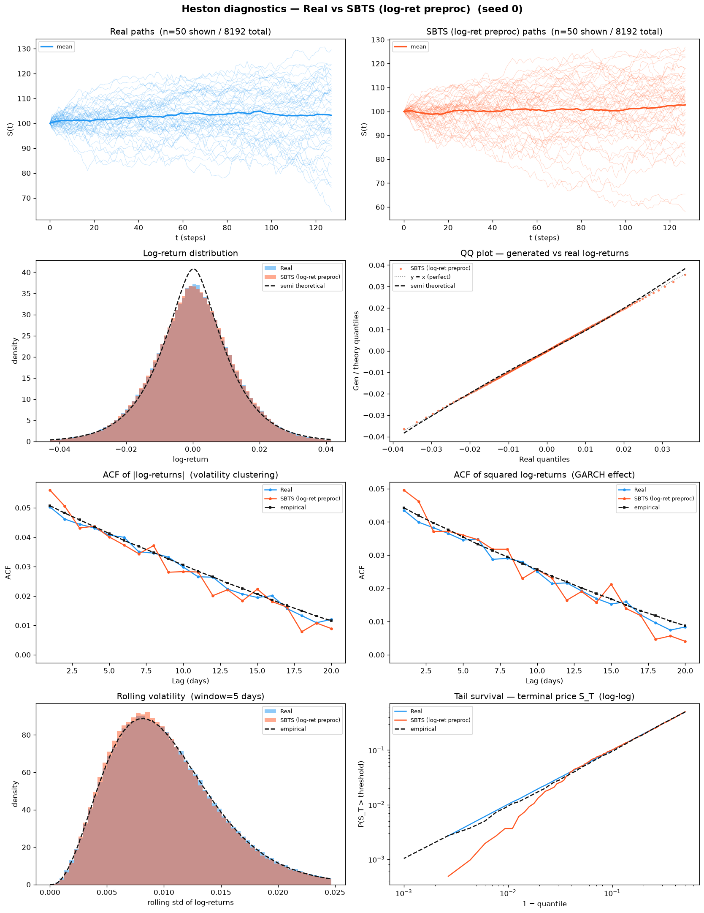

---

## No training loss — generation cost (5 seeds)

SBTS is **non-parametric**: there is **no loss curve, no epoch, no optimizer, no EMA, no checkpoint**. A
"seed" is a fresh generation Brownian RNG draw over the fixed seed-0 empirical kernel — there is nothing to
converge. What replaces the training-loss section is the **wall-clock generation cost**: building 4 096
paths of length 128 from the Schrödinger-bridge kernel.

| seed | mode | n_generated | n_workers | elapsed (s) |
|-----:|------|------------:|----------:|------------:|
| 0 | native | 4 096 | 64 | 26.34 |
| 1 | native | 4 096 | 64 | 26.43 |
| 2 | native | 4 096 | 64 | 28.08 |
| 3 | native | 4 096 | 64 | 26.55 |
| 4 | native | 4 096 | 64 | 26.29 |

**~26-28 s per 4 096-path seed on 64 CPU workers, no GPU.** Author kernel hyperparameters:
bandwidth `h = 0.05`, `K = 20` bridge mixture components, `N_pi = 50` inner Sinkhorn iterations,
`dt = 1/250`. Contrast with the DDPM/VAE methods in this folder, which need ~200 GPU-epochs per seed.

---

## A18, Discriminative Classifier Training Loss

BCE loss during GRU and MLP classifier training (2 000 steps, logged every 50). A value near
ln(2) ≈ 0.693 means the classifier cannot distinguish real from fake. On SBTS the loss sits close to
ln 2 for most seeds (A18 GRU 0.0015–0.051), with **seed 2 the lone GRU outlier** (0.051) that inflates
the A18-GRU mean and its std; seed 4 is essentially indistinguishable (A18 GRU 0.0015).

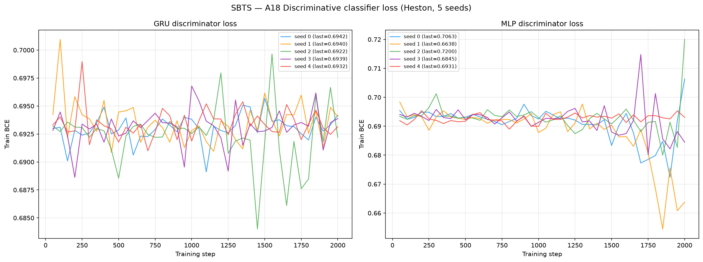

---

## A19, Predictive Score Training Loss (TSTR)

MAE loss during GRU and MLP predictor training on *synthetic* data (5 000 steps, logged every 100).

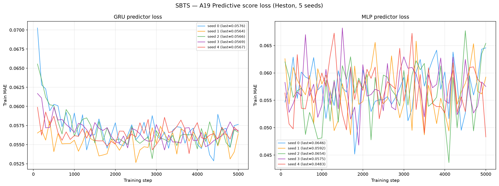

---

## Path Shadowing — strict paper protocol (arXiv:2308.01486)

> This section uses the **exact protocol from the paper**, *not* the simplified `methods/` reference eval
> (65D murex embedding, K=77, prefix-price L2, CRPS/MAE/RMSE only). See
> [`../GUIDELINE.md` §9 + M7](../GUIDELINE.md). The paper's Current Experimental Configuration
> (§4) fixes **K = 256** neighbours, 512 held-out prefixes, prefix = 64 increments, horizon 32,
> bank sizes {4 096 … 1 000 000}, 2 000 bootstrap replicates — all matched here.

Each real ps-split prefix (65 points → 64 log-returns) is embedded with the **4-block weighted,
frozen-reference-standardized** feature vector — recent returns (last 32, w1.0) · cumulative path
(downsampled 24, w0.5) · rolling vol (windows 5/10/20 last/mean/std, w2.0) · dependence (ACF of
`|r|` & `r²` at lags 1,2,5,10, w1.0). Each block is **dimension-normalized** (per-feature weight
`w_block/d`) and standardized against **frozen μ/σ computed once on the real Heston test set**
(`heston_S_test_4096x128`, model-independent, held fixed across the whole sweep):
`z̃ = √(w/d)·(z−μ_ref)/σ_ref`. Retrieve **K = 256** nearest bank paths; their futures give the
predictive ensemble for three return-based quantities. Per arXiv:2308.01486 §2/§3.1/§3.3 the
**cumulative return** and **one-step return** are evaluated as **H-dimensional trajectories over the
horizon offsets u = 1…H** (RMSE/CRPS/coverage/width averaged over all future times, not a single
terminal point); **horizon RV** is the scalar `√Σr²`. Split `s = 64`, horizon `H = 32`, **512**
independent query paths (seed 3). Metrics per quantity: predictive-mean RMSE, CRPS (energy),
coverage 50/90, band width 50/90, lower/upper-90 miss — each with a **2000-resample paired bootstrap
95% CI over the 512 query paths** (single fixed resample-index matrix, `boot_seed=20230814`, shared
across all bank sizes / quantities / references).

**Three references, one protocol.** The same retrieval+forecast pipeline is run against three banks,
all sliced as **nested prefixes** over the sweep {4096, 16384, 65536, 262144, 1 000 000}:

- **SBTS** — the generator under test. One shared 1M bank from the seed-0 SBTS kernel
  (`path_shadowing/bank/generated_bank_seed0_1000000x128.npy`, ~1.0 GB, Git LFS; generated in
  5 224.6 s ≈ 87 min at 80 CPU workers).
- **Heston oracle (ceiling, §6)** — a fresh 1M bank drawn from the *true* Heston law (identical SDE
  parameters as the test set; independent seed 777). This is the best any path-shadowing predictor can
  achieve. **SBTS's gap to the oracle = generator law-mismatch; the oracle's own residual error =
  irreducible retrieval limit at finite bank size.**
- **Random-walk (floor)** — resamples each query's own prefix returns (no cross-path information).

> **Deviations from literal §1.1, deliberate (see [`../GUIDELINE.md` §9.6](../GUIDELINE.md)):**
> (a) per-block **dimension normalization** — per-feature weight `w_block/d`, multiplier `√(w_block/d)`;
> §1.1 uses `√w_b` with no `/d`. (b) **frozen-reference standardization** — μ/σ fixed once on the
> real test set; §1.1 standardizes with each candidate bank's own μ/σ. Both decouple the metric from
> the generator and keep SBTS / oracle / RW on one comparable scale. **§5.1 eligibility gates: N/A** —
> SBTS is a single fixed non-parametric law, no checkpoint selection, no per-generator gating.
> **Comparison arms vs the doc §4** (*source · MP-corrected generator · Heston oracle*): **SBTS is a
> single fixed standalone candidate law** — there is **no source→MP-corrected pair** (no MP-correction
> step in this experiment), so §5.1/§5.2 selection & CRN-pairing do not apply. The **Heston oracle** is
> the §4/§6 ceiling. The **random-walk floor is an extension beyond §4** (kept to separate a retrieval
> limit from a generator-law mismatch). **Coverage quantiles** use `np.percentile` **type-7 linear**; a
> perfectly calibrated K=256 draw yields cov50 ≈ 0.50 / cov90 ≈ 0.89 under type-7, so the coverage
> read-outs are genuine signal, not an interpolation artefact — see [`../GUIDELINE.md` §9.7](../GUIDELINE.md).

<!-- PS-PDF-TABLE-START -->
All numbers are at the full **1 000 000-path bank** (log-return scale; lower is better except
coverage, whose target is the nominal level 0.50 / 0.90). Brackets are **95% bootstrap CIs over the
512 query paths** (2 000 resamples, `boot_seed = 20230814`) — the random-walk floor is bootstrapped
on the same resamples as everything else, so all three columns carry CIs. cum/step are
**horizon-averaged over u = 1…H**. Every cell is generated by `../render_method_ps.py` from the same
JSON leaves as the cross-method tables in the parent README (GUIDELINE 10.2 — do not hand-edit).

**RMSE convention.** For query `q` and horizon step `u`, write
`se_{q,u} = (mean_k Ŷ_{q,u,k} − y_{q,u})²` and `se_q = (1/H) Σ_u se_{q,u}`. cum/step report the
**textbook** aggregation `RMSE = √( (1/m) Σ_q se_q )`, root taken *last*. For the scalar **rv**
quantity H = 1, so the inner mean collapses and the two possible aggregations of the same 512-vector
of errors `e_q` become two genuinely different, standard statistics — **both** are listed:

$\text{MAE}=\frac{1}{m}\sum_{q=1}^{m}\lvert e_q\rvert \qquad\qquad \text{RMSE}=\sqrt{\frac{1}{m}\sum_{q=1}^{m} e_q^{2}}$

† The rv RMSE row is bolded and its winner named, but it is **not counted** in the 18-row win total
of the parent README's cross-method tables: ranking two norms of one error vector would double-count
rv against cum and step.

**Cumulative return (trajectory, u = 1…H)** — SBTS+logret vs Heston-oracle ceiling vs RW floor

| metric | SBTS+logret | Heston oracle | RW floor |
|--------|:----------:|:-------------:|:--------:|
| RMSE (textbook) | 0.05523 [0.05169, 0.05872] | **0.04911** [0.04599, 0.05209] | 0.05670 [0.05332, 0.05993] |
| CRPS | 0.03179 [0.02983, 0.03379] | **0.02525** [0.02380, 0.02668] | 0.02946 [0.02778, 0.03112] |
| coverage 50 | 0.3001 [0.2778, 0.3228] | **0.4891** [0.4658, 0.5133] | 0.4719 [0.4456, 0.4999] |
| coverage 90 | 0.6575 [0.6317, 0.6838] | **0.8941** [0.8776, 0.9103] | 0.8553 [0.8359, 0.8746] |
| width 50 | 0.04003 [0.03775, 0.04249] | 0.05719 [0.05587, 0.05841] | 0.06286 [0.06169, 0.06405] |
| width 90 | 0.09761 [0.09405, 0.1012] | 0.1465 [0.1432, 0.1494] | 0.1520 [0.1490, 0.1548] |
| lower-miss 90 | 0.1738 [0.1522, 0.1954] | **0.05463** [0.04254, 0.06787] | 0.08331 [0.06781, 0.09924] |
| upper-miss 90 | 0.1687 [0.1445, 0.1904] | **0.05127** [0.03924, 0.06366] | 0.06134 [0.04724, 0.07605] |

**One-step return (trajectory, u = 1…H)**

| metric | SBTS+logret | Heston oracle | RW floor |
|--------|:----------:|:-------------:|:--------:|
| RMSE (textbook) | 0.01421 [0.01382, 0.01462] | **0.01244** [0.01210, 0.01282] | 0.01253 [0.01218, 0.01290] |
| CRPS | 0.008688 [0.008405, 0.008976] | **0.006750** [0.006553, 0.006961] | 0.006874 [0.006680, 0.007082] |
| coverage 50 | 0.3082 [0.2944, 0.3223] | 0.4816 [0.4705, 0.4934] | **0.5157** [0.5029, 0.5283] |
| coverage 90 | 0.6479 [0.6302, 0.6658] | 0.8864 [0.8791, 0.8936] | **0.8866** [0.8784, 0.8943] |
| width 50 | 0.01071 [0.01027, 0.01117] | 0.01449 [0.01416, 0.01480] | 0.01602 [0.01566, 0.01637] |
| width 90 | 0.02568 [0.02498, 0.02641] | 0.03815 [0.03738, 0.03886] | 0.03968 [0.03895, 0.04039] |
| lower-miss 90 | 0.1762 [0.1661, 0.1864] | **0.05725** [0.05261, 0.06213] | 0.05933 [0.05426, 0.06445] |
| upper-miss 90 | 0.1758 [0.1660, 0.1859] | 0.05634 [0.05249, 0.06036] | **0.05408** [0.04950, 0.05884] |

**Horizon realized vol (scalar) — the diagnostic quantity**

| metric | SBTS+logret | Heston oracle | RW floor |
|--------|:----------:|:-------------:|:--------:|
| MAE | 0.01541 [0.01438, 0.01645] | **0.01291** [0.01213, 0.01380] | 0.01509 [0.01415, 0.01599] |
| RMSE (true, root-last)† | 0.01972 [0.01845, 0.02100] | **0.01625** [0.01523, 0.01732] | 0.01876 [0.01764, 0.01984] |
| CRPS | 0.01241 [0.01153, 0.01333] | **0.009143** [0.008611, 0.009735] | 0.01168 [0.01085, 0.01248] |
| coverage 50 | 0.2930 [0.2559, 0.3320] | **0.4727** [0.4277, 0.5137] | 0.2344 [0.1973, 0.2715] |
| coverage 90 | 0.6641 [0.6250, 0.7051] | **0.9238** [0.9004, 0.9453] | 0.5332 [0.4922, 0.5762] |
| width 50 | 0.01493 [0.01398, 0.01594] | 0.02217 [0.02190, 0.02241] | 0.01202 [0.01175, 0.01231] |
| width 90 | 0.03608 [0.03469, 0.03751] | 0.05411 [0.05350, 0.05473] | 0.02873 [0.02811, 0.02937] |
| lower-miss 90 | 0.1328 [0.1035, 0.1622] | **0.02930** [0.01562, 0.04492] | 0.2891 [0.2480, 0.3301] |
| upper-miss 90 | 0.2031 [0.1699, 0.2383] | **0.04688** [0.02930, 0.06641] | 0.1777 [0.1445, 0.2109] |

**Reading it — SBTS *fails* path shadowing, and this is the mirror-image of its A/B dominance.** At the
full 1M bank SBTS is **worse than the naive random-walk floor on every quantity's CRPS** — cum 0.0318 vs
RW 0.0295 vs oracle 0.0252; step 0.00869 vs 0.00687 vs 0.00675; RV 0.0124 vs 0.0117 vs 0.00914 — with
**coverage collapsing far below nominal** (cum cov90 0.657 vs the oracle's 0.894) and **bands roughly a
third too narrow** (cum width90 0.0976 vs 0.1465). The symmetric lower/upper-miss (0.174 / 0.169) shows
the forecast band is not shifted but **too tight**: SBTS's conditional distribution is **under-dispersed**.
Because the **oracle is well-calibrated on the identical retrieval pipeline**, this is **not** a retrieval
limit — it is a **generator law-mismatch**. SBTS's Schrödinger-bridge kernel bootstrap reproduces the
*marginal* return law beautifully (its A/B block above) but **collapses the conditional variance** of
continuations given a prefix.

**Bank-size sweep — CRPS by quantity (SBTS above, Heston oracle below; nested prefixes)**

| bank size | cum SBTS / ORC | step SBTS / ORC | RV SBTS / ORC | uniq-frac (SBTS) | prefix dist (SBTS, mean) |
|----------:|:--------------:|:---------------:|:-------------:|:---------------:|:------------------------:|
| 4 096     | 0.02544 / 0.02539 | 0.00681 / 0.00677 | 0.01010 / 0.00978 | 0.998 | 1.952 |
| 16 384    | 0.02610 / 0.02535 | 0.00693 / 0.00676 | 0.01009 / 0.00951 | 0.956 | 1.784 |
| 65 536    | 0.02768 / 0.02524 | 0.00730 / 0.00675 | 0.01058 / 0.00933 | 0.734 | 1.656 |
| 262 144   | 0.02987 / 0.02524 | 0.00801 / 0.00675 | 0.01155 / 0.00926 | 0.344 | 1.560 |
| 1 000 000 | 0.03179 / 0.02525 | 0.00869 / 0.00675 | 0.01241 / 0.00914 | 0.115 | 1.491 |

**This is the smoking gun. SBTS degrades *monotonically* as the bank grows, while the oracle is flat.**
At 4 096 paths SBTS sits *on* the oracle (cum 0.02544 vs 0.02539) and clears the RW floor — but every
CRPS climbs with bank size (cum +25%, step +28%, RV +23% from 4k→1M) while the oracle's stay flat to
<0.5%. The mechanism is visible in the last two columns: as the bank grows the **mean prefix distance
shrinks** (1.952 → 1.491) and the **unique-candidate fraction collapses** (0.998 → 0.115) — **identically
for SBTS and the oracle** (oracle uniq 0.119, dist 1.451 at 1M). So retrieval mechanics are matched; what
differs is the *content* of the retrieved continuations. A bigger bank finds **tighter prefix matches**,
whose K=256 neighbours share nearly the same recent history; for the true Heston law those continuations
still carry the correct conditional spread (oracle stays calibrated), but **SBTS's continuations collapse
to a too-narrow band** — better retrieval hands SBTS a *more confidently wrong* forecast. The generator's
under-dispersion is *masked* at small banks (loose matches inject spurious diversity) and *exposed* at
large banks.

**Diagnostics (1M bank) — SBTS / oracle**

| terminal (h=H) MAE | prefix dist mean/median/p95 | unique-cand frac | RV mean bias |
|:-------------------:|:---------------------------:|:----------------:|:------------:|
| 0.0591 / 0.0525 | 1.491 / 1.449 / 2.059 | 0.115 / 0.119 | −0.00278 / −0.00198 |

Terminal (h=H) **MAE** 0.0591 is a genuine single-horizon diagnostic, **distinct** from the
horizon-averaged cumulative RMSE 0.05523. It is a *mean absolute* error — the driver computes it as
`mean_q |·|` (`path_shadowing_pdf.py`), so despite the JSON key still being named `terminal_rmse` it
is the h = H analogue of the rv MAE row above, **not** the textbook RMSE. SBTS's RV mean bias (−0.00278) is only ~1.4× the oracle's
(−0.00198) — the bias is *small*; the failure is **dispersion, not location** (the collapsed bands, not a
shifted mean). Full **2000-resample bootstrap 95% CIs** on every metric for SBTS and the oracle are in
`path_shadowing/pdf_summary.json`.
<!-- PS-PDF-TABLE-END -->

Driver: [`path_shadowing/path_shadowing_pdf.py`](path_shadowing/path_shadowing_pdf.py)
(bank builder: [`path_shadowing/gen_bank_sbts.py`](path_shadowing/gen_bank_sbts.py)).
Plots: 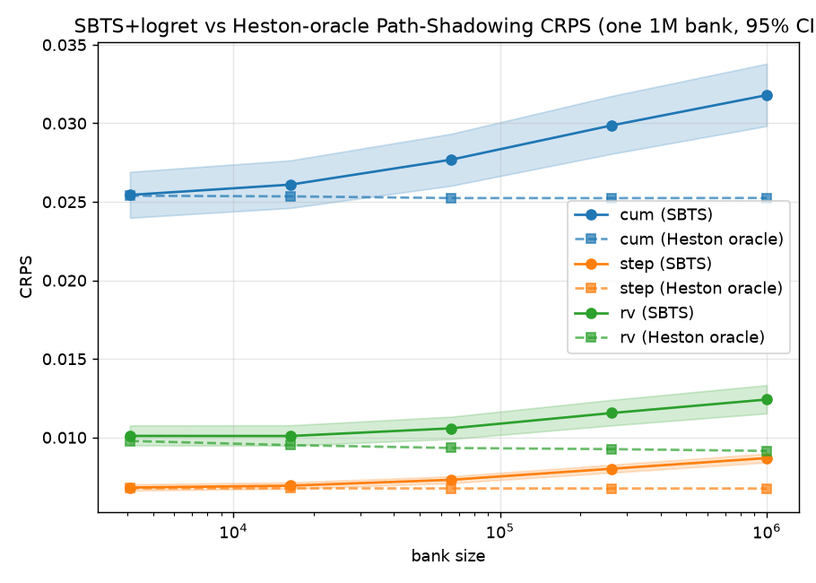
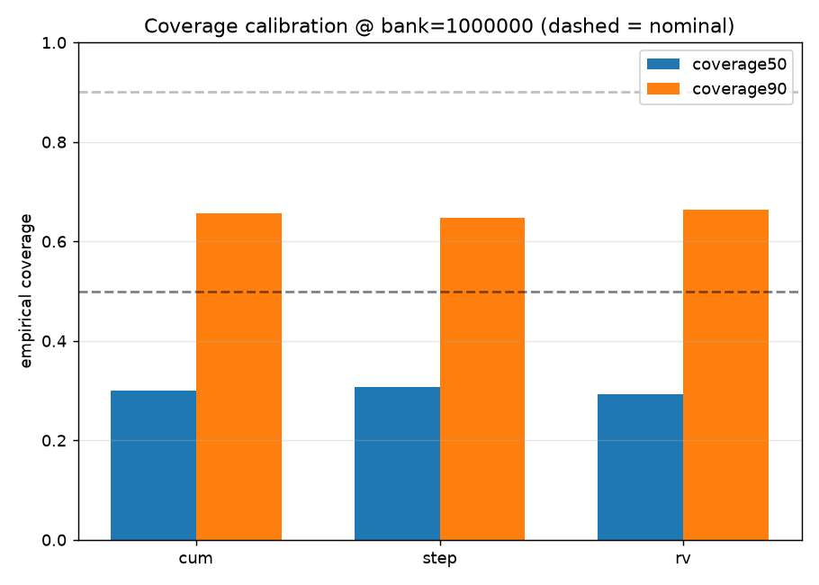

---

## File layout

```
results/Heston/preprocessing_with_log_returns/SBTS/
├── README.md                          ← this file
├── metrics_summary.csv                mean ± std + per-seed, all A + B + grid_tvd
├── seed_{0..4}_metrics.json           full per-seed metric dict
├── generated_paths/seed_{0..4}/       generated_paths_4096x128.npy + metadata.json
├── losses/
│   └── generation_time.csv            seed, mode, n_generated, n_workers, elapsed_sec (no loss — non-parametric)
├── seed_{i}_disc_{gru,mlp}_loss.csv   A18 classifier BCE curves
├── seed_{i}_pred_{gru,mlp}_loss.csv   A19 predictor MAE curves
├── plots/
│   ├── heston_diagnostics.png         8-panel stylised-facts diagnostic (seed 0)
│   ├── disc_classifier_loss.png       A18 GRU+MLP BCE (5 seeds)
│   ├── pred_score_loss.png            A19 GRU+MLP MAE (5 seeds)
│   └── seed_{i}_pca.png / _tsne.png   2-D real-vs-fake latent projections per seed
├── code/
│   ├── generate_sbts_logret.py        native SBTS log-return kernel + inverse
│   ├── compute_metrics_logret.py      metrics runner (4096-path)
│   └── make_plots.py                  diagnostics / loss / latent plots
├── baseline_no_preproc/               matched raw-price control (seed 0, global standardize)
└── path_shadowing/                    STRICT paper-protocol PS evaluator (arXiv:2308.01486)
    ├── path_shadowing_pdf.py          4-block embedding, K=256, bank-size sweep, bootstrap CIs
    ├── gen_bank_sbts.py               1M-bank builder (seed-0 SBTS kernel, 80 workers)
    ├── bank/                          generated_bank_seed0_1000000x128.npy (~1.0 GB, Git LFS)
    ├── pdf_summary.json               all metrics + 95% bootstrap CIs
    └── plots/pdf_*.png                sweep + calibration plots
```

## Reproduce

```bash
PY=/home/tbasseras/sbts-venv/bin/python           # native SBTS (numba kernel, CPU only)
GPU_PY=/home/tbasseras/gpu-venv/bin/python         # metrics / plots / PS evaluator
cd /home/tbasseras/benchmark/results/Heston/preprocessing_with_log_returns/SBTS

# Generate all 5 seeds (native log-return kernel; CPU, 64 workers, ~26 s/seed)
for s in 0 1 2 3 4; do
  OMP_NUM_THREADS=64 $PY code/generate_sbts_logret.py --seed $s --n 4096 --workers 64
done

# Metrics (all seeds, 4096-path test set)
$GPU_PY code/compute_metrics_logret.py --seeds 5
$GPU_PY code/make_plots.py

# Strict path shadowing (build the ONE 1M bank — 80 workers, ~87 min — then evaluate)
OMP_NUM_THREADS=80 $PY path_shadowing/gen_bank_sbts.py --seed 0 --n 1000000 --workers 80
$GPU_PY path_shadowing/path_shadowing_pdf.py > path_shadowing/logs/pdf_run.log 2>&1
```

---

## Preprocessing (the SBTS log-return transform)

Unlike CSDI/LS4, SBTS is **natively** a log-return generator — the transform below is not a retro-fit, it
is the method. The kernel operates on volatility-scaled log-returns and the paths are reconstructed by the
anchored cumulative-exp:

```python
DT, S0 = 1.0/250.0, 100.0
R        = np.log(S[:, 1:] / S[:, :-1])          # (M,127) log-returns
sigma    = float(R.std())                         # pooled ddof=0, seed-0 kernel, frozen
R_tilde  = R * np.sqrt(DT) / sigma                # std -> sqrt(DT) = 0.063246
X_sbts   = np.hstack([np.zeros((M,1)), R_tilde])  # (M,128) dummy-0 column prepended
# --- Schrödinger-bridge kernel bootstrap on X_sbts (h=0.05, K=20, N_pi=50) ---
```

Inverse (generation → price), SBTS de-scaling then the cumulative-exp anchored at S₀ = 100:

```python
R_gen = X_sbts_g[:, 1:] * sigma / np.sqrt(DT)     # undo SBTS scaling -> raw log-returns
Xg = np.empty_like(X_sbts_g); Xg[:, 0] = S0
Xg[:, 1:] = S0 * np.exp(np.cumsum(R_gen, axis=1)) # price space, anchored at 100
```

**Reported SBTS sigma (frozen, shared with the CSDI/LS4 log-return runs):** `sigma = 0.01263163`
(estimated on the 4 096-path seed-0 kernel, ddof=0, pooled over all M×127 raw log-returns). After scaling,
`R̃.std() = √dt = 0.063246`.

**Method:** non-parametric Schrödinger-bridge kernel, author hyperparameters `h = 0.05`, `K = 20`,
`N_pi = 50`, `dt = 1/250`. **No parameters are trained, no GPU.** **Dataset:** 4 096 Heston paths (the
main benchmark [`../../SBTS/`](../../SBTS/README.md) uses 8 192; this experiment uses 4 096 for
train/test/disc, see [`../README.md`](../README.md)). Parameters: μ=0.05, κ=2.0, θ=0.04, ξ=0.3,
ρ=−0.7, S₀=100, v₀=0.04, dt=1/250.

---

## Results — does log-return preprocessing help SBTS?

**Verdict: decisively yes — and *without* the drift tax that broke CSDI and LS4.** For a raw-price kernel
the cumulative-exp reconstruction is the enemy; for SBTS it is native, so the log-return parametrization
recovers the full stylised-fact block **and** keeps the terminal-price cloud in place. The reference below
is the matched **raw-price baseline** ([`baseline_no_preproc/`](baseline_no_preproc/), seed 0, 4 096
paths). **Δ**: ✅ log-return better, ❌ worse, ≈ negligible.

> **The (non-)drift, quantified.** Terminal-price mean — real test set **102.173**, SBTS+logret **102.077
> (−0.094 %)**, raw-price SBTS **102.715 (+0.530 %)**. SBTS's log-return kernel introduces **essentially no
> per-step mean-return bias**, so the `cumsum → exp` reconstruction stays anchored — the exact opposite of
> CSDI+logret's +3.25 % blow-up. This is why SBTS+logret keeps A13 / A17 / A25 / grid_tvd **and** wins the
> stylised facts, a clean sweep no other log-return method in this folder achieves.

| Metric | SBTS + logret (seed 0) | Raw-price SBTS (seed 0) | Δ |
|--------|--------------------:|--------------------:|---|
| A9 Volatility MMD ↓ | 0.01568 | 0.04675 | ✅ |
| A14 KS Log-returns ↓ | 0.002455 | 0.007772 | ✅ |
| A17 Terminal Price KS ↓ | 0.01392 | 0.04004 | ✅ |
| A18 Disc Score GRU ↓ | 0.01129 | 0.02837 | ✅ |
| A25 Mean RMSE ↓ | 0.09637 | 0.5416 | ✅ |
| A26 Return Std Error ↓ | 0.01698 | 0.03491 | ✅ |
| A31 Rolling Vol KS ↓ | 0.0132 | 0.02182 | ✅ |
| A32 Vol-of-Vol Error ↓ | 9.22e-05 | 1.13e-04 | ✅ |
| **grid_tvd (path cloud) ↓** | 5.30 % | 11.48 % | ✅ |
| A28 Kurtosis Ratio (→1) | 1.114 (\|Δ\|=0.114) | 1.075 (\|Δ\|=0.075) | ❌ |
| A33 Teacher-Sigma Corr ↑ | −0.01637 | 0.001906 | ❌ |

**Scoreboard: log-return preprocessing wins essentially everything.** Across the full metric set the
log-return kernel takes **34 of 36 A-metric rows and 9 of 9 B curve-shape rows**; the only two raw wins are
A28 (kurtosis ratio, both within 0.11 of 1.0 — near-noise) and A33 (teacher-σ correlation, both ≈ 0, the
per-path latent vol is unrecoverable from prices for either transform). Unlike CSDI/LS4, **there is no
location tax** — the raw baseline's grid_tvd (11.48 %) is more than *double* the log-return kernel's
(5.30 %), because a raw-price kernel bootstrapping standardized prices smears the terminal cloud while the
log-return kernel keeps it anchored.

- **Facts recovered.** A raw-price kernel never sees returns, so it cannot match their autocorrelation,
  vol-of-vol or fat tails; the native log-return transform fixes this decisively (A9 −66 %, A31 −40 %,
  A32 −18 %, A14 −68 %).
- **Location kept, not broken.** Because SBTS's cumulative-exp carries no drift, A13/A17/A25 and grid_tvd
  *also* improve — the log-return kernel is strictly better on both axes.
- **A33 stays ≈ 0** — the per-path latent vol is unrecoverable from prices; the preprocessing does nothing
  for it (as in CSDI/LS4).

**Path shadowing is judged separately** (Section above) and tells the **opposite** story: on the
*conditional* forecasting task SBTS's kernel collapses the continuation variance and falls **below the
random-walk floor**. SBTS is the best *unconditional/marginal* generator in this folder and the worst
*conditional* shadower — the exact inverse of CSDI, which drifts on the marginal but sits on the oracle
conditionally.

### Latent projections (per seed)

PCA and t-SNE 2-D projections, real (test seed 1) vs generated. Unlike CSDI/LS4 there is **no consistent
real/fake offset** — the SBTS clouds overlap the real cloud in the terminal-heavy PCA directions across all
five seeds, the visual counterpart to the low A17 / grid_tvd.

| Seed 0 | Seed 1 | Seed 2 | Seed 3 | Seed 4 |
|--------|--------|--------|--------|--------|
| 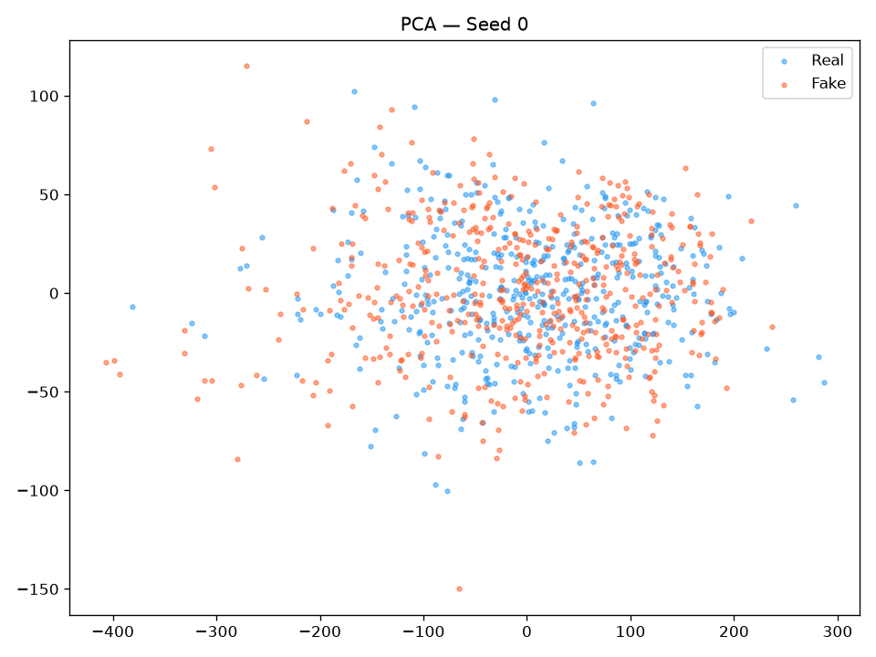 | 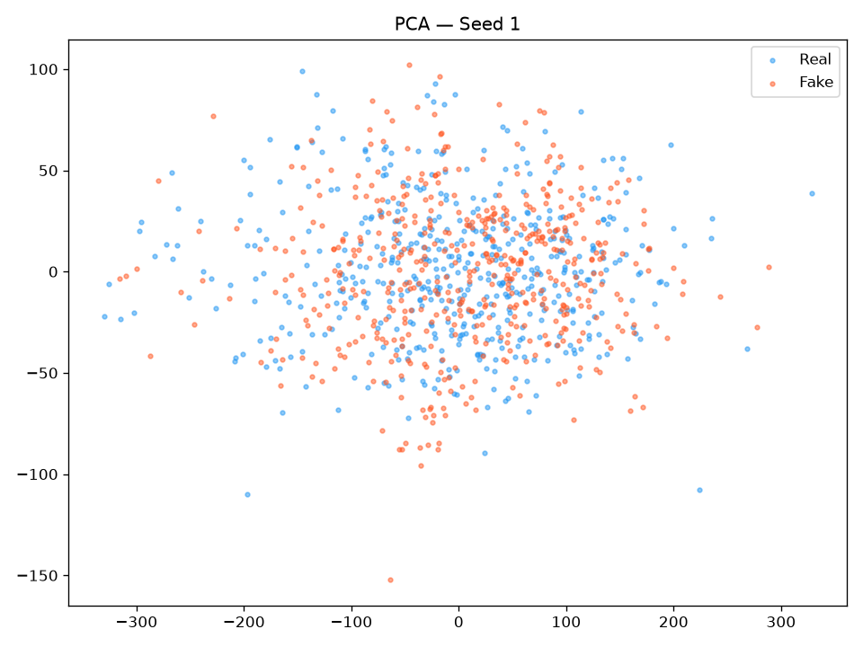 | 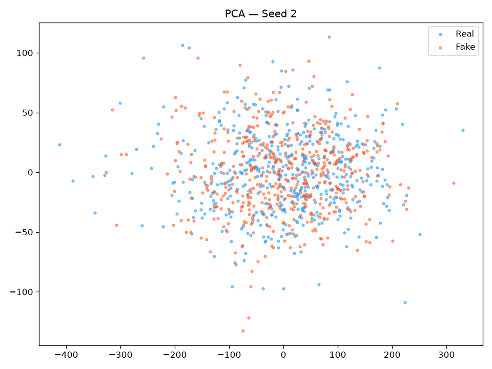 | 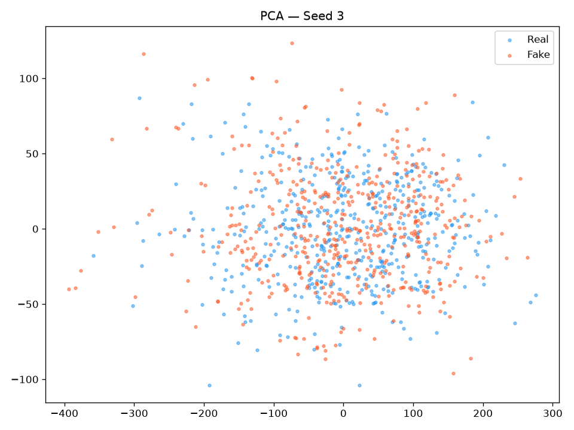 | 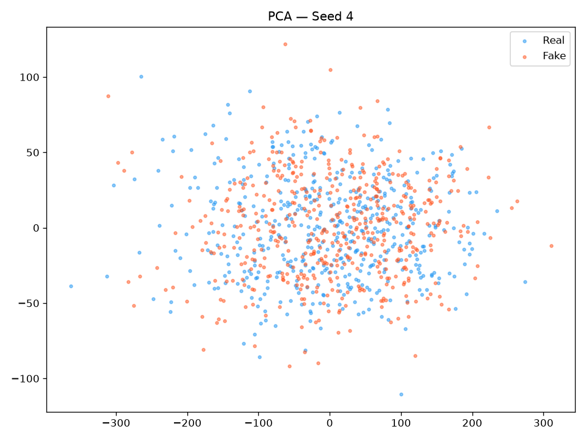 |
| 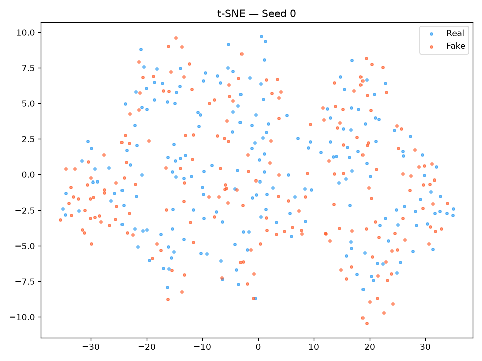 | 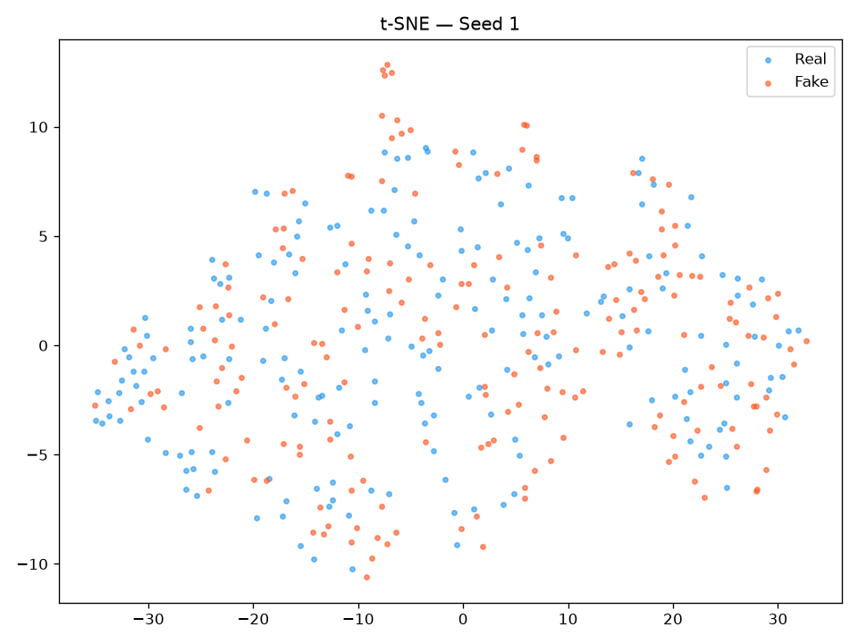 | 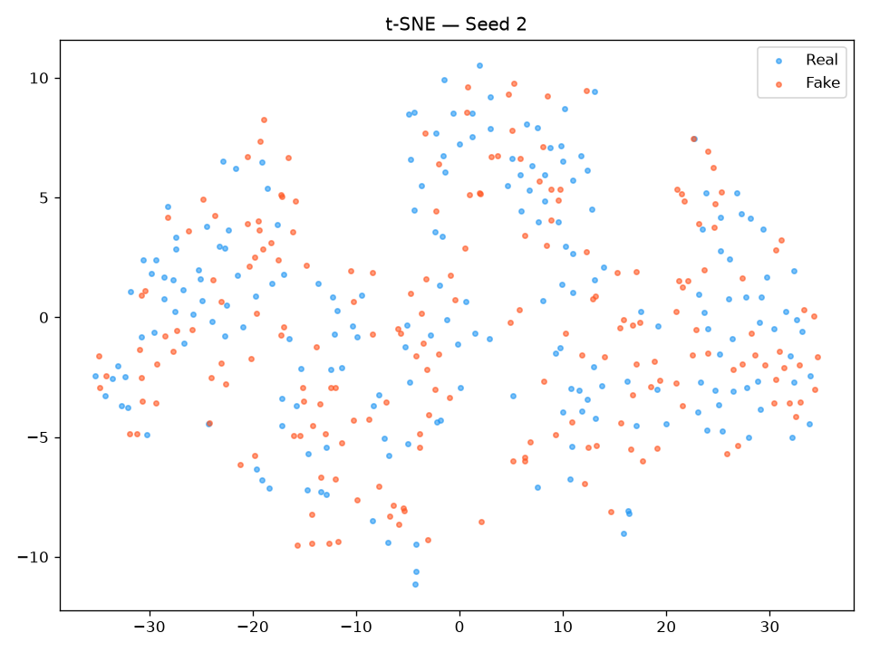 | 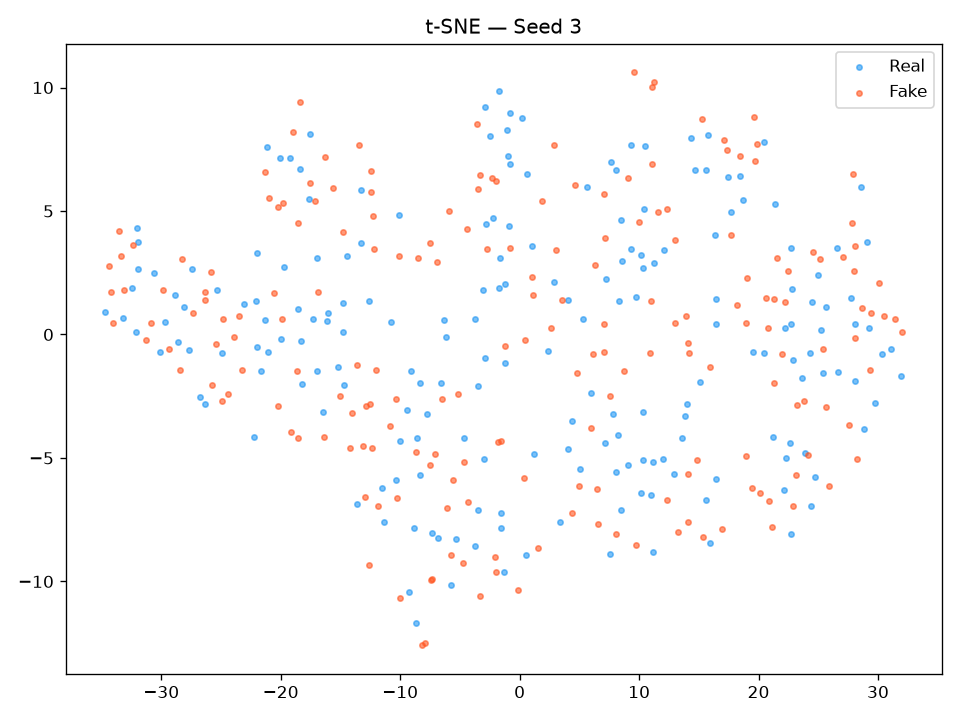 | 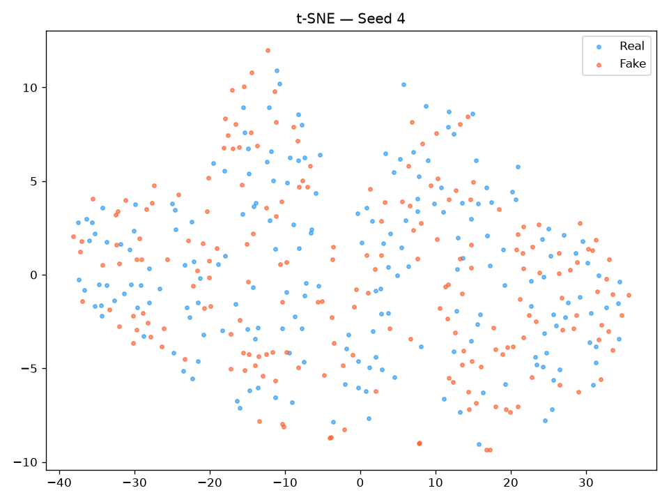 |

## Head-to-head control — preprocessing vs **none**, same 4096-path budget (seed 0)

Both columns are **seed 0** at **4 096 paths** — the *identical* SBTS kernel and generation RNG, with
**only the input transform changed**: the native volatility-scaled log-return transform (with) vs a plain
global price standardize `(S−μ)/σ` (μ = 101.366, σ = 9.903) decoded straight back to price, no log-return,
no cumsum, no exp (raw). This is the only clean A/B for the preprocessing's effect (GUIDELINE §7.1). Δ% is
relative to no-preproc; for lower-better metrics **negative Δ% = preprocessing wins**.

**Verdict: a clean sweep for log-returns.** Unlike CSDI (mixed, drift tax) the log-return transform wins
**every block** — volatility/vol-of-vol, return marginal, tails, price location and the path cloud — with
no metric where the raw kernel meaningfully leads except the near-noise A28/A33.

### A-metrics (seed 0, 4096 both sides; ↓ lower-better unless noted)

| A-metric | logret (with) | raw (no-preproc) | Δ% | Winner |
|----------|-------------:|-----------------:|----:|:------:|
| A1 kurtosis error ↓ | 0.0572 | 0.06164 | -7.2% | **logret** |
| A5 Hill tail-index error ↓ | 3.093 | 4.730 | -34.6% | **logret** |
| A6 path MMD² ↓ | 0.001994 | 0.005086 | -60.8% | **logret** |
| A7 terminal MMD² ↓ | 0.001335 | 0.005589 | -76.1% | **logret** |
| A8 increment MMD² ↓ | 0.00135 | 0.002312 | -41.6% | **logret** |
| A9 volatility MMD ↓ | 0.01568 | 0.04675 | -66.5% | **logret** |
| A10 terminal SWD ↓ | 0.7142 | 1.397 | -48.9% | **logret** |
| A11 path SWD ↓ | 0.5104 | 1.027 | -50.3% | **logret** |
| A12 RV-law loss ↓ | 0.1448 | 0.3107 | -53.4% | **logret** |
| A13 mean-path RMSE ↓ | 0.2569 | 0.289 | -11.1% | **logret** |
| A14 KS logreturns ↓ | 0.002455 | 0.007772 | -68.4% | **logret** |
| A17 terminal KS ↓ | 0.01392 | 0.04004 | -65.2% | **logret** |
| A18 disc score GRU ↓ | 0.01129 | 0.02837 | -60.2% | **logret** |
| A19 pred score GRU (TSTR) ↓ | 0.05639 | 0.05643 | -0.1% | **logret** |
| A20 coverage error ↓ | 4.215 | 5.917 | -28.8% | **logret** |
| A21 ACF \|r\| ↓ | 0.003005 | 0.01446 | -79.2% | **logret** |
| A22 ACF r² ↓ | 0.003544 | 0.01375 | -74.2% | **logret** |
| A25 mean RMSE ↓ | 0.09637 | 0.5416 | -82.2% | **logret** |
| A26 return-std error ↓ | 0.01698 | 0.03491 | -51.4% | **logret** |
| A27 logreturn-std error ↓ | 1.67e-04 | 3.81e-04 | -56.2% | **logret** |
| A28 kurtosis ratio (→1) | 1.114 (\|Δ\|0.114) | 1.075 (\|Δ\|0.075) | — | raw |
| A30 vol-path RMSE ↓ | 0.2728 | 0.7122 | -61.7% | **logret** |
| A31 rolling-vol KS ↓ | 0.0132 | 0.02182 | -39.5% | **logret** |
| A32 vol-of-vol error ↓ | 9.22e-05 | 1.13e-04 | -18.4% | **logret** |
| A33 teacher-σ corr ↑ | −0.01637 | 0.001906 | — | raw |
| A34 teacher-σ RMSE ↓ | 0.1006 | 0.101 | -0.4% | **logret** |

### B curve-shape (seed 0; funct MSE, %err, + grid_tvd; ↓ lower-better)

| B-metric | logret (with) | raw (no-preproc) | Δ% | Winner |
|----------|-------------:|-----------------:|----:|:------:|
| B log-ret hist MSE ↓ | 0.07642 | 0.2936 | -74.0% | **logret** |
| B log-ret hist %err ↓ | 3.247 | 5.260 | -38.3% | **logret** |
| B QQ MSE ↓ | 2.95e-08 | 1.35e-07 | -78.2% | **logret** |
| B QQ %err ↓ | 1.603 | 4.366 | -63.3% | **logret** |
| B ACF \|r\| MSE ↓ | 9.84e-06 | 1.22e-04 | -91.9% | **logret** |
| B ACF \|r\| %err ↓ | 10.06 | 29.60 | -66.0% | **logret** |
| B ACF r² MSE ↓ | 1.20e-05 | 9.59e-05 | -87.5% | **logret** |
| B ACF r² %err ↓ | 14.99 | 35.22 | -57.4% | **logret** |
| grid_tvd (path cloud) ↓ | 5.30% | 11.48% | -53.8% | **logret** |

**Visual comparison — 8-panel stylised-facts diagnostic, Real vs generated, seed 0 (both 4096 paths).**
Same real test set on each side; the only difference is the input transform. The log-return kernel tightens
the return marginal, the QQ tails, the ACF panels **and** keeps the terminal cloud centred — the raw kernel
loses on every panel.

| log-return preprocessing (with) | raw price, no preprocessing |
|:-------------------------------:|:---------------------------:|
|  | 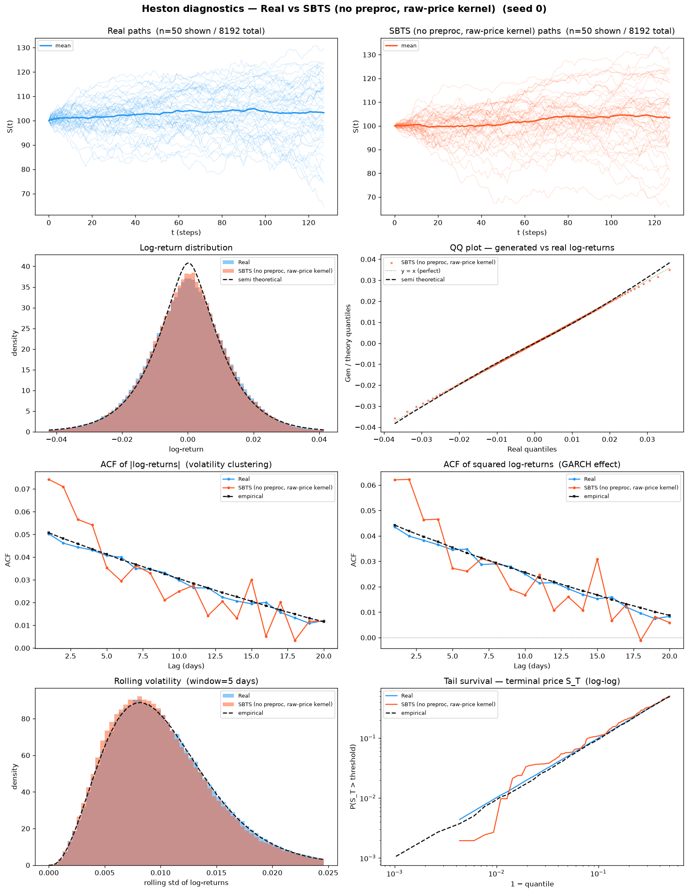 |

**Reading it straight (no cherry-picking):**
- **Preprocessing wins every block.** Volatility (A9 −67 %, A31 −40 %, A32 −18 %), return-dispersion (A26
  −51 %, A27 −56 %), tails (A5 −35 %, A14 −68 %), the return-marginal / QQ shape (B log-ret hist MSE −74 %,
  B QQ MSE −78 %) **and** price location (A17 −65 %, A25 −82 %, grid_tvd −54 %) all improve. A raw-price
  kernel cannot match the return marginal it never sees, and its standardized-price bootstrap smears the
  terminal cloud.
- **No location tax.** This is the key difference from CSDI/LS4: because SBTS's log-return reconstruction
  carries no drift, it does **not** trade stylised facts for price location — it wins both.
- **The two raw "wins" are noise.** A28 (both within 0.11 of 1.0) and A33 (both ≈ 0) are inside seed-level
  scatter; neither is a real advantage for the raw kernel.

**Bottom line — which is best?** For SBTS the log-return transform is unambiguously the right
parametrization: it is the **native method** and it wins the head-to-head on **34 of 36 A-rows and 9 of 9
B-rows** with no drift penalty. The one caveat lives entirely in **path shadowing**, where SBTS's kernel
under-disperses the conditional continuation and slips below the random-walk floor as the bank grows —
a *conditional-forecasting* weakness, orthogonal to the *unconditional* generation this table scores.

→ Experiment overview & pipeline: [`../README.md`](../README.md) ·
Recipe for adding methods: [`../GUIDELINE.md`](../GUIDELINE.md) ·
Main-benchmark SBTS: [`../../SBTS/README.md`](../../SBTS/README.md)
