# TimeDiT on Heston — SBTS log-return preprocessing

The **official TimeDiT** (Cao et al., 2024, arXiv:2409.02322) trained on **4 096** Heston
stochastic-volatility price paths (seq_len = 128), but fed the **SBTS volatility-scaled log-return
transform** in place of TimeDiT's native min-max/z-norm price input. Everything else — SDE, parameters,
RNG streams, metric code, seeds 0–4 — is held fixed against the original price-input run at
[`../../TimeDiT/`](../../TimeDiT/README.md). Preprocessing details and the head-to-head verdict are
**below the metrics** ([jump](#preprocessing-the-sbts-log-return-transform)); this top block mirrors the
canonical per-method report so the two runs are directly comparable.

> **Data split (test set everywhere).** Disjoint 4 096-path Heston draws: generator **trained on seed
> 0**; every A/B metric compares generated paths against the **test set (seed 1)**; A18 uses a **third
> real set (seed 2)** as the "real" class. No metric is scored against training data.

> **Path shadowing is evaluated on the RAW checkpoint, not this one.** The A/B verdict below is that
> log-return preprocessing **hurts** TimeDiT (raw price wins the matched control 31–3), so the single
> 1M-path scenario bank was built from the **no-preproc** checkpoint and the strict paper protocol
> (arXiv:2308.01486) was run on that. **No preprocessed bank exists and none was evaluated.** Results:
> [path shadowing on the raw checkpoint](#path-shadowing--strict-paper-protocol-arxiv230801486-on-the-raw--no-preproc-checkpoint).
> It ships in the cross-method PS table in [`../README.md`](../README.md) as **`TimeDiT (raw)`**, where it
> is the **best generator in the folder — 14 of 18 ranked rows at every one of the five bank sizes**.

---

## Metrics A1-A34 + B, mean ± std across 5 seeds

> All metrics on **log-returns** $r_t = \log(S_{t+1}/S_t)$ unless noted. A26 uses price increments $\Delta S_t$.

| Metric | Mean ± Std | Seed 0 | Seed 1 | Seed 2 | Seed 3 | Seed 4 | Perfect floor |
|--------|-----------|--------|--------|--------|--------|--------|---------------|
| **, Fat Tail, ** | | | | | | | |
| A1 Kurtosis Error ↓ | 0.5543 ± 0.03596 | 0.5672 | 0.5779 | 0.5618 | 0.4837 | 0.5807 | 0.05717 |
| A2 \|r\| q95 Error ↓ | 0.001798 ± 5.92e-04 | 0.002012 | 0.001501 | 0.001849 | 9.15e-04 | 0.002713 | 1.49e-04 |
| A3 \|r\| q99 Error ↓ | 0.003947 ± 9.89e-04 | 0.004551 | 0.003513 | 0.003885 | 0.002423 | 0.005366 | 2.40e-04 |
| A4 Tail QQ Error ↓ | 0.001797 ± 5.88e-04 | 0.002033 | 0.001532 | 0.001848 | 8.93e-04 | 0.002681 | 1.54e-04 |
| A5 Hill Tail Index Error ↓ | 4.229 ± 2.12 | 5.628 | 2.777 | 1.851 | 3.233 | 7.658 | 1.280 |
| **, Distribution, ** | | | | | | | |
| A6 Path MMD² ↓ | 0.008066 ± 0.00162 | 0.007193 | 0.009341 | 0.01057 | 0.006252 | 0.006975 | 0.001785 |
| A7 Terminal MMD² ↓ | 0.01146 ± 0.003129 | 0.01175 | 0.01408 | 0.01555 | 0.008459 | 0.007433 | 0.001252 |
| A8 Increment MMD² ↓ | 0.00179 ± 4.41e-04 | 0.001415 | 0.001428 | 0.002519 | 0.001505 | 0.002085 | 8.35e-04 |
| A9 Volatility MMD ↓ | 0.05459 ± 0.02186 | 0.03895 | 0.03672 | 0.08902 | 0.03625 | 0.07201 | 0.007665 |
| A10 Terminal SWD ↓ | 4.43 ± 1.492 | 4.293 | 6.665 | 5.454 | 3.176 | 2.56 | 0.7849 |
| A11 Path SWD ↓ | 2.351 ± 0.5392 | 2.246 | 3.228 | 2.617 | 2.014 | 1.652 | 0.5453 |
| A12 RV Law Loss ↓ | 0.6697 ± 0.1841 | 0.7402 | 0.5533 | 0.694 | 0.4065 | 0.9546 | 0.07645 |
| A13 Mean Path RMSE ↓ | 2.229 ± 1.057 | 2.468 | 3.611 | 2.964 | 1.438 | 0.6642 | 0.1839 |
| A14 KS Log-returns ↓ | 0.01469 ± 0.003612 | 0.01519 | 0.01441 | 0.02014 | 0.008758 | 0.01494 | 0.002173 |
| A15 Skewness Error ↓ | 0.06633 ± 0.007088 | 0.06339 | 0.06789 | 0.05425 | 0.07441 | 0.07171 | 0.01206 |
| A16 QQ RMSE (300-pt) ↓ | 8.23e-04 ± 2.29e-04 | 9.16e-04 | 7.90e-04 | 8.68e-04 | 4.21e-04 | 0.001122 | 8.18e-05 |
| A17 Terminal Price KS ↓ | 0.1251 ± 0.04108 | 0.1331 | 0.1719 | 0.1655 | 0.08252 | 0.07275 | 0.02139 |
| **, Adversarial, ** | | | | | | | |
| A18 Disc Score GRU ↓ | 0.0252 ± 0.02542 | 0.01007 | 0.07352 | 0.01861 | 0.02349 | 3.05e-04 | 0.007138 |
| A18 Disc Score MLP ↓ | 0.05241 ± 0.04124 | 0.1028 | 0.07474 | 0.005186 | 0.001525 | 0.07779 | 0.006284 |
| **, Predictive, ** | | | | | | | |
| A19 Pred Score GRU ↓ | 0.05641 ± 2.20e-05 | 0.05641 | 0.0564 | 0.05645 | 0.05638 | 0.05641 | 0.05638 |
| A19 Pred Score MLP ↓ | 0.05674 ± 6.88e-04 | 0.05631 | 0.05652 | 0.05811 | 0.05636 | 0.05642 | 0.05668 |
| **, Temporal, ** | | | | | | | |
| A20 Covariance Error ↓ | 47.23 ± 16.28 | 62.41 | 21.99 | 33.77 | 59.15 | 58.82 | 5.825 |
| A21 ACF \|r\| Error (lags) ↓ | 0.0101 ± 0.003114 | 0.01017 | 0.009897 | 0.01153 | 0.004671 | 0.01421 | 0.001318 |
| A22 ACF r² Error (lags) ↓ | 0.01164 ± 0.003193 | 0.01241 | 0.01084 | 0.01297 | 0.006135 | 0.01584 | 0.001394 |
| A23 ACF \|r\| Lag-1 Error ↓ | 0.01911 ± 0.004496 | 0.01964 | 0.02091 | 0.01983 | 0.01078 | 0.02437 | 9.01e-04 |
| A24 ACF r² Lag-1 Error ↓ | 0.02063 ± 0.00424 | 0.02109 | 0.02131 | 0.02062 | 0.01341 | 0.02672 | 0.001377 |
| **, Vol, ** | | | | | | | |
| A25 Mean RMSE ↓ | 3.718 ± 1.905 | 4.171 | 6.196 | 5.169 | 1.741 | 1.315 | 0.3668 |
| A26 Return Std Error ↓ | 0.0744 ± 0.03363 | 0.05928 | 0.02873 | 0.1122 | 0.05718 | 0.1146 | 0.005319 |
| A27 Log-Return Std Error ↓ | 8.63e-04 ± 2.46e-04 | 9.60e-04 | 7.09e-04 | 8.94e-04 | 5.09e-04 | 0.001242 | 7.03e-05 |
| A28 Kurtosis Ratio (→ 1) | 3.692 ± 0.3942 | 4.037 | 3.973 | 3.414 | 3.049 | 3.99 | 1.072 |
| A29 Sigma Mean Error ↓ | 0.01192 ± 0.003776 | 0.01308 | 0.009558 | 0.01295 | 0.006393 | 0.01764 | 0.001022 |
| A30 Cross-Sect. Vol Path RMSE ↓ | 1.233 ± 0.4329 | 1.597 | 0.4702 | 1.065 | 1.386 | 1.647 | 0.1684 |
| A31 Rolling Vol KS (w=5) ↓ | 0.03917 ± 0.01601 | 0.04421 | 0.02682 | 0.04142 | 0.0184 | 0.065 | 0.004939 |
| A32 Vol-of-Vol Error ↓ | 5.27e-04 ± 1.04e-04 | 5.97e-04 | 4.63e-04 | 4.97e-04 | 3.90e-04 | 6.87e-04 | 4.26e-05 |
| **, Heston Spec, ** | | | | | | | |
| A33 Teacher-Sigma Corr ↑ | 0.007498 ± 0.009589 | 0.01103 | 0.0123 | 0.01355 | -0.01161 | 0.01221 | 0.6156 |
| A34 Teacher-Sigma RMSE ↓ | 0.0947 ± 9.96e-04 | 0.0938 | 0.09432 | 0.09518 | 0.09641 | 0.09378 | 0.06560 |

> **Convention:** ↓ lower is better; ↑ higher is better;, no monotone direction. A28 Kurtosis Ratio: perfect = 1.0.
> **A1**: |kurt_real − kurt_gen| on log-returns. **A2-A3**: 95th/99th quantile error on |log-returns|. **A4**: QQ error restricted to top-5% tail quantiles. **A5**: |Hill tail index_real − Hill tail index_gen|, Hill estimator on |log-returns| above 95th pct.
> **A6-A11**: path-kernel distances, Gaussian MMD² on full paths / terminal prices / increments / realized-vol, and sliced-Wasserstein on terminal & full paths. Non-zero perfect floor (an independent Heston draw scored against the test set, finite-sample noise).
> **A12**: W₁(RV_real, RV_gen), RV_i = Σ_t r²_{i,t}/dt. **A13**: path-level RMSE between real/gen mean trajectories. **A14**: KS statistic on pooled log-returns. **A15**: |skew_real − skew_gen|, Heston true skew ≈ −0.45. **A16**: QQ RMSE over 300 uniform quantile levels. **A17**: KS statistic on terminal prices S_T.
> **A18**: Discriminative classifier trained on log-returns; score = |accuracy − 0.5|, 0 = indistinguishable, 0.5 = perfectly separable (GRU + MLP). **A19**: TSTR predictive MAE (GRU + MLP).
> **A20**: covariance-matrix error (%). **A21-A22**: ACF error on |r| and r² across lags 1-20. **A23-A24**: ACF lag-1 error on |r| and r². Heston true values ≈ +0.052 / +0.050.
> **A25**: mean-path RMSE. **A26**: return std error, uses price increments $\Delta S_t$. **A27**: log-return std error. **A28**: kurtosis ratio real/gen, perfect = 1.0. **A29**: sigma mean error, annualized per-path vol. **A30**: cross-sectional vol-path RMSE. **A31**: KS statistic on rolling-5 vol histograms. **A32**: |vol-of-vol_real − vol-of-vol_gen|.
> **A33**: Teacher-sigma correlation (Heston-recovered vol vs teacher σ), higher is better, perfect ≈ 0.614. **A34**: Teacher-sigma RMSE, perfect ≈ 0.065.

---

## B, Curve-Shape Metrics, mean ± std across 5 seeds

Each stylised-fact plot yields a **curve** L (a list of values), not a scalar. For real data (L_r) and
generated data (L_g) we build three lists, the curve L, its first finite difference L' (der), and its
second finite difference L'' (sec_der), then combine them into **one number per plot**:

- **MSE row**: for each list, dᵢ = mean((L_r − L_g)²). Reported mean = the **mean of the three sub-scores** (funct + der + sec_der)/3; std = sample std of that per-seed combined score across the 5 seeds. The **MSE row decides the cross-method winner**.
- **% err row**: dᵢ = mean(|L_g − L_r| / (|L_r| + 1e-6)) × 100, a proper MAPE on the curve L itself (funct-only); the der / sec_der MAPE is excluded because their near-zero true values explode the relative error.
- **NRMSE row**: sqrt(mean((L_g − L_r)²)) / (max|L_r| − min|L_r| + 1e-12) × 100 on the curve L only (funct-only). This is the range-normalized RMSE.
- **CVaR₉₀ / CVaR₉₅ rows**: tail-averaged pointwise curve error (Expected Shortfall) on the curve L only (funct-only). Pointwise error eₜ = |L_g(t) − L_r(t)|; for q ∈ {0.90, 0.95}, CVaR_q = mean(eₜ for eₜ ≥ the q-th percentile of eₜ), then range-normalized like NRMSE.

All ↓ lower is better. The perfect floor is **non-zero** for all six plots, it is the residual
finite-sample error of an independent Heston draw scored against the test set, identical across methods.
Five sublines per plot: **MSE**, **% error**, **NRMSE**, **CVaR₉₀** and **CVaR₉₅**.

| Plot | Measure | Mean ± Std | Seed 0 | Seed 1 | Seed 2 | Seed 3 | Seed 4 | Perfect floor |
|------|---------|-----------|--------|--------|--------|--------|--------|---------------|
| **Path comparison** *(50×50 path-cloud)* | grid_tvd 50×50 (%) ↓ | 10.34% ± 1.31% | 10% | 11.33% | 12.15% | 9.863% | 8.344% | — |
| **Log-return histogram** | MSE | 0.308 ± 0.1177 | 0.2164 | 0.2243 | 0.4199 | 0.2267 | 0.4525 | 0.2350 |
|  | % err | 8.746% ± 3.152% | 9.39% | 7.453% | 9.328% | 3.919% | 13.64% | 2.617% |
|  | NRMSE | 1.665% ± 0.4054% | 1.432% | 1.388% | 2.143% | 1.201% | 2.162% | 0.7244% |
|  | CVaR₉₀ | 3.517% ± 0.9321% | 2.773% | 2.726% | 4.771% | 2.776% | 4.538% | 1.634% |
|  | CVaR₉₅ | 4.018% ± 1.118% | 3.032% | 3.108% | 5.596% | 3.199% | 5.155% | 1.878% |
| **QQ plot** | MSE | 3.22e-07 ± 1.62e-07 | 3.84e-07 | 2.70e-07 | 3.20e-07 | 9.59e-08 | 5.40e-07 | 2.92e-09 |
|  | % err | 16.53% ± 5.387% | 13.8% | 20.48% | 25.11% | 11.28% | 11.96% | 1.243% |
|  | NRMSE | 2.433% ± 0.6508% | 2.727% | 2.313% | 2.529% | 1.306% | 3.291% | 0.2264% |
|  | CVaR₉₀ | 3.067% ± 0.884% | 3.514% | 2.873% | 3.09% | 1.581% | 4.276% | 0.2664% |
|  | CVaR₉₅ | 4.145% ± 1.096% | 4.754% | 3.939% | 4.071% | 2.318% | 5.644% | 0.3696% |
| **ACF \|r\| lags 1-20** | MSE | 2.90e-05 ± 1.03e-05 | 2.60e-05 | 3.04e-05 | 3.43e-05 | 1.33e-05 | 4.09e-05 | 1.22e-05 |
|  | % err | 23.81% ± 8.54% | 20.01% | 30.59% | 29.76% | 8.644% | 30.04% | 7.924% |
|  | NRMSE | 18.79% ± 5.57% | 18.05% | 20.7% | 22.29% | 8.463% | 24.45% | 5.554% |
|  | CVaR₉₀ | 37.96% ± 9.487% | 40.2% | 39.53% | 42.07% | 19.96% | 48.05% | 11.36% |
|  | CVaR₉₅ | 48.89% ± 11.5% | 50.24% | 53.51% | 50.75% | 27.59% | 62.35% | 13.09% |
| **ACF r² lags 1-20** | MSE | 3.78e-05 ± 1.15e-05 | 3.79e-05 | 3.52e-05 | 4.26e-05 | 2.09e-05 | 5.24e-05 | 1.19e-05 |
|  | % err | 36.12% ± 10.81% | 35.04% | 42.84% | 43.08% | 15.49% | 44.14% | 10.48% |
|  | NRMSE | 24.21% ± 6.158% | 24.59% | 24.88% | 27.86% | 12.79% | 30.93% | 6.140% |
|  | CVaR₉₀ | 46.8% ± 10.02% | 49.24% | 46.63% | 50.24% | 28.65% | 59.23% | 12.33% |
|  | CVaR₉₅ | 57.63% ± 11.84% | 58.91% | 59.53% | 57.59% | 37.46% | 74.65% | 14.69% |
| **Rolling vol histogram** | MSE | 6.035 ± 3.814 | 6.057 | 2.919 | 6.48 | 2.629 | 12.09 | 1.965 |
|  | % err | 20.12% ± 5.668% | 22.5% | 16.13% | 20.59% | 12.39% | 29.01% | 3.395% |
|  | NRMSE | 3.639% ± 1.525% | 4.037% | 2.337% | 3.995% | 1.733% | 6.093% | 1.057% |
|  | CVaR₉₀ | 6.533% ± 2.633% | 7.081% | 3.92% | 7.686% | 3.398% | 10.58% | 2.306% |
|  | CVaR₉₅ | 7.091% ± 2.797% | 7.759% | 4.275% | 8.367% | 3.738% | 11.32% | 2.637% |
| **Tail survival** | MSE | 4.77e-05 ± 4.72e-05 | 4.73e-05 | 1.20e-05 | 4.92e-05 | 5.65e-06 | 1.24e-04 | 8.97e-07 |
|  | % err | 6.25% ± 2.172% | 6.951% | 4.625% | 6.675% | 3.324% | 9.673% | 0.6137% |
|  | NRMSE | 1.079% ± 0.5399% | 1.201% | 0.6044% | 1.225% | 0.4145% | 1.947% | 0.1449% |
|  | CVaR₉₀ | 1.642% ± 0.7172% | 1.877% | 1.185% | 1.674% | 0.6657% | 2.806% | 0.2231% |
|  | CVaR₉₅ | 1.66% ± 0.7181% | 1.885% | 1.21% | 1.687% | 0.6855% | 2.833% | 0.2302% |

> Every curve sits **above** its perfect floor, but unlike LS4 the spreads are **narrow**: the
> log-return-histogram MSE mean-of-3 is **0.308** (floor 0.235, only 1.3× the floor) with a std/mean of
> 0.38, and the ACF blocks sit at **2.4×** (|r|) and **3.2×** (r²) their floors. There is **no
> degenerate seed** — seed 3 is uniformly the best and seed 4 uniformly the worst, smoothly, on every
> plot. That seed-stability is what makes the negative verdict below robust: the degradation is
> *systematic*, not a variance artefact. ACF %err is inflated by a near-zero denominator
> (true ACF ≈ 0.05); read the **MSE** column for absolute agreement.

---

## Stylised Facts Diagnostic (Heston vs TimeDiT+logret, seed 0)

Eight-panel comparison matching the Murex paper (Fig. 1 style): sample paths, return distribution,
QQ plot, ACF of |returns|, ACF of squared returns, rolling vol histogram (window=5), tail survival (log-log).


---

## TimeDiT+logret Training Loss (5 seeds)

TimeDiT is a **denoising diffusion transformer (DiT-S)** trained on a single scalar objective. Each
logged row is `step, phase, loss_total`:

- **`loss_total`** (the whole objective) = the **DDPM hybrid noise-prediction loss** on the sampled
  minibatch — MSE between the injected ε and the model's ε̂ at a random timestep t ~ U{1…1000}.
  `learn_sigma = false`, so there is **no variational/VLB term** and no KL: the number in the CSV *is*
  the training objective, nothing is omitted.
- **`phase`** is constant (`diffusion`) — TimeDiT here has a single training phase, no pre-train /
  fine-tune split.
- **No LR schedule and no EMA.** Adam, `lr = 3e-4` constant, `weight_decay = 0`, `ema = 0`. There is
  therefore nothing else to plot: the figure is a 2-panel linear + log-y view of the same series.

15 000 steps/seed, batch 256, on one A100 (two seeds in parallel on 2 GPUs). Because the loss is a
**single-minibatch, single-random-t estimate**, it is intrinsically noisy — read the plateau, not the
per-point minimum:

| seed | first logged | min (single batch) | mean of last 20 logs | std of last 20 |
|-----:|-------------:|-------------------:|---------------------:|---------------:|
| 0 | 0.9974 | 0.1745 | **0.2551** | 0.0149 |
| 1 | 1.0038 | 0.2034 | **0.2529** | 0.0172 |
| 2 | 0.9876 | 0.2058 | **0.2592** | 0.0165 |
| 3 | 1.0057 | 0.1882 | **0.2591** | 0.0236 |
| 4 | 0.9980 | 0.1903 | **0.2615** | 0.0173 |

All five seeds converge from ≈ 1.00 to a plateau of **0.253–0.262** — a **3.4 % spread**, well inside
the ±0.017 within-seed noise. **Every seed optimizes its objective equally well.** The metric
degradation documented below is therefore **not** an optimization failure; it is a *law* mismatch
introduced by the input transform.

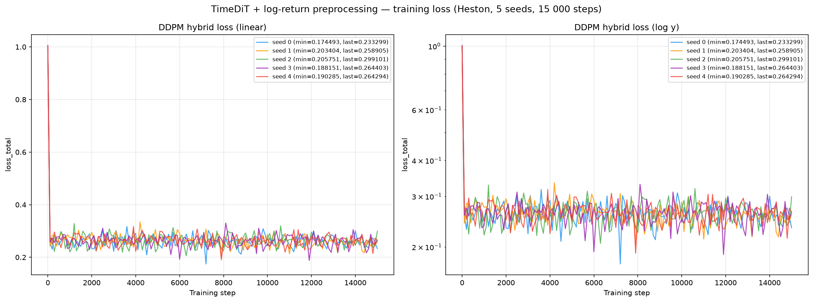

---

## A18, Discriminative Classifier Training Loss

BCE loss during GRU and MLP classifier training (2 000 steps, logged every 50). A value near
ln(2) ≈ 0.693 means the classifier cannot distinguish real from fake. Here the GRU head stays close to
ln 2 (A18 GRU mean 0.0252) while the **MLP head separates far more easily** (A18 MLP mean 0.0524, 8×
the 0.0063 floor) — the MLP sees the pooled marginal, which is exactly what the log-return
parametrization loosens.

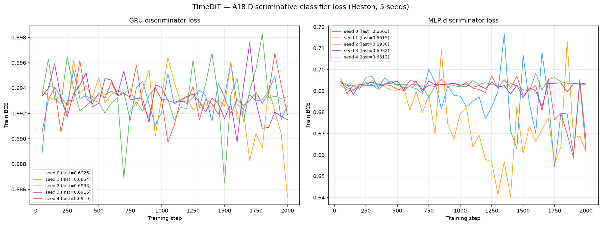

---

## A19, Predictive Score Training Loss (TSTR)

MAE loss during GRU and MLP predictor training on *synthetic* data (5 000 steps, logged every 100).
A19 is **saturated at the floor** for this method (GRU 0.05641 ± 2.2e-05 vs floor 0.05638): a one-step
predictor is insensitive to everything that actually differs here, so A19 carries no signal — do not
read it as a win.

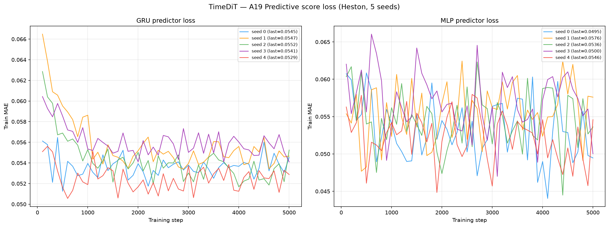

---


## File layout

```
results/Heston/preprocessing_with_log_returns/TimeDiT/
├── README.md                          ← this file
├── metrics_summary.csv                mean ± std + per-seed, all A + B + grid_tvd
├── seed_{0..4}_metrics.json           full per-seed metric dict
├── gate_seed0_compare.md              Phase-1 seed-0 gate artifact (with vs without preproc)
├── generated_paths/seed_{0..4}/       generated_paths_4096x128.npy + metadata.json
├── weights/
│   ├── seed_{i}_model.pt              DiT-S weights (32 463 745 params, 124.1 MiB) — ON DISK, gitignored
│   └── seed_{i}_config.json           sbts_sigma + minmax + znorm_mu/sd + dt/s0 + recipe (committed)
├── losses/
│   ├── seed_{i}_losses.csv            step, phase, loss_total  (DDPM hybrid loss)
│   └── loss_convergence.png           5-seed convergence (linear + log-y)
├── seed_{i}_disc_{gru,mlp}_loss.csv   A18 classifier BCE curves
├── seed_{i}_pred_{gru,mlp}_loss.csv   A19 predictor MAE curves
├── plots/
│   ├── heston_diagnostics.png         8-panel stylised-facts diagnostic (seed 0)
│   ├── disc_classifier_loss.png       A18 GRU+MLP BCE (5 seeds)
│   ├── pred_score_loss.png            A19 GRU+MLP MAE (5 seeds)
│   └── seed_{i}_pca.png / _tsne.png   2-D real-vs-fake latent projections per seed
├── code/
│   ├── train_timedit_logret.py        SBTS transform + minmax/znorm chain + inverse
│   ├── compute_metrics_logret.py      metrics runner (4096-path)
│   ├── gate_compare.py                Phase-1 gate comparison table
│   └── make_plots.py                  regenerates the 4 non-PCA/tSNE figures
├── baseline_no_preproc/               matched no-preprocessing control (GUIDELINE §7.1)
│   ├── weights/ generated_paths/ losses/ plots/
│   ├── seed_0_metrics.json
│   └── path_shadowing/                ← the ONE strict-protocol PS run lives here (raw checkpoint)
│       ├── path_shadowing_pdf.py      evaluator; BENCH_ROOT walk is 5 hops, one deeper (M11)
│       ├── bank/                      generated_bank_seed0_1000000x128.npy (488 MiB, gitignored)
│       ├── pdf_summary.json           all metrics + 95% bootstrap CIs, all 5 bank sizes
│       ├── logs/pdf_run.log           evaluator run log
│       └── plots/pdf_*.png            sweep + calibration plots
└── path_shadowing/                    shared PS tooling (no results — see the note below)
    ├── path_shadowing_pdf.py          4-block embedding, K=256, bank-size sweep, bootstrap CIs
    ├── gen_banks.py                   1M-bank builder (seed-0 generator, shardable, both variants)
    ├── verify_tf32.py / compare_tf32.py   TF32-losslessness harness
    ├── verify/                        fp32 vs tf32 paths + tf32_verdict.json
    ├── logs/
    │   ├── gen_bank_raw{,_shard0,_shard1}.log  per-shard bank-generation logs
    │   └── verify_{fp32,tf32}.log     TF32 harness logs
    └── plots/                         (empty — plots are under baseline_no_preproc/)
```

> **Why `TimeDiT/path_shadowing/` holds tooling but no results.** The strict PS protocol was run
> **once**, on the **no-preproc** checkpoint, so `pdf_summary.json`, the 1M bank and the plots all sit
> under `baseline_no_preproc/path_shadowing/`. The top-level folder keeps the shared driver, the bank
> builder and the TF32 verification evidence, which are variant-independent. **No preprocessed bank
> exists and none was evaluated** — see the [path-shadowing section](#path-shadowing--strict-paper-protocol-arxiv230801486-on-the-raw--no-preproc-checkpoint)
> for why.

> **Large-artifact storage (supersedes GUIDELINE M10).** Two classes of file live **on disk only**,
> in their natural place inside this folder, and are **gitignored so they never reach GitHub**:
>
> | artifact | path | size | why not pushed |
> |----------|------|------|----------------|
> | 1M PS bank | `baseline_no_preproc/path_shadowing/bank/` | 488 MiB | Theo: *"pls do not push the 1M samples but save them under banks into the disk pls"* — overrides M10's Git-LFS instruction |
> | DiT-S checkpoints (7 files) | `weights/seed_{i}_model.pt`, `baseline_no_preproc/weights/seed_0_model.pt` | 124.1 MiB each, 869 MiB total | over GitHub's **100 MiB per-file hard cap**; free LFS tier is 1 GiB storage + 1 GiB/mo bandwidth, so one push would exhaust it. Theo: *"save the checkpoints inside the disk and do not push them … I want them saved on my disk … they just do not appear in the github"* |
>
> Nothing is lost: banks regenerate from `path_shadowing/gen_banks.py` and checkpoints from
> `code/train_timedit_logret.py --seed N` (both deterministic). The small
> `weights/seed_{i}_config.json` recipe files — which carry `sbts_sigma`, the min-max bounds and the
> z-norm constants needed to reproduce or invert the transform — **are** committed. See
> [`.gitignore`](../../../../.gitignore) lines 33-45 and GUIDELINE §0.2 **M12**.

## Reproduce

```bash
PY=/home/tbasseras/gpu-venv/bin/python
cd /home/tbasseras/benchmark/results/Heston/preprocessing_with_log_returns/TimeDiT

# Train all 5 seeds (SBTS log-return transform; 2 A100s in parallel, 8 cores each)
for pair in "0 1" "2 3" "4 -"; do
  i=0; for s in $pair; do [ "$s" = "-" ] && continue
    CUDA_VISIBLE_DEVICES=$i taskset -c $((i*8))-$((i*8+7)) OMP_NUM_THREADS=8 \
      $PY code/train_timedit_logret.py --seed $s &
    i=$((i+1))
  done; wait
done

# Metrics (all seeds, 4096-path test set)
$PY code/compute_metrics_logret.py

# The 4 non-PCA/tSNE figures (CPU, ~10 s)
$PY code/make_plots.py                 # with-preproc + losses + A18/A19
$PY code/make_plots.py --only baseline # no-preproc control diagnostics

# TF32 losslessness check (must pass BEFORE any bank is built)
$PY path_shadowing/verify_tf32.py && $PY path_shadowing/compare_tf32.py

# Strict path shadowing — ONE 1M bank from the RAW (no-preproc) checkpoint, 2 shards on 2 GPUs.
# --variant raw writes into baseline_no_preproc/path_shadowing/bank/ and reads that checkpoint.
# ~16.4 h wall. Launch shard 0 first: it creates the memmap, shard 1 waits for it.
for sh in 0 1; do
  CUDA_VISIBLE_DEVICES=$sh OMP_NUM_THREADS=8 taskset -c $((sh*8))-$((sh*8+7)) \
    $PY path_shadowing/gen_banks.py --seed 0 --variant raw --shard $sh --n-shards 2 \
    > path_shadowing/logs/gen_bank_raw_shard$sh.log 2>&1 &
  [ $sh = 0 ] && sleep 60
done; wait

# Evaluate (CPU only, ~40 s + 14 s to draw the Heston oracle bank). No CLI args:
# every path is derived from the driver's own location.
cd baseline_no_preproc/path_shadowing && OMP_NUM_THREADS=8 taskset -c 0-7 \
  $PY path_shadowing_pdf.py > logs/pdf_run.log 2>&1
```

---

## Preprocessing (the SBTS log-return transform)

The **only** thing changed from the original TimeDiT run: TimeDiT's raw-price min-max/z-norm input is
replaced by the SBTS volatility-scaled log-return transform, **kept inside TimeDiT's own two-stage
normalizer**.

```python
DT, S0 = 1.0/250.0, 100.0
R        = np.log(S[:, 1:] / S[:, :-1])        # (M,127) log-returns
sigma    = float(R.std())                       # pooled ddof=0, TRAIN seed 0, frozen
R_tilde  = R * np.sqrt(DT) / sigma              # std -> sqrt(DT) = 0.063246
X_sbts   = np.hstack([np.zeros((M,1)), R_tilde])# (M,128) dummy-0 column prepended
X_mm     = (X_sbts - lo) / (hi - lo)            # TimeDiT stage 1: min-max -> [0,1]
X_train  = (X_mm - znorm_mu) / znorm_sd         # TimeDiT stage 2: z-norm
```

Inverse (generation): undo z-norm → undo min-max → drop the dummy column →
`R_gen = R̃_gen · sigma / √DT` → `S[:,0] = 100`, `S[:,1:] = 100 · exp(cumsum(R_gen))`.

**Reported SBTS sigma (frozen, shared with SBTS):** `sigma = 0.01263163` (estimated on the 4 096-path
train seed 0, ddof=0, pooled over all M×127 raw log-returns). After scaling, `R̃.std() = √dt = 0.063246`.

> ⚠️ **Why TimeDiT is the opposite case from LS4 (`../GUIDELINE.md` §0.1).** LS4 needed a unit-variance
> wrapper because SBTS-scaled returns (std ≈ 0.063) sat *below its fixed decoder noise σ = 0.1*, which
> collapsed the VAE — a **fixed output-noise floor**. **TimeDiT has no such floor**: DDPM's reverse
> variance is schedule-determined, so §0.1's unit-variance rationale that rescued LS4 gives TimeDiT
> nothing. What TimeDiT *does* inherit is the min-max stage, and that is where the damage is measurable:
> the log-return panel min-maxes to `[-0.4118, +0.4162]` — the range is **pinned by ±6.5σ single-step
> outliers** — leaving `znorm_sd = 0.07609`, versus `znorm_sd = 0.10122` on the raw price panel
> (`minmax = [50.609, 148.446]`). The returns therefore fill **~25 % less** of the normalized unit box,
> and a **fixed-variance DDPM truncates exactly the tails it can no longer resolve** (A28 = 3.69 ⇒
> generated excess kurtosis is only ~27 % of real). On top of that the inverse is `exp ∘ cumsum`, which
> **integrates** per-step errors into level errors (A13 mean-path RMSE 2.23, A25 3.72, A20 cov error
> 47.2). Both mechanisms push the same direction.

**Model:** TimeDiT **DiT-S** (hidden_size 384, depth 12, heads 6, `learn_sigma=false`),
**32 463 745 params**, T = 1000 linear-β DDPM, `sampler = ddpm_fixed`. Trained **15 000 steps**,
batch 256, Adam `lr = 3e-4`, `weight_decay = 0`, **no EMA**, `paper_hyperparams = true`.
**Dataset:** 4 096 Heston paths (the main benchmark uses 8 192; this experiment uses 4 096 for
train/test/disc, see [`../README.md`](../README.md)). Parameters: μ=0.05, κ=2.0, θ=0.04, ξ=0.3,
ρ=−0.7, S₀=100, v₀=0.04, dt=1/250.

---

## Results — does log-return preprocessing help TimeDiT?

**Verdict: it hurts, decisively — the opposite of the LS4 result.** Swapping TimeDiT's raw-price
min-max/z-norm input for SBTS log-returns **degrades essentially every fidelity metric**, and unlike
LS4 it does so **without any seed instability to blame** (all 5 seeds plateau within 3.4 % of each
other, see the loss section). The reference throughout is the **original price-input TimeDiT** at
[`../../TimeDiT/`](../../TimeDiT/README.md) (trained on 8 192 paths; this run on 4 096). "Original" =
its 5-seed mean. **Δ**: ✅ log-return better, ❌ worse, ≈ negligible.

| Metric | TimeDiT + logret (mean) | Original TimeDiT (mean) | Δ |
|--------|------------------------:|------------------------:|---|
| A1 Kurtosis Error ↓ | 0.5543 | 0.1007 | ❌ |
| A6 Path MMD² ↓ | 0.008066 | 0.004171 | ❌ |
| A7 Terminal MMD² ↓ | 0.01146 | 0.003929 | ❌ |
| A17 Terminal Price KS ↓ | 0.1251 | 0.06746 | ❌ |
| A18 Disc Score GRU ↓ | 0.0252 | 0.01047 | ❌ |
| A19 Pred Score GRU ↓ | 0.05641 | 0.05009 | ❌ |
| A25 Mean RMSE ↓ | 3.718 | 1.998 | ❌ |
| A28 Kurtosis Ratio (→1) | 3.692 (\|Δ\|=2.692) | 0.9925 (\|Δ\|=0.008) | ❌ |
| A32 Vol-of-Vol Error ↓ | 5.27e-04 | 3.84e-04 | ❌ |
| grid_tvd (path cloud) ↓ | 10.34 % | 8.518 % | ❌ |
| A21 ACF \|r\| Error ↓ | 0.0101 | 0.01023 | ≈ |
| **A14 KS Log-returns ↓** | **0.01469** | 0.0253 | ✅ |
| **A33 Teacher-Sigma Corr ↑** | **0.007498** | 0.00413 | ✅ |
| **Log-return-hist MSE (funct) ↓** | **0.3974** | 2.977 | ✅ |

**Scoreboard: 2 of 34 A-rows improve** (A14 KS, A33 teacher-σ corr; A21 is a tie), plus the B
log-return-histogram curve. Everything else regresses. Note the shape of the exceptions: the two wins
are both about the **pooled marginal shape of returns** — modelling returns directly does tighten the
return *histogram* and the return KS. It buys that at the cost of **every** path-level, tail and
volatility-structure metric.

- **Tail collapse is the headline.** A28 goes from **0.9925** (essentially perfect) to **3.692**: since
  A28 = κ_real / κ_gen (Fisher excess kurtosis, `metrics/metrics.py:474-480`), the generated returns
  retain only **~27 % of the real excess kurtosis** — the model is now strongly **too thin-tailed**.
  A1 kurtosis error 5.5×, A5 Hill 4.2 (floor 1.28).
- **Path/level structure collapses too.** A13 mean-path RMSE 2.23 (floor 0.18), A25 3.72 (floor 0.37),
  A20 covariance error 47.2 (floor 5.8), A17 terminal KS 1.9× worse. This is the `exp ∘ cumsum` inverse
  integrating step errors into level errors.
- **It is not an optimization failure.** All 5 seeds reach a 0.253–0.262 plateau on the identical
  objective. The model fits the *transformed* law well; the transformed law simply maps back onto a
  worse price law.
- **A19 is saturated** at the floor and carries no signal (see the A19 section); do not read the row
  either way.

**Path shadowing:** deferred (see the Path Shadowing section) — the raw bank is generating now and the
preprocessed bank is queued behind Theo's review, so this README does **not** yet claim a PS verdict
for either transform.

### Latent projections (per seed)

PCA and t-SNE 2-D projections, real (test seed 1) vs generated. Unlike LS4 there is **no single
degenerate seed** — the mild real/fake offset that A6 = 0.0081 and A17 = 0.125 predict is visible
uniformly across all five.

| Seed 0 | Seed 1 | Seed 2 | Seed 3 | Seed 4 |
|--------|--------|--------|--------|--------|
| 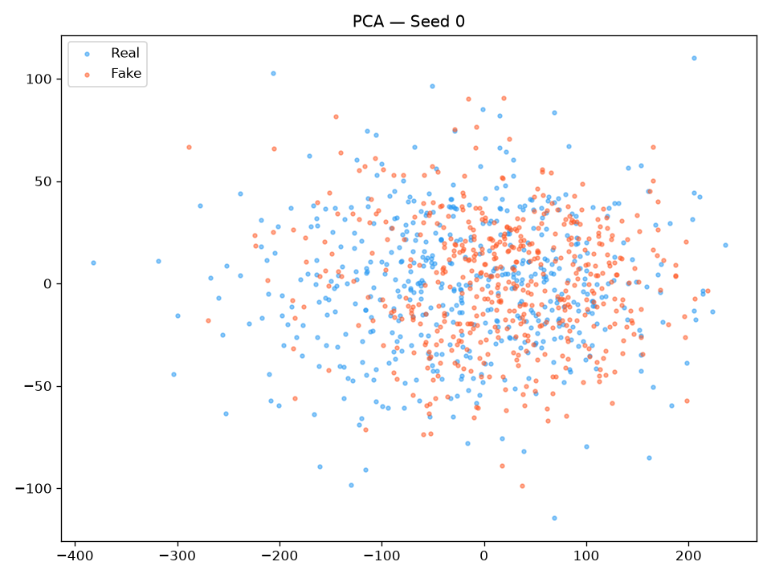 | 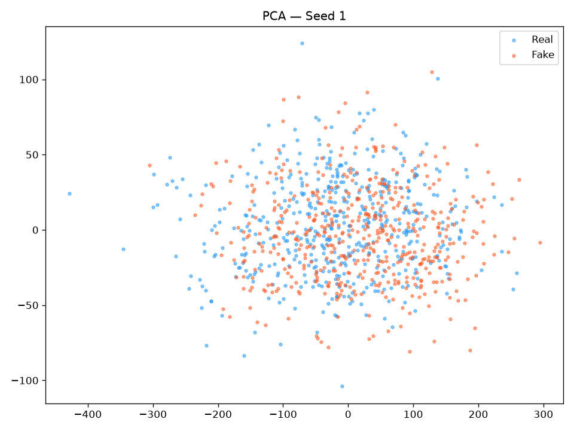 | 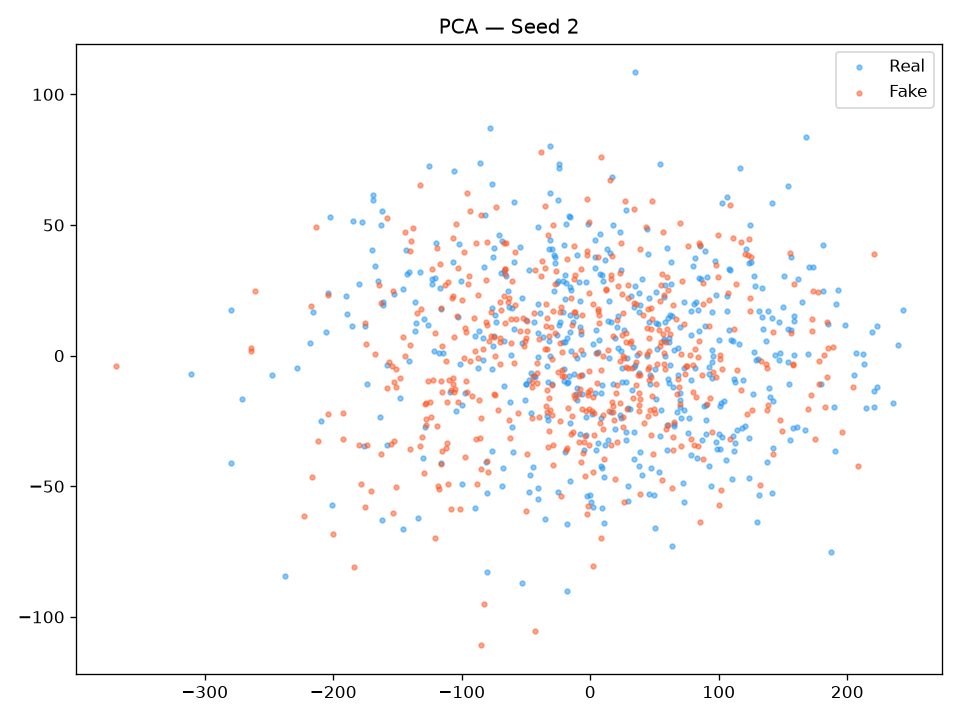 | 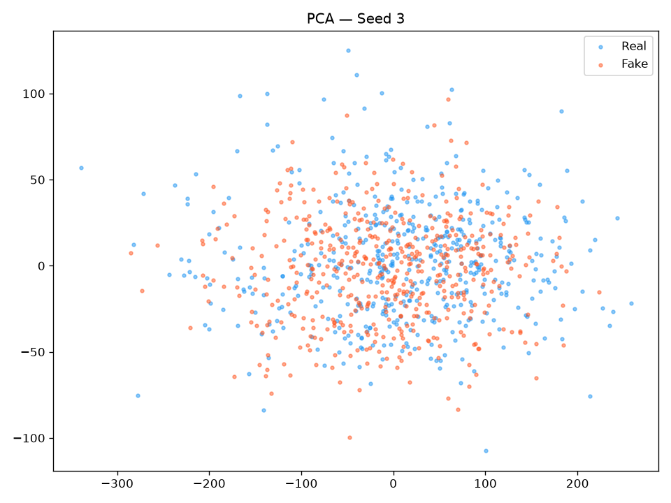 | 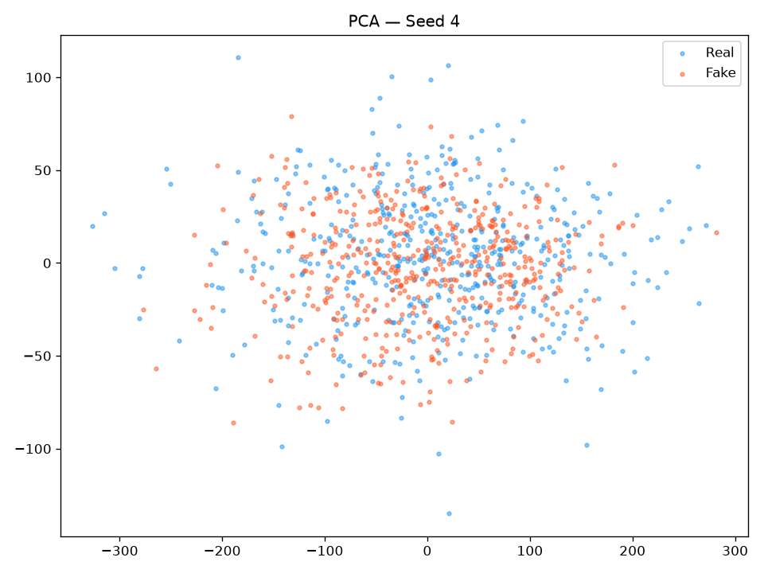 |
| 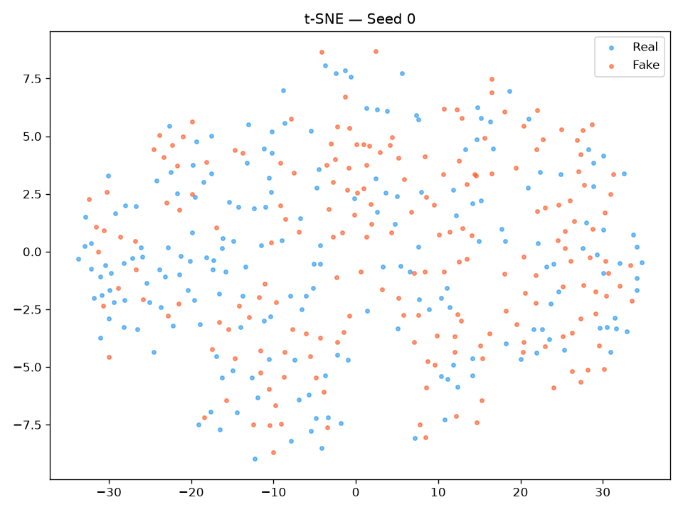 | 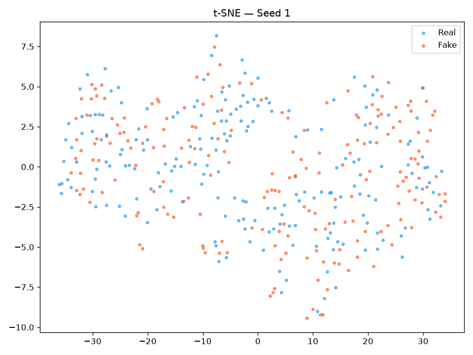 | 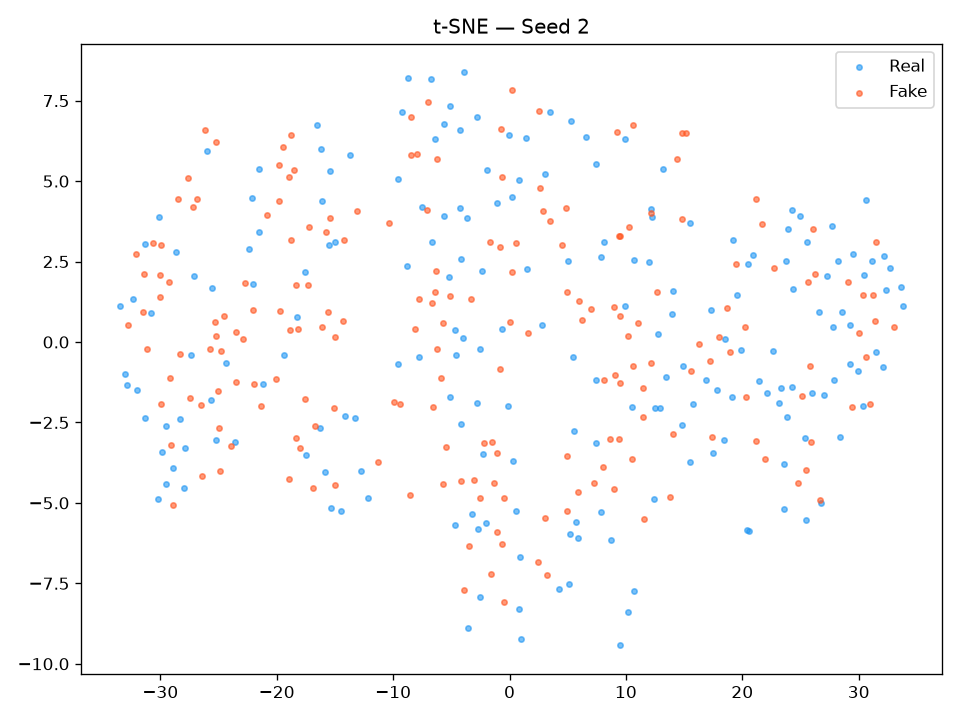 | 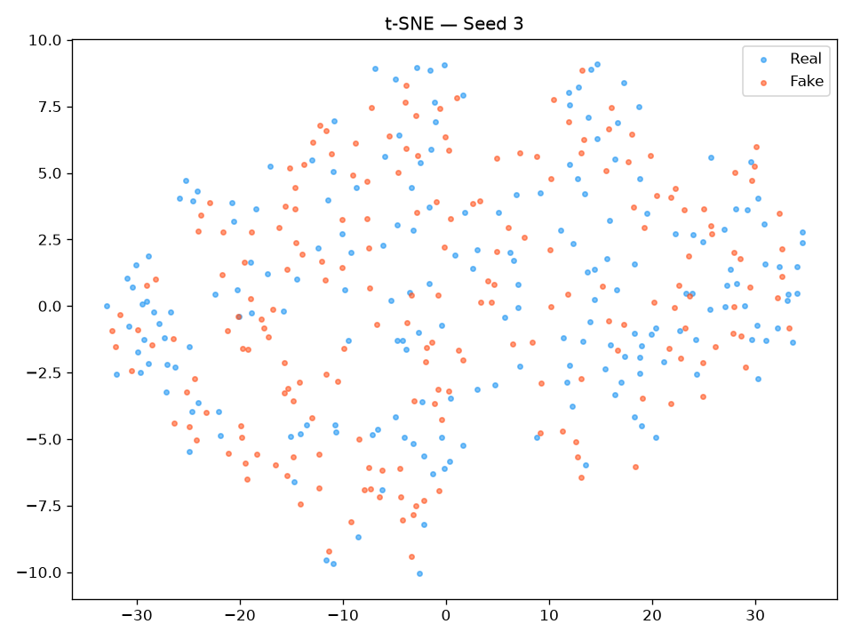 | 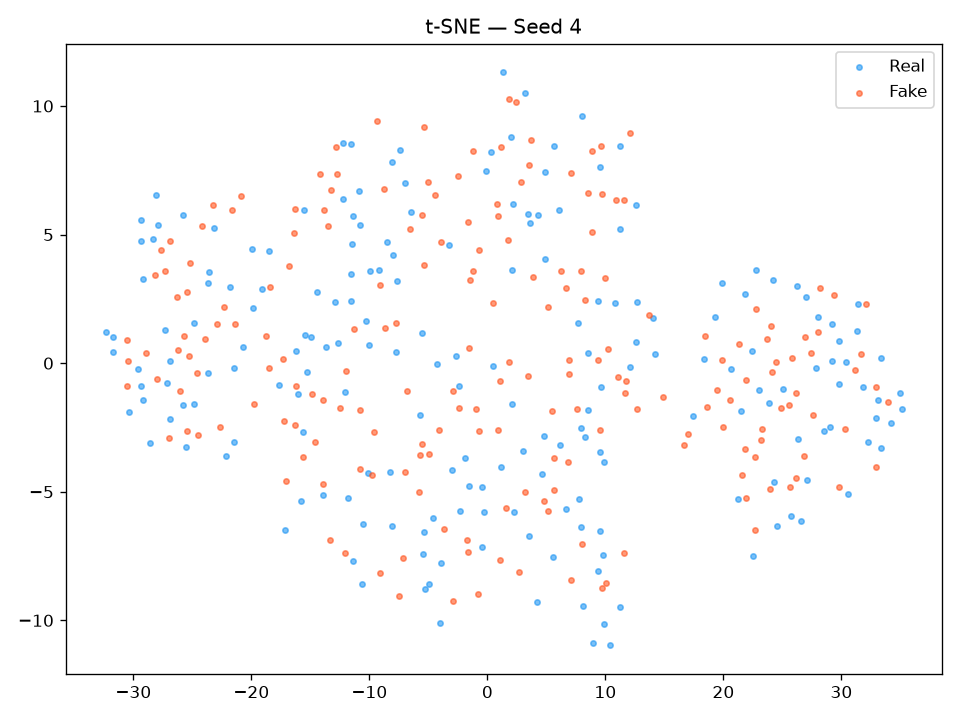 |

## Head-to-head control — preprocessing vs **none**, same 4096-path budget (seed 0)

The section above compares against the *original main-benchmark* TimeDiT, which was trained on **8 192**
paths. That confounds two variables (preprocessing **and** 2× data). To isolate the preprocessing
**alone**, a matched **no-preprocessing baseline** was trained inside this folder
([`baseline_no_preproc/`](baseline_no_preproc/)): the **identical** TimeDiT pipeline — same DiT-S preset
(32 463 745 params, byte-identical config apart from one field), same **4096** train paths, **same
15 000 steps**, same seed 0, same Adam/no-EMA — with **only the scaler changed**:
`raw_price_minmax+znorm` on the raw price panel instead of `sbts_log_return+minmax+znorm`, decoded
directly back to price (no log-return, no cumsum, no exp). This is the only clean A/B for the
preprocessing's effect (GUIDELINE §7.1). Both columns are **seed 0** at **4096 paths**; Δ% is relative
to no-preproc, and for lower-better metrics **negative Δ% = preprocessing wins**.

**Verdict: the raw-price input wins, and it is not close — 31 rows to 3, with 1 exact tie.** The
matched control **confirms** the multi-seed verdict rather than reversing it (the opposite of what
happened for LS4). Even the stylised-fact block that log-returns are *supposed* to rescue —
volatility clustering and fat tails — goes the raw model's way here: A21 +194 %, A22 +343 %, A1 +480 %,
A5 +682 %, A28 |Δ to 1| 3.04 vs 0.20.

### A-metrics (seed 0, 4096 both sides; ↓ lower-better unless noted)

| A-metric | logret (with) | raw (no-preproc) | Δ% | Winner |
|----------|-------------:|-----------------:|----:|:------:|
| A1 kurtosis error ↓ | 0.5672 | **0.09783** | +479.7% | raw |
| A5 Hill tail-index error ↓ | 5.628 | **0.7201** | +681.5% | raw |
| A6 path MMD² ↓ | 0.007193 | **0.003153** | +128.1% | raw |
| A7 terminal MMD² ↓ | 0.01175 | **0.002105** | +458.4% | raw |
| A8 increment MMD² ↓ | 0.001415 | **0.001302** | +8.7% | raw |
| A9 volatility MMD ↓ | 0.03895 | **0.01299** | +199.9% | raw |
| A10 terminal SWD ↓ | 4.293 | **1.105** | +288.4% | raw |
| A11 path SWD ↓ | 2.246 | **1.335** | +68.2% | raw |
| A12 RV-law loss ↓ | 0.7402 | **0.2068** | +257.9% | raw |
| A13 mean-path RMSE ↓ | 2.468 | **1.702** | +45.0% | raw |
| A14 KS logreturns ↓ | 0.01519 | **0.004773** | +218.2% | raw |
| A17 terminal KS ↓ | 0.1331 | **0.05786** | +130.0% | raw |
| A18 disc score GRU ↓ | 0.010067 | 0.010067 | +0.0% | **tie** |
| A18 disc score MLP ↓ | 0.1028 | **0.07657** | +34.3% | raw |
| A19 pred score GRU (TSTR) ↓ | **0.056414** | 0.056449 | −0.1% | **logret** |
| A20 covariance error ↓ | 62.41 | **10.99** | +468.0% | raw |
| A21 ACF \|r\| ↓ | 0.01017 | **0.003457** | +194.2% | raw |
| A22 ACF r² ↓ | 0.01241 | **0.0028** | +343.0% | raw |
| A25 mean RMSE ↓ | 4.171 | **1.421** | +193.6% | raw |
| A26 return-std error ↓ | 0.05928 | **0.03619** | +63.8% | raw |
| A27 logreturn-std error ↓ | 9.60e-04 | **2.16e-04** | +343.7% | raw |
| A28 kurtosis ratio (→1) | 4.037 (\|Δ\|3.037) | **1.201 (\|Δ\|0.201)** | — | raw |
| A30 vol-path RMSE ↓ | 1.597 | **0.2989** | +434.3% | raw |
| A31 rolling-vol KS ↓ | 0.04421 | **0.01746** | +153.2% | raw |
| A32 vol-of-vol error ↓ | 5.97e-04 | **2.25e-04** | +165.3% | raw |
| A33 teacher-σ corr ↑ | **0.01103** | -0.002748 | — | **logret** |
| A34 teacher-σ RMSE ↓ | **0.0938** | 0.09925 | −5.5% | **logret** |

### B curve-shape (seed 0; funct MSE, %err, + grid_tvd; ↓ lower-better)

| B-metric | logret (with) | raw (no-preproc) | Δ% | Winner |
|----------|-------------:|-----------------:|----:|:------:|
| B log-ret hist MSE ↓ | 0.2775 | **0.07161** | +287.5% | raw |
| B log-ret hist %err ↓ | 9.390 | **3.823** | +145.6% | raw |
| B QQ MSE ↓ | 1.02e-06 | **6.16e-08** | +1563.5% | raw |
| B QQ %err ↓ | 13.80 | **2.517** | +448.4% | raw |
| B ACF \|r\| MSE ↓ | 5.05e-05 | **9.92e-06** | +409.5% | raw |
| B ACF \|r\| %err ↓ | 20.01 | **10.77** | +85.7% | raw |
| B ACF r² MSE ↓ | 7.87e-05 | **5.54e-06** | +1320.6% | raw |
| B ACF r² %err ↓ | 35.04 | **10.16** | +244.9% | raw |
| grid_tvd (path cloud) ↓ | 10.00% | **7.265%** | +37.7% | raw |

**Visual comparison — 8-panel stylised-facts diagnostic, Real vs generated, seed 0 (both 4096 paths).**
Same real test set on each side; the only difference is the input transform. Here the *return
distribution* and *QQ* panels are where the log-return model visibly narrows relative to the real
curve, and the *rolling-vol* / *tail-survival* panels are where the raw-price model tracks the truth
more closely — the visual counterpart to the tail and vol Δ% rows above.

| log-return preprocessing (with) | raw price, no preprocessing |
|:-------------------------------:|:---------------------------:|
|  |  |

**Reading it straight (no cherry-picking):**
- **The one head that ties, and the one that doesn't.** A18 GRU is an **exact tie** (0.010067 on both
  sides) — flagged rather than silently awarded. The discriminating head is the **MLP** (0.1028 logret
  vs 0.0766 raw): the MLP reads the pooled marginal, which is precisely what the min-max range loss
  degrades.
- **The 3 logret wins are marginal or off-target.** A19 is at its floor (Δ = −0.1 %, noise). A33/A34
  are teacher-σ recovery, where **both** models are ≈ 0 correlation against a 0.6156 perfect floor —
  logret's 0.011 vs raw's −0.003 is not a meaningful recovery, just a sign flip inside the noise.
- **Why this differs from the LS4 verdict.** LS4's matched control *reversed* its multi-seed verdict
  because LS4's log-return runs were **seed-unstable** (seeds 1 & 4 degenerate) — the 5-seed mean was
  dragged down by variance, while stable seed 0 was genuinely better. TimeDiT has **no such
  instability**, so there is nothing for the matched control to rescue: seed 0 loses by the same margin
  the 5-seed mean loses by.
- **The caveat that applies to both sides.** These are **4096-path** models on both sides of every
  comparison in this sub-section, so the data budget is not a confound here; but 4096 is half the main
  benchmark's 8192, so absolute levels are not directly comparable to `../../TimeDiT/`.

### Path shadowing — strict paper protocol (arXiv:2308.01486), on the **raw / no-preproc** checkpoint

> **Read this first — which checkpoint the bank comes from.** TimeDiT's path-shadowing evaluation is
> run on the **no-preprocessing** checkpoint (`baseline_no_preproc/weights/seed_0_model.pt`), **not**
> on the SBTS log-return one. That is a direct consequence of the verdict in this section:
> **log-return preprocessing degrades TimeDiT** — raw price wins the matched seed-0 control **31–3**
> (1 exact tie) and every 5-seed A/B column agrees — so the one 1M scenario bank is built from the
> input transform that actually works for this model. **No preprocessed bank was evaluated.** These
> numbers ship in the cross-method PS table in [`../README.md`](../README.md) under the label
> **`TimeDiT (raw)`**, where they win **14 of 18 ranked rows at all five bank sizes** — the best
> generator in the folder. The checkpoint is the *only* input difference: protocol, K=256, the 512
> queries, the 4-block embedding, the Heston oracle, the RW floor and the bank-size sweep are
> byte-identical to CSDI / LS4 / SBTS, so the column ranks legitimately; the `(raw)` tag is there so a
> reader always knows which checkpoint produced it.

> This uses the **exact protocol from the paper**, *not* the simplified `methods/TimeDiT`
> reference eval (65D murex embedding, K=77, prefix-price L2, CRPS/MAE/RMSE only). See
> [`../GUIDELINE.md` §9 + M7](../GUIDELINE.md). The paper's Current Experimental Configuration
> (§4) fixes **K = 256** neighbours, 512 held-out prefixes, prefix = 64 increments, horizon 32,
> bank sizes {4 096 … 1 000 000}, 2 000 bootstrap replicates — all matched here.

Each real ps-split prefix (65 points → 64 log-returns) is embedded with the **4-block weighted,
frozen-reference-standardized** feature vector — recent returns (last 32, w1.0) · cumulative path
(downsampled 24, w0.5) · rolling vol (windows 5/10/20 last/mean/std, w2.0) · dependence (ACF of
`|r|` & `r²` at lags 1,2,5,10, w1.0). Each block is **dimension-normalized** (per-feature weight
`w_block/d`) and standardized against **frozen μ/σ computed once on the real Heston test set**
(`heston_S_test_4096x128`, model-independent, held fixed across the whole sweep):
`z̃ = √(w/d)·(z−μ_ref)/σ_ref`. Retrieve **K = 256** nearest bank paths; their futures give the
predictive ensemble for three return-based quantities. Per arXiv:2308.01486 §2/§3.1/§3.3 the
**cumulative return** and **one-step return** are evaluated as **H-dimensional trajectories over the
horizon offsets u = 1…H** (RMSE/CRPS/coverage/width averaged over all future times, not a single
terminal point); **horizon RV** is the scalar `√Σr²`. Split `s = 64`, horizon `H = 32`, **512**
independent query paths (seed 3). Metrics per quantity: predictive-mean RMSE, CRPS (energy),
coverage 50/90, band width 50/90, lower/upper-90 miss — each with a **2000-resample paired bootstrap
95% CI over the 512 query paths** (single fixed resample-index matrix, `boot_seed=20230814`, shared
across all bank sizes / quantities / references).

**Three references, one protocol.** The same retrieval+forecast pipeline is run against three banks,
all sliced as **nested prefixes** over the sweep {4096, 16384, 65536, 262144, 1 000 000}:

- **TimeDiT (raw)** — the generator under test. One 1M bank from the seed-0 **no-preproc** generator
  (`baseline_no_preproc/path_shadowing/bank/generated_bank_seed0_1000000x128.npy`, 488 MiB,
  gitignored + regenerable). 16.36 h wall on 2 × A100 as 2 round-robin shards.
- **Heston oracle (ceiling)** — a fresh 1M bank drawn from the *true* Heston law (identical SDE
  parameters as the test set; independent seed 777). This is the best any path-shadowing predictor
  can achieve. **TimeDiT's gap to the oracle = generator law-mismatch; the oracle's own residual error
  = irreducible retrieval limit at finite bank size.**
- **Random-walk (floor)** — resamples each query's own prefix returns (no cross-path information).

> **Deviations from literal §1.1, deliberate (see [`../GUIDELINE.md` §9.6](../GUIDELINE.md)):**
> (a) per-block **dimension normalization** — per-feature weight `w_block/d`, multiplier `√(w_block/d)`;
> §1.1 uses `√w_b` with no `/d`. (b) **frozen-reference standardization** — μ/σ fixed once on the
> real test set; §1.1 standardizes with each candidate bank's own μ/σ. Both decouple the metric from
> the generator and keep TimeDiT / oracle / RW on one comparable scale. **§5.1 eligibility gates: N/A**
> — fixed 15 000-step training, no checkpoint selection, no per-generator gating.
> **Comparison arms vs the doc §4** (*source · MP-corrected generator · Heston oracle*): **TimeDiT is a
> single fixed-checkpoint standalone candidate law** — there is **no source→MP-corrected pair** (no
> MP-correction step in this experiment), so §5.1/§5.2 selection & CRN-pairing do not apply. The
> **Heston oracle** is the §4/§6 ceiling. The **random-walk floor is an extension beyond §4** (kept to
> separate a retrieval limit from a generator-law mismatch), not a doc-declared arm. **Coverage
> quantiles** use `np.percentile` **type-7 linear**; a perfectly calibrated K=256 draw yields cov50 ≈
> 0.50 / cov90 ≈ 0.89 under type-7 (verified by Monte-Carlo), so the 50%-coverage read-out is genuine
> signal, not an interpolation artefact — see [`../GUIDELINE.md` §9.7](../GUIDELINE.md).

> **TimeDiT-specific sampler / throughput notes.** The bank is generated with the **exact DDPM
> ancestral sampler at the full T = 1000** (`sampler=ddpm_fixed_T1000`) — **DDIM was disqualified**:
> at the winning HPO config it is 4.7× worse and collapses the lag-1 ACF of `|r|` (0.043 vs real 0.689),
> so it cannot be used to build a path-shadowing bank. To make 1000-step sampling affordable, **TF32
> matmuls are enabled and were verified lossless first** (`path_shadowing/verify_tf32.py`,
> `path_shadowing/verify/tf32_verdict.json`): measured **3.02× speedup** (98.5 h → 32.6 h per 1M paths
> on one A100), with the worst PS-critical statistic differing by a ratio of **0.004**, far below the
> seed-to-seed noise floor. The bank is built as **2 round-robin shards on 2 separate GPUs**; chunk `c`
> owns rows `[c·8192, (c+1)·8192)` and is always seeded with its **global** chunk index, so the 2-shard
> bank is **byte-identical** to a single-process bank (smoke-tested: `bitwise_identical=True`,
> `max_abs_diff=0.0`). Two shards on the *same* GPU give no speedup (127.6 s vs 129.3 s single-process)
> — one A100 is already saturated by one sampler, which is why the split must be across devices.

<!-- PS-PDF-RAW-TABLE-START -->
All numbers are at the full **1 000 000-path bank** (log-return scale; lower is better except
coverage, whose target is the nominal level 0.50 / 0.90). Brackets are **95% bootstrap CIs over the
512 query paths**. cum/step are **horizon-averaged over u = 1…H**. **RMSE is reported as
`mean_q(√se_q)`** — the average per-query root error, matching the path-shadowing reproducibility
report (Tables 1–5). It is *not* `√(mean_q se_q)`, which by Jensen is larger; for the scalar **rv**
quantity `mean_q(√se_q)` reduces exactly to MAE.

**Cumulative return (trajectory, u = 1…H)** — TimeDiT raw vs Heston-oracle ceiling vs RW floor

| metric | TimeDiT raw | Heston oracle | RW floor |
|--------|:----------:|:-------------:|:--------:|
| RMSE          | **0.0414** [0.0392, 0.0437] | 0.0415 [0.0393, 0.0438] | 0.0480 [0.0453, 0.0505] |
| CRPS          | **0.0252** [0.0238, 0.0266] | 0.0252 [0.0238, 0.0267] | 0.0295 [0.0278, 0.0311] |
| coverage 50   | **0.507** [0.483, 0.532] | 0.489 [0.466, 0.513] | 0.472 [0.446, 0.500] |
| coverage 90   | **0.898** [0.883, 0.914] | 0.894 [0.878, 0.910] | 0.855 [0.836, 0.875] |
| width 50      | 0.0590 | 0.0572 | 0.0629 |
| width 90      | 0.1486 | 0.1465 | 0.1520 |
| lower-miss 90 | 0.0457 | 0.0546 | 0.0833 |
| upper-miss 90 | 0.0560 | 0.0513 | 0.0613 |

**One-step return (trajectory, u = 1…H)**

| metric | TimeDiT raw | Heston oracle | RW floor |
|--------|:----------:|:-------------:|:--------:|
| RMSE          | 0.0118 [0.0114, 0.0121] | **0.0118** [0.0114, 0.0121] | 0.0119 [0.0115, 0.0122] |
| CRPS          | 0.0068 [0.0066, 0.0070] | **0.0068** [0.0066, 0.0070] | 0.0069 [0.0067, 0.0071] |
| coverage 50   | 0.476 [0.465, 0.487] | 0.482 [0.470, 0.493] | **0.516** [0.503, 0.528] |
| coverage 90   | 0.881 [0.874, 0.888] | 0.886 [0.879, 0.894] | **0.887** [0.878, 0.894] |
| width 50      | 0.0143 | 0.0145 | 0.0160 |
| width 90      | 0.0376 | 0.0382 | 0.0397 |
| lower-miss 90 | 0.0588 | 0.0573 | 0.0593 |
| upper-miss 90 | 0.0606 | 0.0563 | 0.0541 |

**Horizon realized vol (scalar) — the diagnostic quantity**

| metric | TimeDiT raw | Heston oracle | RW floor |
|--------|:----------:|:-------------:|:--------:|
| RMSE (= MAE)  | 0.0130 [0.0122, 0.0139] | **0.0129** [0.0121, 0.0138] | 0.0151 [0.0141, 0.0160] |
| CRPS          | 0.0092 [0.0086, 0.0098] | **0.0091** [0.0086, 0.0097] | 0.0117 [0.0109, 0.0125] |
| coverage 50   | **0.488** [0.445, 0.531] | 0.473 [0.428, 0.514] | 0.234 [0.197, 0.272] |
| coverage 90   | **0.895** [0.869, 0.922] | 0.924 [0.900, 0.945] | 0.533 [0.492, 0.576] |
| width 50      | 0.0215 | 0.0222 | 0.0120 |
| width 90      | 0.0521 | 0.0541 | 0.0287 |
| lower-miss 90 | 0.0312 | 0.0293 | 0.2891 |
| upper-miss 90 | 0.0742 | 0.0469 | 0.1777 |

**Bank-size sweep — CRPS by quantity (TimeDiT raw above, Heston oracle below; nested prefixes)**

| bank size | cum TD-raw / ORC | step TD-raw / ORC | RV TD-raw / ORC | uniq-frac (TD-raw) | prefix dist (TD-raw, mean) |
|----------:|:-------------:|:--------------:|:------------:|:--------------:|:-----------------------:|
| 4 096 | 0.02531 / 0.02539 | 0.00677 / 0.00677 | 0.00965 / 0.00978 | 0.999 | 1.932 |
| 16 384 | 0.02534 / 0.02535 | 0.00677 / 0.00676 | 0.00948 / 0.00951 | 0.967 | 1.765 |
| 65 536 | 0.02533 / 0.02524 | 0.00676 / 0.00675 | 0.00941 / 0.00933 | 0.755 | 1.638 |
| 262 144 | 0.02528 / 0.02524 | 0.00676 / 0.00675 | 0.00927 / 0.00926 | 0.358 | 1.536 |
| 1 000 000 | 0.02521 / 0.02525 | 0.00676 / 0.00675 | 0.00918 / 0.00914 | 0.119 | 1.454 |

**Diagnostics (1M bank) — TimeDiT raw / oracle**

| terminal (h=H) RMSE | prefix dist mean/median/p95 | unique-cand frac | RV mean bias |
|:-------------------:|:---------------------------:|:----------------:|:------------:|
| 0.0522 / 0.0525 | 1.454 / 1.410 / 2.014 | 0.119 / 0.119 | −0.0028 / −0.0020 |
<!-- PS-PDF-RAW-TABLE-END -->

**Reading it.** TimeDiT-raw is **statistically indistinguishable from the Heston oracle on
all three quantities**: cum CRPS 0.02521 vs 0.02525, step 0.00676 vs 0.00675, and — the demanding one —
**RV CRPS 0.00918 vs the oracle's 0.00914**, with CIs [0.0086, 0.0098] vs [0.0086, 0.0097] essentially
coincident. Compare LS4, whose RV CRPS (0.0103) sits *significantly* above its oracle: **TimeDiT-raw
closes the realized-vol gap that LS4 could not**, and its RV mean bias (−0.0028) is the closest to the
oracle's (−0.0020) of any generator in this folder. The single residual defect is **90% RV upper-tail
under-coverage** — upper-miss **0.0742 vs the oracle's 0.0469** at cov90 0.895 vs 0.924 — i.e. the
top of the high-vol regime is still slightly thin, the same failure *direction* as LS4 but roughly
**half** the magnitude (LS4: 0.150). The bank-size sweep confirms this is a law property, not a
finite-bank artefact: cum/step CRPS are flat across the 244× sweep while RV improves monotonically
(0.00965 → 0.00918) and stays pinned to the oracle at every size.

**CRPS vs bank size (log x).** All three quantities on one axis across the 244× nested-prefix sweep:
**solid = TimeDiT-raw, dashed = the size-matched Heston oracle**, shaded = 95% bootstrap band. The
headline is that **the solid and dashed lines are visually indistinguishable at every bank size and on
every quantity** — the generator tracks the true-law ceiling throughout, not just at 1M. cum (blue,
≈0.0253) and step (orange, ≈0.0068) are flat: the conditional law is already resolved at 4 096
candidates, so extra bank buys nothing. **rv (green) is the only curve that moves**, declining
monotonically 0.00965 → 0.00918 and staying pinned to its oracle the whole way. Compare SBTS, whose cum
curve *rises away* from the oracle as the bank grows — the under-dispersion signature. (No RW floor is
drawn here; it is bank-independent and is in the tables above: cum 0.0295, step 0.00687, rv 0.0117.)

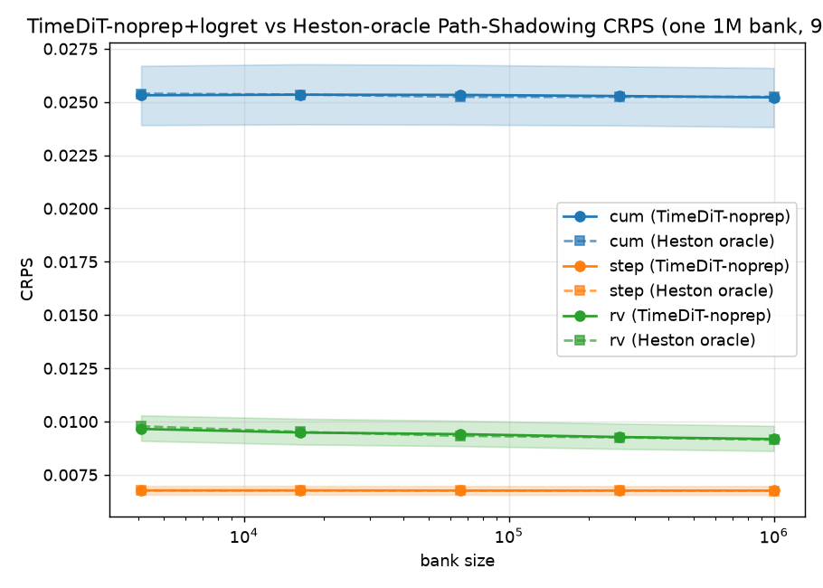

**Coverage calibration @ 1M.** Grouped bars — empirical coverage₅₀ (blue) and coverage₉₀ (orange) per
quantity, with the **dashed lines marking the 0.50 / 0.90 nominal targets**. cum is essentially exact on
both levels (0.507 / 0.898). The two visible shortfalls are **step₉₀ (0.881)** and **rv₉₀ (0.895 vs the
oracle's 0.924)**; the rv deficit is entirely one-sided — **upper**-miss 0.0742 against the ideal 0.05
and the oracle's 0.0469, i.e. the thin high-volatility tail discussed above. Bars only cover TimeDiT-raw;
the oracle and RW comparison numbers are in the tables.

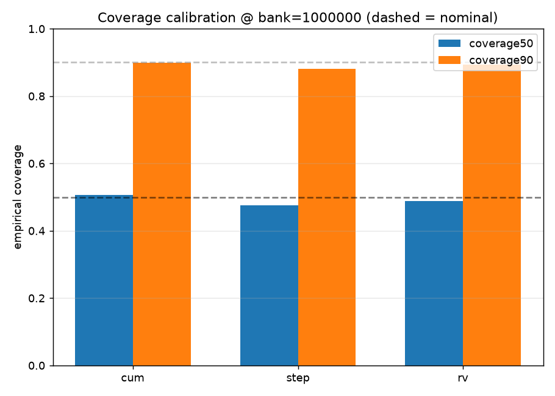

Artifacts: [`baseline_no_preproc/path_shadowing/pdf_summary.json`](baseline_no_preproc/path_shadowing/pdf_summary.json)
· driver [`baseline_no_preproc/path_shadowing/path_shadowing_pdf.py`](baseline_no_preproc/path_shadowing/path_shadowing_pdf.py)
· bank builder [`path_shadowing/gen_banks.py`](path_shadowing/gen_banks.py).

**Bottom line — which is best?** For TimeDiT, **raw-price input is the better choice**, and the reason
generalizes: GUIDELINE §0.1's decision rule asks whether the model has a **fixed output-noise floor**
that SBTS-scaled returns would fall below. **LS4 does** (decoder σ = 0.1) — so the transform plus a
unit-variance wrapper helped it. **TimeDiT does not** — its reverse variance is schedule-determined, so
the transform brings no benefit and costs 25 % of the normalized dynamic range (outlier-pinned min-max)
plus an error-integrating `exp ∘ cumsum` inverse. **This is §0.1's pattern running in reverse, and it is
the cleanest negative result in the experiment** because it is seed-stable rather than
variance-driven. **The path-shadowing run above was therefore built on the raw checkpoint** — running
a 16 h 1M-path bank on the transform that loses 31–3 would have measured the wrong model. Nothing
about TimeDiT's PS numbers is a preprocessing result: they characterise **raw-price TimeDiT as a
scenario-generating law**, and on that footing it matches the true Heston law to within the bootstrap
noise on all three quantities.

→ Experiment overview & pipeline: [`../README.md`](../README.md) ·
Recipe for adding methods: [`../GUIDELINE.md`](../GUIDELINE.md) ·
Original price-input TimeDiT: [`../../TimeDiT/README.md`](../../TimeDiT/README.md) ·
Phase-1 gate artifact: [`gate_seed0_compare.md`](gate_seed0_compare.md)
