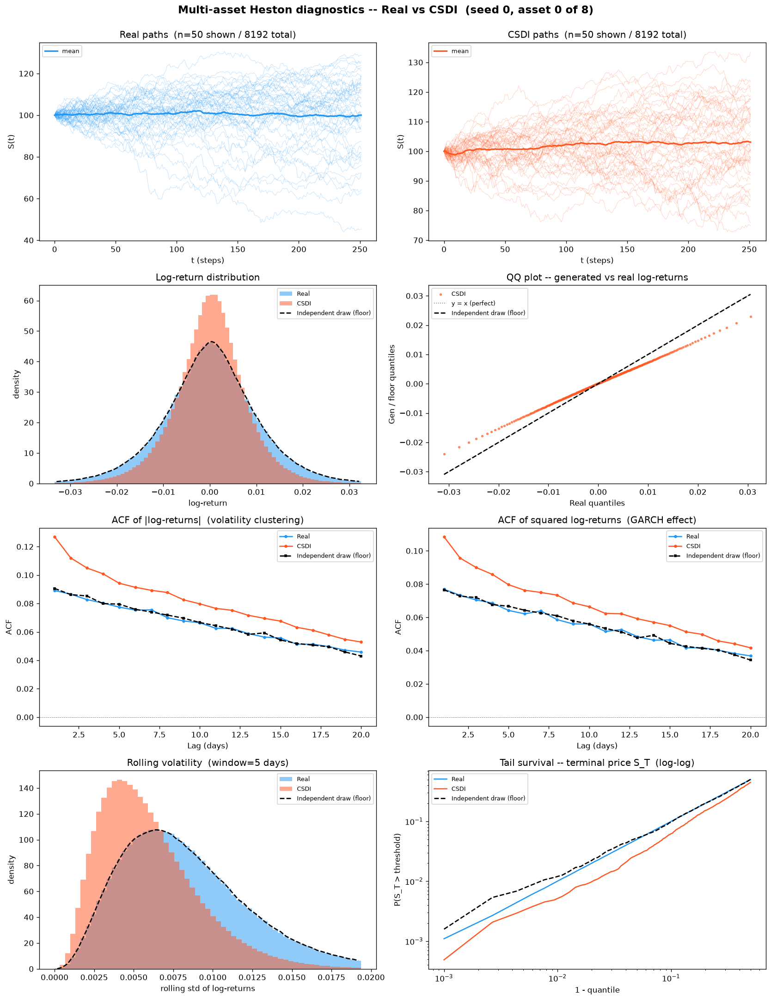
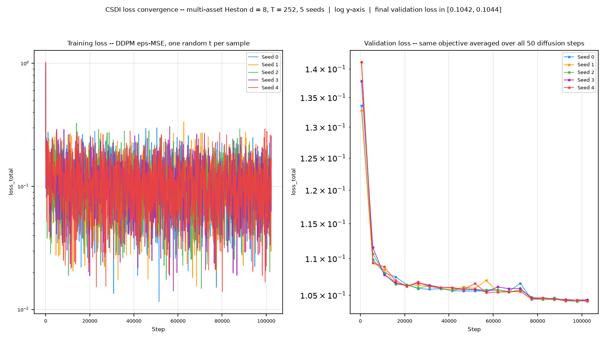
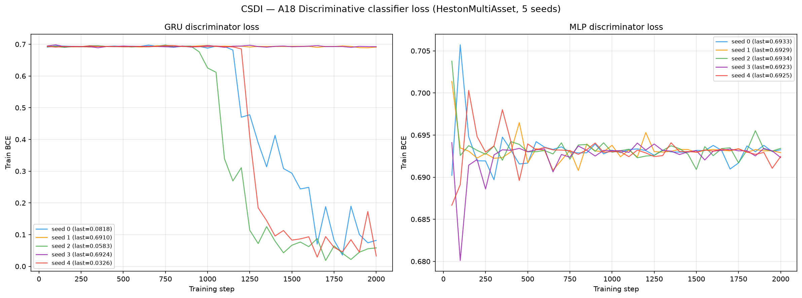
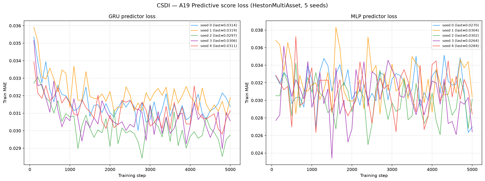

# CSDI on Multi-Asset Heston (d = 8)

**CSDI: Conditional Score-based Diffusion Models for Probabilistic Time Series Imputation**
(Tashiro, Song, Song & Ermon, NeurIPS 2021,
[arXiv:2107.03502](https://arxiv.org/abs/2107.03502)) applied to 8 192 **multi-asset** Heston
stochastic-volatility price paths (seq\_len = 252, **d = 8 correlated assets**).

CSDI is a **denoising diffusion model with a 2-D Transformer denoiser**: each residual block
runs one attention pass along the *time* axis and one along the *feature* axis, so cross-asset
structure is modelled by the same mechanism that models autocorrelation. It is trained on the
plain DDPM objective — a single scalar, `E_t ‖ε − ε_θ(x_t, t)‖²` — and generates by ancestral
sampling from pure noise through 50 reverse steps; it never touches a training path at
generation time. 413,057 parameters, trained for 200 epochs per seed, 5 seeds. Weights
in [`weights/`](weights/), per-seed hyperparameters in `weights/seed_*_config.json`.

The model is **joint over all 8 channels** — one network with `target_dim = 8` — not eight
independent univariate fits. The paper's headline task is *imputation*, i.e. conditional
generation; the unconditional regime used here is the one the authors describe in Sec 4.1 and
Appendix C, reached by setting `is_unconditional = 1` and `cond_mask ≡ 0`. The conditioning
mask never gates the network input, it only selects which points enter the loss through
`target_mask = observed_mask − cond_mask`; with `observed_mask ≡ 1` and `cond_mask ≡ 0` that
target is 1 everywhere and the objective collapses to standard DDPM. See
[`code/README.md`](code/README.md) for source, the vendored release, the bit-exact provenance
check against the committed d = 1 run, and the d = 8 deviations; and the dataset-level
[`../oldreadme.md`](../oldreadme.md) for the multi-asset Heston law itself, the per-asset vs
native metric scoping, and the memorisation diagnostic shared by all methods on this dataset.

> **Hyperparameters:** `layers=4`, `channels=64`, `nheads=8`,
> `diffusion_embedding_dim=128`, `num_steps=50`, `schedule=quad`,
> `beta_start=0.0001`, `beta_end=0.5`, `timeemb=128`, `featureemb=16`,
> `is_unconditional=1`; `Adam(lr=0.001, weight_decay=1e-6)` +
> `MultiStepLR(milestones=[int(0.75·epochs), int(0.9·epochs)], gamma=0.1)`,
> batch 16, 200 epochs.
> Every one of those numbers is the **released `config/base.yaml`** shipped with the paper's
> reference implementation, unchanged. What had to be retuned for d = 8 is **nothing** — the list `retuned_for_d8` in every `weights/seed_*_config.json` is empty.
> Only `target_dim` moved, from 1 to 8, and the data forces that — it is not a free choice.
> This is the strongest position available on this page: the d = 8 run is not a
> hyperparameter search that happened to land somewhere, it is the authors' configuration
> pointed at a wider tensor.
> The scaler was changed from a **global** standardise to a **per-channel** one. That is a
> scoping consequence rather than a retune: at K = 1 the d = 1 code's `S.mean()` **is** the
> per-feature statistic, and CSDI's own PhysioNet loader standardises per feature. A
> per-channel affine map leaves the cross-asset correlation matrix exactly unchanged, so the
> target coupling Σˢ — what A20 scores — survives both the standardisation and its
> inverse.

---

## Metrics A1-A34 + B, mean ± std across 5 seeds

> All metrics on **log-returns** $r_t = \log(S_{t+1}/S_t)$ unless noted. A26 uses price increments $\Delta S_t$.
> Rows marked *(native d=8)* are evaluated **once** on the full `(N, T, 8)` tensor; every other
> row is computed on each of the 8 univariate slices and reported as the **mean over assets**
> (per-asset breakdown in [`metrics_per_asset.csv`](metrics_per_asset.csv)).

| Metric | Mean ± Std | Seed 0 | Seed 1 | Seed 2 | Seed 3 | Seed 4 | Perfect floor |
|---|---|---|---|---|---|---|---|
| **Fat Tail** | | | | | | | |
| A1 Kurtosis Error ↓ | 0.1464 ± 0.03503 | 0.1394 | 0.09615 | 0.179 | 0.1918 | 0.1255 | 0.008385 |
| A2 \|r\| q95 Error ↓ | 0.005902 ± 2.80e-04 | 0.005733 | 0.005476 | 0.006266 | 0.006126 | 0.005909 | 4.58e-05 |
| A3 \|r\| q99 Error ↓ | 0.008171 ± 3.66e-04 | 0.007919 | 0.007631 | 0.008659 | 0.008446 | 0.008198 | 8.08e-05 |
| A4 Tail QQ Error ↓ | 0.005814 ± 2.75e-04 | 0.005647 | 0.005397 | 0.006171 | 0.006037 | 0.005817 | 5.62e-05 |
| A5 Hill Tail Index Error ↓ | 1.466 ± 0.3679 | 1.241 | 0.8989 | 1.503 | 1.939 | 1.747 | 0.5896 |
| **Distribution** | | | | | | | |
| A6 Path MMD² ↓ *(native d=8)* | 0.003622 ± 3.20e-04 | 0.003666 | 0.003019 | 0.003856 | 0.003925 | 0.003643 | 0.001948 |
| A7 Terminal MMD² ↓ *(native d=8)* | 0.002716 ± 1.58e-04 | 0.00268 | 0.002525 | 0.002763 | 0.00299 | 0.002622 | 0.001954 |
| A8 Increment MMD² ↓ *(native d=8)* | 0.009969 ± 1.98e-04 | 0.01027 | 0.009875 | 0.009937 | 0.009683 | 0.01008 | 8.71e-04 |
| A9 Volatility MMD ↓ *(native d=8)* | 0.4098 ± 0.01038 | 0.4222 | 0.4134 | 0.4043 | 0.3925 | 0.4164 | 0.008587 |
| A10 Terminal SWD ↓ *(native d=8)* | 2.836 ± 0.4006 | 2.926 | 2.639 | 2.662 | 3.561 | 2.39 | 1.141 |
| A11 Path SWD ↓ *(native d=8)* | 1.699 ± 0.1648 | 1.8 | 1.568 | 1.669 | 1.958 | 1.498 | 0.7258 |
| A12 RV Law Loss ↓ | 4.138 ± 0.1787 | 4.039 | 3.862 | 4.365 | 4.287 | 4.137 | 0.06398 |
| A13 Mean Path RMSE ↓ | 1.391 ± 0.6026 | 1.208 | 1.819 | 1.674 | 1.956 | 0.2959 | 0.1834 |
| A14 KS Log-returns ↓ | 0.06252 ± 0.002812 | 0.06133 | 0.05827 | 0.06587 | 0.06538 | 0.06174 | 9.64e-04 |
| A15 Skewness Error ↓ | 0.06925 ± 0.005297 | 0.06897 | 0.05987 | 0.06881 | 0.07367 | 0.07495 | 0.003568 |
| A16 QQ RMSE (300-pt) ↓ | 0.002819 ± 1.44e-04 | 0.002736 | 0.002601 | 0.003002 | 0.002944 | 0.002813 | 3.04e-05 |
| A17 Terminal Price KS ↓ | 0.06658 ± 0.01179 | 0.06799 | 0.07581 | 0.06697 | 0.07762 | 0.04453 | 0.01466 |
| **Adversarial** | | | | | | | |
| A18 Disc Score GRU ↓ *(native d=8)* | 0.2844 ± 0.2272 | 0.4658 | 0.006561 | 0.482 | 0.005951 | 0.4619 | 0.005523 |
| A18 Disc Score MLP ↓ *(native d=8)* | 0.006195 ± 0.004601 | 0.008697 | 1.53e-04 | 0.01358 | 0.005035 | 0.003509 | 0.006012 |
| **Predictive** | | | | | | | |
| A19 Pred Score GRU ↓ | 0.04953 ± 1.96e-05 | 0.04951 | 0.04951 | 0.04955 | 0.04954 | 0.04954 | 0.0492 |
| A19 Pred Score MLP ↓ | 0.04968 ± 4.91e-05 | 0.04974 | 0.0496 | 0.04966 | 0.04973 | 0.04968 | 0.04931 |
| **Temporal** | | | | | | | |
| A20 Covariance Error ↓ *(native d=8)* | 527.4 ± 45.47 | 540.5 | 468.2 | 516.6 | 506.4 | 605.5 | 55.2 |
| A21 ACF \|r\| Error (lags) ↓ | 0.01092 ± 0.001795 | 0.01071 | 0.008378 | 0.01325 | 0.01257 | 0.009703 | 0.001066 |
| A22 ACF r² Error (lags) ↓ | 0.00997 ± 0.001346 | 0.009545 | 0.008069 | 0.01172 | 0.01126 | 0.009247 | 0.001107 |
| A23 ACF \|r\| Lag-1 Error ↓ | 0.02199 ± 0.002742 | 0.02079 | 0.01827 | 0.02624 | 0.02374 | 0.02091 | 0.001038 |
| A24 ACF r² Lag-1 Error ↓ | 0.02007 ± 0.00194 | 0.0185 | 0.01784 | 0.02322 | 0.02118 | 0.01959 | 0.001036 |
| **Vol** | | | | | | | |
| A25 Mean RMSE ↓ *(native d=8)* | 6.091 ± 2.464 | 5.725 | 7.857 | 6.616 | 8.661 | 1.594 | 0.9234 |
| A26 Return Std Error ↓ | 0.288 ± 0.003593 | 0.291 | 0.2832 | 0.2928 | 0.285 | 0.2881 | 0.001745 |
| A27 Log-Return Std Error ↓ | 0.002921 ± 1.46e-04 | 0.002836 | 0.002698 | 0.003108 | 0.003045 | 0.002918 | 2.21e-05 |
| A28 Kurtosis Ratio (→ 1) | 0.8747 ± 0.02461 | 0.8802 | 0.9098 | 0.8503 | 0.8439 | 0.8895 | 1 |
| A29 Sigma Mean Error ↓ | 0.04547 ± 0.002292 | 0.04408 | 0.04205 | 0.04842 | 0.04745 | 0.04536 | 3.32e-04 |
| A30 Cross-Sect. Vol Path RMSE ↓ | 1.745 ± 0.1586 | 1.826 | 1.465 | 1.818 | 1.692 | 1.926 | 0.1596 |
| A31 Rolling Vol KS (w=5) ↓ | 0.2451 ± 0.01367 | 0.2368 | 0.2244 | 0.2621 | 0.2572 | 0.245 | 0.00208 |
| A32 Vol-of-Vol Error ↓ | 0.001181 ± 3.97e-05 | 0.001151 | 0.00112 | 0.001229 | 0.001207 | 0.001198 | 1.14e-05 |
| **Heston Spec** | | | | | | | |
| A33 Teacher-Sigma Corr ↑ | 0.002651 ± 0.00109 | 0.004053 | 0.003274 | 0.002814 | 7.92e-04 | 0.002324 | -1.35e-04 |
| A34 Teacher-Sigma RMSE ↓ | 0.1011 ± 7.47e-04 | 0.1007 | 0.09999 | 0.102 | 0.1018 | 0.1009 | 0.1013 |

> **Convention:** ↓ lower is better; ↑ higher is better; no arrow = no monotone direction. A28 Kurtosis Ratio: perfect = 1.0.
> **Headline:** **2 of the 36 A-metric rows sit at or below the independent-draw floor** — A33 Teacher-Sigma Corr, A34 Teacher-Sigma RMSE. The largest remaining gaps are **A26 Return Std Error** (0.288 vs floor 0.001745, 165.1×); **A29 Sigma Mean Error** (0.04547 vs floor 3.32e-04, 137.1×); **A27 Log-Return Std Error** (0.002921 vs floor 2.21e-05, 132.0×); **A2 |r| q95 Error** (0.005902 vs floor 4.58e-05, 128.9×). The floor, not the other method, is the reference on this page; the cross-method comparison lives in the dataset-level [`../README.md`](../README.md) so that neither method's page grades itself against a rival it was tuned beside.
> **Perfect floor** is the *independent-draw* floor (GUIDELINE §5.4): five fresh draws from the *same* SDE with the *same* frozen per-asset parameters at seeds 1000-1004, scored with byte-identical metric code. It is **non-zero everywhere** — two independent 8 192-path draws never produce identical histograms, ACFs, quantiles or covariance matrices. It is **not** a permutation of the test set, which would preserve every column-wise statistic exactly, collapse most metrics to 0, and be a misleading target.
> **A1-A5**: fat-tail block — kurtosis error, tail quantile / QQ errors on |log-returns|, Hill tail index. **A6-A11** *(native d=8)*: path-kernel distances on the full 8-dimensional tensor (MMD² on paths / terminal / increments / realized-vol; sliced-Wasserstein on terminal & full paths), the rows where a multivariate generalisation is genuinely meaningful.
> **A12-A17**: distribution block, per asset then averaged. **A18** *(native d=8)*: discriminative classifier on all 8 channels at once, score = |accuracy − 0.5|. **A19**: TSTR MAE, deliberately **per-asset** — `predictive_score.py::_train_gru` targets `data_t[idx, 1:, :1]`, i.e. only the first feature, so a native run would silently report an asset-0-only number under a multi-asset name.
> **A20** *(native d=8)*: error on the full terminal covariance matrix, which is the row that actually tests whether the d(d−1)/2 spot correlations Σˢ survived generation. **A21-A24**: ACF |r|/r² errors. **A25** *(native d=8)*: mean RMSE across all assets jointly.
> **A26-A32**: volatility block. **A28** kurtosis ratio: perfect = 1.0. **A33-A34**: Heston-specific — whether the generated S-paths retain the latent variance path. CSDI carries **no** explicit latent volatility state: its only latent is the diffusion noise level, which is not a stochastic-volatility path. It can only reproduce these rows by learning the variance clustering implicitly through the time-axis attention, which is the question the table answers.

**Rows at or past the floor, explained rather than banked.** Reaching the independent-draw floor is not a win: at the floor the metric can no longer tell a generator from a fresh draw of the true SDE, so the row has stopped discriminating, and past it the number has inverted its meaning. Each such row is given below with its margin measured in the method's own cross-seed std — the only scale on which "beat the floor" can mean anything at 5 seeds:

- **A33 Teacher-Sigma Corr** — 0.002651 against a floor of -1.35e-04; the margin is 0.002787, 2.56× its own cross-seed std (0.00109) — but both values are within 0.01 of zero, so the row has essentially no dynamic range here and the margin is not a practical effect whatever its statistical size.
- **A34 Teacher-Sigma RMSE** — 0.1011 against a floor of 0.1013; the margin is 2.14e-04, only 0.29× its own cross-seed std (7.47e-04), i.e. **not resolvable at 5 seeds**.


---

## B, Curve-Shape Metrics, mean ± std across 5 seeds

Each stylised-fact plot yields a **curve** L (a list of values), not a scalar. The curve is
computed **per asset and averaged over the 8 assets** *before* the combination below, so the
combination rules stay byte-identical to the d = 1 tree. For the real data (L_r) and generated
data (L_g) we build three lists, the curve L, its first finite difference L' (der), and its
second finite difference L'' (sec\_der), then combine the three sub-scores into **one number
per plot**:

- **MSE row**: for each list, dᵢ = mean((L_r − L_g)²). Reported mean = the **mean of the three sub-scores** (funct + der + sec\_der)/3; std = the sample std of that per-seed combined score across the 5 seeds. The **MSE row decides the cross-method winner**.
- **% err row**: for each list, dᵢ = mean(|L_g − L_r| / (|L_r| + 1e-6)) × 100, a proper MAPE, one division (the mean already averages over the curve's points). Reported value = the **function-level MAPE on the curve L itself**, the derivative / 2nd-derivative MAPE is **excluded** because diff(L)/diff2(L) have near-zero true values, so their relative error explodes into meaningless 10⁴-% figures. mean/std = mean and **sample std across the 5 seeds** of that per-seed function MAPE.
- **NRMSE row**: sqrt(mean((L_g − L_r)²)) / (max|L_r| − min|L_r| + 1e-12) × 100 on the curve L **only (funct-only)**, the ill-posed derivative / 2nd-derivative curves are excluded for the same reason as the % err row.
- **CVaR₉₀ / CVaR₉₅ rows**: tail-averaged pointwise curve error (Expected Shortfall) on the curve L **only (funct-only)**. Pointwise error eₜ = |L_g(t) − L_r(t)|; for q ∈ {0.90, 0.95}, CVaR_q = mean(eₜ for eₜ ≥ the q-th percentile of eₜ), then range-normalized like NRMSE (÷ (max|L_r| − min|L_r| + 1e-12) × 100).

All ↓ lower is better. The perfect floor is **non-zero** for all plots, it is the residual finite-sample error of an independent multi-asset Heston draw scored against the test set, identical across methods.
Five sublines per plot: **MSE**, **% error**, **NRMSE**, **CVaR₉₀** and **CVaR₉₅** (the per-seed columns hold that seed's combined score).

| Plot | Measure | Mean ± Std | Seed 0 | Seed 1 | Seed 2 | Seed 3 | Seed 4 | Perfect floor |
|---|---|---|---|---|---|---|---|---|
| **Path comparison** *(50×50 path-cloud)* | grid_tvd 50×50 (%) ↓ | 7.214% ± 0.3744% | 7.851% | 7.372% | 7.132% | 6.933% | 6.784% | 2.189% |
| **Log-return histogram** | MSE | 7.216 ± 1.094 | 6.521 | 5.678 | 8.607 | 8.289 | 6.984 | 0.0554 |
|  | % err | 38.88% ± 1.862% | 37.77% | 36.07% | 41.24% | 40.5% | 38.8% | 1.302% |
|  | NRMSE | 11.38% ± 0.8472% | 10.91% | 10.12% | 12.43% | 12.19% | 11.26% | 0.3601% |
|  | CVaR₉₀ | 27.84% ± 2.331% | 26.53% | 24.38% | 30.74% | 30.06% | 27.48% | 0.8339% |
|  | CVaR₉₅ | 30.29% ± 2.67% | 28.76% | 26.37% | 33.64% | 32.85% | 29.83% | 0.994% |
| **QQ plot** | MSE | 2.87e-06 ± 2.87e-07 | 2.70e-06 | 2.44e-06 | 3.24e-06 | 3.11e-06 | 2.85e-06 | 5.66e-10 |
|  | % err | 28.35% ± 3.839% | 25.05% | 23.55% | 32.53% | 33.01% | 27.62% | 0.5364% |
|  | NRMSE | 7.951% ± 0.4024% | 7.71% | 7.346% | 8.465% | 8.3% | 7.934% | 0.08644% |
|  | CVaR₉₀ | 8.626% ± 0.3878% | 8.383% | 8.043% | 9.137% | 8.929% | 8.635% | 0.09922% |
|  | CVaR₉₅ | 9.909% ± 0.4259% | 9.637% | 9.27% | 10.48% | 10.22% | 9.941% | 0.125% |
| **ACF \|r\|** | MSE | 3.33e-05 ± 7.89e-06 | 3.21e-05 | 2.33e-05 | 4.31e-05 | 4.15e-05 | 2.65e-05 | 3.33e-06 |
|  | % err | 10.12% ± 1.319% | 10.47% | 8.475% | 11.41% | 11.58% | 8.682% | 2.043% |
|  | NRMSE | 15.57% ± 2.257% | 15.37% | 12.42% | 18.45% | 17.7% | 13.93% | 2.523% |
|  | CVaR₉₀ | 34.58% ± 5.017% | 32.59% | 27.28% | 41.77% | 38.36% | 32.93% | 4.991% |
|  | CVaR₉₅ | 44.61% ± 5.326% | 41.7% | 37.56% | 53.08% | 47.67% | 43.05% | 5.542% |
| **ACF r²** | MSE | 2.66e-05 ± 4.61e-06 | 2.47e-05 | 2.05e-05 | 3.19e-05 | 3.20e-05 | 2.37e-05 | 3.98e-06 |
|  | % err | 10.58% ± 1.065% | 10.66% | 9.314% | 11.75% | 11.75% | 9.425% | 2.37% |
|  | NRMSE | 15.5% ± 1.927% | 15.05% | 12.85% | 17.93% | 17.45% | 14.24% | 2.772% |
|  | CVaR₉₀ | 35.13% ± 4.357% | 32.85% | 28.95% | 41.18% | 38.79% | 33.89% | 5.52% |
|  | CVaR₉₅ | 44.96% ± 4.326% | 41.13% | 40.08% | 51.96% | 47.33% | 44.32% | 6.131% |
| **Rolling vol histogram** | MSE | 226.6 ± 27.6 | 208.2 | 187 | 261.5 | 252.5 | 223.9 | 0.6039 |
|  | % err | 68.13% ± 3.046% | 66.36% | 63.46% | 71.98% | 70.71% | 68.13% | 1.536% |
|  | NRMSE | 27.19% ± 1.68% | 26.17% | 24.66% | 29.28% | 28.7% | 27.12% | 0.5137% |
|  | CVaR₉₀ | 59.14% ± 4.176% | 56.67% | 52.91% | 64.34% | 63.02% | 58.73% | 1.172% |
|  | CVaR₉₅ | 62.21% ± 4.552% | 59.52% | 55.42% | 67.82% | 66.51% | 61.78% | 1.362% |
| **Tail survival** | MSE | 0.002536 ± 3.16e-04 | 0.002352 | 0.002073 | 0.002943 | 0.002825 | 0.002488 | 2.03e-07 |
|  | % err | 27.35% ± 1.382% | 26.56% | 25.25% | 29.1% | 28.56% | 27.27% | 0.2297% |
|  | NRMSE | 8.749% ± 0.547% | 8.45% | 7.923% | 9.437% | 9.246% | 8.688% | 0.06634% |
|  | CVaR₉₀ | 12.07% ± 0.7518% | 11.66% | 10.94% | 13.01% | 12.76% | 11.99% | 0.1122% |
|  | CVaR₉₅ | 12.11% ± 0.7545% | 11.69% | 10.97% | 13.05% | 12.8% | 12.03% | 0.1175% |

> **Headline:** **0 of the 6 B plots** sit at or below the finite-sample floor on the deciding MSE row: none.
> **Cross-seed stability**: unlike a kernel method, CSDI's seed controls **both** the weight initialisation and every reverse-diffusion noise draw, so the std columns here absorb optimisation variance as well as sampling variance. That makes them the honest quantity to read: a seed that collapsed would widen them, and [`plots/loss_convergence.png`](plots/loss_convergence.png) shows whether any did.

---

## Stylised Facts Diagnostic (Multi-Asset Heston vs CSDI, seed 0, asset 0)

Eight-panel comparison: sample paths, return distribution, QQ plot, ACF of |returns|,
ACF of squared returns, rolling vol histogram (window=5), tail survival (log-log).

The third (black dashed) curve is the **independent-draw floor**, not a closed-form theory
curve: `metrics/heston_theory.py` is hard-wired to the d = 1 parameters (κ=2.0, θ=0.04,
ρ=−0.7, dt=1/250), so plotting it over d = 8 data would be a fabricated reference. Wherever
Real and the floor curve already disagree, the gap is finite-sample noise rather than a
modelling failure. **One asset is shown, not eight** — the *metrics* are averaged over all 8
assets, the *figure* is asset 0; pooling eight deliberately different volatilities
(σ 0.0097-0.0165) into one histogram would show the mixing, not the model.



---

## CSDI Training Loss (5 seeds)

CSDI optimises **one** term, the DDPM denoising objective
`E_t ‖ε − ε_θ(x_t, t)‖²` restricted to `target_mask` (which is 1 everywhere in the
unconditional regime). There is no KLD / NLL / reconstruction decomposition to break out, so
this figure is **two** panels, not five: train and validation, each with all 5 seeds overlaid.
The x-axis is **step**, not epoch: with batch 16 over 8 192 paths an epoch is 512 steps,
and step resolution is what makes the two learning-rate drops visible.

The two panels are **not the same quantity plotted twice, and their levels are not
comparable**. `calc_loss` draws **one** random diffusion step *t* per sample, so the training
curve is a one-sample estimate dominated by that sampling noise; `calc_loss_valid` averages
over **all 50** diffusion steps, so the validation curve is the low-variance one and is
the series to read convergence from. They are different estimators of different averages, not
train/test versions of one number — a validation curve sitting *below* the training curve here
is expected and is evidence of nothing. Validation runs on 256 held-out paths from
`heston_ma_S_val_8192x252x8.npy`, standardised with the **training** statistics, on a 20-point
cadence; a full 8 192-path validation pass costs ~50× a training epoch and would have
dominated the run.



Training wall-clock, read from `weights/seed_*_config.json` and
`generated_paths/seed_*/metadata.json` (**568 min total** across the 5 seeds, run
8 threads per process, 2 GPUs):

| Seed | Epochs | sec/epoch | Train wall-clock | Best train loss | Best val loss | NaN |
|------|--------|-----------|------------------|-----------------|---------------|-----|
| 0 | 200 | 29.0 s | 96.7 min | 0.0116 | 0.1042 | - |
| 1 | 200 | 29.0 s | 96.8 min | 0.0154 | 0.1042 | - |
| 2 | 200 | 35.3 s | 117.7 min | 0.0148 | 0.1041 | - |
| 3 | 200 | 35.4 s | 118.0 min | 0.0141 | 0.1043 | - |
| 4 | 200 | 41.7 s | 138.9 min | 0.0139 | 0.1042 | - |

Generation wall-clock — 50 reverse-diffusion steps from pure noise for each of 8 192
paths, 8 threads, **42.0 min total** across the 5 seeds:

| Seed | Workers | Elapsed |
|------|---------|---------|
| 0 | 8 | 6.7 min |
| 1 | 8 | 6.7 min |
| 2 | 8 | 9.5 min |
| 3 | 8 | 9.4 min |
| 4 | 8 | 9.7 min |

**No values were clipped.** Across all 5 seeds — 82 575 360 generated entries — `n_nonpositive_total_before_rescale` is **0**, with raw prices spanning [19.40, 217.08] before rescaling. This matters because the S0 pipeline is `clip(≤0) → multiply → set row 0`: the multiply is a per-path constant and therefore *exactly* a shift of the log-price level, leaving every log-return bit-identical, but a clip would not preserve log-returns and would silently distort A1-A25/A27-A34. It never fired, so no such distortion is present in these arrays.

---

## A18, Discriminative Classifier Training Loss

BCE loss during GRU and MLP classifier training (2 000 steps, logged every 50 steps).
A value near ln(2) ≈ 0.693 means the classifier cannot distinguish real from fake.
The d = 8 classifier is **native**: it sees all 8 channels at once.



---

## A19, Predictive Score Training Loss (TSTR)

MAE loss during GRU and MLP predictor training on *synthetic* data (5 000 steps, logged every 100 steps).
The predictor is run **once per asset**; the curves archived here are **asset 0's**, since the
driver stores the loss history only for `j == 0`. The A19 score in the table above is the mean
over all 8 assets.



---

## File layout

This tree is **self-contained**: code, inputs, outputs and documentation sit side by side,
unlike the d = 1 benchmark which splits `methods/<Method>/` from `results/Heston/<Method>/`.

```
results/HestonMultiAsset/CSDI/
├── README.md                             ← this file (generated by code/render_readme.py)
├── code/
│   ├── README.md                         source, provenance check, d = 8 deviations
│   ├── train_multiasset.py               trains one seed AND generates its 8192 paths
│   ├── collect_artifacts.py              rebuilds generation_time.csv, checks the §4 contract
│   ├── plot_losses.py                    plots/loss_convergence.png, 5 seeds overlaid
│   ├── plot_diagnostics_multiasset.py    the 8-panel stylised-facts figure
│   ├── measure_memorisation.py           nearest-neighbour memorisation diagnostic
│   ├── render_readme.py                  regenerates this README from the artefacts
│   └── reference/                        vendored CSDI release (main_model, diff_models,
│                                         config/base.yaml) — unmodified but for one
│                                         lazy import, see code/README.md
├── generated_paths/seed_{0..4}/
│   ├── generated_paths_8192x252x8.npy    (8192, 252, 8) float64 — gitignored, 132 MB
│   └── metadata.json                     shape, S0_exact, min/max, timings, clip counts (tracked)
├── weights/
│   ├── seed_{i}_model.pt                 state_dict + per-channel scaler
│   └── seed_{i}_config.json              full hyperparameter record incl. retuned_for_d8
├── losses/
│   ├── seed_{i}_losses.csv               step, phase, loss_total
│   ├── memorisation.json                 NN-ratio diagnostic on the final 8192-path output
│   └── generation_time.csv               wall-clock time per seed
├── plots/
│   ├── loss_convergence.png              train / validation eps-MSE, 5 seeds
│   ├── heston_diagnostics.png            8-panel stylised facts (seed 0, asset 0)
│   ├── disc_classifier_loss.png          A18 BCE curves, 5 seeds
│   └── pred_score_loss.png               A19 MAE curves, 5 seeds (asset 0)
├── metrics_summary.csv                   A1-A34, mean ± std, per seed
├── metrics_per_asset.csv                 per-metric × per-asset breakdown (8 rows per metric)
├── curve_b_aggregate.json                B curve-shape aggregate
├── grid_tvd_aggregate.json               path-cloud TVD
└── seed_{i}_metrics.json                 full per-seed dump incl. the per_asset block
```

There is deliberately **no `run_all_multiasset.py`**, although MULTIASSET_GUIDELINE.md §1 lists
one: CSDI generates inside `train_multiasset.py`, from the in-memory model immediately after
training. Splitting it out would mean reloading a checkpoint and duplicating the per-channel
scaler inversion and the S0 rescaling in a second place where the two copies could silently
drift. `collect_artifacts.py` fills the slot for post-generation bookkeeping and contract
verification.

The `.npy` arrays are **gitignored**: `(8192, 252, 8)` float64 = 132 MB each, over GitHub's
100 MB per-file hard limit, and LFS was ruled out. They are fully reproducible from the tracked
code and tracked hyperparameters; the `metadata.json` beside each array **is** tracked, so
shapes, price ranges and generation times stay auditable without the payload.

## Reproduce

```bash
cd /home/tbasseras/benchmark
PY=/home/tbasseras/gpu-venv/bin/python

# 1. dataset (~4 min on 8 cores) — only if dataset/HestonMultiAsset/*.npy are absent
cd dataset/HestonMultiAsset && python generate_heston_multiasset.py && cd -

# 2. provenance check against the committed d = 1 run (~3 min)
#    Reproduces methods/CSDI/losses/seed_0_losses.csv bit-for-bit. Use --epochs 4, NOT 1:
#    MultiStepLR's milestones are int(0.75*E) and int(0.9*E), which both collapse to 0 at
#    E = 1, so a 1-epoch probe silently trains at lr = 1e-5 and will not match.
cd methods/CSDI/code && CUDA_VISIBLE_DEVICES=2 $PY train_heston.py \
    --seed 0 --epochs 4 --tag provcheck && cd -

# 3. final 5 seeds, 200 epochs, 2 GPUs (~568 min of GPU time, ~3 waves wall-clock)
cd results/HestonMultiAsset/CSDI/code
GPUS=(2 3); CORES=("16-23" "24-31")
for wave in "0 1" "2 3" "4"; do
  i=0
  for s in $wave; do
    CUDA_VISIBLE_DEVICES=${GPUS[$i]} OMP_NUM_THREADS=8 taskset -c ${CORES[$i]} \
        $PY train_multiasset.py --seed $s & i=$((i+1))
  done
  wait
done
$PY collect_artifacts.py            # must print "5 rows" and exit 0 before anything downstream
cd /home/tbasseras/benchmark

# 4. independent-draw perfect-recovery floor (seeds 1000-1004, ~6 s)
/home/tbasseras/sbts-venv/bin/python metrics/gen_perfect_recovery_multiasset.py

# 5. metrics — both sides go through byte-identical code
CUDA_VISIBLE_DEVICES=2 $PY metrics/compute_all_multiasset.py --method perfect_recovery
CUDA_VISIBLE_DEVICES=2 $PY metrics/compute_all_multiasset.py --method CSDI \
    --dataset HestonMultiAsset --seeds 5

# 6. figures
$PY results/HestonMultiAsset/CSDI/code/plot_losses.py
$PY results/HestonMultiAsset/CSDI/code/plot_diagnostics_multiasset.py --method CSDI
$PY metrics/plot_score_losses.py --method CSDI --dataset HestonMultiAsset

# 7. memorisation diagnostic
$PY results/HestonMultiAsset/CSDI/code/measure_memorisation.py --seeds 0,1,2,3,4

# 8. regenerate this README from the artefacts
$PY results/HestonMultiAsset/CSDI/code/render_readme.py
```
