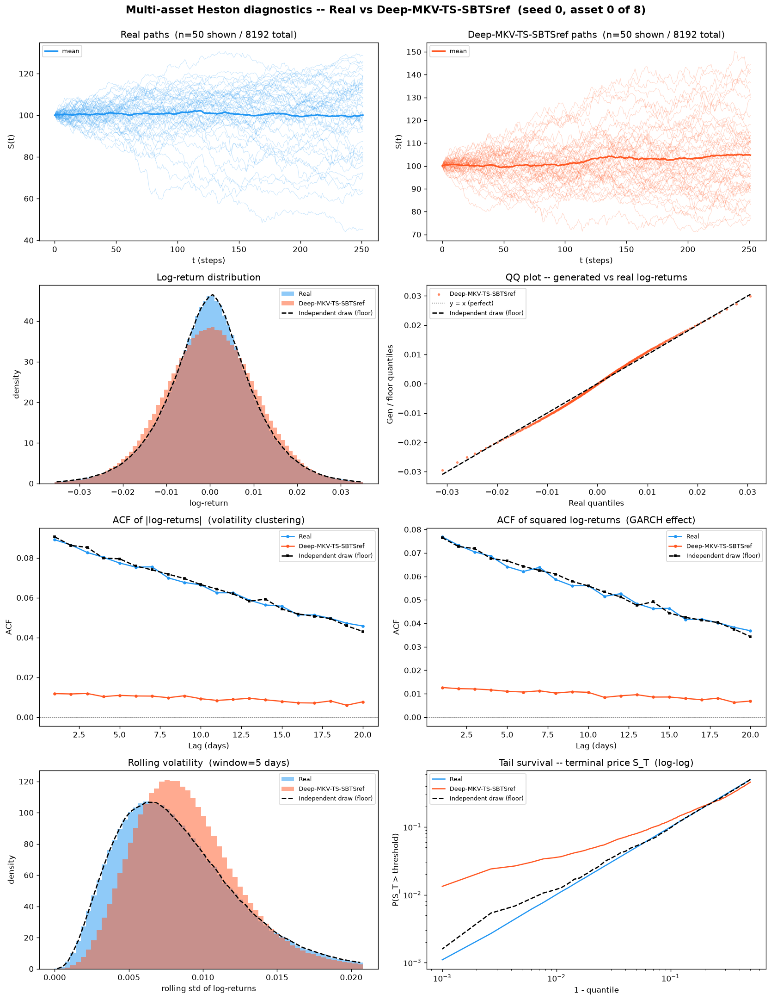
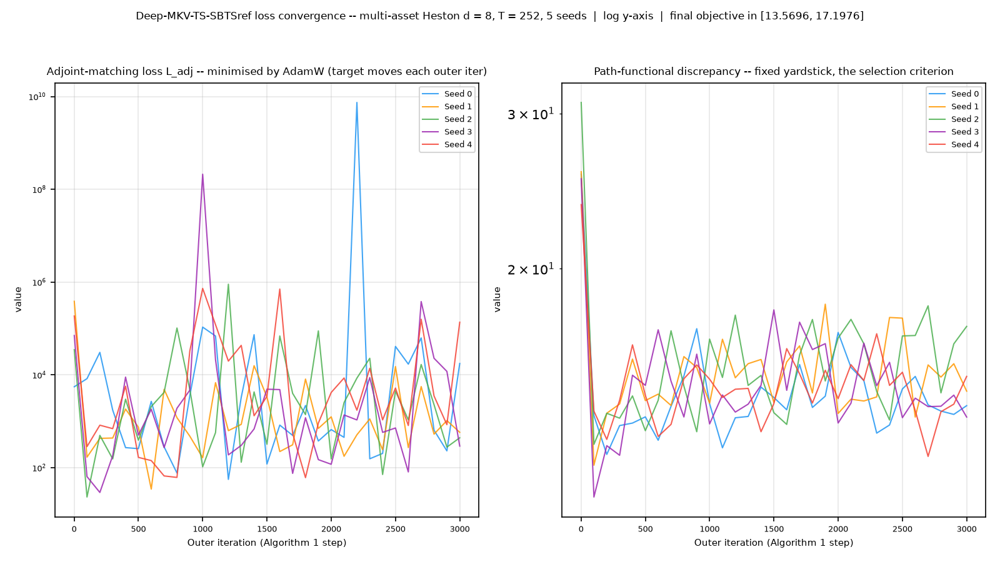
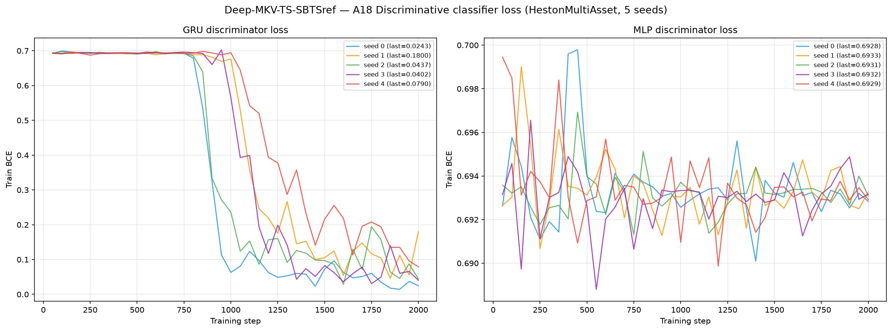
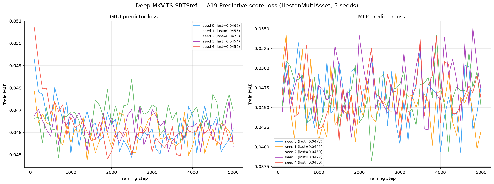

# Deep-MKV-TS with an SBTS reference on Multi-Asset Heston (d = 8)

**Deep McKean–Vlasov Time Series generation, with the Signature/Bridge Transport
Sampler as its reference SDE** — applied to 8 192 **multi-asset** Heston
stochastic-volatility price paths (seq\_len = 252, **d = 8 correlated assets**).

Like its sibling [`../Deep-MKV-TS/`](../Deep-MKV-TS/), this method does **not** learn a
generator from noise. It starts from a reference SDE and learns a **volatility
correction only** — the drift is never corrected. Training minimises

$$\mathcal{J}(\alpha) = \mathcal{D}\big(\mu^{\alpha}, \mu^{\text{data}}\big) + \eta\,\mathbb{E}\left[\int_0^T \tfrac12 \|\alpha_t\|^2 \sigma_t^{-2} dt\right], \qquad \eta = 1$$

where $\mathcal{D}$ is the same multi-component MMD discrepancy used at d = 1
(observed path, increments, terminal, global realized variance, $|r|$ ACF, $r^2$ ACF)
and the second term is a **specific-entropy running cost** penalising how far the
controlled law drifts from the reference law. The correction network is a
1-layer GRU (`hidden_dim = 96`) — **56,136 parameters**.
Weights in [`weights/`](weights/), per-seed hyperparameters in
`weights/seed_*_config.json`.

**What is different here is the reference, and it changes the character of the
method.** The sibling's reference is a *parametric* Guyon–Lekeufack kernel, fitted once
by penalised MLE and then frozen; after fitting, the training set is gone. This
variant's reference is the **SBTS-Markovian kernel average**

$$b^{\text{ref}}_i(X_{1:i}) = \frac{1}{\Delta t}\sum_m w_m(X_{1:i})\, R^m_{i+1}, \qquad w_m = \prod_{l=i-K+1}^{i} K_h\big(\tilde X^m_l - r_l\big)$$

over the 8 192-path **train** bank, with a radial quartic kernel
$K_h(u) = (h^2 - \|u\|^2)^2 \mathbf{1}_{\|u\|<h}$. It is nonparametric and has no
fitted weights at all: **the bank is the model**, and it is read at every one of the
251 sampling steps, at generation time. That is not a defect — it is what SBTS
*is* — but it does mean the memorisation section below has to be read against SBTS
proper as well as against the sibling, never against the sibling alone.

The reference diffusion is the **SBTS-corrected constant**
$\sigma^{\text{ref}} = \mathrm{diag}(0.167, 0.226, 0.199, 0.261, 0.188, 0.231, 0.177, 0.155)$: SBTS normalises each asset's
returns by its volatility before kernel-matching and multiplies it back afterwards, so
the diffusion the control corrects is that per-asset scale, constant in time and across
paths.

The model is **joint over all 8 assets** — one reference kernel with `state_dim = 8`
and one control network emitting a full `(d, d)` correction — not eight independent
univariate fits. See [`code/README.md`](code/README.md) for the reference kernel, the
analytic weight Jacobian and the forced d = 8 deviations; [`code/SWEEP.md`](code/SWEEP.md)
for the hyperparameter search and its measured noise floor; and the dataset-level
[`../oldreadme.md`](../oldreadme.md) for the multi-asset Heston law itself and the
per-asset vs native metric scoping.

> **Reference hyperparameters (not stored in the checkpoint):** `h=0.36`,
> `markov_order=20`, `npi=1`, `weight_grad_mode=analytic`,
> `jacobian_lags=-1` (`-1` = all `K` lags enter the adjoint, the exact
> gradient; truncating to the newest lag alone leaves 2 of the 21
> states in the drift window with no gradient at all and is wrong by 100%%
> relative error against finite differences),
> bank = the 8 192-path **train** split.
> These are printed here because the checkpoint does not contain them: the kernel is
> rebuilt at load time from these four knobs plus the price bank, so two runs with
> identical weights and different `h` are **different models**. `h`, `markov_order` and
> `npi` were all selected on the validation split and are the search's only real wins;
> see `code/SWEEP.md`.
>
> **Training hyperparameters:** `eta=1`, `sigma_min=0.001`,
> `sigma_max=0.6`, `lambda_scale=50`, `kappa_scale=100`, discrepancy
> preset `old_fullv_w0p25` with `abs_return_acf_weight=0.25`,
> `squared_return_acf_weight=0.125`; `hidden_dim=96`,
> `num_layers=1`, batch 256, target batch 256;
> `AdamW(lr=2.5e-05, weight_decay=1e-05)`, `grad_clip_norm=5`,
> `ce_target_mode="ridge"` with `ridge_lambda=10`, `ce_ridge=0.001`;
> 3000 outer iterations per seed, 5 seeds.
>
> **The learning rate is not the d = 1 value and could not be.** The reference changed,
> so the loss surface changed with it; `lr` and `ridge_lambda` were re-swept on
> validation. `code/SWEEP.md` also records the **run-to-run noise floor** measured
> before any of those comparisons were believed — several arms that look like wins are
> inside it, and are reported there as ties rather than promoted.
>
> **The weight Jacobian is computed analytically, alongside $b^{\text{ref}}$
> itself** (`weight_grad_mode=analytic`). Because
> $\partial \log w_m / \partial r_i = 4\delta_m/(h^2 - \|\delta_m\|^2)$ with
> $\delta_m = \tilde X^m_i - r_i$, the kernel's own weights supply the derivative for
> free during the same pass that computes the average, so no autograd replay is needed.
> This is a **correctness** setting, not a speed one: the alternative mode drops
> $\partial b^{\text{ref}}/\partial x$ from the backward pass entirely.
> One caveat, stated because it is a real limitation and not a rounding error: only the
> **newest lag** is differentiated, so what is carried is a partial, not the total,
> $\partial b^{\text{ref}}/\partial X_{1:i}$.
>
> **There is no drift-correction term** (`allow_drift_correction` is **off**). This
> follows the specified Algorithm 1, whose state update is
> $X_{t_{k+1}} = X_{t_k} + b^{\text{ref}}\Delta t_k + \sigma_{t_k}\sqrt{\Delta t_k}\,\varepsilon_{t_{k+1}}$
> with no additional drift term. `code/probe_dc.py` measured the alternative rather than
> assuming it away.
>
> **The control is matrix-valued, not diagonal** (`control=MultivariateReferenceDriftSpecificEntropyMatrixControl`). The paper clips the
> *eigenvalues* of $\Theta$; at d > 1, clipping its diagonal entries instead is a
> different operator. $\Theta$ is symmetric but **indefinite**, so Cholesky and LDLᵀ are
> invalid and `torch.linalg.eigh` is the right primitive, with the Daleckii–Krein /
> Löwner form for its adjoint. The two coincide bitwise only at d = 1.
>
> **`max_eigh_batch=32768`** chunks the batched eigendecomposition: cuSOLVER's
> batched `eigh` fails above roughly 64 k matrices, and batch 256 × 251
> steps = 64 256 sits inside that failure band. Chunking changes throughput, not
> results, and `code/eigh_fallback.py` counts every CPU LAPACK retry into the config so
> a silent numerical detour cannot go unrecorded.
>
> **The reported checkpoint is chosen on validation**, not the final step — step
> 1000, 2000, 2500. There is **no learning-rate scheduler anywhere in the codebase**, so this
> is bitwise identical to having stopped training there.

---

## Metrics A1-A34 + B, mean ± std across 5 seeds

> All metrics on **log-returns** $r_t = \log(S_{t+1}/S_t)$ unless noted. A26 uses price increments $\Delta S_t$.
> Rows marked *(native d=8)* are evaluated **once** on the full `(N, T, 8)` tensor; every other
> row is computed on each of the 8 univariate slices and reported as the **mean over assets**
> (per-asset breakdown in [`metrics_per_asset.csv`](metrics_per_asset.csv)).

| Metric | Mean ± Std | Seed 0 | Seed 1 | Seed 2 | Seed 3 | Seed 4 | Perfect floor |
|---|---|---|---|---|---|---|---|
| **Fat Tail** | | | | | | | |
| A1 Kurtosis Error ↓ | 0.2268 ± 0.006905 | 0.2376 | 0.2215 | 0.2311 | 0.2253 | 0.2183 | 0.008385 |
| A2 \|r\| q95 Error ↓ | 5.05e-04 ± 9.60e-05 | 3.51e-04 | 4.61e-04 | 6.03e-04 | 6.09e-04 | 5.02e-04 | 4.58e-05 |
| A3 \|r\| q99 Error ↓ | 0.001067 ± 5.02e-05 | 0.001145 | 0.001031 | 0.001105 | 0.001043 | 0.00101 | 8.08e-05 |
| A4 Tail QQ Error ↓ | 6.92e-04 ± 7.03e-05 | 5.92e-04 | 6.37e-04 | 7.77e-04 | 7.58e-04 | 6.97e-04 | 5.62e-05 |
| A5 Hill Tail Index Error ↓ | 5.135 ± 0.1114 | 5.134 | 5.063 | 5.001 | 5.332 | 5.146 | 0.5896 |
| **Distribution** | | | | | | | |
| A6 Path MMD² ↓ *(native d=8)* | 0.00299 ± 3.54e-04 | 0.00311 | 0.002531 | 0.003476 | 0.003196 | 0.002639 | 0.001948 |
| A7 Terminal MMD² ↓ *(native d=8)* | 0.002685 ± 2.39e-04 | 0.002615 | 0.002477 | 0.003102 | 0.002781 | 0.002451 | 0.001954 |
| A8 Increment MMD² ↓ *(native d=8)* | 0.001676 ± 1.56e-04 | 0.001444 | 0.001571 | 0.001827 | 0.001858 | 0.001681 | 8.71e-04 |
| A9 Volatility MMD ↓ *(native d=8)* | 0.06617 ± 0.006584 | 0.05721 | 0.06046 | 0.07511 | 0.07098 | 0.06707 | 0.008587 |
| A10 Terminal SWD ↓ *(native d=8)* | 2.252 ± 0.309 | 2.033 | 2.04 | 2.826 | 2.329 | 2.03 | 1.141 |
| A11 Path SWD ↓ *(native d=8)* | 1.501 ± 0.1677 | 1.54 | 1.345 | 1.762 | 1.563 | 1.294 | 0.7258 |
| A12 RV Law Loss ↓ | 1.151 ± 0.05499 | 1.092 | 1.096 | 1.205 | 1.226 | 1.138 | 0.06398 |
| A13 Mean Path RMSE ↓ | 0.4067 ± 0.0314 | 0.4371 | 0.3465 | 0.4107 | 0.4234 | 0.4161 | 0.1834 |
| A14 KS Log-returns ↓ | 0.02742 ± 8.01e-04 | 0.0264 | 0.0267 | 0.02832 | 0.02833 | 0.02736 | 9.64e-04 |
| A15 Skewness Error ↓ | 0.04499 ± 0.001099 | 0.04565 | 0.04383 | 0.0468 | 0.04411 | 0.04456 | 0.003568 |
| A16 QQ RMSE (300-pt) ↓ | 8.72e-04 ± 4.07e-05 | 8.26e-04 | 8.33e-04 | 9.17e-04 | 9.22e-04 | 8.64e-04 | 3.04e-05 |
| A17 Terminal Price KS ↓ | 0.03958 ± 0.001928 | 0.03638 | 0.04106 | 0.04152 | 0.04056 | 0.03839 | 0.01466 |
| **Adversarial** | | | | | | | |
| A18 Disc Score GRU ↓ *(native d=8)* | 0.4734 ± 0.01189 | 0.4899 | 0.4622 | 0.4738 | 0.4826 | 0.4585 | 0.005523 |
| A18 Disc Score MLP ↓ *(native d=8)* | 0.006622 ± 0.003915 | 0.003509 | 0.001678 | 0.006866 | 0.008087 | 0.01297 | 0.006012 |
| **Predictive** | | | | | | | |
| A19 Pred Score GRU ↓ | 0.0492 ± 5.28e-06 | 0.0492 | 0.0492 | 0.0492 | 0.04921 | 0.04921 | 0.0492 |
| A19 Pred Score MLP ↓ | 0.04945 ± 1.73e-04 | 0.04928 | 0.04959 | 0.04933 | 0.04971 | 0.04932 | 0.04931 |
| **Temporal** | | | | | | | |
| A20 Covariance Error ↓ *(native d=8)* | 412.5 ± 53.48 | 479 | 352.2 | 409.6 | 466.8 | 355.2 | 55.2 |
| A21 ACF \|r\| Error (lags) ↓ | 0.06168 ± 0.001082 | 0.06328 | 0.06102 | 0.06107 | 0.06262 | 0.06041 | 0.001066 |
| A22 ACF r² Error (lags) ↓ | 0.04995 ± 0.001083 | 0.05154 | 0.04931 | 0.04927 | 0.05091 | 0.04871 | 0.001107 |
| A23 ACF \|r\| Lag-1 Error ↓ | 0.07262 ± 0.001157 | 0.07424 | 0.07172 | 0.07214 | 0.07372 | 0.07128 | 0.001038 |
| A24 ACF r² Lag-1 Error ↓ | 0.05938 ± 0.001185 | 0.06108 | 0.05851 | 0.05872 | 0.0605 | 0.05808 | 0.001036 |
| **Vol** | | | | | | | |
| A25 Mean RMSE ↓ *(native d=8)* | 2.043 ± 0.1728 | 2.034 | 1.761 | 2.228 | 2.218 | 1.974 | 0.9234 |
| A26 Return Std Error ↓ | 0.111 ± 0.005592 | 0.1049 | 0.1043 | 0.1167 | 0.1174 | 0.1116 | 0.001745 |
| A27 Log-Return Std Error ↓ | 6.26e-04 ± 5.51e-05 | 5.44e-04 | 5.85e-04 | 6.83e-04 | 6.84e-04 | 6.34e-04 | 2.21e-05 |
| A28 Kurtosis Ratio (→ 1) | 1.779 ± 0.04949 | 1.847 | 1.716 | 1.784 | 1.815 | 1.731 | 1 |
| A29 Sigma Mean Error ↓ | 0.01003 ± 8.44e-04 | 0.00883 | 0.009325 | 0.01092 | 0.01094 | 0.01011 | 3.32e-04 |
| A30 Cross-Sect. Vol Path RMSE ↓ | 0.9101 ± 0.0753 | 0.8202 | 0.8344 | 0.974 | 1.012 | 0.9093 | 0.1596 |
| A31 Rolling Vol KS (w=5) ↓ | 0.106 ± 0.003065 | 0.1033 | 0.1024 | 0.1092 | 0.1099 | 0.105 | 0.00208 |
| A32 Vol-of-Vol Error ↓ | 3.90e-04 ± 2.27e-05 | 4.30e-04 | 3.90e-04 | 3.79e-04 | 3.90e-04 | 3.60e-04 | 1.14e-05 |
| **Heston Spec** | | | | | | | |
| A33 Teacher-Sigma Corr ↑ | -0.00259 ± 0.002108 | -0.001024 | -0.005511 | 5.07e-04 | -0.003212 | -0.003712 | -1.35e-04 |
| A34 Teacher-Sigma RMSE ↓ | 0.09568 ± 4.47e-04 | 0.09481 | 0.09578 | 0.09591 | 0.09585 | 0.09606 | 0.1013 |

> **Convention:** ↓ lower is better; ↑ higher is better; no arrow = no monotone direction. A28 Kurtosis Ratio: perfect = 1.0.
> **Headline:** **1 of the 36 A-metric rows sit at or below the independent-draw floor** — A34 Teacher-Sigma RMSE. The largest remaining gaps are **A18 Disc Score GRU** (0.4734 vs floor 0.005523, 85.7×); **A23 ACF |r| Lag-1 Error** (0.07262 vs floor 0.001038, 70.0×); **A26 Return Std Error** (0.111 vs floor 0.001745, 63.6×); **A21 ACF |r| Error (lags)** (0.06168 vs floor 0.001066, 57.9×). The floor, not the other methods, is the reference on this page; the cross-method comparison lives in the dataset-level [`../README.md`](../README.md) so that no method's page grades itself against a rival it was tuned beside.
> **Perfect floor** is the *independent-draw* floor (GUIDELINE §5.4): five fresh draws from the *same* SDE with the *same* frozen per-asset parameters at seeds 1000-1004, scored with byte-identical metric code. It is **non-zero everywhere** — two independent 8 192-path draws never produce identical histograms, ACFs, quantiles or covariance matrices. It is **not** a permutation of the test set, which would preserve every column-wise statistic exactly, collapse most metrics to 0, and be a misleading target.
> **A1-A5**: fat-tail block — kurtosis error, tail quantile / QQ errors on |log-returns|, Hill tail index. **A6-A11** *(native d=8)*: path-kernel distances on the full 8-dimensional tensor (MMD² on paths / terminal / increments / realized-vol; sliced-Wasserstein on terminal & full paths), the rows where a multivariate generalisation is genuinely meaningful.
> **A12-A17**: distribution block, per asset then averaged. **A18** *(native d=8)*: discriminative classifier on all 8 channels at once, score = |accuracy − 0.5|. **A19**: TSTR MAE, deliberately **per-asset** — `predictive_score.py::_train_gru` targets `data_t[idx, 1:, :1]`, i.e. only the first feature, so a native run would silently report an asset-0-only number under a multi-asset name.
> **A20** *(native d=8)*: error on the full terminal covariance matrix. This is the row that matters most here: the correction network emits a full `(d, d)` matrix and the spectral clip acts on eigenvalues, so A20 is the direct test of whether the d(d−1)/2 spot correlations Σˢ survived the control. A diagonal control would have no mechanism to get this row right. It is also where the two references can be told apart — the SBTS kernel average inherits the bank's cross-asset structure directly rather than through fitted parameters. **A21-A24**: ACF |r|/r² errors. **A25** *(native d=8)*: mean RMSE across all assets jointly.
> **A26-A32**: volatility block. **A28** kurtosis ratio: perfect = 1.0. **A33-A34**: Heston-specific — whether the generated S-paths retain the latent variance path. Note what carries the volatility here: the reference σ is a **constant** per-asset scale (the SBTS normalisation), so unlike the sibling there is no fitted volatility state in the reference at all. Everything time-varying in the generated volatility comes from the learned control and from the kernel's path-dependent drift. These rows therefore test the control much more directly than the sibling's do.

---

## B, Curve-Shape Metrics, mean ± std across 5 seeds

Each stylised-fact plot yields a **curve** L (a list of values), not a scalar. The curve is
computed **per asset and averaged over the 8 assets** *before* the combination below, so the
combination rules stay byte-identical to the d = 1 tree. For the real data (L_r) and generated
data (L_g) we build three lists, the curve L, its first finite difference L' (der), and its
second finite difference L'' (sec\_der), then combine the three sub-scores into **one number
per plot**:

- **MSE row**: for each list, dᵢ = mean((L_r − L_g)²). Reported mean = the **mean of the three sub-scores** (funct + der + sec\_der)/3; std = the sample std of that per-seed combined score across the 5 seeds. The **MSE row decides the cross-method winner**.
- **% err row**: for each list, dᵢ = mean(|L_g − L_r| / (|L_r| + 1e-6)) × 100, a proper MAPE, one division (the mean already averages over the curve's points). Reported value = the **function-level MAPE on the curve L itself**, the derivative / 2nd-derivative MAPE is **excluded** because diff(L)/diff2(L) have near-zero true values, so their relative error explodes into meaningless 10⁴-% figures. mean/std = mean and **sample std across the 5 seeds** of that per-seed function MAPE.
- **NRMSE row**: sqrt(mean((L_g − L_r)²)) / (max|L_r| − min|L_r| + 1e-12) × 100 on the curve L **only (funct-only)**, the ill-posed derivative / 2nd-derivative curves are excluded for the same reason as the % err row.
- **CVaR₉₀ / CVaR₉₅ rows**: tail-averaged pointwise curve error (Expected Shortfall) on the curve L **only (funct-only)**. Pointwise error eₜ = |L_g(t) − L_r(t)|; for q ∈ {0.90, 0.95}, CVaR_q = mean(eₜ for eₜ ≥ the q-th percentile of eₜ), then range-normalized like NRMSE (÷ (max|L_r| − min|L_r| + 1e-12) × 100).

All ↓ lower is better. The perfect floor is **non-zero** for all plots, it is the residual finite-sample error of an independent multi-asset Heston draw scored against the test set, identical across methods.
Five sublines per plot: **MSE**, **% error**, **NRMSE**, **CVaR₉₀** and **CVaR₉₅** (the per-seed columns hold that seed's combined score).

| Plot | Measure | Mean ± Std | Seed 0 | Seed 1 | Seed 2 | Seed 3 | Seed 4 | Perfect floor |
|---|---|---|---|---|---|---|---|---|
| **Path comparison** *(50×50 path-cloud)* | grid_tvd 50×50 (%) ↓ | 7.899% ± 0.1405% | 7.77% | 7.86% | 8.17% | 7.817% | 7.875% | 2.189% |
| **Log-return histogram** | MSE | 1.866 ± 0.09227 | 1.758 | 1.754 | 1.973 | 1.935 | 1.911 | 0.0554 |
|  | % err | 12.12% ± 0.5918% | 11.42% | 11.46% | 12.85% | 12.67% | 12.17% | 1.302% |
|  | NRMSE | 5.592% ± 0.1306% | 5.467% | 5.442% | 5.735% | 5.753% | 5.561% | 0.3601% |
|  | CVaR₉₀ | 13.68% ± 0.3047% | 13.36% | 13.36% | 14% | 14.07% | 13.61% | 0.8339% |
|  | CVaR₉₅ | 15.26% ± 0.3334% | 14.91% | 14.88% | 15.55% | 15.71% | 15.23% | 0.994% |
| **QQ plot** | MSE | 2.69e-07 ± 2.32e-08 | 2.46e-07 | 2.45e-07 | 2.91e-07 | 3.01e-07 | 2.60e-07 | 5.66e-10 |
|  | % err | 14.77% ± 0.4263% | 14.16% | 14.55% | 15.31% | 15.2% | 14.63% | 0.5364% |
|  | NRMSE | 2.402% ± 0.1166% | 2.256% | 2.284% | 2.541% | 2.517% | 2.412% | 0.08644% |
|  | CVaR₉₀ | 1.784% ± 0.09059% | 1.676% | 1.694% | 1.902% | 1.869% | 1.782% | 0.09922% |
|  | CVaR₉₅ | 1.869% ± 0.09074% | 1.761% | 1.778% | 1.992% | 1.947% | 1.866% | 0.125% |
| **ACF \|r\|** | MSE | 9.00e-04 ± 3.56e-05 | 9.53e-04 | 8.80e-04 | 8.81e-04 | 9.31e-04 | 8.57e-04 | 3.33e-06 |
|  | % err | 76.12% ± 2.154% | 79.14% | 75.01% | 74.95% | 78.12% | 73.39% | 2.043% |
|  | NRMSE | 93.4% ± 2.191% | 96.53% | 92.16% | 92.37% | 95.34% | 90.6% | 2.523% |
|  | CVaR₉₀ | 134.3% ± 2.437% | 137.8% | 132.6% | 133.2% | 136.4% | 131.3% | 4.991% |
|  | CVaR₉₅ | 137.3% ± 2.446% | 140.7% | 135.4% | 136.3% | 139.5% | 134.4% | 5.542% |
| **ACF r²** | MSE | 5.63e-04 ± 2.84e-05 | 6.05e-04 | 5.46e-04 | 5.47e-04 | 5.86e-04 | 5.28e-04 | 3.98e-06 |
|  | % err | 71.26% ± 2.467% | 74.76% | 69.96% | 69.87% | 73.51% | 68.19% | 2.37% |
|  | NRMSE | 83.32% ± 2.366% | 86.73% | 81.88% | 82.17% | 85.41% | 80.39% | 2.772% |
|  | CVaR₉₀ | 122.5% ± 2.695% | 126.3% | 120.7% | 121.3% | 125.1% | 119.3% | 5.52% |
|  | CVaR₉₅ | 125.4% ± 2.657% | 129.4% | 123.5% | 123.9% | 127.6% | 122.5% | 6.131% |
| **Rolling vol histogram** | MSE | 57.54 ± 2.041 | 56.13 | 54.49 | 59.95 | 59.47 | 57.65 | 0.6039 |
|  | % err | 21.32% ± 0.4801% | 21.51% | 20.61% | 21.75% | 21.84% | 20.92% | 1.536% |
|  | NRMSE | 13.28% ± 0.252% | 13.22% | 12.97% | 13.51% | 13.64% | 13.09% | 0.5137% |
|  | CVaR₉₀ | 26.88% ± 0.5212% | 26.49% | 26.26% | 27.38% | 27.6% | 26.65% | 1.172% |
|  | CVaR₉₅ | 28.38% ± 0.5038% | 28.06% | 27.75% | 28.89% | 29.05% | 28.14% | 1.362% |
| **Tail survival** | MSE | 4.78e-04 ± 3.18e-05 | 4.40e-04 | 4.41e-04 | 5.10e-04 | 5.12e-04 | 4.85e-04 | 2.03e-07 |
|  | % err | 9.121% ± 0.4664% | 8.522% | 8.655% | 9.663% | 9.584% | 9.182% | 0.2297% |
|  | NRMSE | 3.747% ± 0.1305% | 3.595% | 3.606% | 3.891% | 3.893% | 3.749% | 0.06634% |
|  | CVaR₉₀ | 5.343% ± 0.17% | 5.154% | 5.153% | 5.527% | 5.54% | 5.342% | 0.1122% |
|  | CVaR₉₅ | 5.36% ± 0.1697% | 5.171% | 5.17% | 5.543% | 5.557% | 5.358% | 0.1175% |

> **Headline:** **0 of the 6 B plots** sit at or below the finite-sample floor on the deciding MSE row: none.
> **Cross-seed stability**: the seed here controls **three** independent things — the control network's initialisation, every Euler–Maruyama increment drawn during training, and the batch resampling that re-fits the Z-proxy at each outer iteration. The reference is *not* among them, and for a stronger reason than in the sibling: there is nothing to estimate. The kernel has no fitted parameters, and the bank it averages over is the full train split, identical for all 5 seeds. So none of the spread below comes from the reference — what remains is optimisation plus sampling variance, and [`plots/loss_convergence.png`](plots/loss_convergence.png) shows whether any seed diverged. Read that figure before this table: `code/SWEEP.md` records a measured run-to-run noise floor, and a seed spread of the same order is the sampler, not the model. Generation uses a **separate** seed stream (90000 + 1000·seed + chunk) that never reuses a training seed.

---

## Stylised Facts Diagnostic (Multi-Asset Heston vs Deep-MKV-TS-SBTSref, seed 0, asset 0)

Eight-panel comparison: sample paths, return distribution, QQ plot, ACF of |returns|,
ACF of squared returns, rolling vol histogram (window=5), tail survival (log-log).

The third (black dashed) curve is the **independent-draw floor**, not a closed-form theory
curve: `metrics/heston_theory.py` is hard-wired to the d = 1 parameters (κ=2.0, θ=0.04,
ρ=−0.7, dt=1/250), so plotting it over d = 8 data would be a fabricated reference. Wherever
Real and the floor curve already disagree, the gap is finite-sample noise rather than a
modelling failure. **One asset is shown, not eight** — the *metrics* are averaged over all 8
assets, the *figure* is asset 0; pooling eight deliberately different volatilities
(σ 0.0097-0.0165) into one histogram would show the mixing, not the model.



---

## Deep-MKV-TS-SBTSref Training Loss (5 seeds)

The figure has **two** panels, and they are not the same quantity plotted twice.

`loss_total` is the **adjoint-matching loss**
$L_{\text{adj}} = \frac{1}{PM}\sum\sum \|\hat Z^{\theta} - Z^{\text{proxy}}\|^2$ — the
scalar AdamW actually minimises. Its target **moves**: $Z^{\text{proxy}}$ is re-estimated by
ridge regression on freshly sampled paths at every outer iteration, so this curve measures
distance to a target that is itself drifting. A descending `loss_total` is necessary but **not
sufficient** — it can fall simply because the proxy became easier to hit.

`objective` is the **path-functional discrepancy** between generated paths and the training
bank, a fixed yardstick and the same functional form that
`select_checkpoint_multiasset.py` later evaluates on the validation split to choose the
reported checkpoint. **Read convergence from this panel.** Both are logged on the same rows,
so the two x-axes coincide step-for-step.

The x-axis is **outer iteration**, not epoch. Algorithm 1 has no epoch: every iteration draws a
fresh batch of controlled paths and re-fits the proxy, so there is no pass over a fixed dataset
to count. There is also no validation curve here, deliberately — Deep-MKV-TS runs no held-out
forward pass during training. Selection happens **after** the fit, by sampling from each saved
checkpoint and scoring against `heston_ma_S_val_8192x252x8.npy`; the per-checkpoint scores are
archived in `code/selection/seed_*_selection.json` and the winner is the `Selected step` column
below.



Training wall-clock, read from `weights/seed_*_config.json` and
`losses/seed_*_losses.csv` (**2312 min total** across the 5 seeds, one GPU and
8 threads per seed process, run 2-up in waves):

| Seed | GPUs | Steps | sec/step | Train wall-clock | Selected step | Val discrepancy | Final L_adj | Best objective |
|------|------|-------|----------|------------------|---------------|-----------------|-------------|----------------|
| 0 | 1 | 3000 | 10.35 s | 517.3 min | 2000 | 0.057471 | 17656.818359 | 12.307975 |
| 1 | 1 | 3000 | 10.35 s | 517.3 min | 2500 | 0.053767 | 579.267090 | 11.966123 |
| 2 | 1 | 3000 | 10.32 s | 516.2 min | 2000 | 0.058006 | 441.897369 | 12.635958 |
| 3 | 1 | 3000 | 10.32 s | 516.2 min | 2500 | 0.058059 | 292.233337 | 11.011901 |
| 4 | 1 | 3000 | 4.89 s | 244.7 min | 1000 | 0.055991 | 136802.078125 | 12.243372 |

Generation wall-clock — the selected control rolled forward 251
Euler–Maruyama steps from $x_0 = \log(100)$ for each of 8 192 paths, 8 threads,
**1.9 min total** across the 5 seeds:

| Seed | Workers | Elapsed |
|------|---------|---------|
| 0 | 8 | 0.4 min |
| 1 | 8 | 0.4 min |
| 2 | 8 | 0.4 min |
| 3 | 8 | 0.4 min |
| 4 | 8 | 0.4 min |

---

## A18, Discriminative Classifier Training Loss

BCE loss during GRU and MLP classifier training (2 000 steps, logged every 50 steps).
A value near ln(2) ≈ 0.693 means the classifier cannot distinguish real from fake.
The d = 8 classifier is **native**: it sees all 8 channels at once.



---

## A19, Predictive Score Training Loss (TSTR)

MAE loss during GRU and MLP predictor training on *synthetic* data (5 000 steps, logged every 100 steps).
The predictor is run **once per asset**; the curves archived here are **asset 0's**, since the
driver stores the loss history only for `j == 0`. The A19 score in the table above is the mean
over all 8 assets.



---

## Memorisation

`nn_ratio` = median over generated paths of the distance to the nearest **training**
path, divided by the same median computed for genuine **held-out** paths, in
log-return space. 1.0 means the generated paths sit no closer to the training set
than real data from the same law does; below 1.0 means they hug it, and 1/ratio is
how many times closer.

**This method scores 0.9550 ± 0.0038** (0 exact duplicates across all
seeds).  For scale, on byte-identical estimator code: **SBTS proper (a kernel average and nothing else): 0.2189**; **Deep-MKV-TS (parametric frozen reference): 1.0026**.

| Seed | median NN(gen → train) | ratio vs held-out real | exact duplicates |
|------|------------------------|------------------------|------------------|
| 0 | 0.658140 | 0.9588 | 0 |
| 1 | 0.653423 | 0.9519 | 0 |
| 2 | 0.655832 | 0.9554 | 0 |
| 3 | 0.658585 | 0.9594 | 0 |
| 4 | 0.651856 | 0.9496 | 0 |

> **Why this row cannot be read like the sibling's.** Deep-MKV-TS carries the
> training set only through fitted parameters. This variant does not: its reference
> drift **is** the SBTS kernel average over the 8192-path training bank, evaluated
> at every one of the 251 sampling steps, and it returns a convex combination of
> that bank's next returns. The training data is inside the generator at generation
> time, by construction. The concrete degeneracy to watch for is small `h`: as the
> bandwidth shrinks the kernel weights concentrate on one bank path and the drift
> starts replaying that path's increments. `code/SWEEP.md` records the bandwidth
> scan and the occupancy argument for the value actually used.
> The exact-duplicate count is close to uninformative here and must not be read as
> evidence of novelty: a sample is a 251-step Euler–Maruyama rollout driven by fresh
> Gaussian increments, so bitwise equality with a training path has probability zero
> whatever the model does. The **ratio** is the number that matters.

---

## File layout

This tree is **self-contained**: code, inputs, outputs and documentation sit side by side,
unlike the d = 1 benchmark which splits `methods/<Method>/` from `results/Heston/<Method>/`.
It is generated from `os.walk` at render time, so it cannot list a file that does not exist.

```
results/HestonMultiAsset/Deep-MKV-TS-SBTSref/
├── README.md                           ← this file (generated by code/render_readme.py)
├── code/
│   ├── README.md                       the reference, the deviations, the four mandatory questions
│   ├── SWEEP.md                        the hyperparameter search, generated from code/sweep/
│   ├── collect_artifacts.py            rebuilds generation_time.csv, checks the §4 contract
│   ├── eigh_fallback.py                CPU LAPACK retry when batched cuSOLVER eigh fails
│   ├── matrix_control_multiasset.py    matrix-valued spectral control + Daleckii-Krein adjoint
│   ├── measure_memorisation.py         nearest-neighbour memorisation diagnostic
│   ├── plot_diagnostics_multiasset.py  the 8-panel stylised-facts figure
│   ├── plot_losses.py                  plots/loss_convergence.png, 5 seeds overlaid
│   ├── probe_dbref_dx.py
│   ├── probe_dc.py                     measures whether the drift-correction term changes anything
│   ├── probe_jacobian_tail.py
│   ├── probe_occupancy_low.py
│   ├── render_readme.py                regenerates this README from the artefacts
│   ├── render_sweep.py                 turns code/sweep/*.json into code/SWEEP.md
│   ├── run_all_multiasset.py           samples the 8192-path bank from the SELECTED checkpoint
│   ├── run_auto_campaign.sh
│   ├── run_campaign_final.sh
│   ├── run_pipeline.sh                 the whole post-training chain, in order, with hard gates
│   ├── run_post_campaign.sh
│   ├── run_resweep_h.sh
│   ├── run_resweep_h_low.sh
│   ├── run_stage_*.sh                  (14 files) per-stage sweep launchers (see code/SWEEP.md)
│   ├── runs/                           per-seed training_checkpoints/ (gitignored)
│   │   └── seed_0   … and 4 more
│   ├── runs_killed_2026-09-01/         checkpoints of the aborted first launch (not committed)
│   │   └── seed_0   … and 2 more
│   ├── sbts_reference.py               the SBTS Markovian kernel: b_ref, sigma_ref and db/dx
│   ├── select_checkpoint_multiasset.py picks the reported checkpoint per seed on validation
│   ├── selection/                      per-seed checkpoint-selection records
│   │   └── seed_0_selection.json   … and 4 more
│   ├── sweep/                          one JSON per sweep arm + incumbent.json
│   │   └── dc__lr2.500e-05_rl1e01_h0.360_K20_npi1_detached_dc1.json   … and 103 more
│   ├── sweep_hyperparams.py            one sweep arm: train short, score on VALIDATION
│   ├── tabulate_hfix.py
│   ├── train_multiasset.py             Algorithm 1, one seed
│   └── validate_sbts_reference.py      checks b_ref against a brute-force reimplementation
├── curve_b_aggregate.json              B curve-shape aggregate
├── generated_paths/
│   └── seed_0   … and 4 more
├── grid_tvd_aggregate.json             path-cloud TVD
├── losses/
│   ├── _supervisor/
│   │   ├── DONE
│   │   ├── PIPELINE_DONE
│   │   ├── campaign_launched
│   │   ├── pipeline.log
│   │   ├── pipeline2.log
│   │   ├── post_campaign.log
│   │   ├── post_launched
│   │   ├── probe_occupancy.txt
│   │   ├── supervisor.log
│   │   ├── sweep_done
│   │   ├── table_hfix.txt
│   │   └── winner_h
│   ├── campaignlogs/                   raw stdout of the 5 final-campaign seeds (gitignored)
│   │   └── seed_0.log   … and 1 more
│   ├── campaignlogs_auto/
│   │   ├── seed_0.log
│   │   ├── seed_1.log
│   │   ├── seed_2.log
│   │   ├── seed_3.log
│   │   └── seed_4.log
│   ├── campaignlogs_detached_aborted/  the aborted first launch, kept as the record
│   │   └── seed_0.log   … and 1 more
│   ├── campaignlogs_final/
│   │   ├── seed_0.log
│   │   ├── seed_1.log
│   │   ├── seed_2.log
│   │   ├── seed_3.log
│   │   └── seed_4.log
│   ├── campaignlogs_fullgrad/
│   │   ├── control_jl1.log
│   │   ├── seed_0.log
│   │   └── seed_1.log
│   ├── generation_time.csv             wall-clock time per seed, plus h / K / npi / grad mode
│   ├── memorisation.json               NN-ratio diagnostic on the final 8192-path output
│   ├── reference_validation.json       output of code/validate_sbts_reference.py
│   ├── resweeplogs/
│   │   ├── _driver.log
│   │   ├── _driver_low.log
│   │   ├── _progress.txt
│   │   ├── _progress_low.txt
│   │   ├── _worker.sh
│   │   ├── _worker_low.sh
│   │   ├── h0.28_s0.log
│   │   ├── h0.28_s1.log
│   │   ├── h0.28_s2.log
│   │   ├── h0.31_s0.log
│   │   ├── h0.31_s1.log
│   │   ├── h0.31_s2.log
│   │   ├── h0.33_s0.log
│   │   ├── h0.33_s1.log
│   │   ├── h0.33_s2.log
│   │   ├── h0.36_s0.log
│   │   ├── h0.36_s1.log
│   │   ├── h0.36_s2.log
│   │   ├── h0.50_s0.log
│   │   ├── h0.50_s1.log
│   │   ├── h0.50_s2.log
│   │   ├── h0.70_s0.log
│   │   ├── h0.70_s1.log
│   │   ├── h0.70_s2.log
│   │   ├── h1.00_s0.log
│   │   ├── h1.00_s1.log
│   │   ├── h1.00_s2.log
│   │   ├── h1.50_s0.log
│   │   ├── h1.50_s1.log
│   │   ├── h1.50_s2.log
│   │   ├── h2.00_s0.log
│   │   ├── h2.00_s1.log
│   │   └── h2.00_s2.log
│   ├── seed_*_losses.csv               (5 files) per-seed training log, one row every 100 steps
│   ├── sweeplogs/                      raw stdout of every sweep arm (gitignored)
│   │   └── K_1.log   … and 91 more
│   └── timing_*.log                    (2 files) reference-kernel throughput probes
├── metrics_per_asset.csv               per-metric × per-asset breakdown (8 rows per metric)
├── metrics_summary.csv                 A1-A34, mean ± std, per seed
├── plots/
│   ├── disc_classifier_loss.png        A18 BCE curves, 5 seeds
│   ├── heston_diagnostics.png          8-panel stylised facts (seed 0, asset 0)
│   ├── loss_convergence.png            L_adj and the path-functional objective, 5 seeds
│   └── pred_score_loss.png             A19 MAE curves, 5 seeds (asset 0)
├── seed_0_disc_gru_loss.csv
├── seed_0_disc_mlp_loss.csv
├── seed_0_metrics.json
├── seed_0_pred_gru_loss.csv
├── seed_0_pred_mlp_loss.csv
├── seed_1_disc_gru_loss.csv
├── seed_1_disc_mlp_loss.csv
├── seed_1_metrics.json
├── seed_1_pred_gru_loss.csv
├── seed_1_pred_mlp_loss.csv
├── seed_2_disc_gru_loss.csv
├── seed_2_disc_mlp_loss.csv
├── seed_2_metrics.json
├── seed_2_pred_gru_loss.csv
├── seed_2_pred_mlp_loss.csv
├── seed_3_disc_gru_loss.csv
├── seed_3_disc_mlp_loss.csv
├── seed_3_metrics.json
├── seed_3_pred_gru_loss.csv
├── seed_3_pred_mlp_loss.csv
├── seed_4_disc_gru_loss.csv
├── seed_4_disc_mlp_loss.csv
├── seed_4_metrics.json
├── seed_4_pred_gru_loss.csv
├── seed_4_pred_mlp_loss.csv
└── weights/
    └── .campaign_complete   … and 10 more
```

The upstream `deep_mkv_gen_path_dt` package is **not vendored here**. It lives once at
`methods/Deep-MKV-TS/code/reference/` and is imported through `PYTHONPATH`, **with zero
edits** — every d = 8 adaptation is a method-local file in `code/`.

There is **no `code/reference/` directory**, and its absence is the structural signature of
this variant. The sibling has one because its reference is parametric and had to be fitted:
`reference_kernel.json` is the fit. Here the reference is nonparametric and there is nothing
to store — the kernel is rebuilt at load time from four numbers (`h`, `markov_order`, `npi`,
`weight_grad_mode`, all tracked in `weights/seed_*_config.json`) plus the train-split price
bank, which lives in `dataset/HestonMultiAsset/` and is shared by every method on this
dataset. `code/sbts_reference.py` is therefore the whole reference: code, not data.

The `.npy` arrays are **gitignored**: `(8192, 252, 8)` float64 = 132 MB each, over
GitHub's 100 MB per-file hard limit, and LFS was ruled out. They are fully reproducible from
the tracked code, the tracked dataset and the tracked hyperparameters; the `metadata.json`
beside each array **is** tracked, so shapes, price ranges, reference knobs and generation
times stay auditable without the payload.

## Reproduce

Steps 5 onwards are exactly what `code/run_pipeline.sh` runs, in that order and with
the same hard gates. Run the script rather than these lines if you want the gates;
they are spelled out here so the chain is readable without opening it.

```bash
cd /home/tbasseras/benchmark
PY=/home/tbasseras/gpu-venv/bin/python
R=/home/tbasseras/benchmark/methods/Deep-MKV-TS/code/reference
export PYTHONPATH="$R/src:$R/experiments"

# 1. dataset (~4 min on 8 cores) — only if dataset/HestonMultiAsset/*.npy are absent
cd dataset/HestonMultiAsset && python generate_heston_multiasset.py && cd -

# 2. NO reference-fitting step. The SBTS kernel is nonparametric: it is rebuilt from
#    (h, markov_order, npi, weight_grad_mode) plus the TRAIN price bank at load time.
#    Sanity-check it against a brute-force reimplementation before trusting it:
cd results/HestonMultiAsset/Deep-MKV-TS-SBTSref/code
CUDA_VISIBLE_DEVICES=1 OMP_NUM_THREADS=8 taskset -c 0-7 $PY validate_sbts_reference.py

# 3. hyperparameter search — greedy, one knob at a time, scored on VALIDATION.
#    Writes sweep/*.json + sweep/incumbent.json; render_sweep.py turns them into SWEEP.md.
#    Measure the run-to-run noise floor FIRST: gaps smaller than it are not results.
bash run_stage_lr_a.sh          # ... and the other per-stage launchers, in order
$PY render_sweep.py

# 4. final 5 seeds, 3000 outer iterations, 2 GPUs, 2 concurrent chains
#    (~2312 min of GPU time). Seeds 0/2/4 on GPU 0, seeds 1/3 on GPU 1.
for s in 0 2 4; do
  CUDA_VISIBLE_DEVICES=0 OMP_NUM_THREADS=8 taskset -c 0-7 $PY train_multiasset.py \
      --seed $s --steps 3000 --lr 2.5e-05 --ridge-lambda 10 --h 0.36 \
      --markov-order 20 --npi 1 --weight-grad-mode analytic       --jacobian-lags -1 --device cuda:0
done &
for s in 1 3; do
  CUDA_VISIBLE_DEVICES=1 OMP_NUM_THREADS=8 taskset -c 8-15 $PY train_multiasset.py \
      --seed $s --steps 3000 --lr 2.5e-05 --ridge-lambda 10 --h 0.36 \
      --markov-order 20 --npi 1 --weight-grad-mode analytic       --jacobian-lags -1 --device cuda:0
done &
wait

# 5. choose the reported checkpoint per seed on VALIDATION, never on test
CUDA_VISIBLE_DEVICES=0 OMP_NUM_THREADS=8 taskset -c 0-7 \
    $PY select_checkpoint_multiasset.py --seeds 0 1 2 3 4

# 6. generate the 8192-path bank from the SELECTED checkpoint
CUDA_VISIBLE_DEVICES=0 OMP_NUM_THREADS=8 taskset -c 0-7 \
    $PY run_all_multiasset.py --seeds 0 1 2 3 4
$PY collect_artifacts.py            # must print "5 rows" and exit 0 before anything downstream
cd /home/tbasseras/benchmark

# 7. independent-draw perfect-recovery floor (seeds 1000-1004, ~6 s)
/home/tbasseras/sbts-venv/bin/python metrics/gen_perfect_recovery_multiasset.py

# 8. metrics — both sides go through byte-identical code
CUDA_VISIBLE_DEVICES=0 $PY metrics/compute_all_multiasset.py --method perfect_recovery
CUDA_VISIBLE_DEVICES=0 $PY metrics/compute_all_multiasset.py --method Deep-MKV-TS-SBTSref \
    --dataset HestonMultiAsset --seed-list 0,1,2,3,4

# 9. figures
$PY results/HestonMultiAsset/Deep-MKV-TS-SBTSref/code/plot_losses.py
$PY results/HestonMultiAsset/Deep-MKV-TS-SBTSref/code/plot_diagnostics_multiasset.py \
    --method Deep-MKV-TS-SBTSref
$PY metrics/plot_score_losses.py --method Deep-MKV-TS-SBTSref --dataset HestonMultiAsset

# 10. memorisation diagnostic
$PY results/HestonMultiAsset/Deep-MKV-TS-SBTSref/code/measure_memorisation.py --seeds 0,1,2,3,4

# 11. regenerate this README from the artefacts
$PY results/HestonMultiAsset/Deep-MKV-TS-SBTSref/code/render_readme.py
```
