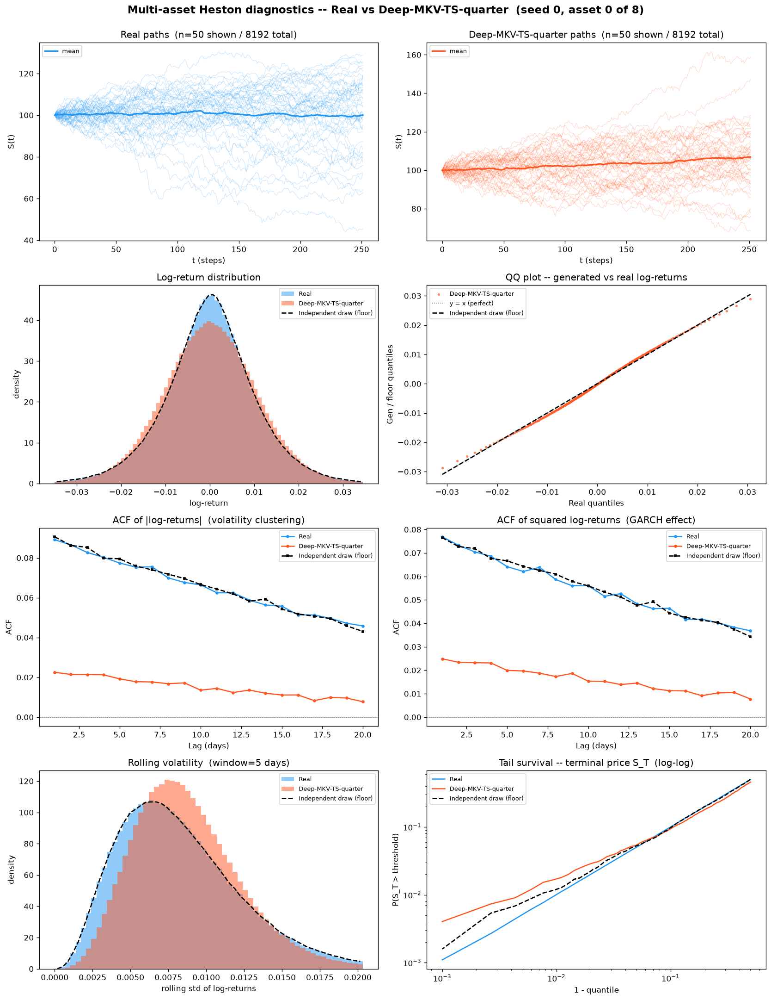
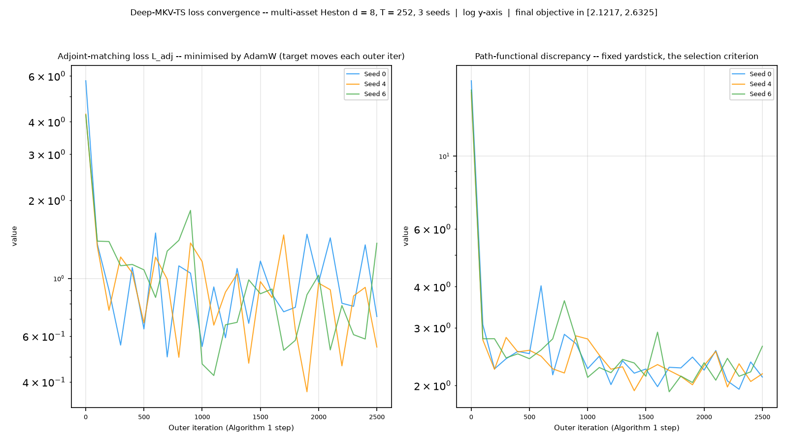
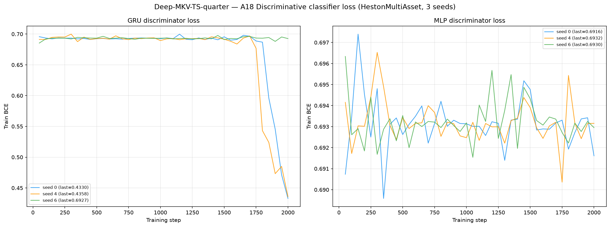
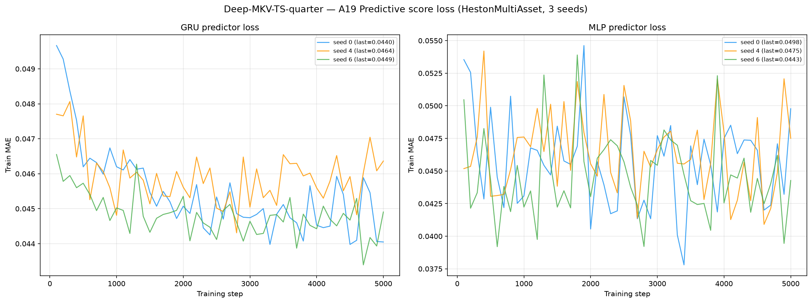

# Deep-MKV-TS on Multi-Asset Heston (d = 8)

**Deep McKean–Vlasov Time Series generation** — a path-dependent McKean–Vlasov
stochastic-control generator, applied to 8 192 **multi-asset** Heston
stochastic-volatility price paths (seq\_len = 252, **d = 8 correlated assets**).

> ### ⚠ Read this before comparing these numbers to any other page
>
> **This run reports 3 seeds, not 5, and the two missing seeds are missing because they died.**
>
> Seeds 2 and 5 both aborted mid-training with an exploding control. The failure is
> identical in each case, raised from `project_theta_to_sigma` inside
> `controls/specific_entropy_matrix.py`:
>
> ```
> RuntimeError: eigh failed AND Theta is not finite -- this is an exploding control,
> not a cuSOLVER convergence problem. Do not retry on another backend.
> Theta: shape=(256, 8, 8), dtype=torch.float32, non_finite_entries=16384,
> bad_batch_elements=[0, 1, 2, 3, 4, 5, 6, 7]... of 256
> ```
>
> `non_finite_entries=16384` is exactly `256 x 8 x 8` -- the *entire* batch of Cholesky
> factors went non-finite, not a marginal eigenvalue that spectral clipping could have
> caught. The last rows written to `losses/seed_2_losses.csv` and
> `losses/seed_5_losses.csv` are step 1600 and step 1500; neither reached the 2500 steps
> the surviving seeds completed. Their loss curves contain no NaN, because the run dies
> inside the eigendecomposition before a bad loss is ever logged -- the truncated CSV is
> the only trace left in the loss history, which is why the convergence figure below
> shows three curves and not five.
>
> **Two consequences, both of which make this page non-comparable to its siblings:**
>
> 1. **A 2-in-5 divergence rate at this budget is itself the headline result**, and it is
>    not visible anywhere in the metric tables below. Those tables describe only the seeds
>    that survived, which is a conditional-on-survival sample, not a random one.
> 2. **N = 3 inflates every standard deviation** relative to the 5-seed campaigns. The
>    dataset-level leaderboard in [`../oldreadme.md`](../oldreadme.md) counts how many
>    rows sit at or below the independent-draw floor, and a wider std widens the tie
>    band, so this run's row count is mechanically favoured. **Do not read its position
>    on that leaderboard as evidence that the quarter budget is competitive.**
>
> The surviving seeds are 0, 4 and 6. Every "Seed *n*" column below is labelled with its
> true seed id, not its position in the table.

Deep-MKV-TS does **not** learn a generator from noise. It starts from a *frozen,
interpretable reference SDE* (Guyon–Lekeufack, paper §2.1) fitted to the data by
penalised maximum likelihood, then learns a **volatility correction only** — the drift
is never touched. Training minimises

$$\mathcal{J}(\alpha) = \mathcal{D}\big(\mu^{\alpha}, \mu^{\text{data}}\big) + \eta\,\mathbb{E}\left[\int_0^T \tfrac12 \|\alpha_t\|^2 \sigma_t^{-2} dt\right], \qquad \eta = 1$$

where $\mathcal{D}$ is the same multi-component MMD discrepancy used at d = 1
(observed path, increments, terminal, global realized variance, $|r|$ ACF, $r^2$ ACF)
and the second term is a **specific-entropy running cost** penalising how far the
controlled law drifts from the reference law. The correction network is a
1-layer GRU (`hidden_dim = 96`) — **0 parameters**.
Weights in [`weights/`](weights/), per-seed hyperparameters in
`weights/seed_*_config.json`.

The model is **joint over all 8 assets** — one reference kernel with `state_dim = 8`
and one control network emitting a full `(d, d)` correction — not eight independent
univariate fits. See [`code/README.md`](code/README.md) for the frozen reference
kernel, the vendored upstream package, the forced d = 8 deviations and the one
re-selected hyperparameter; and the dataset-level [`../oldreadme.md`](../oldreadme.md)
for the multi-asset Heston law itself, the per-asset vs native metric scoping, and the
memorisation diagnostic shared by all methods on this dataset.

> **Hyperparameters:** `eta=1`, `sigma_min=0.001`, `sigma_max=0.6`,
> `lambda_scale=50`, `kappa_scale=100`, discrepancy preset
> `old_fullv_w0p25` with `abs_return_acf_weight=0.25`,
> `squared_return_acf_weight=0.125`; `hidden_dim=96`,
> `num_layers=1`, batch , target batch 256;
> `AdamW(lr=0.002, weight_decay=1e-05)`, `grad_clip_norm=5`,
> `ce_target_mode="ridge"` with `ridge_lambda=0.001`, `ce_ridge=0.001`;
>  outer iterations per seed, 3 seeds (seeds 0, 4, 6).
> Every one of those numbers is the **committed d = 1 value**, unchanged, except for
> what is listed next.
>
> **Retuned for d = 8: **nothing** — the list `retuned_for_d8` in every `weights/seed_*_config.json` is empty.** The reason is structural, not a search: the
> frozen package's Z-proxy basis $\Phi^{\text{ref}}_k$ is the flattened path prefix
> plus an intercept, so its width is $p = 1 + (k+1)d$. At d = 1 that is at most 252
> against a batch of  — an over-determined ridge that genuinely denoises. At
> d = 8 it reaches 2017, under-determined from step 31 onward, and the
> projection degenerates into near-interpolation. `ridge_lambda` was re-selected on the
> **validation** split (`heston_ma_S_val_8192x252x8.npy`), never on test, and the whole
> sweep is recorded in `code/sweep/`.
>
> **The control is matrix-valued, not diagonal** (`control=matrix`). The paper clips the
> *eigenvalues* of $\Theta$; at d > 1, clipping its diagonal entries instead is a
> different operator. $\Theta$ is symmetric but **indefinite**, so Cholesky and LDLᵀ are
> invalid and `torch.linalg.eigh` is the right primitive, with the Daleckii–Krein /
> Löwner form for its adjoint. The two coincide bitwise only at d = 1.
>
> **The drift Jacobian is kept.** `drift_adjoint_backend=autograd_replay` recomputes
> $\partial b^{\text{ref}}/\partial x$ by replaying the reference recursion under
> autograd, because the multivariate kernel exposes no analytical
> `drift_step_path_vjp`. No Algorithm 1 term is dropped.
>
> **`max_eigh_batch=32768`** chunks the batched eigendecomposition: cuSOLVER's
> batched `eigh` fails above roughly 64 k matrices, and batch  × 251
> steps = the per-step batch x step product sits inside that failure band. Chunking changes throughput, not
> results.
>
> **The reported checkpoint is chosen on validation**, not the final step — step
> - — exactly as the committed d = 1 run reports step 2500 of a 3000-step run.
> There is **no learning-rate scheduler anywhere in the codebase**, so this is bitwise
> identical to having stopped training there.

---

## Metrics A1-A34 + B, mean ± std across 3 seeds

> All metrics on **log-returns** $r_t = \log(S_{t+1}/S_t)$ unless noted. A26 uses price increments $\Delta S_t$.
> Rows marked *(native d=8)* are evaluated **once** on the full `(N, T, 8)` tensor; every other
> row is computed on each of the 8 univariate slices and reported as the **mean over assets**
> (per-asset breakdown in [`metrics_per_asset.csv`](metrics_per_asset.csv)).

| Metric | Mean ± Std | Seed 0 | Seed 4 | Seed 6 | Perfect floor |
|---|---|---|---|---|---|
| **Fat Tail** | | | | | |
| A1 Kurtosis Error ↓ | 1.028 ± 0.06027 | 1.084 | 1.055 | 0.944 | 0.008385 |
| A2 \|r\| q95 Error ↓ | 2.97e-04 ± 7.25e-05 | 3.32e-04 | 1.96e-04 | 3.63e-04 | 4.58e-05 |
| A3 \|r\| q99 Error ↓ | 0.001198 ± 2.54e-04 | 0.001237 | 8.69e-04 | 0.001488 | 8.08e-05 |
| A4 Tail QQ Error ↓ | 4.13e-04 ± 5.09e-05 | 4.16e-04 | 3.49e-04 | 4.74e-04 | 5.62e-05 |
| A5 Hill Tail Index Error ↓ | 2.368 ± 0.1449 | 2.457 | 2.482 | 2.163 | 0.5896 |
| **Distribution** | | | | | |
| A6 Path MMD² ↓ *(native d=8)* | 0.00209 ± 2.86e-05 | 0.002122 | 0.002053 | 0.002095 | 0.001948 |
| A7 Terminal MMD² ↓ *(native d=8)* | 0.002057 ± 1.85e-05 | 0.002078 | 0.002059 | 0.002033 | 0.001954 |
| A8 Increment MMD² ↓ *(native d=8)* | 9.07e-04 ± 2.05e-05 | 8.81e-04 | 9.08e-04 | 9.31e-04 | 8.71e-04 |
| A9 Volatility MMD ↓ *(native d=8)* | 0.0319 ± 6.50e-04 | 0.03192 | 0.03109 | 0.03268 | 0.008587 |
| A10 Terminal SWD ↓ *(native d=8)* | 1.598 ± 0.102 | 1.574 | 1.487 | 1.733 | 1.141 |
| A11 Path SWD ↓ *(native d=8)* | 0.9597 ± 0.04769 | 0.9313 | 0.9209 | 1.027 | 0.7258 |
| A12 RV Law Loss ↓ | 0.715 ± 0.04862 | 0.6951 | 0.668 | 0.782 | 0.06398 |
| A13 Mean Path RMSE ↓ | 0.4326 ± 0.01838 | 0.4092 | 0.4345 | 0.4541 | 0.1834 |
| A14 KS Log-returns ↓ | 0.02015 ± 3.30e-04 | 0.01969 | 0.0204 | 0.02037 | 9.64e-04 |
| A15 Skewness Error ↓ | 0.05496 ± 2.69e-04 | 0.05475 | 0.05534 | 0.05478 | 0.003568 |
| A16 QQ RMSE (300-pt) ↓ | 5.33e-04 ± 1.58e-05 | 5.16e-04 | 5.30e-04 | 5.54e-04 | 3.04e-05 |
| A17 Terminal Price KS ↓ | 0.03333 ± 9.11e-04 | 0.03206 | 0.03416 | 0.03375 | 0.01466 |
| **Adversarial** | | | | | |
| A18 Disc Score GRU ↓ *(native d=8)* | 0.1901 ± 0.1316 | 0.2772 | 0.2888 | 0.00412 | 0.005523 |
| A18 Disc Score MLP ↓ *(native d=8)* | 0.004222 ± 0.005323 | 4.58e-04 | 4.58e-04 | 0.01175 | 0.006012 |
| **Predictive** | | | | | |
| A19 Pred Score GRU ↓ | 0.0492 ± 3.89e-06 | 0.04919 | 0.0492 | 0.0492 | 0.0492 |
| A19 Pred Score MLP ↓ | 0.04948 ± 1.12e-04 | 0.04936 | 0.04945 | 0.04963 | 0.04931 |
| **Temporal** | | | | | |
| A20 Covariance Error ↓ *(native d=8)* | 226 ± 11.92 | 242.7 | 219.4 | 215.9 | 55.2 |
| A21 ACF \|r\| Error (lags) ↓ | 0.04815 ± 5.09e-04 | 0.04855 | 0.04744 | 0.04848 | 0.001066 |
| A22 ACF r² Error (lags) ↓ | 0.03638 ± 4.10e-04 | 0.03659 | 0.0358 | 0.03674 | 0.001107 |
| A23 ACF \|r\| Lag-1 Error ↓ | 0.05595 ± 6.04e-04 | 0.05643 | 0.0551 | 0.05632 | 0.001038 |
| A24 ACF r² Lag-1 Error ↓ | 0.04271 ± 4.63e-04 | 0.04298 | 0.04205 | 0.04308 | 0.001036 |
| **Vol** | | | | | |
| A25 Mean RMSE ↓ *(native d=8)* | 2.308 ± 0.07433 | 2.209 | 2.326 | 2.389 | 0.9234 |
| A26 Return Std Error ↓ | 0.02006 ± 0.002382 | 0.01718 | 0.02301 | 0.01999 | 0.001745 |
| A27 Log-Return Std Error ↓ | 2.33e-04 ± 3.68e-05 | 1.83e-04 | 2.69e-04 | 2.47e-04 | 2.21e-05 |
| A28 Kurtosis Ratio (→ 1) | 1.525 ± 0.115 | 1.559 | 1.37 | 1.645 | 1 |
| A29 Sigma Mean Error ↓ | 0.003963 ± 5.07e-04 | 0.003256 | 0.004422 | 0.004211 | 3.32e-04 |
| A30 Cross-Sect. Vol Path RMSE ↓ | 0.2449 ± 0.0398 | 0.2121 | 0.3009 | 0.2218 | 0.1596 |
| A31 Rolling Vol KS (w=5) ↓ | 0.07355 ± 6.09e-04 | 0.07285 | 0.07434 | 0.07346 | 0.00208 |
| A32 Vol-of-Vol Error ↓ | 3.77e-04 ± 3.20e-05 | 4.07e-04 | 3.33e-04 | 3.92e-04 | 1.14e-05 |
| **Heston Spec** | | | | | |
| A33 Teacher-Sigma Corr ↑ | -0.00163 ± 0.00152 | -0.001952 | 3.72e-04 | -0.003309 | -1.35e-04 |
| A34 Teacher-Sigma RMSE ↓ | 0.09645 ± 3.72e-04 | 0.09595 | 0.09683 | 0.09658 | 0.1013 |

> **Convention:** ↓ lower is better; ↑ higher is better; no arrow = no monotone direction. A28 Kurtosis Ratio: perfect = 1.0.
> **Headline:** **3 of the 36 A-metric rows sit at or below the independent-draw floor** — A18 Disc Score MLP, A19 Pred Score GRU, A34 Teacher-Sigma RMSE. The largest remaining gaps are **A1 Kurtosis Error** (1.028 vs floor 0.008385, 122.5×); **A23 ACF |r| Lag-1 Error** (0.05595 vs floor 0.001038, 53.9×); **A21 ACF |r| Error (lags)** (0.04815 vs floor 0.001066, 45.2×); **A24 ACF r² Lag-1 Error** (0.04271 vs floor 0.001036, 41.2×). The floor, not the other methods, is the reference on this page; the cross-method comparison lives in the dataset-level [`../README.md`](../README.md) so that no method's page grades itself against a rival it was tuned beside.
> **Perfect floor** is the *independent-draw* floor (GUIDELINE §5.4): five fresh draws from the *same* SDE with the *same* frozen per-asset parameters at seeds 1000-1004, scored with byte-identical metric code. It is **non-zero everywhere** — two independent 8 192-path draws never produce identical histograms, ACFs, quantiles or covariance matrices. It is **not** a permutation of the test set, which would preserve every column-wise statistic exactly, collapse most metrics to 0, and be a misleading target.
> **A1-A5**: fat-tail block — kurtosis error, tail quantile / QQ errors on |log-returns|, Hill tail index. **A6-A11** *(native d=8)*: path-kernel distances on the full 8-dimensional tensor (MMD² on paths / terminal / increments / realized-vol; sliced-Wasserstein on terminal & full paths), the rows where a multivariate generalisation is genuinely meaningful.
> **A12-A17**: distribution block, per asset then averaged. **A18** *(native d=8)*: discriminative classifier on all 8 channels at once, score = |accuracy − 0.5|. **A19**: TSTR MAE, deliberately **per-asset** — `predictive_score.py::_train_gru` targets `data_t[idx, 1:, :1]`, i.e. only the first feature, so a native run would silently report an asset-0-only number under a multi-asset name.
> **A20** *(native d=8)*: error on the full terminal covariance matrix. This is the row that matters most for Deep-MKV-TS: the correction network emits a full `(d, d)` matrix and the spectral clip acts on eigenvalues, so A20 is the direct test of whether the d(d−1)/2 spot correlations Σˢ survived the control. A diagonal control would have no mechanism to get this row right. **A21-A24**: ACF |r|/r² errors. **A25** *(native d=8)*: mean RMSE across all assets jointly.
> **A26-A32**: volatility block. **A28** kurtosis ratio: perfect = 1.0. **A33-A34**: Heston-specific — whether the generated S-paths retain the latent variance path. Deep-MKV-TS is the one method on this dataset carrying an **explicit** volatility state: the frozen Guyon–Lekeufack reference kernel maintains trend and activity features with fitted half-lives, and the learned control multiplies its σ. These rows therefore test the reference kernel and the correction together, not the network alone.

---

## B, Curve-Shape Metrics, mean ± std across 3 seeds

Each stylised-fact plot yields a **curve** L (a list of values), not a scalar. The curve is
computed **per asset and averaged over the 8 assets** *before* the combination below, so the
combination rules stay byte-identical to the d = 1 tree. For the real data (L_r) and generated
data (L_g) we build three lists, the curve L, its first finite difference L' (der), and its
second finite difference L'' (sec\_der), then combine the three sub-scores into **one number
per plot**:

- **MSE row**: for each list, dᵢ = mean((L_r − L_g)²). Reported mean = the **mean of the three sub-scores** (funct + der + sec\_der)/3; std = the sample std of that per-seed combined score across the 3 seeds. The **MSE row decides the cross-method winner**.
- **% err row**: for each list, dᵢ = mean(|L_g − L_r| / (|L_r| + 1e-6)) × 100, a proper MAPE, one division (the mean already averages over the curve's points). Reported value = the **function-level MAPE on the curve L itself**, the derivative / 2nd-derivative MAPE is **excluded** because diff(L)/diff2(L) have near-zero true values, so their relative error explodes into meaningless 10⁴-% figures. mean/std = mean and **sample std across the 3 seeds** of that per-seed function MAPE.
- **NRMSE row**: sqrt(mean((L_g − L_r)²)) / (max|L_r| − min|L_r| + 1e-12) × 100 on the curve L **only (funct-only)**, the ill-posed derivative / 2nd-derivative curves are excluded for the same reason as the % err row.
- **CVaR₉₀ / CVaR₉₅ rows**: tail-averaged pointwise curve error (Expected Shortfall) on the curve L **only (funct-only)**. Pointwise error eₜ = |L_g(t) − L_r(t)|; for q ∈ {0.90, 0.95}, CVaR_q = mean(eₜ for eₜ ≥ the q-th percentile of eₜ), then range-normalized like NRMSE (÷ (max|L_r| − min|L_r| + 1e-12) × 100).

All ↓ lower is better. The perfect floor is **non-zero** for all plots, it is the residual finite-sample error of an independent multi-asset Heston draw scored against the test set, identical across methods.
Five sublines per plot: **MSE**, **% error**, **NRMSE**, **CVaR₉₀** and **CVaR₉₅** (the per-seed columns hold that seed's combined score).

| Plot | Measure | Mean ± Std | Seed 0 | Seed 4 | Seed 6 | Perfect floor |
|---|---|---|---|---|---|---|
| **Path comparison** *(50×50 path-cloud)* | grid_tvd 50×50 (%) ↓ | 4.177% ± 0.06829% | 4.152% | 4.109% | 4.271% | 2.189% |
| **Log-return histogram** | MSE | 1.216 ± 0.02444 | 1.187 | 1.246 | 1.215 | 0.0554 |
|  | % err | 8.183% ± 0.07603% | 8.255% | 8.078% | 8.217% | 1.302% |
|  | NRMSE | 4.087% ± 0.03761% | 4.034% | 4.116% | 4.111% | 0.3601% |
|  | CVaR₉₀ | 10.08% ± 0.1184% | 9.916% | 10.19% | 10.14% | 0.8339% |
|  | CVaR₉₅ | 11.51% ± 0.1053% | 11.37% | 11.62% | 11.55% | 0.994% |
| **QQ plot** | MSE | 1.19e-07 ± 1.00e-08 | 1.11e-07 | 1.13e-07 | 1.34e-07 | 5.66e-10 |
|  | % err | 11.48% ± 0.2021% | 11.2% | 11.62% | 11.63% | 0.5364% |
|  | NRMSE | 1.57% ± 0.04537% | 1.525% | 1.553% | 1.632% | 0.08644% |
|  | CVaR₉₀ | 1.304% ± 0.065% | 1.284% | 1.237% | 1.392% | 0.09922% |
|  | CVaR₉₅ | 1.524% ± 0.1367% | 1.508% | 1.366% | 1.699% | 0.125% |
| **ACF \|r\|** | MSE | 6.14e-04 ± 1.50e-05 | 6.25e-04 | 5.93e-04 | 6.24e-04 | 3.33e-06 |
|  | % err | 58.59% ± 1.173% | 58.43% | 57.24% | 60.1% | 2.043% |
|  | NRMSE | 73.38% ± 1.277% | 73.48% | 71.77% | 74.89% | 2.523% |
|  | CVaR₉₀ | 103.2% ± 1.454% | 103.8% | 101.2% | 104.6% | 4.991% |
|  | CVaR₉₅ | 105.1% ± 1.261% | 105.7% | 103.3% | 106.2% | 5.542% |
| **ACF r²** | MSE | 3.41e-04 ± 9.62e-06 | 3.46e-04 | 3.27e-04 | 3.49e-04 | 3.98e-06 |
|  | % err | 52.98% ± 1.285% | 52.73% | 51.54% | 54.66% | 2.37% |
|  | NRMSE | 62.72% ± 1.184% | 62.82% | 61.22% | 64.11% | 2.772% |
|  | CVaR₉₀ | 90.13% ± 1.564% | 90.6% | 88.03% | 91.77% | 5.52% |
|  | CVaR₉₅ | 92.28% ± 1.227% | 92.91% | 90.56% | 93.36% | 6.131% |
| **Rolling vol histogram** | MSE | 39.15 ± 0.2257 | 39.12 | 39.45 | 38.9 | 0.6039 |
|  | % err | 19.1% ± 0.6727% | 19.43% | 18.16% | 19.7% | 1.536% |
|  | NRMSE | 10.18% ± 0.01437% | 10.19% | 10.16% | 10.19% | 0.5137% |
|  | CVaR₉₀ | 20.47% ± 0.06198% | 20.38% | 20.51% | 20.51% | 1.172% |
|  | CVaR₉₅ | 21.81% ± 0.05785% | 21.73% | 21.85% | 21.86% | 1.362% |
| **Tail survival** | MSE | 2.37e-04 ± 1.03e-05 | 2.24e-04 | 2.49e-04 | 2.40e-04 | 2.03e-07 |
|  | % err | 5.573% ± 0.1418% | 5.41% | 5.553% | 5.755% | 0.2297% |
|  | NRMSE | 2.454% ± 0.04676% | 2.392% | 2.505% | 2.466% | 0.06634% |
|  | CVaR₉₀ | 3.589% ± 0.05741% | 3.513% | 3.651% | 3.605% | 0.1122% |
|  | CVaR₉₅ | 3.603% ± 0.05706% | 3.527% | 3.663% | 3.62% | 0.1175% |

> **Headline:** **0 of the 6 B plots** sit at or below the finite-sample floor on the deciding MSE row: none.
> **Cross-seed stability**: the seed here controls **three** independent things — the control network's initialisation, every Euler–Maruyama increment drawn during training, and the batch resampling that re-fits the Z-proxy at each outer iteration. The reference kernel is *not* among them: it is fitted once, frozen, and shared byte-for-byte across every seed (`code/reference/reference_kernel.json`), so none of the spread below comes from re-estimating the reference SDE. What remains is optimisation plus sampling variance, and [`plots/loss_convergence.png`](plots/loss_convergence.png) shows whether any seed diverged. Generation uses a **separate** seed stream (90000 + i) that never reuses a training seed.

---

## Stylised Facts Diagnostic (Multi-Asset Heston vs Deep-MKV-TS, seed 0, asset 0)

Eight-panel comparison: sample paths, return distribution, QQ plot, ACF of |returns|,
ACF of squared returns, rolling vol histogram (window=5), tail survival (log-log).

The third (black dashed) curve is the **independent-draw floor**, not a closed-form theory
curve: `metrics/heston_theory.py` is hard-wired to the d = 1 parameters (κ=2.0, θ=0.04,
ρ=−0.7, dt=1/250), so plotting it over d = 8 data would be a fabricated reference. Wherever
Real and the floor curve already disagree, the gap is finite-sample noise rather than a
modelling failure. **One asset is shown, not eight** — the *metrics* are averaged over all 8
assets, the *figure* is asset 0; pooling eight deliberately different volatilities
(σ 0.0097-0.0165) into one histogram would show the mixing, not the model.



---

## Deep-MKV-TS Training Loss (3 seeds)

The figure has **two** panels, and they are not the same quantity plotted twice.

`loss_total` is the **adjoint-matching loss**
$L_{\text{adj}} = \frac{1}{PM}\sum\sum \|\hat Z^{\theta} - Z^{\text{proxy}}\|^2$ — the
scalar AdamW actually minimises. Its target **moves**: $Z^{\text{proxy}}$ is re-estimated by
ridge regression on freshly sampled paths at every outer iteration, so this curve measures
distance to a target that is itself drifting. A descending `loss_total` is necessary but **not
sufficient** — it can fall simply because the proxy became easier to hit.

`objective` is the **path-functional discrepancy** between generated paths and the training
bank, a fixed yardstick and the same functional form that
`select_checkpoint_multiasset.py` later evaluates on the validation split to choose the
reported checkpoint. **Read convergence from this panel.** Both are logged on the same rows,
so the two x-axes coincide step-for-step.

The x-axis is **outer iteration**, not epoch. Algorithm 1 has no epoch: every iteration draws a
fresh batch of controlled paths and re-fits the proxy, so there is no pass over a fixed dataset
to count. There is also no validation curve here, deliberately — Deep-MKV-TS runs no held-out
forward pass during training. Selection happens **after** the fit, by sampling from each saved
checkpoint and scoring against `heston_ma_S_val_8192x252x8.npy`; the per-checkpoint scores are
archived in `code/selection/seed_*_selection.json` and the winner is the `Selected step` column
below.



Training wall-clock, read from `weights/seed_*_config.json` and
`losses/seed_*_losses.csv` (**0 min total** across the 3 seeds, one GPU and
8 threads per seed process, run 2-up in waves):

_(weights/seed_\*_config.json not found)_

Generation wall-clock — the selected control rolled forward 251
Euler–Maruyama steps from $x_0 = \log(100)$ for each of 8 192 paths, 8 threads,
**0.1 min total** across the 3 seeds:

| Seed | Workers | Elapsed |
|------|---------|---------|
| 0 | 8 | 0.0 min |
| 4 | 8 | 0.0 min |
| 6 | 8 | 0.0 min |

---

## A18, Discriminative Classifier Training Loss

BCE loss during GRU and MLP classifier training (2 000 steps, logged every 50 steps).
A value near ln(2) ≈ 0.693 means the classifier cannot distinguish real from fake.
The d = 8 classifier is **native**: it sees all 8 channels at once.



---

## A19, Predictive Score Training Loss (TSTR)

MAE loss during GRU and MLP predictor training on *synthetic* data (5 000 steps, logged every 100 steps).
The predictor is run **once per asset**; the curves archived here are **asset 0's**, since the
driver stores the loss history only for `j == 0`. The A19 score in the table above is the mean
over all 8 assets.



---

## File layout

This tree is **self-contained**: code, inputs, outputs and documentation sit side by side,
unlike the d = 1 benchmark which splits `methods/<Method>/` from `results/Heston/<Method>/`.
It is generated from `os.walk` at render time, so it cannot list a file that does not exist.

```
results/HestonMultiAsset/Deep-MKV-TS/
├── HEALTH.md
├── README.md                           ← this file (generated by code/render_readme.py)
├── code/
│   ├── README.md                       reference kernel, deviations, sweep table
│   ├── _smoke_reference.py
│   ├── collect_artifacts.py            rebuilds generation_time.csv, checks the §4 contract
│   ├── commit_and_push.sh
│   ├── diagnose_divergence.py
│   ├── eigh_fallback.py
│   ├── fit_reference_multiasset.py     penalised MLE for the frozen d = 8 reference kernel
│   ├── matrix_control_multiasset.py    matrix-valued spectral control + Daleckii-Krein adjoint
│   ├── measure_memorisation.py         nearest-neighbour memorisation diagnostic
│   ├── multivariate_reference.py       the d = 8 Guyon-Lekeufack kernel itself
│   ├── null_control_baseline.py
│   ├── plot_diagnostics_multiasset.py  the 8-panel stylised-facts figure
│   ├── plot_losses.py                  plots/loss_convergence.png, all seeds overlaid
│   ├── reference/                      FITTED artefacts only — the upstream package is NOT vendored here
│   │   ├── reference_fit_history.csv   its penalised-MLE calibration trace
│   │   └── reference_kernel.json       the frozen kernel, fitted once, shared by every seed
│   ├── render_readme.py                regenerates this README from the artefacts
│   ├── run_all_multiasset.py           samples the 8192-path bank from the SELECTED checkpoint
│   ├── run_campaign.sh
│   ├── run_final_chain.sh
│   ├── run_pipeline.sh
│   ├── run_pipeline_variant.sh
│   ├── run_pipeline_variant2.sh
│   ├── run_salvage_3seed.sh
│   ├── run_sweep.sh                    drives the sweep in two waves on one GPU
│   ├── runs/                           per-seed training_checkpoints/ (gitignored)
│   │   └── seed_0   … and 4 more
│   ├── scan_step_curve.py
│   ├── select_checkpoint_multiasset.py picks the reported checkpoint per seed on validation
│   ├── selection/                      per-seed checkpoint-selection records
│   │   └── seed_0_selection.json   … and 2 more
│   ├── sweep_hyperparams.py
│   ├── sweep_ridge_lambda.py           re-selects ridge_lambda on the VALIDATION split
│   ├── test_render_readme.py
│   └── train_multiasset.py             Algorithm 1, one seed
├── curve_b_aggregate.json              B curve-shape aggregate
├── generated_paths/
│   └── seed_0   … and 2 more
├── grid_tvd_aggregate.json             path-cloud TVD
├── logs/
│   ├── metrics_seed_0_gpu1.log
│   ├── metrics_seed_4_gpu2.log
│   ├── metrics_seed_6_gpu3.log
│   ├── pipeline_final_chain.log
│   ├── pipeline_quarter.log
│   ├── pipeline_quarter_repair.log
│   ├── salvage_3seed.log
│   ├── train_seed_0.log
│   ├── train_seed_2.log
│   ├── train_seed_4.log
│   ├── train_seed_4_gpu0.log
│   ├── train_seed_5.log
│   ├── train_seed_5_gpu0.log
│   ├── train_seed_6.log
│   └── train_seed_6_gpu0.log
├── losses/
│   ├── generation_time.csv             wall-clock time per seed
│   ├── seed_0_losses.csv
│   ├── seed_2_losses.csv
│   ├── seed_4_losses.csv
│   ├── seed_5_losses.csv
│   └── seed_6_losses.csv
├── metrics_per_asset.csv               per-metric × per-asset breakdown (8 rows per metric)
├── metrics_summary.csv                 A1-A34, mean ± std, per seed
├── plots/
│   ├── disc_classifier_loss.png        A18 BCE curves, all seeds
│   ├── heston_diagnostics.png          8-panel stylised facts (seed 0, asset 0)
│   ├── loss_convergence.png            L_adj and the path-functional objective, all seeds
│   └── pred_score_loss.png             A19 MAE curves, all seeds (asset 0)
├── seed_0_disc_gru_loss.csv
├── seed_0_disc_mlp_loss.csv
├── seed_0_metrics.json
├── seed_0_pred_gru_loss.csv
├── seed_0_pred_mlp_loss.csv
├── seed_4_disc_gru_loss.csv
├── seed_4_disc_mlp_loss.csv
├── seed_4_metrics.json
├── seed_4_pred_gru_loss.csv
├── seed_4_pred_mlp_loss.csv
├── seed_6_disc_gru_loss.csv
├── seed_6_disc_mlp_loss.csv
├── seed_6_metrics.json
├── seed_6_pred_gru_loss.csv
├── seed_6_pred_mlp_loss.csv
└── weights/
    └── .campaign_complete   … and 3 more
```

The upstream `deep_mkv_gen_path_dt` package is **not vendored here**. It lives once at
`methods/Deep-MKV-TS/code/reference/` and is imported through `PYTHONPATH`, **with zero
edits** — every d = 8 adaptation is a method-local file in `code/`. `code/reference/` holds
only the *fitted* artefacts: the frozen kernel and its calibration history.

The `.npy` arrays are **gitignored**: `(8192, 252, 8)` float64 = 132 MB each, over
GitHub's 100 MB per-file hard limit, and LFS was ruled out. They are fully reproducible from the
tracked code, the tracked frozen kernel and the tracked hyperparameters; the `metadata.json`
beside each array **is** tracked, so shapes, price ranges and generation times stay auditable
without the payload.

## Reproduce

```bash
cd /home/tbasseras/benchmark
PY=/home/tbasseras/gpu-venv/bin/python
R=/home/tbasseras/benchmark/methods/Deep-MKV-TS/code/reference
export PYTHONPATH="$R/src:$R/experiments"

# 1. dataset (~4 min on 8 cores) — only if dataset/HestonMultiAsset/*.npy are absent
cd dataset/HestonMultiAsset && python generate_heston_multiasset.py && cd -

# 2. fit the frozen reference kernel by penalised MLE on the TRAIN split
#    Writes code/reference/reference_kernel.json. Fitted ONCE and shared by every seed.
cd results/HestonMultiAsset/Deep-MKV-TS/code
CUDA_VISIBLE_DEVICES=1 OMP_NUM_THREADS=8 taskset -c 0-7 $PY fit_reference_multiasset.py

# 3. re-select ridge_lambda on the VALIDATION split (GPU 1 only, two waves)
#    The only retuned hyperparameter. Writes sweep/*.json and sweep/winner.json.
bash run_sweep.sh

# 4. final 3 seeds,  outer iterations, 2 GPUs (~0 min of GPU time, 3 waves)
GPUS=(1 2); CORES=("0-7" "8-15")
for wave in "0 1" "2 3" "4"; do
  i=0
  for s in $wave; do
    CUDA_VISIBLE_DEVICES=${GPUS[$i]} OMP_NUM_THREADS=8 taskset -c ${CORES[$i]} \
        $PY train_multiasset.py --seed $s --device cuda:0 & i=$((i+1))
  done
  wait
done

# 5. choose the reported checkpoint per seed on VALIDATION, never on test
CUDA_VISIBLE_DEVICES=1 OMP_NUM_THREADS=8 taskset -c 0-7 \
    $PY select_checkpoint_multiasset.py --seeds 0 1 2 3 4

# 6. generate the 8192-path bank from the SELECTED checkpoint
CUDA_VISIBLE_DEVICES=1 OMP_NUM_THREADS=8 taskset -c 0-7 \
    $PY run_all_multiasset.py --seeds 0 1 2 3 4
$PY collect_artifacts.py            # must print "5 rows" and exit 0 before anything downstream
cd /home/tbasseras/benchmark

# 7. independent-draw perfect-recovery floor (seeds 1000-1004, ~6 s)
/home/tbasseras/sbts-venv/bin/python metrics/gen_perfect_recovery_multiasset.py

# 8. metrics — both sides go through byte-identical code
CUDA_VISIBLE_DEVICES=1 $PY metrics/compute_all_multiasset.py --method perfect_recovery
CUDA_VISIBLE_DEVICES=1 $PY metrics/compute_all_multiasset.py --method Deep-MKV-TS \
    --dataset HestonMultiAsset --seeds 5

# 9. figures
$PY results/HestonMultiAsset/Deep-MKV-TS/code/plot_losses.py
$PY results/HestonMultiAsset/Deep-MKV-TS/code/plot_diagnostics_multiasset.py \
    --method Deep-MKV-TS
$PY metrics/plot_score_losses.py --method Deep-MKV-TS --dataset HestonMultiAsset

# 10. memorisation diagnostic
$PY results/HestonMultiAsset/Deep-MKV-TS/code/measure_memorisation.py --seeds 0,1,2,3,4

# 11. regenerate this README from the artefacts
$PY results/HestonMultiAsset/Deep-MKV-TS/code/render_readme.py
```
