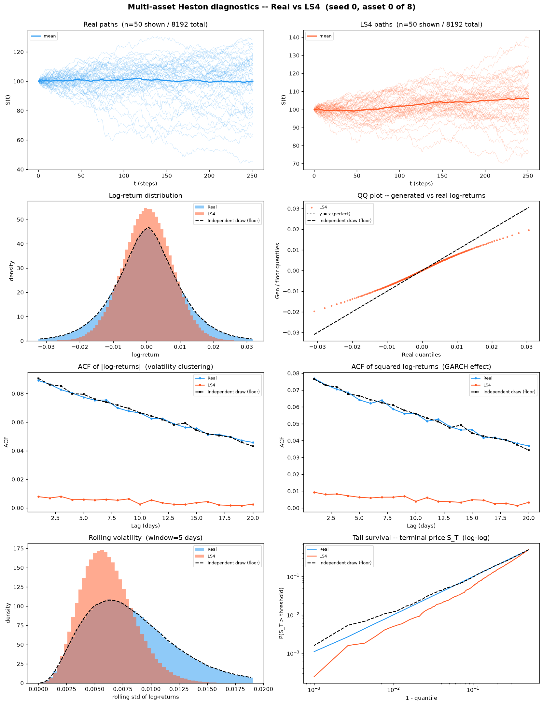
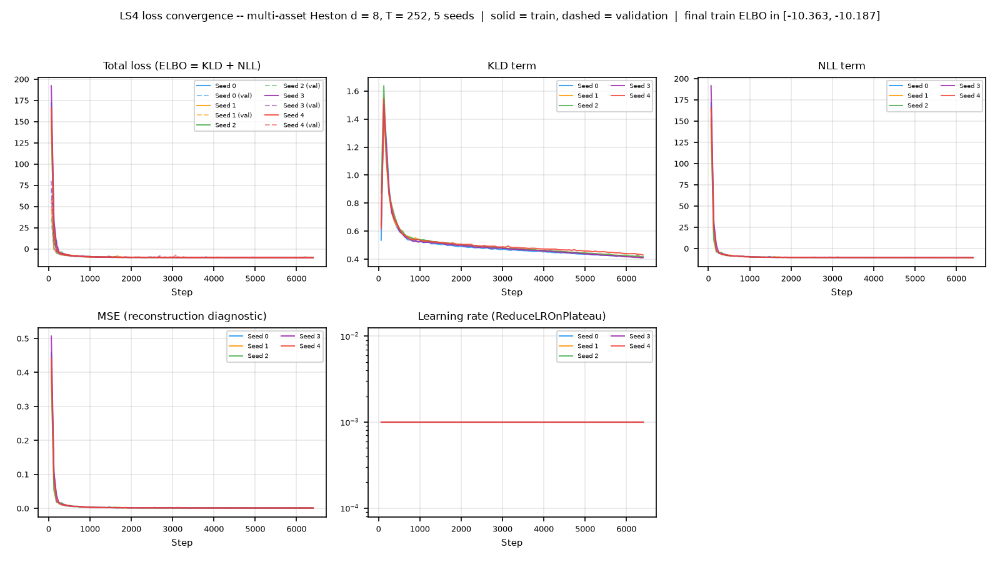
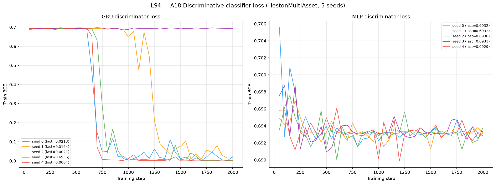
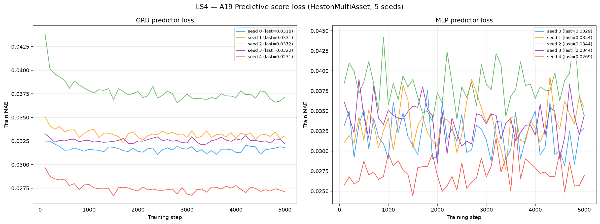

# LS4 on Multi-Asset Heston (d = 8)

**Deep Latent State Space Models for Time-Series Generation** (Zhou, Kang, Molina-Salgado, Wu,
Ermon & Grover, ICML 2023, [arXiv:2212.12749](https://arxiv.org/abs/2212.12749)) applied to
8 192 **multi-asset** Heston stochastic-volatility price paths (seq\_len = 252,
**d = 8 correlated assets**).

LS4 is a **latent variational state-space model**: a VAE whose prior, posterior and decoder are
all S4 (structured state-space) backbones. It is trained by maximising an ELBO
(`loss = KLD + NLL`) with AdamW, and generates by sampling `z` from the learned prior and
decoding — it never touches a training path at generation time. 2,205,832 parameters,
trained for 100 epochs per seed, 5 seeds. Weights in
[`weights/`](weights/), per-seed hyperparameters in `weights/seed_*_config.json`.

The model is **joint over all 8 channels** — one network, `d_input = d_output = 8` — not eight
independent univariate fits. See [`code/README.md`](code/README.md) for source, the vendored
release, and the implementation deviations, and the dataset-level
[`../oldreadme.md`](../oldreadme.md) for the multi-asset Heston law itself, the per-asset vs
native metric scoping, and the memorisation diagnostic shared by all methods on this dataset.

> **Hyperparameters:** `z_dim=40`, `d_state=64`, `d_model=64`,
> `n_layers=4`, `sigma=0.1`, `backbone=autoreg`, `s4_type=s4`, `latent_type=split`;
> `AdamW(lr=1e-3, wd=0)` + `ReduceLROnPlateau(patience=20, factor=0.5)` +
> `EMA(lamb=0.99, start_step=200)`, batch 128, 100 epochs.
> Everything above is the **released `solar_weekly` preset** — the configuration that reproduced
> the paper's Solar Weekly marginal score — **except `z_dim`**, which is ours, and `in_channels`,
> which the data forces. `z_dim` is the one hyperparameter that does not cross dimension. The released `z_dim = 5` scores a validation ELBO of **+71.62** against **-5.37** for `z_dim = 40`, and its train ELBO (66.93) essentially equals its validation ELBO (66.99) — under-capacity, not overfitting. A 5-dimensional latent cannot carry 8 correlated channels. The ordering was monotone with no interior optimum inside the tested range, so `z_dim = 40` is the **largest tested** candidate rather than a located maximum; that boundary is disclosed rather than dressed up as convergence.
> Selected on the **validation split, never on test**, against a criterion written to disk
> *before* the sweep ran: [`losses/selection_criterion.md`](losses/selection_criterion.md),
> numbers in [`losses/zdim_selection.json`](losses/zdim_selection.json).
> The scaler was also changed, from a global standardise to a **per-channel** one; a per-channel
> affine map leaves the cross-asset correlation matrix exactly unchanged, so the target coupling
> Σˢ — what A20 scores — survives both the standardisation and its inverse.

---

## Metrics A1-A34 + B, mean ± std across 5 seeds

> All metrics on **log-returns** $r_t = \log(S_{t+1}/S_t)$ unless noted. A26 uses price increments $\Delta S_t$.
> Rows marked *(native d=8)* are evaluated **once** on the full `(N, T, 8)` tensor; every other
> row is computed on each of the 8 univariate slices and reported as the **mean over assets**
> (per-asset breakdown in [`metrics_per_asset.csv`](metrics_per_asset.csv)).

| Metric | Mean ± Std | Seed 0 | Seed 1 | Seed 2 | Seed 3 | Seed 4 | Perfect floor |
|---|---|---|---|---|---|---|---|
| **Fat Tail** | | | | | | | |
| A1 Kurtosis Error ↓ | 0.7708 ± 0.005457 | 0.7701 | 0.7647 | 0.7692 | 0.769 | 0.7811 | 0.008385 |
| A2 \|r\| q95 Error ↓ | 0.007707 ± 7.45e-04 | 0.007512 | 0.006795 | 0.007859 | 0.007341 | 0.00903 | 4.58e-05 |
| A3 \|r\| q99 Error ↓ | 0.0124 ± 0.001045 | 0.01216 | 0.01111 | 0.01258 | 0.0119 | 0.01426 | 8.08e-05 |
| A4 Tail QQ Error ↓ | 0.007604 ± 7.35e-04 | 0.007411 | 0.006701 | 0.007756 | 0.007243 | 0.008908 | 5.62e-05 |
| A5 Hill Tail Index Error ↓ | 2.793 ± 0.4285 | 2.725 | 2.253 | 3.429 | 2.449 | 3.108 | 0.5896 |
| **Distribution** | | | | | | | |
| A6 Path MMD² ↓ *(native d=8)* | 0.01225 ± 0.00266 | 0.01181 | 0.01193 | 0.01228 | 0.008449 | 0.01679 | 0.001948 |
| A7 Terminal MMD² ↓ *(native d=8)* | 0.006468 ± 0.001546 | 0.005923 | 0.00631 | 0.006746 | 0.004287 | 0.009074 | 0.001954 |
| A8 Increment MMD² ↓ *(native d=8)* | 0.01435 ± 0.004248 | 0.01267 | 0.009889 | 0.01453 | 0.01234 | 0.02231 | 8.71e-04 |
| A9 Volatility MMD ↓ *(native d=8)* | 0.6814 ± 0.1357 | 0.6227 | 0.5233 | 0.7268 | 0.6139 | 0.9202 | 0.008587 |
| A10 Terminal SWD ↓ *(native d=8)* | 4.281 ± 0.6338 | 3.99 | 4.239 | 4.535 | 3.357 | 5.283 | 1.141 |
| A11 Path SWD ↓ *(native d=8)* | 2.933 ± 0.2927 | 2.901 | 3.03 | 2.898 | 2.461 | 3.373 | 0.7258 |
| A12 RV Law Loss ↓ | 4.867 ± 0.4648 | 4.744 | 4.254 | 5.022 | 4.658 | 5.656 | 0.06398 |
| A13 Mean Path RMSE ↓ | 0.6314 ± 0.261 | 0.4951 | 0.5423 | 0.6616 | 0.3455 | 1.112 | 0.1834 |
| A14 KS Log-returns ↓ | 0.06227 ± 0.008789 | 0.05939 | 0.05274 | 0.0634 | 0.05738 | 0.07845 | 9.64e-04 |
| A15 Skewness Error ↓ | 0.0209 ± 0.001063 | 0.02066 | 0.02229 | 0.02009 | 0.01951 | 0.02193 | 0.003568 |
| A16 QQ RMSE (300-pt) ↓ | 0.00333 ± 3.52e-04 | 0.003231 | 0.002898 | 0.003413 | 0.003155 | 0.003952 | 3.04e-05 |
| A17 Terminal Price KS ↓ | 0.09221 ± 0.01855 | 0.08348 | 0.0856 | 0.09247 | 0.07248 | 0.127 | 0.01466 |
| **Adversarial** | | | | | | | |
| A18 Disc Score GRU ↓ *(native d=8)* | 0.3987 ± 0.1967 | 0.4969 | 0.4927 | 0.4988 | 0.00534 | 0.4997 | 0.005523 |
| A18 Disc Score MLP ↓ *(native d=8)* | 0.005279 ± 0.002527 | 0.002899 | 0.001984 | 0.005645 | 0.007171 | 0.008697 | 0.006012 |
| **Predictive** | | | | | | | |
| A19 Pred Score GRU ↓ | 0.0492 ± 3.69e-06 | 0.0492 | 0.04921 | 0.0492 | 0.0492 | 0.0492 | 0.0492 |
| A19 Pred Score MLP ↓ | 0.04941 ± 5.12e-05 | 0.04945 | 0.04947 | 0.04932 | 0.04942 | 0.04941 | 0.04931 |
| **Temporal** | | | | | | | |
| A20 Covariance Error ↓ *(native d=8)* | 1084 ± 90.03 | 1012 | 981.3 | 1209 | 1046 | 1171 | 55.2 |
| A21 ACF \|r\| Error (lags) ↓ | 0.06824 ± 0.00132 | 0.06838 | 0.06676 | 0.06749 | 0.06791 | 0.07066 | 0.001066 |
| A22 ACF r² Error (lags) ↓ | 0.05623 ± 0.001435 | 0.05642 | 0.05475 | 0.05542 | 0.05569 | 0.0589 | 0.001107 |
| A23 ACF \|r\| Lag-1 Error ↓ | 0.07919 ± 0.001432 | 0.07909 | 0.07749 | 0.07846 | 0.07909 | 0.0818 | 0.001038 |
| A24 ACF r² Lag-1 Error ↓ | 0.06584 ± 0.001548 | 0.06583 | 0.06419 | 0.06501 | 0.06544 | 0.06874 | 0.001036 |
| **Vol** | | | | | | | |
| A25 Mean RMSE ↓ *(native d=8)* | 4.066 ± 2.772 | 3.017 | 2.908 | 2.947 | 1.907 | 9.549 | 0.9234 |
| A26 Return Std Error ↓ | 0.3366 ± 0.03949 | 0.3236 | 0.2913 | 0.3414 | 0.3181 | 0.4088 | 0.001745 |
| A27 Log-Return Std Error ↓ | 0.003519 ± 3.71e-04 | 0.003416 | 0.003066 | 0.003601 | 0.003335 | 0.004177 | 2.21e-05 |
| A28 Kurtosis Ratio (→ 1) | 5.437 ± 0.5817 | 5.456 | 4.893 | 5.2 | 5.095 | 6.543 | 1 |
| A29 Sigma Mean Error ↓ | 0.05358 ± 0.00578 | 0.05192 | 0.04653 | 0.0549 | 0.05073 | 0.06381 | 3.32e-04 |
| A30 Cross-Sect. Vol Path RMSE ↓ | 3.859 ± 0.3462 | 3.787 | 3.712 | 3.951 | 3.395 | 4.449 | 0.1596 |
| A31 Rolling Vol KS (w=5) ↓ | 0.2578 ± 0.03221 | 0.2498 | 0.2185 | 0.2634 | 0.2422 | 0.3152 | 0.00208 |
| A32 Vol-of-Vol Error ↓ | 0.001949 ± 1.39e-04 | 0.001923 | 0.001767 | 0.001967 | 0.001893 | 0.002194 | 1.14e-05 |
| **Heston Spec** | | | | | | | |
| A33 Teacher-Sigma Corr ↑ | 1.46e-04 ± 4.00e-04 | 1.35e-04 | -3.53e-05 | -4.78e-04 | 7.03e-04 | 4.06e-04 | -1.35e-04 |
| A34 Teacher-Sigma RMSE ↓ | 0.09441 ± 0.002176 | 0.09325 | 0.09203 | 0.09557 | 0.09309 | 0.0981 | 0.1013 |

> **Convention:** ↓ lower is better; ↑ higher is better; no arrow = no monotone direction. A28 Kurtosis Ratio: perfect = 1.0.
> **Headline:** **3 of the 36 A-metric rows sit at or below the independent-draw floor** — A18 Disc Score MLP, A33 Teacher-Sigma Corr, A34 Teacher-Sigma RMSE. The largest remaining gaps are **A26 Return Std Error** (0.3366 vs floor 0.001745, 192.9×); **A32 Vol-of-Vol Error** (0.001949 vs floor 1.14e-05, 171.6×); **A2 |r| q95 Error** (0.007707 vs floor 4.58e-05, 168.3×); **A29 Sigma Mean Error** (0.05358 vs floor 3.32e-04, 161.5×). The floor, not the other method, is the reference on this page; the LS4-vs-SBTS comparison lives in the dataset-level [`../README.md`](../README.md) so that neither method's page grades itself against a rival it was tuned beside.
> **Perfect floor** is the *independent-draw* floor (GUIDELINE §5.4): five fresh draws from the *same* SDE with the *same* frozen per-asset parameters at seeds 1000-1004, scored with byte-identical metric code. It is **non-zero everywhere** — two independent 8 192-path draws never produce identical histograms, ACFs, quantiles or covariance matrices. It is **not** a permutation of the test set, which would preserve every column-wise statistic exactly, collapse most metrics to 0, and be a misleading target.
> **A1-A5**: fat-tail block — kurtosis error, tail quantile / QQ errors on |log-returns|, Hill tail index. **A6-A11** *(native d=8)*: path-kernel distances on the full 8-dimensional tensor (MMD² on paths / terminal / increments / realized-vol; sliced-Wasserstein on terminal & full paths), the rows where a multivariate generalisation is genuinely meaningful.
> **A12-A17**: distribution block, per asset then averaged. **A18** *(native d=8)*: discriminative classifier on all 8 channels at once, score = |accuracy − 0.5|. **A19**: TSTR MAE, deliberately **per-asset** — `predictive_score.py::_train_gru` targets `data_t[idx, 1:, :1]`, i.e. only the first feature, so a native run would silently report an asset-0-only number under a multi-asset name.
> **A20** *(native d=8)*: error on the full terminal covariance matrix, which is the row that actually tests whether the d(d−1)/2 spot correlations Σˢ survived generation. **A21-A24**: ACF |r|/r² errors. **A25** *(native d=8)*: mean RMSE across all assets jointly.
> **A26-A32**: volatility block. **A28** kurtosis ratio: perfect = 1.0. **A33-A34**: Heston-specific — whether the generated S-paths retain the latent variance path. LS4 *does* carry an explicit latent state, so unlike a kernel method it has a mechanism to reproduce these; whether the ELBO gives it any reason to is a separate question, and the table answers it.

---

## B, Curve-Shape Metrics, mean ± std across 5 seeds

Each stylised-fact plot yields a **curve** L (a list of values), not a scalar. The curve is
computed **per asset and averaged over the 8 assets** *before* the combination below, so the
combination rules stay byte-identical to the d = 1 tree. For the real data (L_r) and generated
data (L_g) we build three lists, the curve L, its first finite difference L' (der), and its
second finite difference L'' (sec\_der), then combine the three sub-scores into **one number
per plot**:

- **MSE row**: for each list, dᵢ = mean((L_r − L_g)²). Reported mean = the **mean of the three sub-scores** (funct + der + sec\_der)/3; std = the sample std of that per-seed combined score across the 5 seeds. The **MSE row decides the cross-method winner**.
- **% err row**: for each list, dᵢ = mean(|L_g − L_r| / (|L_r| + 1e-6)) × 100, a proper MAPE, one division (the mean already averages over the curve's points). Reported value = the **function-level MAPE on the curve L itself**, the derivative / 2nd-derivative MAPE is **excluded** because diff(L)/diff2(L) have near-zero true values, so their relative error explodes into meaningless 10⁴-% figures. mean/std = mean and **sample std across the 5 seeds** of that per-seed function MAPE.
- **NRMSE row**: sqrt(mean((L_g − L_r)²)) / (max|L_r| − min|L_r| + 1e-12) × 100 on the curve L **only (funct-only)**, the ill-posed derivative / 2nd-derivative curves are excluded for the same reason as the % err row.
- **CVaR₉₀ / CVaR₉₅ rows**: tail-averaged pointwise curve error (Expected Shortfall) on the curve L **only (funct-only)**. Pointwise error eₜ = |L_g(t) − L_r(t)|; for q ∈ {0.90, 0.95}, CVaR_q = mean(eₜ for eₜ ≥ the q-th percentile of eₜ), then range-normalized like NRMSE (÷ (max|L_r| − min|L_r| + 1e-12) × 100).

All ↓ lower is better. The perfect floor is **non-zero** for all plots, it is the residual finite-sample error of an independent multi-asset Heston draw scored against the test set, identical across methods.
Five sublines per plot: **MSE**, **% error**, **NRMSE**, **CVaR₉₀** and **CVaR₉₅** (the per-seed columns hold that seed's combined score).

| Plot | Measure | Mean ± Std | Seed 0 | Seed 1 | Seed 2 | Seed 3 | Seed 4 | Perfect floor |
|---|---|---|---|---|---|---|---|---|
| **Path comparison** *(50×50 path-cloud)* | grid_tvd 50×50 (%) ↓ | 16.06% ± 1.739% | 15.75% | 15.23% | 15.92% | 14.11% | 19.3% | 2.189% |
| **Log-return histogram** | MSE | 5.82 ± 1.703 | 5.061 | 4.16 | 6.333 | 4.641 | 8.905 | 0.0554 |
|  | % err | 46.17% ± 4.066% | 45.48% | 41.35% | 46.29% | 44.17% | 53.58% | 1.302% |
|  | NRMSE | 10.31% ± 1.678% | 9.72% | 8.341% | 10.8% | 9.393% | 13.27% | 0.3601% |
|  | CVaR₉₀ | 20.68% ± 4.051% | 18.96% | 15.93% | 22.28% | 18.52% | 27.7% | 0.8339% |
|  | CVaR₉₅ | 21.36% ± 4.22% | 19.54% | 16.41% | 23.08% | 19.1% | 28.65% | 0.994% |
| **QQ plot** | MSE | 4.45e-06 ± 9.40e-07 | 4.03e-06 | 3.34e-06 | 4.86e-06 | 3.95e-06 | 6.06e-06 | 5.66e-10 |
|  | % err | 22.72% ± 3.296% | 21.89% | 18.96% | 23.48% | 20.65% | 28.6% | 0.5364% |
|  | NRMSE | 9.535% ± 0.9334% | 9.326% | 8.438% | 9.634% | 9.051% | 11.23% | 0.08644% |
|  | CVaR₉₀ | 11.61% ± 1.03% | 11.4% | 10.4% | 11.68% | 11.08% | 13.48% | 0.09922% |
|  | CVaR₉₅ | 14.08% ± 1.178% | 13.87% | 12.69% | 14.16% | 13.48% | 16.22% | 0.125% |
| **ACF \|r\|** | MSE | 0.001134 ± 4.05e-05 | 0.001138 | 0.001096 | 0.001106 | 0.001121 | 0.00121 | 3.33e-06 |
|  | % err | 89.21% ± 2.269% | 89.49% | 85.8% | 89.09% | 88.73% | 92.92% | 2.043% |
|  | NRMSE | 105.8% ± 2.464% | 106.3% | 102.3% | 105.1% | 105.4% | 110% | 2.523% |
|  | CVaR₉₀ | 146.6% ± 3.237% | 146.8% | 142.4% | 145.3% | 146.3% | 152.3% | 4.991% |
|  | CVaR₉₅ | 149.4% ± 3.209% | 149.3% | 145% | 148.5% | 149.3% | 155% | 5.542% |
| **ACF r²** | MSE | 7.42e-04 ± 3.50e-05 | 7.45e-04 | 7.10e-04 | 7.18e-04 | 7.28e-04 | 8.08e-04 | 3.98e-06 |
|  | % err | 85.85% ± 2.655% | 86.15% | 82.09% | 85.56% | 85.11% | 90.36% | 2.37% |
|  | NRMSE | 96.22% ± 2.769% | 96.71% | 92.53% | 95.25% | 95.56% | 101% | 2.772% |
|  | CVaR₉₀ | 135.6% ± 3.791% | 135.9% | 131% | 133.9% | 134.6% | 142.5% | 5.52% |
|  | CVaR₉₅ | 138.4% ± 3.713% | 138.6% | 133.8% | 137% | 137.7% | 145.1% | 6.131% |
| **Rolling vol histogram** | MSE | 258.9 ± 61.08 | 237.3 | 193.6 | 273 | 220.8 | 369.7 | 0.6039 |
|  | % err | 69.89% ± 5.593% | 68.56% | 62.48% | 71.53% | 67.43% | 79.43% | 1.536% |
|  | NRMSE | 28.72% ± 3.751% | 27.66% | 24.1% | 29.63% | 26.88% | 35.33% | 0.5137% |
|  | CVaR₉₀ | 59.69% ± 8.219% | 57.08% | 49.81% | 61.87% | 55.45% | 74.21% | 1.172% |
|  | CVaR₉₅ | 62.56% ± 8.626% | 59.75% | 52.27% | 64.92% | 58.07% | 77.81% | 1.362% |
| **Tail survival** | MSE | 0.002558 ± 7.29e-04 | 0.002213 | 0.001771 | 0.002851 | 0.002118 | 0.003838 | 2.03e-07 |
|  | % err | 29.77% ± 3.145% | 29.05% | 26.13% | 30.02% | 28.15% | 35.51% | 0.2297% |
|  | NRMSE | 8.509% ± 1.216% | 8.134% | 7.135% | 8.71% | 7.846% | 10.72% | 0.06634% |
|  | CVaR₉₀ | 12.32% ± 1.665% | 11.8% | 10.43% | 12.63% | 11.41% | 15.34% | 0.1122% |
|  | CVaR₉₅ | 12.37% ± 1.669% | 11.85% | 10.48% | 12.68% | 11.46% | 15.39% | 0.1175% |

> **Headline:** **0 of the 6 B plots** sit at or below the finite-sample floor on the deciding MSE row: none.
> **Cross-seed stability**: unlike a kernel method, LS4's seed controls **both** the weight initialisation and the prior draw, so the std columns here absorb optimisation variance as well as sampling variance. That makes them the honest quantity to read: a seed that collapsed would widen them, and [`plots/loss_convergence.png`](plots/loss_convergence.png) shows whether any did.

---

## Stylised Facts Diagnostic (Multi-Asset Heston vs LS4, seed 0, asset 0)

Eight-panel comparison: sample paths, return distribution, QQ plot, ACF of |returns|,
ACF of squared returns, rolling vol histogram (window=5), tail survival (log-log).

The third (black dashed) curve is the **independent-draw floor**, not a closed-form theory
curve: `metrics/heston_theory.py` is hard-wired to the d = 1 parameters (κ=2.0, θ=0.04,
ρ=−0.7, dt=1/250), so plotting it over d = 8 data would be a fabricated reference. Wherever
Real and the floor curve already disagree, the gap is finite-sample noise rather than a
modelling failure. **One asset is shown, not eight** — the *metrics* are averaged over all 8
assets, the *figure* is asset 0; pooling eight deliberately different volatilities
(σ 0.0097-0.0165) into one histogram would show the mixing, not the model.



---

## LS4 Training Loss (5 seeds)

LS4 is trained on the **ELBO**, `loss_total = kld_loss + nll_loss`. `mse_loss` is a
reconstruction diagnostic only and is **not** part of the objective — it is plotted because a
flat ELBO with a rising MSE is the signature of a posterior collapse, which is the failure this
figure exists to catch. The x-axis is **step**, not epoch: with batch 128 over 8 192 paths an
epoch is 64 steps, and step resolution is what makes the learning-rate drops visible.
Solid = train, dashed = validation ELBO on the held-out
`heston_ma_S_val_8192x252x8.npy`, which was never used for anything except the `z_dim` choice.



Training wall-clock, read from `weights/seed_*_config.json` and
`generated_paths/seed_*/metadata.json` (**109 min total** across the 5 seeds, run
8 threads per process, 2 GPUs):

| Seed | Epochs | sec/epoch | Train wall-clock | Final train ELBO | Best val ELBO | NaN |
|------|--------|-----------|------------------|------------------|---------------|-----|
| 0 | 100 | 9.7 s | 21.5 min | -10.3356 | -10.3585 | - |
| 1 | 100 | 9.6 s | 21.3 min | -10.3434 | -10.3695 | - |
| 2 | 100 | 10.2 s | 22.4 min | -10.3626 | -10.3948 | - |
| 3 | 100 | 9.9 s | 21.9 min | -10.3741 | -10.3953 | - |
| 4 | 100 | 9.9 s | 21.8 min | -10.3250 | -10.3203 | - |

Generation wall-clock — sampling 8 192 paths from the prior and decoding, 8 threads,
**2.9 min total** across the 5 seeds:

| Seed | Workers | Elapsed |
|------|---------|---------|
| 0 | 8 | 0.6 min |
| 1 | 8 | 0.6 min |
| 2 | 8 | 0.6 min |
| 3 | 8 | 0.6 min |
| 4 | 8 | 0.6 min |

---

## A18, Discriminative Classifier Training Loss

BCE loss during GRU and MLP classifier training (2 000 steps, logged every 50 steps).
A value near ln(2) ≈ 0.693 means the classifier cannot distinguish real from fake.
The d = 8 classifier is **native**: it sees all 8 channels at once.



---

## A19, Predictive Score Training Loss (TSTR)

MAE loss during GRU and MLP predictor training on *synthetic* data (5 000 steps, logged every 100 steps).
The predictor is run **once per asset**; the curves archived here are **asset 0's**, since the
driver stores the loss history only for `j == 0`. The A19 score in the table above is the mean
over all 8 assets.



---

## File layout

This tree is **self-contained**: code, inputs, outputs and documentation sit side by side,
unlike the d = 1 benchmark which splits `methods/<Method>/` from `results/Heston/<Method>/`.

```
results/HestonMultiAsset/LS4/
├── README.md                             ← this file (generated by code/render_readme.py)
├── code/
│   ├── README.md                         source, provenance check, d = 8 deviations
│   ├── train_multiasset.py               trains one seed AND generates its 8192 paths
│   ├── collect_artifacts.py              rebuilds generation_time.csv, checks the §4 contract
│   ├── plot_losses.py                    plots/loss_convergence.png, 5 seeds overlaid
│   ├── plot_diagnostics_multiasset.py    the 8-panel stylised-facts figure
│   ├── measure_memorisation.py           nearest-neighbour memorisation diagnostic
│   ├── render_readme.py                  regenerates this README from the artefacts
│   ├── reference_models/                 vendored LS4 release (ls4, s4, s4d, seq_unet)
│   └── reference_configs/                the released solar_weekly YAML
├── generated_paths/seed_{0..4}/
│   ├── generated_paths_8192x252x8.npy    (8192, 252, 8) float64 — gitignored, 132 MB
│   └── metadata.json                     shape, S0_exact, min/max, timings, digest (tracked)
├── weights/
│   ├── seed_{i}_model.pt                 state_dict + EMA state_dict + scaler
│   └── seed_{i}_config.json              full hyperparameter record incl. retuned_for_d8
├── losses/
│   ├── seed_{i}_losses.csv               step, phase, loss_total, kld, nll, mse, lr
│   ├── zdim_selection.json               the 4-candidate validation sweep + verdict
│   ├── selection_criterion.md            pre-registered criterion and its caveats
│   ├── memorisation.json                 NN-ratio diagnostic on the final 8192-path output
│   └── generation_time.csv               wall-clock time per seed
├── plots/
│   ├── loss_convergence.png              ELBO / KLD / NLL / MSE / lr, 5 seeds
│   ├── heston_diagnostics.png            8-panel stylised facts (seed 0, asset 0)
│   ├── disc_classifier_loss.png          A18 BCE curves, 5 seeds
│   └── pred_score_loss.png               A19 MAE curves, 5 seeds (asset 0)
├── metrics_summary.csv                   A1-A34, mean ± std, per seed
├── metrics_per_asset.csv                 per-metric × per-asset breakdown (8 rows per metric)
├── curve_b_aggregate.json                B curve-shape aggregate
├── grid_tvd_aggregate.json               path-cloud TVD
└── seed_{i}_metrics.json                 full per-seed dump incl. the per_asset block
```

There is deliberately **no `run_all_multiasset.py`**, although MULTIASSET_GUIDELINE.md §1 lists
one: LS4 generates inside `train_multiasset.py`, from the in-memory EMA model immediately after
training. Splitting it out would mean reloading a checkpoint and duplicating the scaler
inversion and the S0 rescaling in a second place where the two copies could silently drift.
`collect_artifacts.py` fills the slot for post-generation bookkeeping and contract verification.

The `.npy` arrays are **gitignored**: `(8192, 252, 8)` float64 = 132 MB each, over GitHub's
100 MB per-file hard limit, and LFS was ruled out. They are fully reproducible from the tracked
code and tracked hyperparameters; the `metadata.json` beside each array **is** tracked, so
shapes, price ranges and generation times stay auditable without the payload.

## Reproduce

```bash
cd /home/tbasseras/benchmark
PY=/home/tbasseras/gpu-venv/bin/python

# 1. dataset (~4 min on 8 cores) — only if dataset/HestonMultiAsset/*.npy are absent
cd dataset/HestonMultiAsset && python generate_heston_multiasset.py && cd -

# 2. z_dim screening on the VALIDATION split (~4 min; regenerates losses/zdim_selection.json)
cd results/HestonMultiAsset/LS4/code
for z in 5 16 32 40; do
  CUDA_VISIBLE_DEVICES=2 OMP_NUM_THREADS=8 taskset -c 0-7 $PY train_multiasset.py \
      --seed 0 --z_dim $z --epochs 20 --frac 0.25 --val --tag zdim$z --no_generate
done

# 3. final 5 seeds, 100 epochs, 2 GPUs (~109 min of GPU time, ~half that wall-clock)
for s in 0 2 4; do CUDA_VISIBLE_DEVICES=2 OMP_NUM_THREADS=8 taskset -c 0-7  $PY \
    train_multiasset.py --seed $s --z_dim 40 --epochs 100 --val; done &
for s in 1 3;   do CUDA_VISIBLE_DEVICES=3 OMP_NUM_THREADS=8 taskset -c 8-15 $PY \
    train_multiasset.py --seed $s --z_dim 40 --epochs 100 --val; done &
wait
$PY collect_artifacts.py            # must print "5 rows" before anything downstream
cd /home/tbasseras/benchmark

# 4. independent-draw perfect-recovery floor (seeds 1000-1004, ~6 s)
/home/tbasseras/sbts-venv/bin/python metrics/gen_perfect_recovery_multiasset.py

# 5. metrics — both sides go through byte-identical code
CUDA_VISIBLE_DEVICES=2 $PY metrics/compute_all_multiasset.py --method perfect_recovery
CUDA_VISIBLE_DEVICES=2 $PY metrics/compute_all_multiasset.py --method LS4 \
    --dataset HestonMultiAsset --seeds 5

# 6. figures
$PY results/HestonMultiAsset/LS4/code/plot_losses.py
$PY results/HestonMultiAsset/LS4/code/plot_diagnostics_multiasset.py --method LS4
$PY metrics/plot_score_losses.py --method LS4 --dataset HestonMultiAsset

# 7. memorisation diagnostic
$PY results/HestonMultiAsset/LS4/code/measure_memorisation.py --seeds 0,1,2,3,4

# 8. regenerate this README from the artefacts
$PY results/HestonMultiAsset/LS4/code/render_readme.py
```
