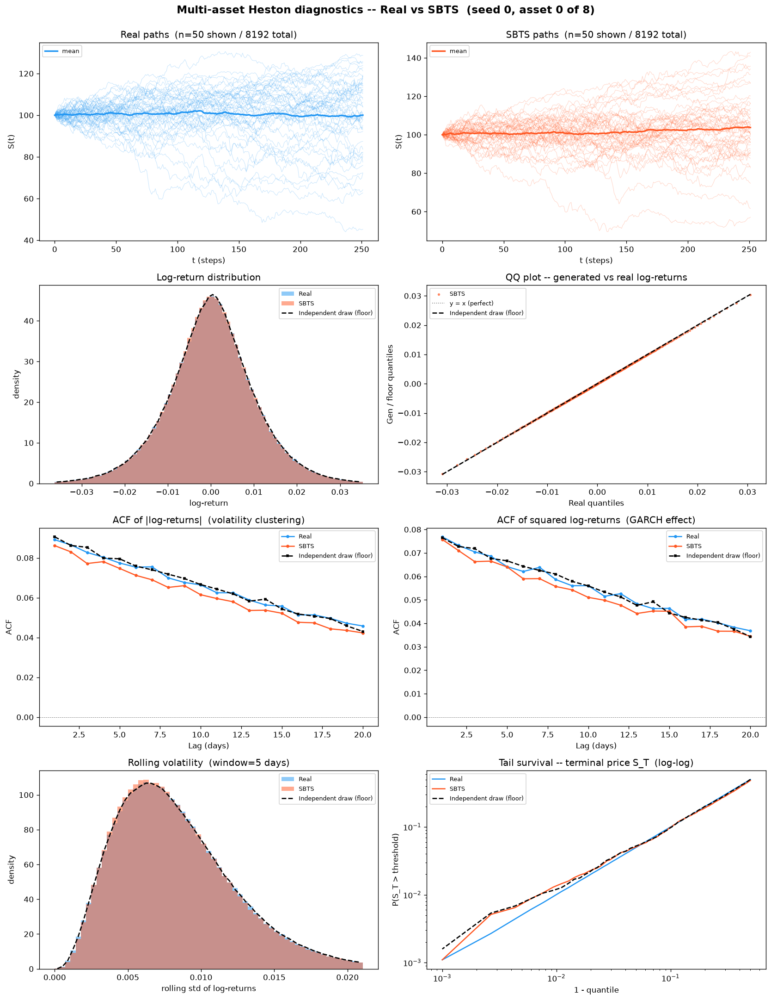
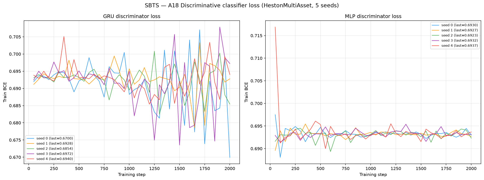
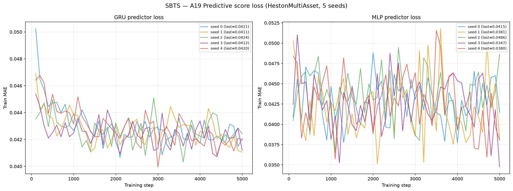

# SBTS on Multi-Asset Heston (d = 8)

**Schrödinger Bridge Time Series generation** (Alouadi, Barreau, Carlier & Pham, ICAIF 2025,
[arXiv:2503.02943](https://arxiv.org/abs/2503.02943)) applied to 8 192 **multi-asset** Heston
stochastic-volatility price paths (seq\_len = 252, **d = 8 correlated assets**).

SBTS is a **non-parametric, kernel-based** method: no neural network, no training loss,
no gradient descent, **no weights**. It estimates the Schrödinger-bridge drift directly from
training data using a **Markovian-K kernel** (K=20 for this benchmark) over the last K states,
then simulates paths via Euler-Maruyama. The "model" *is* the training array plus
`(h, K, N_pi)` — see [`weights/README.md`](weights/README.md).

See [`code/README.md`](code/README.md) for source and implementation details, and the
dataset-level [`../oldreadme.md`](../oldreadme.md) for the multi-asset Heston law itself, the
per-asset vs native metric scoping, and the memorisation diagnostic shared by all methods
on this dataset.

> **Hyperparameters:** `h=0.31`, `K=20`, `N_pi=50`, `dt=1/252`.
> `K` and `N_pi` are the **author's** values (A. Alouadi, confirmed 2026-07-27 for the d = 1
> length-128 Heston benchmark) and are carried over unchanged. **`h` is ours.**
> It is the one hyperparameter that *cannot* cross dimension: the SBTS kernel is **radial**,
> `K_h(x) = (h² − ‖x‖²)²·1{‖x‖₂ < h}`, so its support is a ball whose radius must scale with
> the typical distance between d-dimensional increments — and that distance grows like √d
> (median pairwise distance 0.0372 at d = 1 vs **0.2643 at d = 8**). The author's `h = 0.05`
> is catastrophic here: **40.8 % volatility error**, generated excess kurtosis **45.66** against
> a real 1.12, and a minimum price of **0.0** (outright path collapse). Selected on the **validation split (seed 3), never on test**, as the largest bandwidth satisfying every hard constraint and therefore the least-memorising admissible choice; `h = 0.35` is the cliff where volatility error jumps 1.20 → 6.45 %.
> Full sweep, criterion and caveats: [`losses/bandwidth_selection.json`](losses/bandwidth_selection.json)
> and [`losses/selection_criterion.md`](losses/selection_criterion.md).

---

## Metrics A1-A34 + B, mean ± std across 5 seeds

> All metrics on **log-returns** $r_t = \log(S_{t+1}/S_t)$ unless noted. A26 uses price increments $\Delta S_t$.
> Rows marked *(native d=8)* are evaluated **once** on the full `(N, T, 8)` tensor; every other
> row is computed on each of the 8 univariate slices and reported as the **mean over assets**
> (per-asset breakdown in [`metrics_per_asset.csv`](metrics_per_asset.csv)).

| Metric | Mean ± Std | Seed 0 | Seed 1 | Seed 2 | Seed 3 | Seed 4 | Perfect floor |
|---|---|---|---|---|---|---|---|
| **Fat Tail** | | | | | | | |
| A1 Kurtosis Error ↓ | 0.01811 ± 0.003116 | 0.01883 | 0.01205 | 0.01881 | 0.02056 | 0.02031 | 0.008385 |
| A2 \|r\| q95 Error ↓ | 1.40e-04 ± 1.01e-05 | 1.46e-04 | 1.54e-04 | 1.27e-04 | 1.40e-04 | 1.31e-04 | 4.58e-05 |
| A3 \|r\| q99 Error ↓ | 2.08e-04 ± 2.20e-05 | 2.17e-04 | 1.90e-04 | 1.80e-04 | 2.43e-04 | 2.11e-04 | 8.08e-05 |
| A4 Tail QQ Error ↓ | 1.35e-04 ± 7.31e-06 | 1.39e-04 | 1.44e-04 | 1.26e-04 | 1.39e-04 | 1.27e-04 | 5.62e-05 |
| A5 Hill Tail Index Error ↓ | 0.7294 ± 0.1953 | 0.4686 | 1.007 | 0.7883 | 0.8307 | 0.5516 | 0.5896 |
| **Distribution** | | | | | | | |
| A6 Path MMD² ↓ *(native d=8)* | 0.002046 ± 9.17e-05 | 0.001936 | 0.00202 | 0.002212 | 0.00206 | 0.002004 | 0.001948 |
| A7 Terminal MMD² ↓ *(native d=8)* | 0.002055 ± 4.96e-05 | 0.002029 | 0.00203 | 0.002152 | 0.002051 | 0.002015 | 0.001954 |
| A8 Increment MMD² ↓ *(native d=8)* | 0.00101 ± 1.22e-05 | 9.99e-04 | 0.001011 | 9.96e-04 | 0.001029 | 0.001017 | 8.71e-04 |
| A9 Volatility MMD ↓ *(native d=8)* | 0.009935 ± 3.62e-04 | 0.009539 | 0.00979 | 0.01062 | 0.0099 | 0.009829 | 0.008587 |
| A10 Terminal SWD ↓ *(native d=8)* | 1.355 ± 0.3244 | 1.099 | 1.403 | 1.954 | 1.052 | 1.266 | 1.141 |
| A11 Path SWD ↓ *(native d=8)* | 0.8259 ± 0.09446 | 0.7265 | 0.8258 | 0.9943 | 0.7467 | 0.8362 | 0.7258 |
| A12 RV Law Loss ↓ | 0.145 ± 0.007379 | 0.1473 | 0.1544 | 0.1341 | 0.1499 | 0.1392 | 0.06398 |
| A13 Mean Path RMSE ↓ | 0.2766 ± 0.03025 | 0.3005 | 0.2751 | 0.2888 | 0.2995 | 0.2189 | 0.1834 |
| A14 KS Log-returns ↓ | 0.002583 ± 2.36e-04 | 0.002969 | 0.002562 | 0.002473 | 0.002659 | 0.00225 | 9.64e-04 |
| A15 Skewness Error ↓ | 0.007407 ± 6.69e-04 | 0.006877 | 0.007551 | 0.006461 | 0.007794 | 0.008351 | 0.003568 |
| A16 QQ RMSE (300-pt) ↓ | 8.09e-05 ± 5.38e-06 | 8.76e-05 | 8.25e-05 | 7.61e-05 | 8.48e-05 | 7.32e-05 | 3.04e-05 |
| A17 Terminal Price KS ↓ | 0.0217 ± 0.002147 | 0.0248 | 0.02054 | 0.01971 | 0.02374 | 0.0197 | 0.01466 |
| **Adversarial** | | | | | | | |
| A18 Disc Score GRU ↓ *(native d=8)* | 0.02658 ± 0.00467 | 0.02792 | 0.03463 | 0.02548 | 0.02426 | 0.0206 | 0.005523 |
| A18 Disc Score MLP ↓ *(native d=8)* | 0.007904 ± 0.007351 | 0.004425 | 1.53e-04 | 0.02182 | 0.005951 | 0.007171 | 0.006012 |
| **Predictive** | | | | | | | |
| A19 Pred Score GRU ↓ | 0.0492 ± 2.76e-06 | 0.0492 | 0.04919 | 0.0492 | 0.04919 | 0.0492 | 0.0492 |
| A19 Pred Score MLP ↓ | 0.04932 ± 6.13e-05 | 0.04926 | 0.04936 | 0.04941 | 0.04925 | 0.04934 | 0.04931 |
| **Temporal** | | | | | | | |
| A20 Covariance Error ↓ *(native d=8)* | 80.27 ± 12.98 | 62.9 | 102.2 | 76.97 | 84.48 | 74.76 | 55.2 |
| A21 ACF \|r\| Error (lags) ↓ | 0.004719 ± 3.10e-04 | 0.004925 | 0.004393 | 0.004303 | 0.005074 | 0.004901 | 0.001066 |
| A22 ACF r² Error (lags) ↓ | 0.003448 ± 3.00e-04 | 0.003683 | 0.003262 | 0.002946 | 0.003725 | 0.003622 | 0.001107 |
| A23 ACF \|r\| Lag-1 Error ↓ | 0.005199 ± 3.32e-04 | 0.005231 | 0.004693 | 0.005021 | 0.005684 | 0.005365 | 0.001038 |
| A24 ACF r² Lag-1 Error ↓ | 0.003714 ± 3.33e-04 | 0.003676 | 0.003461 | 0.003262 | 0.004143 | 0.004029 | 0.001036 |
| **Vol** | | | | | | | |
| A25 Mean RMSE ↓ *(native d=8)* | 1.649 ± 0.2965 | 2.07 | 1.649 | 1.683 | 1.701 | 1.141 | 0.9234 |
| A26 Return Std Error ↓ | 0.006541 ± 4.14e-04 | 0.006002 | 0.006411 | 0.006957 | 0.007082 | 0.006252 | 0.001745 |
| A27 Log-Return Std Error ↓ | 6.34e-05 ± 5.34e-06 | 6.74e-05 | 6.97e-05 | 6.08e-05 | 6.45e-05 | 5.46e-05 | 2.21e-05 |
| A28 Kurtosis Ratio (→ 1) | 1.02 ± 0.004402 | 1.022 | 1.012 | 1.02 | 1.026 | 1.021 | 1 |
| A29 Sigma Mean Error ↓ | 0.001005 ± 9.10e-05 | 0.001071 | 0.001121 | 9.60e-04 | 0.001014 | 8.58e-04 | 3.32e-04 |
| A30 Cross-Sect. Vol Path RMSE ↓ | 0.3011 ± 0.02041 | 0.264 | 0.3189 | 0.2991 | 0.3028 | 0.3207 | 0.1596 |
| A31 Rolling Vol KS (w=5) ↓ | 0.007704 ± 3.42e-04 | 0.008121 | 0.007487 | 0.007521 | 0.008102 | 0.007288 | 0.00208 |
| A32 Vol-of-Vol Error ↓ | 4.80e-05 ± 3.56e-06 | 4.96e-05 | 4.16e-05 | 4.72e-05 | 5.22e-05 | 4.92e-05 | 1.14e-05 |
| **Heston Spec** | | | | | | | |
| A33 Teacher-Sigma Corr ↑ | -4.17e-04 ± 6.08e-04 | -2.21e-04 | -5.52e-04 | -6.73e-04 | -0.001242 | 6.06e-04 | -1.35e-04 |
| A34 Teacher-Sigma RMSE ↓ | 0.1006 ± 8.39e-05 | 0.1006 | 0.1008 | 0.1007 | 0.1006 | 0.1005 | 0.1013 |

> **Convention:** ↓ lower is better; ↑ higher is better; no arrow = no monotone direction. A28 Kurtosis Ratio: perfect = 1.0.
> **Headline:** **2 of the 36 A-metric rows sit at or below the independent-draw floor** — A19 Pred Score GRU, A34 Teacher-Sigma RMSE. The largest remaining gaps are **A23 ACF |r| Lag-1 Error** (0.005199 vs floor 0.001038, 5.0×); **A18 Disc Score GRU** (0.02658 vs floor 0.005523, 4.8×); **A21 ACF |r| Error (lags)** (0.004719 vs floor 0.001066, 4.4×); **A32 Vol-of-Vol Error** (4.80e-05 vs floor 1.14e-05, 4.2×). Since SBTS is currently the only generator on this dataset, the floor is the only honest reference; cross-method win-counts belong in the dataset-level [`../oldreadme.md`](../oldreadme.md) once a second method lands.
> **Perfect floor** is the *independent-draw* floor (GUIDELINE §5.4): five fresh draws from the *same* SDE with the *same* frozen per-asset parameters at seeds 1000-1004, scored with byte-identical metric code. It is **non-zero everywhere** — two independent 8 192-path draws never produce identical histograms, ACFs, quantiles or covariance matrices. It is **not** a permutation of the test set, which would preserve every column-wise statistic exactly, collapse most metrics to 0, and be a misleading target.
> **A1-A5**: fat-tail block — kurtosis error, tail quantile / QQ errors on |log-returns|, Hill tail index. **A6-A11** *(native d=8)*: path-kernel distances on the full 8-dimensional tensor (MMD² on paths / terminal / increments / realized-vol; sliced-Wasserstein on terminal & full paths), the rows where a multivariate generalisation is genuinely meaningful.
> **A12-A17**: distribution block, per asset then averaged. **A18** *(native d=8)*: discriminative classifier on all 8 channels at once, score = |accuracy − 0.5|. **A19**: TSTR MAE, deliberately **per-asset** — `predictive_score.py::_train_gru` targets `data_t[idx, 1:, :1]`, i.e. only the first feature, so a native run would silently report an asset-0-only number under a multi-asset name.
> **A20** *(native d=8)*: error on the full terminal covariance matrix, which is the row that actually tests whether the d(d−1)/2 spot correlations Σˢ survived generation. **A21-A24**: ACF |r|/r² errors. **A25** *(native d=8)*: mean RMSE across all assets jointly.
> **A26-A32**: volatility block. **A28** kurtosis ratio: perfect = 1.0. **A33-A34**: Heston-specific — whether the generated S-paths retain the latent variance path. A kernel/marginal-matching method with no explicit latent state has no mechanism to reproduce these, at d = 8 exactly as at d = 1.

---

## B, Curve-Shape Metrics, mean ± std across 5 seeds

Each stylised-fact plot yields a **curve** L (a list of values), not a scalar. The curve is
computed **per asset and averaged over the 8 assets** *before* the combination below, so the
combination rules stay byte-identical to the d = 1 tree. For the real data (L_r) and generated
data (L_g) we build three lists, the curve L, its first finite difference L' (der), and its
second finite difference L'' (sec\_der), then combine the three sub-scores into **one number
per plot**:

- **MSE row**: for each list, dᵢ = mean((L_r − L_g)²). Reported mean = the **mean of the three sub-scores** (funct + der + sec\_der)/3; std = the sample std of that per-seed combined score across the 5 seeds. The **MSE row decides the cross-method winner**.
- **% err row**: for each list, dᵢ = mean(|L_g − L_r| / (|L_r| + 1e-6)) × 100, a proper MAPE, one division (the mean already averages over the curve's points). Reported value = the **function-level MAPE on the curve L itself**, the derivative / 2nd-derivative MAPE is **excluded** because diff(L)/diff2(L) have near-zero true values, so their relative error explodes into meaningless 10⁴-% figures. mean/std = mean and **sample std across the 5 seeds** of that per-seed function MAPE.
- **NRMSE row**: sqrt(mean((L_g − L_r)²)) / (max|L_r| − min|L_r| + 1e-12) × 100 on the curve L **only (funct-only)**, the ill-posed derivative / 2nd-derivative curves are excluded for the same reason as the % err row.
- **CVaR₉₀ / CVaR₉₅ rows**: tail-averaged pointwise curve error (Expected Shortfall) on the curve L **only (funct-only)**. Pointwise error eₜ = |L_g(t) − L_r(t)|; for q ∈ {0.90, 0.95}, CVaR_q = mean(eₜ for eₜ ≥ the q-th percentile of eₜ), then range-normalized like NRMSE (÷ (max|L_r| − min|L_r| + 1e-12) × 100).

All ↓ lower is better. The perfect floor is **non-zero** for all plots, it is the residual finite-sample error of an independent multi-asset Heston draw scored against the test set, identical across methods.
Five sublines per plot: **MSE**, **% error**, **NRMSE**, **CVaR₉₀** and **CVaR₉₅** (the per-seed columns hold that seed's combined score).

| Plot | Measure | Mean ± Std | Seed 0 | Seed 1 | Seed 2 | Seed 3 | Seed 4 | Perfect floor |
|---|---|---|---|---|---|---|---|---|
| **Path comparison** *(50×50 path-cloud)* | grid_tvd 50×50 (%) ↓ | 3.317% ± 0.05786% | 3.334% | 3.303% | 3.307% | 3.411% | 3.231% | 2.189% |
| **Log-return histogram** | MSE | 0.06192 ± 0.002754 | 0.06721 | 0.06091 | 0.06115 | 0.06122 | 0.05912 | 0.0554 |
|  | % err | 1.672% ± 0.05289% | 1.709% | 1.691% | 1.616% | 1.741% | 1.605% | 1.302% |
|  | NRMSE | 0.533% ± 0.01813% | 0.5631% | 0.5197% | 0.5278% | 0.5425% | 0.5119% | 0.3601% |
|  | CVaR₉₀ | 1.267% ± 0.04072% | 1.323% | 1.225% | 1.263% | 1.303% | 1.222% | 0.8339% |
|  | CVaR₉₅ | 1.547% ± 0.06047% | 1.633% | 1.494% | 1.542% | 1.594% | 1.471% | 0.994% |
| **QQ plot** | MSE | 2.94e-09 ± 3.50e-10 | 3.28e-09 | 2.93e-09 | 2.62e-09 | 3.37e-09 | 2.49e-09 | 5.66e-10 |
|  | % err | 1.753% ± 0.1874% | 2.064% | 1.641% | 1.771% | 1.791% | 1.499% | 0.5364% |
|  | NRMSE | 0.2277% ± 0.01445% | 0.2463% | 0.2296% | 0.2098% | 0.2401% | 0.2129% | 0.08644% |
|  | CVaR₉₀ | 0.2406% ± 0.01323% | 0.2556% | 0.2431% | 0.2221% | 0.2534% | 0.2287% | 0.09922% |
|  | CVaR₉₅ | 0.2901% ± 0.01661% | 0.3063% | 0.2863% | 0.2656% | 0.3109% | 0.2817% | 0.125% |
| **ACF \|r\|** | MSE | 1.16e-05 ± 8.48e-07 | 1.21e-05 | 1.09e-05 | 1.04e-05 | 1.28e-05 | 1.21e-05 | 3.33e-06 |
|  | % err | 6.188% ± 0.4192% | 6.378% | 5.554% | 5.85% | 6.684% | 6.472% | 2.043% |
|  | NRMSE | 7.721% ± 0.5052% | 8.038% | 7.019% | 7.23% | 8.329% | 7.992% | 2.523% |
|  | CVaR₉₀ | 12.91% ± 0.6494% | 13.02% | 12.17% | 12.15% | 13.7% | 13.49% | 4.991% |
|  | CVaR₉₅ | 13.69% ± 0.6415% | 13.73% | 13.06% | 12.87% | 14.43% | 14.34% | 5.542% |
| **ACF r²** | MSE | 1.06e-05 ± 6.70e-07 | 1.14e-05 | 1.01e-05 | 9.56e-06 | 1.10e-05 | 1.09e-05 | 3.98e-06 |
|  | % err | 5.183% ± 0.3729% | 5.403% | 4.783% | 4.69% | 5.608% | 5.433% | 2.37% |
|  | NRMSE | 6.296% ± 0.4904% | 6.661% | 5.744% | 5.655% | 6.789% | 6.63% | 2.772% |
|  | CVaR₉₀ | 11.55% ± 0.838% | 11.94% | 10.42% | 10.69% | 12.14% | 12.55% | 5.52% |
|  | CVaR₉₅ | 12.61% ± 0.8087% | 12.79% | 11.34% | 12.1% | 13.14% | 13.65% | 6.131% |
| **Rolling vol histogram** | MSE | 0.9039 ± 0.04565 | 0.9439 | 0.8462 | 0.9663 | 0.8642 | 0.8988 | 0.6039 |
|  | % err | 2.839% ± 0.083% | 2.874% | 2.776% | 2.815% | 2.982% | 2.748% | 1.536% |
|  | NRMSE | 1.117% ± 0.03384% | 1.15% | 1.079% | 1.091% | 1.164% | 1.1% | 0.5137% |
|  | CVaR₉₀ | 2.472% ± 0.06549% | 2.541% | 2.422% | 2.399% | 2.559% | 2.437% | 1.172% |
|  | CVaR₉₅ | 2.732% ± 0.07558% | 2.818% | 2.719% | 2.62% | 2.814% | 2.689% | 1.362% |
| **Tail survival** | MSE | 2.07e-06 ± 2.69e-07 | 2.43e-06 | 2.15e-06 | 1.83e-06 | 2.24e-06 | 1.70e-06 | 2.03e-07 |
|  | % err | 0.7097% ± 0.04721% | 0.7668% | 0.7464% | 0.6569% | 0.7274% | 0.6511% | 0.2297% |
|  | NRMSE | 0.2349% ± 0.01479% | 0.2572% | 0.2378% | 0.2218% | 0.2419% | 0.2157% | 0.06634% |
|  | CVaR₉₀ | 0.3569% ± 0.02001% | 0.3846% | 0.3614% | 0.3402% | 0.3693% | 0.329% | 0.1122% |
|  | CVaR₉₅ | 0.3623% ± 0.02021% | 0.3903% | 0.3663% | 0.3459% | 0.3749% | 0.3338% | 0.1175% |

> **Headline:** **0 of the 6 B plots** sit at or below the finite-sample floor on the deciding MSE row: none.
> **Cross-seed stability**: SBTS is a deterministic kernel with no gradient descent, so the only seed-to-seed variation is the simulation noise of the Euler-Maruyama draw — there are no seed-collapse events of the kind a GAN can suffer.

---

## Stylised Facts Diagnostic (Multi-Asset Heston vs SBTS, seed 0, asset 0)

Eight-panel comparison: sample paths, return distribution, QQ plot, ACF of |returns|,
ACF of squared returns, rolling vol histogram (window=5), tail survival (log-log).

The third (black dashed) curve is the **independent-draw floor**, not a closed-form theory
curve: `metrics/heston_theory.py` is hard-wired to the d = 1 parameters (κ=2.0, θ=0.04,
ρ=−0.7, dt=1/250), so plotting it over d = 8 data would be a fabricated reference. Wherever
Real and the floor curve already disagree, the gap is finite-sample noise rather than a
modelling failure. **One asset is shown, not eight** — the *metrics* are averaged over all 8
assets, the *figure* is asset 0; pooling eight deliberately different volatilities
(σ 0.0097-0.0165) into one histogram would show the mixing, not the model.



---

## SBTS has no training loss

SBTS is kernel-based, there is no loss curve. Instead, the bandwidth `h`, Markovian order `K`,
and Euler substeps `N_pi` are hyperparameters: **h=0.31, K=20, N_pi=50** (`K` and `N_pi`
author-specified by A. Alouadi 2026-07-27; `h` re-selected for d = 8 on the validation split,
because the radial kernel's support radius cannot cross dimension). The `losses/` directory
stores the per-seed bandwidth JSON records and the full selection evidence for reproducibility.

Generation wall-clock times (16 and 64 workers, sequential seeds, full 8 192-path × 8-asset run
finishes in **2.9 h total**):

| Seed | Workers | Elapsed |
|------|---------|---------|
| 0 | 16 | 79.5 min |
| 1 | 64 | 23.2 min |
| 2 | 64 | 23.0 min |
| 3 | 64 | 22.9 min |
| 4 | 64 | 22.7 min |

---

## A18, Discriminative Classifier Training Loss

BCE loss during GRU and MLP classifier training (2 000 steps, logged every 50 steps).
A value near ln(2) ≈ 0.693 means the classifier cannot distinguish real from fake.
The d = 8 classifier is **native**: it sees all 8 channels at once.



---

## A19, Predictive Score Training Loss (TSTR)

MAE loss during GRU and MLP predictor training on *synthetic* data (5 000 steps, logged every 100 steps).
The predictor is run **once per asset**; the curves archived here are **asset 0's**, since the
driver stores the loss history only for `j == 0`. The A19 score in the table above is the mean
over all 8 assets.



---

## File layout

This tree is **self-contained**: code, inputs, outputs and documentation sit side by side,
unlike the d = 1 benchmark which splits `methods/<Method>/` from `results/Heston/<Method>/`.

```
results/HestonMultiAsset/SBTS/
├── README.md                             ← this file (generated by code/render_readme.py)
├── code/
│   ├── README.md                         source notes, hyperparameters, d = 8 deviations
│   ├── sbts_generate_multiasset.py       core module: radial kernel, per-asset sigma
│   ├── run_all_multiasset.py             full run: 5 seeds × 8192 paths × 252 steps × 8 assets
│   ├── plot_diagnostics_multiasset.py    the 8-panel stylised-facts figure
│   ├── measure_memorisation.py           nearest-neighbour memorisation diagnostic
│   └── render_readme.py                  regenerates this README from the artefacts
├── generated_paths/seed_{0..4}/
│   ├── generated_paths_8192x252x8.npy    (8192, 252, 8) float64 — gitignored, 132 MB
│   └── metadata.json                     seed, h, K, N_pi, shape, min/max, elapsed_sec (tracked)
├── losses/
│   ├── seed_{i}_bandwidth.json           h, K, N_pi, dt — no loss (kernel method)
│   ├── bandwidth_selection.json          full d = 8 sweep + selection verdict
│   ├── selection_criterion.md            pre-registered criterion and its caveats
│   ├── memorisation.json                 NN-ratio diagnostic on the final 8192-path output
│   └── generation_time.csv               wall-clock time per seed
├── plots/
│   ├── heston_diagnostics.png            8-panel stylised facts (seed 0, asset 0)
│   ├── disc_classifier_loss.png          A18 BCE curves, 5 seeds
│   └── pred_score_loss.png               A19 MAE curves, 5 seeds (asset 0)
├── weights/README.md                     why there are none
├── metrics_summary.csv                   A1-A34, mean ± std, per seed
├── metrics_per_asset.csv                 per-metric × per-asset breakdown (8 rows per metric)
├── curve_b_aggregate.json                B curve-shape aggregate
├── grid_tvd_aggregate.json               path-cloud TVD
└── seed_{i}_metrics.json                 full per-seed dump incl. the per_asset block
```

The `.npy` arrays are **gitignored**: `(8192, 252, 8)` float64 = 132 MB each, over GitHub's
100 MB per-file hard limit, and LFS was ruled out. They are fully reproducible from the tracked
code and tracked hyperparameters; the `metadata.json` beside each array **is** tracked, so
shapes, price ranges and generation times stay auditable without the payload.

## Reproduce

```bash
cd /home/tbasseras/benchmark

# 1. dataset (~4 min on 8 cores) — only if dataset/HestonMultiAsset/*.npy are absent
cd dataset/HestonMultiAsset && python generate_heston_multiasset.py && cd -

# 2. generate paths — CPU only, no GPU. ~2.9 h for 5 seeds.
setsid taskset -c 0-15 env OMP_NUM_THREADS=1 MKL_NUM_THREADS=1 \
    OPENBLAS_NUM_THREADS=1 NUMBA_NUM_THREADS=1 \
    /home/tbasseras/sbts-venv/bin/python \
    results/HestonMultiAsset/SBTS/code/run_all_multiasset.py \
    > /tmp/sbts_ma_run.log 2>&1 < /dev/null & disown

# 3. independent-draw perfect-recovery floor (seeds 1000-1004, ~6 s)
/home/tbasseras/sbts-venv/bin/python metrics/gen_perfect_recovery_multiasset.py

# 4. metrics — both sides go through byte-identical code
CUDA_VISIBLE_DEVICES=3 /home/tbasseras/gpu-venv/bin/python \
    metrics/compute_all_multiasset.py --method perfect_recovery
CUDA_VISIBLE_DEVICES=3 /home/tbasseras/gpu-venv/bin/python \
    metrics/compute_all_multiasset.py --method SBTS

# 5. figures
/home/tbasseras/gpu-venv/bin/python \
    results/HestonMultiAsset/SBTS/code/plot_diagnostics_multiasset.py
/home/tbasseras/gpu-venv/bin/python \
    metrics/plot_score_losses.py --method SBTS --dataset HestonMultiAsset

# 6. memorisation diagnostic
/home/tbasseras/gpu-venv/bin/python \
    results/HestonMultiAsset/SBTS/code/measure_memorisation.py

# 7. regenerate this README from the artefacts
/home/tbasseras/gpu-venv/bin/python \
    results/HestonMultiAsset/SBTS/code/render_readme.py
```
