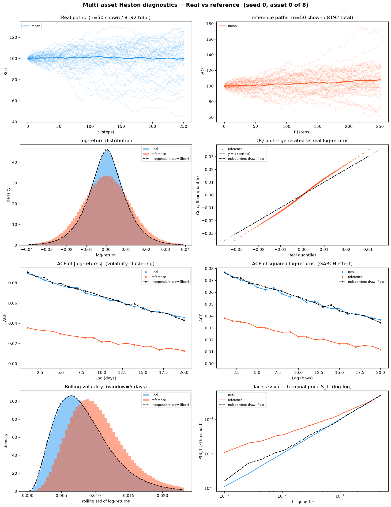
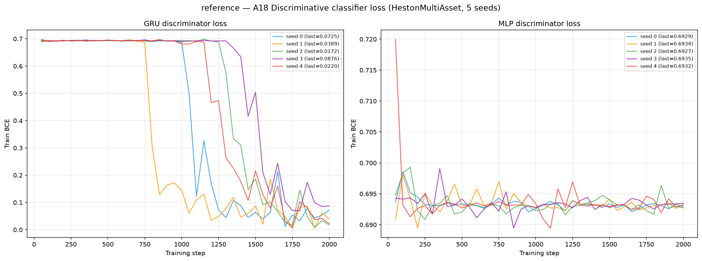
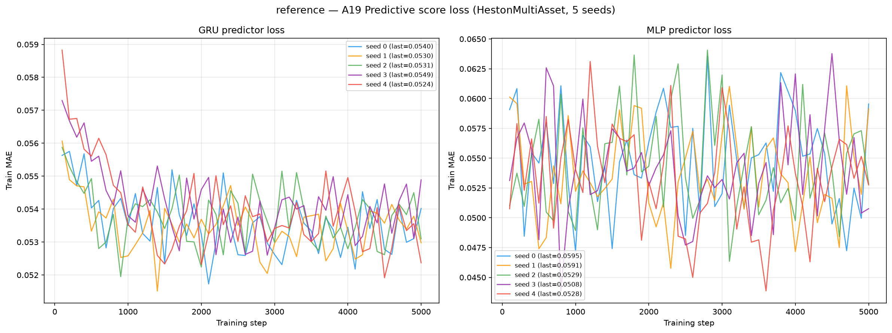

# The Reference SDE on Multi-Asset Heston (d = 8)

**σ<sup>ref</sup> — the frozen reference diffusion of Deep-MKV-TS Algorithm 1**
(El Boustany, Basseras, Mekkaoui, Alouadi, Hafsi & Pham), sampled with the neural
control switched **off**, on 8 192 **multi-asset** Heston stochastic-volatility price
paths (seq\_len = 252, **d = 8 correlated assets**).

This is **not a competing generator**. It is the *starting line*. Algorithm 1 takes a
pre-fitted parametric diffusion σ<sup>ref</sup> and learns a neural control on top of it;
this folder scores σ<sup>ref</sup> **alone**, so the trained method's numbers can be split
into "what the reference SDE already gave us" and "what the control actually bought".
Together with [`../perfect_recovery/`](../perfect_recovery) — draws from the *true* Heston
law — the two bracket [`../Deep-MKV-TS/`](../Deep-MKV-TS) from opposite sides:

| Folder | Samples from | Reads as |
|--------|--------------|----------|
| [`../perfect_recovery/`](../perfect_recovery) | the **true** Heston SDE | the best any generator could do — the floor |
| **`reference/`** *(this page)* | the **fitted** σ<sup>ref</sup> | Deep-MKV-TS **before its first gradient step** |
| [`../Deep-MKV-TS/`](../Deep-MKV-TS) | the **trained** control | must land strictly between the two, or Algorithm 1 bought nothing |

The model is **built but never fitted**. All 56136 parameters are constructed exactly as
`train_multiasset.py` constructs them, and then **0 gradient steps** are taken.
Algorithm 1 zero-initialises the final layer of both output heads — weight *and* bias — so
`Ẑ ≡ 0` for every hidden state whatever the GRU beneath computes, the control

$$\Theta = \eta\,(\sigma^{\mathrm{ref}})^{-1} + \hat{Z}/\sqrt{\Delta t}$$

reduces to $\eta\,(\sigma^{\mathrm{ref}})^{-1}$, and the sampler integrates
σ<sup>ref</sup> itself. All 4 head tensors measured `max|·| = 0`, verified at generation time —
`code/generate_reference_multiasset.py` refuses to write a bank if any is non-zero, so the
central claim of this page is **enforced rather than asserted** (per-seed record in
`generated_paths/seed_{i}/metadata.json` under `zhat_head_max_abs`).

See [`code/README.md`](code/README.md) for source and implementation details,
[`weights/README.md`](weights/README.md) for the fitted coefficients and their provenance,
and the dataset-level [`../oldreadme.md`](../oldreadme.md) for the multi-asset Heston law,
the per-asset vs native metric scoping, and the memorisation diagnostic shared by all
methods on this dataset.

> **Hyperparameters:** none were chosen for this folder. σ<sup>ref</sup> carries
> **19 fitted coefficients in total** — 7 covariance, 7 off-diagonal,
> 5 drift — plus two trend and two activity half-lives and the spectral clip bounds
> `σ_min=0.001`, `σ_max=0.6`. They come from a **300-step Gaussian-NLL fit on the
> training split only** (`heston_ma_S_8192x252x8.npy`, internal 80/20 calibration/validation
> split, lr=0.001), `fitted_at` **2026-08-26T00:54:11**, final calibration NLL **-10.336229**,
> validation NLL **-10.384663**. Nothing else is tuned: no learning rate, no ridge λ, no
> checkpoint selection, no early stopping — because there is no training. That is 19
> numbers against **869 214 training values per coefficient**, which is why memorisation
> here is not merely unlikely but arithmetically impossible. The weights are **byte-identical
> copies** of the ones Deep-MKV-TS trains on top of, with `weights/SHA256SUMS` to detect
> silent drift.
> **Memorisation:** `nn_ratio = 0.9975 ± 0.0012` ([`losses/memorisation.json`](losses/memorisation.json)). This row **calibrates the diagnostic rather than testing the generator**: with 19 fitted coefficients against ~16.5M training values and a control verified to be exactly zero, memorisation here is arithmetically impossible, so whatever the estimator returns *is* its reading for a generator that certainly did not memorise. That is the null the other columns need to be interpretable.

---

## Metrics A1-A34 + B, mean ± std across 5 seeds

> All metrics on **log-returns** $r_t = \log(S_{t+1}/S_t)$ unless noted. A26 uses price increments $\Delta S_t$.
> Rows marked *(native d=8)* are evaluated **once** on the full `(N, T, 8)` tensor; every other
> row is computed on each of the 8 univariate slices and reported as the **mean over assets**
> (per-asset breakdown in [`metrics_per_asset.csv`](metrics_per_asset.csv)).

| Metric | Mean ± Std | Seed 0 | Seed 1 | Seed 2 | Seed 3 | Seed 4 | Perfect floor |
|---|---|---|---|---|---|---|---|
| **Fat Tail** | | | | | | | |
| A1 Kurtosis Error ↓ | 0.6296 ± 0.002013 | 0.6313 | 0.6307 | 0.6314 | 0.6283 | 0.6262 | 0.008385 |
| A2 \|r\| q95 Error ↓ | 0.00355 ± 1.61e-05 | 0.003548 | 0.003529 | 0.003561 | 0.003575 | 0.003539 | 4.58e-05 |
| A3 \|r\| q99 Error ↓ | 0.004809 ± 3.38e-05 | 0.004806 | 0.004763 | 0.004836 | 0.004855 | 0.004783 | 8.08e-05 |
| A4 Tail QQ Error ↓ | 0.003534 ± 1.72e-05 | 0.003533 | 0.00351 | 0.003542 | 0.003561 | 0.003523 | 5.62e-05 |
| A5 Hill Tail Index Error ↓ | 3.274 ± 0.1463 | 3.365 | 3.44 | 3.039 | 3.352 | 3.176 | 0.5896 |
| **Distribution** | | | | | | | |
| A6 Path MMD² ↓ *(native d=8)* | 0.002745 ± 9.90e-05 | 0.002839 | 0.00265 | 0.002887 | 0.002649 | 0.002702 | 0.001948 |
| A7 Terminal MMD² ↓ *(native d=8)* | 0.002586 ± 6.34e-05 | 0.002559 | 0.002659 | 0.002637 | 0.00248 | 0.002593 | 0.001954 |
| A8 Increment MMD² ↓ *(native d=8)* | 9.00e-04 ± 4.65e-06 | 9.01e-04 | 9.03e-04 | 8.96e-04 | 9.06e-04 | 8.93e-04 | 8.71e-04 |
| A9 Volatility MMD ↓ *(native d=8)* | 0.2756 ± 0.002493 | 0.2769 | 0.2748 | 0.2775 | 0.2711 | 0.2779 | 0.008587 |
| A10 Terminal SWD ↓ *(native d=8)* | 2.217 ± 0.1102 | 2.215 | 2.424 | 2.173 | 2.098 | 2.177 | 1.141 |
| A11 Path SWD ↓ *(native d=8)* | 1.434 ± 0.02652 | 1.414 | 1.394 | 1.439 | 1.46 | 1.463 | 0.7258 |
| A12 RV Law Loss ↓ | 3.063 ± 0.01584 | 3.07 | 3.038 | 3.06 | 3.086 | 3.059 | 0.06398 |
| A13 Mean Path RMSE ↓ | 0.4311 ± 0.1046 | 0.2711 | 0.4346 | 0.4446 | 0.5992 | 0.4059 | 0.1834 |
| A14 KS Log-returns ↓ | 0.04336 ± 2.75e-04 | 0.04321 | 0.04301 | 0.04347 | 0.04383 | 0.04329 | 9.64e-04 |
| A15 Skewness Error ↓ | 0.05418 ± 0.001213 | 0.05414 | 0.05189 | 0.05475 | 0.05471 | 0.05541 | 0.003568 |
| A16 QQ RMSE (300-pt) ↓ | 0.001943 ± 7.27e-06 | 0.001944 | 0.00193 | 0.001946 | 0.001952 | 0.00194 | 3.04e-05 |
| A17 Terminal Price KS ↓ | 0.04949 ± 0.002247 | 0.04659 | 0.04976 | 0.05113 | 0.0526 | 0.04739 | 0.01466 |
| **Adversarial** | | | | | | | |
| A18 Disc Score GRU ↓ *(native d=8)* | 0.4808 ± 0.01072 | 0.4908 | 0.4716 | 0.4951 | 0.4673 | 0.4789 | 0.005523 |
| A18 Disc Score MLP ↓ *(native d=8)* | 0.005279 ± 0.005004 | 0.001373 | 0.002289 | 0.01327 | 4.58e-04 | 0.009002 | 0.006012 |
| **Predictive** | | | | | | | |
| A19 Pred Score GRU ↓ | 0.0492 ± 4.09e-06 | 0.0492 | 0.04921 | 0.0492 | 0.0492 | 0.04921 | 0.0492 |
| A19 Pred Score MLP ↓ | 0.0496 ± 8.11e-05 | 0.04963 | 0.04945 | 0.04966 | 0.04961 | 0.04968 | 0.04931 |
| **Temporal** | | | | | | | |
| A20 Covariance Error ↓ *(native d=8)* | 754.6 ± 6.179 | 765.1 | 752.9 | 752.4 | 756.3 | 746.3 | 55.2 |
| A21 ACF \|r\| Error (lags) ↓ | 0.04602 ± 2.82e-04 | 0.04626 | 0.04558 | 0.04593 | 0.04594 | 0.04639 | 0.001066 |
| A22 ACF r² Error (lags) ↓ | 0.0333 ± 2.93e-04 | 0.03348 | 0.03284 | 0.03326 | 0.03319 | 0.03372 | 0.001107 |
| A23 ACF \|r\| Lag-1 Error ↓ | 0.05307 ± 3.44e-04 | 0.05346 | 0.05257 | 0.05277 | 0.05319 | 0.05337 | 0.001038 |
| A24 ACF r² Lag-1 Error ↓ | 0.03839 ± 4.24e-04 | 0.03862 | 0.03772 | 0.03807 | 0.03867 | 0.03885 | 0.001036 |
| **Vol** | | | | | | | |
| A25 Mean RMSE ↓ *(native d=8)* | 2.087 ± 0.4813 | 1.358 | 2.275 | 2.068 | 2.833 | 1.899 | 0.9234 |
| A26 Return Std Error ↓ | 0.1868 ± 3.21e-04 | 0.187 | 0.1863 | 0.1869 | 0.1872 | 0.1867 | 0.001745 |
| A27 Log-Return Std Error ↓ | 0.001888 ± 9.11e-06 | 0.001892 | 0.001872 | 0.001886 | 0.0019 | 0.001888 | 2.21e-05 |
| A28 Kurtosis Ratio (→ 1) | 1.302 ± 0.01066 | 1.301 | 1.311 | 1.314 | 1.284 | 1.299 | 1 |
| A29 Sigma Mean Error ↓ | 0.03008 ± 1.25e-04 | 0.03011 | 0.02986 | 0.03009 | 0.03025 | 0.03007 | 3.32e-04 |
| A30 Cross-Sect. Vol Path RMSE ↓ | 2.079 ± 0.03411 | 2.117 | 2.043 | 2.065 | 2.124 | 2.049 | 0.1596 |
| A31 Rolling Vol KS (w=5) ↓ | 0.1648 ± 4.29e-04 | 0.1651 | 0.164 | 0.165 | 0.1651 | 0.165 | 0.00208 |
| A32 Vol-of-Vol Error ↓ | 6.34e-04 ± 4.43e-06 | 6.41e-04 | 6.29e-04 | 6.33e-04 | 6.36e-04 | 6.29e-04 | 1.14e-05 |
| **Heston Spec** | | | | | | | |
| A33 Teacher-Sigma Corr ↑ | -4.96e-04 ± 0.001518 | -0.002939 | 7.33e-04 | 7.88e-04 | -0.001625 | 5.64e-04 | -1.35e-04 |
| A34 Teacher-Sigma RMSE ↓ | 0.1018 ± 1.67e-04 | 0.1019 | 0.1017 | 0.1017 | 0.1021 | 0.1017 | 0.1013 |

> **Convention:** ↓ lower is better; ↑ higher is better; no arrow = no monotone direction. A28 Kurtosis Ratio: perfect = 1.0.
> **Headline:** **1 of the 36 A-metric rows already sit at or below the independent-draw floor with the control switched off** — A18 Disc Score MLP. Those are rows on which Deep-MKV-TS **cannot claim credit for the learned control**: the 19-coefficient parametric SDE reaches the floor there by itself. The largest remaining gaps — the rows where the control has something left to do — are **A26 Return Std Error** (0.1868 vs floor 0.001745, 107.1×); **A29 Sigma Mean Error** (0.03008 vs floor 3.32e-04, 90.7×); **A18 Disc Score GRU** (0.4808 vs floor 0.005523, 87.0×); **A27 Log-Return Std Error** (0.001888 vs floor 2.21e-05, 85.3×). Cross-method win-counts belong in the dataset-level comparison table, not here.
> **How to read this column against [`../Deep-MKV-TS/`](../Deep-MKV-TS):** on any row, *(reference − Deep-MKV-TS)* is the control's contribution and *(Deep-MKV-TS − floor)* is what remains unsolved. A row where Deep-MKV-TS scores **worse** than this page is a row where Algorithm 1 actively damaged a working reference — the single most informative failure this benchmark can surface, and completely invisible without a reference column.
> **Pairing:** generation seeds are `90000 + i`, **imported** from `Deep-MKV-TS/code/run_all_multiasset.py` rather than redefined, so each reference bank draws the **same Brownian stream** as the corresponding Deep-MKV-TS bank. The comparison is therefore paired wherever both methods hold that seed, which removes simulation noise from the difference instead of averaging over it.
> **Perfect floor** is the *independent-draw* floor (GUIDELINE §5.4): five fresh draws from the *same* SDE with the *same* frozen per-asset parameters at seeds 1000-1004, scored with byte-identical metric code. It is **non-zero everywhere** — two independent 8 192-path draws never produce identical histograms, ACFs, quantiles or covariance matrices. It is **not** a permutation of the test set, which would preserve every column-wise statistic exactly, collapse most metrics to 0, and be a misleading target.
> **A1-A5**: fat-tail block — kurtosis error, tail quantile / QQ errors on |log-returns|, Hill tail index. **A6-A11** *(native d=8)*: path-kernel distances on the full 8-dimensional tensor (MMD² on paths / terminal / increments / realized-vol; sliced-Wasserstein on terminal & full paths).
> **A12-A17**: distribution block, per asset then averaged. **A18** *(native d=8)*: discriminative classifier on all 8 channels at once, score = |accuracy − 0.5|. **A19**: TSTR MAE, deliberately **per-asset** — `predictive_score.py::_train_gru` targets `data_t[idx, 1:, :1]`, i.e. only the first feature, so a native run would silently report an asset-0-only number under a multi-asset name.
> **A20** *(native d=8)*: error on the full terminal covariance matrix — the row that tests whether the d(d−1)/2 spot correlations Σˢ survived generation, and the row σ<sup>ref</sup>'s 7 off-diagonal coefficients exist to capture. **A21-A24**: ACF |r|/r² errors. **A25** *(native d=8)*: mean RMSE across all assets jointly.
> **A26-A32**: volatility block. **A28** kurtosis ratio: perfect = 1.0. **A33-A34**: Heston-specific — whether the generated S-paths retain the latent variance path. σ<sup>ref</sup> carries a *structural* activity state (`activity_update = structural_variance`) rather than the true latent variance, so these two rows measure how well that surrogate stands in for it.

---

## B, Curve-Shape Metrics, mean ± std across 5 seeds

Each stylised-fact plot yields a **curve** L (a list of values), not a scalar. The curve is
computed **per asset and averaged over the 8 assets** *before* the combination below, so the
combination rules stay byte-identical to the d = 1 tree. For the real data (L_r) and generated
data (L_g) we build three lists, the curve L, its first finite difference L' (der), and its
second finite difference L'' (sec\_der), then combine the three sub-scores into **one number
per plot**:

- **MSE row**: for each list, dᵢ = mean((L_r − L_g)²). Reported mean = the **mean of the three sub-scores** (funct + der + sec\_der)/3; std = the sample std of that per-seed combined score across the 5 seeds. The **MSE row decides the cross-method winner**.
- **% err row**: for each list, dᵢ = mean(|L_g − L_r| / (|L_r| + 1e-6)) × 100, a proper MAPE, one division (the mean already averages over the curve's points). Reported value = the **function-level MAPE on the curve L itself**, the derivative / 2nd-derivative MAPE is **excluded** because diff(L)/diff2(L) have near-zero true values, so their relative error explodes into meaningless 10⁴-% figures. mean/std = mean and **sample std across the 5 seeds** of that per-seed function MAPE.
- **NRMSE row**: sqrt(mean((L_g − L_r)²)) / (max|L_r| − min|L_r| + 1e-12) × 100 on the curve L **only (funct-only)**, the ill-posed derivative / 2nd-derivative curves are excluded for the same reason as the % err row.
- **CVaR₉₀ / CVaR₉₅ rows**: tail-averaged pointwise curve error (Expected Shortfall) on the curve L **only (funct-only)**. Pointwise error eₜ = |L_g(t) − L_r(t)|; for q ∈ {0.90, 0.95}, CVaR_q = mean(eₜ for eₜ ≥ the q-th percentile of eₜ), then range-normalized like NRMSE (÷ (max|L_r| − min|L_r| + 1e-12) × 100).

All ↓ lower is better. The perfect floor is **non-zero** for all plots, it is the residual finite-sample error of an independent multi-asset Heston draw scored against the test set, identical across methods.
Five sublines per plot: **MSE**, **% error**, **NRMSE**, **CVaR₉₀** and **CVaR₉₅** (the per-seed columns hold that seed's combined score).

| Plot | Measure | Mean ± Std | Seed 0 | Seed 1 | Seed 2 | Seed 3 | Seed 4 | Perfect floor |
|---|---|---|---|---|---|---|---|---|
| **Path comparison** *(50×50 path-cloud)* | grid_tvd 50×50 (%) ↓ | 7.881% ± 0.1491% | 7.862% | 7.8% | 7.968% | 8.108% | 7.669% | 2.189% |
| **Log-return histogram** | MSE | 3.94 ± 0.02815 | 3.917 | 3.905 | 3.953 | 3.985 | 3.94 | 0.0554 |
|  | % err | 29.47% ± 0.158% | 29.43% | 29.27% | 29.57% | 29.72% | 29.37% | 1.302% |
|  | NRMSE | 7.793% ± 0.02095% | 7.8% | 7.753% | 7.8% | 7.814% | 7.797% | 0.3601% |
|  | CVaR₉₀ | 17.78% ± 0.06125% | 17.81% | 17.66% | 17.82% | 17.82% | 17.8% | 0.8339% |
|  | CVaR₉₅ | 19.27% ± 0.06476% | 19.28% | 19.15% | 19.31% | 19.35% | 19.27% | 0.994% |
| **QQ plot** | MSE | 1.60e-06 ± 1.11e-08 | 1.61e-06 | 1.58e-06 | 1.60e-06 | 1.61e-06 | 1.60e-06 | 5.66e-10 |
|  | % err | 22.41% ± 0.2656% | 22.21% | 22.23% | 22.43% | 22.91% | 22.25% | 0.5364% |
|  | NRMSE | 5.564% ± 0.02401% | 5.563% | 5.528% | 5.572% | 5.602% | 5.554% | 0.08644% |
|  | CVaR₉₀ | 5.414% ± 0.02613% | 5.421% | 5.375% | 5.416% | 5.455% | 5.402% | 0.09922% |
|  | CVaR₉₅ | 6.101% ± 0.03164% | 6.114% | 6.052% | 6.106% | 6.147% | 6.086% | 0.125% |
| **ACF \|r\|** | MSE | 5.67e-04 ± 5.62e-06 | 5.73e-04 | 5.59e-04 | 5.66e-04 | 5.63e-04 | 5.73e-04 | 3.33e-06 |
|  | % err | 56.01% ± 0.4432% | 56.38% | 55.29% | 55.97% | 55.87% | 56.56% | 2.043% |
|  | NRMSE | 68.29% ± 0.524% | 68.66% | 67.62% | 68.01% | 68.06% | 69.1% | 2.523% |
|  | CVaR₉₀ | 94.37% ± 0.6908% | 94.92% | 93.74% | 93.48% | 94.39% | 95.31% | 4.991% |
|  | CVaR₉₅ | 96.17% ± 0.9253% | 96.97% | 95.03% | 95.06% | 96.79% | 97.03% | 5.542% |
| **ACF r²** | MSE | 2.96e-04 ± 3.78e-06 | 3.00e-04 | 2.91e-04 | 2.95e-04 | 2.94e-04 | 3.01e-04 | 3.98e-06 |
|  | % err | 47.82% ± 0.4534% | 48.1% | 47.16% | 47.62% | 47.7% | 48.49% | 2.37% |
|  | NRMSE | 55.1% ± 0.5336% | 55.37% | 54.45% | 54.8% | 54.89% | 55.99% | 2.772% |
|  | CVaR₉₀ | 76.84% ± 0.7162% | 77.34% | 76.1% | 75.97% | 76.93% | 77.84% | 5.52% |
|  | CVaR₉₅ | 78.58% ± 1.029% | 78.95% | 77.3% | 77.41% | 79.72% | 79.5% | 6.131% |
| **Rolling vol histogram** | MSE | 116.5 ± 0.4119 | 116.6 | 115.8 | 116.7 | 117 | 116.6 | 0.6039 |
|  | % err | 48.79% ± 0.2709% | 48.61% | 48.51% | 49.03% | 49.2% | 48.61% | 1.536% |
|  | NRMSE | 18.44% ± 0.03629% | 18.48% | 18.37% | 18.45% | 18.44% | 18.44% | 0.5137% |
|  | CVaR₉₀ | 36.9% ± 0.06561% | 37.02% | 36.83% | 36.88% | 36.85% | 36.92% | 1.172% |
|  | CVaR₉₅ | 38.48% ± 0.09122% | 38.66% | 38.4% | 38.47% | 38.43% | 38.47% | 1.362% |
| **Tail survival** | MSE | 0.001417 ± 9.41e-06 | 0.001415 | 0.001402 | 0.001421 | 0.001431 | 0.001416 | 2.03e-07 |
|  | % err | 20.07% ± 0.09337% | 20.05% | 19.94% | 20.1% | 20.23% | 20.04% | 0.2297% |
|  | NRMSE | 5.956% ± 0.01871% | 5.958% | 5.922% | 5.964% | 5.979% | 5.958% | 0.06634% |
|  | CVaR₉₀ | 8.417% ± 0.02636% | 8.417% | 8.37% | 8.429% | 8.45% | 8.417% | 0.1122% |
|  | CVaR₉₅ | 8.446% ± 0.02685% | 8.446% | 8.398% | 8.458% | 8.48% | 8.447% | 0.1175% |

> **Headline:** **0 of the 6 B plots** sit at or below the finite-sample floor on the deciding MSE row **with the control switched off**: none.
> **Cross-seed stability:** there is no gradient descent and no checkpoint selection here, so the *only* seed-to-seed variation is the Euler-Maruyama draw itself. The std columns therefore measure **pure simulation noise at N = 8 192**, which makes them a yardstick rather than a footnote: a trained method whose std is materially larger than this page's is unstable for reasons that are **not** sampling noise.

---

## Stylised Facts Diagnostic (Multi-Asset Heston vs Reference SDE, seed 0, asset 0)

Eight-panel comparison: sample paths, return distribution, QQ plot, ACF of |returns|,
ACF of squared returns, rolling vol histogram (window=5), tail survival (log-log).

The third (black dashed) curve is the **independent-draw floor**, not a closed-form theory
curve: `metrics/heston_theory.py` is hard-wired to the d = 1 parameters (κ=2.0, θ=0.04,
ρ=−0.7, dt=1/250), so plotting it over d = 8 data would be a fabricated reference. Wherever
Real and the floor curve already disagree, the gap is finite-sample noise rather than a
modelling failure. **One asset is shown, not eight** — the *metrics* are averaged over all 8
assets, the *figure* is asset 0; pooling eight deliberately different volatilities into one
histogram would show the mixing, not the model.

Read this figure as the **before** picture: the same eight panels rendered from
[`../Deep-MKV-TS/plots/heston_diagnostics.png`](../Deep-MKV-TS/plots/heston_diagnostics.png)
show what the learned control changed, panel by panel.



---

## The reference SDE has no training loss

Nothing is trained in this folder, so there is no loss curve and no
`loss_convergence.png` — a plot with no gradient steps behind it would be decoration.
The 19 coefficients were fitted **once, elsewhere**, by
`Deep-MKV-TS/code/fit_reference_multiasset.py`; that fit's 300-step
calibration/validation NLL trace is archived verbatim as
[`weights/reference_fit_history.csv`](weights/reference_fit_history.csv) — final calibration
**-10.336229**, validation **-10.384663**, i.e. validation *below* calibration, so there
is no overfitting to detect. The `losses/` directory consequently holds only what genuinely
exists: generation wall-clock, and the memorisation diagnostic.

Generation is **CPU-only** — `cpu`, one core, no GPU, no CUDA runtime required.
Each seed is a 251-step Euler-Maruyama rollout of
`X_{k+1} = X_k + b^ref(X_k) + σ(X_k)ε_k` from `x0 = log(100)` driven by fresh Gaussian
noise; the whole 5-seed bank finishes in **6.7 min total**:

| Seed | Generation seed | Device | Elapsed |
|------|-----------------|--------|---------|
| 0 | 90000 | `cpu` | 80.4 s |
| 1 | 90001 | `cpu` | 83.1 s |
| 2 | 90002 | `cpu` | 77.6 s |
| 3 | 90003 | `cpu` | 83.1 s |
| 4 | 90004 | `cpu` | 74.2 s |

Prices are then rescaled to the exact §4 contract `S0 = 100.0`. The model runs in float32, so
`exp(log(100))` lands at 100.000008 rather than 100; the largest residual before rescaling was
**6.395e-06**. Multiplying a whole path by a constant is exactly a shift in log-price, so
**every log-return is bit-identical** before and after — the rescale fixes the anchor without
touching a single quantity any metric measures.

---

## A18, Discriminative Classifier Training Loss

BCE loss during GRU and MLP classifier training (2 000 steps, logged every 50 steps).
A value near ln(2) ≈ 0.693 means the classifier cannot distinguish real from fake.
The d = 8 classifier is **native**: it sees all 8 channels at once.

This is the one curve on the page where a *falling* loss is bad news — it is the judge
learning to separate σ<sup>ref</sup>'s paths from real Heston paths, and how fast it manages
that is the clearest single picture of what the learned control still has to fix.



---

## A19, Predictive Score Training Loss (TSTR)

MAE loss during GRU and MLP predictor training on *synthetic* data (5 000 steps, logged every 100 steps).
The predictor is run **once per asset**; the curves archived here are **asset 0's**, since the
driver stores the loss history only for `j == 0`. The A19 score in the table above is the mean
over all 8 assets.



---

## File layout

This tree is **self-contained**: code, inputs, outputs and documentation sit side by side,
matching [`../SBTS/`](../SBTS) and [`../LS4/`](../LS4). The weights are copied rather than
symlinked from Deep-MKV-TS for exactly that reason — a reader who takes only this folder
still has everything needed to regenerate the bank.

```
results/HestonMultiAsset/reference/
├── README.md                             ← this file (generated by code/render_readme.py)
├── code/
│   ├── README.md                         source notes, the zero-control proof, deviations
│   ├── generate_reference_multiasset.py  builds the model, VERIFIES Ẑ == 0, samples σ^ref
│   ├── plot_diagnostics_multiasset.py    the 8-panel stylised-facts figure
│   ├── measure_memorisation.py           NN memorisation diagnostic (the calibration row)
│   └── render_readme.py                  regenerates this README from the artefacts
├── generated_paths/seed_{0..4}/
│   ├── generated_paths_8192x252x8.npy    (8192, 252, 8) float64 — gitignored, 132 MB
│   └── metadata.json                     seed, shape, S0 contract, zhat_head_max_abs (tracked)
├── losses/
│   ├── generation_time.csv               wall-clock per seed — no loss, nothing trains
│   └── memorisation.json                 NN-ratio diagnostic (calibrates the estimator)
├── plots/
│   ├── heston_diagnostics.png            8-panel stylised facts (seed 0, asset 0)
│   ├── disc_classifier_loss.png          A18 BCE curves, 5 seeds
│   └── pred_score_loss.png               A19 MAE curves, 5 seeds (asset 0)
├── weights/
│   ├── README.md                         provenance, and why there is no neural checkpoint
│   ├── reference_kernel.json             the 19 fitted coefficients + clip bounds
│   ├── reference_fit_history.csv         the 300-step calibration/validation NLL trace
│   └── SHA256SUMS                        drift detection against the Deep-MKV-TS originals
├── metrics_summary.csv                   A1-A34, mean ± std, per seed
├── metrics_per_asset.csv                 per-metric × per-asset breakdown (8 rows per metric)
├── curve_b_aggregate.json                B curve-shape aggregate
├── grid_tvd_aggregate.json               path-cloud TVD
└── seed_{i}_metrics.json                 full per-seed dump incl. the per_asset block
```

The `.npy` arrays are **gitignored**: `(8192, 252, 8)` float64 = 132 MB each, over GitHub's
100 MB per-file hard limit, and LFS was ruled out. They are fully reproducible from the
tracked code and the tracked coefficients — deterministically so, since the generation seeds
are fixed at `90000 + i` and the rollout touches no GPU RNG. The `metadata.json` beside each
array **is** tracked, so shapes, price ranges, the S0 residual and the measured `Ẑ` maxima
stay auditable without the payload.

## Reproduce

```bash
cd /home/tbasseras/benchmark
R=/home/tbasseras/benchmark/methods/Deep-MKV-TS/code/reference
D=/home/tbasseras/benchmark/results/HestonMultiAsset/Deep-MKV-TS/code

# 1. dataset (~4 min on 8 cores) — only if dataset/HestonMultiAsset/*.npy are absent
cd dataset/HestonMultiAsset && python generate_heston_multiasset.py && cd -

# 2. generate the bank — CPU only, ONE core, no GPU. ~6.7 min for 5 seeds.
#    Aborts before writing anything if the control is not exactly zero.
cd results/HestonMultiAsset/reference/code
OMP_NUM_THREADS=1 CUDA_VISIBLE_DEVICES="" \
PYTHONPATH="$R/src:$R/experiments:$D" taskset -c 15 \
    /home/tbasseras/gpu-venv/bin/python generate_reference_multiasset.py
cd -

# 3. independent-draw perfect-recovery floor (seeds 1000-1004, ~6 s)
/home/tbasseras/gpu-venv/bin/python metrics/gen_perfect_recovery_multiasset.py

# 4. metrics — both sides go through byte-identical code
#    (GPU needed HERE, not for generation: A18/A19 train discriminators and predictors)
CUDA_VISIBLE_DEVICES=1 /home/tbasseras/gpu-venv/bin/python \
    metrics/compute_all_multiasset.py --method perfect_recovery --dataset HestonMultiAsset
CUDA_VISIBLE_DEVICES=1 /home/tbasseras/gpu-venv/bin/python \
    metrics/compute_all_multiasset.py --method reference --dataset HestonMultiAsset

# 5. figures
/home/tbasseras/gpu-venv/bin/python \
    results/HestonMultiAsset/reference/code/plot_diagnostics_multiasset.py
/home/tbasseras/gpu-venv/bin/python \
    metrics/plot_score_losses.py --method reference --dataset HestonMultiAsset

# 6. memorisation diagnostic
/home/tbasseras/gpu-venv/bin/python \
    results/HestonMultiAsset/reference/code/measure_memorisation.py

# 7. regenerate this README from the artefacts
/home/tbasseras/gpu-venv/bin/python \
    results/HestonMultiAsset/reference/code/render_readme.py

# 8. refresh the cross-method comparison table so this column appears in it
/home/tbasseras/gpu-venv/bin/python results/HestonMultiAsset/tools/render_comparison.py
```
