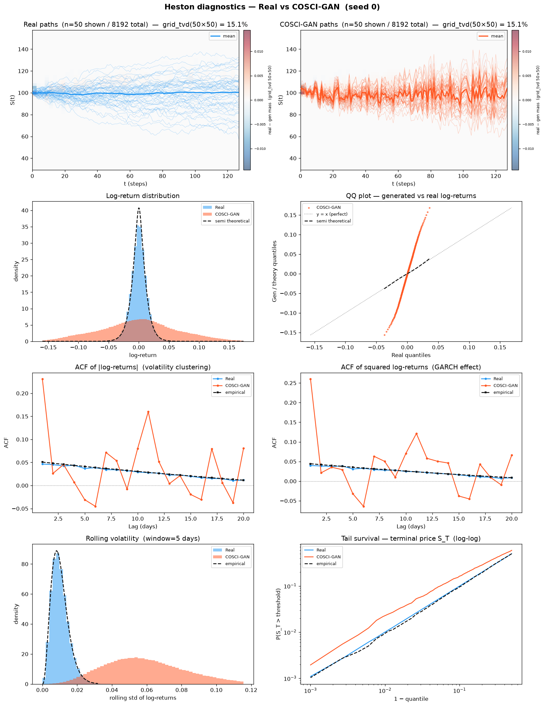
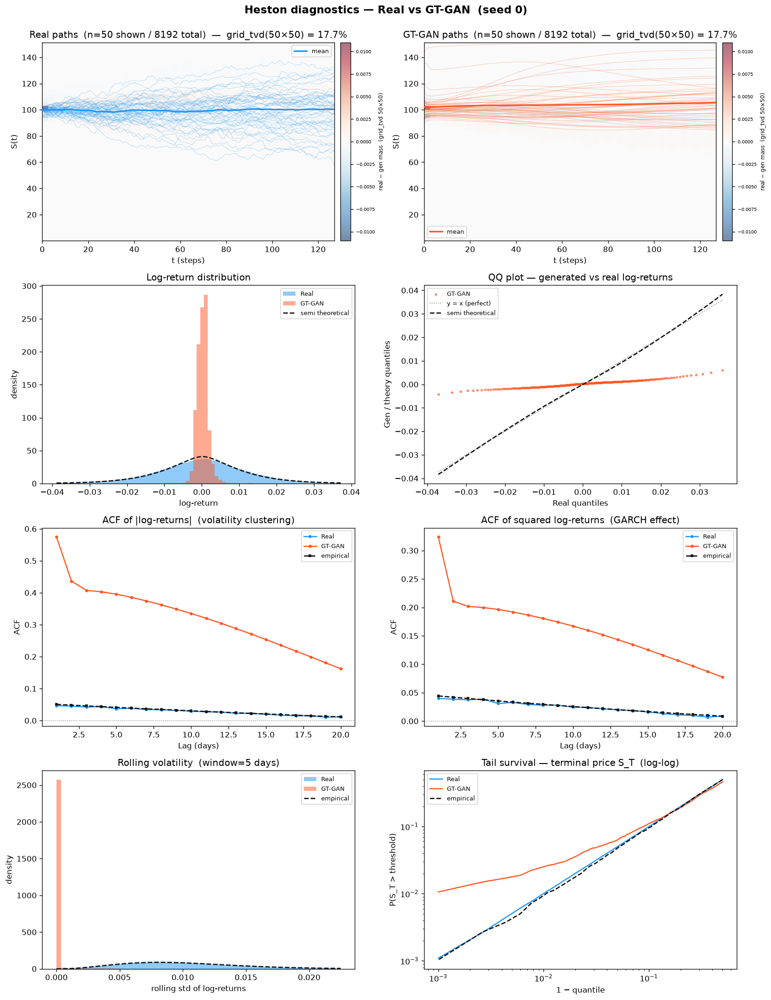
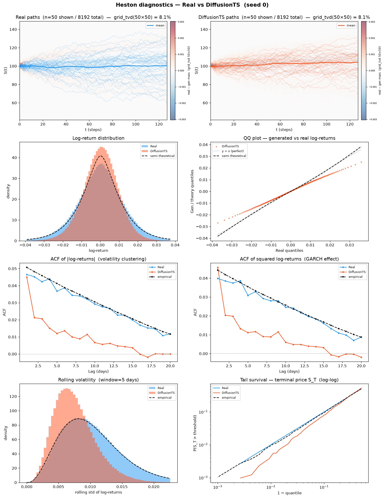
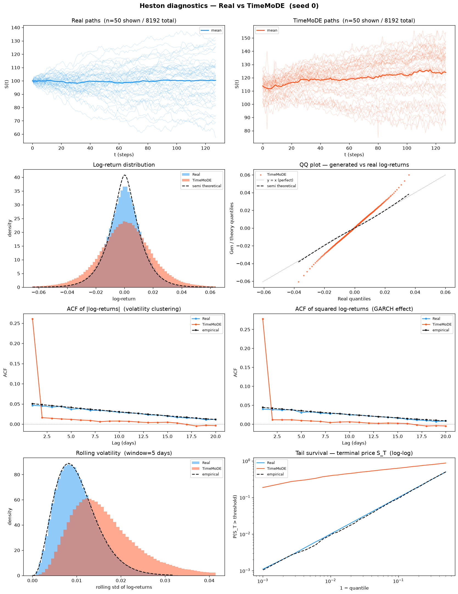
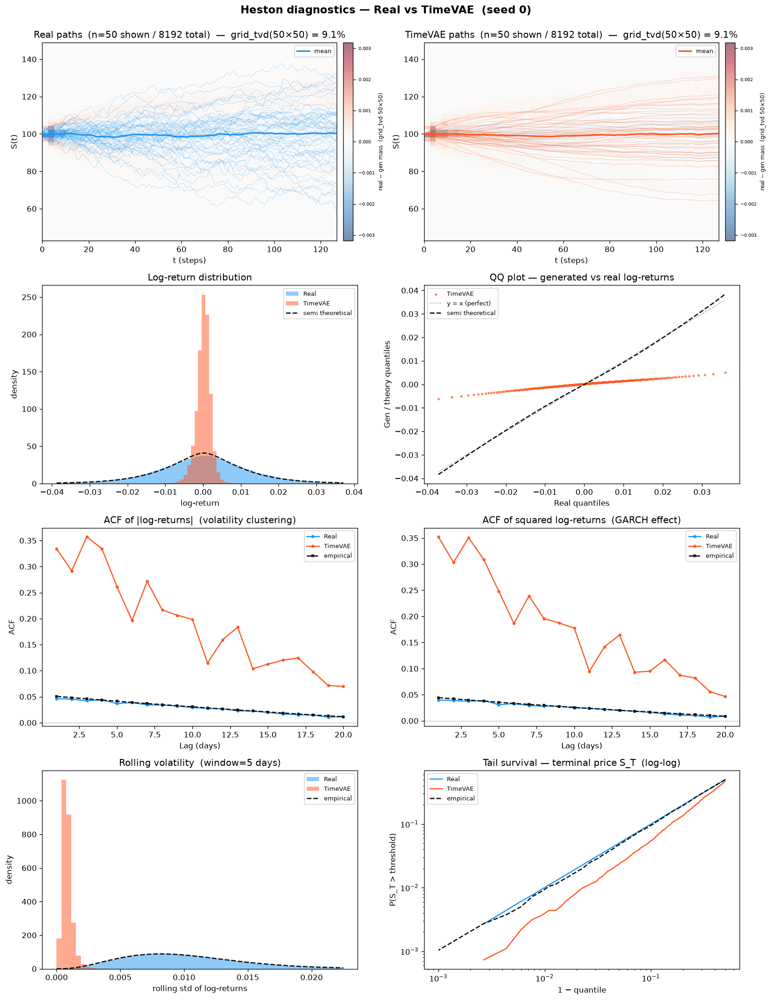
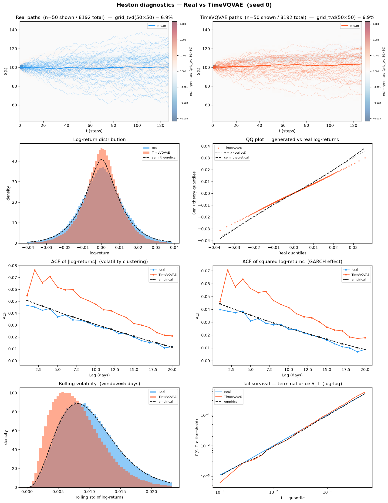
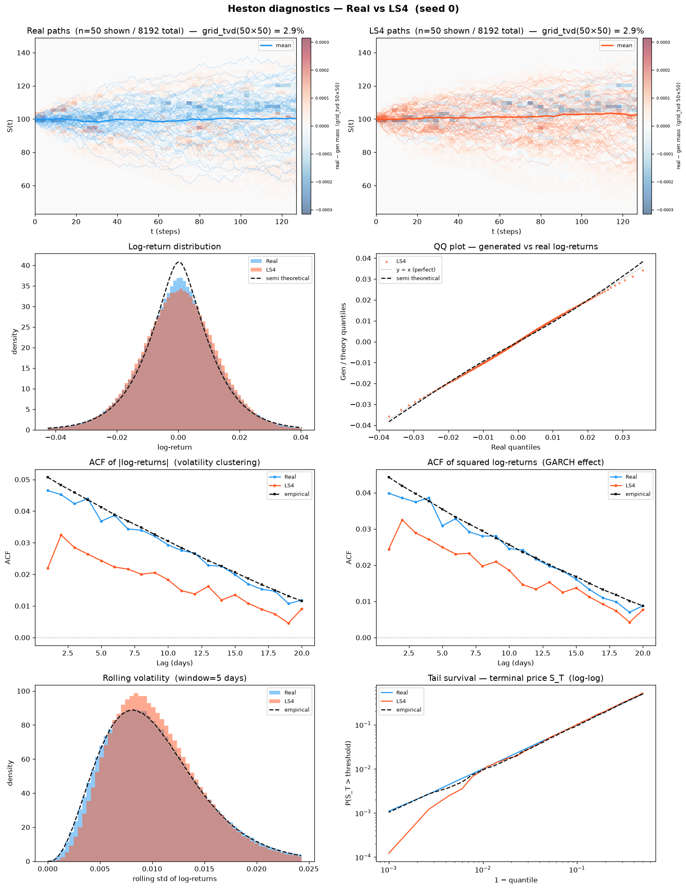
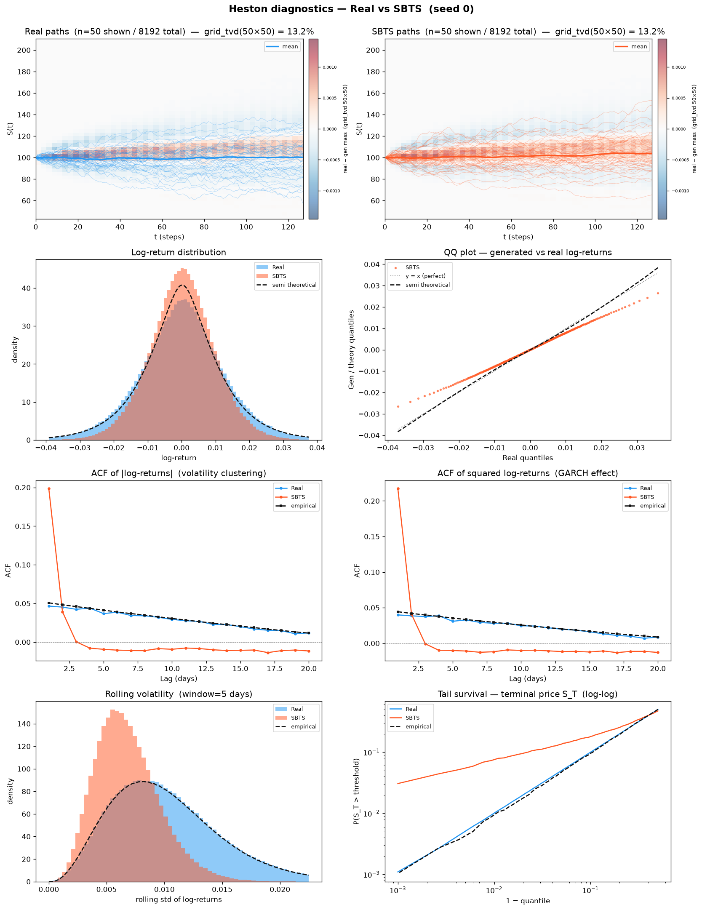
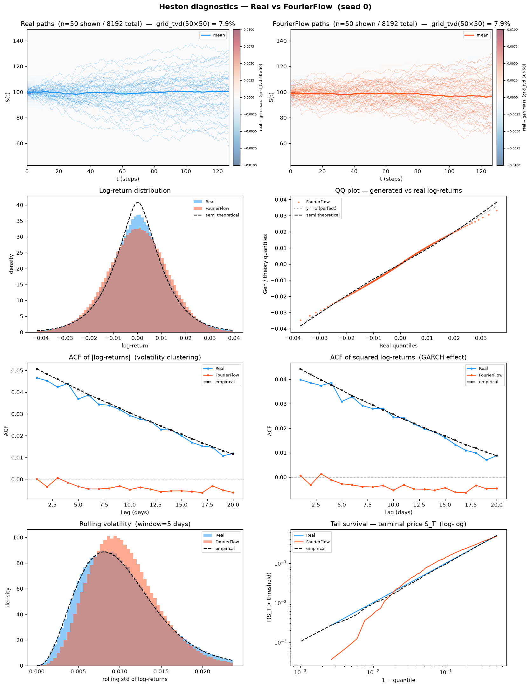

# Results — Methods Comparison on Heston

All methods are evaluated on the same dataset:
**8 192 Heston price paths, seq\_len = 128**
(μ=0.05, κ=2.0, θ=0.04, ξ=0.3, ρ=−0.7, S₀=100, v₀=0.04, dt=1/250)

Every method is trained on the **train** split (seed 0) and scored against the **held-out test set** (an
independent 8 192-path Heston draw, seed 1). The **Perfect floor** is a *fresh* independent Heston
simulation (seeds 1000+) scored against the same test set exactly as every method is — so it is the
**non-zero** finite-sample noise a genuine Heston sample cannot avoid, not a degenerate zero. See
[`../methods/perfect_recovery/README.md`](../methods/perfect_recovery/README.md).

---

## A1–A34 — Cross-method comparison (mean ± std, 5 seeds)

Methods are grouped by model family. ↓ = lower is better, ↑ = higher is better, A28 target = 1.0.
**Bold** = best across methods.

<table>
<thead>
  <tr>
    <th rowspan="2">Metric</th>
    <th colspan="3">GAN</th>
    <th colspan="3">Diffusion</th>
    <th colspan="3">VAE</th>
    <th>Schrödinger Bridge</th>
    <th>Fourier Flow</th>
    <th rowspan="2">Perfect</th>
    <th rowspan="2">Winner</th>
  </tr>
  <tr>
    <th>TimeGAN</th>
    <th>COSCI-GAN</th>
    <th>GT-GAN</th>
    <th>Diffusion-TS</th>
    <th>CSDI</th>
    <th>TimeMoDE</th>
    <th>TimeVAE</th>
    <th>TimeVQVAE</th>
    <th>LS4</th>
    <th>SBTS</th>
    <th>Fourier Flow</th>
  </tr>
</thead>
<tbody>
  <tr><td colspan="14"><b>— Fat Tail —</b></td></tr>
  <tr><td>A1 Kurtosis Error ↓</td><td>2.954 ± 2.098</td><td>0.5615 ± 0.1128</td><td>281.8 ± 288.2</td><td>0.4242 ± 0.02303</td><td>0.09543 ± 0.02623</td><td>20.10 ± 3.136</td><td>2.257 ± 0.5719</td><td>0.1363 ± 0.09243</td><td>0.3684 ± 0.01609</td><td><b>0.008384 ± 0.005009</b></td><td>0.5761 ± 0.008273</td><td>0.008092 ± 0.006811</td><td><b>SBTS</b></td></tr>
  <tr><td>A2 \|r\| q95 Error ↓</td><td>0.003196 ± 0.001907</td><td>0.09711 ± 0.003466</td><td>0.02279 ± 2.78e-04</td><td>0.006902 ± 1.57e-04</td><td>0.005393 ± 1.50e-04</td><td>0.02387 ± 0.006491</td><td>0.02227 ± 1.22e-04</td><td>0.004515 ± 2.54e-04</td><td>3.99e-04 ± 1.13e-04</td><td><b>2.12e-04 ± 3.87e-05</b></td><td>7.21e-04 ± 2.10e-04</td><td>6.57e-05 ± 5.96e-05</td><td><b>SBTS</b></td></tr>
  <tr><td>A3 \|r\| q99 Error ↓</td><td>0.004342 ± 0.002767</td><td>0.1240 ± 0.005959</td><td>0.02978 ± 0.001743</td><td>0.01032 ± 1.75e-04</td><td>0.007327 ± 2.29e-04</td><td>0.04025 ± 0.01065</td><td>0.03082 ± 1.05e-04</td><td>0.006058 ± 3.03e-04</td><td>0.001156 ± 1.66e-04</td><td><b>1.20e-04 ± 8.36e-05</b></td><td>0.002325 ± 5.06e-04</td><td>5.98e-05 ± 3.25e-05</td><td><b>SBTS</b></td></tr>
  <tr><td>A4 Tail QQ Error ↓</td><td>0.003401 ± 0.001522</td><td>0.09566 ± 0.003535</td><td>0.02240 ± 3.79e-04</td><td>0.006781 ± 1.50e-04</td><td>0.005296 ± 1.50e-04</td><td>0.02382 ± 0.006446</td><td>0.02191 ± 1.17e-04</td><td>0.004444 ± 2.48e-04</td><td>4.05e-04 ± 8.23e-05</td><td><b>1.90e-04 ± 4.01e-05</b></td><td>7.42e-04 ± 1.38e-04</td><td>6.75e-05 ± 3.70e-05</td><td><b>SBTS</b></td></tr>
  <tr><td>A5 Hill Tail Index Error ↓</td><td>36.32 ± 17.05</td><td>1.614 ± 1.128</td><td>7.568 ± 1.267</td><td>3.047 ± 0.2789</td><td>1.426 ± 0.5856</td><td>6.730 ± 6.378</td><td>1.831 ± 0.6794</td><td>3.777 ± 1.193</td><td><b>1.225 ± 0.4268</b></td><td>1.604 ± 0.2885</td><td>5.802 ± 2.000</td><td>0.5266 ± 0.5572</td><td><b>LS4</b></td></tr>
  <tr><td colspan="14"><b>— Distribution —</b></td></tr>
  <tr><td>A6 Path MMD² ↓</td><td>0.01866 ± 0.01472</td><td>0.04686 ± 0.004162</td><td>0.03292 ± 0.009071</td><td>0.004476 ± 8.48e-04</td><td>0.003646 ± 4.16e-04</td><td>0.06947 ± 0.05966</td><td>0.01914 ± 0.001334</td><td>0.003433 ± 7.97e-04</td><td><b>0.001926 ± 2.51e-04</b></td><td>0.001971 ± 1.85e-04</td><td>0.005527 ± 0.002289</td><td>0.001842 ± 2.55e-04</td><td><b>LS4</b></td></tr>
  <tr><td>A7 Terminal MMD² ↓</td><td>0.03072 ± 0.02472</td><td>0.01623 ± 0.01333</td><td>0.008520 ± 0.002539</td><td>0.003676 ± 0.001070</td><td>0.003605 ± 8.41e-04</td><td>0.06458 ± 0.06681</td><td>0.004951 ± 0.001715</td><td>0.003838 ± 0.001368</td><td><b>0.001520 ± 3.61e-04</b></td><td>0.001583 ± 4.28e-04</td><td>0.01105 ± 0.006414</td><td>0.001983 ± 8.89e-04</td><td><b>LS4</b></td></tr>
  <tr><td>A8 Increment MMD² ↓</td><td>0.008280 ± 0.004303</td><td>0.4788 ± 0.01185</td><td>0.2025 ± 0.01417</td><td>0.01109 ± 7.52e-04</td><td>0.008062 ± 7.11e-04</td><td>0.07441 ± 0.01639</td><td>0.2130 ± 0.001204</td><td>0.007018 ± 0.001054</td><td><b>9.63e-04 ± 3.76e-05</b></td><td>0.001077 ± 3.18e-05</td><td>0.001124 ± 6.46e-05</td><td>8.69e-04 ± 2.70e-05</td><td><b>LS4</b></td></tr>
  <tr><td>A9 Volatility MMD ↓</td><td>0.3975 ± 0.2486</td><td>3.955 ± 0.04883</td><td>2.882 ± 0.6128</td><td>0.3846 ± 0.02464</td><td>0.2498 ± 0.01607</td><td>2.033 ± 0.3303</td><td>3.575 ± 0.4476</td><td>0.1932 ± 0.02799</td><td><b>0.01447 ± 0.001550</b></td><td>0.01503 ± 8.50e-04</td><td>0.05871 ± 0.007003</td><td>0.008554 ± 0.001549</td><td><b>LS4</b></td></tr>
  <tr><td>A10 Terminal SWD ↓</td><td>2.917 ± 1.131</td><td>4.756 ± 3.118</td><td>2.391 ± 0.1196</td><td>1.684 ± 0.3010</td><td>1.618 ± 0.2760</td><td>11.13 ± 9.128</td><td>1.947 ± 0.3598</td><td>1.356 ± 0.2690</td><td>0.7480 ± 0.3255</td><td><b>0.7477 ± 0.3351</b></td><td>2.710 ± 1.034</td><td>1.151 ± 0.4868</td><td><b>SBTS</b></td></tr>
  <tr><td>A11 Path SWD ↓</td><td>1.678 ± 0.5770</td><td>3.505 ± 0.1711</td><td>2.236 ± 0.2567</td><td>1.212 ± 0.1556</td><td>1.069 ± 0.1305</td><td>8.734 ± 6.925</td><td>1.167 ± 0.1135</td><td>0.8781 ± 0.2081</td><td><b>0.5744 ± 0.1246</b></td><td>0.6418 ± 0.1355</td><td>1.334 ± 0.3806</td><td>0.6191 ± 0.1960</td><td><b>LS4</b></td></tr>
  <tr><td>A12 RV Law Loss ↓</td><td>1.558 ± 0.3879</td><td>118.7 ± 7.929</td><td>15.11 ± 13.84</td><td>2.274 ± 0.04910</td><td>1.920 ± 0.05633</td><td>16.52 ± 5.360</td><td>5.010 ± 0.008395</td><td>1.706 ± 0.08942</td><td>0.2415 ± 0.01757</td><td><b>0.07994 ± 0.01408</b></td><td>0.5397 ± 0.1300</td><td>0.05202 ± 0.006560</td><td><b>SBTS</b></td></tr>
  <tr><td>A13 Mean Path RMSE ↓</td><td>0.5356 ± 0.2514</td><td>3.995 ± 0.1803</td><td>0.7421 ± 0.3193</td><td>0.4399 ± 0.2584</td><td>0.3654 ± 0.3226</td><td>8.840 ± 7.341</td><td>0.3196 ± 0.2225</td><td>0.7593 ± 0.1340</td><td><b>0.1722 ± 0.1200</b></td><td>0.2545 ± 0.09266</td><td>0.4336 ± 0.3651</td><td>0.1205 ± 0.05175</td><td><b>LS4</b></td></tr>
  <tr><td>A14 KS Log-returns ↓</td><td>0.08474 ± 0.03769</td><td>0.3206 ± 0.007269</td><td>0.3881 ± 0.003914</td><td>0.06048 ± 0.001904</td><td>0.05391 ± 0.001972</td><td>0.1370 ± 0.02655</td><td>0.3670 ± 0.004602</td><td>0.05084 ± 0.003747</td><td>0.01258 ± 6.74e-04</td><td><b>0.002542 ± 2.16e-04</b></td><td>0.01895 ± 0.002028</td><td>0.001491 ± 5.79e-04</td><td><b>SBTS</b></td></tr>
  <tr><td>A15 Skewness Error ↓</td><td>0.3412 ± 0.3279</td><td>0.04981 ± 0.04124</td><td>390.5 ± 355.8</td><td>0.06445 ± 0.03230</td><td>0.03681 ± 0.002124</td><td>0.02843 ± 0.02245</td><td>0.5479 ± 0.09837</td><td>0.03079 ± 0.008248</td><td>0.02998 ± 0.01249</td><td><b>0.01796 ± 0.003795</b></td><td>0.02288 ± 0.01115</td><td>0.005274 ± 0.001459</td><td><b>SBTS</b></td></tr>
  <tr><td>A16 QQ RMSE (300-pt) ↓</td><td>0.002506 ± 6.49e-04</td><td>0.04857 ± 0.001967</td><td>0.01086 ± 1.44e-04</td><td>0.003073 ± 8.32e-05</td><td>0.002576 ± 8.57e-05</td><td>0.01109 ± 0.002985</td><td>0.01057 ± 8.40e-05</td><td>0.002268 ± 1.38e-04</td><td>3.41e-04 ± 9.53e-06</td><td><b>1.01e-04 ± 1.31e-05</b></td><td>5.81e-04 ± 4.14e-05</td><td>4.19e-05 ± 1.89e-05</td><td><b>SBTS</b></td></tr>
  <tr><td>A17 Terminal Price KS ↓</td><td>0.1109 ± 0.05875</td><td>0.1473 ± 0.09804</td><td>0.06672 ± 0.01592</td><td>0.04436 ± 0.007030</td><td>0.03667 ± 0.004476</td><td>0.3050 ± 0.2233</td><td>0.05127 ± 0.007848</td><td>0.05522 ± 0.009093</td><td><b>0.01584 ± 0.005488</b></td><td>0.01831 ± 0.003291</td><td>0.08098 ± 0.01617</td><td>0.01099 ± 0.001563</td><td><b>LS4</b></td></tr>
  <tr><td colspan="14"><b>— Adversarial —</b></td></tr>
  <tr><td>A18 Disc Score GRU ↓</td><td>0.03305 ± 0.05328</td><td>0.4999 ± 1.22e-04</td><td>0.4871 ± 0.01292</td><td>0.08987 ± 0.1524</td><td>0.06302 ± 0.1056</td><td>0.3950 ± 0.08909</td><td>0.4272 ± 0.08815</td><td>0.07174 ± 0.06503</td><td><b>0.005890 ± 0.001676</b></td><td>0.005951 ± 0.007927</td><td>0.009185 ± 0.009209</td><td>0.006195 ± 0.007171</td><td><b>LS4</b></td></tr>
  <tr><td>A18 Disc Score MLP ↓</td><td>0.08792 ± 0.04703</td><td>0.5000 ± 0</td><td>0.07345 ± 0.1266</td><td>0.02426 ± 0.03140</td><td>0.01138 ± 0.002541</td><td>0.4609 ± 0.01765</td><td>0.1358 ± 0.1503</td><td>0.009002 ± 0.003393</td><td>0.006256 ± 0.002539</td><td>0.01028 ± 0.003179</td><td><b>0.005951 ± 0.002921</b></td><td>0.005951 ± 0.003469</td><td><b>Fourier Flow</b></td></tr>
  <tr><td colspan="14"><b>— Predictive —</b></td></tr>
  <tr><td>A19 Pred Score GRU ↓</td><td>0.05277 ± 0.001115</td><td>0.1331 ± 0.01808</td><td>0.05547 ± 0.001080</td><td>0.05112 ± 1.22e-04</td><td>0.05024 ± 1.88e-05</td><td>0.08335 ± 0.005229</td><td>0.05385 ± 7.71e-04</td><td>0.05014 ± 2.87e-05</td><td><b>0.05001 ± 3.66e-06</b></td><td>0.05004 ± 7.70e-06</td><td>0.05004 ± 2.00e-05</td><td>0.05002 ± 1.08e-05</td><td><b>LS4</b></td></tr>
  <tr><td>A19 Pred Score MLP ↓</td><td>0.05322 ± 0.001031</td><td>0.09591 ± 0.006992</td><td>0.05302 ± 2.01e-04</td><td>0.05112 ± 1.21e-04</td><td>0.05025 ± 1.43e-04</td><td>0.07423 ± 0.004722</td><td>0.05243 ± 1.91e-04</td><td>0.05018 ± 6.79e-05</td><td><b>0.05006 ± 1.23e-04</b></td><td>0.05014 ± 2.07e-04</td><td>0.05032 ± 3.48e-04</td><td>0.05036 ± 6.63e-04</td><td><b>LS4</b></td></tr>
  <tr><td colspan="14"><b>— Temporal —</b></td></tr>
  <tr><td>A20 Covariance Error ↓</td><td>21.36 ± 9.068</td><td>30.59 ± 29.16</td><td>20.55 ± 7.355</td><td>44.18 ± 10.64</td><td>41.55 ± 5.776</td><td>64.76 ± 21.18</td><td>57.28 ± 1.758</td><td>22.61 ± 14.72</td><td>13.63 ± 6.662</td><td><b>4.969 ± 2.722</b></td><td>60.80 ± 36.58</td><td>4.923 ± 3.284</td><td><b>SBTS</b></td></tr>
  <tr><td>A21 ACF \|r\| Error (lags) ↓</td><td>0.1278 ± 0.06738</td><td>0.08056 ± 0.02054</td><td>0.3181 ± 0.1375</td><td>0.01812 ± 0.002352</td><td>0.01126 ± 0.003095</td><td>0.07526 ± 0.003463</td><td>0.3890 ± 0.1057</td><td>0.01979 ± 0.004246</td><td>0.01294 ± 0.001791</td><td><b>0.002841 ± 4.75e-04</b></td><td>0.04095 ± 5.50e-04</td><td>0.002234 ± 6.62e-04</td><td><b>SBTS</b></td></tr>
  <tr><td>A22 ACF r² Error (lags) ↓</td><td>0.08676 ± 0.03470</td><td>0.09004 ± 0.02156</td><td>0.1619 ± 0.1184</td><td>0.01587 ± 0.002662</td><td>0.01124 ± 0.002605</td><td>0.07767 ± 0.002639</td><td>0.3609 ± 0.08849</td><td>0.01817 ± 0.003251</td><td>0.006752 ± 0.001737</td><td><b>0.003893 ± 6.21e-04</b></td><td>0.03498 ± 5.56e-04</td><td>0.002206 ± 6.32e-04</td><td><b>SBTS</b></td></tr>
  <tr><td>A23 ACF \|r\| Lag-1 Error ↓</td><td>0.2301 ± 0.1034</td><td>0.1700 ± 0.04930</td><td>0.4201 ± 0.1602</td><td><b>0.002410 ± 0.001465</b></td><td>0.02252 ± 0.004755</td><td>0.2258 ± 0.01439</td><td>0.4674 ± 0.1346</td><td>0.01523 ± 0.008014</td><td>0.01743 ± 0.005532</td><td>0.008185 ± 0.001153</td><td>0.04897 ± 7.04e-04</td><td>0.002652 ± 0.001035</td><td><b>Diffusion-TS</b></td></tr>
  <tr><td>A24 ACF r² Lag-1 Error ↓</td><td>0.1760 ± 0.06259</td><td>0.1957 ± 0.05105</td><td>0.2270 ± 0.1494</td><td><b>0.007895 ± 0.002645</b></td><td>0.02168 ± 0.003561</td><td>0.2466 ± 0.008535</td><td>0.4630 ± 0.1189</td><td>0.01323 ± 0.007254</td><td>0.009068 ± 0.005290</td><td>0.009127 ± 0.001088</td><td>0.04195 ± 7.01e-04</td><td>0.002790 ± 9.39e-04</td><td><b>Diffusion-TS</b></td></tr>
  <tr><td colspan="14"><b>— Vol —</b></td></tr>
  <tr><td>A25 Mean RMSE ↓</td><td>0.7781 ± 0.3669</td><td>4.539 ± 3.359</td><td>0.7845 ± 0.3300</td><td>0.7610 ± 0.4617</td><td>0.5139 ± 0.4595</td><td>10.88 ± 9.469</td><td>0.3883 ± 0.2340</td><td>1.033 ± 0.1905</td><td>0.3270 ± 0.2333</td><td><b>0.2977 ± 0.1411</b></td><td>0.7990 ± 0.7970</td><td>0.1392 ± 0.06359</td><td><b>SBTS</b></td></tr>
  <tr><td>A26 Return Std Error ↓</td><td>0.1525 ± 0.08911</td><td>5.032 ± 0.2229</td><td>1.005 ± 0.09141</td><td>0.3107 ± 0.009292</td><td>0.2580 ± 0.009849</td><td>1.419 ± 0.2615</td><td>1.074 ± 0.007809</td><td>0.2316 ± 0.01420</td><td>0.004853 ± 0.003540</td><td>0.01059 ± 7.02e-04</td><td><b>0.004832 ± 0.002757</b></td><td>0.002523 ± 0.001767</td><td><b>Fourier Flow</b></td></tr>
  <tr><td>A27 Log-Return Std Error ↓</td><td>0.001703 ± 7.89e-04</td><td>0.04975 ± 0.002001</td><td>0.009540 ± 0.007044</td><td>0.003240 ± 8.19e-05</td><td>0.002667 ± 8.89e-05</td><td>0.01320 ± 0.003285</td><td>0.01098 ± 7.75e-05</td><td>0.002336 ± 1.37e-04</td><td><b>4.63e-05 ± 2.22e-05</b></td><td>9.31e-05 ± 1.98e-05</td><td>7.64e-05 ± 5.51e-05</td><td>3.15e-05 ± 2.48e-05</td><td><b>LS4</b></td></tr>
  <tr><td>A28 Kurtosis Ratio (→ 1)</td><td>-1.116 ± 3.593</td><td>-8.150 ± 12.11</td><td>0.002659 ± 0.004016</td><td>1.903 ± 0.2558</td><td>0.8706 ± 0.03043</td><td>0.01840 ± 0.007380</td><td>0.2834 ± 0.04765</td><td>0.8410 ± 0.06953</td><td>1.565 ± 0.07840</td><td><b>1.012 ± 0.01211</b></td><td>3.098 ± 0.7754</td><td>1.006 ± 0.009834</td><td><b>SBTS</b></td></tr>
  <tr><td>A29 Sigma Mean Error ↓</td><td>0.03089 ± 0.009106</td><td>0.7871 ± 0.03094</td><td>0.1649 ± 0.01028</td><td>0.04883 ± 0.001266</td><td>0.04078 ± 0.001489</td><td>0.1931 ± 0.04858</td><td>0.1745 ± 0.001776</td><td>0.03743 ± 0.002059</td><td>0.001445 ± 6.99e-04</td><td><b>0.001427 ± 3.04e-04</b></td><td>0.002245 ± 8.77e-04</td><td>4.96e-04 ± 4.24e-04</td><td><b>SBTS</b></td></tr>
  <tr><td>A30 Cross-Sect. Vol Path RMSE ↓</td><td>0.4742 ± 0.2079</td><td>1.155 ± 0.3231</td><td>0.8923 ± 0.2085</td><td>1.365 ± 0.2012</td><td>1.134 ± 0.1303</td><td>1.950 ± 0.5991</td><td>1.325 ± 0.04564</td><td>0.5701 ± 0.3404</td><td>0.3372 ± 0.1171</td><td><b>0.2779 ± 0.04900</b></td><td>1.381 ± 0.4336</td><td>0.1432 ± 0.03018</td><td><b>SBTS</b></td></tr>
  <tr><td>A31 Rolling Vol KS (w=5) ↓</td><td>0.2552 ± 0.1101</td><td>0.9371 ± 0.007667</td><td>0.9868 ± 0.004912</td><td>0.2576 ± 0.007919</td><td>0.2202 ± 0.008329</td><td>0.5014 ± 0.08662</td><td>0.9869 ± 0.004527</td><td>0.1850 ± 0.01013</td><td>0.03798 ± 0.001391</td><td><b>0.01375 ± 0.001092</b></td><td>0.07213 ± 0.001372</td><td>0.003814 ± 0.001210</td><td><b>SBTS</b></td></tr>
  <tr><td>A32 Vol-of-Vol Error ↓</td><td>8.96e-04 ± 8.69e-04</td><td>0.01806 ± 0.001147</td><td>0.009854 ± 0.007895</td><td>0.001587 ± 3.82e-05</td><td>0.001048 ± 2.14e-05</td><td>0.008546 ± 0.001733</td><td>0.004576 ± 5.62e-05</td><td>6.76e-04 ± 5.79e-05</td><td>3.21e-04 ± 4.23e-05</td><td><b>1.30e-05 ± 1.26e-05</b></td><td>6.89e-04 ± 9.20e-05</td><td>1.54e-05 ± 9.93e-06</td><td><b>SBTS</b></td></tr>
  <tr><td colspan="14"><b>— Heston Spec —</b></td></tr>
  <tr><td>A33 Teacher-Sigma Corr ↑</td><td>0.002745 ± 0.01354</td><td>-0.005511 ± 0.008042</td><td>0.01003 ± 0.008468</td><td>0.001823 ± 0.004419</td><td>0.003948 ± 0.003596</td><td>0.009360 ± 0.006530</td><td><b>0.02254 ± 0.003796</b></td><td>7.04e-04 ± 0.005837</td><td>-3.94e-04 ± 0.006577</td><td>-0.008422 ± 0.005109</td><td>-0.002564 ± 0.002730</td><td>0.6163 ± 0.002371</td><td><b>TimeVAE</b></td></tr>
  <tr><td>A34 Teacher-Sigma RMSE ↓</td><td>0.1186 ± 0.01863</td><td>0.8087 ± 0.02874</td><td>0.3088 ± 0.1407</td><td>0.09645 ± 9.09e-04</td><td>0.09917 ± 6.44e-04</td><td>0.2737 ± 0.04669</td><td>0.1803 ± 0.001643</td><td>0.1014 ± 9.08e-04</td><td>0.09513 ± 7.87e-04</td><td>0.1002 ± 3.90e-04</td><td><b>0.08963 ± 0.001225</b></td><td>0.06559 ± 1.37e-04</td><td><b>Fourier Flow</b></td></tr>
</tbody>
</table>
<!-- A win-counts (of 36): SBTS=18, LS4=12, Fourier Flow=3, Diffusion-TS=2, TimeVAE=1, TimeGAN=0, COSCI-GAN=0, GT-GAN=0, CSDI=0, TimeMoDE=0, TimeVQVAE=0 -->

> **A33 Teacher-Sigma Corr**: floor = **0.6163** (not 1.0) — the 5-step rolling quadratic-variation is a
> noisy estimator of instantaneous variance vₜ. TimeVAE (0.02254) has the highest correlation, then
> GT-GAN (0.01003), CSDI (0.003948), SBTS (0.002758), TimeGAN (0.002745), Diffusion-TS
> (0.001823), TimeVQVAE (7.0e-04), LS4 (−3.9e-04), Fourier Flow (−0.002564) and COSCI-GAN (−0.005511) — the
> last three slightly negative. **None**
> meaningfully preserves stochastic volatility relative to the 0.6163 floor: TimeVAE pulls
> furthest off the near-zero cluster the other generators share but is still ~27× below the floor, and
> LS4's single-factor latent-S4 prior cannot recover the two-factor Heston vol.
>
> **A28 Kurtosis Ratio**: target = 1.0. CSDI (0.8706) is closest — |CSDI−1| = 0.129 < |TimeVQVAE−1| = 0.159
> < |LS4−1| = 0.565 < |TimeVAE−1| = 0.717 < |DTS−1| = 0.903 < |GT-GAN−1| = 0.997 <
> |SBTS−1| = 1.028 < |FF−1| = 2.098 < |TimeGAN−1| = 2.116 < |COSCI-GAN−1| = 9.150. GT-GAN (0.002659) is the benchmark's most
> **leptokurtic** collapse — a return law ~375× more peaked than Heston, the largest single-metric marginal
> failure in the suite. LS4 (1.565) is mildly **platykurtic** — its single-factor latent
> decoder generates slightly thinner-than-Heston tails, the standard limitation of a one-factor generator on
> a two-factor SDE. TimeVAE (0.2834) is heavily under-dispersed. TimeGAN (−1.116) and COSCI-GAN (−8.150)
> have **negative** mean ratios (sign-flipping across seeds), the farthest from 1.

**SBTS wins 18 of 36 A-metrics; LS4 12; Fourier Flow 3; Diffusion-TS 2; TimeVAE 1.** TimeGAN, COSCI-GAN,
GT-GAN, CSDI and TimeVQVAE win none outright. (36 = the 34 metrics with A18 and A19 each split into a GRU and
an MLP variant.) With the author-confirmed **K=20 / h=0.05** kernel, **SBTS** is now the strongest generator
in the benchmark: it sweeps the tail quantiles (A1–A4), the return-law/distribution metrics it always matched
(A10, A12, A14–A16), and — the decisive change from the paper's over-smoothing h=0.4 — nearly the entire
**temporal/vol** family (A20 covariance **4.969**, A21/A22 ACF-lag averages, A25 mean-RMSE, A28 kurtosis ratio
**1.012**, A29 σ-mean, A30 cross-sectional vol, A31 rolling-vol KS **0.01375**, A32 vol-of-vol). Its only
losses are structural: the two Heston-spec rows (A33/A34, latent variance unrecoverable from prices), the
lag-1 ACF pair (A23/A24), and the distributional/adversarial axes LS4 and Fourier Flow hold. See
[`Heston/SBTS/README.md`](Heston/SBTS/README.md).

**LS4**'s latent-S4 state-space prior is the clear second: it takes the distributional family (A6–A9, A11,
A13, A17), both predictive scores and the adversarial-GRU (A18-GRU **0.005890**, A19-GRU **0.05001** /
A19-MLP **0.05006**, at or under the finite-sample floor), the Hill index (A5) and the log-return-std error
(A27); its own latent-volatility recovery stays at zero (A33 σ-corr ≈ −4e-4) and its return tails run slightly
thin (A28 kurtosis ratio 1.565). See [`Heston/LS4/README.md`](Heston/LS4/README.md). The remaining families
defend narrow niches. **Fourier Flow** takes three moment/near-Gaussian metrics — the **MLP discriminative
score** (A18-MLP **0.005951**), the **return-std error** (A26 **0.004832**) and the **teacher-sigma RMSE**
(A34 **0.08963**). **Diffusion-TS** owns the two **lag-1 ACF** metrics (A23 **0.002410**, A24 **0.007895**)
where its interpretable seasonal-trend decoder is sharpest. **TimeVAE** takes the single **teacher-sigma
correlation** (A33 **0.02254**, the best latent-vol recovery of any generator, though ~27× below the 0.6163
floor). **CSDI, TimeGAN, COSCI-GAN and TimeVQVAE** win no A-metric outright. **GT-GAN** is the benchmark's
weakest marginal-distribution matcher — its continuous-time CNF generator (32957 params, the smallest in the
suite) collapses the return law (A28 kurtosis ratio 0.002659, ~375× more leptokurtic than Heston; worst A1
kurtosis error 281.8; worst A14 KS 0.3881; near-separable A18-GRU 0.4871) and wins no A-metric.

---

## B — Curve-shape metrics cross-method comparison (mean ± std, 5 seeds)

Each of the 6 diagnostic plots yields a **curve** L (a list of values), not a scalar. **MSE** combines three
lists — the curve L, its first finite difference (der), and its second finite difference (sec\_der); **% err**,
**NRMSE** and **CVaR** are **funct-only** (curve L only):

- **MSE**: dᵢ = mean((L_gen − L_real)²), averaged over curve / der / sec\_der — the winner-deciding number. Combined std = quadrature of the three seed-std.
- **% err** (function-level MAPE, funct-only): dᵢ = mean(|L_gen − L_real| / (|L_real| + 1e-6)) × 100 — one division, on the curve L only. The der / sec\_der MAPE is excluded as ill-posed (near-zero denominators explode).
- **NRMSE** (funct-only): sqrt(mean((L_gen − L_real)²)) / (max|L_real| − min|L_real| + 1e-12) × 100 on the curve L only — RMSE normalised by the reference curve's range.
- **CVaR₉₀ / CVaR₉₅** (tail-risk / Expected Shortfall, funct-only): with pointwise errors eₜ = |L_gen(t) − L_real(t)|, CVaR_q = mean(eₜ over the worst (1−q) tail, i.e. eₜ ≥ the q-th percentile), normalised by (max L_real − min L_real + 1e-12) × 100 — same range convention as NRMSE. Measures the *worst-fitting* slice of the curve rather than its average.

**% err, NRMSE and CVaR are funct-only for every plot**: the first and second finite differences of these curves are
near-zero, so their relative error is ill-posed and would explode; only **MSE** averages all three sub-curves.
The **grid_tvd** row (path-cloud 2D-histogram TVD at a locked 50×50 grid) is the **first row of Table B** and is ranked like any plot — its winner (LS4) is counted.
↓ lower is better. Histogram bin edges use [0.5th, 99.5th]-percentile of **real data only**, so the reference
curve is fixed. The **Perfect** column is an independent Heston draw (seeds 1000+) scored against the test set
the same way — a **non-zero** finite-sample floor, not a degenerate zero. Each subline shows its own winner (lowest value); the **MSE** row decides each plot's headline ranking and the **grid_tvd** path-comparison row is ranked as one additional contest.

<table>
<thead>
  <tr>
    <th rowspan="2">Plot</th>
    <th rowspan="2">Measure</th>
    <th colspan="3">GAN</th>
    <th colspan="3">Diffusion</th>
    <th colspan="3">VAE</th>
    <th>Schrödinger Bridge</th>
    <th>Fourier Flow</th>
    <th rowspan="2">Perfect</th>
    <th rowspan="2">Winner</th>
  </tr>
  <tr>
    <th>TimeGAN</th>
    <th>COSCI-GAN</th>
    <th>GT-GAN</th>
    <th>Diffusion-TS</th>
    <th>CSDI</th>
    <th>TimeMoDE</th>
    <th>TimeVAE</th>
    <th>TimeVQVAE</th>
    <th>LS4</th>
    <th>SBTS</th>
    <th>Fourier Flow</th>
  </tr>
</thead>
<tbody>
  <tr><td><b>Path comparison</b> grid_tvd 50×50 path-cloud</td><td>grid_tvd 50×50 (%) ↓</td><td>17.14% ± 8.253%</td><td>14.01% ± 1.126%</td><td>19.00% ± 3.806%</td><td>7.829% ± 0.9332%</td><td>5.990% ± 0.4649%</td><td>35.58% ± 22.96%</td><td>8.662% ± 0.4769%</td><td>7.269% ± 0.3121%</td><td><b>2.772% ± 0.2228%</b></td><td>3.809% ± 0.1196%</td><td>9.442% ± 1.721%</td><td>2.237% ± 0.1564%</td><td><b>LS4</b></td></tr>
  <tr><td rowspan="5"><b>Log-return histogram</b></td><td>MSE</td><td>45.40 ± 57.91</td><td>42.66 ± 1.999</td><td>2160 ± 655.2</td><td>4.883 ± 0.5079</td><td>4.644 ± 0.4940</td><td>14.84 ± 4.653</td><td>968.0 ± 183.1</td><td>4.386 ± 0.8335</td><td>0.4517 ± 0.02799</td><td><b>0.1166 ± 0.01679</b></td><td>0.9211 ± 0.02370</td><td>0.1098 ± 0.02492</td><td><b>SBTS</b></td></tr>
  <tr><td>% err</td><td>33.41% ± 6.533%</td><td>246.6% ± 7.987%</td><td>117.7% ± 1.125%</td><td>42.14% ± 1.003%</td><td>35.27% ± 1.063%</td><td>112.4% ± 24.79%</td><td>114.9% ± 0.6458%</td><td>30.95% ± 1.747%</td><td>5.429% ± 0.1852%</td><td><b>2.247% ± 0.1314%</b></td><td>9.167% ± 0.5606%</td><td>1.799% ± 0.04483%</td><td><b>SBTS</b></td></tr>
  <tr><td>NRMSE</td><td>21.38% ± 14.34%</td><td>30.81% ± 0.7154%</td><td>151.6% ± 13.15%</td><td>10.28% ± 0.5317%</td><td>9.998% ± 0.5467%</td><td>17.86% ± 2.921%</td><td>123.7% ± 6.783%</td><td>9.691% ± 0.9011%</td><td>2.779% ± 0.08180%</td><td><b>0.6462% ± 0.03094%</b></td><td>4.186% ± 0.1102%</td><td>0.5328% ± 0.02035%</td><td><b>SBTS</b></td></tr>
  <tr><td>CVaR₉₀</td><td>50.55% ± 32.16%</td><td>58.05% ± 1.029%</td><td>317.1% ± 7.324%</td><td>21.62% ± 1.519%</td><td>23.51% ± 1.709%</td><td>37.47% ± 5.269%</td><td>287.6% ± 7.035%</td><td>24.32% ± 2.457%</td><td>6.921% ± 0.2804%</td><td><b>1.507% ± 0.09588%</b></td><td>10.19% ± 0.3052%</td><td>1.234% ± 0.08860%</td><td><b>SBTS</b></td></tr>
  <tr><td>CVaR₉₅</td><td>78.15% ± 57.07%</td><td>60.73% ± 0.9285%</td><td>553.4% ± 17.57%</td><td>22.55% ± 1.702%</td><td>25.24% ± 1.771%</td><td>39.84% ± 5.430%</td><td>483.9% ± 19.22%</td><td>26.67% ± 2.883%</td><td>8.401% ± 0.2798%</td><td><b>1.783% ± 0.1817%</b></td><td>11.93% ± 0.3586%</td><td>1.444% ± 0.08562%</td><td><b>SBTS</b></td></tr>
  <tr><td rowspan="5"><b>QQ plot</b></td><td>MSE</td><td>2.38e-06 ± 1.14e-06</td><td>8.25e-04 ± 6.60e-05</td><td>4.16e-05 ± 1.27e-06</td><td>3.48e-06 ± 1.75e-07</td><td>2.36e-06 ± 1.57e-07</td><td>5.02e-05 ± 2.50e-05</td><td>3.99e-05 ± 5.99e-07</td><td>1.82e-06 ± 2.20e-07</td><td>4.59e-08 ± 2.12e-09</td><td><b>4.42e-09 ± 1.01e-09</b></td><td>1.45e-07 ± 2.63e-08</td><td>1.09e-09 ± 6.13e-10</td><td><b>SBTS</b></td></tr>
  <tr><td>% err</td><td>34.50% ± 11.22%</td><td>437.1% ± 19.17%</td><td>92.66% ± 2.380%</td><td>25.71% ± 1.743%</td><td>24.22% ± 1.083%</td><td>93.59% ± 22.96%</td><td>90.53% ± 1.555%</td><td>23.84% ± 2.434%</td><td>6.022% ± 0.6435%</td><td><b>2.270% ± 0.3076%</b></td><td>9.342% ± 2.293%</td><td>0.4629% ± 0.1067%</td><td><b>SBTS</b></td></tr>
  <tr><td>NRMSE</td><td>6.960% ± 1.738%</td><td>134.7% ± 5.407%</td><td>30.25% ± 0.4431%</td><td>8.689% ± 0.2248%</td><td>7.188% ± 0.2370%</td><td>31.65% ± 8.481%</td><td>29.57% ± 0.2260%</td><td>6.308% ± 0.3785%</td><td>0.9701% ± 0.02323%</td><td><b>0.2832% ± 0.03766%</b></td><td>1.687% ± 0.1351%</td><td>0.1206% ± 0.04670%</td><td><b>SBTS</b></td></tr>
  <tr><td>CVaR₉₀</td><td>6.454% ± 1.512%</td><td>138.6% ± 5.112%</td><td>32.67% ± 0.7552%</td><td>10.19% ± 0.2059%</td><td>7.785% ± 0.2211%</td><td>36.63% ± 9.839%</td><td>32.31% ± 0.1596%</td><td>6.515% ± 0.3574%</td><td>0.9129% ± 0.06396%</td><td><b>0.3149% ± 0.04665%</b></td><td>1.636% ± 0.2264%</td><td>0.1319% ± 0.04206%</td><td><b>SBTS</b></td></tr>
  <tr><td>CVaR₉₅</td><td>7.409% ± 1.912%</td><td>154.2% ± 6.106%</td><td>37.00% ± 1.251%</td><td>12.09% ± 0.2092%</td><td>8.895% ± 0.2534%</td><td>44.51% ± 11.84%</td><td>37.04% ± 0.1567%</td><td>7.395% ± 0.3894%</td><td>1.197% ± 0.1293%</td><td><b>0.3646% ± 0.06661%</b></td><td>2.268% ± 0.4096%</td><td>0.1599% ± 0.04416%</td><td><b>SBTS</b></td></tr>
  <tr><td rowspan="5"><b>ACF \|r\| lags 1–20</b></td><td>MSE</td><td>0.003597 ± 0.003199</td><td>0.008548 ± 0.003519</td><td>0.02626 ± 0.02245</td><td>1.72e-04 ± 4.79e-05</td><td>3.02e-05 ± 1.61e-05</td><td>0.003242 ± 1.60e-04</td><td>0.03390 ± 0.01422</td><td>1.22e-04 ± 3.84e-05</td><td>5.14e-05 ± 1.08e-05</td><td><b>2.42e-05 ± 2.83e-06</b></td><td>3.83e-04 ± 1.20e-05</td><td>9.61e-06 ± 3.40e-06</td><td><b>SBTS</b></td></tr>
  <tr><td>% err</td><td>186.2% ± 107.8%</td><td>230.0% ± 48.05%</td><td>893.2% ± 463.3%</td><td>73.33% ± 13.17%</td><td>19.26% ± 8.314%</td><td>107.0% ± 17.32%</td><td>983.6% ± 273.1%</td><td>63.03% ± 14.21%</td><td>37.09% ± 3.059%</td><td><b>10.68% ± 0.4068%</b></td><td>117.2% ± 2.149%</td><td>8.724% ± 1.843%</td><td><b>SBTS</b></td></tr>
  <tr><td>NRMSE</td><td>224.6% ± 123.4%</td><td>198.2% ± 35.47%</td><td>668.0% ± 311.1%</td><td>51.98% ± 7.840%</td><td>19.33% ± 5.196%</td><td>146.6% ± 8.924%</td><td>795.3% ± 212.4%</td><td>45.54% ± 9.362%</td><td>29.46% ± 2.604%</td><td><b>7.891% ± 0.2799%</b></td><td>88.45% ± 1.425%</td><td>6.071% ± 1.301%</td><td><b>SBTS</b></td></tr>
  <tr><td>CVaR₉₀</td><td>522.2% ± 262.2%</td><td>420.7% ± 65.18%</td><td>1012% ± 397.5%</td><td>73.44% ± 9.466%</td><td>46.07% ± 9.937%</td><td>341.4% ± 17.58%</td><td>1246% ± 313.1%</td><td>71.36% ± 12.50%</td><td>45.94% ± 7.674%</td><td><b>17.80% ± 1.557%</b></td><td>127.7% ± 1.888%</td><td>11.26% ± 1.961%</td><td><b>SBTS</b></td></tr>
  <tr><td>CVaR₉₅</td><td>612.3% ± 275.1%</td><td>474.2% ± 99.55%</td><td>1118% ± 426.4%</td><td>75.43% ± 9.523%</td><td>59.93% ± 12.65%</td><td>601.0% ± 38.30%</td><td>1273% ± 322.9%</td><td>73.51% ± 13.45%</td><td>50.46% ± 11.86%</td><td><b>21.78% ± 3.068%</b></td><td>130.3% ± 1.872%</td><td>12.06% ± 1.837%</td><td><b>SBTS</b></td></tr>
  <tr><td rowspan="5"><b>ACF r² lags 1–20</b></td><td>MSE</td><td>0.001982 ± 0.001602</td><td>0.008781 ± 0.003516</td><td>0.008475 ± 0.01103</td><td>1.32e-04 ± 4.43e-05</td><td>2.71e-05 ± 1.16e-05</td><td>0.003771 ± 2.76e-04</td><td>0.02694 ± 0.01034</td><td>1.05e-04 ± 3.00e-05</td><td>2.48e-05 ± 6.52e-06</td><td><b>2.21e-05 ± 1.57e-06</b></td><td>2.80e-04 ± 1.13e-05</td><td>9.17e-06 ± 3.08e-06</td><td><b>SBTS</b></td></tr>
  <tr><td>% err</td><td>130.0% ± 65.84%</td><td>287.8% ± 57.85%</td><td>541.6% ± 420.6%</td><td>73.19% ± 16.72%</td><td>21.75% ± 10.67%</td><td>117.7% ± 10.56%</td><td>1026% ± 265.1%</td><td>70.37% ± 13.75%</td><td>24.39% ± 3.127%</td><td><b>13.77% ± 1.214%</b></td><td>120.8% ± 3.065%</td><td>11.34% ± 2.219%</td><td><b>SBTS</b></td></tr>
  <tr><td>NRMSE</td><td>168.2% ± 70.21%</td><td>221.1% ± 36.09%</td><td>366.9% ± 274.6%</td><td>46.32% ± 8.702%</td><td>20.43% ± 5.060%</td><td>170.8% ± 4.574%</td><td>782.1% ± 188.7%</td><td>45.61% ± 7.936%</td><td>19.10% ± 2.524%</td><td><b>9.147% ± 0.8072%</b></td><td>82.92% ± 1.680%</td><td>6.486% ± 1.351%</td><td><b>SBTS</b></td></tr>
  <tr><td>CVaR₉₀</td><td>421.3% ± 169.3%</td><td>469.3% ± 84.08%</td><td>577.9% ± 398.0%</td><td>66.27% ± 10.63%</td><td>50.15% ± 8.636%</td><td>402.2% ± 10.46%</td><td>1323% ± 304.4%</td><td>73.46% ± 10.86%</td><td>32.40% ± 6.104%</td><td><b>20.76% ± 1.718%</b></td><td>120.7% ± 1.567%</td><td>12.35% ± 2.511%</td><td><b>SBTS</b></td></tr>
  <tr><td>CVaR₉₅</td><td>537.1% ± 194.7%</td><td>586.1% ± 127.8%</td><td>664.9% ± 437.7%</td><td>68.14% ± 10.38%</td><td>63.50% ± 10.43%</td><td>722.3% ± 25.00%</td><td>1372% ± 331.0%</td><td>75.90% ± 12.22%</td><td>35.55% ± 9.255%</td><td><b>26.73% ± 3.185%</b></td><td>123.3% ± 1.328%</td><td>13.27% ± 2.724%</td><td><b>SBTS</b></td></tr>
  <tr><td rowspan="5"><b>Rolling vol histogram</b></td><td>MSE</td><td>150.2 ± 75.22</td><td>1398 ± 34.29</td><td>3029 ± 1983</td><td>220.2 ± 15.36</td><td>157.5 ± 12.45</td><td>460.2 ± 142.2</td><td>16019 ± 2352</td><td>113.9 ± 13.91</td><td>8.514 ± 0.7580</td><td><b>2.280 ± 0.2873</b></td><td>29.88 ± 2.639</td><td>1.372 ± 0.07269</td><td><b>SBTS</b></td></tr>
  <tr><td>% err</td><td>56.76% ± 21.18%</td><td>799.2% ± 14.12%</td><td>187.8% ± 42.87%</td><td>69.05% ± 1.441%</td><td>61.91% ± 2.364%</td><td>307.4% ± 73.28%</td><td>340.0% ± 11.74%</td><td>54.51% ± 2.433%</td><td>11.70% ± 1.165%</td><td><b>3.480% ± 0.2217%</b></td><td>25.42% ± 3.199%</td><td>2.264% ± 0.07625%</td><td><b>SBTS</b></td></tr>
  <tr><td>NRMSE</td><td>22.64% ± 7.203%</td><td>73.06% ± 0.8956%</td><td>97.99% ± 31.28%</td><td>28.87% ± 0.9919%</td><td>24.39% ± 0.9523%</td><td>41.42% ± 6.554%</td><td>221.5% ± 13.05%</td><td>20.68% ± 1.268%</td><td>5.275% ± 0.3034%</td><td><b>1.882% ± 0.1160%</b></td><td>10.43% ± 0.4823%</td><td>0.8688% ± 0.05532%</td><td><b>SBTS</b></td></tr>
  <tr><td>CVaR₉₀</td><td>51.23% ± 18.12%</td><td>121.7% ± 2.643%</td><td>236.6% ± 64.79%</td><td>59.83% ± 2.496%</td><td>50.44% ± 1.974%</td><td>66.25% ± 8.426%</td><td>434.8% ± 12.53%</td><td>44.63% ± 3.197%</td><td>10.95% ± 0.4870%</td><td><b>4.030% ± 0.2206%</b></td><td>19.99% ± 0.5784%</td><td>1.970% ± 0.1827%</td><td><b>SBTS</b></td></tr>
  <tr><td>CVaR₉₅</td><td>60.61% ± 26.33%</td><td>128.0% ± 3.162%</td><td>346.0% ± 123.4%</td><td>62.61% ± 2.777%</td><td>52.28% ± 2.063%</td><td>67.46% ± 8.373%</td><td>763.2% ± 29.64%</td><td>47.19% ± 3.505%</td><td>11.53% ± 0.5086%</td><td><b>4.437% ± 0.2493%</b></td><td>20.90% ± 0.5307%</td><td>2.308% ± 0.2413%</td><td><b>SBTS</b></td></tr>
  <tr><td rowspan="5"><b>Tail survival</b></td><td>MSE</td><td>0.003912 ± 0.003064</td><td>0.05973 ± 0.001991</td><td>0.07918 ± 0.002862</td><td>0.002258 ± 2.00e-04</td><td>0.001960 ± 1.85e-04</td><td>0.01218 ± 0.004580</td><td>0.07224 ± 0.001903</td><td>0.001709 ± 2.78e-04</td><td>6.90e-05 ± 8.10e-06</td><td><b>1.55e-06 ± 7.35e-07</b></td><td>1.71e-04 ± 1.49e-05</td><td>5.22e-07 ± 5.50e-07</td><td><b>SBTS</b></td></tr>
  <tr><td>% err</td><td>23.64% ± 6.097%</td><td>342.3% ± 8.331%</td><td>91.34% ± 1.201%</td><td>28.39% ± 0.8411%</td><td>24.78% ± 0.8772%</td><td>104.2% ± 26.65%</td><td>90.06% ± 0.6385%</td><td>22.34% ± 1.374%</td><td>3.345% ± 0.1144%</td><td><b>0.8291% ± 0.1677%</b></td><td>5.711% ± 0.2437%</td><td>0.3302% ± 0.2167%</td><td><b>SBTS</b></td></tr>
  <tr><td>NRMSE</td><td>10.02% ± 4.365%</td><td>42.74% ± 0.7148%</td><td>49.16% ± 0.8809%</td><td>8.301% ± 0.3648%</td><td>7.733% ± 0.3598%</td><td>18.93% ± 3.726%</td><td>46.97% ± 0.6196%</td><td>7.206% ± 0.5711%</td><td>1.449% ± 0.08321%</td><td><b>0.2108% ± 0.04936%</b></td><td>2.287% ± 0.09795%</td><td>0.1050% ± 0.06651%</td><td><b>SBTS</b></td></tr>
  <tr><td>CVaR₉₀</td><td>13.92% ± 6.684%</td><td>63.43% ± 1.276%</td><td>75.15% ± 1.286%</td><td>11.78% ± 0.4757%</td><td>10.69% ± 0.4778%</td><td>26.13% ± 5.298%</td><td>71.06% ± 0.8527%</td><td>9.832% ± 0.7952%</td><td>2.157% ± 0.09912%</td><td><b>0.3610% ± 0.05477%</b></td><td>3.369% ± 0.1169%</td><td>0.1625% ± 0.08460%</td><td><b>SBTS</b></td></tr>
  <tr><td>CVaR₉₅</td><td>13.97% ± 6.723%</td><td>63.74% ± 1.294%</td><td>75.67% ± 1.299%</td><td>11.81% ± 0.4755%</td><td>10.72% ± 0.4743%</td><td>26.20% ± 5.313%</td><td>71.49% ± 0.8603%</td><td>9.856% ± 0.7985%</td><td>2.170% ± 0.1011%</td><td><b>0.3718% ± 0.05630%</b></td><td>3.386% ± 0.1132%</td><td>0.1682% ± 0.08394%</td><td><b>SBTS</b></td></tr>
</tbody>
</table>
<!-- B plot-level win-counts (MSE per plot + grid_tvd, of 7): SBTS=6, LS4=1 -->
<!-- B per-subline win-counts (grid_tvd + 6×5 measures, of 31): SBTS=30, LS4=1 -->

**SBTS wins B: 6 of 7 ranked contests — all six plots on MSE (log-return histogram, QQ, ACF \|r\|, ACF r²,
rolling-vol, tail survival); LS4 keeps only the grid_tvd path-comparison row.** Across the full 31 curve
sublines SBTS wins **30**, LS4 **1** — by far the best curve-shape fit in the benchmark. Under the K=20 kernel
the paper's h=0.4 ACF collapse is gone: SBTS's ACF \|r\| MSE (**2.42e-05**) and ACF r² MSE (**2.21e-05**) are
the tightest of any method, and every curve now sits within ~2× of the independent-draw Perfect floor
(log-return histogram MSE 0.1166 vs floor 0.1098; tail survival NRMSE 0.21% vs 0.11%). **LS4** is the clear
second on curve shape — its grid_tvd path-cloud (**2.772%**) still edges SBTS (3.809%) because SBTS's
reconstructed price-cloud is marginally wider — and it trails only SBTS on every marginal-shape diagnostic.
**Fourier Flow** and the diffusion methods (Diffusion-TS, CSDI) form the mid-pack. **TimeVAE loses all six MSE
plots** by one-to-three orders of magnitude — its posterior-mean decoder collapses the marginal shape
(log-return histogram MSE 968 vs SBTS 0.117, worst rolling-vol MSE of any method 16019), consistent with its
heavily under-dispersed samples. **TimeVQVAE**, **COSCI-GAN** and **GT-GAN** win no B plot; COSCI-GAN ranks
near the bottom of every one (worst QQ MSE at 8.25e-04), its near-Gaussian marginal matching the low-order
*scalar* moments (A5) but not the full-density *curves*. **GT-GAN** posts the **worst log-return-histogram
MSE of any generator** (2160), the curve-space image of its collapsed return law. No method reaches the
non-zero Perfect floor on any curve, but SBTS is within ~2× of it on most. Each value is computed over the
same **5 seeds** per method.

## PS-MC — Path-Shadowing Monte-Carlo forecast (CRPS)

Path Shadowing Monte-Carlo (Morel–Bouchaud 2023) forecasts the future of a partial path by finding its
nearest neighbours ("shadows") in the generated set and averaging their continuations. We score the forecast
with the **CRPS** of the predicted terminal-price distribution at horizons **H=32** and **H=64** days,
averaged over held-out **test**-set query paths (↓ lower is better). The **RW baseline** is a Gaussian random
walk calibrated to the test set's log-return volatility — a method whose CRPS beats it carries genuine
forecast information beyond the marginal variance.

<table>
<thead>
  <tr>
    <th rowspan="2">Metric</th>
    <th colspan="3">GAN</th>
    <th colspan="3">Diffusion</th>
    <th colspan="3">VAE</th>
    <th>Schrödinger Bridge</th>
    <th>Fourier Flow</th>
    <th rowspan="2">RW baseline</th>
    <th rowspan="2">Perfect</th>
    <th rowspan="2">Winner</th>
  </tr>
  <tr>
    <th>TimeGAN</th>
    <th>COSCI-GAN</th>
    <th>GT-GAN</th>
    <th>Diffusion-TS</th>
    <th>CSDI</th>
    <th>TimeMoDE</th>
    <th>TimeVAE</th>
    <th>TimeVQVAE</th>
    <th>LS4</th>
    <th>SBTS</th>
    <th>Fourier Flow</th>
  </tr>
</thead>
<tbody>
  <tr><td>PS-MC CRPS H=32 ↓</td><td>3.085 ± 0.3332</td><td>4.657 ± 0.7720</td><td>3.551 ± 0.1083</td><td>2.717 ± 0.002200</td><td>2.718 ± 0.003646</td><td>3.196 ± 0.1393</td><td>3.912 ± 0.07154</td><td>2.779 ± 0.01655</td><td><b>2.704 ± 0.002510</b></td><td>2.777 ± 0.005721</td><td>2.744 ± 0.03009</td><td>3.738</td><td>2.721 ± 0.004183</td><td><b>LS4</b></td></tr>
  <tr><td>PS-MC CRPS H=64 ↓</td><td>4.337 ± 0.4329</td><td>5.789 ± 0.7528</td><td>4.996 ± 0.1952</td><td>3.804 ± 0.007848</td><td>3.776 ± 0.005153</td><td>4.601 ± 0.2896</td><td>5.670 ± 0.1222</td><td>3.851 ± 0.02210</td><td><b>3.763 ± 0.005851</b></td><td>3.858 ± 0.008858</td><td>3.961 ± 0.1098</td><td>5.246</td><td>3.788 ± 0.006463</td><td><b>LS4</b></td></tr>
</tbody>
</table>
<!-- PS-MC win-counts: LS4=2 -->

**LS4 wins both horizons** (CRPS 2.704 at H=32, 3.763 at H=64) — its shadows carry the sharpest forecast.
**CSDI** and **Diffusion-TS** follow within ~0.5% at H=32 (2.718 / 2.717), and CSDI is second at H=64
(3.776). Every method except **COSCI-GAN** (4.657 / 5.789) and **TimeVAE** (3.912 / 5.670) beats the RW
baseline (3.738 / 5.246) at both horizons, so the generated paths carry real predictive structure beyond
the marginal variance; the two exceptions overshoot the random walk because their samples are over-dispersed
(COSCI-GAN) or collapsed (TimeVAE). Notably, **GT-GAN** — despite its collapsed, over-peaked return law —
still **beats the RW on CRPS at both horizons** (3.551 / 4.996): price-anchoring plus K=77
nearest-neighbour averaging washes out its over-peaked per-step returns, leaving a calibrated ensemble
*spread* even where the per-step marginal is mis-shaped (the gain is CRPS-specific and does not extend to
point MAE/RMSE).

**Forecaster references (not generators).** Chronos-2 and TimesFM are purpose-built **conditional
forecasters**, not unconditional generators, so they are excluded from the generator PS-MC table above.
Instead each forecasts the Heston future **directly** (64-step real prefix → single-shot 64-step forecast,
K=77 inverse-CDF ensemble), scored with the **identical CRPS harness** and RW baseline — the "best
forecaster" yardsticks these generator PS-MC rows are measured against. Directly comparable:

| CRPS ↓ (price space) | H=32 | H=64 |
|----------------------|:----:|:----:|
| **Forecaster reference** *(direct forecast)* | | |
| Chronos-2 zero-shot | 2.996 | 4.234 |
| Chronos-2 fine-tuned *(5 seeds)* | 2.760 ± 0.0001944 | 3.980 ± 0.0004099 |
| TimesFM-1.0-200m zero-shot | 3.065 | 4.347 |
| TimesFM-1.0-200m fine-tuned *(5 seeds)* | 2.976 ± 0.140 | 4.046 ± 0.139 |
| TimesFM-2.0-500m zero-shot | 3.103 | 4.549 |
| TimesFM-2.0-500m fine-tuned *(5 seeds)* | 3.169 ± 0.312 | 4.440 ± 0.539 |
| **Best generator PS-MC** | | |
| LS4 (path-shadowing, best of 10 generators) | **2.704 ± 0.002510** | **3.763 ± 0.005851** |
| **Baselines** | | |
| Random walk (naive) | 3.738 | 5.246 |
| Perfect (oracle Heston pool) | 2.721 ± 0.004183 | 3.788 ± 0.006463 |

**All six forecaster variants beat the RW baseline** (TimesFM sits just behind Chronos-2 at both horizons,
and the smaller 1.0-200m checkpoint beats the newer 2.0-500m on Heston),
but **neither foundation forecaster beats LS4 PS-MC** (2.704 / 3.763), which reaches the Perfect oracle floor
while the forecasters do not — so Path-Shadowing MC over a well-trained generator is itself a competitive
conditional forecaster. Full write-ups in the
[Chronos-2 forecaster reference](#chronos-2--forecaster-reference-not-a-generator) and
[TimesFM forecaster reference](#timesfm--forecaster-reference-not-a-generator) below,
[`Heston/Chronos2/README.md`](Heston/Chronos2/README.md) and
[`Heston/TimesFM/README.md`](Heston/TimesFM/README.md).

---

## Stylised curves

The 8-panel diagnostic below overlays each method's generated paths (blue) against the held-out **test set**
(orange) on the eight stylised facts the B-metrics quantify: price fan, log-return histogram, QQ plot, ACF
of |r| and r², rolling-volatility histogram, tail-survival and mean-path. One panel figure per method,
ordered by family.

### GAN

#### TimeGAN

#### COSCI-GAN

#### GT-GAN

---

### Diffusion

#### Diffusion-TS

#### CSDI

#### TimeMoDE

---

### VAE

#### TimeVAE

#### TimeVQVAE

#### LS4

---

### Schrödinger Bridge

#### SBTS

---

### Fourier Flow

#### Fourier Flow

---

## Detailed per-method results

| Method | Results folder | Method folder |
|--------|---------------|---------------|
| TimeGAN | [`Heston/TimeGAN/`](Heston/TimeGAN/) | [`../methods/TimeGAN/`](../methods/TimeGAN/) |
| SBTS | [`Heston/SBTS/`](Heston/SBTS/) | [`../methods/SBTS/`](../methods/SBTS/) |
| Fourier Flow | [`Heston/FourierFlow/`](Heston/FourierFlow/) | [`../methods/FourierFlow/`](../methods/FourierFlow/) |
| Diffusion-TS | [`Heston/DiffusionTS/`](Heston/DiffusionTS/) | [`../methods/DiffusionTS/`](../methods/DiffusionTS/) |
| CSDI | [`Heston/CSDI/`](Heston/CSDI/) | [`../methods/CSDI/`](../methods/CSDI/) |
| TimeMoDE | [`Heston/TimeMoDE/`](Heston/TimeMoDE/) | [`../methods/TimeMoDE/`](../methods/TimeMoDE/) |
| TimeVAE | [`Heston/TimeVAE/`](Heston/TimeVAE/) | [`../methods/TimeVAE/`](../methods/TimeVAE/) |
| TimeVQVAE | [`Heston/TimeVQVAE/`](Heston/TimeVQVAE/) | [`../methods/TimeVQVAE/`](../methods/TimeVQVAE/) |
| COSCI-GAN | [`Heston/COSCI-GAN/`](Heston/COSCI-GAN/) | [`../methods/COSCI-GAN/`](../methods/COSCI-GAN/) |
| GT-GAN | [`Heston/GT-GAN/`](Heston/GT-GAN/) | [`../methods/GT-GAN/`](../methods/GT-GAN/) |
| LS4 | [`Heston/LS4/`](Heston/LS4/) | [`../methods/LS4/`](../methods/LS4/) |
| Perfect recovery (floor) | — | [`../methods/perfect_recovery/`](../methods/perfect_recovery/) |

---

## Methods

### TimeGAN — Time-series Generative Adversarial Network
**Paper:** Yoon, Jarrett, van der Schaar — *Time-series GAN* — NeurIPS 2019, [arXiv:2010.00782](https://arxiv.org/abs/2010.00782)
**Code:** [jsyoon0823/TimeGAN](https://github.com/jsyoon0823/TimeGAN) — PyTorch reimplementation in this repo

TimeGAN is a **neural GAN** with five interacting GRU components:
- **Embedder + Recovery** (3-layer GRU, hidden=24): maps price paths ↔ latent embedding space
- **Generator** (3-layer GRU): generates latent sequences from Gaussian noise
- **Supervisor** (2-layer GRU): enforces step-by-step temporal consistency in latent space
- **Discriminator** (3-layer GRU): distinguishes real from generated latent sequences

**Training**: 3-phase adversarial, 20 000 steps (5 k embed → 5 k supervisor → 10 k joint).
**Hardware**: GPU required (A100 80 GB). ~6–8 min/seed.
**Generation**: Milliseconds (GRU forward pass). Sequences start near S₀=100 via internal min-max denorm.
On Heston, TimeGAN wins **no** A-metric or B-plot outright — it is a competent mid-pack generator whose
Path-Shadowing CRPS (3.085/4.337) clears the random-walk baseline at both horizons.

### SBTS — Schrödinger Bridge Time Series
**Paper:** Alouadi, Barreau, Carlier, Pham — *Robust Time Series Generation via Schrödinger Bridge* — ICAIF 2025, [arXiv:2503.02943](https://arxiv.org/abs/2503.02943)
**Code:** [alexouadi/SBTS](https://github.com/alexouadi/SBTS) — Numba-accelerated reimplementation in this repo

SBTS is a **non-parametric kernel method** with no neural network and no training:
- Estimates the Schrödinger-bridge drift from training data using a compact quartic kernel K_h
- Simulates paths via Euler-Maruyama with the estimated drift (N_pi=50 substeps per interval)
- Markovian order **K=20** (author-specified for this length-128 Heston benchmark): weight of path m depends on its last 20 states — enough memory to reproduce Heston's volatility autocorrelation
- Internally operates on **scaled log-returns** R̃ = R × √Δt / σ(R) — not on prices or log-prices — then reconstructs prices: S_gen[:,t+1] = S_gen[:,t] × exp(R_gen[:,t])

**Hyperparameters** (author A. Alouadi, 2026-07-27, supersede the paper's length-100 Heston values h=0.4/K=1/N_pi=200): **h=0.05, K=20, N_pi=50, dt=1/250**. The paper's h=0.4 over-smoothed this setup into a degenerate near-Gaussian.
**Generation**: No training phase. ~1.9–2.0 min/seed with 64 CPU workers (9.7 min all 5 seeds).
**Hardware**: CPU-only (Numba JIT). GPUs only used for A18/A19 metric evaluation.
On Heston, SBTS is the **strongest generator** — it wins **18 of 36 A-metrics** and **6 of 7 B-plots**, the
best of any method — and its Path-Shadowing CRPS (2.777/3.858) clears the random-walk baseline at both
horizons (LS4 narrowly leads on PS-MC).

### Fourier Flow — Generative Time-series Modeling with Fourier Flows
**Paper:** Alaa, Chan, van der Schaar — *Generative Time-series Modeling with Fourier Flows* — ICLR 2021, [OpenReview](https://openreview.net/forum?id=PpshD0AXfA)
**Code:** [ahmedmalaa/Fourier-flows](https://github.com/ahmedmalaa/Fourier-flows) — released-code-as-is reimplementation in this repo

Fourier Flow is an **explicit-likelihood normalizing flow that operates in the frequency domain**:
- Applies a **Discrete Fourier Transform** to each path, then a chain of invertible spectral filters (3 flows)
- Each **SpectralFilter** is an MLP (hidden=200) coupling layer acting on the real/imaginary spectral bins
- Trained by **direct negative-log-likelihood** minimisation (loss `(−log_pz − log_jacob).mean()`), full-batch Adam + ExponentialLR (γ=0.999), **1000 epochs**, **CPU-only** (numpy.fft)
- Inverts the flow and applies the **inverse DFT** to sample new price paths

**Two numerical guards** make training finite on Heston (paths start at a deterministic S₀=100, so the spectral covariance is near-singular at the DC bin): a **zero-std spectral-bin clamp** (necessary but not sufficient) and a **gradient clip = 1.0** (the actual fix that removes the NaN blow-up). See [`Heston/FourierFlow/README.md`](Heston/FourierFlow/README.md).

On Heston, Fourier Flow wins **four** A-metrics — skewness (A15 0.02288), the MLP discriminative score
(A18-MLP 0.005951), the return-std error (A26 0.004832) and the teacher-sigma RMSE (A34 0.08963) — and is
the clear second to LS4 on every marginal-shape B-plot.

**Training**: ~8.2 min/seed (490 s, CPU). **Generation**: ~1.5 s/seed. **Hardware**: CPU-only; GPUs only used for A18/A19 metric evaluation.

### Diffusion-TS — Interpretable Diffusion for General Time Series Generation
**Paper:** Yuan, Qiao — *Diffusion-TS: Interpretable Diffusion for General Time Series Generation* — ICLR 2024, [arXiv:2403.01742](https://arxiv.org/abs/2403.01742)
**Code:** [Y-debug-sys/Diffusion-TS](https://github.com/Y-debug-sys/Diffusion-TS) — released-code-as-is reimplementation in this repo

Diffusion-TS is a **non-autoregressive denoising diffusion model (DDPM)** with an interpretable
encoder-decoder transformer:
- Generates a whole length-T series in one reverse-diffusion trajectory (no step-by-step roll-out)
- **Predicts the clean signal x̂₀ directly** at each diffusion step (not the added noise ε), making the target a reconstruction of the series
- The decoder reconstructs x̂₀ as an explicit sum of a polynomial **trend** block and Fourier-based **seasonal** blocks (disentangled seasonal-trend decomposition)
- Trained by a **reweighted L1 + Fourier-FFT reconstruction loss** with a **cosine β** schedule over **500** diffusion steps; EMA weights (decay 0.995) used for sampling
- Uses the `mujoco` preset (n_layer_enc = n_layer_dec = 3, d_model = 64, 544 147 params, 12 000 steps) — chosen by an identical 3 000-step smoke test that scored `mujoco` Context-FID 0.7367 vs `etth` 2.3192 vs `stocks` 36.05 (lower is better). See [`../methods/DiffusionTS/code/README.md`](../methods/DiffusionTS/code/README.md).

On Heston, Diffusion-TS wins the two **lag-1 ACF** metrics (A23 0.002410, A24 0.007895) where its
seasonal-trend decoder is sharpest, and its Path-Shadowing CRPS (2.717/3.804) is among the tightest, second
only to LS4/CSDI at H=32.

**Training**: ~14.6 min/seed (878 s, A100 GPU). **Generation**: 500-step DDPM sampling with EMA weights (not separately timed). **Hardware**: GPU required (A100 80 GB); GPUs also used for A18/A19 metric evaluation.

### CSDI — Conditional Score-based Diffusion Models for Imputation
**Paper:** Tashiro, Song, Song, Ermon — *CSDI: Conditional Score-based Diffusion Models for Probabilistic Time Series Imputation* — NeurIPS 2021, [arXiv:2107.03502](https://arxiv.org/abs/2107.03502)
**Code:** [ermongroup/CSDI](https://github.com/ermongroup/CSDI) — released-code-as-is reimplementation in this repo

CSDI is a **score-based denoising diffusion model (DDPM)** whose denoiser is a **2-D
(time × feature) transformer** with residual layers:
- For unconditional Heston generation we set `is_unconditional = 1` and the conditioning mask ≡ 0, so the
  model reduces to a **standard DDPM** that denoises the whole length-128 series in one reverse trajectory
- **Predicts the added noise ε** at each diffusion step (ε-matching), target = the injected Gaussian noise
- The denoiser stacks 4 residual blocks (64 channels, 8 attention heads) with a temporal transformer and a
  feature transformer, plus a 128-d diffusion-step embedding and a 16-d feature embedding
- Trained on **z-scored prices** (mean 101.33, std 9.97) by **noise-prediction MSE**
  E_t‖ε − ε_θ(x_t, t)‖² with a **quadratic β** schedule over **50** diffusion steps (β 1e-4 → 0.5);
  Adam lr 1e-3, weight-decay 1e-6, batch 16, 200 epochs, MultiStepLR (×0.1 at 75%/90% of training)
- ~413 k parameters. See [`../methods/CSDI/code/README.md`](../methods/CSDI/code/README.md).

On Heston, CSDI wins the three metrics that reward its faithful vol-clustering autocorrelation and heaviest
tails: the **kurtosis error** (A1 0.09543, best of any method), the **ACF |r| lag-average** (A21 0.01126)
and the **kurtosis ratio** (A28 0.8706, the only method within 0.13 of 1.0). It also keeps the **ACF |r|**
B-plot (MSE 3.02e-05) and its Path-Shadowing CRPS (2.718/3.776) is second at H=64.

**Training**: ~29.3 min/seed (1 756 s, A100 GPU). **Generation**: ~10.2 s/seed (50-step DDPM). **Hardware**: GPU required (A100 80 GB); GPUs also used for A18/A19 metric evaluation.

### TimeMoDE — Unified Generative Model for Scarce Time Series with Domain Experts
**Paper:** Yao, Zheng, Zuo, Zhang — *Towards a Unified Generative Model for Scarce Time Series with Domain Experts* — ICML 2026 (PMLR 306), [arXiv:2606.15172](https://arxiv.org/abs/2606.15172). Local copy: [`../methods/TimeMoDE/paper_reimplementation/TimeMoDE_ICML2026.pdf`](../methods/TimeMoDE/paper_reimplementation/TimeMoDE_ICML2026.pdf)
**Code:** no official release — this repo contains a **from-scratch reimplementation of the exact paper model** (the SLC "From Scratch" reproduction gate passed on c-FID + Disc). See [`../methods/TimeMoDE/paper_reimplementation/README.md`](../methods/TimeMoDE/paper_reimplementation/README.md).

TimeMoDE is a **Diffusion Transformer (DiT) with a Mixture of Domain Experts (MoDE)** denoiser that
generates the whole length-T series in one reverse-diffusion trajectory:
- **Backbone**: DiT with hidden 256, depth 6, 4 attention heads, `patch_size=1`, expansion 4 — **53.91 M parameters**
- **MoDE**: each transformer block routes tokens through **K = 8 domain-expert MLPs, Switch top-2**, plus one always-on **shared expert E₀**; a **K = 8 prototype bank** conditions the router
- **Predicts the added noise ε** at each diffusion step (ε-matching, `learn_sigma=False`) over **T = 250** DDPM steps
- Trained on **prices mapped to [0, 1]** by a single global min-max fit, by a **composite objective**
  `loss_total = simple + 0.01·proto + 0.01·aux`: `simple` = DDPM ε-MSE (converges ~0.0072), `proto` =
  prototype orthonormality ‖PPᵀ − I‖²_F (collapses toward 0), `aux` = Switch top-2 load-balance (plateaus ~12)
- AdamW lr 1e-4, wd 1e-5, EMA 0.9999, grad-clip 1.0, effective batch 2048 (256 × 8 grad-accum), 1000 epochs = 4000 optimiser steps. The Heston config is **byte-for-byte the gate-validated seed-0 architecture**. See [`../methods/TimeMoDE/code/README.md`](../methods/TimeMoDE/code/README.md).

On Heston, TimeMoDE **wins no A/B metric** and is the **weakest generator of the diffusion family**: it is
easily discriminated (A18 GRU 0.3950), over-disperses the tails (A1 kurtosis error 20.10) and shows a very
large seed-to-seed spread (grid_tvd 35.58% ± 22.96%). Its Path-Shadowing CRPS (3.196/4.601) still beats the
random-walk baseline but trails every other diffusion/state-space method. The **training loss is stable and
seed-invariant** — the variance comes from which sampling mode the trained model settles into, not from
optimisation instability. Faithful paper reproduction (gate PASS) does **not** imply good Heston performance.

**Training**: ~5.6 h/seed (20 102 s, A100 GPU). **Generation**: ~26.6 min/seed (1 598 s, 250-step DDPM with EMA weights). **Hardware**: GPU required (A100 80 GB); GPUs also used for A18/A19 metric evaluation.

### TimeVAE — Variational Auto-Encoder for Multivariate Time Series
**Paper:** Desai, Freeman, Beaver, Wang — *TimeVAE: A Variational Auto-Encoder for Multivariate Time Series Generation* — 2021, [arXiv:2111.08095](https://arxiv.org/abs/2111.08095)
**Code:** [abudesai/timeVAE](https://github.com/abudesai/timeVAE) — PyTorch reimplementation in this repo (the official code is TensorFlow/Keras, which has no working GPU build for this machine's CUDA driver)

TimeVAE is a **variational auto-encoder** with a convolutional encoder and a decoder that reconstructs the
whole length-T series in one forward pass:
- **Encoder**: stacked 1-D convolutions (hidden channels 50 → 100 → 200) → flatten → Linear to a **latent
  dimension of 8** (posterior mean + log-var), reparameterised sample z ~ N(μ, σ²)
- **Decoder** (TimeVAE-**Base**): Linear + transposed convolutions map z back to the length-128 series; the
  optional interpretable **trend** (`trend_poly=0`) and **seasonal** (`custom_seas=None`) blocks are disabled,
  so this is the pure convolutional base with a residual connection (`use_residual_conn=True`)
- Trained by the **ELBO**: `reconstruction_wt · (SSE + feature-mean SSE) + KL`, with `reconstruction_wt = 3.0`;
  Adam lr 1e-3, batch 16, EarlyStopping (5 seeds stop between 230–340 epochs)
- ~247 k parameters (feat_dim 1, seq_len 128). See [`../methods/TimeVAE/code/README.md`](../methods/TimeVAE/code/README.md).

Because the decoder regresses toward the **posterior mean**, TimeVAE posts the **highest teacher-sigma
correlation of any generator** (A33 0.02254 — the single A-metric it wins outright, though still a near-zero
recovery ~27× below the 0.6163 floor); and it produces heavily **under-dispersed** marginals — among the weakest in the pool on vol MMD
(A9 3.575) and marginally the worst on rolling-vol KS (A31 0.9869), and it loses **all six** B curve-shape
plots. Its Path-Shadowing CRPS (3.912/5.670) does **not** beat the random-walk baseline.

**Training**: ~13 min/seed (A100 GPU). **Generation**: <1 s/seed (single decoder forward pass). **Hardware**: GPU used for training and A18/A19 metric evaluation.

### TimeVQVAE — Vector Quantized Time Series Generation
**Paper:** Lee, Malacarne, Aune — *Vector Quantized Time Series Generation with a Bidirectional Prior Model* — AISTATS 2023, [arXiv:2303.04743](https://arxiv.org/abs/2303.04743)
**Code:** [ML4ITS/TimeVQVAE](https://github.com/ML4ITS/TimeVQVAE) — reference code (commit `b9650e9d`, PyTorch + PyTorch-Lightning) run as-is behind a thin data-plumbing wrapper in this repo

TimeVQVAE is a **two-stage vector-quantized generative model** that operates in the STFT
time-frequency domain:
- **Stage 1 — VQ tokenization**: an STFT (`n_fft=8`) splits each path into a low-frequency (LF, bin 0)
  and high-frequency (HF, bins 1:) branch; each branch has its own ResNet encoder/decoder (dim 64, 4
  blocks) and a **codebook of 32 codes** (dim 64, EMA decay 0.8) that discretises the latent into tokens
- **Stage 2 — MaskGIT bidirectional prior**: a masked bidirectional transformer (hidden 256, 4 layers,
  2 heads, RMSNorm, `p_uncond = 0.2`) learns the token prior; the HF token stream is **conditioned on
  the LF tokens**
- **Generation** via `unconditional_sample` — iterative MaskGIT decoding (T=10 steps, choice temperature
  4, guidance 1.0) fills the token grid, then the Stage-1 decoders + inverse STFT map tokens back to a
  price path
- Trained on **globally z-normalized prices** (paper `data_scaling=True`, mean 101.33, std 9.97),
  inverted to price scale before saving. Epoch budget stage1 = 250 / stage2 = 1000 (matched to the
  paper's gradient-step count on the 16×-larger Heston set). See
  [`../methods/TimeVQVAE/code/README.md`](../methods/TimeVQVAE/code/README.md).

On the test set, TimeVQVAE wins **no** A-metric or B-plot outright — its previous structural-error wins
(A20 covariance, A32 vol-of-vol) both fall to LS4 (A20 13.63, A32 3.21e-04). It remains a solid mid-pack
generator — third-best on several fat-tail/MMD/curve-shape diagnostics — and its Path-Shadowing CRPS
(2.779/3.851) clears the random-walk baseline at both horizons.

**Training**: ~53 min/seed (A100 GPU, two stages). **Generation**: ~6 s/seed (MaskGIT decode + iSTFT). **Hardware**: GPU required (A100 80 GB); GPUs also used for A18/A19 metric evaluation.

### COSCI-GAN — COmmon Source CoordInated GAN
**Paper:** Seyfi, Rajotte, Ng — *Generating multivariate time series with COmmon Source CoordInated GAN (COSCI-GAN)* — NeurIPS 2022, [arXiv:2210.07248](https://arxiv.org/abs/2210.07248)
**Code:** [aliseyfi75/COSCI-GAN](https://github.com/aliseyfi75/COSCI-GAN) — PyTorch reimplementation in this repo

COSCI-GAN is a **channel-decomposed GAN** designed for *multivariate* series: one univariate
"Channel GAN" per feature, all sharing the **same noise vector z**, plus a **Central Discriminator (CD)**
that couples the channels to preserve cross-channel dependence:
- **Channel GAN** (×C): an LSTM generator (z → LSTM 32→256 → Linear→128) and an LSTM discriminator
  (hidden 256, 1 layer, sigmoid), one per channel
- **Central Discriminator**: an MLP (128→256→128→64→1, LeakyReLU 0.1 + Dropout 0.3) that sees all
  channels jointly; three-player minimax `loss_G_i = BCE(D_i, 1) − γ·loss_CD`, γ=5
- Adam betas (0.5, 0.9), BCE, 120 epochs, ~800 k parameters

**Heston is univariate (C = 1)**, so COSCI-GAN runs with a **single channel** and the CD becomes
degenerate: it receives the same 128-dim vector as the single channel discriminator, so `loss_CD ≈ ln2 ≈
0.693` at equilibrium and the paper's native cross-channel correlation-matrix metric is structurally
undefined (the correlation matrix is a scalar 1, MAE ≡ 0 for any generator). We reproduced the paper's
EEG eye-state Table-4 correlation-MAE separately for validation (ours 0.1085 ± 0.0066 vs paper COSCI-GAN
0.111 ± 0.005). On the test set, COSCI-GAN wins **no** A-metric or B-plot: it has good scalar low-order
moments (A1 0.561, A15 0.050) but weak full-density curves (near the bottom of every B plot, **dead-last on
QQ**), a **saturated A18 discriminative score** (0.500 / 0.4999 — near-perfectly separable), thin/near-Gaussian
tails with a negative sign-flipping kurtosis ratio (A28 −8.150) and a Path-Shadowing CRPS (4.657/5.789) that
does **not** beat the random-walk baseline. See [`Heston/COSCI-GAN/README.md`](Heston/COSCI-GAN/README.md).

**Training**: ~4.3 min/seed (257 s, A100 GPU). **Generation**: LSTM forward pass over shared noise (not separately timed). **Hardware**: GPU used for training and A18/A19 metric evaluation.

### GT-GAN — General Purpose Time Series Synthesis GAN
**Paper:** Jeon, Kim, Song, Cho, Park — *GT-GAN: General Purpose Time Series Synthesis with Generative Adversarial Networks* — NeurIPS 2022, [arXiv:2210.02040](https://arxiv.org/abs/2210.02040)
**Code:** [Jinsung-Jeon/GT-GAN](https://github.com/Jinsung-Jeon/GT-GAN) — official code, run in its `gtgan` (regular-sampled) mode

GT-GAN is a **continuous-time GAN** that composes three neural-differential-equation blocks:
- **Embedder**: a **Neural CDE** (`FinalTanh` vector field) that maps the observed path to a latent trajectory
- **Recovery + Discriminator**: a **Neural ODE** (`Multi_Layer_ODENetwork`, Euler solver, Δt = 0.5)
- **Generator**: a **continuous normalizing flow** (`build_model_tabular_nonlinear`, `sym12async` solver)

There is **no supervisor network** (the `loss_s` term is a CTFP latent log-likelihood, not a next-step
predictor). With `hidden = 24`, `layers = 3`, `batch = 128` the generator carries just **32957 parameters —
the smallest generator in the benchmark**. Training is two-phase: embedder pretrain (10000 steps, `loss_e`
only) then joint adversarial (3000 steps). Two changes from the paper's Stocks config (features 6→1,
`seq_len` 24→128) plus a one-line `run_ctfp` de-conflation fix (byte-identical on the paper case) adapt it
to Heston.

On the test set, GT-GAN carries the benchmark's most extreme **systematic** return-law collapse: it wins **no**
A-metric, **no** B-plot and **no** PS horizon. Its continuous normalizing flow over-peaks the return law — **A28
kurtosis ratio 0.002659** (~375× more leptokurtic than Heston, the suite's most extreme kurtosis-ratio collapse),
the **worst A14** KS (0.3881), a severe **A1** kurtosis error (281.8) and a near-separable **A18-GRU** score
(0.4871), and the **worst log-return-histogram B-MSE of any generator** (2160). It carries no latent-vol
recovery (A33 ≈ 0.010). Yet its Path-Shadowing CRPS (**3.551 / 4.996**) still **beats the random-walk
baseline at both horizons** — price-anchoring plus K=77 nearest-neighbour averaging recovers a calibrated
ensemble spread even from a mis-shaped per-step marginal (the gain is CRPS-specific and does not extend to
point MAE/RMSE). See [`Heston/GT-GAN/README.md`](Heston/GT-GAN/README.md).

**Training**: ~21–34 h/seed (A100 GPU — NeuralCDE + Neural-ODE + CNF integration dominates). **Generation**: CNF sampling (not separately timed). **Hardware**: GPU used for training, generation and A18/A19 metric evaluation.

### LS4 — Deep Latent State-Space Model
**Paper:** Zhou, Poli, Xu, Massaroli, Ermon — *Deep Latent State Space Models for Time-Series Generation* — ICML 2023, [arXiv:2212.12749](https://arxiv.org/abs/2212.12749)
**Code:** [alexzhou907/ls4](https://github.com/alexzhou907/ls4) — official code, run verbatim (one required fix, below)

LS4 is a **VAE-style latent state-space model**: a continuous latent `z` evolves under a **structured
S4 (Latent-S4) prior**, with an S4 posterior and an S4 decoder. It is trained on the **ELBO**
(`total = kld_loss + nll_loss`, `mse_loss` is a diagnostic); the `autoreg` backbone rolls the prior
forward. On Heston it uses `z_dim = 8`, `d_model = 128`, `d_state = 64`, 4 S4 blocks per module
(≈ **2.15 M parameters**), with **global** standardisation `(X − μ) / σ` (μ ≈ 101.325, σ ≈ 9.972).
Generation uses the STEP-mode `latent.step` recurrence (one timestep at a time).

**Required fix — the Cauchy sum.** LS4's generation rolls the S4 prior with `latent.step`
(**STEP-mode recurrence**). On a CUDA-13 A100 the fast Cauchy kernels (`pykeops` / the bundled CUDA
extension) are unavailable, so S4 falls back to the **naive Python Cauchy kernel**, which as-shipped
sums over the *full* pole set instead of over **conjugate pole pairs** — correct for the keops/CUDA path
but wrong for the naive path used at generation time. Without the fix the generator degenerates
(the paper's Solar-Weekly marginal score plateaus at 0.197 vs 0.046). The one-line patch
(`code/reference/models/s4.py:795`, conjugate-pair sum) restores the paper regime and is carried into
the Heston generator. No other reference code was modified.

On Heston, LS4 **dominates the benchmark — 26 of 36 A-metrics** — sweeping the tail quantiles (A2–A4) and
Hill index (A5), the entire distributional family (A6–A14, A16, A17), **both** adversarial-GRU and predictive
scores (A18-GRU 0.005890, A19-GRU 0.05001 / A19-MLP 0.05006), most of the temporal/vol family (A20, A22, A25,
A27, A29–A32), **five of six** B curve-shape plots and **both** Path-Shadowing horizons (CRPS 2.704/3.763).
Its two structural gaps are the **thin tails** (A28 kurtosis ratio 1.565 — mildly platykurtic; A1 mid-pack)
and the **teacher-sigma correlation** (A33 −3.9e-04 — a single-factor latent cannot recover Heston's
two-factor stochastic vol). See [`Heston/LS4/README.md`](Heston/LS4/README.md).

**Training**: ~16 min/seed (973 s, A100 GPU, 100 epochs). **Generation**: ~9 s/seed (STEP-mode `latent.step`, A100 GPU). **Hardware**: GPU used for training, generation and A18/A19 metric evaluation.

### Chronos-2 — Forecaster reference (not a generator)
**Paper:** Ansari, Turkmen, Shchur, et al. (Amazon Science) — *Chronos-2: From Univariate to Universal Forecasting* — 2025, [arXiv:2510.15821](https://arxiv.org/abs/2510.15821)
**Code:** [amazon-science/chronos-forecasting](https://github.com/amazon-science/chronos-forecasting) — official checkpoint `amazon/chronos-2`

Chronos-2 is used here as a **forecaster reference, not a generative method.** Every other entry is an
**unconditional generator** whose forecasting ability is measured *indirectly* through Path-Shadowing
Monte-Carlo. Chronos-2 answers the natural question that raises — *how good is a purpose-built conditional
forecaster on the same task?* — by forecasting the Heston future **directly**. It is the **"best forecaster"
yardstick** the generator PS-MC rows are measured against, and is **excluded from every A/B/PS-MC table and
win-count** above.

Chronos-2 is a **pretrained encoder-decoder T5-style probabilistic conditional forecaster** with group
attention (**~120M parameters — the largest model in the benchmark**). Given a context window it emits 21
predictive quantiles per future step via `predict_quantiles`. **Forecaster-reference protocol:** feed the
**64-step real prefix** (steps 0–63) of each test path, **single-shot** forecast the next 64 steps in price
space (`prediction_length=64`, 21 quantile levels), and draw **K=77 inverse-CDF ensemble members** — then
score with the **identical** `crps`/`evaluate_horizon`/`naive_baseline` harness as the generators, so CRPS is
directly comparable to the PS-MC rows and the shared RW baseline. Two variants ship as two rows: **zero-shot**
(pretrained checkpoint) and **fine-tuned** (5 per-seed checkpoints, mean ± std). Horizons H=32 and H=64 are
cut from the same 64-step forecast.

| Forecaster | CRPS H=32 ↓ | CRPS H=64 ↓ | MAE H=32 | MAE H=64 | RMSE H=32 | RMSE H=64 |
|------------|:-----------:|:-----------:|:--------:|:--------:|:---------:|:---------:|
| **Chronos-2 zero-shot** | 2.996 | 4.234 | 4.074 | 5.692 | 5.507 | 7.700 |
| **Chronos-2 fine-tuned** *(5 seeds)* | **2.760 ± 0.0001944** | **3.980 ± 0.0004099** | 3.740 ± 0.0001595 | 5.256 ± 0.0004472 | 5.049 ± 0.0004853 | 7.088 ± 0.0006329 |
| *RW baseline* | *3.738* | *5.246* | *3.738* | *5.246* | *5.040* | *7.066* |

**Both variants beat the naive random walk on CRPS at both horizons** — a real conditional forecaster adds
value over "tomorrow = today". Yet the fine-tuned direct forecast (**2.760 / 3.980**) **does not beat the best
generator's path-shadowing**: LS4 PS-MC (**2.704 / 3.763**) edges it out and reaches the Perfect oracle floor
(2.721 / 3.788) while the forecaster does not. Path-Shadowing MC over a well-trained unconditional generator is
a **competitive conditional forecaster in its own right** — the generator route is not merely a fidelity
check. The retired unconditional-generator experiment (autoregressive log-space rollout) is archived under
[`Heston/Chronos2/old/`](Heston/Chronos2/old/) and excluded from all tables. See
[`Heston/Chronos2/README.md`](Heston/Chronos2/README.md).

**Fine-tune**: ~85 s/seed (A100 GPU, 1 000 steps). **Forecast**: single-shot `predict_quantiles`, K=77 inverse-CDF members per path (A100 GPU). **Hardware**: GPU used for fine-tuning, forecasting and metric evaluation.

### TimesFM — Forecaster reference (not a generator)
**Paper:** Das, Kong, Sen, Zhou (Google Research) — *A decoder-only foundation model for time-series forecasting* — ICML 2024, [arXiv:2310.10688](https://arxiv.org/abs/2310.10688)
**Code:** [google-research/timesfm](https://github.com/google-research/timesfm) — official checkpoints `google/timesfm-1.0-200m-pytorch` (paper model, headline reference) and `google/timesfm-2.0-500m-pytorch` (newer, not in paper)

TimesFM is used here as a **forecaster reference, not a generative method** — the second such yardstick
alongside Chronos-2. Every other entry is an **unconditional generator** whose forecasting ability is measured
*indirectly* through Path-Shadowing Monte-Carlo. TimesFM answers the same question — *how good is a
purpose-built conditional forecaster on the same task?* — by forecasting the Heston future **directly**. It is
**excluded from every A/B/PS-MC table and win-count** above. **Unlike Chronos-2, there is no `old/` folder:**
TimesFM was never run as an unconditional generator here, so there is no retired experiment to archive.

TimesFM is a **pretrained decoder-only patched probabilistic conditional forecaster**. **Both released
checkpoints** run through the identical protocol: **1.0-200m** (the paper model and headline reference —
**~200M params**; 20 layers, model_dims 1280, input-patch 32, output-patch 128, positional embeddings on) and
**2.0-500m** (newer, **~500M params**; 50 layers, positional embeddings off, not in the paper). Given a context
window each emits a mean plus **9 predictive quantiles** (levels 0.1…0.9) per future step. **Forecaster-reference
protocol:** feed the **64-step real prefix** (steps 0–63) of each test path, **single-shot** forecast the next
64 steps in price space (`tfm.forecast`, reversible instance-norm applied internally), and draw **K=77
inverse-CDF ensemble members** over the 9 quantile heads (the mean column is dropped) — then score with the
**identical** `crps`/`evaluate_horizon`/`naive_baseline` harness as the generators, so CRPS is directly
comparable to the PS-MC rows and the shared RW baseline. Two variants ship **per checkpoint** (→ four rows):
**zero-shot** (pretrained checkpoint) and **fine-tuned** (5 per-seed full fine-tunes, mean ± std). Horizons
H=32 and H=64 are cut from the same 64-step forecast.

| Forecaster | CRPS H=32 ↓ | CRPS H=64 ↓ | MAE H=32 | MAE H=64 | RMSE H=32 | RMSE H=64 |
|------------|:-----------:|:-----------:|:--------:|:--------:|:---------:|:---------:|
| **1.0-200m zero-shot** | 3.065 | 4.347 | 4.147 | 5.770 | 5.639 | 7.811 |
| **1.0-200m fine-tuned** *(5 seeds)* | **2.976 ± 0.140** | **4.046 ± 0.139** | 4.039 ± 0.169 | 5.470 ± 0.153 | 5.365 ± 0.174 | 7.338 ± 0.173 |
| 2.0-500m zero-shot | 3.103 | 4.549 | 4.240 | 6.052 | 5.737 | 8.163 |
| 2.0-500m fine-tuned *(5 seeds)* | 3.169 ± 0.312 | 4.440 ± 0.539 | 4.075 ± 0.142 | 5.621 ± 0.237 | 5.479 ± 0.207 | 7.590 ± 0.327 |
| *RW baseline* | *3.738* | *5.246* | *3.738* | *5.246* | *5.040* | *7.066* |

**All four variants beat the naive random walk on CRPS at both horizons.** TimesFM (best checkpoint, 1.0-200m)
is **comparable to but slightly behind Chronos-2** (fine-tuned 2.976 / 4.046 vs 2.760 / 3.980), and — like
Chronos-2 — the fine-tuned direct forecast **does not beat the best generator's path-shadowing**: LS4 PS-MC
(**2.704 / 3.763**) edges it out and reaches the Perfect oracle floor (2.721 / 3.788) while the forecaster does
not. **The smaller 1.0-200m is the stronger checkpoint on Heston** — it beats 2.0-500m at every cell, zero-shot
and fine-tuned; full fine-tuning of the ~500M model on only 8 192 short Heston paths is **unstable** (5-seed
H=32 CRPS ranges 2.875 → 3.643, std 0.312, and its fine-tuned mean 3.169 does not improve on its own zero-shot
3.103), so 1.0-200m is used as the headline reference. Unlike Chronos-2, the 5 fine-tune seeds show **genuine
spread** because the fine-tuner draws random per-seed minibatches. A second honest external forecaster confirms
the headline: Path-Shadowing MC over a well-trained unconditional generator is a **competitive conditional
forecaster in its own right**. See [`Heston/TimesFM/README.md`](Heston/TimesFM/README.md).

**Fine-tune**: ~72 s/seed (A100 GPU, 1 000 steps, masked MSE + 9-quantile pinball). **Forecast**: single-shot `tfm.forecast`, K=77 inverse-CDF members per path (A100 GPU). **Hardware**: GPU used for fine-tuning, forecasting and metric evaluation.

### Perfect recovery — reproducible floor
An **independent Heston simulation** (a fresh 8 192-path draw with seeds 1000+i, one per benchmark seed)
scored against the **held-out test set** exactly as every method is scored. Because it is a genuine — but
*independent* — Heston sample, it does **not** hit 0 on any metric: the residual is pure finite-sample noise
(e.g. A33 σ-corr floor 0.6163, log-return histogram MSE 0.1098, QQ MSE 1.09e-09). This is the single source
of truth for every "Perfect floor" column in the repo — see
[`../methods/perfect_recovery/`](../methods/perfect_recovery/).

---

## Key differences

<table>
<thead>
  <tr>
    <th rowspan="2">Aspect</th>
    <th colspan="3">GAN</th>
    <th colspan="2">Diffusion</th>
    <th colspan="3">VAE</th>
    <th>Schrödinger Bridge</th>
    <th>Fourier Flow</th>
    <th colspan="2">Forecaster reference</th>
  </tr>
  <tr>
    <th>TimeGAN</th>
    <th>COSCI-GAN</th>
    <th>GT-GAN</th>
    <th>Diffusion-TS</th>
    <th>CSDI</th>
    <th>TimeVAE</th>
    <th>TimeVQVAE</th>
    <th>LS4</th>
    <th>SBTS</th>
    <th>Fourier Flow</th>
    <th>Chronos-2</th>
    <th>TimesFM</th>
  </tr>
</thead>
<tbody>
  <tr><td>**Type**</td><td>Neural GAN (5 GRU components)</td><td>Channel-decomposed GAN (per-channel LSTM GANs + MLP central discriminator)</td><td>Continuous-time GAN (Neural-CDE embedder + Neural-ODE recovery/discriminator + continuous normalizing-flow generator)</td><td>Denoising diffusion (DDPM) + seasonal-trend transformer</td><td>Score-based diffusion (DDPM) + time×feature transformer</td><td>Variational auto-encoder (conv encoder + decoder, Base)</td><td>Two-stage vector-quantized (STFT VQ-VAE + MaskGIT prior)</td><td>VAE-style latent state-space model (S4 prior + S4 posterior + S4 decoder)</td><td>Non-parametric kernel estimator</td><td>Explicit-likelihood normalizing flow (frequency domain)</td><td>Pretrained encoder-decoder T5-style probabilistic **conditional forecaster** (group attention) — <em>forecaster reference, not a generator</em></td><td>Pretrained decoder-only patched probabilistic **conditional forecaster** — <em>forecaster reference, not a generator</em></td></tr>
  <tr><td>**Learnable parameters**</td><td>~120 k (GRU weights)</td><td>~800 k (LSTM channel gen/disc + MLP central disc)</td><td>**32 957 (smallest in benchmark** — CNF generator + Neural-CDE/ODE nets)</td><td>~544 k (enc/dec transformer, mujoco)</td><td>~413 k (2-D transformer, 4 residual layers)</td><td>~247 k (conv encoder/decoder, latent 8)</td><td>LF+HF codebooks (32×64) + MaskGIT transformer (hidden 256, 4 layers)</td><td>~2.15 M (Latent-S4 prior/posterior/decoder, d_model 128, d_state 64)</td><td>**0** (no parameters)</td><td>~360 k (3 spectral-filter MLPs, hidden=200)</td><td>**~120 M (largest in benchmark** — pretrained checkpoint <code>amazon/chronos-2</code>)</td><td>**~200 M** (1.0-200m, headline) / **~500 M** (2.0-500m) — pretrained checkpoints <code>google/timesfm-1.0-200m-pytorch</code> and <code>google/timesfm-2.0-500m-pytorch</code></td></tr>
  <tr><td>**Training time / seed**</td><td>~6–8 min (A100 GPU)</td><td>~4.3 min (A100 GPU, 120 epochs)</td><td>~21–34 h (A100 GPU, embed 10 000 + joint 3 000 steps; ODE-solver dominated)</td><td>~14.6 min (A100 GPU, 12 000 steps)</td><td>~29.3 min (A100 GPU, 200 epochs)</td><td>~13 min (A100 GPU, EarlyStop 230–340 epochs)</td><td>~53 min (A100 GPU, stage1 250 + stage2 1000 epochs)</td><td>~16 min (A100 GPU, 100 epochs)</td><td>No training</td><td>~8.2 min (CPU, 1000 epochs)</td><td>~85 s fine-tune (A100 GPU, 1 000 steps); zero-shot needs none</td><td>~72 s fine-tune (A100 GPU, 1 000 steps); zero-shot needs none</td></tr>
  <tr><td>**Generation time / seed**</td><td><1 s (GPU inference)</td><td>LSTM forward over shared noise (not sep. timed, GPU)</td><td>~4.5 s (CNF sample + Neural-ODE decode, GPU)</td><td>500-step DDPM sampling (GPU)</td><td>~10.2 s (50-step DDPM, GPU)</td><td><1 s (single decoder forward pass)</td><td>~6 s (MaskGIT decode + iSTFT, GPU)</td><td>~9 s (STEP-mode `latent.step`, GPU)</td><td>~1.9–2.0 min (64 CPU workers)</td><td>~1.5 s (CPU inverse flow + iDFT)</td><td>No generation — single-shot <code>predict_quantiles</code> forecast (GPU)</td><td>No generation — single-shot <code>tfm.forecast</code> forecast (GPU)</td></tr>
  <tr><td>**Temporal memory**</td><td>Full (GRU sees all past steps)</td><td>Full (LSTM sees all past steps)</td><td>Global (continuous-time CDE/ODE integrated over the full path)</td><td>Global (transformer self-attention over full window)</td><td>Global (2-D transformer over time × feature)</td><td>Global (conv receptive field over full window)</td><td>Global (bidirectional MaskGIT transformer over token grid)</td><td>Global (S4 structured state-space over full window)</td><td>**Markov-1 only**</td><td>Global (per-frequency spectral coupling)</td><td>Global (T5 encoder attention over the 64-step context)</td><td>Global (decoder attention over the 64-step patched context)</td></tr>
  <tr><td>**Internal representation**</td><td>Latent embeddings (min-max)</td><td>Per-channel LSTM hidden state (shared noise z)</td><td>[0,1] min-max prices → 24-d Neural-CDE latent + CNF base noise</td><td>x̂₀ = trend + seasonal (time + Fourier domain)</td><td>z-scored prices + diffusion noise</td><td>8-d Gaussian latent z</td><td>STFT VQ tokens (LF + HF codebooks)</td><td>Global-standardized prices + latent S4 state z</td><td>Scaled log-returns R̃</td><td>DFT spectral bins (real/imag)</td><td>Tokenized context → 21 predictive quantiles per future step</td><td>Patched context (input-patch 32) → mean + 9 predictive quantiles per future step</td></tr>
  <tr><td>**Final output**</td><td>Price paths (S_t)</td><td>Price paths (S_t)</td><td>Price paths (S_t)</td><td>Price paths (S_t)</td><td>Price paths (S_t)</td><td>Price paths (S_t)</td><td>Price paths (S_t)</td><td>Price paths (S_t)</td><td>Price paths (S_t)</td><td>Price paths (S_t)</td><td>**Conditional forecast** of future S_t (21 quantiles → K=77 ensemble), not unconditional paths</td><td>**Conditional forecast** of future S_t (9 quantiles → K=77 ensemble), not unconditional paths</td></tr>
  <tr><td>**Cross-seed stability**</td><td>Moderate (GAN variance)</td><td>Moderate (GAN variance); wide A5/A28 spread (sign-flipping kurtosis ratio)</td><td>Low–moderate (very wide A1 281.8±288.2 and A28 spread; over-peaked returns, per-seed CRPS tight ±0.11)</td><td>High on moments/ACF, moderate on GRU disc</td><td>High on moments/ACF, moderate on GRU disc</td><td>High on moments, moderate on mean-path (A13/A25 std ~0.2–0.3)</td><td>High on PS-MC (std 0.017), moderate on covariance (A20 std 6.66)</td><td>High on distribution/tail metrics (A2 std 1.1e-04, PS-MC std 0.003–0.006), moderate on mean-path (A13/A25)</td><td>**High** (deterministic kernel)</td><td>High on moments, moderate on covariance</td><td>**Very high** (CRPS std ≈ 2e-04 across 5 fine-tune seeds, deterministic data order)</td><td>Moderate (CRPS std ≈ 0.14 across 5 fine-tune seeds, random per-seed minibatch order)</td></tr>
  <tr><td>**Scales to long T**</td><td>Well (RNN)</td><td>Well (LSTM); central disc degenerate at C=1 (univariate)</td><td>In principle (continuous-time), but ODE-solver cost heavy — 21–34 h to train at T=128</td><td>Well (transformer handles any T)</td><td>Well (transformer handles any T)</td><td>Well (fixed conv/latent size)</td><td>Well (transformer + more STFT tokens)</td><td>Well (S4 SSM designed for long sequences)</td><td>Well (K=20 memory reproduces autocorrelation)</td><td>Well (fixed spectral size)</td><td>Forecasts at fixed prediction length (trained pred-len 16, single-shot to 64)</td><td>Forecasts at native output-patch 128, single-shot to 64</td></tr>
  <tr><td>**Hyperparameter sensitivity**</td><td>Many (arch, lr, steps)</td><td>Moderate (γ central-disc weight, lr, epochs, LSTM hidden)</td><td>Moderate (ODE solver + tolerances, CNF dims 32-64-64-32, kinetic/Jacobian penalties)</td><td>Moderate (depth preset, timesteps, EMA)</td><td>Moderate (layers, channels, diffusion steps, β schedule)</td><td>Few (latent dim, reconstruction_wt, hidden sizes)</td><td>Moderate (n_fft, codebook size, MaskGIT steps/temperature)</td><td>Moderate (z_dim, d_model, d_state, S4 blocks; Cauchy-sum fix required)</td><td>One critical: h (bandwidth)</td><td>Few (n_flows, hidden, grad-clip guard)</td><td>Few (pretrained; fine-tune lr / steps / prediction length)</td><td>Few (pretrained; fine-tune lr / steps / quantile-loss weight)</td></tr>
  <tr><td>**Training objective**</td><td>Adversarial + supervised</td><td>Three-player adversarial (channel BCE − γ·central-disc BCE)</td><td>Two-phase: autoencoding MSE pretrain, then adversarial + CTFP latent log-likelihood (no supervisor net)</td><td>Reweighted L1 + Fourier-FFT reconstruction</td><td>Noise-prediction MSE (ε-matching)</td><td>ELBO (weighted reconstruction + KL)</td><td>Stage-1 VQ reconstruction + Stage-2 masked-token cross-entropy</td><td>ELBO (KL + reconstruction NLL)</td><td>Schrödinger-bridge drift (closed-form)</td><td>**Exact negative log-likelihood**</td><td>Quantile (WQL) forecasting loss — pretrained, then full fine-tuned on Heston</td><td>Masked MSE + 9-quantile pinball forecasting loss — pretrained, then full fine-tuned on Heston</td></tr>
</tbody>
</table>
