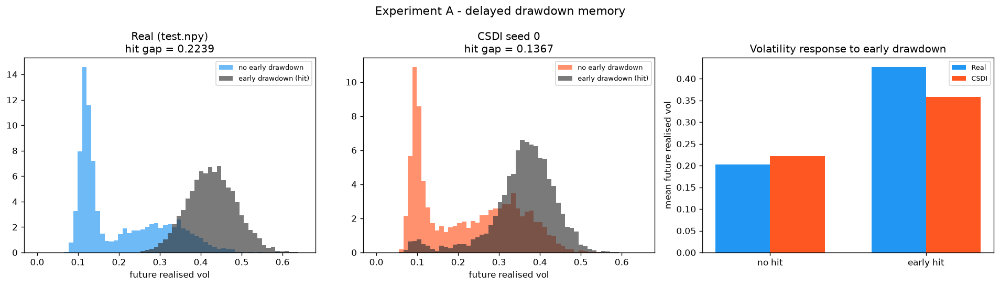
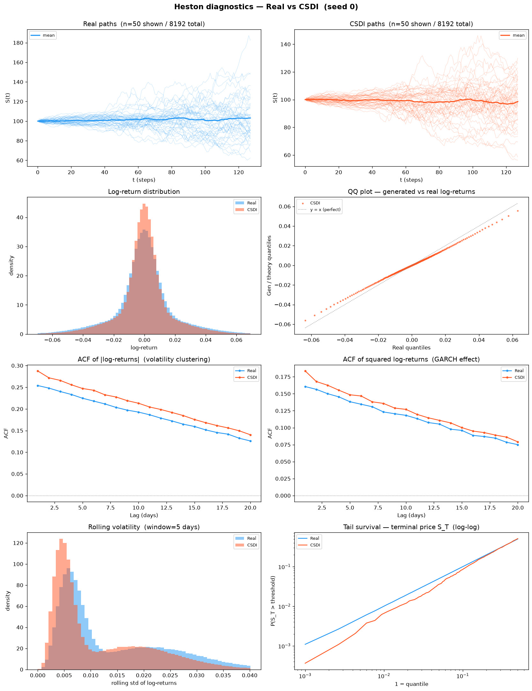
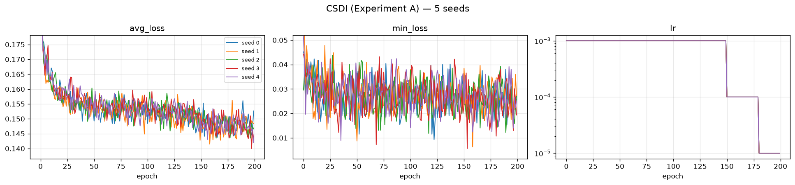

# CSDI — Experiment A: Delayed Drawdown Memory

**5 seeds · 8192 × 128 paths per seed · A100-SXM4-80GB · 2026-07-31**

Generator: `methods/CSDI` (released `base.yaml`, run **unconditional**), 412,945 parameters,
trained directly on prices — **no preprocessing beyond a global standardizer, no log-return
transform, no path shadowing**.

The data-generating process is *not* Heston. It is a latching drawdown-memory volatility
process defined in `dataset/Heston/new_experiments/protocol/` (§2 of the protocol PDF):

```
memory_t = max(decay · memory_{t−1}, 1[drawdown_t ≥ 0.04]),   decay = exp(−ln2 / 60)
σ_t      = σ_low + (σ_high − σ_low) · memory_{t−32}            σ ∈ [0.12, 0.45]
```

Three things make it hard, and all three are deliberate:

* **latching** — the indicator ratchets the memory back to 1, so the state is not a smooth AR;
* **a 32-step response delay** — the volatility reaction is decoupled in time from its cause;
* **half-life 60 > recent_window 20** — a model that only reads the last 20 steps *cannot*
  recover the signal, no matter how well it fits marginals.

Two suites are reported below, **and they are kept strictly separate**:

| Section | Suite | Question it answers |
|---|---|---|
| **1** | Protocol PDF evaluator (`evaluate_drawdown_memory.py`, run unchanged) | Did the model reproduce the *memory structure* the protocol targets? |
| **2** | Benchmark standard battery (A1–A34 + B curve-shape) | How does it score on the repo's usual metrics? |

Section 1 is the one that decides the experiment. Section 2 is context.

**Perfect floor** = the true DGP re-simulated with a fresh seed (5 independent simulations).
It is the best score any generator can achieve; it is *not* zero, because the evaluator
compares two finite 8192-path samples.

---

## 1. PDF metrics — protocol evaluator

Produced by `dataset/Heston/new_experiments/protocol/experiments/scripts/evaluate_drawdown_memory.py`,
**run unchanged** (protocol PDF §7, checklist item 7). Aggregation: mean ± sample std
(ddof = 1) over 5 seeds; 95 % CI half-width uses t₀.₉₇₅,₄ = 2.776.

**Why there is no paired interval here, stated rather than omitted.** PDF §5 requires the five
seedwise differences and a paired interval *"for comparisons between models run with **aligned
seeds**"*. This table compares CSDI (seeds 0–4) against the perfect floor, which is five
true-DGP draws at seeds **1000–1004** — there is no correspondence between floor seed 1000 and
model seed 0, so pairing them would fabricate a covariance and yield an interval that changes
if the floor files are reordered. The comparison is therefore unpaired **by the protocol's own
condition**. The CSDI-vs-LS4 comparison *is* seed-aligned and is reported in
[`../README.md`](../README.md).

**Reading the `target_memory.*` rows.** These are computed from `test.npy` alone by the frozen
evaluator; they never touch the generated bank. They are therefore *bit-identical* across all
five seeds — verified, not assumed — so their sample std and 95 % CI half-width are **exactly 0**,
and both the CSDI and the perfect-floor column necessarily carry the same number. A zero here means
"this quantity was never resampled", not "we measured a variance and it came out small". They are
the target the two other columns are aiming at, not a result. Every cell is nonetheless printed as
a number rather than a dash, because the table is emitted verbatim by
`tools/aggregate_pdf_metrics.py` and any hand-substituted cell would break that guarantee.

<!-- model seeds: 5 | floor seeds: 5 -->
| Metric | CSDI (mean ± std) | 95% CI half-width | Perfect floor (mean ± std) |
|---|---|---|---|
| `errors.abs_return_acf_rmse_lags_1_50` | 0.0189235 ± 0.000518 | 0.000643 | 0.00156102 ± 0.000141 |
| `errors.early_history_incremental_r2_error` | 0.227474 ± 0.0151 | 0.0187 | 0.00641167 ± 0.00544 |
| `errors.early_hit_rate_error` | 0.161279 ± 0.0182 | 0.0226 | 0.00310059 ± 0.00224 |
| `errors.excess_kurtosis_error` | 0.59727 ± 0.0408 | 0.0506 | 0.023094 ± 0.0118 |
| `errors.future_rv_hit_gap_error` | 0.0830031 ± 0.00635 | 0.00788 | 0.00102294 ± 0.000516 |
| `errors.future_rv_wasserstein` | 0.0576958 ± 0.00278 | 0.00345 | 0.00123331 ± 0.00021 |
| `errors.return_std_error` | 0.00290882 ± 0.000109 | 0.000136 | 2.79631e-05 ± 1.44e-05 |
| `errors.squared_return_acf_rmse_lags_1_50` | 0.00867602 ± 0.00106 | 0.00132 | 0.00161632 ± 0.000193 |
| `errors.terminal_log_price_ks` | 0.0414307 ± 0.00992 | 0.0123 | 0.0120117 ± 0.00319 |
| `generated_memory.augmented_r2` | 0.453933 ± 0.0163 | 0.0202 | 0.673625 ± 0.00375 |
| `generated_memory.baseline_r2` | 0.392884 ± 0.00864 | 0.0107 | 0.380345 ± 0.00425 |
| `generated_memory.early_history_incremental_r2` | 0.0610487 ± 0.0151 | 0.0187 | 0.29328 ± 0.00726 |
| `generated_memory.early_hit_future_rv_correlation` | 0.57039 ± 0.0256 | 0.0317 | 0.809204 ± 0.00274 |
| `generated_memory.early_hit_rate` | 0.468359 ± 0.0182 | 0.0226 | 0.626538 ± 0.00224 |
| `generated_memory.early_hit_standardized_coefficient` | 0.614215 ± 0.0757 | 0.094 | 1.51798 ± 0.0125 |
| `generated_memory.future_rv_hit_gap` | 0.140868 ± 0.00635 | 0.00788 | 0.223988 ± 0.00125 |
| `generated_memory.future_rv_hit_mean` | 0.361101 ± 0.00224 | 0.00279 | 0.427455 ± 0.000421 |
| `generated_memory.future_rv_no_hit_mean` | 0.220232 ± 0.00509 | 0.00632 | 0.203467 ± 0.000875 |
| `novelty.distinct_nearest_training_paths` | 1266 ± 19.8 | 24.6 | 1600.8 ± 11.5 |
| `novelty.mean_standardized_nearest_train_path_rmse` | 0.804888 ± 0.0052 | 0.00646 | 0.937306 ± 0.000826 |
| `novelty.median_standardized_nearest_train_path_rmse` | 0.840909 ± 0.0075 | 0.00931 | 0.989367 ± 0.00106 |
| `target_memory.augmented_r2` | 0.67399 ± 0 | 0 | 0.67399 ± 0 |
| `target_memory.baseline_r2` | 0.385467 ± 0 | 0 | 0.385467 ± 0 |
| `target_memory.early_history_incremental_r2` | 0.288523 ± 0 | 0 | 0.288523 ± 0 |
| `target_memory.early_hit_future_rv_correlation` | 0.80836 ± 0 | 0 | 0.80836 ± 0 |
| `target_memory.early_hit_rate` | 0.629639 ± 0 | 0 | 0.629639 ± 0 |
| `target_memory.early_hit_standardized_coefficient` | 1.4987 ± 0 | 0 | 1.4987 ± 0 |
| `target_memory.future_rv_hit_gap` | 0.223872 ± 0 | 0 | 0.223872 ± 0 |
| `target_memory.future_rv_hit_mean` | 0.426855 ± 0 | 0 | 0.426855 ± 0 |
| `target_memory.future_rv_no_hit_mean` | 0.202984 ± 0 | 0 | 0.202984 ± 0 |

### 1.1 PRIMARY panel — the four metrics the protocol designates

Protocol PDF §2.3 names exactly four primary metrics for this experiment. These decide it.
Everything else in §1 is a secondary diagnostic.

| Primary metric (↓ lower is better) | CSDI (mean ± std) | 95% CI half-width | Perfect floor | × floor |
|---|---|---|---|---|
| `early_hit_rate_error` | 0.161279 ± 0.0182 | 0.0226 | 0.00310059 ± 0.00224 | **52×** |
| `future_rv_hit_gap_error` | 0.0830031 ± 0.00635 | 0.00788 | 0.00102294 ± 0.000516 | **81×** |
| `early_history_incremental_r2_error` | 0.227474 ± 0.0151 | 0.0187 | 0.00641167 ± 0.00544 | **35×** |
| `future_rv_wasserstein` | 0.0576958 ± 0.00278 | 0.00345 | 0.00123331 ± 0.00021 | **47×** |

The `× floor` column is the honest scale, and unlike LS4 there is no metric on which CSDI is
close. **All four primary metrics are 35–81× the floor**, and — the point that matters — CSDI
misses even the *unconditional* hit rate: `early_hit_rate_error` = 0.161 means the generated
paths experience an early ≥ 4 % drawdown only 46.8 % of the time against a target of 63.0 %.
LS4 got that one nearly right (2.6× floor) and failed only on the conditional structure. CSDI
fails before the conditional question is reached. §1.2 decomposes why.

**The two design matrices behind `early_history_incremental_r2`.** PDF §2.2:
`B = [1, z(V_recent), z(D₆₄), z(X₆₄)]` gives `baseline_r2`; `A = [B, z(early_hit)]` gives
`augmented_r2`; the primary metric is their difference. One warning, because it will bite
anyone who reads the evaluator source: the third baseline column is emitted under the key
**`current_log_return`**, but `evaluate_drawdown_memory.py:72` assigns it `log_paths[:, 64]`
— that is **X₆₄, a cumulative log-price *level*, not a return**. The value is right (it is
exactly what PDF §2.2 asks for); the name is a canonical-script misnomer. It may **not** be
corrected in place — PDF §7 item 7 requires the evaluator to run unchanged. Substituting an
actual return there changes `baseline_r2` and therefore changes the headline number.

### 1.2 Headline — raw diagnostics behind the primary panel

⚠️ These are **raw group means and R² values, not errors**. Protocol PDF §5 lists group means
and novelty as the explicit exceptions to "lower is better". `early_history_incremental_r2`
is a **two-sided** target — matching 0.288523 is the goal; overshooting is as wrong as
undershooting. Only the `*_error` forms in §1.1 are minimisation targets.

| Quantity | Target | CSDI | Perfect floor | Verdict |
|---|---|---|---|---|
| `early_history_incremental_r2` | **0.288523** | **0.0610487 ± 0.0151** | 0.29328 ± 0.00726 | **21 % of the signal recovered** |
| `early_hit_rate` | 0.629639 | **0.468359 ± 0.0182** | 0.626538 ± 0.00224 | **−0.161 absolute, 8.9 σ — drawdowns too rare** |
| `early_hit_standardized_coefficient` | 1.4987 | 0.614215 ± 0.0757 | 1.51798 ± 0.0125 | 41 % of the response |
| `future_rv_hit_gap` | 0.223872 | 0.140868 ± 0.00635 | 0.223988 ± 0.00125 | gap 37 % too small |
| `future_rv_hit_mean` | 0.426855 | **0.361101 ± 0.00224** | 0.427455 ± 0.000421 | **−15 %, 29 σ off** |
| `future_rv_no_hit_mean` | 0.202984 | 0.220232 ± 0.00509 | 0.203467 ± 0.000875 | +8.5 %, 3.4 σ |

**What CSDI actually learned.** Some memory exists — 0.061 of incremental R² is not zero, and
`early_hit_future_rv_correlation` reaches 0.570 against a target of 0.808 — but the failure is
structural and it is *upstream* of the memory mechanism. Both realized-volatility group means
are pulled toward each other from **both sides**: stressed paths are 15 % too calm (29 σ) and
calm paths are 8.5 % too volatile (3.4 σ). CSDI is regressing the whole volatility field toward
its mean. That is the classic diffusion-model behaviour on a latching state variable: the
reverse process is trained to denoise toward a conditional expectation, and with no conditioning
signal (`is_unconditional = 1`) the only thing it can anchor on is the marginal. It therefore
produces paths whose volatility is *plausible on average* and never sharply bimodal — which is
exactly what the drawdown-memory DGP is not.

The 0.161 `early_hit_rate` deficit is the same fact seen at the price level: a ≥ 4 % drawdown
in the first 64 steps requires a sustained high-σ excursion, and a mean-reverted volatility
field produces them too rarely.

**Novelty — the one place CSDI departs from the floor in a way LS4 did not.**

| Novelty metric | CSDI | Perfect floor | LS4 (same experiment) |
|---|---|---|---|
| `distinct_nearest_training_paths` ↑ | **1266 ± 19.8** | 1600.8 ± 11.5 | 1596.4 ± 33.1 |
| `mean_standardized_nearest_train_path_rmse` ↑ | **0.804888 ± 0.0052** | 0.937306 ± 0.000826 | 0.949641 ± 0.00608 |
| `median_standardized_nearest_train_path_rmse` ↑ | **0.840909 ± 0.0075** | 0.989367 ± 0.00106 | 0.988202 ± 0.00971 |

CSDI's bank sits **measurably closer to the training set than a genuine DGP draw does**: it
covers 1266 distinct nearest neighbours where an honest resample covers 1601, and its nearest
training path is 14 % nearer in standardized RMSE. LS4 sat on top of the floor on all three.

This is a **concentration signature, not proof of copying** — a median standardized RMSE of
0.84 is still far from 0, so no path is a near-duplicate of a training path. The reading is
that CSDI's 8192 samples occupy a narrower region of path space than the true DGP does, which
is the same mean-reversion finding as above, measured in a different coordinate system. It
should be reported, and it should not be called memorisation.



Left = real `test.npy`, middle = CSDI seed 0, right = the two hit-gap bars side by side. The
generated black (early-drawdown) and orange (no-drawdown) histograms overlap far more than the
real ones: the two conditional distributions have collapsed toward a common centre.

### 1.3 Validation vs test — evidence that `test.npy` stayed blind

Protocol PDF §1.4 asks for `metrics_validation.json` alongside `metrics_test.json`, and §7
checklist item 2 requires that `disc.npy` was used **only** for validation. The same unchanged
evaluator, re-run with `disc.npy` substituted for `--test-data` (`pdf_metrics_validation/`):

| `errors.*` (↓) | vs `test.npy` | vs `disc.npy` (validation) |
|---|---|---|
| `early_hit_rate_error` | 0.161279 ± 0.0182 | 0.158105 ± 0.0182 |
| `future_rv_hit_gap_error` | 0.0830031 ± 0.00635 | 0.0837955 ± 0.00635 |
| `early_history_incremental_r2_error` | 0.227474 ± 0.0151 | 0.237883 ± 0.0151 |
| `future_rv_wasserstein` | 0.0576958 ± 0.00278 | 0.0573087 ± 0.00278 |
| `terminal_log_price_ks` | 0.0414307 ± 0.00992 | 0.0451904 ± 0.00895 |

Every metric agrees within one standard deviation, and the differences have no consistent sign
(two better on validation, three worse). That is the opposite of the signature of
validation-set overfitting, and it is the cleanest available evidence that no tuning leaked
into the reported run. It is also expected here for a stronger reason than in LS4's case: **no
tuning was performed at all** — the released `base.yaml` was used as published.

### 1.4 Protocol reporting block (PDF §5)

| Requirement | Value |
|---|---|
| Training file | `dataset/Heston/new_experiments/experiment_A/train.npy` |
| Validation file | `dataset/Heston/new_experiments/experiment_A/disc.npy` |
| Test file | `dataset/Heston/new_experiments/experiment_A/test.npy` |
| Generated bank size | 8192 × 128 `float64`, per seed |
| Model seeds | 0, 1, 2, 3, 4 (training seed = generation seed, shared RNG stream) |
| Independent retraining | **5 separate trainings, one per seed** — not one model sampled five times. Evidence: the five `weights/seed_<q>_model.pt` have five distinct MD5s (`fd48142e…`, `40698701…`, `0d01afd3…`, `c5fe1a24…`, `134b5048…`); each `weights/seed_<q>_config.json` records `"experiment": "A"` and the Experiment-A training file; the five loss curves are 200 epochs each with distinct minima (0.143762, 0.141504, 0.143487, 0.140008, 0.141920). Cross-experiment check: all **10** A+B checkpoints are mutually distinct. |
| Trained on this experiment's own data | **Yes** — `dataset/Heston/new_experiments/experiment_A/train.npy` (MD5 `52ed4ad2…`), a different file from Experiment B's (`7713b823…`). Independent corroboration: the standardizer fitted on it gives μ = 100.13621639651069, σ = 11.927961375843996, which differ from B's (μ = 100.09714689788022, σ = 11.516370009298313) — the two runs cannot have shared a training set. |
| Official code + revision | **Yes** — `methods/CSDI/code`, released `base.yaml` run unconditionally, at benchmark revision `4189d37`; experiment wrapper `code/train_csdi_experiment.py` |
| Hyperparameters | **Official defaults**, not validation-selected. No tuning was performed; `disc.npy` was used for scoring only. |
| Trainable parameters | 412,945 |
| Training time | **2387 s per seed on average** (≈40 min; range 2092.5–3290.1 s, 1.57× spread). PDF §5 asks for training time in the comparison table, and the honest number there is the mean over the five seeds — not seed 0's 2175.8 s. The spread is GPU contention, not instability: all five seeds ran the full 200 epochs with no NaN and a min-loss spread of 2.7 % (per-seed table in §4). |
| Generation time | **15.6 s per seed on average** (range 10.3–18.6 s) |
| Hardware | 1 × A100-SXM4-80GB, 8 pinned cores of 2 × AMD EPYC 7763 |
| Failed / unstable runs | **0** — all 5 seeds ran 200/200 epochs, no NaN in any bank (`first_nan_epoch: null`, `gen_has_nan: false` in all five `metadata.json`) |
| Declared post-hoc transformation (§1.3) | **`S ← 100·S/S[:,:1]`**, applied once to every bank. CSDI generates in standardized *price* space with no `t = 0` anchor, so raw `S₀` deviated by up to **0.500 in absolute price units** (5.0 × 10⁻³ relative) — beyond §1.4's "ordinary floating-point tolerance". The repair preserves every log-return to 1e-12, so the path law is untouched; the four primary metrics above are **bit-identical** pre- and post-repair, as predicted by the evaluators' `log(S/S[:,:1])` normalization and then verified. Recorded per seed in `generation_manifest.json → numerical_repair`. **The repair is committed code and is fully audited:** `tools/apply_s0_repair.py --raw-dir raw_banks`, run against the pre-repair banks preserved in `raw_banks/`, re-derives all **5/5** scored banks **bit-for-bit** (max log-return perturbation 1.776 × 10⁻¹⁵). The spelling is load-bearing — `100.0 * S / S[:, :1]`, multiply first. |
| Known non-conformance | **None.** All §1.4 bullets hold: finite, strictly positive, 8192 × 128, `float64`, `S₀ == 100.0` exactly — re-measured from each array on disk by `write_generation_manifest.py`, not asserted. |

Machine-readable in `generated_paths/seed_<q>/generation_manifest.json`.

*Reproduce:* `python ../../tools/aggregate_pdf_metrics.py --model-dir . --floor-dir ../perfect_floor --pattern '*_drawdown_memory.json' --label CSDI --exclude-prefix configuration oracle_gate`

---

## 2. Metrics A1–A34 + B — benchmark standard battery, mean ± std across 5 seeds

Separate suite, separate question. These are the repo's usual metrics, computed by
`code/compute_metrics_experiment.py` against `test.npy`, aggregated across the same 5 seeds.

**A33/A34 are dropped in both new experiments** (user decision): they require the latent σ
path, which is not part of the generator's output contract here. Their cells read `n/a` —
never 0, which would silently flatter the method.

> **Here the two suites agree, and that is itself informative.** For LS4 the standard battery
> looked excellent while §1 showed a real miss — the classic blind spot. CSDI has no such
> discrepancy: A14 KS log-returns is 38× the floor, A26 volatility std error 63× and A31
> rolling-vol KS 85×, and A18 discriminative sits above the floor rather than below it. The
> marginal distribution of returns is itself wrong, so §2 flags the problem too.
>
> That does not make §2 the verdict. It means the §1 failure is severe enough to be visible
> from any angle, whereas LS4's was visible only through the protocol evaluator. Read §1 first.

### 2.1 A1–A34

| Metric | CSDI (mean ± std) | Seed 0 | Seed 1 | Seed 2 | Seed 3 | Seed 4 | Perfect floor |
|---|---|---|---|---|---|---|---|
| **Fat Tail** | | | | | | | |
| A1 Kurtosis Error ↓ | 0.674298 ± 0.078 | 0.610217 | 0.624228 | 0.761717 | 0.618044 | 0.757285 | 0.0601011 ± 0.0382 |
| A2 \|r\| q95 Error ↓ | 0.00619595 ± 0.000208 | 0.00610682 | 0.00595922 | 0.0065181 | 0.00625252 | 0.0061431 | 6.48561e-05 ± 4.46e-05 |
| A3 \|r\| q99 Error ↓ | 0.00782819 ± 0.000344 | 0.0076364 | 0.00742688 | 0.0083449 | 0.0078148 | 0.00791795 | 8.275e-05 ± 3.63e-05 |
| A4 Tail QQ Error ↓ | 0.00611364 ± 0.000219 | 0.00600956 | 0.00587196 | 0.0064584 | 0.00615953 | 0.00606875 | 9.25658e-05 ± 4.42e-05 |
| A5 Hill Tail Index Error ↓ | 1.73483 ± 0.327 | 1.5501 | 1.56814 | 1.51802 | 2.3003 | 1.73756 | 0.407724 ± 0.315 |
| **Distribution** | | | | | | | |
| A6 Path MMD² ↓ | 0.00263734 ± 0.000233 | 0.00280009 | 0.00282425 | 0.00236699 | 0.00279787 | 0.0023975 | 0.00177285 ± 5.64e-05 |
| A7 Terminal MMD² ↓ | 0.002392 ± 0.000891 | 0.00391526 | 0.00224293 | 0.00168356 | 0.00229482 | 0.00182343 | 0.00170387 ± 0.000258 |
| A8 Increment MMD² ↓ | 0.00411459 ± 0.000585 | 0.00468133 | 0.00426461 | 0.00409848 | 0.00438784 | 0.00314072 | 0.00107654 ± 6.13e-05 |
| A9 Volatility MMD ↓ | 0.107136 ± 0.0104 | 0.121629 | 0.0966698 | 0.105511 | 0.113292 | 0.0985797 | 0.0105444 ± 0.00044 |
| A10 Terminal SWD ↓ | 1.84424 ± 0.393 | 1.83783 | 2.36486 | 1.47287 | 2.08878 | 1.45688 | 1.02907 ± 0.185 |
| A11 Path SWD ↓ | 0.878639 ± 0.0801 | 0.913313 | 0.899068 | 0.971014 | 0.85319 | 0.756609 | 0.542455 ± 0.0723 |
| A12 RV Law Loss ↓ | 3.31151 ± 0.114 | 3.23619 | 3.19037 | 3.48781 | 3.33166 | 3.3115 | 0.0622546 ± 0.0132 |
| A13 Mean Path RMSE ↓ | 0.552904 ± 0.408 | 0.267704 | 0.376222 | 1.146 | 0.177882 | 0.79671 | 0.119593 ± 0.0243 |
| A14 KS Log-returns ↓ | 0.0431914 ± 0.00206 | 0.0413434 | 0.0414299 | 0.0462454 | 0.0427957 | 0.0441424 | 0.00113131 ± 9.72e-05 |
| A15 Skewness Error ↓ | 0.0112248 ± 0.00329 | 0.00833816 | 0.0097139 | 0.0137727 | 0.00865087 | 0.0156485 | 0.00329532 ± 0.00104 |
| A16 QQ RMSE ↓ | 0.00288986 ± 0.000108 | 0.00281057 | 0.00278074 | 0.00305522 | 0.00292015 | 0.00288263 | 4.91034e-05 ± 8.54e-06 |
| A17 Terminal KS ↓ | 0.0414307 ± 0.00992 | 0.0305176 | 0.0356445 | 0.0554199 | 0.038208 | 0.0473633 | 0.0120117 ± 0.00319 |
| **Adversarial** | | | | | | | |
| A18 Discriminative (GRU) ↓ | 0.0141288 ± 0.022 | 0.052334 | 0.000458 | 0.001373 | 0.013885 | 0.002594 | 0.0073542 ± 0.00565 |
| A18 Discriminative (MLP) ↓ | 0.0097348 ± 0.00571 | 0.012664 | 0.000458 | 0.009918 | 0.009918 | 0.015716 | 0.0042418 ± 0.00229 |
| **Predictive** | | | | | | | |
| A19 Predictive (GRU) ↓ | 0.046486 ± 1.86e-05 | 0.04647 | 0.046471 | 0.046488 | 0.046485 | 0.046516 | 0.0464168 ± 1.53e-05 |
| A19 Predictive (MLP) ↓ | 0.0480262 ± 2.66e-05 | 0.047997 | 0.048065 | 0.048008 | 0.048038 | 0.048023 | 0.048241 ± 0.00042 |
| **Temporal** | | | | | | | |
| A20 Covariance Error ↓ | 86.5044 ± 18.1 | 79.184 | 98.9045 | 77.8994 | 110.922 | 65.6121 | 17.2826 ± 9.01 |
| A21 ACF \|r\| ↓ | 0.0254815 ± 0.00207 | 0.0254912 | 0.024899 | 0.0223448 | 0.0271589 | 0.0275134 | 0.00160018 ± 0.000752 |
| A22 ACF r² ↓ | 0.0149441 ± 0.00108 | 0.0142759 | 0.0140058 | 0.0142444 | 0.015787 | 0.0164076 | 0.00129902 ± 0.000643 |
| A23 ACF lag-1 \|r\| Error ↓ | 0.0331209 ± 0.00344 | 0.0356297 | 0.0316987 | 0.0284086 | 0.0326658 | 0.037202 | 0.00151053 ± 0.00114 |
| A24 ACF lag-1 r² Error ↓ | 0.0236946 ± 0.00262 | 0.0252287 | 0.0217125 | 0.0218155 | 0.022125 | 0.0275913 | 0.000984905 ± 0.000792 |
| **Volatility** | | | | | | | |
| A25 Mean RMSE ↓ | 0.788538 ± 0.708 | 0.355423 | 0.249162 | 1.69294 | 0.228032 | 1.41713 | 0.203377 ± 0.121 |
| A26 Std Error ↓ | 0.278546 ± 0.00803 | 0.277532 | 0.272572 | 0.281655 | 0.290581 | 0.270391 | 0.00441299 ± 0.00239 |
| A27 Log-return Std Error ↓ | 0.00290882 ± 0.000109 | 0.00283713 | 0.00279246 | 0.00307801 | 0.00292826 | 0.00290822 | 2.79631e-05 ± 1.44e-05 |
| A28 Kurtosis Ratio → 1 | 0.819936 ± 0.0101 | 0.830724 | 0.816205 | 0.814178 | 0.808251 | 0.830323 | 0.991589 ± 0.00428 |
| A29 Sigma Mean Error ↓ | 0.0456726 ± 0.00186 | 0.0444775 | 0.0438575 | 0.0486783 | 0.0458978 | 0.0454518 | 0.000392072 ± 0.000269 |
| A30 Vol Path RMSE ↓ | 1.30152 ± 0.21 | 1.15833 | 1.39343 | 1.26964 | 1.60974 | 1.07647 | 0.190091 ± 0.0906 |
| A31 Rolling Vol KS ↓ | 0.162503 ± 0.00249 | 0.162252 | 0.158912 | 0.162517 | 0.165911 | 0.162921 | 0.0019172 ± 0.000476 |
| A32 Vol-of-vol Error ↓ | 0.00118022 ± 7.13e-05 | 0.0011468 | 0.00110061 | 0.00128943 | 0.00116057 | 0.00120368 | 2.13612e-05 ± 1.1e-05 |
| **Heston-specific (dropped)** | | | | | | | |
| A33 Sigma Correlation (dropped) | n/a | n/a | n/a | n/a | n/a | n/a | n/a |
| A34 Sigma RMSE (dropped) | n/a | n/a | n/a | n/a | n/a | n/a | n/a |

### 2.2 B — curve-shape metrics

Per-plot agreement between real and generated curves: `funct` = the curve itself, `der` = its
first derivative, `sec_der` = its second. MSE is the per-seed average of the three. `Grid TVD`
is the total-variation distance over the 2-D occupancy grid, in percent.

| Plot | Measure | CSDI (mean ± std) | Seed 0 | Seed 1 | Seed 2 | Seed 3 | Seed 4 | Perfect floor |
|---|---|---|---|---|---|---|---|---|
| **Grid TVD (%)** | — | 561.8 ± 80.4 | 439.501 | 550.699 | 662.88 | 582.256 | 573.664 | 155.077 ± 11.9 |
| **Log-return histogram** | MSE (funct/der/sec-der avg) | 1.87864 ± 0.0788 | 1.80325 | 1.80761 | 1.98768 | 1.92503 | 1.86962 | 0.0545244 ± 0.0165 |
|  | % error | 113.208 ± 8.08 | 112.175 | 119.62 | 122.325 | 102.054 | 109.867 | 95.391 ± 10.9 |
|  | NRMSE | 16.6572 ± 0.266 | 16.732 | 16.4046 | 16.4029 | 17.0395 | 16.707 | 8.62821 ± 1.4 |
|  | CVaR₉₀ | 17.4322 ± 0.463 | 16.9408 | 17.1566 | 18.1489 | 17.5659 | 17.3488 | 0.823273 ± 0.12 |
|  | CVaR₉₅ | 22.8937 ± 0.417 | 22.4451 | 22.6191 | 23.4692 | 23.1618 | 22.7731 | 1.03955 ± 0.195 |
| **QQ plot** | MSE (funct/der/sec-der avg) | 2.93394e-06 ± 2.23e-07 | 2.77463e-06 | 2.70542e-06 | 3.27841e-06 | 2.9846e-06 | 2.92664e-06 | 1.70382e-09 ± 4.39e-10 |
|  | % error | 31.2204 ± 2.57 | 28.7404 | 28.0902 | 33.1791 | 33.0597 | 33.0327 | 19.5871 ± 3.8 |
|  | NRMSE | 2.62797 ± 0.146 | 2.51464 | 2.48579 | 2.81887 | 2.57923 | 2.74133 | 0.311846 ± 0.0568 |
|  | CVaR₉₀ | 5.0292 ± 0.19 | 4.93611 | 4.81367 | 5.32622 | 5.05329 | 5.0167 | 0.101555 ± 0.0197 |
|  | CVaR₉₅ | 5.57556 ± 0.227 | 5.48358 | 5.2948 | 5.92051 | 5.58108 | 5.59782 | 0.12425 ± 0.0237 |
| **ACF of \|log-returns\|** | MSE (funct/der/sec-der avg) | 0.000179114 ± 2.76e-05 | 0.00017189 | 0.000187597 | 0.000134848 | 0.000196412 | 0.000204823 | 5.34639e-06 ± 2.22e-06 |
|  | % error | 207.99 ± 66.8 | 164.748 | 192.905 | 279.807 | 128.785 | 273.705 | 135.251 ± 51.9 |
|  | NRMSE | 61.9089 ± 13 | 67.1747 | 62.5614 | 62.2541 | 41.0904 | 76.4641 | 37.6473 ± 9.58 |
|  | CVaR₉₀ | 23.9138 ± 2.03 | 24.6941 | 23.0304 | 21.1968 | 23.9602 | 26.6876 | 2.56508 ± 0.508 |
|  | CVaR₉₅ | 26.3283 ± 2.74 | 28.3226 | 25.1977 | 22.5824 | 25.9665 | 29.5724 | 2.70023 ± 0.475 |
| **ACF of squared log-returns** | MSE (funct/der/sec-der avg) | 5.76535e-05 ± 9.75e-06 | 5.00309e-05 | 5.74072e-05 | 5.36836e-05 | 5.27026e-05 | 7.4443e-05 | 6.27026e-06 ± 3.17e-06 |
|  | % error | 98.8259 ± 21 | 85.6534 | 114.364 | 109.401 | 68.3387 | 116.372 | 70.776 ± 18.9 |
|  | NRMSE | 59.1195 ± 10.6 | 59.8467 | 61.0143 | 62.4041 | 41.7148 | 70.6176 | 37.3861 ± 9.97 |
|  | CVaR₉₀ | 23.757 ± 2.03 | 22.8853 | 22.3524 | 23.3974 | 22.8198 | 27.3302 | 3.86506 ± 0.764 |
|  | CVaR₉₅ | 28.2766 ± 3.13 | 30.1073 | 25.9112 | 26.0341 | 26.4035 | 32.9268 | 4.48217 ± 0.963 |
| **Rolling volatility histogram** | MSE (funct/der/sec-der avg) | 77.0595 ± 2.44 | 77.6799 | 74.1025 | 75.654 | 80.6267 | 77.2341 | 0.363092 ± 0.0823 |
|  | % error | 219.587 ± 21.8 | 194.5 | 207.661 | 230.399 | 214.381 | 250.993 | 194.499 ± 9.6 |
|  | NRMSE | 28.2051 ± 1.13 | 27.7812 | 26.9483 | 27.9473 | 28.3431 | 30.0057 | 9.07535 ± 1.12 |
|  | CVaR₉₀ | 42.7545 ± 0.654 | 42.8869 | 41.9918 | 42.3954 | 43.7446 | 42.7537 | 1.05297 ± 0.186 |
|  | CVaR₉₅ | 52.471 ± 0.862 | 52.2273 | 51.692 | 52.0952 | 53.9403 | 52.4002 | 1.33425 ± 0.317 |
| **Tail survival** | MSE (funct/der/sec-der avg) | 0.00107587 ± 6.45e-05 | 0.0010142 | 0.00101766 | 0.00116841 | 0.00110522 | 0.00107387 | 1.41954e-07 ± 6.99e-08 |
|  | % error | 5348.12 ± 383 | 4909.63 | 5707.74 | 5762.48 | 5043.18 | 5317.57 | 4094.07 ± 296 |
|  | NRMSE | 71991.6 ± 1.94e+03 | 69859.1 | 70592.9 | 74850.2 | 72559.4 | 72096.6 | 10677.2 ± 384 |
|  | CVaR₉₀ | 8.3101 ± 0.236 | 8.09486 | 8.07129 | 8.63753 | 8.41847 | 8.32837 | 0.115426 ± 0.0234 |
|  | CVaR₉₅ | 8.35368 ± 0.235 | 8.13645 | 8.11198 | 8.67353 | 8.46813 | 8.3783 | 0.122115 ± 0.0214 |

*Reproduce:*
`python ../../tools/make_metrics_tables.py --model-dir . --floor-dir ../perfect_floor --label CSDI --table A`
(and `--table B`).

---

## 3. Stylised Facts Diagnostic (real vs CSDI, seed 0)



Generated by `tools/plot_stylised_facts.py`, which wraps the benchmark-standard
`metrics/plot_diagnostics.py` so every method gets the identical figure.

**The black Heston theory curve is deliberately suppressed.** That curve is the closed-form
single-regime Heston reference, and Experiment A's DGP is a latching drawdown-memory process —
not Heston. Drawing it would be a wrong reference drawn with authority. Real vs Generated only.

The panel that matters is **rolling volatility**: the real distribution is broad and
right-skewed with a sharp low-vol spike, while CSDI's is a narrow unimodal bump sitting between
the two real modes. That is the mean-reversion of the volatility field from §1.2, seen without
any protocol machinery — an independent corroboration, and it is also why A31 (rolling-vol KS)
is 85× the floor.

---

## 4. Losses



One panel per column logged in `losses/seed_*_losses.csv`, all 5 seeds overlaid.
`losses/seed_*_losses_steps.csv` carries the same signal at step resolution.

| Seed | Train time (s) | Generation (s) | min avg epoch loss | Epochs | NaN |
|---|---|---|---|---|---|
| 0 | 2175.8 | 18.6 | 0.143762 | 200/200 | none |
| 1 | 2180.6 | 17.9 | 0.141504 | 200/200 | none |
| 2 | 2194.4 | 10.3 | 0.143487 | 200/200 | none |
| 3 | 2092.5 | 14.1 | 0.140008 | 200/200 | none |
| 4 | 3290.1 | 17.2 | 0.141920 | 200/200 | none |

The loss is the CSDI denoising objective (noise-prediction MSE averaged over the batch and the
diffusion step), so **lower is better and it is not comparable to LS4's ELBO** — different
objective, different sign convention, different scale. Do not read the two §4 tables against
each other.

Spread in wall-clock time is GPU contention, not instability: all five seeds ran the full 200
epochs, none produced a NaN, and the min-loss spread is 0.00375 (2.7 %). Training is stable and
seed-insensitive — which is why the volatility mean-reversion in §1 must be read as a property
of the model, not of any particular run.

**Configuration** (`weights/seed_N_config.json`, identical across seeds):

| | |
|---|---|
| Parameters | 412,945 |
| Variant | CSDI released `base.yaml`, **unconditional** (`is_unconditional = 1`) |
| `target_dim` / `seq_length` | 1 / 128 |
| `layers` / `channels` / `nheads` | 4 / 64 / 8 |
| `diffusion_embedding_dim` / `side_dim` | 128 / 144 |
| Time / feature embedding | 128 / 16 |
| Diffusion | 50 steps, `quad` schedule, β ∈ [1e-4, 0.5] |
| Optimiser | Adam, lr 1e-3, weight decay 1e-6 |
| Scheduler | MultiStepLR, milestones [150, 180], γ = 0.1 |
| Batch size / epochs | 16 / 200 |
| Scaler | `global_standardize` (μ = 100.136, σ = 11.928) |

---

## 5. File layout

```
results/new_experiments/experiment_A/CSDI/
├── README.md                        ← this file
├── code/
│   ├── train_csdi_experiment.py     train + generate 8192×128, one seed per call
│   ├── compute_metrics_experiment.py  A1–A34 + B suite  (--experiment A --source model --seeds 5)
│   └── logs/                        expA_seed{0..4}.log, metrics_A_model.log, tables_A.md
├── weights/
│   ├── seed_{0..4}_model.pt         trained weights
│   └── seed_{0..4}_config.json      exact hyperparameters actually used
├── generated_paths/
│   └── seed_{0..4}/
│       ├── generated_paths_8192x128.npy    8.4 MiB, S₀ = 100 exactly (post-repair)
│       ├── metadata.json            raw run record written by the trainer
│       └── generation_manifest.json PDF §1.4 mandatory manifest (§1.4 above)
├── raw_banks/
│   └── generated_paths/seed_{0..4}/
│       └── generated_paths_8192x128.npy    pre-repair banks, kept so the S₀ repair stays
│                                           auditable. The nesting mirrors generated_paths/
│                                           because that is the layout `apply_s0_repair.py
│                                           --raw-dir` resolves each seed against.
├── losses/
│   ├── seed_{0..4}_losses.csv       per-epoch loss + lr
│   ├── seed_{0..4}_losses_steps.csv per-step loss
│   └── loss_convergence.png         §4 figure
├── pdf_metrics/
│   └── seed_{0..4}_drawdown_memory.json    protocol evaluator vs test.npy  ("metrics_test")
├── pdf_metrics_validation/
│   └── seed_{0..4}_drawdown_memory.json    same evaluator vs disc.npy      ("metrics_validation")
├── plots/
│   ├── heston_diagnostics.png       §3 figure
│   ├── memory_structure_seed0.png   §1 figure
│   └── seed_{0..4}_{pca,tsne}.png
├── metrics_summary.csv              §2 source: metric,mean,std,seed_0..seed_4
└── seed_{0..4}_metrics.json         per-seed A/B suite output
    seed_{0..4}_{disc,pred}_{gru,mlp}_loss.csv    A18/A19 training curves
```

Shared tooling lives one level up, in `results/new_experiments/tools/` — it is method-neutral
and is what a new method should reuse rather than reimplement:

| Tool | Renders |
|---|---|
| `aggregate_pdf_metrics.py` | §1 table (works for both experiments; flattens any evaluator JSON) |
| `make_metrics_tables.py` | §2.1 and §2.2 tables from `metrics_summary.csv` |
| `plot_stylised_facts.py` | §3 figure |
| `plot_losses.py` | §4 figure (panels taken from the CSV header, so any method plots) |
| `plot_experiment_figures.py` | §1 memory-structure figure (A) / mixture figure (B) |
| `write_generation_manifest.py` | `generation_manifest.json` per seed — no README section, a PDF §1.4 submission artefact |
| `apply_s0_repair.py` | the declared §1.3 repair, plus the `--raw-dir` audit that re-derives it bit-for-bit |
| `check_method_layout.py` | asserts every file in the tree above exists |
| `check_readme_values.py` | re-runs the aggregators and diffs **every cell** of this README against them |

**This README is machine-checked.** `check_readme_values.py` regenerates §1, §1.1, §1.3, §2.1
and §2.2 from the JSON on disk and diffs them cell by cell; a hand-edited number fails the
check. That is deliberate — the tables above are not transcribed by hand, they are emitted.

No path shadowing and no `baseline_no_prepro` in this experiment.

**Information firewall.** The generator read **only** `train.npy` (and `disc.npy` for
validation). It never touched `test.npy`, `*_sigma.npy`, `*_labels.npy`, `oracle*`, or
`perfect_floor/*`. Evaluators and plotters may read `test.npy`; generators may not.

The protocol scripts under `dataset/Heston/new_experiments/protocol/` were run **unchanged**
(protocol PDF §7, checklist item 7).

Full step-by-step instructions for adding another method to this experiment:
[`guideline_new_experiment.md`](../../guideline_new_experiment.md).
