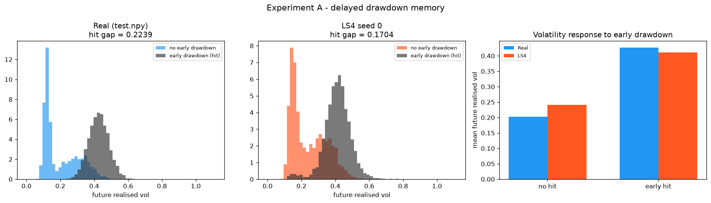
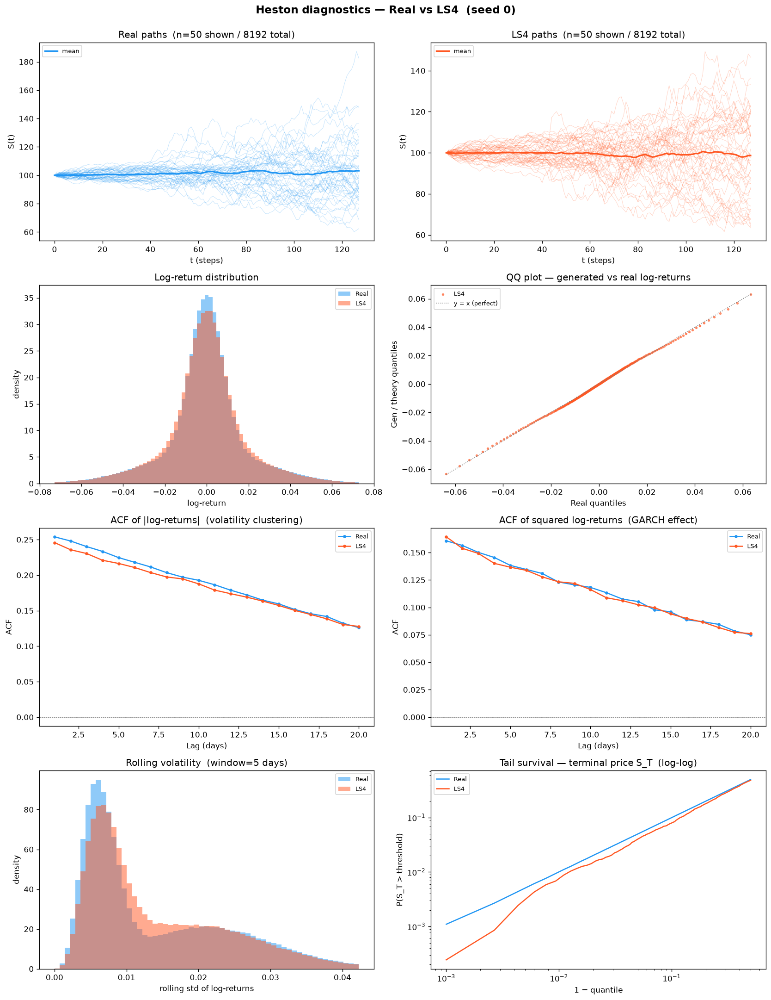
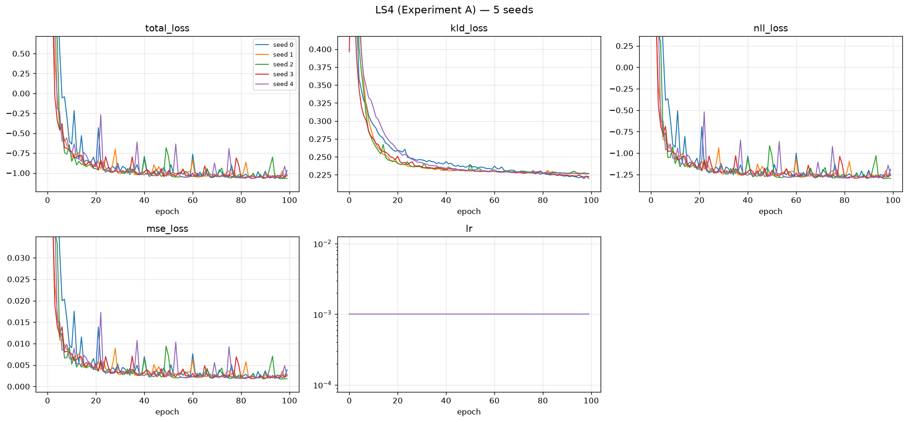

# LS4 — Experiment A: Delayed Drawdown Memory

**5 seeds · 8192 × 128 paths per seed · A100-SXM4-80GB · 2026-07-31**

Generator: `methods/LS4` (released `solar_weekly` preset), 2,146,857 parameters, trained
directly on prices — **no preprocessing, no log-return transform, no path shadowing**.

The data-generating process is *not* Heston. It is a latching drawdown-memory volatility
process defined in `dataset/Heston/new_experiments/protocol/` (§2 of the protocol PDF):

```
memory_t = max(decay · memory_{t−1}, 1[drawdown_t ≥ 0.04]),   decay = exp(−ln2 / 60)
σ_t      = σ_low + (σ_high − σ_low) · memory_{t−32}            σ ∈ [0.12, 0.45]
```

Three things make it hard, and all three are deliberate:

* **latching** — the indicator ratchets the memory back to 1, so the state is not a smooth AR;
* **a 32-step response delay** — the volatility reaction is decoupled in time from its cause;
* **half-life 60 > recent_window 20** — a model that only reads the last 20 steps *cannot*
  recover the signal, no matter how well it fits marginals.

Two suites are reported below, **and they are kept strictly separate**:

| Section | Suite | Question it answers |
|---|---|---|
| **1** | Protocol PDF evaluator (`evaluate_drawdown_memory.py`, run unchanged) | Did the model reproduce the *memory structure* the protocol targets? |
| **2** | Benchmark standard battery (A1–A34 + B curve-shape) | How does it score on the repo's usual metrics? |

Section 1 is the one that decides the experiment. Section 2 is context.

**Perfect floor** = the true DGP re-simulated with a fresh seed (5 independent simulations).
It is the best score any generator can achieve; it is *not* zero, because the evaluator
compares two finite 8192-path samples.

---

## 1. PDF metrics — protocol evaluator

Produced by `dataset/Heston/new_experiments/protocol/experiments/scripts/evaluate_drawdown_memory.py`,
**run unchanged** (protocol PDF §7, checklist item 7). Aggregation: mean ± sample std
(ddof = 1) over 5 seeds; 95 % CI half-width uses t₀.₉₇₅,₄ = 2.776.

`target_memory.*` is measured on `test.npy` and is therefore identical across seeds
(std = 0) — it is the target, not a result.

<!-- model seeds: 5 | floor seeds: 5 -->
| Metric | LS4 (mean ± std) | 95% CI half-width | Perfect floor (mean ± std) |
|---|---|---|---|
| `errors.abs_return_acf_rmse_lags_1_50` | 0.0144903 ± 0.0024 | 0.00299 | 0.00156102 ± 0.000141 |
| `errors.early_history_incremental_r2_error` | 0.118178 ± 0.0154 | 0.0191 | 0.00641167 ± 0.00544 |
| `errors.early_hit_rate_error` | 0.0081543 ± 0.00691 | 0.00858 | 0.00310059 ± 0.00224 |
| `errors.excess_kurtosis_error` | 0.302096 ± 0.158 | 0.196 | 0.023094 ± 0.0118 |
| `errors.future_rv_hit_gap_error` | 0.0503776 ± 0.00241 | 0.00299 | 0.00102294 ± 0.000516 |
| `errors.future_rv_wasserstein` | 0.0119597 ± 0.00142 | 0.00176 | 0.00123331 ± 0.00021 |
| `errors.return_std_error` | 0.000202294 ± 0.00012 | 0.000148 | 2.79631e-05 ± 1.44e-05 |
| `errors.squared_return_acf_rmse_lags_1_50` | 0.00776208 ± 0.00602 | 0.00747 | 0.00161632 ± 0.000193 |
| `errors.terminal_log_price_ks` | 0.0247803 ± 0.00912 | 0.0113 | 0.0120117 ± 0.00319 |
| `generated_memory.augmented_r2` | 0.548288 ± 0.0087 | 0.0108 | 0.673625 ± 0.00375 |
| `generated_memory.baseline_r2` | 0.377943 ± 0.0139 | 0.0172 | 0.380345 ± 0.00425 |
| `generated_memory.early_history_incremental_r2` | 0.170344 ± 0.0154 | 0.0191 | 0.29328 ± 0.00726 |
| `generated_memory.early_hit_future_rv_correlation` | 0.695678 ± 0.0117 | 0.0146 | 0.809204 ± 0.00274 |
| `generated_memory.early_hit_rate` | 0.636279 ± 0.0087 | 0.0108 | 0.626538 ± 0.00224 |
| `generated_memory.early_hit_standardized_coefficient` | 1.08214 ± 0.048 | 0.0596 | 1.51798 ± 0.0125 |
| `generated_memory.future_rv_hit_gap` | 0.173494 ± 0.00241 | 0.00299 | 0.223988 ± 0.00125 |
| `generated_memory.future_rv_hit_mean` | 0.415608 ± 0.00299 | 0.00371 | 0.427455 ± 0.000421 |
| `generated_memory.future_rv_no_hit_mean` | 0.242114 ± 0.000655 | 0.000813 | 0.203467 ± 0.000875 |
| `novelty.distinct_nearest_training_paths` | 1596.4 ± 33.1 | 41.1 | 1600.8 ± 11.5 |
| `novelty.mean_standardized_nearest_train_path_rmse` | 0.949641 ± 0.00608 | 0.00755 | 0.937306 ± 0.000826 |
| `novelty.median_standardized_nearest_train_path_rmse` | 0.988202 ± 0.00971 | 0.0121 | 0.989367 ± 0.00106 |
| `target_memory.augmented_r2` | 0.67399 (target) | — | 0.67399 |
| `target_memory.baseline_r2` | 0.385467 (target) | — | 0.385467 |
| `target_memory.early_history_incremental_r2` | 0.288523 (target) | — | 0.288523 |
| `target_memory.early_hit_future_rv_correlation` | 0.80836 (target) | — | 0.80836 |
| `target_memory.early_hit_rate` | 0.629639 (target) | — | 0.629639 |
| `target_memory.early_hit_standardized_coefficient` | 1.4987 (target) | — | 1.4987 |
| `target_memory.future_rv_hit_gap` | 0.223872 (target) | — | 0.223872 |
| `target_memory.future_rv_hit_mean` | 0.426855 (target) | — | 0.426855 |
| `target_memory.future_rv_no_hit_mean` | 0.202984 (target) | — | 0.202984 |

### 1.1 Headline

| Quantity | Target | LS4 | Perfect floor | Verdict |
|---|---|---|---|---|
| `early_history_incremental_r2` | **0.288523** | **0.170344 ± 0.0154** | 0.29328 ± 0.00726 | **59 % of the signal recovered** |
| `early_hit_standardized_coefficient` | 1.4987 | 1.08214 ± 0.048 | 1.51798 ± 0.0125 | under-responsive |
| `future_rv_hit_gap` | 0.223872 | 0.173494 ± 0.00241 | 0.223988 ± 0.00125 | gap 23 % too small |
| `future_rv_hit_mean` | 0.426855 | 0.415608 ± 0.00299 | 0.427455 ± 0.000421 | −2.6 % (close) |
| `future_rv_no_hit_mean` | 0.202984 | **0.242114 ± 0.000655** | 0.203467 ± 0.000875 | **+19 %, ≈53 σ off** |

The incremental R² is a **two-sided** target — the goal is to *match* 0.2885, not to maximise
it. A model that overshoots is as wrong as one that undershoots.

**What LS4 actually learned.** It is not Markovian: 0.170 of incremental R² is far above the
0.0 a memoryless generator would produce, and `early_hit_future_rv_correlation` reaches 0.696
against a target of 0.808. But the *decomposition* of the miss is unambiguous. Stressed paths
are almost right (`hit_mean` off by 2.6 %); calm paths are badly wrong (`no_hit_mean` off by
+19 %, with a per-seed std of 0.000655 — that is roughly **53 σ**, a systematic bias, not
sampling noise). LS4 learned that *an early drawdown precedes high volatility*. It did not
learn that *the absence of one implies sustained calm*. That is exactly the failure the
half-life-60-vs-window-20 design was built to expose: sustaining low volatility for 32+ steps
requires carrying state further back than the recent window, and LS4's latent state decays
too fast to do it.

**Novelty.** `median_standardized_nearest_train_path_rmse` = 0.9882 ± 0.0097 sits on top of
the floor's 0.9894 ± 0.0011, and 1596 ± 33 distinct nearest-training paths matches the floor's
1601 ± 12. **No memorisation.** The miss above is a modelling limitation, not a copying
artefact — which is the useful reading.



Left = real `test.npy`, middle = LS4 seed 0, right = the two hit-gap bars side by side. The
generated black (early-drawdown) and orange (no-drawdown) histograms are clearly separated —
memory exists — but the orange mass sits too far right: LS4's calm regime is not calm enough.

*Reproduce:* `python ../../tools/aggregate_pdf_metrics.py --model-dir . --floor-dir ../perfect_floor --pattern '*_drawdown_memory.json' --label LS4 --exclude-prefix configuration sources`

---

## 2. Metrics A1–A34 + B — benchmark standard battery, mean ± std across 5 seeds

Separate suite, separate question. These are the repo's usual metrics, computed by
`code/compute_metrics_experiment.py` against `test.npy`, aggregated across the same 5 seeds.

**A33/A34 are dropped in both new experiments** (user decision): they require the latent σ
path, which is not part of the generator's output contract here. Their cells read `n/a` —
never 0, which would silently flatter the method.

### 2.1 A1–A34

| Metric | LS4 (mean ± std) | Seed 0 | Seed 1 | Seed 2 | Seed 3 | Seed 4 | Perfect floor |
|---|---|---|---|---|---|---|---|
| **Fat Tail** | | | | | | | |
| A1 Kurtosis Error ↓ | 0.202858 ± 0.11 | 0.169217 | 0.106189 | 0.0998008 | 0.307382 | 0.331699 | 0.0601011 ± 0.0382 |
| A2 \|r\| q95 Error ↓ | 0.000373524 ± 0.000359 | 0.000979206 | 0.000202931 | 0.000278215 | 0.00036717 | 4.00979e-05 | 6.48561e-05 ± 4.46e-05 |
| A3 \|r\| q99 Error ↓ | 0.000270752 ± 0.000205 | 0.000549112 | 1.14535e-05 | 0.000386375 | 0.000212303 | 0.000194518 | 8.275e-05 ± 3.63e-05 |
| A4 Tail QQ Error ↓ | 0.000474312 ± 0.000292 | 0.00090218 | 0.000185131 | 0.000218592 | 0.000497795 | 0.00056786 | 9.25658e-05 ± 4.42e-05 |
| A5 Hill Tail Index Error ↓ | 0.169118 ± 0.146 | 0.392069 | 0.000940545 | 0.165716 | 0.199678 | 0.0871843 | 0.407724 ± 0.315 |
| **Distribution** | | | | | | | |
| A6 Path MMD² ↓ | 0.00187134 ± 0.000208 | 0.00199671 | 0.00172138 | 0.00185488 | 0.00163281 | 0.00215091 | 0.00177285 ± 5.64e-05 |
| A7 Terminal MMD² ↓ | 0.00207242 ± 0.00116 | 0.00408016 | 0.00160771 | 0.00143531 | 0.00119328 | 0.00204565 | 0.00170387 ± 0.000258 |
| A8 Increment MMD² ↓ | 0.0013309 ± 0.000225 | 0.00133697 | 0.00127987 | 0.00106763 | 0.00128229 | 0.00168775 | 0.00107654 ± 6.13e-05 |
| A9 Volatility MMD ↓ | 0.0172279 ± 0.00476 | 0.0191481 | 0.01301 | 0.0124165 | 0.017572 | 0.0239928 | 0.0105444 ± 0.00044 |
| A10 Terminal SWD ↓ | 1.19568 ± 0.408 | 1.82962 | 0.956541 | 0.990391 | 0.83068 | 1.37118 | 1.02907 ± 0.185 |
| A11 Path SWD ↓ | 0.616316 ± 0.125 | 0.743169 | 0.581007 | 0.572008 | 0.44813 | 0.737266 | 0.542455 ± 0.0723 |
| A12 RV Law Loss ↓ | 0.40919 ± 0.0954 | 0.550528 | 0.307957 | 0.354809 | 0.376749 | 0.455909 | 0.0622546 ± 0.0132 |
| A13 Mean Path RMSE ↓ | 0.271958 ± 0.137 | 0.105951 | 0.302273 | 0.47636 | 0.274885 | 0.200323 | 0.119593 ± 0.0243 |
| A14 KS Log-returns ↓ | 0.0165854 ± 0.00143 | 0.0151367 | 0.0165429 | 0.0178146 | 0.0152184 | 0.0182144 | 0.00113131 ± 9.72e-05 |
| A15 Skewness Error ↓ | 0.0552681 ± 0.0347 | 0.0867337 | 0.0203442 | 0.0180106 | 0.0619081 | 0.0893441 | 0.00329532 ± 0.00104 |
| A16 QQ RMSE ↓ | 0.000604692 ± 5.22e-05 | 0.000581868 | 0.000576318 | 0.000616089 | 0.000558748 | 0.000690437 | 4.91034e-05 ± 8.54e-06 |
| A17 Terminal KS ↓ | 0.024707 ± 0.00934 | 0.0402832 | 0.0201416 | 0.0194092 | 0.0263672 | 0.017334 | 0.0120117 ± 0.00319 |
| **Adversarial** | | | | | | | |
| A18 Discriminative (GRU) ↓ | 0.0059506 ± 0.00333 | 0.010528 | 0.006866 | 0.001373 | 0.006256 | 0.00473 | 0.0073542 ± 0.00565 |
| A18 Discriminative (MLP) ↓ | 0.0036924 ± 0.00215 | 0.003509 | 0.00534 | 0.003204 | 0.005951 | 0.000458 | 0.0042418 ± 0.00229 |
| **Predictive** | | | | | | | |
| A19 Predictive (GRU) ↓ | 0.046436 ± 3.69e-05 | 0.046501 | 0.046428 | 0.046423 | 0.046418 | 0.04641 | 0.0464168 ± 1.53e-05 |
| A19 Predictive (MLP) ↓ | 0.048231 ± 0.000261 | 0.048507 | 0.047996 | 0.048303 | 0.048429 | 0.04792 | 0.048241 ± 0.00042 |
| **Temporal** | | | | | | | |
| A20 Covariance Error ↓ | 27.6087 ± 34.4 | 86.3908 | 9.30783 | 11.2868 | 1.63729 | 29.4209 | 17.2826 ± 9.01 |
| A21 ACF \|r\| ↓ | 0.00452511 ± 0.00146 | 0.00659347 | 0.00476083 | 0.00363649 | 0.00491748 | 0.00271731 | 0.00160018 ± 0.000752 |
| A22 ACF r² ↓ | 0.00370279 ± 0.00165 | 0.00222566 | 0.00342784 | 0.00454972 | 0.00221094 | 0.00609982 | 0.00129902 ± 0.000643 |
| A23 ACF lag-1 \|r\| Error ↓ | 0.00452018 ± 0.00243 | 0.00643519 | 0.00614584 | 0.00472568 | 0.00490128 | 0.000392886 | 0.00151053 ± 0.00114 |
| A24 ACF lag-1 r² Error ↓ | 0.00675596 ± 0.00249 | 0.00598226 | 0.00681632 | 0.00714651 | 0.00345493 | 0.0103798 | 0.000984905 ± 0.000792 |
| **Volatility** | | | | | | | |
| A25 Mean RMSE ↓ | 0.57119 ± 0.197 | 0.300022 | 0.439594 | 0.701729 | 0.781427 | 0.633175 | 0.203377 ± 0.121 |
| A26 Std Error ↓ | 0.0250984 ± 0.0158 | 0.0110969 | 0.0327758 | 0.040315 | 0.00524082 | 0.0360636 | 0.00441299 ± 0.00239 |
| A27 Log-return Std Error ↓ | 0.000202294 ± 0.00012 | 4.04069e-05 | 0.000222959 | 0.000231223 | 0.000150397 | 0.000366481 | 2.79631e-05 ± 1.44e-05 |
| A28 Kurtosis Ratio → 1 | 1.04109 ± 0.122 | 0.82611 | 1.09276 | 1.11878 | 1.06439 | 1.1034 | 0.991589 ± 0.00428 |
| A29 Sigma Mean Error ↓ | 0.00543401 ± 0.00202 | 0.00283781 | 0.0054377 | 0.00597768 | 0.00456548 | 0.00835137 | 0.000392072 ± 0.000269 |
| A30 Vol Path RMSE ↓ | 0.328006 ± 0.251 | 0.773182 | 0.210777 | 0.23335 | 0.164276 | 0.258445 | 0.190091 ± 0.0906 |
| A31 Rolling Vol KS ↓ | 0.0691744 ± 0.00281 | 0.0693866 | 0.0711958 | 0.0689042 | 0.0646268 | 0.0717585 | 0.0019172 ± 0.000476 |
| A32 Vol-of-vol Error ↓ | 0.000305445 ± 3.72e-05 | 0.000309433 | 0.000315231 | 0.000330883 | 0.000330659 | 0.000241018 | 2.13612e-05 ± 1.1e-05 |
| **Heston-specific (dropped)** | | | | | | | |
| A33 Sigma Correlation (dropped) | n/a | n/a | n/a | n/a | n/a | n/a | n/a |
| A34 Sigma RMSE (dropped) | n/a | n/a | n/a | n/a | n/a | n/a | n/a |

**Reading it.** The adversarial and predictive scores (A18, A19) sit *at or below the perfect
floor* — a discriminator cannot separate LS4 paths from real ones, and a forecaster trained on
LS4 paths performs identically to one trained on real paths. On the standard battery, LS4 is
essentially indistinguishable from the DGP.

That is precisely the point of Experiment A: **A18/A19 do not see the failure**. The metrics
that do are the volatility-regime ones — A31 Rolling Vol KS (0.0692 vs floor 0.0019, **36×**),
A12 RV Law Loss (0.409 vs 0.062, **6.6×**), A14 KS Log-returns (0.0166 vs 0.0011, **15×**).
All three are measuring the same thing the protocol evaluator measures: the *distribution of
realised volatility* is wrong even though the paths look right. The standard battery scores
LS4 as near-perfect; the protocol evaluator scores it at 59 %. **The protocol metric is the
one that is right.**

### 2.2 B — curve-shape metrics

Per-plot agreement between real and generated curves: `funct` = the curve itself, `der` = its
first derivative, `sec_der` = its second. MSE is the per-seed average of the three. `Grid TVD`
is the total-variation distance over the 2-D occupancy grid, in percent.

| Plot | Measure | LS4 (mean ± std) | Seed 0 | Seed 1 | Seed 2 | Seed 3 | Seed 4 | Perfect floor |
|---|---|---|---|---|---|---|---|---|
| **Grid TVD (%)** | — | 217.972 ± 28.5 | 264.473 | 190.935 | 199.738 | 220.375 | 214.338 | 155.077 ± 11.9 |
| **Log-return histogram** | MSE (funct/der/sec-der avg) | 0.360244 ± 0.0107 | 0.347641 | 0.37181 | 0.362361 | 0.35067 | 0.368739 | 0.0545244 ± 0.0165 |
|  | % error | 107.839 ± 8.14 | 115.725 | 113.711 | 97.7613 | 111.465 | 100.53 | 95.391 ± 10.9 |
|  | NRMSE | 11.0789 ± 1.09 | 10.8353 | 11.302 | 10.8936 | 12.6932 | 9.67012 | 8.62821 ± 1.4 |
|  | CVaR₉₀ | 6.67777 ± 0.369 | 6.42868 | 6.83616 | 6.81189 | 6.18788 | 7.12425 | 0.823273 ± 0.12 |
|  | CVaR₉₅ | 8.26687 ± 0.407 | 7.89136 | 8.38896 | 8.44292 | 7.81939 | 8.79169 | 1.03955 ± 0.195 |
| **QQ plot** | MSE (funct/der/sec-der avg) | 1.271e-07 ± 2.46e-08 | 1.16459e-07 | 1.12579e-07 | 1.28702e-07 | 1.0877e-07 | 1.68992e-07 | 1.70382e-09 ± 4.39e-10 |
|  | % error | 24.0374 ± 1.83 | 23.0896 | 25.2649 | 26.3342 | 21.6423 | 23.8558 | 19.5871 ± 3.8 |
|  | NRMSE | 0.828455 ± 0.0966 | 0.876253 | 0.733343 | 0.797222 | 0.763015 | 0.972443 | 0.311846 ± 0.0568 |
|  | CVaR₉₀ | 0.802367 ± 0.0966 | 0.710392 | 0.763553 | 0.861376 | 0.735118 | 0.941395 | 0.101555 ± 0.0197 |
|  | CVaR₉₅ | 0.840247 ± 0.11 | 0.74323 | 0.778529 | 0.905423 | 0.771431 | 1.00262 | 0.12425 ± 0.0237 |
| **ACF of \|log-returns\|** | MSE (funct/der/sec-der avg) | 1.2571e-05 ± 3.1e-06 | 1.48897e-05 | 1.03784e-05 | 1.21081e-05 | 9.00454e-06 | 1.64744e-05 | 5.34639e-06 ± 2.22e-06 |
|  | % error | 136.929 ± 39.7 | 164.307 | 187.358 | 87.3226 | 114.405 | 131.255 | 135.251 ± 51.9 |
|  | NRMSE | 37.3337 ± 5.55 | 42.2844 | 39.0067 | 28.8628 | 34.9102 | 41.6046 | 37.6473 ± 9.58 |
|  | CVaR₉₀ | 7.52395 ± 0.871 | 8.62095 | 6.50937 | 7.34463 | 6.95521 | 8.18959 | 2.56508 ± 0.508 |
|  | CVaR₉₅ | 8.06721 ± 0.891 | 9.05534 | 6.81581 | 7.98368 | 7.71031 | 8.77092 | 2.70023 ± 0.475 |
| **ACF of squared log-returns** | MSE (funct/der/sec-der avg) | 1.50972e-05 ± 6.16e-06 | 1.00719e-05 | 1.30568e-05 | 1.90883e-05 | 9.50368e-06 | 2.37652e-05 | 6.27026e-06 ± 3.17e-06 |
|  | % error | 79.9839 ± 10.3 | 83.298 | 89.8571 | 68.534 | 88.6697 | 69.5609 | 70.776 ± 18.9 |
|  | NRMSE | 46.975 ± 3.89 | 48.6363 | 47.1664 | 42.0939 | 44.6545 | 52.3241 | 37.3861 ± 9.97 |
|  | CVaR₉₀ | 8.37476 ± 3 | 5.375 | 7.96101 | 10.7147 | 5.68443 | 12.1387 | 3.86506 ± 0.764 |
|  | CVaR₉₅ | 8.97683 ± 2.7 | 7.13909 | 8.13444 | 11.1786 | 6.04507 | 12.387 | 4.48217 ± 0.963 |
| **Rolling volatility histogram** | MSE (funct/der/sec-der avg) | 13.013 ± 1.01 | 13.9462 | 13.938 | 12.6527 | 11.5092 | 13.0188 | 0.363092 ± 0.0823 |
|  | % error | 188.179 ± 26.9 | 184.679 | 183.765 | 211.76 | 147.287 | 213.405 | 194.499 ± 9.6 |
|  | NRMSE | 12.8265 ± 1.1 | 11.7897 | 12.9762 | 14.3658 | 11.7365 | 13.2644 | 9.07535 ± 1.12 |
|  | CVaR₉₀ | 16.0333 ± 0.555 | 16.279 | 16.6969 | 15.8831 | 15.1949 | 16.1124 | 1.05297 ± 0.186 |
|  | CVaR₉₅ | 18.4897 ± 0.639 | 18.5766 | 19.3206 | 18.3511 | 17.546 | 18.6544 | 1.33425 ± 0.317 |
| **Tail survival** | MSE (funct/der/sec-der avg) | 0.000138794 ± 1.93e-05 | 0.000120361 | 0.000143585 | 0.000147893 | 0.000118395 | 0.000163739 | 1.41954e-07 ± 6.99e-08 |
|  | % error | 4795.13 ± 328 | 4974.74 | 4569.64 | 5283.82 | 4641.87 | 4505.59 | 4094.07 ± 296 |
|  | NRMSE | 34914.3 ± 1.15e+03 | 36362.4 | 34615.3 | 35440.3 | 33223.7 | 34929.8 | 10677.2 ± 384 |
|  | CVaR₉₀ | 3.16732 ± 0.196 | 2.96976 | 3.24666 | 3.25405 | 2.95966 | 3.40644 | 0.115426 ± 0.0234 |
|  | CVaR₉₅ | 3.18372 ± 0.195 | 2.98584 | 3.26101 | 3.27181 | 2.97835 | 3.42156 | 0.122115 ± 0.0214 |

The worst offender is again **rolling volatility** (MSE 13.0 vs floor 0.363, **36×** — the same
ratio as A31 Rolling Vol KS). The ACF panels are within ~2× of the floor, so the *clustering*
is right; it is the *level distribution* of volatility that is wrong. Consistent with §1.

*Reproduce:*
`python ../../tools/make_metrics_tables.py --model-dir . --floor-dir ../perfect_floor --label LS4 --table A`
(and `--table B`).

---

## 3. Stylised Facts Diagnostic (real vs LS4, seed 0)



Generated by `tools/plot_stylised_facts.py`, which wraps the benchmark-standard
`metrics/plot_diagnostics.py` so every method gets the identical figure.

**The black Heston theory curve is deliberately suppressed.** That curve is the closed-form
single-regime Heston reference, and Experiment A's DGP is a latching drawdown-memory process —
not Heston. Drawing it would be a wrong reference drawn with authority. Real vs Generated only.

The panel that matters is **rolling volatility**: the real distribution has a sharp low-vol
spike that LS4 flattens and shifts right. That is the same +19 % `future_rv_no_hit_mean` bias
from §1, seen without any protocol machinery — an independent corroboration.

---

## 4. Losses



One panel per column logged in `losses/seed_*_losses.csv`, all 5 seeds overlaid. Y-limits are
clipped to epochs ≥ 5 because the epoch-0 values sit 1–2 orders of magnitude above convergence
and would otherwise squash every later epoch into a flat line.

| Seed | Train time (s) | Generation (s) | min total loss (ELBO) | Epochs | NaN |
|---|---|---|---|---|---|
| 0 | 1874.0 | 8.5 | −1.0699 | 100/100 | none |
| 1 | 958.7 | 8.9 | −1.0638 | 100/100 | none |
| 2 | 1929.7 | 10.6 | −1.0697 | 100/100 | none |
| 3 | 1104.9 | 8.6 | −1.0674 | 100/100 | none |
| 4 | 2349.0 | 8.9 | −1.0630 | 100/100 | none |

Spread in wall-clock time is GPU contention, not instability: all five seeds ran the full 100
epochs, none produced a NaN, and the min-ELBO spread is 0.007 (0.6 %). Training is stable and
seed-insensitive — which is why the +19 % `no_hit_mean` bias in §1 must be read as a property
of the model, not of any particular run.

**Configuration** (`weights/seed_N_config.json`, identical across seeds):

| | |
|---|---|
| Parameters | 2,146,857 |
| `z_dim` / `d_state` / `d_model` / `n_layers` | 5 / 64 / 64 / 4 |
| `s4_type` / `latent_type` | `s4` / `split` |
| Optimiser | AdamW, lr 1e-3, weight decay 0 |
| Scheduler | ReduceLROnPlateau (patience 20) |
| EMA | λ = 0.99, start step 200 |
| Batch size / epochs | 128 / 100 |
| Scaler | `global_standardize` (μ = 100.136, σ = 11.928) |

---

## 5. File layout

```
results/new_experiments/experiment_A/LS4/
├── README.md                        ← this file
├── code/
│   ├── train_ls4_experiment.py      train + generate 8192×128, one seed per call
│   ├── compute_metrics_experiment.py  A1–A34 + B suite  (--experiment A --source model --seeds 5)
│   └── logs/                        expA_seed{0..4}.log, metrics_A_model.log
├── weights/
│   ├── seed_{0..4}_model.pt         EMA weights
│   └── seed_{0..4}_config.json      exact hyperparameters actually used
├── generated_paths/
│   └── seed_{0..4}/
│       ├── generated_paths_8192x128.npy    8.4 MiB, tracked (same policy as results/Heston/.../LS4)
│       └── metadata.json            shape, moments, train_time_sec, NaN audit
├── losses/
│   ├── seed_{0..4}_losses.csv       per-epoch ELBO split + lr
│   └── loss_convergence.png         §4 figure
├── pdf_metrics/
│   └── seed_{0..4}_drawdown_memory.json    protocol evaluator output, unmodified
├── plots/
│   ├── heston_diagnostics.png       §3 figure
│   ├── memory_structure_seed0.png   §1 figure
│   └── seed_{0..4}_{pca,tsne}.png
├── metrics_summary.csv              §2 source: metric,mean,std,seed_0..seed_4
└── seed_{0..4}_metrics.json         per-seed A/B suite output
    seed_{0..4}_{disc,pred}_{gru,mlp}_loss.csv    A18/A19 training curves
```

Shared tooling lives one level up, in `results/new_experiments/tools/` — it is method-neutral
and is what a new method should reuse rather than reimplement:

| Tool | Renders |
|---|---|
| `aggregate_pdf_metrics.py` | §1 table (works for both experiments; flattens any evaluator JSON) |
| `make_metrics_tables.py` | §2.1 and §2.2 tables from `metrics_summary.csv` |
| `plot_stylised_facts.py` | §3 figure |
| `plot_losses.py` | §4 figure (panels taken from the CSV header, so any method plots) |
| `plot_experiment_figures.py` | §1 memory-structure figure (A) / mixture figure (B) |

No path shadowing and no `baseline_no_prepro` in this experiment.

**Information firewall.** The generator read **only** `train.npy` (and `disc.npy` for
validation). It never touched `test.npy`, `*_sigma.npy`, `*_labels.npy`, `oracle*`, or
`perfect_floor/*`. Evaluators and plotters may read `test.npy`; generators may not.

The protocol scripts under `dataset/Heston/new_experiments/protocol/` were run **unchanged**
(protocol PDF §7, checklist item 7).

Full step-by-step instructions for adding another method to this experiment:
[`guideline_new_experiment.md`](../../../../dataset/Heston/new_experiments/guideline_new_experiment.md).
