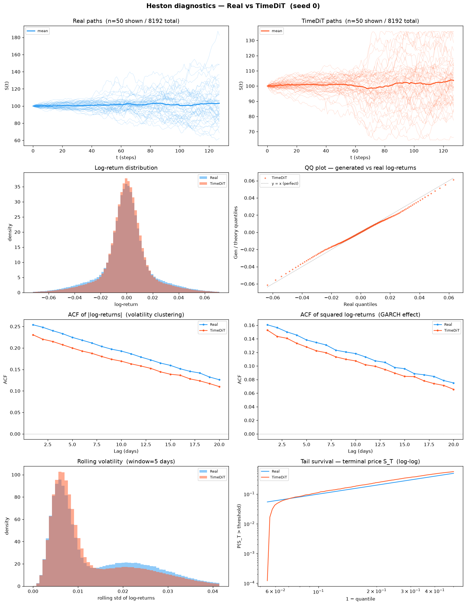
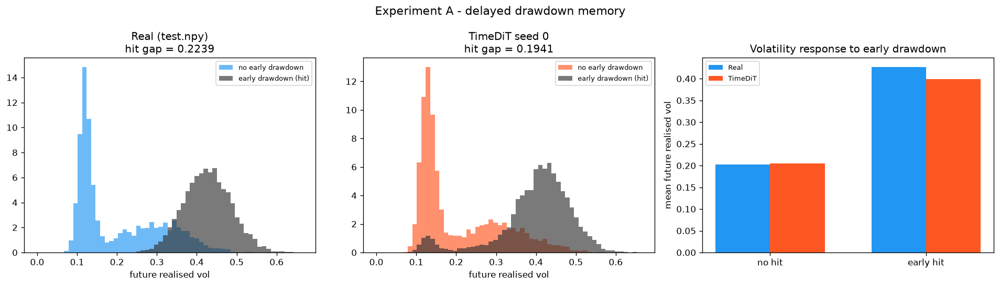

# Experiment A — Delayed Drawdown Memory: cross-method comparison

**3 methods · 5 seeds each · 8192 × 128 paths per seed · shared seeds 0–4 · A100-SXM4-80GB · 2026-08-01**

| | CSDI (Diffusion) | TimeDiT (Diffusion Transformer) | LS4 (VAE) |
|---|---|---|---|
| Source | `methods/CSDI` (released `base.yaml`) | `methods/TimeDiT/code` (**reimplementation** — no official release) | `methods/LS4` (released `solar_weekly` preset) |
| Trainable parameters | 412,945 | 32,463,745 | 2,146,857 |
| Training length | 200 epochs | 15,000 optimiser steps (logged as 150 blocks of 100) | 100 epochs |
| Training, mean per seed | 2387 s (2092–3290) | 5105 s (4776–6415) | 1643 s (959–2349) |
| Generation, mean per seed | 15.6 s (10.3–18.6) | 3071.8 s (2931.0–3624.6) | 9.1 s (8.5–10.6) |
| Preprocessing | affine standardization of raw prices | two-stage min-max then z-norm of raw prices | affine standardization of raw prices |
| Per-method README | [`CSDI/README.md`](CSDI/README.md) | [`TimeDiT/README.md`](TimeDiT/README.md) | [`LS4/README.md`](LS4/README.md) |

No method uses a log-return transform, a quantile map, or **path shadowing**. All three were
trained on `train.npy` only.

**TimeDiT's generation cost is three orders of magnitude above the other two, and that is a
property of the sampler, not of the hardware.** It draws with ancestral DDPM over the full
T = 1000 chain — 1000 sequential transformer forward passes per bank, no DDIM stride — so 3072 s
against CSDI's 15.6 s is the honest price of the configuration the paper specifies. It is
reported here because PDF §5 item 5 asks for generation time, and because a reader comparing
these three methods on a compute budget needs it before the accuracy columns.

**Verdict, one line: LS4 wins Experiment A, but the margin is much narrower than a two-method
table showed.** Across the protocol evaluator's *fidelity* metrics LS4 takes **6, TimeDiT none
and CSDI none**, with **10 ties**. A further 5 rows are raw diagnostics the PDF forbids scoring
(§4, §5) and 9 are constants rather than contests. On our own battery — a separate suite, not
the protocol's — A1–A34 goes LS4 30 / TimeDiT 2 / CSDI 2, and the curve-shape suite LS4 22 /
TimeDiT 9.

**Adding a third method moved seven PDF rows out of LS4's column, and no number changed.**
Before TimeDiT the tally on this page was LS4 13, CSDI 0, 3 ties. It is now LS4 6, 10 ties. The
cause is mechanical and is stated in full under *How `Winner` is decided* below: the winner is
gated on the paired 95 % interval between the **best and the runner-up**, and on those seven
rows TimeDiT — not CSDI — is now the runner-up, on an interval that straddles zero. The seven
are `errors.abs_return_acf_rmse_lags_1_50`, `errors.excess_kurtosis_error`,
`errors.future_rv_hit_gap_error`, `generated_memory.augmented_r2`,
`generated_memory.early_hit_future_rv_correlation`, `generated_memory.early_hit_rate` and
`generated_memory.future_rv_hit_gap`. **This is a real weakening of the earlier claim, not a
presentational choice.** "LS4 beats the field" was always shorthand for "LS4 beats the one other
method in the table"; with a second competitor present, seven of those thirteen wins turn out
not to survive the PDF's own consistency test.

**Neither CSDI nor TimeDiT wins a single contested fidelity metric in Experiment A.** An earlier
revision of this page reported "LS4 17, CSDI 1" and named `generated_memory.future_rv_no_hit_mean`
as CSDI's win. That row is a **group mean**, which PDF §5 lists among the raw diagnostics that
are not fidelity metrics and must not be winner-selected. Correcting it removed CSDI's only
entry from the column — a materially different claim about identical numbers.

**But no method solves the experiment.** On the four PRIMARY metrics the protocol PDF
designates, the best method is still 2.6× to 49× worse than a fresh draw from the true DGP. The
comparison below is between three failures of different magnitude, not between a success and a
failure.

---

## 1. PDF metrics — protocol evaluator

Produced by `dataset/Heston/new_experiments/protocol/experiments/scripts/evaluate_drawdown_memory.py`,
**run unchanged** (PDF §7, checklist item 7). Aggregation: mean ± sample std (ddof = 1) over
5 seeds.

**The paired interval exists here, and this is the only place in the whole tree where it can.**
PDF §5 requires the five seedwise differences and a paired interval *"for comparisons between
models run with aligned seeds"*. A method-vs-floor comparison cannot satisfy that — the floor is
five true-DGP draws at seeds 1000–1004, which have no correspondence to model seeds 0–4, so
`tools/aggregate_pdf_metrics.py` refuses to pair them. CSDI, TimeDiT and LS4 were all run on
seeds 0–4, so every model-vs-model difference **is** paired, and the `Mean diff` and
`Paired 95% CI` columns below are the PDF §5 quantity rather than a substitute for it. With
three methods there are three such comparisons, and all three are printed — CSDI vs TimeDiT,
CSDI vs LS4, TimeDiT vs LS4 — not only the pair that happens to decide a winner. §5 asks for the
interval "for comparisons between models run with aligned seeds", plural.

**Read the CI before the means.** A paired CI that contains zero means the two methods were not
consistently separated seed by seed, however far apart their averages look. Those rows are
reported as `tie` in the `Winner` column even where one mean is visibly smaller —
`errors.future_rv_hit_gap_error` is now the clearest example: TimeDiT's mean (0.0397687) is
*better* than LS4's (0.0503776), yet the paired difference is −0.010609 with a half-width of
±0.0179, so the row is a tie and nobody is credited with the win. Ten of the thirty PDF rows
fall this way, up from three when only two methods were in the table.

**How `Winner` is decided.** Not by "smaller number wins". Each metric is scored by distance to
its own reference: error/distance metrics reference 0; a `generated_memory.X` row references its
own `target_memory.X` row (the oracle's reading of `test.npy`). `target_memory.*` rows are
constants computed from `test.npy` alone, identical in every column, and get no winner at all.

**With three methods the gate is the best-vs-runner-up interval, and that choice has teeth.**
`make_comparison_tables.py` ranks the columns by distance to the reference, then looks up the
paired interval of the *top two* and declares a tie if it straddles zero
(`rank()` / `decide()`, lines 158–188). Gating on any other pair would be gating on a comparison
nobody is claiming. The consequence is that a method can lose a row it would have won in a
two-column table simply because a third method landed between it and the reference — which is
exactly what happened to LS4 on the seven rows named at the top of this page. **The tally is
therefore a property of the field, not of a method alone**, and this page states which field it
was computed over rather than quoting a bare score.

**Some rows are deliberately left unscored.** The PDF names a class of quantities that carry a
value but no direction, and forbids turning them into a contest:

- §4 — novelty "does not have a universal monotone 'better' direction and must not be combined
  with fidelity metrics into a score."
- §5 — "All displayed fidelity metrics are errors or distances, so lower is better, **except
  explicitly identified raw diagnostics such as standard-deviation ratio, posterior confidence,
  group means, and novelty.**"
- §3.3 — oracle posterior entropy, maximum probability and low-confidence fraction "are
  diagnostics, not separate winner-selection criteria."

Those rows print their values and the word `diagnostic` with the clause that exempts them, and
they are excluded from every tally on this page. In Experiment A that covers 5 rows:
`novelty.*` and `generated_memory.future_rv_{hit,no_hit}_mean`.

### 1.1 PRIMARY panel

The four metrics PDF §2 designates as primary, with each method's distance from the floor:

| Metric | CSDI | TimeDiT | LS4 | Perfect floor | × floor (CSDI / TimeDiT / LS4) | Winner |
|---|---|---|---|---|---|---|
| `early_hit_rate_error` | 0.161279 ± 0.0182 | 0.0871826 ± 0.0493 | **0.0081543 ± 0.00691** | 0.00310059 ± 0.00224 | 52× / 28× / **2.6×** | LS4 |
| `future_rv_hit_gap_error` | 0.0830031 ± 0.00635 | 0.0397687 ± 0.0143 | 0.0503776 ± 0.00241 | 0.00102294 ± 0.000516 | 81× / **39×** / 49× | *tie* |
| `early_history_incremental_r2_error` | 0.227474 ± 0.0151 | 0.169834 ± 0.0233 | **0.118178 ± 0.0154** | 0.00641167 ± 0.00544 | 35× / 26× / **18×** | LS4 |
| `future_rv_wasserstein` | 0.0576958 ± 0.00278 | 0.0360582 ± 0.0141 | **0.0119597 ± 0.00142** | 0.00123331 ± 0.00021 | 47× / 29× / **9.7×** | LS4 |

**LS4 no longer sweeps the primary panel: it takes three of four, and the fourth is a tie it
would have won against CSDI alone.** On `future_rv_hit_gap_error` TimeDiT's mean is the better
of the two (39× floor against LS4's 49×), but the seed-aligned paired difference is −0.010609
with a 95 % half-width of ±0.0179, so the row is undecided. Reporting the mean advantage without
the interval would turn an undecided row into a claimed TimeDiT victory; reporting the old
two-method table would turn it into a claimed LS4 victory. Neither is supported.

**TimeDiT is second on all four, and consistently so.** Its floor multiples (28×, 39×, 26×, 29×)
sit between CSDI's (52×, 81×, 35×, 47×) and LS4's (2.6×, 49×, 18×, 9.7×) on every row, and the
CSDI-vs-TimeDiT paired intervals exclude zero on all four. What it does *not* do is close the
gap on the metric that matters most: the one place any method comes close to the floor is LS4 on
`early_hit_rate_error` at 2.6×, and TimeDiT is ten times further out than that.

`future_rv_hit_gap_error` is the metric that resists everyone: 39× is the *best* result any of
the three achieves on it, and that metric is precisely the one that requires reading volatility
32 steps after its cause.

### 1.2 What actually separates them

**The one clean, fully ordered result on this page is how much of the delayed memory each method
encodes.** `generated_memory.early_history_incremental_r2` — the extra explanatory power the
first 32 steps carry about future realized volatility, which is the entire point of the DGP — is
0.0610 for CSDI, 0.1187 for TimeDiT and 0.1703 for LS4, against a target of 0.2885. That is
roughly a fifth, two fifths and three fifths of the structure respectively. **All three of the
consecutive paired intervals exclude zero** — CSDI vs TimeDiT −0.0576 against ±0.0329, TimeDiT vs
LS4 −0.0517 against ±0.0471, CSDI vs LS4 0.109 against ±0.0312 — so the ordering
CSDI < TimeDiT < LS4 is per-seed consistent at every step, not an artefact of averaging. It is
the only quantity in Experiment A where the three methods separate cleanly, and none of them
reaches even 60 % of the target.

**Scale did not buy the memory.** TimeDiT carries 32,463,745 trainable parameters against LS4's
2,146,857 — 15× more — and still recovers less of the delayed structure. Whatever is missing
here is not capacity.

**CSDI's banks sit measurably closer to the training set than a real DGP draw does.** This is
the one finding that is not a simple "LS4 is better". **It also has no winner column, here or
anywhere on this page.** PDF §4: these values "diagnose exact or near-exact memorization. They
do not have a universal monotone 'better' direction and must not be combined with fidelity
metrics into a score." The `Perfect floor` column below is a *reference point for reading the
numbers*, not a target to be scored against — being far from it is neither a win nor a loss,
it is a fact about the sample that the reader must interpret.

| Novelty metric (diagnostic — §4, not scored) | CSDI | TimeDiT | LS4 | Perfect floor |
|---|---|---|---|---|
| `distinct_nearest_training_paths` | 1266 ± 19.8 | 1528.6 ± 92.6 | 1596.4 ± 33.1 | 1600.8 ± 11.5 |
| `mean_standardized_nearest_train_path_rmse` | 0.804888 ± 0.0052 | 0.898962 ± 0.0752 | 0.949641 ± 0.00608 | 0.937306 ± 0.000826 |
| `median_standardized_nearest_train_path_rmse` | 0.840909 ± 0.0075 | 0.948006 ± 0.0682 | 0.988202 ± 0.00971 | 0.989367 ± 0.00106 |

LS4 is statistically indistinguishable from the floor on all three. CSDI's 8192 generated paths
collapse onto 1266 distinct training neighbours where a genuine DGP draw finds 1601, and they
sit 14 % nearer in standardized RMSE. **This is a concentration signature, not evidence of
memorisation** — no generated path is a copy of a training path — but it means CSDI's sample
diversity is lower than the data it was fit on, and any downstream use that depends on tail
coverage should account for it.

**TimeDiT sits between the two, and the honest reading is that only one of its three novelty
rows is separated from anything.** Its 1529 distinct neighbours and mean standardized RMSE of
0.899 are 4 % short of the floor rather than CSDI's 14 %, but its seed-to-seed spread is an order
of magnitude wider than either neighbour's (± 0.0752 against CSDI's ± 0.0052 and LS4's
± 0.00608), and that spread swallows the comparisons. Against LS4 all three paired differences
straddle zero (−67.8 against ±148, −0.0507 against ±0.0949, −0.0402 against ±0.0852); against
CSDI only `distinct_nearest_training_paths` is separated (−262.6 against ±128), while the two
RMSE rows straddle (−0.0941 against ±0.0976, −0.107 against ±0.0893). **So TimeDiT is not
demonstrably less concentrated than CSDI on the RMSE measures — it is merely not demonstrably
more so.** Reporting "TimeDiT is closer to the floor than CSDI" from the means alone would be
claiming a separation the seeds do not support. None of this is a win or a loss: PDF §4 forbids
scoring these rows, and the paired intervals are quoted here only to say how much of the visible
ordering is real.

**The one row where CSDI sits nearer the target is a group mean, and it is not a win.** On
`generated_memory.future_rv_no_hit_mean` (target 0.202984) CSDI reads 0.220232, TimeDiT 0.222251
and LS4 0.242114, so CSDI is nominally closest — though CSDI and TimeDiT are not separated from
each other at all (paired difference −0.00202 against a half-width of ±0.0413). PDF §5 lists
**group means** among the raw diagnostics that are *not* fidelity metrics, so the row carries
`diagnostic (§5 group mean)` in the table below and no `Winner`. **Reading it as a win would also
be wrong on the merits.** The companion row `generated_memory.future_rv_hit_mean` (target
0.426855) orders the other way — CSDI 0.361101, TimeDiT 0.406354, LS4 0.415608 — and the two
together say the same thing as `errors.future_rv_hit_gap_error`: CSDI compresses the distance
between the two regimes from both sides at once, reaching a gap of 0.1409 against a target of
0.2240 where TimeDiT reaches 0.1841 and LS4 0.1735. Landing nearer on the quiet-regime level is
a by-product of that compression, not better placement of it. This is exactly why the PDF
forbids scoring the two levels separately from the gap they define.

**On the gap itself TimeDiT is the closest of the three, and it still wins nothing.** 0.1841
against a target of 0.2240 beats LS4's 0.1735, but the paired difference (0.010609) is inside
its own half-width (±0.0179), so `generated_memory.future_rv_hit_gap` and its error twin
`errors.future_rv_hit_gap_error` are both scored `tie`. A reader who wants a single sentence on
the delayed-memory *magnitude* should take that tie at face value: after three methods and
fifteen runs, nothing in this table separates the best two on the quantity the experiment was
built to measure.

### 1.3 Full table

<!-- BEGIN GENERATED: experiment A table pdf -->
<table>
<tr><th rowspan="2">Metric</th><th>Diffusion</th><th>Diffusion Transformer</th><th>VAE</th><th rowspan="2">Perfect</th><th rowspan="2">Winner</th></tr>
<tr><th>CSDI</th><th>TimeDiT</th><th>LS4</th></tr>
<tr><td><code>errors.abs_return_acf_rmse_lags_1_50</code></td><td>0.0189235 ± 0.000518</td><td>0.0130564 ± 0.00532</td><td>0.0144903 ± 0.0024</td><td>0.00156102 ± 0.000141</td><td><i>tie</i></td></tr>
<tr><td><code>errors.early_history_incremental_r2_error</code></td><td>0.227474 ± 0.0151</td><td>0.169834 ± 0.0233</td><td><b>0.118178 ± 0.0154</b></td><td>0.00641167 ± 0.00544</td><td>LS4</td></tr>
<tr><td><code>errors.early_hit_rate_error</code></td><td>0.161279 ± 0.0182</td><td>0.0871826 ± 0.0493</td><td><b>0.0081543 ± 0.00691</b></td><td>0.00310059 ± 0.00224</td><td>LS4</td></tr>
<tr><td><code>errors.excess_kurtosis_error</code></td><td>0.59727 ± 0.0408</td><td>0.583825 ± 0.341</td><td>0.302096 ± 0.158</td><td>0.023094 ± 0.0118</td><td><i>tie</i></td></tr>
<tr><td><code>errors.future_rv_hit_gap_error</code></td><td>0.0830031 ± 0.00635</td><td>0.0397687 ± 0.0143</td><td>0.0503776 ± 0.00241</td><td>0.00102294 ± 0.000516</td><td><i>tie</i></td></tr>
<tr><td><code>errors.future_rv_wasserstein</code></td><td>0.0576958 ± 0.00278</td><td>0.0360582 ± 0.0141</td><td><b>0.0119597 ± 0.00142</b></td><td>0.00123331 ± 0.00021</td><td>LS4</td></tr>
<tr><td><code>errors.return_std_error</code></td><td>0.00290882 ± 0.000109</td><td>0.00140951 ± 0.000614</td><td><b>0.000202294 ± 0.00012</b></td><td>2.79631e-05 ± 1.44e-05</td><td>LS4</td></tr>
<tr><td><code>errors.squared_return_acf_rmse_lags_1_50</code></td><td>0.00867602 ± 0.00106</td><td>0.0105506 ± 0.00193</td><td>0.00776208 ± 0.00602</td><td>0.00161632 ± 0.000193</td><td><i>tie</i></td></tr>
<tr><td><code>errors.terminal_log_price_ks</code></td><td>0.0414307 ± 0.00992</td><td>0.0950684 ± 0.0271</td><td>0.0247803 ± 0.00912</td><td>0.0120117 ± 0.00319</td><td><i>tie</i></td></tr>
<tr><td><code>generated_memory.augmented_r2</code></td><td>0.453933 ± 0.0163</td><td>0.534224 ± 0.0468</td><td>0.548288 ± 0.0087</td><td>0.673625 ± 0.00375</td><td><i>tie</i></td></tr>
<tr><td><code>generated_memory.baseline_r2</code></td><td>0.392884 ± 0.00864</td><td>0.415535 ± 0.043</td><td>0.377943 ± 0.0139</td><td>0.380345 ± 0.00425</td><td><i>tie</i></td></tr>
<tr><td><code>generated_memory.early_history_incremental_r2</code></td><td>0.0610487 ± 0.0151</td><td>0.118689 ± 0.0233</td><td><b>0.170344 ± 0.0154</b></td><td>0.29328 ± 0.00726</td><td>LS4</td></tr>
<tr><td><code>generated_memory.early_hit_future_rv_correlation</code></td><td>0.57039 ± 0.0256</td><td>0.666913 ± 0.0331</td><td>0.695678 ± 0.0117</td><td>0.809204 ± 0.00274</td><td><i>tie</i></td></tr>
<tr><td><code>generated_memory.early_hit_rate</code></td><td>0.468359 ± 0.0182</td><td>0.573413 ± 0.0893</td><td>0.636279 ± 0.0087</td><td>0.626538 ± 0.00224</td><td><i>tie</i></td></tr>
<tr><td><code>generated_memory.early_hit_standardized_coefficient</code></td><td>0.614215 ± 0.0757</td><td>0.898544 ± 0.078</td><td><b>1.08214 ± 0.048</b></td><td>1.51798 ± 0.0125</td><td>LS4</td></tr>
<tr><td><code>generated_memory.future_rv_hit_gap</code></td><td>0.140868 ± 0.00635</td><td>0.184103 ± 0.0143</td><td>0.173494 ± 0.00241</td><td>0.223988 ± 0.00125</td><td><i>tie</i></td></tr>
<tr><td><code>generated_memory.future_rv_hit_mean</code></td><td>0.361101 ± 0.00224</td><td>0.406354 ± 0.0191</td><td>0.415608 ± 0.00299</td><td>0.427455 ± 0.000421</td><td><i>diagnostic (§5 group mean)</i></td></tr>
<tr><td><code>generated_memory.future_rv_no_hit_mean</code></td><td>0.220232 ± 0.00509</td><td>0.222251 ± 0.0283</td><td>0.242114 ± 0.000655</td><td>0.203467 ± 0.000875</td><td><i>diagnostic (§5 group mean)</i></td></tr>
<tr><td><code>novelty.distinct_nearest_training_paths</code></td><td>1266 ± 19.8</td><td>1528.6 ± 92.6</td><td>1596.4 ± 33.1</td><td>1600.8 ± 11.5</td><td><i>diagnostic (§4 novelty)</i></td></tr>
<tr><td><code>novelty.mean_standardized_nearest_train_path_rmse</code></td><td>0.804888 ± 0.0052</td><td>0.898962 ± 0.0752</td><td>0.949641 ± 0.00608</td><td>0.937306 ± 0.000826</td><td><i>diagnostic (§4 novelty)</i></td></tr>
<tr><td><code>novelty.median_standardized_nearest_train_path_rmse</code></td><td>0.840909 ± 0.0075</td><td>0.948006 ± 0.0682</td><td>0.988202 ± 0.00971</td><td>0.989367 ± 0.00106</td><td><i>diagnostic (§4 novelty)</i></td></tr>
<tr><td><code>target_memory.augmented_r2</code></td><td>0.67399 ± 0</td><td>0.67399 ± 0</td><td>0.67399 ± 0</td><td>0.67399 ± 0</td><td>—</td></tr>
<tr><td><code>target_memory.baseline_r2</code></td><td>0.385467 ± 0</td><td>0.385467 ± 0</td><td>0.385467 ± 0</td><td>0.385467 ± 0</td><td>—</td></tr>
<tr><td><code>target_memory.early_history_incremental_r2</code></td><td>0.288523 ± 0</td><td>0.288523 ± 0</td><td>0.288523 ± 0</td><td>0.288523 ± 0</td><td>—</td></tr>
<tr><td><code>target_memory.early_hit_future_rv_correlation</code></td><td>0.80836 ± 0</td><td>0.80836 ± 0</td><td>0.80836 ± 0</td><td>0.80836 ± 0</td><td>—</td></tr>
<tr><td><code>target_memory.early_hit_rate</code></td><td>0.629639 ± 0</td><td>0.629639 ± 0</td><td>0.629639 ± 0</td><td>0.629639 ± 0</td><td>—</td></tr>
<tr><td><code>target_memory.early_hit_standardized_coefficient</code></td><td>1.4987 ± 0</td><td>1.4987 ± 0</td><td>1.4987 ± 0</td><td>1.4987 ± 0</td><td>—</td></tr>
<tr><td><code>target_memory.future_rv_hit_gap</code></td><td>0.223872 ± 0</td><td>0.223872 ± 0</td><td>0.223872 ± 0</td><td>0.223872 ± 0</td><td>—</td></tr>
<tr><td><code>target_memory.future_rv_hit_mean</code></td><td>0.426855 ± 0</td><td>0.426855 ± 0</td><td>0.426855 ± 0</td><td>0.426855 ± 0</td><td>—</td></tr>
<tr><td><code>target_memory.future_rv_no_hit_mean</code></td><td>0.202984 ± 0</td><td>0.202984 ± 0</td><td>0.202984 ± 0</td><td>0.202984 ± 0</td><td>—</td></tr>
</table>

<p><b>Paired, aligned-seed: CSDI vs TimeDiT</b> (PDF §5, seedwise differences and paired 95% CI)</p>
<table>
<tr><th>Metric</th><th>Seedwise differences</th><th>Mean diff</th><th>Paired 95% CI</th></tr>
<tr><td><code>errors.abs_return_acf_rmse_lags_1_50</code></td><td>+0.01082, -0.001345, +0.008927, +0.002862, +0.008073</td><td>0.0058671 ± 0.00499</td><td>±0.0062</td></tr>
<tr><td><code>errors.early_history_incremental_r2_error</code></td><td>+0.09952, +0.05703, +0.05811, +0.02727, +0.04627</td><td>0.0576405 ± 0.0265</td><td>±0.0329</td></tr>
<tr><td><code>errors.early_hit_rate_error</code></td><td>+0.04126, +0.02673, +0.1639, +0.07776, +0.06079</td><td>0.0740967 ± 0.0538</td><td>±0.0668</td></tr>
<tr><td><code>errors.excess_kurtosis_error</code></td><td>-0.209, -0.2273, +0.508, +0.3103, -0.3148</td><td>0.0134458 ± 0.37</td><td>±0.459</td></tr>
<tr><td><code>errors.future_rv_hit_gap_error</code></td><td>+0.05732, +0.06461, +0.03071, +0.01975, +0.04378</td><td>0.0432344 ± 0.0185</td><td>±0.0229</td></tr>
<tr><td><code>errors.future_rv_wasserstein</code></td><td>+0.01883, +0.00913, +0.04754, +0.02423, +0.008449</td><td>0.0216376 ± 0.0159</td><td>±0.0198</td></tr>
<tr><td><code>errors.return_std_error</code></td><td>+0.001264, +0.001077, +0.002582, +0.001774, +0.0007987</td><td>0.0014993 ± 0.000702</td><td>±0.000872</td></tr>
<tr><td><code>errors.squared_return_acf_rmse_lags_1_50</code></td><td>-0.002882, -0.005378, +0.0016, -0.002974, +0.0002608</td><td>-0.00187463 ± 0.00279</td><td>±0.00346</td></tr>
<tr><td><code>errors.terminal_log_price_ks</code></td><td>-0.0509, -0.09778, -0.006592, -0.052, -0.06091</td><td>-0.0536377 ± 0.0325</td><td>±0.0403</td></tr>
<tr><td><code>generated_memory.augmented_r2</code></td><td>-0.1303, -0.1401, -0.04014, -0.003769, -0.08718</td><td>-0.0802914 ± 0.0583</td><td>±0.0724</td></tr>
<tr><td><code>generated_memory.baseline_r2</code></td><td>-0.03078, -0.08303, +0.01796, +0.0235, -0.04091</td><td>-0.0226509 ± 0.0442</td><td>±0.0549</td></tr>
<tr><td><code>generated_memory.early_history_incremental_r2</code></td><td>-0.09952, -0.05703, -0.05811, -0.02727, -0.04627</td><td>-0.0576405 ± 0.0265</td><td>±0.0329</td></tr>
<tr><td><code>generated_memory.early_hit_future_rv_correlation</code></td><td>-0.1426, -0.1389, -0.07131, -0.0229, -0.1069</td><td>-0.0965224 ± 0.0502</td><td>±0.0623</td></tr>
<tr><td><code>generated_memory.early_hit_rate</code></td><td>-0.04126, -0.02673, -0.1879, -0.2086, -0.06079</td><td>-0.105054 ± 0.0862</td><td>±0.107</td></tr>
<tr><td><code>generated_memory.early_hit_standardized_coefficient</code></td><td>-0.4057, -0.3023, -0.2865, -0.1802, -0.247</td><td>-0.284329 ± 0.0826</td><td>±0.103</td></tr>
<tr><td><code>generated_memory.future_rv_hit_gap</code></td><td>-0.05732, -0.06461, -0.03071, -0.01975, -0.04378</td><td>-0.0432344 ± 0.0185</td><td>±0.0229</td></tr>
<tr><td><code>generated_memory.future_rv_hit_mean</code></td><td>-0.04094, -0.03792, -0.05895, -0.06656, -0.0219</td><td>-0.0452531 ± 0.0177</td><td>±0.022</td></tr>
<tr><td><code>generated_memory.future_rv_no_hit_mean</code></td><td>+0.01639, +0.02669, -0.02824, -0.04681, +0.02189</td><td>-0.00201862 ± 0.0333</td><td>±0.0413</td></tr>
<tr><td><code>novelty.distinct_nearest_training_paths</code></td><td>-259, -175, -319, -404, -156</td><td>-262.6 ± 103</td><td>±128</td></tr>
<tr><td><code>novelty.mean_standardized_nearest_train_path_rmse</code></td><td>-0.04827, -0.03665, -0.1662, -0.1922, -0.02703</td><td>-0.094074 ± 0.0786</td><td>±0.0976</td></tr>
<tr><td><code>novelty.median_standardized_nearest_train_path_rmse</code></td><td>-0.06028, -0.06169, -0.1721, -0.1978, -0.04369</td><td>-0.107097 ± 0.072</td><td>±0.0893</td></tr>
<tr><td><code>target_memory.augmented_r2</code></td><td>+0, +0, +0, +0, +0</td><td>0 ± 0</td><td>±0</td></tr>
<tr><td><code>target_memory.baseline_r2</code></td><td>+0, +0, +0, +0, +0</td><td>0 ± 0</td><td>±0</td></tr>
<tr><td><code>target_memory.early_history_incremental_r2</code></td><td>+0, +0, +0, +0, +0</td><td>0 ± 0</td><td>±0</td></tr>
<tr><td><code>target_memory.early_hit_future_rv_correlation</code></td><td>+0, +0, +0, +0, +0</td><td>0 ± 0</td><td>±0</td></tr>
<tr><td><code>target_memory.early_hit_rate</code></td><td>+0, +0, +0, +0, +0</td><td>0 ± 0</td><td>±0</td></tr>
<tr><td><code>target_memory.early_hit_standardized_coefficient</code></td><td>+0, +0, +0, +0, +0</td><td>0 ± 0</td><td>±0</td></tr>
<tr><td><code>target_memory.future_rv_hit_gap</code></td><td>+0, +0, +0, +0, +0</td><td>0 ± 0</td><td>±0</td></tr>
<tr><td><code>target_memory.future_rv_hit_mean</code></td><td>+0, +0, +0, +0, +0</td><td>0 ± 0</td><td>±0</td></tr>
<tr><td><code>target_memory.future_rv_no_hit_mean</code></td><td>+0, +0, +0, +0, +0</td><td>0 ± 0</td><td>±0</td></tr>
</table>

<p><b>Paired, aligned-seed: CSDI vs LS4</b> (PDF §5, seedwise differences and paired 95% CI)</p>
<table>
<tr><th>Metric</th><th>Seedwise differences</th><th>Mean diff</th><th>Paired 95% CI</th></tr>
<tr><td><code>errors.abs_return_acf_rmse_lags_1_50</code></td><td>-8.005e-05, +0.006656, +0.007086, +0.003526, +0.004978</td><td>0.00443316 ± 0.00289</td><td>±0.00359</td></tr>
<tr><td><code>errors.early_history_incremental_r2_error</code></td><td>+0.09389, +0.1202, +0.1052, +0.08103, +0.1462</td><td>0.109296 ± 0.0252</td><td>±0.0312</td></tr>
<tr><td><code>errors.early_hit_rate_error</code></td><td>+0.1439, +0.1561, +0.1696, +0.1287, +0.1674</td><td>0.153125 ± 0.0171</td><td>±0.0212</td></tr>
<tr><td><code>errors.excess_kurtosis_error</code></td><td>-0.01828, +0.3813, +0.3317, +0.4804, +0.3007</td><td>0.295175 ± 0.188</td><td>±0.233</td></tr>
<tr><td><code>errors.future_rv_hit_gap_error</code></td><td>+0.0337, +0.0359, +0.02921, +0.02199, +0.04233</td><td>0.0326255 ± 0.0076</td><td>±0.00943</td></tr>
<tr><td><code>errors.future_rv_wasserstein</code></td><td>+0.04186, +0.0438, +0.04959, +0.04715, +0.04628</td><td>0.0457361 ± 0.003</td><td>±0.00372</td></tr>
<tr><td><code>errors.return_std_error</code></td><td>+0.002797, +0.00257, +0.002847, +0.002778, +0.002542</td><td>0.00270652 ± 0.00014</td><td>±0.000174</td></tr>
<tr><td><code>errors.squared_return_acf_rmse_lags_1_50</code></td><td>-0.01034, +0.00432, +0.006376, +0.0003482, +0.003862</td><td>0.000913942 ± 0.00665</td><td>±0.00826</td></tr>
<tr><td><code>errors.terminal_log_price_ks</code></td><td>-0.009521, +0.01501, +0.03601, +0.01196, +0.02979</td><td>0.0166504 ± 0.0177</td><td>±0.022</td></tr>
<tr><td><code>generated_memory.augmented_r2</code></td><td>-0.09516, -0.1102, -0.08462, -0.06908, -0.1127</td><td>-0.094355 ± 0.0182</td><td>±0.0226</td></tr>
<tr><td><code>generated_memory.baseline_r2</code></td><td>-0.001275, +0.01004, +0.02056, +0.01195, +0.03343</td><td>0.0149406 ± 0.0129</td><td>±0.0161</td></tr>
<tr><td><code>generated_memory.early_history_incremental_r2</code></td><td>-0.09389, -0.1202, -0.1052, -0.08103, -0.1462</td><td>-0.109296 ± 0.0252</td><td>±0.0312</td></tr>
<tr><td><code>generated_memory.early_hit_future_rv_correlation</code></td><td>-0.1213, -0.1443, -0.1154, -0.082, -0.1635</td><td>-0.125287 ± 0.0308</td><td>±0.0383</td></tr>
<tr><td><code>generated_memory.early_hit_rate</code></td><td>-0.1439, -0.1561, -0.1823, -0.1577, -0.1996</td><td>-0.16792 ± 0.0225</td><td>±0.0279</td></tr>
<tr><td><code>generated_memory.early_hit_standardized_coefficient</code></td><td>-0.4317, -0.5235, -0.4417, -0.3326, -0.6101</td><td>-0.46792 ± 0.104</td><td>±0.13</td></tr>
<tr><td><code>generated_memory.future_rv_hit_gap</code></td><td>-0.0337, -0.0359, -0.02921, -0.02199, -0.04233</td><td>-0.0326255 ± 0.0076</td><td>±0.00943</td></tr>
<tr><td><code>generated_memory.future_rv_hit_mean</code></td><td>-0.05304, -0.05382, -0.05456, -0.05097, -0.06015</td><td>-0.0545071 ± 0.00343</td><td>±0.00425</td></tr>
<tr><td><code>generated_memory.future_rv_no_hit_mean</code></td><td>-0.01934, -0.01792, -0.02535, -0.02898, -0.01782</td><td>-0.0218817 ± 0.00503</td><td>±0.00624</td></tr>
<tr><td><code>novelty.distinct_nearest_training_paths</code></td><td>-328, -306, -327, -313, -378</td><td>-330.4 ± 28.2</td><td>±35</td></tr>
<tr><td><code>novelty.mean_standardized_nearest_train_path_rmse</code></td><td>-0.1332, -0.1398, -0.1548, -0.1431, -0.1528</td><td>-0.144753 ± 0.00903</td><td>±0.0112</td></tr>
<tr><td><code>novelty.median_standardized_nearest_train_path_rmse</code></td><td>-0.1245, -0.145, -0.1605, -0.1478, -0.1587</td><td>-0.147293 ± 0.0144</td><td>±0.0179</td></tr>
<tr><td><code>target_memory.augmented_r2</code></td><td>+0, +0, +0, +0, +0</td><td>0 ± 0</td><td>±0</td></tr>
<tr><td><code>target_memory.baseline_r2</code></td><td>+0, +0, +0, +0, +0</td><td>0 ± 0</td><td>±0</td></tr>
<tr><td><code>target_memory.early_history_incremental_r2</code></td><td>+0, +0, +0, +0, +0</td><td>0 ± 0</td><td>±0</td></tr>
<tr><td><code>target_memory.early_hit_future_rv_correlation</code></td><td>+0, +0, +0, +0, +0</td><td>0 ± 0</td><td>±0</td></tr>
<tr><td><code>target_memory.early_hit_rate</code></td><td>+0, +0, +0, +0, +0</td><td>0 ± 0</td><td>±0</td></tr>
<tr><td><code>target_memory.early_hit_standardized_coefficient</code></td><td>+0, +0, +0, +0, +0</td><td>0 ± 0</td><td>±0</td></tr>
<tr><td><code>target_memory.future_rv_hit_gap</code></td><td>+0, +0, +0, +0, +0</td><td>0 ± 0</td><td>±0</td></tr>
<tr><td><code>target_memory.future_rv_hit_mean</code></td><td>+0, +0, +0, +0, +0</td><td>0 ± 0</td><td>±0</td></tr>
<tr><td><code>target_memory.future_rv_no_hit_mean</code></td><td>+0, +0, +0, +0, +0</td><td>0 ± 0</td><td>±0</td></tr>
</table>

<p><b>Paired, aligned-seed: TimeDiT vs LS4</b> (PDF §5, seedwise differences and paired 95% CI)</p>
<table>
<tr><th>Metric</th><th>Seedwise differences</th><th>Mean diff</th><th>Paired 95% CI</th></tr>
<tr><td><code>errors.abs_return_acf_rmse_lags_1_50</code></td><td>-0.0109, +0.008001, -0.001842, +0.0006638, -0.003095</td><td>-0.00143395 ± 0.00682</td><td>±0.00846</td></tr>
<tr><td><code>errors.early_history_incremental_r2_error</code></td><td>-0.005633, +0.06318, +0.04708, +0.05375, +0.0999</td><td>0.0516551 ± 0.038</td><td>±0.0471</td></tr>
<tr><td><code>errors.early_hit_rate_error</code></td><td>+0.1027, +0.1294, +0.005615, +0.0509, +0.1066</td><td>0.0790283 ± 0.0501</td><td>±0.0622</td></tr>
<tr><td><code>errors.excess_kurtosis_error</code></td><td>+0.1907, +0.6086, -0.1762, +0.1701, +0.6155</td><td>0.281729 ± 0.335</td><td>±0.416</td></tr>
<tr><td><code>errors.future_rv_hit_gap_error</code></td><td>-0.02362, -0.02871, -0.001496, +0.002239, -0.001455</td><td>-0.010609 ± 0.0144</td><td>±0.0179</td></tr>
<tr><td><code>errors.future_rv_wasserstein</code></td><td>+0.02302, +0.03467, +0.002047, +0.02292, +0.03784</td><td>0.0240985 ± 0.014</td><td>±0.0174</td></tr>
<tr><td><code>errors.return_std_error</code></td><td>+0.001532, +0.001492, +0.0002651, +0.001003, +0.001743</td><td>0.00120722 ± 0.000592</td><td>±0.000735</td></tr>
<tr><td><code>errors.squared_return_acf_rmse_lags_1_50</code></td><td>-0.007454, +0.009698, +0.004776, +0.003322, +0.003601</td><td>0.00278857 ± 0.00628</td><td>±0.00779</td></tr>
<tr><td><code>errors.terminal_log_price_ks</code></td><td>+0.04138, +0.1128, +0.0426, +0.06396, +0.0907</td><td>0.0702881 ± 0.0311</td><td>±0.0386</td></tr>
<tr><td><code>generated_memory.augmented_r2</code></td><td>+0.03514, +0.02989, -0.04448, -0.06531, -0.02556</td><td>-0.0140636 ± 0.0448</td><td>±0.0556</td></tr>
<tr><td><code>generated_memory.baseline_r2</code></td><td>+0.02951, +0.09307, +0.002598, -0.01155, +0.07433</td><td>0.0375916 ± 0.0451</td><td>±0.056</td></tr>
<tr><td><code>generated_memory.early_history_incremental_r2</code></td><td>+0.005633, -0.06318, -0.04708, -0.05375, -0.0999</td><td>-0.0516551 ± 0.038</td><td>±0.0471</td></tr>
<tr><td><code>generated_memory.early_hit_future_rv_correlation</code></td><td>+0.02136, -0.005385, -0.04413, -0.0591, -0.05657</td><td>-0.028765 ± 0.0353</td><td>±0.0438</td></tr>
<tr><td><code>generated_memory.early_hit_rate</code></td><td>-0.1027, -0.1294, +0.005615, +0.0509, -0.1388</td><td>-0.0628662 ± 0.0857</td><td>±0.106</td></tr>
<tr><td><code>generated_memory.early_hit_standardized_coefficient</code></td><td>-0.02595, -0.2212, -0.1552, -0.1525, -0.3631</td><td>-0.183591 ± 0.123</td><td>±0.152</td></tr>
<tr><td><code>generated_memory.future_rv_hit_gap</code></td><td>+0.02362, +0.02871, +0.001496, -0.002239, +0.001455</td><td>0.010609 ± 0.0144</td><td>±0.0179</td></tr>
<tr><td><code>generated_memory.future_rv_hit_mean</code></td><td>-0.01211, -0.0159, +0.004389, +0.01559, -0.03825</td><td>-0.00925408 ± 0.0206</td><td>±0.0256</td></tr>
<tr><td><code>generated_memory.future_rv_no_hit_mean</code></td><td>-0.03573, -0.04461, +0.002892, +0.01783, -0.0397</td><td>-0.0198631 ± 0.0283</td><td>±0.0351</td></tr>
<tr><td><code>novelty.distinct_nearest_training_paths</code></td><td>-69, -131, -8, +91, -222</td><td>-67.8 ± 119</td><td>±148</td></tr>
<tr><td><code>novelty.mean_standardized_nearest_train_path_rmse</code></td><td>-0.08496, -0.1032, +0.01139, +0.04913, -0.1258</td><td>-0.0506789 ± 0.0765</td><td>±0.0949</td></tr>
<tr><td><code>novelty.median_standardized_nearest_train_path_rmse</code></td><td>-0.0642, -0.08328, +0.0116, +0.04995, -0.1151</td><td>-0.0401958 ± 0.0686</td><td>±0.0852</td></tr>
<tr><td><code>target_memory.augmented_r2</code></td><td>+0, +0, +0, +0, +0</td><td>0 ± 0</td><td>±0</td></tr>
<tr><td><code>target_memory.baseline_r2</code></td><td>+0, +0, +0, +0, +0</td><td>0 ± 0</td><td>±0</td></tr>
<tr><td><code>target_memory.early_history_incremental_r2</code></td><td>+0, +0, +0, +0, +0</td><td>0 ± 0</td><td>±0</td></tr>
<tr><td><code>target_memory.early_hit_future_rv_correlation</code></td><td>+0, +0, +0, +0, +0</td><td>0 ± 0</td><td>±0</td></tr>
<tr><td><code>target_memory.early_hit_rate</code></td><td>+0, +0, +0, +0, +0</td><td>0 ± 0</td><td>±0</td></tr>
<tr><td><code>target_memory.early_hit_standardized_coefficient</code></td><td>+0, +0, +0, +0, +0</td><td>0 ± 0</td><td>±0</td></tr>
<tr><td><code>target_memory.future_rv_hit_gap</code></td><td>+0, +0, +0, +0, +0</td><td>0 ± 0</td><td>±0</td></tr>
<tr><td><code>target_memory.future_rv_hit_mean</code></td><td>+0, +0, +0, +0, +0</td><td>0 ± 0</td><td>±0</td></tr>
<tr><td><code>target_memory.future_rv_no_hit_mean</code></td><td>+0, +0, +0, +0, +0</td><td>0 ± 0</td><td>±0</td></tr>
</table>
<!-- END GENERATED -->

*Reproduce:* `python tools/make_comparison_tables.py --experiment A --table pdf`
(mean diff and CI for one pair, e.g. `tools/aggregate_pdf_metrics.py --model-dir experiment_A/TimeDiT --paired-dir experiment_A/LS4`;
the generated block emits all three pairs).

---

## 2. A1–A34, cross-method comparison (mean ± std, 5 seeds)

The repo's standard battery. This is **context, not the verdict** — Section 1 is what the
protocol asks. Per-seed values are in each method's own README; this table is the aggregate.

No paired CI is available here: `make_metrics_tables.py` emits aggregates only, so `Winner`
compares means without a per-seed consistency test. Treat narrow gaps with suspicion
accordingly.

> **A1 is not usable on this experiment.** The perfect floor's kurtosis error is
> 0.0601 ± 0.0382 — a std more than half the mean — so a method scoring "close to floor" on A1
> is inside the floor's own noise. A2–A4 (tail quantiles and tail QQ) are the stable tail
> statistics; read those instead.

<!-- BEGIN GENERATED: experiment A table A -->
<table>
<tr><th rowspan="2">Metric</th><th>Diffusion</th><th>Diffusion Transformer</th><th>VAE</th><th rowspan="2">Perfect</th><th rowspan="2">Winner</th></tr>
<tr><th>CSDI</th><th>TimeDiT</th><th>LS4</th></tr>
<tr><td colspan="6"><b>Fat Tail</b></td></tr>
<tr><td>A1 Kurtosis Error ↓</td><td>0.674298 ± 0.078</td><td>0.555029 ± 0.143</td><td><b>0.202463 ± 0.11</b></td><td>0.0601011 ± 0.0382</td><td>LS4</td></tr>
<tr><td>A2 |r| q95 Error ↓</td><td>0.00619595 ± 0.000208</td><td>0.00272194 ± 0.00134</td><td><b>0.000373524 ± 0.000359</b></td><td>6.48561e-05 ± 4.46e-05</td><td>LS4</td></tr>
<tr><td>A3 |r| q99 Error ↓</td><td>0.00782819 ± 0.000344</td><td>0.00255579 ± 0.00114</td><td><b>0.000270752 ± 0.000205</b></td><td>8.275e-05 ± 3.63e-05</td><td>LS4</td></tr>
<tr><td>A4 Tail QQ Error ↓</td><td>0.00611364 ± 0.000219</td><td>0.00276925 ± 0.00135</td><td><b>0.000474312 ± 0.000292</b></td><td>9.25658e-05 ± 4.42e-05</td><td>LS4</td></tr>
<tr><td>A5 Hill Tail Index Error ↓</td><td>1.73483 ± 0.327</td><td>17.4705 ± 6.84</td><td><b>0.182615 ± 0.106</b></td><td>0.407724 ± 0.315</td><td>LS4</td></tr>
<tr><td colspan="6"><b>Distribution</b></td></tr>
<tr><td>A6 Path MMD² ↓</td><td>0.00263734 ± 0.000233</td><td>0.00466729 ± 0.0018</td><td><b>0.00199709 ± 0.000231</b></td><td>0.00177285 ± 5.64e-05</td><td>LS4</td></tr>
<tr><td>A7 Terminal MMD² ↓</td><td>0.002392 ± 0.000891</td><td>0.00782351 ± 0.00284</td><td><b>0.00232808 ± 0.00111</b></td><td>0.00170387 ± 0.000258</td><td>LS4</td></tr>
<tr><td>A8 Increment MMD² ↓</td><td>0.00411459 ± 0.000585</td><td>0.00238075 ± 0.000841</td><td><b>0.00131215 ± 0.000165</b></td><td>0.00107654 ± 6.13e-05</td><td>LS4</td></tr>
<tr><td>A9 Volatility MMD ↓</td><td>0.107136 ± 0.0104</td><td>0.0469776 ± 0.0207</td><td><b>0.0175338 ± 0.00182</b></td><td>0.0105444 ± 0.00044</td><td>LS4</td></tr>
<tr><td>A10 Terminal SWD ↓</td><td>1.84424 ± 0.393</td><td>4.86567 ± 1.3</td><td><b>1.5827 ± 0.657</b></td><td>1.02907 ± 0.185</td><td>LS4</td></tr>
<tr><td>A11 Path SWD ↓</td><td>0.878639 ± 0.0801</td><td>2.12743 ± 0.721</td><td><b>0.663082 ± 0.0887</b></td><td>0.542455 ± 0.0723</td><td>LS4</td></tr>
<tr><td>A12 RV Law Loss ↓</td><td>3.31151 ± 0.114</td><td>1.685 ± 0.692</td><td><b>0.40919 ± 0.0954</b></td><td>0.0622546 ± 0.0132</td><td>LS4</td></tr>
<tr><td>A13 Mean Path RMSE ↓</td><td>0.552904 ± 0.408</td><td>2.29139 ± 0.94</td><td><b>0.272603 ± 0.139</b></td><td>0.119593 ± 0.0243</td><td>LS4</td></tr>
<tr><td>A14 KS Log-returns ↓</td><td>0.0431914 ± 0.00206</td><td>0.0233992 ± 0.0104</td><td><b>0.0165854 ± 0.00143</b></td><td>0.00113131 ± 9.72e-05</td><td>LS4</td></tr>
<tr><td>A15 Skewness Error ↓</td><td><b>0.0112248 ± 0.00329</b></td><td>0.026669 ± 0.0215</td><td>0.0552681 ± 0.0347</td><td>0.00329532 ± 0.00104</td><td>CSDI</td></tr>
<tr><td>A16 QQ RMSE ↓</td><td>0.00288986 ± 0.000108</td><td>0.00157785 ± 0.00066</td><td><b>0.000604692 ± 5.22e-05</b></td><td>4.91034e-05 ± 8.54e-06</td><td>LS4</td></tr>
<tr><td>A17 Terminal KS ↓</td><td>0.0414307 ± 0.00992</td><td>0.0950684 ± 0.0271</td><td><b>0.0247803 ± 0.00912</b></td><td>0.0120117 ± 0.00319</td><td>LS4</td></tr>
<tr><td colspan="6"><b>Adversarial</b></td></tr>
<tr><td>A18 Discriminative (GRU) ↓</td><td>0.0141288 ± 0.022</td><td>0.0195608 ± 0.0288</td><td><b>0.0063776 ± 0.00256</b></td><td>0.0073542 ± 0.00565</td><td>LS4</td></tr>
<tr><td>A18 Discriminative (MLP) ↓</td><td>0.0097348 ± 0.00571</td><td>0.0355506 ± 0.034</td><td><b>0.004486 ± 0.00519</b></td><td>0.0042418 ± 0.00229</td><td>LS4</td></tr>
<tr><td colspan="6"><b>Predictive</b></td></tr>
<tr><td>A19 Predictive (GRU) ↓</td><td>0.046486 ± 1.86e-05</td><td>0.0464192 ± 1.17e-05</td><td><b>0.046411 ± 5.24e-06</b></td><td>0.0464168 ± 1.53e-05</td><td>LS4</td></tr>
<tr><td>A19 Predictive (MLP) ↓</td><td><b>0.0480262 ± 2.66e-05</b></td><td>0.0480478 ± 0.000135</td><td>0.0480982 ± 9.26e-05</td><td>0.048241 ± 0.00042</td><td>CSDI</td></tr>
<tr><td colspan="6"><b>Temporal</b></td></tr>
<tr><td>A20 Covariance Error ↓</td><td>86.5044 ± 18.1</td><td>123.954 ± 12.9</td><td><b>27.6665 ± 34.3</b></td><td>17.2826 ± 9.01</td><td>LS4</td></tr>
<tr><td>A21 ACF |r| ↓</td><td>0.0254815 ± 0.00207</td><td>0.0149725 ± 0.0055</td><td><b>0.00452511 ± 0.00146</b></td><td>0.00160018 ± 0.000752</td><td>LS4</td></tr>
<tr><td>A22 ACF r² ↓</td><td>0.0149441 ± 0.00108</td><td>0.00597493 ± 0.00183</td><td><b>0.00370279 ± 0.00165</b></td><td>0.00129902 ± 0.000643</td><td>LS4</td></tr>
<tr><td>A23 ACF lag-1 |r| Error ↓</td><td>0.0331209 ± 0.00344</td><td>0.0150014 ± 0.00636</td><td><b>0.00452018 ± 0.00243</b></td><td>0.00151053 ± 0.00114</td><td>LS4</td></tr>
<tr><td>A24 ACF lag-1 r² Error ↓</td><td>0.0236946 ± 0.00262</td><td><b>0.00530325 ± 0.0039</b></td><td>0.00675596 ± 0.00249</td><td>0.000984905 ± 0.000792</td><td>TimeDiT</td></tr>
<tr><td colspan="6"><b>Volatility</b></td></tr>
<tr><td>A25 Mean RMSE ↓</td><td>0.788538 ± 0.708</td><td>3.60318 ± 1.26</td><td><b>0.57019 ± 0.2</b></td><td>0.203377 ± 0.121</td><td>LS4</td></tr>
<tr><td>A26 Std Error ↓</td><td>0.278546 ± 0.00803</td><td>0.116302 ± 0.0478</td><td><b>0.0251112 ± 0.0159</b></td><td>0.00441299 ± 0.00239</td><td>LS4</td></tr>
<tr><td>A27 Log-return Std Error ↓</td><td>0.00290882 ± 0.000109</td><td>0.00140951 ± 0.000614</td><td><b>0.000202294 ± 0.00012</b></td><td>2.79631e-05 ± 1.44e-05</td><td>LS4</td></tr>
<tr><td>A28 Kurtosis Ratio → 1</td><td>0.819936 ± 0.0101</td><td>0.897165 ± 0.181</td><td><b>1.04109 ± 0.122</b></td><td>0.991589 ± 0.00428</td><td>LS4</td></tr>
<tr><td>A29 Sigma Mean Error ↓</td><td>0.0456726 ± 0.00186</td><td>0.0251964 ± 0.0103</td><td><b>0.00543401 ± 0.00202</b></td><td>0.000392072 ± 0.000269</td><td>LS4</td></tr>
<tr><td>A30 Vol Path RMSE ↓</td><td>1.30152 ± 0.21</td><td>1.20151 ± 0.238</td><td><b>0.327853 ± 0.251</b></td><td>0.190091 ± 0.0906</td><td>LS4</td></tr>
<tr><td>A31 Rolling Vol KS ↓</td><td>0.162503 ± 0.00249</td><td><b>0.064422 ± 0.0267</b></td><td>0.0691744 ± 0.00281</td><td>0.0019172 ± 0.000476</td><td>TimeDiT</td></tr>
<tr><td>A32 Vol-of-vol Error ↓</td><td>0.00118022 ± 7.13e-05</td><td>0.000583932 ± 0.000193</td><td><b>0.000305445 ± 3.72e-05</b></td><td>2.13612e-05 ± 1.1e-05</td><td>LS4</td></tr>
<tr><td colspan="6"><b>Heston-specific (dropped)</b></td></tr>
<tr><td>A33 Sigma Correlation (dropped)</td><td>n/a</td><td>n/a</td><td>n/a</td><td>n/a</td><td>—</td></tr>
<tr><td>A34 Sigma RMSE (dropped)</td><td>n/a</td><td>n/a</td><td>n/a</td><td>n/a</td><td>—</td></tr>
</table>
<!-- END GENERATED -->

*Reproduce:* `python tools/make_comparison_tables.py --experiment A --table A`

**Score: LS4 30, TimeDiT 2, CSDI 2, 2 dropped.** CSDI's two wins are A15 (skewness error,
0.0112248 against TimeDiT's 0.026669 and LS4's 0.0552681) and A19-MLP (predictive score,
0.0480262 vs 0.0480478 vs 0.0480982 — a spread confined to the fifth significant figure, which
is exactly the kind of margin the missing paired test would likely dissolve). TimeDiT's two are
A24 (ACF lag-1 r² error, 0.00530325 against LS4's 0.00675596) and A31 (rolling-volatility KS,
0.064422 against LS4's 0.0691744).

**Read all four of those wins as unresolved, not as wins.** In each case the margin over the
runner-up is smaller than the winner's own seed-to-seed standard deviation — A24's gap of
0.00145 against TimeDiT's ± 0.0039, A31's gap of 0.0048 against ± 0.0267 — and this table has no
paired interval to test them with. The four rows say only that no method is clearly ahead there.
The PDF-metric table in Section 1, which does have the interval, is where a claim of separation
can actually be made.

A33/A34 are dropped protocol-wide: they require the latent σ path, which the DGP exposes only
through `*_sigma.npy`, a file the information firewall forbids the generator side from reading.

---

## 3. Curve-shape metrics, cross-method comparison (mean ± std, 5 seeds)

Shape-of-the-curve measures: for each diagnostic plot, the MSE of the function and its first
and second derivatives, plus percentage error, NRMSE and the two CVaR levels.

<!-- BEGIN GENERATED: experiment A table B -->
<table>
<tr><th rowspan="2">Plot</th><th rowspan="2">Measure</th><th>Diffusion</th><th>Diffusion Transformer</th><th>VAE</th><th rowspan="2">Perfect</th><th rowspan="2">Winner</th></tr>
<tr><th>CSDI</th><th>TimeDiT</th><th>LS4</th></tr>
<tr><td><b>Grid TVD (%)</b></td><td>—</td><td>561.8 ± 80.4</td><td>886.139 ± 323</td><td><b>217.113 ± 29</b></td><td>155.077 ± 11.9</td><td>LS4</td></tr>
<tr><td><b>Log-return histogram</b></td><td>MSE (funct/der/sec-der avg)</td><td>1.87864 ± 0.0788</td><td>0.361984 ± 0.27</td><td><b>0.360244 ± 0.0107</b></td><td>0.0545244 ± 0.0165</td><td>LS4</td></tr>
<tr><td></td><td>% error</td><td>113.208 ± 8.08</td><td>115.64 ± 24.7</td><td><b>107.839 ± 8.14</b></td><td>95.391 ± 10.9</td><td>LS4</td></tr>
<tr><td></td><td>NRMSE</td><td>16.6572 ± 0.266</td><td><b>10.691 ± 1.62</b></td><td>11.0789 ± 1.09</td><td>8.62821 ± 1.4</td><td>TimeDiT</td></tr>
<tr><td></td><td>CVaR₉₀</td><td>17.4322 ± 0.463</td><td><b>6.21235 ± 3.66</b></td><td>6.67777 ± 0.369</td><td>0.823273 ± 0.12</td><td>TimeDiT</td></tr>
<tr><td></td><td>CVaR₉₅</td><td>22.8937 ± 0.417</td><td><b>7.3418 ± 4.49</b></td><td>8.26687 ± 0.407</td><td>1.03955 ± 0.195</td><td>TimeDiT</td></tr>
<tr><td><b>QQ plot</b></td><td>MSE (funct/der/sec-der avg)</td><td>2.93394e-06 ± 2.23e-07</td><td>9.60858e-07 ± 6.39e-07</td><td><b>1.271e-07 ± 2.46e-08</b></td><td>1.70382e-09 ± 4.39e-10</td><td>LS4</td></tr>
<tr><td></td><td>% error</td><td>31.2204 ± 2.57</td><td>30.3332 ± 3.43</td><td><b>24.0374 ± 1.83</b></td><td>19.5871 ± 3.8</td><td>LS4</td></tr>
<tr><td></td><td>NRMSE</td><td>2.62797 ± 0.146</td><td>1.37567 ± 0.475</td><td><b>0.828455 ± 0.0966</b></td><td>0.311846 ± 0.0568</td><td>LS4</td></tr>
<tr><td></td><td>CVaR₉₀</td><td>5.0292 ± 0.19</td><td>2.64482 ± 1.04</td><td><b>0.802367 ± 0.0966</b></td><td>0.101555 ± 0.0197</td><td>LS4</td></tr>
<tr><td></td><td>CVaR₉₅</td><td>5.57556 ± 0.227</td><td>2.73888 ± 1.07</td><td><b>0.840247 ± 0.11</b></td><td>0.12425 ± 0.0237</td><td>LS4</td></tr>
<tr><td><b>ACF of |log-returns|</b></td><td>MSE (funct/der/sec-der avg)</td><td>0.000179114 ± 2.76e-05</td><td>9.513e-05 ± 5.29e-05</td><td><b>1.2571e-05 ± 3.1e-06</b></td><td>5.34639e-06 ± 2.22e-06</td><td>LS4</td></tr>
<tr><td></td><td>% error</td><td>207.99 ± 66.8</td><td>140.393 ± 46.8</td><td><b>136.929 ± 39.7</b></td><td>135.251 ± 51.9</td><td>LS4</td></tr>
<tr><td></td><td>NRMSE</td><td>61.9089 ± 13</td><td>42.4384 ± 6.23</td><td><b>37.3337 ± 5.55</b></td><td>37.6473 ± 9.58</td><td>LS4</td></tr>
<tr><td></td><td>CVaR₉₀</td><td>23.9138 ± 2.03</td><td>15.5215 ± 4.08</td><td><b>7.52395 ± 0.871</b></td><td>2.56508 ± 0.508</td><td>LS4</td></tr>
<tr><td></td><td>CVaR₉₅</td><td>26.3283 ± 2.74</td><td>16.1661 ± 4.03</td><td><b>8.06721 ± 0.891</b></td><td>2.70023 ± 0.475</td><td>LS4</td></tr>
<tr><td><b>ACF of squared log-returns</b></td><td>MSE (funct/der/sec-der avg)</td><td>5.76535e-05 ± 9.75e-06</td><td>3.15892e-05 ± 1.49e-05</td><td><b>1.50972e-05 ± 6.16e-06</b></td><td>6.27026e-06 ± 3.17e-06</td><td>LS4</td></tr>
<tr><td></td><td>% error</td><td>98.8259 ± 21</td><td>82.2368 ± 14.5</td><td><b>79.9839 ± 10.3</b></td><td>70.776 ± 18.9</td><td>LS4</td></tr>
<tr><td></td><td>NRMSE</td><td>59.1195 ± 10.6</td><td><b>46.3517 ± 4.8</b></td><td>46.975 ± 3.89</td><td>37.3861 ± 9.97</td><td>TimeDiT</td></tr>
<tr><td></td><td>CVaR₉₀</td><td>23.757 ± 2.03</td><td>13.4153 ± 3.89</td><td><b>8.37476 ± 3</b></td><td>3.86506 ± 0.764</td><td>LS4</td></tr>
<tr><td></td><td>CVaR₉₅</td><td>28.2766 ± 3.13</td><td>13.9709 ± 3.69</td><td><b>8.97683 ± 2.7</b></td><td>4.48217 ± 0.963</td><td>LS4</td></tr>
<tr><td><b>Rolling volatility histogram</b></td><td>MSE (funct/der/sec-der avg)</td><td>77.0595 ± 2.44</td><td><b>8.70707 ± 5.88</b></td><td>13.013 ± 1.01</td><td>0.363092 ± 0.0823</td><td>TimeDiT</td></tr>
<tr><td></td><td>% error</td><td>219.587 ± 21.8</td><td>188.778 ± 22.8</td><td><b>188.179 ± 26.9</b></td><td>194.499 ± 9.6</td><td>LS4</td></tr>
<tr><td></td><td>NRMSE</td><td>28.2051 ± 1.13</td><td><b>11.3753 ± 1.67</b></td><td>12.8265 ± 1.1</td><td>9.07535 ± 1.12</td><td>TimeDiT</td></tr>
<tr><td></td><td>CVaR₉₀</td><td>42.7545 ± 0.654</td><td><b>13.4623 ± 5.06</b></td><td>16.0333 ± 0.555</td><td>1.05297 ± 0.186</td><td>TimeDiT</td></tr>
<tr><td></td><td>CVaR₉₅</td><td>52.471 ± 0.862</td><td><b>15.5145 ± 6.22</b></td><td>18.4897 ± 0.639</td><td>1.33425 ± 0.317</td><td>TimeDiT</td></tr>
<tr><td><b>Tail survival</b></td><td>MSE (funct/der/sec-der avg)</td><td>0.00107587 ± 6.45e-05</td><td>0.000242073 ± 0.000197</td><td><b>0.000138794 ± 1.93e-05</b></td><td>1.41954e-07 ± 6.99e-08</td><td>LS4</td></tr>
<tr><td></td><td>% error</td><td>5348.12 ± 383</td><td><b>4312.4 ± 105</b></td><td>4795.13 ± 328</td><td>4094.07 ± 296</td><td>TimeDiT</td></tr>
<tr><td></td><td>NRMSE</td><td>71991.6 ± 1.94e+03</td><td>36736.5 ± 1.22e+04</td><td><b>34914.3 ± 1.15e+03</b></td><td>10677.2 ± 384</td><td>LS4</td></tr>
<tr><td></td><td>CVaR₉₀</td><td>8.3101 ± 0.236</td><td>3.71109 ± 1.69</td><td><b>3.16732 ± 0.196</b></td><td>0.115426 ± 0.0234</td><td>LS4</td></tr>
<tr><td></td><td>CVaR₉₅</td><td>8.35368 ± 0.235</td><td>3.73544 ± 1.69</td><td><b>3.18372 ± 0.195</b></td><td>0.122115 ± 0.0214</td><td>LS4</td></tr>
</table>
<!-- END GENERATED -->

*Reproduce:* `python tools/make_comparison_tables.py --experiment A --table B`

**Score: LS4 22, TimeDiT 9, CSDI 0.** This was the most one-sided of the three suites when only
CSDI and LS4 were in it (31–0), and it is where adding TimeDiT changes the picture most. CSDI
still takes nothing: its marginals are wrong in a way that shows up on every curve
simultaneously, exactly as Section 1.2 describes.

**TimeDiT's nine wins are not scattered — they concentrate on the volatility curves.** Four of
the five rolling-volatility-histogram rows go to it (MSE 8.70707 against LS4's 13.013, NRMSE
11.3753 against 12.8265, CVaR₉₀ 13.4623 against 16.0333, CVaR₉₅ 15.5145 against 18.4897; LS4
keeps only % error). Three more are the log-return histogram's dispersion rows (NRMSE, CVaR₉₀,
CVaR₉₅), and the last two are the squared-log-return ACF NRMSE and the tail-survival % error.
The pattern is coherent: TimeDiT places the *body* of the volatility distribution better than
LS4 does, and loses everywhere the metric is dominated by the shape of the tail or by the ACF
level rather than its spread.

**That advantage comes with a variance cost the mean hides.** Every one of those nine cells
carries a seed-to-seed standard deviation several times LS4's — 8.70707 ± 5.88 against
13.013 ± 1.01, 13.4623 ± 5.06 against 16.0333 ± 0.555 — so TimeDiT's better average is being
paid for with per-seed instability, and this suite has no paired interval to say whether the
ordering survives it. The same caution as Section 2 applies.

Note that all three methods are far from the floor on the tail-survival rows (NRMSE 71992,
36737 and 34914 against a floor of 10677) — the tail of this DGP is hard for everyone, the
floor itself scores 4094 % error there, and the percentage-error column on that row should not
be read as if 100 % were the reference.

---

## 4. Stylised curves

Each method's diagnostic panel, generated by `tools/plot_stylised_facts.py` from that method's
seed-0 bank against `test.npy`.

**CSDI (Diffusion)**


**TimeDiT (Diffusion Transformer)**



**LS4 (VAE)**


The memory structure the experiment actually targets — hit rate, the future-RV gap between hit
and no-hit paths, and the incremental R² of the early history — is plotted separately for each
method:

| CSDI | TimeDiT | LS4 |
|---|---|---|
|  |  |  |

Loss convergence and the per-seed PCA/t-SNE projections live under each method's `plots/` and
`losses/` directories.

---

## 5. Dataset description

The data-generating process is **not Heston**, despite the directory name. It is a latching
drawdown-memory volatility process defined in `dataset/Heston/new_experiments/protocol/`
(PDF §2):

```
memory_t = max(decay · memory_{t−1}, 1[drawdown_t ≥ 0.04]),   decay = exp(−ln2 / 60)
σ_t      = σ_low + (σ_high − σ_low) · memory_{t−32}            σ ∈ [0.12, 0.45]
```

Three properties make it hard, and all three are deliberate:

* **latching** — the drawdown indicator ratchets the memory state back to 1, so the state is not
  a smooth AR process and cannot be approximated by one;
* **a 32-step response delay** — the volatility reaction is decoupled in time from its cause, so
  a model matching contemporaneous correlations learns nothing about it;
* **half-life 60 > recent_window 20** — a model that reads only the last 20 steps *cannot*
  recover the signal, no matter how well it fits the marginals. This is why a method can score
  well on the standard battery and still fail Section 1.

### Files

| File | Shape | Who may read it |
|---|---|---|
| `train.npy` | 8192 × 128 | generators, evaluators |
| `disc.npy` | 8192 × 128 | validation only — model selection, early stopping |
| `test.npy` | 8192 × 128 | **evaluators only** |
| `*_sigma.npy` | 8192 × 128 | **evaluators only** — latent volatility path |

All banks are prices, float32, beginning at S₀ = 100.

**Information firewall.** The generator side of both methods reads `train.npy`, and `disc.npy`
for validation, and nothing else. It never opens `test.npy`, `*_sigma.npy`, `*_labels.npy`,
`oracle_*`, `oracle.joblib`, `gate_report.json`, or anything under `perfect_floor/`. This is the
condition that makes the perfect floor meaningful: the floor is what a *generator that knew the
DGP exactly* would score, and if the generator could see the test bank the comparison would be
vacuous.

**Perfect floor.** Five independent re-simulations of the true DGP at seeds 1000–1004, scored by
the same frozen evaluator. It is the best score any generator can achieve, and it is *not* zero,
because the evaluator compares two finite 8192-path samples. A method at 50× floor is 50× worse
than knowing the answer.

### 5.1 PDF §5 disclosure — what every comparison table must state

PDF §5 lists six items a comparison table is required to state. All six, for the tables in
Sections 1–3 of this page:

| # | §5 requirement | Value |
|---|---|---|
| 1 | Exact training, validation and test files | train `dataset/Heston/new_experiments/experiment_A/train.npy` · validation `…/experiment_A/disc.npy` · test `…/experiment_A/test.npy` (+ `test_sigma.npy`, evaluator-only). Floor: `…/experiment_A/perfect_floor/floor_seed100{0..4}.npy` |
| 2 | Generated bank size and all model seeds | 8192 × 128 per seed, one bank per seed, seeds **0, 1, 2, 3, 4** for all three methods (aligned — this is what makes the paired interval valid) |
| 3 | Official code, and its revision | **Two yes, one no.** CSDI `methods/CSDI` @ `4189d37`. LS4 `methods/LS4/code` @ `27df71e`, experiment wrapper `train_ls4_experiment.py` @ `ba7c748`. **TimeDiT has no official release**: `methods/TimeDiT/code` @ `1312f00` is ours, built on the basis `arXiv:2409.02322 App. C -- no official release; DiT-S backbone reimplemented from facebookresearch/DiT`. Recorded per bank in `generation_manifest.json → model.official_implementation / model.source_revision / model.reimplementation_basis` |
| 4 | Hyperparameters: defaults or validation-selected | **Neither was validation-selected on this dataset.** CSDI and LS4: `hyperparameter_origin = "official-default"` (released `base.yaml` and `solar_weekly` preset). TimeDiT has no released config, so its origin is `paper-reproduction-selected (Sine+Stocks HP search in methods/TimeDiT/paper_reimplementation; no tuning on Heston, train.npy or disc.npy)` — the search that fixed them was run on the paper's own Sine and Stocks datasets, before this protocol. In no method was a hyperparameter tuned on `disc.npy`; `disc.npy` was used only for early stopping / model selection |
| 5 | Trainable parameters, training time, generation time, hardware | CSDI 412,945 params, 2387 s train, 15.6 s generate per seed. TimeDiT 32,463,745 params, 5105 s train, 3071.8 s generate per seed. LS4 2,146,857 params, 1643 s train, 9.1 s generate per seed. Hardware: 1× A100-SXM4-80GB per run, 2× AMD EPYC 7763 host; 8 cores pinned per run for CSDI and LS4, 4 for TimeDiT, never more than 16 cores in total |
| 6 | Number and reason for failed runs | **Zero.** `failure_information.failed_or_unstable = false`, `first_nan_epoch = null`, `nan_in_bank = false` in all 15 manifests. No seed was replaced, retried or dropped (§1.5) |

Every cell above is read from the artefacts, not from prose: `python tools/check_pdf5_disclosure.py --experiment A`
re-derives items 3, 4 and 6 from the fifteen `generation_manifest.json` files and fails if this
table disagrees with them. It discovers the method directories on disk rather than from a fixed
list, so adding TimeDiT widened its coverage automatically instead of silently leaving the new
column unchecked.

---

## Layout

```
experiment_A/
├── README.md              ← this file (cross-method comparison)
├── CSDI/                  ← Diffusion             — full method README, banks, weights, losses, plots
├── TimeDiT/               ← Diffusion Transformer — full method README, banks, weights, losses, plots
├── LS4/                   ← VAE                   — full method README, banks, weights, losses, plots
└── perfect_floor/         ← 5 true-DGP re-simulations + their metrics
```

Every number in Sections 1–3 is generated from the artefacts by
`tools/make_comparison_tables.py`, which shells out to the same two producers the method
READMEs are checked against. Refresh the whole file after a re-run with:

```bash
python tools/make_comparison_tables.py --inject experiment_A/README.md
```

Protocol and conventions: [`../guideline_new_experiment.md`](../guideline_new_experiment.md).
Known ambiguities in the protocol PDF and the readings adopted:
[`../open_questions_to_protocol_author.md`](../open_questions_to_protocol_author.md).
