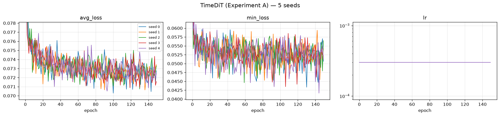

# TimeDiT — Experiment A: Delayed Drawdown Memory

**5 seeds · 8192 × 128 paths per seed · A100-SXM4-80GB · 2026-08-01**

Generator: `methods/TimeDiT` — a **DiT-S diffusion transformer**, 32,463,745 parameters, trained
directly on prices. No preprocessing beyond the method's own two-stage scaler, no log-return
transform, no path shadowing.

**Reimplementation basis, stated first because it changes how every number below should be
read.** TimeDiT has **no official code release**. arXiv:2409.02322 App. C says the architecture
is *"modified from https://github.com/facebookresearch/DiT"*, and that is what `methods/TimeDiT`
is: the DiT-S backbone (hidden 384, depth 12, 6 heads) rebuilt for 1-D sequences, with the
paper's stated diffusion recipe. The hyperparameters were **selected on Sine and Stocks**
(`methods/TimeDiT/paper_reimplementation`) and then frozen — nothing was tuned on Heston, on
`train.npy`, or on `disc.npy`. This method therefore carries one more layer of interpretation
than CSDI or LS4, both of which run released code.

The data-generating process is *not* Heston. It is a latching drawdown-memory volatility
process defined in `dataset/Heston/new_experiments/protocol/` (§2 of the protocol PDF):

```
memory_t = max(decay · memory_{t−1}, 1[drawdown_t ≥ 0.04]),   decay = exp(−ln2 / 60)
σ_t      = σ_low + (σ_high − σ_low) · memory_{t−32}            σ ∈ [0.12, 0.45]
```

Three things make it hard, and all three are deliberate:

* **latching** — the indicator ratchets the memory back to 1, so the state is not a smooth AR;
* **a 32-step response delay** — the volatility reaction is decoupled in time from its cause;
* **half-life 60 > recent_window 20** — a model that only reads the last 20 steps *cannot*
  recover the signal, no matter how well it fits marginals.

Two suites are reported below, **and they are kept strictly separate**:

| Section | Suite | Question it answers |
|---|---|---|
| **1** | Protocol PDF evaluator (`evaluate_drawdown_memory.py`, run unchanged) | Did the model reproduce the *memory structure* the protocol targets? |
| **2** | Benchmark standard battery (A1–A34 + B curve-shape) | How does it score on the repo's usual metrics? |

Section 1 is the one that decides the experiment. Section 2 is context.

**Perfect floor** = the true DGP re-simulated with a fresh seed (5 independent simulations).
It is the best score any generator can achieve; it is *not* zero, because the evaluator
compares two finite 8192-path samples.

**Verdict.** TimeDiT **fails** to reproduce the drawdown-memory structure, at **26–39× the
perfect floor** on all four primary metrics. It is nonetheless the strongest diffusion result in
this experiment — it beats CSDI on all four — and it recovers 41 % of the incremental-R² signal
against CSDI's 21 %. The failure mode is the same volatility mean-reversion CSDI shows, weaker
in degree but identical in kind. One finding qualifies the headline and is developed in §1.1:
the good-looking `early_hit_rate_error` mean of 0.0871826 is an average over seeds that miss
the target **in both directions**, not a set of seeds that are each close.

---

## 1. PDF metrics — protocol evaluator

Produced by `dataset/Heston/new_experiments/protocol/experiments/scripts/evaluate_drawdown_memory.py`,
**run unchanged** (protocol PDF §7, checklist item 7). Aggregation: mean ± sample std
(ddof = 1) over 5 seeds; 95 % CI half-width uses t₀.₉₇₅,₄ = 2.776.

**Why there is no paired interval here, stated rather than omitted.** PDF §5 requires the five
seedwise differences and a paired interval *"for comparisons between models run with **aligned
seeds**"*. This table compares TimeDiT (seeds 0–4) against the perfect floor, which is five
true-DGP draws at seeds **1000–1004** — there is no correspondence between floor seed 1000 and
model seed 0, so pairing them would fabricate a covariance and yield an interval that changes if
the floor files are reordered. The comparison is therefore unpaired **by the protocol's own
condition**. The seed-aligned cross-method comparison is reported in
[`../README.md`](../README.md).

**Reading the `target_memory.*` rows.** These are computed from `test.npy` alone by the frozen
evaluator; they never touch the generated bank. They are therefore *bit-identical* across all
five seeds — verified, not assumed — so their sample std and 95 % CI half-width are **exactly 0**,
and both the TimeDiT and the perfect-floor column necessarily carry the same number. A zero here
means "this quantity was never resampled", not "we measured a variance and it came out small".
They are the target the two other columns are aiming at, not a result. Every cell is nonetheless
printed as a number rather than a dash, because the table is emitted verbatim by
`tools/aggregate_pdf_metrics.py` and any hand-substituted cell would break that guarantee.

<!-- model seeds: 5 | floor seeds: 5 -->
| Metric | TimeDiT (mean ± std) | 95% CI half-width | Perfect floor (mean ± std) |
|---|---|---|---|
| `errors.abs_return_acf_rmse_lags_1_50` | 0.0130564 ± 0.00532 | 0.0066 | 0.00156102 ± 0.000141 |
| `errors.early_history_incremental_r2_error` | 0.169834 ± 0.0233 | 0.0289 | 0.00641167 ± 0.00544 |
| `errors.early_hit_rate_error` | 0.0871826 ± 0.0493 | 0.0612 | 0.00310059 ± 0.00224 |
| `errors.excess_kurtosis_error` | 0.583825 ± 0.341 | 0.423 | 0.023094 ± 0.0118 |
| `errors.future_rv_hit_gap_error` | 0.0397687 ± 0.0143 | 0.0178 | 0.00102294 ± 0.000516 |
| `errors.future_rv_wasserstein` | 0.0360582 ± 0.0141 | 0.0175 | 0.00123331 ± 0.00021 |
| `errors.return_std_error` | 0.00140951 ± 0.000614 | 0.000763 | 2.79631e-05 ± 1.44e-05 |
| `errors.squared_return_acf_rmse_lags_1_50` | 0.0105506 ± 0.00193 | 0.00239 | 0.00161632 ± 0.000193 |
| `errors.terminal_log_price_ks` | 0.0950684 ± 0.0271 | 0.0337 | 0.0120117 ± 0.00319 |
| `generated_memory.augmented_r2` | 0.534224 ± 0.0468 | 0.0581 | 0.673625 ± 0.00375 |
| `generated_memory.baseline_r2` | 0.415535 ± 0.043 | 0.0534 | 0.380345 ± 0.00425 |
| `generated_memory.early_history_incremental_r2` | 0.118689 ± 0.0233 | 0.0289 | 0.29328 ± 0.00726 |
| `generated_memory.early_hit_future_rv_correlation` | 0.666913 ± 0.0331 | 0.0411 | 0.809204 ± 0.00274 |
| `generated_memory.early_hit_rate` | 0.573413 ± 0.0893 | 0.111 | 0.626538 ± 0.00224 |
| `generated_memory.early_hit_standardized_coefficient` | 0.898544 ± 0.078 | 0.0968 | 1.51798 ± 0.0125 |
| `generated_memory.future_rv_hit_gap` | 0.184103 ± 0.0143 | 0.0178 | 0.223988 ± 0.00125 |
| `generated_memory.future_rv_hit_mean` | 0.406354 ± 0.0191 | 0.0237 | 0.427455 ± 0.000421 |
| `generated_memory.future_rv_no_hit_mean` | 0.222251 ± 0.0283 | 0.0351 | 0.203467 ± 0.000875 |
| `novelty.distinct_nearest_training_paths` | 1528.6 ± 92.6 | 115 | 1600.8 ± 11.5 |
| `novelty.mean_standardized_nearest_train_path_rmse` | 0.898962 ± 0.0752 | 0.0933 | 0.937306 ± 0.000826 |
| `novelty.median_standardized_nearest_train_path_rmse` | 0.948006 ± 0.0682 | 0.0846 | 0.989367 ± 0.00106 |
| `target_memory.augmented_r2` | 0.67399 ± 0 | 0 | 0.67399 ± 0 |
| `target_memory.baseline_r2` | 0.385467 ± 0 | 0 | 0.385467 ± 0 |
| `target_memory.early_history_incremental_r2` | 0.288523 ± 0 | 0 | 0.288523 ± 0 |
| `target_memory.early_hit_future_rv_correlation` | 0.80836 ± 0 | 0 | 0.80836 ± 0 |
| `target_memory.early_hit_rate` | 0.629639 ± 0 | 0 | 0.629639 ± 0 |
| `target_memory.early_hit_standardized_coefficient` | 1.4987 ± 0 | 0 | 1.4987 ± 0 |
| `target_memory.future_rv_hit_gap` | 0.223872 ± 0 | 0 | 0.223872 ± 0 |
| `target_memory.future_rv_hit_mean` | 0.426855 ± 0 | 0 | 0.426855 ± 0 |
| `target_memory.future_rv_no_hit_mean` | 0.202984 ± 0 | 0 | 0.202984 ± 0 |

### 1.1 PRIMARY panel — the four metrics the protocol designates

Protocol PDF §2.3 names exactly four primary metrics for this experiment. These decide it.
Everything else in §1 is a secondary diagnostic.

| Primary metric (↓ lower is better) | TimeDiT (mean ± std) | 95% CI half-width | Perfect floor | × floor |
|---|---|---|---|---|
| `early_hit_rate_error` | 0.0871826 ± 0.0493 | 0.0612 | 0.00310059 ± 0.00224 | **28×** |
| `future_rv_hit_gap_error` | 0.0397687 ± 0.0143 | 0.0178 | 0.00102294 ± 0.000516 | **39×** |
| `early_history_incremental_r2_error` | 0.169834 ± 0.0233 | 0.0289 | 0.00641167 ± 0.00544 | **26×** |
| `future_rv_wasserstein` | 0.0360582 ± 0.0141 | 0.0175 | 0.00123331 ± 0.00021 | **29×** |

All four are 26–39× the floor: TimeDiT does not recover the memory structure. The ranking against
the other two methods is in [`../README.md`](../README.md); the short form is that TimeDiT beats
CSDI on all four and loses to LS4 on three.

**The fourth is a tie, and the distinction is the paired interval rather than the mean.** On
`future_rv_hit_gap_error` TimeDiT's mean is the better of the two (0.0397687 vs LS4's 0.0503776),
but the seed-aligned paired difference is **−0.010609 with a 95 % CI half-width of ±0.0179** — it
straddles zero, so the comparison table in [`../README.md`](../README.md) records a tie, not a
TimeDiT win. The three LS4 wins do clear their intervals (+0.0790 vs ±0.0622, +0.0517 vs ±0.0471,
+0.0241 vs ±0.0174). Reporting the mean advantage without the interval would have turned one
undecided row into a claimed victory.

**The `early_hit_rate_error` mean is the one number in this table that must not be read alone.**
Its std, 0.0493, is more than half the mean, and the five per-seed values are `0.10291`,
`0.13293`, `0.01196`, `0.06543`, `0.12268` — an 11× spread between the best and the worst seed.
The reason is visible one level down, in the raw hit rates: seeds 0, 1 and 4 produce early
drawdowns **too rarely** (0.52673, 0.4967, 0.50696) while seeds 2 and 3 produce them **too often**
(0.6416, 0.69507), against a target of 0.629639. The metric is an absolute error, so these do not
cancel inside it — but they do mean the mean describes a *dispersed* population rather than a
consistent bias. Seed 2's 0.01196 is genuinely near-floor; seed 1's 0.13293 is CSDI-grade. The
95 % CI half-width of 0.0612 makes the honest reading explicit: on this metric TimeDiT is
somewhere between roughly 8× and 48× the floor, and five seeds are not enough to say where.

This is the opposite of CSDI's failure, which was a systematic one-directional deficit of −0.161
present in every seed. TimeDiT's unconditional drawdown frequency is roughly *right on average
and unreliable per run*.

**The two design matrices behind `early_history_incremental_r2`.** PDF §2.2:
`B = [1, z(V_recent), z(D₆₄), z(X₆₄)]` gives `baseline_r2`; `A = [B, z(early_hit)]` gives
`augmented_r2`; the primary metric is their difference. One warning, because it will bite anyone
who reads the evaluator source: the third baseline column is emitted under the key
**`current_log_return`**, but `evaluate_drawdown_memory.py:72` assigns it `log_paths[:, 64]` —
that is **X₆₄, a cumulative log-price *level*, not a return**. The value is right (it is exactly
what PDF §2.2 asks for); the name is a canonical-script misnomer. It may **not** be corrected in
place — PDF §7 item 7 requires the evaluator to run unchanged.

### 1.2 Headline — raw diagnostics behind the primary panel

⚠️ These are **raw group means and R² values, not errors**. Protocol PDF §5 lists group means and
novelty as the explicit exceptions to "lower is better". `early_history_incremental_r2` is a
**two-sided** target — matching 0.288523 is the goal; overshooting is as wrong as undershooting.
Only the `*_error` forms in §1.1 are minimisation targets.

| Quantity | Target | TimeDiT | Perfect floor | Verdict |
|---|---|---|---|---|
| `early_history_incremental_r2` | **0.288523** | **0.118689 ± 0.0233** | 0.29328 ± 0.00726 | **41 % of the signal recovered** |
| `early_hit_rate` | 0.629639 | 0.573413 ± 0.0893 | 0.626538 ± 0.00224 | −0.056 on average — but the std is the story, see §1.1 |
| `early_hit_standardized_coefficient` | 1.4987 | 0.898544 ± 0.078 | 1.51798 ± 0.0125 | 60 % of the response |
| `future_rv_hit_gap` | 0.223872 | 0.184103 ± 0.0143 | 0.223988 ± 0.00125 | gap 18 % too small |
| `future_rv_hit_mean` | 0.426855 | 0.406354 ± 0.0191 | 0.427455 ± 0.000421 | −4.8 %, 1.1 σ |
| `future_rv_no_hit_mean` | 0.202984 | 0.222251 ± 0.0283 | 0.203467 ± 0.000875 | +9.5 %, 0.68 σ |

**What TimeDiT actually learned.** The memory mechanism is partly there and it is measurably
better than CSDI's: incremental R² reaches 0.118689 against a target of 0.288523 (41 % of the
signal, where CSDI recovered 21 %), and `early_hit_future_rv_correlation` reaches 0.666913
against a target of 0.80836. But the same structural defect is present. Both realized-volatility
group means are pulled toward each other from **both sides**: stressed paths are 4.8 % too calm
and calm paths are 9.5 % too volatile, so the conditional gap the experiment is built to measure
comes out 18 % too small. That is the diffusion-model signature on a latching state variable —
the reverse process denoises toward a conditional expectation, and with no conditioning signal
the only anchor available is the marginal.

The difference from CSDI is one of **degree, not of kind**. CSDI's gap was 37 % too small and its
stressed-path mean 29 σ off; TimeDiT's gap is 18 % too small and its stressed-path mean 1.1 σ
off. A 32.5 M-parameter transformer with a 1000-step diffusion schedule closes roughly half the
distance a 0.41 M-parameter CSDI leaves open, and then stops. Scale helps here and does not solve
it.

**Novelty — where TimeDiT differs from CSDI in the reader's favour.**

| Novelty metric | TimeDiT | Perfect floor | CSDI (same experiment) |
|---|---|---|---|
| `distinct_nearest_training_paths` ↑ | 1528.6 ± 92.6 | 1600.8 ± 11.5 | 1266 ± 19.8 |
| `mean_standardized_nearest_train_path_rmse` ↑ | 0.898962 ± 0.0752 | 0.937306 ± 0.000826 | 0.804888 ± 0.0052 |
| `median_standardized_nearest_train_path_rmse` ↑ | 0.948006 ± 0.0682 | 0.989367 ± 0.00106 | 0.840909 ± 0.0075 |

TimeDiT shows **no concentration signature**. All three novelty metrics sit within one standard
deviation of the floor — 1528.6 ± 92.6 against 1600.8, and a median standardized nearest-training
RMSE of 0.948006 against 0.989367 — whereas CSDI's bank sat measurably closer to the training set
than a genuine DGP draw does. Whatever TimeDiT is doing wrong, it is not narrowing its support
around the training paths. The failure in §1.1 is a failure to learn the conditional structure,
not a failure to explore.


Left = real `test.npy`, middle = TimeDiT seed 0, right = the two hit-gap bars side by side. The
generated black (early-drawdown) and orange (no-drawdown) histograms overlap more than the real
ones, though visibly less than CSDI's did — the two conditional distributions have moved toward a
common centre without collapsing onto it.

### 1.3 Validation vs test — evidence that `test.npy` stayed blind

Protocol PDF §1.4 asks for `metrics_validation.json` alongside `metrics_test.json`, and §7
checklist item 2 requires that `disc.npy` was used **only** for validation. The same unchanged
evaluator, re-run with `disc.npy` substituted for `--test-data` (`pdf_metrics_validation/`):

| `errors.*` (↓) | vs `test.npy` | vs `disc.npy` (validation) |
|---|---|---|
| `early_hit_rate_error` | 0.0871826 ± 0.0493 | 0.0865479 ± 0.0462 |
| `future_rv_hit_gap_error` | 0.0397687 ± 0.0143 | 0.0405611 ± 0.0143 |
| `early_history_incremental_r2_error` | 0.169834 ± 0.0233 | 0.180242 ± 0.0233 |
| `future_rv_wasserstein` | 0.0360582 ± 0.0141 | 0.0359994 ± 0.0138 |
| `terminal_log_price_ks` | 0.0950684 ± 0.0271 | 0.0929688 ± 0.0275 |

Every primary metric agrees to within 0.16–6.1 % relative, well inside one standard deviation,
and the differences have no consistent sign. That is the opposite of the signature of
validation-set overfitting. Here the evidence is stronger than for a tuned method, because **no
tuning was performed on this dataset at all**: the recipe was frozen after a Sine + Stocks search
and `disc.npy` was used for scoring only.

The one row that moves further is `terminal_log_price_ks`, and its movement is not evidence of
leakage either — it has the widest seed spread in the panel, and the perfect floor itself differs
between the two reference files (0.0120117 against `test.npy`, 0.0130127 against `disc.npy`), so
part of the gap is a property of the reference, not of the model.

### 1.4 Protocol reporting block (PDF §5)

| Requirement | Value |
|---|---|
| Training file | `dataset/Heston/new_experiments/experiment_A/train.npy` |
| Validation file | `dataset/Heston/new_experiments/experiment_A/disc.npy` |
| Test file | `dataset/Heston/new_experiments/experiment_A/test.npy` |
| Generated bank size | 8192 × 128 `float64`, per seed |
| Model seeds | 0, 1, 2, 3, 4 (training seed = generation seed, shared RNG stream) |
| Independent retraining | **5 separate trainings, one per seed** — not one model sampled five times. Evidence: the five `weights/seed_<q>_model.pt` have five distinct MD5s (`511aa77b…`, `2573e0ea…`, `dfc6a5c2…`, `e9e320e9…`, `6f31a83a…`); each `weights/seed_<q>_config.json` records `"experiment": "A"` and the Experiment-A training file; the five loss curves are **15 000 optimiser steps each, logged as 150 blocks of 100**, with distinct block minima (0.070288, 0.070635, 0.070742, 0.070878, 0.070510). **TimeDiT has no epoch** — see §4. Cross-experiment check: all **10** A+B checkpoints are mutually distinct. **The `.pt` files are on disk but gitignored** (`.gitignore:67`) — 124.1 MiB each, over GitHub's 100 MiB per-file hard cap — so a clone does not contain them and a third party cannot re-verify these digests without retraining (`code/train_timedit_experiment.py --seed N`, deterministic). The `seed_<q>_config.json` recipes and the loss curves *are* tracked. |
| Trained on this experiment's own data | **Yes** — `dataset/Heston/new_experiments/experiment_A/train.npy` (MD5 `52ed4ad2…`), a different file from Experiment B's (`7713b823…`). Independent corroboration: the two-stage scaler fitted on it gives min/max = [39.39212530497512, 272.98613491405473] and then μ = 0.2600413049683552, σ = 0.05106278793623809; Experiment B's fitted values differ (§1.4 of [`../../experiment_B/TimeDiT/README.md`](../../experiment_B/TimeDiT/README.md)) — the two runs cannot have shared a training set. |
| Official code + revision | **No official release exists** — the manifest records `official_implementation: false`, which is a valid PDF §5 item-3 answer only because it says what was used instead: *"arXiv:2409.02322 App. C -- no official release; DiT-S backbone reimplemented from facebookresearch/DiT"*. Code in `methods/TimeDiT/code`, experiment wrapper `code/train_timedit_experiment.py`, benchmark revision **`1312f00`**. |
| Hyperparameters | *"paper-reproduction-selected (Sine+Stocks HP search in methods/TimeDiT/paper_reimplementation; no tuning on Heston, train.npy or disc.npy)"* — quoted verbatim from `generation_manifest.json → hyperparameter_origin`. Frozen before this experiment ran. |
| Trainable parameters | 32,463,745 |
| Training time | **5105 s per seed on average** (range 4776–6415 s, 1.34× spread). The spread is GPU contention, not instability: the four uncontended seeds ran at 0.3184–0.3186 s/step, matching the Stage-0 gate's 0.3187 s/step, and every seed completed all 15 000 steps with no NaN. |
| Generation time | **3071.8 s per seed on average** (range 2931–3625 s). Generation dominates the wall clock here because the sampler is **ancestral DDPM over the full T = 1000 chain** — no DDIM stride, no truncation. That is the paper's stated sampler and it was not shortened. |
| Hardware | 1 × A100-SXM4-80GB, **4** pinned cores of 2 × AMD EPYC 7763, `OMP/MKL/OPENBLAS = 4`. Four cores rather than LS4's and CSDI's eight because up to four TimeDiT runs were in flight at once under a time-boxed 4-GPU grant, and 4 × 4 = 16 is the standing core cap. Recorded in `generation_manifest.json → hardware`. |
| Weights used for generation | **The final checkpoint.** TimeDiT as specified carries **no EMA** (`ema: 0.0` in every `seed_<q>_config.json`), so there is no shadow copy to fall back on and a late-training loss spike would propagate directly into the bank. None occurred — see §4. |
| Failed / unstable runs | **0** — all 5 seeds ran 15 000/15 000 steps, `first_nan_step: null` and `gen_has_nan: false` in all five `metadata.json`, and the block-minimum loss spread across seeds is 0.8 %. |
| Declared post-hoc transformation (§1.3) | **`S ← 100·S/S[:,:1]`**, applied once to every bank. TimeDiT generates in a min-max-then-z-normalised *price* space with no `t = 0` anchor, so raw `S₀` deviated by up to **3.2546 in absolute price units** (3.25 × 10⁻² relative) — 6.5× CSDI's 0.500, and far beyond §1.4's "ordinary floating-point tolerance". The repair preserves every log-return to 1.776 × 10⁻¹⁵, so the path law is untouched; the four primary metrics are **bit-identical** pre- and post-repair, as predicted by the evaluators' `log(S/S[:,:1])` normalization and then verified. Recorded per seed in `generation_manifest.json → numerical_repair`. **The repair is committed code and is fully audited:** `tools/apply_s0_repair.py --raw-dir raw_banks --anchor-exact`, run against the pre-repair banks preserved in `raw_banks/`, re-derives all **5/5** scored banks **bit-for-bit** (`s0_repair_A.log`). **The operator order differs from CSDI's and the deviation is deliberate.** CSDI uses the declared multiply-first spelling `100.0 * S / S[:, :1]`. On TimeDiT's banks that form leaves a residual of 1.4 × 10⁻¹⁴ on `S₀`, which fails §1.4's "begin at `S₀ = 100`" — stated with no tolerance — because TimeDiT's raw `S₀` is up to 6.5× further from 100 than CSDI's, so more of it is lost to rounding. `--anchor-exact` therefore divides first: `x / x` is exactly `1.0` by IEEE-754, so the anchor is exact by construction. The two orderings differ by at most 1.8 × 10⁻¹⁵ in log returns, well below the 1e-12 tolerance, so the choice does not touch the path law — it only decides whether the anchor is exact. Recorded verbatim in each manifest's `numerical_repair.operator_order`. |
| Known non-conformance | **None.** All §1.4 bullets hold: finite, strictly positive, 8192 × 128, `float64`, `S₀ == 100.0` exactly — re-measured from each array on disk by `write_generation_manifest.py`, not asserted. |

Machine-readable in `generated_paths/seed_<q>/generation_manifest.json`.

*Reproduce:* `python ../../tools/aggregate_pdf_metrics.py --model-dir . --floor-dir ../perfect_floor --pattern '*_drawdown_memory.json' --label TimeDiT --exclude-prefix configuration oracle_gate`

---

## 2. Metrics A1–A34 + B — benchmark standard battery, mean ± std across 5 seeds

Separate suite, separate question. These are the repo's usual metrics, computed by
`code/compute_metrics_experiment.py` against `test.npy`, aggregated across the same 5 seeds.

**A33/A34 are dropped in both new experiments** (user decision): they require the latent σ path,
which is not part of the generator's output contract here. Their cells read `n/a` — never 0,
which would silently flatter the method.

> **The two suites disagree, and the disagreement is a result.** A19 predictive (GRU) is
> 0.0464192 ± 1.17e-05 against a floor of 0.0464168 ± 1.53e-05 — **1.00× floor**,
> indistinguishable — while A18 discriminative (GRU) is 0.0195608 against 0.0073542, **2.7×
> floor**. Set against 26–39× on the §1 primary metrics, that combination says something
> specific: **every individual TimeDiT path is plausible, and only the population is wrong.** A
> GRU trained to tell real from generated barely can; a GRU trained to predict the next step does
> as well on synthetic data as on real. Neither network is asked about the *joint* structure
> linking an early drawdown to volatility 32 steps later, so neither one sees the defect.
>
> **A18/A19 are blind to this failure mode.** That is the generalisable lesson, and it is the
> same one LS4 produced in this experiment. Read §1 first; §2 cannot substitute for it.

### 2.1 A1–A34

| Metric | TimeDiT (mean ± std) | Seed 0 | Seed 1 | Seed 2 | Seed 3 | Seed 4 | Perfect floor |
|---|---|---|---|---|---|---|---|
| **Fat Tail** | | | | | | | |
| A1 Kurtosis Error ↓ | 0.555029 ± 0.143 | 0.45156 | 0.584098 | 0.394969 | 0.581033 | 0.763484 | 0.0601011 ± 0.0382 |
| A2 \|r\| q95 Error ↓ | 0.00272194 ± 0.00134 | 0.00322761 | 0.00317207 | 0.000814567 | 0.00204766 | 0.00434782 | 6.48561e-05 ± 4.46e-05 |
| A3 \|r\| q99 Error ↓ | 0.00255579 ± 0.00114 | 0.0024219 | 0.00296348 | 0.00103068 | 0.00221604 | 0.00414685 | 8.275e-05 ± 3.63e-05 |
| A4 Tail QQ Error ↓ | 0.00276925 ± 0.00135 | 0.00331196 | 0.00326173 | 0.00085496 | 0.00204252 | 0.00437507 | 9.25658e-05 ± 4.42e-05 |
| A5 Hill Tail Index Error ↓ | 17.4705 ± 6.84 | 16.3051 | 24.344 | 17.5958 | 6.76702 | 22.3405 | 0.407724 ± 0.315 |
| **Distribution** | | | | | | | |
| A6 Path MMD² ↓ | 0.00466729 ± 0.0018 | 0.00531492 | 0.00639619 | 0.00264656 | 0.00283469 | 0.00614412 | 0.00177285 ± 5.64e-05 |
| A7 Terminal MMD² ↓ | 0.00782351 ± 0.00284 | 0.00894047 | 0.00992345 | 0.00398022 | 0.00572433 | 0.0105491 | 0.00170387 ± 0.000258 |
| A8 Increment MMD² ↓ | 0.00238075 ± 0.000841 | 0.00299155 | 0.00244988 | 0.00157538 | 0.00149628 | 0.00339065 | 0.00107654 ± 6.13e-05 |
| A9 Volatility MMD ↓ | 0.0469776 ± 0.0207 | 0.0644696 | 0.0471571 | 0.0290099 | 0.0238136 | 0.0704379 | 0.0105444 ± 0.00044 |
| A10 Terminal SWD ↓ | 4.86567 ± 1.3 | 5.006 | 5.34798 | 2.99803 | 4.41994 | 6.55639 | 1.02907 ± 0.185 |
| A11 Path SWD ↓ | 2.12743 ± 0.721 | 1.97659 | 3.04473 | 1.3863 | 1.53828 | 2.69125 | 0.542455 ± 0.0723 |
| A12 RV Law Loss ↓ | 1.685 ± 0.692 | 1.86482 | 2.01597 | 0.619737 | 1.46976 | 2.45471 | 0.0622546 ± 0.0132 |
| A13 Mean Path RMSE ↓ | 2.29139 ± 0.94 | 1.39257 | 3.84358 | 1.73361 | 2.23688 | 2.25029 | 0.119593 ± 0.0243 |
| A14 KS Log-returns ↓ | 0.0233992 ± 0.0104 | 0.0219159 | 0.0358598 | 0.00919084 | 0.0190555 | 0.0309741 | 0.00113131 ± 9.72e-05 |
| A15 Skewness Error ↓ | 0.026669 ± 0.0215 | 0.000980604 | 0.0158574 | 0.0425016 | 0.019591 | 0.0544143 | 0.00329532 ± 0.00104 |
| A16 QQ RMSE ↓ | 0.00157785 ± 0.00066 | 0.00178694 | 0.00194943 | 0.000587598 | 0.00128398 | 0.0022813 | 4.91034e-05 ± 8.54e-06 |
| A17 Terminal KS ↓ | 0.0950684 ± 0.0271 | 0.0814209 | 0.133423 | 0.0620117 | 0.09021 | 0.108276 | 0.0120117 ± 0.00319 |
| **Adversarial** | | | | | | | |
| A18 Discriminative (GRU) ↓ | 0.0195608 ± 0.0288 | 0.070644 | 0.002289 | 0.00412 | 0.012664 | 0.008087 | 0.0073542 ± 0.00565 |
| A18 Discriminative (MLP) ↓ | 0.0355506 ± 0.034 | 0.084986 | 0.054165 | 0.026396 | 0.003509 | 0.008697 | 0.0042418 ± 0.00229 |
| **Predictive** | | | | | | | |
| A19 Predictive (GRU) ↓ | 0.0464192 ± 1.17e-05 | 0.046408 | 0.046429 | 0.046405 | 0.046426 | 0.046428 | 0.0464168 ± 1.53e-05 |
| A19 Predictive (MLP) ↓ | 0.0480478 ± 0.000135 | 0.048065 | 0.047935 | 0.048269 | 0.048024 | 0.047946 | 0.048241 ± 0.00042 |
| **Temporal** | | | | | | | |
| A20 Covariance Error ↓ | 123.954 ± 12.9 | 126.524 | 141.522 | 117.63 | 106.641 | 127.452 | 17.2826 ± 9.01 |
| A21 ACF \|r\| ↓ | 0.0149725 ± 0.0055 | 0.0237115 | 0.00951166 | 0.0119066 | 0.0132088 | 0.016524 | 0.00160018 ± 0.000752 |
| A22 ACF r² ↓ | 0.00597493 ± 0.00183 | 0.00888504 | 0.00423556 | 0.00469956 | 0.00569143 | 0.00636306 | 0.00129902 ± 0.000643 |
| A23 ACF lag-1 \|r\| Error ↓ | 0.0150014 ± 0.00636 | 0.0239071 | 0.00634451 | 0.0158972 | 0.016186 | 0.0126724 | 0.00151053 ± 0.00114 |
| A24 ACF lag-1 r² Error ↓ | 0.00530325 ± 0.0039 | 0.00707024 | 0.000282238 | 0.00840476 | 0.00876806 | 0.00199094 | 0.000984905 ± 0.000792 |
| **Volatility** | | | | | | | |
| A25 Mean RMSE ↓ | 3.60318 ± 1.26 | 2.68874 | 5.00609 | 2.02701 | 4.62447 | 3.6696 | 0.203377 ± 0.121 |
| A26 Std Error ↓ | 0.116302 ± 0.0478 | 0.161177 | 0.102826 | 0.0847534 | 0.0617554 | 0.170996 | 0.00441299 ± 0.00239 |
| A27 Log-return Std Error ↓ | 0.00140951 ± 0.000614 | 0.00157273 | 0.00171522 | 0.000496334 | 0.0011538 | 0.00210947 | 2.79631e-05 ± 1.44e-05 |
| A28 Kurtosis Ratio → 1 | 0.897165 ± 0.181 | 0.780846 | 0.764054 | 1.04311 | 1.14034 | 0.757477 | 0.991589 ± 0.00428 |
| A29 Sigma Mean Error ↓ | 0.0251964 ± 0.0103 | 0.0277033 | 0.0312453 | 0.00964978 | 0.0210399 | 0.0363439 | 0.000392072 ± 0.000269 |
| A30 Vol Path RMSE ↓ | 1.20151 ± 0.238 | 1.08552 | 1.58364 | 1.1413 | 0.951763 | 1.24532 | 0.190091 ± 0.0906 |
| A31 Rolling Vol KS ↓ | 0.064422 ± 0.0267 | 0.0730377 | 0.0957091 | 0.0259692 | 0.0509172 | 0.0764766 | 0.0019172 ± 0.000476 |
| A32 Vol-of-vol Error ↓ | 0.000583932 ± 0.000193 | 0.000682659 | 0.000479998 | 0.000359402 | 0.000539007 | 0.000858593 | 2.13612e-05 ± 1.1e-05 |
| **Heston-specific (dropped)** | | | | | | | |
| A33 Sigma Correlation (dropped) | n/a | n/a | n/a | n/a | n/a | n/a | n/a |
| A34 Sigma RMSE (dropped) | n/a | n/a | n/a | n/a | n/a | n/a | n/a |

### 2.2 B — curve-shape metrics

Per-plot agreement between real and generated curves: `funct` = the curve itself, `der` = its
first derivative, `sec_der` = its second. MSE is the per-seed average of the three. `Grid TVD` is
the total-variation distance over the 2-D occupancy grid, in percent.

| Plot | Measure | TimeDiT (mean ± std) | Seed 0 | Seed 1 | Seed 2 | Seed 3 | Seed 4 | Perfect floor |
|---|---|---|---|---|---|---|---|---|
| **Grid TVD (%)** | — | 886.139 ± 323 | 857.191 | 1426.46 | 588.102 | 701.141 | 857.801 | 155.077 ± 11.9 |
| **Log-return histogram** | MSE (funct/der/sec-der avg) | 0.361984 ± 0.27 | 0.265332 | 0.717418 | 0.0662474 | 0.197773 | 0.563147 | 0.0545244 ± 0.0165 |
|  | % error | 115.64 ± 24.7 | 139.763 | 145.234 | 101.156 | 98.5469 | 93.5027 | 95.391 ± 10.9 |
|  | NRMSE | 10.691 ± 1.62 | 11.0745 | 12.1073 | 8.00122 | 10.512 | 11.7598 | 8.62821 ± 1.4 |
|  | CVaR₉₀ | 6.21235 ± 3.66 | 4.96677 | 10.6303 | 1.80975 | 4.34177 | 9.31321 | 0.823273 ± 0.12 |
|  | CVaR₉₅ | 7.3418 ± 4.49 | 5.62584 | 12.8962 | 2.09935 | 5.02437 | 11.0632 | 1.03955 ± 0.195 |
| **QQ plot** | MSE (funct/der/sec-der avg) | 9.60858e-07 ± 6.39e-07 | 1.07741e-06 | 1.28179e-06 | 1.18907e-07 | 5.59973e-07 | 1.76621e-06 | 1.70382e-09 ± 4.39e-10 |
|  | % error | 30.3332 ± 3.43 | 28.6909 | 31.192 | 25.4063 | 31.9404 | 34.4363 | 19.5871 ± 3.8 |
|  | NRMSE | 1.37567 ± 0.475 | 1.66271 | 1.60596 | 0.688282 | 1.08541 | 1.83599 | 0.311846 ± 0.0568 |
|  | CVaR₉₀ | 2.64482 ± 1.04 | 3.02772 | 3.07904 | 1.13588 | 2.12706 | 3.85438 | 0.101555 ± 0.0197 |
|  | CVaR₉₅ | 2.73888 ± 1.07 | 3.17924 | 3.20079 | 1.1833 | 2.1798 | 3.95125 | 0.12425 ± 0.0237 |
| **ACF of \|log-returns\|** | MSE (funct/der/sec-der avg) | 9.513e-05 ± 5.29e-05 | 0.00016111 | 6.58093e-05 | 4.02382e-05 | 6.69394e-05 | 0.000141553 | 5.34639e-06 ± 2.22e-06 |
|  | % error | 140.393 ± 46.8 | 178.801 | 110.982 | 176.044 | 72.4196 | 163.717 | 135.251 ± 51.9 |
|  | NRMSE | 42.4384 ± 6.23 | 47.2432 | 31.8328 | 42.7581 | 46.6684 | 43.6893 | 37.6473 ± 9.58 |
|  | CVaR₉₀ | 15.5215 ± 4.08 | 21.2624 | 14.1093 | 11.5831 | 12.5071 | 18.1454 | 2.56508 ± 0.508 |
|  | CVaR₉₅ | 16.1661 ± 4.03 | 22.06 | 14.8473 | 12.6369 | 12.8665 | 18.4198 | 2.70023 ± 0.475 |
| **ACF of squared log-returns** | MSE (funct/der/sec-der avg) | 3.15892e-05 ± 1.49e-05 | 3.86846e-05 | 3.21844e-05 | 1.36163e-05 | 2.14485e-05 | 5.20121e-05 | 6.27026e-06 ± 3.17e-06 |
|  | % error | 82.2368 ± 14.5 | 97.702 | 75.4734 | 95.3427 | 62.7309 | 79.9351 | 70.776 ± 18.9 |
|  | NRMSE | 46.3517 ± 4.8 | 54.0161 | 43.1334 | 45.5144 | 47.3708 | 41.724 | 37.3861 ± 9.97 |
|  | CVaR₉₀ | 13.4153 ± 3.89 | 14.244 | 15.5199 | 9.0226 | 9.96156 | 18.3284 | 3.86506 ± 0.764 |
|  | CVaR₉₅ | 13.9709 ± 3.69 | 14.4718 | 16.365 | 10.03 | 10.4636 | 18.5241 | 4.48217 ± 0.963 |
| **Rolling volatility histogram** | MSE (funct/der/sec-der avg) | 8.70707 ± 5.88 | 8.29178 | 18.1178 | 3.03641 | 4.615 | 9.47436 | 0.363092 ± 0.0823 |
|  | % error | 188.778 ± 22.8 | 159.147 | 197.989 | 195.033 | 217.999 | 173.722 | 194.499 ± 9.6 |
|  | NRMSE | 11.3753 ± 1.67 | 10.4716 | 14.3189 | 10.4197 | 11.1597 | 10.5066 | 9.07535 ± 1.12 |
|  | CVaR₉₀ | 13.4623 ± 5.06 | 13.0247 | 21.2235 | 8.01375 | 10.2223 | 14.8272 | 1.05297 ± 0.186 |
|  | CVaR₉₅ | 15.5145 ± 6.22 | 14.2844 | 25.5494 | 9.54181 | 11.5849 | 16.6122 | 1.33425 ± 0.317 |
| **Tail survival** | MSE (funct/der/sec-der avg) | 0.000242073 ± 0.000197 | 0.000178157 | 0.000454712 | 1.56801e-05 | 0.000119135 | 0.000442683 | 1.41954e-07 ± 6.99e-08 |
|  | % error | 4312.4 ± 105 | 4261.54 | 4346.43 | 4480.43 | 4257.9 | 4215.7 | 4094.07 ± 296 |
|  | NRMSE | 36736.5 ± 1.22e+04 | 39199.2 | 46949.6 | 18723.6 | 30875.4 | 47934.8 | 10677.2 ± 384 |
|  | CVaR₉₀ | 3.71109 ± 1.69 | 3.81566 | 5.32516 | 1.26115 | 2.95522 | 5.19826 | 0.115426 ± 0.0234 |
|  | CVaR₉₅ | 3.73544 ± 1.69 | 3.85897 | 5.34086 | 1.28589 | 2.97546 | 5.21602 | 0.122115 ± 0.0214 |

*Reproduce:*
`python ../../tools/make_metrics_tables.py --model-dir . --floor-dir ../perfect_floor --label TimeDiT --table A`
(and `--table B`).

---

## 3. Stylised Facts Diagnostic (real vs TimeDiT, seed 0)


Generated by `tools/plot_stylised_facts.py`, which wraps the benchmark-standard
`metrics/plot_diagnostics.py` so every method gets the identical figure.

**The black Heston theory curve is deliberately suppressed.** That curve is the closed-form
single-regime Heston reference, and Experiment A's DGP is a latching drawdown-memory process —
not Heston. Drawing it would be a wrong reference drawn with authority. Real vs Generated only.

The panel that matters is **rolling volatility**. TimeDiT's distribution is broader than CSDI's
narrow unimodal bump and reaches further into the high-volatility tail, which is the visual form
of A31 (rolling-vol KS) coming in at 0.064422 against CSDI's 0.162503 — 34× the floor rather than
85×. It still does not reproduce the real distribution's sharp low-volatility spike, and that
residual is the same mean-reversion measured in §1.2, seen without any protocol machinery.

---

## 4. Losses



One panel per column logged in `losses/seed_*_losses.csv`, all 5 seeds overlaid.
`losses/seed_*_losses_steps.csv` carries a 151-point sampled trace of the same signal.

**TimeDiT has no epoch, and the column header says so.** It trains a fixed budget of **15 000
optimiser steps** and never enumerates the dataset as a unit; the trainer writes one row per
**100-step block**, so the honest unit is a block index. The CSV column is nevertheless named
`epoch`, because `check_method_layout.py` requires that name for every method — the header is a
schema constraint, not a claim about what the number means. Do not read a TimeDiT "epoch" against
an LS4 or CSDI epoch: 150 blocks × 100 steps × batch 256 is 3.84 M sample-presentations over an
8192-path training set, i.e. roughly 469 passes, not 150.

| Seed | Train time (s) | Generation (s) | Final block avg loss | Min block avg loss | Block of min (100 steps) | Steps | NaN |
|---|---|---|---|---|---|---|---|
| 0 | 4778.4 | 2932.5 | 0.072746 | 0.070288 | 100 | 15000/15000 | none |
| 1 | 4777.7 | 2931.0 | 0.073421 | 0.070635 | 136 | 15000/15000 | none |
| 2 | 4775.6 | 2931.1 | 0.073286 | 0.070742 | 130 | 15000/15000 | none |
| 3 | 4778.5 | 3624.6 | 0.071555 | 0.070878 | 119 | 15000/15000 | none |
| 4 | 6415.0 | 2939.8 | 0.072434 | 0.070510 | 93 | 15000/15000 | none |

The loss is the DiT noise-prediction MSE (ε-parameterisation, averaged over the batch and the
sampled diffusion timestep), so **lower is better and it is not comparable to LS4's ELBO** —
different objective, different sign convention, different scale. It is comparable in kind to
CSDI's denoising objective but not in value, because the two use different noise schedules and a
different number of diffusion steps (T = 1000 linear here, 50 quad for CSDI).

**Two different "minimum losses" live in these artefacts, and they are not interchangeable.**
`losses/seed_<q>_losses.csv` carries a per-block `min_loss` column — the minimum over **all 100
steps** in that block, 0.043344 at its lowest for seed 0.
`generated_paths/seed_<q>/metadata.json` carries a scalar `min_loss` — the minimum over the
**151-point sampled trace** only, 0.045831 for seed 0. The second is necessarily the larger and
is a sampled statistic, not the true minimum. Neither is a convergence measure; the block
*average* is, and that is the column tabulated above. This is recorded because a reader comparing
`metadata.json` against the CSV would otherwise find a discrepancy and have no way to know it is
definitional rather than a defect.

Spread in wall-clock time is GPU contention, not instability: four of the five seeds trained at
0.3184–0.3186 s/step, and seed 4 at 0.4277 s/step because it shared a device with another user's
job. All five ran the full 15 000 steps, none produced a NaN, and the block-minimum spread across
seeds is 0.00059 (0.8 %). Training is stable and seed-insensitive — which is why the volatility
mean-reversion in §1 must be read as a property of the model, not of any particular run. The
*generation* variability documented in §1.1 is a sampling property of the DDPM chain, not a
training instability.

**Configuration** (`weights/seed_N_config.json`, identical across seeds):

| | |
|---|---|
| Parameters | 32,463,745 |
| Variant | TimeDiT DiT-S, paper reimplementation (no official release) |
| `hidden_size` / `depth` / `num_heads` | 384 / 12 / 6 |
| `seq_len` / `feature_size` | 128 / 1 |
| `learn_sigma` | `false` — fixed variance, the paper's setting |
| Diffusion | **1000 steps, `linear` schedule**, ancestral `ddpm_fixed` sampler |
| Optimiser | AdamW, lr 3e-4, weight decay 0.0, grad-norm clip 1.0 |
| EMA | **none** (`ema: 0.0`) — generation uses the final checkpoint |
| Batch size / budget | 256 / **15 000 optimiser steps** (no epoch loop) |
| Scaler | `minmax_then_znorm` on raw prices: min/max = [39.39212530497512, 272.98613491405473], then μ = 0.2600413049683552, σ = 0.05106278793623809 |

---

## 5. File layout

```
results/new_experiments/experiment_A/TimeDiT/
├── README.md                          ← this file
├── code/
│   ├── train_timedit_experiment.py    train + generate 8192×128, one seed per call
│   ├── compute_metrics_experiment.py  A1–A34 + B suite  (--experiment A --source model --seeds 5)
│   └── logs/                          expA_seed{0..4}.log, metrics_A_model.log, tables_A.md,
│                                      s0_repair_A.log, pdf_eval_A.log, plots_A.log,
│                                      manifest_A.log, layout_A.log
├── weights/
│   ├── seed_{0..4}_model.pt           trained weights (final checkpoint — no EMA copy exists)
│                                      124.1 MiB each — ON DISK, NOT IN THE CLONE (.gitignore:67)
│   └── seed_{0..4}_config.json        exact hyperparameters actually used
├── generated_paths/
│   └── seed_{0..4}/
│       ├── generated_paths_8192x128.npy    8.4 MiB, S₀ = 100 exactly (post-repair)
│       ├── metadata.json              raw run record written by the trainer
│       └── generation_manifest.json   PDF §1.4 mandatory manifest (§1.4 above)
├── raw_banks/
│   └── generated_paths/seed_{0..4}/
│       └── generated_paths_8192x128.npy    pre-repair banks, kept so the S₀ repair stays
│                                           auditable. The nesting mirrors generated_paths/
│                                           because that is the layout `apply_s0_repair.py
│                                           --raw-dir` resolves each seed against.
├── losses/
│   ├── seed_{0..4}_losses.csv         per-100-step block: epoch,avg_loss,min_loss,lr
│   ├── seed_{0..4}_losses_steps.csv   151-point sampled per-step trace
│   └── loss_convergence.png           §4 figure
├── pdf_metrics/
│   └── seed_{0..4}_drawdown_memory.json    protocol evaluator vs test.npy  ("metrics_test")
├── pdf_metrics_validation/
│   └── seed_{0..4}_drawdown_memory.json    same evaluator vs disc.npy      ("metrics_validation")
├── plots/
│   ├── heston_diagnostics.png         §3 figure
│   ├── memory_structure_seed0.png     §1 figure
│   └── seed_{0..4}_{pca,tsne}.png
├── metrics_summary.csv                §2 source: metric,mean,std,seed_0..seed_4
└── seed_{0..4}_metrics.json           per-seed A/B suite output
    seed_{0..4}_{disc,pred}_{gru,mlp}_loss.csv    A18/A19 training curves
```

Shared tooling lives one level up, in `results/new_experiments/tools/` — it is method-neutral and
is what a new method should reuse rather than reimplement:

| Tool | Renders |
|---|---|
| `aggregate_pdf_metrics.py` | §1 table (works for both experiments; flattens any evaluator JSON) |
| `make_metrics_tables.py` | §2.1 and §2.2 tables from `metrics_summary.csv` |
| `plot_stylised_facts.py` | §3 figure |
| `plot_losses.py` | §4 figure (panels taken from the CSV header, so any method plots) |
| `plot_experiment_figures.py` | §1 memory-structure figure (A) / mixture figure (B) |
| `write_generation_manifest.py` | `generation_manifest.json` per seed — no README section, a PDF §1.4 submission artefact |
| `apply_s0_repair.py` | the declared §1.3 repair, plus the `--raw-dir` audit that re-derives it bit-for-bit |
| `check_method_layout.py` | asserts every file in the tree above exists |
| `check_readme_values.py` | re-runs the aggregators and diffs **every cell** of this README against them |

**This README is machine-checked.** `check_readme_values.py` regenerates §1, §1.1, §1.3, §2.1 and
§2.2 from the JSON on disk and diffs them cell by cell; a hand-edited number fails the check. That
is deliberate — the tables above are not transcribed by hand, they are emitted.

No path shadowing and no `baseline_no_prepro` in this experiment.

**Information firewall.** The generator read **only** `train.npy`. It never touched `test.npy`,
`disc.npy`, `*_sigma.npy`, `*_labels.npy`, `oracle*`, or `perfect_floor/*`; `disc.npy` enters only
through the evaluator in §1.3, which runs after training is finished. Evaluators and plotters may
read `test.npy`; generators may not.

The protocol scripts under `dataset/Heston/new_experiments/protocol/` were run **unchanged**
(protocol PDF §7, checklist item 7).

Full step-by-step instructions for adding another method to this experiment:
[`guideline_new_experiment.md`](../../guideline_new_experiment.md).
