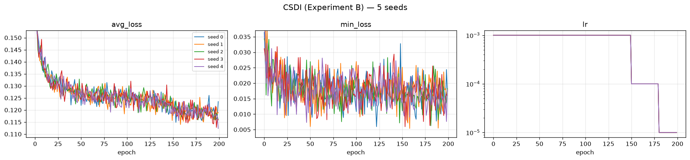

# CSDI — Experiment B: Heston Parameter Mixture

**5 seeds · 8192 × 128 paths per seed · A100-SXM4-80GB · 2026-07-31**

Generator: `methods/CSDI` (released `base.yaml`, run **unconditional**), 412,945 parameters,
trained directly on prices — **no preprocessing beyond a global standardizer, no log-return
transform, no path shadowing**. Identical architecture, identical hyperparameters, identical
wrapper as Experiment A; only the training data differs.

The DGP is an **equally-weighted 8-regime Heston mixture** (§3 of the protocol PDF). Each
path draws one regime uniformly, then follows Heston with that regime's parameters for all
128 steps — the regime never switches mid-path:

```
theta in {0.01, 0.09}   x   xi in {0.35, 1.10}   x   rho in {-0.99, +0.99}   =  8 regimes
kappa = 3,  mu = 0,  v0 = theta,  dt = 1/250,  S0 = 100,  T = 128
```

Exactly 1024 paths per regime per split. The difficulty is not any single Heston fit — it is
that the model must reproduce a **mixture**: eight distinct parameter settings in the right
proportions, including regimes that are numerically nasty. The Feller ratio `2*kappa*theta/xi^2`
ranges from **0.050** (theta = 0.01, xi = 1.10 — variance slams into zero constantly) to
**4.408** (theta = 0.09, xi = 0.35 — well-behaved). That 88-fold spread is the trap LS4 fell
into. CSDI fails differently, and §1.2 shows the difference is diagnostic rather than cosmetic.

Two suites are reported below, **and they are kept strictly separate**:

| Section | Suite | Question it answers |
|---|---|---|
| **1** | Protocol PDF evaluator (`evaluate_heston_parameter_mixture.py`, run unchanged) | Did the model reproduce the *mixture structure* the protocol targets? |
| **2** | Benchmark standard battery (A1–A34 + B curve-shape) | How does it score on the repo's usual metrics? |

Section 1 is the one that decides the experiment. Section 2 is context.

**Perfect floor** = the true DGP re-simulated with a fresh seed (5 independent simulations).
It is the best score any generator can achieve; it is *not* zero, because the evaluator
compares two finite 8192-path samples.

---

## 1. PDF metrics — protocol evaluator

Produced by `dataset/Heston/new_experiments/protocol/experiments/scripts/evaluate_heston_parameter_mixture.py`,
**run unchanged** (protocol PDF §7, checklist item 7). Aggregation: mean ± sample std
(ddof = 1) over 5 seeds; 95 % CI half-width uses t₀.₉₇₅,₄ = 2.776.

**Why there is no paired interval here, stated rather than omitted.** PDF §5 requires the five
seedwise differences and a paired interval *"for comparisons between models run with **aligned
seeds**"*. This table compares CSDI (seeds 0–4) against the perfect floor, which is five
true-DGP draws at seeds **1000–1004** — there is no correspondence between floor seed 1000 and
model seed 0, so pairing them would fabricate a covariance and yield an interval that changes
if the floor files are reordered. The comparison is therefore unpaired **by the protocol's own
condition**. The CSDI-vs-LS4 comparison *is* seed-aligned and is reported in
[`../README.md`](../README.md).

**Reading the `target_*` rows.** These are computed from `test.npy` alone by the frozen oracle;
they never touch the generated bank. Ten of the eleven are *bit-identical* across all five seeds
— verified, not assumed — so their sample std and 95 % CI half-width are **exactly 0**, and the
CSDI and perfect-floor columns necessarily carry the same number. A zero here means "this quantity
was never resampled", not "we measured a variance and it came out small". They are the target the
other columns aim at, not a result.

The eleventh, `target_low_confidence_fraction`, is **not** constant (5.46 × 10⁻⁵ std), and its
non-zero CI is left in the table deliberately rather than suppressed — see the measurement note at
the end of §1.4. This is exactly why no cell in this table is replaced by a dash: had the whole
`target_*` block been annotated by hand as "constant", that one real deviation would have been
erased.

**The oracle gate passed.** PDF §3.2 requires an ExtraTrees regime classifier (500 trees,
`min_samples_leaf=2`, `max_features=0.7`, `random_state=42`, 77 path features) to reach at
least **0.90** eight-regime accuracy on held-out data before any mixture metric may be
believed. Achieved: **0.909423828125** on 8192 validation paths — a margin of **+0.00942**
over the gate, i.e. 77 paths of 8192. Scoring below is therefore **valid**. Per-parameter state
accuracy: theta 0.9829, xi 0.9556, rho 0.9565. The gate block is excluded from the table
(identical in every file, it describes the oracle, not the model).

> ### ⚠️ The scoring instrument is a **locally refit** object, and its digest does not match
>
> **The mismatch, stated first.** PDF §6 pins `oracle.joblib` at `54c3f2c9…`. The copy on this
> machine is **`a36d64eb…`**. It does not match, and every mixture metric in this README —
> all eleven `mixture_fidelity.*` rows, the four PRIMARY metrics, `regime_proportion_tvd`,
> every `*_max_probability` and `*_low_confidence_fraction` — was produced by that local
> object, not by the PDF's.
>
> **Why.** A pickled `ExtraTreesClassifier` embeds scikit-learn and joblib version strings,
> pickle protocol, and per-object memory layout. It is not byte-reproducible across
> environments by construction, and no `random_state` fixes that. Environment here: numpy
> 2.4.6, scikit-learn 1.9.0, joblib 1.5.3, Python 3.12.3.
>
> **It is also not obtainable by cloning.** `oracle.joblib` is ~554 MB and is gitignored
> (`.gitignore:54`). Only `gate_report.json` is tracked. A third party must refit it.
>
> **The functional clearance, stated second.** `gate_report.json` matches the PDF's
> `7bd779b9…` **byte-for-byte** — including all 64 cells of the 8 × 8 confusion matrix over
> 8192 held-out paths, `eight_regime_accuracy = 0.909423828125`, and the three per-parameter
> accuracies. A different forest does not land on 64 identical integer cell counts on held-out
> data. The blob's bytes differ; the classifier does not.
>
> **This is the same oracle object that scored LS4.** The CSDI-vs-LS4 comparison in
> [`../README.md`](../README.md) is therefore instrument-consistent: whatever the digest
> mismatch means, it means the same thing for both methods and cannot explain a difference
> between them.
>
> **Refit command** (note `--workers 16`; the script's default of **24 exceeds this machine's
> 16-core cap**, and the worker count is also the knob behind the `low_confidence_fraction`
> jitter documented in §1.4 — pin it, always):
>
> ```bash
> cd dataset/Heston/new_experiments
> OMP_NUM_THREADS=16 taskset -c 0-15 python protocol/experiments/scripts/fit_heston_mixture_oracle.py \
>   --data-dir experiment_B --output-dir experiment_B/oracle --workers 16
> sha256sum experiment_B/oracle/gate_report.json   # must be 7bd779b9…
> ```

> ### ⚠️ Two gaps around the gate — a stale `oracle.joblib` is **not** evidence it passed
>
> **Gap 1 — artefacts survive a failed gate.** In
> `protocol/experiments/scripts/fit_heston_mixture_oracle.py`, the model is written at **line
> 79** and the report at **lines 80–83**, but the accuracy check that raises `RuntimeError` is
> at **lines 85–89** — *after* both writes. A fit that fails the gate therefore leaves a fully
> loadable `oracle.joblib` and a fully formed `gate_report.json` on disk, indistinguishable
> from a passing pair to anything downstream.
>
> **Gap 2 — the evaluator never re-checks.**
> `protocol/experiments/scripts/evaluate_heston_parameter_mixture.py:232` does
> `"oracle_gate": json.loads(args.oracle_gate_report.read_text(...))` — it copies the report
> into its output payload and asserts nothing about the accuracy. The gate is verified once,
> at fit time, in a different process, and never again.
>
> Neither script may be edited: PDF §7 item 7 requires them to run unchanged. So the check is
> external and **mandatory before every scoring run**. It was run as step 3 of the CSDI
> post-processing queue, before a single evaluator call:
>
> ```bash
> python ../../tools/check_oracle_gate.py \
>   --gate-report ../../../../dataset/Heston/new_experiments/experiment_B/oracle/gate_report.json \
>   --oracle      ../../../../dataset/Heston/new_experiments/experiment_B/oracle/oracle.joblib
> ```
>
> It asserts `eight_regime_accuracy ≥ 0.90`, re-derives the accuracy from the confusion
> matrix's trace (so a hand-edited accuracy field cannot pass), rejects a fit run with a laxer
> local `--minimum-accuracy`, and flags the Gap-1 state where the blob is newer than the
> report. Exit non-zero means **do not score**.

<!-- model seeds: 5 | floor seeds: 5 -->
| Metric | CSDI (mean ± std) | 95% CI half-width | Perfect floor (mean ± std) |
|---|---|---|---|
| `mixture_fidelity.generated_low_confidence_fraction` | 0.4104 ± 0.0102 | 0.0126 | 0.174683 ± 0.00361 |
| `mixture_fidelity.generated_mean_max_probability` | 0.641929 ± 0.00439 | 0.00545 | 0.792255 ± 0.00126 |
| `mixture_fidelity.generated_mean_posterior_entropy` | 0.911906 ± 0.0109 | 0.0136 | 0.600259 ± 0.00188 |
| `mixture_fidelity.generated_regime_proportions.0` | 0.296851 ± 0.01 | 0.0124 | 0.123315 ± 0.00119 |
| `mixture_fidelity.generated_regime_proportions.1` | 0.279663 ± 0.0114 | 0.0142 | 0.125098 ± 0.000986 |
| `mixture_fidelity.generated_regime_proportions.2` | 0.0312012 ± 0.00275 | 0.00341 | 0.118506 ± 0.00137 |
| `mixture_fidelity.generated_regime_proportions.3` | 0.0351074 ± 0.00172 | 0.00214 | 0.118774 ± 0.000707 |
| `mixture_fidelity.generated_regime_proportions.4` | 0.0773926 ± 0.00431 | 0.00535 | 0.135107 ± 0.00329 |
| `mixture_fidelity.generated_regime_proportions.5` | 0.073999 ± 0.00335 | 0.00416 | 0.13186 ± 0.00173 |
| `mixture_fidelity.generated_regime_proportions.6` | 0.0964844 ± 0.0103 | 0.0128 | 0.123413 ± 0.00377 |
| `mixture_fidelity.generated_regime_proportions.7` | 0.109302 ± 0.0086 | 0.0107 | 0.123926 ± 0.00261 |
| `mixture_fidelity.parameters.rho.mean_error` | 0.0226021 ± 0.0195 | 0.0242 | 0.00217876 ± 0.0024 |
| `mixture_fidelity.parameters.rho.q05_error` | 0.0099726 ± 0.00234 | 0.0029 | 0.0007326 ± 0.000494 |
| `mixture_fidelity.parameters.rho.q95_error` | 0.0144606 ± 0.00559 | 0.00693 | 0.000924 ± 0.000753 |
| `mixture_fidelity.parameters.rho.std_ratio` | 0.85191 ± 0.00828 | 0.0103 | 0.998133 ± 0.00167 |
| `mixture_fidelity.parameters.rho.support_normalized_wasserstein` | 0.0751098 ± 0.00394 | 0.00489 | 0.00293792 ± 0.00066 |
| `mixture_fidelity.parameters.rho.wasserstein` | 0.148717 ± 0.0078 | 0.00969 | 0.00581707 ± 0.00131 |
| `mixture_fidelity.parameters.theta.mean_error` | 0.0128947 ± 0.000916 | 0.00114 | 0.000118867 ± 8.97e-05 |
| `mixture_fidelity.parameters.theta.q05_error` | 3.46945e-19 ± 7.76e-19 | 9.63e-19 | 0 ± 0 |
| `mixture_fidelity.parameters.theta.q95_error` | 0.000837333 ± 2.39e-05 | 2.96e-05 | 2.77556e-18 ± 6.21e-18 |
| `mixture_fidelity.parameters.theta.std_ratio` | 0.8367 ± 0.00879 | 0.0109 | 0.999393 ± 0.00205 |
| `mixture_fidelity.parameters.theta.support_normalized_wasserstein` | 0.161236 ± 0.0114 | 0.0142 | 0.00237222 ± 0.000584 |
| `mixture_fidelity.parameters.theta.wasserstein` | 0.0128989 ± 0.000915 | 0.00114 | 0.000189777 ± 4.68e-05 |
| `mixture_fidelity.parameters.xi.mean_error` | 0.105508 ± 0.00579 | 0.00719 | 0.00209811 ± 0.00139 |
| `mixture_fidelity.parameters.xi.q05_error` | 0.0056275 ± 0.00102 | 0.00126 | 0.0001225 ± 0.000125 |
| `mixture_fidelity.parameters.xi.q95_error` | 0.0556775 ± 0.00377 | 0.00468 | 0.00025 ± 0.000177 |
| `mixture_fidelity.parameters.xi.std_ratio` | 0.677446 ± 0.00693 | 0.0086 | 1.00183 ± 0.000666 |
| `mixture_fidelity.parameters.xi.support_normalized_wasserstein` | 0.179548 ± 0.00443 | 0.00549 | 0.00360015 ± 0.00129 |
| `mixture_fidelity.parameters.xi.wasserstein` | 0.134661 ± 0.00332 | 0.00412 | 0.00270012 ± 0.000969 |
| `mixture_fidelity.regime_proportion_tvd` | 0.33042 ± 0.0143 | 0.0177 | 0.00847168 ± 0.00129 |
| `mixture_fidelity.target_low_confidence_fraction` | 0.171899 ± 5.46e-05 | 6.78e-05 | 0.171875 ± 0 |
| `mixture_fidelity.target_mean_max_probability` | 0.792163 ± 0 | 0 | 0.792163 ± 0 |
| `mixture_fidelity.target_mean_posterior_entropy` | 0.600794 ± 0 | 0 | 0.600794 ± 0 |
| `mixture_fidelity.target_regime_proportions.0` | 0.123169 ± 0 | 0 | 0.123169 ± 0 |
| `mixture_fidelity.target_regime_proportions.1` | 0.122925 ± 0 | 0 | 0.122925 ± 0 |
| `mixture_fidelity.target_regime_proportions.2` | 0.119629 ± 0 | 0 | 0.119629 ± 0 |
| `mixture_fidelity.target_regime_proportions.3` | 0.120361 ± 0 | 0 | 0.120361 ± 0 |
| `mixture_fidelity.target_regime_proportions.4` | 0.133057 ± 0 | 0 | 0.133057 ± 0 |
| `mixture_fidelity.target_regime_proportions.5` | 0.130249 ± 0 | 0 | 0.130249 ± 0 |
| `mixture_fidelity.target_regime_proportions.6` | 0.124268 ± 0 | 0 | 0.124268 ± 0 |
| `mixture_fidelity.target_regime_proportions.7` | 0.126343 ± 0 | 0 | 0.126343 ± 0 |
| `novelty.distinct_nearest_training_paths` | 2323.6 ± 41.2 | 51.1 | 2941.8 ± 24.5 |
| `novelty.mean_standardized_nearest_train_path_rmse` | 0.568307 ± 0.0122 | 0.0152 | 0.808363 ± 0.00181 |
| `novelty.median_standardized_nearest_train_path_rmse` | 0.470814 ± 0.018 | 0.0223 | 0.716746 ± 0.00338 |
| `observable_fidelity.abs_return_acf_rmse_lags_1_50` | 0.011025 ± 0.00362 | 0.00449 | 0.0034538 ± 0.00121 |
| `observable_fidelity.excess_kurtosis_error` | 2.55432 ± 0.737 | 0.915 | 0.143903 ± 0.185 |
| `observable_fidelity.leverage_curve_rmse_lags_0_20` | 0.0058035 ± 0.00238 | 0.00295 | 0.00389969 ± 0.000993 |
| `observable_fidelity.realized_volatility_wasserstein` | 0.0586454 ± 0.00303 | 0.00376 | 0.00154572 ± 0.000216 |
| `observable_fidelity.return_std_error` | 0.00403557 ± 0.000194 | 0.000241 | 6.30604e-05 ± 3.92e-05 |
| `observable_fidelity.squared_return_acf_rmse_lags_1_50` | 0.0169132 ± 0.00344 | 0.00427 | 0.00729821 ± 0.00266 |
| `observable_fidelity.terminal_log_price_ks` | 0.0449219 ± 0.0105 | 0.013 | 0.0102539 ± 0.00242 |

### 1.1 PRIMARY panel — the four metrics the protocol designates

Protocol PDF §3.4 names exactly four primary metrics for this experiment. These decide it.
Everything else in §1 is a secondary diagnostic. **The PDF specifies no aggregate score over
these four, and none is invented here** — combining them after seeing the results would be
exactly the post-hoc weighting §3.4 warns against.

| Primary metric (↓ lower is better) | CSDI (mean ± std) | 95% CI half-width | Perfect floor | × floor |
|---|---|---|---|---|
| Regime proportion TVD | 0.33042 ± 0.0143 | 0.0177 | 0.00847168 ± 0.00129 | **39×** |
| **W̄_param** *(derived — see below)* | 0.138631 ± 0.00416 | 0.00517 | 0.0029701 ± 0.000502 | **47×** |
| Realized-volatility Wasserstein | 0.0586454 ± 0.00303 | 0.00376 | 0.00154572 ± 0.000216 | **38×** |
| Leverage-curve RMSE (lags 0–20) | 0.0058035 ± 0.00238 | 0.00295 | 0.00389969 ± 0.000993 | **1.5×** |

**How W̄_param is derived.** The evaluator does not emit it; §3.4 defines it as the mean of the
three support-normalized parameter Wassersteins. It is therefore computed **per seed first,
then aggregated** — averaging the three already-aggregated means would give the same centre but
an incorrect standard deviation:

```
Wbar_q = mean( mixture_fidelity.parameters.{theta, xi, rho}.support_normalized_wasserstein )   for each seed q
```

Per-seed values: 0.137418, 0.142628, 0.143143, 0.133423, 0.136545. Support widths used by the
evaluator's normalization come from the regime grid: theta 0.08, xi 0.75, rho 1.98.

The `× floor` column is the honest scale. Three of the four primary metrics are 38–47× the
floor. **The leverage curve at 1.5× is the single best primary-metric result any method has
posted on either experiment** — better than LS4's 2.2× on the same metric. It is also the least
demanding of the four: it is a marginal, short-lag return/volatility correlation, and a model
can get the sign and rough magnitude right while the mixture behind it is wrong. Which is
exactly what happened; §1.2 shows where.

### 1.2 Headline — where the mixture breaks

The single most informative number in this experiment is not any average. It is the per-regime
proportion table, sorted by Feller ratio:

| Label | theta | xi | rho | Feller `2κθ/ξ²` | Target | CSDI (mean ± std) | Perfect floor |
|---|---|---|---|---|---|---|---|
| 2 | 0.01 | 1.10 | −0.99 | **0.050** | 0.1196 | **0.0312 ± 0.0028** | 0.1185 |
| 3 | 0.01 | 1.10 | +0.99 | **0.050** | 0.1204 | **0.0351 ± 0.0017** | 0.1188 |
| 6 | 0.09 | 1.10 | −0.99 | 0.446 | 0.1243 | 0.0965 ± 0.0103 | 0.1234 |
| 7 | 0.09 | 1.10 | +0.99 | 0.446 | 0.1263 | 0.1093 ± 0.0086 | 0.1239 |
| 0 | 0.01 | 0.35 | −0.99 | 0.490 | 0.1232 | **0.2969 ± 0.0100** | 0.1233 |
| 1 | 0.01 | 0.35 | +0.99 | 0.490 | 0.1229 | **0.2797 ± 0.0114** | 0.1251 |
| 4 | 0.09 | 0.35 | −0.99 | 4.408 | 0.1331 | 0.0774 ± 0.0043 | 0.1351 |
| 5 | 0.09 | 0.35 | +0.99 | 4.408 | 0.1302 | 0.0740 ± 0.0034 | 0.1319 |

**CSDI's collapse is *not* monotone in the Feller ratio — and that rules out the explanation
that fits LS4.** LS4 dropped regimes 2 and 3 (Feller 0.050) to near-zero and overshot everything
with Feller ≥ 0.49, in strict Feller order: numerical stiffness of the target. CSDI does
something the stiffness story cannot produce. It overshoots regimes 0 and 1 to **≈2.4× target**
*and simultaneously undershoots regimes 4 and 5 — the two best-conditioned regimes in the whole
grid (Feller 4.408) — to ≈0.58× target*. A model failing because variance pins at zero has no
reason to abandon the tamest regime it was given.

**Grouping the mass by parameter resolves it immediately:**

| Split | Target mass | CSDI mass | Δ |
|---|---|---|---|
| ξ = 0.35 (regimes 0, 1, 4, 5) | 0.5094 | 0.7279 | **+43 %** |
| ξ = 1.10 (regimes 2, 3, 6, 7) | 0.4906 | 0.2721 | **−45 %** |
| θ = 0.01 (regimes 0, 1, 2, 3) | 0.4861 | 0.6428 | **+32 %** |
| θ = 0.09 (regimes 4, 5, 6, 7) | 0.5139 | 0.3572 | **−31 %** |

CSDI collapses along **both** parameter axes toward the low-vol-of-vol, low-long-run-variance
corner — the quiet corner — with ξ the harder-hit axis. Regimes 0 and 1 are the corner where
*both* shrinkages point the same way, which is why they absorb 58 % of all generated mass
against a 25 % target. Regimes 4 and 5 sit at low ξ but **high** θ, so the two shrinkages fight
and θ wins; they are undershot despite being the easiest to simulate. The ordering is a
parameter-space contraction, not a stiffness ordering.

This is corroborated independently by the std_ratio rows: **ξ is the parameter whose spread
CSDI destroys hardest** (0.677, vs theta 0.837 and rho 0.852), which is exactly the axis the
mass table names.

⚠️ **Raw diagnostics — not errors.** Protocol PDF §5 lists standard-deviation ratio, posterior
confidence, group means, and novelty as the explicit exceptions to "lower is better":

| Quantity | Target | CSDI | Perfect floor | Reading |
|---|---|---|---|---|
| `parameters.theta.std_ratio` | 1.0 | 0.837 ± 0.009 | 0.999 ± 0.002 | 16 % of θ spread lost |
| `parameters.xi.std_ratio` | 1.0 | **0.677 ± 0.007** | 1.002 ± 0.001 | **32 % of ξ spread lost — the worst axis** |
| `parameters.rho.std_ratio` | 1.0 | 0.852 ± 0.008 | 0.998 ± 0.002 | 15 % of ρ spread lost |
| `generated_mean_max_probability` | 0.7922 | 0.6419 ± 0.0044 | 0.7923 ± 0.0013 | oracle is markedly less certain |
| `generated_mean_posterior_entropy` | 0.6008 | 0.9119 ± 0.0109 | 0.6003 ± 0.0019 | **+52 % entropy** |
| `generated_low_confidence_fraction` | 0.1719 | 0.4104 ± 0.0102 | 0.1747 ± 0.0036 | **2.4× more ambiguous paths** |

The posterior diagnostics say the same thing from the oracle's side, and say it more strongly
than for LS4: **41 % of CSDI's paths are classified with max probability below 0.6**, versus
37 % for LS4 and 17 % for a true-DGP draw. CSDI does not merely put mass in the wrong regimes;
a plurality of its paths **sit between regimes and belong to none** — the same "regress toward
the conditional mean" behaviour the unconditional diffusion model shows in Experiment A, here
measured in parameter space instead of volatility space.

**Novelty — CSDI departs from the floor in a direction LS4 did not.**

| Novelty metric | CSDI | Perfect floor | LS4 (same experiment) |
|---|---|---|---|
| `distinct_nearest_training_paths` ↑ | **2323.6 ± 41.2** | 2941.8 ± 24.5 | 3055.2 ± 248 |
| `mean_standardized_nearest_train_path_rmse` ↑ | **0.568307 ± 0.0122** | 0.808363 ± 0.00181 | 0.913301 ± 0.0866 |
| `median_standardized_nearest_train_path_rmse` ↑ | **0.470814 ± 0.018** | 0.716746 ± 0.00338 | 0.926082 ± 0.116 |

CSDI's bank sits **measurably closer to the training set than a genuine DGP draw does**: it
covers 2324 distinct nearest neighbours where an honest resample covers 2942, and its median
nearest training path is **34 % nearer** in standardized RMSE. LS4 sat on or above the floor on
all three. The same signature appears in Experiment A, so it is a property of this generator,
not of this dataset.

This is a **concentration signature, not proof of copying** — a median standardized RMSE of
0.47 is still far from 0, so no path is a near-duplicate of a training path. The reading is that
CSDI's 8192 samples occupy a narrower region of path space than the true DGP does, which is the
parameter-space contraction above measured in a different coordinate system. It should be
reported, and it should not be called memorisation.


Left: oracle-predicted regime proportions, target vs CSDI seed 0 — bars 0 and 1 tower over the
rest while 2, 3, 4, 5 are all suppressed. Right: the per-parameter spread behind the
`std_ratio` rows, with ξ visibly the most compressed.

### 1.3 Validation vs test — evidence that `test.npy` stayed blind

Protocol PDF §1.4 asks for `metrics_validation.json` alongside `metrics_test.json`, and §7
checklist item 2 requires that `disc.npy` was used **only** for validation. The same unchanged
evaluator, re-run with `disc.npy` substituted for `--test-data` (`pdf_metrics_validation/`):

| Primary metric (↓) | vs `test.npy` | vs `disc.npy` (validation) |
|---|---|---|
| Regime proportion TVD | 0.33042 ± 0.0143 | 0.328223 ± 0.0143 |
| W̄_param (derived) | 0.138631 ± 0.00416 | 0.139217 ± 0.00416 |
| Realized-volatility Wasserstein | 0.0586454 ± 0.00303 | 0.0596336 ± 0.00303 |
| Leverage-curve RMSE | 0.0058035 ± 0.00238 | 0.00636201 ± 0.00361 |

Every metric agrees with its test counterpart to well within one standard deviation, and the
differences have no consistent sign (TVD better on validation, the other three worse). That is
the opposite of the signature of validation-set overfitting. It is also expected here for a
stronger reason than in LS4's case: **no tuning was performed at all** — the released
`base.yaml` was used as published, and `disc.npy` was read only for scoring.

### 1.4 Protocol reporting block (PDF §5)

| Requirement | Value |
|---|---|
| Training file | `dataset/Heston/new_experiments/experiment_B/train.npy` |
| Validation file | `dataset/Heston/new_experiments/experiment_B/disc.npy` |
| Test file | `dataset/Heston/new_experiments/experiment_B/test.npy` |
| Generated bank size | 8192 × 128 `float64`, per seed |
| Model seeds | 0, 1, 2, 3, 4 (training seed = generation seed, shared RNG stream) |
| Independent retraining | **5 separate trainings, one per seed** — not one model sampled five times. Evidence: the five `weights/seed_<q>_model.pt` have five distinct MD5s (`c6138bc8…`, `27b42f8d…`, `9f98558c…`, `ee3233b4…`, `46727d46…`); each `weights/seed_<q>_config.json` records `"experiment": "B"` and the Experiment-B training file; the five loss curves are 200 epochs each with distinct minima (0.114876, 0.113987, 0.115845, 0.112783, 0.112350). Cross-experiment check: all **10** A+B checkpoints are mutually distinct. |
| Trained on this experiment's own data | **Yes** — `dataset/Heston/new_experiments/experiment_B/train.npy` (MD5 `7713b823…`), a different file from Experiment A's (`52ed4ad2…`). Independent corroboration: the standardizer fitted on it gives μ = 100.09714689788022, σ = 11.516370009298313, which differ from A's (μ = 100.13621639651069, σ = 11.927961375843996) — the two runs cannot have shared a training set. |
| Official code + revision | **Yes** — `methods/CSDI/code`, released `base.yaml` run unconditionally, at benchmark revision `4189d37`; experiment wrapper `code/train_csdi_experiment.py` |
| Hyperparameters | **Official defaults**, not validation-selected. No tuning was performed; `disc.npy` was used for scoring only. Identical to Experiment A's — nothing was re-tuned for the mixture. |
| Trainable parameters | 412,945 |
| Training time | **3044 s per seed on average** (≈51 min; range 2749.2–3303.7 s, 1.20× spread). PDF §5 asks for training time in the comparison table, and the honest number there is the mean over the five seeds — not seed 0's 3298.9 s. The spread is GPU contention, not instability: all five seeds ran the full 200 epochs with no NaN and a min-loss spread of 3.1 % (per-seed table in §4). |
| Generation time | **13.1 s per seed on average** (range 11.1–15.5 s) |
| Hardware | 1 × A100-SXM4-80GB, 8 pinned cores of 2 × AMD EPYC 7763 |
| Failed / unstable runs | **0** — all 5 seeds ran 200/200 epochs, no NaN in any bank (`first_nan_epoch: null`, `gen_has_nan: false` in all five `metadata.json`) |
| Oracle gate | **PASS** — 0.909423828125 ≥ 0.90 required (PDF §3.2), margin +0.00942 (77 of 8192 paths). Re-asserted externally by `tools/check_oracle_gate.py` **before** the first evaluator call of this run, because the canonical scripts check it only once at fit time and write their artefacts *before* raising — see §1. |
| Scoring instrument | **Locally refit `oracle.joblib`** — digest `a36d64eb…` ≠ PDF `54c3f2c9…`, and the file is gitignored so a clone does not contain it. Functional clearance is `gate_report.json` matching the PDF byte-for-byte over all 64 confusion cells. It is the same object that scored LS4, so the cross-method comparison is instrument-consistent. Full disclosure in §1. |
| Declared post-hoc transformation (§1.3) | **`S ← 100·S/S[:,:1]`**, applied once to every bank. CSDI generates in standardized *price* space with no `t = 0` anchor, so raw `S₀` deviated by up to **2.194 in absolute price units** (2.2 × 10⁻² relative, seed 2; the other four are 0.37–0.52) — far beyond §1.4's "ordinary floating-point tolerance". The repair preserves every log-return to 1e-12, so the path law is untouched; the four primary metrics above are **bit-identical** pre- and post-repair, as predicted by the evaluator's `log(S/S[:,:1])` normalization and then verified. Recorded per seed in `generation_manifest.json → numerical_repair`. **The repair is committed code and is fully audited:** `tools/apply_s0_repair.py --raw-dir raw_banks`, run against the pre-repair banks preserved in `raw_banks/`, re-derives all **5/5** scored banks **bit-for-bit** (max log-return perturbation 1.776 × 10⁻¹⁵). Unlike LS4's Experiment B, whose raw banks were not kept, CSDI's are — so this row cites a re-derivation, not an argument. The spelling is load-bearing: `100.0 * S / S[:, :1]`, multiply first. |
| Known non-conformance | **None.** All §1.4 bullets hold: finite, strictly positive, 8192 × 128, `float64`, `S₀ == 100.0` exactly — re-measured from each array on disk by `write_generation_manifest.py`, not asserted. |

Machine-readable in `generated_paths/seed_<q>/generation_manifest.json`.

*One measurement note, recorded rather than hidden:* `target_low_confidence_fraction` is a pure
function of `test.npy` and the frozen oracle, so it should be constant across seeds. It is
1408/8192 for four seeds and 1409/8192 for one — a ±1-path jitter in the count of paths sitting
within float noise of the strict `max_prob < 0.6` threshold. (The reported std of 5.46 × 10⁻⁵ is
exactly that pattern: four values at 1408 and one at 1409 give √(0.8/4)/8192 = 5.459 × 10⁻⁵.)
The averaged target statistics (`target_mean_max_probability`, `target_mean_posterior_entropy`,
`target_regime_proportions`) are **bit-identical** across all five. Magnitude: 1.2 × 10⁻⁴ on one
raw diagnostic; **no effect on any primary metric**.

**The cause was isolated during the LS4 run and reproduces here independently.** It is
non-deterministic floating-point reduction order inside `ExtraTreesClassifier.predict_proba`.
Read from the installed scikit-learn 1.9.0, `sklearn/ensemble/_forest.py`:

```python
Parallel(n_jobs=n_jobs, verbose=self.verbose, require="sharedmem")(
    delayed(_accumulate_prediction)(e.predict_proba, X, all_proba, lock)
```

All 500 trees accumulate into one shared `all_proba` buffer under a lock, so the **summation
order depends on thread scheduling**, not on any seed. `low_confidence_fraction` is then computed
against a *strict* threshold — `evaluate_heston_parameter_mixture.py:103`,
`float(np.mean(probabilities.max(axis=1) < 0.6))` — so a path whose max probability sits within
one ULP of 0.6 flips category with the order. One path flipping is exactly 1/8192 =
1.22 × 10⁻⁴, which is precisely the observed jitter.

**Material consequence: zero primary metrics are affected, and that is structural, not lucky.**
No primary metric is threshold-based. `regime_proportion_tvd` goes through
`np.argmax(probabilities, axis=1)` (line 90), which is invariant to a last-ULP perturbation
unless two classes tie to within one ULP — not observed in any scored bank. The Wasserstein and
RMSE metrics are continuous functions of the probabilities. `low_confidence_fraction` is a
*diagnostic*, not a scored quantity.

**Reproduction condition:** pin the worker count. Use `--workers 16` everywhere — see the refit
command in §1; the script's default of 24 exceeds this machine's 16-core cap, and changing it
between refits is what makes this number move.

*Reproduce:* `python ../../tools/aggregate_pdf_metrics.py --model-dir . --floor-dir ../perfect_floor --pattern '*_heston_mixture.json' --label CSDI --exclude-prefix configuration oracle_gate`

---

## 2. Metrics A1–A34 + B — benchmark standard battery, mean ± std across 5 seeds

Separate suite, separate question. These are the repo's usual metrics, computed by
`code/compute_metrics_experiment.py` against `test.npy`, aggregated across the same 5 seeds.

**A33/A34 are dropped in both new experiments** (user decision): they require the latent σ
path, which is not part of the generator's output contract here. Their cells read `n/a` —
never 0, which would silently flatter the method.

> **The two suites agree here, as they did for CSDI on Experiment A.** The damage is visible
> from both angles: A2 |r| q95 error is **124×** the floor, A4 tail-QQ **101×**, A3 |r| q99
> **57×**, A31 rolling-vol KS **51×**, A14 KS log-returns **36×**, A26 volatility std error
> **25×**. Contracting the mixture toward the quiet corner distorts the *marginal* return
> distribution too, so the standard battery catches it.
>
> **One row must not be read at face value: A1.** CSDI's kurtosis error is 13.86 ± 2.83 against
> a floor of 18.41 ± **18.1** — CSDI appears to *beat* the floor. It does not: the floor's own
> standard deviation exceeds its mean, so the floor is uninformative on this metric and no
> comparison against it means anything. The stable tail statistics (A2/A3/A4, above) are the
> ones that carry signal, and they are 57–124× the floor.
>
> **A18/A19 still miss it.** A18 discriminative (GRU) 0.01083 vs a floor of 0.00577 is **1.9×
> floor**, and A19 predictive (GRU) 0.02257 vs 0.02248 is **1.0× floor** — against 25–124× for
> the distributional metrics. A GRU discriminator cannot tell that the *population* of regimes
> is wrong when every individual path it inspects is a plausible Heston path. That is a concrete
> demonstration of why adversarial and predictive scores are weak evidence of distributional
> fidelity.

### 2.1 A1–A34

| Metric | CSDI (mean ± std) | Seed 0 | Seed 1 | Seed 2 | Seed 3 | Seed 4 | Perfect floor |
|---|---|---|---|---|---|---|---|
| **Fat Tail** | | | | | | | |
| A1 Kurtosis Error ↓ | 13.8619 ± 2.83 | 14.557 | 15.8536 | 13.5373 | 16.1913 | 9.17029 | 18.4078 ± 18.1 |
| A2 \|r\| q95 Error ↓ | 0.00891206 ± 0.000429 | 0.0089092 | 0.00937855 | 0.00924958 | 0.00830732 | 0.00871563 | 7.20744e-05 ± 3.83e-05 |
| A3 \|r\| q99 Error ↓ | 0.0124305 ± 0.000569 | 0.0124706 | 0.0130347 | 0.0128391 | 0.0115817 | 0.0122266 | 0.000217235 ± 0.000133 |
| A4 Tail QQ Error ↓ | 0.00873913 ± 0.000419 | 0.00872838 | 0.00919053 | 0.00907294 | 0.00814332 | 0.00856046 | 8.65607e-05 ± 2.12e-05 |
| A5 Hill Tail Index Error ↓ | 2.2984 ± 0.392 | 2.90827 | 2.2315 | 1.93243 | 2.42118 | 1.99864 | 0.175861 ± 0.126 |
| **Distribution** | | | | | | | |
| A6 Path MMD² ↓ | 0.00381135 ± 0.000814 | 0.00276499 | 0.00498127 | 0.00383733 | 0.00344167 | 0.00403147 | 0.00176849 ± 0.000309 |
| A7 Terminal MMD² ↓ | 0.00360745 ± 0.000843 | 0.00271664 | 0.0043839 | 0.00318489 | 0.00462456 | 0.00312728 | 0.00139414 ± 0.000296 |
| A8 Increment MMD² ↓ | 0.009887 ± 0.00233 | 0.00988282 | 0.0137912 | 0.00890835 | 0.00765614 | 0.00919647 | 0.000855771 ± 7.2e-05 |
| A9 Volatility MMD ↓ | 0.133491 ± 0.0313 | 0.138517 | 0.185028 | 0.111245 | 0.107531 | 0.125134 | 0.0088589 ± 0.001 |
| A10 Terminal SWD ↓ | 2.18253 ± 0.303 | 2.00021 | 2.33765 | 2.39554 | 2.4406 | 1.73863 | 1.05719 ± 0.324 |
| A11 Path SWD ↓ | 1.35105 ± 0.148 | 1.16735 | 1.28538 | 1.55992 | 1.32352 | 1.4191 | 0.774511 ± 0.273 |
| A12 RV Law Loss ↓ | 3.18418 ± 0.128 | 3.16831 | 3.32132 | 3.29311 | 3.00414 | 3.13402 | 0.122529 ± 0.0173 |
| A13 Mean Path RMSE ↓ | 0.606376 ± 0.353 | 0.400304 | 0.505241 | 0.886115 | 0.191406 | 1.04882 | 0.204231 ± 0.0621 |
| A14 KS Log-returns ↓ | 0.0575165 ± 0.00444 | 0.0555487 | 0.0626144 | 0.0613293 | 0.0517857 | 0.0563042 | 0.00160787 ± 0.000425 |
| A15 Skewness Error ↓ | 0.0280282 ± 0.0198 | 0.0116588 | 0.037461 | 0.0434304 | 0.00208194 | 0.045509 | 0.0185046 ± 0.00954 |
| A16 QQ RMSE ↓ | 0.00388848 ± 0.000196 | 0.00386134 | 0.00410639 | 0.00404992 | 0.00362003 | 0.00380471 | 6.22975e-05 ± 1.34e-05 |
| A17 Terminal KS ↓ | 0.0449219 ± 0.0105 | 0.0308838 | 0.041748 | 0.0551758 | 0.0412598 | 0.055542 | 0.0102539 ± 0.00242 |
| **Adversarial** | | | | | | | |
| A18 Discriminative (GRU) ↓ | 0.0108332 ± 0.00964 | 0.017547 | 0.000458 | 0.000153 | 0.019072 | 0.016936 | 0.0057674 ± 0.00447 |
| A18 Discriminative (MLP) ↓ | 0.0075984 ± 0.00489 | 0.003509 | 0.005951 | 0.007171 | 0.00534 | 0.016021 | 0.0037534 ± 0.00204 |
| **Predictive** | | | | | | | |
| A19 Predictive (GRU) ↓ | 0.0225662 ± 5.29e-05 | 0.022594 | 0.022513 | 0.022509 | 0.022629 | 0.022586 | 0.0224832 ± 3.98e-05 |
| A19 Predictive (MLP) ↓ | 0.0228548 ± 0.000239 | 0.023268 | 0.022651 | 0.022759 | 0.022796 | 0.0228 | 0.02249 ± 0.000189 |
| **Temporal** | | | | | | | |
| A20 Covariance Error ↓ | 108.762 ± 8.98 | 116.359 | 113.719 | 105.608 | 113.712 | 94.4105 | 23.4477 ± 17.3 |
| A21 ACF \|r\| ↓ | 0.0185553 ± 0.00147 | 0.0204176 | 0.0184024 | 0.0177165 | 0.0166975 | 0.0195424 | 0.00101954 ± 0.000509 |
| A22 ACF r² ↓ | 0.0166336 ± 0.000856 | 0.0172782 | 0.01619 | 0.0155622 | 0.0164391 | 0.0176985 | 0.00120096 ± 0.000344 |
| A23 ACF lag-1 \|r\| Error ↓ | 0.0448554 ± 0.00388 | 0.0490947 | 0.0435902 | 0.0439089 | 0.0395084 | 0.0481746 | 0.00103214 ± 0.00101 |
| A24 ACF lag-1 r² Error ↓ | 0.0393135 ± 0.00276 | 0.0422995 | 0.037498 | 0.0383369 | 0.0362678 | 0.0421652 | 0.00137151 ± 0.000644 |
| **Volatility** | | | | | | | |
| A25 Mean RMSE ↓ | 0.736273 ± 0.442 | 0.661883 | 0.9241 | 0.888407 | 0.0187076 | 1.18826 | 0.14112 ± 0.0836 |
| A26 Std Error ↓ | 0.440067 ± 0.0261 | 0.453853 | 0.475211 | 0.441944 | 0.417246 | 0.41208 | 0.0176179 ± 0.00892 |
| A27 Log-return Std Error ↓ | 0.00403557 ± 0.000194 | 0.00400543 | 0.00424471 | 0.00420145 | 0.00376656 | 0.0039597 | 6.30604e-05 ± 3.92e-05 |
| A28 Kurtosis Ratio → 1 | 0.70015 ± 0.058 | 0.683875 | 0.60992 | 0.71703 | 0.76427 | 0.725652 | 0.976711 ± 0.029 |
| A29 Sigma Mean Error ↓ | 0.0586555 ± 0.00303 | 0.0578452 | 0.0621791 | 0.0612123 | 0.0547355 | 0.0573056 | 0.000902254 ± 0.000441 |
| A30 Vol Path RMSE ↓ | 2.36868 ± 0.188 | 2.52169 | 2.53889 | 2.34302 | 2.36794 | 2.07188 | 0.404985 ± 0.0995 |
| A31 Rolling Vol KS ↓ | 0.157328 ± 0.00933 | 0.156521 | 0.167556 | 0.165506 | 0.14525 | 0.151807 | 0.00307538 ± 0.0011 |
| A32 Vol-of-vol Error ↓ | 0.00220777 ± 9.1e-05 | 0.00220287 | 0.00229578 | 0.00228838 | 0.00207373 | 0.00217812 | 4.27908e-05 ± 4.1e-05 |
| **Heston-specific (dropped)** | | | | | | | |
| A33 Sigma Correlation (dropped) | n/a | n/a | n/a | n/a | n/a | n/a | n/a |
| A34 Sigma RMSE (dropped) | n/a | n/a | n/a | n/a | n/a | n/a | n/a |

### 2.2 B — curve-shape metrics

Per-plot agreement between real and generated curves: `funct` = the curve itself, `der` = its
first derivative, `sec_der` = its second. MSE is the per-seed average of the three. `Grid TVD`
is the total-variation distance over the 2-D occupancy grid, in percent.

| Plot | Measure | CSDI (mean ± std) | Seed 0 | Seed 1 | Seed 2 | Seed 3 | Seed 4 | Perfect floor |
|---|---|---|---|---|---|---|---|---|
| **Grid TVD (%)** | — | 577.976 ± 111 | 455.904 | 534.21 | 685.759 | 509.281 | 704.727 | 139.194 ± 33 |
| **Log-return histogram** | MSE (funct/der/sec-der avg) | 25.0208 ± 2.35 | 25.2276 | 25.4815 | 24.1449 | 28.3654 | 21.8849 | 0.0555117 ± 0.0114 |
|  | % error | 103.243 ± 14.3 | 88.1517 | 125.206 | 99.4168 | 108.554 | 94.8851 | 89.34 ± 7.48 |
|  | NRMSE | 3.96829 ± 0.174 | 3.98644 | 4.0255 | 3.90906 | 4.19902 | 3.72146 | 0.183744 ± 0.0176 |
|  | CVaR₉₀ | 7.65083 ± 0.567 | 7.42729 | 8.30227 | 8.15739 | 6.94088 | 7.42631 | 0.266769 ± 0.0363 |
|  | CVaR₉₅ | 13.1067 ± 1.02 | 12.6506 | 14.2786 | 14.0039 | 11.7933 | 12.8069 | 0.344172 ± 0.0567 |
| **QQ plot** | MSE (funct/der/sec-der avg) | 5.48416e-06 ± 5.42e-07 | 5.40611e-06 | 6.10076e-06 | 5.92166e-06 | 4.74918e-06 | 5.24312e-06 | 2.41572e-09 ± 1e-09 |
|  | % error | 77.2334 ± 2.49 | 74.7985 | 77.3056 | 79.8392 | 74.6478 | 79.5761 | 7.56456 ± 0.242 |
|  | NRMSE | 4.69103 ± 0.232 | 4.66825 | 4.97026 | 4.84581 | 4.36816 | 4.60267 | 0.293045 ± 0.082 |
|  | CVaR₉₀ | 9.21842 ± 0.434 | 9.2151 | 9.69498 | 9.54605 | 8.59715 | 9.03883 | 0.148592 ± 0.0357 |
|  | CVaR₉₅ | 10.5981 ± 0.487 | 10.6044 | 11.0967 | 10.9757 | 9.86549 | 10.4483 | 0.195192 ± 0.0546 |
| **ACF of \|log-returns\|** | MSE (funct/der/sec-der avg) | 8.14422e-05 ± 9.29e-06 | 9.38334e-05 | 8.08843e-05 | 7.3069e-05 | 7.21141e-05 | 8.73101e-05 | 5.46152e-06 ± 2.19e-06 |
|  | % error | 105.306 ± 22.7 | 98.8268 | 93.9934 | 104.042 | 85.6848 | 143.984 | 85.0322 ± 20.7 |
|  | NRMSE | 49.6314 ± 7.38 | 54.1439 | 43.409 | 45.6565 | 44.5078 | 60.4397 | 23.8351 ± 5.21 |
|  | CVaR₉₀ | 19.5041 ± 1.54 | 21.3122 | 19.3096 | 19.2563 | 17.215 | 20.4273 | 2.15097 ± 0.331 |
|  | CVaR₉₅ | 26.8718 ± 2.32 | 29.4115 | 26.1139 | 26.3049 | 23.6686 | 28.8603 | 2.45396 ± 0.388 |
| **ACF of squared log-returns** | MSE (funct/der/sec-der avg) | 6.02056e-05 ± 6.85e-06 | 6.92149e-05 | 5.55921e-05 | 5.50722e-05 | 5.5171e-05 | 6.59778e-05 | 5.52755e-06 ± 2.53e-06 |
|  | % error | 252.359 ± 45.1 | 295.598 | 211.45 | 238.081 | 211.9 | 304.764 | 115.528 ± 42 |
|  | NRMSE | 55.6828 ± 6.89 | 63.6951 | 47.3823 | 54.1421 | 51.4669 | 61.7276 | 28.6009 ± 6.81 |
|  | CVaR₉₀ | 26.3886 ± 1.22 | 27.3428 | 25.8971 | 25.6616 | 25.0642 | 27.9773 | 2.85902 ± 0.497 |
|  | CVaR₉₅ | 35.9993 ± 2.53 | 38.7335 | 34.3369 | 35.105 | 33.2104 | 38.6106 | 3.28585 ± 0.731 |
| **Rolling volatility histogram** | MSE (funct/der/sec-der avg) | 79.7191 ± 10.4 | 71.6976 | 95.98 | 81.944 | 69.7262 | 79.2479 | 0.373539 ± 0.113 |
|  | % error | 194.843 ± 34.8 | 152.363 | 162.026 | 215.595 | 217.9 | 226.331 | 194.618 ± 50.5 |
|  | NRMSE | 22.46 ± 2.37 | 20.6244 | 25.7291 | 20.1651 | 21.6969 | 24.0847 | 3.10664 ± 0.504 |
|  | CVaR₉₀ | 27.8889 ± 2.07 | 26.7948 | 30.221 | 29.9464 | 25.6035 | 26.879 | 0.853517 ± 0.176 |
|  | CVaR₉₅ | 44.2637 ± 3.26 | 42.0306 | 48.0863 | 47.243 | 40.6544 | 43.3041 | 1.0985 ± 0.26 |
| **Tail survival** | MSE (funct/der/sec-der avg) | 0.002193 ± 0.000292 | 0.00208607 | 0.00253655 | 0.00244312 | 0.00182809 | 0.0020712 | 7.92185e-07 ± 5.62e-07 |
|  | % error | 9142.59 ± 233 | 9227.1 | 8845.99 | 9329.89 | 8946.25 | 9363.74 | 4143.5 ± 296 |
|  | NRMSE | 189249 ± 6.67e+03 | 187046 | 197309 | 194097 | 180185 | 187609 | 10943.5 ± 446 |
|  | CVaR₉₀ | 11.2821 ± 0.803 | 10.9788 | 12.196 | 12.0271 | 10.3076 | 10.9011 | 0.233416 ± 0.0789 |
|  | CVaR₉₅ | 11.3133 ± 0.805 | 11.0102 | 12.2322 | 12.0598 | 10.3382 | 10.9259 | 0.240094 ± 0.0794 |

*Reproduce:*
`python ../../tools/make_metrics_tables.py --model-dir . --floor-dir ../perfect_floor --label CSDI --table A`
(and `--table B`).

---

## 3. Stylised Facts Diagnostic (real vs CSDI, seed 0)


Generated by `tools/plot_stylised_facts.py`, which wraps the benchmark-standard
`metrics/plot_diagnostics.py` so every method gets the identical figure.

**The black Heston theory curve is deliberately suppressed.** That curve is the closed-form
*single-regime* Heston reference, and Experiment B's DGP is an 8-regime **mixture** — no single
parameter set describes it. Drawing it would be a wrong reference drawn with authority.
Real vs Generated only.

The panel that matters is **rolling volatility**: the real distribution is visibly multi-modal
(eight regimes, two volatility scales), and CSDI collapses it into a single narrow bump sitting
at the quiet end. That is the parameter-space contraction of §1.2 seen without any oracle or
protocol machinery — an independent corroboration, and it is also why A31 (rolling-vol KS) is
51× the floor.

---

## 4. Losses



One panel per column logged in `losses/seed_*_losses.csv`, all 5 seeds overlaid.
`losses/seed_*_losses_steps.csv` carries the same signal at step resolution.

| Seed | Train time (s) | Generation (s) | min avg epoch loss | Epochs | NaN |
|---|---|---|---|---|---|
| 0 | 3298.9 | 15.5 | 0.114876 | 200/200 | none |
| 1 | 3303.7 | 11.3 | 0.113987 | 200/200 | none |
| 2 | 2749.2 | 13.3 | 0.115845 | 200/200 | none |
| 3 | 2883.6 | 11.1 | 0.112783 | 200/200 | none |
| 4 | 2985.2 | 14.2 | 0.112350 | 200/200 | none |

The loss is the CSDI denoising objective (noise-prediction MSE averaged over the batch and the
diffusion step), so **lower is better and it is not comparable to LS4's ELBO** — different
objective, different sign convention, different scale. Do not read the two §4 tables against
each other.

All five seeds ran the full 200 epochs with no NaN and no early stop; the min-loss spread is
0.003495 (3.1 %), and the wall-clock spread is GPU contention rather than instability.
**The collapse in §1.2 is therefore not an optimisation failure.** CSDI minimised its objective
successfully and consistently; the objective simply does not penalise contracting the mixture
toward its quiet corner. Note also that the B losses sit *below* the A losses (0.1128–0.1158 vs
0.1400–0.1438) — the mixture is the *easier* denoising problem by this objective, and the model
still fails the protocol harder on it. That gap is the clearest single argument in this README
that the denoising loss is not a proxy for distributional fidelity.

**Configuration** (`weights/seed_N_config.json`, identical across seeds and identical to
Experiment A's):

| | |
|---|---|
| Parameters | 412,945 |
| Variant | CSDI released `base.yaml`, **unconditional** (`is_unconditional = 1`) |
| `target_dim` / `seq_length` | 1 / 128 |
| `layers` / `channels` / `nheads` | 4 / 64 / 8 |
| `diffusion_embedding_dim` / `side_dim` | 128 / 144 |
| Time / feature embedding | 128 / 16 |
| Diffusion | 50 steps, `quad` schedule, β ∈ [1e-4, 0.5] |
| Optimiser | Adam, lr 1e-3, weight decay 1e-6 |
| Scheduler | MultiStepLR, milestones [150, 180], γ = 0.1 |
| Batch size / epochs | 16 / 200 |
| Scaler | `global_standardize` (μ = 100.097, σ = 11.516) |

---

## 5. File layout

```
results/new_experiments/experiment_B/CSDI/
├── README.md                        ← this file
├── code/
│   ├── train_csdi_experiment.py     train + generate 8192×128, one seed per call
│   ├── compute_metrics_experiment.py  A1–A34 + B suite  (--experiment B --source model --seeds 5)
│   └── logs/                        expB_seed{0..4}.log, metrics_B_model.log, tables_B.md
├── weights/
│   ├── seed_{0..4}_model.pt         trained weights
│   └── seed_{0..4}_config.json      exact hyperparameters actually used
├── generated_paths/
│   └── seed_{0..4}/
│       ├── generated_paths_8192x128.npy    8.4 MiB, S₀ = 100 exactly (post-repair)
│       ├── metadata.json            raw run record written by the trainer
│       └── generation_manifest.json PDF §1.4 mandatory manifest (§1.4 above)
├── raw_banks/
│   └── seed_{0..4}_raw.npy          pre-repair banks, kept so the S₀ repair stays auditable
├── losses/
│   ├── seed_{0..4}_losses.csv       per-epoch loss + lr
│   ├── seed_{0..4}_losses_steps.csv per-step loss
│   └── loss_convergence.png         §4 figure
├── pdf_metrics/
│   └── seed_{0..4}_heston_mixture.json      protocol evaluator vs test.npy  ("metrics_test")
├── pdf_metrics_validation/
│   └── seed_{0..4}_heston_mixture.json      same evaluator vs disc.npy      ("metrics_validation")
├── plots/
│   ├── heston_diagnostics.png       §3 figure
│   ├── mixture_structure_seed0.png  §1.2 figure
│   └── seed_{0..4}_{pca,tsne}.png
├── metrics_summary.csv              §2 source: metric,mean,std,seed_0..seed_4
└── seed_{0..4}_metrics.json         per-seed A/B suite output
    seed_{0..4}_{disc,pred}_{gru,mlp}_loss.csv    A18/A19 training curves
```

Shared tooling lives one level up, in `results/new_experiments/tools/` — it is method-neutral
and is what a new method should reuse rather than reimplement:

| Tool | Renders |
|---|---|
| `aggregate_pdf_metrics.py` | §1 table (works for both experiments; flattens any evaluator JSON) |
| `make_metrics_tables.py` | §2.1 and §2.2 tables from `metrics_summary.csv` |
| `plot_stylised_facts.py` | §3 figure |
| `plot_losses.py` | §4 figure (panels taken from the CSV header, so any method plots) |
| `plot_experiment_figures.py` | §1.2 mixture-structure figure (B) / memory-structure figure (A) |
| `write_generation_manifest.py` | `generation_manifest.json` per seed — no README section, a PDF §1.4 submission artefact |
| `apply_s0_repair.py` | the declared §1.3 repair, plus the `--raw-dir` audit that re-derives it bit-for-bit |
| `check_oracle_gate.py` | the mandatory external re-assertion of the §3.2 gate — Experiment B only |
| `check_method_layout.py` | asserts every file in the tree above exists |
| `check_readme_values.py` | re-runs the aggregators and diffs **every cell** of this README against them |

**This README is machine-checked.** `check_readme_values.py` regenerates §1, §1.1, §1.3, §2.1
and §2.2 from the JSON on disk and diffs them cell by cell; a hand-edited number fails the
check. That is deliberate — the tables above are not transcribed by hand, they are emitted.

No path shadowing and no `baseline_no_prepro` in this experiment.

**Information firewall.** The generator read **only** `train.npy` (and `disc.npy` for
validation). It never touched `test.npy`, `*_sigma.npy`, `*_labels.npy`, `oracle*`,
`gate_report.json`, or `perfect_floor/*`. Evaluators and plotters may read `test.npy` and the
oracle; generators may not.

The protocol scripts under `dataset/Heston/new_experiments/protocol/` were run **unchanged**
(protocol PDF §7, checklist item 7).

Full step-by-step instructions for adding another method to this experiment:
[`guideline_new_experiment.md`](../../guideline_new_experiment.md).
