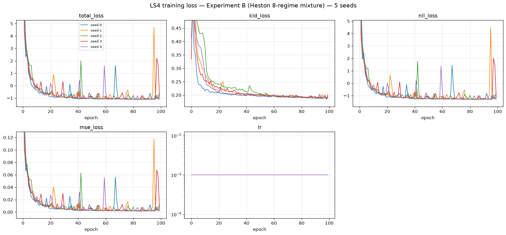

# LS4 — Experiment B: Heston Parameter Mixture

**5 seeds · 8192 × 128 paths per seed · A100-SXM4-80GB · 2026-07-31**

Generator: `methods/LS4` (released `solar_weekly` preset), 2,146,857 parameters, trained
directly on prices — **no preprocessing, no log-return transform, no path shadowing**.
Identical architecture, identical hyperparameters, identical wrapper as Experiment A; only
the training data differs.

The DGP is an **equally-weighted 8-regime Heston mixture** (§3 of the protocol PDF). Each
path draws one regime uniformly, then follows Heston with that regime's parameters for all
128 steps — the regime never switches mid-path:

```
theta in {0.01, 0.09}   x   xi in {0.35, 1.10}   x   rho in {-0.99, +0.99}   =  8 regimes
kappa = 3,  mu = 0,  v0 = theta,  dt = 1/250,  S0 = 100,  T = 128
```

Exactly 1024 paths per regime per split. The difficulty is not any single Heston fit — it is
that the model must reproduce a **mixture**: eight distinct parameter settings in the right
proportions, including regimes that are numerically nasty. The Feller ratio `2*kappa*theta/xi^2`
ranges from **0.050** (theta = 0.01, xi = 1.10 — variance slams into zero constantly) to
**4.408** (theta = 0.09, xi = 0.35 — well-behaved). That 88-fold spread is the trap, and §1.2
shows LS4 falls straight into it.

Two suites are reported below, **and they are kept strictly separate**:

| Section | Suite | Question it answers |
|---|---|---|
| **1** | Protocol PDF evaluator (`evaluate_heston_parameter_mixture.py`, run unchanged) | Did the model reproduce the *mixture structure* the protocol targets? |
| **2** | Benchmark standard battery (A1–A34 + B curve-shape) | How does it score on the repo's usual metrics? |

Section 1 is the one that decides the experiment. Section 2 is context.

**Perfect floor** = the true DGP re-simulated with a fresh seed (5 independent simulations).
It is the best score any generator can achieve; it is *not* zero, because the evaluator
compares two finite 8192-path samples.

---

## 1. PDF metrics — protocol evaluator

Produced by `dataset/Heston/new_experiments/protocol/experiments/scripts/evaluate_heston_parameter_mixture.py`,
**run unchanged** (protocol PDF §7, checklist item 7). Aggregation: mean ± sample std
(ddof = 1) over 5 seeds; 95 % CI half-width uses t₀.₉₇₅,₄ = 2.776.

**Why there is no paired interval here, stated rather than omitted.** PDF §5 requires the five
seedwise differences and a paired interval *"for comparisons between models run with **aligned
seeds**"*. This table compares LS4 (seeds 0–4) against the perfect floor, which is five
true-DGP draws at seeds **1000–1004** — there is no correspondence between floor seed 1000 and
model seed 0, so pairing them would fabricate a covariance and yield an interval that changes
if the floor files are reordered. The comparison is therefore unpaired **by the protocol's own
condition**. `tools/aggregate_pdf_metrics.py --paired-dir` enforces this: it reads the true
seed from `sources.generated` and refuses to pair 0–4 against 1000–1004, and it will produce
the paired table automatically once a second *method* (same seeds 0–4) exists to compare with.

**Reading the `target_*` rows.** These are computed from `test.npy` alone by the frozen oracle;
they never touch the generated bank. Ten of the eleven are *bit-identical* across all five seeds
— verified, not assumed — so their sample std and 95 % CI half-width are **exactly 0**, and the
LS4 and perfect-floor columns necessarily carry the same number. A zero here means "this quantity
was never resampled", not "we measured a variance and it came out small". They are the target the
other columns aim at, not a result.

The eleventh, `target_low_confidence_fraction`, is **not** constant (8.63 × 10⁻⁵ std), and its
non-zero CI is left in the table deliberately rather than suppressed — see the measurement note in
§1.4. This is exactly why no cell in this table is replaced by a dash: had the whole `target_*`
block been annotated by hand as "constant", that one real deviation would have been erased.

**The oracle gate passed.** PDF §3.2 requires an ExtraTrees regime classifier (500 trees,
`min_samples_leaf=2`, `max_features=0.7`, `random_state=42`, 77 path features) to reach at
least **0.90** eight-regime accuracy on held-out data before any mixture metric may be
believed. Achieved: **0.909423828125** on 8192 validation paths — a margin of **+0.00942**
over the gate, i.e. 77 paths of 8192. Scoring below is therefore **valid**. Per-parameter state
accuracy: theta 0.9829, xi 0.9556, rho 0.9565. The gate block is excluded from the table
(identical in every file, it describes the oracle, not the model).

> ### ⚠️ The scoring instrument is a **locally refit** object, and its digest does not match
>
> **The mismatch, stated first.** PDF §6 pins `oracle.joblib` at `54c3f2c9…`. The copy on this
> machine is **`a36d64eb…`**. It does not match, and every mixture metric in this README —
> all eleven `mixture_fidelity.*` rows, the four PRIMARY metrics, `regime_proportion_tvd`,
> every `*_max_probability` and `*_low_confidence_fraction` — was produced by that local
> object, not by the PDF's.
>
> **Why.** A pickled `ExtraTreesClassifier` embeds scikit-learn and joblib version strings,
> pickle protocol, and per-object memory layout. It is not byte-reproducible across
> environments by construction, and no `random_state` fixes that. Environment here: numpy
> 2.4.6, scikit-learn 1.9.0, joblib 1.5.3, Python 3.12.3.
>
> **It is also not obtainable by cloning.** `oracle.joblib` is ~554 MB and is gitignored
> (`.gitignore:54`). Only `gate_report.json` is tracked. A third party must refit it.
>
> **The functional clearance, stated second.** `gate_report.json` matches the PDF's
> `7bd779b9…` **byte-for-byte** — including all 64 cells of the 8 × 8 confusion matrix over
> 8192 held-out paths, `eight_regime_accuracy = 0.909423828125`, and the three per-parameter
> accuracies. A different forest does not land on 64 identical integer cell counts on held-out
> data. The blob's bytes differ; the classifier does not.
>
> **Refit command** (note `--workers 16`; the script's default of **24 exceeds this machine's
> 16-core cap**, and the worker count is also the knob behind the `low_confidence_fraction`
> jitter documented in §1.4 — pin it, always):
>
> ```bash
> cd dataset/Heston/new_experiments
> OMP_NUM_THREADS=16 taskset -c 0-15 python protocol/experiments/scripts/fit_heston_mixture_oracle.py \
>   --data-dir experiment_B --output-dir experiment_B/oracle --workers 16
> sha256sum experiment_B/oracle/gate_report.json   # must be 7bd779b9…
> ```

> ### ⚠️ Two gaps around the gate — a stale `oracle.joblib` is **not** evidence it passed
>
> **Gap 1 — artefacts survive a failed gate.** In
> `protocol/experiments/scripts/fit_heston_mixture_oracle.py`, the model is written at **line
> 79** and the report at **lines 80–83**, but the accuracy check that raises `RuntimeError` is
> at **lines 85–89** — *after* both writes. A fit that fails the gate therefore leaves a fully
> loadable `oracle.joblib` and a fully formed `gate_report.json` on disk, indistinguishable
> from a passing pair to anything downstream.
>
> **Gap 2 — the evaluator never re-checks.**
> `protocol/experiments/scripts/evaluate_heston_parameter_mixture.py:232` does
> `"oracle_gate": json.loads(args.oracle_gate_report.read_text(...))` — it copies the report
> into its output payload and asserts nothing about the accuracy. The gate is verified once,
> at fit time, in a different process, and never again.
>
> Neither script may be edited: PDF §7 item 7 requires them to run unchanged. So the check is
> external and **mandatory before every scoring run**:
>
> ```bash
> python ../../tools/check_oracle_gate.py \
>   --gate-report ../../../../dataset/Heston/new_experiments/experiment_B/oracle/gate_report.json \
>   --oracle      ../../../../dataset/Heston/new_experiments/experiment_B/oracle/oracle.joblib
> ```
>
> It asserts `eight_regime_accuracy ≥ 0.90`, re-derives the accuracy from the confusion
> matrix's trace (so a hand-edited accuracy field cannot pass), rejects a fit run with a laxer
> local `--minimum-accuracy`, and flags the Gap-1 state where the blob is newer than the
> report. Exit non-zero means **do not score**.

<!-- model seeds: 5 | floor seeds: 5 -->
| Metric | LS4 (mean ± std) | 95% CI half-width | Perfect floor (mean ± std) |
|---|---|---|---|
| `mixture_fidelity.generated_low_confidence_fraction` | 0.37334 ± 0.0141 | 0.0175 | 0.174683 ± 0.00361 |
| `mixture_fidelity.generated_mean_max_probability` | 0.666752 ± 0.00569 | 0.00707 | 0.792255 ± 0.00126 |
| `mixture_fidelity.generated_mean_posterior_entropy` | 0.856733 ± 0.0131 | 0.0162 | 0.600259 ± 0.00188 |
| `mixture_fidelity.generated_regime_proportions.0` | 0.189526 ± 0.0394 | 0.0489 | 0.123315 ± 0.00119 |
| `mixture_fidelity.generated_regime_proportions.1` | 0.196851 ± 0.0411 | 0.051 | 0.125098 ± 0.000986 |
| `mixture_fidelity.generated_regime_proportions.2` | 0.00078125 ± 0.000557 | 0.000691 | 0.118506 ± 0.00137 |
| `mixture_fidelity.generated_regime_proportions.3` | 0.00168457 ± 0.000698 | 0.000867 | 0.118774 ± 0.000707 |
| `mixture_fidelity.generated_regime_proportions.4` | 0.195288 ± 0.0291 | 0.0362 | 0.135107 ± 0.00329 |
| `mixture_fidelity.generated_regime_proportions.5` | 0.194507 ± 0.0136 | 0.0168 | 0.13186 ± 0.00173 |
| `mixture_fidelity.generated_regime_proportions.6` | 0.110791 ± 0.0212 | 0.0263 | 0.123413 ± 0.00377 |
| `mixture_fidelity.generated_regime_proportions.7` | 0.110571 ± 0.0176 | 0.0218 | 0.123926 ± 0.00261 |
| `mixture_fidelity.parameters.rho.mean_error` | 0.0180758 ± 0.0118 | 0.0147 | 0.00217876 ± 0.0024 |
| `mixture_fidelity.parameters.rho.q05_error` | 0.0980166 ± 0.0245 | 0.0304 | 0.0007326 ± 0.000494 |
| `mixture_fidelity.parameters.rho.q95_error` | 0.0939972 ± 0.00958 | 0.0119 | 0.000924 ± 0.000753 |
| `mixture_fidelity.parameters.rho.std_ratio` | 0.752922 ± 0.0256 | 0.0317 | 0.998133 ± 0.00167 |
| `mixture_fidelity.parameters.rho.support_normalized_wasserstein` | 0.112548 ± 0.011 | 0.0137 | 0.00293792 ± 0.00066 |
| `mixture_fidelity.parameters.rho.wasserstein` | 0.222845 ± 0.0218 | 0.027 | 0.00581707 ± 0.00131 |
| `mixture_fidelity.parameters.theta.mean_error` | 0.00890553 ± 0.00366 | 0.00454 | 0.000118867 ± 8.97e-05 |
| `mixture_fidelity.parameters.theta.q05_error` | 0.000138667 ± 3.48e-05 | 4.32e-05 | 0 ± 0 |
| `mixture_fidelity.parameters.theta.q95_error` | 6.4e-05 ± 5.84e-05 | 7.25e-05 | 2.77556e-18 ± 6.21e-18 |
| `mixture_fidelity.parameters.theta.std_ratio` | 0.919967 ± 0.017 | 0.0211 | 0.999393 ± 0.00205 |
| `mixture_fidelity.parameters.theta.support_normalized_wasserstein` | 0.114659 ± 0.0387 | 0.0481 | 0.00237222 ± 0.000584 |
| `mixture_fidelity.parameters.theta.wasserstein` | 0.00917275 ± 0.0031 | 0.00384 | 0.000189777 ± 4.68e-05 |
| `mixture_fidelity.parameters.xi.mean_error` | 0.179389 ± 0.0252 | 0.0313 | 0.00209811 ± 0.00139 |
| `mixture_fidelity.parameters.xi.q05_error` | 0.00235 ± 0.000945 | 0.00117 | 0.0001225 ± 0.000125 |
| `mixture_fidelity.parameters.xi.q95_error` | 0.0602775 ± 0.0388 | 0.0482 | 0.00025 ± 0.000177 |
| `mixture_fidelity.parameters.xi.std_ratio` | 0.724715 ± 0.0599 | 0.0744 | 1.00183 ± 0.000666 |
| `mixture_fidelity.parameters.xi.support_normalized_wasserstein` | 0.239191 ± 0.0337 | 0.0418 | 0.00360015 ± 0.00129 |
| `mixture_fidelity.parameters.xi.wasserstein` | 0.179393 ± 0.0252 | 0.0313 | 0.00270012 ± 0.000969 |
| `mixture_fidelity.regime_proportion_tvd` | 0.26687 ± 0.039 | 0.0484 | 0.00847168 ± 0.00129 |
| `mixture_fidelity.target_low_confidence_fraction` | 0.171875 ± 8.63e-05 | 0.000107 | 0.171875 ± 0 |
| `mixture_fidelity.target_mean_max_probability` | 0.792163 ± 0 | 0 | 0.792163 ± 0 |
| `mixture_fidelity.target_mean_posterior_entropy` | 0.600794 ± 0 | 0 | 0.600794 ± 0 |
| `mixture_fidelity.target_regime_proportions.0` | 0.123169 ± 0 | 0 | 0.123169 ± 0 |
| `mixture_fidelity.target_regime_proportions.1` | 0.122925 ± 0 | 0 | 0.122925 ± 0 |
| `mixture_fidelity.target_regime_proportions.2` | 0.119629 ± 0 | 0 | 0.119629 ± 0 |
| `mixture_fidelity.target_regime_proportions.3` | 0.120361 ± 0 | 0 | 0.120361 ± 0 |
| `mixture_fidelity.target_regime_proportions.4` | 0.133057 ± 0 | 0 | 0.133057 ± 0 |
| `mixture_fidelity.target_regime_proportions.5` | 0.130249 ± 0 | 0 | 0.130249 ± 0 |
| `mixture_fidelity.target_regime_proportions.6` | 0.124268 ± 0 | 0 | 0.124268 ± 0 |
| `mixture_fidelity.target_regime_proportions.7` | 0.126343 ± 0 | 0 | 0.126343 ± 0 |
| `novelty.distinct_nearest_training_paths` | 3055.2 ± 248 | 307 | 2941.8 ± 24.5 |
| `novelty.mean_standardized_nearest_train_path_rmse` | 0.913301 ± 0.0866 | 0.108 | 0.808363 ± 0.00181 |
| `novelty.median_standardized_nearest_train_path_rmse` | 0.926082 ± 0.116 | 0.144 | 0.716746 ± 0.00338 |
| `observable_fidelity.abs_return_acf_rmse_lags_1_50` | 0.104407 ± 0.00656 | 0.00815 | 0.0034538 ± 0.00121 |
| `observable_fidelity.excess_kurtosis_error` | 2.71879 ± 0.223 | 0.277 | 0.143903 ± 0.185 |
| `observable_fidelity.leverage_curve_rmse_lags_0_20` | 0.00851555 ± 0.00264 | 0.00328 | 0.00389969 ± 0.000993 |
| `observable_fidelity.realized_volatility_wasserstein` | 0.0368266 ± 0.00187 | 0.00233 | 0.00154572 ± 0.000216 |
| `observable_fidelity.return_std_error` | 0.00149136 ± 0.000247 | 0.000306 | 6.30604e-05 ± 3.92e-05 |
| `observable_fidelity.squared_return_acf_rmse_lags_1_50` | 0.0369782 ± 0.00749 | 0.0093 | 0.00729821 ± 0.00266 |
| `observable_fidelity.terminal_log_price_ks` | 0.0519287 ± 0.0171 | 0.0212 | 0.0102539 ± 0.00242 |

### 1.1 PRIMARY panel — the four metrics the protocol designates

Protocol PDF §3.4 names exactly four primary metrics for this experiment. These decide it.
Everything else in §1 is a secondary diagnostic. **The PDF specifies no aggregate score over
these four, and none is invented here** — combining them after seeing the results would be
exactly the post-hoc weighting §3.4 warns against.

| Primary metric (↓ lower is better) | LS4 (mean ± std) | 95% CI half-width | Perfect floor | × floor |
|---|---|---|---|---|
| Regime proportion TVD | 0.26687 ± 0.039 | 0.0484 | 0.00847168 ± 0.00129 | **31×** |
| **W̄_param** *(derived — see below)* | 0.155466 ± 0.00464 | 0.00576 | 0.0029701 ± 0.000502 | **52×** |
| Realized-volatility Wasserstein | 0.0368266 ± 0.00187 | 0.00233 | 0.00154572 ± 0.000216 | **24×** |
| Leverage-curve RMSE (lags 0–20) | 0.00851555 ± 0.00264 | 0.00328 | 0.00389969 ± 0.000993 | **2.2×** |

**How W̄_param is derived.** The evaluator does not emit it; §3.4 defines it as the mean of the
three support-normalized parameter Wassersteins. It is therefore computed **per seed first,
then aggregated** — averaging the three already-aggregated means would give the same centre but
an incorrect standard deviation:

```
Wbar_q = mean( mixture_fidelity.parameters.{theta, xi, rho}.support_normalized_wasserstein )   for each seed q
```

Per-seed values: 0.154016, 0.160567, 0.152846, 0.159978, 0.149923. Support widths used by the
evaluator's normalization come from the regime grid: theta 0.08, xi 0.75, rho 1.98.

The `× floor` column is the honest scale. Three of the four primary metrics are 24–52× the
floor. Only the leverage curve is close (2.2×) — LS4 reproduces the *sign and rough magnitude*
of the return/volatility correlation, which is a marginal, short-lag property. The mixture
structure itself is badly missed, and §1.2 shows the miss is not diffuse: it is two regimes.

### 1.2 Headline — where the mixture breaks

The single most informative number in this experiment is not any average. It is the per-regime
proportion table, sorted by Feller ratio:

| Label | theta | xi | rho | Feller `2κθ/ξ²` | Target | LS4 (mean ± std) | Perfect floor |
|---|---|---|---|---|---|---|---|
| 2 | 0.01 | 1.10 | −0.99 | **0.050** | 0.1196 | **0.0008 ± 0.0006** | 0.1185 |
| 3 | 0.01 | 1.10 | +0.99 | **0.050** | 0.1204 | **0.0017 ± 0.0007** | 0.1188 |
| 6 | 0.09 | 1.10 | −0.99 | 0.446 | 0.1243 | 0.1108 ± 0.0212 | 0.1234 |
| 7 | 0.09 | 1.10 | +0.99 | 0.446 | 0.1263 | 0.1106 ± 0.0176 | 0.1239 |
| 0 | 0.01 | 0.35 | −0.99 | 0.490 | 0.1232 | 0.1895 ± 0.0394 | 0.1233 |
| 1 | 0.01 | 0.35 | +0.99 | 0.490 | 0.1229 | 0.1969 ± 0.0411 | 0.1251 |
| 4 | 0.09 | 0.35 | −0.99 | 4.408 | 0.1331 | 0.1953 ± 0.0291 | 0.1351 |
| 5 | 0.09 | 0.35 | +0.99 | 4.408 | 0.1302 | 0.1945 ± 0.0136 | 0.1319 |

**LS4 does not produce regimes 2 and 3 at all.** 0.08 % and 0.17 % against a 12 % target — a
150× and 70× shortfall, consistent across all five seeds (std ≈ 0.0006, so this is structural,
not sampling noise). Their mass is reallocated to the four low-vol-of-vol regimes (0, 1, 4, 5),
each overshooting to ≈19 %.

**The ordering is monotone in the Feller ratio and that is the explanation.** Regimes 2 and 3
have Feller 0.050 — the variance process spends most of its time pinned near zero with violent
excursions, producing paths with long dead-flat stretches punctuated by jumps. Regimes 6 and 7
(Feller 0.446, 9× less extreme) are merely *undershot*. Everything with Feller ≥ 0.49 is
*overshot*. LS4's continuous-state S4 latent, trained with a Gaussian likelihood on price
levels, cannot represent the near-degenerate variance path, so it maps those inputs onto the
nearest well-behaved regime it can express. **This is mode collapse driven by numerical
stiffness of the target, not by class imbalance** — every regime had exactly 1024 training
paths.

⚠️ **Raw diagnostics — not errors.** Protocol PDF §5 lists standard-deviation ratio, posterior
confidence, group means, and novelty as the explicit exceptions to "lower is better":

| Quantity | Target | LS4 | Perfect floor | Reading |
|---|---|---|---|---|
| `parameters.theta.std_ratio` | 1.0 | 0.920 ± 0.017 | 0.999 ± 0.002 | mildly compressed |
| `parameters.xi.std_ratio` | 1.0 | **0.725 ± 0.060** | 1.002 ± 0.001 | **27 % of ξ spread lost** |
| `parameters.rho.std_ratio` | 1.0 | 0.753 ± 0.026 | 0.998 ± 0.002 | 25 % of ρ spread lost |
| `generated_mean_max_probability` | 0.7922 | 0.6668 ± 0.0057 | 0.7923 ± 0.0013 | oracle is less certain |
| `generated_mean_posterior_entropy` | 0.6008 | 0.8567 ± 0.0131 | 0.6003 ± 0.0019 | +43 % entropy |
| `generated_low_confidence_fraction` | 0.1719 | 0.3733 ± 0.0141 | 0.1747 ± 0.0036 | **2.2× more ambiguous paths** |

The ξ std_ratio is the tell: xi is exactly the parameter that separates the collapsed regimes
from the survivors, and it is the one whose spread LS4 destroys. The posterior diagnostics say
the same thing from the oracle's side — 37 % of LS4's paths are classified with max
probability below 0.6, versus 17 % for a true-DGP draw. LS4 does not merely put mass in the
wrong regimes; it produces paths that **sit between regimes** and belong to none.

**Novelty.** `median_standardized_nearest_train_path_rmse` = 0.926 ± 0.116 against the floor's
0.717 ± 0.003, with 3055 ± 248 distinct nearest-training paths versus the floor's 2942 ± 25.
LS4's paths are, if anything, *further* from the training set than a genuine DGP draw is.
**No memorisation** — the failure above is a modelling limitation, not copying.


Left: oracle-predicted regime proportions, target vs LS4 seed 0 — bars 2 and 3 are visually
absent. Right: the per-parameter spread behind the `std_ratio` rows.

### 1.3 Validation vs test — evidence that `test.npy` stayed blind

Protocol PDF §1.4 asks for `metrics_validation.json` alongside `metrics_test.json`, and §7
checklist item 2 requires that `disc.npy` was used **only** for validation. The same unchanged
evaluator, re-run with `disc.npy` substituted for `--test-data` (`pdf_metrics_validation/`):

| Primary metric (↓) | vs `test.npy` | vs `disc.npy` (validation) |
|---|---|---|
| Regime proportion TVD | 0.26687 ± 0.039 | 0.262573 ± 0.039 |
| W̄_param (derived) | 0.155466 ± 0.00464 | 0.154009 ± 0.00485 |
| Realized-volatility Wasserstein | 0.0368266 ± 0.00187 | 0.0364817 ± 0.0018 |
| Leverage-curve RMSE | 0.00851555 ± 0.00264 | 0.00864776 ± 0.00396 |

Every metric agrees with its test counterpart to well within one standard deviation — the
largest gap is 0.004 on a TVD whose seed-to-seed std is 0.039. No tuning was performed against
`disc.npy` (hyperparameters are official defaults), and these numbers are consistent with that
claim: there is no validation/test gap to explain.

### 1.4 Protocol reporting block (PDF §5)

| Requirement | Value |
|---|---|
| Training file | `dataset/Heston/new_experiments/experiment_B/train.npy` |
| Validation file | `dataset/Heston/new_experiments/experiment_B/disc.npy` |
| Test file | `dataset/Heston/new_experiments/experiment_B/test.npy` |
| Generated bank size | 8192 × 128 `float64`, per seed |
| Model seeds | 0, 1, 2, 3, 4 (training seed = generation seed, shared RNG stream) |
| Official code + revision | **Yes** — `methods/LS4/code`, released `solar_weekly` preset, at benchmark revision `27df71e`; experiment wrapper `code/train_ls4_experiment.py` committed as `ba7c748` |
| Hyperparameters | **Official defaults**, not validation-selected. No tuning was performed; `disc.npy` was used for scoring only. |
| Trainable parameters | 2,146,857 |
| Training time | 1424 s per seed on average (≈24 min; range 1328–1539 s) |
| Generation time | 9.4 s per seed on average (range 9.2–9.9 s) |
| Hardware | 1 × A100-SXM4-80GB, 8 pinned cores of 2 × AMD EPYC 7763 |
| Independent retraining | **5 separate trainings, one per seed** — not one model sampled five times. Evidence: the five `weights/seed_<q>_model.pt` have five distinct MD5s; each `weights/seed_<q>_config.json` records `"experiment": "B"` and `"data": …/experiment_B/train.npy`; the five loss curves are 100 epochs each with distinct final losses. Checkpoint mtimes are sequential ≈25 min apart (09:24, 09:49, 10:15, 10:37, 11:01). Cross-experiment check: all **10** A+B checkpoints are mutually distinct. |
| Trained on this experiment's own data | **Yes** — `dataset/Heston/new_experiments/experiment_B/train.npy` (MD5 `7713b823…`), a different file from Experiment A's. Independent corroboration: the standardizer fitted on it gives μ = 100.09714689788022, σ = 11.516370009298313, which differ from A's (μ = 100.13621639651069, σ = 11.927961375843996) — the two runs cannot have shared a training set. |
| Failed / unstable runs | **0** — all 5 seeds ran 100/100 epochs, no NaN in any bank, no seed replaced or dropped. One observation recorded rather than smoothed over: seed 2's *last-epoch* total loss spikes to −0.5683 against its own epoch-92 minimum of −1.1118 (seeds 0/1/3/4 finish at −1.101/−1.071/−0.958/−1.079). This does **not** reach the bank: generation uses the **EMA** weights (`ema_lamb = 0.99`, `train_ls4_experiment.py:154` selects `ema_model.module`), and a single-epoch excursion is damped by the EMA's ≈100-step memory. Seed 2 is also not an outlier in the headline metric — its regime-proportion TVD is 0.258911, mid-pack among 0.245483 / 0.243164 / **0.258911** / 0.335815 / 0.250977, where the worst seed is 3, not 2. Reported here because PDF §1.5 requires unstable behaviour to be surfaced, not because it changed a result. |
| Oracle gate | **PASS** — 0.909423828125 ≥ 0.90 required (PDF §3.2), margin +0.00942 (77 of 8192 paths). Re-asserted externally by `tools/check_oracle_gate.py` before every scoring run, because the canonical scripts check it only once at fit time and write their artefacts *before* raising — see §1. |
| Scoring instrument | **Locally refit `oracle.joblib`** — digest `a36d64eb…` ≠ PDF `54c3f2c9…`, and the file is gitignored so a clone does not contain it. Functional clearance is `gate_report.json` matching the PDF byte-for-byte over all 64 confusion cells. Full disclosure in §1. |
| Declared post-hoc transformation (§1.3) | **`S ← 100·S/S[:,:1]`**, applied once to every bank. LS4 generates in standardized *price* space with no `t = 0` anchor, so raw `S₀` deviated by up to 3.5 × 10⁻² — beyond §1.4's "ordinary floating-point tolerance". The repair preserves every log-return to 1e-12, so the path law is untouched. Recorded per seed in `generation_manifest.json → numerical_repair`. **The repair is now committed code (`tools/apply_s0_repair.py`), but for Experiment B it is *not* re-derivable, and this row says so rather than borrowing Experiment A's evidence.** B's banks were first committed (`f54d87f`) already repaired, so no pre-repair copy survives in history, and generation cannot be replayed from `seed_N_model.pt` alone — the torch RNG state at generation time depends on the whole training run. What *is* re-measured from disk: `S₀ == 100.0` exactly on all 5 banks, and the map is a per-path rescaling, hence log-return-invariant to 1.776 × 10⁻¹⁵. Experiment A, whose raw banks were kept, is re-derived bit-for-bit 5/5; B is the weaker case and the asymmetry is deliberate to record. |
| Known non-conformance | **None.** All §1.4 bullets hold: finite, strictly positive, 8192 × 128, `float64`, `S₀ == 100.0` exactly — re-measured from each array on disk by `write_generation_manifest.py`, not asserted. |

Machine-readable in `generated_paths/seed_<q>/generation_manifest.json`.

*One measurement note, recorded rather than hidden:* `target_low_confidence_fraction` is a pure
function of `test.npy` and the frozen oracle, so it should be constant across seeds. It is
1408/8192 for seeds 0, 1, 3 but 1409/8192 for seed 2 and 1407/8192 for seed 4 — a ±1-path
jitter in the count of paths sitting within float noise of the strict `max_prob < 0.6`
threshold. The averaged target statistics (`target_mean_max_probability`,
`target_mean_posterior_entropy`, `target_regime_proportions`) are **bit-identical** across all
five, and a controlled re-run reproduces 1408 twice. Magnitude: 1.2 × 10⁻⁴ on one raw
diagnostic; **no effect on any primary metric**.

**The cause has since been isolated.** It is non-deterministic floating-point reduction order
inside `ExtraTreesClassifier.predict_proba`. Read from the installed scikit-learn 1.9.0,
`sklearn/ensemble/_forest.py`:

```python
Parallel(n_jobs=n_jobs, verbose=self.verbose, require="sharedmem")(
    delayed(_accumulate_prediction)(e.predict_proba, X, all_proba, lock)
```

All 500 trees accumulate into one shared `all_proba` buffer under a lock, so the **summation
order depends on thread scheduling**, not on any seed. Different `n_jobs`, or the same `n_jobs`
under different machine load, give summed probabilities that differ in the last ULP.
`low_confidence_fraction` is then computed against a *strict* threshold —
`evaluate_heston_parameter_mixture.py:103`, `float(np.mean(probabilities.max(axis=1) < 0.6))`
— so a path whose max probability sits within one ULP of 0.6 flips category with the order.
One path flipping is exactly 1/8192 = 1.22 × 10⁻⁴, which is precisely the observed jitter.

**Material consequence: zero primary metrics are affected, and that is structural, not lucky.**
No primary metric is threshold-based. `regime_proportion_tvd` goes through
`np.argmax(probabilities, axis=1)` (line 90), which is invariant to a last-ULP perturbation
unless two classes tie to within one ULP — not observed in any of the ten scored banks. The
Wasserstein and RMSE metrics are continuous functions of the probabilities, so a 1-ULP input
change moves them by ~1 ULP. `low_confidence_fraction` is a *diagnostic*, not a scored
quantity: it appears in no PRIMARY panel and in no headline claim.

**Reproduction condition:** pin the worker count. Fixing `--workers` (hence `n_jobs`) to one
value makes the diagnostic reproducible run-to-run. Use `--workers 16` everywhere — see the
refit command in §1; the script's default of 24 exceeds this machine's 16-core cap, and
changing it between refits is what makes this number move.

*Reproduce:* `python ../../tools/aggregate_pdf_metrics.py --model-dir . --floor-dir ../perfect_floor --pattern '*_heston_mixture.json' --label LS4 --exclude-prefix oracle_gate sources configuration`

---

## 2. Metrics A1–A34 + B — benchmark standard battery, mean ± std across 5 seeds

Separate suite, separate question. These are the repo's usual metrics, computed by
`code/compute_metrics_experiment.py` against `test.npy`, aggregated across the same 5 seeds.

**A33/A34 are dropped in both new experiments** (user decision): they require the latent σ
path, which is not part of the generator's output contract here. Their cells read `n/a` —
never 0, which would silently flatter the method.

> **Unlike Experiment A, the two suites agree here.** In A, LS4 saturated this battery while
> failing the protocol evaluator. In B the damage is visible in both: A14 KS log-returns 0.0889
> against a floor of 0.0016 (55×), A21 ACF |r| 0.0749 vs 0.0010 (73×), A31 rolling-vol KS 0.242
> vs 0.0031 (79×), A9 volatility MMD 0.132 vs 0.0089 (15×). Dropping two of eight regimes
> distorts the *marginal* return distribution too, so the standard battery catches it.
>
> The exceptions are instructive: **A18/A19 still miss it.** A18 discriminative (GRU) 0.00845
> vs a floor of 0.00577 is **1.5× floor**, and A19 predictive (GRU) 0.02255 vs 0.02248 is
> **1.0× floor** — against 15–79× for the distributional metrics above. A GRU discriminator
> cannot tell that two of eight modes are missing, because every individual path it inspects
> *is* a plausible Heston path; only the **population** is wrong. That is a concrete
> demonstration of why adversarial and predictive scores are weak evidence of distributional
> fidelity — they are near-blind to mode collapse.

### 2.1 A1–A34

| Metric | LS4 (mean ± std) | Seed 0 | Seed 1 | Seed 2 | Seed 3 | Seed 4 | Perfect floor |
|---|---|---|---|---|---|---|---|
| **Fat Tail** | | | | | | | |
| A1 Kurtosis Error ↓ | 20.1112 ± 6.35 | 9.71885 | 21.7676 | 23.8075 | 26.1116 | 19.1503 | 18.4078 ± 18.1 |
| A2 \|r\| q95 Error ↓ | 0.00201956 ± 0.00198 | 0.00126621 | 0.00106225 | 0.000832836 | 0.00553195 | 0.00140456 | 7.20744e-05 ± 3.83e-05 |
| A3 \|r\| q99 Error ↓ | 0.00246854 ± 0.00472 | 6.83337e-06 | 0.000705208 | 0.000685759 | 0.0108938 | 5.10803e-05 | 0.000217235 ± 0.000133 |
| A4 Tail QQ Error ↓ | 0.00211041 ± 0.00184 | 0.00138834 | 0.00128293 | 0.000990771 | 0.00539324 | 0.00149678 | 8.65607e-05 ± 2.12e-05 |
| A5 Hill Tail Index Error ↓ | 1.11204 ± 1.22 | 0.251399 | 0.897876 | 0.770727 | 3.25023 | 0.389953 | 0.175861 ± 0.126 |
| **Distribution** | | | | | | | |
| A6 Path MMD² ↓ | 0.00506942 ± 0.00234 | 0.00479369 | 0.00907915 | 0.00466008 | 0.00326286 | 0.00355133 | 0.00176849 ± 0.000309 |
| A7 Terminal MMD² ↓ | 0.00406092 ± 0.00282 | 0.00240877 | 0.00873196 | 0.00216653 | 0.00474942 | 0.00224793 | 0.00139414 ± 0.000296 |
| A8 Increment MMD² ↓ | 0.0076128 ± 0.00267 | 0.00880083 | 0.0102474 | 0.0085291 | 0.00323117 | 0.00725551 | 0.000855771 ± 7.2e-05 |
| A9 Volatility MMD ↓ | 0.131636 ± 0.0227 | 0.137112 | 0.166947 | 0.125988 | 0.122397 | 0.105737 | 0.0088589 ± 0.001 |
| A10 Terminal SWD ↓ | 1.67513 ± 0.68 | 1.01933 | 2.34858 | 1.60177 | 2.39456 | 1.01144 | 1.05719 ± 0.324 |
| A11 Path SWD ↓ | 1.10168 ± 0.313 | 0.910838 | 1.56548 | 1.08283 | 1.20633 | 0.742916 | 0.774511 ± 0.273 |
| A12 RV Law Loss ↓ | 1.66474 ± 0.295 | 1.55918 | 1.62636 | 1.37964 | 2.16486 | 1.59367 | 0.122529 ± 0.0173 |
| A13 Mean Path RMSE ↓ | 0.397805 ± 0.275 | 0.579796 | 0.17755 | 0.208177 | 0.793419 | 0.230082 | 0.204231 ± 0.0621 |
| A14 KS Log-returns ↓ | 0.0889012 ± 0.00833 | 0.0941643 | 0.0941941 | 0.0914287 | 0.0743043 | 0.0904147 | 0.00160787 ± 0.000425 |
| A15 Skewness Error ↓ | 0.0521891 ± 0.046 | 0.0266991 | 0.130249 | 0.0143441 | 0.0357917 | 0.0538622 | 0.0185046 ± 0.00954 |
| A16 QQ RMSE ↓ | 0.00252445 ± 0.000131 | 0.00265103 | 0.00265123 | 0.00240105 | 0.00237842 | 0.00254052 | 6.22975e-05 ± 1.34e-05 |
| A17 Terminal KS ↓ | 0.0519287 ± 0.0171 | 0.0455322 | 0.0600586 | 0.0369873 | 0.0778809 | 0.0391846 | 0.0102539 ± 0.00242 |
| **Adversarial** | | | | | | | |
| A18 Discriminative (GRU) ↓ | 0.0084526 ± 0.00552 | 0.009612 | 0.000763 | 0.005035 | 0.013274 | 0.013579 | 0.0057674 ± 0.00447 |
| A18 Discriminative (MLP) ↓ | 0.0079036 ± 0.00652 | 0.010833 | 0.014495 | 0.000458 | 0.001373 | 0.012359 | 0.0037534 ± 0.00204 |
| **Predictive** | | | | | | | |
| A19 Predictive (GRU) ↓ | 0.0225492 ± 0.000143 | 0.022472 | 0.022495 | 0.022485 | 0.022804 | 0.02249 | 0.0224832 ± 3.98e-05 |
| A19 Predictive (MLP) ↓ | 0.0227496 ± 0.000266 | 0.023146 | 0.022755 | 0.022652 | 0.022786 | 0.022409 | 0.02249 ± 0.000189 |
| **Temporal** | | | | | | | |
| A20 Covariance Error ↓ | 37.3772 ± 52.4 | 34.5672 | 16.4404 | 4.32536 | 128.413 | 3.13939 | 23.4477 ± 17.3 |
| A21 ACF \|r\| ↓ | 0.0748674 ± 0.00353 | 0.0757044 | 0.0720585 | 0.0740892 | 0.0805431 | 0.0719418 | 0.00101954 ± 0.000509 |
| A22 ACF r² ↓ | 0.0275535 ± 0.00235 | 0.0294322 | 0.0246607 | 0.0274611 | 0.0303016 | 0.0259119 | 0.00120096 ± 0.000344 |
| A23 ACF lag-1 \|r\| Error ↓ | 0.088892 ± 0.0042 | 0.0934024 | 0.0863569 | 0.0869375 | 0.0933522 | 0.0844109 | 0.00103214 ± 0.00101 |
| A24 ACF lag-1 r² Error ↓ | 0.025171 ± 0.00384 | 0.0316575 | 0.0217524 | 0.0249625 | 0.0244289 | 0.0230537 | 0.00137151 ± 0.000644 |
| **Volatility** | | | | | | | |
| A25 Mean RMSE ↓ | 0.600038 ± 0.44 | 0.605482 | 0.176287 | 0.539211 | 1.32785 | 0.35136 | 0.14112 ± 0.0836 |
| A26 Std Error ↓ | 0.156126 ± 0.063 | 0.174234 | 0.132169 | 0.0821653 | 0.25234 | 0.139723 | 0.0176179 ± 0.00892 |
| A27 Log-return Std Error ↓ | 0.00149136 ± 0.000247 | 0.00149701 | 0.00141292 | 0.00121307 | 0.00188875 | 0.00144506 | 6.30604e-05 ± 3.92e-05 |
| A28 Kurtosis Ratio → 1 | 1.87647 ± 0.146 | 1.77703 | 1.85353 | 1.79288 | 2.13268 | 1.82623 | 0.976711 ± 0.029 |
| A29 Sigma Mean Error ↓ | 0.0307317 ± 0.0112 | 0.0374678 | 0.0370004 | 0.0324054 | 0.0110173 | 0.0357676 | 0.000902254 ± 0.000441 |
| A30 Vol Path RMSE ↓ | 1.21798 ± 0.769 | 1.35119 | 0.940242 | 0.553049 | 2.48851 | 0.756885 | 0.404985 ± 0.0995 |
| A31 Rolling Vol KS ↓ | 0.24169 ± 0.0155 | 0.25663 | 0.248119 | 0.246705 | 0.21578 | 0.241216 | 0.00307538 ± 0.0011 |
| A32 Vol-of-vol Error ↓ | 0.00139118 ± 0.000816 | 0.00102652 | 0.00109059 | 0.00106324 | 0.00284667 | 0.000928897 | 4.27908e-05 ± 4.1e-05 |
| **Heston-specific (dropped)** | | | | | | | |
| A33 Sigma Correlation (dropped) | n/a | n/a | n/a | n/a | n/a | n/a | n/a |
| A34 Sigma RMSE (dropped) | n/a | n/a | n/a | n/a | n/a | n/a | n/a |

### 2.2 B — curve-shape metrics

Per-plot agreement between real and generated curves: `funct` = the curve itself, `der` = its
first derivative, `sec_der` = its second. MSE is the per-seed average of the three. `Grid TVD`
is the total-variation distance over the 2-D occupancy grid, in percent.

| Plot | Measure | LS4 (mean ± std) | Seed 0 | Seed 1 | Seed 2 | Seed 3 | Seed 4 | Perfect floor |
|---|---|---|---|---|---|---|---|---|
| **Grid TVD (%)** | — | 574.066 ± 167 | 605.24 | 845.528 | 467.968 | 421.515 | 530.081 | 139.194 ± 33 |
| **Log-return histogram** | MSE (funct/der/sec-der avg) | 193.027 ± 3.11 | 195.078 | 195.601 | 194.342 | 187.989 | 192.127 | 0.0555117 ± 0.0114 |
|  | % error | 126.257 ± 16.7 | 128.299 | 123.638 | 141.654 | 99.3004 | 138.394 | 89.34 ± 7.48 |
|  | NRMSE | 11.2589 ± 0.101 | 11.33 | 11.3372 | 11.2967 | 11.0932 | 11.2373 | 0.183744 ± 0.0176 |
|  | CVaR₉₀ | 14.9653 ± 0.26 | 15.332 | 15.0857 | 14.9677 | 14.6938 | 14.7473 | 0.266769 ± 0.0363 |
|  | CVaR₉₅ | 24.8518 ± 1.16 | 25.8146 | 25.5517 | 25.0639 | 22.8703 | 24.9585 | 0.344172 ± 0.0567 |
| **QQ plot** | MSE (funct/der/sec-der avg) | 2.23099e-06 ± 1.92e-07 | 2.33967e-06 | 2.35807e-06 | 1.92734e-06 | 2.37641e-06 | 2.15345e-06 | 2.41572e-09 ± 1e-09 |
|  | % error | 256.955 ± 21.1 | 275.637 | 265.352 | 259.083 | 220.78 | 263.921 | 7.56456 ± 0.242 |
|  | NRMSE | 3.04091 ± 1.05 | 2.40979 | 2.91666 | 2.42143 | 4.87956 | 2.5771 | 0.293045 ± 0.082 |
|  | CVaR₉₀ | 3.87753 ± 1.32 | 3.39851 | 3.44063 | 3.09954 | 6.22212 | 3.22686 | 0.148592 ± 0.0357 |
|  | CVaR₉₅ | 4.28849 ± 2.2 | 3.40632 | 3.46608 | 3.12021 | 8.21622 | 3.23362 | 0.195192 ± 0.0546 |
| **ACF of \|log-returns\|** | MSE (funct/der/sec-der avg) | 0.00103562 ± 0.00012 | 0.00101891 | 0.000973816 | 0.000996517 | 0.00124395 | 0.000944899 | 5.46152e-06 ± 2.19e-06 |
|  | % error | 132.738 ± 31.5 | 150.414 | 124.119 | 105.714 | 178.411 | 105.032 | 85.0322 ± 20.7 |
|  | NRMSE | 57.6099 ± 4.34 | 56.5162 | 56.3174 | 62.1988 | 51.5672 | 61.4496 | 23.8351 ± 5.21 |
|  | CVaR₉₀ | 56.0307 ± 2.31 | 57.5106 | 54.0316 | 55.4894 | 59.2346 | 53.8872 | 2.15097 ± 0.331 |
|  | CVaR₉₅ | 58.2451 ± 1.73 | 59.066 | 55.963 | 58.8965 | 60.2896 | 57.0102 | 2.45396 ± 0.388 |
| **ACF of squared log-returns** | MSE (funct/der/sec-der avg) | 0.000168336 ± 2.94e-05 | 0.000166985 | 0.000149412 | 0.000159527 | 0.000218899 | 0.000146855 | 5.52755e-06 ± 2.53e-06 |
|  | % error | 279.073 ± 33.6 | 259.794 | 262.075 | 338.22 | 260.679 | 274.598 | 115.528 ± 42 |
|  | NRMSE | 56.0656 ± 3.4 | 53.136 | 59.5383 | 59.4397 | 52.2879 | 55.9261 | 28.6009 ± 6.81 |
|  | CVaR₉₀ | 34.5575 ± 1.91 | 36.0936 | 32.3318 | 34.5283 | 36.7962 | 33.0378 | 2.85902 ± 0.497 |
|  | CVaR₉₅ | 36.0747 ± 2.22 | 37.7272 | 33.0238 | 37.197 | 38.0035 | 34.422 | 3.28585 ± 0.731 |
| **Rolling volatility histogram** | MSE (funct/der/sec-der avg) | 217.555 ± 17.1 | 217.476 | 209.523 | 211.79 | 246.564 | 202.42 | 0.373539 ± 0.113 |
|  | % error | 242.539 ± 50.9 | 290.928 | 220.457 | 295.714 | 230.574 | 175.022 | 194.618 ± 50.5 |
|  | NRMSE | 23.5507 ± 1.64 | 22.7322 | 22.6567 | 23.0822 | 26.468 | 22.8145 | 3.10664 ± 0.504 |
|  | CVaR₉₀ | 55.2705 ± 2.75 | 55.3469 | 53.5136 | 54.6561 | 59.896 | 52.9398 | 0.853517 ± 0.176 |
|  | CVaR₉₅ | 80.3613 ± 1.49 | 81.8071 | 80.8627 | 80.9938 | 77.8868 | 80.2563 | 1.0985 ± 0.26 |
| **Tail survival** | MSE (funct/der/sec-der avg) | 0.00464843 ± 0.00109 | 0.00539602 | 0.00530658 | 0.00486801 | 0.00273695 | 0.0049346 | 7.92185e-07 ± 5.62e-07 |
|  | % error | 6919.58 ± 824 | 6376.82 | 6780.37 | 6545.23 | 8371.19 | 6524.3 | 4143.5 ± 296 |
|  | NRMSE | 160528 ± 2.44e+03 | 163048 | 162477 | 158622 | 161092 | 157398 | 10943.5 ± 446 |
|  | CVaR₉₀ | 17.6687 ± 1.67 | 18.8437 | 18.6239 | 18.102 | 14.7437 | 18.0303 | 0.233416 ± 0.0789 |
|  | CVaR₉₅ | 17.7368 ± 1.66 | 18.9075 | 18.6861 | 18.172 | 14.8217 | 18.0969 | 0.240094 ± 0.0794 |

*Reproduce:*
`python ../../tools/make_metrics_tables.py --model-dir . --floor-dir ../perfect_floor --label LS4 --table A`
(and `--table B`).

---

## 3. Stylised Facts Diagnostic (real vs LS4, seed 0)


Generated by `tools/plot_stylised_facts.py`, which wraps the benchmark-standard
`metrics/plot_diagnostics.py` so every method gets the identical figure.

**The black Heston theory curve is deliberately suppressed.** That curve is the closed-form
*single-regime* Heston reference, and Experiment B's DGP is an 8-regime **mixture** — no single
parameter set describes it. Drawing it would be a wrong reference drawn with authority.
Real vs Generated only.

The panel that matters is **rolling volatility**: the real distribution is visibly multi-modal
(eight regimes, two volatility scales), and LS4 collapses it toward the well-behaved modes —
the same regime collapse as §1.2, seen without any oracle or protocol machinery.

---

## 4. Losses



All five seeds ran the full 100 epochs with no NaN and no early stop. Convergence is smooth and
seed-to-seed spread is small — **the collapse in §1.2 is not an optimisation failure.** LS4
minimised its objective successfully; the objective simply does not penalise dropping two
regimes enough to matter. Training took 1328–1539 s per seed.

---

## 5. File layout

```
experiment_B/LS4/
├── code/
│   ├── train_ls4_experiment.py          training + generation (identical to Experiment A)
│   └── compute_metrics_experiment.py    A1–A34 + B battery runner
├── generated_paths/
│   └── seed_<q>/
│       ├── generated_paths_8192x128.npy the bank (float64, S0 = 100 exactly)
│       ├── metadata.json                compute + provenance as emitted by the run
│       └── generation_manifest.json     PDF §1.4 mandatory manifest
├── weights/
│   ├── seed_<q>_model.pt                EMA weights
│   └── seed_<q>_config.json             architecture + optimiser
├── pdf_metrics/                         protocol evaluator vs test.npy   (§1)
│   └── seed_<q>_heston_mixture.json
├── pdf_metrics_validation/              protocol evaluator vs disc.npy   (§1.3)
│   └── seed_<q>_heston_mixture.json
├── losses/
│   ├── seed_<q>_losses.csv              per-epoch training curves
│   └── loss_convergence.png
├── plots/
│   ├── mixture_structure_seed0.png      §1.2 figure
│   ├── heston_diagnostics.png           §3 figure
│   └── seed_<q>_{pca,tsne}.png          embedding views
├── metrics_summary.csv                  A1–A34 + B, all seeds        (§2)
├── seed_<q>_metrics.json                per-seed battery output
├── seed_<q>_{disc,pred}_{gru,mlp}_loss.csv    A18/A19 training curves
└── README.md
```

Shared tooling lives in `results/new_experiments/tools/`:

| Tool | Purpose |
|---|---|
| `aggregate_pdf_metrics.py` | §1 tables from the evaluator JSONs (`--subdir` selects test or validation) |
| `make_metrics_tables.py` | §2 tables from `metrics_summary.csv` |
| `plot_experiment_figures.py` | §1.2 mixture-structure figure |
| `plot_stylised_facts.py` | §3 eight-panel diagnostic |
| `plot_losses.py` | §4 loss convergence |
| `write_generation_manifest.py` | PDF §1.4 manifests, with the output contract re-measured from the bank |

Full protocol, DGP definitions, methodology and the complete PDF conformance cross-check:
`results/new_experiments/guideline_new_experiment.md` (see §11).
