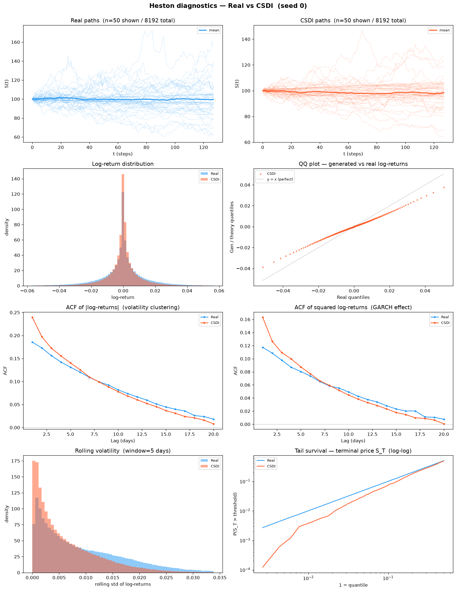
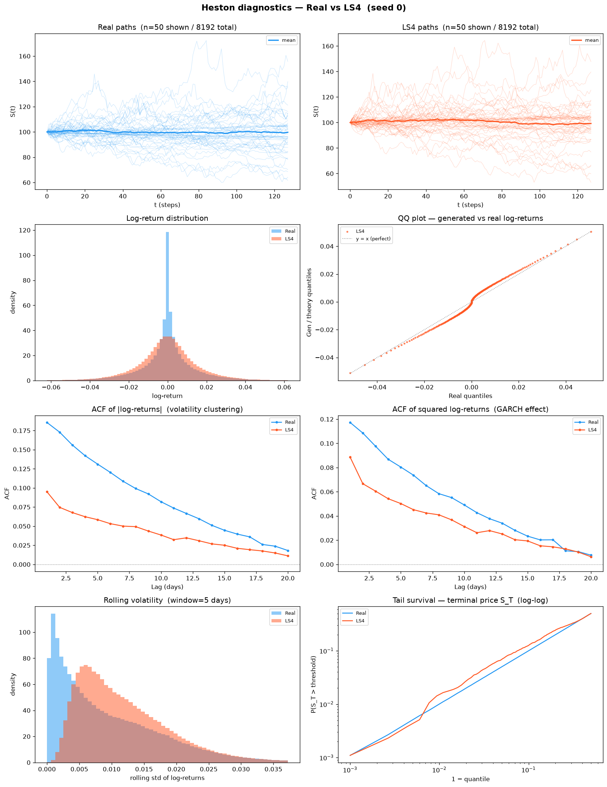
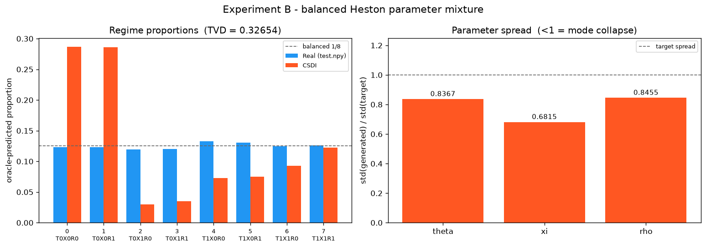
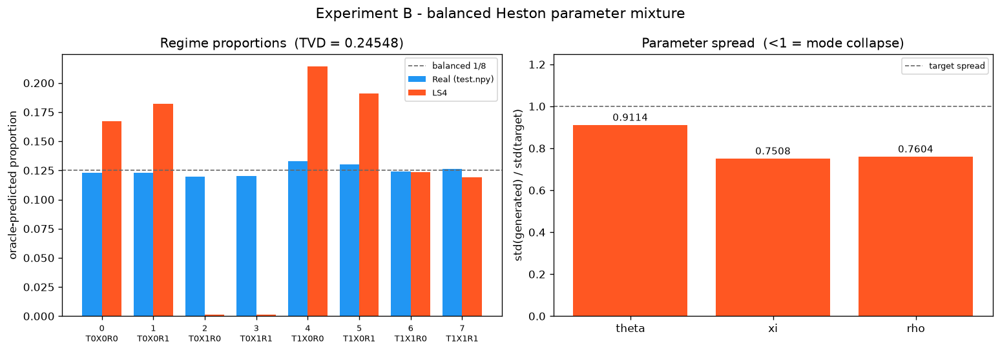

# Experiment B — Heston Parameter Mixture: cross-method comparison

**2 methods · 5 seeds each · 8192 × 128 paths per seed · shared seeds 0–4 · A100-SXM4-80GB · 2026-07-31**

| | CSDI (Diffusion) | LS4 (VAE) |
|---|---|---|
| Source | `methods/CSDI` (released `base.yaml`) | `methods/LS4` (released `solar_weekly` preset) |
| Trainable parameters | 412,945 | 2,146,857 |
| Epochs | 200 | 100 |
| Training, mean per seed | 3044 s (2749–3304) | 1424 s (1328–1539) |
| Generation, mean per seed | 13.1 s (11.1–15.5) | 9.4 s (9.2–9.9) |
| Preprocessing | affine standardization of raw prices | affine standardization of raw prices |
| Per-method README | [`CSDI/README.md`](CSDI/README.md) | [`LS4/README.md`](LS4/README.md) |

Both methods use identical architecture, hyperparameters and wrapper as in Experiment A; only
the training data differs. Neither uses a log-return transform, a quantile map, or **path
shadowing**.

**Verdict, one line: Experiment B is a genuine split, unlike Experiment A.** The 51-row protocol
table decomposes as **11 constants, 17 raw diagnostics the PDF forbids scoring (§4, §3.3, §5),
and 23 contested fidelity metrics**. Of those 23, **CSDI takes 10, LS4 8, and 5 are ties**. The
standard battery goes 22–12 to LS4, but the curve-shape suite **reverses to 24–7 for CSDI**. A
single winner cannot be declared here without saying which suite you are reading, and Section 1
is the one the protocol asks about.

**On the fidelity metrics CSDI leads, narrowly.** An earlier revision of this page reported
"LS4 17, CSDI 15, 19 ties". That count included `novelty.*`, the oracle posterior-confidence
block, every `*.std_ratio`, and the eight raw regime proportions — quantities PDF §4/§3.3/§5
name as raw diagnostics that must not be winner-selected or folded into a score. It also
counted the 11 `mixture_fidelity.target_*` constants as "ties", which they are not: they are one
number read off `test.npy` and printed twice. Removing both classes does not merely shrink the
tally, it **reverses its sign**. A 10–8 split over 23 rows is not a result; read §1.1.

**Both methods fail the mixture in the same place, and it is not where the Feller ratio
predicts.** Both over-weight the low vol-of-vol regimes by 43–52 % and starve the high vol-of-vol
regimes by 45–54 %. **ξ is the axis neither model can represent.** What separates them is only
what they do with θ — and there they fail in *opposite* directions.

---

## 1. PDF metrics — protocol evaluator

Produced by `dataset/Heston/new_experiments/protocol/experiments/scripts/evaluate_heston_parameter_mixture.py`,
**run unchanged** (PDF §7, checklist item 7). Aggregation: mean ± sample std (ddof = 1) over
5 seeds.

**The paired interval is available here** because CSDI and LS4 were run on the same seeds 0–4;
`tools/aggregate_pdf_metrics.py --paired-dir` verifies this from each JSON's `sources.generated`
field and refuses to pair otherwise. The `Mean diff` and `Paired 95% CI` columns are the PDF §5
quantity itself.

**Read the CI before the means — on this experiment it changes the answer.** 5 of the 23 scored
rows have a paired CI that contains zero, and they include two of the four PRIMARY metrics:
`regime_proportion_tvd` (means 0.330 vs 0.267, but CI ±0.0584 on a difference of 0.0635) and
the leverage-curve RMSE (±0.00492 on −0.00271). Those rows are reported as `tie` in `Winner`
regardless of how far apart the means look. **Half the panel the protocol actually asks about
is undecided at 5 seeds** — that, not the 10–8, is the headline of Section 1.

**How `Winner` is decided.** By distance to a per-metric reference, not "smaller wins":
error/distance/TVD/Wasserstein metrics reference 0; a `generated_*` quantity references its own
`target_*` row (the oracle's reading of `test.npy`). `target_*` rows are constants and get no
winner.

**Some rows are deliberately left unscored.** The PDF names a class of quantities that carry a
value but no direction, and forbids turning them into a contest:

- §4 — novelty "does not have a universal monotone 'better' direction and must not be combined
  with fidelity metrics into a score."
- §3.3 — oracle posterior entropy, maximum probability and low-confidence fraction "are
  diagnostics, not separate winner-selection criteria."
- §5 — "All displayed fidelity metrics are errors or distances, so lower is better, **except
  explicitly identified raw diagnostics such as standard-deviation ratio, posterior confidence,
  group means, and novelty.**"

Those rows print their values and the word `diagnostic` with the clause that exempts them, and
they are excluded from every tally on this page. In Experiment B that covers **17 of the 51
rows**: 3 `novelty.*`, 3 posterior-confidence, 3 `*.std_ratio`, and the 8 raw
`generated_regime_proportions.*` bins — the last because the fidelity quantity built from them
is `regime_proportion_tvd`, and scoring each bin as well would count the same disagreement
eight more times.

**And no aggregate score is built.** PDF §3.4: *"No aggregate score should be constructed after
seeing model results."* The 10–8 above is a count of independently-decided rows, reported so a
reader can see the split; it is not a weighted index, and the four PRIMARY metrics of §1.1 are
the panel the protocol actually asks about. The same clause is why the two 51-row and 34-row
suites in Sections 2 and 3 are labelled as *our* battery and kept out of the protocol verdict.

> ⚠️ **The oracle used to score both methods is a local refit, not the PDF's artefact.**
> `oracle.joblib` on this machine hashes to `a36d64eb…`; the PDF records `54c3f2c9…`. The file
> is ~554 MB and gitignored (`.gitignore:54`), so it was refit locally from
> `fit_heston_mixture_oracle.py`. Its gate passes — accuracy **0.909423828125 ≥ 0.90**, margin
> +0.00942 (77 paths of 8192) — but the classifier is not byte-identical to the author's.
> **For this comparison the consequence is nil in relative terms:** the *same* oracle scored
> CSDI and LS4, on the same seeds, so every `Mean diff` and every paired CI below is
> instrument-consistent. Absolute distances from the floor carry the caveat; the CSDI-vs-LS4
> difference does not. Verify with `python tools/check_oracle_gate.py`. Full disclosure of both
> gate gaps is in [`CSDI/README.md`](CSDI/README.md) §1 and [`LS4/README.md`](LS4/README.md) §1.

### 1.1 PRIMARY panel

The four metrics PDF §3 designates as primary:

| Metric | CSDI | LS4 | Perfect floor | CSDI × floor | LS4 × floor | Winner |
|---|---|---|---|---|---|---|
| Regime proportion TVD | 0.33042 ± 0.0143 | 0.26687 ± 0.039 | 0.00847168 ± 0.0011 | 39× | 32× | *tie* (CI ±0.0584 on 0.0635) |
| **W̄_param** *(derived — see below)* | **0.138631 ± 0.00416** | 0.155466 ± 0.00464 | 0.0029701 ± 0.000502 | **47×** | 52× | CSDI |
| Realized-volatility Wasserstein | 0.0586454 ± 0.00303 | **0.0368266 ± 0.00187** | 0.00154572 ± 0.000206 | 38× | **24×** | LS4 |
| Leverage-curve RMSE (lags 0–20) | 0.0058035 ± 0.00238 | 0.00851555 ± 0.00264 | 0.00389969 ± 0.0011 | 1.5× | 2.2× | *tie* (CI ±0.00492 on −0.00271) |

**W̄_param derivation.** PDF §3.4 defines it as the mean over the three parameters of
`support_normalized_wasserstein`, computed **per seed first, then aggregated** — not as the mean
of three already-aggregated numbers. Per-parameter values (test):

| Parameter | CSDI | LS4 | Paired 95% CI | Consistent? |
|---|---|---|---|---|
| θ | 0.161236 ± 0.0114 | **0.114659 ± 0.0387** | ±0.0395 on +0.0466 | yes — LS4 |
| ξ | **0.179548 ± 0.00443** | 0.239191 ± 0.0337 | ±0.0433 on −0.0596 | yes — CSDI |
| ρ | **0.0751098 ± 0.00394** | 0.112548 ± 0.011 | ±0.0158 on −0.0374 | yes — CSDI |

CSDI wins W̄_param by taking two of the three parameters with per-seed-consistent margins.
Both CIs exclude zero, so this is not a mean artefact.

**The leverage result is the best primary-metric number any method has posted on either
experiment.** CSDI at 1.5× floor and LS4 at 2.2× are the only primary cells anywhere in this
tree inside a single order of magnitude of the floor — and the paired CI says the two are not
separated. The leverage effect is the one piece of structure both architectures capture.

### 1.2 Where the mixture breaks

Regime proportions, sorted by Feller ratio `2κθ/ξ²` (target is 1/8 per regime by construction;
`×` columns are attained ÷ target):

| Regime | θ | ξ | Feller | Target | CSDI | × | LS4 | × |
|---|---|---|---|---|---|---|---|---|
| 2 | 0.01 | 1.10 | 0.050 | 0.119629 | 0.031201 | 0.26 | 0.000781 | **0.01** |
| 3 | 0.01 | 1.10 | 0.050 | 0.120361 | 0.035107 | 0.29 | 0.001685 | **0.01** |
| 6 | 0.09 | 1.10 | 0.446 | 0.124268 | 0.096484 | 0.78 | 0.110791 | 0.89 |
| 7 | 0.09 | 1.10 | 0.446 | 0.126343 | 0.109302 | 0.87 | 0.110571 | 0.88 |
| 0 | 0.01 | 0.35 | 0.490 | 0.123169 | 0.296851 | 2.41 | 0.189526 | 1.54 |
| 1 | 0.01 | 0.35 | 0.490 | 0.122925 | 0.279663 | 2.28 | 0.196851 | 1.60 |
| 4 | 0.09 | 0.35 | 4.408 | 0.133057 | 0.077393 | 0.58 | 0.195288 | 1.47 |
| 5 | 0.09 | 0.35 | 4.408 | 0.130249 | 0.073999 | 0.57 | 0.194507 | 1.49 |

**LS4 does not merely under-weight regimes 2 and 3 — it annihilates them.** 0.078 % and 0.169 %
of the bank against a target of 12 %: roughly 6 and 14 paths out of 8192. Those are the two
lowest-Feller regimes, where the variance process slams into zero constantly, and LS4 simply
declines to produce them. CSDI keeps them at 26–29 % of target — still badly wrong, but it
covers all eight modes. **On mode coverage CSDI is the better generator, and the aggregate TVD
does not show this**, because CSDI pays back the difference by over-filling regimes 0 and 1 to
2.3–2.4× target. Two very different failures produce a similar scalar.

**A stiffness story explains LS4 and fails on CSDI.** LS4's error is close to monotone in the
Feller ratio: worst at 0.050, best in the middle. CSDI is not — it starves regimes 4 and 5
(Feller 4.408, the *best-behaved* regimes in the mixture) to 0.57–0.58× while over-filling
regimes 0 and 1. No numerical-stiffness argument produces that ordering. Grouping the mass by
parameter instead resolves it:

| Split | Target mass | CSDI | LS4 |
|---|---|---|---|
| ξ = 0.35 (regimes 0, 1, 4, 5) | 0.5094 | 0.7279 (**+43 %**) | 0.7762 (**+52 %**) |
| ξ = 1.10 (regimes 2, 3, 6, 7) | 0.4906 | 0.2721 (**−45 %**) | 0.2238 (**−54 %**) |
| θ = 0.01 (regimes 0, 1, 2, 3) | 0.4861 | 0.6428 (+32 %) | 0.3888 (−20 %) |
| θ = 0.09 (regimes 4, 5, 6, 7) | 0.5139 | 0.3572 (−30 %) | 0.6112 (+19 %) |

**Both methods fail on ξ, in the same direction, by a similar magnitude.** Neither can generate
enough high-vol-of-vol paths, so both flood the low-ξ half of the mixture. This is a shared
architectural limitation, not a property of either model class. Corroborated by the
`std_ratio` diagnostics, where ξ is the worst-recovered parameter for both (CSDI 0.677, LS4
0.725 against a target of 1.0) while θ and ρ sit at 0.84–0.92.

The θ split is where they diverge, and they diverge *oppositely*: CSDI over-produces the
low-mean-reversion-level regimes, LS4 the high ones. That is what makes θ the one parameter LS4
wins in §1.1 and ξ, ρ the two CSDI wins.

### 1.3 Outside the mixture: a 2–2 split with one very large margin

The `observable_fidelity.*` block is not about the mixture at all — it is the ordinary
stylised-facts check. **The row count is 2–2 with 2 ties; the magnitudes are not.** CSDI's two
wins are on the volatility-clustering autocorrelations and one of them is a factor of 9.5; LS4's
two are on marginal-scale quantities with margins under 3×. Counting rows here would hide the
whole story, which is why this page reports the interval next to every row:

| Metric | CSDI | LS4 | Paired 95% CI | Winner |
|---|---|---|---|---|
| `abs_return_acf_rmse_lags_1_50` | **0.011025 ± 0.00362** | 0.104407 ± 0.00656 | ±0.00863 on −0.0934 | CSDI, 9.5× better |
| `squared_return_acf_rmse_lags_1_50` | **0.0169132 ± 0.00344** | 0.0369782 ± 0.00749 | ±0.00891 on −0.0201 | CSDI |
| `realized_volatility_wasserstein` | 0.0586454 ± 0.00303 | **0.0368266 ± 0.00187** | ±0.00407 on +0.0218 | LS4 |
| `return_std_error` | 0.00403557 ± 0.000194 | **0.00149136 ± 0.000247** | ±0.000529 on +0.00254 | LS4 |
| `excess_kurtosis_error` | 2.55432 ± 0.737 | 2.71879 ± 0.223 | ±1.07 on −0.164 | *tie* |
| `terminal_log_price_ks` | 0.0449219 ± 0.0105 | 0.0519287 ± 0.0171 | ±0.0294 on −0.00701 | *tie* |

CSDI's volatility-clustering autocorrelation is **9.5× closer** than LS4's, with a CI that
excludes zero by an order of magnitude. This is the finding that drives the 24–7 reversal in
Section 3, and it is the exact opposite of what happened on Experiment A, where LS4 won the
same metric.

**Novelty** separates them sharply too — but it has **no winner column, here or anywhere on this
page**. PDF §4: these values "diagnose exact or near-exact memorization. They do not have a
universal monotone 'better' direction and must not be combined with fidelity metrics into a
score." Read as a description of where each method's bank sits relative to the training set,
not as a contest:

| Novelty metric (diagnostic — §4, not scored) | CSDI | LS4 | Perfect floor |
|---|---|---|---|
| `distinct_nearest_training_paths` | 2323.6 ± 41.2 | 3055.2 ± 248 | 2941.8 ± 24.5 |
| `mean_standardized_nearest_train_path_rmse` | 0.568307 ± 0.0122 | 0.913301 ± 0.0866 | 0.808363 ± 0.00181 |
| `median_standardized_nearest_train_path_rmse` | 0.470814 ± 0.018 | 0.926082 ± 0.116 | 0.716746 ± 0.00338 |

The `Perfect floor` column is a reference point for reading the numbers, not a target to be
scored against; distance from it is neither a win nor a loss. Every value above is copied from
the §1.4 generated block, where these three rows render as `diagnostic (§4 novelty)`.

CSDI's paths sit **34 % nearer the training set than a genuine DGP draw does** (median 0.471 vs
floor 0.717). LS4 straddles the floor. Again this is a concentration signature, not memorisation
— but it is the same signature CSDI shows on Experiment A, so it is a property of the method,
not of the dataset.

### 1.4 Full table

<!-- BEGIN GENERATED: experiment B table pdf -->
<table>
<tr><th rowspan="2">Metric</th><th>Diffusion</th><th>VAE</th><th rowspan="2">Perfect</th><th rowspan="2">Seedwise differences</th><th rowspan="2">Mean diff</th><th rowspan="2">Paired 95% CI</th><th rowspan="2">Winner</th></tr>
<tr><th>CSDI</th><th>LS4</th></tr>
<tr><td><code>mixture_fidelity.generated_low_confidence_fraction</code></td><td>0.4104 ± 0.0102</td><td>0.37334 ± 0.0141</td><td>0.174683 ± 0.00361</td><td>+0.03967, +0.01172, +0.03857, +0.02832, +0.06702</td><td>0.0370605 ± 0.0202</td><td>±0.025</td><td><i>diagnostic (§3.3 posterior confidence)</i></td></tr>
<tr><td><code>mixture_fidelity.generated_mean_max_probability</code></td><td>0.641929 ± 0.00439</td><td>0.666752 ± 0.00569</td><td>0.792255 ± 0.00126</td><td>-0.02461, -0.01574, -0.02304, -0.02235, -0.03837</td><td>-0.0248226 ± 0.0083</td><td>±0.0103</td><td><i>diagnostic (§3.3 posterior confidence)</i></td></tr>
<tr><td><code>mixture_fidelity.generated_mean_posterior_entropy</code></td><td>0.911906 ± 0.0109</td><td>0.856733 ± 0.0131</td><td>0.600259 ± 0.00188</td><td>+0.05053, +0.0264, +0.05518, +0.05973, +0.08403</td><td>0.055173 ± 0.0206</td><td>±0.0256</td><td><i>diagnostic (§3.3 posterior confidence)</i></td></tr>
<tr><td><code>mixture_fidelity.generated_regime_proportions.0</code></td><td>0.296851 ± 0.01</td><td>0.189526 ± 0.0394</td><td>0.123315 ± 0.00119</td><td>+0.1195, +0.1326, +0.1276, +0.02698, +0.13</td><td>0.107324 ± 0.0452</td><td>±0.0561</td><td><i>diagnostic (§5 raw proportion)</i></td></tr>
<tr><td><code>mixture_fidelity.generated_regime_proportions.1</code></td><td>0.279663 ± 0.0114</td><td>0.196851 ± 0.0411</td><td>0.125098 ± 0.000986</td><td>+0.1036, +0.1283, +0.09753, +0.01013, +0.07446</td><td>0.0828125 ± 0.0449</td><td>±0.0558</td><td><i>diagnostic (§5 raw proportion)</i></td></tr>
<tr><td><code>mixture_fidelity.generated_regime_proportions.2</code></td><td>0.0312012 ± 0.00275</td><td>0.00078125 ± 0.000557</td><td>0.118506 ± 0.00137</td><td>+0.02869, +0.03345, +0.03015, +0.02734, +0.03247</td><td>0.0304199 ± 0.00255</td><td>±0.00316</td><td><i>diagnostic (§5 raw proportion)</i></td></tr>
<tr><td><code>mixture_fidelity.generated_regime_proportions.3</code></td><td>0.0351074 ± 0.00172</td><td>0.00168457 ± 0.000698</td><td>0.118774 ± 0.000707</td><td>+0.03394, +0.03235, +0.03162, +0.03601, +0.0332</td><td>0.0334229 ± 0.00169</td><td>±0.0021</td><td><i>diagnostic (§5 raw proportion)</i></td></tr>
<tr><td><code>mixture_fidelity.generated_regime_proportions.4</code></td><td>0.0773926 ± 0.00431</td><td>0.195288 ± 0.0291</td><td>0.135107 ± 0.00329</td><td>-0.1414, -0.1434, -0.1254, -0.0647, -0.1146</td><td>-0.117896 ± 0.032</td><td>±0.0397</td><td><i>diagnostic (§5 raw proportion)</i></td></tr>
<tr><td><code>mixture_fidelity.generated_regime_proportions.5</code></td><td>0.073999 ± 0.00335</td><td>0.194507 ± 0.0136</td><td>0.13186 ± 0.00173</td><td>-0.1163, -0.1326, -0.1272, -0.09351, -0.1329</td><td>-0.120508 ± 0.0165</td><td>±0.0205</td><td><i>diagnostic (§5 raw proportion)</i></td></tr>
<tr><td><code>mixture_fidelity.generated_regime_proportions.6</code></td><td>0.0964844 ± 0.0103</td><td>0.110791 ± 0.0212</td><td>0.123413 ± 0.00377</td><td>-0.03101, -0.04236, -0.02087, +0.03101, -0.008301</td><td>-0.0143066 ± 0.0283</td><td>±0.0351</td><td><i>diagnostic (§5 raw proportion)</i></td></tr>
<tr><td><code>mixture_fidelity.generated_regime_proportions.7</code></td><td>0.109302 ± 0.0086</td><td>0.110571 ± 0.0176</td><td>0.123926 ± 0.00261</td><td>+0.00293, -0.008301, -0.01343, +0.02673, -0.01428</td><td>-0.00126953 ± 0.0171</td><td>±0.0212</td><td><i>diagnostic (§5 raw proportion)</i></td></tr>
<tr><td><code>mixture_fidelity.parameters.rho.mean_error</code></td><td>0.0226021 ± 0.0195</td><td>0.0180758 ± 0.0118</td><td>0.00217876 ± 0.0024</td><td>+0.01707, -0.01054, +0.01646, -0.0342, +0.03385</td><td>0.00452632 ± 0.0269</td><td>±0.0333</td><td><i>tie</i></td></tr>
<tr><td><code>mixture_fidelity.parameters.rho.q05_error</code></td><td><b>0.0099726 ± 0.00234</b></td><td>0.0980166 ± 0.0245</td><td>0.0007326 ± 0.000494</td><td>-0.0792, -0.07722, -0.07326, -0.131, -0.07956</td><td>-0.088044 ± 0.0241</td><td>±0.03</td><td>CSDI</td></tr>
<tr><td><code>mixture_fidelity.parameters.rho.q95_error</code></td><td><b>0.0144606 ± 0.00559</b></td><td>0.0939972 ± 0.00958</td><td>0.000924 ± 0.000753</td><td>-0.07626, -0.08484, -0.0792, -0.09768, -0.0597</td><td>-0.0795366 ± 0.0138</td><td>±0.0171</td><td>CSDI</td></tr>
<tr><td><code>mixture_fidelity.parameters.rho.std_ratio</code></td><td>0.85191 ± 0.00828</td><td>0.752922 ± 0.0256</td><td>0.998133 ± 0.00167</td><td>+0.08511, +0.1026, +0.1005, +0.1426, +0.06418</td><td>0.0989881 ± 0.0288</td><td>±0.0358</td><td><i>diagnostic (§5 std-deviation ratio)</i></td></tr>
<tr><td><code>mixture_fidelity.parameters.rho.support_normalized_wasserstein</code></td><td><b>0.0751098 ± 0.00394</b></td><td>0.112548 ± 0.011</td><td>0.00293792 ± 0.00066</td><td>-0.03101, -0.03933, -0.0393, -0.05602, -0.02153</td><td>-0.0374381 ± 0.0127</td><td>±0.0158</td><td>CSDI</td></tr>
<tr><td><code>mixture_fidelity.parameters.rho.wasserstein</code></td><td><b>0.148717 ± 0.0078</b></td><td>0.222845 ± 0.0218</td><td>0.00581707 ± 0.00131</td><td>-0.06141, -0.07787, -0.07782, -0.1109, -0.04263</td><td>-0.0741274 ± 0.0252</td><td>±0.0313</td><td>CSDI</td></tr>
<tr><td><code>mixture_fidelity.parameters.theta.mean_error</code></td><td>0.0128947 ± 0.000916</td><td><b>0.00890553 ± 0.00366</b></td><td>0.000118867 ± 8.97e-05</td><td>+0.002126, +0.001534, +0.004594, +0.009121, +0.002571</td><td>0.00398917 ± 0.00309</td><td>±0.00384</td><td>LS4</td></tr>
<tr><td><code>mixture_fidelity.parameters.theta.q05_error</code></td><td><b>3.46945e-19 ± 7.76e-19</b></td><td>0.000138667 ± 3.48e-05</td><td>0 ± 0</td><td>-0.00016, -0.0001333, -0.00016, -8e-05, -0.00016</td><td>-0.000138667 ± 3.48e-05</td><td>±4.32e-05</td><td>CSDI</td></tr>
<tr><td><code>mixture_fidelity.parameters.theta.q95_error</code></td><td>0.000837333 ± 2.39e-05</td><td><b>6.4e-05 ± 5.84e-05</b></td><td>2.77556e-18 ± 6.21e-18</td><td>+0.0008, +0.0008267, +0.0008, +0.00064, +0.0008</td><td>0.000773333 ± 7.54e-05</td><td>±9.36e-05</td><td>LS4</td></tr>
<tr><td><code>mixture_fidelity.parameters.theta.std_ratio</code></td><td>0.8367 ± 0.00879</td><td>0.919967 ± 0.017</td><td>0.999393 ± 0.00205</td><td>-0.0747, -0.06207, -0.1046, -0.08247, -0.09249</td><td>-0.0832668 ± 0.0163</td><td>±0.0203</td><td><i>diagnostic (§5 std-deviation ratio)</i></td></tr>
<tr><td><code>mixture_fidelity.parameters.theta.support_normalized_wasserstein</code></td><td>0.161236 ± 0.0114</td><td><b>0.114659 ± 0.0387</b></td><td>0.00237222 ± 0.000584</td><td>+0.02663, +0.0192, +0.05747, +0.09738, +0.03221</td><td>0.046577 ± 0.0318</td><td>±0.0395</td><td>LS4</td></tr>
<tr><td><code>mixture_fidelity.parameters.theta.wasserstein</code></td><td>0.0128989 ± 0.000915</td><td><b>0.00917275 ± 0.0031</b></td><td>0.000189777 ± 4.68e-05</td><td>+0.002131, +0.001536, +0.004597, +0.00779, +0.002577</td><td>0.00372616 ± 0.00255</td><td>±0.00316</td><td>LS4</td></tr>
<tr><td><code>mixture_fidelity.parameters.xi.mean_error</code></td><td><b>0.105508 ± 0.00579</b></td><td>0.179389 ± 0.0252</td><td>0.00209811 ± 0.00139</td><td>-0.06628, -0.05164, -0.06251, -0.1194, -0.06958</td><td>-0.0738813 ± 0.0263</td><td>±0.0327</td><td>CSDI</td></tr>
<tr><td><code>mixture_fidelity.parameters.xi.q05_error</code></td><td>0.0056275 ± 0.00102</td><td><b>0.00235 ± 0.000945</b></td><td>0.0001225 ± 0.000125</td><td>+0.003887, +0.0025, +0.00425, +0.0005, +0.00525</td><td>0.0032775 ± 0.00184</td><td>±0.00228</td><td>LS4</td></tr>
<tr><td><code>mixture_fidelity.parameters.xi.q95_error</code></td><td>0.0556775 ± 0.00377</td><td>0.0602775 ± 0.0388</td><td>0.00025 ± 0.000177</td><td>+0.0055, +0.01489, +0.01775, -0.07689, +0.01575</td><td>-0.0046 ± 0.0407</td><td>±0.0505</td><td><i>tie</i></td></tr>
<tr><td><code>mixture_fidelity.parameters.xi.std_ratio</code></td><td>0.677446 ± 0.00693</td><td>0.724715 ± 0.0599</td><td>1.00183 ± 0.000666</td><td>-0.0693, -0.07311, -0.08112, +0.06645, -0.07927</td><td>-0.0472692 ± 0.0637</td><td>±0.0791</td><td><i>diagnostic (§5 std-deviation ratio)</i></td></tr>
<tr><td><code>mixture_fidelity.parameters.xi.support_normalized_wasserstein</code></td><td><b>0.179548 ± 0.00443</b></td><td>0.239191 ± 0.0337</td><td>0.00360015 ± 0.00129</td><td>-0.04541, -0.03369, -0.04727, -0.121, -0.05082</td><td>-0.059643 ± 0.0349</td><td>±0.0433</td><td>CSDI</td></tr>
<tr><td><code>mixture_fidelity.parameters.xi.wasserstein</code></td><td><b>0.134661 ± 0.00332</b></td><td>0.179393 ± 0.0252</td><td>0.00270012 ± 0.000969</td><td>-0.03406, -0.02527, -0.03545, -0.09077, -0.03811</td><td>-0.0447323 ± 0.0262</td><td>±0.0325</td><td>CSDI</td></tr>
<tr><td><code>mixture_fidelity.regime_proportion_tvd</code></td><td>0.33042 ± 0.0143</td><td><b>0.26687 ± 0.039</b></td><td>0.00847168 ± 0.00129</td><td>+0.08105, +0.1003, +0.08838, -0.01758, +0.06555</td><td>0.0635498 ± 0.0471</td><td>±0.0584</td><td>LS4</td></tr>
<tr><td><code>mixture_fidelity.target_low_confidence_fraction</code></td><td>0.171899 ± 5.46e-05</td><td>0.171875 ± 8.63e-05</td><td>0.171875 ± 0</td><td>+0, +0, -0.0001221, +0, +0.0002441</td><td>2.44141e-05 ± 0.000134</td><td>±0.000166</td><td>—</td></tr>
<tr><td><code>mixture_fidelity.target_mean_max_probability</code></td><td>0.792163 ± 0</td><td>0.792163 ± 0</td><td>0.792163 ± 0</td><td>+0, +0, +0, +0, +0</td><td>0 ± 0</td><td>±0</td><td>—</td></tr>
<tr><td><code>mixture_fidelity.target_mean_posterior_entropy</code></td><td>0.600794 ± 0</td><td>0.600794 ± 0</td><td>0.600794 ± 0</td><td>+0, +0, +0, +0, +0</td><td>0 ± 0</td><td>±0</td><td>—</td></tr>
<tr><td><code>mixture_fidelity.target_regime_proportions.0</code></td><td>0.123169 ± 0</td><td>0.123169 ± 0</td><td>0.123169 ± 0</td><td>+0, +0, +0, +0, +0</td><td>0 ± 0</td><td>±0</td><td>—</td></tr>
<tr><td><code>mixture_fidelity.target_regime_proportions.1</code></td><td>0.122925 ± 0</td><td>0.122925 ± 0</td><td>0.122925 ± 0</td><td>+0, +0, +0, +0, +0</td><td>0 ± 0</td><td>±0</td><td>—</td></tr>
<tr><td><code>mixture_fidelity.target_regime_proportions.2</code></td><td>0.119629 ± 0</td><td>0.119629 ± 0</td><td>0.119629 ± 0</td><td>+0, +0, +0, +0, +0</td><td>0 ± 0</td><td>±0</td><td>—</td></tr>
<tr><td><code>mixture_fidelity.target_regime_proportions.3</code></td><td>0.120361 ± 0</td><td>0.120361 ± 0</td><td>0.120361 ± 0</td><td>+0, +0, +0, +0, +0</td><td>0 ± 0</td><td>±0</td><td>—</td></tr>
<tr><td><code>mixture_fidelity.target_regime_proportions.4</code></td><td>0.133057 ± 0</td><td>0.133057 ± 0</td><td>0.133057 ± 0</td><td>+0, +0, +0, +0, +0</td><td>0 ± 0</td><td>±0</td><td>—</td></tr>
<tr><td><code>mixture_fidelity.target_regime_proportions.5</code></td><td>0.130249 ± 0</td><td>0.130249 ± 0</td><td>0.130249 ± 0</td><td>+0, +0, +0, +0, +0</td><td>0 ± 0</td><td>±0</td><td>—</td></tr>
<tr><td><code>mixture_fidelity.target_regime_proportions.6</code></td><td>0.124268 ± 0</td><td>0.124268 ± 0</td><td>0.124268 ± 0</td><td>+0, +0, +0, +0, +0</td><td>0 ± 0</td><td>±0</td><td>—</td></tr>
<tr><td><code>mixture_fidelity.target_regime_proportions.7</code></td><td>0.126343 ± 0</td><td>0.126343 ± 0</td><td>0.126343 ± 0</td><td>+0, +0, +0, +0, +0</td><td>0 ± 0</td><td>±0</td><td>—</td></tr>
<tr><td><code>novelty.distinct_nearest_training_paths</code></td><td>2323.6 ± 41.2</td><td>3055.2 ± 248</td><td>2941.8 ± 24.5</td><td>-857, -900, -832, -229, -840</td><td>-731.6 ± 282</td><td>±350</td><td><i>diagnostic (§4 novelty)</i></td></tr>
<tr><td><code>novelty.mean_standardized_nearest_train_path_rmse</code></td><td>0.568307 ± 0.0122</td><td>0.913301 ± 0.0866</td><td>0.808363 ± 0.00181</td><td>-0.3879, -0.4028, -0.381, -0.1749, -0.3785</td><td>-0.344994 ± 0.0956</td><td>±0.119</td><td><i>diagnostic (§4 novelty)</i></td></tr>
<tr><td><code>novelty.median_standardized_nearest_train_path_rmse</code></td><td>0.470814 ± 0.018</td><td>0.926082 ± 0.116</td><td>0.716746 ± 0.00338</td><td>-0.4927, -0.5415, -0.5072, -0.2303, -0.5047</td><td>-0.455268 ± 0.127</td><td>±0.158</td><td><i>diagnostic (§4 novelty)</i></td></tr>
<tr><td><code>observable_fidelity.abs_return_acf_rmse_lags_1_50</code></td><td><b>0.011025 ± 0.00362</b></td><td>0.104407 ± 0.00656</td><td>0.0034538 ± 0.00121</td><td>-0.09792, -0.09759, -0.08375, -0.09939, -0.08826</td><td>-0.0933824 ± 0.00695</td><td>±0.00863</td><td>CSDI</td></tr>
<tr><td><code>observable_fidelity.excess_kurtosis_error</code></td><td>2.55432 ± 0.737</td><td>2.71879 ± 0.223</td><td>0.143903 ± 0.185</td><td>+0.1462, +1.048, -0.2785, -1.303, -0.435</td><td>-0.164467 ± 0.858</td><td>±1.07</td><td><i>tie</i></td></tr>
<tr><td><code>observable_fidelity.leverage_curve_rmse_lags_0_20</code></td><td>0.0058035 ± 0.00238</td><td>0.00851555 ± 0.00264</td><td>0.00389969 ± 0.000993</td><td>-0.002668, -0.008303, +0.001146, -0.004635, +0.0008995</td><td>-0.00271205 ± 0.00397</td><td>±0.00492</td><td><i>tie</i></td></tr>
<tr><td><code>observable_fidelity.realized_volatility_wasserstein</code></td><td>0.0586454 ± 0.00303</td><td><b>0.0368266 ± 0.00187</b></td><td>0.00154572 ± 0.000216</td><td>+0.01961, +0.02329, +0.0269, +0.01912, +0.02017</td><td>0.0218187 ± 0.00328</td><td>±0.00407</td><td>LS4</td></tr>
<tr><td><code>observable_fidelity.return_std_error</code></td><td>0.00403557 ± 0.000194</td><td><b>0.00149136 ± 0.000247</b></td><td>6.30604e-05 ± 3.92e-05</td><td>+0.002508, +0.002832, +0.002988, +0.001878, +0.002515</td><td>0.00254421 ± 0.000426</td><td>±0.000529</td><td>LS4</td></tr>
<tr><td><code>observable_fidelity.squared_return_acf_rmse_lags_1_50</code></td><td><b>0.0169132 ± 0.00344</b></td><td>0.0369782 ± 0.00749</td><td>0.00729821 ± 0.00266</td><td>-0.01147, -0.03117, -0.01768, -0.02129, -0.01871</td><td>-0.020065 ± 0.00718</td><td>±0.00891</td><td>CSDI</td></tr>
<tr><td><code>observable_fidelity.terminal_log_price_ks</code></td><td>0.0449219 ± 0.0105</td><td>0.0519287 ± 0.0171</td><td>0.0102539 ± 0.00242</td><td>-0.01465, -0.01831, +0.01819, -0.03662, +0.01636</td><td>-0.00700684 ± 0.0237</td><td>±0.0294</td><td><i>tie</i></td></tr>
</table>
<!-- END GENERATED -->

*Reproduce:* `python tools/make_comparison_tables.py --experiment B --table pdf`

---

## 2. A1–A34, cross-method comparison (mean ± std, 5 seeds)

The repo's standard battery — **context, not the verdict**. Per-seed values are in each
method's own README. No paired CI is available here (`make_metrics_tables.py` emits aggregates
only), so `Winner` compares means without a per-seed consistency test.

> **A1 is unusable on this experiment.** The perfect floor's kurtosis error is 18.4078 ± **18.1**
> — the std exceeds the mean, so the floor carries no information on that row and a method
> "near floor" on A1 means nothing. Read A2–A4 instead: the tail quantile and tail-QQ statistics
> are stable, and there both methods are 57×–124× floor.

<!-- BEGIN GENERATED: experiment B table A -->
<table>
<tr><th rowspan="2">Metric</th><th>Diffusion</th><th>VAE</th><th rowspan="2">Perfect</th><th rowspan="2">Winner</th></tr>
<tr><th>CSDI</th><th>LS4</th></tr>
<tr><td colspan="5"><b>Fat Tail</b></td></tr>
<tr><td>A1 Kurtosis Error ↓</td><td><b>13.8619 ± 2.83</b></td><td>20.1112 ± 6.35</td><td>18.4078 ± 18.1</td><td>CSDI</td></tr>
<tr><td>A2 |r| q95 Error ↓</td><td>0.00891206 ± 0.000429</td><td><b>0.00201956 ± 0.00198</b></td><td>7.20744e-05 ± 3.83e-05</td><td>LS4</td></tr>
<tr><td>A3 |r| q99 Error ↓</td><td>0.0124305 ± 0.000569</td><td><b>0.00246854 ± 0.00472</b></td><td>0.000217235 ± 0.000133</td><td>LS4</td></tr>
<tr><td>A4 Tail QQ Error ↓</td><td>0.00873913 ± 0.000419</td><td><b>0.00211041 ± 0.00184</b></td><td>8.65607e-05 ± 2.12e-05</td><td>LS4</td></tr>
<tr><td>A5 Hill Tail Index Error ↓</td><td>2.2984 ± 0.392</td><td><b>1.11204 ± 1.22</b></td><td>0.175861 ± 0.126</td><td>LS4</td></tr>
<tr><td colspan="5"><b>Distribution</b></td></tr>
<tr><td>A6 Path MMD² ↓</td><td><b>0.00381135 ± 0.000814</b></td><td>0.00506942 ± 0.00234</td><td>0.00176849 ± 0.000309</td><td>CSDI</td></tr>
<tr><td>A7 Terminal MMD² ↓</td><td><b>0.00360745 ± 0.000843</b></td><td>0.00406092 ± 0.00282</td><td>0.00139414 ± 0.000296</td><td>CSDI</td></tr>
<tr><td>A8 Increment MMD² ↓</td><td>0.009887 ± 0.00233</td><td><b>0.0076128 ± 0.00267</b></td><td>0.000855771 ± 7.2e-05</td><td>LS4</td></tr>
<tr><td>A9 Volatility MMD ↓</td><td>0.133491 ± 0.0313</td><td><b>0.131636 ± 0.0227</b></td><td>0.0088589 ± 0.001</td><td>LS4</td></tr>
<tr><td>A10 Terminal SWD ↓</td><td>2.18253 ± 0.303</td><td><b>1.67513 ± 0.68</b></td><td>1.05719 ± 0.324</td><td>LS4</td></tr>
<tr><td>A11 Path SWD ↓</td><td>1.35105 ± 0.148</td><td><b>1.10168 ± 0.313</b></td><td>0.774511 ± 0.273</td><td>LS4</td></tr>
<tr><td>A12 RV Law Loss ↓</td><td>3.18418 ± 0.128</td><td><b>1.66474 ± 0.295</b></td><td>0.122529 ± 0.0173</td><td>LS4</td></tr>
<tr><td>A13 Mean Path RMSE ↓</td><td>0.606376 ± 0.353</td><td><b>0.397805 ± 0.275</b></td><td>0.204231 ± 0.0621</td><td>LS4</td></tr>
<tr><td>A14 KS Log-returns ↓</td><td><b>0.0575165 ± 0.00444</b></td><td>0.0889012 ± 0.00833</td><td>0.00160787 ± 0.000425</td><td>CSDI</td></tr>
<tr><td>A15 Skewness Error ↓</td><td><b>0.0280282 ± 0.0198</b></td><td>0.0521891 ± 0.046</td><td>0.0185046 ± 0.00954</td><td>CSDI</td></tr>
<tr><td>A16 QQ RMSE ↓</td><td>0.00388848 ± 0.000196</td><td><b>0.00252445 ± 0.000131</b></td><td>6.22975e-05 ± 1.34e-05</td><td>LS4</td></tr>
<tr><td>A17 Terminal KS ↓</td><td><b>0.0449219 ± 0.0105</b></td><td>0.0519287 ± 0.0171</td><td>0.0102539 ± 0.00242</td><td>CSDI</td></tr>
<tr><td colspan="5"><b>Adversarial</b></td></tr>
<tr><td>A18 Discriminative (GRU) ↓</td><td>0.0108332 ± 0.00964</td><td><b>0.0084526 ± 0.00552</b></td><td>0.0057674 ± 0.00447</td><td>LS4</td></tr>
<tr><td>A18 Discriminative (MLP) ↓</td><td><b>0.0075984 ± 0.00489</b></td><td>0.0079036 ± 0.00652</td><td>0.0037534 ± 0.00204</td><td>CSDI</td></tr>
<tr><td colspan="5"><b>Predictive</b></td></tr>
<tr><td>A19 Predictive (GRU) ↓</td><td>0.0225662 ± 5.29e-05</td><td><b>0.0225492 ± 0.000143</b></td><td>0.0224832 ± 3.98e-05</td><td>LS4</td></tr>
<tr><td>A19 Predictive (MLP) ↓</td><td>0.0228548 ± 0.000239</td><td><b>0.0227496 ± 0.000266</b></td><td>0.02249 ± 0.000189</td><td>LS4</td></tr>
<tr><td colspan="5"><b>Temporal</b></td></tr>
<tr><td>A20 Covariance Error ↓</td><td>108.762 ± 8.98</td><td><b>37.3772 ± 52.4</b></td><td>23.4477 ± 17.3</td><td>LS4</td></tr>
<tr><td>A21 ACF |r| ↓</td><td><b>0.0185553 ± 0.00147</b></td><td>0.0748674 ± 0.00353</td><td>0.00101954 ± 0.000509</td><td>CSDI</td></tr>
<tr><td>A22 ACF r² ↓</td><td><b>0.0166336 ± 0.000856</b></td><td>0.0275535 ± 0.00235</td><td>0.00120096 ± 0.000344</td><td>CSDI</td></tr>
<tr><td>A23 ACF lag-1 |r| Error ↓</td><td><b>0.0448554 ± 0.00388</b></td><td>0.088892 ± 0.0042</td><td>0.00103214 ± 0.00101</td><td>CSDI</td></tr>
<tr><td>A24 ACF lag-1 r² Error ↓</td><td>0.0393135 ± 0.00276</td><td><b>0.025171 ± 0.00384</b></td><td>0.00137151 ± 0.000644</td><td>LS4</td></tr>
<tr><td colspan="5"><b>Volatility</b></td></tr>
<tr><td>A25 Mean RMSE ↓</td><td>0.736273 ± 0.442</td><td><b>0.600038 ± 0.44</b></td><td>0.14112 ± 0.0836</td><td>LS4</td></tr>
<tr><td>A26 Std Error ↓</td><td>0.440067 ± 0.0261</td><td><b>0.156126 ± 0.063</b></td><td>0.0176179 ± 0.00892</td><td>LS4</td></tr>
<tr><td>A27 Log-return Std Error ↓</td><td>0.00403557 ± 0.000194</td><td><b>0.00149136 ± 0.000247</b></td><td>6.30604e-05 ± 3.92e-05</td><td>LS4</td></tr>
<tr><td>A28 Kurtosis Ratio → 1</td><td><b>0.70015 ± 0.058</b></td><td>1.87647 ± 0.146</td><td>0.976711 ± 0.029</td><td>CSDI</td></tr>
<tr><td>A29 Sigma Mean Error ↓</td><td>0.0586555 ± 0.00303</td><td><b>0.0307317 ± 0.0112</b></td><td>0.000902254 ± 0.000441</td><td>LS4</td></tr>
<tr><td>A30 Vol Path RMSE ↓</td><td>2.36868 ± 0.188</td><td><b>1.21798 ± 0.769</b></td><td>0.404985 ± 0.0995</td><td>LS4</td></tr>
<tr><td>A31 Rolling Vol KS ↓</td><td><b>0.157328 ± 0.00933</b></td><td>0.24169 ± 0.0155</td><td>0.00307538 ± 0.0011</td><td>CSDI</td></tr>
<tr><td>A32 Vol-of-vol Error ↓</td><td>0.00220777 ± 9.1e-05</td><td><b>0.00139118 ± 0.000816</b></td><td>4.27908e-05 ± 4.1e-05</td><td>LS4</td></tr>
<tr><td colspan="5"><b>Heston-specific (dropped)</b></td></tr>
<tr><td>A33 Sigma Correlation (dropped)</td><td>n/a</td><td>n/a</td><td>n/a</td><td>—</td></tr>
<tr><td>A34 Sigma RMSE (dropped)</td><td>n/a</td><td>n/a</td><td>n/a</td><td>—</td></tr>
</table>
<!-- END GENERATED -->

*Reproduce:* `python tools/make_comparison_tables.py --experiment B --table A`

**Score: LS4 22, CSDI 12, 2 dropped.** Narrower than Experiment A's 32–2. A33/A34 are dropped
protocol-wide: they require the latent σ path, exposed only through evaluator-only files that
the information firewall forbids the generator side from reading.

---

## 3. Curve-shape metrics, cross-method comparison (mean ± std, 5 seeds)

For each diagnostic plot: MSE of the function and its first and second derivatives, plus
percentage error, NRMSE and the two CVaR levels.

<!-- BEGIN GENERATED: experiment B table B -->
<table>
<tr><th rowspan="2">Plot</th><th rowspan="2">Measure</th><th>Diffusion</th><th>VAE</th><th rowspan="2">Perfect</th><th rowspan="2">Winner</th></tr>
<tr><th>CSDI</th><th>LS4</th></tr>
<tr><td><b>Grid TVD (%)</b></td><td>—</td><td>577.976 ± 111</td><td><b>574.066 ± 167</b></td><td>139.194 ± 33</td><td>LS4</td></tr>
<tr><td><b>Log-return histogram</b></td><td>MSE (funct/der/sec-der avg)</td><td><b>25.0208 ± 2.35</b></td><td>193.027 ± 3.11</td><td>0.0555117 ± 0.0114</td><td>CSDI</td></tr>
<tr><td></td><td>% error</td><td><b>103.243 ± 14.3</b></td><td>126.257 ± 16.7</td><td>89.34 ± 7.48</td><td>CSDI</td></tr>
<tr><td></td><td>NRMSE</td><td><b>3.96829 ± 0.174</b></td><td>11.2589 ± 0.101</td><td>0.183744 ± 0.0176</td><td>CSDI</td></tr>
<tr><td></td><td>CVaR₉₀</td><td><b>7.65083 ± 0.567</b></td><td>14.9653 ± 0.26</td><td>0.266769 ± 0.0363</td><td>CSDI</td></tr>
<tr><td></td><td>CVaR₉₅</td><td><b>13.1067 ± 1.02</b></td><td>24.8518 ± 1.16</td><td>0.344172 ± 0.0567</td><td>CSDI</td></tr>
<tr><td><b>QQ plot</b></td><td>MSE (funct/der/sec-der avg)</td><td>5.48416e-06 ± 5.42e-07</td><td><b>2.23099e-06 ± 1.92e-07</b></td><td>2.41572e-09 ± 1e-09</td><td>LS4</td></tr>
<tr><td></td><td>% error</td><td><b>77.2334 ± 2.49</b></td><td>256.955 ± 21.1</td><td>7.56456 ± 0.242</td><td>CSDI</td></tr>
<tr><td></td><td>NRMSE</td><td>4.69103 ± 0.232</td><td><b>3.04091 ± 1.05</b></td><td>0.293045 ± 0.082</td><td>LS4</td></tr>
<tr><td></td><td>CVaR₉₀</td><td>9.21842 ± 0.434</td><td><b>3.87753 ± 1.32</b></td><td>0.148592 ± 0.0357</td><td>LS4</td></tr>
<tr><td></td><td>CVaR₉₅</td><td>10.5981 ± 0.487</td><td><b>4.28849 ± 2.2</b></td><td>0.195192 ± 0.0546</td><td>LS4</td></tr>
<tr><td><b>ACF of |log-returns|</b></td><td>MSE (funct/der/sec-der avg)</td><td><b>8.14422e-05 ± 9.29e-06</b></td><td>0.00103562 ± 0.00012</td><td>5.46152e-06 ± 2.19e-06</td><td>CSDI</td></tr>
<tr><td></td><td>% error</td><td><b>105.306 ± 22.7</b></td><td>132.738 ± 31.5</td><td>85.0322 ± 20.7</td><td>CSDI</td></tr>
<tr><td></td><td>NRMSE</td><td><b>49.6314 ± 7.38</b></td><td>57.6099 ± 4.34</td><td>23.8351 ± 5.21</td><td>CSDI</td></tr>
<tr><td></td><td>CVaR₉₀</td><td><b>19.5041 ± 1.54</b></td><td>56.0307 ± 2.31</td><td>2.15097 ± 0.331</td><td>CSDI</td></tr>
<tr><td></td><td>CVaR₉₅</td><td><b>26.8718 ± 2.32</b></td><td>58.2451 ± 1.73</td><td>2.45396 ± 0.388</td><td>CSDI</td></tr>
<tr><td><b>ACF of squared log-returns</b></td><td>MSE (funct/der/sec-der avg)</td><td><b>6.02056e-05 ± 6.85e-06</b></td><td>0.000168336 ± 2.94e-05</td><td>5.52755e-06 ± 2.53e-06</td><td>CSDI</td></tr>
<tr><td></td><td>% error</td><td><b>252.359 ± 45.1</b></td><td>279.073 ± 33.6</td><td>115.528 ± 42</td><td>CSDI</td></tr>
<tr><td></td><td>NRMSE</td><td><b>55.6828 ± 6.89</b></td><td>56.0656 ± 3.4</td><td>28.6009 ± 6.81</td><td>CSDI</td></tr>
<tr><td></td><td>CVaR₉₀</td><td><b>26.3886 ± 1.22</b></td><td>34.5575 ± 1.91</td><td>2.85902 ± 0.497</td><td>CSDI</td></tr>
<tr><td></td><td>CVaR₉₅</td><td><b>35.9993 ± 2.53</b></td><td>36.0747 ± 2.22</td><td>3.28585 ± 0.731</td><td>CSDI</td></tr>
<tr><td><b>Rolling volatility histogram</b></td><td>MSE (funct/der/sec-der avg)</td><td><b>79.7191 ± 10.4</b></td><td>217.555 ± 17.1</td><td>0.373539 ± 0.113</td><td>CSDI</td></tr>
<tr><td></td><td>% error</td><td><b>194.843 ± 34.8</b></td><td>242.539 ± 50.9</td><td>194.618 ± 50.5</td><td>CSDI</td></tr>
<tr><td></td><td>NRMSE</td><td><b>22.46 ± 2.37</b></td><td>23.5507 ± 1.64</td><td>3.10664 ± 0.504</td><td>CSDI</td></tr>
<tr><td></td><td>CVaR₉₀</td><td><b>27.8889 ± 2.07</b></td><td>55.2705 ± 2.75</td><td>0.853517 ± 0.176</td><td>CSDI</td></tr>
<tr><td></td><td>CVaR₉₅</td><td><b>44.2637 ± 3.26</b></td><td>80.3613 ± 1.49</td><td>1.0985 ± 0.26</td><td>CSDI</td></tr>
<tr><td><b>Tail survival</b></td><td>MSE (funct/der/sec-der avg)</td><td><b>0.002193 ± 0.000292</b></td><td>0.00464843 ± 0.00109</td><td>7.92185e-07 ± 5.62e-07</td><td>CSDI</td></tr>
<tr><td></td><td>% error</td><td>9142.59 ± 233</td><td><b>6919.58 ± 824</b></td><td>4143.5 ± 296</td><td>LS4</td></tr>
<tr><td></td><td>NRMSE</td><td>189249 ± 6.67e+03</td><td><b>160528 ± 2.44e+03</b></td><td>10943.5 ± 446</td><td>LS4</td></tr>
<tr><td></td><td>CVaR₉₀</td><td><b>11.2821 ± 0.803</b></td><td>17.6687 ± 1.67</td><td>0.233416 ± 0.0789</td><td>CSDI</td></tr>
<tr><td></td><td>CVaR₉₅</td><td><b>11.3133 ± 0.805</b></td><td>17.7368 ± 1.66</td><td>0.240094 ± 0.0794</td><td>CSDI</td></tr>
</table>
<!-- END GENERATED -->

*Reproduce:* `python tools/make_comparison_tables.py --experiment B --table B`

**Score: CSDI 24, LS4 7 — the reverse of Experiment A's 0–31.** The same two architectures, the
same hyperparameters, the same wrapper, a different dataset, and the curve-shape verdict flips
completely. This is the strongest single argument in the tree against reading any one suite as
"the" ranking: the ordering of these two methods is not a property of the methods alone.

The mechanism is §1.3: CSDI's autocorrelation curves for |r| and r² are an order of magnitude
closer to target than LS4's, and those curves feed most rows of this table.

---

## 4. Stylised curves

Each method's diagnostic panel, from that method's seed-0 bank against `test.npy`
(`tools/plot_stylised_facts.py`).

**CSDI (Diffusion)**



**LS4 (VAE)**



The mixture structure the experiment actually targets — regime proportions, per-parameter
recovery, posterior confidence — is plotted separately for each method:

| CSDI | LS4 |
|---|---|
|  |  |

Loss convergence and per-seed PCA/t-SNE projections live under each method's `plots/` and
`losses/` directories.

> **The training loss does not track fidelity, and this experiment proves it.** CSDI's minimum
> average denoising loss on Experiment B (0.1124–0.1158) sits *below* its Experiment A loss
> (0.1400–0.1438), while its Experiment B protocol scores are worse. A lower denoising objective
> on a harder dataset is not a contradiction — the objective measures noise prediction, not
> distributional fidelity — but it means loss curves must not be used to compare runs across
> datasets, or to decide that one method converged "better".

---

## 5. Dataset description

The DGP is an **equally-weighted 8-regime Heston mixture** (PDF §3). Each path draws one regime
uniformly, then follows Heston with that regime's parameters for all 128 steps — **the regime
never switches mid-path**:

```
theta in {0.01, 0.09}   x   xi in {0.35, 1.10}   x   rho in {-0.99, +0.99}   =  8 regimes
kappa = 3,  mu = 0,  v0 = theta,  dt = 1/250,  S0 = 100,  T = 128
```

Exactly 1024 paths per regime per split. The difficulty is not any single Heston fit — it is
that the model must reproduce a **mixture**: eight parameter settings in the right proportions,
including regimes that are numerically nasty. The Feller ratio `2κθ/ξ²` ranges from **0.050**
(θ = 0.01, ξ = 1.10 — variance slams into zero constantly) to **4.408** (θ = 0.09, ξ = 0.35 —
well-behaved). That 88-fold spread is the trap, and §1.2 shows both methods fall into it, in
different ways.

### Files

| File | Shape | Who may read it |
|---|---|---|
| `train.npy` | 8192 × 128 | generators, evaluators |
| `disc.npy` | 8192 × 128 | validation only — model selection, early stopping |
| `test.npy` | 8192 × 128 | **evaluators only** |
| `*_labels.npy` | 8192 | **evaluators only** — the true regime index per path |
| `oracle.joblib` | — | **evaluators only** — the regime classifier |

All banks are prices, float32, beginning at S₀ = 100.

**Information firewall.** The generator side of both methods reads `train.npy`, and `disc.npy`
for validation, and nothing else. It never opens `test.npy`, `*_labels.npy`, `oracle_*`,
`oracle.joblib`, `gate_report.json`, or anything under `perfect_floor/`. On this experiment the
firewall matters more than on A: the regime labels are exactly the quantity the primary metric
scores, so a generator that could read them would trivially pass.

**Perfect floor.** Five independent re-simulations of the true DGP at seeds 1000–1004, scored by
the same frozen evaluator and the same oracle. It is the best score any generator can achieve
and it is *not* zero, because the evaluator compares two finite 8192-path samples — the floor's
own regime-proportion TVD is 0.00847, not 0.

### 5.1 PDF §5 disclosure — what every comparison table must state

PDF §5 lists six items a comparison table is required to state. All six, for the tables in
Sections 1–3 of this page:

| # | §5 requirement | Value |
|---|---|---|
| 1 | Exact training, validation and test files | train `dataset/Heston/new_experiments/experiment_B/train.npy` · validation `…/experiment_B/disc.npy` · test `…/experiment_B/test.npy` (+ `test_labels.npy` and `oracle.joblib`, evaluator-only). Floor: `…/experiment_B/perfect_floor/floor_seed100{0..4}.npy` |
| 2 | Generated bank size and all model seeds | 8192 × 128 per seed, one bank per seed, seeds **0, 1, 2, 3, 4** for both methods (aligned — this is what makes the paired interval valid) |
| 3 | Official code, and its revision | Both **yes**. CSDI `methods/CSDI` @ `4189d37`. LS4 `methods/LS4/code` @ `27df71e`, experiment wrapper `train_ls4_experiment.py` @ `ba7c748`. Recorded per bank in `generation_manifest.json → model.official_implementation / model.source_revision` |
| 4 | Hyperparameters: defaults or validation-selected | **Defaults, and identical to Experiment A.** `hyperparameter_origin = "official-default"` in all 10 manifests. CSDI released `base.yaml`, LS4 released `solar_weekly` preset. Nothing was retuned for the mixture; only the training data differs |
| 5 | Trainable parameters, training time, generation time, hardware | CSDI 412,945 params, 3044 s train, 13.1 s generate per seed. LS4 2,146,857 params, 1424 s train, 9.4 s generate per seed. Hardware: 1× A100-SXM4-80GB per run, 8 cores pinned, 2× AMD EPYC 7763 host, at most two runs concurrent |
| 6 | Number and reason for failed runs | **Zero.** `failure_information.failed_or_unstable = false`, `first_nan_epoch = null`, `nan_in_bank = false` in all 10 manifests. No seed was replaced, retried or dropped (§1.5) |

A seventh disclosure the PDF does not require but this experiment does: **the scoring oracle is
a local refit** (`a36d64eb…` against the PDF's `54c3f2c9…`), documented in the callout at the
top of Section 1.

Every cell above is read from the artefacts, not from prose: `python tools/check_pdf5_disclosure.py --experiment B`
re-derives items 3, 4 and 6 from the ten `generation_manifest.json` files and fails if this
table disagrees with them.

---

## Layout

```
experiment_B/
├── README.md              ← this file (cross-method comparison)
├── CSDI/                  ← Diffusion — full method README, banks, weights, losses, plots
├── LS4/                   ← VAE       — full method README, banks, weights, losses, plots
└── perfect_floor/         ← 5 true-DGP re-simulations + their metrics
```

Every number in Sections 1–3 is generated from the artefacts by
`tools/make_comparison_tables.py`, which shells out to the same two producers the method
READMEs are checked against cell by cell. Refresh after a re-run with:

```bash
python tools/make_comparison_tables.py --inject experiment_B/README.md
python tools/check_oracle_gate.py            # re-verify the oracle before trusting §1
```

Protocol and conventions: [`../guideline_new_experiment.md`](../guideline_new_experiment.md).
Known ambiguities in the protocol PDF and the readings adopted:
[`../open_questions_to_protocol_author.md`](../open_questions_to_protocol_author.md).
