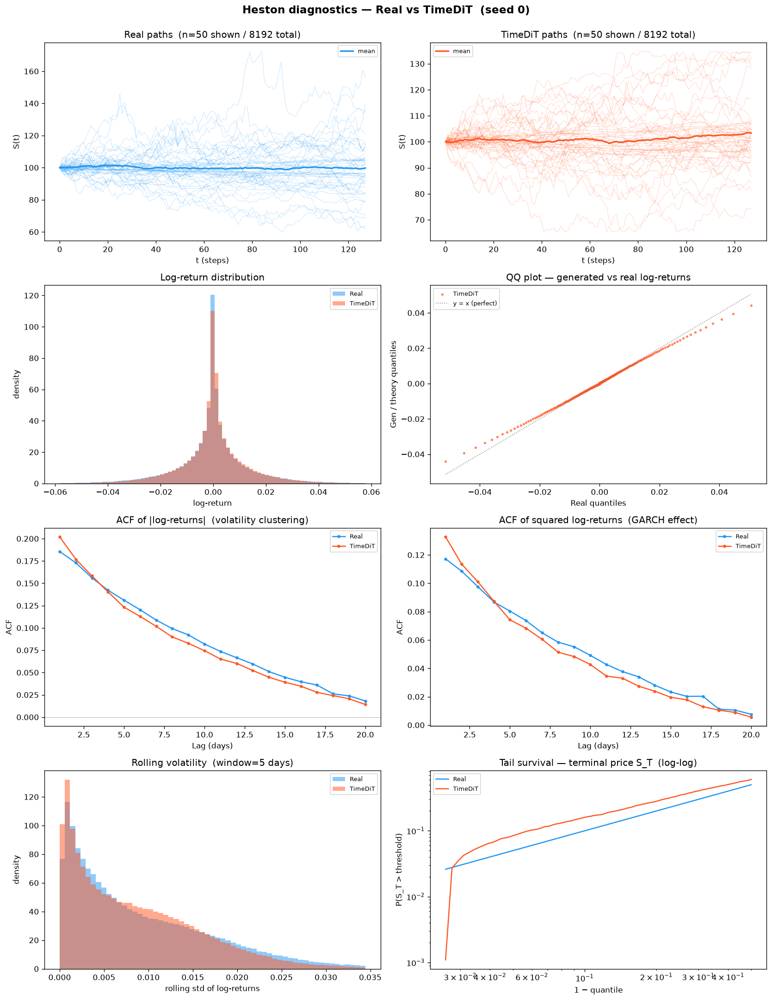
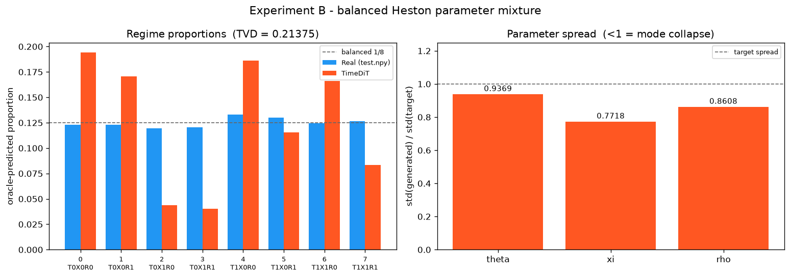

# Experiment B — Heston Parameter Mixture: cross-method comparison

**3 methods · 5 seeds each · 8192 × 128 paths per seed · shared seeds 0–4 · A100-SXM4-80GB · 2026-08-01**

| | CSDI (Diffusion) | TimeDiT (Diffusion Transformer) | LS4 (VAE) |
|---|---|---|---|
| Source | `methods/CSDI` (released `base.yaml`) | `methods/TimeDiT/code` (**reimplementation** — no official release) | `methods/LS4` (released `solar_weekly` preset) |
| Trainable parameters | 412,945 | 32,463,745 | 2,146,857 |
| Training length | 200 epochs | 15,000 optimiser steps (logged as 150 blocks of 100) | 100 epochs |
| Training, mean per seed | 3044 s (2749–3304) | 5271 s (4777–7150) | 1424 s (1328–1539) |
| Generation, mean per seed | 13.1 s (11.1–15.5) | 3163.7 s (2931–4093) | 9.4 s (9.2–9.9) |
| Preprocessing | affine standardization of raw prices | two-stage min-max then z-norm of raw prices | affine standardization of raw prices |
| Per-method README | [`CSDI/README.md`](CSDI/README.md) | [`TimeDiT/README.md`](TimeDiT/README.md) | [`LS4/README.md`](LS4/README.md) |

All three methods use the identical architecture, hyperparameters and wrapper as in Experiment A;
only the training data differs. None uses a log-return transform, a quantile map, or **path
shadowing**.

**Verdict, one line: TimeDiT wins Experiment B, and it is the first result in this tree where
adding a method changed the answer instead of only redistributing ties.** The 51-row protocol
table decomposes as **11 constants, 17 raw diagnostics the PDF forbids scoring (§4, §3.3, §5),
and 23 contested fidelity metrics**. Of those 23, **TimeDiT takes 7, CSDI 2, LS4 1, and 13 are
ties**. The standard battery goes **TimeDiT 16 / LS4 12 / CSDI 6**, and the curve-shape suite
goes **TimeDiT 23 / CSDI 6 / LS4 2**. For the first time the three suites agree on the ordering.

**What changed when TimeDiT was added, and what did not.** Before TimeDiT this page read
"CSDI 10, LS4 8, 5 ties" and called Experiment B a genuine split. Both of those methods scored
exactly what they scored before — **not one CSDI or LS4 number on this page moved.** The 18
rows they held between them redistribute exactly like this:

| Was | Became | Rows |
|---|---|---|
| CSDI | *tie* | 6 |
| CSDI | TimeDiT | 2 |
| CSDI | CSDI | 2 |
| LS4 | *tie* | 4 |
| LS4 | TimeDiT | 3 |
| LS4 | LS4 | 1 |
| *tie* | TimeDiT | 2 |
| *tie* | *tie* | 3 |

**Ten of their eighteen wins became ties and five went to TimeDiT.** Nothing moved between CSDI
and LS4 — not one row. The ties appear because `Winner` is gated on the paired interval between
the **best and the runner-up** (see *How `Winner` is decided* below), and on those ten rows
TimeDiT became the runner-up, sitting close enough that the interval no longer excludes zero.
As on Experiment A, **the tally is a property of the field, not of a method.** The difference
here is that the newcomer also took the lead outright, which did not happen on A.

**TimeDiT is better on the mixture and worse on the leverage curve, and both halves matter.**
It posts the lowest ×floor ratio of the three on regime-proportion TVD (**23×** vs CSDI 39×,
LS4 32×), on W̄_param (**30×** vs 47×, 52×) and on the realized-volatility Wasserstein (**15×**
vs 38×, 24×) — and the **worst** leverage-curve RMSE anywhere in this tree, 3.1× floor against
CSDI's 1.5×. It also cost **~337× LS4's generation time** and carries 15× its parameters.

**All three methods fail the mixture on the same axis, and it is not where the Feller ratio
predicts.** All three over-weight the low vol-of-vol half and starve the high vol-of-vol half —
CSDI +43 / −45 %, LS4 +52 / −54 %, TimeDiT +30 / −32 %. **ξ is the axis no model here can
represent.** What separates them is θ: CSDI and LS4 mis-allocate it in *opposite* directions,
and TimeDiT very nearly gets it right (−4 / +4 %).

---

## 1. PDF metrics — protocol evaluator

Produced by `dataset/Heston/new_experiments/protocol/experiments/scripts/evaluate_heston_parameter_mixture.py`,
**run unchanged** (PDF §7, checklist item 7). Aggregation: mean ± sample std (ddof = 1) over
5 seeds.

**The paired interval is available here** because all three methods were run on the same seeds
0–4; `tools/aggregate_pdf_metrics.py --paired-dir` verifies this from each JSON's
`sources.generated` field and refuses to pair otherwise. With three methods the paired columns
no longer fit inline, so they are emitted as **three separate blocks** below the main table —
CSDI vs TimeDiT, CSDI vs LS4, TimeDiT vs LS4. The `Mean diff` and `Paired 95% CI` columns in
each are the PDF §5 quantity itself.

**Read the CI before the means — on this experiment it changes the answer.** 13 of the 23
scored rows have a paired CI that contains zero, and they include **two of the four PRIMARY
metrics**:

* `regime_proportion_tvd` — means 0.194 (TimeDiT) vs 0.267 (LS4) vs 0.330 (CSDI). The gate is
  the best-vs-runner-up pair, TimeDiT vs LS4: **±0.0864 on a mean difference of −0.0727**. It
  straddles zero, so the row reads `tie`. TimeDiT's own seed spread is ±0.0338 and LS4's ±0.039;
  the gap is real on average and not yet reproducible seed by seed.
* `leverage_curve_rmse_lags_0_20` — CSDI 0.00580 best, LS4 0.00852 runner-up, **±0.00492 on
  −0.00271**, also straddling. TimeDiT is third here at 0.01195.

**Half the panel the protocol actually asks about is still undecided at 5 seeds** — that, not
the 7–2–1, is the headline of Section 1. It was the headline before TimeDiT existed too, for a
different pair of rows.

**How `Winner` is decided.** By distance to a per-metric reference, not "smaller wins":
error/distance/TVD/Wasserstein metrics reference 0; a `generated_*` quantity references its own
`target_*` row (the oracle's reading of `test.npy`). `target_*` rows are constants and get no
winner.

**With more than two methods, the interval that gates the row is the one between the best and
the runner-up** — not between the best and the worst. `make_comparison_tables.decide()` ranks
all three by distance to the reference, then asks whether the paired interval separating the
top two excludes zero; if it does not, the row is a `tie` no matter how far the third method
sits. This is why adding TimeDiT converted 8 previously-decided rows into ties without changing
a single CSDI or LS4 value: on those rows TimeDiT landed between the old winner and the old
loser, and the newly-relevant pair is closer together than the old one was.

**Some rows are deliberately left unscored.** The PDF names a class of quantities that carry a
value but no direction, and forbids turning them into a contest:

- §4 — novelty "does not have a universal monotone 'better' direction and must not be combined
  with fidelity metrics into a score."
- §3.3 — oracle posterior entropy, maximum probability and low-confidence fraction "are
  diagnostics, not separate winner-selection criteria."
- §5 — "All displayed fidelity metrics are errors or distances, so lower is better, **except
  explicitly identified raw diagnostics such as standard-deviation ratio, posterior confidence,
  group means, and novelty.**"

Those rows print their values and the word `diagnostic` with the clause that exempts them, and
they are excluded from every tally on this page. In Experiment B that covers **17 of the 51
rows**: 3 `novelty.*`, 3 posterior-confidence, 3 `*.std_ratio`, and the 8 raw
`generated_regime_proportions.*` bins — the last because the fidelity quantity built from them
is `regime_proportion_tvd`, and scoring each bin as well would count the same disagreement
eight more times.

**And no aggregate score is built.** PDF §3.4: *"No aggregate score should be constructed after
seeing model results."* The 7–2–1 above is a count of independently-decided rows, reported so a
reader can see the split; it is not a weighted index, and the four PRIMARY metrics of §1.1 are
the panel the protocol actually asks about. The same clause is why the two 51-row and 34-row
suites in Sections 2 and 3 are labelled as *our* battery and kept out of the protocol verdict.

> ⚠️ **The oracle used to score all three methods is a local refit, not the PDF's artefact.**
> `oracle.joblib` on this machine hashes to `a36d64eb…`; the PDF records `54c3f2c9…`. The file
> is ~554 MB and gitignored (`.gitignore:54`), so it was refit locally from
> `fit_heston_mixture_oracle.py`. Its gate passes — accuracy **0.909423828125 ≥ 0.90**, margin
> +0.00942 (77 paths of 8192) — but the classifier is not byte-identical to the author's.
> **For this comparison the consequence is nil in relative terms:** the *same* oracle scored
> CSDI, TimeDiT and LS4, on the same seeds, so every `Mean diff` and every paired CI below is
> instrument-consistent. Absolute distances from the floor carry the caveat; the differences
> between the three methods do not. Verify with `python tools/check_oracle_gate.py`. Full
> disclosure of both gate gaps is in [`CSDI/README.md`](CSDI/README.md) §1,
> [`TimeDiT/README.md`](TimeDiT/README.md) §1 and [`LS4/README.md`](LS4/README.md) §1.

### 1.1 PRIMARY panel

The four metrics PDF §3 designates as primary:

| Metric | CSDI | TimeDiT | LS4 | Perfect floor | × floor (CSDI / TimeDiT / LS4) | Winner |
|---|---|---|---|---|---|---|
| `mixture_fidelity.regime_proportion_tvd` | 0.33042 ± 0.0143 | **0.194141 ± 0.0338** | 0.26687 ± 0.039 | 0.00847168 ± 0.00129 | 39× / **23×** / 32× | *tie* |
| **W̄_param** *(derived — see below)* | 0.138631 ± 0.00416 | **0.0891679 ± 0.00604** | 0.155466 ± 0.00464 | 0.0029701 ± 0.000502 | 47× / **30×** / 52× | *(derived — not a scored row)* |
| `observable_fidelity.realized_volatility_wasserstein` | 0.0586454 ± 0.00303 | **0.0224224 ± 0.00418** | 0.0368266 ± 0.00187 | 0.00154572 ± 0.000216 | 38× / **15×** / 24× | TimeDiT |
| `observable_fidelity.leverage_curve_rmse_lags_0_20` | **0.0058035 ± 0.00238** | 0.0119523 ± 0.00353 | 0.00851555 ± 0.00264 | 0.00389969 ± 0.000993 | **1.5×** / 3.1× / 2.2× | *tie* |

**TimeDiT holds the best mean on three of the four and is worst on the fourth.** Two of those
three convert into a scored win and one does not, and that distinction is the entire purpose of
the paired column:

- `realized_volatility_wasserstein` **converts.** TimeDiT vs LS4 is −0.0144042 with a 95 %
  half-width of ±0.00598; the interval excludes zero, so the row is decided.
- **W̄_param converts through its components, not on its own.** It is a derived mean; PDF §3
  scores the three parameters individually, and TimeDiT takes θ and ξ (below).
- `regime_proportion_tvd` **does not convert.** TimeDiT's mean is 27 % below LS4's, but its own
  seed-to-seed spread is ±0.0338 and the paired difference against LS4 is −0.0727295 with a
  half-width of ±0.0864. The interval straddles zero, so the row is a tie. **The headline number
  is real; its reproducibility at five seeds is not established.**

**W̄_param derivation.** PDF §3.4 defines it as the mean over the three parameters of
`support_normalized_wasserstein`, computed **per seed first, then aggregated** — not as the mean
of three already-aggregated numbers. Per-parameter values (test):

| Parameter | CSDI | TimeDiT | LS4 | Perfect floor | Winner |
|---|---|---|---|---|---|
| `mixture_fidelity.parameters.theta.support_normalized_wasserstein` | 0.161236 ± 0.0114 | **0.0597516 ± 0.009** | 0.114659 ± 0.0387 | 0.00237222 ± 0.000584 | TimeDiT |
| `mixture_fidelity.parameters.xi.support_normalized_wasserstein` | 0.179548 ± 0.00443 | **0.13798 ± 0.0161** | 0.239191 ± 0.0337 | 0.00360015 ± 0.00129 | TimeDiT |
| `mixture_fidelity.parameters.rho.support_normalized_wasserstein` | 0.0751098 ± 0.00394 | **0.0697717 ± 0.0124** | 0.112548 ± 0.011 | 0.00293792 ± 0.00066 | *tie* |

TimeDiT takes θ (paired against CSDI: ±0.0114 on +0.101485) and ξ (±0.0189 on +0.0415679); both
intervals exclude zero. **ρ is the clearest single illustration of what adding a method does to
this page.** It used to read "CSDI, consistently — ±0.0158 on −0.0374 against LS4". CSDI's number
did not move. TimeDiT is now 0.0053 ahead of it against a ±0.0129 half-width, so the row that
separated CSDI from LS4 is no longer the row being tested, and it is undecided.

**The leverage result is still the best primary-metric number any method has posted on either
experiment, and TimeDiT did not move it.** CSDI at 1.5× floor and LS4 at 2.2× remain the only
primary cells anywhere in this tree inside a single order of magnitude of the floor, and the
paired interval between them (±0.00492 on −0.00271205) says they are not separated. TimeDiT sits
third at 3.1×. **The one structure every method here captures is the leverage effect, and the
method that leads everything else captures it worst.**

### 1.2 Where the mixture breaks

The eight regimes, sorted by Feller ratio `2κθ/ξ²`. Target proportions are a property of the
dataset, identical for every method and with zero seed variance:

| Regime | θ | ξ | Feller | Target proportion |
|---|---|---|---|---|
| 2 | 0.01 | 1.10 | 0.050 | 0.119629 |
| 3 | 0.01 | 1.10 | 0.050 | 0.120361 |
| 6 | 0.09 | 1.10 | 0.446 | 0.124268 |
| 7 | 0.09 | 1.10 | 0.446 | 0.126343 |
| 0 | 0.01 | 0.35 | 0.490 | 0.123169 |
| 1 | 0.01 | 0.35 | 0.490 | 0.122925 |
| 4 | 0.09 | 0.35 | 4.408 | 0.133057 |
| 5 | 0.09 | 0.35 | 4.408 | 0.130249 |

Attained proportions, same order (`× target` is attained ÷ target; 1.00 is perfect):

| Metric | CSDI | TimeDiT | LS4 | Perfect floor | × target (CSDI / TimeDiT / LS4) |
|---|---|---|---|---|---|
| `mixture_fidelity.generated_regime_proportions.2` | 0.0312012 ± 0.00275 | 0.058667 ± 0.0333 | 0.00078125 ± 0.000557 | 0.118506 ± 0.00137 | 0.26 / **0.49** / 0.01 |
| `mixture_fidelity.generated_regime_proportions.3` | 0.0351074 ± 0.00172 | 0.0440186 ± 0.0134 | 0.00168457 ± 0.000698 | 0.118774 ± 0.000707 | 0.29 / **0.37** / 0.01 |
| `mixture_fidelity.generated_regime_proportions.6` | 0.0964844 ± 0.0103 | 0.138696 ± 0.0251 | 0.110791 ± 0.0212 | 0.123413 ± 0.00377 | 0.78 / **1.12** / 0.89 |
| `mixture_fidelity.generated_regime_proportions.7` | 0.109302 ± 0.0086 | 0.0944824 ± 0.027 | 0.110571 ± 0.0176 | 0.123926 ± 0.00261 | **0.87** / 0.75 / 0.88 |
| `mixture_fidelity.generated_regime_proportions.0` | 0.296851 ± 0.01 | 0.188867 ± 0.0341 | 0.189526 ± 0.0394 | 0.123315 ± 0.00119 | 2.41 / **1.53** / 1.54 |
| `mixture_fidelity.generated_regime_proportions.1` | 0.279663 ± 0.0114 | 0.175244 ± 0.0146 | 0.196851 ± 0.0411 | 0.125098 ± 0.000986 | 2.28 / **1.43** / 1.60 |
| `mixture_fidelity.generated_regime_proportions.4` | 0.0773926 ± 0.00431 | 0.170435 ± 0.0428 | 0.195288 ± 0.0291 | 0.135107 ± 0.00329 | 0.58 / **1.28** / 1.47 |
| `mixture_fidelity.generated_regime_proportions.5` | 0.073999 ± 0.00335 | 0.12959 ± 0.0333 | 0.194507 ± 0.0136 | 0.13186 ± 0.00173 | 0.57 / **0.99** / 1.49 |

**LS4 does not merely under-weight regimes 2 and 3 — it annihilates them.** 0.078 % and 0.169 %
of the bank against a target of 12 %: roughly 6 and 14 paths out of 8192. Those are the two
lowest-Feller regimes, where the variance process slams into zero constantly, and LS4 simply
declines to produce them. CSDI keeps them at 26–29 % of target — still badly wrong, but it
covers all eight modes.

**TimeDiT is the only method that keeps every regime inside a factor of three of target.** Its
range is 0.37×–1.53×, against CSDI's 0.26×–2.41× and LS4's 0.01×–1.60×. It is also the only one
that produces the two lowest-Feller regimes in usable quantity: about 481 and 361 paths per bank
against CSDI's 256 and 288 and LS4's 6 and 14. **This is the mechanism behind its TVD, and it is
a coverage result rather than an accuracy one** — TimeDiT is not more accurate on any single
regime than the others, it is merely never catastrophically wrong on one.

**A stiffness story explains LS4 and fails on the other two.** LS4's error is close to monotone
in the Feller ratio: worst at 0.050, best in the middle. CSDI is not — it starves regimes 4
and 5 (Feller 4.408, the *best-behaved* regimes in the mixture) to 0.57–0.58× while over-filling
regimes 0 and 1. TimeDiT is not either: its worst regime, 3, sits at Feller 0.050, but its
second-worst, 7, sits at 0.446 while regime 6 at the *same* Feller ratio is its second-best. No
numerical-stiffness argument produces either ordering. Grouping the mass by parameter resolves
it:

| Split | Target mass | CSDI | TimeDiT | LS4 |
|---|---|---|---|---|
| ξ = 0.35 (regimes 0, 1, 4, 5) | 0.5094 | 0.7279 (**+43 %**) | 0.6641 (**+30 %**) | 0.7762 (**+52 %**) |
| ξ = 1.10 (regimes 2, 3, 6, 7) | 0.4906 | 0.2721 (**−45 %**) | 0.3359 (**−32 %**) | 0.2238 (**−54 %**) |
| θ = 0.01 (regimes 0, 1, 2, 3) | 0.4861 | 0.6428 (+32 %) | 0.4668 (−4 %) | 0.3888 (−20 %) |
| θ = 0.09 (regimes 4, 5, 6, 7) | 0.5139 | 0.3572 (−30 %) | 0.5332 (+4 %) | 0.6112 (+19 %) |

**All three methods fail on ξ, in the same direction, and adding a third one strengthened this
rather than complicating it.** None can generate enough high-vol-of-vol paths, so all three
flood the low-ξ half of the mixture: +43 %, +30 %, +52 %. Two methods agreeing was suggestive;
three methods from two different generative families agreeing makes it a property of the task.
Corroborated by the `std_ratio` diagnostics, where ξ is the worst-recovered parameter for **all
three** (CSDI 0.677446, TimeDiT 0.7727, LS4 0.724715 against a target of 1.0) while θ and ρ sit
between 0.75 and 0.96.

**The θ split is where they separate, and TimeDiT is the only one that gets it right** — −4 % and
+4 %, against CSDI's +32 %/−30 % and LS4's −20 %/+19 %, and the two incumbents are wrong in
*opposite* directions. That is what makes θ the parameter TimeDiT wins by the largest margin in
§1.1, and it is the single clearest thing the transformer does better here: it is the only
architecture that recovers the mean-reversion level as a two-mode distribution rather than
collapsing toward one of the modes.

### 1.3 Outside the mixture: autocorrelations versus marginals

The `observable_fidelity.*` block is not about the mixture at all — it is the ordinary
stylised-facts check, and it is the one part of this page where **LS4 does not win a single
row.** Counting rows would still hide the story, because the margins differ by an order of
magnitude, which is why the deciding interval is printed next to every row:

| Metric | CSDI | TimeDiT | LS4 | Perfect floor | Deciding pair, paired 95 % CI | Winner |
|---|---|---|---|---|---|---|
| `abs_return_acf_rmse_lags_1_50` | **0.011025 ± 0.00362** | 0.0320231 ± 0.0152 | 0.104407 ± 0.00656 | 0.0034538 ± 0.00121 | CSDI–TimeDiT: ±0.0174 on −0.0209981 | CSDI, 2.9× better than the runner-up |
| `squared_return_acf_rmse_lags_1_50` | **0.0169132 ± 0.00344** | 0.0417153 ± 0.00975 | 0.0369782 ± 0.00749 | 0.00729821 ± 0.00266 | CSDI–LS4: ±0.00891 on −0.020065 | CSDI |
| `realized_volatility_wasserstein` | 0.0586454 ± 0.00303 | **0.0224224 ± 0.00418** | 0.0368266 ± 0.00187 | 0.00154572 ± 0.000216 | TimeDiT–LS4: ±0.00598 on −0.0144042 | TimeDiT |
| `excess_kurtosis_error` | 2.55432 ± 0.737 | **1.60599 ± 0.917** | 2.71879 ± 0.223 | 0.143903 ± 0.185 | CSDI–TimeDiT: ±0.79 on +0.948327 | TimeDiT |
| `return_std_error` | 0.00403557 ± 0.000194 | **0.00125334 ± 0.000816** | 0.00149136 ± 0.000247 | 6.30604e-05 ± 3.92e-05 | TimeDiT–LS4: ±0.000883 on −0.000238024 | *tie* |
| `terminal_log_price_ks` | **0.0449219 ± 0.0105** | 0.0856934 ± 0.015 | 0.0519287 ± 0.0171 | 0.0102539 ± 0.00242 | CSDI–LS4: ±0.0294 on −0.00700684 | *tie* |

Together with `leverage_curve_rmse_lags_0_20` from §1.1 (a tie), the seven `observable_fidelity`
rows go **CSDI 2, TimeDiT 2, LS4 0, three ties.**

**CSDI owns the autocorrelations and TimeDiT owns the marginals, and neither owns both.** CSDI's
absolute-return ACF error is 9.5× smaller than LS4's and 2.9× smaller than TimeDiT's, and the
interval against its nearest rival still excludes zero. TimeDiT takes the two distributional
rows — realized-volatility Wasserstein and excess kurtosis — and loses both ACF rows outright.
**This is the same division that drives the 23–6–2 curve-shape result in Section 3**, where the
curves being scored are shapes of distributions rather than of autocorrelations.

**Two rows changed owner without either method changing its number.** `return_std_error` used to
read "LS4"; LS4 still posts 0.00149136 ± 0.000247, but TimeDiT posts 0.00125334 and the paired
interval between the two straddles zero, so the row is now undecided. `excess_kurtosis_error`
went the other way — it used to be a CSDI-vs-LS4 tie at ±1.07 on −0.164467, and TimeDiT's
1.60599 is far enough clear of CSDI (±0.79 on +0.948327) to decide it. **A row becoming decided
and a row becoming undecided are the same mechanism seen from two sides: the interval that
matters is the one between the best and the runner-up, and adding a method changes who those
are.**

**Novelty** separates them sharply too — but it has **no winner column, here or anywhere on this
page**. PDF §4: these values "diagnose exact or near-exact memorization. They do not have a
universal monotone 'better' direction and must not be combined with fidelity metrics into a
score." Read as a description of where each method's bank sits relative to the training set,
not as a contest:

| Novelty metric (diagnostic — §4, not scored) | CSDI | TimeDiT | LS4 | Perfect floor |
|---|---|---|---|---|
| `distinct_nearest_training_paths` | 2323.6 ± 41.2 | 2795.2 ± 152 | 3055.2 ± 248 | 2941.8 ± 24.5 |
| `mean_standardized_nearest_train_path_rmse` | 0.568307 ± 0.0122 | 0.764603 ± 0.0758 | 0.913301 ± 0.0866 | 0.808363 ± 0.00181 |
| `median_standardized_nearest_train_path_rmse` | 0.470814 ± 0.018 | 0.762712 ± 0.153 | 0.926082 ± 0.116 | 0.716746 ± 0.00338 |

The `Perfect floor` column is a reference point for reading the numbers, not a target to be
scored against; distance from it is neither a win nor a loss. Every value above is copied from
the §1.4 generated block, where these three rows render as `diagnostic (§4 novelty)`.

**The three methods occupy three different positions relative to the floor, and TimeDiT is the
one that sits on it.** CSDI's paths sit **34 % nearer the training set than a genuine DGP draw
does** (median 0.470814 against a floor of 0.716746) and touch the fewest distinct training
neighbours. LS4 sits *further* out than the floor on both RMSE rows. TimeDiT brackets the floor
— 0.764603 against 0.808363 on the mean, 0.762712 against 0.716746 on the median, and 2795.2
distinct neighbours against 2941.8 — which is what a bank that neither concentrates nor
disperses looks like.

**None of this is a win, and it is worth being explicit about why.** Sitting on the novelty floor
is the behaviour of a good generator *and* the behaviour of a generator that has failed in a way
these three statistics cannot see; PDF §4 forbids scoring it precisely because the direction is
not monotone. What the row does support is the narrower claim that TimeDiT's Section 1 results
are not bought by memorisation: a method that copied the training set would show CSDI's
signature, not the floor's. CSDI's concentration is the same signature it shows on Experiment A,
so it is a property of the method rather than of this dataset.

### 1.4 Full table

<!-- BEGIN GENERATED: experiment B table pdf -->
<table>
<tr><th rowspan="2">Metric</th><th>Diffusion</th><th>Diffusion Transformer</th><th>VAE</th><th rowspan="2">Perfect</th><th rowspan="2">Winner</th></tr>
<tr><th>CSDI</th><th>TimeDiT</th><th>LS4</th></tr>
<tr><td><code>mixture_fidelity.generated_low_confidence_fraction</code></td><td>0.4104 ± 0.0102</td><td>0.371411 ± 0.0146</td><td>0.37334 ± 0.0141</td><td>0.174683 ± 0.00361</td><td><i>diagnostic (§3.3 posterior confidence)</i></td></tr>
<tr><td><code>mixture_fidelity.generated_mean_max_probability</code></td><td>0.641929 ± 0.00439</td><td>0.666199 ± 0.00791</td><td>0.666752 ± 0.00569</td><td>0.792255 ± 0.00126</td><td><i>diagnostic (§3.3 posterior confidence)</i></td></tr>
<tr><td><code>mixture_fidelity.generated_mean_posterior_entropy</code></td><td>0.911906 ± 0.0109</td><td>0.853934 ± 0.0191</td><td>0.856733 ± 0.0131</td><td>0.600259 ± 0.00188</td><td><i>diagnostic (§3.3 posterior confidence)</i></td></tr>
<tr><td><code>mixture_fidelity.generated_regime_proportions.0</code></td><td>0.296851 ± 0.01</td><td>0.188867 ± 0.0341</td><td>0.189526 ± 0.0394</td><td>0.123315 ± 0.00119</td><td><i>diagnostic (§5 raw proportion)</i></td></tr>
<tr><td><code>mixture_fidelity.generated_regime_proportions.1</code></td><td>0.279663 ± 0.0114</td><td>0.175244 ± 0.0146</td><td>0.196851 ± 0.0411</td><td>0.125098 ± 0.000986</td><td><i>diagnostic (§5 raw proportion)</i></td></tr>
<tr><td><code>mixture_fidelity.generated_regime_proportions.2</code></td><td>0.0312012 ± 0.00275</td><td>0.058667 ± 0.0333</td><td>0.00078125 ± 0.000557</td><td>0.118506 ± 0.00137</td><td><i>diagnostic (§5 raw proportion)</i></td></tr>
<tr><td><code>mixture_fidelity.generated_regime_proportions.3</code></td><td>0.0351074 ± 0.00172</td><td>0.0440186 ± 0.0134</td><td>0.00168457 ± 0.000698</td><td>0.118774 ± 0.000707</td><td><i>diagnostic (§5 raw proportion)</i></td></tr>
<tr><td><code>mixture_fidelity.generated_regime_proportions.4</code></td><td>0.0773926 ± 0.00431</td><td>0.170435 ± 0.0428</td><td>0.195288 ± 0.0291</td><td>0.135107 ± 0.00329</td><td><i>diagnostic (§5 raw proportion)</i></td></tr>
<tr><td><code>mixture_fidelity.generated_regime_proportions.5</code></td><td>0.073999 ± 0.00335</td><td>0.12959 ± 0.0333</td><td>0.194507 ± 0.0136</td><td>0.13186 ± 0.00173</td><td><i>diagnostic (§5 raw proportion)</i></td></tr>
<tr><td><code>mixture_fidelity.generated_regime_proportions.6</code></td><td>0.0964844 ± 0.0103</td><td>0.138696 ± 0.0251</td><td>0.110791 ± 0.0212</td><td>0.123413 ± 0.00377</td><td><i>diagnostic (§5 raw proportion)</i></td></tr>
<tr><td><code>mixture_fidelity.generated_regime_proportions.7</code></td><td>0.109302 ± 0.0086</td><td>0.0944824 ± 0.027</td><td>0.110571 ± 0.0176</td><td>0.123926 ± 0.00261</td><td><i>diagnostic (§5 raw proportion)</i></td></tr>
<tr><td><code>mixture_fidelity.parameters.rho.mean_error</code></td><td>0.0226021 ± 0.0195</td><td>0.0916107 ± 0.052</td><td>0.0180758 ± 0.0118</td><td>0.00217876 ± 0.0024</td><td><i>tie</i></td></tr>
<tr><td><code>mixture_fidelity.parameters.rho.q05_error</code></td><td>0.0099726 ± 0.00234</td><td>0.006996 ± 0.00482</td><td>0.0980166 ± 0.0245</td><td>0.0007326 ± 0.000494</td><td><i>tie</i></td></tr>
<tr><td><code>mixture_fidelity.parameters.rho.q95_error</code></td><td>0.0144606 ± 0.00559</td><td>0.0101046 ± 0.00557</td><td>0.0939972 ± 0.00958</td><td>0.000924 ± 0.000753</td><td><i>tie</i></td></tr>
<tr><td><code>mixture_fidelity.parameters.rho.std_ratio</code></td><td>0.85191 ± 0.00828</td><td>0.884255 ± 0.0192</td><td>0.752922 ± 0.0256</td><td>0.998133 ± 0.00167</td><td><i>diagnostic (§5 std-deviation ratio)</i></td></tr>
<tr><td><code>mixture_fidelity.parameters.rho.support_normalized_wasserstein</code></td><td>0.0751098 ± 0.00394</td><td>0.0697717 ± 0.0124</td><td>0.112548 ± 0.011</td><td>0.00293792 ± 0.00066</td><td><i>tie</i></td></tr>
<tr><td><code>mixture_fidelity.parameters.rho.wasserstein</code></td><td>0.148717 ± 0.0078</td><td>0.138148 ± 0.0245</td><td>0.222845 ± 0.0218</td><td>0.00581707 ± 0.00131</td><td><i>tie</i></td></tr>
<tr><td><code>mixture_fidelity.parameters.theta.mean_error</code></td><td>0.0128947 ± 0.000916</td><td>0.00433576 ± 0.00149</td><td>0.00890553 ± 0.00366</td><td>0.000118867 ± 8.97e-05</td><td><i>tie</i></td></tr>
<tr><td><code>mixture_fidelity.parameters.theta.q05_error</code></td><td>3.46945e-19 ± 7.76e-19</td><td>0 ± 0</td><td>0.000138667 ± 3.48e-05</td><td>0 ± 0</td><td><i>tie</i></td></tr>
<tr><td><code>mixture_fidelity.parameters.theta.q95_error</code></td><td>0.000837333 ± 2.39e-05</td><td>6.4e-05 ± 3.04e-05</td><td>6.4e-05 ± 5.84e-05</td><td>2.77556e-18 ± 6.21e-18</td><td><i>tie</i></td></tr>
<tr><td><code>mixture_fidelity.parameters.theta.std_ratio</code></td><td>0.8367 ± 0.00879</td><td>0.952414 ± 0.0246</td><td>0.919967 ± 0.017</td><td>0.999393 ± 0.00205</td><td><i>diagnostic (§5 std-deviation ratio)</i></td></tr>
<tr><td><code>mixture_fidelity.parameters.theta.support_normalized_wasserstein</code></td><td>0.161236 ± 0.0114</td><td><b>0.0597516 ± 0.009</b></td><td>0.114659 ± 0.0387</td><td>0.00237222 ± 0.000584</td><td>TimeDiT</td></tr>
<tr><td><code>mixture_fidelity.parameters.theta.wasserstein</code></td><td>0.0128989 ± 0.000915</td><td><b>0.00478013 ± 0.00072</b></td><td>0.00917275 ± 0.0031</td><td>0.000189777 ± 4.68e-05</td><td>TimeDiT</td></tr>
<tr><td><code>mixture_fidelity.parameters.xi.mean_error</code></td><td>0.105508 ± 0.00579</td><td>0.0789575 ± 0.0244</td><td>0.179389 ± 0.0252</td><td>0.00209811 ± 0.00139</td><td><i>tie</i></td></tr>
<tr><td><code>mixture_fidelity.parameters.xi.q05_error</code></td><td>0.0056275 ± 0.00102</td><td>0.00675 ± 0.000685</td><td><b>0.00235 ± 0.000945</b></td><td>0.0001225 ± 0.000125</td><td>LS4</td></tr>
<tr><td><code>mixture_fidelity.parameters.xi.q95_error</code></td><td>0.0556775 ± 0.00377</td><td><b>0.02025 ± 0.00375</b></td><td>0.0602775 ± 0.0388</td><td>0.00025 ± 0.000177</td><td>TimeDiT</td></tr>
<tr><td><code>mixture_fidelity.parameters.xi.std_ratio</code></td><td>0.677446 ± 0.00693</td><td>0.7727 ± 0.0198</td><td>0.724715 ± 0.0599</td><td>1.00183 ± 0.000666</td><td><i>diagnostic (§5 std-deviation ratio)</i></td></tr>
<tr><td><code>mixture_fidelity.parameters.xi.support_normalized_wasserstein</code></td><td>0.179548 ± 0.00443</td><td><b>0.13798 ± 0.0161</b></td><td>0.239191 ± 0.0337</td><td>0.00360015 ± 0.00129</td><td>TimeDiT</td></tr>
<tr><td><code>mixture_fidelity.parameters.xi.wasserstein</code></td><td>0.134661 ± 0.00332</td><td><b>0.103485 ± 0.0121</b></td><td>0.179393 ± 0.0252</td><td>0.00270012 ± 0.000969</td><td>TimeDiT</td></tr>
<tr><td><code>mixture_fidelity.regime_proportion_tvd</code></td><td>0.33042 ± 0.0143</td><td>0.194141 ± 0.0338</td><td>0.26687 ± 0.039</td><td>0.00847168 ± 0.00129</td><td><i>tie</i></td></tr>
<tr><td><code>mixture_fidelity.target_low_confidence_fraction</code></td><td>0.171899 ± 5.46e-05</td><td>0.171875 ± 0</td><td>0.171875 ± 8.63e-05</td><td>0.171875 ± 0</td><td>—</td></tr>
<tr><td><code>mixture_fidelity.target_mean_max_probability</code></td><td>0.792163 ± 0</td><td>0.792163 ± 0</td><td>0.792163 ± 0</td><td>0.792163 ± 0</td><td>—</td></tr>
<tr><td><code>mixture_fidelity.target_mean_posterior_entropy</code></td><td>0.600794 ± 0</td><td>0.600794 ± 0</td><td>0.600794 ± 0</td><td>0.600794 ± 0</td><td>—</td></tr>
<tr><td><code>mixture_fidelity.target_regime_proportions.0</code></td><td>0.123169 ± 0</td><td>0.123169 ± 0</td><td>0.123169 ± 0</td><td>0.123169 ± 0</td><td>—</td></tr>
<tr><td><code>mixture_fidelity.target_regime_proportions.1</code></td><td>0.122925 ± 0</td><td>0.122925 ± 0</td><td>0.122925 ± 0</td><td>0.122925 ± 0</td><td>—</td></tr>
<tr><td><code>mixture_fidelity.target_regime_proportions.2</code></td><td>0.119629 ± 0</td><td>0.119629 ± 0</td><td>0.119629 ± 0</td><td>0.119629 ± 0</td><td>—</td></tr>
<tr><td><code>mixture_fidelity.target_regime_proportions.3</code></td><td>0.120361 ± 0</td><td>0.120361 ± 0</td><td>0.120361 ± 0</td><td>0.120361 ± 0</td><td>—</td></tr>
<tr><td><code>mixture_fidelity.target_regime_proportions.4</code></td><td>0.133057 ± 0</td><td>0.133057 ± 0</td><td>0.133057 ± 0</td><td>0.133057 ± 0</td><td>—</td></tr>
<tr><td><code>mixture_fidelity.target_regime_proportions.5</code></td><td>0.130249 ± 0</td><td>0.130249 ± 0</td><td>0.130249 ± 0</td><td>0.130249 ± 0</td><td>—</td></tr>
<tr><td><code>mixture_fidelity.target_regime_proportions.6</code></td><td>0.124268 ± 0</td><td>0.124268 ± 0</td><td>0.124268 ± 0</td><td>0.124268 ± 0</td><td>—</td></tr>
<tr><td><code>mixture_fidelity.target_regime_proportions.7</code></td><td>0.126343 ± 0</td><td>0.126343 ± 0</td><td>0.126343 ± 0</td><td>0.126343 ± 0</td><td>—</td></tr>
<tr><td><code>novelty.distinct_nearest_training_paths</code></td><td>2323.6 ± 41.2</td><td>2795.2 ± 152</td><td>3055.2 ± 248</td><td>2941.8 ± 24.5</td><td><i>diagnostic (§4 novelty)</i></td></tr>
<tr><td><code>novelty.mean_standardized_nearest_train_path_rmse</code></td><td>0.568307 ± 0.0122</td><td>0.764603 ± 0.0758</td><td>0.913301 ± 0.0866</td><td>0.808363 ± 0.00181</td><td><i>diagnostic (§4 novelty)</i></td></tr>
<tr><td><code>novelty.median_standardized_nearest_train_path_rmse</code></td><td>0.470814 ± 0.018</td><td>0.762712 ± 0.153</td><td>0.926082 ± 0.116</td><td>0.716746 ± 0.00338</td><td><i>diagnostic (§4 novelty)</i></td></tr>
<tr><td><code>observable_fidelity.abs_return_acf_rmse_lags_1_50</code></td><td><b>0.011025 ± 0.00362</b></td><td>0.0320231 ± 0.0152</td><td>0.104407 ± 0.00656</td><td>0.0034538 ± 0.00121</td><td>CSDI</td></tr>
<tr><td><code>observable_fidelity.excess_kurtosis_error</code></td><td>2.55432 ± 0.737</td><td><b>1.60599 ± 0.917</b></td><td>2.71879 ± 0.223</td><td>0.143903 ± 0.185</td><td>TimeDiT</td></tr>
<tr><td><code>observable_fidelity.leverage_curve_rmse_lags_0_20</code></td><td>0.0058035 ± 0.00238</td><td>0.0119523 ± 0.00353</td><td>0.00851555 ± 0.00264</td><td>0.00389969 ± 0.000993</td><td><i>tie</i></td></tr>
<tr><td><code>observable_fidelity.realized_volatility_wasserstein</code></td><td>0.0586454 ± 0.00303</td><td><b>0.0224224 ± 0.00418</b></td><td>0.0368266 ± 0.00187</td><td>0.00154572 ± 0.000216</td><td>TimeDiT</td></tr>
<tr><td><code>observable_fidelity.return_std_error</code></td><td>0.00403557 ± 0.000194</td><td>0.00125334 ± 0.000816</td><td>0.00149136 ± 0.000247</td><td>6.30604e-05 ± 3.92e-05</td><td><i>tie</i></td></tr>
<tr><td><code>observable_fidelity.squared_return_acf_rmse_lags_1_50</code></td><td><b>0.0169132 ± 0.00344</b></td><td>0.0417153 ± 0.00975</td><td>0.0369782 ± 0.00749</td><td>0.00729821 ± 0.00266</td><td>CSDI</td></tr>
<tr><td><code>observable_fidelity.terminal_log_price_ks</code></td><td>0.0449219 ± 0.0105</td><td>0.0856934 ± 0.015</td><td>0.0519287 ± 0.0171</td><td>0.0102539 ± 0.00242</td><td><i>tie</i></td></tr>
</table>

<p><b>Paired, aligned-seed: CSDI vs TimeDiT</b> (PDF §5, seedwise differences and paired 95% CI)</p>
<table>
<tr><th>Metric</th><th>Seedwise differences</th><th>Mean diff</th><th>Paired 95% CI</th></tr>
<tr><td><code>mixture_fidelity.generated_low_confidence_fraction</code></td><td>+0.05249, +0.04675, +0.01294, +0.02576, +0.05701</td><td>0.0389893 ± 0.0188</td><td>±0.0234</td></tr>
<tr><td><code>mixture_fidelity.generated_mean_max_probability</code></td><td>-0.03062, -0.03314, -0.01443, -0.01614, -0.02702</td><td>-0.0242696 ± 0.00851</td><td>±0.0106</td></tr>
<tr><td><code>mixture_fidelity.generated_mean_posterior_entropy</code></td><td>+0.05965, +0.06982, +0.04452, +0.03492, +0.08096</td><td>0.0579718 ± 0.0186</td><td>±0.0231</td></tr>
<tr><td><code>mixture_fidelity.generated_regime_proportions.0</code></td><td>+0.09253, +0.1493, +0.1519, +0.07288, +0.07336</td><td>0.107983 ± 0.0397</td><td>±0.0493</td></tr>
<tr><td><code>mixture_fidelity.generated_regime_proportions.1</code></td><td>+0.1154, +0.1212, +0.1178, +0.1083, +0.05945</td><td>0.104419 ± 0.0256</td><td>±0.0318</td></tr>
<tr><td><code>mixture_fidelity.generated_regime_proportions.2</code></td><td>-0.01379, +0.006836, -0.01465, -0.08594, -0.02979</td><td>-0.0274658 ± 0.0352</td><td>±0.0437</td></tr>
<tr><td><code>mixture_fidelity.generated_regime_proportions.3</code></td><td>-0.004639, -0.0332, -0.01172, +0.004639, +0.0003662</td><td>-0.00891113 ± 0.0149</td><td>±0.0185</td></tr>
<tr><td><code>mixture_fidelity.generated_regime_proportions.4</code></td><td>-0.1134, -0.1324, -0.1282, -0.02576, -0.06543</td><td>-0.093042 ± 0.0461</td><td>±0.0572</td></tr>
<tr><td><code>mixture_fidelity.generated_regime_proportions.5</code></td><td>-0.04089, -0.09094, -0.0946, -0.0304, -0.02112</td><td>-0.0555908 ± 0.0347</td><td>±0.0431</td></tr>
<tr><td><code>mixture_fidelity.generated_regime_proportions.6</code></td><td>-0.07373, -0.02026, -0.05713, -0.01965, -0.04028</td><td>-0.0422119 ± 0.0235</td><td>±0.0292</td></tr>
<tr><td><code>mixture_fidelity.generated_regime_proportions.7</code></td><td>+0.03857, -0.0004883, +0.03662, -0.02405, +0.02344</td><td>0.0148193 ± 0.0267</td><td>±0.0332</td></tr>
<tr><td><code>mixture_fidelity.parameters.rho.mean_error</code></td><td>-0.1184, +0.002175, -0.06177, -0.0846, -0.08243</td><td>-0.0690086 ± 0.0447</td><td>±0.0555</td></tr>
<tr><td><code>mixture_fidelity.parameters.rho.q05_error</code></td><td>+0.01122, -0.00066, -0.00132, -0.002277, +0.00792</td><td>0.0029766 ± 0.00616</td><td>±0.00764</td></tr>
<tr><td><code>mixture_fidelity.parameters.rho.q95_error</code></td><td>-0.001683, -0.00594, +0.00396, +0.00594, +0.0195</td><td>0.004356 ± 0.00968</td><td>±0.012</td></tr>
<tr><td><code>mixture_fidelity.parameters.rho.std_ratio</code></td><td>-0.01525, -0.03444, -0.01209, -0.03361, -0.06633</td><td>-0.0323444 ± 0.0216</td><td>±0.0268</td></tr>
<tr><td><code>mixture_fidelity.parameters.rho.support_normalized_wasserstein</code></td><td>-0.007845, +0.01962, -0.001009, +0.007297, +0.008629</td><td>0.00533807 ± 0.0104</td><td>±0.0129</td></tr>
<tr><td><code>mixture_fidelity.parameters.rho.wasserstein</code></td><td>-0.01553, +0.03884, -0.001997, +0.01445, +0.01709</td><td>0.0105694 ± 0.0206</td><td>±0.0256</td></tr>
<tr><td><code>mixture_fidelity.parameters.theta.mean_error</code></td><td>+0.0108, +0.008419, +0.008394, +0.007097, +0.008087</td><td>0.00855895 ± 0.00136</td><td>±0.00169</td></tr>
<tr><td><code>mixture_fidelity.parameters.theta.q05_error</code></td><td>+0, +1.735e-18, +0, +0, +0</td><td>3.46945e-19 ± 7.76e-19</td><td>±9.63e-19</td></tr>
<tr><td><code>mixture_fidelity.parameters.theta.q95_error</code></td><td>+0.0008, +0.0008, +0.0008, +0.0006933, +0.0007733</td><td>0.000773333 ± 4.62e-05</td><td>±5.73e-05</td></tr>
<tr><td><code>mixture_fidelity.parameters.theta.std_ratio</code></td><td>-0.1002, -0.1446, -0.1528, -0.0739, -0.1071</td><td>-0.115714 ± 0.0327</td><td>±0.0406</td></tr>
<tr><td><code>mixture_fidelity.parameters.theta.support_normalized_wasserstein</code></td><td>+0.1101, +0.1053, +0.105, +0.08613, +0.101</td><td>0.101485 ± 0.00917</td><td>±0.0114</td></tr>
<tr><td><code>mixture_fidelity.parameters.theta.wasserstein</code></td><td>+0.008808, +0.00842, +0.008397, +0.006891, +0.008078</td><td>0.00811878 ± 0.000734</td><td>±0.000911</td></tr>
<tr><td><code>mixture_fidelity.parameters.xi.mean_error</code></td><td>+0.01518, +0.01067, +0.01469, +0.06435, +0.02787</td><td>0.0265506 ± 0.0221</td><td>±0.0274</td></tr>
<tr><td><code>mixture_fidelity.parameters.xi.q05_error</code></td><td>-0.0008625, -0.00125, -0.00025, -0.00325, -5.551e-17</td><td>-0.0011225 ± 0.00129</td><td>±0.0016</td></tr>
<tr><td><code>mixture_fidelity.parameters.xi.q95_error</code></td><td>+0.028, +0.03739, +0.038, +0.039, +0.03475</td><td>0.0354275 ± 0.00444</td><td>±0.00551</td></tr>
<tr><td><code>mixture_fidelity.parameters.xi.std_ratio</code></td><td>-0.0903, -0.1054, -0.09346, -0.1186, -0.0685</td><td>-0.0952544 ± 0.0187</td><td>±0.0232</td></tr>
<tr><td><code>mixture_fidelity.parameters.xi.support_normalized_wasserstein</code></td><td>+0.03778, +0.03836, +0.03652, +0.0676, +0.02757</td><td>0.0415679 ± 0.0152</td><td>±0.0189</td></tr>
<tr><td><code>mixture_fidelity.parameters.xi.wasserstein</code></td><td>+0.02834, +0.02877, +0.02739, +0.0507, +0.02068</td><td>0.0311759 ± 0.0114</td><td>±0.0142</td></tr>
<tr><td><code>mixture_fidelity.regime_proportion_tvd</code></td><td>+0.1128, +0.1631, +0.1353, +0.1771, +0.09314</td><td>0.136279 ± 0.0346</td><td>±0.043</td></tr>
<tr><td><code>mixture_fidelity.target_low_confidence_fraction</code></td><td>+0, +0, +0, +0, +0.0001221</td><td>2.44141e-05 ± 5.46e-05</td><td>±6.78e-05</td></tr>
<tr><td><code>mixture_fidelity.target_mean_max_probability</code></td><td>+0, +0, +0, +0, +0</td><td>0 ± 0</td><td>±0</td></tr>
<tr><td><code>mixture_fidelity.target_mean_posterior_entropy</code></td><td>+0, +0, +0, +0, +0</td><td>0 ± 0</td><td>±0</td></tr>
<tr><td><code>mixture_fidelity.target_regime_proportions.0</code></td><td>+0, +0, +0, +0, +0</td><td>0 ± 0</td><td>±0</td></tr>
<tr><td><code>mixture_fidelity.target_regime_proportions.1</code></td><td>+0, +0, +0, +0, +0</td><td>0 ± 0</td><td>±0</td></tr>
<tr><td><code>mixture_fidelity.target_regime_proportions.2</code></td><td>+0, +0, +0, +0, +0</td><td>0 ± 0</td><td>±0</td></tr>
<tr><td><code>mixture_fidelity.target_regime_proportions.3</code></td><td>+0, +0, +0, +0, +0</td><td>0 ± 0</td><td>±0</td></tr>
<tr><td><code>mixture_fidelity.target_regime_proportions.4</code></td><td>+0, +0, +0, +0, +0</td><td>0 ± 0</td><td>±0</td></tr>
<tr><td><code>mixture_fidelity.target_regime_proportions.5</code></td><td>+0, +0, +0, +0, +0</td><td>0 ± 0</td><td>±0</td></tr>
<tr><td><code>mixture_fidelity.target_regime_proportions.6</code></td><td>+0, +0, +0, +0, +0</td><td>0 ± 0</td><td>±0</td></tr>
<tr><td><code>mixture_fidelity.target_regime_proportions.7</code></td><td>+0, +0, +0, +0, +0</td><td>0 ± 0</td><td>±0</td></tr>
<tr><td><code>novelty.distinct_nearest_training_paths</code></td><td>-370, -657, -686, -310, -335</td><td>-471.6 ± 184</td><td>±228</td></tr>
<tr><td><code>novelty.mean_standardized_nearest_train_path_rmse</code></td><td>-0.1664, -0.2673, -0.3072, -0.1303, -0.1104</td><td>-0.196296 ± 0.0866</td><td>±0.107</td></tr>
<tr><td><code>novelty.median_standardized_nearest_train_path_rmse</code></td><td>-0.2747, -0.4532, -0.4782, -0.1388, -0.1145</td><td>-0.291898 ± 0.17</td><td>±0.211</td></tr>
<tr><td><code>observable_fidelity.abs_return_acf_rmse_lags_1_50</code></td><td>-0.03076, -0.0289, -0.02297, -0.0258, +0.003442</td><td>-0.0209981 ± 0.014</td><td>±0.0174</td></tr>
<tr><td><code>observable_fidelity.excess_kurtosis_error</code></td><td>+0.9803, +1.201, -0.1317, +1.154, +1.538</td><td>0.948327 ± 0.637</td><td>±0.79</td></tr>
<tr><td><code>observable_fidelity.leverage_curve_rmse_lags_0_20</code></td><td>-0.009247, -0.002536, -0.005657, -0.01266, -0.0006467</td><td>-0.00614879 ± 0.00489</td><td>±0.00607</td></tr>
<tr><td><code>observable_fidelity.realized_volatility_wasserstein</code></td><td>+0.03739, +0.04328, +0.0399, +0.03291, +0.02763</td><td>0.036223 ± 0.00611</td><td>±0.00759</td></tr>
<tr><td><code>observable_fidelity.return_std_error</code></td><td>+0.002447, +0.004033, +0.003615, +0.00198, +0.001837</td><td>0.00278223 ± 0.000988</td><td>±0.00123</td></tr>
<tr><td><code>observable_fidelity.squared_return_acf_rmse_lags_1_50</code></td><td>-0.02668, -0.03221, -0.03404, -0.02355, -0.007527</td><td>-0.0248021 ± 0.0105</td><td>±0.0131</td></tr>
<tr><td><code>observable_fidelity.terminal_log_price_ks</code></td><td>-0.07751, -0.0293, -0.02197, -0.05164, -0.02344</td><td>-0.0407715 ± 0.0237</td><td>±0.0295</td></tr>
</table>

<p><b>Paired, aligned-seed: CSDI vs LS4</b> (PDF §5, seedwise differences and paired 95% CI)</p>
<table>
<tr><th>Metric</th><th>Seedwise differences</th><th>Mean diff</th><th>Paired 95% CI</th></tr>
<tr><td><code>mixture_fidelity.generated_low_confidence_fraction</code></td><td>+0.03967, +0.01172, +0.03857, +0.02832, +0.06702</td><td>0.0370605 ± 0.0202</td><td>±0.025</td></tr>
<tr><td><code>mixture_fidelity.generated_mean_max_probability</code></td><td>-0.02461, -0.01574, -0.02304, -0.02235, -0.03837</td><td>-0.0248226 ± 0.0083</td><td>±0.0103</td></tr>
<tr><td><code>mixture_fidelity.generated_mean_posterior_entropy</code></td><td>+0.05053, +0.0264, +0.05518, +0.05973, +0.08403</td><td>0.055173 ± 0.0206</td><td>±0.0256</td></tr>
<tr><td><code>mixture_fidelity.generated_regime_proportions.0</code></td><td>+0.1195, +0.1326, +0.1276, +0.02698, +0.13</td><td>0.107324 ± 0.0452</td><td>±0.0561</td></tr>
<tr><td><code>mixture_fidelity.generated_regime_proportions.1</code></td><td>+0.1036, +0.1283, +0.09753, +0.01013, +0.07446</td><td>0.0828125 ± 0.0449</td><td>±0.0558</td></tr>
<tr><td><code>mixture_fidelity.generated_regime_proportions.2</code></td><td>+0.02869, +0.03345, +0.03015, +0.02734, +0.03247</td><td>0.0304199 ± 0.00255</td><td>±0.00316</td></tr>
<tr><td><code>mixture_fidelity.generated_regime_proportions.3</code></td><td>+0.03394, +0.03235, +0.03162, +0.03601, +0.0332</td><td>0.0334229 ± 0.00169</td><td>±0.0021</td></tr>
<tr><td><code>mixture_fidelity.generated_regime_proportions.4</code></td><td>-0.1414, -0.1434, -0.1254, -0.0647, -0.1146</td><td>-0.117896 ± 0.032</td><td>±0.0397</td></tr>
<tr><td><code>mixture_fidelity.generated_regime_proportions.5</code></td><td>-0.1163, -0.1326, -0.1272, -0.09351, -0.1329</td><td>-0.120508 ± 0.0165</td><td>±0.0205</td></tr>
<tr><td><code>mixture_fidelity.generated_regime_proportions.6</code></td><td>-0.03101, -0.04236, -0.02087, +0.03101, -0.008301</td><td>-0.0143066 ± 0.0283</td><td>±0.0351</td></tr>
<tr><td><code>mixture_fidelity.generated_regime_proportions.7</code></td><td>+0.00293, -0.008301, -0.01343, +0.02673, -0.01428</td><td>-0.00126953 ± 0.0171</td><td>±0.0212</td></tr>
<tr><td><code>mixture_fidelity.parameters.rho.mean_error</code></td><td>+0.01707, -0.01054, +0.01646, -0.0342, +0.03385</td><td>0.00452632 ± 0.0269</td><td>±0.0333</td></tr>
<tr><td><code>mixture_fidelity.parameters.rho.q05_error</code></td><td>-0.0792, -0.07722, -0.07326, -0.131, -0.07956</td><td>-0.088044 ± 0.0241</td><td>±0.03</td></tr>
<tr><td><code>mixture_fidelity.parameters.rho.q95_error</code></td><td>-0.07626, -0.08484, -0.0792, -0.09768, -0.0597</td><td>-0.0795366 ± 0.0138</td><td>±0.0171</td></tr>
<tr><td><code>mixture_fidelity.parameters.rho.std_ratio</code></td><td>+0.08511, +0.1026, +0.1005, +0.1426, +0.06418</td><td>0.0989881 ± 0.0288</td><td>±0.0358</td></tr>
<tr><td><code>mixture_fidelity.parameters.rho.support_normalized_wasserstein</code></td><td>-0.03101, -0.03933, -0.0393, -0.05602, -0.02153</td><td>-0.0374381 ± 0.0127</td><td>±0.0158</td></tr>
<tr><td><code>mixture_fidelity.parameters.rho.wasserstein</code></td><td>-0.06141, -0.07787, -0.07782, -0.1109, -0.04263</td><td>-0.0741274 ± 0.0252</td><td>±0.0313</td></tr>
<tr><td><code>mixture_fidelity.parameters.theta.mean_error</code></td><td>+0.002126, +0.001534, +0.004594, +0.009121, +0.002571</td><td>0.00398917 ± 0.00309</td><td>±0.00384</td></tr>
<tr><td><code>mixture_fidelity.parameters.theta.q05_error</code></td><td>-0.00016, -0.0001333, -0.00016, -8e-05, -0.00016</td><td>-0.000138667 ± 3.48e-05</td><td>±4.32e-05</td></tr>
<tr><td><code>mixture_fidelity.parameters.theta.q95_error</code></td><td>+0.0008, +0.0008267, +0.0008, +0.00064, +0.0008</td><td>0.000773333 ± 7.54e-05</td><td>±9.36e-05</td></tr>
<tr><td><code>mixture_fidelity.parameters.theta.std_ratio</code></td><td>-0.0747, -0.06207, -0.1046, -0.08247, -0.09249</td><td>-0.0832668 ± 0.0163</td><td>±0.0203</td></tr>
<tr><td><code>mixture_fidelity.parameters.theta.support_normalized_wasserstein</code></td><td>+0.02663, +0.0192, +0.05747, +0.09738, +0.03221</td><td>0.046577 ± 0.0318</td><td>±0.0395</td></tr>
<tr><td><code>mixture_fidelity.parameters.theta.wasserstein</code></td><td>+0.002131, +0.001536, +0.004597, +0.00779, +0.002577</td><td>0.00372616 ± 0.00255</td><td>±0.00316</td></tr>
<tr><td><code>mixture_fidelity.parameters.xi.mean_error</code></td><td>-0.06628, -0.05164, -0.06251, -0.1194, -0.06958</td><td>-0.0738813 ± 0.0263</td><td>±0.0327</td></tr>
<tr><td><code>mixture_fidelity.parameters.xi.q05_error</code></td><td>+0.003887, +0.0025, +0.00425, +0.0005, +0.00525</td><td>0.0032775 ± 0.00184</td><td>±0.00228</td></tr>
<tr><td><code>mixture_fidelity.parameters.xi.q95_error</code></td><td>+0.0055, +0.01489, +0.01775, -0.07689, +0.01575</td><td>-0.0046 ± 0.0407</td><td>±0.0505</td></tr>
<tr><td><code>mixture_fidelity.parameters.xi.std_ratio</code></td><td>-0.0693, -0.07311, -0.08112, +0.06645, -0.07927</td><td>-0.0472692 ± 0.0637</td><td>±0.0791</td></tr>
<tr><td><code>mixture_fidelity.parameters.xi.support_normalized_wasserstein</code></td><td>-0.04541, -0.03369, -0.04727, -0.121, -0.05082</td><td>-0.059643 ± 0.0349</td><td>±0.0433</td></tr>
<tr><td><code>mixture_fidelity.parameters.xi.wasserstein</code></td><td>-0.03406, -0.02527, -0.03545, -0.09077, -0.03811</td><td>-0.0447323 ± 0.0262</td><td>±0.0325</td></tr>
<tr><td><code>mixture_fidelity.regime_proportion_tvd</code></td><td>+0.08105, +0.1003, +0.08838, -0.01758, +0.06555</td><td>0.0635498 ± 0.0471</td><td>±0.0584</td></tr>
<tr><td><code>mixture_fidelity.target_low_confidence_fraction</code></td><td>+0, +0, -0.0001221, +0, +0.0002441</td><td>2.44141e-05 ± 0.000134</td><td>±0.000166</td></tr>
<tr><td><code>mixture_fidelity.target_mean_max_probability</code></td><td>+0, +0, +0, +0, +0</td><td>0 ± 0</td><td>±0</td></tr>
<tr><td><code>mixture_fidelity.target_mean_posterior_entropy</code></td><td>+0, +0, +0, +0, +0</td><td>0 ± 0</td><td>±0</td></tr>
<tr><td><code>mixture_fidelity.target_regime_proportions.0</code></td><td>+0, +0, +0, +0, +0</td><td>0 ± 0</td><td>±0</td></tr>
<tr><td><code>mixture_fidelity.target_regime_proportions.1</code></td><td>+0, +0, +0, +0, +0</td><td>0 ± 0</td><td>±0</td></tr>
<tr><td><code>mixture_fidelity.target_regime_proportions.2</code></td><td>+0, +0, +0, +0, +0</td><td>0 ± 0</td><td>±0</td></tr>
<tr><td><code>mixture_fidelity.target_regime_proportions.3</code></td><td>+0, +0, +0, +0, +0</td><td>0 ± 0</td><td>±0</td></tr>
<tr><td><code>mixture_fidelity.target_regime_proportions.4</code></td><td>+0, +0, +0, +0, +0</td><td>0 ± 0</td><td>±0</td></tr>
<tr><td><code>mixture_fidelity.target_regime_proportions.5</code></td><td>+0, +0, +0, +0, +0</td><td>0 ± 0</td><td>±0</td></tr>
<tr><td><code>mixture_fidelity.target_regime_proportions.6</code></td><td>+0, +0, +0, +0, +0</td><td>0 ± 0</td><td>±0</td></tr>
<tr><td><code>mixture_fidelity.target_regime_proportions.7</code></td><td>+0, +0, +0, +0, +0</td><td>0 ± 0</td><td>±0</td></tr>
<tr><td><code>novelty.distinct_nearest_training_paths</code></td><td>-857, -900, -832, -229, -840</td><td>-731.6 ± 282</td><td>±350</td></tr>
<tr><td><code>novelty.mean_standardized_nearest_train_path_rmse</code></td><td>-0.3879, -0.4028, -0.381, -0.1749, -0.3785</td><td>-0.344994 ± 0.0956</td><td>±0.119</td></tr>
<tr><td><code>novelty.median_standardized_nearest_train_path_rmse</code></td><td>-0.4927, -0.5415, -0.5072, -0.2303, -0.5047</td><td>-0.455268 ± 0.127</td><td>±0.158</td></tr>
<tr><td><code>observable_fidelity.abs_return_acf_rmse_lags_1_50</code></td><td>-0.09792, -0.09759, -0.08375, -0.09939, -0.08826</td><td>-0.0933824 ± 0.00695</td><td>±0.00863</td></tr>
<tr><td><code>observable_fidelity.excess_kurtosis_error</code></td><td>+0.1462, +1.048, -0.2785, -1.303, -0.435</td><td>-0.164467 ± 0.858</td><td>±1.07</td></tr>
<tr><td><code>observable_fidelity.leverage_curve_rmse_lags_0_20</code></td><td>-0.002668, -0.008303, +0.001146, -0.004635, +0.0008995</td><td>-0.00271205 ± 0.00397</td><td>±0.00492</td></tr>
<tr><td><code>observable_fidelity.realized_volatility_wasserstein</code></td><td>+0.01961, +0.02329, +0.0269, +0.01912, +0.02017</td><td>0.0218187 ± 0.00328</td><td>±0.00407</td></tr>
<tr><td><code>observable_fidelity.return_std_error</code></td><td>+0.002508, +0.002832, +0.002988, +0.001878, +0.002515</td><td>0.00254421 ± 0.000426</td><td>±0.000529</td></tr>
<tr><td><code>observable_fidelity.squared_return_acf_rmse_lags_1_50</code></td><td>-0.01147, -0.03117, -0.01768, -0.02129, -0.01871</td><td>-0.020065 ± 0.00718</td><td>±0.00891</td></tr>
<tr><td><code>observable_fidelity.terminal_log_price_ks</code></td><td>-0.01465, -0.01831, +0.01819, -0.03662, +0.01636</td><td>-0.00700684 ± 0.0237</td><td>±0.0294</td></tr>
</table>

<p><b>Paired, aligned-seed: TimeDiT vs LS4</b> (PDF §5, seedwise differences and paired 95% CI)</p>
<table>
<tr><th>Metric</th><th>Seedwise differences</th><th>Mean diff</th><th>Paired 95% CI</th></tr>
<tr><td><code>mixture_fidelity.generated_low_confidence_fraction</code></td><td>-0.01282, -0.03503, +0.02563, +0.002563, +0.01001</td><td>-0.00192871 ± 0.0231</td><td>±0.0287</td></tr>
<tr><td><code>mixture_fidelity.generated_mean_max_probability</code></td><td>+0.006005, +0.01741, -0.008616, -0.006206, -0.01135</td><td>-0.000553052 ± 0.012</td><td>±0.0149</td></tr>
<tr><td><code>mixture_fidelity.generated_mean_posterior_entropy</code></td><td>-0.009121, -0.04341, +0.01066, +0.02482, +0.003065</td><td>-0.00279885 ± 0.0258</td><td>±0.0321</td></tr>
<tr><td><code>mixture_fidelity.generated_regime_proportions.0</code></td><td>+0.02698, -0.01672, -0.02429, -0.0459, +0.05664</td><td>-0.00065918 ± 0.0416</td><td>±0.0516</td></tr>
<tr><td><code>mixture_fidelity.generated_regime_proportions.1</code></td><td>-0.01172, +0.00708, -0.02026, -0.09814, +0.01501</td><td>-0.0216064 ± 0.0451</td><td>±0.0559</td></tr>
<tr><td><code>mixture_fidelity.generated_regime_proportions.2</code></td><td>+0.04248, +0.02661, +0.0448, +0.1133, +0.06226</td><td>0.0578857 ± 0.0334</td><td>±0.0415</td></tr>
<tr><td><code>mixture_fidelity.generated_regime_proportions.3</code></td><td>+0.03857, +0.06555, +0.04333, +0.03137, +0.03284</td><td>0.042334 ± 0.0138</td><td>±0.0172</td></tr>
<tr><td><code>mixture_fidelity.generated_regime_proportions.4</code></td><td>-0.02795, -0.01099, +0.002808, -0.03894, -0.04919</td><td>-0.0248535 ± 0.021</td><td>±0.026</td></tr>
<tr><td><code>mixture_fidelity.generated_regime_proportions.5</code></td><td>-0.07544, -0.04163, -0.03259, -0.06311, -0.1118</td><td>-0.064917 ± 0.0312</td><td>±0.0388</td></tr>
<tr><td><code>mixture_fidelity.generated_regime_proportions.6</code></td><td>+0.04272, -0.02209, +0.03625, +0.05066, +0.03198</td><td>0.0279053 ± 0.0288</td><td>±0.0358</td></tr>
<tr><td><code>mixture_fidelity.generated_regime_proportions.7</code></td><td>-0.03564, -0.007812, -0.05005, +0.05078, -0.03772</td><td>-0.0160889 ± 0.0404</td><td>±0.0502</td></tr>
<tr><td><code>mixture_fidelity.parameters.rho.mean_error</code></td><td>+0.1355, -0.01272, +0.07822, +0.0504, +0.1163</td><td>0.0735349 ± 0.0584</td><td>±0.0726</td></tr>
<tr><td><code>mixture_fidelity.parameters.rho.q05_error</code></td><td>-0.09042, -0.07656, -0.07194, -0.1287, -0.08748</td><td>-0.0910206 ± 0.0224</td><td>±0.0278</td></tr>
<tr><td><code>mixture_fidelity.parameters.rho.q95_error</code></td><td>-0.07458, -0.0789, -0.08316, -0.1036, -0.0792</td><td>-0.0838926 ± 0.0114</td><td>±0.0142</td></tr>
<tr><td><code>mixture_fidelity.parameters.rho.std_ratio</code></td><td>+0.1004, +0.137, +0.1126, +0.1762, +0.1305</td><td>0.131333 ± 0.029</td><td>±0.036</td></tr>
<tr><td><code>mixture_fidelity.parameters.rho.support_normalized_wasserstein</code></td><td>-0.02317, -0.05895, -0.03829, -0.06331, -0.03016</td><td>-0.0427761 ± 0.0177</td><td>±0.0219</td></tr>
<tr><td><code>mixture_fidelity.parameters.rho.wasserstein</code></td><td>-0.04588, -0.1167, -0.07582, -0.1254, -0.05971</td><td>-0.0846968 ± 0.035</td><td>±0.0434</td></tr>
<tr><td><code>mixture_fidelity.parameters.theta.mean_error</code></td><td>-0.008673, -0.006884, -0.0038, +0.002024, -0.005516</td><td>-0.00456978 ± 0.0041</td><td>±0.00509</td></tr>
<tr><td><code>mixture_fidelity.parameters.theta.q05_error</code></td><td>-0.00016, -0.0001333, -0.00016, -8e-05, -0.00016</td><td>-0.000138667 ± 3.48e-05</td><td>±4.32e-05</td></tr>
<tr><td><code>mixture_fidelity.parameters.theta.q95_error</code></td><td>+1.388e-17, +2.667e-05, +1.388e-17, -5.333e-05, +2.667e-05</td><td>1.11022e-17 ± 3.27e-05</td><td>±4.05e-05</td></tr>
<tr><td><code>mixture_fidelity.parameters.theta.std_ratio</code></td><td>+0.02547, +0.08251, +0.04822, -0.008563, +0.0146</td><td>0.0324474 ± 0.0347</td><td>±0.043</td></tr>
<tr><td><code>mixture_fidelity.parameters.theta.support_normalized_wasserstein</code></td><td>-0.08347, -0.08605, -0.0475, +0.01124, -0.06876</td><td>-0.0549078 ± 0.04</td><td>±0.0497</td></tr>
<tr><td><code>mixture_fidelity.parameters.theta.wasserstein</code></td><td>-0.006677, -0.006884, -0.0038, +0.0008993, -0.005501</td><td>-0.00439262 ± 0.0032</td><td>±0.00398</td></tr>
<tr><td><code>mixture_fidelity.parameters.xi.mean_error</code></td><td>-0.08146, -0.06231, -0.07719, -0.1837, -0.09745</td><td>-0.100432 ± 0.0482</td><td>±0.0599</td></tr>
<tr><td><code>mixture_fidelity.parameters.xi.q05_error</code></td><td>+0.00475, +0.00375, +0.0045, +0.00375, +0.00525</td><td>0.0044 ± 0.000652</td><td>±0.000809</td></tr>
<tr><td><code>mixture_fidelity.parameters.xi.q95_error</code></td><td>-0.0225, -0.0225, -0.02025, -0.1159, -0.019</td><td>-0.0400275 ± 0.0424</td><td>±0.0527</td></tr>
<tr><td><code>mixture_fidelity.parameters.xi.std_ratio</code></td><td>+0.021, +0.03228, +0.01234, +0.1851, -0.01077</td><td>0.0479852 ± 0.0782</td><td>±0.0971</td></tr>
<tr><td><code>mixture_fidelity.parameters.xi.support_normalized_wasserstein</code></td><td>-0.08319, -0.07205, -0.08379, -0.1886, -0.07839</td><td>-0.101211 ± 0.0491</td><td>±0.0609</td></tr>
<tr><td><code>mixture_fidelity.parameters.xi.wasserstein</code></td><td>-0.0624, -0.05404, -0.06285, -0.1415, -0.05879</td><td>-0.0759082 ± 0.0368</td><td>±0.0457</td></tr>
<tr><td><code>mixture_fidelity.regime_proportion_tvd</code></td><td>-0.03174, -0.06274, -0.04688, -0.1947, -0.02759</td><td>-0.0727295 ± 0.0696</td><td>±0.0864</td></tr>
<tr><td><code>mixture_fidelity.target_low_confidence_fraction</code></td><td>+0, +0, -0.0001221, +0, +0.0001221</td><td>0 ± 8.63e-05</td><td>±0.000107</td></tr>
<tr><td><code>mixture_fidelity.target_mean_max_probability</code></td><td>+0, +0, +0, +0, +0</td><td>0 ± 0</td><td>±0</td></tr>
<tr><td><code>mixture_fidelity.target_mean_posterior_entropy</code></td><td>+0, +0, +0, +0, +0</td><td>0 ± 0</td><td>±0</td></tr>
<tr><td><code>mixture_fidelity.target_regime_proportions.0</code></td><td>+0, +0, +0, +0, +0</td><td>0 ± 0</td><td>±0</td></tr>
<tr><td><code>mixture_fidelity.target_regime_proportions.1</code></td><td>+0, +0, +0, +0, +0</td><td>0 ± 0</td><td>±0</td></tr>
<tr><td><code>mixture_fidelity.target_regime_proportions.2</code></td><td>+0, +0, +0, +0, +0</td><td>0 ± 0</td><td>±0</td></tr>
<tr><td><code>mixture_fidelity.target_regime_proportions.3</code></td><td>+0, +0, +0, +0, +0</td><td>0 ± 0</td><td>±0</td></tr>
<tr><td><code>mixture_fidelity.target_regime_proportions.4</code></td><td>+0, +0, +0, +0, +0</td><td>0 ± 0</td><td>±0</td></tr>
<tr><td><code>mixture_fidelity.target_regime_proportions.5</code></td><td>+0, +0, +0, +0, +0</td><td>0 ± 0</td><td>±0</td></tr>
<tr><td><code>mixture_fidelity.target_regime_proportions.6</code></td><td>+0, +0, +0, +0, +0</td><td>0 ± 0</td><td>±0</td></tr>
<tr><td><code>mixture_fidelity.target_regime_proportions.7</code></td><td>+0, +0, +0, +0, +0</td><td>0 ± 0</td><td>±0</td></tr>
<tr><td><code>novelty.distinct_nearest_training_paths</code></td><td>-487, -243, -146, +81, -505</td><td>-260 ± 246</td><td>±305</td></tr>
<tr><td><code>novelty.mean_standardized_nearest_train_path_rmse</code></td><td>-0.2215, -0.1355, -0.0738, -0.04453, -0.2681</td><td>-0.148698 ± 0.0951</td><td>±0.118</td></tr>
<tr><td><code>novelty.median_standardized_nearest_train_path_rmse</code></td><td>-0.218, -0.08829, -0.029, -0.09147, -0.3901</td><td>-0.163369 ± 0.144</td><td>±0.179</td></tr>
<tr><td><code>observable_fidelity.abs_return_acf_rmse_lags_1_50</code></td><td>-0.06716, -0.06869, -0.06078, -0.07359, -0.0917</td><td>-0.0723843 ± 0.0117</td><td>±0.0146</td></tr>
<tr><td><code>observable_fidelity.excess_kurtosis_error</code></td><td>-0.8341, -0.1533, -0.1468, -2.457, -1.973</td><td>-1.11279 ± 1.06</td><td>±1.31</td></tr>
<tr><td><code>observable_fidelity.leverage_curve_rmse_lags_0_20</code></td><td>+0.006579, -0.005767, +0.006804, +0.008021, +0.001546</td><td>0.00343675 ± 0.00571</td><td>±0.00709</td></tr>
<tr><td><code>observable_fidelity.realized_volatility_wasserstein</code></td><td>-0.01778, -0.01998, -0.013, -0.01379, -0.007467</td><td>-0.0144042 ± 0.00482</td><td>±0.00598</td></tr>
<tr><td><code>observable_fidelity.return_std_error</code></td><td>+6.165e-05, -0.001201, -0.0006263, -0.0001022, +0.0006775</td><td>-0.000238024 ± 0.000711</td><td>±0.000883</td></tr>
<tr><td><code>observable_fidelity.squared_return_acf_rmse_lags_1_50</code></td><td>+0.0152, +0.001039, +0.01637, +0.002262, -0.01119</td><td>0.00473708 ± 0.0114</td><td>±0.0141</td></tr>
<tr><td><code>observable_fidelity.terminal_log_price_ks</code></td><td>+0.06287, +0.01099, +0.04016, +0.01501, +0.03979</td><td>0.0337646 ± 0.0212</td><td>±0.0263</td></tr>
</table>
<!-- END GENERATED -->

*Reproduce:* `python tools/make_comparison_tables.py --experiment B --table pdf`

---

## 2. A1–A34, cross-method comparison (mean ± std, 5 seeds)

The repo's standard battery — **context, not the verdict**. Per-seed values are in each
method's own README. No paired CI is available here (`make_metrics_tables.py` emits aggregates
only), so `Winner` compares means without a per-seed consistency test.

> **A1 is unusable on this experiment.** The perfect floor's kurtosis error is 18.4078 ± **18.1**
> — the std exceeds the mean, so the floor carries no information on that row and a method
> "near floor" on A1 means nothing. All three methods land at 0.8×–1.4× floor on A1, which
> measures the floor's own noise and nothing else. Read A2–A4 instead: the tail-quantile and
> tail-QQ statistics are stable, and there the ordering is unambiguous — CSDI 57×–124× floor,
> TimeDiT 22×–35×, LS4 11×–28×.

<!-- BEGIN GENERATED: experiment B table A -->
<table>
<tr><th rowspan="2">Metric</th><th>Diffusion</th><th>Diffusion Transformer</th><th>VAE</th><th rowspan="2">Perfect</th><th rowspan="2">Winner</th></tr>
<tr><th>CSDI</th><th>TimeDiT</th><th>LS4</th></tr>
<tr><td colspan="6"><b>Fat Tail</b></td></tr>
<tr><td>A1 Kurtosis Error ↓</td><td><b>13.8619 ± 2.83</b></td><td>26.3564 ± 0.978</td><td>20.1112 ± 6.35</td><td>18.4078 ± 18.1</td><td>CSDI</td></tr>
<tr><td>A2 |r| q95 Error ↓</td><td>0.00891206 ± 0.000429</td><td>0.00250602 ± 0.00156</td><td><b>0.00201956 ± 0.00198</b></td><td>7.20744e-05 ± 3.83e-05</td><td>LS4</td></tr>
<tr><td>A3 |r| q99 Error ↓</td><td>0.0124305 ± 0.000569</td><td>0.00470394 ± 0.00258</td><td><b>0.00246854 ± 0.00472</b></td><td>0.000217235 ± 0.000133</td><td>LS4</td></tr>
<tr><td>A4 Tail QQ Error ↓</td><td>0.00873913 ± 0.000419</td><td>0.00256886 ± 0.00147</td><td><b>0.00211041 ± 0.00184</b></td><td>8.65607e-05 ± 2.12e-05</td><td>LS4</td></tr>
<tr><td>A5 Hill Tail Index Error ↓</td><td>2.2984 ± 0.392</td><td>7.16987 ± 2.17</td><td><b>1.11204 ± 1.22</b></td><td>0.175861 ± 0.126</td><td>LS4</td></tr>
<tr><td colspan="6"><b>Distribution</b></td></tr>
<tr><td>A6 Path MMD² ↓</td><td><b>0.00381135 ± 0.000814</b></td><td>0.00535477 ± 0.00127</td><td>0.00506942 ± 0.00234</td><td>0.00176849 ± 0.000309</td><td>CSDI</td></tr>
<tr><td>A7 Terminal MMD² ↓</td><td><b>0.00360745 ± 0.000843</b></td><td>0.00538637 ± 0.00259</td><td>0.00406092 ± 0.00282</td><td>0.00139414 ± 0.000296</td><td>CSDI</td></tr>
<tr><td>A8 Increment MMD² ↓</td><td>0.009887 ± 0.00233</td><td><b>0.00225244 ± 0.000813</b></td><td>0.0076128 ± 0.00267</td><td>0.000855771 ± 7.2e-05</td><td>TimeDiT</td></tr>
<tr><td>A9 Volatility MMD ↓</td><td>0.133491 ± 0.0313</td><td><b>0.039183 ± 0.0136</b></td><td>0.131636 ± 0.0227</td><td>0.0088589 ± 0.001</td><td>TimeDiT</td></tr>
<tr><td>A10 Terminal SWD ↓</td><td>2.18253 ± 0.303</td><td>3.08849 ± 0.588</td><td><b>1.67513 ± 0.68</b></td><td>1.05719 ± 0.324</td><td>LS4</td></tr>
<tr><td>A11 Path SWD ↓</td><td>1.35105 ± 0.148</td><td>2.37605 ± 0.389</td><td><b>1.10168 ± 0.313</b></td><td>0.774511 ± 0.273</td><td>LS4</td></tr>
<tr><td>A12 RV Law Loss ↓</td><td>3.18418 ± 0.128</td><td><b>1.50588 ± 0.19</b></td><td>1.66474 ± 0.295</td><td>0.122529 ± 0.0173</td><td>TimeDiT</td></tr>
<tr><td>A13 Mean Path RMSE ↓</td><td>0.606376 ± 0.353</td><td>2.08259 ± 0.35</td><td><b>0.397805 ± 0.275</b></td><td>0.204231 ± 0.0621</td><td>LS4</td></tr>
<tr><td>A14 KS Log-returns ↓</td><td>0.0575165 ± 0.00444</td><td><b>0.0358875 ± 0.00551</b></td><td>0.0889012 ± 0.00833</td><td>0.00160787 ± 0.000425</td><td>TimeDiT</td></tr>
<tr><td>A15 Skewness Error ↓</td><td><b>0.0280282 ± 0.0198</b></td><td>0.0287002 ± 0.0262</td><td>0.0521891 ± 0.046</td><td>0.0185046 ± 0.00954</td><td>CSDI</td></tr>
<tr><td>A16 QQ RMSE ↓</td><td>0.00388848 ± 0.000196</td><td><b>0.00134584 ± 0.00046</b></td><td>0.00252445 ± 0.000131</td><td>6.22975e-05 ± 1.34e-05</td><td>TimeDiT</td></tr>
<tr><td>A17 Terminal KS ↓</td><td><b>0.0449219 ± 0.0105</b></td><td>0.0856934 ± 0.015</td><td>0.0519287 ± 0.0171</td><td>0.0102539 ± 0.00242</td><td>CSDI</td></tr>
<tr><td colspan="6"><b>Adversarial</b></td></tr>
<tr><td>A18 Discriminative (GRU) ↓</td><td>0.0108332 ± 0.00964</td><td><b>0.0043026 ± 0.00411</b></td><td>0.0084526 ± 0.00552</td><td>0.0057674 ± 0.00447</td><td>TimeDiT</td></tr>
<tr><td>A18 Discriminative (MLP) ↓</td><td>0.0075984 ± 0.00489</td><td><b>0.0063778 ± 0.00496</b></td><td>0.0079036 ± 0.00652</td><td>0.0037534 ± 0.00204</td><td>TimeDiT</td></tr>
<tr><td colspan="6"><b>Predictive</b></td></tr>
<tr><td>A19 Predictive (GRU) ↓</td><td>0.0225662 ± 5.29e-05</td><td><b>0.0224856 ± 2.77e-05</b></td><td>0.0225492 ± 0.000143</td><td>0.0224832 ± 3.98e-05</td><td>TimeDiT</td></tr>
<tr><td>A19 Predictive (MLP) ↓</td><td>0.0228548 ± 0.000239</td><td>0.022774 ± 0.000367</td><td><b>0.0227496 ± 0.000266</b></td><td>0.02249 ± 0.000189</td><td>LS4</td></tr>
<tr><td colspan="6"><b>Temporal</b></td></tr>
<tr><td>A20 Covariance Error ↓</td><td>108.762 ± 8.98</td><td>111.38 ± 16.3</td><td><b>37.3772 ± 52.4</b></td><td>23.4477 ± 17.3</td><td>LS4</td></tr>
<tr><td>A21 ACF |r| ↓</td><td>0.0185553 ± 0.00147</td><td><b>0.0164254 ± 0.00591</b></td><td>0.0748674 ± 0.00353</td><td>0.00101954 ± 0.000509</td><td>TimeDiT</td></tr>
<tr><td>A22 ACF r² ↓</td><td>0.0166336 ± 0.000856</td><td><b>0.00991677 ± 0.00214</b></td><td>0.0275535 ± 0.00235</td><td>0.00120096 ± 0.000344</td><td>TimeDiT</td></tr>
<tr><td>A23 ACF lag-1 |r| Error ↓</td><td>0.0448554 ± 0.00388</td><td><b>0.0234891 ± 0.0207</b></td><td>0.088892 ± 0.0042</td><td>0.00103214 ± 0.00101</td><td>TimeDiT</td></tr>
<tr><td>A24 ACF lag-1 r² Error ↓</td><td>0.0393135 ± 0.00276</td><td><b>0.0137397 ± 0.0122</b></td><td>0.025171 ± 0.00384</td><td>0.00137151 ± 0.000644</td><td>TimeDiT</td></tr>
<tr><td colspan="6"><b>Volatility</b></td></tr>
<tr><td>A25 Mean RMSE ↓</td><td>0.736273 ± 0.442</td><td>2.15933 ± 0.711</td><td><b>0.600038 ± 0.44</b></td><td>0.14112 ± 0.0836</td><td>LS4</td></tr>
<tr><td>A26 Std Error ↓</td><td>0.440067 ± 0.0261</td><td>0.164483 ± 0.127</td><td><b>0.156126 ± 0.063</b></td><td>0.0176179 ± 0.00892</td><td>LS4</td></tr>
<tr><td>A27 Log-return Std Error ↓</td><td>0.00403557 ± 0.000194</td><td><b>0.00125334 ± 0.000816</b></td><td>0.00149136 ± 0.000247</td><td>6.30604e-05 ± 3.92e-05</td><td>TimeDiT</td></tr>
<tr><td>A28 Kurtosis Ratio → 1</td><td><b>0.70015 ± 0.058</b></td><td>1.4313 ± 0.308</td><td>1.87647 ± 0.146</td><td>0.976711 ± 0.029</td><td>CSDI</td></tr>
<tr><td>A29 Sigma Mean Error ↓</td><td>0.0586555 ± 0.00303</td><td><b>0.0172935 ± 0.00944</b></td><td>0.0307317 ± 0.0112</td><td>0.000902254 ± 0.000441</td><td>TimeDiT</td></tr>
<tr><td>A30 Vol Path RMSE ↓</td><td>2.36868 ± 0.188</td><td>2.05253 ± 0.42</td><td><b>1.21798 ± 0.769</b></td><td>0.404985 ± 0.0995</td><td>LS4</td></tr>
<tr><td>A31 Rolling Vol KS ↓</td><td>0.157328 ± 0.00933</td><td><b>0.0626278 ± 0.015</b></td><td>0.24169 ± 0.0155</td><td>0.00307538 ± 0.0011</td><td>TimeDiT</td></tr>
<tr><td>A32 Vol-of-vol Error ↓</td><td>0.00220777 ± 9.1e-05</td><td><b>0.000835684 ± 0.000468</b></td><td>0.00139118 ± 0.000816</td><td>4.27908e-05 ± 4.1e-05</td><td>TimeDiT</td></tr>
<tr><td colspan="6"><b>Heston-specific (dropped)</b></td></tr>
<tr><td>A33 Sigma Correlation (dropped)</td><td>n/a</td><td>n/a</td><td>n/a</td><td>n/a</td><td>—</td></tr>
<tr><td>A34 Sigma RMSE (dropped)</td><td>n/a</td><td>n/a</td><td>n/a</td><td>n/a</td><td>—</td></tr>
</table>
<!-- END GENERATED -->

*Reproduce:* `python tools/make_comparison_tables.py --experiment B --table A`

**Score: TimeDiT 16, LS4 12, CSDI 6, 2 dropped** — was LS4 22, CSDI 12. Ten of LS4's rows and
six of CSDI's went to TimeDiT; as in Section 3, no row changed hands between the two incumbents.
On Experiment A the same battery reads LS4 30, CSDI 2, TimeDiT 2 — so the battery agrees with
Section 1 on both experiments, which is not something it was obliged to do. A33/A34 are dropped
protocol-wide: they require the latent σ
path, exposed only through evaluator-only files that the information firewall forbids the
generator side from reading.

**Read this battery as context, not evidence.** It has no paired interval, so a one-row margin
here carries none of the weight a decided row in Section 1 does. Its value is that it is a
*different* set of statistics, chosen before any of these methods existed, and it puts the three
in the same order.

---

## 3. Curve-shape metrics, cross-method comparison (mean ± std, 5 seeds)

For each diagnostic plot: MSE of the function and its first and second derivatives, plus
percentage error, NRMSE and the two CVaR levels.

<!-- BEGIN GENERATED: experiment B table B -->
<table>
<tr><th rowspan="2">Plot</th><th rowspan="2">Measure</th><th>Diffusion</th><th>Diffusion Transformer</th><th>VAE</th><th rowspan="2">Perfect</th><th rowspan="2">Winner</th></tr>
<tr><th>CSDI</th><th>TimeDiT</th><th>LS4</th></tr>
<tr><td><b>Grid TVD (%)</b></td><td>—</td><td>577.976 ± 111</td><td>961.103 ± 138</td><td><b>574.066 ± 167</b></td><td>139.194 ± 33</td><td>LS4</td></tr>
<tr><td><b>Log-return histogram</b></td><td>MSE (funct/der/sec-der avg)</td><td><b>25.0208 ± 2.35</b></td><td>26.7487 ± 11.2</td><td>193.027 ± 3.11</td><td>0.0555117 ± 0.0114</td><td>CSDI</td></tr>
<tr><td></td><td>% error</td><td><b>103.243 ± 14.3</b></td><td>106.005 ± 19.3</td><td>126.257 ± 16.7</td><td>89.34 ± 7.48</td><td>CSDI</td></tr>
<tr><td></td><td>NRMSE</td><td>3.96829 ± 0.174</td><td><b>3.89368 ± 0.883</b></td><td>11.2589 ± 0.101</td><td>0.183744 ± 0.0176</td><td>TimeDiT</td></tr>
<tr><td></td><td>CVaR₉₀</td><td>7.65083 ± 0.567</td><td><b>3.85474 ± 0.649</b></td><td>14.9653 ± 0.26</td><td>0.266769 ± 0.0363</td><td>TimeDiT</td></tr>
<tr><td></td><td>CVaR₉₅</td><td>13.1067 ± 1.02</td><td><b>6.7665 ± 1.24</b></td><td>24.8518 ± 1.16</td><td>0.344172 ± 0.0567</td><td>TimeDiT</td></tr>
<tr><td><b>QQ plot</b></td><td>MSE (funct/der/sec-der avg)</td><td>5.48416e-06 ± 5.42e-07</td><td><b>7.82102e-07 ± 4.43e-07</b></td><td>2.23099e-06 ± 1.92e-07</td><td>2.41572e-09 ± 1e-09</td><td>TimeDiT</td></tr>
<tr><td></td><td>% error</td><td><b>77.2334 ± 2.49</b></td><td>85.8822 ± 7.63</td><td>256.955 ± 21.1</td><td>7.56456 ± 0.242</td><td>CSDI</td></tr>
<tr><td></td><td>NRMSE</td><td>4.69103 ± 0.232</td><td><b>2.6698 ± 0.435</b></td><td>3.04091 ± 1.05</td><td>0.293045 ± 0.082</td><td>TimeDiT</td></tr>
<tr><td></td><td>CVaR₉₀</td><td>9.21842 ± 0.434</td><td><b>3.1797 ± 1.25</b></td><td>3.87753 ± 1.32</td><td>0.148592 ± 0.0357</td><td>TimeDiT</td></tr>
<tr><td></td><td>CVaR₉₅</td><td>10.5981 ± 0.487</td><td><b>3.85011 ± 1.61</b></td><td>4.28849 ± 2.2</td><td>0.195192 ± 0.0546</td><td>TimeDiT</td></tr>
<tr><td><b>ACF of |log-returns|</b></td><td>MSE (funct/der/sec-der avg)</td><td><b>8.14422e-05 ± 9.29e-06</b></td><td>8.3064e-05 ± 3.38e-05</td><td>0.00103562 ± 0.00012</td><td>5.46152e-06 ± 2.19e-06</td><td>CSDI</td></tr>
<tr><td></td><td>% error</td><td><b>105.306 ± 22.7</b></td><td>127.255 ± 30.2</td><td>132.738 ± 31.5</td><td>85.0322 ± 20.7</td><td>CSDI</td></tr>
<tr><td></td><td>NRMSE</td><td>49.6314 ± 7.38</td><td><b>36.8758 ± 4.81</b></td><td>57.6099 ± 4.34</td><td>23.8351 ± 5.21</td><td>TimeDiT</td></tr>
<tr><td></td><td>CVaR₉₀</td><td>19.5041 ± 1.54</td><td><b>15.3983 ± 6.88</b></td><td>56.0307 ± 2.31</td><td>2.15097 ± 0.331</td><td>TimeDiT</td></tr>
<tr><td></td><td>CVaR₉₅</td><td>26.8718 ± 2.32</td><td><b>17.8599 ± 9.29</b></td><td>58.2451 ± 1.73</td><td>2.45396 ± 0.388</td><td>TimeDiT</td></tr>
<tr><td><b>ACF of squared log-returns</b></td><td>MSE (funct/der/sec-der avg)</td><td>6.02056e-05 ± 6.85e-06</td><td><b>3.46726e-05 ± 1.07e-05</b></td><td>0.000168336 ± 2.94e-05</td><td>5.52755e-06 ± 2.53e-06</td><td>TimeDiT</td></tr>
<tr><td></td><td>% error</td><td>252.359 ± 45.1</td><td><b>184.083 ± 42.6</b></td><td>279.073 ± 33.6</td><td>115.528 ± 42</td><td>TimeDiT</td></tr>
<tr><td></td><td>NRMSE</td><td>55.6828 ± 6.89</td><td><b>38.1508 ± 4.28</b></td><td>56.0656 ± 3.4</td><td>28.6009 ± 6.81</td><td>TimeDiT</td></tr>
<tr><td></td><td>CVaR₉₀</td><td>26.3886 ± 1.22</td><td><b>14.404 ± 3.97</b></td><td>34.5575 ± 1.91</td><td>2.85902 ± 0.497</td><td>TimeDiT</td></tr>
<tr><td></td><td>CVaR₉₅</td><td>35.9993 ± 2.53</td><td><b>17.4499 ± 6.15</b></td><td>36.0747 ± 2.22</td><td>3.28585 ± 0.731</td><td>TimeDiT</td></tr>
<tr><td><b>Rolling volatility histogram</b></td><td>MSE (funct/der/sec-der avg)</td><td>79.7191 ± 10.4</td><td><b>29.1676 ± 23.1</b></td><td>217.555 ± 17.1</td><td>0.373539 ± 0.113</td><td>TimeDiT</td></tr>
<tr><td></td><td>% error</td><td><b>194.843 ± 34.8</b></td><td>218.818 ± 53.4</td><td>242.539 ± 50.9</td><td>194.618 ± 50.5</td><td>CSDI</td></tr>
<tr><td></td><td>NRMSE</td><td>22.46 ± 2.37</td><td><b>18.8267 ± 10.7</b></td><td>23.5507 ± 1.64</td><td>3.10664 ± 0.504</td><td>TimeDiT</td></tr>
<tr><td></td><td>CVaR₉₀</td><td>27.8889 ± 2.07</td><td><b>12.0968 ± 3.5</b></td><td>55.2705 ± 2.75</td><td>0.853517 ± 0.176</td><td>TimeDiT</td></tr>
<tr><td></td><td>CVaR₉₅</td><td>44.2637 ± 3.26</td><td><b>18.0461 ± 6.29</b></td><td>80.3613 ± 1.49</td><td>1.0985 ± 0.26</td><td>TimeDiT</td></tr>
<tr><td><b>Tail survival</b></td><td>MSE (funct/der/sec-der avg)</td><td>0.002193 ± 0.000292</td><td><b>0.000379022 ± 0.000237</b></td><td>0.00464843 ± 0.00109</td><td>7.92185e-07 ± 5.62e-07</td><td>TimeDiT</td></tr>
<tr><td></td><td>% error</td><td>9142.59 ± 233</td><td>7907.09 ± 1.32e+03</td><td><b>6919.58 ± 824</b></td><td>4143.5 ± 296</td><td>LS4</td></tr>
<tr><td></td><td>NRMSE</td><td>189249 ± 6.67e+03</td><td><b>135452 ± 2.53e+04</b></td><td>160528 ± 2.44e+03</td><td>10943.5 ± 446</td><td>TimeDiT</td></tr>
<tr><td></td><td>CVaR₉₀</td><td>11.2821 ± 0.803</td><td><b>4.82038 ± 0.992</b></td><td>17.6687 ± 1.67</td><td>0.233416 ± 0.0789</td><td>TimeDiT</td></tr>
<tr><td></td><td>CVaR₉₅</td><td>11.3133 ± 0.805</td><td><b>5.0816 ± 0.767</b></td><td>17.7368 ± 1.66</td><td>0.240094 ± 0.0794</td><td>TimeDiT</td></tr>
</table>
<!-- END GENERATED -->

*Reproduce:* `python tools/make_comparison_tables.py --experiment B --table B`

**Score: TimeDiT 23, CSDI 6, LS4 2.** On Experiment A the same table reads LS4 22, TimeDiT 9,
CSDI 0. **The same three architectures, the same hyperparameters, the same wrapper, a different
dataset — and the curve-shape ordering inverts almost completely.** LS4 goes from 22 wins to 2;
TimeDiT from 9 to 23. This is the strongest single argument in the tree against reading any one
suite as "the" ranking: the ordering here is not a property of the methods alone.

Before TimeDiT this row read "CSDI 24, LS4 7, the reverse of Experiment A's 0–31". CSDI's and
LS4's curves did not move. Row by row, 18 of CSDI's 24 wins and 5 of LS4's 7 go to TimeDiT, and
**no row changed hands between CSDI and LS4** — 18 + 5 = TimeDiT's 23. Unlike the protocol table
in Section 1, nothing here becomes a tie, because this suite has no paired interval to gate on.
That is a limitation of the suite, not a stronger result.

The mechanism is §1.3. Most rows of this table are shapes of *distributions* — histograms,
quantile curves, CVaR — and TimeDiT owns the distributional rows. The rows CSDI keeps are the
autocorrelation-derived ones, exactly where it beat both others in §1.3.

---

## 4. Stylised curves

Each method's diagnostic panel, from that method's seed-0 bank against `test.npy`
(`tools/plot_stylised_facts.py`).

**CSDI (Diffusion)**


**TimeDiT (Diffusion Transformer)**



**LS4 (VAE)**


The mixture structure the experiment actually targets — regime proportions, per-parameter
recovery, posterior confidence — is plotted separately for each method:

| CSDI | TimeDiT | LS4 |
|---|---|---|
|  |  |  |

Loss convergence and per-seed PCA/t-SNE projections live under each method's `plots/` and
`losses/` directories.

### 4.1 The training loss does not rank these methods

Mean over five seeds of each run's minimum training loss, against that method's contested-row
count in Section 1:

| Method | Loss, A | Loss, B | Loss direction | Contested wins, A | Contested wins, B |
|---|---|---|---|---|---|
| TimeDiT | +0.07061 | +0.05496 | better | 0 of 16 | **7 of 23** |
| CSDI | +0.14214 | +0.11397 | better | 0 of 16 | 2 of 23 |
| LS4 | −1.06677 | −1.10571 | better | **6 of 16** | 1 of 23 |

**All three losses improve from Experiment A to Experiment B. The standings move in opposite
directions.** LS4 goes from six contested wins to one while its objective improves; TimeDiT goes
from zero to seven while its objective improves. Ranking by the loss column would order the
three identically on both datasets; the protocol orders them nearly oppositely.

Two limits on how far this can be pushed. The denominators differ — 16 contested rows on A, 23
on B, because the two experiments score different metric sets — so only the *direction* of each
method's move is meaningful. And the three loss columns are mutually incomparable: LS4's is an
ELBO and is negative by construction, CSDI's and TimeDiT's are denoising MSEs under different
noise schedules (50-step `quad` against 1000-step linear). The claim is strictly within-method,
and within-method it holds: the objective improved and the fidelity ranking did not follow it.

> **The training loss does not track fidelity, and this experiment proves it.** CSDI's minimum
> average denoising loss on Experiment B (0.1124–0.1158) sits *below* its Experiment A loss
> (0.1400–0.1438), while its Experiment B protocol scores are worse. A lower denoising objective
> on a harder dataset is not a contradiction — the objective measures noise prediction, not
> distributional fidelity — but it means loss curves must not be used to compare runs across
> datasets, or to decide that one method converged "better".

---

## 5. Dataset description

The DGP is an **equally-weighted 8-regime Heston mixture** (PDF §3). Each path draws one regime
uniformly, then follows Heston with that regime's parameters for all 128 steps — **the regime
never switches mid-path**:

```
theta in {0.01, 0.09}   x   xi in {0.35, 1.10}   x   rho in {-0.99, +0.99}   =  8 regimes
kappa = 3,  mu = 0,  v0 = theta,  dt = 1/250,  S0 = 100,  T = 128
```

Exactly 1024 paths per regime per split. The difficulty is not any single Heston fit — it is
that the model must reproduce a **mixture**: eight parameter settings in the right proportions,
including regimes that are numerically nasty. The Feller ratio `2κθ/ξ²` ranges from **0.050**
(θ = 0.01, ξ = 1.10 — variance slams into zero constantly) to **4.408** (θ = 0.09, ξ = 0.35 —
well-behaved). That 88-fold spread is the trap, and §1.2 shows all three methods fall into it, in
three different ways.

### Files

| File | Shape | Who may read it |
|---|---|---|
| `train.npy` | 8192 × 128 | generators, evaluators |
| `disc.npy` | 8192 × 128 | validation only — model selection, early stopping |
| `test.npy` | 8192 × 128 | **evaluators only** |
| `*_labels.npy` | 8192 | **evaluators only** — the true regime index per path |
| `oracle.joblib` | — | **evaluators only** — the regime classifier |

All banks are prices, float32, beginning at S₀ = 100.

**Information firewall.** The generator side of all three methods reads `train.npy`, and `disc.npy`
for validation, and nothing else. It never opens `test.npy`, `*_labels.npy`, `oracle_*`,
`oracle.joblib`, `gate_report.json`, or anything under `perfect_floor/`. On this experiment the
firewall matters more than on A: the regime labels are exactly the quantity the primary metric
scores, so a generator that could read them would trivially pass.

**Perfect floor.** Five independent re-simulations of the true DGP at seeds 1000–1004, scored by
the same frozen evaluator and the same oracle. It is the best score any generator can achieve
and it is *not* zero, because the evaluator compares two finite 8192-path samples — the floor's
own regime-proportion TVD is 0.00847, not 0.

### 5.1 PDF §5 disclosure — what every comparison table must state

PDF §5 lists six items a comparison table is required to state. All six, for the tables in
Sections 1–3 of this page:

| # | §5 requirement | Value |
|---|---|---|
| 1 | Exact training, validation and test files | train `dataset/Heston/new_experiments/experiment_B/train.npy` · validation `…/experiment_B/disc.npy` · test `…/experiment_B/test.npy` (+ `test_labels.npy` and `oracle.joblib`, evaluator-only). Floor: `…/experiment_B/perfect_floor/floor_seed100{0..4}.npy` |
| 2 | Generated bank size and all model seeds | 8192 × 128 per seed, one bank per seed, seeds **0, 1, 2, 3, 4** for all three methods (aligned — this is what makes the paired interval valid) |
| 3 | Official code, and its revision | **Two yes, one no.** CSDI `methods/CSDI` @ `4189d37`. LS4 `methods/LS4/code` @ `27df71e`, experiment wrapper `train_ls4_experiment.py` @ `ba7c748`. **TimeDiT has no official release**: `methods/TimeDiT/code` @ `1312f00` is ours, built on the basis `arXiv:2409.02322 App. C -- no official release; DiT-S backbone reimplemented from facebookresearch/DiT`. Recorded per bank in `generation_manifest.json → model.official_implementation / model.source_revision / model.reimplementation_basis` |
| 4 | Hyperparameters: defaults or validation-selected | **None was validation-selected on this dataset, and all three are identical to Experiment A.** CSDI and LS4: `hyperparameter_origin = "official-default"` (released `base.yaml` and `solar_weekly` preset). TimeDiT has no released config, so its origin is `paper-reproduction-selected (Sine+Stocks HP search in methods/TimeDiT/paper_reimplementation; no tuning on Heston, train.npy or disc.npy)` — the search that fixed them was run on the paper's own Sine and Stocks datasets, before this protocol. Nothing was retuned for the mixture; only the training data differs |
| 5 | Trainable parameters, training time, generation time, hardware | CSDI 412,945 params, 3044 s train, 13.1 s generate per seed. TimeDiT 32,463,745 params, 5271 s train, 3163.7 s generate per seed. LS4 2,146,857 params, 1424 s train, 9.4 s generate per seed. Hardware: 1× A100-SXM4-80GB per run, 2× AMD EPYC 7763 host; 8 cores pinned per run for CSDI and LS4, 4 for TimeDiT, never more than 16 cores in total |
| 6 | Number and reason for failed runs | **Zero.** `failure_information.failed_or_unstable = false`, `first_nan_epoch = null`, `nan_in_bank = false` in all 15 manifests. No seed was replaced, retried or dropped (§1.5) |

A seventh disclosure the PDF does not require but this experiment does: **the scoring oracle is
a local refit** (`a36d64eb…` against the PDF's `54c3f2c9…`), documented in the callout at the
top of Section 1.

Every cell above is read from the artefacts, not from prose: `python tools/check_pdf5_disclosure.py --experiment B`
re-derives items 3, 4 and 6 from the fifteen `generation_manifest.json` files and fails if this
table disagrees with them. It discovers the method directories on disk rather than from a fixed
list, so adding TimeDiT widened its coverage automatically instead of silently leaving the new
column unchecked.

---

## Layout

```
experiment_B/
├── README.md              ← this file (cross-method comparison)
├── CSDI/                  ← Diffusion             — full method README, banks, weights, losses, plots
├── TimeDiT/               ← Diffusion Transformer — full method README, banks, weights, losses, plots
├── LS4/                   ← VAE                   — full method README, banks, weights, losses, plots
└── perfect_floor/         ← 5 true-DGP re-simulations + their metrics
```

Every number in Sections 1–3 is generated from the artefacts by
`tools/make_comparison_tables.py`, which shells out to the same three producers the method
READMEs are checked against cell by cell. Refresh after a re-run with:

```bash
python tools/make_comparison_tables.py --inject experiment_B/README.md
python tools/check_oracle_gate.py            # re-verify the oracle before trusting §1
```

Protocol and conventions: [`../guideline_new_experiment.md`](../guideline_new_experiment.md).
Known ambiguities in the protocol PDF and the readings adopted:
[`../open_questions_to_protocol_author.md`](../open_questions_to_protocol_author.md).
