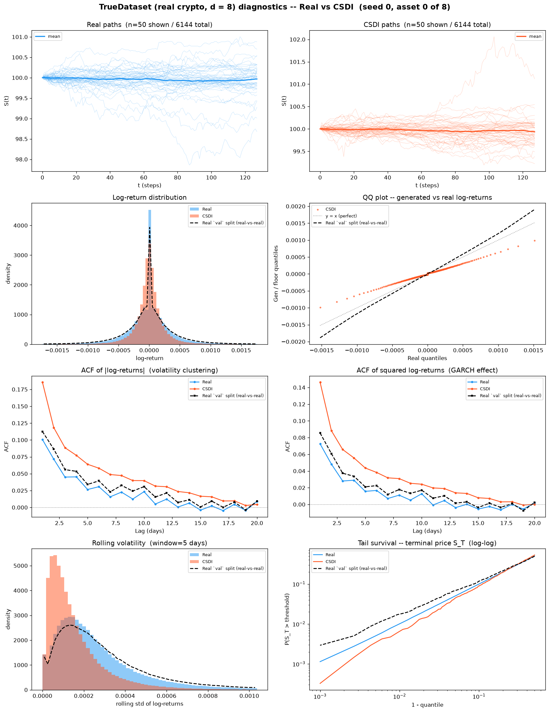
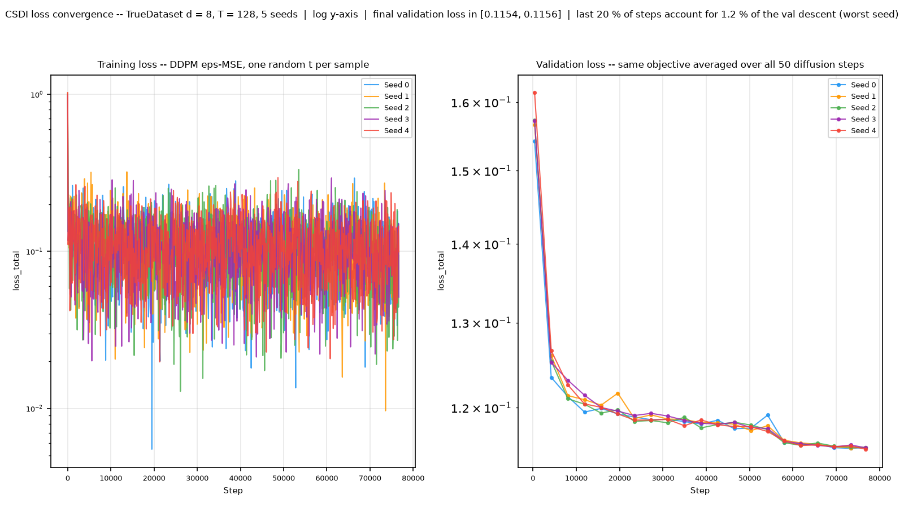
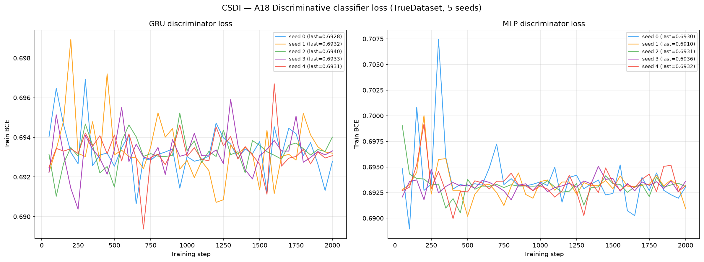
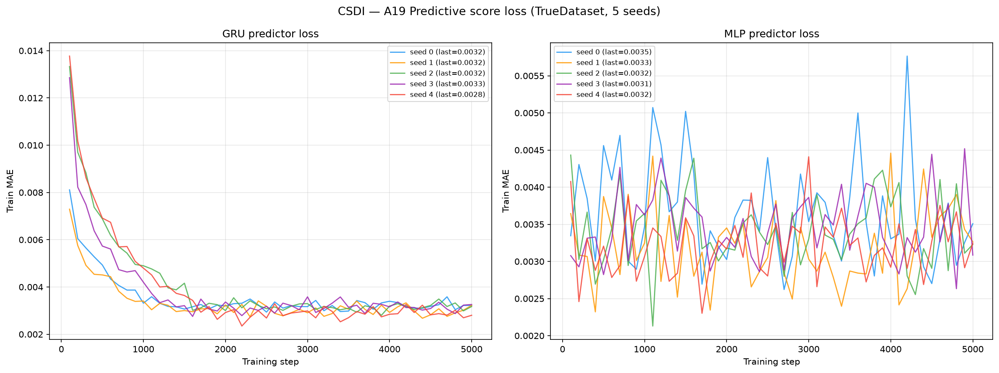

# CSDI on TrueDataset — real crypto spot, d = 8

**Conditional Score-based Diffusion model for Imputation** (Tashiro, Song, Song & Ermon,
NeurIPS 2021, [arXiv:2107.03502](https://arxiv.org/abs/2107.03502)) applied to **real market
data**: 6 144 paths of 8 correlated crypto spot series
(BTC, ETH, BNB, SOL, XRP, DOGE, ADA, LINK), 30-second bars, seq\_len = 128,
built from Binance public 1-second klines over 2022-07 → 2026-07.

This is the real-data counterpart of [`../HestonMultiAsset/CSDI/`](../HestonMultiAsset/CSDI/README.md).
Same generator, same metric code, same table layout — a different **question**. On Heston the
data-generating law is known, so "how close is the generator to the truth" has an exact answer.
Here it does not, so every reference in this README is a **real-vs-real** measurement: real
market data scored against other real market data through byte-identical code. Read
[`../truedatasetguideline.md`](../truedatasetguideline.md) before adding a method — it defines
the build, the five-split contract, the envelope, and what each reference column does and does
not mean.

**One joint model, not eight univariate ones.** `target_dim = 8` flows into CSDI's feature
embedding and into `forward_feature`, so the denoiser attends **across assets** at each of its
4 residual blocks. The 28 cross-asset correlations are therefore inside the model's hypothesis
class, not imposed afterwards — which is what makes A20 (terminal covariance error) and A6-A11
(the native-d=8 path kernels) load-bearing rows here rather than artefacts of post-processing.

**Unconditional use of a conditional model.** CSDI ships as an *imputer*. Setting
`is_unconditional = 1` and `cond_mask ≡ 0` makes `set_input_to_diffmodel` feed only the noisy
sequence, so `target_mask = observed_mask − cond_mask ≡ 1` and the training objective collapses
to the plain DDPM ε-MSE; at sampling time `impute` collapses to pure ancestral sampling. No
architecture surgery — the conditioning path is disabled by the authors' own flag.

> **Hyperparameters:** `epochs=200`, `batch=16`, `lr=0.001`, `num_steps=50` (quad schedule,
> `beta_start=1e-4`, `beta_end=0.5`), `layers=4`, `channels=64`, `nheads=8`,
> `diffusion_embedding_dim=128`, `timeemb=128`, `featureemb=16` → **413,057 parameters**.
> **Every value above is the authors' `config/base.yaml` verbatim.** Nothing was re-tuned for this dataset.
> The optimiser is theirs too: Adam with `weight_decay=1e-6` and
> `MultiStepLR(milestones=[int(0.75·epochs), int(0.9·epochs)], gamma=0.1)`.
> **Input space:** prices, **per-channel z-score fitted on the `train` split only** — identical
> to the Heston sibling. The fitted mean/std are stored in the checkpoint sidecar and read back
> from it at generation time, so a later bank can never silently re-fit them on a different split.
> **The step budget is not equal to the sibling's, and that is disclosed rather than hidden.**
> `epochs` is the authors' published number kept verbatim, but TrueDataset gives 384 steps/epoch
> against the d = 8 Heston build's 512, so this run sees **76,800 optimiser steps vs
> 102 400 there — 25 % fewer at the same nominal setting.** Nobody re-tuned it. The validation
> panel of [`plots/loss_convergence.png`](plots/loss_convergence.png) is the only evidence that
> 200 epochs was enough here; treat it as a precondition for the A-table below, not as an
> appendix figure.

---

## Metrics A1-A32 + B, mean ± std across 5 seeds

> All metrics on **log-returns** $r_t = \log(S_{t+1}/S_t)$ unless noted. A26 uses price increments $\Delta S_t$.
> Rows marked *(native d=8)* are evaluated **once** on the full `(N, T, 8)` tensor; every other
> row is computed on each of the 8 univariate slices and reported as the **mean over assets**
> (per-asset breakdown in [`metrics_per_asset.csv`](metrics_per_asset.csv)).
> **A33-A34 are absent, not failed.** They score the generated path against the dataset's
> *latent variance* path. A real market has none, so `compute_all_multiasset.py` skips them
> rather than fabricating a proxy.

| Metric | Mean ± Std | Seed 0 | Seed 1 | Seed 2 | Seed 3 | Seed 4 | Real-vs-real floor |
|---|---|---|---|---|---|---|---|
| **Fat Tail** | | | | | | | |
| A1 Kurtosis Error ↓ | 30.17 ± 4.516 | 26.67 | 27.4 | 33.4 | 25.89 | 37.47 | 259.6 |
| A2 \|r\| q95 Error ↓ | 5.29e-04 ± 2.38e-05 | 5.14e-04 | 5.44e-04 | 5.10e-04 | 5.09e-04 | 5.69e-04 | 1.85e-04 |
| A3 \|r\| q99 Error ↓ | 8.65e-04 ± 4.43e-05 | 8.34e-04 | 8.88e-04 | 8.34e-04 | 8.28e-04 | 9.43e-04 | 4.53e-04 |
| A4 Tail QQ Error ↓ | 5.30e-04 ± 2.40e-05 | 5.14e-04 | 5.44e-04 | 5.10e-04 | 5.09e-04 | 5.70e-04 | 1.94e-04 |
| A5 Hill Tail Index Error ↓ | 44.52 ± 11.7 | 36.98 | 64.61 | 50.96 | 36.15 | 33.91 | 39.99 |
| **Distribution** | | | | | | | |
| A6 Path MMD² ↓ *(native d=8)* | 0.002545 ± 0.001358 | 0.001285 | 0.002529 | 0.001012 | 0.00313 | 0.004768 | 0.00108 |
| A7 Terminal MMD² ↓ *(native d=8)* | 0.003394 ± 0.001483 | 0.00234 | 0.002918 | 0.00148 | 0.004952 | 0.005283 | 0.00199 |
| A8 Increment MMD² ↓ *(native d=8)* | 1.55e-05 ± 1.91e-06 | 1.50e-05 | 1.54e-05 | 1.29e-05 | 1.54e-05 | 1.89e-05 | 1.71e-05 |
| A9 Volatility MMD ↓ *(native d=8)* | 0.01272 ± 0.001864 | 0.01324 | 0.01203 | 0.009499 | 0.01386 | 0.01495 | 0.003092 |
| A10 Terminal SWD ↓ *(native d=8)* | 0.1086 ± 0.02187 | 0.09091 | 0.1035 | 0.08115 | 0.1374 | 0.1303 | 0.09816 |
| A11 Path SWD ↓ *(native d=8)* | 0.07482 ± 0.01516 | 0.05862 | 0.07809 | 0.05703 | 0.08359 | 0.09679 | 0.06425 |
| A12 RV Law Loss ↓ | 0.009663 ± 3.56e-04 | 0.009456 | 0.009882 | 0.009414 | 0.009305 | 0.01026 | 0.00733 |
| A13 Mean Path RMSE ↓ | 0.03573 ± 0.02958 | 0.02134 | 0.008674 | 0.00753 | 0.06018 | 0.08091 | 0.01055 |
| A14 KS Log-returns ↓ | 0.112 ± 0.005099 | 0.1083 | 0.1139 | 0.1075 | 0.1092 | 0.1212 | 0.06536 |
| A15 Skewness Error ↓ | 0.4047 ± 0.05196 | 0.3322 | 0.3675 | 0.4 | 0.4498 | 0.474 | 1.365 |
| A16 QQ RMSE (300-pt) ↓ | 2.43e-04 ± 1.04e-05 | 2.36e-04 | 2.50e-04 | 2.35e-04 | 2.33e-04 | 2.60e-04 | 1.08e-04 |
| A17 Terminal Price KS ↓ | 0.07554 ± 0.02358 | 0.06191 | 0.05528 | 0.05263 | 0.09912 | 0.1087 | 0.032 |
| **Adversarial** | | | | | | | |
| A18 Disc Score GRU ↓ *(native d=8)* | 0.006021 ± 0.002776 | 0.002034 | 0.004475 | 0.009357 | 0.005289 | 0.00895 | 0.01044 |
| A18 Disc Score MLP ↓ *(native d=8)* | 0.00773 ± 0.005403 | 0.01709 | 0.005289 | 0.001221 | 0.009764 | 0.005289 | 0.003797 |
| **Predictive** | | | | | | | |
| A19 Pred Score GRU ↓ | 0.003577 ± 2.19e-05 | 0.003559 | 0.003616 | 0.003563 | 0.003586 | 0.003561 | 0.003637 |
| A19 Pred Score MLP ↓ | 0.003799 ± 7.15e-05 | 0.003729 | 0.003902 | 0.003858 | 0.003719 | 0.003788 | 0.003776 |
| **Temporal** | | | | | | | |
| A20 Covariance Error ↓ *(native d=8)* | 1.881 ± 0.1018 | 1.702 | 1.89 | 1.909 | 1.882 | 2.019 | 1.157 |
| A21 ACF \|r\| Error (lags) ↓ | 0.02648 ± 0.003388 | 0.03233 | 0.02754 | 0.02614 | 0.02269 | 0.02373 | 0.009538 |
| A22 ACF r² Error (lags) ↓ | 0.02253 ± 0.002698 | 0.02739 | 0.02298 | 0.02225 | 0.02001 | 0.02004 | 0.006465 |
| A23 ACF \|r\| Lag-1 Error ↓ | 0.05086 ± 0.004664 | 0.05693 | 0.05487 | 0.05014 | 0.04378 | 0.04858 | 0.0123 |
| A24 ACF r² Lag-1 Error ↓ | 0.04405 ± 0.003862 | 0.04987 | 0.04635 | 0.04399 | 0.0388 | 0.04125 | 0.008313 |
| **Vol** | | | | | | | |
| A25 Mean RMSE ↓ *(native d=8)* | 0.1607 ± 0.1209 | 0.1239 | 0.0374 | 0.03527 | 0.2993 | 0.3077 | 0.04728 |
| A26 Return Std Error ↓ | 0.02647 ± 0.001236 | 0.02577 | 0.02726 | 0.02563 | 0.0252 | 0.02852 | 0.01284 |
| A27 Log-Return Std Error ↓ | 2.66e-04 ± 1.26e-05 | 2.58e-04 | 2.73e-04 | 2.57e-04 | 2.54e-04 | 2.87e-04 | 1.28e-04 |
| A28 Kurtosis Ratio (→ 1) | 2.141 ± 0.3799 | 1.559 | 2.486 | 2.211 | 1.875 | 2.576 | 0.4156 |
| A29 Sigma Mean Error ↓ | 0.003909 ± 1.71e-04 | 0.003804 | 0.004039 | 0.003784 | 0.003736 | 0.004179 | 0.00146 |
| A30 Cross-Sect. Vol Path RMSE ↓ | 0.1129 ± 0.0105 | 0.1035 | 0.1107 | 0.115 | 0.1034 | 0.1319 | 0.09316 |
| A31 Rolling Vol KS (w=5) ↓ | 0.3522 ± 0.01587 | 0.3448 | 0.3652 | 0.3398 | 0.335 | 0.3764 | 0.1196 |
| A32 Vol-of-Vol Error ↓ | 1.41e-04 ± 7.60e-06 | 1.35e-04 | 1.43e-04 | 1.37e-04 | 1.35e-04 | 1.55e-04 | 1.04e-04 |

> **Convention:** ↓ lower is better; ↑ higher is better; no arrow = no monotone direction. A28 Kurtosis Ratio: perfect = 1.0.
> **Headline:** **5 of the 34 A-metric rows sit at or below the real-vs-real floor** — A1 Kurtosis Error, A8 Increment MMD², A15 Skewness Error, A18 Disc Score GRU, A19 Pred Score GRU. The largest remaining gaps are **A24 ACF r² Lag-1 Error** (0.04405 vs floor 0.008313, 5.3×); **A23 ACF |r| Lag-1 Error** (0.05086 vs floor 0.0123, 4.1×); **A9 Volatility MMD** (0.01272 vs floor 0.003092, 4.1×); **A22 ACF r² Error (lags)** (0.02253 vs floor 0.006465, 3.5×).
> **What the "Real-vs-real floor" column is — read this before quoting it.** On Heston the floor is an *independent draw from the true SDE*: a genuine second sample of the data-generating law. **A real market has no law to re-draw from.** The column here is instead three **held-out real splits** — `train`, `val`, `valdisc` — pushed through the metric pipeline *as if they were generated banks* and scored against `test`, with byte-identical code. Three consequences you must not forget:
> 1. It is **not** a floor a generator ought to reach. It is the score a **perfect memoriser of the training era** achieves on the test era.
> 2. The build is **holdout-era** (train ends 2024-11-23, test starts 2025-02-10, 45.5-day embargo), so part of the distance is a genuine **regime change**, not finite-sample noise. Annualised vol falls from train to test on every asset (BTC 0.498 → 0.429, SOL 1.039 → 0.733). A generator that matched the *training* law perfectly would still score badly here — correctly so.
> 3. The `disc` split is **excluded on purpose**: it is the discriminator's real side, so using it as a fake bank would drive A18 to 0 by construction and manufacture an unreachable floor.
> **A1-A5**: fat-tail block — kurtosis error, tail quantile / QQ errors on |log-returns|, Hill tail index. **A6-A11** *(native d=8)*: path-kernel distances on the full 8-dimensional tensor (MMD² on paths / terminal / increments / realized-vol; sliced-Wasserstein on terminal & full paths), the rows where a multivariate generalisation is genuinely meaningful.
> **A12-A17**: distribution block, per asset then averaged. **A18** *(native d=8)*: discriminative classifier on all 8 channels at once, score = |accuracy − 0.5|, trained real=`disc` vs fake=generated. **A19**: TSTR MAE, deliberately **per-asset** — `predictive_score.py::_train_gru` targets `data_t[idx, 1:, :1]`, i.e. only the first feature, so a native run would silently report an asset-0-only number under a multi-asset name.
> **A20** *(native d=8)*: error on the full terminal covariance matrix — the row that actually tests whether the 28 realised cross-asset correlations (mean 0.609, range 0.515-0.801) survived generation. **A21-A24**: ACF |r|/r² errors. **A25** *(native d=8)*: mean RMSE across all assets jointly. **A26-A32**: volatility block. **A28** kurtosis ratio: perfect = 1.0.
> **Read A14 and A16 per asset, not as an 8-asset average.** 30-second bars on the thin end of
> this basket carry a large **point mass at exactly zero return** (LINK 24.4 %, ADA 22.0 %,
> BNB 20.9 % of all increments): the price simply did not move within the bar. CSDI is a
> continuous-density diffusion — its marginal has no atom, so it **cannot** reproduce that mass,
> and the KS / Wasserstein-family rows will be penalised on precisely those assets. That is a
> structural property of the model class meeting a microstructure property of the data, not a
> training failure, and averaging over 8 assets hides which assets are responsible. The
> breakdown is in [`metrics_per_asset.csv`](metrics_per_asset.csv).

---

## B, Curve-Shape Metrics, mean ± std across 5 seeds

Each stylised-fact plot yields a **curve** L (a list of values), not a scalar. The curve is
computed **per asset and averaged over the 8 assets** *before* the combination below, so the
combination rules stay byte-identical to the Heston tree. For the real data (L_r) and generated
data (L_g) we build three lists, the curve L, its first finite difference L' (der), and its
second finite difference L'' (sec\_der), then combine the three sub-scores into **one number
per plot**:

- **MSE row**: for each list, dᵢ = mean((L_r − L_g)²). Reported mean = the **mean of the three sub-scores** (funct + der + sec\_der)/3; std = the sample std of that per-seed combined score across the 5 seeds. The **MSE row decides the cross-method winner**.
- **% err row**: for each list, dᵢ = mean(|L_g − L_r| / (|L_r| + 1e-6)) × 100, a proper MAPE. Reported value = the **function-level MAPE on the curve L itself**; the derivative / 2nd-derivative MAPE is **excluded** because diff(L)/diff2(L) have near-zero true values, so their relative error explodes into meaningless 10⁴-% figures.
- **NRMSE row**: sqrt(mean((L_g − L_r)²)) / (max|L_r| − min|L_r| + 1e-12) × 100 on the curve L **only (funct-only)**.
- **CVaR₉₀ / CVaR₉₅ rows**: tail-averaged pointwise curve error (Expected Shortfall) on the curve L **only (funct-only)**. Pointwise error eₜ = |L_g(t) − L_r(t)|; for q ∈ {0.90, 0.95}, CVaR_q = mean(eₜ for eₜ ≥ the q-th percentile of eₜ), then range-normalized like NRMSE.

All ↓ lower is better. The reference column is the same **real-vs-real** construction as above, with the same three caveats.

| Plot | Measure | Mean ± Std | Seed 0 | Seed 1 | Seed 2 | Seed 3 | Seed 4 | Real-vs-real floor |
|---|---|---|---|---|---|---|---|---|
| **Path comparison** *(50×50 path-cloud)* | grid_tvd 50×50 (%) ↓ | 8.816% ± 1.527% | 7.246% | 8.513% | 7.94% | 8.681% | 11.7% | 3.683% |
| **Log-return histogram** | MSE | 3.52e+05 ± 681.7 | 3.509e+05 | 3.527e+05 | 3.522e+05 | 3.517e+05 | 3.527e+05 | 3.806e+05 |
|  | % err | 3.535e+08% ± 9.101e+06% | 3.499e+08% | 3.626e+08% | 3.494e+08% | 3.405e+08% | 3.65e+08% | 1.765e+07% |
|  | NRMSE | 9.558% ± 0.2897% | 9.425% | 9.809% | 9.362% | 9.211% | 9.983% | 10.24% |
|  | CVaR₉₀ | 23.27% ± 0.8245% | 22.87% | 23.98% | 22.73% | 22.27% | 24.47% | 24.39% |
|  | CVaR₉₅ | 35.35% ± 1.189% | 34.76% | 36.44% | 34.62% | 33.89% | 37.05% | 35.63% |
| **QQ plot** | MSE | 2.59e-08 ± 2.03e-09 | 2.46e-08 | 2.72e-08 | 2.44e-08 | 2.39e-08 | 2.92e-08 | 7.92e-09 |
|  | % err | 499.6% ± 12.71% | 503.5% | 488.1% | 502.3% | 519.9% | 484% | 326.6% |
|  | NRMSE | 10.59% ± 0.4751% | 10.28% | 10.89% | 10.24% | 10.16% | 11.39% | 5.085% |
|  | CVaR₉₀ | 12.38% ± 0.5865% | 11.97% | 12.7% | 11.92% | 11.9% | 13.39% | 5.59% |
|  | CVaR₉₅ | 15.11% ± 0.7476% | 14.58% | 15.45% | 14.54% | 14.56% | 16.44% | 7.278% |
| **ACF \|r\|** | MSE | 3.30e-04 ± 3.33e-05 | 3.70e-04 | 3.48e-04 | 2.88e-04 | 2.93e-04 | 3.51e-04 | 5.48e-05 |
|  | % err | 351.5% ± 48.28% | 440% | 346.7% | 350.9% | 296.8% | 322.9% | 237.1% |
|  | NRMSE | 26.18% ± 3.362% | 32.2% | 26.8% | 25.71% | 22.55% | 23.64% | 11.29% |
|  | CVaR₉₀ | 47.43% ± 4.881% | 55.19% | 49.73% | 47.32% | 41.02% | 43.9% | 17.29% |
|  | CVaR₉₅ | 59.81% ± 5.896% | 67.95% | 64.23% | 59.56% | 51.19% | 56.1% | 18.72% |
| **ACF r²** | MSE | 2.03e-04 ± 2.02e-05 | 2.29e-04 | 2.12e-04 | 1.78e-04 | 1.81e-04 | 2.15e-04 | 3.14e-05 |
|  | % err | 528.1% ± 265.6% | 1057% | 344% | 410.6% | 408% | 421.2% | 321.1% |
|  | NRMSE | 26.23% ± 3.076% | 31.91% | 26.52% | 25.66% | 23.34% | 23.73% | 9.25% |
|  | CVaR₉₀ | 48.29% ± 4.243% | 55.5% | 49.77% | 48.01% | 43.65% | 44.53% | 14.23% |
|  | CVaR₉₅ | 62.01% ± 5.062% | 69.73% | 65.16% | 61.38% | 55.17% | 58.63% | 15.52% |
| **Rolling vol histogram** | MSE | 1.667e+05 ± 1.877e+04 | 1.578e+05 | 1.813e+05 | 1.51e+05 | 1.477e+05 | 1.96e+05 | 3.897e+04 |
|  | % err | 92.42% ± 3.781% | 90.19% | 95.19% | 90.13% | 88.19% | 98.39% | 42.82% |
|  | NRMSE | 31.34% ± 1.67% | 30.63% | 32.7% | 29.92% | 29.57% | 33.88% | 10% |
|  | CVaR₉₀ | 81.99% ± 4.108% | 80.24% | 85.3% | 78.39% | 77.76% | 88.27% | 25.83% |
|  | CVaR₉₅ | 114.2% ± 6.769% | 111.5% | 120% | 108.6% | 106.8% | 124.3% | 31.15% |
| **Tail survival** | MSE | 0.00984 ± 6.89e-04 | 0.009459 | 0.01041 | 0.009379 | 0.009067 | 0.01089 | 0.002323 |
|  | % err | 40.31% ± 1.658% | 39.31% | 41.54% | 39.17% | 38.58% | 42.94% | 17.91% |
|  | NRMSE | 18.84% ± 0.7501% | 18.42% | 19.46% | 18.34% | 18% | 19.98% | 8.573% |
|  | CVaR₉₀ | 25.97% ± 1.021% | 25.37% | 26.76% | 25.27% | 24.89% | 27.57% | 14.21% |
|  | CVaR₉₅ | 26.21% ± 1.032% | 25.6% | 27.01% | 25.49% | 25.12% | 27.82% | 14.69% |

> **Headline:** **1 of the 6 B plots** sit at or below the real-vs-real reference on the deciding MSE row: Log-return histogram.
> **Cross-seed stability**: unlike the kernel methods in this tree, CSDI *is* trained by gradient
> descent, so the seed controls the weight initialisation, the minibatch order, the diffusion-step
> draw **and** the ancestral sampling noise. The ± here is therefore a genuine training-variance
> measurement, not merely simulation noise, and it is the column to check before believing any
> single-seed claim.

---

## C, Conditional generation — forecast CRPS by path shadowing

Every number above scores the **unconditional** law: does the generated cloud look like the
real cloud? That is not the question a trading desk asks. This table scores **conditional
skill**: given a real history, does the generator's conditional distribution of the *next*
32 returns beat a purely historical resampler?

Protocol is the paper's §3.3.1 (Deep-MKV-TS, Table 4), reproduced with **one documented
deviation** — retrieval is joint across the 8 assets, because the author's code refuses to
run at d ≠ 1. The deviation is spelled out under the table; every other constant is the
author's:

- Take the first **65 log-prices** of each of the 6 144 test paths as the query history.
- Retrieve the **256 nearest** histories from a pool of **8 192** paths, by Euclidean distance
  over four standardized feature blocks computed on the bank itself: the last 32 returns
  (w=1.0), a 24-point subsampled path shape (w=0.5), rolling volatility over 5-, 10- and
  20-step windows (w=2.0), and absolute/squared-return autocorrelations at lags 1, 2, 5, 10
  (w=1.0). Per-asset feature dim 73, × 8 assets = **584**.
- Use those neighbours' **next 32 returns** as the predictive ensemble and score it with CRPS.
- Compare against the paper's **two historical baselines**, both built from the training split
  only and both sized 8 192: a **moving-block bootstrap** (blocks of 8 consecutive returns,
  each drawn from a random training day, kept at its original intraday position) and a
  **session bootstrap** (an entire training day resampled whole).

Three targets: cumulative return over the horizon, the 32 individual increments, and
**realized volatility, `sqrt(sum_t r²_{t,a})` — summed over TIME, one scalar per asset**.
All ×1000, lower is better.
**Two different ± appear in this table and they mean different things.**
On the bold **CSDI** row *and on the two bootstrap baselines* it is a sample **sd across
seeds** — 5 training seeds for CSDI (training + sampling noise), 5 resampling
seeds (1234–1238) for the bootstraps, whose blocks and sessions are redrawn from `--seed`.
On the **per-seed rows** and on the **real-training-split floor** it is the **half-width of the
95 % bootstrap CI over the 6 144 test queries** (2 000 replicates — sampling noise, i.e. how
much the average would move on a different draw of test histories); that query CI is roughly
4× the seed sd, so the two must never be read as the same quantity.
The floor carries no seed sd because it has none to carry: its bank is the real training split
loaded off disk and `conditional_crps_multiasset.py`'s `score()` contains no RNG, so `--seed`
provably never reaches it — rerunning it at seed 9999 reproduces all three targets to
`+0.00e+00`. Five seeds there would print one number five times.

> **The CRPS pool is a separate 8 192-path draw, not a resample of the A/B bank.**
> `generate_bank_true.py` reloads the seed's checkpoint and samples afresh, reading the z-score
> statistics **out of the checkpoint** rather than recomputing them, so the pool and the A/B
> bank are two independent draws from one fitted model rather than two views of one draw.

| Bank | Bank size | Cumulative return CRPS ×1000 ↓ | Increment CRPS ×1000 ↓ | Realized vol CRPS ×1000 ↓ |
|---|---|---|---|---|
| **CSDI** (mean ± sd over 5 seeds) | 8 192 | **1.248 ± 0.002** | **0.342 ± 0.001** | **1.230 ± 0.024** |
|  seed 0 | 8 192 | 1.248 ± 0.026 | 0.342 ± 0.005 | 1.236 ± 0.031 |
|  seed 1 | 8 192 | 1.248 ± 0.026 | 0.342 ± 0.005 | 1.247 ± 0.031 |
|  seed 2 | 8 192 | 1.247 ± 0.026 | 0.341 ± 0.005 | 1.202 ± 0.031 |
|  seed 3 | 8 192 | 1.247 ± 0.026 | 0.341 ± 0.005 | 1.206 ± 0.031 |
|  seed 4 | 8 192 | 1.252 ± 0.026 | 0.342 ± 0.005 | 1.256 ± 0.032 |
| Moving-block bootstrap *(paper baseline)* (mean ± sd over 5 seeds) | 8 192 | 1.275 ± 0.004 | 0.338 ± 0.000 | 1.097 ± 0.016 |
| Session bootstrap *(paper baseline)* (mean ± sd over 5 seeds) | 8 192 | 1.261 ± 0.001 | 0.336 ± 0.000 | 0.969 ± 0.008 |
| Real training split as bank *(reference, not in the paper)* | 6 144 | 1.257 ± 0.026 | 0.335 ± 0.005 | 0.970 ± 0.027 |

> **Headline:** Against the moving-block bootstrap, **0 of the 3 targets is a difference this test can resolve**; on Cumulative return and Increment the gap sits inside the error bars and CSDI and the bootstrap are indistinguishable. Ratios: Cumulative return **0.979**, Increment **1.011**, Realized vol **1.121**. **The session bootstrap is the harder baseline and CSDI loses to it, resolvably, on Realized vol**: Cumulative return **0.989**, Increment **1.015**, Realized vol **1.269**. Resampling whole real training days, with no model at all, forecasts this panel better than the generator does. *Resolvable* = the two 95 % CIs do not overlap. That is a conservative test — the CIs share the same 6 144 queries, so a paired bootstrap on per-query differences would be tighter; it has not been run.
> **The ratio row is the number that transfers**, not the absolute CRPS. Absolute CRPS is set by
> the intrinsic unpredictability of the market and the units of the data; the ratio against the
> block bootstrap is dimensionless, which is why the paper reports its generator and the
> bootstraps side by side for all three indices. The paper's own generator loses to the block
> bootstrap on cumulative return for NQ (1.088) and YM (1.087) and wins on realized vol
> everywhere (0.808 / 0.916 / 0.946).
> **The window is narrow, and that is a finding, not a caveat.** The *real training split used
> directly as the bank* — a bank that cannot be beaten by any generator fit on that same split —
> scores within ~2 % of the block bootstrap on cumulative return and ~1 % on increments. Only
> realized vol leaves meaningful room. A generator that "wins" by 0.5 % on cumulative return has
> not demonstrated conditional skill; it has demonstrated that the metric is saturated there.
> **Bank size is not a lever.** Measured on this build with K = 256 fixed, CRPS moves by 0.4 %
> across an 8× range of bank size (1 536 → 12 288) — averaging 256 neighbours makes the ensemble
> spread depend on intrinsic unpredictability, not on retrieval sharpness. The value is pinned to
> the paper's 8 192 anyway, so the comparison is like-for-like.
> **One deliberate deviation from the author's code:** retrieval is **joint across assets** (one
> 584-dim feature vector per path). The author's `real_data_protocol.py:513` hard-raises for
> d ≠ 1, so there is no reference behaviour to copy; per-asset retrieval would answer a different
> question (8 independent univariate forecasts) and would discard exactly the cross-asset
> structure this dataset exists to test.

> **Retrieval convention.** The paper weights each feature block by `sqrt(w)` on every
> coordinate, so a block's real influence is its weight x its length. The alternative that
> divides by the block length was run on the same banks and is stored alongside
> (`losses/crps_configs/perdim__*.json`); it changes the ratios by under one percent, so the
> table above stands. The paper's convention is what is reported.

---

## Memorisation check

CSDI has no bandwidth knob, which makes it tempting to treat this section as an
SBTS formality. It is not. **413 057 parameters are fitted to 6 144 training paths
for 200 epochs**, so every training path is visited 200 times, and a DDPM with that
much capacity relative to its sample count can put mass on near-copies of individual
training examples -- while winning every table above, because reproducing the
training set is how you win those. On the Heston tree a score below the floor would
expose it; **here it would not** (see the floor caption), so this number is the only
guard there is, and it is reported whatever it says.

Unlike the SBTS entry, **nothing here was tuned against this diagnostic.** The
hyperparameters are the authors' published config and the ratio was never an
objective, so this is an out-of-sample readout rather than a constraint that was
optimised to -- which makes it more informative, not less.

```
NNratio = median NN(generated -> train) / median NN(val -> train)
          log-returns, flattened to (T-1)*d = 1016 dims
```

| Seed | median NN(gen → train) | NNratio (vs `val`) | vs `test` era | Exact duplicates |
|------|-----------------------:|-------------------:|--------------:|-----------------:|
| 0 | 0.010854 | 0.5730 | 0.6151 | 0 |
| 1 | 0.010281 | 0.5427 | 0.5826 | 0 |
| 2 | 0.010910 | 0.5759 | 0.6182 | 0 |
| 3 | 0.011020 | 0.5817 | 0.6245 | 0 |
| 4 | 0.010087 | 0.5325 | 0.5716 | 0 |
| **mean** | **0.010631** | **0.5612 ± 0.0197** | **0.6024** | **0** |

**NNratio = 0.561 ± 0.020**, against a real-vs-real band of **0.932–1.000**. It sits **below** the band -- generated paths hug the training set. **This is memorisation.**.

The band is not a chosen tolerance. Its endpoints are what the real splits score
against each other: `median NN(test → train) / median NN(val → train)` = 0.932, and
`val` against itself = 1.000. Zero free parameters, the same construction as the
floor column.

> **The denominator is `val`, not `test`, and the direction is counter-intuitive.**
> `val` is the same era as train; `test` is the later era. Measured, `test` sits
> *closer* to train than `val` does (0.017647 vs 0.018943) — not because it
> resembles the training data more, but because annualised vol **falls** between the
> eras on 6 of 8 assets, so returns shrink and every distance contracts with them.
> A smaller denominator inflates the ratio: these same banks score 0.561 against
> `val` and 0.602 against `test`. Since memorisation is the *low*-ratio
> failure, a `test` denominator would push a copying generator toward the
> healthy-looking end. Both are in the table; only `val` decides the verdict, and it
> is the denominator the (h, K) sweep was scored against.

**0 exact duplicates clears nothing, and is expected.** Ancestral sampling from
a continuous density lands on a bit-identical float64 path with probability zero, so
this counter can only ever fire on a plumbing bug -- a training array accidentally
saved as the bank. **The ratio is the number that matters.** For calibration of how
little the duplicate count tells you: the SBTS candidate `K=3, h=0.05`, rejected as a
memorisation trap, also had 0 duplicates while scoring NNratio 0.197.

---

## Stylised Facts Diagnostic (TrueDataset vs CSDI, seed 0, asset 0)

Eight-panel comparison: sample paths, return distribution, QQ plot, ACF of |returns|,
ACF of squared returns, rolling vol histogram (window=5), tail survival (log-log).

The third (black dashed) curve is the real **`val`** split, not a theory curve — there is no
closed form for BTC. It is drawn from `real_floor/generated_paths/seed_1`, chosen explicitly:
the floor's seed 0 is the *training* split, so plotting it here and calling it held-out would
be false. The legend is read from that directory's `metadata.json`, not hardcoded. **One asset is shown, not eight**: the *metrics* are averaged over all 8
assets, the *figure* is asset 0 (BTCUSDT). Pooling eight assets whose annualised vol spans
0.43-0.92 into one histogram would show the mixing, not the model.



---

## Training loss convergence

CSDI optimises a **single** term — the DDPM denoising objective
`E_t ‖ε − ε_θ(x_t, t)‖²` restricted to `target_mask`, which is 1 everywhere in the
unconditional regime. There is no KLD / NLL / reconstruction decomposition to break out, so the
figure is two panels rather than the five an ELBO model would need: train and validation, every
seed overlaid.

**The two panels are not the same quantity plotted twice.** `calc_loss` draws **one** random
diffusion step `t` per sample, so the train curve is a one-sample estimate and is dominated by
that sampling noise. `calc_loss_valid` averages over **all 50** diffusion steps, so the
validation curve is the low-variance one and is the series to read convergence from. Their
*levels* are not comparable, for the same reason — they are two different estimators of two
different averages, not train/test versions of one number. **A validation curve sitting below
the training curve here is expected and is evidence of nothing. Do not report the gap between
them as an overfitting measure.**

The validation series carries **20 points, not 200**: `train_true.py` sets
`val_every = max(1, epochs // 20)`, i.e. one validation pass every 10 epochs at this
budget, because a full pass costs ~50× a training epoch. Skipped epochs are written as `nan`
and dropped, which is why the val panel is marker-dotted and the train panel is not.



Wall-clock (10 rows, 200 epochs/seed, **245 min total** — training is charged
once per seed, generation once per bank, so the two roles below do not double-count it):

| Seed | Role | Bank | Epochs | Train | Generate |
|------|------|------|--------|-------|----------|
| 0 | A/B bank | 6 144 × 128 × 8 | 200 | 39.7 min | 2.4 min |
| 1 | A/B bank | 6 144 × 128 × 8 | 200 | 41.3 min | 3.1 min |
| 2 | A/B bank | 6 144 × 128 × 8 | 200 | 42.7 min | 2.4 min |
| 3 | A/B bank | 6 144 × 128 × 8 | 200 | 45.1 min | 3.4 min |
| 4 | A/B bank | 6 144 × 128 × 8 | 200 | 45.4 min | 2.4 min |
| 0 | CRPS pool | 8 192 × 128 × 8 | - | 0.0 min | 3.9 min |
| 1 | CRPS pool | 8 192 × 128 × 8 | - | 0.0 min | 3.2 min |
| 2 | CRPS pool | 8 192 × 128 × 8 | - | 0.0 min | 3.2 min |
| 3 | CRPS pool | 8 192 × 128 × 8 | - | 0.0 min | 3.2 min |
| 4 | CRPS pool | 8 192 × 128 × 8 | - | 0.0 min | 3.2 min |

---

## A18, Discriminative Classifier Training Loss

BCE loss during GRU and MLP classifier training (2 000 steps, logged every 50 steps).
A value near ln(2) ≈ 0.693 means the classifier cannot distinguish real from fake.
The classifier is **native**: it sees all 8 channels at once, and its real side is the
`disc` split, never `test`.



---

## A19, Predictive Score Training Loss (TSTR)

MAE loss during GRU and MLP predictor training on *synthetic* data (5 000 steps, logged every 100 steps).
The predictor is run **once per asset**; the curves archived here are **asset 0's**, since the
driver stores the loss history only for `j == 0`. The A19 score in the table above is the mean
over all 8 assets.



---

## File layout

```
results/trueexperiment/
├── truedatasetguideline.md               ← read this before adding a method
├── real_floor/                           real-vs-real reference (3 held-out real splits)
│   ├── generated_paths/seed_{0..2}/     symlinks to train / val / valdisc
│   ├── metrics_summary.csv
│   ├── curve_b_aggregate.json
│   └── grid_tvd_aggregate.json
└── CSDI/
    ├── README.md                         ← this file (generated by code/render_readme.py)
    ├── code/
    │   ├── README.md                     source notes, hyperparameters, deviations, md5 digests
    │   ├── reference/                    byte-identical copy of the authors' release (16 files)
    │   ├── csdi_true.py                  library half: BASE_CONFIG, CSDI_TrueData, z-score, rescale
    │   ├── train_true.py                 trains one seed, writes weights + losses + the A/B bank
    │   ├── generate_bank_true.py         reloads a checkpoint for the 8 192-path CRPS pool
    │   ├── collect_artifacts.py          §4 contract gate — recomputes from the .npy, exits 1 on breach
    │   ├── plot_diagnostics_true.py      the 8-panel stylised-facts figure
    │   ├── plot_losses.py                train/val convergence, all seeds overlaid
    │   ├── measure_memorisation.py       NN ratio vs the val split (same era as train)
    │   └── render_readme.py              regenerates this README from the artefacts
    ├── weights/
    │   ├── seed_{i}_model.pt              state_dict — gitignored
    │   └── seed_{i}_config.json           every hyperparameter + the fitted z-score (tracked)
    ├── generated_paths/seed_{0..4}/
    │   ├── generated_paths_6144x128x8.npy   (6144, 128, 8) float64 — gitignored, 50 MB
    │   └── metadata.json                    seed, shape, min/max, timings, params (tracked)
    ├── crps_banks/generated_paths/seed_{0..4}/
    │   └── generated_paths_8192x128x8.npy   the paper's 8 192-path pool — gitignored, 67 MB
    ├── logs/train_seed{i}.log             raw stdout of each training run (tracked)
    ├── losses/
    │   ├── seed_{i}_losses.csv             step,phase,loss_total — train every epoch, val every 20
    │   ├── crps_configs/paper__seed_{i}.json     table C as reported (--weight-mode paper)
    │   ├── crps_configs/perdim__seed_{i}.json    the alternative convention, for the caveat above
    │   ├── crps_configs/paper__realbank.json      real training split used as the bank
    │   ├── memorisation.json                NN ratio vs val — the memorisation guard
    │   ├── dataset_stats.json               copy of the locked build's stats (provenance)
    │   └── generation_time.csv              seed,role,n_paths,...,train_min,gen_min,params
    ├── plots/
    │   ├── truedata_diagnostics.png      8-panel stylised facts (seed 0, asset 0 = BTCUSDT)
    │   ├── loss_convergence.png          train + val, all seeds overlaid, log y
    │   ├── disc_classifier_loss.png      A18 BCE curves
    │   └── pred_score_loss.png           A19 MAE curves (asset 0)
    ├── metrics_summary.csv               A1-A32, mean ± std, per seed
    ├── metrics_per_asset.csv             per-metric × per-asset breakdown (8 rows per metric)
    ├── curve_b_aggregate.json            B curve-shape aggregate
    ├── grid_tvd_aggregate.json           path-cloud TVD
    └── seed_{i}_metrics.json             full per-seed dump incl. the per_asset block
```

The `.npy` arrays and the `.pt` checkpoints are **gitignored**: `(6144, 128, 8)` float64 = 50 MB
each, and LFS was ruled out on 2026-07-30. They are fully reproducible from the tracked code and
the tracked `weights/seed_{i}_config.json`; the `metadata.json` beside each array **is** tracked,
so shapes, price ranges and generation times stay auditable without the payload. The raw Binance
archive is not committed either — `dataset/TrueDataset/` rebuilds it from `data.binance.vision`.

## Reproduce

```bash
cd /home/tbasseras/benchmark
V=dataset/TrueDataset/variants/om_2022-07_N6144
TAG=6144x128x8
R=results/trueexperiment
P=/home/tbasseras/gpu-venv/bin/python     # anything importing torch

# 1. dataset — downloads Binance 1s klines and builds the 5 splits.
#    Only if $V/*.npy are absent. See dataset/TrueDataset/README.md.
/home/tbasseras/.cc-venv/bin/python dataset/TrueDataset/build_true_dataset.py \
    --start 2022-07 --end 2026-07 --n-samples 6144 \
    --split-mode holdout-era --out-dir $V

# 2. smoke-test before spending the GPU: 2 epochs, 64 paths. --tag probe writes
#    probe_* artefacts and NO canonical weights, so it cannot pollute step 3.
#    (train_true.py's bank-size flag is --gen-num; generate_bank_true.py's is
#    --m-simu. They are different scripts and the names do not interchange.)
CUDA_VISIBLE_DEVICES=0 $P $R/CSDI/code/train_true.py --seed 0 --data-dir $V \
    --seq-tag $TAG --epochs 2 --gen-num 64 --val-n 64 --tag probe
rm -f $R/CSDI/generated_paths/seed_0/probe_* $R/CSDI/losses/probe_*

# 3. train the 5 seeds — 2 GPUs at a time, the hard limit on this box.
#    ~11 s/epoch => ~37 min/seed. Detached: these outlive the shell.
for S in 0 1 2 3 4; do
  G=$(( S % 2 )); C0=$(( G * 8 ))
  setsid nohup env CUDA_VISIBLE_DEVICES=$G OMP_NUM_THREADS=8 \
    taskset -c $C0-$(( C0 + 7 )) $P $R/CSDI/code/train_true.py --seed $S \
    --data-dir $V --seq-tag $TAG --val-n 256 \
    > $R/CSDI/logs/train_seed$S.log 2>&1 < /dev/null & disown
done
wait

# 4. the paper's 8 192-path CRPS pool, resampled from each checkpoint.
for S in 0 1 2 3 4; do
  CUDA_VISIBLE_DEVICES=$(( S % 2 )) $P $R/CSDI/code/generate_bank_true.py \
    --seed $S --data-dir $V --seq-tag $TAG --m-simu 8192 \
    --out-root $R/CSDI/crps_banks
done

# 5. §4 contract gate. Recomputes shape / dtype / S0 / finiteness FROM THE .npy —
#    metadata is the author's claim, the array is the evidence. Exits 1 on breach.
/home/tbasseras/.cc-venv/bin/python $R/CSDI/code/collect_artifacts.py

# 6. real-vs-real reference: three held-out REAL splits as stand-in banks.
for i in 0 1 2; do mkdir -p $R/real_floor/generated_paths/seed_$i; done
ln -sf $PWD/$V/true_S_$TAG.npy          $R/real_floor/generated_paths/seed_0/generated_paths_$TAG.npy
ln -sf $PWD/$V/true_S_val_$TAG.npy      $R/real_floor/generated_paths/seed_1/generated_paths_$TAG.npy
ln -sf $PWD/$V/true_S_valdisc_$TAG.npy  $R/real_floor/generated_paths/seed_2/generated_paths_$TAG.npy

# 7. metrics — both sides go through byte-identical code.
for M in CSDI real_floor; do
  N=$([ $M = CSDI ] && echo 5 || echo 3)
  CUDA_VISIBLE_DEVICES=0 $P metrics/compute_all_multiasset.py \
    --method $M --dataset TrueDataset --seeds $N \
    --data-dir $V --seq-tag $TAG --dt 9.51293759512e-07 --results-dir $R/$M
done

# 8. conditional CRPS (table C). BOTH conventions, and the realbank reference.
#    --label CSDI is load-bearing: render_readme.py keys table C on it, and a
#    mismatched label renders the table with baselines only, silently.
mkdir -p $R/CSDI/losses/crps_configs
for S in 0 1 2 3 4; do
  for CFG in "paper paper bank" "perdim perdim realtrain"; do
    set -- $CFG
    $P metrics/conditional_crps_multiasset.py \
      --data-dir $V --seq-tag $TAG --bank-size 8192 --label CSDI \
      --weight-mode $2 --standardize $3 \
      --bank $R/CSDI/crps_banks/generated_paths/seed_$S/generated_paths_8192x128x8.npy \
      --out $R/CSDI/losses/crps_configs/$1__seed_$S.json
  done
done
# ... and the reference every row in table C is read against: the real TRAIN
# split used as the bank. Native size 6144 -- that is all the data there is --
# and --bank-size matches so the two bootstrap baselines are measured at the
# same bank size rather than a larger one.
for CFG in "paper paper bank" "perdim perdim realtrain"; do
  set -- $CFG
  $P metrics/conditional_crps_multiasset.py \
    --data-dir $V --seq-tag $TAG --bank-size 6144 --label real_train_bank \
    --weight-mode $2 --standardize $3 \
    --bank $V/true_S_$TAG.npy \
    --out $R/CSDI/losses/crps_configs/$1__realbank.json
done

# 9. memorisation -- the guard that stops an over-fitted checkpoint from winning
#    table A by copying. Denominator is the val split, NOT test. Measured, test
#    sits CLOSER to train than val does (0.017647 vs 0.018943) because annualised
#    vol falls across the era break, so a test denominator is SMALLER and inflates
#    the ratio -- which flatters a memoriser, since memorisation is the low-ratio
#    failure. See the Memorisation check section.
$P $R/CSDI/code/measure_memorisation.py \
    --data-dir $V --seq-tag $TAG --seeds 0,1,2,3,4

# 10. figures
$P $R/CSDI/code/plot_diagnostics_true.py --data-dir $V --seq-tag $TAG
$P $R/CSDI/code/plot_losses.py --seeds 0,1,2,3,4
$P metrics/plot_score_losses.py \
    --method CSDI --dataset TrueDataset --results-dir $R/CSDI

# 11. regenerate this README from the artefacts
$P $R/CSDI/code/render_readme.py
```
