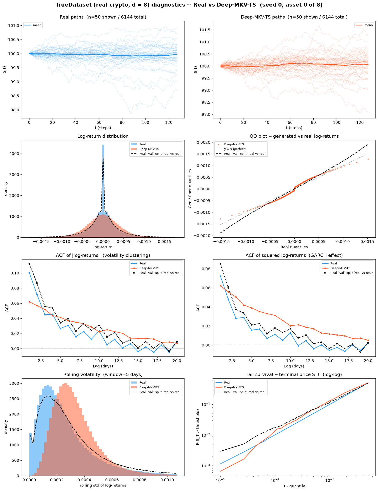
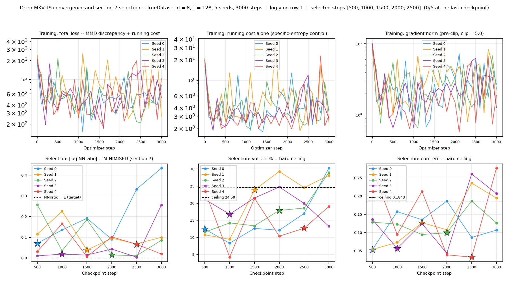
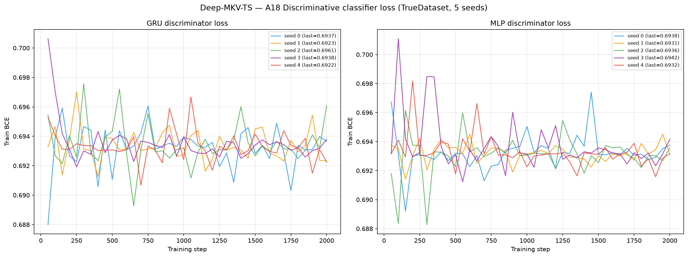
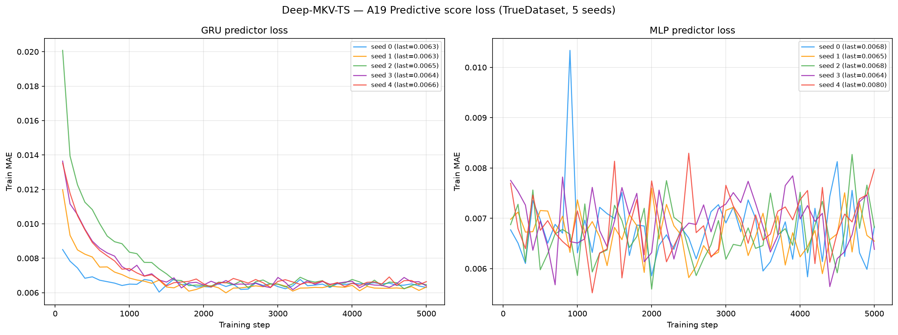

# Deep-MKV-TS on TrueDataset — real crypto spot, d = 8

**Deep McKean-Vlasov Time Series** — a neural *control* on a frozen reference kernel, trained by
matching an MMD discrepancy under a specific-entropy running cost — applied to **real market
data**: 6 144 paths of 8 correlated crypto spot series
(BTC, ETH, BNB, SOL, XRP, DOGE, ADA, LINK), 30-second bars, seq\_len = 128,
built from Binance public 1-second klines over 2022-07 → 2026-07.

This is the real-data counterpart of
[`../HestonMultiAsset/Deep-MKV-TS/`](../HestonMultiAsset/Deep-MKV-TS/README.md).
Same generator, same metric code, same table layout — a different **question**. On Heston the
data-generating law is known, so "how close is the generator to the truth" has an exact answer.
Here it does not, so every reference in this README is a **real-vs-real** measurement: real
market data scored against other real market data through byte-identical code. Read
[`../truedatasetguideline.md`](../truedatasetguideline.md) before adding a method — it defines
the build, the five-split contract, the envelope, and what each reference column does and does
not mean.

**One joint model, not eight univariate ones.** The control maps the full 8-dimensional state to
an 8-vector drift adjoint and an 8×8 noise adjoint, so the cross-asset covariance is produced by
the model rather than imposed afterwards. The 28 cross-asset correlations are inside the
hypothesis class — which is what makes A20 (terminal covariance error) and A6-A11 (the
native-d=8 path kernels) load-bearing rows here rather than artefacts of post-processing.

**The bar size is the whole story of this entry.** TrueDataset is 30-second bars, so
`dt = 9.51294e-07` years and `1/sqrt(dt) ≈ 1025`, against **15.9** on the Heston build —
a factor of **64.6**. Every quantity in this method that carries a `1/sqrt(dt)` scales with it:
the specific-entropy running cost, the ridge-regularised conditional-expectation proxy, and the
MMD bandwidths. That single number is why five knobs moved (below) and why the volatility block
of the A-table is the one to read first.

> **Hyperparameters:** `steps=3000` (Algorithm 1 **outer iterations**, not epochs — each step
> draws a fresh batch and re-fits the Z-proxy, so there is no pass over a fixed dataset),
> `batch=256`, `lr=6.4e-06`, `hidden_dim=96`, `num_layers=1`,
> `sigma∈[0.001, 5]`, `ridge_lambda=1000`, `eta=1`,
> `grad_clip=5` → **56,136 parameters**.
> **Re-tuned for this dataset: `lr`, `mmd_bandwidths`, `sigma_max`.** Every other value is the committed Heston d = 8 configuration verbatim. The list is derived by comparing each knob against that configuration, not hand-written, so it cannot understate the drift.
>
> **The five moves, each forced by a measured property, not a preference:**
> `lr` — the Heston value diverged here (the objective went to +336 on the first probe);
> `sigma_max` 0.6 → **5** — 5 of the 8 assets have realised vol above 0.6, so the old ceiling
> clipped genuine market volatility; measured p99 of realised σ is 3.87, and both `sigma_max=5`
> and `sigma_max=8` converge to that same p99, so the ceiling does **not** bind;
> `ridge_lambda` 1000 → **1000** — at the Heston value the Z-proxy's out-of-sample R² goes
> **negative** on this dataset; the winner was bracketed on both sides by a 5-point screen, so it
> is an interior optimum and not a grid edge (section 7.2);
> `ridge_covariance`/`ridge_drift` — re-selected with it;
> `mmd_bandwidths` — regauged per block, forced by the 64.6× `1/sqrt(dt)` change above. A bandwidth
> calibrated on Heston increments is not a bandwidth on 30-second crypto increments.
>
> **Numerics: the model runs in `float32`, three `eigh` sites run in float64, and that is a
> precision fix rather than a modelling choice.** The eigendecomposition BACKWARD divides by the
> eigenvalue gap. Measured on the frozen kernel's real σ matrices, **0.891 % have two eigenvalues
> whose relative gap is at or below float32 eps**, so float32 sees an exact tie, divides by zero
> and returns NaN — which then poisons every gradient in the batch, and `clip_grad_norm_`
> rescales finite gradients rather than filtering them, so it cannot repair it. In float64 the
> gaps resolve (0 of 910 336 pairs below 1e-9) and `max|grad|` is **identical** in the two
> precisions, which is the evidence that nothing about the model moved.
> Sites promoted this run: `n_promoted_project_theta_to_sigma=381127, n_promoted_specific_entropy_cost=3001, n_promoted_theta_from_moments=381127`.

---

## Section-7 checkpoint selection

**The reported model is not the last optimizer step.** Six checkpoints are saved
per seed at steps 500, 1000, 1500, 2000, 2500, 3000; each is scored by sampling a
probe bank and measuring it against the **validation** split, and the one reported
is chosen by

```
minimise |log NNratio|   subject to   vol_err <= 24.59 %   and   corr_err <= 0.1843
```

Both ceilings are **measured, not chosen**: they are the worst value real market
data attains when scored against other real market data on this build, so a
checkpoint that clears them is, on that statistic, indistinguishable from another
honest slice of the same market. **Goodness of fit is forbidden as a selection
criterion** — the training discrepancy is measured against a bank drawn from the
training split, so selecting on it would reward copying.

| Seed | Selected step | NNratio | \|log NNratio\| | vol_err % | corr_err | Fit rule would have chosen |
|------|---------------|---------|-----------------|-----------|----------|----------------------------|
| 0 | **500** | 1.0736 | 0.0710 | 12.43 | 0.0531 | 500 |
| 1 | **1500** | 0.9623 | 0.0384 | 23.89 | 0.1273 | 500 |
| 2 | **2000** | 1.0149 | 0.0148 | 17.89 | 0.0997 | 1000 |
| 3 | **1000** | 1.0188 | 0.0186 | 16.79 | 0.0570 | 2500 |
| 4 | **2500** | 1.0684 | 0.0661 | 12.68 | 0.0329 | 2500 |

**The rule is doing work.** On 3 of the 5 seeds the
forbidden fit rule (argmin validation discrepancy) would have selected a
different checkpoint: seed 1 → 500 instead of 1500, seed 2 → 1000 instead of 2000, seed 3 → 2500 instead of 1000. Recorded so the disagreement is auditable rather than invisible.

> Every selected step is **interior** to the grid (the budget is 3000 steps and
> no seed chose it), so the choice is bracketed on both sides and section 7.2's
> boundary caveat does not apply.

---

## Metrics A1-A32 + B, mean ± std across 5 seeds

> All metrics on **log-returns** $r_t = \log(S_{t+1}/S_t)$ unless noted. A26 uses price increments $\Delta S_t$.
> Rows marked *(native d=8)* are evaluated **once** on the full `(N, T, 8)` tensor; every other
> row is computed on each of the 8 univariate slices and reported as the **mean over assets**
> (per-asset breakdown in [`metrics_per_asset.csv`](metrics_per_asset.csv)).
> **A33-A34 are absent, not failed.** They score the generated path against the dataset's
> *latent variance* path. A real market has none, so `compute_all_multiasset.py` skips them
> rather than fabricating a proxy.

| Metric | Mean ± Std | Seed 0 | Seed 1 | Seed 2 | Seed 3 | Seed 4 | Real-vs-real floor |
|---|---|---|---|---|---|---|---|
| **Fat Tail** | | | | | | | |
| A1 Kurtosis Error ↓ | 37.8 ± 0.441 | 37.85 | 38.09 | 36.94 | 38.15 | 37.96 | 259.6 |
| A2 \|r\| q95 Error ↓ | 1.68e-04 ± 3.91e-05 | 2.32e-04 | 1.63e-04 | 1.35e-04 | 1.23e-04 | 1.86e-04 | 1.85e-04 |
| A3 \|r\| q99 Error ↓ | 4.02e-04 ± 4.91e-05 | 4.87e-04 | 3.96e-04 | 3.86e-04 | 3.35e-04 | 4.07e-04 | 4.53e-04 |
| A4 Tail QQ Error ↓ | 1.79e-04 ± 3.37e-05 | 2.37e-04 | 1.74e-04 | 1.52e-04 | 1.40e-04 | 1.90e-04 | 1.94e-04 |
| A5 Hill Tail Index Error ↓ | 39.87 ± 6.07 | 49.26 | 32.57 | 38.93 | 34.75 | 43.83 | 39.99 |
| **Distribution** | | | | | | | |
| A6 Path MMD² ↓ *(native d=8)* | 0.00121 ± 2.52e-04 | 0.001666 | 0.001056 | 9.81e-04 | 0.001049 | 0.001296 | 0.00108 |
| A7 Terminal MMD² ↓ *(native d=8)* | 0.00291 ± 5.03e-04 | 0.003794 | 0.002751 | 0.002643 | 0.002306 | 0.003057 | 0.00199 |
| A8 Increment MMD² ↓ *(native d=8)* | 1.14e-05 ± 1.39e-06 | 1.26e-05 | 9.41e-06 | 1.01e-05 | 1.21e-05 | 1.28e-05 | 1.71e-05 |
| A9 Volatility MMD ↓ *(native d=8)* | 0.01125 ± 0.002016 | 0.01484 | 0.009376 | 0.00958 | 0.01047 | 0.01198 | 0.003092 |
| A10 Terminal SWD ↓ *(native d=8)* | 0.1146 ± 0.01366 | 0.1388 | 0.1115 | 0.1026 | 0.1013 | 0.1186 | 0.09816 |
| A11 Path SWD ↓ *(native d=8)* | 0.06791 ± 0.00414 | 0.07403 | 0.06957 | 0.0629 | 0.06365 | 0.06942 | 0.06425 |
| A12 RV Law Loss ↓ | 0.005646 ± 7.58e-04 | 0.007042 | 0.005224 | 0.005252 | 0.004898 | 0.005814 | 0.00733 |
| A13 Mean Path RMSE ↓ | 0.01069 ± 0.004756 | 0.01982 | 0.007576 | 0.006696 | 0.01068 | 0.008673 | 0.01055 |
| A14 KS Log-returns ↓ | 0.08593 ± 0.003758 | 0.09118 | 0.08033 | 0.08392 | 0.08553 | 0.08866 | 0.06536 |
| A15 Skewness Error ↓ | 0.2393 ± 0.005003 | 0.2394 | 0.2374 | 0.238 | 0.2334 | 0.2485 | 1.365 |
| A16 QQ RMSE (300-pt) ↓ | 1.20e-04 ± 1.36e-05 | 1.43e-04 | 1.11e-04 | 1.10e-04 | 1.08e-04 | 1.28e-04 | 1.08e-04 |
| A17 Terminal Price KS ↓ | 0.04337 ± 0.002411 | 0.04559 | 0.04606 | 0.04413 | 0.04079 | 0.04026 | 0.032 |
| **Adversarial** | | | | | | | |
| A18 Disc Score GRU ↓ *(native d=8)* | 0.005614 ± 0.002972 | 0.01017 | 0.005696 | 0.002848 | 0.002034 | 0.007323 | 0.01044 |
| A18 Disc Score MLP ↓ *(native d=8)* | 0.007893 ± 0.004483 | 0.003662 | 0.01302 | 0.01302 | 0.002441 | 0.007323 | 0.003797 |
| **Predictive** | | | | | | | |
| A19 Pred Score GRU ↓ | 0.003551 ± 1.06e-05 | 0.00354 | 0.003556 | 0.003568 | 0.003553 | 0.00354 | 0.003637 |
| A19 Pred Score MLP ↓ | 0.004045 ± 1.26e-04 | 0.003947 | 0.003954 | 0.004191 | 0.004206 | 0.003926 | 0.003776 |
| **Temporal** | | | | | | | |
| A20 Covariance Error ↓ *(native d=8)* | 1.312 ± 0.2892 | 1.475 | 1.678 | 1.463 | 0.9403 | 1.001 | 1.157 |
| A21 ACF \|r\| Error (lags) ↓ | 0.03224 ± 0.00162 | 0.03451 | 0.03028 | 0.03093 | 0.03176 | 0.03372 | 0.009538 |
| A22 ACF r² Error (lags) ↓ | 0.03071 ± 0.00132 | 0.03282 | 0.02924 | 0.02951 | 0.0305 | 0.0315 | 0.006465 |
| A23 ACF \|r\| Lag-1 Error ↓ | 0.03784 ± 0.002085 | 0.03975 | 0.03449 | 0.0369 | 0.03776 | 0.04028 | 0.0123 |
| A24 ACF r² Lag-1 Error ↓ | 0.03254 ± 0.001892 | 0.03558 | 0.03028 | 0.03113 | 0.03203 | 0.03368 | 0.008313 |
| **Vol** | | | | | | | |
| A25 Mean RMSE ↓ *(native d=8)* | 0.05082 ± 0.02574 | 0.09681 | 0.02369 | 0.0299 | 0.04844 | 0.05526 | 0.04728 |
| A26 Return Std Error ↓ | 0.008288 ± 0.001563 | 0.01087 | 0.00878 | 0.006996 | 0.006384 | 0.008411 | 0.01284 |
| A27 Log-Return Std Error ↓ | 8.27e-05 ± 1.55e-05 | 1.08e-04 | 8.79e-05 | 7.00e-05 | 6.38e-05 | 8.36e-05 | 1.28e-04 |
| A28 Kurtosis Ratio (→ 1) | 13.25 ± 0.6865 | 11.94 | 13.54 | 13.25 | 13.93 | 13.56 | 0.4156 |
| A29 Sigma Mean Error ↓ | 0.001393 ± 2.13e-04 | 0.001742 | 0.001262 | 0.001222 | 0.001201 | 0.001539 | 0.00146 |
| A30 Cross-Sect. Vol Path RMSE ↓ | 0.06736 ± 0.01593 | 0.09524 | 0.05698 | 0.06109 | 0.04987 | 0.0736 | 0.09316 |
| A31 Rolling Vol KS (w=5) ↓ | 0.1693 ± 0.005388 | 0.1785 | 0.1643 | 0.1657 | 0.1657 | 0.1724 | 0.1196 |
| A32 Vol-of-Vol Error ↓ | 7.69e-05 ± 9.38e-06 | 7.88e-05 | 9.00e-05 | 8.30e-05 | 6.67e-05 | 6.59e-05 | 1.04e-04 |

> **Convention:** ↓ lower is better; ↑ higher is better; no arrow = no monotone direction. A28 Kurtosis Ratio: perfect = 1.0.
> **Headline:** **15 of the 34 A-metric rows sit at or below the real-vs-real floor** — A1 Kurtosis Error, A2 |r| q95 Error, A3 |r| q99 Error, A4 Tail QQ Error, A5 Hill Tail Index Error, A8 Increment MMD², A12 RV Law Loss, A15 Skewness Error…. The largest remaining gaps are **A22 ACF r² Error (lags)** (0.03071 vs floor 0.006465, 4.8×); **A24 ACF r² Lag-1 Error** (0.03254 vs floor 0.008313, 3.9×); **A9 Volatility MMD** (0.01125 vs floor 0.003092, 3.6×); **A21 ACF |r| Error (lags)** (0.03224 vs floor 0.009538, 3.4×).
> **What the "Real-vs-real floor" column is — read this before quoting it.** On Heston the floor is an *independent draw from the true SDE*: a genuine second sample of the data-generating law. **A real market has no law to re-draw from.** The column here is instead three **held-out real splits** — `train`, `val`, `valdisc` — pushed through the metric pipeline *as if they were generated banks* and scored against `test`, with byte-identical code. Three consequences you must not forget:
> 1. It is **not** a floor a generator ought to reach. It is the score a **perfect memoriser of the training era** achieves on the test era.
> 2. The build is **holdout-era** (train ends 2024-11-23, test starts 2025-02-10, 45.5-day embargo), so part of the distance is a genuine **regime change**, not finite-sample noise. Annualised vol falls from train to test on every asset (BTC 0.498 → 0.429, SOL 1.039 → 0.733). A generator that matched the *training* law perfectly would still score badly here — correctly so.
> 3. The `disc` split is **excluded on purpose**: it is the discriminator's real side, so using it as a fake bank would drive A18 to 0 by construction and manufacture an unreachable floor.
> **A1-A5**: fat-tail block — kurtosis error, tail quantile / QQ errors on |log-returns|, Hill tail index. **A6-A11** *(native d=8)*: path-kernel distances on the full 8-dimensional tensor (MMD² on paths / terminal / increments / realized-vol; sliced-Wasserstein on terminal & full paths), the rows where a multivariate generalisation is genuinely meaningful.
> **A12-A17**: distribution block, per asset then averaged. **A18** *(native d=8)*: discriminative classifier on all 8 channels at once, score = |accuracy − 0.5|, trained real=`disc` vs fake=generated. **A19**: TSTR MAE, deliberately **per-asset** — `predictive_score.py::_train_gru` targets `data_t[idx, 1:, :1]`, i.e. only the first feature, so a native run would silently report an asset-0-only number under a multi-asset name.
> **A20** *(native d=8)*: error on the full terminal covariance matrix — the row that actually tests whether the 28 realised cross-asset correlations (mean 0.609, range 0.515-0.801) survived generation. **A21-A24**: ACF |r|/r² errors. **A25** *(native d=8)*: mean RMSE across all assets jointly. **A26-A32**: volatility block. **A28** kurtosis ratio: perfect = 1.0.
> **Read A14 and A16 per asset, not as an 8-asset average.** 30-second bars on the thin end of
> this basket carry a large **point mass at exactly zero return** (LINK 24.4 %, ADA 22.0 %,
> BNB 20.9 % of all increments): the price simply did not move within the bar. Deep-MKV-TS
> integrates an SDE driven by continuous Brownian noise — its marginal has no atom, so it
> **cannot** reproduce that mass, and the KS / Wasserstein-family rows will be penalised on
> precisely those assets. That is a structural property of the model class meeting a
> microstructure property of the data, not a training failure, and averaging over 8 assets hides
> which assets are responsible. The breakdown is in
> [`metrics_per_asset.csv`](metrics_per_asset.csv).
> **The volatility block (A26-A32) is the block to read first on this method**, for the reason
> given at the top: the state is discretised at `dt = 9.51e-07` years, so anything that
> smooths the bar-to-bar increment shows up there before it shows up anywhere else, and the
> cross-asset rows can look healthy while it does.

> **Full-bank envelope screen** (`losses/envelope_screen.json`). The selection gate
> above scores a small probe bank on `val`; this scores the **whole reported bank**,
> so it is the stricter of the two and is reported separately.
>
> | Seed | vol_err % | corr_err | vol ratio | Verdict |
> |------|-----------|----------|-----------|---------|
> | 0 | 11.45 | 0.0702 | 0.932 | PASS |
> | 1 | 19.70 | 0.0606 | 0.803 | PASS |
> | 2 | 14.73 | 0.0784 | 0.861 | PASS |
> | 3 | 12.26 | 0.0729 | 0.878 | PASS |
> | 4 | 9.70 | 0.0684 | 0.912 | PASS |
> | **ceiling** | **24.59** | **0.1843** | | |
>
> Every seed clears both ceilings on the full bank.

---

## B, Curve-Shape Metrics, mean ± std across 5 seeds

Each stylised-fact plot yields a **curve** L (a list of values), not a scalar. The curve is
computed **per asset and averaged over the 8 assets** *before* the combination below, so the
combination rules stay byte-identical to the Heston tree. For the real data (L_r) and generated
data (L_g) we build three lists, the curve L, its first finite difference L' (der), and its
second finite difference L'' (sec\_der), then combine the three sub-scores into **one number
per plot**:

- **MSE row**: for each list, dᵢ = mean((L_r − L_g)²). Reported mean = the **mean of the three sub-scores** (funct + der + sec\_der)/3; std = the sample std of that per-seed combined score across the 5 seeds. The **MSE row decides the cross-method winner**.
- **% err row**: for each list, dᵢ = mean(|L_g − L_r| / (|L_r| + 1e-6)) × 100, a proper MAPE. Reported value = the **function-level MAPE on the curve L itself**; the derivative / 2nd-derivative MAPE is **excluded** because diff(L)/diff2(L) have near-zero true values, so their relative error explodes into meaningless 10⁴-% figures.
- **NRMSE row**: sqrt(mean((L_g − L_r)²)) / (max|L_r| − min|L_r| + 1e-12) × 100 on the curve L **only (funct-only)**.
- **CVaR₉₀ / CVaR₉₅ rows**: tail-averaged pointwise curve error (Expected Shortfall) on the curve L **only (funct-only)**. Pointwise error eₜ = |L_g(t) − L_r(t)|; for q ∈ {0.90, 0.95}, CVaR_q = mean(eₜ for eₜ ≥ the q-th percentile of eₜ), then range-normalized like NRMSE.

All ↓ lower is better. The reference column is the same **real-vs-real** construction as above, with the same three caveats.

| Plot | Measure | Mean ± Std | Seed 0 | Seed 1 | Seed 2 | Seed 3 | Seed 4 | Real-vs-real floor |
|---|---|---|---|---|---|---|---|---|
| **Path comparison** *(50×50 path-cloud)* | grid_tvd 50×50 (%) ↓ | 6.168% ± 0.2454% | 6.149% | 6.519% | 6.357% | 5.854% | 5.96% | 3.683% |
| **Log-return histogram** | MSE | 3.584e+05 ± 728.1 | 3.593e+05 | 3.574e+05 | 3.577e+05 | 3.588e+05 | 3.59e+05 | 3.806e+05 |
|  | % err | 1.739e+08% ± 6.811e+06% | 1.704e+08% | 1.858e+08% | 1.768e+08% | 1.704e+08% | 1.662e+08% | 1.765e+07% |
|  | NRMSE | 8.085% ± 0.1469% | 8.271% | 7.858% | 7.99% | 8.112% | 8.194% | 10.24% |
|  | CVaR₉₀ | 15.72% ± 0.2721% | 16.16% | 15.38% | 15.52% | 15.69% | 15.87% | 24.39% |
|  | CVaR₉₅ | 25.06% ± 0.4663% | 25.75% | 24.41% | 24.74% | 25.04% | 25.36% | 35.63% |
| **QQ plot** | MSE | 7.91e-09 ± 2.55e-09 | 1.26e-08 | 6.12e-09 | 6.45e-09 | 5.80e-09 | 8.54e-09 | 7.92e-09 |
|  | % err | 1033% ± 37.2% | 1066% | 972.2% | 1012% | 1042% | 1074% | 326.6% |
|  | NRMSE | 5.598% ± 0.6252% | 6.669% | 5.183% | 5.161% | 5.029% | 5.947% | 5.085% |
|  | CVaR₉₀ | 5.467% ± 0.7199% | 6.718% | 5.133% | 4.998% | 4.698% | 5.787% | 5.59% |
|  | CVaR₉₅ | 6.8% ± 0.8852% | 8.33% | 6.595% | 6.247% | 5.732% | 7.096% | 7.278% |
| **ACF \|r\|** | MSE | 5.81e-04 ± 2.74e-05 | 6.25e-04 | 5.67e-04 | 5.47e-04 | 5.68e-04 | 5.99e-04 | 5.48e-05 |
|  | % err | 865.2% ± 20.45% | 899.5% | 868.5% | 839% | 850.8% | 868.5% | 237.1% |
|  | NRMSE | 44.03% ± 1.532% | 46.36% | 42.32% | 42.52% | 43.87% | 45.06% | 11.29% |
|  | CVaR₉₀ | 58.04% ± 2.007% | 61.38% | 55.82% | 56.81% | 56.95% | 59.23% | 17.29% |
|  | CVaR₉₅ | 60.48% ± 1.906% | 63.77% | 58.55% | 58.99% | 59.71% | 61.4% | 18.72% |
| **ACF r²** | MSE | 4.12e-04 ± 1.86e-05 | 4.39e-04 | 4.11e-04 | 3.84e-04 | 4.04e-04 | 4.22e-04 | 3.14e-05 |
|  | % err | 2910% ± 225.3% | 2791% | 3334% | 2668% | 2885% | 2875% | 321.1% |
|  | NRMSE | 47.87% ± 1.161% | 49.77% | 47.02% | 46.36% | 47.99% | 48.19% | 9.25% |
|  | CVaR₉₀ | 63.26% ± 2.096% | 67.13% | 61% | 62.03% | 62.67% | 63.45% | 14.23% |
|  | CVaR₉₅ | 65.28% ± 2.383% | 69.8% | 62.83% | 64.06% | 64.63% | 65.08% | 15.52% |
| **Rolling vol histogram** | MSE | 5.956e+04 ± 1498 | 6.225e+04 | 5.81e+04 | 5.886e+04 | 5.852e+04 | 6.009e+04 | 3.897e+04 |
|  | % err | 47.15% ± 5.947% | 57.09% | 43.23% | 42.67% | 41.82% | 50.94% | 42.82% |
|  | NRMSE | 15.09% ± 0.2084% | 15.45% | 14.95% | 14.9% | 14.94% | 15.19% | 10% |
|  | CVaR₉₀ | 38.62% ± 0.7345% | 39.83% | 37.95% | 37.96% | 38.25% | 39.09% | 25.83% |
|  | CVaR₉₅ | 45.31% ± 0.8382% | 46.59% | 44.58% | 44.39% | 45.03% | 45.95% | 31.15% |
| **Tail survival** | MSE | 0.005306 ± 3.64e-04 | 0.00587 | 0.004822 | 0.005086 | 0.005218 | 0.005535 | 0.002323 |
|  | % err | 24.96% ± 2.093% | 28.29% | 22.78% | 23.38% | 23.83% | 26.49% | 17.91% |
|  | NRMSE | 13.85% ± 0.6401% | 14.72% | 12.9% | 13.45% | 13.85% | 14.33% | 8.573% |
|  | CVaR₉₀ | 20.95% ± 0.8593% | 22.13% | 19.63% | 20.49% | 20.95% | 21.53% | 14.21% |
|  | CVaR₉₅ | 21.02% ± 0.8527% | 22.2% | 19.71% | 20.57% | 21.03% | 21.6% | 14.69% |

> **Headline:** **2 of the 6 B plots** sit at or below the real-vs-real reference on the deciding MSE row: Log-return histogram, QQ plot.
> **Cross-seed stability**: unlike the kernel methods in this tree, Deep-MKV-TS *is* trained by
> gradient descent, so the seed controls the control-network initialisation, the batch draw, the
> Brownian increments **and** — through the section-7 screen — which checkpoint is reported at
> all. The ± here is therefore a genuine training-plus-selection variance measurement, not merely
> simulation noise, and it is the column to check before believing any single-seed claim. If the
> Selection table above shows the seeds landing on different steps, part of this ± is that
> disagreement rather than the generator itself.

---

## C, Conditional generation — forecast CRPS by path shadowing

Every number above scores the **unconditional** law: does the generated cloud look like the
real cloud? That is not the question a trading desk asks. This table scores **conditional
skill**: given a real history, does the generator's conditional distribution of the *next*
32 returns beat a purely historical resampler?

Protocol is the paper's §3.3.1 (Deep-MKV-TS, Table 4), reproduced with **one documented
deviation** — retrieval is joint across the 8 assets, because the author's code refuses to
run at d ≠ 1. The deviation is spelled out under the table; every other constant is the
author's.

> **This is the one table where the method and the protocol share an author, and that cuts
> against this entry rather than for it.** The retrieval features, the K, the pool size and the
> two bootstrap baselines are all this paper's own choices, so a good number here is a weaker
> claim than the same number would be for CSDI or SBTS: the metric was designed alongside the
> method. The row that disciplines it is the *real training split used as the bank* — a bank no
> generator fit on that split can beat — and the session bootstrap, which learns nothing. Read
> those two before reading the ratio.

Constants:

- Take the first **65 log-prices** of each of the 6 144 test paths as the query history.
- Retrieve the **256 nearest** histories from a pool of **8 192** paths, by Euclidean distance
  over four standardized feature blocks computed on the bank itself: the last 32 returns
  (w=1.0), a 24-point subsampled path shape (w=0.5), rolling volatility over 5-, 10- and
  20-step windows (w=2.0), and absolute/squared-return autocorrelations at lags 1, 2, 5, 10
  (w=1.0). Per-asset feature dim 73, × 8 assets = **584**.
- Use those neighbours' **next 32 returns** as the predictive ensemble and score it with CRPS.
- Compare against the paper's **two historical baselines**, both built from the training split
  only and both sized 8 192: a **moving-block bootstrap** (blocks of 8 consecutive returns,
  each drawn from a random training day, kept at its original intraday position) and a
  **session bootstrap** (an entire training day resampled whole).

Three targets: cumulative return over the horizon, the 32 individual increments, and
**realized volatility, `sqrt(sum_t r²_{t,a})` — summed over TIME, one scalar per asset**.
All ×1000, lower is better.
**Two different ± appear in this table and they mean different things.**
On the bold **Deep-MKV-TS** row *and on the two bootstrap baselines* it is a sample **sd across
seeds** — 5 training seeds for Deep-MKV-TS (training + sampling noise), 5 resampling
seeds (1234–1238) for the bootstraps, whose blocks and sessions are redrawn from `--seed`.
On the **per-seed rows** and on the **real-training-split floor** it is the **half-width of the
95 % bootstrap CI over the 6 144 test queries** (2 000 replicates — sampling noise, i.e. how
much the average would move on a different draw of test histories); that query CI is roughly
4× the seed sd, so the two must never be read as the same quantity.
The floor carries no seed sd because it has none to carry: its bank is the real training split
loaded off disk and `conditional_crps_multiasset.py`'s `score()` contains no RNG, so `--seed`
provably never reaches it — rerunning it at seed 9999 reproduces all three targets to
`+0.00e+00`. Five seeds there would print one number five times.

> **The CRPS pool is a separate 8 192-path draw, not a resample of the A/B bank.**
> `generate_bank_true.py` reloads **the section-7 selected checkpoint** — the same one the
> A-table scores, not the last optimizer step — and integrates afresh with new Brownian
> increments, so the pool and the A/B bank are two independent draws from one fitted model
> rather than two views of one draw. `metadata.json` beside each array records
> `bank_role` (`ab_bank` vs `crps_pool`) and the `selected_step` it came from, so the two can
> never be confused after the fact.

| Bank | Bank size | Cumulative return CRPS ×1000 ↓ | Increment CRPS ×1000 ↓ | Realized vol CRPS ×1000 ↓ |
|---|---|---|---|---|
| **Deep-MKV-TS** (mean ± sd over 5 seeds) | 8 192 | **1.248 ± 0.002** | **0.333 ± 0.000** | **0.887 ± 0.020** |
|  seed 0 | 8 192 | 1.246 ± 0.025 | 0.333 ± 0.005 | 0.879 ± 0.024 |
|  seed 1 | 8 192 | 1.250 ± 0.026 | 0.333 ± 0.005 | 0.916 ± 0.025 |
|  seed 2 | 8 192 | 1.249 ± 0.026 | 0.333 ± 0.005 | 0.899 ± 0.025 |
|  seed 3 | 8 192 | 1.246 ± 0.026 | 0.332 ± 0.005 | 0.871 ± 0.024 |
|  seed 4 | 8 192 | 1.246 ± 0.026 | 0.332 ± 0.005 | 0.869 ± 0.024 |
| Moving-block bootstrap *(paper baseline)* (mean ± sd over 5 seeds) | 8 192 | 1.275 ± 0.004 | 0.338 ± 0.000 | 1.097 ± 0.016 |
| Session bootstrap *(paper baseline)* (mean ± sd over 5 seeds) | 8 192 | 1.261 ± 0.001 | 0.336 ± 0.000 | 0.969 ± 0.008 |
| Real training split as bank *(reference, not in the paper)* | 6 144 | 1.257 ± 0.026 | 0.335 ± 0.005 | 0.970 ± 0.027 |

> **Headline:** Against the moving-block bootstrap, **1 of the 3 targets is a difference this test can resolve** (Realized vol); on Cumulative return and Increment the gap sits inside the error bars and Deep-MKV-TS and the bootstrap are indistinguishable. Ratios: Cumulative return **0.979**, Increment **0.985**, Realized vol **0.808**. Against the session bootstrap, the harder of the two historical baselines, no difference is resolvable: Cumulative return **0.989**, Increment **0.989**, Realized vol **0.915**. *Resolvable* = the two 95 % CIs do not overlap. That is a conservative test — the CIs share the same 6 144 queries, so a paired bootstrap on per-query differences would be tighter; it has not been run.
> **The ratio row is the number that transfers**, not the absolute CRPS. Absolute CRPS is set by
> the intrinsic unpredictability of the market and the units of the data; the ratio against the
> block bootstrap is dimensionless, which is why the paper reports its generator and the
> bootstraps side by side for all three indices. The paper's own generator loses to the block
> bootstrap on cumulative return for NQ (1.088) and YM (1.087) and wins on realized vol
> everywhere (0.808 / 0.916 / 0.946).
> **The window is narrow, and that is a finding, not a caveat.** The *real training split used
> directly as the bank* — a bank that cannot be beaten by any generator fit on that same split —
> scores within ~2 % of the block bootstrap on cumulative return and ~1 % on increments. Only
> realized vol leaves meaningful room. A generator that "wins" by 0.5 % on cumulative return has
> not demonstrated conditional skill; it has demonstrated that the metric is saturated there.
> **Bank size is not a lever.** Measured on this build with K = 256 fixed, CRPS moves by 0.4 %
> across an 8× range of bank size (1 536 → 12 288) — averaging 256 neighbours makes the ensemble
> spread depend on intrinsic unpredictability, not on retrieval sharpness. The value is pinned to
> the paper's 8 192 anyway, so the comparison is like-for-like.
> **One deliberate deviation from the author's code:** retrieval is **joint across assets** (one
> 584-dim feature vector per path). The author's `real_data_protocol.py:513` hard-raises for
> d ≠ 1, so there is no reference behaviour to copy; per-asset retrieval would answer a different
> question (8 independent univariate forecasts) and would discard exactly the cross-asset
> structure this dataset exists to test.

> **Retrieval convention.** The paper weights each feature block by `sqrt(w)` on every
> coordinate, so a block's real influence is its weight x its length. The alternative that
> divides by the block length was run on the same banks and is stored alongside
> (`losses/crps_configs/perdim__*.json`); it changes the ratios by under one percent, so the
> table above stands. The paper's convention is what is reported.

---

## Table D -- intraday portfolio VaR/ES backtest

| Bank | Seeds | Exceptions @ 5% | Kupiec `LR_uc` *p* | `LR_cc` *p* | ES ratio | ens sd / real sd = pool × shrink |
|---|---:|---:|---:|---:|---:|---:|
| Moving-block bootstrap *(paper baseline)* | 5 | 5.01 ± 0.51% *(3/5)* | 9.6e-03 | 9.0e-08 | 1.04 ± 0.03 | **1.057** = 1.068 × 0.990 |
| RiskMetrics EWMA (λ=0.94) *(desk benchmark)* | 1 | 6.36% | 2.4e-06 | 1.3e-05 | 1.14 | – |
| **SBTS** | 5 | 7.10 ± 0.40% | 1.8e-19 | 2.6e-24 | 1.11 ± 0.03 | **0.878** = 0.930 × 0.944 |
| **reference** | 5 | 8.06 ± 0.64% | 2.7e-32 | 2.5e-33 | 0.97 ± 0.04 | **0.809** = 1.275 × 0.635 |
| **CSDI** | 5 | 8.80 ± 0.49% | 1.4e-42 | 5.0e-42 | 1.08 ± 0.02 | **0.693** = 0.726 × 0.955 |
| **Deep-MKV-TS** | 5 | 10.44 ± 1.36% | 1.0e-104 | 2.9e-104 | 1.05 ± 0.06 | **0.694** = 0.942 × 0.741 |
| Real train split as bank *(Table C floor)* | 1 | 12.06% | 2.7e-104 | 1.2e-103 | 1.02 | **0.656** = 1.043 × 0.629 |
| Session bootstrap *(paper baseline)* | 5 | 12.19 ± 0.38% | 3.6e-124 | 2.2e-123 | 1.04 ± 0.04 | **0.650** = 1.033 × 0.630 |

**Table D — intraday portfolio VaR backtest.** Horizon **16 minutes**
(32 bars x 30 s), equal-weight across the 8
assets, one forecast per test query. The alpha = 5% VaR is the empirical
5th percentile of the **same K = 256 retrieved continuations that Table C
scores with CRPS** — no retraining, no new sampling, the identical ensemble read a
different way. The two tables are checked to read the same query file before this one is
printed.

This is a **liquidation-horizon** risk figure, roughly the time needed to unwind a crypto
position. It is **not** an FRTB or Basel capital number, which is a 10-day quantity, and
it is deliberately **not** scaled to one day by sqrt(t): that scaling assumes returns are
independent across time, which is the assumption the volatility-clustering results in
Table A refute. No sqrt(t) appears anywhere in the computation.

**How to read it.** Nominal is the target, not zero — 5% is correct, and
both 3% and 7% are wrong, one as over-capitalisation and the other as under. Rows are
ranked by distance from nominal, the same principle by which `winner()` ranks Table A by
|log ratio| rather than "lowest wins". The *p* columns show the **worst seed**, because
passing four and being rejected at 1e-104 on the fifth is not passing; the italic fraction
records how many seeds did pass Kupiec at the 5% level.

**The finding, in one line: the moving-block bootstrap is the only bank whose exception
rate is anywhere near nominal, and it is the only bank that does not condition.** It
rebuilds paths from randomly recombined blocks, so its "nearest neighbours" carry no
information about the query. Its rate is 5.01% against a 5% target, and its per-seed
misses change sign (4.30%, 4.72%, 5.09%, 5.35%, 5.58% — three of five pass Kupiec, the
other two marginally at *p* = 0.010 and 0.040). Every bank that **does** condition misses
in the same direction on every single seed, and is rejected at *p* < 2e-19 throughout.

**`ens sd / real sd` is the whole result, and it factors.** The bold number is the sd of
the 256-member predictive ensemble over the realised sd of the test portfolio return. It
is the product of a **generator** property — is the 8192-path pool as dispersed as the
market? — and a **protocol** property — how much does taking the 256 nearest neighbours
collapse that dispersion? The two failure modes are genuinely distinct:

* The real training split's pool is *correctly* dispersed (1.043) and conditioning
  destroys 37% of it (0.629). Pure protocol failure, no generator involved.
* CSDI's pool is 27% too narrow (0.726) and conditioning costs it almost nothing (0.955),
  because its paths are already too alike for retrieval to tighten them further. Pure
  generator failure — this is the over-sharpness signature of section 7.1, priced.
* The block bootstrap is slightly over-dispersed (1.068) and shrinks by 1% (0.990),
  which is what "my neighbours are uninformative" looks like as a number.

Across the seven retrieval banks the bold column and the exception rate have Spearman
rho = 0.96 (the sole inversion is CSDI vs Deep-MKV-TS, tied on width at 0.693/0.694 but
1.6 points apart on rate — width is the dominant term, not the only one).

**That the real-data row fails is what makes this a statement about the protocol rather
than about the generators.** Queried by its own training data, at 12.06% against a 5%
target, *p* = 2.7e-104. Three controls back it:

* **Not tail noise.** The floor breaches 3.84% at alpha = 1%, 12.06% at alpha = 5% and
  19.65% at alpha = 10% — 3.8x, 2.4x and 2.0x nominal. The estimator behaves differently
  at each level; the failure does not. Full sweep in `var_backtest.json`.
* **Not the held-out era.** Re-run against the *validation* split, the same era as the
  bank: 11.17% versus 12.06% out-of-era. Regime shift explains 0.89 of a 7.06-point miss —
  13% — and the in-era run is still rejected at *p* = 2.1e-82.
* **Not too few neighbours.** Sweeping K from 16 to 2048 — 128x more neighbours — moves
  the floor only 16.24% -> 9.88%, and its retained width only 0.618 -> 0.716 — still a
  third short of the market at the largest K tested, with no sign of closing.

**`ES ratio`** is the realised mean loss given a breach, divided by the loss the model
predicted for that same breach. Expected Shortfall is not elicitable (Gneiting 2011), so
it carries **no** *p*-value by construction — cite it as a magnitude, never as a test.
Every row sits between 0.97 and 1.14, straddling 1: **conditional on a breach, the loss is
about the size the model said it would be.** The failure is in the *frequency* of
breaches, not their severity — these ensembles have roughly the right tail shape in the
wrong place.

**Nothing passes both tests.** Read the `LR_cc` column: it is rejected on every row of the
table, the block bootstrap included, and on all five of its seeds (worst 9.0e-08, best
1.8e-06). That bank gets the *frequency* right and still fails independence, because it
has no volatility dynamics at all — its VaR is near-constant across queries, so its breach
sequence simply inherits the clustering of the truth. Everything else fails frequency as
well. Correct exception rate *and* correct breach timing is achieved by no method in this
study, which is the open problem this table poses rather than solves.

The independence test is legitimate here, which is unusual — most VaR backtests on H-step
returns cannot run it, because overlapping windows induce mechanical serial dependence in
the breach sequence. This dataset's windows are disjoint (stride = seq_len:
`n_windows_available` 33 570 against 4.30 M bars at `seq_len` 128), and transitions are
counted only within contiguous 256-window blocks, so the seam between two non-adjacent
blocks never contributes one.

**Why this is not a restatement of Table C.** CRPS is a distance over the whole law and is
dominated by its centre; a forecast that nails the bulk and collapses the tail loses very
little. Coverage is a frequency in the tail alone and cannot be bought back by sharpness.
Table D also shows why a portfolio view is not a per-asset view rescaled: from train to
test the mean pairwise correlation of the 8 assets rises 0.557 -> 0.769, so although each
asset became **17.6% less** volatile, the equal-weight portfolio became only **4.1% less**
volatile. Diversification decayed enough to absorb three quarters of the per-asset drop —
a bank that calibrated per-asset vol perfectly and carried the training-era correlation
forward would still understate portfolio risk by roughly 13%.

---

## Memorisation check

**This section is not a formality, and it is also not the same argument the CSDI
entry makes.** There the alarm is capacity: 413 057 parameters against 6 144 paths.
Here the network is **56 136 parameters** -- roughly an order of magnitude smaller --
and it does not parameterise the law directly at all. It parameterises a *control*
that is added to a frozen reference kernel, so the hypothesis class is anchored to
that kernel rather than free to interpolate individual training paths.

**The exposure is elsewhere, and it is real.** Algorithm 1 counts OUTER ITERATIONS,
not epochs: each of the 500 steps draws a FRESH batch of 256 paths and re-fits the
Z-proxy, so there is no pass over a fixed dataset and no epoch count to quote. What
there is instead is an MMD discrepancy measured directly against a target bank drawn
from the training split. Minimising a distance to the training sample IS the
objective, and driving it to zero would be indistinguishable from copying. On the
Heston tree a score below the floor would expose that; **here it would not** (see the
floor caption), so this number is the only guard there is.

**But the reported checkpoint was not chosen by that objective.** Section 7 forbids
selecting on goodness of fit, and `select_checkpoint_true.py` enforces it: the step
reported below was picked by |log NNratio| on the *validation* split subject to the
measured vol and corr ceilings, never by the training discrepancy. That is why the
ratio here is not a free readout the way the CSDI one is -- a nearby quantity WAS
optimised, on a different split. The honest reading: this is an out-of-sample
measurement of an in-sample-adjacent criterion. The Selection section above records
what the forbidden fit rule would have chosen instead, so the two can be compared.

```
NNratio = median NN(generated -> train) / median NN(val -> train)
          log-returns, flattened to (T-1)*d = 1016 dims
```

| Seed | median NN(gen → train) | NNratio (vs `val`) | vs `test` era | Exact duplicates |
|------|-----------------------:|-------------------:|--------------:|-----------------:|
| 0 | 0.020343 | 1.0739 | 1.1528 | 0 |
| 1 | 0.018243 | 0.9630 | 1.0337 | 0 |
| 2 | 0.018948 | 1.0003 | 1.0737 | 0 |
| 3 | 0.019306 | 1.0191 | 1.0940 | 0 |
| 4 | 0.020051 | 1.0585 | 1.1362 | 0 |
| **mean** | **0.019378** | **1.0230 ± 0.0399** | **1.0981** | **0** |

**NNratio = 1.023 ± 0.040**, against a real-vs-real band of **0.932–1.000**. It sits **above** the band -- generated paths are *further* from the training set than real data is, which is the opposite failure from copying.

The band is not a chosen tolerance. Its endpoints are what the real splits score
against each other: `median NN(test → train) / median NN(val → train)` = 0.932, and
`val` against itself = 1.000. Zero free parameters, the same construction as the
floor column.

> **The denominator is `val`, not `test`, and the direction is counter-intuitive.**
> `val` is the same era as train; `test` is the later era. Measured, `test` sits
> *closer* to train than `val` does (0.017647 vs 0.018943) — not because it
> resembles the training data more, but because annualised vol **falls** between the
> eras on 6 of 8 assets, so returns shrink and every distance contracts with them.
> A smaller denominator inflates the ratio: these same banks score 1.023 against
> `val` and 1.098 against `test`. Since memorisation is the *low*-ratio
> failure, a `test` denominator would push a copying generator toward the
> healthy-looking end. Both are in the table; only `val` decides the verdict, and it
> is the denominator the (h, K) sweep was scored against.

**0 exact duplicates clears nothing, and is expected.** Integrating an SDE with
continuous Brownian noise lands on a bit-identical float64 path with probability zero, so
this counter can only ever fire on a plumbing bug -- a training array accidentally
saved as the bank. **The ratio is the number that matters.** For calibration of how
little the duplicate count tells you: the SBTS candidate `K=3, h=0.05`, rejected as a
memorisation trap, also had 0 duplicates while scoring NNratio 0.197.

---

## Stylised Facts Diagnostic (TrueDataset vs Deep-MKV-TS, seed 0, asset 0)

Eight-panel comparison: sample paths, return distribution, QQ plot, ACF of |returns|,
ACF of squared returns, rolling vol histogram (window=5), tail survival (log-log).

The third (black dashed) curve is the real **`val`** split, not a theory curve — there is no
closed form for BTC. It is drawn from `real_floor/generated_paths/seed_1`, chosen explicitly:
the floor's seed 0 is the *training* split, so plotting it here and calling it held-out would
be false. The legend is read from that directory's `metadata.json`, not hardcoded. **One asset is shown, not eight**: the *metrics* are averaged over all 8
assets, the *figure* is asset 0 (BTCUSDT). Pooling eight assets whose annualised vol spans
0.43-0.92 into one histogram would show the mixing, not the model.



---

## Convergence and selection

**The figure has two rows and they are not train-vs-validation.** The sibling entries plot a
train curve beside a validation curve because both are the same objective on two splits.
This method has no such pair — the trainer writes one phase only. The two rows are two
different things:

| Row | What it is | Source |
|-----|-----------|--------|
| 1 — **optimisation** | what the optimiser saw: `loss_total` (MMD discrepancy + running cost), `objective` (running cost alone), `grad_norm` | `losses/seed_{i}_losses.csv`, every step |
| 2 — **selection** | what actually chose the reported checkpoint: \|log NNratio\|, vol_err, corr_err on `val` | `code/selection/seed_{i}_selection.json`, **6 points** |

Row 2 has six markers per seed and they are the whole series, not a subsample: scoring a
checkpoint means sampling a bank and computing the envelope statistics, which costs far more
than a training step, so the grid is coarse by construction.

**A falling `loss_total` is not evidence the reported model improved.** It is the discrepancy
against a bank drawn from the *training* split, and section 7 forbids selecting on it — so a
seed can descend beautifully in row 1 and still be reported at an early step by row 2. That
disagreement is the point of showing both rows together, and the Selection section above
quantifies it.

`grad_norm` is plotted because this method has a documented divergence mode: one NaN in the
summed running cost makes every gradient NaN, and gradient clipping *rescales* finite gradients
rather than filtering them, so it cannot repair it. A `grad_norm` spike immediately before a
seed disappears from the figure is the signature. The float64 `eigh` fix described at the top
is what removed it; the counters in `weights/seed_{i}_config.json` record how often it fired.

The ceilings drawn on row 2 are **read from each seed's selection JSON**, not pasted in as
constants, so rebuilding the dataset variant moves the lines instead of leaving the figure
quietly asserting last month's envelope.



Wall-clock (5 seeds, 3000 steps/seed, **580 min total**). Training is charged
**once per seed** and read from the config sidecar; the `Generate` column is the A/B bank only.
The 8 192-path CRPS pool is a second generation pass from the same selected checkpoint and is
not in this table, so the total below understates generation slightly and does **not**
double-count training:

| Seed | Bank | Budget | Selected step | Train | Generate |
|------|------|--------|---------------|-------|----------|
| 0 | 6 144 × 128 × 8 | 3000 steps | 500 | 121.9 min | 0.0 min |
| 1 | 6 144 × 128 × 8 | 3000 steps | 1500 | 91.1 min | 0.0 min |
| 2 | 6 144 × 128 × 8 | 3000 steps | 2000 | 122.5 min | 0.0 min |
| 3 | 6 144 × 128 × 8 | 3000 steps | 1000 | 121.2 min | 0.0 min |
| 4 | 6 144 × 128 × 8 | 3000 steps | 2500 | 122.7 min | 0.0 min |

---

## A18, Discriminative Classifier Training Loss

BCE loss during GRU and MLP classifier training (2 000 steps, logged every 50 steps).
A value near ln(2) ≈ 0.693 means the classifier cannot distinguish real from fake.
The classifier is **native**: it sees all 8 channels at once, and its real side is the
`disc` split, never `test`.



---

## A19, Predictive Score Training Loss (TSTR)

MAE loss during GRU and MLP predictor training on *synthetic* data (5 000 steps, logged every 100 steps).
The predictor is run **once per asset**; the curves archived here are **asset 0's**, since the
driver stores the loss history only for `j == 0`. The A19 score in the table above is the mean
over all 8 assets.



---

## File layout

```
results/trueexperiment/
├── truedatasetguideline.md               ← read this before adding a method
├── real_floor/                           real-vs-real reference (3 held-out real splits)
│   ├── generated_paths/seed_{0..2}/     symlinks to train / val / valdisc
│   ├── metrics_summary.csv
│   ├── curve_b_aggregate.json
│   └── grid_tvd_aggregate.json
└── Deep-MKV-TS/
    ├── README.md                         ← this file (generated by code/render_readme.py)
    ├── code/
    │   ├── README.md                     source notes, hyperparameters, deviations, digests
    │   ├── reference/                    frozen copy of the author's package — ZERO edits
    │   ├── reference/reference_kernel.json  the frozen kernel every control is added to
    │   ├── fit_reference_true.py         fits + freezes that kernel (stage 1, idempotent)
    │   ├── eigh_float64.py               the three float64 eigh sites — see Numerics above
    │   ├── train_true.py                 trains one seed, writes 6 checkpoints + losses
    │   ├── select_checkpoint_true.py     §7 selection on `val` — decides what is reported
    │   ├── generate_bank_true.py         reloads the SELECTED checkpoint; A/B bank or CRPS pool
    │   ├── collect_artifacts.py          §4 contract gate — recomputes from the .npy, exits 1 on breach
    │   ├── screen_envelope.py            full-bank real-vs-real screen (copy of the CSDI one)
    │   ├── plot_diagnostics_true.py      the 8-panel stylised-facts figure
    │   ├── plot_losses.py                row 1 optimisation + row 2 selection, all seeds
    │   ├── measure_memorisation.py       NN ratio vs the val split (same era as train)
    │   ├── run_pipeline_post.sh          unattended driver: selection → banks → metrics → README
    │   ├── selection/seed_{i}_selection.json   the six scored checkpoints + the choice (tracked)
    │   ├── runs/seed_{i}/training_checkpoints/  the six .pt files — gitignored
    │   └── render_readme.py              regenerates this README from the artefacts
    ├── weights/
    │   ├── seed_{i}_model.pt              the SELECTED checkpoint, promoted — gitignored
    │   └── seed_{i}_config.json           every hyperparameter + selection record (tracked)
    ├── generated_paths/seed_{0..4}/
    │   ├── generated_paths_6144x128x8.npy   (6144, 128, 8) float64 — gitignored, 50 MB
    │   └── metadata.json                    seed, shape, min/max, timings, selected_step (tracked)
    ├── crps_banks/generated_paths/seed_{0..4}/
    │   └── generated_paths_8192x128x8.npy   the paper's 8 192-path pool — gitignored, 67 MB
    ├── logs/                             raw stdout of every stage (tracked)
    ├── losses/
    │   ├── seed_{i}_losses.csv             step,phase,loss_total,objective,grad_norm,control_rms
    │   ├── crps_configs/paper__seed_{i}.json     table C as reported (--weight-mode paper)
    │   ├── crps_configs/perdim__seed_{i}.json    the alternative convention, for the caveat above
    │   ├── crps_configs/paper__realbank.json      real training split used as the bank
    │   ├── memorisation.json                NN ratio vs val — the memorisation guard
    │   ├── envelope_screen.json             full-bank §7 verdict, per seed
    │   ├── selection_envelope.json          the measured ceilings + NNratio denominator
    │   ├── bandwidth_gauge.json             the regauged MMD bandwidths (see Hyperparameters)
    │   ├── dataset_stats.json               copy of the locked build's stats (provenance)
    │   └── generation_time.csv              seed,n_samples,...,selected_step,elapsed_min
    ├── plots/
    │   ├── truedata_diagnostics.png      8-panel stylised facts (seed 0, asset 0 = BTCUSDT)
    │   ├── loss_convergence.png          row 1 optimisation, row 2 selection, all seeds
    │   ├── disc_classifier_loss.png      A18 BCE curves
    │   └── pred_score_loss.png           A19 MAE curves (asset 0)
    ├── metrics_summary.csv               A1-A32, mean ± std, per seed
    ├── metrics_per_asset.csv             per-metric × per-asset breakdown (8 rows per metric)
    ├── curve_b_aggregate.json            B curve-shape aggregate
    ├── grid_tvd_aggregate.json           path-cloud TVD
    └── seed_{i}_metrics.json             full per-seed dump incl. the per_asset block
```

The `.npy` arrays and the `.pt` checkpoints are **gitignored**: `(6144, 128, 8)` float64 = 50 MB
each, and LFS was ruled out on 2026-07-30. They are fully reproducible from the tracked code and
the tracked `weights/seed_{i}_config.json`; the `metadata.json` beside each array **is** tracked,
so shapes, price ranges and generation times stay auditable without the payload.
`code/selection/seed_{i}_selection.json` is tracked for the same reason — it is the only record
of *which* checkpoint the numbers above describe. The raw Binance archive is not committed
either — `dataset/TrueDataset/` rebuilds it from `data.binance.vision`.

## Reproduce

```bash
cd /home/tbasseras/benchmark
V=dataset/TrueDataset/variants/om_2022-07_N6144
TAG=6144x128x8
R=results/trueexperiment
P=/home/tbasseras/gpu-venv/bin/python     # anything importing torch

# 1. dataset — downloads Binance 1s klines and builds the 5 splits.
#    Only if $V/*.npy are absent. See dataset/TrueDataset/README.md.
/home/tbasseras/.cc-venv/bin/python dataset/TrueDataset/build_true_dataset.py \
    --start 2022-07 --end 2026-07 --n-samples 6144 \
    --split-mode holdout-era --out-dir $V

# 2. freeze the reference kernel. Idempotent: it refuses to overwrite an existing
#    reference_kernel.json, because every seed's control is defined relative to
#    THAT kernel and re-fitting it mid-campaign would silently change the model
#    the earlier seeds were trained against.
CUDA_VISIBLE_DEVICES=1 $P $R/Deep-MKV-TS/code/fit_reference_true.py --data-dir $V

# 3. train the 5 seeds. Each writes SIX checkpoints (steps 500..3000);
#    none of them is the reported model yet — step 4 decides that.
bash $R/Deep-MKV-TS/code/run_seeds_true.sh

# 4. §7 selection on the VALIDATION split: score all six checkpoints, keep the
#    admissible one with the smallest |log NNratio|, promote it into
#    weights/seed_$S_model.pt. THIS is what makes a checkpoint "the model".
for S in 0 1 2 3 4; do
  CUDA_VISIBLE_DEVICES=1 $P $R/Deep-MKV-TS/code/select_checkpoint_true.py \
      --seeds $S --device cuda:0
done

# 5. the two banks, both from the SELECTED checkpoint: the 6 144-path A/B bank
#    the A-table scores, and the paper's separate 8 192-path CRPS pool.
for S in 0 1 2 3 4; do
  CUDA_VISIBLE_DEVICES=1 $P $R/Deep-MKV-TS/code/generate_bank_true.py \
    --seed $S --data-dir $V --seq-tag $TAG --out-root $R/Deep-MKV-TS
  CUDA_VISIBLE_DEVICES=1 $P $R/Deep-MKV-TS/code/generate_bank_true.py \
    --seed $S --data-dir $V --seq-tag $TAG --m-simu 8192 \
    --out-root $R/Deep-MKV-TS/crps_banks
done

# 6. §4 contract gate. Recomputes shape / dtype / S0 / finiteness FROM THE .npy —
#    metadata is the author's claim, the array is the evidence. Exits 1 on breach.
/home/tbasseras/.cc-venv/bin/python $R/Deep-MKV-TS/code/collect_artifacts.py \
    --expect-seeds 5

# 7. real-vs-real reference: three held-out REAL splits as stand-in banks.
#    Already built by the SBTS run from the same splits through the same code —
#    do NOT regenerate it. Listed so the construction is auditable.
for i in 0 1 2; do mkdir -p $R/real_floor/generated_paths/seed_$i; done
ln -sf $PWD/$V/true_S_$TAG.npy          $R/real_floor/generated_paths/seed_0/generated_paths_$TAG.npy
ln -sf $PWD/$V/true_S_val_$TAG.npy      $R/real_floor/generated_paths/seed_1/generated_paths_$TAG.npy
ln -sf $PWD/$V/true_S_valdisc_$TAG.npy  $R/real_floor/generated_paths/seed_2/generated_paths_$TAG.npy

# 8. metrics — both sides go through byte-identical code.
for M in Deep-MKV-TS real_floor; do
  N=$([ $M = Deep-MKV-TS ] && echo 5 || echo 3)
  CUDA_VISIBLE_DEVICES=0 $P metrics/compute_all_multiasset.py \
    --method $M --dataset TrueDataset --seeds $N \
    --data-dir $V --seq-tag $TAG --dt 9.51293759512e-07 --results-dir $R/$M
done

# 9. conditional CRPS (table C). BOTH conventions, and the realbank reference.
#    --label Deep-MKV-TS is load-bearing: render_readme.py keys table C on it, and a
#    mismatched label renders the table with baselines only, silently.
mkdir -p $R/Deep-MKV-TS/losses/crps_configs
for S in 0 1 2 3 4; do
  for CFG in "paper paper bank" "perdim perdim realtrain"; do
    set -- $CFG
    $P metrics/conditional_crps_multiasset.py \
      --data-dir $V --seq-tag $TAG --bank-size 8192 --label Deep-MKV-TS \
      --weight-mode $2 --standardize $3 \
      --bank $R/Deep-MKV-TS/crps_banks/generated_paths/seed_$S/generated_paths_8192x128x8.npy \
      --out $R/Deep-MKV-TS/losses/crps_configs/$1__seed_$S.json
  done
done
# ... and the reference every row in table C is read against: the real TRAIN
# split used as the bank. Native size 6144 -- that is all the data there is --
# and --bank-size matches so the two bootstrap baselines are measured at the
# same bank size rather than a larger one.
for CFG in "paper paper bank" "perdim perdim realtrain"; do
  set -- $CFG
  $P metrics/conditional_crps_multiasset.py \
    --data-dir $V --seq-tag $TAG --bank-size 6144 --label real_train_bank \
    --weight-mode $2 --standardize $3 \
    --bank $V/true_S_$TAG.npy \
    --out $R/Deep-MKV-TS/losses/crps_configs/$1__realbank.json
done

# 10. memorisation -- the guard that stops an over-fitted checkpoint from winning
#    table A by copying. Denominator is the val split, NOT test. Measured, test
#    sits CLOSER to train than val does (0.017647 vs 0.018943) because annualised
#    vol falls across the era break, so a test denominator is SMALLER and inflates
#    the ratio -- which flatters a memoriser, since memorisation is the low-ratio
#    failure. See the Memorisation check section.
$P $R/Deep-MKV-TS/code/measure_memorisation.py \
    --data-dir $V --seq-tag $TAG --seeds 0,1,2,3,4

# 11. figures
$P $R/Deep-MKV-TS/code/plot_diagnostics_true.py --data-dir $V --seq-tag $TAG
$P $R/Deep-MKV-TS/code/plot_losses.py --seeds 0,1,2,3,4
$P metrics/plot_score_losses.py \
    --method Deep-MKV-TS --dataset TrueDataset --results-dir $R/Deep-MKV-TS

# 12. the full-bank §7 screen. Numpy only. NOT redundant with step 4: selection
#     screened a probe bank on `val`, this screens the whole reported bank, so a
#     PASS at step 4 and a FAIL here means the probe was optimistic -- which is
#     itself a finding and is why this is reported rather than gated on.
/home/tbasseras/.cc-venv/bin/python $R/Deep-MKV-TS/code/screen_envelope.py \
    --data-dir $V --seq-tag $TAG \
    --seeds 0,1,2,3,4

# 13. regenerate this README from the artefacts
$P $R/Deep-MKV-TS/code/render_readme.py
```

Steps 4-13 are exactly what `code/run_pipeline_post.sh` runs unattended, three GPU lanes wide,
with every stage guarded on its own artefact so a restart does not redo the work in front of it.
