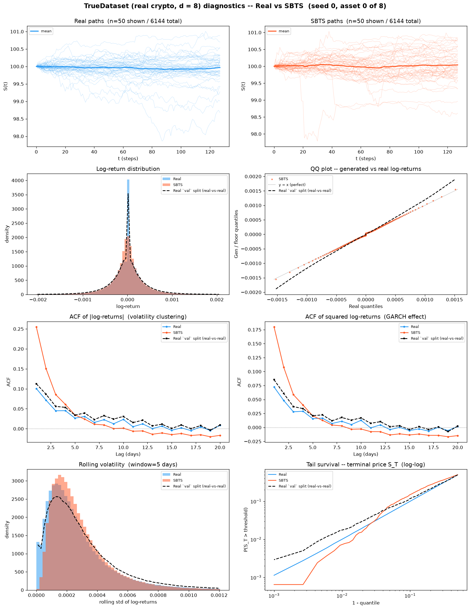
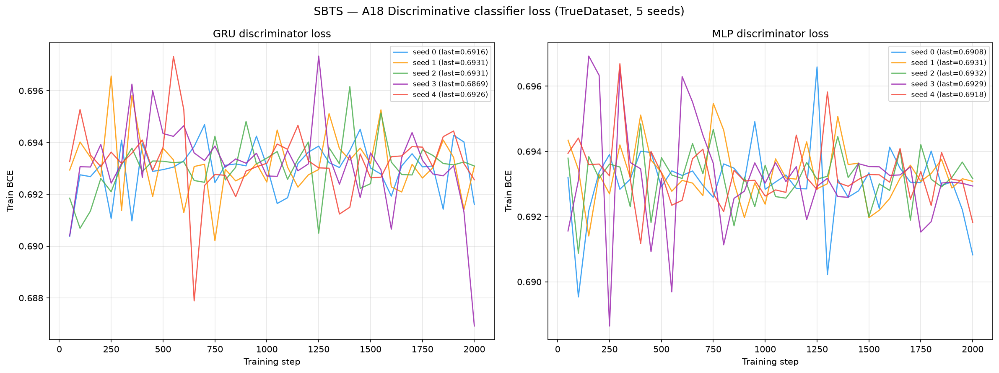
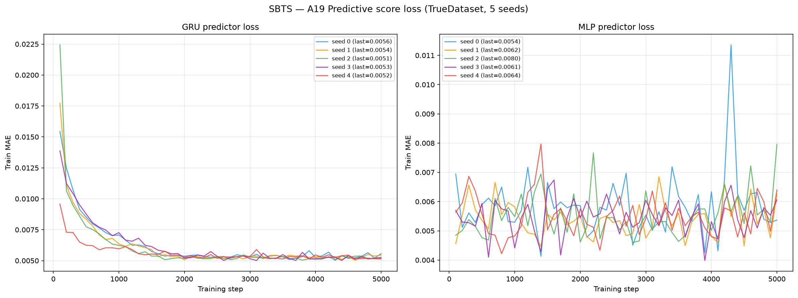

# SBTS on TrueDataset — real crypto spot, d = 8

**Schrödinger Bridge Time Series generation** (Alouadi, Barreau, Carlier & Pham, ICAIF 2025,
[arXiv:2503.02943](https://arxiv.org/abs/2503.02943)) applied to **real market data**:
6 144 paths of 8 correlated crypto spot series
(BTC, ETH, BNB, SOL, XRP, DOGE, ADA, LINK), 30-second bars, seq\_len = 128,
built from Binance public 1-second klines over 2022-07 → 2026-07.

This is the real-data counterpart of [`../HestonMultiAsset/SBTS/`](../HestonMultiAsset/SBTS/README.md).
Same generator, same metric code, same table layout — a different **question**. On Heston the
data-generating law is known, so "how close is the generator to the truth" has an exact answer.
Here it does not, so every reference in this README is a **real-vs-real** measurement: real
market data scored against other real market data through byte-identical code. Read
[`../truedatasetguideline.md`](../truedatasetguideline.md) before adding a method — it defines
the build, the five-split contract, the envelope, and what each reference column does and does
not mean.

SBTS is a **non-parametric, kernel-based** method: no neural network, no training loss,
no gradient descent, **no weights**. The "model" *is* the training array plus `(h, K, N_pi)`
— see [`weights/README.md`](weights/README.md).

> **Hyperparameters:** `h=0.07`, `K=1`, `N_pi=50`, `dt=1/1 051 200` (30-second bars, 1 051 200 bars/year).
> **`N_pi` is the author's** value. **`h` and `K` are ours**, re-selected here because neither
> can cross datasets: the SBTS kernel is radial, `K_h(x) = (h² − ‖x‖²)²·1{‖x‖₂ < h}`, so its
> support radius must scale with the typical distance between d-dimensional increments, and
> that distance is a property of the data, not of the method.
> The selection was run against the **real-vs-real envelope** (never against test), minimising
> `|log NNratio|` — the memorisation diagnostic — subject to both gated statistics staying
> inside the envelope. `K = 3` at `h = 0.05` produces the best volatility error in the whole
> grid (**6.06 %**, better than the real-vs-real *minimum* of 8.72 %) and is a **memorisation
> trap**: its NNratio is **0.197**, i.e. generated paths sit five times closer to the training
> set than held-out real data does. Anyone reading only the volatility column would pick it.
> Full grid, criterion and caveats:
> [`losses/bandwidth_selection_FINAL.json`](losses/bandwidth_selection_FINAL.json),
> [`losses/finalists_seed0.json`](losses/finalists_seed0.json) and
> [`losses/selection_criterion.md`](losses/selection_criterion.md).

---

## Metrics A1-A32 + B, mean ± std across 5 seeds

> All metrics on **log-returns** $r_t = \log(S_{t+1}/S_t)$ unless noted. A26 uses price increments $\Delta S_t$.
> Rows marked *(native d=8)* are evaluated **once** on the full `(N, T, 8)` tensor; every other
> row is computed on each of the 8 univariate slices and reported as the **mean over assets**
> (per-asset breakdown in [`metrics_per_asset.csv`](metrics_per_asset.csv)).
> **A33-A34 are absent, not failed.** They score the generated path against the dataset's
> *latent variance* path. A real market has none, so `compute_all_multiasset.py` skips them
> rather than fabricating a proxy.

| Metric | Mean ± Std | Seed 0 | Seed 1 | Seed 2 | Seed 3 | Seed 4 | Real-vs-real floor |
|---|---|---|---|---|---|---|---|
| **Fat Tail** | | | | | | | |
| A1 Kurtosis Error ↓ | 150.5 ± 62.69 | 228.8 | 176.7 | 42.13 | 129.1 | 175.7 | 259.6 |
| A2 \|r\| q95 Error ↓ | 1.50e-04 ± 1.66e-06 | 1.51e-04 | 1.50e-04 | 1.47e-04 | 1.51e-04 | 1.49e-04 | 1.85e-04 |
| A3 \|r\| q99 Error ↓ | 3.19e-04 ± 4.38e-06 | 3.21e-04 | 3.20e-04 | 3.11e-04 | 3.24e-04 | 3.21e-04 | 4.53e-04 |
| A4 Tail QQ Error ↓ | 1.62e-04 ± 1.23e-06 | 1.63e-04 | 1.62e-04 | 1.60e-04 | 1.63e-04 | 1.62e-04 | 1.94e-04 |
| A5 Hill Tail Index Error ↓ | 52.63 ± 11.05 | 55.97 | 49.45 | 72.06 | 39.67 | 46 | 39.99 |
| **Distribution** | | | | | | | |
| A6 Path MMD² ↓ *(native d=8)* | 0.003007 ± 3.94e-04 | 0.003579 | 0.002813 | 0.00292 | 0.003289 | 0.002437 | 0.00108 |
| A7 Terminal MMD² ↓ *(native d=8)* | 0.00822 ± 0.001185 | 0.00904 | 0.009322 | 0.007627 | 0.008953 | 0.00616 | 0.00199 |
| A8 Increment MMD² ↓ *(native d=8)* | 1.31e-05 ± 8.10e-07 | 1.33e-05 | 1.30e-05 | 1.25e-05 | 1.21e-05 | 1.45e-05 | 1.71e-05 |
| A9 Volatility MMD ↓ *(native d=8)* | 0.04406 ± 0.003151 | 0.04602 | 0.04746 | 0.03985 | 0.0463 | 0.04067 | 0.003092 |
| A10 Terminal SWD ↓ *(native d=8)* | 0.1501 ± 0.01114 | 0.1541 | 0.1573 | 0.1455 | 0.1627 | 0.1308 | 0.09816 |
| A11 Path SWD ↓ *(native d=8)* | 0.09562 ± 0.003978 | 0.09898 | 0.09363 | 0.09474 | 0.101 | 0.08977 | 0.06425 |
| A12 RV Law Loss ↓ | 0.006799 ± 2.72e-04 | 0.006736 | 0.006638 | 0.006419 | 0.007018 | 0.007183 | 0.00733 |
| A13 Mean Path RMSE ↓ | 0.0128 ± 0.001665 | 0.01115 | 0.01363 | 0.01235 | 0.01128 | 0.01561 | 0.01055 |
| A14 KS Log-returns ↓ | 0.07803 ± 1.41e-04 | 0.07822 | 0.0781 | 0.07788 | 0.07785 | 0.07809 | 0.06536 |
| A15 Skewness Error ↓ | 1.056 ± 0.2374 | 1.214 | 1.309 | 0.6307 | 1.138 | 0.9857 | 1.365 |
| A16 QQ RMSE (300-pt) ↓ | 9.58e-05 ± 9.30e-07 | 9.66e-05 | 9.61e-05 | 9.40e-05 | 9.64e-05 | 9.61e-05 | 1.08e-04 |
| A17 Terminal Price KS ↓ | 0.07703 ± 0.001093 | 0.07627 | 0.07668 | 0.07859 | 0.07564 | 0.07798 | 0.032 |
| **Adversarial** | | | | | | | |
| A18 Disc Score GRU ↓ *(native d=8)* | 0.007323 ± 0.00233 | 0.00773 | 0.005289 | 0.01017 | 0.004068 | 0.009357 | 0.01044 |
| A18 Disc Score MLP ↓ *(native d=8)* | 0.004069 ± 0.002831 | 0.008137 | 0.006103 | 0.003662 | 0 | 0.002441 | 0.003797 |
| **Predictive** | | | | | | | |
| A19 Pred Score GRU ↓ | 0.00357 ± 1.42e-05 | 0.003581 | 0.00357 | 0.003558 | 0.00359 | 0.003552 | 0.003637 |
| A19 Pred Score MLP ↓ | 0.003876 ± 5.01e-05 | 0.003873 | 0.003913 | 0.003913 | 0.00378 | 0.0039 | 0.003776 |
| **Temporal** | | | | | | | |
| A20 Covariance Error ↓ *(native d=8)* | 0.9965 ± 0.07298 | 1.026 | 1.057 | 1.08 | 0.8992 | 0.9207 | 1.157 |
| A21 ACF \|r\| Error (lags) ↓ | 0.05778 ± 5.46e-04 | 0.05827 | 0.05841 | 0.05718 | 0.05793 | 0.05709 | 0.009538 |
| A22 ACF r² Error (lags) ↓ | 0.0432 ± 3.94e-04 | 0.04324 | 0.04381 | 0.04289 | 0.04338 | 0.04268 | 0.006465 |
| A23 ACF \|r\| Lag-1 Error ↓ | 0.1379 ± 9.13e-04 | 0.1388 | 0.1384 | 0.1368 | 0.1386 | 0.1368 | 0.0123 |
| A24 ACF r² Lag-1 Error ↓ | 0.1035 ± 7.34e-04 | 0.1034 | 0.1041 | 0.1028 | 0.1045 | 0.1026 | 0.008313 |
| **Vol** | | | | | | | |
| A25 Mean RMSE ↓ *(native d=8)* | 0.06186 ± 0.01264 | 0.06155 | 0.06418 | 0.05795 | 0.04312 | 0.08251 | 0.04728 |
| A26 Return Std Error ↓ | 0.01094 ± 4.26e-04 | 0.01144 | 0.01101 | 0.01015 | 0.01101 | 0.01106 | 0.01284 |
| A27 Log-Return Std Error ↓ | 1.09e-04 ± 3.82e-06 | 1.13e-04 | 1.09e-04 | 1.02e-04 | 1.11e-04 | 1.10e-04 | 1.28e-04 |
| A28 Kurtosis Ratio (→ 1) | 0.5529 ± 0.2495 | 0.8095 | 0.4515 | 0.8872 | 0.351 | 0.2654 | 0.4156 |
| A29 Sigma Mean Error ↓ | 0.001683 ± 1.74e-05 | 0.001703 | 0.001692 | 0.001651 | 0.001684 | 0.001684 | 0.00146 |
| A30 Cross-Sect. Vol Path RMSE ↓ | 0.07302 ± 0.007161 | 0.08003 | 0.07068 | 0.06009 | 0.07673 | 0.07758 | 0.09316 |
| A31 Rolling Vol KS (w=5) ↓ | 0.1312 ± 1.13e-04 | 0.1312 | 0.1314 | 0.1313 | 0.1311 | 0.1311 | 0.1196 |
| A32 Vol-of-Vol Error ↓ | 6.66e-05 ± 2.30e-06 | 7.06e-05 | 6.53e-05 | 6.40e-05 | 6.74e-05 | 6.55e-05 | 1.04e-04 |

> **Convention:** ↓ lower is better; ↑ higher is better; no arrow = no monotone direction. A28 Kurtosis Ratio: perfect = 1.0.
> **Headline:** **16 of the 34 A-metric rows sit at or below the real-vs-real floor** — A1 Kurtosis Error, A2 |r| q95 Error, A3 |r| q99 Error, A4 Tail QQ Error, A8 Increment MMD², A12 RV Law Loss, A15 Skewness Error, A16 QQ RMSE (300-pt)…. The largest remaining gaps are **A9 Volatility MMD** (0.04406 vs floor 0.003092, 14.3×); **A24 ACF r² Lag-1 Error** (0.1035 vs floor 0.008313, 12.5×); **A23 ACF |r| Lag-1 Error** (0.1379 vs floor 0.0123, 11.2×); **A22 ACF r² Error (lags)** (0.0432 vs floor 0.006465, 6.7×).
> **What the "Real-vs-real floor" column is — read this before quoting it.** On Heston the floor is an *independent draw from the true SDE*: a genuine second sample of the data-generating law. **A real market has no law to re-draw from.** The column here is instead three **held-out real splits** — `train`, `val`, `valdisc` — pushed through the metric pipeline *as if they were generated banks* and scored against `test`, with byte-identical code. Three consequences you must not forget:
> 1. It is **not** a floor a generator ought to reach. It is the score a **perfect memoriser of the training era** achieves on the test era.
> 2. The build is **holdout-era** (train ends 2024-11-23, test starts 2025-02-10, 45.5-day embargo), so part of the distance is a genuine **regime change**, not finite-sample noise. Annualised vol falls from train to test on every asset (BTC 0.498 → 0.429, SOL 1.039 → 0.733). A generator that matched the *training* law perfectly would still score badly here — correctly so.
> 3. The `disc` split is **excluded on purpose**: it is the discriminator's real side, so using it as a fake bank would drive A18 to 0 by construction and manufacture an unreachable floor.
> **A1-A5**: fat-tail block — kurtosis error, tail quantile / QQ errors on |log-returns|, Hill tail index. **A6-A11** *(native d=8)*: path-kernel distances on the full 8-dimensional tensor (MMD² on paths / terminal / increments / realized-vol; sliced-Wasserstein on terminal & full paths), the rows where a multivariate generalisation is genuinely meaningful.
> **A12-A17**: distribution block, per asset then averaged. **A18** *(native d=8)*: discriminative classifier on all 8 channels at once, score = |accuracy − 0.5|, trained real=`disc` vs fake=generated. **A19**: TSTR MAE, deliberately **per-asset** — `predictive_score.py::_train_gru` targets `data_t[idx, 1:, :1]`, i.e. only the first feature, so a native run would silently report an asset-0-only number under a multi-asset name.
> **A20** *(native d=8)*: error on the full terminal covariance matrix — the row that actually tests whether the 28 realised cross-asset correlations (mean 0.609, range 0.515-0.801) survived generation. **A21-A24**: ACF |r|/r² errors. **A25** *(native d=8)*: mean RMSE across all assets jointly. **A26-A32**: volatility block. **A28** kurtosis ratio: perfect = 1.0.

---

## B, Curve-Shape Metrics, mean ± std across 5 seeds

Each stylised-fact plot yields a **curve** L (a list of values), not a scalar. The curve is
computed **per asset and averaged over the 8 assets** *before* the combination below, so the
combination rules stay byte-identical to the Heston tree. For the real data (L_r) and generated
data (L_g) we build three lists, the curve L, its first finite difference L' (der), and its
second finite difference L'' (sec\_der), then combine the three sub-scores into **one number
per plot**:

- **MSE row**: for each list, dᵢ = mean((L_r − L_g)²). Reported mean = the **mean of the three sub-scores** (funct + der + sec\_der)/3; std = the sample std of that per-seed combined score across the 5 seeds. The **MSE row decides the cross-method winner**.
- **% err row**: for each list, dᵢ = mean(|L_g − L_r| / (|L_r| + 1e-6)) × 100, a proper MAPE. Reported value = the **function-level MAPE on the curve L itself**; the derivative / 2nd-derivative MAPE is **excluded** because diff(L)/diff2(L) have near-zero true values, so their relative error explodes into meaningless 10⁴-% figures.
- **NRMSE row**: sqrt(mean((L_g − L_r)²)) / (max|L_r| − min|L_r| + 1e-12) × 100 on the curve L **only (funct-only)**.
- **CVaR₉₀ / CVaR₉₅ rows**: tail-averaged pointwise curve error (Expected Shortfall) on the curve L **only (funct-only)**. Pointwise error eₜ = |L_g(t) − L_r(t)|; for q ∈ {0.90, 0.95}, CVaR_q = mean(eₜ for eₜ ≥ the q-th percentile of eₜ), then range-normalized like NRMSE.

All ↓ lower is better. The reference column is the same **real-vs-real** construction as above, with the same three caveats.

| Plot | Measure | Mean ± Std | Seed 0 | Seed 1 | Seed 2 | Seed 3 | Seed 4 | Real-vs-real floor |
|---|---|---|---|---|---|---|---|---|
| **Path comparison** *(50×50 path-cloud)* | grid_tvd 50×50 (%) ↓ | 9.534% ± 0.4652% | 9.484% | 9.975% | 9.973% | 8.702% | 9.537% | 3.683% |
| **Log-return histogram** | MSE | 3.493e+05 ± 532.4 | 3.488e+05 | 3.498e+05 | 3.5e+05 | 3.49e+05 | 3.487e+05 | 3.806e+05 |
|  | % err | 2.494e+08% ± 8.655e+05% | 2.483e+08% | 2.504e+08% | 2.503e+08% | 2.49e+08% | 2.488e+08% | 1.765e+07% |
|  | NRMSE | 7.012% ± 0.009238% | 7.004% | 7.011% | 7.026% | 7.019% | 7.002% | 10.24% |
|  | CVaR₉₀ | 15.35% ± 0.03567% | 15.33% | 15.35% | 15.42% | 15.34% | 15.31% | 24.39% |
|  | CVaR₉₅ | 24.19% ± 0.055% | 24.11% | 24.19% | 24.27% | 24.22% | 24.15% | 35.63% |
| **QQ plot** | MSE | 5.26e-09 ± 1.67e-10 | 5.32e-09 | 5.31e-09 | 4.93e-09 | 5.39e-09 | 5.34e-09 | 7.92e-09 |
|  | % err | 685.2% ± 0.9942% | 686.3% | 684.6% | 683.7% | 686.2% | 685.4% | 326.6% |
|  | NRMSE | 4.245% ± 0.05426% | 4.29% | 4.249% | 4.14% | 4.281% | 4.265% | 5.085% |
|  | CVaR₉₀ | 4.283% ± 0.05987% | 4.336% | 4.289% | 4.169% | 4.327% | 4.293% | 5.59% |
|  | CVaR₉₅ | 5.445% ± 0.1026% | 5.526% | 5.46% | 5.246% | 5.517% | 5.479% | 7.278% |
| **ACF \|r\|** | MSE | 7.65e-04 ± 8.25e-06 | 7.73e-04 | 7.68e-04 | 7.60e-04 | 7.73e-04 | 7.52e-04 | 5.48e-05 |
|  | % err | 390% ± 3.387% | 388% | 394.2% | 390.8% | 384.6% | 392.5% | 237.1% |
|  | NRMSE | 51.5% ± 0.5236% | 52% | 51.99% | 50.9% | 51.78% | 50.83% | 11.29% |
|  | CVaR₉₀ | 121.5% ± 1.185% | 122.6% | 122.8% | 120.1% | 122% | 120.2% | 17.29% |
|  | CVaR₉₅ | 163.8% ± 1.107% | 164.8% | 164.5% | 162.6% | 164.8% | 162.4% | 18.72% |
| **ACF r²** | MSE | 4.25e-04 ± 5.26e-06 | 4.25e-04 | 4.25e-04 | 4.23e-04 | 4.34e-04 | 4.18e-04 | 3.14e-05 |
|  | % err | 3021% ± 155.1% | 2992% | 3065% | 2866% | 2887% | 3296% | 321.1% |
|  | NRMSE | 46.16% ± 0.4136% | 46.31% | 46.69% | 45.79% | 46.44% | 45.58% | 9.25% |
|  | CVaR₉₀ | 107.9% ± 0.9459% | 108.2% | 109.3% | 106.9% | 108.4% | 106.7% | 14.23% |
|  | CVaR₉₅ | 145.9% ± 1.064% | 145.8% | 146.8% | 145% | 147.3% | 144.4% | 15.52% |
| **Rolling vol histogram** | MSE | 3.308e+04 ± 136.7 | 3.286e+04 | 3.318e+04 | 3.298e+04 | 3.324e+04 | 3.313e+04 | 3.897e+04 |
|  | % err | 32.57% ± 0.1618% | 32.42% | 32.66% | 32.84% | 32.48% | 32.44% | 42.82% |
|  | NRMSE | 11.31% ± 0.01637% | 11.28% | 11.32% | 11.32% | 11.3% | 11.3% | 10% |
|  | CVaR₉₀ | 29.09% ± 0.05076% | 29.01% | 29.13% | 29.15% | 29.1% | 29.06% | 25.83% |
|  | CVaR₉₅ | 35.9% ± 0.0435% | 35.91% | 35.88% | 35.89% | 35.98% | 35.85% | 31.15% |
| **Tail survival** | MSE | 0.003772 ± 2.72e-06 | 0.003774 | 0.003776 | 0.003772 | 0.003768 | 0.003771 | 0.002323 |
|  | % err | 17.53% ± 0.06977% | 17.63% | 17.54% | 17.41% | 17.55% | 17.5% | 17.91% |
|  | NRMSE | 10.79% ± 0.005985% | 10.79% | 10.8% | 10.78% | 10.79% | 10.79% | 8.573% |
|  | CVaR₉₀ | 18.72% ± 0.01049% | 18.73% | 18.73% | 18.7% | 18.72% | 18.72% | 14.21% |
|  | CVaR₉₅ | 19.19% ± 0.01073% | 19.2% | 19.21% | 19.18% | 19.19% | 19.2% | 14.69% |

> **Headline:** **3 of the 6 B plots** sit at or below the real-vs-real reference on the deciding MSE row: Log-return histogram, QQ plot, Rolling vol histogram.
> **Cross-seed stability**: SBTS is a deterministic kernel with no gradient descent, so the only seed-to-seed variation is the simulation noise of the Euler-Maruyama draw — there are no seed-collapse events of the kind a GAN can suffer.

---

## C, Conditional generation — forecast CRPS by path shadowing

Every number above scores the **unconditional** law: does the generated cloud look like the
real cloud? That is not the question a trading desk asks. This table scores **conditional
skill**: given a real history, does the generator's conditional distribution of the *next*
32 returns beat a purely historical resampler?

Protocol is the paper's §3.3.1 (Deep-MKV-TS, Table 4), reproduced exactly:

- Take the first **65 log-prices** of each of the 6 144 test paths as the query history.
- Retrieve the **256 nearest** histories from a pool of **8 192** paths, by Euclidean distance
  over four standardized feature blocks computed on the bank itself: the last 32 returns
  (w=1.0), a 24-point subsampled path shape (w=0.5), rolling volatility over 5-, 10- and
  20-step windows (w=2.0), and absolute/squared-return autocorrelations at lags 1, 2, 5, 10
  (w=1.0). Per-asset feature dim 73, × 8 assets = **584**.
- Use those neighbours' **next 32 returns** as the predictive ensemble and score it with CRPS.
- Compare against the paper's **two historical baselines**, both built from the training split
  only and both sized 8 192: a **moving-block bootstrap** (blocks of 8 consecutive returns,
  each drawn from a random training day, kept at its original intraday position) and a
  **session bootstrap** (an entire training day resampled whole).

Three targets: cumulative return over the horizon, the 32 individual increments, and
**realized volatility, `sqrt(sum_t r²_{t,a})` — summed over TIME, one scalar per asset**.
All ×1000, lower is better.
Brackets are the **95 % bootstrap CI over the 6 144 queries** (2 000 replicates, seed 0).

> **Corrected 2026-08-26.** The rv target previously summed the squared increments over
> **assets** at each step, giving a `(N, 32)` cross-sectional dispersion trajectory. The
> author sums over **time** (`shadowing.py:579-601`: `raw_shadows` is `(B, K, h+1, A)` and
> the reduction is on the TIME axis), giving `(N, 8)`. At d = 1 the author's quantity is
> realized vol over the window; the old one collapsed to `|r_t|` — a different statistic.
> This changed the SBTS/block-bootstrap rv ratio from 0.972 to the value tabulated below.
> Cumulative return and increments are unaffected and are bit-identical to the previous run.

| Bank | Bank size | Cumulative return CRPS ×1000 ↓ | Increment CRPS ×1000 ↓ | Realized vol CRPS ×1000 ↓ |
|---|---|---|---|---|
| **SBTS** (mean ± sd over 4 seeds) | 8 192 | **1.270 ± 0.001** | **0.337 ± 0.000** | **1.045 ± 0.007** |
|  seed 0 | 8 192 | 1.270 [1.245, 1.295] | 0.337 [0.333, 0.342] | 1.045 [1.021, 1.072] |
|  seed 1 | 8 192 | 1.271 [1.247, 1.297] | 0.337 [0.333, 0.342] | 1.052 [1.028, 1.080] |
|  seed 2 | 8 192 | 1.269 [1.244, 1.294] | 0.337 [0.333, 0.342] | 1.046 [1.021, 1.074] |
|  seed 3 | 8 192 | 1.269 [1.245, 1.294] | 0.337 [0.332, 0.342] | 1.035 [1.010, 1.062] |
| Moving-block bootstrap *(paper baseline)* | 8 192 | 1.279 [1.255, 1.304] | 0.338 [0.334, 0.343] | 1.110 [1.087, 1.135] |
| Session bootstrap *(paper baseline)* | 8 192 | 1.262 [1.236, 1.289] | 0.337 [0.332, 0.341] | 0.975 [0.949, 1.003] |
| Real training split as bank *(reference, not in the paper)* | 6 144 | 1.257 [1.232, 1.284] | 0.335 [0.331, 0.340] | 0.970 [0.944, 0.998] |

> **Headline:** SBTS beats the moving-block bootstrap on **3 of the 3 targets** (Cumulative return, Increment, Realized vol). Ratios: Cumulative return **0.993**, Increment **0.997**, Realized vol **0.941**. **The session bootstrap is the harder baseline and SBTS loses to it on 3 of the 3 targets** (Cumulative return, Increment, Realized vol): Cumulative return **1.006**, Increment **1.002**, Realized vol **1.072**. Resampling whole real training days, with no model at all, forecasts this panel better than the generator does.
> **The ratio row is the number that transfers**, not the absolute CRPS. Absolute CRPS is set by
> the intrinsic unpredictability of the market and the units of the data; the ratio against the
> block bootstrap is dimensionless, which is why the paper reports SBTS and the bootstraps side
> by side for all three indices. The paper's own SBTS loses to the block bootstrap on cumulative
> return for NQ (1.088) and YM (1.087) and wins on realized vol everywhere (0.808 / 0.916 / 0.946).
> **The window is narrow, and that is a finding, not a caveat.** The *real training split used
> directly as the bank* — a bank that cannot be beaten by any generator fit on that same split —
> scores within ~2 % of the block bootstrap on cumulative return and ~1 % on increments. Only
> realized vol leaves meaningful room. A generator that "wins" by 0.5 % on cumulative return has
> not demonstrated conditional skill; it has demonstrated that the metric is saturated there.
> **Bank size is not a lever.** Measured on this build with K = 256 fixed, CRPS moves by 0.4 %
> across an 8× range of bank size (1 536 → 12 288) — averaging 256 neighbours makes the ensemble
> spread depend on intrinsic unpredictability, not on retrieval sharpness. The value is pinned to
> the paper's 8 192 anyway, so the comparison is like-for-like.
> **One deliberate deviation from the author's code:** retrieval is **joint across assets** (one
> 584-dim feature vector per path). The author's `real_data_protocol.py:513` hard-raises for
> d ≠ 1, so there is no reference behaviour to copy; per-asset retrieval would answer a different
> question (8 independent univariate forecasts) and would discard exactly the cross-asset
> structure this dataset exists to test.

> **Retrieval convention.** The paper weights each feature block by `sqrt(w)` on every
> coordinate, so a block's real influence is its weight x its length. The alternative that
> divides by the block length was run on the same banks and is stored alongside
> (`losses/crps_configs/perdim__*.json`); it changes the ratios by under one percent, so the
> table above stands. The paper's convention is what is reported.

---

## Memorisation check

SBTS is a kernel method: the bandwidth `h` is exactly the knob that trades fit
against copying, and a small enough `h` wins every table above by reproducing the
training set. On the Heston tree, a score below the floor exposes that. **Here it
does not** -- see the floor caption -- so this number is the only guard, and it is
reported whatever it says.

```
NNratio = median NN(generated -> train) / median NN(val -> train)
          log-returns, flattened to (T-1)*d = 1016 dims
```

| Seed | median NN(gen → train) | NNratio (vs `val`) | vs `test` era | Exact duplicates |
|------|-----------------------:|-------------------:|--------------:|-----------------:|
| 0 | 0.020579 | 1.0863 | 1.1661 | 0 |
| 1 | 0.020540 | 1.0843 | 1.1639 | 0 |
| 2 | 0.020421 | 1.0780 | 1.1572 | 0 |
| 3 | 0.020525 | 1.0835 | 1.1631 | 0 |
| 4 | 0.020367 | 1.0752 | 1.1541 | 0 |
| **mean** | **0.020486** | **1.0815 ± 0.0042** | **1.1609** | **0** |

**NNratio = 1.081 ± 0.004**, against a real-vs-real band of **0.932–1.000**. It sits **above** the band -- generated paths are *further* from the training set than real data is, which is the opposite failure from copying.

The band is not a chosen tolerance. Its endpoints are what the real splits score
against each other: `median NN(test → train) / median NN(val → train)` = 0.932, and
`val` against itself = 1.000. Zero free parameters, the same construction as the
floor column.

> **The denominator is `val`, not `test`, and the direction is counter-intuitive.**
> `val` is the same era as train; `test` is the later era. Measured, `test` sits
> *closer* to train than `val` does (0.017647 vs 0.018943) — not because it
> resembles the training data more, but because annualised vol **falls** between the
> eras on 6 of 8 assets, so returns shrink and every distance contracts with them.
> A smaller denominator inflates the ratio: these same banks score 1.081 against
> `val` and 1.161 against `test`. Since memorisation is the *low*-ratio
> failure, a `test` denominator would push a copying generator toward the
> healthy-looking end. Both are in the table; only `val` decides the verdict, and it
> is the denominator the (h, K) sweep was scored against.

**0 exact duplicates does not clear the method.** SBTS interpolates between
training paths, so its failure mode is near-copies, not copies. The ratio is the
number that matters: the rejected candidate `K=3, h=0.05` also had 0 duplicates
while scoring NNratio 0.197.

---

## Stylised Facts Diagnostic (TrueDataset vs SBTS, seed 0, asset 0)

Eight-panel comparison: sample paths, return distribution, QQ plot, ACF of |returns|,
ACF of squared returns, rolling vol histogram (window=5), tail survival (log-log).

The third (black dashed) curve is the real **`val`** split, not a theory curve — there is no
closed form for BTC. It is drawn from `real_floor/generated_paths/seed_1`, chosen explicitly:
the floor's seed 0 is the *training* split, so plotting it here and calling it held-out would
be false. The legend is read from that directory's `metadata.json`, not hardcoded. **One asset is shown, not eight**: the *metrics* are averaged over all 8
assets, the *figure* is asset 0 (BTCUSDT). Pooling eight assets whose annualised vol spans
0.43-0.92 into one histogram would show the mixing, not the model.



---

## SBTS has no training loss

SBTS is kernel-based; there is no loss curve. The bandwidth `h`, Markovian order `K` and Euler
substeps `N_pi` are the only knobs: **h=0.07, K=1, N_pi=50**. The `losses/` directory holds the
per-seed hyperparameter records and the complete selection evidence, which for a method with no
training curve *is* the reproducibility trail.

Generation wall-clock (32 workers, 5 seeds, **44 min total**):

| Seed | Workers | Elapsed |
|------|---------|---------|
| 0 | 32 | 9.1 min |
| 1 | 32 | 8.9 min |
| 2 | 32 | 9.0 min |
| 3 | 32 | 8.8 min |
| 4 | 32 | 8.7 min |

---

## A18, Discriminative Classifier Training Loss

BCE loss during GRU and MLP classifier training (2 000 steps, logged every 50 steps).
A value near ln(2) ≈ 0.693 means the classifier cannot distinguish real from fake.
The classifier is **native**: it sees all 8 channels at once, and its real side is the
`disc` split, never `test`.



---

## A19, Predictive Score Training Loss (TSTR)

MAE loss during GRU and MLP predictor training on *synthetic* data (5 000 steps, logged every 100 steps).
The predictor is run **once per asset**; the curves archived here are **asset 0's**, since the
driver stores the loss history only for `j == 0`. The A19 score in the table above is the mean
over all 8 assets.



---

## File layout

```
results/trueexperiment/
├── truedatasetguideline.md               ← read this before adding a method
├── real_floor/                           real-vs-real reference (3 held-out real splits)
│   ├── generated_paths/seed_{0..2}/     symlinks to train / val / valdisc
│   ├── metrics_summary.csv
│   ├── curve_b_aggregate.json
│   └── grid_tvd_aggregate.json
└── SBTS/
    ├── README.md                         ← this file (generated by code/render_readme.py)
    ├── code/
    │   ├── README.md                     source notes, hyperparameters, deviations
    │   ├── sbts_generate_true.py         core module: radial kernel, per-asset sigma
    │   ├── generate_bank_true.py         driver for one bank at the calibrated (h, K)
    │   ├── calibrate_bandwidth_true.py   the (h, K) grid under the real-vs-real envelope
    │   ├── collect_artifacts.py          metadata.json -> losses/ bookkeeping
    │   ├── plot_diagnostics_true.py      the 8-panel stylised-facts figure
    │   ├── measure_memorisation.py       NN ratio vs the val split (same era as train)
    │   └── render_readme.py              regenerates this README from the artefacts
    ├── generated_paths/seed_{0..4}/
    │   ├── generated_paths_6144x128x8.npy   (6144, 128, 8) float64 — gitignored, 50 MB
    │   └── metadata.json                    seed, h, K, N_pi, sigma, shape, min/max, elapsed (tracked)
    ├── crps_banks/generated_paths/seed_{0..3}/
    │   └── generated_paths_8192x128x8.npy   the paper's 8 192-path pool — gitignored, 67 MB
    ├── losses/
    │   ├── seed_{i}_bandwidth.json          h, K, N_pi, dt — no loss (kernel method)
    │   ├── bandwidth_selection_FINAL.json   full (h, K) grid + admissibility verdict
    │   ├── finalists_seed{0,1,2}.json       3-seed re-measurement of the top candidates
    │   ├── selection_criterion.md           pre-registered criterion and its caveats
    │   ├── envelope_by_split_mode.json      real-vs-real envelope, interleaved vs holdout-era
    │   ├── conditional_crps_seed_{i}.json   table C, one file per SBTS bank
    │   ├── conditional_crps_realbank.json   table C, real training split used as the bank
    │   ├── memorisation.json                NN ratio -- the objective (h, K) were picked on
    │   ├── dataset_stats.json               copy of the locked build's stats (provenance)
    │   └── generation_time.csv              wall-clock per seed
    ├── plots/
    │   ├── truedata_diagnostics.png      8-panel stylised facts (seed 0, asset 0 = BTCUSDT)
    │   ├── disc_classifier_loss.png      A18 BCE curves
    │   └── pred_score_loss.png           A19 MAE curves (asset 0)
    ├── weights/README.md                 why there are none
    ├── metrics_summary.csv               A1-A32, mean ± std, per seed
    ├── metrics_per_asset.csv             per-metric × per-asset breakdown (8 rows per metric)
    ├── curve_b_aggregate.json            B curve-shape aggregate
    ├── grid_tvd_aggregate.json           path-cloud TVD
    └── seed_{i}_metrics.json             full per-seed dump incl. the per_asset block
```

The `.npy` arrays are **gitignored**: `(6144, 128, 8)` float64 = 50 MB each, and LFS was ruled
out on 2026-07-30. They are fully reproducible from the tracked code and tracked
hyperparameters; the `metadata.json` beside each array **is** tracked, so shapes, price ranges
and generation times stay auditable without the payload. The raw Binance archive is not
committed either — `dataset/TrueDataset/` rebuilds it from `data.binance.vision`.

## Reproduce

```bash
cd /home/tbasseras/benchmark
V=dataset/TrueDataset/variants/om_2022-07_N6144
TAG=6144x128x8
R=results/trueexperiment

# 1. dataset — downloads Binance 1s klines and builds the 5 splits.
#    Only if $V/*.npy are absent. See dataset/TrueDataset/README.md.
/home/tbasseras/.cc-venv/bin/python dataset/TrueDataset/build_true_dataset.py \
    --period 2022-07:2026-07 --n-samples 6144 --split-mode holdout-era

# 2. (h, K) calibration against the real-vs-real envelope — never against test.
/home/tbasseras/sbts-venv/bin/python $R/SBTS/code/calibrate_bandwidth_true.py \
    --data-dir $V --seq-tag $TAG --grid 0.06,0.07,0.08 --K-grid 1 \
    --m-probe 2048 --workers 32 --out $R/SBTS/losses/finalists_seed0.json

# 3. generate the 5 scoring banks — CPU only, no GPU. ~44 min total.
for S in 0 1 2 3 4; do
  setsid taskset -c 0-31 env OMP_NUM_THREADS=1 MKL_NUM_THREADS=1 \
    NUMBA_NUM_THREADS=1 /home/tbasseras/sbts-venv/bin/python \
    $R/SBTS/code/generate_bank_true.py --data-dir $V --seq-tag $TAG \
    --h 0.07 --K 1 --seed $S --workers 32 --out-root $R/SBTS
done
/home/tbasseras/.cc-venv/bin/python $R/SBTS/code/collect_artifacts.py

# 4. real-vs-real reference: three held-out REAL splits as stand-in banks.
for i in 0 1 2; do mkdir -p $R/real_floor/generated_paths/seed_$i; done
ln -sf $PWD/$V/true_S_$TAG.npy          $R/real_floor/generated_paths/seed_0/generated_paths_$TAG.npy
ln -sf $PWD/$V/true_S_val_$TAG.npy      $R/real_floor/generated_paths/seed_1/generated_paths_$TAG.npy
ln -sf $PWD/$V/true_S_valdisc_$TAG.npy  $R/real_floor/generated_paths/seed_2/generated_paths_$TAG.npy

# 5. metrics — both sides go through byte-identical code.
for M in SBTS real_floor; do
  N=$([ $M = SBTS ] && echo 5 || echo 3)
  CUDA_VISIBLE_DEVICES=0 /home/tbasseras/gpu-venv/bin/python \
    metrics/compute_all_multiasset.py --method $M --dataset TrueDataset --seeds $N \
    --data-dir $V --seq-tag $TAG --dt 9.51293759512e-07 --results-dir $R/$M
done

# 6. conditional CRPS (table C) — the paper's 8 192-path pool, 4 seeds.
for S in 0 1 2 3; do
  /home/tbasseras/sbts-venv/bin/python $R/SBTS/code/generate_bank_true.py \
    --data-dir $V --seq-tag $TAG --h 0.07 --K 1 --seed $S --m-simu 8192 \
    --workers 24 --out-root $R/SBTS/crps_banks
  /home/tbasseras/gpu-venv/bin/python metrics/conditional_crps_multiasset.py \
    --data-dir $V --seq-tag $TAG --bank-size 8192 --label SBTS \
    --bank $R/SBTS/crps_banks/generated_paths/seed_$S/generated_paths_8192x128x8.npy \
    --out $R/SBTS/losses/conditional_crps_seed_$S.json
done
# ... and the reference every row in table C is read against: the real TRAIN
# split used as the bank. Native size 6144 -- that is all the data there is --
# and --bank-size matches so the two bootstrap baselines are measured at the
# same bank size rather than a larger one.
/home/tbasseras/gpu-venv/bin/python metrics/conditional_crps_multiasset.py \
    --data-dir $V --seq-tag $TAG --bank-size 6144 --label real_train_bank \
    --bank $V/true_S_$TAG.npy --out $R/SBTS/losses/conditional_crps_realbank.json

# 7. memorisation -- the guard that stops a small h from winning table A by
#    copying. Denominator is the val split, NOT test. Measured, test sits CLOSER
#    to train than val does (0.017647 vs 0.018943) because annualised vol falls
#    across the era break, so a test denominator is SMALLER and inflates the
#    ratio -- which flatters a memoriser, since memorisation is the low-ratio
#    failure. See the Memorisation check section.
/home/tbasseras/gpu-venv/bin/python $R/SBTS/code/measure_memorisation.py \
    --data-dir $V --seq-tag $TAG --seeds 0,1,2,3,4

# 8. figures
/home/tbasseras/gpu-venv/bin/python $R/SBTS/code/plot_diagnostics_true.py \
    --data-dir $V --seq-tag $TAG
/home/tbasseras/gpu-venv/bin/python metrics/plot_score_losses.py \
    --method SBTS --dataset TrueDataset --results-dir $R/SBTS

# 9. regenerate this README from the artefacts
/home/tbasseras/gpu-venv/bin/python $R/SBTS/code/render_readme.py
```
